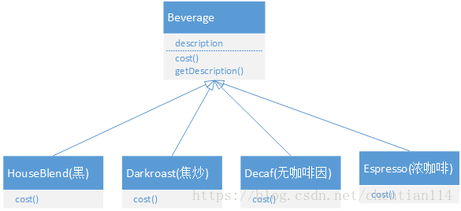
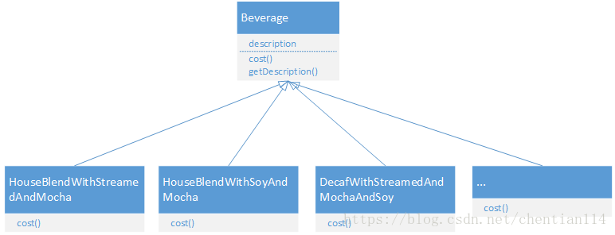
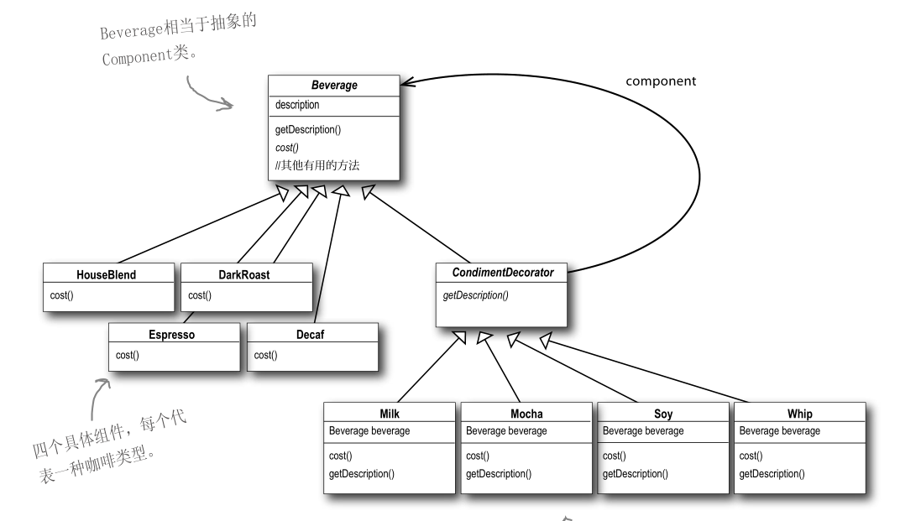

## 1. 开头

​	单例模式用来创建全局唯一的对象。工厂模式用来创建不同但是相关类型的对象（继承同一父类或者接口的一组子类），由给定的参数来决定创建哪种类型的对象。建造者模式是用来创建复杂对象，可以通过设置不同的可选参数，“定制化”地创建不同的对象。原型模式针对创建成本比较大的对象，利用对已有对象进行复制的方式进行创建，以达到节省创建时间的目的。

​	另外一种类型的设计模式：结构型模式。结构型模式主要总结了一些类或对象组合在一起的经典结构，这些经典的结构可以解决特定应用场景的问题。结构型模式包括：代理模式、桥接模式、装饰器模式、适配器模式、门面模式、组合模式、享元模式。今天我们要讲其中的代理模式。它也是在实际开发中经常被用到的一种设计模式。


## 2. 代理模式

### 2.1. 基本定义

**代理模式**（Proxy Design Pattern）的原理和代码实现都不难掌握。它在不改变原始类（或叫被代理类）代码的情况下，通过引入代理类来给原始类附加功能

### 2.2. 静态代理

### 2.3. 动态代理

一方面，我们需要在代理类中，将原始类中的所有的方法，都重新实现一遍，并且为每个方法都附加相似的代码逻辑。另一方面，如果要添加的附加功能的类有不止一个，我们需要针对每个类都创建一个代理类。

如果有 50 个要添加附加功能的原始类，那我们就要创建 50 个对应的代理类。这会导致项目中类的个数成倍增加，增加了代码维护成本。并且，每个代理类中的代码都有点像模板式的“重复”代码，也增加了不必要的开发成本。那这个问题怎么解决呢？

我们可以使用动态代理来解决这个问题。所谓**动态代理**（Dynamic Proxy），就是我们不事先为每个原始类编写代理类，而是在运行的时候，动态地创建原始类对应的代理类，然后在系统中用代理类替换掉原始类。那如何实现动态代理呢？

如果你熟悉的是 Java 语言，实现动态代理就是件很简单的事情。因为 Java 语言本身就已经提供了动态代理的语法（实际上，动态代理底层依赖的就是 Java 的反射语法）。我们来看一下，如何用 Java 的动态代理来实现刚刚的功能。具体的代码如下所示。其中，MetricsCollectorProxy 作为一个动态代理类，动态地给每个需要收集接口请求信息的类创建代理类。

```
public class MetricsCollectorProxy {
  private MetricsCollector metricsCollector;
  public MetricsCollectorProxy() {
    this.metricsCollector = new MetricsCollector();
  }
  public Object createProxy(Object proxiedObject) {
    Class<?>[] interfaces = proxiedObject.getClass().getInterfaces();
    DynamicProxyHandler handler = new DynamicProxyHandler(proxiedObject);
    return Proxy.newProxyInstance(proxiedObject.getClass().getClassLoader(), interfaces, handler);
  }
  private class DynamicProxyHandler implements InvocationHandler {
    private Object proxiedObject;
    public DynamicProxyHandler(Object proxiedObject) {
      this.proxiedObject = proxiedObject;
    }
    @Override
    public Object invoke(Object proxy, Method method, Object[] args) throws Throwable {
      long startTimestamp = System.currentTimeMillis();
      Object result = method.invoke(proxiedObject, args);
      long endTimeStamp = System.currentTimeMillis();
      long responseTime = endTimeStamp - startTimestamp;
      String apiName = proxiedObject.getClass().getName() + ":" + method.getName();
      RequestInfo requestInfo = new RequestInfo(apiName, responseTime, startTimestamp);
      metricsCollector.recordRequest(requestInfo);
      return result;
    }
  }
}
//MetricsCollectorProxy使用举例
MetricsCollectorProxy proxy = new MetricsCollectorProxy();
IUserController userController = (IUserController) proxy.createProxy(new UserController());
```

### 2.4. 使用场景

#### 2.4.1. 功能增强

代理模式最常用的一个应用场景就是，在业务系统中开发一些非功能性需求，比如：监控、统计、鉴权、限流、事务、幂等、日志。我们将这些附加功能与业务功能解耦，放到代理类中统一处理，让程序员只需要关注业务方面的开发。实际上，前面举的搜集接口请求信息的例子，就是这个应用场景的一个典型例子。

如果你熟悉 Java 语言和 Spring 开发框架，这部分工作都是可以在 Spring AOP 切面中完成的。前面我们也提到，Spring AOP 底层的实现原理就是基于动态代理

#### 2.4.2.  RPC

**实际上，RPC 框架也可以看作一种代理模式**，GoF 的《设计模式》一书中把它称作远程代理。通过远程代理，将网络通信、数据编解码等细节隐藏起来。客户端在使用 RPC 服务的时候，就像使用本地函数一样，无需了解跟服务器交互的细节。除此之外，RPC 服务的开发者也只需要开发业务逻辑，就像开发本地使用的函数一样，不需要关注跟客户端的交互细节。

#### 2.4.3. 缓存

**我们再来看代理模式在缓存中的应用。**

假设我们要开发一个接口请求的缓存功能，对于某些接口请求，如果入参相同，在设定的过期时间内，直接返回缓存结果，而不用重新进行逻辑处理。

比如，针对获取用户个人信息的需求，我们可以开发两个接口，一个支持缓存，一个支持实时查询。对于需要实时数据的需求，我们让其调用实时查询接口，对于不需要实时数据的需求，我们让其调用支持缓存的接口。那如何来实现接口请求的缓存功能呢？

最简单的实现方法就是刚刚我们讲到的，给每个需要支持缓存的查询需求都开发两个不同的接口，一个支持缓存，一个支持实时查询。但是，这样做显然增加了开发成本，而且会让代码看起来非常臃肿（接口个数成倍增加），也不方便缓存接口的集中管理（增加、删除缓存接口）、集中配置（比如配置每个接口缓存过期时间）。

针对这些问题，代理模式就能派上用场了，确切地说，应该是动态代理。如果是基于 Spring 框架来开发的话，那就可以在 AOP 切面中完成接口缓存的功能。在应用启动的时候，我们从配置文件中加载需要支持缓存的接口，以及相应的缓存策略（比如过期时间）等。当请求到来的时候，我们在 AOP 切面中拦截请求，如果请求中带有支持缓存的字段（比如 http://…?..&cached=true），我们便从缓存（内存缓存或者 Redis 缓存等）中获取数据直接返回.

### 2.5. 小结

* **代理模式的原理与实现**

  在不改变原始类（或叫被代理类）的情况下，通过引入代理类来给原始类附加功能。一般情况下，我们让代理类和原始类实现同样的接口。但是，如果原始类并没有定义接口，并且原始类代码并不是我们开发维护的。在这种情况下，我们可以通过让代理类继承原始类的方法来实现代理模式。

* **动态代理的原理与实现**

  静态代理需要针对每个类都创建一个代理类，并且每个代理类中的代码都有点像模板式的“重复”代码，增加了维护成本和开发成本。对于静态代理存在的问题，我们可以通过动态代理来解决。我们不事先为每个原始类编写代理类，而是在运行的时候动态地创建原始类对应的代理类，然后在系统中用代理类替换掉原始类。

* **代理模式的应用场景**

  代理模式常用在业务系统中开发一些非功能性需求，比如：监控、统计、鉴权、限流、事务、幂等、日志。我们将这些附加功能与业务功能解耦，放到代理类统一处理，让程序员只需要关注业务方面的开发。除此之外，代理模式还可以用在 RPC、缓存等应用场景中

## 3. 桥接模式

### 3.1. 定义

基本定义为：**将抽象和实现解耦，让它们可以独立变化**

关于桥接模式，很多书籍、资料中，还有另外一种理解方式：“一个类存在两个（或多个）独立变化的维度，我们通过组合的方式，让这两个（或多个）维度可以独立进行扩展。”通过组合关系来替代继承关系，避免继承层次的指数级爆炸。这种理解方式非常类似于，我们之前讲过的“组合优于继承”设计原则

### 3.2. 案例

#### 3.2.1. JDBC

* mysql驱动使用

  ```
  Class.forName("com.mysql.jdbc.Driver");//加载及注册JDBC驱动程序
  String url = "jdbc:mysql://localhost:3306/sample_db?user=root&password=your_password";
  Connection con = DriverManager.getConnection(url);
  Statement stmt = con.createStatement()；
  String query = "select * from test";
  ResultSet rs=stmt.executeQuery(query);
  while(rs.next()) {
    rs.getString(1);
    rs.getInt(2);
  }
  ```

* mysql驱动

  ```
  package com.mysql.jdbc;
  import java.sql.SQLException;
  public class Driver extends NonRegisteringDriver implements java.sql.Driver {
    static {
      try {
        java.sql.DriverManager.registerDriver(new Driver());
      } catch (SQLException E) {
        throw new RuntimeException("Can't register driver!");
      }
    }
    /**
     * Construct a new driver and register it with DriverManager
     * @throws SQLException if a database error occurs.
     */
    public Driver() throws SQLException {
      // Required for Class.forName().newInstance()
    }
  }
  
  ```

* driver manager

  ```
  public class DriverManager {
    private final static CopyOnWriteArrayList<DriverInfo> registeredDrivers = new CopyOnWriteArrayList<DriverInfo>();
    //...
    static {
      loadInitialDrivers();
      println("JDBC DriverManager initialized");
    }
    //...
    public static synchronized void registerDriver(java.sql.Driver driver) throws SQLException {
      if (driver != null) {
        registeredDrivers.addIfAbsent(new DriverInfo(driver));
      } else {
        throw new NullPointerException();
      }
    }
    public static Connection getConnection(String url, String user, String password) throws SQLException {
      java.util.Properties info = new java.util.Properties();
      if (user != null) {
        info.put("user", user);
      }
      if (password != null) {
        info.put("password", password);
      }
      return (getConnection(url, info, Reflection.getCallerClass()));
    }
    //...
  }
  
  ```

  当我们把具体的 Driver 实现类（比如，com.mysql.jdbc.Driver）注册到 DriverManager 之后，后续所有对 JDBC 接口的调用，都会委派到对具体的 Driver 实现类来执行。而 Driver 实现类都实现了相同的接口（java.sql.Driver ），这也是可以灵活切换 Driver 的原因

桥接模式的定义是“将抽象和实现解耦，让它们可以独立变化”。那弄懂定义中“抽象”和“实现”两个概念，就是理解桥接模式的关键。那在 JDBC 这个例子中，什么是“抽象”？什么是“实现”呢？

实际上，JDBC 本身就相当于“抽象”。注意，这里所说的“抽象”，指的并非“抽象类”或“接口”，而是跟具体的数据库无关的、被抽象出来的一套“类库”。具体的 Driver（比如，com.mysql.jdbc.Driver）就相当于“实现”。注意，这里所说的“实现”，也并非指“接口的实现类”，而是跟具体数据库相关的一套“类库”。JDBC 和 Driver 独立开发，通过对象之间的组合关系，组装在一起。JDBC 的所有逻辑操作，最终都委托给 Driver 来执行

#### 3.2.2. 告警通知

```
public interface MsgSender {
  void send(String message);
}
public class TelephoneMsgSender implements MsgSender {
  private List<String> telephones;
  public TelephoneMsgSender(List<String> telephones) {
    this.telephones = telephones;
  }
  @Override
  public void send(String message) {
    //...
  }
}
public class EmailMsgSender implements MsgSender {
  // 与TelephoneMsgSender代码结构类似，所以省略...
}
public class WechatMsgSender implements MsgSender {
  // 与TelephoneMsgSender代码结构类似，所以省略...
}
public abstract class Notification {
  protected MsgSender msgSender;
  public Notification(MsgSender msgSender) {
    this.msgSender = msgSender;
  }
  public abstract void notify(String message);
}
public class SevereNotification extends Notification {
  public SevereNotification(MsgSender msgSender) {
    super(msgSender);
  }
  @Override
  public void notify(String message) {
    msgSender.send(message);
  }
}
public class UrgencyNotification extends Notification {
  // 与SevereNotification代码结构类似，所以省略...
}
public class NormalNotification extends Notification {
  // 与SevereNotification代码结构类似，所以省略...
}
public class TrivialNotification extends Notification {
  // 与SevereNotification代码结构类似，所以省略...
}
```

Notification 类的代码实现有一个最明显的问题，那就是有很多 if-else 分支逻辑。实际上，如果每个分支中的代码都不复杂，后期也没有无限膨胀的可能（增加更多 if-else 分支判断），那这样的设计问题并不大，没必要非得一定要摒弃 if-else 分支逻辑。

不过，Notification 的代码显然不符合这个条件。因为每个 if-else 分支中的代码逻辑都比较复杂，发送通知的所有逻辑都扎堆在 Notification 类中。我们知道，类的代码越多，就越难读懂，越难修改，维护的成本也就越高。很多设计模式都是试图将庞大的类拆分成更细小的类，然后再通过某种更合理的结构组装在一起。

针对 Notification 的代码，我们将不同渠道的发送逻辑剥离出来，形成独立的消息发送类（MsgSender 相关类）。其中，Notification 类相当于抽象，MsgSender 类相当于实现，两者可以独立开发，通过组合关系（也就是桥梁）任意组合在一起。所谓任意组合的意思就是，不同紧急程度的消息和发送渠道之间的对应关系，不是在代码中固定写死的，我们可以动态地去指定（比如，通过读取配置来获取对应关系）

## 4. 装饰者模式  

​	桥接模式有两种理解方式。第一种理解方式是“将抽象和实现解耦，让它们能独立开发”。这种理解方式比较特别，应用场景也不多。另一种理解方式更加简单，类似“组合优于继承”设计原则，这种理解方式更加通用，应用场景比较多。不管是哪种理解方式，它们的代码结构都是相同的，都是一种类之间的组合关系

​	装饰者模式，它主要是为了扩展对象的功能，通过持有对象的引用，把对象包装起来，可以在调用对象的方法之前或者之后增加新的功能，以达到给对象添加一些额外的职责，就像为对象添加了一些装饰。

### 4.1. 定义

装饰器模式主要解决继承关系过于复杂的问题，通过组合来替代继承。它主要的作用是给原始类添加增强功能。这也是判断是否该用装饰器模式的一个重要的依据。除此之外，装饰器模式还有一个特点，那就是可以对原始类嵌套使用多个装饰器。为了满足这个应用场景，在设计的时候，装饰器类需要跟原始类继承相同的抽象类或者接口

### 4.2. io流

```
InputStream in = new FileInputStream("/user/wangzheng/test.txt");
InputStream bin = new BufferedInputStream(in);
byte[] data = new byte[128];
while (bin.read(data) != -1) {
  //...
}
```

```
public class BufferedInputStream extends InputStream {
  protected volatile InputStream in;
  protected BufferedInputStream(InputStream in) {
    this.in = in;
  }
  
  // f()函数不需要增强，只是重新调用一下InputStream in对象的f()
  public void f() {
    in.f();
  }  
}
```

#### 4.2.1. 装饰器模式

```
public abstract class InputStream {
  //...
  public int read(byte b[]) throws IOException {
    return read(b, 0, b.length);
  }
  
  public int read(byte b[], int off, int len) throws IOException {
    //...
  }
  
  public long skip(long n) throws IOException {
    //...
  }
  public int available() throws IOException {
    return 0;
  }
  
  public void close() throws IOException {}
  public synchronized void mark(int readlimit) {}
    
  public synchronized void reset() throws IOException {
    throw new IOException("mark/reset not supported");
  }
  public boolean markSupported() {
    return false;
  }
}
public class BufferedInputStream extends InputStream {
  protected volatile InputStream in;
  protected BufferedInputStream(InputStream in) {
    this.in = in;
  }
  
  //...实现基于缓存的读数据接口...  
}
public class DataInputStream extends InputStream {
  protected volatile InputStream in;
  protected DataInputStream(InputStream in) {
    this.in = in;
  }
  
  //...实现读取基本类型数据的接口
}
```

#### 4.2.2. 特殊情况

**第一个比较特殊的地方是：装饰器类和原始类继承同样的父类，这样我们可以对原始类“嵌套”多个装饰器类。**比如，下面这样一段代码，我们对 FileInputStream 嵌套了两个装饰器类：BufferedInputStream 和 DataInputStream，让它既支持缓存读取，又支持按照基本数据类型来读取数据。

```

InputStream in = new FileInputStream("/user/wangzheng/test.txt");
InputStream bin = new BufferedInputStream(in);
DataInputStream din = new DataInputStream(bin);
int data = din.readInt();
```


**第二个比较特殊的地方是：装饰器类是对功能的增强，这也是装饰器模式应用场景的一个重要特点。**实际上，符合“组合关系”这种代码结构的设计模式有很多，比如之前讲过的代理模式、桥接模式，还有现在的装饰器模式。尽管它们的代码结构很相似，但是每种设计模式的意图是不同的。就拿比较相似的代理模式和装饰器模式来说吧，代理模式中，代理类附加的是跟原始类无关的功能，而在装饰器模式中，装饰器类附加的是跟原始类相关的增强功能。

```
// 代理模式的代码结构(下面的接口也可以替换成抽象类)
public interface IA {
  void f();
}
public class A impelements IA {
  public void f() { //... }
}
public class AProxy impements IA {
  private IA a;
  public AProxy(IA a) {
    this.a = a;
  }
  
  public void f() {
    // 新添加的代理逻辑
    a.f();
    // 新添加的代理逻辑
  }
}
// 装饰器模式的代码结构(下面的接口也可以替换成抽象类)
public interface IA {
  void f();
}
public class A impelements IA {
  public void f() { //... }
}
public class ADecorator impements IA {
  private IA a;
  public ADecorator(IA a) {
    this.a = a;
  }
  
  public void f() {
    // 功能增强代码
    a.f();
    // 功能增强代码
  }
}
```


实际上，如果去查看 JDK 的源码，你会发现，BufferedInputStream、DataInputStream 并非继承自 InputStream，而是另外一个叫 FilterInputStream 的类。那这又是出于什么样的设计意图，才引入这样一个类呢？

我们再重新来看一下 BufferedInputStream 类的代码。InputStream 是一个抽象类而非接口，而且它的大部分函数（比如 read()、available()）都有默认实现，按理来说，我们只需要在 BufferedInputStream 类中重新实现那些需要增加缓存功能的函数就可以了，其他函数继承 InputStream 的默认实现。但实际上，这样做是行不通的。

对于即便是不需要增加缓存功能的函数来说，BufferedInputStream 还是必须把它重新实现一遍，简单包裹对 InputStream 对象的函数调用。具体的代码示例如下所示。如果不重新实现，那 BufferedInputStream 类就无法将最终读取数据的任务，委托给传递进来的 InputStream 对象来完成。这一部分稍微有点不好理解，你自己多思考一下。

```

public class BufferedInputStream extends InputStream {
  protected volatile InputStream in;
  protected BufferedInputStream(InputStream in) {
    this.in = in;
  }
  
  // f()函数不需要增强，只是重新调用一下InputStream in对象的f()
  public void f() {
    in.f();
  }  
}
```


实际上，DataInputStream 也存在跟 BufferedInputStream 同样的问题。为了避免代码重复，Java IO 抽象出了一个装饰器父类 FilterInputStream，代码实现如下所示。InputStream 的所有的装饰器类（BufferedInputStream、DataInputStream）都继承自这个装饰器父类。这样，装饰器类只需要实现它需要增强的方法就可以了，其他方法继承装饰器父类的默认实现。

```
public class FilterInputStream extends InputStream {
  protected volatile InputStream in;
  protected FilterInputStream(InputStream in) {
    this.in = in;
  }
  public int read() throws IOException {
    return in.read();
  }
  public int read(byte b[]) throws IOException {
    return read(b, 0, b.length);
  }
   
  public int read(byte b[], int off, int len) throws IOException {
    return in.read(b, off, len);
  }
  public long skip(long n) throws IOException {
    return in.skip(n);
  }
  public int available() throws IOException {
    return in.available();
  }
  public void close() throws IOException {
    in.close();
  }
  public synchronized void mark(int readlimit) {
    in.mark(readlimit);
  }
  public synchronized void reset() throws IOException {
    in.reset();
  }
  public boolean markSupported() {
    return in.markSupported();
  }
}

```

### 4.3. 案例

旧的咖啡种类有：HouseBlend 综合咖啡、Darkroast 深焙咖啡、Decaf 低咖啡因咖啡、Espresso 浓咖啡；  
    
&emsp;&emsp;现在需要对业务进行升级，购买咖啡时也可以在其中加入各种调料，例如蒸奶(Steamed milk)、豆浆(Soy)、摩卡(Mocha)或者覆盖奶泡(Whip)。搭配不同的调料组合，相应地计算咖啡价钱时需要加上调料的价钱来计算咖啡的最终价格。如何实现这一种可扩展性程序呢？
#### 4.3.1. 错误示范    
  
采用此种设计将会生成大量的类，造成“类爆炸”，这将会是维护的恶梦。一旦有变更，如牛奶价格上涨，就需要对相关的所有类进行修改  

&emsp;&emsp;我们需要遵循开放关闭原则（类应该对扩展开放，对修改关闭）
#### 4.3.2. 正确示范   
    
我们要以饮料为主体，然后在运行时以调料来“装饰”（decorate）饮料。比方说，如果顾客想要摩卡和奶泡深焙咖啡，那么，要做的是：
* 拿一个深焙咖啡（DarkRoast）对象
* 以摩卡（Mocha）对象装饰它
* 以奶泡（Whip）对象装饰它
* 调用cost()方法，并依赖委托（delegate）将调料的价钱加上去。
```
/**
 * @description 饮料抽象类
 */
public abstract class Beverage {

    String description = "Unknown Beverage";

    public String getDescription() {
        return description;
    }

    /**
     * cost方法是用来返回饮料的价钱（需在具体类中自己实现）
     *
     * @return
     */
    public abstract BigDecimal cost();
}
```

```
/**
 * 深焙咖啡类（一种具体的饮料）
 */
public class DarkRoast extends Beverage {

    /**
     * 说明他是DarkRoast饮料
     */
    public DarkRoast() {
        description = "DarkRoast";
    }

    /**
     * 实现cost方法，用来返回DarkRoast（深焙咖啡）的价格
     *
     * @return
     */
    @Override
    public BigDecimal cost() {
        return new BigDecimal("3.00");
    }
}
```

```
/**
 * 低咖啡因咖啡类（一种具体的饮料）
 */
public class Decaf extends Beverage {

    /**
     * 说明他是Decaf饮料
     */
    public Decaf() {
        description = "Decaf";
    }

    /**
     * 实现cost方法，用来返回Decaf（低咖啡因咖啡）的价格
     *
     * @return
     */
    @Override
    public BigDecimal cost() {
        return new BigDecimal("4.00");
    }
}
```

```
/**
 * 浓缩咖啡类（一种具体饮料）
 */
public class Espresso extends Beverage {

    /**
     * 说明他是Espresso饮料
     */
    public Espresso() {
        description = "Espresso";
    }

    /**
     * 实现cost方法，用来返回Espresso（浓缩咖啡）的价格
     *
     * @return
     */
    @Override
    public BigDecimal cost() {
        return new BigDecimal("2.00");
    }
}
```


```
/**
 * @description 调料装饰着抽象类（继承自饮料抽象类）
 */
public abstract class CondimentDecorator extends Beverage {

    /**
     * 所有的调料装饰者都必须重新实现getDescription()方法
     * 这样才能够用递归的方式来得到所选饮料的整体描述
     *
     * @return
     */
    public abstract String getDescription();
}
```


```
/**
 * 摩卡调料类（继承自CondimentDecorator）
 */
public class Mocha extends CondimentDecorator {

    /**
     * 用一个实例变量记录饮料，也就是被装饰者
     */
    Beverage beverage;

    /**
     * 构造器初始化饮料变量
     *
     * @param beverage
     */
    public Mocha(Beverage beverage) {
        this.beverage = beverage;
    }

    /**
     * 在原来饮料的基础上添加上Mocha描述（原来的饮料加入Mocha调料，被Mocha调料装饰）
     *
     * @return
     */
    @Override
    public String getDescription() {
        return beverage.getDescription() + ",Mocha";
    }

    /**
     * 在原来饮料的基础上加上Mocha的价格（原来的饮料加入Mocha调料，被Mocha调料装饰）
     *
     * @return
     */
    @Override
    public BigDecimal cost() {
        return new BigDecimal("0.2").add(beverage.cost());
    }
}
```


```
/**
 * 豆浆调料类（继承自CondimentDecorator））
 */
public class Soy extends CondimentDecorator {

    /**
     * 用一个实例变量记录饮料，也就是被装饰者
     */
    Beverage beverage;

    /**
     * 构造器初始化饮料变量
     *
     * @param beverage
     */
    public Soy(Beverage beverage) {
        this.beverage = beverage;
    }

    /**
     * 在原来饮料的基础上添加上Soy描述（原来的饮料加入Soy调料，被Soy调料装饰）
     *
     * @return
     */
    @Override
    public String getDescription() {
        return beverage.getDescription() + ",Soy";
    }

    /**
     * 在原来饮料的基础上加上Soy的价格（原来的饮料加入Soy调料，被Soy调料装饰）
     *
     * @return
     */
    @Override
    public BigDecimal cost() {
        return new BigDecimal("0.3").add(beverage.cost());
    }
}
```

```
/**
 * 奶泡调料类（继承自CondimentDecorator）
 */
public class Whip extends CondimentDecorator {

    /**
     * 用一个实例变量记录饮料，也就是被装饰者
     */
    Beverage beverage;

    /**
     * 构造器初始化饮料变量
     *
     * @param beverage
     */
    public Whip(Beverage beverage) {
        this.beverage = beverage;
    }

    /**
     * 在原来饮料的基础上添加上Whip描述（原来的饮料加入Whip调料，被Whip调料装饰）
     *
     * @return
     */
    @Override
    public String getDescription() {
        return beverage.getDescription() + ",Whip";
    }

    /**
     * 在原来饮料的基础上加上Whip的价格（原来的饮料加入Whip调料，被Whip调料装饰）
     *
     * @return
     */
    @Override
    public BigDecimal cost() {
        return new BigDecimal("0.4").add(beverage.cost());
    }
}
```

```
/**
 * 咖啡馆（供应咖啡）
 */
public class StarbuzzCoffee {

    public static void main(String[] args) {
        //订一杯Espresso(2.00)，不需要调料，打印出它的描述与价钱。
        Beverage beverage = new Espresso();
        System.out.println("Description: " + beverage.getDescription() + " $" + beverage.cost());

        //制造出一个DarkRoast(3.00)对象,用Mocha(0.2)装饰它,用第二个Mocha(0.2)装饰它,用Whip(0.4)装饰它，打印出它的描述与价钱。
        Beverage beverage2 = new DarkRoast();
        beverage2 = new Mocha(beverage2);
        beverage2 = new Mocha(beverage2);
        beverage2 = new Whip(beverage2);
        System.out.println("Description: " + beverage2.getDescription() + " $" + beverage2.cost());

        //再来一杯调料为豆浆(Soy 0.3)、摩卡(Mocha 0.2)、奶泡(Whip 0.4)的Decaf（低咖啡因咖啡 4.00），打印出它的描述与价钱。
        Beverage beverage3 = new Decaf();
        beverage3 = new Soy(beverage3);
        beverage3 = new Mocha(beverage3);
        beverage3 = new Whip(beverage3);
        System.out.println("Description: " + beverage3.getDescription() + " $" + beverage3.cost());
    }
}
```


### 4.4. 结论
&emsp;&emsp;从以上，我们可以知道，当我们使用继承，导致子类膨胀，我们不想增加很多子类的情况下，将具体功能职责划分，同时继承装饰者超类，动态地给一个对象添加一些额外的职责便实现了我们的装饰者模式。 它的优缺点如下： 
* 优点：装饰类和被装饰类可以独立发展，不会相互耦合，装饰模式是继承的一个替代模式，装饰模式可以动态扩展一个实现类的功能。
* 缺点：多层装饰比较复杂  

该设计模式的主要作用为扩展一个类的功能。动态增加功能，动态撤销。在java中I/O便使用了装饰者模式。  
