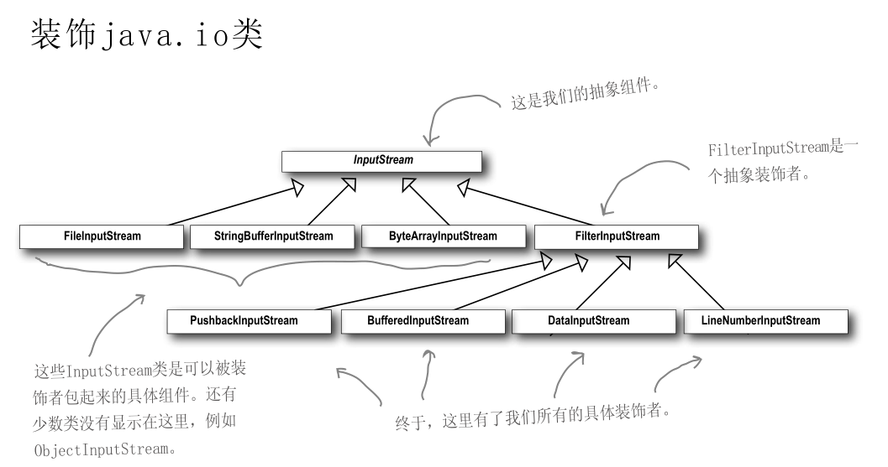

## 2. 装饰者模式  
&emsp;&emsp;它主要是为了扩展对象的功能，通过持有对象的引用，把对象包装起来，可以在调用对象的方法之前或者之后增加新的功能，以达到给对象添加一些额外的职责，就像为对象添加了一些装饰  

### 2.1. 案例

旧的咖啡种类有：HouseBlend 综合咖啡、Darkroast 深焙咖啡、Decaf 低咖啡因咖啡、Espresso 浓咖啡；  
    
&emsp;&emsp;现在需要对业务进行升级，购买咖啡时也可以在其中加入各种调料，例如蒸奶(Steamed milk)、豆浆(Soy)、摩卡(Mocha)或者覆盖奶泡(Whip)。搭配不同的调料组合，相应地计算咖啡价钱时需要加上调料的价钱来计算咖啡的最终价格。如何实现这一种可扩展性程序呢？
#### 2.1.1. 错误示范    
  
采用此种设计将会生成大量的类，造成“类爆炸”，这将会是维护的恶梦。一旦有变更，如牛奶价格上涨，就需要对相关的所有类进行修改  

&emsp;&emsp;我们需要遵循开放关闭原则（类应该对扩展开放，对修改关闭）
#### 2.1.2. 正确示范   
    
我们要以饮料为主体，然后在运行时以调料来“装饰”（decorate）饮料。比方说，如果顾客想要摩卡和奶泡深焙咖啡，那么，要做的是：
* 拿一个深焙咖啡（DarkRoast）对象
* 以摩卡（Mocha）对象装饰它
* 以奶泡（Whip）对象装饰它
* 调用cost()方法，并依赖委托（delegate）将调料的价钱加上去。
```
/**
 * @description 饮料抽象类
 */
public abstract class Beverage {

    String description = "Unknown Beverage";

    public String getDescription() {
        return description;
    }

    /**
     * cost方法是用来返回饮料的价钱（需在具体类中自己实现）
     *
     * @return
     */
    public abstract BigDecimal cost();
}
```

```
/**
 * 深焙咖啡类（一种具体的饮料）
 */
public class DarkRoast extends Beverage {

    /**
     * 说明他是DarkRoast饮料
     */
    public DarkRoast() {
        description = "DarkRoast";
    }

    /**
     * 实现cost方法，用来返回DarkRoast（深焙咖啡）的价格
     *
     * @return
     */
    @Override
    public BigDecimal cost() {
        return new BigDecimal("3.00");
    }
}
```

```
/**
 * 低咖啡因咖啡类（一种具体的饮料）
 */
public class Decaf extends Beverage {

    /**
     * 说明他是Decaf饮料
     */
    public Decaf() {
        description = "Decaf";
    }

    /**
     * 实现cost方法，用来返回Decaf（低咖啡因咖啡）的价格
     *
     * @return
     */
    @Override
    public BigDecimal cost() {
        return new BigDecimal("4.00");
    }
}
```

```
/**
 * 浓缩咖啡类（一种具体饮料）
 */
public class Espresso extends Beverage {

    /**
     * 说明他是Espresso饮料
     */
    public Espresso() {
        description = "Espresso";
    }

    /**
     * 实现cost方法，用来返回Espresso（浓缩咖啡）的价格
     *
     * @return
     */
    @Override
    public BigDecimal cost() {
        return new BigDecimal("2.00");
    }
}
```


```
/**
 * @description 调料装饰着抽象类（继承自饮料抽象类）
 */
public abstract class CondimentDecorator extends Beverage {

    /**
     * 所有的调料装饰者都必须重新实现getDescription()方法
     * 这样才能够用递归的方式来得到所选饮料的整体描述
     *
     * @return
     */
    public abstract String getDescription();
}
```


```
/**
 * 摩卡调料类（继承自CondimentDecorator）
 */
public class Mocha extends CondimentDecorator {

    /**
     * 用一个实例变量记录饮料，也就是被装饰者
     */
    Beverage beverage;

    /**
     * 构造器初始化饮料变量
     *
     * @param beverage
     */
    public Mocha(Beverage beverage) {
        this.beverage = beverage;
    }

    /**
     * 在原来饮料的基础上添加上Mocha描述（原来的饮料加入Mocha调料，被Mocha调料装饰）
     *
     * @return
     */
    @Override
    public String getDescription() {
        return beverage.getDescription() + ",Mocha";
    }

    /**
     * 在原来饮料的基础上加上Mocha的价格（原来的饮料加入Mocha调料，被Mocha调料装饰）
     *
     * @return
     */
    @Override
    public BigDecimal cost() {
        return new BigDecimal("0.2").add(beverage.cost());
    }
}
```


```
/**
 * 豆浆调料类（继承自CondimentDecorator））
 */
public class Soy extends CondimentDecorator {

    /**
     * 用一个实例变量记录饮料，也就是被装饰者
     */
    Beverage beverage;

    /**
     * 构造器初始化饮料变量
     *
     * @param beverage
     */
    public Soy(Beverage beverage) {
        this.beverage = beverage;
    }

    /**
     * 在原来饮料的基础上添加上Soy描述（原来的饮料加入Soy调料，被Soy调料装饰）
     *
     * @return
     */
    @Override
    public String getDescription() {
        return beverage.getDescription() + ",Soy";
    }

    /**
     * 在原来饮料的基础上加上Soy的价格（原来的饮料加入Soy调料，被Soy调料装饰）
     *
     * @return
     */
    @Override
    public BigDecimal cost() {
        return new BigDecimal("0.3").add(beverage.cost());
    }
}
```

```
/**
 * 奶泡调料类（继承自CondimentDecorator）
 */
public class Whip extends CondimentDecorator {

    /**
     * 用一个实例变量记录饮料，也就是被装饰者
     */
    Beverage beverage;

    /**
     * 构造器初始化饮料变量
     *
     * @param beverage
     */
    public Whip(Beverage beverage) {
        this.beverage = beverage;
    }

    /**
     * 在原来饮料的基础上添加上Whip描述（原来的饮料加入Whip调料，被Whip调料装饰）
     *
     * @return
     */
    @Override
    public String getDescription() {
        return beverage.getDescription() + ",Whip";
    }

    /**
     * 在原来饮料的基础上加上Whip的价格（原来的饮料加入Whip调料，被Whip调料装饰）
     *
     * @return
     */
    @Override
    public BigDecimal cost() {
        return new BigDecimal("0.4").add(beverage.cost());
    }
}
```

```
/**
 * 咖啡馆（供应咖啡）
 */
public class StarbuzzCoffee {

    public static void main(String[] args) {
        //订一杯Espresso(2.00)，不需要调料，打印出它的描述与价钱。
        Beverage beverage = new Espresso();
        System.out.println("Description: " + beverage.getDescription() + " $" + beverage.cost());

        //制造出一个DarkRoast(3.00)对象,用Mocha(0.2)装饰它,用第二个Mocha(0.2)装饰它,用Whip(0.4)装饰它，打印出它的描述与价钱。
        Beverage beverage2 = new DarkRoast();
        beverage2 = new Mocha(beverage2);
        beverage2 = new Mocha(beverage2);
        beverage2 = new Whip(beverage2);
        System.out.println("Description: " + beverage2.getDescription() + " $" + beverage2.cost());

        //再来一杯调料为豆浆(Soy 0.3)、摩卡(Mocha 0.2)、奶泡(Whip 0.4)的Decaf（低咖啡因咖啡 4.00），打印出它的描述与价钱。
        Beverage beverage3 = new Decaf();
        beverage3 = new Soy(beverage3);
        beverage3 = new Mocha(beverage3);
        beverage3 = new Whip(beverage3);
        System.out.println("Description: " + beverage3.getDescription() + " $" + beverage3.cost());
    }
}
```


### 2.4. 结论
&emsp;&emsp;从以上，我们可以知道，当我们使用继承，导致子类膨胀，我们不想增加很多子类的情况下，将具体功能职责划分，同时继承装饰者超类，动态地给一个对象添加一些额外的职责便实现了我们的装饰者模式。 它的优缺点如下： 
* 优点：装饰类和被装饰类可以独立发展，不会相互耦合，装饰模式是继承的一个替代模式，装饰模式可以动态扩展一个实现类的功能。
* 缺点：多层装饰比较复杂  

该设计模式的主要作用为扩展一个类的功能。动态增加功能，动态撤销。在java中I/O便使用了装饰者模式。  
