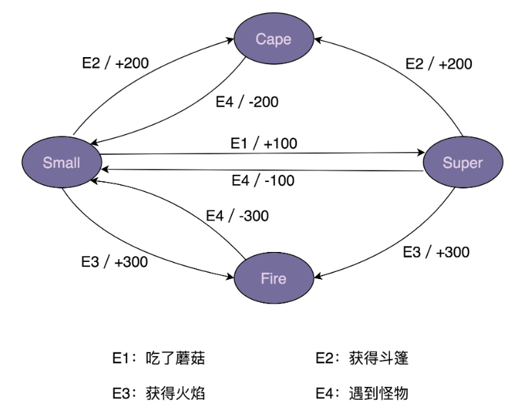
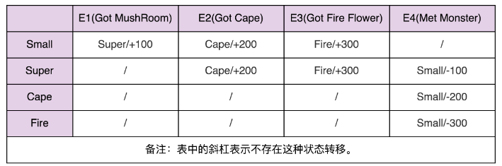

## 1. 开头

行为型设计模式比较多，有 11 个，几乎占了 23 种经典设计模式的一半。它们分别是：观察者模式、模板模式、策略模式、职责链模式、状态模式、迭代器模式、访问者模式、备忘录模式、命令模式、解释器模式、中介模式

## 2. 观察者模式

实际的开发中用得比较多的一种模式：观察者模式。根据应用场景的不同，观察者模式会对应不同的代码实现方式：有同步阻塞的实现方式，也有异步非阻塞的实现方式；有进程内的实现方式，也有跨进程的实现方式。

### 2.1. 原理

一般情况下，被依赖的对象叫作**被观察者**（Observable），依赖的对象叫作**观察者**（Observer）。不过，在实际的项目开发中，这两种对象的称呼是比较灵活的，有各种不同的叫法，比如：Subject-Observer、Publisher-Subscriber、Producer-Consumer、EventEmitter-EventListener、Dispatcher-Listener。不管怎么称呼，只要应用场景符合刚刚给出的定义，都可以看作观察者模式。

```
public interface Subject {
  void registerObserver(Observer observer);
  void removeObserver(Observer observer);
  void notifyObservers(Message message);
}
public interface Observer {
  void update(Message message);
}
public class ConcreteSubject implements Subject {
  private List<Observer> observers = new ArrayList<Observer>();
  @Override
  public void registerObserver(Observer observer) {
    observers.add(observer);
  }
  @Override
  public void removeObserver(Observer observer) {
    observers.remove(observer);
  }
  @Override
  public void notifyObservers(Message message) {
    for (Observer observer : observers) {
      observer.update(message);
    }
  }
}
public class ConcreteObserverOne implements Observer {
  @Override
  public void update(Message message) {
    //TODO: 获取消息通知，执行自己的逻辑...
    System.out.println("ConcreteObserverOne is notified.");
  }
}
public class ConcreteObserverTwo implements Observer {
  @Override
  public void update(Message message) {
    //TODO: 获取消息通知，执行自己的逻辑...
    System.out.println("ConcreteObserverTwo is notified.");
  }
}
public class Demo {
  public static void main(String[] args) {
    ConcreteSubject subject = new ConcreteSubject();
    subject.registerObserver(new ConcreteObserverOne());
    subject.registerObserver(new ConcreteObserverTwo());
    subject.notifyObservers(new Message());
  }
}

```

### 2.2. 应用场景

观察者模式的应用场景非常广泛，小到代码层面的解耦，大到架构层面的系统解耦，再或者一些产品的设计思路，都有这种模式的影子，比如，邮件订阅、RSS Feeds，本质上都是观察者模式。

不同的应用场景和需求下，这个模式也有截然不同的实现方式，开篇的时候我们也提到，有同步阻塞的实现方式，也有异步非阻塞的实现方式；有进程内的实现方式，也有跨进程的实现方式。

之前讲到的实现方式，从刚刚的分类方式上来看，它是一种同步阻塞的实现方式。观察者和被观察者代码在同一个线程内执行，被观察者一直阻塞，直到所有的观察者代码都执行完成之后，才执行后续的代码。对照上面讲到的用户注册的例子，register() 函数依次调用执行每个观察者的 handleRegSuccess() 函数，等到都执行完成之后，才会返回结果给客户端。

如果注册接口是一个调用比较频繁的接口，对性能非常敏感，希望接口的响应时间尽可能短，那我们可以将同步阻塞的实现方式改为异步非阻塞的实现方式，以此来减少响应时间。具体来讲，当 userService.register() 函数执行完成之后，我们启动一个新的线程来执行观察者的 handleRegSuccess() 函数，这样 userController.register() 函数就不需要等到所有的 handleRegSuccess() 函数都执行完成之后才返回结果给客户端。userController.register() 函数从执行 3 个 SQL 语句才返回，减少到只需要执行 1 个 SQL 语句就返回，响应时间粗略来讲减少为原来的 1/3。

那如何实现一个异步非阻塞的观察者模式呢？简单一点的做法是，在每个 handleRegSuccess() 函数中，创建一个新的线程执行代码。不过，我们还有更加优雅的实现方式，那就是基于 EventBus 来实现。它可以复用在任何需要异步非阻塞观察者模式的应用场景中。

刚刚讲到的两个场景，不管是同步阻塞实现方式还是异步非阻塞实现方式，都是进程内的实现方式。如果用户注册成功之后，我们需要发送用户信息给大数据征信系统，而大数据征信系统是一个独立的系统，跟它之间的交互是跨不同进程的，那如何实现一个跨进程的观察者模式呢？

如果大数据征信系统提供了发送用户注册信息的 RPC 接口，我们仍然可以沿用之前的实现思路，在 handleRegSuccess() 函数中调用 RPC 接口来发送数据。但是，我们还有更加优雅、更加常用的一种实现方式，那就是基于消息队列（Message Queue，比如 ActiveMQ）来实现。

当然，这种实现方式也有弊端，那就是需要引入一个新的系统（消息队列），增加了维护成本。不过，它的好处也非常明显。在原来的实现方式中，观察者需要注册到被观察者中，被观察者需要依次遍历观察者来发送消息。而基于消息队列的实现方式，被观察者和观察者解耦更加彻底，两部分的耦合更小。被观察者完全不感知观察者，同理，观察者也完全不感知被观察者。被观察者只管发送消息到消息队列，观察者只管从消息队列中读取消息来执行相应的逻辑。

### 2.3. 案例

#### 2.3.1. 用户注册

开发一个 P2P 投资理财系统，用户注册成功之后，我们会给用户发放投资体验金。

原始代码：

```
public class UserController {
  private UserService userService; // 依赖注入
  private PromotionService promotionService; // 依赖注入
  public Long register(String telephone, String password) {
    //省略输入参数的校验代码
    //省略userService.register()异常的try-catch代码
    long userId = userService.register(telephone, password);
    promotionService.issueNewUserExperienceCash(userId);
    return userId;
  }
}
```

虽然注册接口做了两件事情，注册和发放体验金，违反单一职责原则，但是，如果没有扩展和修改的需求，现在的代码实现是可以接受的。如果非得用观察者模式，就需要引入更多的类和更加复杂的代码结构，反倒是一种过度设计。

相反，如果需求频繁变动，比如，用户注册成功之后，不再发放体验金，而是改为发放优惠券，并且还要给用户发送一封“欢迎注册成功”的站内信。这种情况下，我们就需要频繁地修改 register() 函数中的代码，违反开闭原则。而且，如果注册成功之后需要执行的后续操作越来越多，那 register() 函数的逻辑会变得越来越复杂，也就影响到代码的可读性和可维护性。

这个时候，观察者模式就能派上用场了。利用观察者模式，我对上面的代码进行了重构。重构之后的代码如下所示：

```
public interface RegObserver {
  void handleRegSuccess(long userId);
}
public class RegPromotionObserver implements RegObserver {
  private PromotionService promotionService; // 依赖注入
  @Override
  public void handleRegSuccess(long userId) {
    promotionService.issueNewUserExperienceCash(userId);
  }
}
public class RegNotificationObserver implements RegObserver {
  private NotificationService notificationService;
  @Override
  public void handleRegSuccess(long userId) {
    notificationService.sendInboxMessage(userId, "Welcome...");
  }
}
public class UserController {
  private UserService userService; // 依赖注入
  private List<RegObserver> regObservers = new ArrayList<>();
  // 一次性设置好，之后也不可能动态的修改
  public void setRegObservers(List<RegObserver> observers) {
    regObservers.addAll(observers);
  }
  public Long register(String telephone, String password) {
    //省略输入参数的校验代码
    //省略userService.register()异常的try-catch代码
    long userId = userService.register(telephone, password);
    for (RegObserver observer : regObservers) {
      observer.handleRegSuccess(userId);
    }
    return userId;
  }
}
```

当我们需要添加新的观察者的时候，比如，用户注册成功之后，推送用户注册信息给大数据征信系统，基于观察者模式的代码实现，UserController 类的 register() 函数完全不需要修改，只需要再添加一个实现了 RegObserver 接口的类，并且通过 setRegObservers() 函数将它注册到 UserController 类中即可。

不过，你可能会说，当我们把发送体验金替换为发送优惠券的时候，需要修改 RegPromotionObserver 类中 handleRegSuccess() 函数的代码，这还是违反开闭原则呀？你说得没错，不过，相对于 register() 函数来说，handleRegSuccess() 函数的逻辑要简单很多，修改更不容易出错，引入 bug 的风险更低。

#### 5.3.2. guava event bus

同步阻塞是最经典的实现方式，主要是为了代码解耦；异步非阻塞除了能实现代码解耦之外，还能提高代码的执行效率；进程间的观察者模式解耦更加彻底，一般是基于消息队列来实现，用来实现不同进程间的被观察者和观察者之间的交互。对于异步非阻塞观察者模式，如果只是实现一个简易版本，不考虑任何通用性、复用性，实际上是非常容易的。比如我们有两种实现方式。其中一种是：在每个 handleRegSuccess() 函数中创建一个新的线程执行代码逻辑；另一种是：在 UserController 的 register() 函数中使用线程池来执行每个观察者的 handleRegSuccess() 函数。

对于第一种实现方式，频繁地创建和销毁线程比较耗时，并且并发线程数无法控制，创建过多的线程会导致堆栈溢出。

第二种实现方式，尽管利用了线程池解决了第一种实现方式的问题，但线程池、异步执行逻辑都耦合在了 register() 函数中，增加了这部分业务代码的维护成本。

如果我们的需求更加极端一点，需要在同步阻塞和异步非阻塞之间灵活切换，那就要不停地修改 UserController 的代码。除此之外，如果在项目中，不止一个业务模块需要用到异步非阻塞观察者模式，那这样的代码实现也无法做到复用。

我们知道，框架的作用有：隐藏实现细节，降低开发难度，做到代码复用，解耦业务与非业务代码，让程序员聚焦业务开发。针对异步非阻塞观察者模式，我们也可以将它抽象成框架来达到这样的效果，而这个框架就是EventBus

EventBus 翻译为“事件总线”，它提供了实现观察者模式的骨架代码。我们可以基于此框架，非常容易地在自己的业务场景中实现观察者模式，不需要从零开始开发。其中，Google Guava EventBus 就是一个比较著名的 EventBus 框架，它不仅仅支持异步非阻塞模式，同时也支持同步阻塞模式

现在，我们就通过例子来看一下，Guava EventBus 具有哪些功能。

用户注册的例子，我们用 Guava EventBus 重新实现一下

**代码如下所示：**

```
public class UserController {
  private UserService userService; // 依赖注入
  private EventBus eventBus;
  private static final int DEFAULT_EVENTBUS_THREAD_POOL_SIZE = 20;
  public UserController() {
    //eventBus = new EventBus(); // 同步阻塞模式
    eventBus = new AsyncEventBus(Executors.newFixedThreadPool(DEFAULT_EVENTBUS_THREAD_POOL_SIZE)); // 异步非阻塞模式
  }
  public void setRegObservers(List<Object> observers) {
    for (Object observer : observers) {
      eventBus.register(observer);
    }
  }
  public Long register(String telephone, String password) {
    //省略输入参数的校验代码
    //省略userService.register()异常的try-catch代码
    long userId = userService.register(telephone, password);
    eventBus.post(userId);
    return userId;
  }
}
public class RegPromotionObserver {
  private PromotionService promotionService; // 依赖注入
  @Subscribe
  public void handleRegSuccess(long userId) {
    promotionService.issueNewUserExperienceCash(userId);
  }
}
public class RegNotificationObserver {
  private NotificationService notificationService;
  @Subscribe
  public void handleRegSuccess(long userId) {
    notificationService.sendInboxMessage(userId, "...");
  }
}
```

**EventBus类和函数：**

* EventBus、AsyncEventBus

  Guava EventBus 对外暴露的所有可调用接口，都封装在 EventBus 类中。其中，EventBus 实现了同步阻塞的观察者模式，AsyncEventBus 继承自 EventBus，提供了异步非阻塞的观察者模式

  ```
  EventBus eventBus = new EventBus(); // 同步阻塞模式
  EventBus eventBus = new AsyncEventBus(Executors.newFixedThreadPool(8))；// 异步阻塞模式
  ```

* register() 函数

  EventBus 类提供了 register() 函数用来注册观察者。具体的函数定义如下所示。它可以接受任何类型（Object）的观察者。而在经典的观察者模式的实现中，register() 函数必须接受实现了同一 Observer 接口的类对象

  ```
  public void register(Object object);
  ```

* unregister() 函数

  相对于 register() 函数，unregister() 函数用来从 EventBus 中删除某个观察者。我就不多解释了，具体的函数定义如下所示：

  ```
  public void unregister(Object object);
  ```

* post() 函数

  EventBus 类提供了 post() 函数，用来给观察者发送消息。具体的函数定义如下所示：

  ```
  public void post(Object event);
  ```

  跟经典的观察者模式的不同之处在于，当我们调用 post() 函数发送消息的时候，并非把消息发送给所有的观察者，而是发送给可匹配的观察者。所谓可匹配指的是，能接收的消息类型是发送消息（post 函数定义中的 event）类型的父类

  例如，AObserver 能接收的消息类型是 XMsg，BObserver 能接收的消息类型是 YMsg，CObserver 能接收的消息类型是 ZMsg。其中，XMsg 是 YMsg 的父类。当我们如下发送消息的时候，相应能接收到消息的可匹配观察者如下所示：

  ```
  XMsg xMsg = new XMsg();
  YMsg yMsg = new YMsg();
  ZMsg zMsg = new ZMsg();
  post(xMsg); => AObserver接收到消息
  post(yMsg); => AObserver、BObserver接收到消息
  post(zMsg); => CObserver接收到消息
  ```

* @Subscribe 注解

  EventBus 通过 @Subscribe 注解来标明，某个函数能接收哪种类型的消息。具体的使用代码如下所示。在 DObserver 类中，我们通过 @Subscribe 注解了两个函数 f1()、f2()。

  ```
  public DObserver {
    //...省略其他属性和方法...
    
    @Subscribe
    public void f1(PMsg event) { //... }
    
    @Subscribe
    public void f2(QMsg event) { //... }
  }
  ```

  当通过 register() 函数将 DObserver 类对象注册到 EventBus 的时候，EventBus 会根据 @Subscribe 注解找到 f1() 和 f2()，并且将两个函数能接收的消息类型记录下来（PMsg->f1，QMsg->f2）。当我们通过 post() 函数发送消息（比如 QMsg 消息）的时候，EventBus 会通过之前的记录（QMsg->f2），调用相应的函数（f2）

#### 5.3.3. 自己实现eventbus

**整体思路：**

最关键的一个数据结构是 Observer 注册表，记录了消息类型和可接收消息函数的对应关系。当调用 register() 函数注册观察者的时候，EventBus 通过解析 @Subscribe 注解，生成 Observer 注册表。当调用 post() 函数发送消息的时候，EventBus 通过注册表找到相应的可接收消息的函数，然后通过 Java 的反射语法来动态地创建对象、执行函数。对于同步阻塞模式，EventBus 在一个线程内依次执行相应的函数。对于异步非阻塞模式，EventBus 通过一个线程池来执行相应的函数。

* Subscribe

  Subscribe 是一个注解，用于标明观察者中的哪个函数可以接收消息。

  ```
  @Retention(RetentionPolicy.RUNTIME)
  @Target(ElementType.METHOD)
  @Beta
  public @interface Subscribe {}
  ```

* ObserverAction

  ObserverAction 类用来表示 @Subscribe 注解的方法，其中，target 表示观察者类，method 表示方法。它主要用在 ObserverRegistry 观察者注册表中。

  ```
  public class ObserverAction {
    private Object target;
    private Method method;
    public ObserverAction(Object target, Method method) {
      this.target = Preconditions.checkNotNull(target);
      this.method = method;
      this.method.setAccessible(true);
    }
    public void execute(Object event) { // event是method方法的参数
      try {
        method.invoke(target, event);
      } catch (InvocationTargetException | IllegalAccessException e) {
        e.printStackTrace();
      }
    }
  }
  
  ```

* ObserverRegistry

  ObserverRegistry 类就是前面讲到的 Observer 注册表，是最复杂的一个类，框架中几乎所有的核心逻辑都在这个类中。这个类大量使用了 Java 的反射语法，不过代码整体来说都不难理解，其中，一个比较有技巧的地方是 CopyOnWriteArraySet 的使用。

  CopyOnWriteArraySet，顾名思义，在写入数据的时候，会创建一个新的 set，并且将原始数据 clone 到新的 set 中，在新的 set 中写入数据完成之后，再用新的 set 替换老的 set。这样就能保证在写入数据的时候，不影响数据的读取操作，以此来解决读写并发问题。除此之外，CopyOnWriteSet 还通过加锁的方式，避免了并发写冲突。具体的作用你可以去查看一下 CopyOnWriteSet 类的源码，一目了然

  ```
  public class ObserverRegistry {
    private ConcurrentMap<Class<?>, CopyOnWriteArraySet<ObserverAction>> registry = new ConcurrentHashMap<>();
    public void register(Object observer) {
      Map<Class<?>, Collection<ObserverAction>> observerActions = findAllObserverActions(observer);
      for (Map.Entry<Class<?>, Collection<ObserverAction>> entry : observerActions.entrySet()) {
        Class<?> eventType = entry.getKey();
        Collection<ObserverAction> eventActions = entry.getValue();
        CopyOnWriteArraySet<ObserverAction> registeredEventActions = registry.get(eventType);
        if (registeredEventActions == null) {
          registry.putIfAbsent(eventType, new CopyOnWriteArraySet<>());
          registeredEventActions = registry.get(eventType);
        }
        registeredEventActions.addAll(eventActions);
      }
    }
    public List<ObserverAction> getMatchedObserverActions(Object event) {
      List<ObserverAction> matchedObservers = new ArrayList<>();
      Class<?> postedEventType = event.getClass();
      for (Map.Entry<Class<?>, CopyOnWriteArraySet<ObserverAction>> entry : registry.entrySet()) {
        Class<?> eventType = entry.getKey();
        Collection<ObserverAction> eventActions = entry.getValue();
        if (postedEventType.isAssignableFrom(eventType)) {
          matchedObservers.addAll(eventActions);
        }
      }
      return matchedObservers;
    }
    private Map<Class<?>, Collection<ObserverAction>> findAllObserverActions(Object observer) {
      Map<Class<?>, Collection<ObserverAction>> observerActions = new HashMap<>();
      Class<?> clazz = observer.getClass();
      for (Method method : getAnnotatedMethods(clazz)) {
        Class<?>[] parameterTypes = method.getParameterTypes();
        Class<?> eventType = parameterTypes[0];
        if (!observerActions.containsKey(eventType)) {
          observerActions.put(eventType, new ArrayList<>());
        }
        observerActions.get(eventType).add(new ObserverAction(observer, method));
      }
      return observerActions;
    }
    private List<Method> getAnnotatedMethods(Class<?> clazz) {
      List<Method> annotatedMethods = new ArrayList<>();
      for (Method method : clazz.getDeclaredMethods()) {
        if (method.isAnnotationPresent(Subscribe.class)) {
          Class<?>[] parameterTypes = method.getParameterTypes();
          Preconditions.checkArgument(parameterTypes.length == 1,
                  "Method %s has @Subscribe annotation but has %s parameters."
                          + "Subscriber methods must have exactly 1 parameter.",
                  method, parameterTypes.length);
          annotatedMethods.add(method);
        }
      }
      return annotatedMethods;
    }
  }
  ```

* EventBus

  EventBus 实现的是阻塞同步的观察者模式。看代码你可能会有些疑问，这明明就用到了线程池 Executor 啊。实际上，MoreExecutors.directExecutor() 是 Google Guava 提供的工具类，看似是多线程，实际上是单线程。之所以要这么实现，主要还是为了跟 AsyncEventBus 统一代码逻辑，做到代码复用。

  ```
  public class EventBus {
    private Executor executor;
    private ObserverRegistry registry = new ObserverRegistry();
    public EventBus() {
      this(MoreExecutors.directExecutor());
    }
    protected EventBus(Executor executor) {
      this.executor = executor;
    }
    public void register(Object object) {
      registry.register(object);
    }
    public void post(Object event) {
      List<ObserverAction> observerActions = registry.getMatchedObserverActions(event);
      for (ObserverAction observerAction : observerActions) {
        executor.execute(new Runnable() {
          @Override
          public void run() {
            observerAction.execute(event);
          }
        });
      }
    }
  }
  ```

* AsyncEventBus

  有了 EventBus，AsyncEventBus 的实现就非常简单了。为了实现异步非阻塞的观察者模式，它就不能再继续使用 MoreExecutors.directExecutor() 了，而是需要在构造函数中，由调用者注入线程池。

  ```
  public class AsyncEventBus extends EventBus {
    public AsyncEventBus(Executor executor) {
      super(executor);
    }
  }
  ```


### 2.4. 小结

设计模式要干的事情就是解耦，创建型模式是将创建和使用代码解耦，结构型模式是将不同功能代码解耦，行为型模式是将不同的行为代码解耦，具体到观察者模式，它将观察者和被观察者代码解耦。借助设计模式，我们利用更好的代码结构，将一大坨代码拆分成职责更单一的小类，让其满足开闭原则、高内聚低耦合等特性，以此来控制和应对代码的复杂性，提高代码的可扩展性。

观察者模式的应用场景非常广泛，小到代码层面的解耦，大到架构层面的系统解耦，再或者一些产品的设计思路，都有这种模式的影子，比如，邮件订阅、RSS Feeds，本质上都是观察者模式。不同的应用场景和需求下，这个模式也有截然不同的实现方式，有同步阻塞的实现方式，也有异步非阻塞的实现方式；有进程内的实现方式，也有跨进程的实现方式。

框架的作用有：隐藏实现细节，降低开发难度，做到代码复用，解耦业务与非业务代码，让程序员聚焦业务开发。针对异步非阻塞观察者模式，我们也可以将它抽象成框架来达到这样的效果，而这个框架就是我们这节课讲的 EventBus。EventBus 翻译为“事件总线”，它提供了实现观察者模式的骨架代码。我们可以基于此框架，非常容易地在自己的业务场景中实现观察者模式，不需要从零开始开发。

很多人觉得做业务开发没有技术挑战，实际上，做业务开发也会涉及很多非业务功能的开发，比如今天讲到的 EventBus。在平时的业务开发中，我们要善于抽象这些非业务的、可复用的功能，并积极地把它们实现成通用的框架

## 3. 模板模式

模板模式主要是用来解决复用和扩展两个问题

### 3.1. 原理

模板方法模式在一个方法中定义一个算法骨架，并将某些步骤推迟到子类中实现。模板方法模式可以让子类在不改变算法整体结构的情况下，重新定义算法中的某些步骤。

这里的“算法”，我们可以理解为广义上的“业务逻辑”，并不特指数据结构和算法中的“算法”。这里的算法骨架就是“模板”，包含算法骨架的方法就是“模板方法”，这也是模板方法模式名字的由来。

原理很简单，代码实现就更加简单，我写了一个示例代码，如下所示。templateMethod() 函数定义为 final，是为了避免子类重写它。method1() 和 method2() 定义为 abstract，是为了强迫子类去实现。不过，这些都不是必须的，在实际的项目开发中，模板模式的代码实现比较灵活，待会儿讲到应用场景的时候，我们会有具体的体现

**模式案例：**

```
public abstract class AbstractClass {
  public final void templateMethod() {
    //...
    method1();
    //...
    method2();
    //...
  }
  
  protected abstract void method1();
  protected abstract void method2();
}
public class ConcreteClass1 extends AbstractClass {
  @Override
  protected void method1() {
    //...
  }
  
  @Override
  protected void method2() {
    //...
  }
}
public class ConcreteClass2 extends AbstractClass {
  @Override
  protected void method1() {
    //...
  }
  
  @Override
  protected void method2() {
    //...
  }
}
AbstractClass demo = ConcreteClass1();
demo.templateMethod();
```

### 3.2. 模板模式作用

#### 3.2.1. 复用

模板模式把一个算法中不变的流程抽象到父类的模板方法 templateMethod() 中，将可变的部分 method1()、method2() 留给子类 ContreteClass1 和 ContreteClass2 来实现。所有的子类都可以复用父类中模板方法定义的流程代码

Java IO 类库中，有很多类的设计用到了模板模式，比如 InputStream、OutputStream、Reader、Writer。

* Java InputStream

  在代码中，read() 函数是一个模板方法，定义了读取数据的整个流程，并且暴露了一个可以由子类来定制的抽象方法。不过这个方法也被命名为了 read()，只是参数跟模板方法不同。

  ```
  public abstract class InputStream implements Closeable {
    //...省略其他代码...
    
    public int read(byte b[], int off, int len) throws IOException {
      if (b == null) {
        throw new NullPointerException();
      } else if (off < 0 || len < 0 || len > b.length - off) {
        throw new IndexOutOfBoundsException();
      } else if (len == 0) {
        return 0;
      }
      int c = read();
      if (c == -1) {
        return -1;
      }
      b[off] = (byte)c;
      int i = 1;
      try {
        for (; i < len ; i++) {
          c = read();
          if (c == -1) {
            break;
          }
          b[off + i] = (byte)c;
        }
      } catch (IOException ee) {
      }
      return i;
    }
    
    public abstract int read() throws IOException;
  }
  public class ByteArrayInputStream extends InputStream {
    //...省略其他代码...
    
    @Override
    public synchronized int read() {
      return (pos < count) ? (buf[pos++] & 0xff) : -1;
    }
  }
  ```

* Java AbstractList

  Java AbstractList 类中，addAll() 函数可以看作模板方法，add() 是子类需要重写的方法，尽管没有声明为 abstract 的，但函数实现直接抛出了 UnsupportedOperationException 异常

  ```
  public boolean addAll(int index, Collection<? extends E> c) {
      rangeCheckForAdd(index);
      boolean modified = false;
      for (E e : c) {
          add(index++, e);
          modified = true;
      }
      return modified;
  }
  public void add(int index, E element) {
      throw new UnsupportedOperationException();
  }
  ```

  

#### 3.2.2. 扩展

模板模式的第二大作用的是扩展。这里所说的扩展，并不是指代码的扩展性，而是指框架的扩展性，有点类似我们之前讲到的控制反转。基于这个作用，模板模式常用在框架的开发中，让框架用户可以在不修改框架源码的情况下，定制化框架的功能。我们通过 Junit TestCase、Java Servlet 两个例子来解释一下。

* java Servlet

  对于 Java Web 项目开发来说，常用的开发框架是 SpringMVC。利用它，我们只需要关注业务代码的编写，底层的原理几乎不会涉及。但是，如果我们抛开这些高级框架来开发 Web 项目，必然会用到 Servlet。实际上，使用比较底层的 Servlet 来开发 Web 项目也不难。我们只需要定义一个继承 HttpServlet 的类，并且重写其中的 doGet() 或 doPost() 方法，来分别处理 get 和 post 请求。具体的代码示例如下所示：

  ```
  public class HelloServlet extends HttpServlet {
    @Override
    protected void doGet(HttpServletRequest req, HttpServletResponse resp) throws ServletException, IOException {
      this.doPost(req, resp);
    }
    
    @Override
    protected void doPost(HttpServletRequest req, HttpServletResponse resp) throws ServletException, IOException {
      resp.getWriter().write("Hello World.");
    }
  }
  ```

  除此之外，我们还需要在配置文件 web.xml 中做如下配置。Tomcat、Jetty 等 Servlet 容器在启动的时候，会自动加载这个配置文件中的 URL 和 Servlet 之间的映射关系

  ```
  <servlet>
      <servlet-name>HelloServlet</servlet-name>
      <servlet-class>com.xzg.cd.HelloServlet</servlet-class>
  </servlet>
  <servlet-mapping>
      <servlet-name>HelloServlet</servlet-name>
      <url-pattern>/hello</url-pattern>
  </servlet-mapping>
  
  ```

  当我们在浏览器中输入网址（比如，http://127.0.0.1:8080/hello ）的时候，Servlet 容器会接收到相应的请求，并且根据 URL 和 Servlet 之间的映射关系，找到相应的 Servlet（HelloServlet），然后执行它的 service() 方法。service() 方法定义在父类 HttpServlet 中，它会调用 doGet() 或 doPost() 方法，然后输出数据（“Hello world”）到网页。

  我们现在来看，HttpServlet 的 service() 函数长什么样子

  ```
  public void service(ServletRequest req, ServletResponse res)
      throws ServletException, IOException
  {
      HttpServletRequest  request;
      HttpServletResponse response;
      if (!(req instanceof HttpServletRequest &&
              res instanceof HttpServletResponse)) {
          throw new ServletException("non-HTTP request or response");
      }
      request = (HttpServletRequest) req;
      response = (HttpServletResponse) res;
      service(request, response);
  }
  protected void service(HttpServletRequest req, HttpServletResponse resp)
      throws ServletException, IOException
  {
      String method = req.getMethod();
      if (method.equals(METHOD_GET)) {
          long lastModified = getLastModified(req);
          if (lastModified == -1) {
              // servlet doesn't support if-modified-since, no reason
              // to go through further expensive logic
              doGet(req, resp);
          } else {
              long ifModifiedSince = req.getDateHeader(HEADER_IFMODSINCE);
              if (ifModifiedSince < lastModified) {
                  // If the servlet mod time is later, call doGet()
                  // Round down to the nearest second for a proper compare
                  // A ifModifiedSince of -1 will always be less
                  maybeSetLastModified(resp, lastModified);
                  doGet(req, resp);
              } else {
                  resp.setStatus(HttpServletResponse.SC_NOT_MODIFIED);
              }
          }
      } else if (method.equals(METHOD_HEAD)) {
          long lastModified = getLastModified(req);
          maybeSetLastModified(resp, lastModified);
          doHead(req, resp);
      } else if (method.equals(METHOD_POST)) {
          doPost(req, resp);
      } else if (method.equals(METHOD_PUT)) {
          doPut(req, resp);
      } else if (method.equals(METHOD_DELETE)) {
          doDelete(req, resp);
      } else if (method.equals(METHOD_OPTIONS)) {
          doOptions(req,resp);
      } else if (method.equals(METHOD_TRACE)) {
          doTrace(req,resp);
      } else {
          String errMsg = lStrings.getString("http.method_not_implemented");
          Object[] errArgs = new Object[1];
          errArgs[0] = method;
          errMsg = MessageFormat.format(errMsg, errArgs);
          resp.sendError(HttpServletResponse.SC_NOT_IMPLEMENTED, errMsg);
      }
  }
  ```

  从上面的代码中我们可以看出，HttpServlet 的 service() 方法就是一个模板方法，它实现了整个 HTTP 请求的执行流程，doGet()、doPost() 是模板中可以由子类来定制的部分。实际上，这就相当于 Servlet 框架提供了一个扩展点（doGet()、doPost() 方法），让框架用户在不用修改 Servlet 框架源码的情况下，将业务代码通过扩展点镶嵌到框架中执行。

* JUnit TestCase

  跟 Java Servlet 类似，JUnit 框架也通过模板模式提供了一些功能扩展点（setUp()、tearDown() 等），让框架用户可以在这些扩展点上扩展功能。

  在使用 JUnit 测试框架来编写单元测试的时候，我们编写的测试类都要继承框架提供的 TestCase 类。在 TestCase 类中，runBare() 函数是模板方法，它定义了执行测试用例的整体流程：先执行 setUp() 做些准备工作，然后执行 runTest() 运行真正的测试代码，最后执行 tearDown() 做扫尾工作。

  TestCase 类的具体代码如下所示。尽管 setUp()、tearDown() 并不是抽象函数，还提供了默认的实现，不强制子类去重新实现，但这部分也是可以在子类中定制的，所以也符合模板模式的定义。

  ```
  public abstract class TestCase extends Assert implements Test {
    public void runBare() throws Throwable {
      Throwable exception = null;
      setUp();
      try {
        runTest();
      } catch (Throwable running) {
        exception = running;
      } finally {
        try {
          tearDown();
        } catch (Throwable tearingDown) {
          if (exception == null) exception = tearingDown;
        }
      }
      if (exception != null) throw exception;
    }
    
    /**
    * Sets up the fixture, for example, open a network connection.
    * This method is called before a test is executed.
    */
    protected void setUp() throws Exception {
    }
    /**
    * Tears down the fixture, for example, close a network connection.
    * This method is called after a test is executed.
    */
    protected void tearDown() throws Exception {
    }
  }
  ```

### 3.3. 回调

有另外一个技术概念，也能起到跟模板模式相同的作用，那就是**回调**（Callback）	

#### 3.3.1. 回调原理

相对于普通的函数调用来说，回调是一种双向调用关系。A 类事先注册某个函数 F 到 B 类，A 类在调用 B 类的 P 函数的时候，B 类反过来调用 A 类注册给它的 F 函数。这里的 F 函数就是“回调函数”。A 调用 B，B 反过来又调用 A，这种调用机制就叫作“回调”

A 类如何将回调函数传递给 B 类呢？不同的编程语言，有不同的实现方法。C 语言可以使用函数指针，Java 则需要使用包裹了回调函数的类对象，我们简称为回调对象。这里我用 Java 语言举例说明一下。代码如下所示：

```
public interface ICallback {
  void methodToCallback();
}
public class BClass {
  public void process(ICallback callback) {
    //...
    callback.methodToCallback();
    //...
  }
}
public class AClass {
  public static void main(String[] args) {
    BClass b = new BClass();
    b.process(new ICallback() { //回调对象
      @Override
      public void methodToCallback() {
        System.out.println("Call back me.");
      }
    });
  }
}
```

上面就是 Java 语言中回调的典型代码实现。从代码实现中，我们可以看出，回调跟模板模式一样，也具有复用和扩展的功能。除了回调函数之外，BClass 类的 process() 函数中的逻辑都可以复用。如果 ICallback、BClass 类是框架代码，AClass 是使用框架的客户端代码，我们可以通过 ICallback 定制 process() 函数，也就是说，框架因此具有了扩展的能力。

实际上，回调不仅可以应用在代码设计上，在更高层次的架构设计上也比较常用。比如，通过三方支付系统来实现支付功能，用户在发起支付请求之后，一般不会一直阻塞到支付结果返回，而是注册回调接口（类似回调函数，一般是一个回调用的 URL）给三方支付系统，等三方支付系统执行完成之后，将结果通过回调接口返回给用户。

回调可以分为同步回调和异步回调（或者延迟回调）。同步回调指在函数返回之前执行回调函数；异步回调指的是在函数返回之后执行回调函数。上面的代码实际上是同步回调的实现方式，在 process() 函数返回之前，执行完回调函数 methodToCallback()。而上面支付的例子是异步回调的实现方式，发起支付之后不需要等待回调接口被调用就直接返回。从应用场景上来看，同步回调看起来更像模板模式，异步回调看起来更像观察者模式

#### 3.3.2. JdbcTemplate

Spring 提供了很多 Template 类，比如，JdbcTemplate、RedisTemplate、RestTemplate。尽管都叫作 xxxTemplate，但它们并非基于模板模式来实现的，而是基于回调来实现的，确切地说应该是同步回调。而同步回调从应用场景上很像模板模式，所以，在命名上，这些类使用 Template（模板）这个单词作为后缀。

这些 Template 类的设计思路都很相近，所以，我们只拿其中的 JdbcTemplate 来举例分析一下。对于其他 Template 类，你可以阅读源码自行分析。

在前面的章节中，我们也多次提到，Java 提供了 JDBC 类库来封装不同类型的数据库操作。不过，直接使用 JDBC 来编写操作数据库的代码，还是有点复杂的。比如，下面这段是使用 JDBC 来查询用户信息的代码。

```
public class JdbcDemo {
  public User queryUser(long id) {
    Connection conn = null;
    Statement stmt = null;
    try {
      //1.加载驱动
      Class.forName("com.mysql.jdbc.Driver");
      conn = DriverManager.getConnection("jdbc:mysql://localhost:3306/demo", "xzg", "xzg");
      //2.创建statement类对象，用来执行SQL语句
      stmt = conn.createStatement();
      //3.ResultSet类，用来存放获取的结果集
      String sql = "select * from user where id=" + id;
      ResultSet resultSet = stmt.executeQuery(sql);
      String eid = null, ename = null, price = null;
      while (resultSet.next()) {
        User user = new User();
        user.setId(resultSet.getLong("id"));
        user.setName(resultSet.getString("name"));
        user.setTelephone(resultSet.getString("telephone"));
        return user;
      }
    } catch (ClassNotFoundException e) {
      // TODO: log...
    } catch (SQLException e) {
      // TODO: log...
    } finally {
      if (conn != null)
        try {
          conn.close();
        } catch (SQLException e) {
          // TODO: log...
        }
      if (stmt != null)
        try {
          stmt.close();
        } catch (SQLException e) {
          // TODO: log...
        }
    }
    return null;
  }
}

```

queryUser() 函数包含很多流程性质的代码，跟业务无关，比如，加载驱动、创建数据库连接、创建 statement、关闭连接、关闭 statement、处理异常。针对不同的 SQL 执行请求，这些流程性质的代码是相同的、可以复用的，我们不需要每次都重新敲一遍。

针对这个问题，Spring 提供了 JdbcTemplate，对 JDBC 进一步封装，来简化数据库编程。使用 JdbcTemplate 查询用户信息，我们只需要编写跟这个业务有关的代码，其中包括，查询用户的 SQL 语句、查询结果与 User 对象之间的映射关系。其他流程性质的代码都封装在了 JdbcTemplate 类中，不需要我们每次都重新编写。我用 JdbcTemplate 重写了上面的例子，代码简单了很多，如下所示：

```
public class JdbcTemplateDemo {
  private JdbcTemplate jdbcTemplate;
  public User queryUser(long id) {
    String sql = "select * from user where id="+id;
    return jdbcTemplate.query(sql, new UserRowMapper()).get(0);
  }
  class UserRowMapper implements RowMapper<User> {
    public User mapRow(ResultSet rs, int rowNum) throws SQLException {
      User user = new User();
      user.setId(rs.getLong("id"));
      user.setName(rs.getString("name"));
      user.setTelephone(rs.getString("telephone"));
      return user;
    }
  }
}
```

那 JdbcTemplate 底层具体是如何实现的呢？我们来看一下它的源码。因为 JdbcTemplate 代码比较多，我只摘抄了部分相关代码，贴到了下面。其中，JdbcTemplate 通过回调的机制，将不变的执行流程抽离出来，放到模板方法 execute() 中，将可变的部分设计成回调 StatementCallback，由用户来定制。query() 函数是对 execute() 函数的二次封装，让接口用起来更加方便。

```
@Override
public <T> List<T> query(String sql, RowMapper<T> rowMapper) throws DataAccessException {
 return query(sql, new RowMapperResultSetExtractor<T>(rowMapper));
}
@Override
public <T> T query(final String sql, final ResultSetExtractor<T> rse) throws DataAccessException {
 Assert.notNull(sql, "SQL must not be null");
 Assert.notNull(rse, "ResultSetExtractor must not be null");
 if (logger.isDebugEnabled()) {
  logger.debug("Executing SQL query [" + sql + "]");
 }
 class QueryStatementCallback implements StatementCallback<T>, SqlProvider {
  @Override
  public T doInStatement(Statement stmt) throws SQLException {
   ResultSet rs = null;
   try {
    rs = stmt.executeQuery(sql);
    ResultSet rsToUse = rs;
    if (nativeJdbcExtractor != null) {
     rsToUse = nativeJdbcExtractor.getNativeResultSet(rs);
    }
    return rse.extractData(rsToUse);
   }
   finally {
    JdbcUtils.closeResultSet(rs);
   }
  }
  @Override
  public String getSql() {
   return sql;
  }
 }
 return execute(new QueryStatementCallback());
}
@Override
public <T> T execute(StatementCallback<T> action) throws DataAccessException {
 Assert.notNull(action, "Callback object must not be null");
 Connection con = DataSourceUtils.getConnection(getDataSource());
 Statement stmt = null;
 try {
  Connection conToUse = con;
  if (this.nativeJdbcExtractor != null &&
    this.nativeJdbcExtractor.isNativeConnectionNecessaryForNativeStatements()) {
   conToUse = this.nativeJdbcExtractor.getNativeConnection(con);
  }
  stmt = conToUse.createStatement();
  applyStatementSettings(stmt);
  Statement stmtToUse = stmt;
  if (this.nativeJdbcExtractor != null) {
   stmtToUse = this.nativeJdbcExtractor.getNativeStatement(stmt);
  }
  T result = action.doInStatement(stmtToUse);
  handleWarnings(stmt);
  return result;
 }
 catch (SQLException ex) {
  // Release Connection early, to avoid potential connection pool deadlock
  // in the case when the exception translator hasn't been initialized yet.
  JdbcUtils.closeStatement(stmt);
  stmt = null;
  DataSourceUtils.releaseConnection(con, getDataSource());
  con = null;
  throw getExceptionTranslator().translate("StatementCallback", getSql(action), ex);
 }
 finally {
  JdbcUtils.closeStatement(stmt);
  DataSourceUtils.releaseConnection(con, getDataSource());
 }
}
```

#### 3.3.3. setClickListener

在客户端开发中，我们经常给控件注册事件监听器，比如下面这段代码，就是在 Android 应用开发中，给 Button 控件的点击事件注册监听器

```
Button button = (Button)findViewById(R.id.button);
button.setOnClickListener(new OnClickListener() {
  @Override
  public void onClick(View v) {
    System.out.println("I am clicked.");
  }
});
```

从代码结构上来看，事件监听器很像回调，即传递一个包含回调函数（onClick()）的对象给另一个函数。从应用场景上来看，它又很像观察者模式，即事先注册观察者（OnClickListener），当用户点击按钮的时候，发送点击事件给观察者，并且执行相应的 onClick() 函数。

我们前面讲到，回调分为同步回调和异步回调。这里的回调算是异步回调，我们往 setOnClickListener() 函数中注册好回调函数之后，并不需要等待回调函数执行。这也印证了我们前面讲的，异步回调比较像观察者模式

#### 3.3.4. addShutdownHook

Hook 可以翻译成“钩子”，那它跟 Callback 有什么区别呢？

网上有人认为 Hook 就是 Callback，两者说的是一回事儿，只是表达不同而已。而有人觉得 Hook 是 Callback 的一种应用。Callback 更侧重语法机制的描述，Hook 更加侧重应用场景的描述。我个人比较认可后面一种说法。不过，这个也不重要，我们只需要见了代码能认识，遇到场景会用就可以了。

Hook 比较经典的应用场景是 Tomcat 和 JVM 的 shutdown hook。接下来，我们拿 JVM 来举例说明一下。JVM 提供了 Runtime.addShutdownHook(Thread hook) 方法，可以注册一个 JVM 关闭的 Hook。当应用程序关闭的时候，JVM 会自动调用 Hook 代码。代码示例如下所示：

```
public class ShutdownHookDemo {
  private static class ShutdownHook extends Thread {
    public void run() {
      System.out.println("I am called during shutting down.");
    }
  }
  public static void main(String[] args) {
    Runtime.getRuntime().addShutdownHook(new ShutdownHook());
  }
}
```

我们再来看 addShutdownHook() 的代码实现，如下所示。这里我只给出了部分相关代码。

```
public class Runtime {
  public void addShutdownHook(Thread hook) {
    SecurityManager sm = System.getSecurityManager();
    if (sm != null) {
      sm.checkPermission(new RuntimePermission("shutdownHooks"));
    }
    ApplicationShutdownHooks.add(hook);
  }
}
class ApplicationShutdownHooks {
    /* The set of registered hooks */
    private static IdentityHashMap<Thread, Thread> hooks;
    static {
            hooks = new IdentityHashMap<>();
        } catch (IllegalStateException e) {
            hooks = null;
        }
    }
    static synchronized void add(Thread hook) {
        if(hooks == null)
            throw new IllegalStateException("Shutdown in progress");
        if (hook.isAlive())
            throw new IllegalArgumentException("Hook already running");
        if (hooks.containsKey(hook))
            throw new IllegalArgumentException("Hook previously registered");
        hooks.put(hook, hook);
    }
    static void runHooks() {
        Collection<Thread> threads;
        synchronized(ApplicationShutdownHooks.class) {
            threads = hooks.keySet();
            hooks = null;
        }
        for (Thread hook : threads) {
            hook.start();
        }
        for (Thread hook : threads) {
            while (true) {
                try {
                    hook.join();
                    break;
                } catch (InterruptedException ignored) {
                }
            }
        }
    }
}
```

从代码中我们可以发现，有关 Hook 的逻辑都被封装到 ApplicationShutdownHooks 类中了。当应用程序关闭的时候，JVM 会调用这个类的 runHooks() 方法，创建多个线程，并发地执行多个 Hook。我们在注册完 Hook 之后，并不需要等待 Hook 执行完成，所以，这也算是一种异步回调

### 3.4.  小结

#### 3.4.1. 模板模式

模板方法模式在一个方法中定义一个算法骨架，并将某些步骤推迟到子类中实现。模板方法模式可以让子类在不改变算法整体结构的情况下，重新定义算法中的某些步骤。这里的“算法”，我们可以理解为广义上的“业务逻辑”，并不特指数据结构和算法中的“算法”。这里的算法骨架就是“模板”，包含算法骨架的方法就是“模板方法”，这也是模板方法模式名字的由来。

在模板模式经典的实现中，模板方法定义为 final，可以避免被子类重写。需要子类重写的方法定义为 abstract，可以强迫子类去实现。不过，在实际项目开发中，模板模式的实现比较灵活，以上两点都不是必须的。

模板模式有两大作用：复用和扩展。其中，复用指的是，所有的子类可以复用父类中提供的模板方法的代码。扩展指的是，框架通过模板模式提供功能扩展点，让框架用户可以在不修改框架源码的情况下，基于扩展点定制化框架的功能

#### 3.4.2. 回调

从应用场景上来看，同步回调跟模板模式几乎一致。它们都是在一个大的算法骨架中，自由替换其中的某个步骤，起到代码复用和扩展的目的。而异步回调跟模板模式有较大差别，更像是观察者模式。

从代码实现上来看，回调和模板模式完全不同。回调基于组合关系来实现，把一个对象传递给另一个对象，是一种对象之间的关系；模板模式基于继承关系来实现，子类重写父类的抽象方法，是一种类之间的关系。

前面我们也讲到，组合优于继承。实际上，这里也不例外。在代码实现上，回调相对于模板模式会更加灵活，主要体现在下面几点。

* 像 Java 这种只支持单继承的语言，基于模板模式编写的子类，已经继承了一个父类，不再具有继承的能力。

* 回调可以使用匿名类来创建回调对象，可以不用事先定义类；而模板模式针对不同的实现都要定义不同的子类。

* 如果某个类中定义了多个模板方法，每个方法都有对应的抽象方法，那即便我们只用到其中的一个模板方法，子类也必须实现所有的抽象方法。而回调就更加灵活，我们只需要往用到的模板方法中注入回调对象即可。


## 4. 策略模式

 策略模式在实际的项目开发中，这个模式也比较常用。最常见的应用场景是，利用它来避免冗长的 if-else 或 switch 分支判断。不过，它的作用还不止如此。它也可以像模板模式那样，提供框架的扩展点

### 4.1. 原理

策略模式的定义为，定义一族算法类，将每个算法分别封装起来，让它们可以互相替换。策略模式可以使算法的变化独立于使用它们的客户端（这里的客户端代指使用算法的代码）。

我们知道，工厂模式是解耦对象的创建和使用，观察者模式是解耦观察者和被观察者。策略模式跟两者类似，也能起到解耦的作用，不过，它解耦的是策略的定义、创建、使用这三部分。接下来，我就详细讲讲一个完整的策略模式应该包含的这三个部分

#### 4.1.1. 策略的定义

策略类的定义比较简单，包含一个策略接口和一组实现这个接口的策略类。因为所有的策略类都实现相同的接口，所以，客户端代码基于接口而非实现编程，可以灵活地替换不同的策略。示例代码如下所示：

```
public interface Strategy {
  void algorithmInterface();
}
public class ConcreteStrategyA implements Strategy {
  @Override
  public void  algorithmInterface() {
    //具体的算法...
  }
}
public class ConcreteStrategyB implements Strategy {
  @Override
  public void  algorithmInterface() {
    //具体的算法...
  }
}
```

#### 4.1.2. 策略的创建

因为策略模式会包含一组策略，在使用它们的时候，一般会通过类型（type）来判断创建哪个策略来使用。为了封装创建逻辑，我们需要对客户端代码屏蔽创建细节。我们可以把根据 type 创建策略的逻辑抽离出来，放到工厂类中。示例代码如下所示：

```
public class StrategyFactory {
  private static final Map<String, Strategy> strategies = new HashMap<>();
  static {
    strategies.put("A", new ConcreteStrategyA());
    strategies.put("B", new ConcreteStrategyB());
  }
  public static Strategy getStrategy(String type) {
    if (type == null || type.isEmpty()) {
      throw new IllegalArgumentException("type should not be empty.");
    }
    return strategies.get(type);
  }
}
```

一般来讲，如果策略类是无状态的，不包含成员变量，只是纯粹的算法实现，这样的策略对象是可以被共享使用的，不需要在每次调用 getStrategy() 的时候，都创建一个新的策略对象。针对这种情况，我们可以使用上面这种工厂类的实现方式，事先创建好每个策略对象，缓存到工厂类中，用的时候直接返回。

相反，如果策略类是有状态的，根据业务场景的需要，我们希望每次从工厂方法中，获得的都是新创建的策略对象，而不是缓存好可共享的策略对象，那我们就需要按照如下方式来实现策略工厂类。

```
public class StrategyFactory {
  public static Strategy getStrategy(String type) {
    if (type == null || type.isEmpty()) {
      throw new IllegalArgumentException("type should not be empty.");
    }
    if (type.equals("A")) {
      return new ConcreteStrategyA();
    } else if (type.equals("B")) {
      return new ConcreteStrategyB();
    }
    return null;
  }
}
```

#### 4.1.3. 策略的使用

我们知道，策略模式包含一组可选策略，客户端代码一般如何确定使用哪个策略呢？最常见的是运行时动态确定使用哪种策略，这也是策略模式最典型的应用场景。

这里的“运行时动态”指的是，我们事先并不知道会使用哪个策略，而是在程序运行期间，根据配置、用户输入、计算结果等这些不确定因素，动态决定使用哪种策略。接下来，我们通过一个例子来解释一下。

```
// 策略接口：EvictionStrategy
// 策略类：LruEvictionStrategy、FifoEvictionStrategy、LfuEvictionStrategy...
// 策略工厂：EvictionStrategyFactory
public class UserCache {
  private Map<String, User> cacheData = new HashMap<>();
  private EvictionStrategy eviction;
  public UserCache(EvictionStrategy eviction) {
    this.eviction = eviction;
  }
  //...
}
// 运行时动态确定，根据配置文件的配置决定使用哪种策略
public class Application {
  public static void main(String[] args) throws Exception {
    EvictionStrategy evictionStrategy = null;
    Properties props = new Properties();
    props.load(new FileInputStream("./config.properties"));
    String type = props.getProperty("eviction_type");
    evictionStrategy = EvictionStrategyFactory.getEvictionStrategy(type);
    UserCache userCache = new UserCache(evictionStrategy);
    //...
  }
}
// 非运行时动态确定，在代码中指定使用哪种策略
public class Application {
  public static void main(String[] args) {
    //...
    EvictionStrategy evictionStrategy = new LruEvictionStrategy();
    UserCache userCache = new UserCache(evictionStrategy);
    //...
  }
}
```

从上面的代码中，我们也可以看出，“非运行时动态确定”，也就是第二个 Application 中的使用方式，并不能发挥策略模式的优势。在这种应用场景下，策略模式实际上退化成了“面向对象的多态特性”或“基于接口而非实现编程原则”

#### 4.1.4. 分支判断

实际上，能够移除分支判断逻辑的模式不仅仅有策略模式，后面我们要讲的状态模式也可以。对于使用哪种模式，具体还要看应用场景来定。 策略模式适用于根据不同类型待动态，决定使用哪种策略这样一种应用场景。

我们先通过一个例子来看下，if-else 或 switch-case 分支判断逻辑是如何产生的。具体的代码如下所示。在这个例子中，我们没有使用策略模式，而是将策略的定义、创建、使用直接耦合在一起

```
public class OrderService {
  public double discount(Order order) {
    double discount = 0.0;
    OrderType type = order.getType();
    if (type.equals(OrderType.NORMAL)) { // 普通订单
      //...省略折扣计算算法代码
    } else if (type.equals(OrderType.GROUPON)) { // 团购订单
      //...省略折扣计算算法代码
    } else if (type.equals(OrderType.PROMOTION)) { // 促销订单
      //...省略折扣计算算法代码
    }
    return discount;
  }
}
```

如何来移除掉分支判断逻辑呢？那策略模式就派上用场了。我们使用策略模式对上面的代码重构，将不同类型订单的打折策略设计成策略类，并由工厂类来负责创建策略对象。具体的代码如下所示：

```
// 策略的定义
public interface DiscountStrategy {
  double calDiscount(Order order);
}
// 省略NormalDiscountStrategy、GrouponDiscountStrategy、PromotionDiscountStrategy类代码...
// 策略的创建
public class DiscountStrategyFactory {
  private static final Map<OrderType, DiscountStrategy> strategies = new HashMap<>();
  static {
    strategies.put(OrderType.NORMAL, new NormalDiscountStrategy());
    strategies.put(OrderType.GROUPON, new GrouponDiscountStrategy());
    strategies.put(OrderType.PROMOTION, new PromotionDiscountStrategy());
  }
  public static DiscountStrategy getDiscountStrategy(OrderType type) {
    return strategies.get(type);
  }
}
// 策略的使用
public class OrderService {
  public double discount(Order order) {
    OrderType type = order.getType();
    DiscountStrategy discountStrategy = DiscountStrategyFactory.getDiscountStrategy(type);
    return discountStrategy.calDiscount(order);
  }
}
```

重构之后的代码就没有了 if-else 分支判断语句了。实际上，这得益于策略工厂类。在工厂类中，我们用 Map 来缓存策略，根据 type 直接从 Map 中获取对应的策略，从而避免 if-else 分支判断逻辑。等后面讲到使用状态模式来避免分支判断逻辑的时候，你会发现，它们使用的是同样的套路。本质上都是借助“查表法”，根据 type 查表（代码中的 strategies 就是表）替代根据 type 分支判断。

但是，如果业务场景需要每次都创建不同的策略对象，我们就要用另外一种工厂类的实现方式了。具体的代码如下所示：

```
public class DiscountStrategyFactory {
  public static DiscountStrategy getDiscountStrategy(OrderType type) {
    if (type == null) {
      throw new IllegalArgumentException("Type should not be null.");
    }
    if (type.equals(OrderType.NORMAL)) {
      return new NormalDiscountStrategy();
    } else if (type.equals(OrderType.GROUPON)) {
      return new GrouponDiscountStrategy();
    } else if (type.equals(OrderType.PROMOTION)) {
      return new PromotionDiscountStrategy();
    }
    return null;
  }
}
```

这种实现方式相当于把原来的 if-else 分支逻辑，从 OrderService 类中转移到了工厂类中，实际上并没有真正将它移除。关于这个问题如何解决

### 4.2. 案例

这里有个不同大小文件排序需求

#### 4.2.1. 原始代码

```
public class Sorter {
  private static final long GB = 1000 * 1000 * 1000;
  public void sortFile(String filePath) {
    // 省略校验逻辑
    File file = new File(filePath);
    long fileSize = file.length();
    if (fileSize < 6 * GB) { // [0, 6GB)
      quickSort(filePath);
    } else if (fileSize < 10 * GB) { // [6GB, 10GB)
      externalSort(filePath);
    } else if (fileSize < 100 * GB) { // [10GB, 100GB)
      concurrentExternalSort(filePath);
    } else { // [100GB, ~)
      mapreduceSort(filePath);
    }
  }
  private void quickSort(String filePath) {
    // 快速排序
  }
  private void externalSort(String filePath) {
    // 外部排序
  }
  private void concurrentExternalSort(String filePath) {
    // 多线程外部排序
  }
  private void mapreduceSort(String filePath) {
    // 利用MapReduce多机排序
  }
}
public class SortingTool {
  public static void main(String[] args) {
    Sorter sorter = new Sorter();
    sorter.sortFile(args[0]);
  }
}
```

#### 4.2.2. 问题分析

函数的行数不能过多，最好不要超过一屏的大小。所以，为了避免 sortFile() 函数过长，我们把每种排序算法从 sortFile() 函数中抽离出来，拆分成 4 个独立的排序函数。

如果只是开发一个简单的工具，那上面的代码实现就足够了。毕竟，代码不多，后续修改、扩展的需求也不多，怎么写都不会导致代码不可维护。但是，如果我们是在开发一个大型项目，排序文件只是其中的一个功能模块，那我们就要在代码设计、代码质量上下点儿功夫了。只有每个小的功能模块都写好，整个项目的代码才能不差。

在刚刚的代码中，我们并没有给出每种排序算法的代码实现。实际上，如果自己实现一下的话，你会发现，每种排序算法的实现逻辑都比较复杂，代码行数都比较多。所有排序算法的代码实现都堆在 Sorter 一个类中，这就会导致这个类的代码很多。而在“编码规范”那一部分中，我们也讲到，一个类的代码太多也会影响到可读性、可维护性。除此之外，所有的排序算法都设计成 Sorter 的私有函数，也会影响代码的可复用性

#### 4.2.3. 代码优化与重构

将 Sorter 类中的某些代码拆分出来，独立成职责更加单一的小类。实际上，拆分是应对类或者函数代码过多、应对代码复杂性的一个常用手段。按照这个解决思路，我们对代码进行重构。重构之后的代码如下所示：

**优化1：**

```
ublic class SortAlgFactory {
  private static final Map<String, ISortAlg> algs = new HashMap<>();
  static {
    algs.put("QuickSort", new QuickSort());
    algs.put("ExternalSort", new ExternalSort());
    algs.put("ConcurrentExternalSort", new ConcurrentExternalSort());
    algs.put("MapReduceSort", new MapReduceSort());
  }
  public static ISortAlg getSortAlg(String type) {
    if (type == null || type.isEmpty()) {
      throw new IllegalArgumentException("type should not be empty.");
    }
    return algs.get(type);
  }
}
public class Sorter {
  private static final long GB = 1000 * 1000 * 1000;
  public void sortFile(String filePath) {
    // 省略校验逻辑
    File file = new File(filePath);
    long fileSize = file.length();
    ISortAlg sortAlg;
    if (fileSize < 6 * GB) { // [0, 6GB)
      sortAlg = SortAlgFactory.getSortAlg("QuickSort");
    } else if (fileSize < 10 * GB) { // [6GB, 10GB)
      sortAlg = SortAlgFactory.getSortAlg("ExternalSort");
    } else if (fileSize < 100 * GB) { // [10GB, 100GB)
      sortAlg = SortAlgFactory.getSortAlg("ConcurrentExternalSort");
    } else { // [100GB, ~)
      sortAlg = SortAlgFactory.getSortAlg("MapReduceSort");
    }
    sortAlg.sort(filePath);
  }
}

```

**优化2：**

现在的代码实际上已经符合策略模式的代码结构了。我们通过策略模式将策略的定义、创建、使用解耦，让每一部分都不至于太复杂。不过，Sorter 类中的 sortFile() 函数还是有一堆 if-else 逻辑。这里的 if-else 逻辑分支不多、也不复杂，这样写完全没问题。但如果你特别想将 if-else 分支判断移除掉，那也是有办法的。我直接给出代码，你一看就能明白。实际上，这也是基于查表法来解决的，其中的“algs”就是“表”。

```
public class Sorter {
  private static final long GB = 1000 * 1000 * 1000;
  private static final List<AlgRange> algs = new ArrayList<>();
  static {
    algs.add(new AlgRange(0, 6*GB, SortAlgFactory.getSortAlg("QuickSort")));
    algs.add(new AlgRange(6*GB, 10*GB, SortAlgFactory.getSortAlg("ExternalSort")));
    algs.add(new AlgRange(10*GB, 100*GB, SortAlgFactory.getSortAlg("ConcurrentExternalSort")));
    algs.add(new AlgRange(100*GB, Long.MAX_VALUE, SortAlgFactory.getSortAlg("MapReduceSort")));
  }
  public void sortFile(String filePath) {
    // 省略校验逻辑
    File file = new File(filePath);
    long fileSize = file.length();
    ISortAlg sortAlg = null;
    for (AlgRange algRange : algs) {
      if (algRange.inRange(fileSize)) {
        sortAlg = algRange.getAlg();
        break;
      }
    }
    sortAlg.sort(filePath);
  }
  private static class AlgRange {
    private long start;
    private long end;
    private ISortAlg alg;
    public AlgRange(long start, long end, ISortAlg alg) {
      this.start = start;
      this.end = end;
      this.alg = alg;
    }
    public ISortAlg getAlg() {
      return alg;
    }
    public boolean inRange(long size) {
      return size >= start && size < end;
    }
  }
}
```

现在的代码实现就更加优美了。我们把可变的部分隔离到了策略工厂类和 Sorter 类中的静态代码段中。当要添加一个新的排序算法时，我们只需要修改策略工厂类和 Sort 类中的静态代码段，其他代码都不需要修改，这样就将代码改动最小化、集中化了。

你可能会说，即便这样，当我们添加新的排序算法的时候，还是需要修改代码，并不完全符合开闭原则。有什么办法让我们完全满足开闭原则呢？

对于 Java 语言来说，我们可以通过反射来避免对策略工厂类的修改。具体是这么做的：我们通过一个配置文件或者自定义的 annotation 来标注都有哪些策略类；策略工厂类读取配置文件或者搜索被 annotation 标注的策略类，然后通过反射了动态地加载这些策略类、创建策略对象；当我们新添加一个策略的时候，只需要将这个新添加的策略类添加到配置文件或者用 annotation 标注即可。还记得上一节课的课堂讨论题吗？我们也可以用这种方法来解决。

对于 Sorter 来说，我们可以通过同样的方法来避免修改。我们通过将文件大小区间和算法之间的对应关系放到配置文件中。当添加新的排序算法时，我们只需要改动配置文件即可，不需要改动代码。

### 4.3. 小结

策略模式定义一族算法类，将每个算法分别封装起来，让它们可以互相替换。策略模式可以使算法的变化独立于使用它们的客户端（这里的客户端代指使用算法的代码）。

* 策略模式用来解耦策略的定义、创建、使用。实际上，一个完整的策略模式就是由这三个部分组成的。

* 策略类的定义比较简单，包含一个策略接口和一组实现这个接口的策略类。

* 策略的创建由工厂类来完成，封装策略创建的细节。

* 策略模式包含一组策略可选，客户端代码如何选择使用哪个策略，有两种确定方法：编译时静态确定和运行时动态确定。其中，“运行时动态确定”才是策略模式最典型的应用场景

## 5. 责任链模式

​	模板模式、策略模式具有相同的作用：复用和扩展，在实际的项目开发中比较常用，特别是框架开发中，我们可以利用它们来提供框架的扩展点，能够让框架的使用者在不修改框架源码的情况下，基于扩展点定制化框架的功能。而这个职责链模式也是具有相同的功能。

​	责任链模式的定义为：将请求的发送和接收解耦，让多个接收对象都有机会处理这个请求。将这些接收对象串成一条链，并沿着这条链传递这个请求，直到链上的某个接收对象能够处理它为止

### 5.1. 原理和实现

在职责链模式中，多个处理器（也就是刚刚定义中说的“接收对象”）依次处理同一个请求。一个请求先经过 A 处理器处理，然后再把请求传递给 B 处理器，B 处理器处理完后再传递给 C 处理器，以此类推，形成一个链条。链条上的每个处理器各自承担各自的处理职责，所以叫作职责链模式。

#### 5.1.1. 第一种实现

第一种实现方式如下所示。其中，Handler 是所有处理器类的抽象父类，handle() 是抽象方法。每个具体的处理器类（HandlerA、HandlerB）的 handle() 函数的代码结构类似，如果它能处理该请求，就不继续往下传递；如果不能处理，则交由后面的处理器来处理（也就是调用 successor.handle()）。HandlerChain 是处理器链，从数据结构的角度来看，它就是一个记录了链头、链尾的链表。其中，记录链尾是为了方便添加处理器

```
public abstract class Handler {
  protected Handler successor = null;
  public void setSuccessor(Handler successor) {
    this.successor = successor;
  }
  public abstract void handle();
}
public class HandlerA extends Handler {
  @Override
  public boolean handle() {
    boolean handled = false;
    //...
    if (!handled && successor != null) {
      successor.handle();
    }
  }
}
public class HandlerB extends Handler {
  @Override
  public void handle() {
    boolean handled = false;
    //...
    if (!handled && successor != null) {
      successor.handle();
    } 
  }
}
public class HandlerChain {
  private Handler head = null;
  private Handler tail = null;
  public void addHandler(Handler handler) {
    handler.setSuccessor(null);
    if (head == null) {
      head = handler;
      tail = handler;
      return;
    }
    tail.setSuccessor(handler);//在尾节点上添加，其实就是单链表
    tail = handler;
  }
  public void handle() {
    if (head != null) {
      head.handle();
    }
  }
}
// 使用举例
public class Application {
  public static void main(String[] args) {
    HandlerChain chain = new HandlerChain();
    chain.addHandler(new HandlerA());
    chain.addHandler(new HandlerB());
    chain.handle();
  }
}
```

实际上，上面的代码实现不够优雅。处理器类的 handle() 函数，不仅包含自己的业务逻辑，还包含对下一个处理器的调用，也就是代码中的 successor.handle()。一个不熟悉这种代码结构的程序员，在添加新的处理器类的时候，很有可能忘记在 handle() 函数中调用 successor.handle()，这就会导致代码出现 bug。

针对这个问题，我们对代码进行重构，利用模板模式，将调用 successor.handle() 的逻辑从具体的处理器类中剥离出来，放到抽象父类中。这样具体的处理器类只需要实现自己的业务逻辑就可以了。重构之后的代码如下所示：

```
public abstract class Handler {
  protected Handler successor = null;
  public void setSuccessor(Handler successor) {
    this.successor = successor;
  }
  public final void handle() {
    boolean handled = doHandle();
    if (successor != null && !handled) {
      successor.handle();
    }
  }
  protected abstract boolean doHandle();
}
public class HandlerA extends Handler {
  @Override
  protected boolean doHandle() {
    boolean handled = false;
    //...
    return handled;
  }
}
public class HandlerB extends Handler {
  @Override
  protected boolean doHandle() {
    boolean handled = false;
    //...
    return handled;
  }
}
// HandlerChain和Application代码不变
```

#### 5.1.2. 第二种实现

这种实现方式更加简单。HandlerChain 类用数组而非链表来保存所有的处理器，并且需要在 HandlerChain 的 handle() 函数中，依次调用每个处理器的 handle() 函数

```
public interface IHandler {
  boolean handle();
}
public class HandlerA implements IHandler {
  @Override
  public boolean handle() {
    boolean handled = false;
    //...
    return handled;
  }
}
public class HandlerB implements IHandler {
  @Override
  public boolean handle() {
    boolean handled = false;
    //...
    return handled;
  }
}
public class HandlerChain {
  private List<IHandler> handlers = new ArrayList<>();
  public void addHandler(IHandler handler) {
    this.handlers.add(handler);
  }
  public void handle() {
    for (IHandler handler : handlers) {
      boolean handled = handler.handle();
      if (handled) {
        break;
      }
    }
  }
}
// 使用举例
public class Application {
  public static void main(String[] args) {
    HandlerChain chain = new HandlerChain();
    chain.addHandler(new HandlerA());
    chain.addHandler(new HandlerB());
    chain.handle();
  }
}
```

如果处理器链上的某个处理器能够处理这个请求，那就不会继续往下传递请求。实际上，职责链模式还有一种变体，那就是请求会被所有的处理器都处理一遍，不存在中途终止的情况。这种变体也有两种实现方式：用链表存储处理器和用数组存储处理器，跟上面的两种实现方式类似，只需要稍微修改即可。

我这里只给出其中一种实现方式

```
public abstract class Handler {
  protected Handler successor = null;
  public void setSuccessor(Handler successor) {
    this.successor = successor;
  }
  public final void handle() {
    doHandle();
    if (successor != null) {
      successor.handle();
    }
  }
  protected abstract void doHandle();
}
public class HandlerA extends Handler {
  @Override
  protected void doHandle() {
    //...
  }
}
public class HandlerB extends Handler {
  @Override
  protected void doHandle() {
    //...
  }
}
public class HandlerChain {
  private Handler head = null;
  private Handler tail = null;
  public void addHandler(Handler handler) {
    handler.setSuccessor(null);
    if (head == null) {
      head = handler;
      tail = handler;
      return;
    }
    tail.setSuccessor(handler);
    tail = handler;
  }
  public void handle() {
    if (head != null) {
      head.handle();
    }
  }
}
// 使用举例
public class Application {
  public static void main(String[] args) {
    HandlerChain chain = new HandlerChain();
    chain.addHandler(new HandlerA());
    chain.addHandler(new HandlerB());
    chain.handle();
  }
}
```

### 5.2. 案例

#### 5.2.1. 过滤敏感词

​	对于支持 UGC（User Generated Content，用户生成内容）的应用（比如论坛）来说，用户生成的内容（比如，在论坛中发表的帖子）可能会包含一些敏感词（比如涉黄、广告、反动等词汇）。针对这个应用场景，我们就可以利用职责链模式来过滤这些敏感词。

​	对于包含敏感词的内容，我们有两种处理方式，一种是直接禁止发布，另一种是给敏感词打马赛克（比如，用 *** 替换敏感词）之后再发布。第一种处理方式符合 GoF 给出的职责链模式的定义，第二种处理方式是职责链模式的变体。

```
public interface SensitiveWordFilter {
  boolean doFilter(Content content);
}
public class SexyWordFilter implements SensitiveWordFilter {
  @Override
  public boolean doFilter(Content content) {
    boolean legal = true;
    //...
    return legal;
  }
}
// PoliticalWordFilter、AdsWordFilter类代码结构与SexyWordFilter类似
public class SensitiveWordFilterChain {
  private List<SensitiveWordFilter> filters = new ArrayList<>();
  public void addFilter(SensitiveWordFilter filter) {
    this.filters.add(filter);
  }
  // return true if content doesn't contain sensitive words.
  public boolean filter(Content content) {
    for (SensitiveWordFilter filter : filters) {
      if (!filter.doFilter(content)) {
        return false;
      }
    }
    return true;
  }
}
public class ApplicationDemo {
  public static void main(String[] args) {
    SensitiveWordFilterChain filterChain = new SensitiveWordFilterChain();
    filterChain.addFilter(new AdsWordFilter());
    filterChain.addFilter(new SexyWordFilter());
    filterChain.addFilter(new PoliticalWordFilter());
    boolean legal = filterChain.filter(new Content());
    if (!legal) {
      // 不发表
    } else {
      // 发表
    }
  }
}
```

应用设计模式主要是为了应对代码的复杂性，让其满足开闭原则，提高代码的扩展性。这里应用职责链模式也不例外

职责链模式如何应对代码的复杂性

将大块代码逻辑拆分成函数，将大类拆分成小类，是应对代码复杂性的常用方法。应用职责链模式，我们把各个敏感词过滤函数继续拆分出来，设计成独立的类，进一步简化了 SensitiveWordFilter 类，让 SensitiveWordFilter 类的代码不会过多，过复杂。

其次，我们再来看，职责链模式如何让代码满足开闭原则，提高代码的扩展性。

当我们要扩展新的过滤算法的时候，比如，我们还需要过滤特殊符号，按照非职责链模式的代码实现方式，我们需要修改 SensitiveWordFilter 的代码，违反开闭原则。不过，这样的修改还算比较集中，也是可以接受的。而职责链模式的实现方式更加优雅，只需要新添加一个 Filter 类，并且通过 addFilter() 函数将它添加到 FilterChain 中即可，其他代码完全不需要修改。

不过，你可能会说，即便使用职责链模式来实现，当添加新的过滤算法的时候，还是要修改客户端代码（ApplicationDemo），这样做也没有完全符合开闭原则。

实际上，细化一下的话，我们可以把上面的代码分成两类：框架代码和客户端代码。其中，ApplicationDemo 属于客户端代码，也就是使用框架的代码。除 ApplicationDemo 之外的代码属于敏感词过滤框架代码。

假设敏感词过滤框架并不是我们开发维护的，而是我们引入的一个第三方框架，我们要扩展一个新的过滤算法，不可能直接去修改框架的源码。这个时候，利用职责链模式就能达到开篇所说的，在不修改框架源码的情况下，基于职责链模式提供的扩展点，来扩展新的功能。换句话说，我们在框架这个代码范围内实现了开闭原则。

除此之外，利用职责链模式相对于不用职责链的实现方式，还有一个好处，那就是配置过滤算法更加灵活，可以只选择使用某几个过滤算法

#### 5.2.2. Servlet Filter

​	Servlet Filter 是 Java Servlet 规范中定义的组件，翻译成中文就是过滤器，它可以实现对 HTTP 请求的过滤功能，比如鉴权、限流、记录日志、验证参数等等。因为它是 Servlet 规范的一部分，所以，只要是支持 Servlet 的 Web 容器（比如，Tomcat、Jetty 等）

​	在实际项目中，我们该如何使用 Servlet Filter 呢？我写了一个简单的示例代码，如下所示。添加一个过滤器，我们只需要定义一个实现 javax.servlet.Filter 接口的过滤器类，并且将它配置在 web.xml 配置文件中。Web 容器启动的时候，会读取 web.xml 中的配置，创建过滤器对象。当有请求到来的时候，会先经过过滤器，然后才由 Servlet 来处理

```
public class LogFilter implements Filter {
  @Override
  public void init(FilterConfig filterConfig) throws ServletException {
    // 在创建Filter时自动调用，
    // 其中filterConfig包含这个Filter的配置参数，比如name之类的（从配置文件中读取的）
  }
  @Override
  public void doFilter(ServletRequest request, ServletResponse response, FilterChain chain) throws IOException, ServletException {
    System.out.println("拦截客户端发送来的请求.");
    chain.doFilter(request, response);
    System.out.println("拦截发送给客户端的响应.");
  }
  @Override
  public void destroy() {
    // 在销毁Filter时自动调用
  }
}
// 在web.xml配置文件中如下配置：
<filter>
  <filter-name>logFilter</filter-name>
  <filter-class>com.xzg.cd.LogFilter</filter-class>
</filter>
<filter-mapping>
    <filter-name>logFilter</filter-name>
    <url-pattern>/*</url-pattern>
</filter-mapping>
```

从刚刚的示例代码中，我们发现，添加过滤器非常方便，不需要修改任何代码，定义一个实现 javax.servlet.Filter 的类，再改改配置就搞定了，完全符合开闭原则。那 Servlet Filter 是如何做到如此好的扩展性的呢？我想你应该已经猜到了，它利用的就是职责链模式。现在，我们通过剖析它的源码，详细地看看它底层是如何实现的。

在上一节课中，我们讲到，职责链模式的实现包含处理器接口（IHandler）或抽象类（Handler），以及处理器链（HandlerChain）。对应到 Servlet Filter，javax.servlet.Filter 就是处理器接口，FilterChain 就是处理器链。接下来，我们重点来看 FilterChain 是如何实现的。

不过，我们前面也讲过，Servlet 只是一个规范，并不包含具体的实现，所以，Servlet 中的 FilterChain 只是一个接口定义。具体的实现类由遵从 Servlet 规范的 Web 容器来提供，比如，ApplicationFilterChain 类就是 Tomcat 提供的 FilterChain 的实现类，源码如下所示。

为了让代码更易读懂，我对代码进行了简化，只保留了跟设计思路相关的代码片段。完整的代码你可以自行去 Tomcat 中查看。

```
public final class ApplicationFilterChain implements FilterChain {
  private int pos = 0; //当前执行到了哪个filter
  private int n; //filter的个数
  private ApplicationFilterConfig[] filters;
  private Servlet servlet;
  
  @Override
  public void doFilter(ServletRequest request, ServletResponse response) {
    if (pos < n) {
      ApplicationFilterConfig filterConfig = filters[pos++];
      Filter filter = filterConfig.getFilter();
      filter.doFilter(request, response, this);
    } else {
      // filter都处理完毕后，执行servlet
      servlet.service(request, response);
    }
  }
  
  public void addFilter(ApplicationFilterConfig filterConfig) {
    for (ApplicationFilterConfig filter:filters)
      if (filter==filterConfig)
         return;
    if (n == filters.length) {//扩容
      ApplicationFilterConfig[] newFilters = new ApplicationFilterConfig[n + INCREMENT];
      System.arraycopy(filters, 0, newFilters, 0, n);
      filters = newFilters;
    }
    filters[n++] = filterConfig;
  }
}
```

ApplicationFilterChain 中的 doFilter() 函数的代码实现比较有技巧，实际上是一个递归调用。你可以用每个 Filter（比如 LogFilter）的 doFilter() 的代码实现，直接替换 ApplicationFilterChain 的第 12 行代码，一眼就能看出是递归调用了。我替换了一下，如下所示。

```
  @Override
  public void doFilter(ServletRequest request, ServletResponse response) {
    if (pos < n) {
      ApplicationFilterConfig filterConfig = filters[pos++];
      Filter filter = filterConfig.getFilter();
      //filter.doFilter(request, response, this);
      //把filter.doFilter的代码实现展开替换到这里
      System.out.println("拦截客户端发送来的请求.");
      chain.doFilter(request, response); // chain就是this
      System.out.println("拦截发送给客户端的响应.")
    } else {
      // filter都处理完毕后，执行servlet
      servlet.service(request, response);
    }
  }

```

这样实现主要是为了在一个 doFilter() 方法中，支持双向拦截，既能拦截客户端发送来的请求，也能拦截发送给客户端的响应，你可以结合着 LogFilter 那个例子，以及对比待会要讲到的 Spring Interceptor，来自己理解一下。而我们上一节课给出的两种实现方式，都没法做到在业务逻辑执行的前后，同时添加处理代码

#### 5.2.3. Spring Interceptor

Spring Interceptor，翻译成中文就是拦截器。尽管英文单词和中文翻译都不同，但这两者基本上可以看作一个概念，都用来实现对 HTTP 请求进行拦截处理。

它们不同之处在于，Servlet Filter 是 Servlet 规范的一部分，实现依赖于 Web 容器。Spring Interceptor 是 Spring MVC 框架的一部分，由 Spring MVC 框架来提供实现。客户端发送的请求，会先经过 Servlet Filter，然后再经过 Spring Interceptor，最后到达具体的业务代码中。

在项目中，我们该如何使用 Spring Interceptor 呢？我写了一个简单的示例代码，如下所示。LogInterceptor 实现的功能跟刚才的 LogFilter 完全相同，只是实现方式上稍有区别。LogFilter 对请求和响应的拦截是在 doFilter() 一个函数中实现的，而 LogInterceptor 对请求的拦截在 preHandle() 中实现，对响应的拦截在 postHandle() 中实现。

```
public class LogInterceptor implements HandlerInterceptor {
  @Override
  public boolean preHandle(HttpServletRequest request, HttpServletResponse response, Object handler) throws Exception {
    System.out.println("拦截客户端发送来的请求.");
    return true; // 继续后续的处理
  }
  @Override
  public void postHandle(HttpServletRequest request, HttpServletResponse response, Object handler, ModelAndView modelAndView) throws Exception {
    System.out.println("拦截发送给客户端的响应.");
  }
  @Override
  public void afterCompletion(HttpServletRequest request, HttpServletResponse response, Object handler, Exception ex) throws Exception {
    System.out.println("这里总是被执行.");
  }
}
//在Spring MVC配置文件中配置interceptors
<mvc:interceptors>
   <mvc:interceptor>
       <mvc:mapping path="/*"/>
       <bean class="com.xzg.cd.LogInterceptor" />
   </mvc:interceptor>
</mvc:interceptors>
```

它也是基于职责链模式实现的。其中，HandlerExecutionChain 类是职责链模式中的处理器链。它的实现相较于 Tomcat 中的 ApplicationFilterChain 来说，逻辑更加清晰，不需要使用递归来实现，主要是因为它将请求和响应的拦截工作，拆分到了两个函数中实现。HandlerExecutionChain 的源码如下所示，同样，我对代码也进行了一些简化，只保留了关键代码。

```
public class HandlerExecutionChain {
 private final Object handler;
 private HandlerInterceptor[] interceptors;
 
 public void addInterceptor(HandlerInterceptor interceptor) {
  initInterceptorList().add(interceptor);
 }
 boolean applyPreHandle(HttpServletRequest request, HttpServletResponse response) throws Exception {
  HandlerInterceptor[] interceptors = getInterceptors();
  if (!ObjectUtils.isEmpty(interceptors)) {
   for (int i = 0; i < interceptors.length; i++) {
    HandlerInterceptor interceptor = interceptors[i];
    if (!interceptor.preHandle(request, response, this.handler)) {
     triggerAfterCompletion(request, response, null);
     return false;
    }
   }
  }
  return true;
 }
 void applyPostHandle(HttpServletRequest request, HttpServletResponse response, ModelAndView mv) throws Exception {
  HandlerInterceptor[] interceptors = getInterceptors();
  if (!ObjectUtils.isEmpty(interceptors)) {
   for (int i = interceptors.length - 1; i >= 0; i--) {
    HandlerInterceptor interceptor = interceptors[i];
    interceptor.postHandle(request, response, this.handler, mv);
   }
  }
 }
 void triggerAfterCompletion(HttpServletRequest request, HttpServletResponse response, Exception ex)
   throws Exception {
  HandlerInterceptor[] interceptors = getInterceptors();
  if (!ObjectUtils.isEmpty(interceptors)) {
   for (int i = this.interceptorIndex; i >= 0; i--) {
    HandlerInterceptor interceptor = interceptors[i];
    try {
     interceptor.afterCompletion(request, response, this.handler, ex);
    } catch (Throwable ex2) {
     logger.error("HandlerInterceptor.afterCompletion threw exception", ex2);
    }
   }
  }
 }
}
```

在 Spring 框架中，DispatcherServlet 的 doDispatch() 方法来分发请求，它在真正的业务逻辑执行前后，执行 HandlerExecutionChain 中的 applyPreHandle() 和 applyPostHandle() 函数，用来实现拦截的功能


### 5.3. 小结

在职责链模式中，多个处理器依次处理同一个请求。一个请求先经过 A 处理器处理，然后再把请求传递给 B 处理器，B 处理器处理完后再传递给 C 处理器，以此类推，形成一个链条。链条上的每个处理器各自承担各自的处理职责，所以叫作职责链模式。

在 GoF 的定义中，一旦某个处理器能处理这个请求，就不会继续将请求传递给后续的处理器了。当然，在实际的开发中，也存在对这个模式的变体，那就是请求不会中途终止传递，而是会被所有的处理器都处理一遍。

职责链模式有两种常用的实现。一种是使用链表来存储处理器，另一种是使用数组来存储处理器，后面一种实现方式更加简单。

职责链模式常用在框架开发中，用来实现框架的过滤器、拦截器功能，让框架的使用者在不需要修改框架源码的情况下，添加新的过滤拦截功能。这也体现了之前讲到的对扩展开放、对修改关闭的设计原则。

Filter 可以拿到原始的http请求，但是拿不到你请求的控制器和请求控制器中的方法的信息; Interceptor 可以拿到你请求的控制器和方法，却拿不到请求方法的参数; Aop 可以拿到方法的参数，但是却拿不到http请求和响应的对象


## 6. 状态模式

状态模式一般用来实现状态机，而状态机常用在游戏、工作流引擎等系统开发中。不过，状态机的实现方式有多种，除了状态模式，比较常用的还有分支逻辑法和查表法

### 6.1. 状态机定义

有限状态机，英文翻译是 Finite State Machine，缩写为 FSM，简称为状态机。状态机有 3 个组成部分：状态（State）、事件（Event）、动作（Action）。其中，事件也称为转移条件（Transition Condition）。事件触发状态的转移及动作的执行。不过，动作不是必须的，也可能只转移状态，不执行任何动作。

对于刚刚给出的状态机的定义，我结合一个具体的例子，来进一步解释一下。

“超级马里奥”游戏不知道你玩过没有？在游戏中，马里奥可以变身为多种形态，比如小马里奥（Small Mario）、超级马里奥（Super Mario）、火焰马里奥（Fire Mario）、斗篷马里奥（Cape Mario）等等。在不同的游戏情节下，各个形态会互相转化，并相应的增减积分。比如，初始形态是小马里奥，吃了蘑菇之后就会变成超级马里奥，并且增加 100 积分。

实际上，马里奥形态的转变就是一个状态机。其中，马里奥的不同形态就是状态机中的“状态”，游戏情节（比如吃了蘑菇）就是状态机中的“事件”，加减积分就是状态机中的“动作”。比如，吃蘑菇这个事件，会触发状态的转移：从小马里奥转移到超级马里奥，以及触发动作的执行（增加 100 积分）。

 

如何将上面的状态转移图翻译成代码呢？

我写了一个骨架代码，如下所示。其中，obtainMushRoom()、obtainCape()、obtainFireFlower()、meetMonster() 这几个函数，能够根据当前的状态和事件，更新状态和增减积分。

```
public enum State {
  SMALL(0),
  SUPER(1),
  FIRE(2),
  CAPE(3);
  private int value;
  private State(int value) {
    this.value = value;
  }
  public int getValue() {
    return this.value;
  }
}
public class MarioStateMachine {
  private int score;
  private State currentState;
  public MarioStateMachine() {
    this.score = 0;
    this.currentState = State.SMALL;
  }
  public void obtainMushRoom() {
    //TODO
  }
  public void obtainCape() {
    //TODO
  }
  public void obtainFireFlower() {
    //TODO
  }
  public void meetMonster() {
    //TODO
  }
  public int getScore() {
    return this.score;
  }
  public State getCurrentState() {
    return this.currentState;
  }
}
public class ApplicationDemo {
  public static void main(String[] args) {
    MarioStateMachine mario = new MarioStateMachine();
    mario.obtainMushRoom();
    int score = mario.getScore();
    State state = mario.getCurrentState();
    System.out.println("mario score: " + score + "; state: " + state);
  }
}
```

### 6.2. 状态机实现

#### 6.2.1. 分支逻辑法

对于如何实现状态机，我总结了三种方式。其中，最简单直接的实现方式是，参照状态转移图，将每一个状态转移，原模原样地直译成代码。这样编写的代码会包含大量的 if-else 或 switch-case 分支判断逻辑，甚至是嵌套的分支判断逻辑，所以，我把这种方法暂且命名为分支逻辑法。

按照这个实现思路，我将上面的骨架代码补全一下。补全之后的代码如下所示：

```
public class MarioStateMachine {
  private int score;
  private State currentState;
  public MarioStateMachine() {
    this.score = 0;
    this.currentState = State.SMALL;
  }
  public void obtainMushRoom() {
    if (currentState.equals(State.SMALL)) {
      this.currentState = State.SUPER;
      this.score += 100;
    }
  }
  public void obtainCape() {
    if (currentState.equals(State.SMALL) || currentState.equals(State.SUPER) ) {
      this.currentState = State.CAPE;
      this.score += 200;
    }
  }
  public void obtainFireFlower() {
    if (currentState.equals(State.SMALL) || currentState.equals(State.SUPER) ) {
      this.currentState = State.FIRE;
      this.score += 300;
    }
  }
  public void meetMonster() {
    if (currentState.equals(State.SUPER)) {
      this.currentState = State.SMALL;
      this.score -= 100;
      return;
    }
    if (currentState.equals(State.CAPE)) {
      this.currentState = State.SMALL;
      this.score -= 200;
      return;
    }
    if (currentState.equals(State.FIRE)) {
      this.currentState = State.SMALL;
      this.score -= 300;
      return;
    }
  }
  public int getScore() {
    return this.score;
  }
  public State getCurrentState() {
    return this.currentState;
  }
}
```

对于简单的状态机来说，分支逻辑这种实现方式是可以接受的。但是，对于复杂的状态机来说，这种实现方式极易漏写或者错写某个状态转移。除此之外，代码中充斥着大量的 if-else 或者 switch-case 分支判断逻辑，可读性和可维护性都很差。如果哪天修改了状态机中的某个状态转移，我们要在冗长的分支逻辑中找到对应的代码进行修改，很容易改错，引入 bug

#### 6.2.2. 查表法

实际上，上面这种实现方法有点类似 hard code，对于复杂的状态机来说不适用，而状态机的第二种实现方式查表法，就更加合适了。接下来，我们就一块儿来看下，如何利用查表法来补全骨架代码。

实际上，除了用状态转移图来表示之外，状态机还可以用二维表来表示，如下所示。在这个二维表中，第一维表示当前状态，第二维表示事件，值表示当前状态经过事件之后，转移到的新状态及其执行的动作

 

相对于分支逻辑的实现方式，查表法的代码实现更加清晰，可读性和可维护性更好。当修改状态机时，我们只需要修改 transitionTable 和 actionTable 两个二维数组即可。实际上，如果我们把这两个二维数组存储在配置文件中，当需要修改状态机时，我们甚至可以不修改任何代码，只需要修改配置文件就可以了。具体的代码如下所示：

```
public enum Event {
  GOT_MUSHROOM(0),
  GOT_CAPE(1),
  GOT_FIRE(2),
  MET_MONSTER(3);
  private int value;
  private Event(int value) {
    this.value = value;
  }
  public int getValue() {
    return this.value;
  }
}
public class MarioStateMachine {
  private int score;
  private State currentState;
  private static final State[][] transitionTable = {
          {SUPER, CAPE, FIRE, SMALL},
          {SUPER, CAPE, FIRE, SMALL},
          {CAPE, CAPE, CAPE, SMALL},
          {FIRE, FIRE, FIRE, SMALL}
  };
  private static final int[][] actionTable = {
          {+100, +200, +300, +0},
          {+0, +200, +300, -100},
          {+0, +0, +0, -200},
          {+0, +0, +0, -300}
  };
  public MarioStateMachine() {
    this.score = 0;
    this.currentState = State.SMALL;
  }
  public void obtainMushRoom() {
    executeEvent(Event.GOT_MUSHROOM);
  }
  public void obtainCape() {
    executeEvent(Event.GOT_CAPE);
  }
  public void obtainFireFlower() {
    executeEvent(Event.GOT_FIRE);
  }
  public void meetMonster() {
    executeEvent(Event.MET_MONSTER);
  }
  private void executeEvent(Event event) {
    int stateValue = currentState.getValue();
    int eventValue = event.getValue();
    this.currentState = transitionTable[stateValue][eventValue];
    this.score = actionTable[stateValue][eventValue];
  }
  public int getScore() {
    return this.score;
  }
  public State getCurrentState() {
    return this.currentState;
  }
}
```

#### 6.2.3. 状态模式

在查表法的代码实现中，事件触发的动作只是简单的积分加减，所以，我们用一个 int 类型的二维数组 actionTable 就能表示，二维数组中的值表示积分的加减值。但是，如果要执行的动作并非这么简单，而是一系列复杂的逻辑操作（比如加减积分、写数据库，还有可能发送消息通知等等），我们就没法用如此简单的二维数组来表示了。这也就是说，查表法的实现方式有一定局限性。

虽然分支逻辑的实现方式不存在这个问题，但它又存在前面讲到的其他问题，比如分支判断逻辑较多，导致代码可读性和可维护性不好等。实际上，针对分支逻辑法存在的问题，我们可以使用状态模式来解决。

状态模式通过将事件触发的状态转移和动作执行，拆分到不同的状态类中，来避免分支判断逻辑。我们还是结合代码来理解这句话。

利用状态模式，我们来补全 MarioStateMachine 类，补全后的代码如下所示。

其中，IMario 是状态的接口，定义了所有的事件。SmallMario、SuperMario、CapeMario、FireMario 是 IMario 接口的实现类，分别对应状态机中的 4 个状态。原来所有的状态转移和动作执行的代码逻辑，都集中在 MarioStateMachine 类中，现在，这些代码逻辑被分散到了这 4 个状态类中。

```
public interface IMario { //所有状态类的接口
  State getName();
  //以下是定义的事件
  void obtainMushRoom();
  void obtainCape();
  void obtainFireFlower();
  void meetMonster();
}
public class SmallMario implements IMario {
  private MarioStateMachine stateMachine;
  public SmallMario(MarioStateMachine stateMachine) {
    this.stateMachine = stateMachine;
  }
  @Override
  public State getName() {
    return State.SMALL;
  }
  @Override
  public void obtainMushRoom() {
    stateMachine.setCurrentState(new SuperMario(stateMachine));
    stateMachine.setScore(stateMachine.getScore() + 100);
  }
  @Override
  public void obtainCape() {
    stateMachine.setCurrentState(new CapeMario(stateMachine));
    stateMachine.setScore(stateMachine.getScore() + 200);
  }
  @Override
  public void obtainFireFlower() {
    stateMachine.setCurrentState(new FireMario(stateMachine));
    stateMachine.setScore(stateMachine.getScore() + 300);
  }
  @Override
  public void meetMonster() {
    // do nothing...
  }
}
public class SuperMario implements IMario {
  private MarioStateMachine stateMachine;
  public SuperMario(MarioStateMachine stateMachine) {
    this.stateMachine = stateMachine;
  }
  @Override
  public State getName() {
    return State.SUPER;
  }
  @Override
  public void obtainMushRoom() {
    // do nothing...
  }
  @Override
  public void obtainCape() {
    stateMachine.setCurrentState(new CapeMario(stateMachine));
    stateMachine.setScore(stateMachine.getScore() + 200);
  }
  @Override
  public void obtainFireFlower() {
    stateMachine.setCurrentState(new FireMario(stateMachine));
    stateMachine.setScore(stateMachine.getScore() + 300);
  }
  @Override
  public void meetMonster() {
    stateMachine.setCurrentState(new SmallMario(stateMachine));
    stateMachine.setScore(stateMachine.getScore() - 100);
  }
}
// 省略CapeMario、FireMario类...
public class MarioStateMachine {
  private int score;
  private IMario currentState; // 不再使用枚举来表示状态
  public MarioStateMachine() {
    this.score = 0;
    this.currentState = new SmallMario(this);
  }
  public void obtainMushRoom() {
    this.currentState.obtainMushRoom();
  }
  public void obtainCape() {
    this.currentState.obtainCape();
  }
  public void obtainFireFlower() {
    this.currentState.obtainFireFlower();
  }
  public void meetMonster() {
    this.currentState.meetMonster();
  }
  public int getScore() {
    return this.score;
  }
  public State getCurrentState() {
    return this.currentState.getName();
  }
  public void setScore(int score) {
    this.score = score;
  }
  public void setCurrentState(IMario currentState) {
    this.currentState = currentState;
  }
}
```

上面的代码实现不难看懂，我只强调其中的一点，即 MarioStateMachine 和各个状态类之间是双向依赖关系。MarioStateMachine 依赖各个状态类是理所当然的，但是，反过来，各个状态类为什么要依赖 MarioStateMachine 呢？这是因为，各个状态类需要更新 MarioStateMachine 中的两个变量，score 和 currentState。

实际上，上面的代码还可以继续优化，我们可以将状态类设计成单例，毕竟状态类中不包含任何成员变量。但是，当将状态类设计成单例之后，我们就无法通过构造函数来传递 MarioStateMachine 了，而状态类又要依赖 MarioStateMachine，那该如何解决这个问题呢？

我们可以通过函数参数将 MarioStateMachine 传递进状态类。根据这个设计思路，我们对上面的代码进行重构。重构之后的代码如下所示：

```
public interface IMario {
  State getName();
  void obtainMushRoom(MarioStateMachine stateMachine);
  void obtainCape(MarioStateMachine stateMachine);
  void obtainFireFlower(MarioStateMachine stateMachine);
  void meetMonster(MarioStateMachine stateMachine);
}
public class SmallMario implements IMario {
  private static final SmallMario instance = new SmallMario();
  private SmallMario() {}
  public static SmallMario getInstance() {
    return instance;
  }
  @Override
  public State getName() {
    return State.SMALL;
  }
  @Override
  public void obtainMushRoom(MarioStateMachine stateMachine) {
    stateMachine.setCurrentState(SuperMario.getInstance());
    stateMachine.setScore(stateMachine.getScore() + 100);
  }
  @Override
  public void obtainCape(MarioStateMachine stateMachine) {
    stateMachine.setCurrentState(CapeMario.getInstance());
    stateMachine.setScore(stateMachine.getScore() + 200);
  }
  @Override
  public void obtainFireFlower(MarioStateMachine stateMachine) {
    stateMachine.setCurrentState(FireMario.getInstance());
    stateMachine.setScore(stateMachine.getScore() + 300);
  }
  @Override
  public void meetMonster(MarioStateMachine stateMachine) {
    // do nothing...
  }
}
// 省略SuperMario、CapeMario、FireMario类...
public class MarioStateMachine {
  private int score;
  private IMario currentState;
  public MarioStateMachine() {
    this.score = 0;
    this.currentState = SmallMario.getInstance();
  }
  public void obtainMushRoom() {
    this.currentState.obtainMushRoom(this);
  }
  public void obtainCape() {
    this.currentState.obtainCape(this);
  }
  public void obtainFireFlower() {
    this.currentState.obtainFireFlower(this);
  }
  public void meetMonster() {
    this.currentState.meetMonster(this);
  }
  public int getScore() {
    return this.score;
  }
  public State getCurrentState() {
    return this.currentState.getName();
  }
  public void setScore(int score) {
    this.score = score;
  }
  public void setCurrentState(IMario currentState) {
    this.currentState = currentState;
  }
}
```

实际上，像游戏这种比较复杂的状态机，包含的状态比较多，我优先推荐使用查表法，而状态模式会引入非常多的状态类，会导致代码比较难维护。相反，像电商下单、外卖下单这种类型的状态机，它们的状态并不多，状态转移也比较简单，但事件触发执行的动作包含的业务逻辑可能会比较复杂，所以，更加推荐使用状态模式来实现。

### 6.3. 小结

状态模式是状态机的一种实现方式。

状态机又叫有限状态机，它有 3 个部分组成：状态、事件、动作。其中，事件也称为转移条件。事件触发状态的转移及动作的执行。不过，动作不是必须的，也可能只转移状态，不执行任何动作。

总结了三种实现方式。

第一种实现方式叫分支逻辑法。利用 if-else 或者 switch-case 分支逻辑，参照状态转移图，将每一个状态转移原模原样地直译成代码。对于简单的状态机来说，这种实现方式最简单、最直接，是首选。

第二种实现方式叫查表法。对于状态很多、状态转移比较复杂的状态机来说，查表法比较合适。通过二维数组来表示状态转移图，能极大地提高代码的可读性和可维护性。

第三种实现方式叫状态模式。对于状态并不多、状态转移也比较简单，但事件触发执行的动作包含的业务逻辑可能比较复杂的状态机来说，我们首选这种实现方式。

## 7. 迭代器模式

迭代器模式（Iterator Design Pattern），也叫作游标模式（Cursor Design Pattern）。

它用来遍历集合对象。这里说的“集合对象”也可以叫“容器”“聚合对象”，实际上就是包含一组对象的对象，比如数组、链表、树、图、跳表。迭代器模式将集合对象的遍历操作从集合类中拆分出来，放到迭代器类中，让两者的职责更加单一。

迭代器是用来遍历容器的，所以，一个完整的迭代器模式一般会涉及**容器**和**容器迭代器**两部分内容。为了达到基于接口而非实现编程的目的，容器又包含容器接口、容器实现类，迭代器又包含迭代器接口、迭代器实现类。对于迭代器模式

### 7.1. 定义

```
// 接口定义方式一
public interface Iterator<E> {
  boolean hasNext();
  void next();
  E currentItem();
}
// 接口定义方式二
public interface Iterator<E> {
  boolean hasNext();
  E next();
}
```

Iterator 接口有两种定义方式。

在第一种定义中，next() 函数用来将游标后移一位元素，currentItem() 函数用来返回当前游标指向的元素。在第二种定义中，返回当前元素与后移一位这两个操作，要放到同一个函数 next() 中完成。

第一种定义方式更加灵活一些，比如我们可以多次调用 currentItem() 查询当前元素，而不移动游标。所以，在接下来的实现中，我们选择第一种接口定义方式。

现在，我们再来看下 ArrayIterator 的代码实现，具体如下所示。代码实现非常简单，不需要太多解释。你可以结合着我给出的 demo，自己理解一下

#### 7.1.1. ArrayIterator

ArrayIterator 的代码实现，具体如下所示

```
public class ArrayIterator<E> implements Iterator<E> {
  private int cursor;
  private ArrayList<E> arrayList;
  public ArrayIterator(ArrayList<E> arrayList) {
    this.cursor = 0;
    this.arrayList = arrayList;
  }
  @Override
  public boolean hasNext() {
    return cursor != arrayList.size(); //注意这里，cursor在指向最后一个元素的时候，hasNext()仍旧返回true。
  }
  @Override
  public void next() {
    cursor++;
  }
  @Override
  public E currentItem() {
    if (cursor >= arrayList.size()) {
      throw new NoSuchElementException();
    }
    return arrayList.get(cursor);
  }
}
public class Demo {
  public static void main(String[] args) {
    ArrayList<String> names = new ArrayList<>();
    names.add("xzg");
    names.add("wang");
    names.add("zheng");
    
    Iterator<String> iterator = new ArrayIterator(names);
    while (iterator.hasNext()) {
      System.out.println(iterator.currentItem());
      iterator.next();
    }
  }
}
```

在上面的代码实现中，我们需要将待遍历的容器对象，通过构造函数传递给迭代器类。实际上，为了封装迭代器的创建细节，我们可以在容器中定义一个 iterator() 方法，来创建对应的迭代器。为了能实现基于接口而非实现编程，我们还需要将这个方法定义在 List 接口中。具体的代码实现和使用示例如下所示：

```
public interface List<E> {
  Iterator iterator();
  //...省略其他接口函数...
}
public class ArrayList<E> implements List<E> {
  //...
  public Iterator iterator() {
    return new ArrayIterator(this);
  }
  //...省略其他代码
}
public class Demo {
  public static void main(String[] args) {
    List<String> names = new ArrayList<>();
    names.add("xzg");
    names.add("wang");
    names.add("zheng");
    
    Iterator<String> iterator = names.iterator();
    while (iterator.hasNext()) {
      System.out.println(iterator.currentItem());
      iterator.next();
    }
  }
}
```

#### 7.1.2.  迭代器的优势

使用迭代器遍历集合的优势。

一般来讲，遍历集合数据有三种方法：for 循环、foreach 循环、iterator 迭代器。对于这三种方式，我拿 Java 语言来举例说明一下。具体的代码如下所示：

```
List<String> names = new ArrayList<>();
names.add("xzg");
names.add("wang");
names.add("zheng");
// 第一种遍历方式：for循环
for (int i = 0; i < names.size(); i++) {
  System.out.print(names.get(i) + ",");
}
// 第二种遍历方式：foreach循环
for (String name : names) {
  System.out.print(name + ",")
}
// 第三种遍历方式：迭代器遍历
Iterator<String> iterator = names.iterator();
while (iterator.hasNext()) {
  System.out.print(iterator.next() + ",");//Java中的迭代器接口是第二种定义方式，next()既移动游标又返回数据
}
```

实际上，foreach 循环只是一个语法糖而已，底层是基于迭代器来实现的。也就是说，上面代码中的第二种遍历方式（foreach 循环代码）的底层实现，就是第三种遍历方式（迭代器遍历代码）。这两种遍历方式可以看作同一种遍历方式，也就是迭代器遍历方式。

从上面的代码来看，for 循环遍历方式比起迭代器遍历方式，代码看起来更加简洁。那我们为什么还要用迭代器来遍历容器呢？为什么还要给容器设计对应的迭代器呢？原因有以下三个。

首先，对于类似数组和链表这样的数据结构，遍历方式比较简单，直接使用 for 循环来遍历就足够了。但是，对于复杂的数据结构（比如树、图）来说，有各种复杂的遍历方式。比如，树有前中后序、按层遍历，图有深度优先、广度优先遍历等等。如果由客户端代码来实现这些遍历算法，势必增加开发成本，而且容易写错。如果将这部分遍历的逻辑写到容器类中，也会导致容器类代码的复杂性。

前面也多次提到，应对复杂性的方法就是拆分。我们可以将遍历操作拆分到迭代器类中。比如，针对图的遍历，我们就可以定义 DFSIterator、BFSIterator 两个迭代器类，让它们分别来实现深度优先遍历和广度优先遍历。

其次，将游标指向的当前位置等信息，存储在迭代器类中，每个迭代器独享游标信息。这样，我们就可以创建多个不同的迭代器，同时对同一个容器进行遍历而互不影响。

最后，容器和迭代器都提供了抽象的接口，方便我们在开发的时候，基于接口而非具体的实现编程。当需要切换新的遍历算法的时候，比如，从前往后遍历链表切换成从后往前遍历链表，客户端代码只需要将迭代器类从 LinkedIterator 切换为 ReversedLinkedIterator 即可，其他代码都不需要修改。除此之外，添加新的遍历算法，我们只需要扩展新的迭代器类，也更符合开闭原则。

### 7.2. 增删元素

如果在使用迭代器遍历集合的同时增加、删除集合中的元素，会发生什么情况？应该如何应对？如何在遍历的同时安全地删除集合元素？

#### 7.2.1. 错误示例

在通过迭代器来遍历集合元素的同时，增加或者删除集合中的元素，有可能会导致某个元素被重复遍历或遍历不到。不过，并不是所有情况下都会遍历出错，有的时候也可以正常遍历，所以，这种行为称为**结果不可预期行为**或者**未决行为**，也就是说，运行结果到底是对还是错，要视情况而定。

```
public interface Iterator<E> {
  boolean hasNext();
  void next();
  E currentItem();
}
public class ArrayIterator<E> implements Iterator<E> {
  private int cursor;
  private ArrayList<E> arrayList;
  public ArrayIterator(ArrayList<E> arrayList) {
    this.cursor = 0;
    this.arrayList = arrayList;
  }
  @Override
  public boolean hasNext() {
    return cursor < arrayList.size();
  }
  @Override
  public void next() {
    cursor++;
  }
  @Override
  public E currentItem() {
    if (cursor >= arrayList.size()) {
      throw new NoSuchElementException();
    }
    return arrayList.get(cursor);
  }
}
public interface List<E> {
  Iterator iterator();
}
public class ArrayList<E> implements List<E> {
  //...
  public Iterator iterator() {
    return new ArrayIterator(this);
  }
  //...
}
public class Demo {
  public static void main(String[] args) {
    List<String> names = new ArrayList<>();
    names.add("a");
    names.add("b");
    names.add("c");
    names.add("d");
    Iterator<String> iterator = names.iterator();
    iterator.next();
    names.remove("a");
  }
}

```

我们从数组中将元素 a 删除掉，b、c、d 三个元素会依次往前搬移一位，这就会导致游标本来指向元素 b，现在变成了指向元素 c。原本在执行完第 56 行代码之后，我们还可以遍历到 b、c、d 三个元素，但在执行完第 57 行代码之后，我们只能遍历到 c、d 两个元素，b 遍历不到了

不过，如果第 57 行代码删除的不是游标前面的元素（元素 a）以及游标所在位置的元素（元素 b），而是游标后面的元素（元素 c 和 d），这样就不会存在任何问题了，不会存在某个元素遍历不到的情况了。

所以，我们前面说，在遍历的过程中删除集合元素，结果是不可预期的，有时候没问题（删除元素 c 或 d），有时候就有问题（删除元素 a 或 b），这个要视情况而定（到底删除的是哪个位置的元素），就是这个意思

在遍历的过程中删除集合元素，有可能会导致某个元素遍历不到，那在遍历的过程中添加集合元素，会发生什么情况呢？还是结合刚刚那个例子来讲解，我们将上面的代码稍微改造一下，把删除元素改为添加元素。具体的代码如下所示：

```
public class Demo {
  public static void main(String[] args) {
    List<String> names = new ArrayList<>();
    names.add("a");
    names.add("b");
    names.add("c");
    names.add("d");
    Iterator<String> iterator = names.iterator();
    iterator.next();
    names.add(0, "x");
  }
}
```

在执行完第 10 行代码之后，数组中包含 a、b、c、d 四个元素，游标指向 b 这个元素，已经跳过了元素 a。在执行完第 11 行代码之后，我们将 x 插入到下标为 0 的位置，a、b、c、d 四个元素依次往后移动一位。这个时候，游标又重新指向了元素 a。元素 a 被游标重复指向两次，也就是说，元素 a 存在被重复遍历的情况。

跟删除情况类似，如果我们在游标的后面添加元素，就不会存在任何问题。所以，在遍历的同时添加集合元素也是一种不可预期行为

#### 7.2.2. 解决思路

当通过迭代器来遍历集合的时候，增加、删除集合元素会导致不可预期的遍历结果。实际上，“不可预期”比直接出错更加可怕，有的时候运行正确，有的时候运行错误，一些隐藏很深、很难 debug 的 bug 就是这么产生的。那我们如何才能避免出现这种不可预期的运行结果呢？

有两种比较干脆利索的解决方案：一种是遍历的时候不允许增删元素，另一种是增删元素之后让遍历报错。

实际上，第一种解决方案比较难实现，我们要确定遍历开始和结束的时间点。遍历开始的时间节点我们很容易获得。我们可以把创建迭代器的时间点作为遍历开始的时间点。但是，遍历结束的时间点该如何来确定呢？

你可能会说，遍历到最后一个元素的时候就算结束呗。但是，在实际的软件开发中，每次使用迭代器来遍历元素，并不一定非要把所有元素都遍历一遍。如下所示，我们找到一个值为 b 的元素就提前结束了遍历。

```
public class Demo {
  public static void main(String[] args) {
    List<String> names = new ArrayList<>();
    names.add("a");
    names.add("b");
    names.add("c");
    names.add("d");
    Iterator<String> iterator = names.iterator();
    while (iterator.hasNext()) {
      String name = iterator.currentItem();
      if (name.equals("b")) {
        break;
      }
    }
  }
}
```

那我们可以在迭代器类中定义一个新的接口 finishIteration()，主动告知容器迭代器使用完了，你可以增删元素了，示例代码如下所示。但是，这就要求程序员在使用完迭代器之后要主动调用这个函数，也增加了开发成本，还很容易漏掉。

```
public class Demo {
  public static void main(String[] args) {
    List<String> names = new ArrayList<>();
    names.add("a");
    names.add("b");
    names.add("c");
    names.add("d");
    Iterator<String> iterator = names.iterator();
    while (iterator.hasNext()) {
      String name = iterator.currentItem();
      if (name.equals("b")) {
        iterator.finishIteration();//主动告知容器这个迭代器用完了
        break;
      }
    }
  }
}
```

第二种解决方法更加合理。Java 语言就是采用的这种解决方案，增删元素之后，让遍历报错。接下来，我们具体来看一下如何实现

怎么确定在遍历时候，集合有没有增删元素呢？我们在 ArrayList 中定义一个成员变量 modCount，记录集合被修改的次数，集合每调用一次增加或删除元素的函数，就会给 modCount 加 1。当通过调用集合上的 iterator() 函数来创建迭代器的时候，我们把 modCount 值传递给迭代器的 expectedModCount 成员变量，之后每次调用迭代器上的 hasNext()、next()、currentItem() 函数，我们都会检查集合上的 modCount 是否等于 expectedModCount，也就是看，在创建完迭代器之后，modCount 是否改变过。

如果两个值不相同，那就说明集合存储的元素已经改变了，要么增加了元素，要么删除了元素，之前创建的迭代器已经不能正确运行了，再继续使用就会产生不可预期的结果，所以我们选择 fail-fast 解决方式，抛出运行时异常，结束掉程序，让程序员尽快修复这个因为不正确使用迭代器而产生的 bug。

```
public class ArrayIterator implements Iterator {
  private int cursor;
  private ArrayList arrayList;
  private int expectedModCount;
  public ArrayIterator(ArrayList arrayList) {
    this.cursor = 0;
    this.arrayList = arrayList;
    this.expectedModCount = arrayList.modCount;
  }
  @Override
  public boolean hasNext() {
    checkForComodification();
    return cursor < arrayList.size();
  }
  @Override
  public void next() {
    checkForComodification();
    cursor++;
  }
  @Override
  public Object currentItem() {
    checkForComodification();
    return arrayList.get(cursor);
  }
  
  private void checkForComodification() {
    if (arrayList.modCount != expectedModCount)
        throw new ConcurrentModificationException();
  }
}
//代码示例
public class Demo {
  public static void main(String[] args) {
    List<String> names = new ArrayList<>();
    names.add("a");
    names.add("b");
    names.add("c");
    names.add("d");
    Iterator<String> iterator = names.iterator();
    iterator.next();
    names.remove("a");
    iterator.next();//抛出ConcurrentModificationException异常
  }
}

```

#### 7.2.3. java方案

像 Java 语言，迭代器类中除了前面提到的几个最基本的方法之外，还定义了一个 remove() 方法，能够在遍历集合的同时，安全地删除集合中的元素。不过，需要说明的是，它并没有提供添加元素的方法。毕竟迭代器的主要作用是遍历，添加元素放到迭代器里本身就不合适。

我个人觉得，Java 迭代器中提供的 remove() 方法还是比较鸡肋的，作用有限。它只能删除游标指向的前一个元素，而且一个 next() 函数之后，只能跟着最多一个 remove() 操作，多次调用 remove() 操作会报错。我还是通过一个例子来解释一下

```
public class Demo {
  public static void main(String[] args) {
    List<String> names = new ArrayList<>();
    names.add("a");
    names.add("b");
    names.add("c");
    names.add("d");
    Iterator<String> iterator = names.iterator();
    iterator.next();
    iterator.remove();
    iterator.remove(); //报错，抛出IllegalStateException异常
  }
}
```

为什么通过迭代器就能安全的删除集合中的元素呢？源码之下无秘密。我们来看下 remove() 函数是如何实现的，代码如下所示。稍微提醒一下，在 Java 实现中，迭代器类是容器类的内部类，并且 next() 函数不仅将游标后移一位，还会返回当前的元素。

```
public class ArrayList<E> {
  transient Object[] elementData;
  private int size;
  public Iterator<E> iterator() {
    return new Itr();
  }
  private class Itr implements Iterator<E> {
    int cursor;       // index of next element to return
    int lastRet = -1; // index of last element returned; -1 if no such
    int expectedModCount = modCount;
    Itr() {}
    public boolean hasNext() {
      return cursor != size;
    }
    @SuppressWarnings("unchecked")
    public E next() {
      checkForComodification();
      int i = cursor;
      if (i >= size)
        throw new NoSuchElementException();
      Object[] elementData = ArrayList.this.elementData;
      if (i >= elementData.length)
        throw new ConcurrentModificationException();
      cursor = i + 1;
      return (E) elementData[lastRet = i];
    }
    
    public void remove() {
      if (lastRet < 0)
        throw new IllegalStateException();
      checkForComodification();
      try {
        ArrayList.this.remove(lastRet);
        cursor = lastRet;
        lastRet = -1;
        expectedModCount = modCount;
      } catch (IndexOutOfBoundsException ex) {
        throw new ConcurrentModificationException();
      }
    }
  }
}
```

迭代器类新增了一个 lastRet 成员变量，用来记录游标指向的前一个元素。通过迭代器去删除这个元素的时候，我们可以更新迭代器中的游标和 lastRet 值，来保证不会因为删除元素而导致某个元素遍历不到。如果通过容器来删除元素，并且希望更新迭代器中的游标值来保证遍历不出错，我们就要维护这个容器都创建了哪些迭代器，每个迭代器是否还在使用等信息，代码实现就变得比较复杂了

### 7.3. 快照案例

如何实现一个支持“快照”功能的迭代器？

理解这个问题最关键的是理解“快照”两个字。所谓“快照”，指我们为容器创建迭代器的时候，相当于给容器拍了一张快照（Snapshot）。之后即便我们增删容器中的元素，快照中的元素并不会做相应的改动。而迭代器遍历的对象是快照而非容器，这样就避免了在使用迭代器遍历的过程中，增删容器中的元素，导致的不可预期的结果或者报错。

接下来，我举一个例子来解释一下上面这段话。具体的代码如下所示。容器 list 中初始存储了 3、8、2 三个元素。尽管在创建迭代器 iter1 之后，容器 list 删除了元素 3，只剩下 8、2 两个元素，但是，通过 iter1 遍历的对象是快照，而非容器 list 本身。所以，遍历的结果仍然是 3、8、2。同理，iter2、iter3 也是在各自的快照上遍历，输出的结果如代码中注释所示

```
List<Integer> list = new ArrayList<>();
list.add(3);
list.add(8);
list.add(2);
Iterator<Integer> iter1 = list.iterator();//snapshot: 3, 8, 2
list.remove(new Integer(2));//list：3, 8
Iterator<Integer> iter2 = list.iterator();//snapshot: 3, 8
list.remove(new Integer(3));//list：8
Iterator<Integer> iter3 = list.iterator();//snapshot: 3
// 输出结果：3 8 2
while (iter1.hasNext()) {
  System.out.print(iter1.next() + " ");
}
System.out.println();
// 输出结果：3 8
while (iter2.hasNext()) {
  System.out.print(iter1.next() + " ");
}
System.out.println();
// 输出结果：8
while (iter3.hasNext()) {
  System.out.print(iter1.next() + " ");
}
System.out.println();
```

#### 7.3.1. 方案1

在迭代器类中定义一个成员变量 snapshot 来存储快照。每当创建迭代器的时候，都拷贝一份容器中的元素到快照中，后续的遍历操作都基于这个迭代器自己持有的快照来进行。具体的代码实现如下所示：

```
public class SnapshotArrayIterator<E> implements Iterator<E> {
  private int cursor;
  private ArrayList<E> snapshot;
  public SnapshotArrayIterator(ArrayList<E> arrayList) {
    this.cursor = 0;
    this.snapshot = new ArrayList<>();
    this.snapshot.addAll(arrayList);
  }
  @Override
  public boolean hasNext() {
    return cursor < snapshot.size();
  }
  @Override
  public E next() {
    E currentItem = snapshot.get(cursor);
    cursor++;
    return currentItem;
  }
}
```

这个解决方案虽然简单，但代价也有点高。每次创建迭代器的时候，都要拷贝一份数据到快照中，会增加内存的消耗。如果一个容器同时有多个迭代器在遍历元素，就会导致数据在内存中重复存储多份。不过，庆幸的是，Java 中的拷贝属于浅拷贝，也就是说，容器中的对象并非真的拷贝了多份，而只是拷贝了对象的引用而已

#### 7.3.2. 方案2

我们可以在容器中，为每个元素保存两个时间戳，一个是添加时间戳 addTimestamp，一个是删除时间戳 delTimestamp。当元素被加入到集合中的时候，我们将 addTimestamp 设置为当前时间，将 delTimestamp 设置成最大长整型值（Long.MAX_VALUE）。当元素被删除时，我们将 delTimestamp 更新为当前时间，表示已经被删除。

注意，这里只是标记删除，而非真正将它从容器中删除。

同时，每个迭代器也保存一个迭代器创建时间戳 snapshotTimestamp，也就是迭代器对应的快照的创建时间戳。当使用迭代器来遍历容器的时候，只有满足 addTimestamp<snapshotTimestamp<delTimestamp 的元素，才是属于这个迭代器的快照。

如果元素的 addTimestamp>snapshotTimestamp，说明元素在创建了迭代器之后才加入的，不属于这个迭代器的快照；如果元素的 delTimestamp<snapshotTimestamp，说明元素在创建迭代器之前就被删除掉了，也不属于这个迭代器的快照。

这样就在不拷贝容器的情况下，在容器本身上借助时间戳实现了快照功能。具体的代码实现如下所示。注意，我们没有考虑 ArrayList 的扩容问题，感兴趣的话，你可以自己完善一下。

```
public class ArrayList<E> implements List<E> {
  private static final int DEFAULT_CAPACITY = 10;
  private int actualSize; //不包含标记删除元素
  private int totalSize; //包含标记删除元素
  private Object[] elements;
  private long[] addTimestamps;
  private long[] delTimestamps;
  public ArrayList() {
    this.elements = new Object[DEFAULT_CAPACITY];
    this.addTimestamps = new long[DEFAULT_CAPACITY];
    this.delTimestamps = new long[DEFAULT_CAPACITY];
    this.totalSize = 0;
    this.actualSize = 0;
  }
  @Override
  public void add(E obj) {
    elements[totalSize] = obj;
    addTimestamps[totalSize] = System.currentTimeMillis();
    delTimestamps[totalSize] = Long.MAX_VALUE;
    totalSize++;
    actualSize++;
  }
  @Override
  public void remove(E obj) {
    for (int i = 0; i < totalSize; ++i) {
      if (elements[i].equals(obj)) {
        delTimestamps[i] = System.currentTimeMillis();
        actualSize--;
      }
    }
  }
  public int actualSize() {
    return this.actualSize;
  }
  public int totalSize() {
    return this.totalSize;
  }
  public E get(int i) {
    if (i >= totalSize) {
      throw new IndexOutOfBoundsException();
    }
    return (E)elements[i];
  }
  public long getAddTimestamp(int i) {
    if (i >= totalSize) {
      throw new IndexOutOfBoundsException();
    }
    return addTimestamps[i];
  }
  public long getDelTimestamp(int i) {
    if (i >= totalSize) {
      throw new IndexOutOfBoundsException();
    }
    return delTimestamps[i];
  }
}
public class SnapshotArrayIterator<E> implements Iterator<E> {
  private long snapshotTimestamp;
  private int cursorInAll; // 在整个容器中的下标，而非快照中的下标
  private int leftCount; // 快照中还有几个元素未被遍历
  private ArrayList<E> arrayList;
  public SnapshotArrayIterator(ArrayList<E> arrayList) {
    this.snapshotTimestamp = System.currentTimeMillis();
    this.cursorInAll = 0;
    this.leftCount = arrayList.actualSize();;
    this.arrayList = arrayList;
    justNext(); // 先跳到这个迭代器快照的第一个元素
  }
  @Override
  public boolean hasNext() {
    return this.leftCount >= 0; // 注意是>=, 而非>
  }
  @Override
  public E next() {
    E currentItem = arrayList.get(cursorInAll);
    justNext();
    return currentItem;
  }
  private void justNext() {
    while (cursorInAll < arrayList.totalSize()) {
      long addTimestamp = arrayList.getAddTimestamp(cursorInAll);
      long delTimestamp = arrayList.getDelTimestamp(cursorInAll);
      if (snapshotTimestamp > addTimestamp && snapshotTimestamp < delTimestamp) {
        leftCount--;
        break;
      }
      cursorInAll++;
    }
  }
}

```

上面的解决方案相当于解决了一个问题，又引入了另外一个问题。ArrayList 底层依赖数组这种数据结构，原本可以支持快速的随机访问，在 O(1) 时间复杂度内获取下标为 i 的元素，但现在，删除数据并非真正的删除，只是通过时间戳来标记删除，这就导致无法支持按照下标快速随机访问了。

现在，我们来看怎么解决这个问题：让容器既支持快照遍历，又支持随机访问？

解决的方法也不难，我稍微提示一下。我们可以在 ArrayList 中存储两个数组。一个支持标记删除的，用来实现快照遍历功能；一个不支持标记删除的（也就是将要删除的数据直接从数组中移除），用来支持随机访问。对应的代码我这里就不给出了，感兴趣的话你可以自己实现一下。

### 7.4. 小结

总结下来就三句话：迭代器中需要定义 hasNext()、currentItem()、next() 三个最基本的方法。待遍历的容器对象通过依赖注入传递到迭代器类中。容器通过 iterator() 方法来创建迭代器。

迭代器模式，也叫游标模式。它用来遍历集合对象。这里说的“集合对象”，我们也可以叫“容器”“聚合对象”，实际上就是包含一组对象的对象，比如，数组、链表、树、图、跳表。

一个完整的迭代器模式，一般会涉及容器和容器迭代器两部分内容。为了达到基于接口而非实现编程的目的，容器又包含容器接口、容器实现类，迭代器又包含迭代器接口、迭代器实现类。容器中需要定义 iterator() 方法，用来创建迭代器。迭代器接口中需要定义 hasNext()、currentItem()、next() 三个最基本的方法。容器对象通过依赖注入传递到迭代器类中。

遍历集合一般有三种方式：for 循环、foreach 循环、迭代器遍历。后两种本质上属于一种，都可以看作迭代器遍历。相对于 for 循环遍历，利用迭代器来遍历有下面三个优势：

迭代器模式封装集合内部的复杂数据结构，开发者不需要了解如何遍历，直接使用容器提供的迭代器即可；

迭代器模式将集合对象的遍历操作从集合类中拆分出来，放到迭代器类中，让两者的职责更加单一；

迭代器模式让添加新的遍历算法更加容易，更符合开闭原则。除此之外，因为迭代器都实现自相同的接口，在开发中，基于接口而非实现编程，替换迭代器也变得更加容易

在通过迭代器来遍历集合元素的同时，增加或者删除集合中的元素，有可能会导致某个元素被重复遍历或遍历不到。不过，并不是所有情况下都会遍历出错，有的时候也可以正常遍历，所以，这种行为称为结果不可预期行为或者未决行为。实际上，“不可预期”比直接出错更加可怕，有的时候运行正确，有的时候运行错误，一些隐藏很深、很难 debug 的 bug 就是这么产生的。

有两种比较干脆利索的解决方案，来避免出现这种不可预期的运行结果。一种是遍历的时候不允许增删元素，另一种是增删元素之后让遍历报错。第一种解决方案比较难实现，因为很难确定迭代器使用结束的时间点。第二种解决方案更加合理。Java 语言就是采用的这种解决方案。增删元素之后，我们选择 fail-fast 解决方式，让遍历操作直接抛出运行时异常。

像 Java 语言，迭代器类中除了前面提到的几个最基本的方法之外，还定义了一个 remove() 方法，能够在遍历集合的同时，安全地删除集合中的元素

迭代器更重要的作用是解耦，呼应前面的原则就是`开闭原则`、`单一职责原则`、`里氏替换原则`


## 8. 访问者模式

大部分设计模式的原理和实现都很简单，这个比较复杂。

用于一组相似类型的对象都要做某种操作，这些操作如果放在类型对象中实现，会造成职责不单一和臃肿，如果扩展更多的操作的话，会更加臃肿，于是将操作提出来形成操作接口，用executor实现三类对象的操作，如果直接使用类型对象的话，会编译报错，重载需要指明对象，于是类型对象可以acetpor这个vistor执行。

### 8.1. 原理和实现

假设我们从网站上爬取了很多资源文件，它们的格式有三种：PDF、PPT、Word。我们现在要开发一个工具来处理这批资源文件。这个工具的其中一个功能是，把这些资源文件中的文本内容抽取出来放到 txt 文件中。如果让你来实现，你会怎么来做呢？

#### 8.1.1.  最初版

实现这个功能并不难，不同的人有不同的写法，我将其中一种代码实现方式贴在这里。其中，ResourceFile 是一个抽象类，包含一个抽象函数 extract2txt()。PdfFile、PPTFile、WordFile 都继承 ResourceFile 类，并且重写了 extract2txt() 函数。在 ToolApplication 中，我们可以利用多态特性，根据对象的实际类型，来决定执行哪个方法。

```
public abstract class ResourceFile {
  protected String filePath;
  public ResourceFile(String filePath) {
    this.filePath = filePath;
  }
  public abstract void extract2txt();
}
public class PPTFile extends ResourceFile {
  public PPTFile(String filePath) {
    super(filePath);
  }
  @Override
  public void extract2txt() {
    //...省略一大坨从PPT中抽取文本的代码...
    //...将抽取出来的文本保存在跟filePath同名的.txt文件中...
    System.out.println("Extract PPT.");
  }
}
public class PdfFile extends ResourceFile {
  public PdfFile(String filePath) {
    super(filePath);
  }
  @Override
  public void extract2txt() {
    //...
    System.out.println("Extract PDF.");
  }
}
public class WordFile extends ResourceFile {
  public WordFile(String filePath) {
    super(filePath);
  }
  @Override
  public void extract2txt() {
    //...
    System.out.println("Extract WORD.");
  }
}
// 运行结果是：
// Extract PDF.
// Extract WORD.
// Extract PPT.
public class ToolApplication {
  public static void main(String[] args) {
    List<ResourceFile> resourceFiles = listAllResourceFiles(args[0]);
    for (ResourceFile resourceFile : resourceFiles) {
      resourceFile.extract2txt();
    }
  }
  private static List<ResourceFile> listAllResourceFiles(String resourceDirectory) {
    List<ResourceFile> resourceFiles = new ArrayList<>();
    //...根据后缀(pdf/ppt/word)由工厂方法创建不同的类对象(PdfFile/PPTFile/WordFile)
    resourceFiles.add(new PdfFile("a.pdf"));
    resourceFiles.add(new WordFile("b.word"));
    resourceFiles.add(new PPTFile("c.ppt"));
    return resourceFiles;
  }
}

```

如果工具的功能不停地扩展，不仅要能抽取文本内容，还要支持压缩、提取文件元信息（文件名、大小、更新时间等等）构建索引等一系列的功能，那如果我们继续按照上面的实现思路，就会存在这样几个问题：

* 违背开闭原则，添加一个新的功能，所有类的代码都要修改；
* 虽然功能增多，每个类的代码都不断膨胀，可读性和可维护性都变差了；
* 把所有比较上层的业务逻辑都耦合到 PdfFile、PPTFile、WordFile 类中，导致这些类的职责不够单一，变成了大杂烩。

#### 8.1.2.  方法重载

针对上面的问题，我们常用的解决方法就是拆分解耦，把业务操作跟具体的数据结构解耦，设计成独立的类。这里我们按照访问者模式的演进思路来对上面的代码进行重构。重构之后的代码如下所示。

```
public abstract class ResourceFile {
  protected String filePath;
  public ResourceFile(String filePath) {
    this.filePath = filePath;
  }
}
public class PdfFile extends ResourceFile {
  public PdfFile(String filePath) {
    super(filePath);
  }
  //...
}
//...PPTFile、WordFile代码省略...
public class Extractor {
  public void extract2txt(PPTFile pptFile) {
    //...
    System.out.println("Extract PPT.");
  }
  public void extract2txt(PdfFile pdfFile) {
    //...
    System.out.println("Extract PDF.");
  }
  public void extract2txt(WordFile wordFile) {
    //...
    System.out.println("Extract WORD.");
  }
}
public class ToolApplication {
  public static void main(String[] args) {
    Extractor extractor = new Extractor();
    List<ResourceFile> resourceFiles = listAllResourceFiles(args[0]);
    for (ResourceFile resourceFile : resourceFiles) {
      extractor.extract2txt(resourceFile);
    }
  }
  private static List<ResourceFile> listAllResourceFiles(String resourceDirectory) {
    List<ResourceFile> resourceFiles = new ArrayList<>();
    //...根据后缀(pdf/ppt/word)由工厂方法创建不同的类对象(PdfFile/PPTFile/WordFile)
    resourceFiles.add(new PdfFile("a.pdf"));
    resourceFiles.add(new WordFile("b.word"));
    resourceFiles.add(new PPTFile("c.ppt"));
    return resourceFiles;
  }
}

```

这其中最关键的一点设计是，我们把抽取文本内容的操作，设计成了三个重载函数。函数重载是 Java、C++ 这类面向对象编程语言中常见的语法机制。所谓重载函数是指，在同一类中函数名相同、参数不同的一组函数。

不过，如果你足够细心，就会发现，上面的代码是编译通过不了的，第 37 行会报错。这是为什么呢？

我们知道，多态是一种动态绑定，可以在运行时获取对象的实际类型，来运行实际类型对应的方法。而函数重载是一种静态绑定，在编译时并不能获取对象的实际类型，而是根据声明类型执行声明类型对应的方法。

在上面代码的第 35～38 行中，resourceFiles 包含的对象的声明类型都是 ResourceFile，而我们并没有在 Extractor 类中定义参数类型是 ResourceFile 的 extract2txt() 重载函数，所以在编译阶段就通过不了，更别说在运行时根据对象的实际类型执行不同的重载函数了。那如何解决这个问题呢？

#### 8.1.3.  访问者特定版

```
public abstract class ResourceFile {
  protected String filePath;
  public ResourceFile(String filePath) {
    this.filePath = filePath;
  }
  abstract public void accept(Extractor extractor);
}
public class PdfFile extends ResourceFile {
  public PdfFile(String filePath) {
    super(filePath);
  }
  @Override
  public void accept(Extractor extractor) {
    extractor.extract2txt(this);
  }
  //...
}
//...PPTFile、WordFile跟PdfFile类似，这里就省略了...
//...Extractor代码不变...
public class ToolApplication {
  public static void main(String[] args) {
    Extractor extractor = new Extractor();
    List<ResourceFile> resourceFiles = listAllResourceFiles(args[0]);
    for (ResourceFile resourceFile : resourceFiles) {
      resourceFile.accept(extractor);
    }
  }
  private static List<ResourceFile> listAllResourceFiles(String resourceDirectory) {
    List<ResourceFile> resourceFiles = new ArrayList<>();
    //...根据后缀(pdf/ppt/word)由工厂方法创建不同的类对象(PdfFile/PPTFile/WordFile)
    resourceFiles.add(new PdfFile("a.pdf"));
    resourceFiles.add(new WordFile("b.word"));
    resourceFiles.add(new PPTFile("c.ppt"));
    return resourceFiles;
  }
}
```

在执行第 30 行的时候，根据多态特性，程序会调用实际类型的 accept 函数，比如 PdfFile 的 accept 函数，也就是第 16 行代码。而 16 行代码中的 this 类型是 PdfFile 的，在编译的时候就确定了，所以会调用 extractor 的 extract2txt(PdfFile pdfFile) 这个重载函数。这个实现思路是不是很有技巧？这是理解访问者模式的关键所在，也是我之前所说的访问者模式不好理解的原因。

现在，如果要继续添加新的功能，比如前面提到的压缩功能，根据不同的文件类型，使用不同的压缩算法来压缩资源文件，那我们该如何实现呢？我们需要实现一个类似 Extractor 类的新类 Compressor 类，在其中定义三个重载函数，实现对不同类型资源文件的压缩。除此之外，我们还要在每个资源文件类中定义新的 accept 重载函数。具体的代码如下所示：

```
public abstract class ResourceFile {
  protected String filePath;
  public ResourceFile(String filePath) {
    this.filePath = filePath;
  }
  abstract public void accept(Extractor extractor);
  abstract public void accept(Compressor compressor);
}
public class PdfFile extends ResourceFile {
  public PdfFile(String filePath) {
    super(filePath);
  }
  @Override
  public void accept(Extractor extractor) {
    extractor.extract2txt(this);
  }
  @Override
  public void accept(Compressor compressor) {
    compressor.compress(this);
  }
  //...
}
}
//...PPTFile、WordFile跟PdfFile类似，这里就省略了...
//...Extractor代码不变
public class ToolApplication {
  public static void main(String[] args) {
    Extractor extractor = new Extractor();
    List<ResourceFile> resourceFiles = listAllResourceFiles(args[0]);
    for (ResourceFile resourceFile : resourceFiles) {
      resourceFile.accept(extractor);
    }
    Compressor compressor = new Compressor();
    for(ResourceFile resourceFile : resourceFiles) {
      resourceFile.accept(compressor);
    }
  }
  private static List<ResourceFile> listAllResourceFiles(String resourceDirectory) {
    List<ResourceFile> resourceFiles = new ArrayList<>();
    //...根据后缀(pdf/ppt/word)由工厂方法创建不同的类对象(PdfFile/PPTFile/WordFile)
    resourceFiles.add(new PdfFile("a.pdf"));
    resourceFiles.add(new WordFile("b.word"));
    resourceFiles.add(new PPTFile("c.ppt"));
    return resourceFiles;
  }
}

```

#### 8.1.4.  访问者扩展版

上面代码还存在一些问题，添加一个新的业务，还是需要修改每个资源文件类，违反了开闭原则。针对这个问题，我们抽象出来一个 Visitor 接口，包含是三个命名非常通用的 visit() 重载函数，分别处理三种不同类型的资源文件。具体做什么业务处理，由实现这个 Visitor 接口的具体的类来决定，比如 Extractor 负责抽取文本内容，Compressor 负责压缩。当我们新添加一个业务功能的时候，资源文件类不需要做任何修改，只需要修改 ToolApplication 的代码就可以了。

按照这个思路我们可以对代码进行重构，重构之后的代码如下所示：

```
public abstract class ResourceFile {
  protected String filePath;
  public ResourceFile(String filePath) {
    this.filePath = filePath;
  }
  abstract public void accept(Visitor vistor);
}
public class PdfFile extends ResourceFile {
  public PdfFile(String filePath) {
    super(filePath);
  }
  @Override
  public void accept(Visitor visitor) {
    visitor.visit(this);
  }
  //...
}
//...PPTFile、WordFile跟PdfFile类似，这里就省略了...
public interface Visitor {
  void visit(PdfFile pdfFile);
  void visit(PPTFile pdfFile);
  void visit(WordFile pdfFile);
}
public class Extractor implements Visitor {
  @Override
  public void visit(PPTFile pptFile) {
    //...
    System.out.println("Extract PPT.");
  }
  @Override
  public void visit(PdfFile pdfFile) {
    //...
    System.out.println("Extract PDF.");
  }
  @Override
  public void visit(WordFile wordFile) {
    //...
    System.out.println("Extract WORD.");
  }
}
public class Compressor implements Visitor {
  @Override
  public void visit(PPTFile pptFile) {
    //...
    System.out.println("Compress PPT.");
  }
  @Override
  public void visit(PdfFile pdfFile) {
    //...
    System.out.println("Compress PDF.");
  }
  @Override
  public void visit(WordFile wordFile) {
    //...
    System.out.println("Compress WORD.");
  }
}
public class ToolApplication {
  public static void main(String[] args) {
    Extractor extractor = new Extractor();
    List<ResourceFile> resourceFiles = listAllResourceFiles(args[0]);
    for (ResourceFile resourceFile : resourceFiles) {
      resourceFile.accept(extractor);
    }
    Compressor compressor = new Compressor();
    for(ResourceFile resourceFile : resourceFiles) {
      resourceFile.accept(compressor);
    }
  }
  private static List<ResourceFile> listAllResourceFiles(String resourceDirectory) {
    List<ResourceFile> resourceFiles = new ArrayList<>();
    //...根据后缀(pdf/ppt/word)由工厂方法创建不同的类对象(PdfFile/PPTFile/WordFile)
    resourceFiles.add(new PdfFile("a.pdf"));
    resourceFiles.add(new WordFile("b.word"));
    resourceFiles.add(new PPTFile("c.ppt"));
    return resourceFiles;
  }
}

```

#### 8.1.5. 其它思路

本次使用场景，可以使用策略模式，对于不同的处理方式定义不同的接口，然后接口中提供对于不同类型文件的实现，再使用静态工厂类保存不同文件类型和不同处理方法的映射关系。对于后续扩展的新增文件处理方法，比如composer，按同样的方式实现一组策略，然后修改application代码使用对应的策略

### 8.2. 双分派语言

双分派的语言不需要访问者模式。

既然有 Double Dispatch，对应的就有 Single Dispatch。所谓 **Single Dispatch**，指的是执行哪个对象的方法，根据对象的运行时类型来决定；执行对象的哪个方法，根据方法参数的编译时类型来决定。所谓 **Double Dispatch**，指的是执行哪个对象的方法，根据对象的运行时类型来决定；执行对象的哪个方法，根据方法参数的运行时类型来决定。

**如何理解“Dispatch”这个单词呢？** 在面向对象编程语言中，我们可以把方法调用理解为一种消息传递，也就是“Dispatch”。一个对象调用另一个对象的方法，就相当于给它发送一条消息。这条消息起码要包含对象名、方法名、方法参数。

**如何理解“Single”“Double”这两个单词呢？**“Single”“Double”指的是执行哪个对象的哪个方法，跟几个因素的运行时类型有关。我们进一步解释一下。Single Dispatch 之所以称为“Single”，是因为执行哪个对象的哪个方法，只跟“对象”的运行时类型有关。Double Dispatch 之所以称为“Double”，是因为执行哪个对象的哪个方法，跟“对象”和“方法参数”两者的运行时类型有关。

具体到编程语言的语法机制，Single Dispatch 和 Double Dispatch 跟多态和函数重载直接相关。当前主流的面向对象编程语言（比如，Java、C++、C#）都只支持 Single Dispatch，不支持 Double Dispatch。

接下来，我们拿 Java 语言来举例说明一下。

Java 支持多态特性，代码可以在运行时获得对象的实际类型（也就是前面提到的运行时类型），然后根据实际类型决定调用哪个方法。尽管 Java 支持函数重载，但 Java 设计的函数重载的语法规则是，并不是在运行时，根据传递进函数的参数的实际类型，来决定调用哪个重载函数，而是在编译时，根据传递进函数的参数的声明类型（也就是前面提到的编译时类型），来决定调用哪个重载函数。也就是说，具体执行哪个对象的哪个方法，只跟对象的运行时类型有关，跟参数的运行时类型无关。所以，Java 语言只支持 Single Dispatch

```
public class ParentClass {
  public void f() {
    System.out.println("I am ParentClass's f().");
  }
}
public class ChildClass extends ParentClass {
  public void f() {
    System.out.println("I am ChildClass's f().");
  }
}
public class SingleDispatchClass {
  public void polymorphismFunction(ParentClass p) {
    p.f();
  }
  public void overloadFunction(ParentClass p) {
    System.out.println("I am overloadFunction(ParentClass p).");
  }
  public void overloadFunction(ChildClass c) {
    System.out.println("I am overloadFunction(ChildClass c).");
  }
}
public class DemoMain {
  public static void main(String[] args) {
    SingleDispatchClass demo = new SingleDispatchClass();
    ParentClass p = new ChildClass();
    demo.polymorphismFunction(p);//执行哪个对象的方法，由对象的实际类型决定
    demo.overloadFunction(p);//执行对象的哪个方法，由参数对象的声明类型决定
  }
}
//代码执行结果:
I am ChildClass's f().
I am overloadFunction(ParentClass p).
```

在上面的代码中，第 31 行代码的 polymorphismFunction() 函数，执行 p 的实际类型的 f() 函数，也就是 ChildClass 的 f() 函数。第 32 行代码的 overloadFunction() 函数，匹配的是重载函数中的 overloadFunction(ParentClass p)，也就是根据 p 的声明类型来决定匹配哪个重载函数。

假设 Java 语言支持 Double Dispatch，那下面的代码（摘抄自上节课中第二段代码，建议结合上节课的讲解一块理解）中的第 37 行就不会报错。代码会在运行时，根据参数（resourceFile）的实际类型（PdfFile、PPTFile、WordFile），来决定使用 extract2txt 的三个重载函数中的哪一个。那下面的代码实现就能正常运行了，也就不需要访问者模式了。这也回答了为什么支持 Double Dispatch 的语言不需要访问者模式

```
public abstract class ResourceFile {
  protected String filePath;
  public ResourceFile(String filePath) {
    this.filePath = filePath;
  }
}
public class PdfFile extends ResourceFile {
  public PdfFile(String filePath) {
    super(filePath);
  }
  //...
}
//...PPTFile、WordFile代码省略...
public class Extractor {
  public void extract2txt(PPTFile pptFile) {
    //...
    System.out.println("Extract PPT.");
  }
  public void extract2txt(PdfFile pdfFile) {
    //...
    System.out.println("Extract PDF.");
  }
  public void extract2txt(WordFile wordFile) {
    //...
    System.out.println("Extract WORD.");
  }
}
public class ToolApplication {
  public static void main(String[] args) {
    Extractor extractor = new Extractor();
    List<ResourceFile> resourceFiles = listAllResourceFiles(args[0]);
    for (ResourceFile resourceFile : resourceFiles) {
      extractor.extract2txt(resourceFile);
    }
  }
  private static List<ResourceFile> listAllResourceFiles(String resourceDirectory) {
    List<ResourceFile> resourceFiles = new ArrayList<>();
    //...根据后缀(pdf/ppt/word)由工厂方法创建不同的类对象(PdfFile/PPTFile/WordFile)
    resourceFiles.add(new PdfFile("a.pdf"));
    resourceFiles.add(new WordFile("b.word"));
    resourceFiles.add(new PPTFile("c.ppt"));
    return resourceFiles;
  }
}
```

### 8.3. 替代方案

在一些场景上，我们可以通过其它方案替代访问者模式。比如本次的例子，我们还可以利用工厂模式来实现，定义一个包含 extract2txt() 接口函数的 Extractor 接口。PdfExtractor、PPTExtractor、WordExtractor 类实现 Extractor 接口，并且在各自的 extract2txt() 函数中，分别实现 Pdf、PPT、Word 格式文件的文本内容抽取。ExtractorFactory 工厂类根据不同的文件类型，返回不同的 Extractor。

这个实现思路其实更加简单，我们直接看代码

```
public abstract class ResourceFile {
  protected String filePath;
  public ResourceFile(String filePath) {
    this.filePath = filePath;
  }
  public abstract ResourceFileType getType();
}
public class PdfFile extends ResourceFile {
  public PdfFile(String filePath) {
    super(filePath);
  }
  @Override
  public ResourceFileType getType() {
    return ResourceFileType.PDF;
  }
  //...
}
//...PPTFile/WordFile跟PdfFile代码结构类似，此处省略...
public interface Extractor {
  void extract2txt(ResourceFile resourceFile);
}
public class PdfExtractor implements Extractor {
  @Override
  public void extract2txt(ResourceFile resourceFile) {
    //...
  }
}
//...PPTExtractor/WordExtractor跟PdfExtractor代码结构类似，此处省略...
public class ExtractorFactory {
  private static final Map<ResourceFileType, Extractor> extractors = new HashMap<>();
  static {
    extractors.put(ResourceFileType.PDF, new PdfExtractor());
    extractors.put(ResourceFileType.PPT, new PPTExtractor());
    extractors.put(ResourceFileType.WORD, new WordExtractor());
  }
  public static Extractor getExtractor(ResourceFileType type) {
    return extractors.get(type);
  }
}
public class ToolApplication {
  public static void main(String[] args) {
    List<ResourceFile> resourceFiles = listAllResourceFiles(args[0]);
    for (ResourceFile resourceFile : resourceFiles) {
      Extractor extractor = ExtractorFactory.getExtractor(resourceFile.getType());
      extractor.extract2txt(resourceFile);
    }
  }
  private static List<ResourceFile> listAllResourceFiles(String resourceDirectory) {
    List<ResourceFile> resourceFiles = new ArrayList<>();
    //...根据后缀(pdf/ppt/word)由工厂方法创建不同的类对象(PdfFile/PPTFile/WordFile)
    resourceFiles.add(new PdfFile("a.pdf"));
    resourceFiles.add(new WordFile("b.word"));
    resourceFiles.add(new PPTFile("c.ppt"));
    return resourceFiles;
  }
}
```

当需要添加新的功能的时候，比如压缩资源文件，类似抽取文本内容功能的代码实现，我们只需要添加一个 Compressor 接口，PdfCompressor、PPTCompressor、WordCompressor 三个实现类，以及创建它们的 CompressorFactory 工厂类即可。唯一需要修改的只有最上层的 ToolApplication 类。基本上符合“对扩展开放、对修改关闭”的设计原则。

对于资源文件处理工具这个例子，如果工具提供的功能并不是非常多，只有几个而已，那我更推荐使用工厂模式的实现方式，毕竟代码更加清晰、易懂。相反，如果工具提供非常多的功能，比如有十几个，那我更推荐使用访问者模式，因为访问者模式需要定义的类要比工厂模式的实现方式少很多，类太多也会影响到代码的可维护性。

### 8.4. 小结

一般来说，访问者模式针对的是一组类型不同的对象（PdfFile、PPTFile、WordFile）。不过，尽管这组对象的类型是不同的，但是，它们继承相同的父类（ResourceFile）或者实现相同的接口。在不同的应用场景下，我们需要对这组对象进行一系列不相关的业务操作（抽取文本、压缩等），但为了避免不断添加功能导致类（PdfFile、PPTFile、WordFile）不断膨胀，职责越来越不单一，以及避免频繁地添加功能导致的频繁代码修改，我们使用访问者模式，将对象与操作解耦，将这些业务操作抽离出来，定义在独立细分的访问者类（Extractor、Compressor）中。有多少个对象，就需要在visitor上定义多少个visit接口。

**访问者模式允许一个或者多个操作应用到一组对象上，设计意图是解耦操作和对象本身，保持类职责单一、满足开闭原则以及应对代码的复杂性**

访问者模式难以理解，应用场景有限，不是特别必需，我不建议在项目中使用它。所以，对于上节课中的处理资源文件的例子，我更推荐使用工厂模式来设计和实现。

除此之外，我们今天重点讲解了 Double Dispatch。在面向对象编程语言中，方法调用可以理解为一种消息传递（Dispatch）。一个对象调用另一个对象的方法，就相当于给它发送一条消息，这条消息起码要包含对象名、方法名和方法参数。

所谓 Single Dispatch，指的是执行哪个对象的方法，根据对象的运行时类型来决定；执行对象的哪个方法，根据方法参数的编译时类型来决定。所谓 Double Dispatch，指的是执行哪个对象的方法，根据对象的运行时类型来决定；执行对象的哪个方法，根据方法参数的运行时类型来决定。

具体到编程语言的语法机制，Single Dispatch 和 Double Dispatch 跟多态和函数重载直接相关。当前主流的面向对象编程语言（比如，Java、C++、C#）都只支持 Single Dispatch，不支持 Double Dispatch。


PS:访问者模式将操作与对象分离，是否违背面向对象设计原则？看要怎么理解这个问题了，简单来看将操作与对象分离是违背了面向对象的设计原则，但从另外的角度看，将操作也看做对象，然后将不同的对象进行组合，那么并不违背面向对象的设计，而且在访问者模式中，操作可能不断增加，是属于是变化比较多的，将不变的部分和可变的部分开，然后使用组合的方式使用是符合面向对象设计的

## 9. 备忘录模式

### 9.1. 定义与实现

备忘录模式，也叫快照（Snapshot）模式。

在不违背封装原则的前提下，捕获一个对象的内部状态，并在该对象之外保存这个状态，以便之后恢复对象为先前的状态。

主要表达了两部分内容。一部分是，存储副本以便后期恢复。这一部分很好理解。另一部分是，要在不违背封装原则的前提下，进行对象的备份和恢复

为什么存储和恢复副本会违背封装原则？

备忘录模式是如何做到不违背封装原则的？

假设有这样一道面试题，希望你编写一个小程序，可以接收命令行的输入。用户输入文本时，程序将其追加存储在内存文本中；用户输入“:list”，程序在命令行中输出内存文本的内容；用户输入“:undo”，程序会撤销上一次输入的文本，也就是从内存文本中将上次输入的文本删除掉。

小例子来解释一下这个需求，如下所示：

```
>hello
>:list
hello
>world
>:list
helloworld
>:undo
>:list
hello
```

#### 9.1.1. 初版 

```
public class InputText {
  private StringBuilder text = new StringBuilder();
  public String getText() {
    return text.toString();
  }
  public void append(String input) {
    text.append(input);
  }
  public void setText(String text) {
    this.text.replace(0, this.text.length(), text);
  }
}
public class SnapshotHolder {
  private Stack<InputText> snapshots = new Stack<>();
  public InputText popSnapshot() {
    return snapshots.pop();
  }
  public void pushSnapshot(InputText inputText) {
    InputText deepClonedInputText = new InputText();
    deepClonedInputText.setText(inputText.getText());
    snapshots.push(deepClonedInputText);
  }
}
public class ApplicationMain {
  public static void main(String[] args) {
    InputText inputText = new InputText();
    SnapshotHolder snapshotsHolder = new SnapshotHolder();
    Scanner scanner = new Scanner(System.in);
    while (scanner.hasNext()) {
      String input = scanner.next();
      if (input.equals(":list")) {
        System.out.println(inputText.toString());
      } else if (input.equals(":undo")) {
        InputText snapshot = snapshotsHolder.popSnapshot();
        inputText.setText(snapshot.getText());
      } else {
        snapshotsHolder.pushSnapshot(inputText);
        inputText.append(input);
      }
    }
  }
}
```

备忘录模式的实现很灵活，也没有很固定的实现方式，在不同的业务需求、不同编程语言下，代码实现可能都不大一样。上面的代码基本上已经实现了最基本的备忘录的功能。但是，如果我们深究一下的话，还有一些问题要解决，那就是前面定义中提到的第二点：要在不违背封装原则的前提下，进行对象的备份和恢复。而上面的代码并不满足这一点，主要体现在下面两方面：

* 第一，为了能用快照恢复 InputText 对象，我们在 InputText 类中定义了 setText() 函数，但这个函数有可能会被其他业务使用，所以，暴露不应该暴露的函数违背了封装原则；

* 第二，快照本身是不可变的，理论上讲，不应该包含任何 set() 等修改内部状态的函数，但在上面的代码实现中，“快照“这个业务模型复用了 InputText 类的定义，而 InputText 类本身有一系列修改内部状态的函数，所以，用 InputText 类来表示快照违背了封装原则


#### 9.1.2. 改进版

针对以上问题，我们对代码做两点修改。其一，定义一个独立的类（Snapshot 类）来表示快照，而不是复用 InputText 类。这个类只暴露 get() 方法，没有 set() 等任何修改内部状态的方法。其二，在 InputText 类中，我们把 setText() 方法重命名为 restoreSnapshot() 方法，用意更加明确，只用来恢复对象。

```

public class InputText {
  private StringBuilder text = new StringBuilder();
  public String getText() {
    return text.toString();
  }
  public void append(String input) {
    text.append(input);
  }
  public Snapshot createSnapshot() {
    return new Snapshot(text.toString());
  }
  public void restoreSnapshot(Snapshot snapshot) {
    this.text.replace(0, this.text.length(), snapshot.getText());
  }
}
public class Snapshot {
  private String text;
  public Snapshot(String text) {
    this.text = text;
  }
  public String getText() {
    return this.text;
  }
}
public class SnapshotHolder {
  private Stack<Snapshot> snapshots = new Stack<>();
  public Snapshot popSnapshot() {
    return snapshots.pop();
  }
  public void pushSnapshot(Snapshot snapshot) {
    snapshots.push(snapshot);
  }
}
public class ApplicationMain {
  public static void main(String[] args) {
    InputText inputText = new InputText();
    SnapshotHolder snapshotsHolder = new SnapshotHolder();
    Scanner scanner = new Scanner(System.in);
    while (scanner.hasNext()) {
      String input = scanner.next();
      if (input.equals(":list")) {
        System.out.println(inputText.toString());
      } else if (input.equals(":undo")) {
        Snapshot snapshot = snapshotsHolder.popSnapshot();
        inputText.restoreSnapshot(snapshot);
      } else {
        snapshotsHolder.pushSnapshot(inputText.createSnapshot());
        inputText.append(input);
      }
    }
  }
}
```

除了备忘录模式，还有一个跟它很类似的概念，“备份”，它在我们平时的开发中更常听到。那备忘录模式跟“备份”有什么区别和联系呢？实际上，这两者的应用场景很类似，都应用在防丢失、恢复、撤销等场景中。它们的区别在于，备忘录模式更侧重于代码的设计和实现，备份更侧重架构设计或产品设计

### 9.2. 优化

如何优化内存和时间消耗？

前面我们只是简单介绍了备忘录模式的原理和经典实现，现在我们再继续深挖一下。如果要备份的对象数据比较大，备份频率又比较高，那快照占用的内存会比较大，备份和恢复的耗时会比较长。这个问题该如何解决呢？

不同的应用场景下有不同的解决方法。比如，我们前面举的那个例子，应用场景是利用备忘录来实现撤销操作，而且仅仅支持顺序撤销，也就是说，每次操作只能撤销上一次的输入，不能跳过上次输入撤销之前的输入。在具有这样特点的应用场景下，为了节省内存，我们不需要在快照中存储完整的文本，只需要记录少许信息，比如在获取快照当下的文本长度，用这个值结合 InputText 类对象存储的文本来做撤销操作。

我们再举一个例子。假设每当有数据改动，我们都需要生成一个备份，以备之后恢复。如果需要备份的数据很大，这样高频率的备份，不管是对存储（内存或者硬盘）的消耗，还是对时间的消耗，都可能是无法接受的。想要解决这个问题，我们一般会采用“低频率全量备份”和“高频率增量备份”相结合的方法。

全量备份就不用讲了，它跟我们上面的例子类似，就是把所有的数据“拍个快照”保存下来。所谓“增量备份”，指的是记录每次操作或数据变动。

当我们需要恢复到某一时间点的备份的时候，如果这一时间点有做全量备份，我们直接拿来恢复就可以了。如果这一时间点没有对应的全量备份，我们就先找到最近的一次全量备份，然后用它来恢复，之后执行此次全量备份跟这一时间点之间的所有增量备份，也就是对应的操作或者数据变动。这样就能减少全量备份的数量和频率，减少对时间、内存的消耗

### 9.3. 小结

备忘录模式也叫快照模式，具体来说，就是在不违背封装原则的前提下，捕获一个对象的内部状态，并在该对象之外保存这个状态，以便之后恢复对象为先前的状态。这个模式的定义表达了两部分内容：一部分是，存储副本以便后期恢复；另一部分是，要在不违背封装原则的前提下，进行对象的备份和恢复。

备忘录模式的应用场景也比较明确和有限，主要是用来防丢失、撤销、恢复等。它跟平时我们常说的“备份”很相似。两者的主要区别在于，备忘录模式更侧重于代码的设计和实现，备份更侧重架构设计或产品设计。

对于大对象的备份来说，备份占用的存储空间会比较大，备份和恢复的耗时会比较长。针对这个问题，不同的业务场景有不同的处理方式。比如，只备份必要的恢复信息，结合最新的数据来恢复；再比如，全量备份和增量备份相结合，低频全量备份，高频增量备份，两者结合来做恢复。 

## 10. 命令模式

### 10.1. 定义

​	命令模式将请求（命令）封装为一个对象，这样可以使用不同的请求参数化其他对象（将不同请求依赖注入到其他对象），并且能够支持请求（命令）的排队执行、记录日志、撤销等（附加控制）功能。

​	落实到编码实现，命令模式用的最核心的实现手段，是将函数封装成对象。我们知道，C 语言支持函数指针，我们可以把函数当作变量传递来传递去。但是，在大部分编程语言中，函数没法儿作为参数传递给其他函数，也没法儿赋值给变量。借助命令模式，我们可以将函数封装成对象。具体来说就是，设计一个包含这个函数的类，实例化一个对象传来传去，这样就可以实现把函数像对象一样使用。从实现的角度来说，它类似我们之前讲过的回调。

​	当我们把函数封装成对象之后，对象就可以存储下来，方便控制执行。所以，命令模式的主要作用和应用场景，是用来控制命令的执行，比如，异步、延迟、排队执行命令、撤销重做命令、存储命令、给命令记录日志等等，这才是命令模式能发挥独一无二作用的地方。

### 10.2. 游戏案例

#### 10.2.1. 背景

​	游戏本身的复杂度集中在客户端。后端基本上只负责数据（比如积分、生命值、装备）的更新和查询，所以，后端逻辑相对于客户端来说，要简单很多

​	为了提高性能，我们会把游戏中玩家的信息保存在内存中。在游戏进行的过程中，只更新内存中的数据，游戏结束之后，再将内存中的数据存档，也就是持久化到数据库中。为了降低实现的难度，一般来说，同一个游戏场景里的玩家，会被分配到同一台服务上。这样，一个玩家拉取同一个游戏场景中的其他玩家的信息，就不需要跨服务器去查找了，实现起来就简单了很多。

一般来说，游戏客户端和服务器之间的数据交互是比较频繁的，所以，为了节省网络连接建立的开销，客户端和服务器之间一般采用长连接的方式来通信。通信的格式有多种，比如 Protocol Buffer、JSON、XML，甚至可以自定义格式。不管是什么格式，客户端发送给服务器的请求，一般都包括两部分内容：指令和数据。其中，指令我们也可以叫作事件，数据是执行这个指令所需的数据。

服务器在接收到客户端的请求之后，会解析出指令和数据，并且根据指令的不同，执行不同的处理逻辑。对于这样的一个业务场景，一般有两种架构实现思路。

常用的一种实现思路是利用多线程。一个线程接收请求，接收到请求之后，启动一个新的线程来处理请求。具体点讲，一般是通过一个主线程来接收客户端发来的请求。每当接收到一个请求之后，就从一个专门用来处理请求的线程池中，捞出一个空闲线程来处理。

另一种实现思路是在一个线程内轮询接收请求和处理请求。这种处理方式不太常见。尽管它无法利用多线程多核处理的优势，但是对于 IO 密集型的业务来说，它避免了多线程不停切换对性能的损耗，并且克服了多线程编程 Bug 比较难调试的缺点，也算是手游后端服务器开发中比较常见的架构模式了。

整个手游后端服务器轮询获取客户端发来的请求，获取到请求之后，借助命令模式，把请求包含的数据和处理逻辑封装为命令对象，并存储在内存队列中。然后，再从队列中取出一定数量的命令来执行。执行完成之后，再重新开始新的一轮轮询。

#### 10.2.2. 代码

```
public interface Command {
  void execute();
}
public class GotDiamondCommand implements Command {
  // 省略成员变量
  public GotDiamondCommand(/*数据*/) {
    //...
  }
  @Override
  public void execute() {
    // 执行相应的逻辑
  }
}
//GotStartCommand/HitObstacleCommand/ArchiveCommand类省略
public class GameApplication {
  private static final int MAX_HANDLED_REQ_COUNT_PER_LOOP = 100;
  private Queue<Command> queue = new LinkedList<>();
  public void mainloop() {
    while (true) {
      List<Request> requests = new ArrayList<>();
      
      //省略从epoll或者select中获取数据，并封装成Request的逻辑，
      //注意设置超时时间，如果很长时间没有接收到请求，就继续下面的逻辑处理。
      
      for (Request request : requests) {
        Event event = request.getEvent();
        Command command = null;
        if (event.equals(Event.GOT_DIAMOND)) {
          command = new GotDiamondCommand(/*数据*/);
        } else if (event.equals(Event.GOT_STAR)) {
          command = new GotStartCommand(/*数据*/);
        } else if (event.equals(Event.HIT_OBSTACLE)) {
          command = new HitObstacleCommand(/*数据*/);
        } else if (event.equals(Event.ARCHIVE)) {
          command = new ArchiveCommand(/*数据*/);
        } // ...一堆else if...
        queue.add(command);
      }
      int handledCount = 0;
      while (handledCount < MAX_HANDLED_REQ_COUNT_PER_LOOP) {
        if (queue.isEmpty()) {
          break;
        }
        Command command = queue.poll();
        command.execute();
      }
    }
  }
}
```

### 10.3. 策略模式比较

命令模式跟策略模式、工厂模式非常相似啊，那它们的区别在哪里呢？

实际上，每个设计模式都应该由两部分组成：第一部分是应用场景，即这个模式可以解决哪类问题；第二部分是解决方案，即这个模式的设计思路和具体的代码实现。不过，代码实现并不是模式必须包含的。如果你单纯地只关注解决方案这一部分，甚至只关注代码实现，就会产生大部分模式看起来都很相似的错觉。

实际上，设计模式之间的主要区别还是在于设计意图，也就是应用场景。单纯地看设计思路或者代码实现，有些模式确实很相似，比如策略模式和工厂模式。

之前讲策略模式的时候，我们有讲到，策略模式包含策略的定义、创建和使用三部分，从代码结构上来，它非常像工厂模式。它们的区别在于，策略模式侧重“策略”或“算法”这个特定的应用场景，用来解决根据运行时状态从一组策略中选择不同策略的问题，而工厂模式侧重封装对象的创建过程，这里的对象没有任何业务场景的限定，可以是策略，但也可以是其他东西。从设计意图上来，这两个模式完全是两回事儿。

有了刚刚的铺垫，接下来，我们再来看命令模式跟策略模式的区别。你可能会觉得，命令的执行逻辑也可以看作策略，那它是不是就是策略模式了呢？实际上，这两者有一点细微的区别。

在策略模式中，不同的策略具有相同的目的、不同的实现、互相之间可以替换。比如，BubbleSort、SelectionSort 都是为了实现排序的，只不过一个是用冒泡排序算法来实现的，另一个是用选择排序算法来实现的。而在命令模式中，不同的命令具有不同的目的，对应不同的处理逻辑，并且互相之间不可替换。

**PS:观察者模式和用接口实现的职责链模式，从设计意图来看，观察者重在状态变化时通知所有的观察者，观察者之间是并列关系。职责链模式侧重顺序处理，处理类之间是串行关系**

### 10.4. 小结

命令模式在平时工作中并不常用，你稍微了解一下就可以。今天，我重点讲解了它的设计意图，也就是能解决什么问题。

落实到编码实现，命令模式用到最核心的实现手段，就是将函数封装成对象。我们知道，在大部分编程语言中，函数是没法作为参数传递给其他函数的，也没法赋值给变量。借助命令模式，我们将函数封装成对象，这样就可以实现把函数像对象一样使用。

命令模式的主要作用和应用场景，是用来控制命令的执行，比如，异步、延迟、排队执行命令、撤销重做命令、存储命令、给命令记录日志等等，这才是命令模式能发挥独一无二作用的地方。

**PS:GoF的设计模式脱胎于开发smalltalk的经验，而smalltalk的一大特点是自带图形界面，所以很多设计模式都是脱胎于解决图形界面的开发问题。命令模式在早期图形界面的编辑器中用于解决编辑历史的问题，比如在实现操作的同时还要实现一个反操作用来undo，而重放操作就可以redo。由于现代计算机的存储成本比设计模式刚出现那会低太多了，于是通过快照方式来实现编辑历史也变得可行了**

## 11. 解释器模式

解释器模式，它用来描述如何构建一个简单的“语言”解释器。比起命令模式，解释器模式更加小众，只在一些特定的领域会被用到，比如编译器、规则引擎、正则表达式

### 11.1. 实现原理

解释器模式为某个语言定义它的语法（或者叫文法）表示，并定义一个解释器用来处理这个语法。

看了定义，你估计会一头雾水，因为这里面有很多我们平时开发中很少接触的概念，比如“语言”“语法”“解释器”。实际上，这里的“语言”不仅仅指我们平时说的中、英、日、法等各种语言。从广义上来讲，只要是能承载信息的载体，我们都可以称之为“语言”，比如，古代的结绳记事、盲文、哑语、摩斯密码等

要想了解“语言”表达的信息，我们就必须定义相应的语法规则。这样，书写者就可以根据语法规则来书写“句子”（专业点的叫法应该是“表达式”），阅读者根据语法规则来阅读“句子”，这样才能做到信息的正确传递。而我们要讲的解释器模式，其实就是用来实现根据语法规则解读“句子”的解释器

#### 11.1.1. 场景

实际上，理解这个概念，我们可以类比中英文翻译。我们知道，把英文翻译成中文是有一定规则的。这个规则就是定义中的“语法”。我们开发一个类似 Google Translate 这样的翻译器，这个翻译器能够根据语法规则，将输入的中文翻译成英文。这里的翻译器就是解释器模式定义中的“解释器”

假设我们定义了一个新的加减乘除计算“语言”，语法规则如下：

运算符只包含加、减、乘、除，并且没有优先级的概念；

表达式（也就是前面提到的“句子”）中，先书写数字，后书写运算符，空格隔开；

按照先后顺序，取出两个数字和一个运算符计算结果，结果重新放入数字的最头部位置，循环上述过程，直到只剩下一个数字，这个数字就是表达式最终的计算结果。

我们举个例子来解释一下上面的语法规则。

比如“ 8 3 2 4 - + * ”这样一个表达式，我们按照上面的语法规则来处理，取出数字“8 3”和“-”运算符，计算得到 5，于是表达式就变成了“ 5 2 4 + * ”。然后，我们再取出“ 5 2 ”和“ + ”运算符，计算得到 7，表达式就变成了“ 7 4 * ”。最后，我们取出“ 7 4”和“ * ”运算符，最终得到的结果就是 28。

看懂了上面的语法规则，我们将它用代码实现出来，如下所示。代码非常简单，用户按照上面的规则书写表达式，传递给 interpret() 函数，就可以得到最终的计算结果

```
public class ExpressionInterpreter {
  private Deque<Long> numbers = new LinkedList<>();
  public long interpret(String expression) {
    String[] elements = expression.split(" ");
    int length = elements.length;
    for (int i = 0; i < (length+1)/2; ++i) {
      numbers.addLast(Long.parseLong(elements[i]));
    }
    for (int i = (length+1)/2; i < length; ++i) {
      String operator = elements[i];
      boolean isValid = "+".equals(operator) || "-".equals(operator)
              || "*".equals(operator) || "/".equals(operator);
      if (!isValid) {
        throw new RuntimeException("Expression is invalid: " + expression);
      }
      long number1 = numbers.pollFirst();
      long number2 = numbers.pollFirst();
      long result = 0;
      if (operator.equals("+")) {
        result = number1 + number2;
      } else if (operator.equals("-")) {
        result = number1 - number2;
      } else if (operator.equals("*")) {
        result = number1 * number2;
      } else if (operator.equals("/")) {
        result = number1 / number2;
      }
      numbers.addFirst(result);
    }
    if (numbers.size() != 1) {
      throw new RuntimeException("Expression is invalid: " + expression);
    }
    return numbers.pop();
  }
}
```

在上面的代码实现中，语法规则的解析逻辑（第 23、25、27、29 行）都集中在一个函数中，对于简单的语法规则的解析，这样的设计就足够了。但是，对于复杂的语法规则的解析，逻辑复杂，代码量多，所有的解析逻辑都耦合在一个函数中，这样显然是不合适的。这个时候，我们就要考虑拆分代码，将解析逻辑拆分到独立的小类中。

#### 11.1.2. 解释器模式

该怎么拆分呢？我们可以借助解释器模式。

解释器模式的代码实现比较灵活，没有固定的模板。我们前面也说过，应用设计模式主要是应对代码的复杂性，实际上，解释器模式也不例外。它的代码实现的核心思想，就是将语法解析的工作拆分到各个小类中，以此来避免大而全的解析类。一般的做法是，将语法规则拆分成一些小的独立的单元，然后对每个单元进行解析，最终合并为对整个语法规则的解析。

前面定义的语法规则有两类表达式，一类是数字，一类是运算符，运算符又包括加减乘除。利用解释器模式，我们把解析的工作拆分到 NumberExpression、AdditionExpression、SubstractionExpression、MultiplicationExpression、DivisionExpression 这样五个解析类中。

按照这个思路，我们对代码进行重构，重构之后的代码如下所示。当然，因为加减乘除表达式的解析比较简单，利用解释器模式的设计思路，看起来有点过度设计。不过呢，这里我主要是为了解释原理，你明白意思就好，不用过度细究这个例子

```
public interface Expression {
  long interpret();
}
public class NumberExpression implements Expression {
  private long number;
  public NumberExpression(long number) {
    this.number = number;
  }
  public NumberExpression(String number) {
    this.number = Long.parseLong(number);
  }
  @Override
  public long interpret() {
    return this.number;
  }
}
public class AdditionExpression implements Expression {
  private Expression exp1;
  private Expression exp2;
  public AdditionExpression(Expression exp1, Expression exp2) {
    this.exp1 = exp1;
    this.exp2 = exp2;
  }
  @Override
  public long interpret() {
    return exp1.interpret() + exp2.interpret();
  }
}
// SubstractionExpression/MultiplicationExpression/DivisionExpression与AdditionExpression代码结构类似，这里就省略了
public class ExpressionInterpreter {
  private Deque<Expression> numbers = new LinkedList<>();
  public long interpret(String expression) {
    String[] elements = expression.split(" ");
    int length = elements.length;
    for (int i = 0; i < (length+1)/2; ++i) {
      numbers.addLast(new NumberExpression(elements[i]));
    }
    for (int i = (length+1)/2; i < length; ++i) {
      String operator = elements[i];
      boolean isValid = "+".equals(operator) || "-".equals(operator)
              || "*".equals(operator) || "/".equals(operator);
      if (!isValid) {
        throw new RuntimeException("Expression is invalid: " + expression);
      }
      Expression exp1 = numbers.pollFirst();
      Expression exp2 = numbers.pollFirst();
      Expression combinedExp = null;
      if (operator.equals("+")) {
        combinedExp = new AdditionExpression(exp1, exp2);
      } else if (operator.equals("-")) {
        combinedExp = new AdditionExpression(exp1, exp2);
      } else if (operator.equals("*")) {
        combinedExp = new AdditionExpression(exp1, exp2);
      } else if (operator.equals("/")) {
        combinedExp = new AdditionExpression(exp1, exp2);
      }
      long result = combinedExp.interpret();
      numbers.addFirst(new NumberExpression(result));
    }
    if (numbers.size() != 1) {
      throw new RuntimeException("Expression is invalid: " + expression);
    }
    return numbers.pop().interpret();
  }
}
```

### 11.2. 告警规则案例

接下来，我们再来看一个更加接近实战的例子，实现一个自定义接口告警规则功能？

在我们平时的项目开发中，监控系统非常重要，它可以时刻监控业务系统的运行情况，及时将异常报告给开发者。比如，如果每分钟接口出错数超过 100，监控系统就通过短信、微信、邮件等方式发送告警给开发者。

一般来讲，监控系统支持开发者自定义告警规则，比如我们可以用下面这样一个表达式，来表示一个告警规则，它表达的意思是：每分钟 API 总出错数超过 100 或者每分钟 API 总调用数超过 10000 就触发告警。

```
api_error_per_minute > 100 || api_count_per_minute > 10000
```

在监控系统中，告警模块只负责根据统计数据和告警规则，判断是否触发告警。至于每分钟 API 接口出错数、每分钟接口调用数等统计数据的计算，是由其他模块来负责的。其他模块将统计数据放到一个 Map 中（数据的格式如下所示），发送给告警模块。接下来，我们只关注告警模块。

```
Map<String, Long> apiStat = new HashMap<>();
apiStat.put("api_error_per_minute", 103);
apiStat.put("api_count_per_minute", 987);
```

为了简化讲解和代码实现，我们假设自定义的告警规则只包含“||、&&、>、<、==”这五个运算符，其中，“>、<、==”运算符的优先级高于“||、&&”运算符，“&&”运算符优先级高于“||”。在表达式中，任意元素之间需要通过空格来分隔。除此之外，用户可以自定义要监控的 key，比如前面的 api_error_per_minute、api_count_per_minute。

骨架代码，如下所示:

```
public class AlertRuleInterpreter {
  // key1 > 100 && key2 < 1000 || key3 == 200
  public AlertRuleInterpreter(String ruleExpression) {
    //TODO:由你来完善
  }
  //<String, Long> apiStat = new HashMap<>();
  //apiStat.put("key1", 103);
  //apiStat.put("key2", 987);
  public boolean interpret(Map<String, Long> stats) {
    //TODO:由你来完善
  }
}
public class DemoTest {
  public static void main(String[] args) {
    String rule = "key1 > 100 && key2 < 30 || key3 < 100 || key4 == 88";
    AlertRuleInterpreter interpreter = new AlertRuleInterpreter(rule);
    Map<String, Long> stats = new HashMap<>();
    stats.put("key1", 101l);
    stats.put("key3", 121l);
    stats.put("key4", 88l);
    boolean alert = interpreter.interpret(stats);
    System.out.println(alert);
  }
}

```

我们可以把自定义的告警规则，看作一种特殊“语言”的语法规则。我们实现一个解释器，能够根据规则，针对用户输入的数据，判断是否触发告警。利用解释器模式，我们把解析表达式的逻辑拆分到各个小类中，避免大而复杂的大类的出现

```
public interface Expression {
  boolean interpret(Map<String, Long> stats);
}
public class GreaterExpression implements Expression {
  private String key;
  private long value;
  public GreaterExpression(String strExpression) {
    String[] elements = strExpression.trim().split("\\s+");
    if (elements.length != 3 || !elements[1].trim().equals(">")) {
      throw new RuntimeException("Expression is invalid: " + strExpression);
    }
    this.key = elements[0].trim();
    this.value = Long.parseLong(elements[2].trim());
  }
  public GreaterExpression(String key, long value) {
    this.key = key;
    this.value = value;
  }
  @Override
  public boolean interpret(Map<String, Long> stats) {
    if (!stats.containsKey(key)) {
      return false;
    }
    long statValue = stats.get(key);
    return statValue > value;
  }
}
// LessExpression/EqualExpression跟GreaterExpression代码类似，这里就省略了
public class AndExpression implements Expression {
  private List<Expression> expressions = new ArrayList<>();
  public AndExpression(String strAndExpression) {
    String[] strExpressions = strAndExpression.split("&&");
    for (String strExpr : strExpressions) {
      if (strExpr.contains(">")) {
        expressions.add(new GreaterExpression(strExpr));
      } else if (strExpr.contains("<")) {
        expressions.add(new LessExpression(strExpr));
      } else if (strExpr.contains("==")) {
        expressions.add(new EqualExpression(strExpr));
      } else {
        throw new RuntimeException("Expression is invalid: " + strAndExpression);
      }
    }
  }
  public AndExpression(List<Expression> expressions) {
    this.expressions.addAll(expressions);
  }
  @Override
  public boolean interpret(Map<String, Long> stats) {
    for (Expression expr : expressions) {
      if (!expr.interpret(stats)) {
        return false;
      }
    }
    return true;
  }
}
public class OrExpression implements Expression {
  private List<Expression> expressions = new ArrayList<>();
  public OrExpression(String strOrExpression) {
    String[] andExpressions = strOrExpression.split("\\|\\|");
    for (String andExpr : andExpressions) {
      expressions.add(new AndExpression(andExpr));
    }
  }
  public OrExpression(List<Expression> expressions) {
    this.expressions.addAll(expressions);
  }
  @Override
  public boolean interpret(Map<String, Long> stats) {
    for (Expression expr : expressions) {
      if (expr.interpret(stats)) {
        return true;
      }
    }
    return false;
  }
}
public class AlertRuleInterpreter {
  private Expression expression;
  public AlertRuleInterpreter(String ruleExpression) {
    this.expression = new OrExpression(ruleExpression);
  }
  public boolean interpret(Map<String, Long> stats) {
    return expression.interpret(stats);
  }
} 
```

如果增加了括号优先级，代码如下：https://github.com/HeavenXin/MonitorExpressionTest.git

### 11.3. 小结

解释器模式为某个语言定义它的语法（或者叫文法）表示，并定义一个解释器用来处理这个语法。实际上，这里的“语言”不仅仅指我们平时说的中、英、日、法等各种语言。从广义上来讲，只要是能承载信息的载体，我们都可以称之为“语言”，比如，古代的结绳记事、盲文、哑语、摩斯密码等。

要想了解“语言”要表达的信息，我们就必须定义相应的语法规则。这样，书写者就可以根据语法规则来书写“句子”（专业点的叫法应该是“表达式”），阅读者根据语法规则来阅读“句子”，这样才能做到信息的正确传递。而我们要讲的解释器模式，其实就是用来实现根据语法规则解读“句子”的解释器。

解释器模式的代码实现比较灵活，没有固定的模板。我们前面说过，应用设计模式主要是应对代码的复杂性，解释器模式也不例外。它的代码实现的核心思想，就是将语法解析的工作拆分到各个小类中，以此来避免大而全的解析类。一般的做法是，将语法规则拆分一些小的独立的单元，然后对每个单元进行解析，最终合并为对整个语法规则的解析。


## 12. 中介模式

### 12.1. 定义

​	中介模式定义了一个单独的（中介）对象，来封装一组对象之间的交互。将这组对象之间的交互委派给与中介对象交互，来避免对象之间的直接交互

​	实际上，中介模式的设计思想跟中间层很像，通过引入中介这个中间层，将一组对象之间的交互关系（或者说依赖关系）从多对多（网状关系）转换为一对多（星状关系）。原来一个对象要跟 n 个对象交互，现在只需要跟一个中介对象交互，从而最小化对象之间的交互关系，降低了代码的复杂度，提高了代码的可读性和可维护性。

### 12.2. 案例

#### 12.2.1. 航空管制

为了让飞机在飞行的时候互不干扰，每架飞机都需要知道其他飞机每时每刻的位置，这就需要时刻跟其他飞机通信。飞机通信形成的通信网络就会无比复杂。这个时候，我们通过引入“塔台”这样一个中介，让每架飞机只跟塔台来通信，发送自己的位置给塔台，由塔台来负责每架飞机的航线调度。这样就大大简化了通信网络 

#### 12.2.2.  UI 控件

假设我们有一个比较复杂的对话框，对话框中有很多控件，比如按钮、文本框、下拉框等。当我们对某个控件进行操作的时候，其他控件会做出相应的反应，比如，我们在下拉框中选择“注册”，注册相关的控件就会显示在对话框中。如果我们在下拉框中选择“登陆”，登陆相关的控件就会显示在对话框中

按照通常我们习惯的 UI 界面的开发方式，我们将刚刚的需求用代码实现出来，就是下面这个样子。在这种实现方式中，控件和控件之间互相操作、互相依赖。

```
public class UIControl {
  private static final String LOGIN_BTN_ID = "login_btn";
  private static final String REG_BTN_ID = "reg_btn";
  private static final String USERNAME_INPUT_ID = "username_input";
  private static final String PASSWORD_INPUT_ID = "pswd_input";
  private static final String REPEATED_PASSWORD_INPUT_ID = "repeated_pswd_input";
  private static final String HINT_TEXT_ID = "hint_text";
  private static final String SELECTION_ID = "selection";
  public static void main(String[] args) {
    Button loginButton = (Button)findViewById(LOGIN_BTN_ID);
    Button regButton = (Button)findViewById(REG_BTN_ID);
    Input usernameInput = (Input)findViewById(USERNAME_INPUT_ID);
    Input passwordInput = (Input)findViewById(PASSWORD_INPUT_ID);
    Input repeatedPswdInput = (Input)findViewById(REPEATED_PASSWORD_INPUT_ID);
    Text hintText = (Text)findViewById(HINT_TEXT_ID);
    Selection selection = (Selection)findViewById(SELECTION_ID);
    loginButton.setOnClickListener(new OnClickListener() {
      @Override
      public void onClick(View v) {
        String username = usernameInput.text();
        String password = passwordInput.text();
        //校验数据...
        //做业务处理...
      }
    });
    regButton.setOnClickListener(new OnClickListener() {
      @Override
      public void onClick(View v) {
      //获取usernameInput、passwordInput、repeatedPswdInput数据...
      //校验数据...
      //做业务处理...
      }
    });
    //...省略selection下拉选择框相关代码....
  }
}
```

再按照中介模式，将上面的代码重新实现一下。在新的代码实现中，各个控件只跟中介对象交互，中介对象负责所有业务逻辑的处理

```
public interface Mediator {
  void handleEvent(Component component, String event);
}
public class LandingPageDialog implements Mediator {
  private Button loginButton;
  private Button regButton;
  private Selection selection;
  private Input usernameInput;
  private Input passwordInput;
  private Input repeatedPswdInput;
  private Text hintText;
  @Override
  public void handleEvent(Component component, String event) {
    if (component.equals(loginButton)) {
      String username = usernameInput.text();
      String password = passwordInput.text();
      //校验数据...
      //做业务处理...
    } else if (component.equals(regButton)) {
      //获取usernameInput、passwordInput、repeatedPswdInput数据...
      //校验数据...
      //做业务处理...
    } else if (component.equals(selection)) {
      String selectedItem = selection.select();
      if (selectedItem.equals("login")) {
        usernameInput.show();
        passwordInput.show();
        repeatedPswdInput.hide();
        hintText.hide();
        //...省略其他代码
      } else if (selectedItem.equals("register")) {
        //....
      }
    }
  }
}
public class UIControl {
  private static final String LOGIN_BTN_ID = "login_btn";
  private static final String REG_BTN_ID = "reg_btn";
  private static final String USERNAME_INPUT_ID = "username_input";
  private static final String PASSWORD_INPUT_ID = "pswd_input";
  private static final String REPEATED_PASSWORD_INPUT_ID = "repeated_pswd_input";
  private static final String HINT_TEXT_ID = "hint_text";
  private static final String SELECTION_ID = "selection";
  public static void main(String[] args) {
    Button loginButton = (Button)findViewById(LOGIN_BTN_ID);
    Button regButton = (Button)findViewById(REG_BTN_ID);
    Input usernameInput = (Input)findViewById(USERNAME_INPUT_ID);
    Input passwordInput = (Input)findViewById(PASSWORD_INPUT_ID);
    Input repeatedPswdInput = (Input)findViewById(REPEATED_PASSWORD_INPUT_ID);
    Text hintText = (Text)findViewById(HINT_TEXT_ID);
    Selection selection = (Selection)findViewById(SELECTION_ID);
    Mediator dialog = new LandingPageDialog();
    dialog.setLoginButton(loginButton);
    dialog.setRegButton(regButton);
    dialog.setUsernameInput(usernameInput);
    dialog.setPasswordInput(passwordInput);
    dialog.setRepeatedPswdInput(repeatedPswdInput);
    dialog.setHintText(hintText);
    dialog.setSelection(selection);
    loginButton.setOnClickListener(new OnClickListener() {
      @Override
      public void onClick(View v) {
        dialog.handleEvent(loginButton, "click");
      }
    });
    regButton.setOnClickListener(new OnClickListener() {
      @Override
      public void onClick(View v) {
        dialog.handleEvent(regButton, "click");
      }
    });
    //....
  }
}
```

从代码中我们可以看出，原本业务逻辑会分散在各个控件中，现在都集中到了中介类中。实际上，这样做既有好处，也有坏处。好处是简化了控件之间的交互，坏处是中介类有可能会变成大而复杂的“上帝类”（God Class）。所以，在使用中介模式的时候，我们要根据实际的情况，平衡对象之间交互的复杂度和中介类本身的复杂度

### 12.3. 观察者比较

观察者模式有多种实现方式。虽然经典的实现方式没法彻底解耦观察者和被观察者，观察者需要注册到被观察者中，被观察者状态更新需要调用观察者的 update() 方法。但是，在跨进程的实现方式中，我们可以利用消息队列实现彻底解耦，观察者和被观察者都只需要跟消息队列交互，观察者完全不知道被观察者的存在，被观察者也完全不知道观察者的存在。

我们前面提到，中介模式也是为了解耦对象之间的交互，所有的参与者都只与中介进行交互。而观察者模式中的消息队列，就有点类似中介模式中的“中介”，观察者模式的中观察者和被观察者，就有点类似中介模式中的“参与者”。那问题来了：中介模式和观察者模式的区别在哪里呢？什么时候选择使用中介模式？什么时候选择使用观察者模式呢？

在观察者模式中，尽管一个参与者既可以是观察者，同时也可以是被观察者，但是，大部分情况下，交互关系往往都是单向的，一个参与者要么是观察者，要么是被观察者，不会兼具两种身份。也就是说，在观察者模式的应用场景中，参与者之间的交互关系比较有条理。

而中介模式正好相反。只有当参与者之间的交互关系错综复杂，维护成本很高的时候，我们才考虑使用中介模式。毕竟，中介模式的应用会带来一定的副作用，前面也讲到，它有可能会产生大而复杂的上帝类。除此之外，如果一个参与者状态的改变，其他参与者执行的操作有一定先后顺序的要求，这个时候，中介模式就可以利用中介类，通过先后调用不同参与者的方法，来实现顺序的控制，而观察者模式是无法实现这样的顺序要求的

### 12.4. 小结

中介模式的设计思想跟中间层很像，通过引入中介这个中间层，将一组对象之间的交互关系（或者依赖关系）从多对多（网状关系）转换为一对多（星状关系）。原来一个对象要跟 n 个对象交互，现在只需要跟一个中介对象交互，从而最小化对象之间的交互关系，降低了代码的复杂度，提高了代码的可读性和可维护性。

观察者模式和中介模式都是为了实现参与者之间的解耦，简化交互关系。两者的不同在于应用场景上。在观察者模式的应用场景中，参与者之间的交互比较有条理，一般都是单向的，一个参与者只有一个身份，要么是观察者，要么是被观察者。而在中介模式的应用场景中，参与者之间的交互关系错综复杂，既可以是消息的发送者、也可以同时是消息的接收者