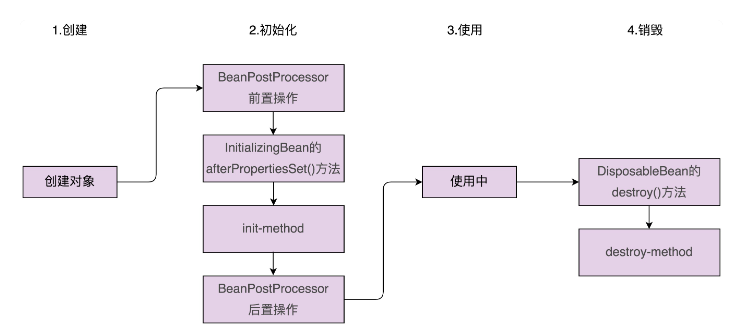
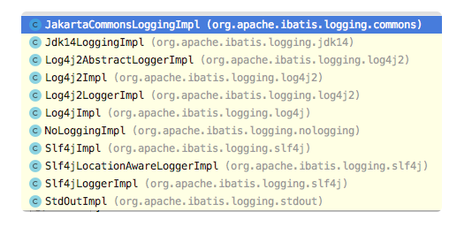

## 1. 开头

经典的开源项目中用到的设计原则、思想和模式

## 2. Java JDK

### 2.1. 工厂模式

工厂模式是用来创建不同但是相关类型的对象（继承同一父类或者接口的一组子类），由给定的参数来决定创建哪种类型的对象

java.util.Calendar

```
public abstract class Calendar implements Serializable, Cloneable, Comparable<Calendar> {
  //...
  public static Calendar getInstance(TimeZone zone, Locale aLocale){
    return createCalendar(zone, aLocale);
  }
  private static Calendar createCalendar(TimeZone zone,Locale aLocale) {
    CalendarProvider provider = LocaleProviderAdapter.getAdapter(
        CalendarProvider.class, aLocale).getCalendarProvider();
    if (provider != null) {
      try {
        return provider.getInstance(zone, aLocale);
      } catch (IllegalArgumentException iae) {
        // fall back to the default instantiation
      }
    }
    Calendar cal = null;
    if (aLocale.hasExtensions()) {
      String caltype = aLocale.getUnicodeLocaleType("ca");
      if (caltype != null) {
        switch (caltype) {
          case "buddhist":
            cal = new BuddhistCalendar(zone, aLocale);
            break;
          case "japanese":
            cal = new JapaneseImperialCalendar(zone, aLocale);
            break;
          case "gregory":
            cal = new GregorianCalendar(zone, aLocale);
            break;
        }
      }
    }
    if (cal == null) {
      if (aLocale.getLanguage() == "th" && aLocale.getCountry() == "TH") {
        cal = new BuddhistCalendar(zone, aLocale);
      } else if (aLocale.getVariant() == "JP" && aLocale.getLanguage() == "ja" && aLocale.getCountry() == "JP") {
        cal = new JapaneseImperialCalendar(zone, aLocale);
      } else {
        cal = new GregorianCalendar(zone, aLocale);
      }
    }
    return cal;
  }
  //...
}
```


### 2.2. 建造者模式

建造者模式用来创建一种类型的复杂对象，通过设置不同的可选参数，“定制化”地创建不同的对象。

 Calendar 的 Builder 类的 build() 方法，你可能会觉得它有点像工厂模式。你的感觉没错，前面一半代码确实跟 getInstance() 工厂方法类似，根据不同的 type 创建了不同的 Calendar 子类。实际上，后面一半代码才属于标准的建造者模式，根据 setXXX() 方法设置的参数，来定制化刚刚创建的 Calendar 子类对象

```
public abstract class Calendar implements Serializable, Cloneable, Comparable<Calendar> {
  //...
  public static class Builder {
    private static final int NFIELDS = FIELD_COUNT + 1;
    private static final int WEEK_YEAR = FIELD_COUNT;
    private long instant;
    private int[] fields;
    private int nextStamp;
    private int maxFieldIndex;
    private String type;
    private TimeZone zone;
    private boolean lenient = true;
    private Locale locale;
    private int firstDayOfWeek, minimalDaysInFirstWeek;
    public Builder() {}
    
    public Builder setInstant(long instant) {
        if (fields != null) {
            throw new IllegalStateException();
        }
        this.instant = instant;
        nextStamp = COMPUTED;
        return this;
    }
    //...省略n多set()方法
    
    public Calendar build() {
      if (locale == null) {
        locale = Locale.getDefault();
      }
      if (zone == null) {
        zone = TimeZone.getDefault();
      }
      Calendar cal;
      if (type == null) {
        type = locale.getUnicodeLocaleType("ca");
      }
      if (type == null) {
        if (locale.getCountry() == "TH" && locale.getLanguage() == "th") {
          type = "buddhist";
        } else {
          type = "gregory";
        }
      }
      switch (type) {
        case "gregory":
          cal = new GregorianCalendar(zone, locale, true);
          break;
        case "iso8601":
          GregorianCalendar gcal = new GregorianCalendar(zone, locale, true);
          // make gcal a proleptic Gregorian
          gcal.setGregorianChange(new Date(Long.MIN_VALUE));
          // and week definition to be compatible with ISO 8601
          setWeekDefinition(MONDAY, 4);
          cal = gcal;
          break;
        case "buddhist":
          cal = new BuddhistCalendar(zone, locale);
          cal.clear();
          break;
        case "japanese":
          cal = new JapaneseImperialCalendar(zone, locale, true);
          break;
        default:
          throw new IllegalArgumentException("unknown calendar type: " + type);
      }
      cal.setLenient(lenient);
      if (firstDayOfWeek != 0) {
        cal.setFirstDayOfWeek(firstDayOfWeek);
        cal.setMinimalDaysInFirstWeek(minimalDaysInFirstWeek);
      }
      if (isInstantSet()) {
        cal.setTimeInMillis(instant);
        cal.complete();
        return cal;
      }
      if (fields != null) {
        boolean weekDate = isSet(WEEK_YEAR) && fields[WEEK_YEAR] > fields[YEAR];
        if (weekDate && !cal.isWeekDateSupported()) {
          throw new IllegalArgumentException("week date is unsupported by " + type);
        }
        for (int stamp = MINIMUM_USER_STAMP; stamp < nextStamp; stamp++) {
          for (int index = 0; index <= maxFieldIndex; index++) {
            if (fields[index] == stamp) {
              cal.set(index, fields[NFIELDS + index]);
              break;
             }
          }
        }
        if (weekDate) {
          int weekOfYear = isSet(WEEK_OF_YEAR) ? fields[NFIELDS + WEEK_OF_YEAR] : 1;
          int dayOfWeek = isSet(DAY_OF_WEEK) ? fields[NFIELDS + DAY_OF_WEEK] : cal.getFirstDayOfWeek();
          cal.setWeekDate(fields[NFIELDS + WEEK_YEAR], weekOfYear, dayOfWeek);
        }
        cal.complete();
      }
      return cal;
    }
  }
}

```

**PS:StringBuilder的主要方法append，其实就是类似于建造者模式中的set方法，只不过构建者模式的set方法可能是对象的不同属性，但append其实是在一直修改一个属性，且最后没有build(),但StringBuilder出现的目的其实是为了解决String不可变的问题，最终输出其实是String，所以可以类比toString()就是build()，所以认为算是建造者模式**

### 2.3. 装饰器模式

Java 的 Collections 类也用到了装饰器模式。装饰器模式中的装饰器类是对原始类功能的增强

Collections 类是一个集合容器的工具类，提供了很多静态方法，用来创建各种集合容器，比如通过 unmodifiableColletion() 静态方法，来创建 UnmodifiableCollection 类对象。而这些容器类中的 UnmodifiableCollection 类、CheckedCollection 和 SynchronizedCollection 类，就是针对 Collection 类的装饰器类。

因为刚刚提到的这三个装饰器类，在代码结构上几乎一样，所以，我们这里只拿其中的 UnmodifiableCollection 类来举例讲解一下。UnmodifiableCollection 类是 Collections 类的一个内部类，相关代码我摘抄到了下面，你可以先看下

```
public class Collections {
  private Collections() {}
    
  public static <T> Collection<T> unmodifiableCollection(Collection<? extends T> c) {
    return new UnmodifiableCollection<>(c);
  }
  static class UnmodifiableCollection<E> implements Collection<E>,   Serializable {
    private static final long serialVersionUID = 1820017752578914078L;
    final Collection<? extends E> c;
    UnmodifiableCollection(Collection<? extends E> c) {
      if (c==null)
        throw new NullPointerException();
      this.c = c;
    }
    public int size()                   {return c.size();}
    public boolean isEmpty()            {return c.isEmpty();}
    public boolean contains(Object o)   {return c.contains(o);}
    public Object[] toArray()           {return c.toArray();}
    public <T> T[] toArray(T[] a)       {return c.toArray(a);}
    public String toString()            {return c.toString();}
    public Iterator<E> iterator() {
      return new Iterator<E>() {
        private final Iterator<? extends E> i = c.iterator();
        public boolean hasNext() {return i.hasNext();}
        public E next()          {return i.next();}
        public void remove() {
          throw new UnsupportedOperationException();
        }
        @Override
        public void forEachRemaining(Consumer<? super E> action) {
          // Use backing collection version
          i.forEachRemaining(action);
        }
      };
    }
    public boolean add(E e) {
      throw new UnsupportedOperationException();
    }
    public boolean remove(Object o) {
       hrow new UnsupportedOperationException();
    }
    public boolean containsAll(Collection<?> coll) {
      return c.containsAll(coll);
    }
    public boolean addAll(Collection<? extends E> coll) {
      throw new UnsupportedOperationException();
    }
    public boolean removeAll(Collection<?> coll) {
      throw new UnsupportedOperationException();
    }
    public boolean retainAll(Collection<?> coll) {
      throw new UnsupportedOperationException();
    }
    public void clear() {
      throw new UnsupportedOperationException();
    }
    // Override default methods in Collection
    @Override
    public void forEach(Consumer<? super E> action) {
      c.forEach(action);
    }
    @Override
    public boolean removeIf(Predicate<? super E> filter) {
      throw new UnsupportedOperationException();
    }
    @SuppressWarnings("unchecked")
    @Override
    public Spliterator<E> spliterator() {
      return (Spliterator<E>)c.spliterator();
    }
    @SuppressWarnings("unchecked")
    @Override
    public Stream<E> stream() {
      return (Stream<E>)c.stream();
    }
    @SuppressWarnings("unchecked")
    @Override
    public Stream<E> parallelStream() {
      return (Stream<E>)c.parallelStream();
    }
  }
}
```

UnmodifiableCollection 的构造函数接收一个 Collection 类对象，然后对其所有的函数进行了包裹（Wrap）：重新实现（比如 add() 函数）或者简单封装（比如 stream() 函数）。而简单的接口实现或者继承，并不会如此来实现 UnmodifiableCollection 类。所以，从代码实现的角度来说，UnmodifiableCollection 类是典型的装饰器类

### 2.4. 适配器模式

适配器模式可以用来兼容老的版本接口。

老版本的 JDK 提供了 Enumeration 类来遍历容器。新版本的 JDK 用 Iterator 类替代 Enumeration 类来遍历容器。为了兼容老的客户端代码（使用老版本 JDK 的代码），我们保留了 Enumeration 类，并且在 Collections 类中，仍然保留了 enumaration() 静态方法（因为我们一般都是通过这个静态函数来创建一个容器的 Enumeration 类对象）

不过，保留 Enumeration 类和 enumeration() 函数，都只是为了兼容，实际上，跟适配器没有一点关系。那到底哪一部分才是适配器呢？

在新版本的 JDK 中，Enumeration 类是适配器类。它适配的是客户端代码（使用 Enumeration 类）和新版本 JDK 中新的迭代器 Iterator 类。不过，从代码实现的角度来说，这个适配器模式的代码实现，跟经典的适配器模式的代码实现，差别稍微有点大。enumeration() 静态函数的逻辑和 Enumeration 适配器类的代码耦合在一起，enumeration() 静态函数直接通过 new 的方式创建了匿名类对象

```
/**
 * Returns an enumeration over the specified collection.  This provides
 * interoperability with legacy APIs that require an enumeration
 * as input.
 *
 * @param  <T> the class of the objects in the collection
 * @param c the collection for which an enumeration is to be returned.
 * @return an enumeration over the specified collection.
 * @see Enumeration
 */
public static <T> Enumeration<T> enumeration(final Collection<T> c) {
  return new Enumeration<T>() {
    private final Iterator<T> i = c.iterator();
    public boolean hasMoreElements() {
      return i.hasNext();
    }
    public T nextElement() {
      return i.next();
    }
  };
}
```

### 2.5. 模板模式

#### 2.5.1. Collections.sort

策略、模板、职责链三个模式常用在框架的设计中，提供框架的扩展点，让框架使用者，在不修改框架源码的情况下，基于扩展点定制化框架的功能。Java 中的 Collections 类的 sort() 函数就是利用了模板模式的这个扩展特性。

如下所示。这个代码实现了按照不同的排序方式（按照年龄从小到大、按照名字字母序从小到大、按照成绩从大到小）对 students 数组进行排序。

```
public class Demo {
  public static void main(String[] args) {
    List<Student> students = new ArrayList<>();
    students.add(new Student("Alice", 19, 89.0f));
    students.add(new Student("Peter", 20, 78.0f));
    students.add(new Student("Leo", 18, 99.0f));
    Collections.sort(students, new AgeAscComparator());
    print(students);
    
    Collections.sort(students, new NameAscComparator());
    print(students);
    
    Collections.sort(students, new ScoreDescComparator());
    print(students);
  }
  public static void print(List<Student> students) {
    for (Student s : students) {
      System.out.println(s.getName() + " " + s.getAge() + " " + s.getScore());
    }
  }
  public static class AgeAscComparator implements Comparator<Student> {
    @Override
    public int compare(Student o1, Student o2) {
      return o1.getAge() - o2.getAge();
    }
  }
  public static class NameAscComparator implements Comparator<Student> {
    @Override
    public int compare(Student o1, Student o2) {
      return o1.getName().compareTo(o2.getName());
    }
  }
  public static class ScoreDescComparator implements Comparator<Student> {
    @Override
    public int compare(Student o1, Student o2) {
      if (Math.abs(o1.getScore() - o2.getScore()) < 0.001) {
        return 0;
      } else if (o1.getScore() < o2.getScore()) {
        return 1;
      } else {
        return -1;
      }
    }
  }
}
```

Collections.sort() 实现了对集合的排序。为了扩展性，它将其中“比较大小”这部分逻辑，委派给用户来实现。如果我们把比较大小这部分逻辑看作整个排序逻辑的其中一个步骤，那我们就可以把它看作模板模式。不过，从代码实现的角度来看，它看起来有点类似之前讲过的 JdbcTemplate，并不是模板模式的经典代码实现，而是基于 Callback 回调机制来实现的。

不过，在其他资料中，我还看到有人说，Collections.sort() 使用的是策略模式。这样的说法也不是没有道理的。如果我们并不把“比较大小”看作排序逻辑中的一个步骤，而是看作一种算法或者策略，那我们就可以把它看作一种策略模式的应用。

不过，这也不是典型的策略模式，我们前面讲到，在典型的策略模式中，策略模式分为策略的定义、创建、使用这三部分。策略通过工厂模式来创建，并且在程序运行期间，根据配置、用户输入、计算结果等这些不确定因素，动态决定使用哪种策略。而在 Collections.sort() 函数中，策略的创建并非通过工厂模式，策略的使用也非动态确定

### 2.6. 观察者模式

实际上，Java JDK 也提供了观察者模式的简单框架实现。在平时的开发中，如果我们不希望引入 Google Guava 开发库，可以直接使用 Java 语言本身提供的这个框架类。

不过，它比 EventBus 要简单多了，只包含两个类：java.util.Observable 和 java.util.Observer。前者是被观察者，后者是观察者。它们的代码实现也非常简单，为了方便你查看，我直接 copy-paste 到了这里

```
public interface Observer {
    void update(Observable o, Object arg);
}
public class Observable {
    private boolean changed = false;
    private Vector<Observer> obs;
    public Observable() {
        obs = new Vector<>();
    }
    public synchronized void addObserver(Observer o) {
        if (o == null)
            throw new NullPointerException();
        if (!obs.contains(o)) {
            obs.addElement(o);
        }
    }
    public synchronized void deleteObserver(Observer o) {
        obs.removeElement(o);
    }
    public void notifyObservers() {
        notifyObservers(null);
    }
    public void notifyObservers(Object arg) {
        Object[] arrLocal;
        synchronized (this) {
            if (!changed)
                return;
            arrLocal = obs.toArray();
            clearChanged();
        }
        for (int i = arrLocal.length-1; i>=0; i--)
            ((Observer)arrLocal[i]).update(this, arg);
    }
    public synchronized void deleteObservers() {
        obs.removeAllElements();
    }
    protected synchronized void setChanged() {
        changed = true;
    }
    protected synchronized void clearChanged() {
        changed = false;
    }
}

```

对于 Observable、Observer 的代码实现，大部分都很好理解，我们重点来看其中的两个地方。一个是 changed 成员变量，另一个是 notifyObservers() 函数。

#### 2.6.1. changed 成员变量

它用来表明被观察者（Observable）有没有状态更新。当有状态更新时，我们需要手动调用 setChanged() 函数，将 changed 变量设置为 true，这样才能在调用 notifyObservers() 函数的时候，真正触发观察者（Observer）执行 update() 函数。否则，即便你调用了 notifyObservers() 函数，观察者的 update() 函数也不会被执行。

也就是说，当通知观察者被观察者状态更新的时候，我们需要依次调用 setChanged() 和 notifyObservers() 两个函数，单独调用 notifyObservers() 函数是不起作用的。你觉得这样的设计是不是多此一举呢？

#### 2.6.2. notifyObservers() 函数

为了保证在多线程环境下，添加、移除、通知观察者三个操作之间不发生冲突，Observable 类中的大部分函数都通过 synchronized 加了锁，不过，也有特例，notifyObservers() 这函数就没有加 synchronized 锁。这是为什么呢？在 JDK 的代码实现中，notifyObservers() 函数是如何保证跟其他函数操作不冲突的呢？这种加锁方法是否存在问题？又存在什么问题呢？

notifyObservers() 函数之所以没有像其他函数那样，一把大锁加在整个函数上，主要还是出于性能的考虑。

notifyObservers() 函数依次执行每个观察者的 update() 函数，每个 update() 函数执行的逻辑提前未知，有可能会很耗时。如果在 notifyObservers() 函数上加 synchronized 锁，notifyObservers() 函数持有锁的时间就有可能会很长，这就会导致其他线程迟迟获取不到锁，影响整个 Observable 类的并发性能。

我们知道，Vector 类不是线程安全的，在多线程环境下，同时添加、删除、遍历 Vector 类对象中的元素，会出现不可预期的结果。所以，在 JDK 的代码实现中，为了避免直接给 notifyObservers() 函数加锁而出现性能问题，JDK 采用了一种折中的方案。这个方案有点类似于我们之前讲过的让迭代器支持”快照“的解决方案。

在 notifyObservers() 函数中，我们先拷贝一份观察者列表，赋值给函数的局部变量，我们知道，局部变量是线程私有的，并不在线程间共享。这个拷贝出来的线程私有的观察者列表就相当于一个快照。我们遍历快照，逐一执行每个观察者的 update() 函数。而这个遍历执行的过程是在快照这个局部变量上操作的，不存在线程安全问题，不需要加锁。所以，我们只需要对拷贝创建快照的过程加锁，加锁的范围减少了很多，并发性能提高了。

为什么说这是一种折中的方案呢？这是因为，这种加锁方法实际上是存在一些问题的。在创建好快照之后，添加、删除观察者都不会更新快照，新加入的观察者就不会被通知到，新删除的观察者仍然会被通知到。这种权衡是否能接受完全看你的业务场景。实际上，这种处理方式也是多线程编程中减小锁粒度、提高并发性能的常用方法

### 2.7. 单例模式

JDK 中 java.lang.Runtime 类就是一个单例类。这个类你有没有比较眼熟呢？是的，我们之前讲到 Callback 回调的时候，添加 shutdown hook 就是通过这个类来实现的。

每个 Java 应用在运行时会启动一个 JVM 进程，每个 JVM 进程都只对应一个 Runtime 实例，用于查看 JVM 状态以及控制 JVM 行为。进程内唯一，所以比较适合设计为单例。在编程的时候，我们不能自己去实例化一个 Runtime 对象，只能通过 getRuntime() 静态方法来获得。

Runtime 类的的代码实现如下所示。这里面只包含部分相关代码，其他代码做了省略。从代码中，我们也可以看出，它使用了最简单的饿汉式的单例实现方式。

```
public class Runtime {
  private static Runtime currentRuntime = new Runtime();
  public static Runtime getRuntime() {
    return currentRuntime;
  }
  
  /** Don't let anyone else instantiate this class */
  private Runtime() {}
  
  //....
  public void addShutdownHook(Thread hook) {
    SecurityManager sm = System.getSecurityManager();
    if (sm != null) {
       sm.checkPermission(new RuntimePermission("shutdownHooks"));
    }
    ApplicationShutdownHooks.add(hook);
  }
  //...
}
```

### 2.8. 其它的模式

* 模板模式

  它的两个作用：扩展性和复用性

  Java Servlet、JUnit TestCase、Java InputStream、Java AbstractList 

* 享元模式

  Integer 类中的 -128~127 之间的整型对象是可以复用的，还讲到 String 类型中的常量字符串也是可以复用的。这些都是享元模式的经典应用

* 职责链模式

  Java Servlet 中的 Filter 就是通过职责链来实现的，同时还对比了 Spring 中的 interceptor。实际上，拦截器、过滤器这些功能绝大部分都是采用职责链模式来实现的

* 迭代器模式

   Java 中 Iterator 迭代器的实现

## 3. Unix

​	当代码超过几万行、十几万，甚至几十万行、上百万行的时候，软件的复杂度就会呈指数级增长。这种情况下，我们不仅仅要求程序运行得了，运行得正确，还要求代码看得懂、维护得了。实际上，复杂度不仅仅体现在代码本身，还体现在协作研发上，如何管理庞大的团队，来进行有条不紊地协作开发，也是一个很复杂的难题。

​	Unix 从 1969 年诞生，一直演进至今，代码量有几百万行，如此庞大的项目开发，能够如此完美的协作开发，并且长期维护，保持足够的代码质量，这里面有很多成功的经验可以借鉴。

这里我们的目标主要有三个：

* 从设计原则和思想的角度来看，如何应对庞大而复杂的项目开发？

* 从研发管理和开发技巧的角度来看，如何应对庞大而复杂的项目开发？

* 聚焦在 Code Review 上来看，如何通过 Code Reviwe 保持项目的代码质量？

### 3.1. 设计原则和思想

#### 3.1.1. 封装与抽象

在 Unix、Linux 系统中，有一句经典的话，“Everything is a file”，翻译成中文就是“一切皆文件”。这句话的意思就是，在 Unix、Linux 系统中，很多东西都被抽象成“文件”这样一个概念，比如 Socket、驱动、硬盘、系统信息等。它们使用文件系统的路径作为统一的命名空间（namespace），使用统一的 read、write 标准函数来访问。

比如，我们要查看 CPU 的信息，在 Linux 系统中，我们只需要使用 Vim、Gedit 等编辑器或者 cat 命令，像打开其他文件一样，打开 /proc/cpuinfo，就能查看到相应的信息。除此之外，我们还可以通过查看 /proc/uptime 文件，了解系统运行了多久，查看 /proc/version 了解系统的内核版本等。

实际上，“一切皆文件”就体现了封装和抽象的设计思想。

封装了不同类型设备的访问细节，抽象为统一的文件访问方式，更高层的代码就能基于统一的访问方式，来访问底层不同类型的设备。这样做的好处是，隔离底层设备访问的复杂性。统一的访问方式能够简化上层代码的编写，并且代码更容易复用。

除此之外，抽象和封装还能有效控制代码复杂性的蔓延，将复杂性封装在局部代码中，隔离实现的易变性，提供简单、统一的访问接口，让其他模块来使用，其他模块基于抽象的接口而非具体的实现编程，代码会更加稳定。

#### 3.1.2. 分层与模块化

前面我们也提到，模块化是构建复杂系统的常用手段。

对于像 Unix 这样的复杂系统，没有人能掌控所有的细节。之所以我们能开发出如此复杂的系统，并且能维护得了，最主要的原因就是将系统划分成各个独立的模块，比如进程调度、进程通信、内存管理、虚拟文件系统、网络接口等模块。不同的模块之间通过接口来进行通信，模块之间耦合很小，每个小的团队聚焦于一个独立的高内聚模块来开发，最终像搭积木一样，将各个模块组装起来，构建成一个超级复杂的系统。

除此之外，Unix、Linux 等大型系统之所以能做到几百、上千人有条不紊地协作开发，也归功于模块化做得好。不同的团队负责不同的模块开发，这样即便在不了解全部细节的情况下，管理者也能协调各个模块，让整个系统有效运转。

实际上，除了模块化之外，分层也是我们常用来架构复杂系统的方法。

我们常说，计算机领域的任何问题都可以通过增加一个间接的中间层来解决，这本身就体现了分层的重要性。比如，Unix 系统也是基于分层开发的，它可以大致上分为三层，分别是内核、系统调用、应用层。每一层都对上层封装实现细节，暴露抽象的接口来调用。而且，任意一层都可以被重新实现，不会影响到其他层的代码。

面对复杂系统的开发，我们要善于应用分层技术，把容易复用、跟具体业务关系不大的代码，尽量下沉到下层，把容易变动、跟具体业务强相关的代码，尽量上移到上层。

#### 3.1.3. 基于接口通信

刚刚我们讲了分层、模块化，那不同的层之间、不同的模块之间，是如何通信的呢？一般来讲都是通过接口调用。在设计模块（module）或者层（layer）要暴露的接口的时候，我们要学会隐藏实现，接口从命名到定义都要抽象一些，尽量少涉及具体的实现细节。

比如，Unix 系统提供的 open() 文件操作函数，底层实现非常复杂，涉及权限控制、并发控制、物理存储，但我们用起来却非常简单。除此之外，因为 open() 函数基于抽象而非具体的实现来定义，所以我们在改动 open() 函数的底层实现的时候，并不需要改动依赖它的上层代码。

#### 3.1.4. 高内聚、松耦合

高内聚、松耦合是一个比较通用的设计思想，内聚性好、耦合少的代码，能让我们在修改或者阅读代码的时候，聚集到在一个小范围的模块或者类中，不需要了解太多其他模块或类的代码，让我们的焦点不至于太发散，也就降低了阅读和修改代码的难度。而且，因为依赖关系简单，耦合小，修改代码不会牵一发而动全身，代码改动比较集中，引入 bug 的风险也就减少了很多。

实际上，刚刚讲到的很多方法，比如封装、抽象、分层、模块化、基于接口通信，都能有效地实现代码的高内聚、松耦合。反过来，代码的高内聚、松耦合，也就意味着，抽象、封装做到比较到位、代码结构清晰、分层和模块化合理、依赖关系简单，那代码整体的质量就不会太差。即便某个具体的类或者模块设计得不怎么合理，代码质量不怎么高，影响的范围也是非常有限的。我们可以聚焦于这个模块或者类做相应的小型重构。而相对于代码结构的调整，这种改动范围比较集中的小型重构的难度就小多了。

#### 3.1.5. 为扩展而设计

越是复杂项目，越要在前期设计上多花点时间。提前思考项目中未来可能会有哪些功能需要扩展，提前预留好扩展点，以便在未来需求变更的时候，在不改动代码整体结构的情况下，轻松地添加新功能。

做到代码可扩展，需要代码满足开闭原则。特别是像 Unix 这样的开源项目，有 n 多人参与开发，任何人都可以提交代码到代码库中。代码满足开闭原则，基于扩展而非修改来添加新功能，最小化、集中化代码改动，避免新代码影响到老代码，降低引入 bug 的风险。

除了满足开闭原则，做到代码可扩展，我们前面也提到很多方法，比如封装和抽象，基于接口编程等。识别出代码可变部分和不可变部分，将可变部分封装起来，隔离变化，提供抽象化的不可变接口，供上层系统使用。当具体的实现发生变化的时候，我们只需要基于相同的抽象接口，扩展一个新的实现，替换掉老的实现即可，上游系统的代码几乎不需要修改。

#### 3.1.6. KISS 首要原则

简单清晰、可读性好，是任何大型软件开发要遵循的首要原则。只要可读性好，即便扩展性不好，顶多就是多花点时间、多改动几行代码的事情。但是，如果可读性不好，连看都看不懂，那就不是多花时间可以解决得了的了。如果你对现有代码的逻辑似懂非懂，抱着尝试的心态去修改代码，引入 bug 的可能性就会很大。

不管是自己还是团队，在参与大型项目开发的时候，要尽量避免过度设计、过早优化，在扩展性和可读性有冲突的时候，或者在两者之间权衡，模棱两可的时候，应该选择遵循 KISS 原则，首选可读性。

#### 3.1.7. 最小惊奇原则

《Unix 编程艺术》一书中提到一个 Unix 的经典设计原则，叫“最小惊奇原则”，英文是“The Least Surprise Priciple”。实际上，这个原则等同于“遵守开发规范”，意思是，在做设计或者编码的时候要遵守统一的开发规范，避免反直觉的设计。实际上，关于这一点，我们在前面的编码规范部分也讲到过。

遵从统一的编码规范，所有的代码都像一个人写出来的，能有效地减少阅读干扰。在大型软件开发中，参与开发的人员很多，如果每个人都按照自己的编码习惯来写代码，那整个项目的代码风格就会千奇百怪，这个类是这种编码风格，另一个类又是另外一种风格。在阅读的时候，我们要不停地切换去适应不同的编码风格，可读性就变差了。所以，对于大型项目的开发来说，我们要特别重视遵守统一的开发规范

### 3.2. 研发管理和开发技巧

​	项目越复杂、代码量越多、参与开发人员越多、开发维护时间越长，我们就越是要重视代码质量。代码质量下降会导致项目研发困难重重，比如：开发效率低，招了很多人，天天加班，出活却不多；线上 bug 频发，查找 bug 困难，领导发飙，中层束手无策，工程师抱怨不断。

​	导致代码质量不高的原因有很多，比如：代码无注释，无文档，命名差，层次结构不清晰，调用关系混乱，到处 hardcode，充斥着各种临时解决方案等等。那怎么才能时刻保证代码质量呢？当然，首要的是团队技术素质要过硬，能够适当地利用设计原则、思想、模式编写高质量的代码。除此之外，还有一些外在的方法可循。具体什么方法呢？

#### 3.2.1. 吹毛求疵般地执行编码规范

严格执行代码规范，可以使一个项目乃至整个公司的代码具有完全统一的风格，就像同一个人编写的。而且，命名良好的变量、函数、类和注释，也可以提高代码的可读性。编码规范不难掌握，关键是要严格执行。在 Code Review 时，我们一定要严格要求，看到不符合规范的代码，一定要指出并要求修改。

但是，据我了解，实际情况往往事与愿违。虽然大家都知道优秀的代码规范是怎样的，但在具体写代码的过程中，执行得却不好。我觉得，这种情况产生的主要原因还是不够重视。很多人会觉得，一个变量或者函数命名成啥样，关系并不大。所以命名时不推敲，注释也不写，Code Review 的时候也都一副事不关己的心态，觉得没必要太抠细节。日积月累，项目代码就会变得越来越差。所以我这里还是要强调一下，细节决定成败，代码规范的严格执行极为关键。

#### 3.2.2. 编写高质量的单元测试

单元测试是最容易执行且对提高代码质量见效最快的方法之一。高质量的单元测试不仅仅要求测试覆盖率要高，还要求测试的全面性，除了测试正常逻辑的执行之外，还要重点、全面地测试异常下的执行情况。毕竟代码出问题的地方大部分都发生在异常、边界条件下。

对于大型复杂项目，集成测试、黑盒测试都很难测试全面，因为组合爆炸，穷举所有测试用例的成本很高，几乎是不可能的。单元测试就是很好的补充。它可以在类、函数这些细粒度的代码层面，保证代码运行无误。底层细粒度的代码 bug 少了，组合起来构建而成的整个系统的 bug 也就相应的减少了。

#### 3.2.3. 不流于形式的 Code Review

如果说很多工程师对单元测试不怎么重视，那对 Code Review 就是不怎么接受。我之前跟一些同行聊起 Code Review 的时候，很多人的反应是，这玩意儿不可能很好地执行，形式大于效果，纯粹是浪费时间。是的，即便 Code Review 做得再流畅，也是要花时间的。所以，在业务开发任务繁重的时候，Code Review 往往会流于形式、虎头蛇尾，效果确实不怎么好。

但我们并不能因此就否定 Code Review 本身的价值。在 Google、Facebook 等外企中，Code Review 应用得非常成功，已经成为了开发流程中不可或缺的一部分。所以，要想真正发挥 Code Review 的作用，关键还是要执行到位，不能流于形式。

#### 3.2.4. 开发未动、文档先行

对大部分工程师来说，编写技术文档是件挺让人“反感”的事情。一般来讲，在开发某个系统或者重要模块或者功能之前，我们应该先写技术文档，然后，发送给同组或者相关同事审查，在审查没有问题的情况下再开发。这样能够保证事先达成共识，开发出来的东西不至于走样。而且，当开发完成之后，进行 Code Review 的时候，代码审查者通过阅读开发文档，也可以快速理解代码。

除此之外，对于团队和公司来讲，文档是重要的财富。对新人熟悉代码或任务的交接等，技术文档很有帮助。而且，作为一个规范化的技术团队，技术文档是一种摒弃作坊式开发和个人英雄主义的有效方法，是保证团队有效协作的途径。

#### 3.2.5. 持续重构、重构、重构

我个人比较反对平时不注重代码质量，堆砌烂代码，实在维护不了了就大刀阔斧地重构甚至重写。有的时候，因为项目代码太多，重构很难做到彻底，最后又搞出来一个四不像的怪物，这就更麻烦了！

优秀的代码或架构不是一开始就能设计好的，就像优秀的公司或产品也都是迭代出来的。我们无法 100% 预见未来的需求，也没有足够的精力、时间、资源为遥远的未来买单。所以，随着系统的演进，重构是不可避免的。

虽然我刚刚说不支持大刀阔斧、推倒重来式的大重构，但持续的小重构我还是比较提倡的。它也是时刻保证代码质量、防止代码腐化的有效手段。换句话说，不要等到问题堆得太多了再去解决，要时刻有人对代码整体质量负责任，平时没事就改改代码。千万不要觉得重构代码就是浪费时间，不务正业！

特别是一些业务开发团队，有时候为了快速完成一个业务需求，只追求速度，到处 hard code，在完全不考虑非功能性需求、代码质量的情况下，堆砌烂代码。实际上，这种情况还是比较常见的。不过没关系，等你有时间了，一定要记着重构，不然烂代码越堆越多，总有一天代码会变得无法维护。

#### 3.2.6. 对项目与团队进行拆分

我们知道，团队人比较少，比如十几个人的时候，代码量不多，不超过 10 万行，怎么开发、怎么管理都没问题，大家互相都比较了解彼此做的东西。即便代码质量太差了，我们大不了把它重写一遍。但是，对于一个大型项目来说，参与开发的人员会比较多，代码量很大，有几十万、甚至几百万行代码，有几十、甚至几百号人同时开发维护，那研发管理就变得极其重要。

面对大型复杂项目，我们不仅仅需要对代码进行拆分，还需要对研发团队进行拆分。上一节课我们讲到了一些代码拆分的方法，比如模块化、分层等。同理，我们也可以把大团队拆成几个小团队。每个小团队对应负责一个小的项目（模块、微服务等），这样每个团队负责的项目包含的代码都不至于很多，也不至于出现代码质量太差无法维护的情况

### 3.3.  Code Review

Code Review 中文叫代码审查。据我了解，在国内绝大部分的互联网企业里面，很少有将 Code Review 执行得很好的，这其中包括 BAT 这些大厂。特别是在一些需求变动大、项目工期紧的业务开发部门，就更不可能有 Code Review 流程了。代码写完之后随手就提交上去，然后丢给测试狠命测，发现 bug 再修改。

相反，一些外企非常重视 Code Review，特别是 FLAG 这些大厂，Code Review 落地执行得非常好。在 Google 工作的几年里，我也切实体会到了 Code Review 的好处。这里我就结合我自身的真实感受讲一讲 Code Review 的价值，试着“说服”一下你

如下为code review的价值：

#### 3.3.1. “三人行必有我师”

团队中的资深员工或者技术 leader 的技术比较牛，写的代码很好，他们的代码就不需要 Review 了，我们重点 Review 资历浅的员工的代码就可以了。实际上，这种认识是不对的。

我们都知道，Google 工程师的平均研发水平都很高，但即便如此，我们发现，不管谁提交的代码，包括 Jeff Dean 的，只要需要 Review，都会收到很多 comments（修改意见）。中国有句老话，“三人行必有我师”，我觉得用在这里非常合适。即便自己觉得写得已经很好的代码，只要经过不停地推敲，都有持续改进的空间。

所以，永远不要觉得自己很厉害，写的代码就不需要别人 Review 了；永远不要觉得自己水平很一般，就没有资格给别人 Review 了；更不要觉得技术大牛让你 Review 代码只是缺少你的一个“approve”，随便看看就可以

#### 3.3.2. 摒弃“个人英雄主义”

在一个成熟的公司里，所有的架构设计、实现，都应该是一个团队的产出。尽管这个过程可能会由某个人来主导，但应该是整个团队共同智慧的结晶。

如果一个人默默地写代码提交，不经过团队的 Review，这样的代码蕴含的是一个人的智慧。代码的质量完全依赖于这个人的技术水平。这就会导致代码质量参差不齐。如果经过团队多人 Review、打磨，代码蕴含的是整个团队的智慧，可以保证代码按照团队中的最高水准输出

#### 3.3.3. 提高代码可读性

在大部分情况下，代码的可读性比任何其他方面（比如扩展性等）都重要。可读性好，代表后期维护成本低，线上 bug 容易排查，新人容易熟悉代码，老人离职时代码容易接手。而且，可读性好，也说明代码足够简单，出错可能性小、bug 少。

不过，自己看自己写的代码，总是会觉得很易读，但换另外一个人来读你的代码，他可能就不这么认为了。毕竟自己写的代码，其中涉及的业务、技术自己很熟悉，别人不一定会熟悉。既然自己对可读性的判断很容易出现错觉，那 Code Review 就是一种考察代码可读性的很好手段。如果代码审查者很费劲才能看懂你写的代码，那就说明代码的可读性有待提高了。

还有，不知道你有没有这样的感受，写代码的时候，时间一长，改动的文件一多，就感觉晕乎乎的，脑子不清醒，逻辑不清晰？有句话讲，“旁观者清，当局者迷”，说的就是这个意思。Code Review 能有效地解决“当局者迷”的问题。在正式开始 Code Review 之前，当我们将代码提交到 Review Board（Code Review 的工具界面）之后，所有的代码改动都放到了一块，看起来一目了然、清晰可见。这个时候，还没有等其他同事 Review，我们自己就能发现很多问题

#### 3.3.4. 传帮带的有效途径

良好的团队需要技术和业务的“传帮带”，那如何来做“传帮带”呢？当然，业务上面，我们可能通过文档或口口相传的方式，那技术呢？如何培养初级工程师的技术能力呢？Code Review 就是一种很好的途径。每次 Code Review 都是一次真实案例的讲解。通过 Code Review，在实践中将技术传递给初级工程师，比让他们自己学习、自己摸索来得更高效！

#### 3.3.5. 代码不止一个人熟悉

如果一段代码只有一个人熟悉，如果这个同事休假了或离职了，代码交接起来就比较费劲。有时候，我们单纯只看代码还看不大懂，又要跟 PM、业务团队、或者其他技术团队，再重复来一轮沟通，搞的其他团队的人都很烦。而 Code Review 能保证任何代码同时都至少有两个同事熟悉，互为备份，有备无患，除非两个同事同时都离职……

#### 3.3.6. 打造良好的技术氛围

提交代码 Review 的人，希望自己写的代码足够优秀，毕竟被同事 Review 出很多问题，是件很丢人的事情。而做 Code review 的人，也希望自己尽可能地提出有建设性意见，展示自己的能力。所以，Code Review 还能增进技术交流，活跃技术氛围，培养大家的极客精神，以及对代码质量的追求。

一个良好的技术氛围，能让团队有很强的自驱力。不用技术 leader 反复强调代码质量有多重要，团队中的成员就会自己主动去关注代码质量的问题。这比制定各种规章制度、天天督促执行要更加有效。实际上，我多说一句，好的技术氛围也能降低团队的离职率

#### 3.3.7. 是一种技术沟通方式

Talk is cheap，show me the code。怎么“show”，通过 Code Review 工具来“show”，这样也方便别人反馈意见。特别是对于跨不同办公室、跨时区的沟通，Code Review 是一种很好的沟通方式。我今天白天写的代码，明天来上班的时候，跨时区的同事已经帮我 Review 好了，我就可以改改提交，继续写新的代码了。这样的协作效率会很高

#### 3.3.8. 提高团队的自律性

在开发过程中，难免会有人不自律，存在侥幸心理：反正我写的代码也没人看，随便写写就提交了。Code Review 相当于一次代码直播，曝光 dirty code，有一定的威慑力。这样大家就不敢随便应付一下就提交代码了

**如何在团队中落地执行 Code Review？**

刚刚讲了这么多 Code Review 的好处，我觉得大部分你应该都能认可，但我猜你可能会说，Google 之所以能很好地执行 Code Review，一方面是因为有经验的传承，起步阶段已经过去了；另一方面是本身员工技术素质、水平就很高，那在一个技术水平没那么强的团队，在起步阶段或项目工期很紧的情况下，如何落地执行 Code Review 呢？

接下来，我就很多人关于 Code Review 的一些疑惑，谈谈我自己的看法。

**有人认为，Code Review 流程太长，太浪费时间，特别是工期紧的时候，今天改的代码，明天就要上，如果要等同事 Review，同事有可能没时间，这样就来不及。这个时候该怎么办呢？**

我所经历的项目还没有一个因为工期紧，导致没有时间 Code Review 的。工期都是人排的，稍微排松点就行了啊。我觉得关键还是在于整个公司对 Code Review 的接受程度。而且，Code Review 熟练之后，并不需要花费太长的时间。尽管开始做 Code Review 的时候，你可能因为不熟练，需要有一个 checklist 对照着来做。起步阶段可能会比较耗时。但当你熟练之后，Code Review 就像键盘盲打一样，你已经忘记了哪个手指按的是哪个键了，扫一遍代码就能揪出绝大部分问题。

**有人认为，业务一直在变，今天写的代码明天可能就要再改，代码可能不会长期维护，写得太好也没用。这种情况下是不是就不需要 Code Review 了呢？**

这种现象在游戏开发、一些早期的创业公司或者项目验证阶段比较常见。项目讲求短平快，先验证产品，再优化技术。如果确实面对的还只是生存问题，代码质量确实不是首要的，特殊情况下，不做 Code Review 是支持的！

有人说，团队成员技术水平不高，过往也没有 Code Review 的经验，不知道 Review 什么，也 Review 不出什么。自己代码都没写明白，不知道什么样的代码是好的，什么样的代码是差的，更不要说 Review 别人的代码了。在 Code Review 的时候，团队成员大眼瞪小眼，只能 Review 点语法，形式大于效果。这种情况该怎么办？

这种情况也挺常见。不过没关系，团队的技术水平都是可以培养的。我们可以先让资深同事、技术好的同事或技术 leader，来 Review 其他所有人的代码。Review 的过程本身就是一种“传帮带”的过程。慢慢地，整个团队就知道该如何 Review 了。虽然这可能会有一个相当长的过程，但如果真的想在团队中执行 Code Review，这不失为一种“曲线救国”的方法。

**还有人说，刚开始 Code Review 的时候，大家都还挺认真，但时间长了，大家觉得这事跟 KPI 无关，而且我还要看别人的代码，理解别人写的代码的业务，多浪费时间啊。慢慢地，Code Review 就变得流于形式了。有人提交了代码，随便抓个人 Review。Review 的人也不认真，随便扫一眼就点“approve”。这种情况该如何应对？**

我的对策是这样的。首先，要明确的告诉 Code Review 的重要性，要严格执行，让大家不要懈怠，适当的时候可以“杀鸡儆猴”。其次，可以像 Google 一样，将 Code Review 间接地跟 KPI、升职等联系在一块，高级工程师有义务做 Code Review，就像有义务做技术面试一样。再次，想办法活跃团队的技术氛围，把 Code Review 作为一种展示自己技术的机会，带动起大家对 Code Review 的积极性，提高大家对 Code Review 的认同感。

最后，我再多说几句。Google 的 Code Review 是做得很好的，可以说是谷歌保持代码高质量最有效的手段之一了。Google 的 Code Review 非常严格，多一个空行，多一个空格，注释有拼错的单词，变量命名得不够好，都会被指出来要求修改。之所以如此吹毛求疵，并非矫枉过正，而是要给大家传递一个信息：代码质量非常重要，一点都不能马虎

## 4. Guava

​	Google Guava 是一个非常成功、非常受欢迎的开源项目。它在 GitHub 上由近 3.7 万的 stars。在 Java 项目开发中应用很广泛。当然，我们并不会讲解其中的每个类、接口如何使用，而是重点讲解其背后蕴含的设计思想、使用的设计模式。内容比较多，我分三节课来讲解

​	Google Guava 是 Google 公司内部 Java 开发工具库的开源版本。Google 内部的很多 Java 项目都在使用它。它提供了一些 JDK 没有提供的功能，以及对 JDK 已有功能的增强功能。其中就包括：集合（Collections）、缓存（Caching）、原生类型支持（Primitives Support）、并发库（Concurrency Libraries）、通用注解（Common Annotation）、字符串处理（Strings Processing）、数学计算（Math）、I/O、事件总线（EventBus）

​	做业务开发也会涉及很多非业务功能的开发。我们要有善于发现、善于抽象的能力，并且具有扎实的设计、开发能力，能够发现这些非业务的、可复用的功能点，并且从业务逻辑中将其解耦抽象出来，设计并开发成独立的功能模块，比如类库、框架、功能组件。

​	实际上，不管是类库、框架还是功能组件，这些通用功能模块最大的两个特点就是复用和业务无关。如果你开发的这块代码，业务无关并且可能会被复用，那就可以考虑将它独立出来，开发成类库、框架、功能组件等。

​	当我们发现了通用功能模块的开发需求之后，如何将它设计开发成一个优秀的类库、框架或功能组件呢？这里我们讲了一些更普适的开发思想，比如产品意识、服务意识、代码质量意识、不要重复造轮子等。

​	除此之外，我特别建议你去阅读一下 Google Guava 的开源代码。它的代码不复杂，很容易读懂，不会有太大阅读负担，但它是你获取 Google 公司开发经验的一手资料，特别是在单元测试、编码规范方面。

### 4.1. guava中的设计模式

#### 4.1.1. Builder 模式

Google Guava 来构建内存缓存非常简单

```
public class CacheDemo {
  public static void main(String[] args) {
    Cache<String, String> cache = CacheBuilder.newBuilder()
            .initialCapacity(100)
            .maximumSize(1000)
            .expireAfterWrite(10, TimeUnit.MINUTES)
            .build();
    cache.put("key1", "value1");
    String value = cache.getIfPresent("key1");
    System.out.println(value);
  }
}
```

Cache 对象是通过 CacheBuilder 这样一个 Builder 类来创建的，其这么做的原因为：

构建一个缓存，需要配置 n 多参数，比如过期时间、淘汰策略、最大缓存大小等等。相应地，Cache 类就会包含 n 多成员变量。我们需要在构造函数中，设置这些成员变量的值，但又不是所有的值都必须设置，设置哪些值由用户来决定。为了满足这个需求，我们就需要定义多个包含不同参数列表的构造函数

为了避免构造函数的参数列表过长、不同的构造函数过多，我们一般有两种解决方案。其中，一个解决方案是使用 Builder 模式；另一个方案是先通过无参构造函数创建对象，然后再通过 setXXX() 方法来逐一设置需要的设置的成员变量

必须使用 Builder 模式的主要原因是，在真正构造 Cache 对象的时候，我们必须做一些必要的参数校验，也就是 build() 函数中前两行代码要做的工作。如果采用无参默认构造函数加 setXXX() 方法的方案，这两个校验就无处安放了。而不经过校验，创建的 Cache 对象有可能是不合法、不可用的。校验的代码如下：

```
public <K1 extends K, V1 extends V> Cache<K1, V1> build() {
  this.checkWeightWithWeigher();
  this.checkNonLoadingCache();
  return new LocalManualCache(this);
}
private void checkNonLoadingCache() {
  Preconditions.checkState(this.refreshNanos == -1L, "refreshAfterWrite requires a LoadingCache");
}
private void checkWeightWithWeigher() {
  if (this.weigher == null) {
    Preconditions.checkState(this.maximumWeight == -1L, "maximumWeight requires weigher");
  } else if (this.strictParsing) {
    Preconditions.checkState(this.maximumWeight != -1L, "weigher requires maximumWeight");
  } else if (this.maximumWeight == -1L) {
    logger.log(Level.WARNING, "ignoring weigher specified without maximumWeight");
  }
}
```

#### 4.1.2. Wrapper 模式

​	代理模式、装饰器、适配器模式可以统称为 Wrapper 模式，通过 Wrapper 类二次封装原始类。它们的代码实现也很相似，都可以通过组合的方式，将 Wrapper 类的函数实现委托给原始类的函数来实现

在 Google Guava 的 collection 包路径下，有一组以 Forwarding 开头命名的类

```
public class AddLoggingCollection<E> extends ForwardingCollection<E> {
  private static final Logger logger = LoggerFactory.getLogger(AddLoggingCollection.class);
  private Collection<E> originalCollection;
  public AddLoggingCollection(Collection<E> originalCollection) {
    this.originalCollection = originalCollection;
  }
  @Override
  protected Collection delegate() {
    return this.originalCollection;
  }
  @Override
  public boolean add(E element) {
    logger.info("Add element: " + element);
    return this.delegate().add(element);
  }
  @Override
  public boolean addAll(Collection<? extends E> collection) {
    logger.info("Size of elements to add: " + collection.size());
    return this.delegate().addAll(collection);
  }
}

```

在上面的代码中，AddLoggingCollection 是基于代理模式实现的一个代理类，它在原始 Collection 类的基础之上，针对“add”相关的操作，添加了记录日志的功能。

我们前面讲到，代理模式、装饰器、适配器模式可以统称为 Wrapper 模式，通过 Wrapper 类二次封装原始类。它们的代码实现也很相似，都可以通过组合的方式，将 Wrapper 类的函数实现委托给原始类的函数来实现

```
public interface Interf {
  void f1();
  void f2();
}
public class OriginalClass implements Interf {
  @Override
  public void f1() { //... }
  @Override
  public void f2() { //... }
}
public class WrapperClass implements Interf {
  private OriginalClass oc;
  public WrapperClass(OriginalClass oc) {
    this.oc = oc;
  }
  @Override
  public void f1() {
    //...附加功能...
    this.oc.f1();
    //...附加功能...
  }
  @Override
  public void f2() {
    this.oc.f2();
  }
}
```

​	这个 ForwardingCollection 类是一个“默认 Wrapper 类”或者叫“缺省 Wrapper 类”。这类似于在装饰器模式那一节课中，讲到的 FilterInputStream 缺省装饰器类。

​	如果我们不使用这个 ForwardinCollection 类，而是让 AddLoggingCollection 代理类直接实现 Collection 接口，那 Collection 接口中的所有方法，都要在 AddLoggingCollection 类中实现一遍，而真正需要添加日志功能的只有 add() 和 addAll() 两个函数，其他函数的实现，都只是类似 Wrapper 类中 f2() 函数的实现那样，简单地委托给原始 collection 类对象的对应函数。

​	为了简化 Wrapper 模式的代码实现，Guava 提供一系列缺省的 Forwarding 类。用户在实现自己的 Wrapper 类的时候，基于缺省的 Forwarding 类来扩展，就可以只实现自己关心的方法，其他不关心的方法使用缺省 Forwarding 类的实现，就像 AddLoggingCollection 类的实现那样。

#### 4.1.3. Immutable 模式

Immutable 模式，中文叫作不变模式，它并不属于经典的 23 种设计模式，但作为一种较常用的设计思路，可以总结为一种设计模式来学习。

一个对象的状态在对象创建之后就不再改变，这就是所谓的不变模式。其中涉及的类就是**不变类**（Immutable Class），对象就是**不变对象**（Immutable Object）。在 Java 中，最常用的不变类就是 String 类，String 对象一旦创建之后就无法改变。

不变模式可以分为两类，一类是普通不变模式，另一类是深度不变模式（Deeply Immutable Pattern）。普通的不变模式指的是，对象中包含的引用对象是可以改变的。如果不特别说明，通常我们所说的不变模式，指的就是普通的不变模式。深度不变模式指的是，对象包含的引用对象也不可变。它们两个之间的关系，有点类似之前讲过的浅拷贝和深拷贝之间的关系。我举了一个例子来进一步解释一下，代码如下所示：

```
// 普通不变模式
public class User {
  private String name;
  private int age;
  private Address addr;
  
  public User(String name, int age, Address addr) {
    this.name = name;
    this.age = age;
    this.addr = addr;
  }
  // 只有getter方法，无setter方法...
}
public class Address {
  private String province;
  private String city;
  public Address(String province, String city) {
    this.province = province;
    this.city= city;
  }
  // 有getter方法，也有setter方法...
}
// 深度不变模式
public class User {
  private String name;
  private int age;
  private Address addr;
  
  public User(String name, int age, Address addr) {
    this.name = name;
    this.age = age;
    this.addr = addr;
  }
  // 只有getter方法，无setter方法...
}
public class Address {
  private String province;
  private String city;
  public Address(String province, String city) {
    this.province = province;
    this.city= city;
  }
  // 只有getter方法，无setter方法..
}
```

在某个业务场景下，如果一个对象符合创建之后就不会被修改这个特性，那我们就可以把它设计成不变类。显式地强制它不可变，这样能避免意外被修改。那如何将一个不变类呢？方法很简单，只要这个类满足：所有的成员变量都通过构造函数一次性设置好，不暴露任何 set 等修改成员变量的方法。除此之外，因为数据不变，所以不存在并发读写问题，因此不变模式常用在多线程环境下，来避免线程加锁。所以，不变模式也常被归类为多线程设计模式。

接下来，我们来看一种特殊的不变类，那就是不变集合。Google Guava 针对集合类（Collection、List、Set、Map…）提供了对应的不变集合类（ImmutableCollection、ImmutableList、ImmutableSet、ImmutableMap…）。刚刚我们讲过，不变模式分为两种，普通不变模式和深度不变模式。Google Guava 提供的不变集合类属于前者，也就是说，集合中的对象不会增删，但是对象的成员变量（或叫属性值）是可以改变的。

实际上，Java JDK 也提供了不变集合类（UnmodifiableCollection、UnmodifiableList、UnmodifiableSet、UnmodifiableMap…）。那它跟 Google Guava 提供的不变集合类的区别在哪里呢？我举个例子你就明白了，代码如下所示：

```
public class ImmutableDemo {
  public static void main(String[] args) {
    List<String> originalList = new ArrayList<>();
    originalList.add("a");
    originalList.add("b");
    originalList.add("c");
    List<String> jdkUnmodifiableList = Collections.unmodifiableList(originalList);
    List<String> guavaImmutableList = ImmutableList.copyOf(originalList);
    //jdkUnmodifiableList.add("d"); // 抛出UnsupportedOperationException
    // guavaImmutableList.add("d"); // 抛出UnsupportedOperationException
    originalList.add("d");
    print(originalList); // a b c d
    print(jdkUnmodifiableList); // a b c d
    print(guavaImmutableList); // a b c
  }
  private static void print(List<String> list) {
    for (String s : list) {
      System.out.print(s + " ");
    }
    System.out.println();
  }
}
```

### 4.2. guava中的函数式编程

函数式编程因其编程的特殊性，仅在科学计算、数据处理、统计分析等领域，才能更好地发挥它的优势，它并不能完全替代更加通用的面向对象编程范式。但是，作为一种补充，它也有很大存在、发展和学习的意义

#### 4.2.1. 什么是函数式编程

面向过程、面向对象编程并没有严格的官方定义。在当时的讲解中，我也只是给出了我自己总结的定义。而且，当时给出的定义也只是对两个范式主要特性的总结，并不是很严格。实际上，函数式编程也是如此，也没有一个严格的官方定义。所以，接下来，我就从特性上来告诉你，什么是函数式编程。

严格上来讲，函数式编程中的“函数”，并不是指我们编程语言中的“函数”概念，而是指数学“函数”或者“表达式”（比如，y=f(x)）。不过，在编程实现的时候，对于数学“函数”或“表达式”，我们一般习惯性地将它们设计成函数。所以，如果不深究的话，函数式编程中的“函数”也可以理解为编程语言中的“函数”。

每个编程范式都有自己独特的地方，这就是它们会被抽象出来作为一种范式的原因。面向对象编程最大的特点是：以类、对象作为组织代码的单元以及它的四大特性。面向过程编程最大的特点是：以函数作为组织代码的单元，数据与方法相分离。那函数式编程最独特的地方又在哪里呢？

实际上，函数式编程最独特的地方在于它的编程思想。函数式编程认为，程序可以用一系列数学函数或表达式的组合来表示。函数式编程是程序面向数学的更底层的抽象，将计算过程描述为表达式。不过，这样说你肯定会有疑问，真的可以把任何程序都表示成一组数学表达式吗？

理论上讲是可以的。但是，并不是所有的程序都适合这么做。函数式编程有它自己适合的应用场景，比如开篇提到的科学计算、数据处理、统计分析等。在这些领域，程序往往比较容易用数学表达式来表示，比起非函数式编程，实现同样的功能，函数式编程可以用很少的代码就能搞定。但是，对于强业务相关的大型业务系统开发来说，费劲吧啦地将它抽象成数学表达式，硬要用函数式编程来实现，显然是自讨苦吃。相反，在这种应用场景下，面向对象编程更加合适，写出来的代码更加可读、可维护。

刚刚讲的是函数式编程的编程思想，如果我们再具体到编程实现，函数式编程跟面向过程编程一样，也是以函数作为组织代码的单元。不过，它跟面向过程编程的区别在于，它的函数是无状态的。何为无状态？简单点讲就是，函数内部涉及的变量都是局部变量，不会像面向对象编程那样，共享类成员变量，也不会像面向过程编程那样，共享全局变量。函数的执行结果只与入参有关，跟其他任何外部变量无关。同样的入参，不管怎么执行，得到的结果都是一样的。这实际上就是数学函数或数学表达式的基本要求。我举个例子来简单解释一下

```
// 有状态函数: 执行结果依赖b的值是多少，即便入参相同，多次执行函数，函数的返回值有可能不同，因为b值有可能不同。
int b;
int increase(int a) {
  return a + b;
}
// 无状态函数：执行结果不依赖任何外部变量值，只要入参相同，不管执行多少次，函数的返回值就相同
int increase(int a, int b) {
  return a + b;
}
```

这里稍微总结一下，不同的编程范式之间并不是截然不同的，总是有一些相同的编程规则。比如，不管是面向过程、面向对象还是函数式编程，它们都有变量、函数的概念，最顶层都要有 main 函数执行入口，来组装编程单元（类、函数等）。只不过，面向对象的编程单元是类或对象，面向过程的编程单元是函数，函数式编程的编程单元是无状态函数。

#### 4.2.2. Java 对函数式编程的支持

我们前面讲到，实现面向对象编程不一定非得使用面向对象编程语言，同理，实现函数式编程也不一定非得使用函数式编程语言。现在，很多面向对象编程语言，也提供了相应的语法、类库来支持函数式编程。

接下来，我们就看下 Java 这种面向对象编程语言，对函数式编程的支持，借机加深一下你对函数式编程的理解。我们先来看下面这样一段非常典型的 Java 函数式编程的代码。

```
public class FPDemo {
  public static void main(String[] args) {
    Optional<Integer> result = Stream.of("f", "ba", "hello")
            .map(s -> s.length())
            .filter(l -> l <= 3)
            .max((o1, o2) -> o1-o2);
    System.out.println(result.get()); // 输出2
  }
}
```

这段代码的作用是从一组字符串数组中，过滤出长度小于等于 3 的字符串，并且求得这其中的最大长度。

如果你不了解 Java 函数式编程的语法，看了上面的代码或许会有些懵，主要的原因是，Java 为函数式编程引入了三个新的语法概念：Stream 类、Lambda 表达式和函数接口（Functional Inteface）。Stream 类用来支持通过“.”级联多个函数操作的代码编写方式；引入 Lambda 表达式的作用是简化代码编写；函数接口的作用是让我们可以把函数包裹成函数接口，来实现把函数当做参数一样来使用（Java 不像 C 一样支持函数指针，可以把函数直接当参数来使用）

* **我们来看下 Stream 类:**

  我对代码做了注释解释，如下所示。其中，map、filter 是中间操作，返回 Stream 类对象，可以继续级联其他操作；max 是终止操作，返回的不是 Stream 类对象，无法再继续往下级联处理了。

  ```
  public class FPDemo {
    public static void main(String[] args) {
      Optional<Integer> result = Stream.of("f", "ba", "hello") // of返回Stream<String>对象
              .map(s -> s.length()) // map返回Stream<Integer>对象
              .filter(l -> l <= 3) // filter返回Stream<Integer>对象
              .max((o1, o2) -> o1-o2); // max终止操作：返回Optional<Integer>
      System.out.println(result.get()); // 输出2
    }
  }
  ```

*  **Lambda 表达式**

  Java 引入 Lambda 表达式的主要作用是简化代码编写。实际上，我们也可以不用 Lambda 表达式来书写例子中的代码。我们拿其中的 map 函数来举例说明一下。

  下面有三段代码，第一段代码展示了 map 函数的定义，实际上，map 函数接收的参数是一个 Function 接口，也就是待会儿要讲到的函数接口。第二段代码展示了 map 函数的使用方式。第三段代码是针对第二段代码用 Lambda 表达式简化之后的写法。实际上，Lambda 表达式在 Java 中只是一个语法糖而已，底层是基于函数接口来实现的，也就是第二段代码展示的写法

  ```
  // Stream中map函数的定义：
  public interface Stream<T> extends BaseStream<T, Stream<T>> {
    <R> Stream<R> map(Function<? super T, ? extends R> mapper);
    //...省略其他函数...
  }
  // Stream中map的使用方法：
  Stream.of("fo", "bar", "hello").map(new Function<String, Integer>() {
    @Override
    public Integer apply(String s) {
      return s.length();
    }
  });
  // 用Lambda表达式简化后的写法：
  Stream.of("fo", "bar", "hello").map(s -> s.length());
  ```

  Lambda 表达式包括三部分：输入、函数体、输出。表示出来的话就是下面这个样子：

  ```
  (a, b) -> { 语句1； 语句2；...; return 输出; } //a,b是输入参数
  ```

  Lambda 表达式的写法非常灵活。我们刚刚给出的是标准写法，还有很多简化写法。比如，如果输入参数只有一个，可以省略 ()，直接写成 a->{…}；如果没有入参，可以直接将输入和箭头都省略掉，只保留函数体；如果函数体只有一个语句，那可以将{}省略掉；如果函数没有返回值，return 语句就可以不用写了

  如果我们把之前例子中的 Lambda 表达式，全部替换为函数接口的实现方式，就是下面这样子的。代码是不是多了很多？

  ```
  Optional<Integer> result = Stream.of("f", "ba", "hello")
          .map(s -> s.length())
          .filter(l -> l <= 3)
          .max((o1, o2) -> o1-o2);
          
  // 还原为函数接口的实现方式
  Optional<Integer> result2 = Stream.of("fo", "bar", "hello")
          .map(new Function<String, Integer>() {
            @Override
            public Integer apply(String s) {
              return s.length();
            }
          })
          .filter(new Predicate<Integer>() {
            @Override
            public boolean test(Integer l) {
              return l <= 3;
            }
          })
          .max(new Comparator<Integer>() {
            @Override
            public int compare(Integer o1, Integer o2) {
              return o1 - o2;
            }
          });
  ```

* **函数接口**

  上面一段代码中的 Function、Predicate、Comparator 都是函数接口。我们知道，C 语言支持函数指针，它可以把函数直接当变量来使用。但是，Java 没有函数指针这样的语法。所以，它通过函数接口，将函数包裹在接口中，当作变量来使用。

  实际上，函数接口就是接口。不过，它也有自己特别的地方，那就是要求只包含一个未实现的方法。因为只有这样，Lambda 表达式才能明确知道匹配的是哪个接口。如果有两个未实现的方法，并且接口入参、返回值都一样，那 Java 在翻译 Lambda 表达式的时候，就不知道表达式对应哪个方法了。

  我把 Java 提供的 Function、Predicate 这两个函数接口的源码，摘抄过来贴到了下面，你可以对照着它们，理解我刚刚对函数接口的讲解

  ```
  @FunctionalInterface
  public interface Function<T, R> {
      R apply(T t);  // 只有这一个未实现的方法
      default <V> Function<V, R> compose(Function<? super V, ? extends T> before) {
          Objects.requireNonNull(before);
          return (V v) -> apply(before.apply(v));
      }
      default <V> Function<T, V> andThen(Function<? super R, ? extends V> after) {
          Objects.requireNonNull(after);
          return (T t) -> after.apply(apply(t));
      }
      static <T> Function<T, T> identity() {
          return t -> t;
      }
  }
  @FunctionalInterface
  public interface Predicate<T> {
      boolean test(T t); // 只有这一个未实现的方法
      default Predicate<T> and(Predicate<? super T> other) {
          Objects.requireNonNull(other);
          return (t) -> test(t) && other.test(t);
      }
      default Predicate<T> negate() {
          return (t) -> !test(t);
      }
      default Predicate<T> or(Predicate<? super T> other) {
          Objects.requireNonNull(other);
          return (t) -> test(t) || other.test(t);
      }
      static <T> Predicate<T> isEqual(Object targetRef) {
          return (null == targetRef)
                  ? Objects::isNull
                  : object -> targetRef.equals(object);
      }
  }
  ```

#### 4.2.3. Guava 对函数式编程的增强

如果你是 Google Guava 的设计者，对于 Java 函数式编程，Google Guava 还能做些什么呢？

颠覆式创新是很难的。不过我们可以进行一些补充，一方面，可以增加 Stream 类上的操作（类似 map、filter、max 这样的终止操作和中间操作），另一方面，也可以增加更多的函数接口（类似 Function、Predicate 这样的函数接口）。实际上，我们还可以设计一些类似 Stream 类的新的支持级联操作的类。这样，使用 Java 配合 Guava 进行函数式编程会更加方便。

但是，跟我们预期的相反，Google Guava 并没有提供太多函数式编程的支持，仅仅封装了几个遍历集合操作的接口，代码如下所示：

```
Iterables.transform(Iterable, Function);
Iterators.transform(Iterator, Function);
Collections.transfrom(Collection, Function);
Lists.transform(List, Function);
Maps.transformValues(Map, Function);
Multimaps.transformValues(Mltimap, Function);
...
Iterables.filter(Iterable, Predicate);
Iterators.filter(Iterator, Predicate);
Collections2.filter(Collection, Predicate);
...
```

从 Google Guava 的 GitHub Wiki 中，我们发现，Google 对于函数式编程的使用还是很谨慎的，认为过度地使用函数式编程，会导致代码可读性变差，强调不要滥用。这跟我前面对函数式编程的观点是一致的。所以，在函数式编程方面，Google Guava 并没有提供太多的支持。

之所以对遍历集合操作做了优化，主要是因为函数式编程一个重要的应用场景就是遍历集合。如果不使用函数式编程，我们只能 for 循环，一个一个的处理集合中的数据。使用函数式编程，可以大大简化遍历集合操作的代码编写，一行代码就能搞定，而且在可读性方面也没有太大损失。

#### 4.2.4. 小结

函数式编程以无状态函数作为组织代码的单元。函数的执行结果只与入参有关，跟其他任何外部变量无关。同样的入参，不管怎么执行，得到的结果都是一样。

具体到 Java 语言，它提供了三个语法机制来支持函数式编程。它们分别是 Stream 类、Lambda 表达式和函数接口。Google Guava 对函数式编程的一个重要应用场景，遍历集合，做了优化，但并没有太多的支持，并且我们强调，不要为了节省代码行数，滥用函数式编程，导致代码可读性变差

## 5. Spring

 Spring 框架中蕴含的设计思想、原则和模式。分三部分来讲解：

* 第一部分，为Spring 框架中蕴含的经典设计思想或原则。

* 第二部分，为Spring 框架中用来支持扩展的两种设计模式。

* 第三部分，为Spring 框架中用到的其他十几种设计模式

### 5.1. 简单介绍

#### 5.1.1. 校验介绍

#### 5.1.2. 作用

简化开发

### 5.2. 设计思想和原则

#### 5.2.1. 约定优于配置

#### 5.2.2. 低侵入、松耦合

#### 5.2.3. 模块化、轻量级

#### 5.2.4. 再封装、再抽象

#### 5.2.5. 小结

借助 Spring 框架，我们总结了框架的作用：解耦业务和非业务开发、让程序员聚焦在业务开发上；隐藏复杂实现细节、降低开发难度、减少代码 bug；实现代码复用、节省开发时间；规范化标准化项目开发、降低学习和维护成本等。实际上，如果要用一句话来总结一下的话，那就是简化开发！

除此之外，我们还重点讲解了 Sping 背后蕴含的一些经典设计思想，主要有：约定优于配置，低侵入、松耦合，模块化、轻量级，再封装、再抽象。这些设计思想都比较通用，我们可以借鉴到其他框架的开发中

### 5.3. 设计模式

可扩展也是大部分框架应该具备的一个重要特性。所谓的框架可扩展，我们之前也提到过，意思就是，框架使用者在不修改框架源码的情况下，基于扩展点定制扩展新的功能。

前面在理论部分，我们也讲到，常用来实现扩展特性的设计模式有：观察者模式、模板模式、职责链模式、策略模式等

 Spring 框架为了支持可扩展特性用的 2 种设计模式：观察者模式和模板模式。

实际上，Spring 框架中用到的设计模式非常多，不下十几种

#### 5.3.1. 观察者模式

Spring 中实现的观察者模式包含三部分：Event 事件（相当于消息）、Listener 监听者（相当于观察者）、Publisher 发送者（相当于被观察者）。我们通过一个例子来看下，Spring 提供的观察者模式是怎么使用的。代码如下所示：

```
// Event事件
public class DemoEvent extends ApplicationEvent {
  private String message;
  public DemoEvent(Object source, String message) {
    super(source);
  }
  public String getMessage() {
    return this.message;
  }
}
// Listener监听者
@Component
public class DemoListener implements ApplicationListener<DemoEvent> {
  @Override
  public void onApplicationEvent(DemoEvent demoEvent) {
    String message = demoEvent.getMessage();
    System.out.println(message);
  }
}
// Publisher发送者
@Component
public class DemoPublisher {
  @Autowired
  private ApplicationContext applicationContext;
  public void publishEvent(DemoEvent demoEvent) {
    this.applicationContext.publishEvent(demoEvent);
  }
}
```

​	从代码中，我们可以看出，框架使用起来并不复杂，主要包含三部分工作：定义一个继承 ApplicationEvent 的事件（DemoEvent）；定义一个实现了 ApplicationListener 的监听器（DemoListener）；定义一个发送者（DemoPublisher），发送者调用 ApplicationContext 来发送事件消息。

​	其中，ApplicationEvent 和 ApplicationListener 的代码实现都非常简单，内部并不包含太多属性和方法。实际上，它们最大的作用是做类型标识之用（继承自 ApplicationEvent 的类是事件，实现 ApplicationListener 的类是监听器）

```
public abstract class ApplicationEvent extends EventObject {
  private static final long serialVersionUID = 7099057708183571937L;
  private final long timestamp = System.currentTimeMillis();
  public ApplicationEvent(Object source) {
    super(source);
  }
  public final long getTimestamp() {
    return this.timestamp;
  }
}
public class EventObject implements java.io.Serializable {
    private static final long serialVersionUID = 5516075349620653480L;
    protected transient Object  source;
    public EventObject(Object source) {
        if (source == null)
            throw new IllegalArgumentException("null source");
        this.source = source;
    }
    public Object getSource() {
        return source;
    }
    public String toString() {
        return getClass().getName() + "[source=" + source + "]";
    }
}
public interface ApplicationListener<E extends ApplicationEvent> extends EventListener {
  void onApplicationEvent(E var1);
}
```

在前面讲到观察者模式的时候，我们提到，观察者需要事先注册到被观察者（JDK 的实现方式）或者事件总线（EventBus 的实现方式）中。那在 Spring 的实现中，观察者注册到了哪里呢？又是如何注册的呢？

我想你应该猜到了，我们把观察者注册到了 ApplicationContext 对象中。这里的 ApplicationContext 就相当于 Google EventBus 框架中的“事件总线”。不过，稍微提醒一下，ApplicationContext 这个类并不只是为观察者模式服务的。它底层依赖 BeanFactory（IOC 的主要实现类），提供应用启动、运行时的上下文信息，是访问这些信息的最顶层接口。

实际上，具体到源码来说，ApplicationContext 只是一个接口，具体的代码实现包含在它的实现类 AbstractApplicationContext 中。我把跟观察者模式相关的代码，摘抄到了下面。你只需要关注它是如何发送事件和注册监听者就好，其他细节不需要细究。

```
public abstract class AbstractApplicationContext extends ... {
  private final Set<ApplicationListener<?>> applicationListeners;
  
  public AbstractApplicationContext() {
    this.applicationListeners = new LinkedHashSet();
    //...
  }
  
  public void publishEvent(ApplicationEvent event) {
    this.publishEvent(event, (ResolvableType)null);
  }
  public void publishEvent(Object event) {
    this.publishEvent(event, (ResolvableType)null);
  }
  protected void publishEvent(Object event, ResolvableType eventType) {
    //...
    Object applicationEvent;
    if (event instanceof ApplicationEvent) {
      applicationEvent = (ApplicationEvent)event;
    } else {
      applicationEvent = new PayloadApplicationEvent(this, event);
      if (eventType == null) {
        eventType = ((PayloadApplicationEvent)applicationEvent).getResolvableType();
      }
    }
    if (this.earlyApplicationEvents != null) {
      this.earlyApplicationEvents.add(applicationEvent);
    } else {
      this.getApplicationEventMulticaster().multicastEvent(
            (ApplicationEvent)applicationEvent, eventType);
    }
    if (this.parent != null) {
      if (this.parent instanceof AbstractApplicationContext) {
        ((AbstractApplicationContext)this.parent).publishEvent(event, eventType);
      } else {
        this.parent.publishEvent(event);
      }
    }
  }
  
  public void addApplicationListener(ApplicationListener<?> listener) {
    Assert.notNull(listener, "ApplicationListener must not be null");
    if (this.applicationEventMulticaster != null) {
    this.applicationEventMulticaster.addApplicationListener(listener);
    } else {
      this.applicationListeners.add(listener);
    }  
  }
  
  public Collection<ApplicationListener<?>> getApplicationListeners() {
    return this.applicationListeners;
  }
  
  protected void registerListeners() {
    Iterator var1 = this.getApplicationListeners().iterator();
    while(var1.hasNext()) {
      ApplicationListener<?> listener = (ApplicationListener)var1.next();     this.getApplicationEventMulticaster().addApplicationListener(listener);
    }
    String[] listenerBeanNames = this.getBeanNamesForType(ApplicationListener.class, true, false);
    String[] var7 = listenerBeanNames;
    int var3 = listenerBeanNames.length;
    for(int var4 = 0; var4 < var3; ++var4) {
      String listenerBeanName = var7[var4];
      this.getApplicationEventMulticaster().addApplicationListenerBean(listenerBeanName);
    }
    Set<ApplicationEvent> earlyEventsToProcess = this.earlyApplicationEvents;
    this.earlyApplicationEvents = null;
    if (earlyEventsToProcess != null) {
      Iterator var9 = earlyEventsToProcess.iterator();
      while(var9.hasNext()) {
        ApplicationEvent earlyEvent = (ApplicationEvent)var9.next();
        this.getApplicationEventMulticaster().multicastEvent(earlyEvent);
      }
    }
  }
}
```

从上面的代码中，我们发现，真正的消息发送，实际上是通过 ApplicationEventMulticaster 这个类来完成的。这个类的源码我只摘抄了最关键的一部分，也就是 multicastEvent() 这个消息发送函数。不过，它的代码也并不复杂，我就不多解释了。这里我稍微提示一下，它通过线程池，支持异步非阻塞、同步阻塞这两种类型的观察者模式。

```

public void multicastEvent(ApplicationEvent event) {
  this.multicastEvent(event, this.resolveDefaultEventType(event));
}
public void multicastEvent(final ApplicationEvent event, ResolvableType eventType) {
  ResolvableType type = eventType != null ? eventType : this.resolveDefaultEventType(event);
  Iterator var4 = this.getApplicationListeners(event, type).iterator();
  while(var4.hasNext()) {
    final ApplicationListener<?> listener = (ApplicationListener)var4.next();
    Executor executor = this.getTaskExecutor();
    if (executor != null) {
      executor.execute(new Runnable() {
        public void run() {
          SimpleApplicationEventMulticaster.this.invokeListener(listener, event);
        }
      });
    } else {
      this.invokeListener(listener, event);
    }
  }
}
```

借助 Spring 提供的观察者模式的骨架代码，如果我们要在 Spring 下实现某个事件的发送和监听，只需要做很少的工作，定义事件、定义监听器、往 ApplicationContext 中发送事件就可以了，剩下的工作都由 Spring 框架来完成。实际上，这也体现了 Spring 框架的扩展性，也就是在不需要修改任何代码的情况下，扩展新的事件和监听

#### 5.3.2. 模板模式

经常在面试中被问到的一个问题：请你说下 Spring Bean 的创建过程包含哪些主要的步骤。这其中就涉及模板模式。它也体现了 Spring 的扩展性。利用模板模式，Spring 能让用户定制 Bean 的创建过程。

Spring Bean 的创建过程，可以大致分为两大步：对象的创建和对象的初始化。

对象的创建是通过反射来动态生成对象，而不是 new 方法。不管是哪种方式，说白了，总归还是调用构造函数来生成对象，没有什么特殊的。对象的初始化有两种实现方式。一种是在类中自定义一个初始化函数，并且通过配置文件，显式地告知 Spring，哪个函数是初始化函数。我举了一个例子解释一下。如下所示，在配置文件中，我们通过 init-method 属性来指定初始化函数。

 

不过，你可能会说，这里哪里用到了模板模式啊？模板模式不是需要定义一个包含模板方法的抽象模板类，以及定义子类实现模板方法吗？

实际上，这里的模板模式的实现，并不是标准的抽象类的实现方式，而是有点类似我们前面讲到的 Callback 回调的实现方式，也就是将要执行的函数封装成对象（比如，初始化方法封装成 InitializingBean 对象），传递给模板（BeanFactory）来执行。

#### 5.3.3. 适配器模式

在 Spring MVC 中，定义一个 Controller 最常用的方式是，通过 @Controller 注解来标记某个类是 Controller 类，通过 @RequesMapping 注解来标记函数对应的 URL。不过，定义一个 Controller 远不止这一种方法。我们还可以通过让类实现 Controller 接口或者 Servlet 接口，来定义一个 Controller。针对这三种定义方式，我写了三段示例代码，如下所示：

```
// 方法一：通过@Controller、@RequestMapping来定义
@Controller
public class DemoController {
    @RequestMapping("/employname")
    public ModelAndView getEmployeeName() {
        ModelAndView model = new ModelAndView("Greeting");        
        model.addObject("message", "Dinesh");       
        return model; 
    }  
}
// 方法二：实现Controller接口 + xml配置文件:配置DemoController与URL的对应关系
public class DemoController implements Controller {
    @Override
    public ModelAndView handleRequest(HttpServletRequest req, HttpServletResponse resp) throws Exception {
        ModelAndView model = new ModelAndView("Greeting");
        model.addObject("message", "Dinesh Madhwal");
        return model;
    }
}
// 方法三：实现Servlet接口 + xml配置文件:配置DemoController类与URL的对应关系
public class DemoServlet extends HttpServlet {
  @Override
  protected void doGet(HttpServletRequest req, HttpServletResponse resp) throws ServletException, IOException {
    this.doPost(req, resp);
  }
  
  @Override
  protected void doPost(HttpServletRequest req, HttpServletResponse resp) throws ServletException, IOException {
    resp.getWriter().write("Hello World.");
  }
}
```

在应用启动的时候，Spring 容器会加载这些 Controller 类，并且解析出 URL 对应的处理函数，封装成 Handler 对象，存储到 HandlerMapping 对象中。当有请求到来的时候，DispatcherServlet 从 HanderMapping 中，查找请求 URL 对应的 Handler，然后调用执行 Handler 对应的函数代码，最后将执行结果返回给客户端。

但是，不同方式定义的 Controller，其函数的定义（函数名、入参、返回值等）是不统一的。如上示例代码所示，方法一中的函数的定义很随意、不固定，方法二中的函数定义是 handleRequest()、方法三中的函数定义是 service()（看似是定义了 doGet()、doPost()，实际上，这里用到了模板模式，Servlet 中的 service() 调用了 doGet() 或 doPost() 方法，DispatcherServlet 调用的是 service() 方法）。DispatcherServlet 需要根据不同类型的 Controller，调用不同的函数。下面是具体的伪代码：

```

Handler handler = handlerMapping.get(URL);
if (handler instanceof Controller) {
  ((Controller)handler).handleRequest(...);
} else if (handler instanceof Servlet) {
  ((Servlet)handler).service(...);
} else if (hanlder 对应通过注解来定义的Controller) {
  反射调用方法...
}
```

从代码中我们可以看出，这种实现方式会有很多 if-else 分支判断，而且，如果要增加一个新的 Controller 的定义方法，我们就要在 DispatcherServlet 类代码中，对应地增加一段如上伪代码所示的 if 逻辑。这显然不符合开闭原则。

实际上，我们可以利用是适配器模式对代码进行改造，让其满足开闭原则，能更好地支持扩赞。适配器其中一个作用是“统一多个类的接口设计”。利用适配器模式，我们将不同方式定义的 Controller 类中的函数，适配为统一的函数定义。这样，我们就能在 DispatcherServlet 类代码中，移除掉 if-else 分支判断逻辑，调用统一的函数。

刚刚讲了大致的设计思路，我们再具体看下 Spring 的代码实现。

Spring 定义了统一的接口 HandlerAdapter，并且对每种 Controller 定义了对应的适配器类。这些适配器类包括：AnnotationMethodHandlerAdapter、SimpleControllerHandlerAdapter、SimpleServletHandlerAdapter 等。源码我贴到了下面，你可以结合着看下

```
public interface HandlerAdapter {
  boolean supports(Object var1);
  ModelAndView handle(HttpServletRequest var1, HttpServletResponse var2, Object var3) throws Exception;
  long getLastModified(HttpServletRequest var1, Object var2);
}
// 对应实现Controller接口的Controller
public class SimpleControllerHandlerAdapter implements HandlerAdapter {
  public SimpleControllerHandlerAdapter() {
  }
  public boolean supports(Object handler) {
    return handler instanceof Controller;
  }
  public ModelAndView handle(HttpServletRequest request, HttpServletResponse response, Object handler) throws Exception {
    return ((Controller)handler).handleRequest(request, response);
  }
  public long getLastModified(HttpServletRequest request, Object handler) {
    return handler instanceof LastModified ? ((LastModified)handler).getLastModified(request) : -1L;
  }
}
// 对应实现Servlet接口的Controller
public class SimpleServletHandlerAdapter implements HandlerAdapter {
  public SimpleServletHandlerAdapter() {
  }
  public boolean supports(Object handler) {
    return handler instanceof Servlet;
  }
  public ModelAndView handle(HttpServletRequest request, HttpServletResponse response, Object handler) throws Exception {
    ((Servlet)handler).service(request, response);
    return null;
  }
  public long getLastModified(HttpServletRequest request, Object handler) {
    return -1L;
  }
}
//AnnotationMethodHandlerAdapter对应通过注解实现的Controller，
//代码太多了，我就不贴在这里了
```

在 DispatcherServlet 类中，我们就不需要区分对待不同的 Controller 对象了，统一调用 HandlerAdapter 的 handle() 函数就可以了。按照这个思路实现的伪代码如下所示。你看，这样就没有烦人的 if-else 逻辑了吧？

```
// 之前的实现方式
Handler handler = handlerMapping.get(URL);
if (handler instanceof Controller) {
  ((Controller)handler).handleRequest(...);
} else if (handler instanceof Servlet) {
  ((Servlet)handler).service(...);
} else if (hanlder 对应通过注解来定义的Controller) {
  反射调用方法...
}
// 现在实现方式
HandlerAdapter handlerAdapter = handlerMapping.get(URL);
handlerAdapter.handle(...);
```

#### 5.3.4. 策略模式

Spring AOP 是通过动态代理来实现的。熟悉 Java 的同学应该知道，具体到代码实现，Spring 支持两种动态代理实现方式，一种是 JDK 提供的动态代理实现方式，另一种是 Cglib 提供的动态代理实现方式。

前者需要被代理的类有抽象的接口定义，后者不需要（这两种动态代理实现方式的更多区别请自行百度研究吧）。针对不同的被代理类，Spring 会在运行时动态地选择不同的动态代理实现方式。这个应用场景实际上就是策略模式的典型应用场景。

我们前面讲过，策略模式包含三部分，策略的定义、创建和使用。接下来，我们具体看下，这三个部分是如何体现在 Spring 源码中的。

在策略模式中，策略的定义这一部分很简单。我们只需要定义一个策略接口，让不同的策略类都实现这一个策略接口。对应到 Spring 源码，AopProxy 是策略接口，JdkDynamicAopProxy、CglibAopProxy 是两个实现了 AopProxy 接口的策略类。其中，AopProxy 接口的定义如下所示：

```
public interface AopProxy {
  Object getProxy();
  Object getProxy(ClassLoader var1);
}
```

在策略模式中，策略的创建一般通过工厂方法来实现。对应到 Spring 源码，AopProxyFactory 是一个工厂类接口，DefaultAopProxyFactory 是一个默认的工厂类，用来创建 AopProxy 对象。两者的源码如下所示：

```
public interface AopProxyFactory {
  AopProxy createAopProxy(AdvisedSupport var1) throws AopConfigException;
}
public class DefaultAopProxyFactory implements AopProxyFactory, Serializable {
  public DefaultAopProxyFactory() {
  }
  public AopProxy createAopProxy(AdvisedSupport config) throws AopConfigException {
    if (!config.isOptimize() && !config.isProxyTargetClass() && !this.hasNoUserSuppliedProxyInterfaces(config)) {
      return new JdkDynamicAopProxy(config);
    } else {
      Class<?> targetClass = config.getTargetClass();
      if (targetClass == null) {
        throw new AopConfigException("TargetSource cannot determine target class: Either an interface or a target is required for proxy creation.");
      } else {
        return (AopProxy)(!targetClass.isInterface() && !Proxy.isProxyClass(targetClass) ? new ObjenesisCglibAopProxy(config) : new JdkDynamicAopProxy(config));
      }
    }
  }
  //用来判断用哪个动态代理实现方式
  private boolean hasNoUserSuppliedProxyInterfaces(AdvisedSupport config) {
    Class<?>[] ifcs = config.getProxiedInterfaces();
    return ifcs.length == 0 || ifcs.length == 1 && SpringProxy.class.isAssignableFrom(ifcs[0]);
  }
}
```

策略模式的典型应用场景，一般是通过环境变量、状态值、计算结果等动态地决定使用哪个策略。对应到 Spring 源码中，我们可以参看刚刚给出的 DefaultAopProxyFactory 类中的 createAopProxy() 函数的代码实现。其中，第 10 行代码是动态选择哪种策略的判断条件

#### 5.3.5. 组合模式

上节课讲到 Spring“再封装、再抽象”设计思想的时候，我们提到了 Spring Cache。Spring Cache 提供了一套抽象的 Cache 接口。使用它我们能够统一不同缓存实现（Redis、Google Guava…）的不同的访问方式。Spring 中针对不同缓存实现的不同缓存访问类，都依赖这个接口，比如：EhCacheCache、GuavaCache、NoOpCache、RedisCache、JCacheCache、ConcurrentMapCache、CaffeineCache。Cache 接口的源码如下所示：

```
public interface Cache {
  String getName();
  Object getNativeCache();
  Cache.ValueWrapper get(Object var1);
  <T> T get(Object var1, Class<T> var2);
  <T> T get(Object var1, Callable<T> var2);
  void put(Object var1, Object var2);
  Cache.ValueWrapper putIfAbsent(Object var1, Object var2);
  void evict(Object var1);
  void clear();
  public static class ValueRetrievalException extends RuntimeException {
    private final Object key;
    public ValueRetrievalException(Object key, Callable<?> loader, Throwable ex) {
      super(String.format("Value for key '%s' could not be loaded using '%s'", key, loader), ex);
      this.key = key;
    }
    public Object getKey() {
      return this.key;
    }
  }
  public interface ValueWrapper {
    Object get();
  }
}

```

在实际的开发中，一个项目有可能会用到多种不同的缓存，比如既用到 Google Guava 缓存，也用到 Redis 缓存。除此之外，同一个缓存实例，也可以根据业务的不同，分割成多个小的逻辑缓存单元（或者叫作命名空间）。

为了管理多个缓存，Spring 还提供了缓存管理功能。不过，它包含的功能很简单，主要有这样两部分：一个是根据缓存名字（创建 Cache 对象的时候要设置 name 属性）获取 Cache 对象；另一个是获取管理器管理的所有缓存的名字列表。对应的 Spring 源码如下所示：

```

public interface CacheManager {
  Cache getCache(String var1);
  Collection<String> getCacheNames();
}

```

刚刚给出的是 CacheManager 接口的定义，那如何来实现这两个接口呢？实际上，这就要用到了我们之前讲过的组合模式。

我们前面讲过，组合模式主要应用在能表示成树形结构的一组数据上。树中的结点分为叶子节点和中间节点两类。对应到 Spring 源码，EhCacheManager、SimpleCacheManager、NoOpCacheManager、RedisCacheManager 等表示叶子节点，CompositeCacheManager 表示中间节点。

叶子节点包含的是它所管理的 Cache 对象，中间节点包含的是其他 CacheManager 管理器，既可以是 CompositeCacheManager，也可以是具体的管理器，比如 EhCacheManager、RedisManager 等。

我把 CompositeCacheManger 的代码贴到了下面，你可以结合着讲解一块看下。其中，getCache()、getCacheNames() 两个函数的实现都用到了递归。这正是树形结构最能发挥优势的地方。

```
public class CompositeCacheManager implements CacheManager, InitializingBean {
  private final List<CacheManager> cacheManagers = new ArrayList();
  private boolean fallbackToNoOpCache = false;
  public CompositeCacheManager() {
  }
  public CompositeCacheManager(CacheManager... cacheManagers) {
    this.setCacheManagers(Arrays.asList(cacheManagers));
  }
  public void setCacheManagers(Collection<CacheManager> cacheManagers) {
    this.cacheManagers.addAll(cacheManagers);
  }
  public void setFallbackToNoOpCache(boolean fallbackToNoOpCache) {
    this.fallbackToNoOpCache = fallbackToNoOpCache;
  }
  public void afterPropertiesSet() {
    if (this.fallbackToNoOpCache) {
      this.cacheManagers.add(new NoOpCacheManager());
    }
  }
  public Cache getCache(String name) {
    Iterator var2 = this.cacheManagers.iterator();
    Cache cache;
    do {
      if (!var2.hasNext()) {
        return null;
      }
      CacheManager cacheManager = (CacheManager)var2.next();
      cache = cacheManager.getCache(name);
    } while(cache == null);
    return cache;
  }
  public Collection<String> getCacheNames() {
    Set<String> names = new LinkedHashSet();
    Iterator var2 = this.cacheManagers.iterator();
    while(var2.hasNext()) {
      CacheManager manager = (CacheManager)var2.next();
      names.addAll(manager.getCacheNames());
    }
    return Collections.unmodifiableSet(names);
  }
}
```

#### 5.3.6. 装饰器模式

我们知道，缓存一般都是配合数据库来使用的。如果写缓存成功，但数据库事务回滚了，那缓存中就会有脏数据。为了解决这个问题，我们需要将缓存的写操作和数据库的写操作，放到同一个事务中，要么都成功，要么都失败。

实现这样一个功能，Spring 使用到了装饰器模式。TransactionAwareCacheDecorator 增加了对事务的支持，在事务提交、回滚的时候分别对 Cache 的数据进行处理。

TransactionAwareCacheDecorator 实现 Cache 接口，并且将所有的操作都委托给 targetCache 来实现，对其中的写操作添加了事务功能。这是典型的装饰器模式的应用场景和代码实现，我就不多作解释了。

```

public class TransactionAwareCacheDecorator implements Cache {
  private final Cache targetCache;
  public TransactionAwareCacheDecorator(Cache targetCache) {
    Assert.notNull(targetCache, "Target Cache must not be null");
    this.targetCache = targetCache;
  }
  public Cache getTargetCache() {
    return this.targetCache;
  }
  public String getName() {
    return this.targetCache.getName();
  }
  public Object getNativeCache() {
    return this.targetCache.getNativeCache();
  }
  public ValueWrapper get(Object key) {
    return this.targetCache.get(key);
  }
  public <T> T get(Object key, Class<T> type) {
    return this.targetCache.get(key, type);
  }
  public <T> T get(Object key, Callable<T> valueLoader) {
    return this.targetCache.get(key, valueLoader);
  }
  public void put(final Object key, final Object value) {
    if (TransactionSynchronizationManager.isSynchronizationActive()) {
      TransactionSynchronizationManager.registerSynchronization(new TransactionSynchronizationAdapter() {
        public void afterCommit() {
          TransactionAwareCacheDecorator.this.targetCache.put(key, value);//注册了个回调
        }
      });
    } else {
      this.targetCache.put(key, value);
    }
  }
  
  public ValueWrapper putIfAbsent(Object key, Object value) {
    return this.targetCache.putIfAbsent(key, value);
  }
  public void evict(final Object key) {
    if (TransactionSynchronizationManager.isSynchronizationActive()) {
      TransactionSynchronizationManager.registerSynchronization(new TransactionSynchronizationAdapter() {
        public void afterCommit() {
          TransactionAwareCacheDecorator.this.targetCache.evict(key);
        }
      });
    } else {
      this.targetCache.evict(key);
    }
  }
  public void clear() {
    if (TransactionSynchronizationManager.isSynchronizationActive()) {
      TransactionSynchronizationManager.registerSynchronization(new TransactionSynchronizationAdapter() {
        public void afterCommit() {
          TransactionAwareCacheDecorator.this.targetCache.clear();
        }
      });
    } else {
      this.targetCache.clear();
    }
  }
}
```

#### 5.3.7. 工厂模式

在 Spring 中，工厂模式最经典的应用莫过于实现 IOC 容器，对应的 Spring 源码主要是 BeanFactory 类和 ApplicationContext 相关类（AbstractApplicationContext、ClassPathXmlApplicationContext、FileSystemXmlApplicationContext…）

在 Spring 中，创建 Bean 的方式有很多种，比如前面提到的纯构造函数、无参构造函数加 setter 方法。我写了一个例子来说明这两种创建方式，代码如下所示：

```
public class Student {
  private long id;
  private String name;
  
  public Student(long id, String name) {
    this.id = id;
    this.name = name;
  }
  
  public void setId(long id) {
    this.id = id;
  }
  
  public void setName(String name) {
    this.name = name;
  }
}
// 使用构造函数来创建Bean
<bean id="student" class="com.xzg.cd.Student">
    <constructor-arg name="id" value="1"/>
    <constructor-arg name="name" value="wangzheng"/>
</bean>
// 使用无参构造函数+setter方法来创建Bean
<bean id="student" class="com.xzg.cd.Student">
    <property name="id" value="1"></property>
    <property name="name" value="wangzheng"></property>
</bean>
```

实际上，除了这两种创建 Bean 的方式之外，我们还可以通过工厂方法来创建 Bean。还是刚刚这个例子，用这种方式来创建 Bean 的话就是下面这个样子：

```
public class StudentFactory {
  private static Map<Long, Student> students = new HashMap<>();
  
  static{
    map.put(1, new Student(1,"wang"));
    map.put(2, new Student(2,"zheng"));
    map.put(3, new Student(3,"xzg"));
  }
 
  public static Student getStudent(long id){
    return students.get(id);
  }
}
// 通过工厂方法getStudent(2)来创建BeanId="zheng""的Bean
<bean id="zheng" class="com.xzg.cd.StudentFactory" factory-method="getStudent">
    <constructor-arg value="2"></constructor-arg>           
</bean>
```

#### 5.3.8. 其它模式

SpEL，全称叫 Spring Expression Language，是 Spring 中常用来编写配置的表达式语言。它定义了一系列的语法规则。我们只要按照这些语法规则来编写表达式，Spring 就能解析出表达式的含义。实际上，这就是我们前面讲到的解释器模式的典型应用场景。

因为解释器模式没有一个非常固定的代码实现结构，而且 Spring 中 SpEL 相关的代码也比较多，所以这里就不带你一块阅读源码了。如果感兴趣或者项目中正好要实现类似的功能的时候，你可以再去阅读、借鉴它的代码实现。代码主要集中在 spring-expresssion 这个模块下面。

前面讲到单例模式的时候，我提到过，单例模式有很多弊端，比如单元测试不友好等。应对策略就是通过 IOC 容器来管理对象，通过 IOC 容器来实现对象的唯一性的控制。实际上，这样实现的单例并非真正的单例，它的唯一性的作用范围仅仅在同一个 IOC 容器内。

除此之外，Spring 还用到了观察者模式、模板模式、职责链模式、代理模式。其中，观察者模式、模板模式在上一节课已经详细讲过了。

实际上，在 Spring 中，只要后缀带有 Template 的类，基本上都是模板类，而且大部分都是用 Callback 回调来实现的，比如 JdbcTemplate、RedisTemplate 等。剩下的两个模式在 Spring 中的应用应该人尽皆知了。职责链模式在 Spring 中的应用是拦截器（Interceptor），代理模式经典应用是 AOP。

## 6. MyBatis

我们再剖析另外一个 Java 项目开发中经常用到的框架：MyBatis。因为内容比较多，我们分三个部分：

* 我们分析 MyBatis 如何权衡代码的易用性、性能和灵活性。

* 我们学习如何利用职责链与代理模式实现 MyBatis Plugin。

* 我们总结罗列一下 MyBatis 框架中用到的十几种设计模式。

### 6.1. 框架介绍

#### 6.1.1. 简单介绍

#### 6.1.2. 对比

如何平衡易用性、性能和灵活性。

JdbcTemplate、MyBatis、Hibernate 都是对 JDBC 的二次封装，为的是进一步简化数据库开发。其中，JdbcTemplate 不能算得上是 ORM 框架，因为还需要程序员自己编程来实现对象和数据库数据之间的互相转化。相对于 Hibernate 这种连 SQL 都不用程序员自己写的全自动 ORM 框架，MyBatis 算是一种半自动化的 ORM 框架。

### 6.2. 设计模式

​	MyBatis 用到一些经典设计模式。其中，MyBatis Plugin。尽管名字叫 Plugin（插件），但它实际上跟之前讲到的 Servlet Filter（过滤器）、Spring Interceptor（拦截器）类似，设计的初衷都是为了框架的扩展性，用到的主要设计模式都是职责链模式。

​	不过，相对于 Servlet Filter 和 Spring Interceptor，MyBatis Plugin 中职责链模式的代码实现稍微有点复杂。它是借助动态代理模式来实现的职责链

#### 6.2.1. 拦截器与动态代理

```
public Object pluginAll(Object target) {
  // 嵌套代理
  for (Interceptor interceptor : interceptors) {
    target = interceptor.plugin(target);
    // 上面这行代码等于下面这行代码，target(代理对象)=target(目标对象)+interceptor(拦截器功能)
    // target = Plugin.wrap(target, interceptor);
  }
  return target;
}
// MyBatis像下面这样创建target(Executor、StatementHandler、ParameterHandler、ResultSetHandler），相当于多次嵌套代理
Object target = interceptorChain.pluginAll(target);

```

当执行 Executor、StatementHandler、ParameterHandler、ResultSetHandler 这四个类上的某个方法的时候，MyBatis 会嵌套执行每层代理对象（Plugin 对象）上的 invoke() 方法。而 invoke() 方法会先执行代理对象中的 interceptor 的 intecept() 函数，然后再执行被代理对象上的方法。就这样，一层一层地把代理对象上的 intercept() 函数执行完之后，MyBatis 才最终执行那 4 个原始类对象上的方法。

#### 6.2.2. 建造者模式

从建造者模式的设计初衷上来看，SqlSessionFactoryBuilder 虽然带有 Builder 后缀，但不要被它的名字所迷惑，它并不是标准的建造者模式。一方面，原始类 SqlSessionFactory 的构建只需要一个参数，并不复杂。另一方面，Builder 类 SqlSessionFactoryBuilder 仍然定义了 n 多包含不同参数列表的构造函数。

实际上，SqlSessionFactoryBuilder 设计的初衷只不过是为了简化开发。因为构建 SqlSessionFactory 需要先构建 Configuration，而构建 Configuration 是非常复杂的，需要做很多工作，比如配置的读取、解析、创建 n 多对象等。为了将构建 SqlSessionFactory 的过程隐藏起来，对程序员透明，MyBatis 就设计了 SqlSessionFactoryBuilder 类封装这些构建细节

#### 6.2.3. 工厂模式

从 SqlSessionFactory 和 DefaultSqlSessionFactory 的源码来看，它的设计非常类似刚刚讲到的 SqlSessionFactoryBuilder，通过重载多个 openSession() 函数，支持通过组合 autoCommit、Executor、Transaction 等不同参数，来创建 SqlSession 对象。标准的工厂模式通过 type 来创建继承同一个父类的不同子类对象，而这里只不过是通过传递进不同的参数，来创建同一个类的对象。所以，它更像建造者模式

#### 6.2.4. 模板模式

BaseExecutor

模板模式基于继承来实现代码复用。如果抽象类中包含模板方法，模板方法调用有待子类实现的抽象方法，那这一般就是模板模式的代码实现。而且，在命名上，模板方法与抽象方法一般是一一对应的，抽象方法在模板方法前面多一个“do”，比如，在 BaseExecutor 类中，其中一个模板方法叫 update()，那对应的抽象方法就叫 doUpdate()。

#### 6.2.5. 解释器模式

支持配置文件中编写动态 SQL，是 MyBatis 一个非常强大的功能。所谓动态 SQL，就是在 SQL 中可以包含在 trim、if、#{}等语法标签，在运行时根据条件来生成不同的 SQL。这么说比较抽象，我举个例子解释一下

```
<update id="update" parameterType="com.xzg.cd.a89.User"
   UPDATE user
   <trim prefix="SET" prefixOverrides=",">
       <if test="name != null and name != ''">
           name = #{name}
       </if>
       <if test="age != null and age != ''">
           , age = #{age}
       </if>
       <if test="birthday != null and birthday != ''">
           , birthday = #{birthday}
       </if>
   </trim>
   where id = ${id}
</update>
```

动态 SQL 的语法规则是 MyBatis 自定义的。如果想要根据语法规则，替换掉动态 SQL 中的动态元素，生成真正可以执行的 SQL 语句，MyBatis 还需要实现对应的解释器。这一部分功能就可以看做是解释器模式的应用。实际上，如果你去查看它的代码实现，你会发现，它跟我们在前面讲解释器模式时举的那两个例子的代码结构非常相似。

我们前面提到，解释器模式在解释语法规则的时候，一般会把规则分割成小的单元，特别是可以嵌套的小单元，针对每个小单元来解析，最终再把解析结果合并在一起。这里也不例外。MyBatis 把每个语法小单元叫 SqlNode。

#### 6.2.6. 单例模式

在 MyBatis 中，ErrorContext 这个类就是标准单例的变形：线程唯一的单例.它基于 Java 中的 ThreadLocal 来实现

#### 6.2.7. 装饰器模式

MyBatis 是一个 ORM 框架。实际上，它不只是简单地完成了对象和数据库数据之间的互相转化，还提供了很多其他功能，比如缓存、事务等。接下来，我们再讲讲它的缓存实现。

在 MyBatis 中，缓存功能由接口 Cache 定义。PerpetualCache 类是最基础的缓存类，是一个大小无限的缓存。除此之外，MyBatis 还设计了 9 个包裹 PerpetualCache 类的装饰器类，用来实现功能增强。它们分别是：FifoCache、LoggingCache、LruCache、ScheduledCache、SerializedCache、SoftCache、SynchronizedCache、WeakCache、TransactionalCache。

之所以 MyBatis 采用装饰器模式来实现缓存功能，是因为装饰器模式采用了组合，而非继承，更加灵活，能够有效地避免继承关系的组合爆炸

#### 6.2.8. 迭代器模式

迭代器模式常用来替代 for 循环遍历集合元素。Mybatis 的 PropertyTokenizer 类实现了 Java Iterator 接口，是一个迭代器，用来对配置属性进行解析。具体的代码如下所示。

PropertyTokenizer 类也并非标准的迭代器类。它将配置的解析、解析之后的元素、迭代器，这三部分本该放到三个类中的代码，都耦合在一个类中，所以看起来稍微有点难懂。不过，这样做的好处是能够做到惰性解析。我们不需要事先将整个配置，解析成多个 PropertyTokenizer 对象。只有当我们在调用 next() 函数的时候，才会解析其中部分配置

```
// person[0].birthdate.year 会被分解为3个PropertyTokenizer对象。其中，第一个PropertyTokenizer对象的各个属性值如注释所示。
public class PropertyTokenizer implements Iterator<PropertyTokenizer> {
  private String name; // person
  private final String indexedName; // person[0]
  private String index; // 0
  private final String children; // birthdate.year
  public PropertyTokenizer(String fullname) {
    int delim = fullname.indexOf('.');
    if (delim > -1) {
      name = fullname.substring(0, delim);
      children = fullname.substring(delim + 1);
    } else {
      name = fullname;
      children = null;
    }
    indexedName = name;
    delim = name.indexOf('[');
    if (delim > -1) {
      index = name.substring(delim + 1, name.length() - 1);
      name = name.substring(0, delim);
    }
  }
  public String getName() {
    return name;
  }
  public String getIndex() {
    return index;
  }
  public String getIndexedName() {
    return indexedName;
  }
  public String getChildren() {
    return children;
  }
  @Override
  public boolean hasNext() {
    return children != null;
  }
  @Override
  public PropertyTokenizer next() {
    return new PropertyTokenizer(children);
  }
  @Override
  public void remove() {
    throw new UnsupportedOperationException("Remove is not supported, as it has no meaning in the context of properties.");
  }
}
```

实际上，PropertyTokenizer 类也并非标准的迭代器类。它将配置的解析、解析之后的元素、迭代器，这三部分本该放到三个类中的代码，都耦合在一个类中，所以看起来稍微有点难懂。不过，这样做的好处是能够做到惰性解析。我们不需要事先将整个配置，解析成多个 PropertyTokenizer 对象。只有当我们在调用 next() 函数的时候，才会解析其中部分配置。

#### 6.2.9. 适配器模式

Slf4j 框架为了统一各个不同的日志框架（Log4j、JCL、Logback 等），提供了一套统一的日志接口。不过，MyBatis 并没有直接使用 Slf4j 提供的统一日志规范，而是自己又重复造轮子，定义了一套自己的日志访问接口

针对 Log 接口，MyBatis 还提供了各种不同的实现类，分别使用不同的日志框架来实现 Log 接口

 

这几个实现类的代码结构基本上一致。我把其中的 Log4jImpl 的源码贴到了这里。我们知道，在适配器模式中，传递给适配器构造函数的是被适配的类对象，而这里是 clazz（相当于日志名称 name），所以，从代码实现上来讲，它并非标准的适配器模式。但是，从应用场景上来看，这里确实又起到了适配的作用，是典型的适配器模式的应用场景

```
import org.apache.ibatis.logging.Log;
import org.apache.log4j.Level;
import org.apache.log4j.Logger;
public class Log4jImpl implements Log {
  private static final String FQCN = Log4jImpl.class.getName();
  private final Logger log;
  public Log4jImpl(String clazz) {
    log = Logger.getLogger(clazz);
  }
  @Override
  public boolean isDebugEnabled() {
    return log.isDebugEnabled();
  }
  @Override
  public boolean isTraceEnabled() {
    return log.isTraceEnabled();
  }
  @Override
  public void error(String s, Throwable e) {
    log.log(FQCN, Level.ERROR, s, e);
  }
  @Override
  public void error(String s) {
    log.log(FQCN, Level.ERROR, s, null);
  }
  @Override
  public void debug(String s) {
    log.log(FQCN, Level.DEBUG, s, null);
  }
  @Override
  public void trace(String s) {
    log.log(FQCN, Level.TRACE, s, null);
  }
  @Override
  public void warn(String s) {
    log.log(FQCN, Level.WARN, s, null);
  }
}
```


### 6.3. 小结

职责链模式的实现一般包含处理器和处理器链两部分。这两个部分对应到 Servlet Filter 的源码就是 Filter 和 FilterChain，对应到 Spring Interceptor 的源码就是 HandlerInterceptor 和 HandlerExecutionChain，对应到 MyBatis Plugin 的源码就是 Interceptor 和 InterceptorChain。除此之外，MyBatis Plugin 还包含另外一个非常重要的类：Plugin 类。它用来生成被拦截对象的动态代理。

在这三种应用场景中，职责链模式的实现思路都不大一样。其中，Servlet Filter 采用递归来实现拦截方法前后添加逻辑。Spring Interceptor 的实现比较简单，把拦截方法前后要添加的逻辑放到两个方法中实现。MyBatis Plugin 采用嵌套动态代理的方法来实现，实现思路很有技巧。