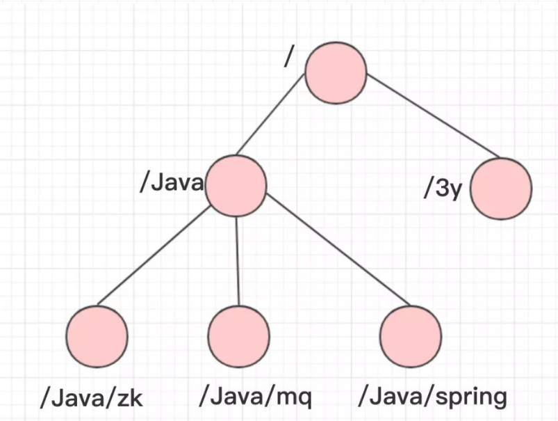
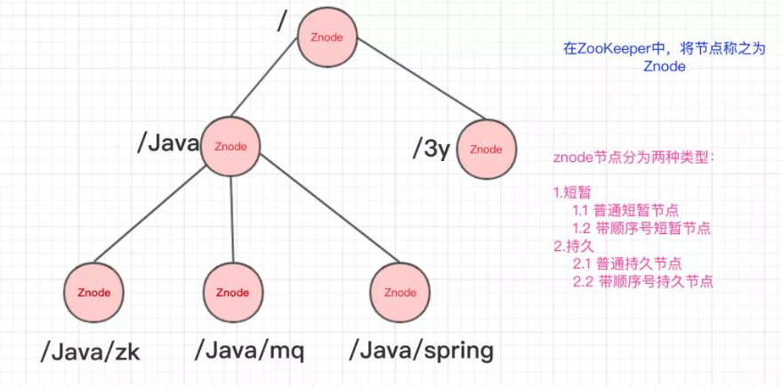
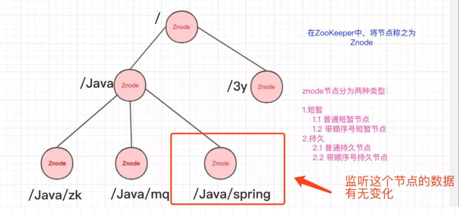
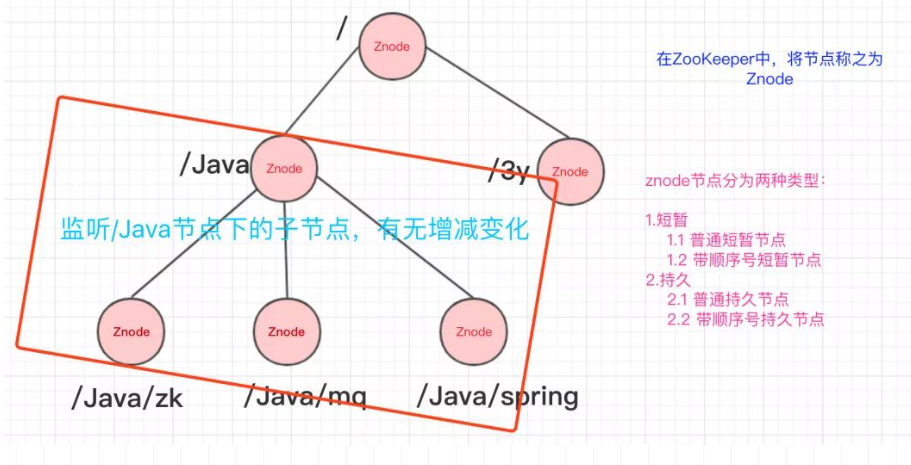
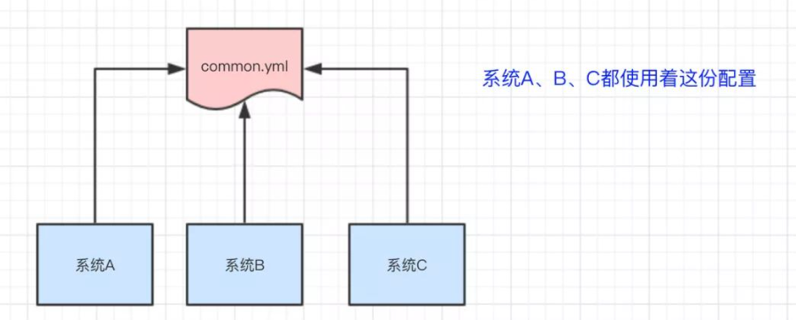
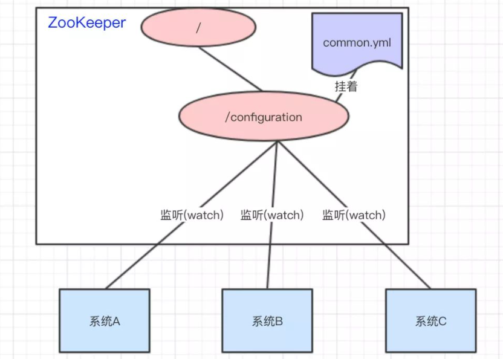
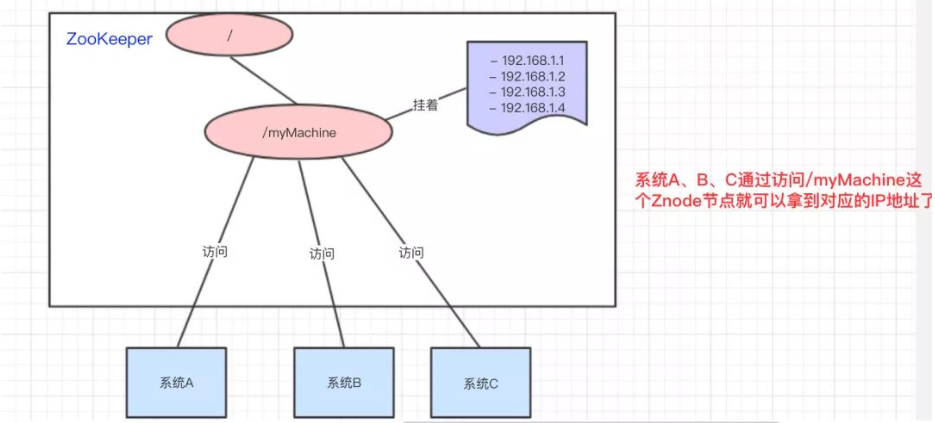
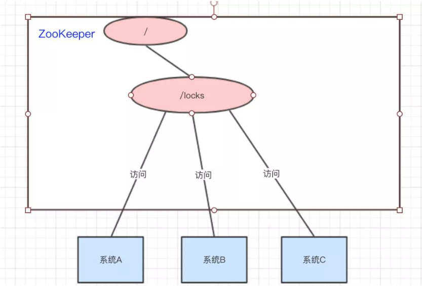
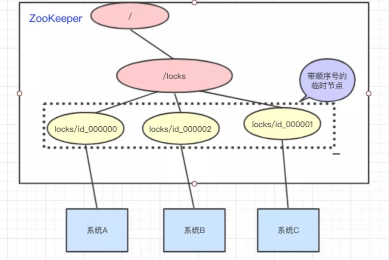
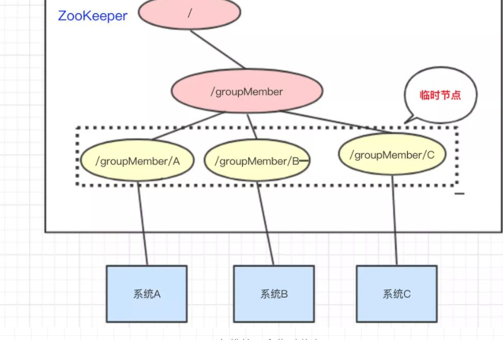

## 1. 开头

什么是ZooKeeper呢？我们先去**官网**看看介绍

- ZooKeeper主要**服务于分布式系统**，可以用ZooKeeper来做：统一配置管理、统一命名服务、分布式锁、集群管理。
- 使用分布式系统就无法避免对节点管理的问题(需要实时感知节点的状态、对节点进行统一管理等等)，而由于这些问题处理起来可能相对麻烦和提高了系统的复杂性，ZooKeeper作为一个能够**通用**解决这些问题的中间件就应运而生了

## 2. 基本结构

ZooKeeper的数据结构，跟Unix文件系统非常类似，可以看做是一颗**树**，每个节点叫做**ZNode**。每一个节点可以通过**路径**来标识，结构图如下：

 

ZooKeeper的节点我们称之为**Znode**，Znode分为**两种**类型：

- **短暂/临时(Ephemeral)**：当客户端和服务端断开连接后，所创建的Znode(节点)**会自动删除**
- **持久(Persistent)**：当客户端和服务端断开连接后，所创建的Znode(节点)**不会删除**

 

## 3. 监听器

ZooKeeper的数据结构了，ZooKeeper还配合了**监听器**才能够做那么多事的。

**常见**的监听场景有以下两项：

- 监听Znode节点的**数据变化**

   

- 监听子节点的**增减变化** 

   

  **监听+Znode节点(持久/短暂[临时])**，ZooKeeper就可以玩出这么多花样了

## 4. 应用场景

### 4.1. 统一配置管理

三个系统A、B、C，他们有三份配置，分别是`ASystem.yml、BSystem.yml、CSystem.yml`，然后，这三份配置又非常类似，很多的配置项几乎都一样。此时，如果我们要改变其中一份配置项的信息，很可能其他两份都要改。并且，改变了配置项的信息**很可能就要重启系统**。于是，我们希望把`ASystem.yml、BSystem.yml、CSystem.yml`相同的配置项抽取出来成一份**公用**的配置`common.yml`，并且即便`common.yml`改了，也不需要系统A、B、C重启

 

**zookeeper实现机制：**

我们可以将`common.yml`这份配置放在ZooKeeper的Znode节点中，系统A、B、C监听着这个Znode节点有无变更，如果变更了，**及时**响应。

 

### 4.2. 统一命名服务

统一命名服务的理解其实跟**域名**一样，是我们为这某一部分的资源给它**取一个名字**，别人通过这个名字就可以拿到对应的资源。

比如说，现在我有一个域名`www.java3y.com`，但我这个域名下有多台机器

- 192.168.1.1
- 192.168.1.2
- 192.168.1.3
- 192.168.1.4

别人访问`www.java3y.com`即可访问到我的机器，而不是通过IP去访问。

 

### 4.3. 分布式锁

 

 

* 系统A、B、C都去访问`/locks`节点

* 访问的时候会创建**带顺序号的临时/短暂**(`EPHEMERAL_SEQUENTIAL`)节点

  系统A创建了`id_000000`节点，系统B创建了`id_000002`节点，系统C创建了`id_000001`节点

* 接着，拿到`/locks`节点下的所有子节点(id_000000,id_000001,id_000002)，**判断自己创建的是不是最小的那个节点**

  * 如果是，则拿到锁。

  * - 释放锁：执行完操作后，把创建的节点给删掉

  * 如果不是，则监听比自己要小1的节点变化

举例如下：

- 系统A拿到`/locks`节点下的所有子节点，经过比较，发现自己(`id_000000`)，是所有子节点最小的。所以得到锁
- 系统B拿到`/locks`节点下的所有子节点，经过比较，发现自己(`id_000002`)，不是所有子节点最小的。所以监听比自己小1的节点`id_000001`的状态
- 系统C拿到`/locks`节点下的所有子节点，经过比较，发现自己(`id_000001`)，不是所有子节点最小的。所以监听比自己小1的节点`id_000000`的状态
- ……
- 等到系统A执行完操作以后，将自己创建的节点删除(`id_000000`)。通过监听，系统C发现`id_000000`节点已经删除了，发现自己已经是最小的节点了，于是顺利拿到锁
- ….系统B如上

### 4.4. 集群状态

还是以我们三个系统A、B、C为例，在ZooKeeper中创建**临时节点**即可

 

* 只要系统A挂了，那`/groupMember/A`这个节点就会删除，通过**监听**`groupMember`下的子节点，系统B和C就能够感知到系统A已经挂了。(新增也是同理)

* 除了能够感知节点的上下线变化，ZooKeeper还可以实现**动态选举Master**的功能。(如果集群是主从架构模式下)

  原理也很简单，如果想要实现动态选举Master的功能，Znode节点的类型是带**顺序号的临时节点**(`EPHEMERAL_SEQUENTIAL`)就好了。

  Zookeeper会每次选举最小编号的作为Master，如果Master挂了，自然对应的Znode节点就会删除。然后让**新的最小编号作为Master**，这样就可以实现动态选举的功能了

## 5. 总结