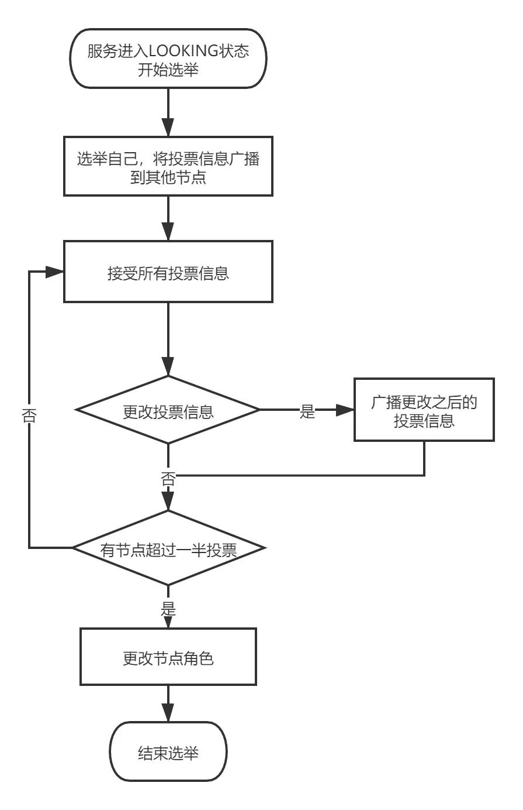
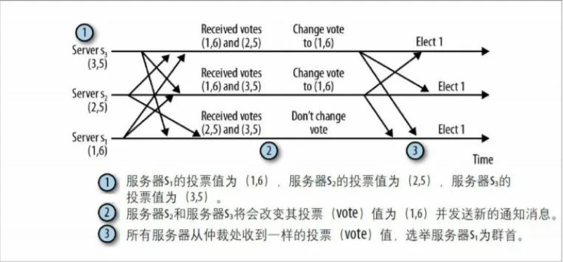
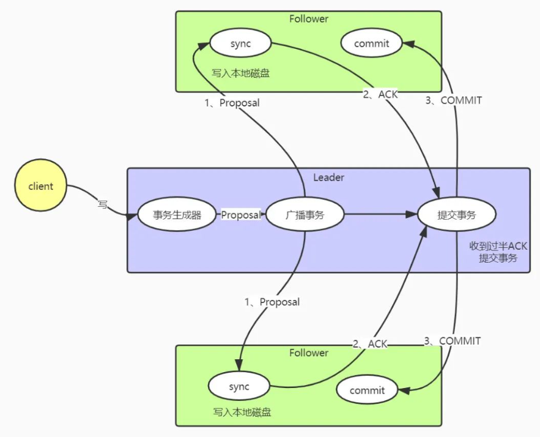
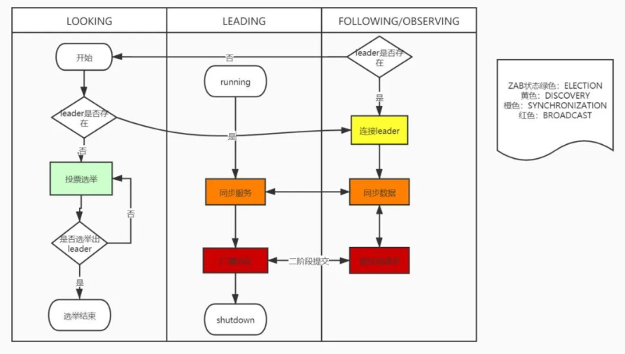

## 1. 开头

​	Zab（Zookeeper Atomic Broadcast）是为ZooKeeper协设计的崩溃恢复原子广播协议，它保证zookeeper集群数据的一致性和命令的全局有序性。

## 2. 基本原理

### 2.1. 集群角色

* Leader

  同一时间集群总只允许有一个Leader，提供对客户端的读写功能，负责将数据同步至各个节点；

* Follower

  提供对客户端读功能，写请求则转发给Leader处理，当Leader崩溃失联之后参与Leader选举；

* Observer

  与Follower不同的是但不参与Leader选举。

### 2.2. 服务状态

* LOOKING

  当节点认为群集中没有Leader，服务器会进入LOOKING状态，目的是为了查找或者选举Leader；

* FOLLOWING

  follower角色；

* LEADING

  leader角色；

* OBSERVING

  observer角色；

### 2.3. ZAB状态

反应Zookeeper从选举到对外提供服务的过程中的四个步骤。状态枚举定义：

```
public enum ZabState {
	ELECTION,
	DISCOVERY,
	SYNCHRONIZATION,
	BROADCAST
}
```

* ELECTION

  集群进入选举状态，此过程会选出一个节点作为leader角色；

* DISCOVERY

  连接上leader，响应leader心跳，并且检测leader的角色是否更改，通过此步骤之后选举出的leader才能执行真正职务；

* SYNCHRONIZATION

  整个集群都确认leader之后，将会把leader的数据同步到各个节点，保证整个集群的数据一致性；

* BROADCAST

  过渡到广播状态，集群开始对外提供服务

### 2.4. ZXID

​	Zxid是极为重要的概念，它是一个long型（64位）整数，分为两部分：纪元（epoch）部分和计数器（counter）部分，是一个**全局有序**的数字

​	epoch代表当前集群所属的哪个leader，leader的选举就类似一个朝代的更替，用epoch代表当前命令的有效性，counter是一个递增的数字.

### 2.5. 选举

#### 2.5.1. 选举时机

选举发生的时机Leader发生选举有两个时机。

* 服务启动的时候当整个集群都没有leader节点会进入选举状态，如果leader已经存在就会告诉该节点leader的信息，自己连接上leader，整个集群不用进入选举状态
* 在服务运行中，可能会出现各种情况，服务宕机、断电、网络延迟很高的时候leader都不能再对外提供服务了，所有当其他几点通过心跳检测到leader失联之后，集群也会进入选举状态

#### 2.5.2. 选举规则

进入投票选举流程，怎么才能选举出leader，或者说按照什么规则来让其他节点都能选举你当leader。

zab协议是按照几个比较规则来进行投票的筛选，如果你的票比我更好，就修改自身的投票信息，改投你当leader。

```
        /*
         * We return true if one of the following three cases hold:
         * 1- New epoch is higher
         * 2- New epoch is the same as current epoch, but new zxid is higher
         * 3- New epoch is the same as current epoch, new zxid is the same
         *  as current zxid, but server id is higher.
         */

        return ((newEpoch > curEpoch)
                || ((newEpoch == curEpoch)
                    && ((newZxid > curZxid)
                        || ((newZxid == curZxid)
                            && (newId > curId)))));
```

当其他节点的纪元比自身高投它，如果纪元相同比较自身的zxid的大小，选举zxid大的节点，这里的zxid代表节点所提交事务最大的id，zxid越大代表该节点的数据越完整。

最后如果epoch和zxid都相等，则比较服务的serverId，这个Id是配置zookeeper集群所配置的，所以我们配置zookeeper集群的时候可以把服务性能更高的集群的serverId配置大些，让性能好的机器担任leader角色

 

- 所有节点第一票先选举自己当leader，将投票信息广播出去；
- 从队列中接受投票信息；
- 按照规则判断是否需要更改投票信息，将更改后的投票信息再次广播出去；
- 判断是否有超过一半的投票选举同一个节点，如果是选举结束根据投票结果设置自己的服务状态，选举结束，否则继续进入投票流程。

 

### 2.6. 广播

​	集群在经过leader选举之后还会有连接leader和同步两个步骤，这里主要介绍集群对外提供服务如何保证各个节点数据的一致性。

- **可靠传递:**

  如果消息m由一台服务器传递，那么它最终将由所有服务器传递。

- **全局有序:** 

  如果一个消息a在消息b之前被一台服务器交付，那么所有服务器都交付了a和b，并且a先于b。

- **因果有序:**

  如果消息a在因果上先于消息b并且二者都被交付，那么a必须排在b之前

zab协议必须要保证的一个很重要的属性，因为zookeeper是以类似目录结构的数据结构存储数据的，必须要求命名的有序性

比如一个命名a创建路径为/test，然后命名b创建路径为/test/123，如果不能保证有序性b命名在a之前，b命令会因为父节点不存在而创建失败。

 

整个写请求类似一个二阶段的提交。

当收到客户端的写请求的时候会经历以下几个步骤：

* Leader收到客户端的写请求，生成一个事务（Proposal），其中包含了zxid；

* Leader开始广播该事务，需要注意的是所有节点的通讯都是由一个FIFO的队列维护的；

* Follower接受到事务之后，将事务写入本地磁盘，写入成功之后返回Leader一个ACK；

* Leader收到过半的ACK之后，开始提交本事务，并广播事务提交信息

* 从节点开始提交本事务。

​	有以上流程可知，zookeeper通过二阶段提交来保证集群中数据的一致性，因为只需要收到过半的ACK就可以提交事务，所以zookeeper的数据并不是强一致性。

​	zab协议的有序性保证是通过几个方面来体现的，第一是，服务之前用TCP协议进行通讯，保证在网络传输中的有序性；第二，节点之前都维护了一个FIFO的队列，保证全局有序性；第三，通过全局递增的zxid保证因果有序性

### 2.7. 状态流转

前面介绍了zookeeper服务状态有四种，ZAB状态也有四种。这里就简单介绍一个他们之间的状态流转，更能加深对zab协议在zookeeper工作流程中的作用

 

* 服务在启动或者和leader失联之后服务状态转为LOOKING；

* 如果leader不存在选举leader，如果存在直接连接leader，此时zab协议状态为ELECTION；

* 如果有超过半数的投票选择同一台server，则leader选举结束，被选举为leader的server服务状态为LEADING，其他server服务状态为FOLLOWING/OBSERVING；

* 所有server连接上leader，此时zab协议状态为DISCOVERY；

* leader同步数据给learner，使各个从节点数据和leader保持一致，此时zab协议状态为SYNCHRONIZATION；

* 同步超过一半的server之后，集群对外提供服务，此时zab状态为BROADCAST

可以知道整个zookeeper服务的工作流程类似一个状态机的转换，而zab协议就是驱动服务状态流转的关键，理解了zab就理解了zookeeper工作的关键原理

## 3. 总结

zab协议。