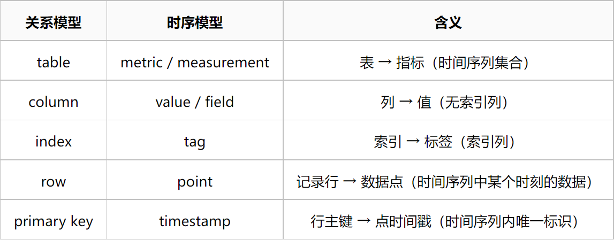

## 时序数据库

### 使用场景

时序数据`TimeSeries`是一连串随**时间**推移而发生变化的**相关**事件。

以下图的 CPU 监控数据为例，同个 IP 的相关监控数据组成了一条时序数据，不相关数据则分布在不同的时间序列上。

 

常见时序数据有：

- 监控日志：机器的 CPU 负载变化
- 用户行为：用户在电商网站上的访问记录
- 金融行情：股票的日内成交记录

这类数据具有以下特点：

- 必然带有时间戳，可能存在时效性
- 数据量巨大，并且生成速度极快
- 更关注数据变化的趋势，而非数据本身

### 其他数据库对比

#### 关系型数据库

 

两者之间的存在的冲突：

- 如果主键设计的不好，时序数据的顺序插入可能变为随机写入，影响写入性能
- 传统关系型数据为提高数据生命周期管理功能，需要定时执行清理任务，避免磁盘空间耗尽
- 关系型数据库对事务的支持，对于时序数据来说略显多余，还会影响写入能力

除此之外，关系型数据库还存在以下天然短板：

- 需要通过分表分库`sharding`实现横向扩展

  分库分表引入额外复杂度，需要维护映射关系。 此时 SQL 语言的查询优势不复存在，多数查询都会退化为 KV 查找

* 写时模式`schema on write`灵活度不足

  关系数据库新增字段属于 DDL 操作，会导致锁表锁库。 频繁的库表变更影响系统稳定，无法适应快速的业务变更。

#### redis不足

存储时序数据库的另一个挑战就是其夸张的数据生成速度。以用户行为数据为例，如果一个接口的QPS是1万。就意味着一秒钟内会生成1万条用户行为记录。假设这样的接口有100个，那么每秒钟生成的记录数可达100万。

　一种解决方式是将消息积压至 Kafka 这类中间件，然后进行异步处理。但对于某些业务场景来说，这一处理方式则显得不合时宜。以股票成交数据为例，为了保障行情的时效性，无法采用异步批处理的方式实现。为了实现极高的写入吞吐量，通常会考虑使用 Redis 实现这一功能。

然而这一方案也存在以下问题：

- redis 不适合存储大 Key，删除 Key 的内存释放操作可能导致长时间的阻塞
- 假设数据以 list 的形式存储，执行 lrange 命令的时间复杂度为O(S+N)，访问性能较差
- 内存空间有限，无法存储大量的数据

### 数据模型

 

tag 的概念较为重要：

- tag 是一个字符串类型的键值对
- tag 并不是时序数据，而是元数据
- tag 的唯一组合确定一个时间序列
- tag 可以方便实现粗粒度的聚合
- tag 决定了索引的组织形式
- tag 组合的数量数量不宜过多

### 常见的时序数据库

比较具有代表性的有以下两款

#### OpenTSDB

OpenTSDB 是一种基于 HBase 来构建的分布式、可扩展的时间序列数据库。OpenTSDB 被广泛应用于存储、索引和服务从大规模计算机系统（网络设备、操作系统、应用程序）采集来的监控指标数据，并且使这些数据易于访问和可视化

 

OpenTSDB 由时间序列守护程序 (TSD) 以及一组命令行实用程序组成。每个 TSD 都是独立的。 没有主节点，没有共享状态

- 优点：
  TSD 是无状态的，所有状态数据保存在 HBase 中，天然支持水平扩展
- 缺点：
  - Hadoop 全家桶运维难度较大，需要专人负责
    - 新版本的 OpenTSDB 底层支持 Cassandra
  - 存储模型过于简化
    - 单值模型且只能存储数值类型数据
    - 单个 metric 最多支持 8 个 tag key
  - 虽然利用了 HBase 作为底层存储，但是没有提供对 MapReduce 的支持。
    - 可以通过 Spark 实现复杂的处理逻辑

#### InfluxDB

​	时序数据库 InfluxDB 是一款专门处理高写入和查询负载的时序数据库，基于 InfluxDB 能够快速构建具有海量时序数据处理能力的分析和监控软件。
　该项目的发起者是 influxdata 公司，该公司提供了一套用于处理时序数据的完整解决方案，InfluxDB 是该解决方案中的核心产品

 

- 优点：
  - 开箱即用，运维简单
  - 多值存储模型、丰富的数据类型
  - 提供了类 SQL 的查询语言
  - 独创 TSM 索引
- 缺点：
  - 开源版本不支持集群部署，对于大规模应用来说，使用前需要慎重考虑

## InfluxDB概述

### 数据模型

InfluxDB 的数据模型已经很接近传统的关系模型

 

 

保留策略`retention policy` 用于管理数据生命周期，其中包含了：

- 持续时间`duration`：指定了数据保留时间，过期的数据将自动从数据库中删除
- 副本个数`replication factor`：指定了集群模式下，需要维护数据副本的个数（仅在集群模式下有效）
- 分片粒度`hard duration)`：指定了 shard group 的时间跨度（影响数据分片大小）

　保留策略与 database 存在以下关系：

- 一个 database 可以有多个 RP，每个 RP 只属于一个 database `1:N`
- 创建 point 时可以指定 RP，一个 measurement 可以有不同的 RP `N:N`

　这意味着：

同个 measurement 可能存在两个有着完全相同的 time 的 point。为了解决数据重复的问题，InfluxDB 2 引入了一个 bucket 的概念，用于避免这一情况。

### Series(序列)

时间序列 **Series** 在 InfluxDB 中也是个核心概念：

 

为了唯一标识一个时间序列，InfluxDB 引入了 **Serieskey** 的概念：

每个数据点都有 **Serieskey**，**Serieskey** 相同的数据点属于同个时间序列，会存储在同一个文件中，方便后续查询

**Serieskey** 的数量称为序列基数 `series cardinality`：

序列基数是一个重要的性能指标，InfluxDB 会为每个 **Serieskey** 在内存中维护一个索引记录，因此序列基数能够直观反映当前数据的内存压力

 

上图的 series cardinality 为 4，其中包含以下 series key：

 

注意：即便两条记录的 measurement、time、tag、field 完全一致，但只要使用的是不同的 RP，那么它们就属于不同的 series，会被存储在不同的 bucket 中。

### 查询语言

InfluxDB 提供了两种查询语言：

- InfluxQL：类 SQL 的声明式查询语言，同时具有 DDL 与 DML 功能
- Flux：函数式查询语言，仅支持 DML 功能，能支持复杂的查询条件，但不支持增删改操作

下面通过一些实际操作来熟悉一下 InfluxQL：

```
# 创建数据库
CREATE DATABASE "sample_data"
USE sample_data
 
# 插入样例数据，格式参考：https://docs.influxdata.com/influxdb/v1.8/write_protocols/line_protocol_tutorial
INSERT census,location=1,scientist=langstroth butterflies=12i,honeybees=23i 1439827200000000000
INSERT census,location=1,scientist=perpetua butterflies=1i,honeybees=30i 1439827200000000000
INSERT census,location=1,scientist=langstroth butterflies=11i,honeybees=28i 1439827560000000000
INSERT census,location=1,scientist=perpetua butterflies=3i,honeybees=28i 1439827560000000000
INSERT census,location=2,scientist=langstroth butterflies=2i,honeybees=11i 1439848440000000000
INSERT census,location=2,scientist=langstroth butterflies=1i,honeybees=10i 1439848800000000000
INSERT census,location=2,scientist=perpetua butterflies=8i,honeybees=23i 1439849160000000000
INSERT census,location=2,scientist=perpetua butterflies=7i,honeybees=22i 1439849520000000000

# 显示数据库中的表
# measurement 无需预先定义，由 InfluxDB 动态创建
SHOW MEASUREMENTS
 
# 显示数据库中的 field key
SHOW FIELD KEYS
 
 
# 显示数据库中的 tag key
SHOW TAG KEYS
 
# 显示数据库中的 tag value
SHOW TAG VALUES WITH KEY = scientist
 
# 查询所有数据
SELECT * FROM census;
 
# 对 location = 1 的数据求和
SELECT SUM(butterflies) AS butterflies, SUM(honeybees) AS honeybees FROM census WHERE location = '1';
 
# 删除 location = 1 的数据
DELETE FROM census WHERE location = '1';
SELECT * FROM census;
 
# 更新特定数据
SELECT * FROM census;
INSERT census,location=2,scientist=perpetua butterflies=10i,honeybees=50i 1439849520000000000
SELECT * FROM census;

# 更新数据时要保证数据类型一致，否则会报错
INSERT census,location=2,scientist=perpetua butterflies=abc,honeybees=efg 1439849520000000000
 
# 删除数据库
DROP DATABASE sample_data;
```

Flux 无命令行支持，只能通过 http 接口请求

```
curl -XPOST 127.0.0.1:8086/api/v2/query -sS \
-H 'Accept:application/csv' \
-H 'Content-type:application/vnd.flux' \
-H 'Authorization: Token root:123456' \
-d '
from(bucket:"sample_data")
|> range(start:time(v: 1439827200000), stop:time(v: 143984952000))
|> filter(fn:(r) => r._measurement == "census" and r.location == "1" and (r._field == "honeybees" or r._field == "butterflies"))
|> limit(n: 100)'
```

### 整体架构

 

上图将 InfluxDB 分为了 4 层，上面 database 与 RP 这两层之前已经介绍过，我们重点关注下面两层：

#### shard 

 

由于时序数据的数据量通常十分巨大，因此 InfluxDB 的设计中引入了分片的策略。并且同时采用了两种分片策略：

- shard group 层采用了基于时间的分片策略，方便实现按照时间条件范围查询
- shard 层则是基于 hashmod 进行分片，避免出现写热点产生性能瓶颈

每个 shard 由 WAL、Cache、TSM文件 3 部分组成：

 

#### WAL

​	预写日志`Write-Ahead-Log`是一种常见的提高数据库优化手段，能够在保证数据安全的同时，提升系统的写入性能。

​	InfluxDB WAL 由一组定长的 segement 文件构成，每个文件大小约为 10MB。这些 segment 文件只允许追加，不允许修改

#### Cache

Cache 是 WAL 的一个内存快照，保证 WAL 中的数据对用户实时可见。
当 Cache 空闲或者过满时，对应的 WAL 将被压缩并转换为 TSM，最终释放内存空间。
每次重启时会根据 WAL 重新构造 Cache。

#### TSM File

TSM 是一组存储在磁盘上的外存索引文件，细节将在后续进行介绍。

它们之间的关系可以简单描述为：

- Cache = WAL
- Cache + TSM = 完整的数据

### 存储引擎

#### LSM tree 时代 (0.8.x)

- 引擎

  LevelDB、RocksDB、HyperLevelDB、LMDB

- 优点

  极高的写入吞吐量，且支持数据压缩

- 缺点：

  - 懒删除机制导致删除操作耗时，且过期数据无法及时清理

  - 按照时间维度

    分库

    可以规避上述问题，但是又会导致新问题：

    - 单个进程打开过多的文件导致句柄耗尽
    - 过多的 WAL 可能会令**顺序追加**退化为**随机写入**

#### B+Tree 时代 (0.9.x)

- 引擎：BoltDB
- 优点：单文件模型，稳定性更好，Go 实现更易嵌入
- 缺点：
  - 文件较大时，写放大效应会导致 IOPS 会极剧上升
  - 通过在 Bolt 前嵌入自研的 WAL 模块缓解了这一问题：
    - 合并多个相邻的写入操作，减少 fsync
    - 将随机写入变为顺序追加，减少写放大

#### TSM-Tree 时代 (0.9.5)

##### 基本介绍：

* 引擎：Time Structured Merge Tree
* 特点：
  * 整体实现借鉴 LSM tree 架构，能有效规避写放大
  * 更少的数据库文件，避免顺序写退化为随机写，不再出现文件句柄耗尽的情况
  * 针对时序数据特性，采用了更具针对性的数据压缩算法

##### 数据组织

　TSM 是一个列存引擎`columnar storage`，内部按照 SeriesKey 对时序数据进行组织：

 

- 每个 SeriesKey 对应一个数组，里面存储着 time,value 构成的时间点数据
- 同个 SeriesKey 的数据存储在一起，不同的 SeriesKey 的数据分开存储

##### **列存引擎的优势**

- 高效处理动态 schema 与稀疏数据

  新增列时，对现有的数据无影响。并且由于不同列相互分离，可以直接忽略 null 值，不需要耗费空间存储标记

- 同类型的数据能够进行高效的压缩

  同个列的数据必然具有相同的数据类型，可以采取不同的压缩手段进行优化。

- 查询时能减少不必要的 I/O

  查询时能够指定要返回的数据列，可以按需遍历用户指定的列，对于 OLAP 操作更友好。

##### **列存引擎的劣势**

- 存储稠密数据需要付出额外代价

  当多个列具有相同的时间戳时，timestamp 会被重复存储。

- 数据变更操作需要更多的 I/O

  列分开存储后，查、改、删操作可能要同时修改多个文件。

- 无法提供原子性操作，事务实现困难

  无法实现高效的悲观锁，如果使用场景中需要用到事务，建议使用行存引擎。

##### 文件格式

TSM File 是一组列存格式的只读文件，每个文件对应一组特定的 SeriesKey

 

每个文件由 4 部分构成：

- Header：幻数 + 版本号
- DataBlock：时序数据块
- IndexBlock：时序数据索引
- Footer：索引块指针

　Block 与 Series 的对应关系：

- 每个 IndexBlock 只属于一个 Series
- 每个 DataBlock 只保存一个 Field 的数据

　DataBlock 的结构较为简单，其中存储了压缩过的时序数据：

 

IndexBlock 则较为复杂，每个 IndexBlock 由一个 Meta 和多个 Entry 构成：

 

Meta 中存储了 IndexBlock 对应的 SeriesKey 以及对应的 Entry 数量。
每个 Entry 对应一个 DataBlock，描述了这个 DataBlock 对应的时间区间，以及实际的存储地址。
当需要查找 TSM 中的数据时，只需要将 IndexBlock 加载到内存中。就可以定位到相应的数据，提高查询效率。

#### 压缩算法

InfluxDB 中的数据类型可以分为五种 `timestamp`，`float`, `int`, `bool`, `string`。为了达到最优的压缩效果，InfluxDB 针对不同类型的数据，使用了不同的压缩算法。不过这些压缩算法的原理都大同小异：使用变长编码来保存数据有效位，避免存储无效的 0 bit

##### **timestamp**

时序数据都是按照时间顺序进行排序的，因此首先会使用 `delta-delta` 编码精简数据：

 

相邻的两个时间戳相减，减少了数据的有效位长度，有利于后续的压缩

若时间按固定区间分布，优先使用游程编码`run-length encoding`进行压缩：

 

如果时间戳间隔固定，则使用两个 64bit 数据可以编码`264`个时间戳

若编码后所有值均小于`260`，则使用`simple8b`编码，将多个值打包进单个 64bit 整数中：

 

simple8b 将 64 位整数分为两部分：

- **selector(4bit)** 用于指定剩余 60bit 中存储的整数的个数与有效位长度
- **payload(60bit)** 则是用于存储多个定长的整数

根据一个查找表，将数据模式匹配到最优的 selector，然后将多个数据编码至 payload


如果无法不满足以上压缩条件，则直接存储原始数据。

##### **float**

Facebook 工程师通过观察时序数据，发现相邻时序数据进行异或操作后，仅有中间一小部分发生了变化。
　根据这个规律，发明了一个简单高效的浮点数压缩算法：先异或求值，然后存储中间的有效数据。
　通过这一算法，他们将浮点数据的平均存储空间压缩至 1.37 字节。

 

 

算法过程可以参考这篇论文，或者直接参考下面的实现：

```
@Data
@Accessors(fluent = true)
@ToString
static class Block {
    int leadingZero;
    int tailingZero;
    int blockSize;
    long value;
 
    boolean valueOf(int i) {
        Validate.isTrue(i < blockSize);
        return ((value >>> (blockSize-1-i)) & 0x1) > 0;
    }
 
    boolean fallInSameBlock(Block block) {
        return block != null && block.leadingZero == leadingZero && block.tailingZero == tailingZero;
    }
}
 
static Block calcBlock(double x, double y) {
    long a = Double.doubleToRawLongBits(x);
    long b = Double.doubleToRawLongBits(y);
    long xor = a ^ b;
 
    Block block = new Block().
            leadingZero(Long.numberOfLeadingZeros(xor)).
            tailingZero(Long.numberOfTrailingZeros(xor));
 
    return block.value(xor >>> block.tailingZero()).
           blockSize(block.value() == 0 ? 0 : 64 - block.leadingZero() - block.tailingZero());
}
 
static Pair<Long, Pair<Integer, byte[]>> encode(double[] values) {
    int offset = 0;
    BitSet buffer = new BitSet();
 
    boolean ctrlBit;
    double previous = values[0];
    Block prevBlock = null;
    for (int n=1; n<values.length; n++) {
        Block block = calcBlock(previous, values[n]);
        if (block.value() == 0) {
            buffer.clear(offset++);
        } else {
            buffer.set(offset++);
            buffer.set(offset++, ctrlBit = ! block.fallInSameBlock(prevBlock));
            if (ctrlBit) {
                int leadingZero = block.leadingZero();
                int blockSize = block.blockSize();
                Validate.isTrue(leadingZero < (1 << 6));
                Validate.isTrue(blockSize < (1 << 7));
                for (int i = 5; i > 0; i--) {
                    buffer.set(offset++, ((leadingZero >> (i - 1)) & 0x1) > 0);
                }
                for (int i = 6; i > 0; i--) {
                    buffer.set(offset++, ((blockSize >> (i - 1)) & 0x1) > 0);
                }
            }
            for (int i = 0; i < block.blockSize(); i++) {
                buffer.set(offset++, block.valueOf(i));
            }
        }
        previous = values[n];
        prevBlock = block;
    }
 
    return Pair.of(Double.doubleToLongBits(values[0]), Pair.of(offset, buffer.toByteArray()));
}
 
static List<Double> decode(Pair<Long, Pair<Integer, byte[]>> data) {
 
    long previous = data.getLeft();
    int dataLen = data.getRight().getKey();
    BitSet buffer = BitSet.valueOf(data.getRight().getValue());
 
    List<Double> values = new ArrayList<>();
    values.add(Double.longBitsToDouble(previous));
 
    int offset = 0;
    Block blockMeta = null;
    while (offset < dataLen) {
        if (! buffer.get(offset++)) {
            values.add(0d);
        } else {
            boolean ctrlBit = buffer.get(offset++);
            if (ctrlBit) {
                int leadingZero = 0;
                int blockSize = 0;
                for (int i = 0; i < 5; i++) {
                    leadingZero = (leadingZero << 1) | (buffer.get(offset++) ? 0x1 : 0x0);
                }
                for (int i = 0; i < 6; i++) {
                    blockSize = (blockSize << 1) | (buffer.get(offset++) ? 0x1 : 0x0);
                }
                blockMeta = new Block().leadingZero(leadingZero).blockSize(blockSize).
                        tailingZero(64 - leadingZero - blockSize);
            }
            Validate.notNull(blockMeta);
            long value = 0;
            for (int i = 0; i < blockMeta.blockSize(); i++) {
                value = (value << 1) | (buffer.get(offset++) ? 0x1 : 0x0);
            }
            previous ^= (value << blockMeta.tailingZero());
            values.add(Double.longBitsToDouble(previous));
        }
    }
 
    Validate.isTrue(offset == dataLen);
    return values;
}
 
public static void main(String[] args) {
    double[] values = new double[]{15.5, 14.0625, 3.25, 8.625, 13.1, 0, 25.5};
    Pair<Long, Pair<Integer, byte[]>> data = encode(values);
    System.out.println(data.getRight().getKey()); // 编码后的数据长度，单位 bits
    System.out.println(decode(data)); // 解码后的数据
}
```

##### **int**

对于整形数据，首先会使用 ZigZag 编码精简数据。
然后尝试使用 RLE 或 simple8b 对精简后的数据进行压缩。
如果无法不满足压缩条件，则存储原始数据。

##### **bool**

直接使用 Bitmap 对数据进行编码

##### **string**

将多个字符串拼接在一起，然后使用 Snappy 进行压缩


## 参考

#### 参考资料

https://www.cnblogs.com/buttercup/p/15204096.html

- InfluxDB
  - [TSM 官方 Git 文档](https://github.com/influxdata/influxdb/blob/master/tsdb/engine/tsm1/DESIGN.md)
  - [In-memory indexing and the Time-Structured Merge Tree (TSM)](https://docs.influxdata.com/influxdb/v1.8/concepts/storage_engine/)
  - [时序数据库技术体系 – 初识InfluxDB](http://hbasefly.com/2017/12/08/influxdb-1/)（推荐）
  - [阿里云InfluxDB® Raft HybridStorage实现方案](https://zhuanlan.zhihu.com/p/73101824)
  - [InfluxDB Clustering](https://www.influxdata.com/blog/influxdb-clustering/)
- 压缩编码
  - [Time-series compression algorithms, explained](https://blog.timescale.com/blog/time-series-compression-algorithms-explained/)
  - [Optimal Packing in Simple-Family Codecs](http://www.cs.otago.ac.nz/homepages/andrew/papers/2015-1.pdf)