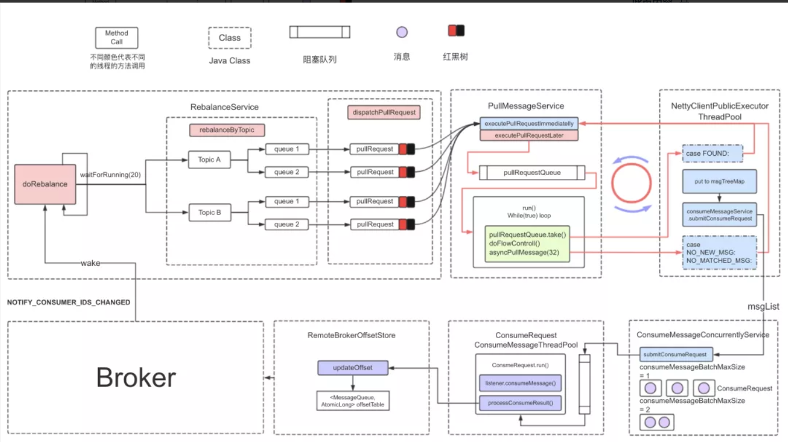

## 参考资料

https://hscarb.github.io/rocketmq/20220820-rocketmq-consumer-1-summary.html#_3-%E6%B6%88%E8%B4%B9%E6%B5%81%E7%A8%8B

## 基本概念

RocketMQ 的消费流程大致分成 4 个步骤

* 重平衡
* 消费者拉取消息
* Broker 接收拉取请求后从存储中查询消息并返回
* 消费者消费消息

### 消费模式

#### 消费组

多个消费者共同消费同样的 Topic 以加快消费速度。这多个消费同样 Topic 的消费者组成了消费者组；消费组是一个逻辑概念，它包含了多个同一类的消费者实例，通常这些消费者都消费同一类消息（都消费相同的 Topic）且消费逻辑一致。消费组的引入是用来在消费消息时更好地进行负载均衡和容错

#### 广播消费（Broadcasting）

广播消费模式即全部的消息会广播分发到所有的消费者实例，每个消费者实例会收到全量的消息（即便消费组中有多个消费者都订阅同一 Topic）；

* 广播消费模式下不支持 **顺序消息**。
* 广播消费模式下不支持 **重置消费位点**。
* 每条消息都需要**被相同订阅逻辑的多台机器处理**。
* **消费进度在客户端维护**，出现重复消费的概率稍大于集群模式。如果消费进度文件丢失，存在消息丢失的可能。
* 广播模式下，消息队列 RocketMQ 版保证每条消息至少被每台客户端消费一次，但是并**不会重投消费失败的消息**，因此业务方需要关注消费失败的情况。
* 广播模式下，**客户端每一次重启都会从最新消息消费**。客户端在被停止期间发送至服务端的消息将会被自动跳过，请谨慎选择。
* 广播模式下，每条消息都会被大量的客户端重复处理，因此推荐尽可能使用集群模式。
* 广播模式下服务端不维护消费进度，所以消息队列 RocketMQ 版控制台不支持消息堆积查询、消息堆积报警和订阅关系查询功能

#### 集群消费（Clustering）

**同一 Topic 下的一条消息只会被同一消费组中的一个消费者消费**。也就是说，消息被负载均衡到了同一个消费组的多个消费者实例上，在同一消费组中的不同消费者会根据负载机制来平均地订阅 Topic 中的每个 Queue。（默认 AVG 负载方式）

RocketMQ 默认使用集群消费模式，这也是大部分场景下会使用到的消费模式

### 拉取消息模式

### 队列负载机制与重平衡

### 消费端高可靠

### 并发消费与顺序消费

### 消费进度保存和提交

## push消费过程

 

从左上角第一个方框开始看

* 消费者启动时唤醒重平衡服务 `RebalanceService`，重平衡服务是客户端开始消费的起点。
* 重平衡服务会周期性（每 20s）执行重平衡方法 `doRebalance)`，查询所有注册的 Broker，根据注册的 Broker 数量为自身分配负载的队列 `rebalanceByTopic()`
* 分配完队列后，会为每个分配到的新队列创建一个消息拉取请求 `pullRequest`，这个拉取请求中保存一个处理队列 `processQueue`，即图中的红黑树（`TreeMap`），用来保存拉取到的消息。红黑树保存消息的顺序。
* 消息拉取线程应用生产-消费模式，用一个线程从拉取请求队列 `pullRequestQueue` 中弹出拉取请求，执行拉取任务，将拉取到的消息放入处理队列。
* 拉取请求在一次拉取消息完成之后会复用，重新被放入拉取请求队列 `pullRequestQueue` 中
* 拉取完成后，在 `NettyClientPublicExecutorThreadPool` 线程池异步处理结果，将拉取到的消息放入处理队列，然后调用 `consumeMessageService.submitConsumeRequest`，将处理队列和 多个消费任务提交到消费线程池。每个消费任务消费 1 批消息（1 批默认为 1 条）
* 每个消费者都有一个消费线程池 `consumeMessageThreadPool` ，默认有 20 个消费线程。
* 消费线程池的每个消费线程会尝试从消费任务队列中获取消费请求，执行消费业务逻辑 `listener.consumeMessage`。
* 消费完成后，如果消费成功，则更新偏移量 `updateOffset`（先更新到内存 `offsetTable`，定时上报到 Broker。Broker 端也先放到内存，定时刷盘）

PS：PullMessageService是一个线程，全局这个线程会死循环从pullRequestQueue拿去PullRequest对象，然后从mQClientFactory中拿取对应主题的consumer，consumer会执行netty网络线程池，拉取对应的消息，然后放回到processQueue，接着封装ConsumeRequest提交到对应的consumeExecutor线程池中，ConsumeRequest实现了runnable，里面会真正的调用业务消费方法，之后会将消费进度提交