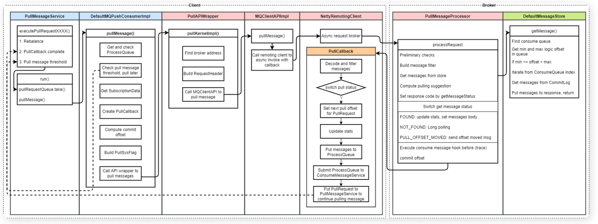
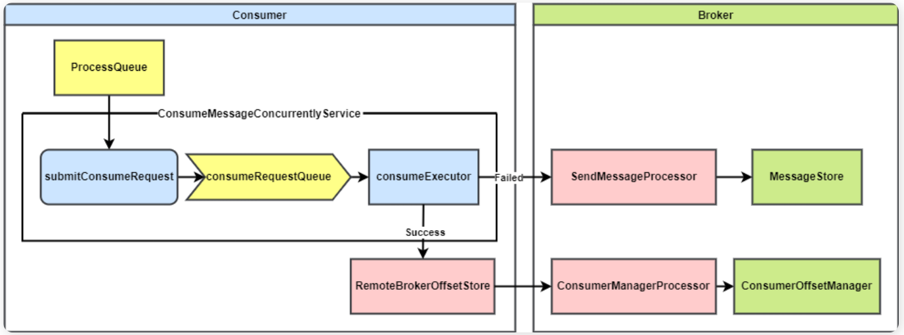
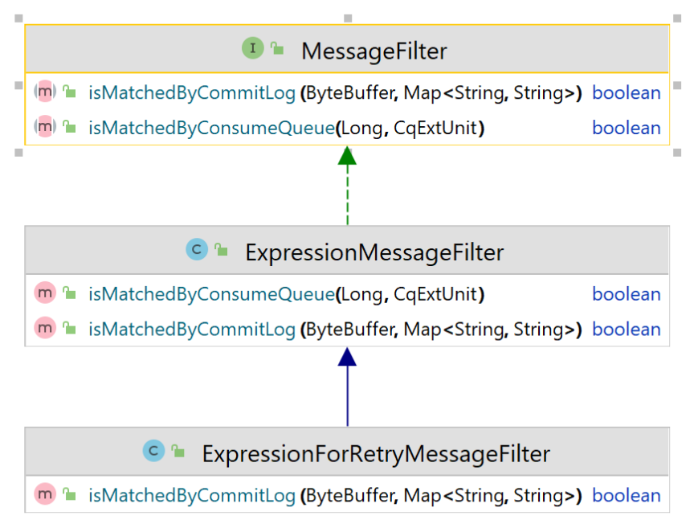

## 整体架构

 

* 其中 `DefaultMQPullConsumer` 和 `DefaultMQPushConsumer` 就是我们实际消费中需要新建的消费者对象。

  它们分别实现了消费者接口，扩展了客户端配置类。

* 新建 `DefaultXXXXConsumer` 对象时会在内部一个创建 `DefaultMQXXXXConsumerImpl` 对象。

  这里使用了代理模式，`DefaultXXXXConsumer` 对象只是一个壳，内部的大部分方法都通过调用代理 `DefaultMQXXXXConsumerImpl` 来执行。

* **DefaultMQXXXXConsumerImpl` 实现类中包含了客户端实例 `MQClientInstnace** 

  每个客户端进程一般只有一个这玩意。它的用处很多，比如保存路由和客户端信息，向 Broker 发送请求等

## 客户端启动

### 设计思路

#### 创建消费者实例

- 新建消费者时构造 `DefaultMQXXXXConsumer` 对象，指定队列负载算法，内部构造一个 `DefaultMQXXXXConsumerImpl` 对象。
- `DefaultMQXXXXConsumerImpl` 设为刚创建状态，并新建重平衡服务 `RebalanceService`
- 在首次启动前，`DefaultMQXXXXConsumerImpl` 对象中的 `MQClientInstance` 对象还没有被创建出来

#### 消费实例启动

- 启动命令也是在 `DefaultMQXXXXConsumer` 调用并代理到 `DefaultMQXXXXConsumerImpl`。
- 此时 `DefaultMQXXXXConsumerImpl` 会初始化一些服务和参数，然后创建一个 `MQClientInstance` 对象。
- `MQClientInstance` 对象启动客户端的各种服务（Broker 通信、定时任务、消息拉取、重平衡……）

### 核心UML设计

有拉和推两种消费模式，消费者类的设计中将会有一个**消费者接口**，然后**推消费者**和**拉消费者接口**分别扩展**消费者接口**。消费者接口提供一些共用方法，拉和推消费者实现拉消费和推消费方法。RocketMQ 就是这样做的。其中 MQConsumer 即消费者接口，扩展 MQAdmin 在这显得有些多余

 

- MQAdmin 接口提供了客户端的一些基本的管理接口，生产者、消费者和命令工具都扩展了它

   

- MQConsumer 接口很简单，主要提供了通过 Topic 获取读队列的方法 `Set<MessageQueue> fetchSubscribeMessageQueues(final String topic)`

  ```
      Set<MessageQueue> fetchSubscribeMessageQueues(final String topic) throws MQClientException;
  ```

#### 拉&推消费接口

两种接口的设计思路如下：

- 拉模式消费者的消费步骤为：拉取消息，执行消费逻辑，上报消费进度，如果有需要的话对于消费失败的消息还需要发回 Broker 重新消费。
- 推模式消费者消费步骤更简单，只需要订阅一个 Topic，然后指定消费回调函数，即可在收到消息时自动消费

 

**MQPullConsumer**

- `void registerMessageQueueListener(final String topic, final MessageQueueListener listener)` 方法注册消息队列变更时的回调方法。

- PullResult pull

  从 RocketMQ 服务器拉取一批消息。

  - MessageQueue：拉取的队列
  - MessageSelector：消息过滤器
  - offset：拉取的消息在消费队列中的偏移量
  - maxNums：最大拉取消息条数
  - timeout：拉取超时时间

- `void pull` 为异步拉取方法，拉取成功后调用 `PullCallback`

- `updateConsumeOffset` 更新消息消费偏移量

- `fetchConsumeOffset` 获取消息消费偏移量

- `sendMessageBack` 对于消费失败的消息，发回 Broker 重新消费

**MQPushConsumer**

- subscribe

  订阅主题，订阅之后可以收到来自该主题的消息。

  - topic：订阅的主题，可以多次调用该方法来订阅多个主题
  - subExpression：消息过滤表达式
  - messageSelector：消息选择器，提供了 SQL92 和 Tag 模式的过滤选择功能

- `unsubscribe`：取消订阅

- `registerMessageListener`：用来注册消费监听器，包含两种消费模式：并发消费和顺序消费

#### 消费者结构

* `DefaultMQXXXXConsumer` 是拉消费者接口 `MQXXXXConsumer` 的默认实现。

* 这里用到了代理模式，将具体的方法实现都实现在 `DefaultMQXXXXConsumerImpl` 中，`DefaultMQXXXXConsumer` 保存了一个 `DefaultMQXXXXConsumerImpl` 的代理。

* `DefaultMQXXXXConsumerImpl` 实现了 `MQConsumerInner` 接口，提供了消费者实现的一些公用方法。

* `DefaultMQXXXXConsumerImpl` 中有一个客户端实例的引用 `MQClientInstance mqClientFactory`，用来与 Broker 通信、保存元数据

  MQClientInstnace：客户端实例，每个客户端进程一般只有一个这玩意。它的用处很多，很多操作最终都是调用它来做的。
  * 保存路由信息
  * 保存生产者消费者组信息
  * 向 Broker 发送请求
  * 启动重平衡

#### 推模式消费者实现

​	拉模式消费者需要手动拉取消息进行消费，推模式消费者自动监听推送过来的消息并进行消费；而推模式消费者实际内部也是通过拉取消息的方式进行消息拉取，只不过封装了订阅和监听器这样的对外接口，让用户在使用时感觉像 Broker 主动推送消息到消费者。在拉消费者背后，有一个线程默默主动拉取消息，才能将拉转换为推，它就是 `PullMessageService`。

​	此外，推消费者还支持并发消费和顺序消费，RocketMQ 定义了 `ConsumeMessageService` 接口来执行消息消费，`ConsumeMessageConcurrentlyService` 和 `ConsumeMessageOrderlyService` 分别是并发消费和顺序消费的实现。它们内部都定义了一个消费线程池 `consumeExecutor` 来执行最终的消息消费逻辑。而用户真正编写的只有最终的消费逻辑，即实现 `MessageListener` 接口的 `consumeMessage` 方法。推模式消费者实现相关的类图如下所示：

 

在图中，展示了消息消费整个流程的调用关系

* 客户端实例中的重平衡服务进行重平衡，生成一个 `PullRequest` 并调用拉消费者实现类的 `executePullRequestImmediately` 方法
* `DefaultMQPushConsumerImpl` 调用 `PullMessageService` 线程的 `executePullRequestImmediately` 方法，
* 该方法将 `PullRequest` 放入待执行的拉取请求队列
* `PullMessageService` 线程阻塞等待请求队列中的拉取请求
* 收到拉去请求 `PullRequest` 后就执行拉取消息拉取方法 `pullMessage` 从 Broker 拉取消息，拉取后执行消费消息逻辑
* 消费消息逻辑会调用 `ConsumeMessageService` 的 `submitConsumeRequest` 方法
* 该方法将消费消息的请求提交到消费线程池 `consumeExecutor`
* 消费线程池执行真正的消息消费逻辑，调用 `MessageListener` 接口的 `consumeMessage` 方法
* 拉取一批消息成功后，将拉取请求 `PullRequest` 的拉取偏移量更新后再次调用 `executePullRequestImmediately` 方法，放入拉取队列，重新拉取

### 消费者启动过程设计

拉模式和推模式消费者的启动流程大致相同

 

`DefaultMQPushConsumer` 的启动方法内部实际是调用其代理类 `DefaultMQPushConsumerImpl` 的启动方法，他本身的启动方法并没有什么逻辑。

`DefaultMQPushConsumerImpl` 的启动方法执行的动作如下：

1. 检查是否是刚创建状态，如果是才继续走启动流程
2. 检查消费者配置信息是否合法
3. 将用户的 Topic 订阅信息和重试 Topic 的订阅信息添加到 `rebalanceImpl` 中的 Map 中
4. 创建和初始化一些对象
   1. 创建或获取已经创建的客户端实例 `MQClientInstance`
   2. 初始化消费者的重平衡实现 `RebalanceImpl`
   3. 创建拉取消息接口调用包装类 `PullApiWrapper`
   4. 注册消息过滤钩子函数列表（如果有的话）
5. 初始化消费进度
   - 广播模式，消费进度保存在消费者本地 `LocalFileOffsetStore`
   - 集群模式，消费进度保存在 Broker `RemoteBrokerOffsetStore`
6. 初始化消息消费服务，消费服务内部维护一个线程池，负责消息消费
7. 将消费者注册到客户端实例对象
8. 启动客户端实例对象
9. 从 Name server 更新 Topic 路由信息（如果路由信息有变化）
10. 将客户端的信息（ID、生产者、消费者信息）上报给 Broker
11. 唤醒重平衡线程 `RebalanceService` 立即执行重平衡
12. 重平衡后调用拉取消息方法，生成拉取请求 `PullRequest` 并放入 `PullMessageService`，开始消费流程

客户端实例 `MQClientInstance` 的启动流程如下：

1. 更新 Namesrv 地址
2. 启动通信模块 `MQClientAPIImpl`
3. 启动定时任务（从 Namesrv 拉取路由、向 Broker 发送心跳等）
4. 启动拉取消息服务 `PullMessageService`
5. 启动重平衡线程 `RebalanceService`
6. 启动默认生产者（用于将消费失败的消息重新生产到 Broker）

### 源码分析

#### DefaultMQProducerImpl

```
// DefaultMQProducerImpl
/**
 * Push 消费者启动
 *
 * @throws MQClientException
 */
public synchronized void start() throws MQClientException {
    switch (this.serviceState) {
            // 检查消费者状态。只有第一次启动才执行，如果二次调用 start 方法会报错
        case CREATE_JUST:
            log.info("the consumer [{}] start beginning. messageModel={}, isUnitMode={}", this.defaultMQPushConsumer.getConsumerGroup(),
                     this.defaultMQPushConsumer.getMessageModel(), this.defaultMQPushConsumer.isUnitMode());
            this.serviceState = ServiceState.START_FAILED;

            // 检查消费者配置是否合法
            this.checkConfig();

            // 将用户的 Topic 订阅信息和重试 Topic 的订阅信息添加到 RebalanceImpl 的容器中
            this.copySubscription();

            if (this.defaultMQPushConsumer.getMessageModel() == MessageModel.CLUSTERING) {
                this.defaultMQPushConsumer.changeInstanceNameToPID();
            }

            // 创建客户端实例
            this.mQClientFactory = MQClientManager.getInstance().getOrCreateMQClientInstance(this.defaultMQPushConsumer, this.rpcHook);

            // 初始化 RebalanceImpl
            this.rebalanceImpl.setConsumerGroup(this.defaultMQPushConsumer.getConsumerGroup());
            this.rebalanceImpl.setMessageModel(this.defaultMQPushConsumer.getMessageModel());
            this.rebalanceImpl.setAllocateMessageQueueStrategy(this.defaultMQPushConsumer.getAllocateMessageQueueStrategy());
            this.rebalanceImpl.setmQClientFactory(this.mQClientFactory);

            // 创建拉取消息接口调用包装类
            this.pullAPIWrapper = new PullAPIWrapper(
                mQClientFactory,
                this.defaultMQPushConsumer.getConsumerGroup(), isUnitMode());
            // 注册消息过滤钩子函数列表
            this.pullAPIWrapper.registerFilterMessageHook(filterMessageHookList);

            // 初始化消费进度
            if (this.defaultMQPushConsumer.getOffsetStore() != null) {
                this.offsetStore = this.defaultMQPushConsumer.getOffsetStore();
            } else {
                switch (this.defaultMQPushConsumer.getMessageModel()) {
                    case BROADCASTING:
                        // 广播模式，消费进度保存在消费者本地
                        this.offsetStore = new LocalFileOffsetStore(this.mQClientFactory, this.defaultMQPushConsumer.getConsumerGroup());
                        break;
                    case CLUSTERING:
                        // 集群模式，消费进度保存在 Broker
                        this.offsetStore = new RemoteBrokerOffsetStore(this.mQClientFactory, this.defaultMQPushConsumer.getConsumerGroup());
                        break;
                    default:
                        break;
                }
                this.defaultMQPushConsumer.setOffsetStore(this.offsetStore);
            }
            this.offsetStore.load();

            // 初始化消息消费服务
            if (this.getMessageListenerInner() instanceof MessageListenerOrderly) {
                this.consumeOrderly = true;
                this.consumeMessageService =
                    new ConsumeMessageOrderlyService(this, (MessageListenerOrderly) this.getMessageListenerInner());
            } else if (this.getMessageListenerInner() instanceof MessageListenerConcurrently) {
                this.consumeOrderly = false;
                this.consumeMessageService =
                    new ConsumeMessageConcurrentlyService(this, (MessageListenerConcurrently) this.getMessageListenerInner());
            }

            this.consumeMessageService.start();

            // 注册消费者到客户端实例
            boolean registerOK = mQClientFactory.registerConsumer(this.defaultMQPushConsumer.getConsumerGroup(), this);
            if (!registerOK) {
                this.serviceState = ServiceState.CREATE_JUST;
                this.consumeMessageService.shutdown(defaultMQPushConsumer.getAwaitTerminationMillisWhenShutdown());
                throw new MQClientException("The consumer group[" + this.defaultMQPushConsumer.getConsumerGroup()
                                            + "] has been created before, specify another name please." + FAQUrl.suggestTodo(FAQUrl.GROUP_NAME_DUPLICATE_URL),
                                            null);
            }

            // 启动客户端实例
            mQClientFactory.start();
            log.info("the consumer [{}] start OK.", this.defaultMQPushConsumer.getConsumerGroup());
            this.serviceState = ServiceState.RUNNING;
            break;
        case RUNNING:
        case START_FAILED:
        case SHUTDOWN_ALREADY:
            throw new MQClientException("The PushConsumer service state not OK, maybe started once, "
                                        + this.serviceState
                                        + FAQUrl.suggestTodo(FAQUrl.CLIENT_SERVICE_NOT_OK),
                                        null);
        default:
            break;
    }

    // 从 Namesrv 更新路由信息
    this.updateTopicSubscribeInfoWhenSubscriptionChanged();
    this.mQClientFactory.checkClientInBroker();
    // 将客户端信息上报给 Broker
    this.mQClientFactory.sendHeartbeatToAllBrokerWithLock();
    // 唤醒重平衡线程，立即执行重平衡
    this.mQClientFactory.rebalanceImmediately();
}

```

#### MQClientInstance

```
// MQClientInstance.java
/**
 * 启动客户端代理
 *
 * @throws MQClientException
 */
public void start() throws MQClientException {

    synchronized (this) {
        switch (this.serviceState) {
            case CREATE_JUST:
                this.serviceState = ServiceState.START_FAILED;
                // If not specified,looking address from name server
                if (null == this.clientConfig.getNamesrvAddr()) {
                    this.mQClientAPIImpl.fetchNameServerAddr();
                }
                // 启动通信模块
                this.mQClientAPIImpl.start();
                // 启动定时任务（从 Namesrv 拉取路由、向 Broker 发送心跳等）
                this.startScheduledTask();
                // 启动拉取消息服务
                this.pullMessageService.start();
                // 启动重平衡线程
                this.rebalanceService.start();
                // 启动默认生产者（用于将消费失败的消息重新生产到 Broker）
                this.defaultMQProducer.getDefaultMQProducerImpl().start(false);
                log.info("the client factory [{}] start OK", this.clientId);
                this.serviceState = ServiceState.RUNNING;
                break;
            case START_FAILED:
                throw new MQClientException("The Factory object[" + this.getClientId() + "] has been created before, and failed.", null);
            default:
                break;
        }
    }
}

```

## 重平衡

前面已经解释了RocketMQ 消费分成如下几个步骤：

* 重平衡
* 消费者拉取消息
* Broker 接收拉取请求后从存储中查询消息并返回
* 消费者消费消息

其中重平衡是消费者开始消费的起点。

### 重平衡作用

​	RocketMQ 的 Topic 设计成有多个 Queue，被多个消费者同时消费来加快消费速率。在多个消费者同时消费一个 Topic 时，其中的每个 Queue 只能同时被一个消费者消费。在消费者数量变化时，将 Queue 分配给消费者进行消费的动作即重平衡；

### 设计思路

RocketMQ 的重平衡大致实现方式为：在消费者端用一个固定的分配策略将所有的消费队列分配给所有的消费者。通过将每个消费者的分配策略设置成一致，并且将消费者和消费队列排序的方法，保证每个消费者的分配的结果幂等

#### 触发时机

RocketMQ 的重平衡在消费端完成。唯一的触发点是一个重平衡线程，触发方式分主动触发和定时触发

- 主动触发

  消费者数量发生变化

  - 推模式消费者启动或恢复时，唤醒本地的重平衡线程，立即重平衡。在这之前还上报心跳让 Broker 感知到新消费者启动，发送请求让所有消费者重平衡。
  - 消费者关机时，向 Broker 发请求解除注册。Broker 收到请求后发送请求让其他消费者重平衡。

  主动触发模式可以通过以下配置来关闭，当消费者数量很多，或者频繁上下线时，为了防止频繁进行重平衡，建议关闭主动触发。

  - Broker 级别配置：`notifyConsumerIdsChangedEnable`（broker.conf）
  - 消费组级别配置：`notifyConsumerIdsChangedEnable`（通过 `updateSubGroup` 命令设置）
  - 只要有一个为 false，就不会进行对应消费组的重平衡主动触发。

- 定时触发

  重平衡线程每 20s 触发一次重平衡

#### 核心类设计

重平衡主要涉及两个类：重平衡实现 `RebalanceImpl` 和重平衡线程 `RebalanceService`

- 重平衡线程

  客户端实例持有，每个客户端进程一般只有一个，负责定时或者立即触发重平衡。但它只负责触发，重平衡的实际逻辑在实现类中。

- 重平衡实现：

  - `RebalanceImpl` 中保存了消费者负载的消息队列、重分配策略，并实现了重分配的方法（调用重平衡策略）。
  - 每个消费者持有一个重平衡实现，根据推和拉模式的不同，分别在 `RebalanceImpl` 的基础上新实现了推模式和拉模式的重平衡实现


#### 平衡过程

消费者按 Topic 维度进行重平衡。

* 从本地缓存中获取 Topic 的所有 Queue
* 向 Broker 获取所有消费者
* 按预设的策略将队列分配给消费者
* 判断自己分配到的队列是否变化
  * 如果变化则丢弃老队列，开始拉取新队列，并将订阅关系上报到 Broker

RocketMQ 的重平衡流程在消费者端完成，但是由 Broker 端发送信号给所有消费者触发；

**PS：[RocketMQ 5.0 中的 POP 消费者特性open in new window](https://github.com/apache/rocketmq/pull/2867/files) 支持将重平衡流程在服务端实现，解决了消费端异常 Hang 住时其负载的队列可能会堆积的问题**

### RebalanceImpl类结构

`RebalanceImpl` 类中实现了整个重平衡流程

#### 重要属性

RabalanceImpl 类保存一些重平衡需要的基本信息。

* `subscriptionInner`：消费者订阅的所有 Topic。重平衡时遍历这些 Topic 进行重平衡。
* `topicSubscribeInfoTable`：Topic 下的所有队列。重平衡时对这些队列应用重分配策略进行分配。
* `processQueueTable`：该消费者负载的所有消息队列。重平衡完成后，对比之前的负载来判断是否要改变队列进行消息拉取。

此外还有一个重要的域即重分配策略类 `allocateMessageQueueStrategy`，同一消费组中的每个消费者应保持一致，以保证重分配的结果一致

#### 重要方法

重平衡实现类中包含重平衡的一系列逻辑，由抽象类直接实现。

- 重平衡方法

   doRebalance

  - 重平衡方法会可以细分为对每个 Topic 进行重平衡的方法rebalanceByTopic
    - 对 Topic 进行重平衡后需要判断并更新消费者的负载，方法为 `updateProcessQueueTableInRebalance`

此外还包含了一些抽象方法，根据消费者类型不同有着不同的实现。

- `messageQueueChange`：负载的消息队列发生变化时调用
- `dispatchPullRequest`：分发拉取请求到消息拉取服务，开始拉取消息
- `removeUnnecessaryMessageQueue`：将重平衡后丢弃的消费队列移除

### 重平衡触发时机

#### push模式触发时机

 

​	我把重平衡的触发分为主动触发和被动触发，主动触发是由消费者的启动和停止触发的；而被动触发一般是其他消费者每 20s 进行检查或者是收到 Broker 发送的重平衡请求时触发。

​	上图中标识了 4 个触发点。黄色为主动触发，蓝色为被动触发

**主动触发**：

* 消费者启动时（ `start()` ）先向 Broker 发送心跳（触发点 4），然后调用 `rebalanceImmediately()` 方法，立即唤醒重平衡线程执行本地重平衡

  ```
  this.mQClientFactory.checkClientInBroker();
  this.mQClientFactory.sendHeartbeatToAllBrokerWithLock();
  this.mQClientFactory.rebalanceImmediately();
  ```

* 消费者停止时

  `shutdown()`

  * Broker 发送请求解除注册

  * Broker 处理之后再向每个消费者发送消费者数量变化消息

  * 所有消费者收到后唤醒重平衡线程进行重平衡

    ```
    this.rebalanceService.shutdown();
    ```

**被动触发：**

* 被动触发，重平衡线程 `RebalanceService` 每等待 20s 进行一次重平衡
* 其他消费者收到消费者数量变化请求时进行重平衡。与触发点`shutdown()` 类似，都是消费者收到 Broker 请求后触发

#### pull模式触发时机

RocketMQ 中主要有 3 种消费者实现，它们的重平衡触发也不太相同。上面主要讲的是推模式消费者 `DefaultMQPushConsumer` 的重平衡触发流程。此外还有两个拉模式消费者。

- `DefaultMQPullConsumer`：封装很原始的消费者，已经被标记为 `@Deprecated`。只有指定队列进行拉取的接口。
  - 它没有订阅 Topic 的方法，在启动和停止时也不会向 Broker 发送心跳标识消费者的数量变化。
  - 在每次拉取消息时（`pull()`）会更新订阅的 Topic，也会启动重平衡线程每 20s 进行重平衡。也就是说在第一次拉取消息之后的 20s 内可能会进行重平衡。
  - 一般不会用到该消费者的重平衡机制。
- `DefaultLitePullConsumer`：仿照 kafka 消费者的 API 实现的新消费者，后台有线程拉取消息进行缓存，可以做到比推模式消费者更高的拉取效率。
  - 在订阅 Topic 时（`subscribe()`）会向 Broker 发送心跳请求，此时就开始重平衡。
  - 在停止时（`shutdown()`）向 Broker 发送注销请求，此时也会触发重平衡。
  - 重平衡线程每 20s 进行重平衡的检查。
  - 可以看出该拉模式消费者与推模式消费者的重平衡机制比较类似，可以进行重平衡

### doRebalance过程

重平衡线程调用客户端实例的重平衡方法 `doRebalance` 进行重平衡，客户端实例的该方法没有具体逻辑，仅仅是遍历客户端上注册的所有消费者，获取它们的重平衡实现并且调用 `RebalanceImpl#doRebalance` 方法

该方法逻辑如下：

- rebalanceByTopic：从本地缓存中获取该消费者订阅的所有 Topic，对每个 Topic 进行重平衡

  - 从本地缓存中获取该 Topic 的所有消息队列

  - 发送请求到 Broker，获取该消费组下所有的消费者（ID）

  - 将消息队列和消费者 ID 排序（用来保证每个消费者执行同样的重平衡流程得到的结果一致，刚好能完全分配队列给所有消费者）

  - 执行分配策略的重分配方法，获取自己分配到的消息队列
- updateProcessQueueTableInRebalance：更新自己需要拉取的处理队列
    - 遍历本地缓存的消费者分到的消息队列，判断要丢弃的队列并丢弃
    - `computePullFromWhereWithException`：计算并从偏移量存储中读取下次拉取的偏移量
    - 遍历新分配的消息队列，对于新分配的，添加处理队列并创建 `PullRequest` 启动拉取
  - `dispatchPullRequest`：将新建的 `PullRequest` 加入消息拉取线程 `PullMessageService`，开始拉取
  
- messageQueueChanged：将新的队列订阅关系通过发送心跳请求上报给 Broker
    - 更新订阅数据版本号
    - 设置 Topic 维度拉取流控
    - 发送心跳给 Broker 更新队列订阅关系
    - 重新分配之后，移除不再属于当前实例的消息队列和处理队列

这里的处理队列指 `ProcessQueue`，用来临时存放拉取到待消费的消息，与消息队列一一对应

拉取请求 `PullRequest`，每个队列只会新建一个，重复使用。每次拉取完一次后将拉取请求重新放入拉取服务的等待队列 `pullRequestQueue`，进行下一次拉取。**初始化 `PullRequest` 的地方只有一个，就是重平衡实现 `RebalanceImpl`，也就是说重平衡是消息拉取唯一的起点**

### 重平衡队列分配策略

RocketMQ 提供了 6 中重平衡策略（队列分配策略）

 

 

- AllocateMessageQueueAveragely：（默认）平均分配，推荐使用。
- AllocateMessageQueueAveragelyByCircle：环形寻论平均分配，推荐使用。
- AllocateMessageQueueConsistentHash：一致性哈希。
- AllocateMessageQueueByConfig：根据配置，为每个消费者配置固定的消息队列。
- AllocateMessageQueueByMachineRoom：根据 Broker 配置的机房名，对每隔消费者负载不同 Broker 上的队列

### 源码分析

#### 重平衡线程

触发入口

```
public class RebalanceService extends ServiceThread {
    // ...

    @Override
    public void run() {
        log.info(this.getServiceName() + " service started");

        while (!this.isStopped()) {
            // 等待 20s，调用 ServiceThread#wakeup() 方法可以直接跳过等待
            this.waitForRunning(waitInterval);
            // 每隔 20s 对所有消费者执行一次重平衡检查
            this.mqClientFactory.doRebalance();
        }

        log.info(this.getServiceName() + " service end");
    }
}

```

#### `RebalanceImpl`实现

* doRebalance

  ```
  /**
   * 消费者重平衡
   * 获取全部的订阅信息，从订阅信息中找到所有的 Topic，每一个 Topic 的队列进行重平衡
   */
  public void doRebalance(final boolean isOrder) {
      Map<String, SubscriptionData> subTable = this.getSubscriptionInner();
      if (subTable != null) {
          // 遍历每个 Topic 的订阅信息
          for (final Map.Entry<String, SubscriptionData> entry : subTable.entrySet()) {
              final String topic = entry.getKey();
              try {
                  // 对每个主题的队列进行重平衡
                  this.rebalanceByTopic(topic, isOrder);
              } catch (Throwable e) {
                  if (!topic.startsWith(MixAll.RETRY_GROUP_TOPIC_PREFIX)) {
                      log.warn("rebalanceByTopic Exception", e);
                  }
              }
          }
      }
  
      // 重新分配之后，移除不再属于当前实例的MessageQueue和ProcessQueue
      this.truncateMessageQueueNotMyTopic();
  }
  
  ```

* rebalanceByTopic 对 Topic 进行重平衡

  ```
  /**
   * 根据 Topic 重新进行 MessageQueue 负载（重平衡）
   *
   * @param topic
   */
  private void rebalanceByTopic(final String topic, final boolean isOrder) {
      switch (messageModel) {
          case BROADCASTING: {
              Set<MessageQueue> mqSet = this.topicSubscribeInfoTable.get(topic);
              if (mqSet != null) {
                  boolean changed = this.updateProcessQueueTableInRebalance(topic, mqSet, isOrder);
                  if (changed) {
                      this.messageQueueChanged(topic, mqSet, mqSet);
                      log.info("messageQueueChanged {} {} {} {}",
                               consumerGroup,
                               topic,
                               mqSet,
                               mqSet);
                  }
              } else {
                  log.warn("doRebalance, {}, but the topic[{}] not exist.", consumerGroup, topic);
              }
              break;
          }
          case CLUSTERING: {
              // 从客户端缓存表中获取 Topic 对应的队列信息
              Set<MessageQueue> mqSet = this.topicSubscribeInfoTable.get(topic);
              // 从 Broker 获取当前消费组内所有消费者的客户端 ID
              List<String> cidAll = this.mQClientFactory.findConsumerIdList(topic, consumerGroup);
              if (null == mqSet) {
                  if (!topic.startsWith(MixAll.RETRY_GROUP_TOPIC_PREFIX)) {
                      log.warn("doRebalance, {}, but the topic[{}] not exist.", consumerGroup, topic);
                  }
              }
  
              if (null == cidAll) {
                  log.warn("doRebalance, {} {}, get consumer id list failed", consumerGroup, topic);
              }
  
              if (mqSet != null && cidAll != null) {
                  // Topic 下的所有队列
                  List<MessageQueue> mqAll = new ArrayList<MessageQueue>();
                  mqAll.addAll(mqSet);
  
                  // 对该 Topic 下的所有队列和消费者列表进行排序，保证所有消费者分配的结果一致
                  Collections.sort(mqAll);
                  Collections.sort(cidAll);
  
                  // 分配策略
                  AllocateMessageQueueStrategy strategy = this.allocateMessageQueueStrategy;
  
                  // 按策略分配，得到分配给当前消费者实例的队列列表
                  List<MessageQueue> allocateResult = null;
                  try {
                      allocateResult = strategy.allocate(//
                          this.consumerGroup, // 消费组
                          this.mQClientFactory.getClientId(), // 当前消费者ID
                          mqAll,// Topic下所有的MessageQueue
                          cidAll); //当前Topic下，当前消费组中所有的消费者ID
                  } catch (Throwable e) {
                      log.error("AllocateMessageQueueStrategy.allocate Exception. allocateMessageQueueStrategyName={}", strategy.getName(),
                                e);
                      return;
                  }
  
                  // 得到重平衡后的该消费者分到的消息队列 Set
                  Set<MessageQueue> allocateResultSet = new HashSet<MessageQueue>();
                  if (allocateResult != null) {
                      allocateResultSet.addAll(allocateResult);
                  }
  
                  // 对比分配给自己的消息队列是否发生变化
                  boolean changed = this.updateProcessQueueTableInRebalance(topic, allocateResultSet, isOrder);
                  if (changed) {
                      log.info(
                          "rebalanced result changed. allocateMessageQueueStrategyName={}, group={}, topic={}, clientId={}, mqAllSize={}, cidAllSize={}, rebalanceResultSize={}, rebalanceResultSet={}",
                          strategy.getName(), consumerGroup, topic, this.mQClientFactory.getClientId(), mqSet.size(), cidAll.size(),
                          allocateResultSet.size(), allocateResultSet);
                      // 回调 MessageQueue 变化事件，
                      this.messageQueueChanged(topic, mqSet, allocateResultSet);
                  }
              }
              break;
          }
          default:
              break;
      }
  }
  
  ```

* `updateProcessQueueTableInRebalance`

  重平衡后更新订阅的队列和处理队列表

  ```
  /**
   * 重平衡后更新 ProcessQueue 表
   * 丢弃不再消费的队列，为新增的队列新建 ProcessQueue 和 PullRequest
   *
   * @param topic 主题
   * @param mqSet 重平衡后该消费者新分配到的的消息队列
   * @param isOrder
   * @return
   */
  private boolean updateProcessQueueTableInRebalance(final String topic, final Set<MessageQueue> mqSet,
                                                     final boolean isOrder) {
      boolean changed = false;
  
      // 遍历本地缓存的消费者分到的消息队列，判断要丢弃的队列并丢弃
      Iterator<Entry<MessageQueue, ProcessQueue>> it = this.processQueueTable.entrySet().iterator();
      while (it.hasNext()) {
          Entry<MessageQueue, ProcessQueue> next = it.next();
          MessageQueue mq = next.getKey();
          ProcessQueue pq = next.getValue();
  
          if (mq.getTopic().equals(topic)) {
              // 如果新分配到的消息队列集合中不含有老的消息队列，丢弃老的处理队列
              if (!mqSet.contains(mq)) {
                  // 该 ProcessQueue 中不会有消息被消费
                  pq.setDropped(true);
                  // 移除消费队列，移除前持久化
                  if (this.removeUnnecessaryMessageQueue(mq, pq)) {
                      it.remove();
                      changed = true;
                      log.info("doRebalance, {}, remove unnecessary mq, {}", consumerGroup, mq);
                  }
              } else if (pq.isPullExpired()) {
                  /**
                       * 如果Reblance之后的mq集合包含该MessageQueue,但是ProcessQueue已经太久没有拉取数据（上次拉取消息的时间距离现在超过设置时间）
                       */
                  switch (this.consumeType()) {
                      case CONSUME_ACTIVELY:
                          break;
                      case CONSUME_PASSIVELY:
                          /**
                               * PushConsumer为被动消费
                               * 如果是PUSH，则丢弃ProcessQueue
                               * 同时删除MessageQueue
                               */
                          pq.setDropped(true);
                          if (this.removeUnnecessaryMessageQueue(mq, pq)) {
                              it.remove();
                              changed = true;
                              log.error("[BUG]doRebalance, {}, remove unnecessary mq, {}, because pull is pause, so try to fixed it",
                                        consumerGroup, mq);
                          }
                          break;
                      default:
                          break;
                  }
              }
          }
      }
  
      // 遍历新分配的 MessageQueue，对于新分配的，创建 PullRequest 启动拉取
      List<PullRequest> pullRequestList = new ArrayList<PullRequest>();
      // 为每个 MessageQueue 新建一个 PullRequest
      for (MessageQueue mq : mqSet) {
          if (!this.processQueueTable.containsKey(mq)) {
              // 本地缓存的 ProcessQueue 中不包含，表示新增队列
              if (isOrder && !this.lock(mq)) {
                  log.warn("doRebalance, {}, add a new mq failed, {}, because lock failed", consumerGroup, mq);
                  continue;
              }
  
              // 从内存中移除该 MessageQueue 的消费进度（老的进度不需要）
              this.removeDirtyOffset(mq);
              ProcessQueue pq = new ProcessQueue();
  
              // 计算当前 MessageQueue 应该从哪里开始拉取消息
              long nextOffset = -1L;
              try {
                  // 计算并从偏移量存储中读取下次拉取的偏移量
                  nextOffset = this.computePullFromWhereWithException(mq);
              } catch (Exception e) {
                  log.info("doRebalance, {}, compute offset failed, {}", consumerGroup, mq);
                  continue;
              }
  
              if (nextOffset >= 0) {
                  // 添加 MessageQueue 和 ProcessQueue 的映射关系
                  ProcessQueue pre = this.processQueueTable.putIfAbsent(mq, pq);
                  if (pre != null) {
                      log.info("doRebalance, {}, mq already exists, {}", consumerGroup, mq);
                  } else {
                      // 添加成功，创建新的 PullRequest
                      // 唯一的创建 PullRequest 的地方
                      log.info("doRebalance, {}, add a new mq, {}", consumerGroup, mq);
                      PullRequest pullRequest = new PullRequest();
                      pullRequest.setConsumerGroup(consumerGroup);
                      pullRequest.setNextOffset(nextOffset);
                      pullRequest.setMessageQueue(mq);
                      pullRequest.setProcessQueue(pq);
                      pullRequestList.add(pullRequest);
                      changed = true;
                  }
              } else {
                  log.warn("doRebalance, {}, add new mq failed, {}", consumerGroup, mq);
              }
          }
      }
  
      // 将新建的 PullRequest 加入消息拉取线程 PullMessageService，开始拉取
      this.dispatchPullRequest(pullRequestList);
  
      return changed;
  }
  
  ```

* `MessageQueueChanged`

  主要修改一些配置信息

  ```
  // RebalancePushImpl.java
  /**
   * 如果消费的 MessageQueue 变化，上报 Broker，将订阅关系发送给 Broker
   * @param topic
   * @param mqAll
   * @param mqDivided
   */
  @Override
  public void messageQueueChanged(String topic, Set<MessageQueue> mqAll, Set<MessageQueue> mqDivided) {
      /**
           * When rebalance result changed, should update subscription's version to notify broker.
           * Fix: inconsistency subscription may lead to consumer miss messages.
           */
      SubscriptionData subscriptionData = this.subscriptionInner.get(topic);
      long newVersion = System.currentTimeMillis();
      log.info("{} Rebalance changed, also update version: {}, {}", topic, subscriptionData.getSubVersion(), newVersion);
      subscriptionData.setSubVersion(newVersion);
  
      int currentQueueCount = this.processQueueTable.size();
      if (currentQueueCount != 0) {
          // Topic 维度流控，默认为 -1，即不流控
          int pullThresholdForTopic = this.defaultMQPushConsumerImpl.getDefaultMQPushConsumer().getPullThresholdForTopic();
          if (pullThresholdForTopic != -1) {
              int newVal = Math.max(1, pullThresholdForTopic / currentQueueCount);
              log.info("The pullThresholdForQueue is changed from {} to {}",
                       this.defaultMQPushConsumerImpl.getDefaultMQPushConsumer().getPullThresholdForQueue(), newVal);
              // 设置每个队列的拉取流控
              this.defaultMQPushConsumerImpl.getDefaultMQPushConsumer().setPullThresholdForQueue(newVal);
          }
  
          // Topic 维度拉取大小流控
          int pullThresholdSizeForTopic = this.defaultMQPushConsumerImpl.getDefaultMQPushConsumer().getPullThresholdSizeForTopic();
          if (pullThresholdSizeForTopic != -1) {
              int newVal = Math.max(1, pullThresholdSizeForTopic / currentQueueCount);
              log.info("The pullThresholdSizeForQueue is changed from {} to {}",
                       this.defaultMQPushConsumerImpl.getDefaultMQPushConsumer().getPullThresholdSizeForQueue(), newVal);
              this.defaultMQPushConsumerImpl.getDefaultMQPushConsumer().setPullThresholdSizeForQueue(newVal);
          }
      }
  
      // notify broker
      this.getmQClientFactory().sendHeartbeatToAllBrokerWithLock();
  }
  
  ```

## 消息拉取

RocketMQ 的消费主要分推和拉两个模式，拉模式主动拉取消息，整个逻辑比较简单；这里重点分析推模式

**消费者客户端如何实现通过拉取来模拟推的效果，让消息看似主动从 Broker 推送到客户端**

重新回顾下消费的几个步骤

* 重平衡
* 消费者拉取消息
* Broker 接收拉取请求后从存储中查询消息并返回
* 消费者消费消息

### 拉取设计思路

#### 交互方式设计

异步拉取消息的流程主要分为 3 步：

* **消费者组装拉取请求（包含队列信息、要拉取的逻辑偏移量、最大拉取的消息数量）**，发送给 Broker 端
* **Broker 处理拉取请求，从存储中查询要被拉取的消息返回相应给消费者**
* **消费者的处理线程池处理拉取完成的回调，将消息从拉取到的响应中解码出来，放入消费队列，让消费服务消费**。

#### 拉取流程设计

* 拉模式消费者拉取

  拉模式消费者由于需要主动进行拉取，所以拉取流程并不复杂。拉取模式消费者提供了同步和异步的拉取方法，用户主动发起拉取，并对拉取到的消息进行消费处理。

* 推模式消费者拉取

  推模式消费也是通过拉取消息请求来拉取消息，通过客户端的封装让用户使用时感觉像是 Broker 主动将消息推给消费者。客户端实例包含一个消息拉取线程，客户端实例中的所有推模式消费者共用这个拉取线程。消息拉取线程用了生产-消费模式，内部有一个阻塞队列，存放消费者的拉取请求；运行的时候不断尝试从队列中取出拉取请求执行消息拉取动作。

  **拉取请求从哪放入阻塞队列？重平衡将为消费者负载的队列创建拉取请求并放入队列，后续不会新建而是重复使用这个拉取请求**，取出执行一次，拉取完成之后更新拉取偏移量，再将它重新放入队列。

  拉取到的消息存放在哪？每个消息队列会对应创建一个处理队列，拉取成功后将拉取到的消息存入处理队列，然后提交给消息消费服务处理

#### Broker端设计

Broker 端收到拉取请求后要做的就是将消息从磁盘中查询出来，封装后返回给客户端。根据队列找到对应的消费队列，读取消费队列判断是否有消息可以消费，如果有则根据消费队列中的索引项，用物理偏移量从消息存储中查找消息

### 重要UML设计

推模式下消息消费者端拉取相关类设计，拉模式不涉及自动拉取消息

 

在消费者端需要处理拉取请求的发送和 Broker 端拉取结果的响应；

* `PullMessageService` 

  RocketMQ 用单独的一个拉取消息线程 `PullMessageService` 来处理消息拉取，这个线程仅仅是异步发送自动拉取请求，并不负责请求处理，所以整个客户端实例只需要一个共用线程就足够了。拉取消息服务最终会调用 `DefaultMQPushConsumerImpl` 中的拉取方法实现 `pullMessage` 来真正发送拉取请求。

* PullCallback

  它的实现类为`DefaultMQPushConsumerImpl` 内部类

  消费者收到 Broker 端响应后会调用 `PullCallback` 接口，**该逻辑由 `NettyRemotingClient` 的 `publicExecutor` 线程池执行**，默认有 4 个线程。

* `pullRequestQueue` 

  为了能够先后分别处理多个队列的拉取，拉取线程中应用了生产-消费模式，用阻塞队列 `pullRequestQueue` 存放其他地方（重平衡、上次拉取完成）用 `executePullRequestImmediately()` 提交的拉取请求 `PullRequest`。内部不断尝试从阻塞队列中获取拉去请求进行拉取操作。

* `PullRequest` 

  由于每个队列每次拉取所需要的元信息几乎没什么变化，只需要改变下次拉取的偏移量即可，所以并没有选择每次都创建新的 `PullRequest` ，而是不断重用在重平衡中创建的同一个 `PullRequest` 进行拉取。

* `ProcessQueue` 

  拉取到的消息会暂存在处理队列 `ProcessQueue` 中，其内用 `TreeMap` 保存这些消息，key 是消息在队列中的逻辑偏移量，value 是拉取到的消息。这样可以保证消息的顺序。消息消费服务从处理队列中获取消息并消费

### 拉取整体过程

 

* 左边 Client 部分为客户端发送拉取请求
* 右边 Broker 部分为 Broker 端处理拉取请求从存储中查询消息返回
* 橙色 `PullCallback` 部分为 客户端处理返回的消息

#### PullMessageService

消费者使用消息拉取线程 `PullMessageService` 拉取消息，该线程中用生产-消费模式，`run` 方法不断从阻塞队列中读取拉取请求来执行拉取。每个拉取请求对应拉取一个消息队列的消息。

拉取请求放入阻塞队列的时机主要有三个：

* 重平衡会创建拉取请求
* 消息拉取逻辑处理完成会更新拉取请求下次拉取的偏移量，然后重新放入队列
* 消费速度太慢，消息拉取被流控，会等待一段时间后将拉取请求放入队列

#### DefaultMQPushConsumerImpl

从阻塞队列中获取拉取请求之后，会调用 `DefaultMQPushConsumerImpl#pullMessage()` 方法

* 从拉取请求中获取处理队列 `ProcessQueue`，检查队列是否被丢弃和消费者是否挂起
* 消息拉取流控检查，检查处理队列中还未被消费的消息，从待消费消息数量、大小和待消费消息偏移量差来判断。如果需要流控则延迟 50ms 后将拉取请求重新放入队列
* 获取队列的订阅信息，准备构造拉取请求
* 创建拉取消息成功的回调
* 判断是否需要提交偏移量，查询偏移量
* 构造消息拉取系统标记
* 调用 `PullAPIWrapper#pullKernelImpl` 与服务端交互拉取消息

#### PullApiWrapper

* 根据消息队列从本地缓存查询对应的 Broker 地址，如果查不到则请求 Name server 查询
* 构造查询请求
* 调用客户端 API 实现发送请求

#### MQClientAPIImpl

根据请求发送的交互模式（单向/同步/异步）发送请求。

推模式消费者的拉取为异步调用

#### PullMessageProcessor

`Broker 端处理拉取请求 processRequest` 方法处理客户端的消息拉取请求

* 前置检查
* 消息过滤相关逻辑
* 从消息存储查询消息
* 计算下次拉取建议的 Broker 地址，设置到返回体
* 根据从存储查询消息的结果
* 如果找到消息，将消息放入返回体
* 如果没有找到，执行长轮询逻辑，**具体逻辑见后序分析**
* 如果没有这个队列，发送异常消息
* 执行消息轨迹的消费钩子
* 存储消费者消费进度：如果 `CommitLog` 可用且当前节点为主节点，则更新消费进度

#### DefaultMessageStore

Broker 端从消息存储中查询需要拉取的一批消息

* 找到对应的消费队列索引
* 获取消费队列最大和最小的逻辑偏移量
* 将要拉取的偏移量与上述偏移量比较，判断拉取结果。只有拉取偏移量大于等于最小偏移量、小于最大偏移量时才能正常拉取，否则返回错误
* 遍历消费队列索引，最多遍历 maxNum 个（消息拉取最大数量）
* 根据消费队列索引从 `CommitLog` 中查询消息
* 返回查询结果

#### 消费者拉取成功结果处理

在 `NettyRemotingClient` 的处理线程池中处理异步请求完成的回调，默认有 4 个线程。

* 将拉取到的消息解码，过滤
* 根据拉取的状态进行判断，如果拉取成功才执行下述操作
* 为拉取请求设置下次拉取的偏移量
* 更新统计数据
* 将拉取到的消息放入处理队列
* 将处理队列让消息消费服务处理
* 将拉取请求放入拉取线程继续下次拉取


#### 小结

**rocketmq是每次从broker拉取最大32个消息，但是处理消息时是每次默认1个消息batch进行处理消息的；**

### 源码分析

#### 消息拉取线程

RocketMQ 封装的服务线程`PullMessageService` ，不断执行 `run()` 方法

```
// 拉取请求队列，阻塞队列
private final LinkedBlockingQueue<PullRequest> pullRequestQueue = new LinkedBlockingQueue<PullRequest>();

/**
 * 立即执行拉取消息请求（立即将拉取请求放入队列）
 * 每个 MessageQueue 复用一个拉取请求 PullRequest
 * 在如下位置被调用
 * - 重平衡完
 * - 一次拉取任务执行完
 *
 * @param pullRequest
 */
public void executePullRequestImmediately(final PullRequest pullRequest) {
    try {
        this.pullRequestQueue.put(pullRequest);
    } catch (InterruptedException e) {
        log.error("executePullRequestImmediately pullRequestQueue.put", e);
    }
}

public void run() {
    log.info(this.getServiceName() + " service started");

    // 如果是启动状态，无限循环。stopped 是 volatile 的变量
    while (!this.isStopped()) {
        try {
            // 从拉取请求队列中获取一个拉取请求
            PullRequest pullRequest = this.pullRequestQueue.take();
            // 执行拉取消息请求，拉取消息
            this.pullMessage(pullRequest);
        } catch (InterruptedException ignored) {
        } catch (Exception e) {
            log.error("Pull Message Service Run Method exception", e);
        }
    }

    log.info(this.getServiceName() + " service end");
}

```

#### 消息拉取对象

消息拉取请求主要包含拉取消息所需要的元数据

```
/**
 * 拉取请求，为推模式消费者服务，在 {@link PullMessageService} 中保存和指定
 */
public class PullRequest {
    // 消费者组
    private String consumerGroup;
    // 待拉取的消费队列
    private MessageQueue messageQueue;
    // 消息处理队列，从 Broker 中拉取到的消息会先存入 ProcessQueue，再提交到消费者消费线程池进行消费
    private ProcessQueue processQueue;
    // 待拉取的 MessageQueue 偏移量
    private long nextOffset;
    
    // ...
}

```

#### 推消费者实现

`DefaultMQPushConsumerImpl`负责根据PullRequest进行拉取消息请求

```
/**
 * 拉取消息入口
 * 
 * @param pullRequest 拉取请求，包含需要拉取的消费队列信息
 */
public void pullMessage(final PullRequest pullRequest) {
    // 获取待拉取的消费队列
    final ProcessQueue processQueue = pullRequest.getProcessQueue();
    // 如果该队列被丢弃，返回
    if (processQueue.isDropped()) {
        log.info("the pull request[{}] is dropped.", pullRequest.toString());
        return;
    }

    // 设置该队列的最新拉取时间为当前时间
    pullRequest.getProcessQueue().setLastPullTimestamp(System.currentTimeMillis());

    try {
        this.makeSureStateOK();
    } catch (MQClientException e) {
        log.warn("pullMessage exception, consumer state not ok", e);
        this.executePullRequestLater(pullRequest, pullTimeDelayMillsWhenException);
        return;
    }

    // 如果当前消费者被挂起，延迟1s后再拉取
    if (this.isPause()) {
        log.warn("consumer was paused, execute pull request later. instanceName={}, group={}", this.defaultMQPushConsumer.getInstanceName(), this.defaultMQPushConsumer.getConsumerGroup());
        this.executePullRequestLater(pullRequest, PULL_TIME_DELAY_MILLS_WHEN_SUSPEND);
        return;
    }

    // ====== 流控 begin ======
    long cachedMessageCount = processQueue.getMsgCount().get();
    long cachedMessageSizeInMiB = processQueue.getMsgSize().get() / (1024 * 1024);

    // 消息消费数量流控，当前处理消息数量大于1000，触发流控
    if (cachedMessageCount > this.defaultMQPushConsumer.getPullThresholdForQueue()) {
        // 放弃本次拉取，延迟50ms之后重新拉取
        this.executePullRequestLater(pullRequest, PULL_TIME_DELAY_MILLS_WHEN_FLOW_CONTROL);
        if ((queueFlowControlTimes++ % 1000) == 0) {
            log.warn(
                "the cached message count exceeds the threshold {}, so do flow control, minOffset={}, maxOffset={}, count={}, size={} MiB, pullRequest={}, flowControlTimes={}",
                this.defaultMQPushConsumer.getPullThresholdForQueue(), processQueue.getMsgTreeMap().firstKey(), processQueue.getMsgTreeMap().lastKey(), cachedMessageCount, cachedMessageSizeInMiB, pullRequest, queueFlowControlTimes);
        }
        return;
    }

    // 消息消费大小流控，当前消费消息超过100MB，触发流控
    if (cachedMessageSizeInMiB > this.defaultMQPushConsumer.getPullThresholdSizeForQueue()) {
        // 放弃本次拉取，延迟50ms之后重新拉取
        this.executePullRequestLater(pullRequest, PULL_TIME_DELAY_MILLS_WHEN_FLOW_CONTROL);
        if ((queueFlowControlTimes++ % 1000) == 0) {
            log.warn(
                "the cached message size exceeds the threshold {} MiB, so do flow control, minOffset={}, maxOffset={}, count={}, size={} MiB, pullRequest={}, flowControlTimes={}",
                this.defaultMQPushConsumer.getPullThresholdSizeForQueue(), processQueue.getMsgTreeMap().firstKey(), processQueue.getMsgTreeMap().lastKey(), cachedMessageCount, cachedMessageSizeInMiB, pullRequest, queueFlowControlTimes);
        }
        return;
    }

    if (!this.consumeOrderly) {
        // 消息消费偏移量间隔流控，大于2000，触发流控
        if (processQueue.getMaxSpan() > this.defaultMQPushConsumer.getConsumeConcurrentlyMaxSpan()) {
            this.executePullRequestLater(pullRequest, PULL_TIME_DELAY_MILLS_WHEN_FLOW_CONTROL);
            if ((queueMaxSpanFlowControlTimes++ % 1000) == 0) {
                log.warn(
                    "the queue's messages, span too long, so do flow control, minOffset={}, maxOffset={}, maxSpan={}, pullRequest={}, flowControlTimes={}",
                    processQueue.getMsgTreeMap().firstKey(), processQueue.getMsgTreeMap().lastKey(), processQueue.getMaxSpan(),
                    pullRequest, queueMaxSpanFlowControlTimes);
            }
            return;
        }
    } else {
        // 处理顺序消费
        if (processQueue.isLocked()) {
            if (!pullRequest.isPreviouslyLocked()) {
                long offset = -1L;
                try {
                    offset = this.rebalanceImpl.computePullFromWhereWithException(pullRequest.getMessageQueue());
                } catch (Exception e) {
                    this.executePullRequestLater(pullRequest, pullTimeDelayMillsWhenException);
                    log.error("Failed to compute pull offset, pullResult: {}", pullRequest, e);
                    return;
                }
                boolean brokerBusy = offset < pullRequest.getNextOffset();
                log.info("the first time to pull message, so fix offset from broker. pullRequest: {} NewOffset: {} brokerBusy: {}",
                         pullRequest, offset, brokerBusy);
                if (brokerBusy) {
                    log.info("[NOTIFYME]the first time to pull message, but pull request offset larger than broker consume offset. pullRequest: {} NewOffset: {}",
                             pullRequest, offset);
                }

                pullRequest.setPreviouslyLocked(true);
                pullRequest.setNextOffset(offset);
            }
        } else {
            this.executePullRequestLater(pullRequest, pullTimeDelayMillsWhenException);
            log.info("pull message later because not locked in broker, {}", pullRequest);
            return;
        }
    }
    // ====== 流控 end ======

    // 拉取该主题订阅信息
    final SubscriptionData subscriptionData = this.rebalanceImpl.getSubscriptionInner().get(pullRequest.getMessageQueue().getTopic());
    // 如果为空，延迟3s后拉取
    // 由于并发关系，即使找不到订阅关系，也要重试下，防止丢失PullRequest
    if (null == subscriptionData) {
        this.executePullRequestLater(pullRequest, pullTimeDelayMillsWhenException);
        log.warn("find the consumer's subscription failed, {}", pullRequest);
        return;
    }

    final long beginTimestamp = System.currentTimeMillis();

    // 从Broker拉取完成的回调函数
    PullCallback pullCallback = new PullCallback() {
        // ...
    };

    // 偏移量提交计算
    boolean commitOffsetEnable = false;
    long commitOffsetValue = 0L;
    if (MessageModel.CLUSTERING == this.defaultMQPushConsumer.getMessageModel()) {
        commitOffsetValue = this.offsetStore.readOffset(pullRequest.getMessageQueue(), ReadOffsetType.READ_FROM_MEMORY);
        if (commitOffsetValue > 0) {
            commitOffsetEnable = true;
        }
    }

    // ====== 消息过滤相关 ======
    String subExpression = null;
    boolean classFilter = false;
    // 获取订阅数据，包含过滤信息
    SubscriptionData sd = this.rebalanceImpl.getSubscriptionInner().get(pullRequest.getMessageQueue().getTopic());
    if (sd != null) {
        // 如果不是类过滤模式，设置过滤表达式
        if (this.defaultMQPushConsumer.isPostSubscriptionWhenPull() && !sd.isClassFilterMode()) {
            subExpression = sd.getSubString();
        }

        classFilter = sd.isClassFilterMode();
    }

    // 根据过滤类型构建拉取时的系统标记
    int sysFlag = PullSysFlag.buildSysFlag(
        commitOffsetEnable, // commitOffset
        true, // suspend
        subExpression != null, // subscription
        classFilter // class filter
    );

    // 从服务端拉取
    try {
        this.pullAPIWrapper.pullKernelImpl(
            pullRequest.getMessageQueue(),  // 从那个消费队列拉取消息
            subExpression,  // 消息过滤表达式
            subscriptionData.getExpressionType(),   // 消息表达式类型：TAG/SQL92
            subscriptionData.getSubVersion(),   // 
            pullRequest.getNextOffset(),    // 消息拉取偏移量
            this.defaultMQPushConsumer.getPullBatchSize(),  // 消息拉取最大条数，32
            sysFlag,    // 拉取系统标记
            commitOffsetValue,  // 内存中当前消费队列的消费进度
            BROKER_SUSPEND_MAX_TIME_MILLIS, // 15000
            CONSUMER_TIMEOUT_MILLIS_WHEN_SUSPEND,   // 30000
            CommunicationMode.ASYNC,    // 消息拉取模式，异步
            pullCallback    // 拉取消息成功后的回调方法
        );
    } catch (Exception e) {
        log.error("pullKernelImpl exception", e);
        this.executePullRequestLater(pullRequest, pullTimeDelayMillsWhenException);
    }
}

```

#### PullAPIWrapper

```
/**
 * 向 Broker 发送请求，拉取消息
 *
 * @param mq 消息队列
 * @param subExpression 过滤表达式
 * @param expressionType 过滤类型
 * @param subVersion 订阅关系版本号
 * @param offset 拉取偏移量
 * @param maxNums 拉取最大数量
 * @param sysFlag 标志位
 * @param commitOffset 提交偏移量
 * @param brokerSuspendMaxTimeMillis Broker 挂起最大时间
 * @param timeoutMillis 客户端拉取超时
 * @param communicationMode 交互模式：单向/异步/同步
 * @param pullCallback 拉取成功回调函数
 * @return 拉取结果
 * @throws MQClientException
 * @throws RemotingException
 * @throws MQBrokerException
 * @throws InterruptedException
 */
public PullResult pullKernelImpl(
    final MessageQueue mq,
    final String subExpression,
    final String expressionType,
    final long subVersion,
    final long offset,
    final int maxNums,
    final int sysFlag,
    final long commitOffset,
    final long brokerSuspendMaxTimeMillis,
    final long timeoutMillis,
    final CommunicationMode communicationMode,
    final PullCallback pullCallback
) throws MQClientException, RemotingException, MQBrokerException, InterruptedException {
    // 根据brokerName、brokerId从MQClientInstance中获取Broker地址。先从内存查找，找不到则从 NameServer 更新。
    FindBrokerResult findBrokerResult =
        this.mQClientFactory.findBrokerAddressInSubscribe(mq.getBrokerName(),
                                                          this.recalculatePullFromWhichNode(mq), false);
    if (null == findBrokerResult) {
        this.mQClientFactory.updateTopicRouteInfoFromNameServer(mq.getTopic());
        findBrokerResult =
            this.mQClientFactory.findBrokerAddressInSubscribe(mq.getBrokerName(),
                                                              this.recalculatePullFromWhichNode(mq), false);
    }

    if (findBrokerResult != null) {
        {
            // check version
            if (!ExpressionType.isTagType(expressionType)
                && findBrokerResult.getBrokerVersion() < MQVersion.Version.V4_1_0_SNAPSHOT.ordinal()) {
                throw new MQClientException("The broker[" + mq.getBrokerName() + ", "
                                            + findBrokerResult.getBrokerVersion() + "] does not upgrade to support for filter message by " + expressionType, null);
            }
        }
        int sysFlagInner = sysFlag;
        // 如果是子节点，把CommitOffset位去掉
        // 因为子节点不保存消费者的Offset值，只有主节点才保存，所以如果是从子节点拉消息，就不能把这个位设为有效
        if (findBrokerResult.isSlave()) {
            sysFlagInner = PullSysFlag.clearCommitOffsetFlag(sysFlagInner);
        }

        PullMessageRequestHeader requestHeader = new PullMessageRequestHeader();
        requestHeader.setConsumerGroup(this.consumerGroup);
        requestHeader.setTopic(mq.getTopic());
        requestHeader.setQueueId(mq.getQueueId());
        requestHeader.setQueueOffset(offset);
        requestHeader.setMaxMsgNums(maxNums);
        requestHeader.setSysFlag(sysFlagInner);
        // 消费的当前队列的已经消费的最大的Offset值
        requestHeader.setCommitOffset(commitOffset);
        requestHeader.setSuspendTimeoutMillis(brokerSuspendMaxTimeMillis);
        requestHeader.setSubscription(subExpression);
        requestHeader.setSubVersion(subVersion);
        requestHeader.setExpressionType(expressionType);

        String brokerAddr = findBrokerResult.getBrokerAddr();
        // 如果过滤模式为类过滤，根据主题名称、Broker地址找到注册在Broker上的FilterServer地址，从FilterServer上拉取消息
        if (PullSysFlag.hasClassFilterFlag(sysFlagInner)) {
            brokerAddr = computePullFromWhichFilterServer(mq.getTopic(), brokerAddr);
        }

        // 从Broker拉取消息
        PullResult pullResult = this.mQClientFactory.getMQClientAPIImpl().pullMessage(
            brokerAddr,
            requestHeader,
            timeoutMillis,
            communicationMode,
            pullCallback);

        return pullResult;
    }

    throw new MQClientException("The broker[" + mq.getBrokerName() + "] not exist", null);
}

```

#### MQClientInstance

```
PullResult pullResult = this.mQClientFactory.getMQClientAPIImpl().pullMessage(
brokerAddr,
requestHeader,
timeoutMillis,
communicationMode,
pullCallback);
```


```
public PullResult pullMessage(
    final String addr,
    final PullMessageRequestHeader requestHeader,
    final long timeoutMillis,
    final CommunicationMode communicationMode,
    final PullCallback pullCallback
) throws RemotingException, MQBrokerException, InterruptedException {
    RemotingCommand request = RemotingCommand.createRequestCommand(RequestCode.PULL_MESSAGE, requestHeader);

    switch (communicationMode) {
        case ONEWAY:
            assert false;
            return null;
        case ASYNC:
            this.pullMessageAsync(addr, request, timeoutMillis, pullCallback);
            return null;
        case SYNC:
            return this.pullMessageSync(addr, request, timeoutMillis);
        default:
            assert false;
            break;
    }

    return null;
}

```

#### PullMessageProcessor

broker端处理端

```
/**
 * 处理客户端拉取请求入口
 *
 * @param channel 网络通道，通过该通道向消息拉取客户端发送响应结果
 * @param request 消息拉取请求
 * @param brokerAllowSuspend Broker端是否允许挂起，默认true。true：如果未找到消息则挂起。false：未找到消息直接返回消息未找到
 * @return 响应
 * @throws RemotingCommandException 当解析请求发生异常时
 */
private RemotingCommand processRequest(final Channel channel, RemotingCommand request, boolean brokerAllowSuspend)
    throws RemotingCommandException {
    final long beginTimeMills = this.brokerController.getMessageStore().now();
    RemotingCommand response = RemotingCommand.createResponseCommand(PullMessageResponseHeader.class);
    final PullMessageResponseHeader responseHeader = (PullMessageResponseHeader) response.readCustomHeader();
    final PullMessageRequestHeader requestHeader =
        (PullMessageRequestHeader) request.decodeCommandCustomHeader(PullMessageRequestHeader.class);

    // 设置ID，用于响应和请求的匹配
    response.setOpaque(request.getOpaque());

    log.debug("receive PullMessage request command, {}", request);

    // 判断Broker权限，broker是否可读
    if (!PermName.isReadable(this.brokerController.getBrokerConfig().getBrokerPermission())) {
        response.setCode(ResponseCode.NO_PERMISSION);
        response.setRemark(String.format("the broker[%s] pulling message is forbidden", this.brokerController.getBrokerConfig().getBrokerIP1()));
        return response;
    }

    // 校验ConsumerGroup配置是否存在
    SubscriptionGroupConfig subscriptionGroupConfig =
        this.brokerController.getSubscriptionGroupManager().findSubscriptionGroupConfig(requestHeader.getConsumerGroup());
    if (null == subscriptionGroupConfig) {
        response.setCode(ResponseCode.SUBSCRIPTION_GROUP_NOT_EXIST);
        response.setRemark(String.format("subscription group [%s] does not exist, %s", requestHeader.getConsumerGroup(), FAQUrl.suggestTodo(FAQUrl.SUBSCRIPTION_GROUP_NOT_EXIST)));
        return response;
    }

    // 校验ConsumerGroup配置是否可消费
    if (!subscriptionGroupConfig.isConsumeEnable()) {
        response.setCode(ResponseCode.NO_PERMISSION);
        response.setRemark("subscription group no permission, " + requestHeader.getConsumerGroup());
        return response;
    }

    // 是否挂起
    final boolean hasSuspendFlag = PullSysFlag.hasSuspendFlag(requestHeader.getSysFlag());
    // 客户端是否提交了消费进度
    final boolean hasCommitOffsetFlag = PullSysFlag.hasCommitOffsetFlag(requestHeader.getSysFlag());
    final boolean hasSubscriptionFlag = PullSysFlag.hasSubscriptionFlag(requestHeader.getSysFlag());

    // 计算挂起时间
    final long suspendTimeoutMillisLong = hasSuspendFlag ? requestHeader.getSuspendTimeoutMillis() : 0;

    // 查找Topic配置信息
    TopicConfig topicConfig = this.brokerController.getTopicConfigManager().selectTopicConfig(requestHeader.getTopic());
    if (null == topicConfig) {
        log.error("the topic {} not exist, consumer: {}", requestHeader.getTopic(), RemotingHelper.parseChannelRemoteAddr(channel));
        response.setCode(ResponseCode.TOPIC_NOT_EXIST);
        response.setRemark(String.format("topic[%s] not exist, apply first please! %s", requestHeader.getTopic(), FAQUrl.suggestTodo(FAQUrl.APPLY_TOPIC_URL)));
        return response;
    }

    // 判断Topic是否可读
    if (!PermName.isReadable(topicConfig.getPerm())) {
        response.setCode(ResponseCode.NO_PERMISSION);
        response.setRemark("the topic[" + requestHeader.getTopic() + "] pulling message is forbidden");
        return response;
    }

    // 请求的队列ID是否合法
    // >= 0 && < 已知的最大队列数量
    if (requestHeader.getQueueId() < 0 || requestHeader.getQueueId() >= topicConfig.getReadQueueNums()) {
        String errorInfo = String.format("queueId[%d] is illegal, topic:[%s] topicConfig.readQueueNums:[%d] consumer:[%s]",
                                         requestHeader.getQueueId(), requestHeader.getTopic(), topicConfig.getReadQueueNums(), channel.remoteAddress());
        log.warn(errorInfo);
        response.setCode(ResponseCode.SYSTEM_ERROR);
        response.setRemark(errorInfo);
        return response;
    }

    // ====== 消息过滤 ======
    // 判断客户端是否传过来了SubscriptionData，即过滤数据
    SubscriptionData subscriptionData = null;
    ConsumerFilterData consumerFilterData = null;
    if (hasSubscriptionFlag) {
        try {
            // true，则根据客户端传过来的数据构造subscriptionData
            subscriptionData = FilterAPI.build(
                requestHeader.getTopic(), requestHeader.getSubscription(), requestHeader.getExpressionType()
            );
            if (!ExpressionType.isTagType(subscriptionData.getExpressionType())) {
                // 如果不是 TAG 类型的过滤，则是 SQL92 过滤，构建过滤数据 ConsumerFilterData
                consumerFilterData = ConsumerFilterManager.build(
                    requestHeader.getTopic(), requestHeader.getConsumerGroup(), requestHeader.getSubscription(),
                    requestHeader.getExpressionType(), requestHeader.getSubVersion()
                );
                assert consumerFilterData != null;
            }
        } catch (Exception e) {
            log.warn("Parse the consumer's subscription[{}] failed, group: {}", requestHeader.getSubscription(),
                     requestHeader.getConsumerGroup());
            response.setCode(ResponseCode.SUBSCRIPTION_PARSE_FAILED);
            response.setRemark("parse the consumer's subscription failed");
            return response;
        }
    } else {
        // false，则通过服务端数据构造subscriptionData
        ConsumerGroupInfo consumerGroupInfo =
            this.brokerController.getConsumerManager().getConsumerGroupInfo(requestHeader.getConsumerGroup());
        if (null == consumerGroupInfo) {
            log.warn("the consumer's group info not exist, group: {}", requestHeader.getConsumerGroup());
            response.setCode(ResponseCode.SUBSCRIPTION_NOT_EXIST);
            response.setRemark("the consumer's group info not exist" + FAQUrl.suggestTodo(FAQUrl.SAME_GROUP_DIFFERENT_TOPIC));
            return response;
        }

        if (!subscriptionGroupConfig.isConsumeBroadcastEnable()
            && consumerGroupInfo.getMessageModel() == MessageModel.BROADCASTING) {
            response.setCode(ResponseCode.NO_PERMISSION);
            response.setRemark("the consumer group[" + requestHeader.getConsumerGroup() + "] can not consume by broadcast way");
            return response;
        }

        subscriptionData = consumerGroupInfo.findSubscriptionData(requestHeader.getTopic());
        if (null == subscriptionData) {
            log.warn("the consumer's subscription not exist, group: {}, topic:{}", requestHeader.getConsumerGroup(), requestHeader.getTopic());
            response.setCode(ResponseCode.SUBSCRIPTION_NOT_EXIST);
            response.setRemark("the consumer's subscription not exist" + FAQUrl.suggestTodo(FAQUrl.SAME_GROUP_DIFFERENT_TOPIC));
            return response;
        }

        // 判断Broker的订阅关系版本是否最新
        if (subscriptionData.getSubVersion() < requestHeader.getSubVersion()) {
            log.warn("The broker's subscription is not latest, group: {} {}", requestHeader.getConsumerGroup(),
                     subscriptionData.getSubString());
            response.setCode(ResponseCode.SUBSCRIPTION_NOT_LATEST);
            response.setRemark("the consumer's subscription not latest");
            return response;
        }
        if (!ExpressionType.isTagType(subscriptionData.getExpressionType())) {
            consumerFilterData = this.brokerController.getConsumerFilterManager().get(requestHeader.getTopic(),
                                                                                      requestHeader.getConsumerGroup());
            if (consumerFilterData == null) {
                response.setCode(ResponseCode.FILTER_DATA_NOT_EXIST);
                response.setRemark("The broker's consumer filter data is not exist!Your expression may be wrong!");
                return response;
            }
            if (consumerFilterData.getClientVersion() < requestHeader.getSubVersion()) {
                log.warn("The broker's consumer filter data is not latest, group: {}, topic: {}, serverV: {}, clientV: {}",
                         requestHeader.getConsumerGroup(), requestHeader.getTopic(), consumerFilterData.getClientVersion(), requestHeader.getSubVersion());
                response.setCode(ResponseCode.FILTER_DATA_NOT_LATEST);
                response.setRemark("the consumer's consumer filter data not latest");
                return response;
            }
        }
    }

    if (!ExpressionType.isTagType(subscriptionData.getExpressionType())
        && !this.brokerController.getBrokerConfig().isEnablePropertyFilter()) {
        response.setCode(ResponseCode.SYSTEM_ERROR);
        response.setRemark("The broker does not support consumer to filter message by " + subscriptionData.getExpressionType());
        return response;
    }

    // 构建消息过滤器
    MessageFilter messageFilter;
    if (this.brokerController.getBrokerConfig().isFilterSupportRetry()) {
        // 支持对重试主题的属性进行过滤
        messageFilter = new ExpressionForRetryMessageFilter(subscriptionData, consumerFilterData,
                                                            this.brokerController.getConsumerFilterManager());
    } else {
        // 不支持对重试主题的属性进行过滤
        messageFilter = new ExpressionMessageFilter(subscriptionData, consumerFilterData,
                                                    this.brokerController.getConsumerFilterManager());
    }

    // 根据消费组、Topic、QueueID、队列Offset、拉取消息数量、订阅信息查找消息
    final GetMessageResult getMessageResult =
        this.brokerController.getMessageStore().getMessage(requestHeader.getConsumerGroup(), requestHeader.getTopic(),
                                                           requestHeader.getQueueId(), requestHeader.getQueueOffset(), requestHeader.getMaxMsgNums(), messageFilter);
    if (getMessageResult != null) {
        // 填充responseHeader
        response.setRemark(getMessageResult.getStatus().name());
        responseHeader.setNextBeginOffset(getMessageResult.getNextBeginOffset());
        responseHeader.setMinOffset(getMessageResult.getMinOffset());
        responseHeader.setMaxOffset(getMessageResult.getMaxOffset());

        // 如果允许从SLAVE拉数据，根据主从同步延迟计算下一次从主或从节点拉取
        if (getMessageResult.isSuggestPullingFromSlave()) {
            // 消费较慢，重定向到另外一台机器
            responseHeader.setSuggestWhichBrokerId(subscriptionGroupConfig.getWhichBrokerWhenConsumeSlowly());
        } else {
            // 消费正常，按照订阅组配置重定向
            responseHeader.setSuggestWhichBrokerId(MixAll.MASTER_ID);
        }

        switch (this.brokerController.getMessageStoreConfig().getBrokerRole()) {
            case ASYNC_MASTER:
            case SYNC_MASTER:
                break;
            case SLAVE:
                if (!this.brokerController.getBrokerConfig().isSlaveReadEnable()) {
                    response.setCode(ResponseCode.PULL_RETRY_IMMEDIATELY);
                    responseHeader.setSuggestWhichBrokerId(MixAll.MASTER_ID);
                }
                break;
        }

        if (this.brokerController.getBrokerConfig().isSlaveReadEnable()) {
            // consume too slow ,redirect to another machine
            if (getMessageResult.isSuggestPullingFromSlave()) {
                responseHeader.setSuggestWhichBrokerId(subscriptionGroupConfig.getWhichBrokerWhenConsumeSlowly());
            }
            // consume ok
            else {
                responseHeader.setSuggestWhichBrokerId(subscriptionGroupConfig.getBrokerId());
            }
        } else {
            responseHeader.setSuggestWhichBrokerId(MixAll.MASTER_ID);
        }

        // 根据GetMessageResult状态码推算Response状态码
        switch (getMessageResult.getStatus()) {
            case FOUND:
                response.setCode(ResponseCode.SUCCESS);
                break;
            case MESSAGE_WAS_REMOVING:
                response.setCode(ResponseCode.PULL_RETRY_IMMEDIATELY);
                break;
                // 这两个返回值都表示服务器暂时没有这个队列，应该立刻将客户端Offset重置为0
            case NO_MATCHED_LOGIC_QUEUE:
            case NO_MESSAGE_IN_QUEUE:
                if (0 != requestHeader.getQueueOffset()) {
                    response.setCode(ResponseCode.PULL_OFFSET_MOVED);

                    // XXX: warn and notify me
                    log.info("the broker store no queue data, fix the request offset {} to {}, Topic: {} QueueId: {} Consumer Group: {}",
                             requestHeader.getQueueOffset(),
                             getMessageResult.getNextBeginOffset(),
                             requestHeader.getTopic(),
                             requestHeader.getQueueId(),
                             requestHeader.getConsumerGroup()
                            );
                } else {
                    response.setCode(ResponseCode.PULL_NOT_FOUND);
                }
                break;
            case NO_MATCHED_MESSAGE:
                response.setCode(ResponseCode.PULL_RETRY_IMMEDIATELY);
                break;
            case OFFSET_FOUND_NULL:
                response.setCode(ResponseCode.PULL_NOT_FOUND);
                break;
            case OFFSET_OVERFLOW_BADLY:
                response.setCode(ResponseCode.PULL_OFFSET_MOVED);
                // XXX: warn and notify me
                log.info("the request offset: {} over flow badly, broker max offset: {}, consumer: {}",
                         requestHeader.getQueueOffset(), getMessageResult.getMaxOffset(), channel.remoteAddress());
                break;
            case OFFSET_OVERFLOW_ONE:
                response.setCode(ResponseCode.PULL_NOT_FOUND);
                break;
            case OFFSET_TOO_SMALL:
                response.setCode(ResponseCode.PULL_OFFSET_MOVED);
                log.info("the request offset too small. group={}, topic={}, requestOffset={}, brokerMinOffset={}, clientIp={}",
                         requestHeader.getConsumerGroup(), requestHeader.getTopic(), requestHeader.getQueueOffset(),
                         getMessageResult.getMinOffset(), channel.remoteAddress());
                break;
            default:
                assert false;
                break;
        }

        // 消息轨迹：记录客户端拉取的消息记录（不表示消费成功）
        if (this.hasConsumeMessageHook()) {
            // 执行hook
            ConsumeMessageContext context = new ConsumeMessageContext();
            context.setConsumerGroup(requestHeader.getConsumerGroup());
            context.setTopic(requestHeader.getTopic());
            context.setQueueId(requestHeader.getQueueId());

            String owner = request.getExtFields().get(BrokerStatsManager.COMMERCIAL_OWNER);

            switch (response.getCode()) {
                case ResponseCode.SUCCESS:
                    int commercialBaseCount = brokerController.getBrokerConfig().getCommercialBaseCount();
                    int incValue = getMessageResult.getMsgCount4Commercial() * commercialBaseCount;

                    context.setCommercialRcvStats(BrokerStatsManager.StatsType.RCV_SUCCESS);
                    context.setCommercialRcvTimes(incValue);
                    context.setCommercialRcvSize(getMessageResult.getBufferTotalSize());
                    context.setCommercialOwner(owner);

                    break;
                case ResponseCode.PULL_NOT_FOUND:
                    if (!brokerAllowSuspend) {

                        context.setCommercialRcvStats(BrokerStatsManager.StatsType.RCV_EPOLLS);
                        context.setCommercialRcvTimes(1);
                        context.setCommercialOwner(owner);

                    }
                    break;
                case ResponseCode.PULL_RETRY_IMMEDIATELY:
                case ResponseCode.PULL_OFFSET_MOVED:
                    context.setCommercialRcvStats(BrokerStatsManager.StatsType.RCV_EPOLLS);
                    context.setCommercialRcvTimes(1);
                    context.setCommercialOwner(owner);
                    break;
                default:
                    assert false;
                    break;
            }

            this.executeConsumeMessageHookBefore(context);
        }

        switch (response.getCode()) {
            case ResponseCode.SUCCESS:
                // 统计
                this.brokerController.getBrokerStatsManager().incGroupGetNums(requestHeader.getConsumerGroup(), requestHeader.getTopic(),
                                                                              getMessageResult.getMessageCount());

                this.brokerController.getBrokerStatsManager().incGroupGetSize(requestHeader.getConsumerGroup(), requestHeader.getTopic(),
                                                                              getMessageResult.getBufferTotalSize());

                this.brokerController.getBrokerStatsManager().incBrokerGetNums(getMessageResult.getMessageCount());
                if (this.brokerController.getBrokerConfig().isTransferMsgByHeap()) {
                    final byte[] r = this.readGetMessageResult(getMessageResult, requestHeader.getConsumerGroup(), requestHeader.getTopic(), requestHeader.getQueueId());
                    this.brokerController.getBrokerStatsManager().incGroupGetLatency(requestHeader.getConsumerGroup(),
                                                                                     requestHeader.getTopic(), requestHeader.getQueueId(),
                                                                                     (int) (this.brokerController.getMessageStore().now() - beginTimeMills));
                    response.setBody(r);
                } else {
                    try {
                        FileRegion fileRegion =
                            new ManyMessageTransfer(response.encodeHeader(getMessageResult.getBufferTotalSize()), getMessageResult);
                        channel.writeAndFlush(fileRegion).addListener(new ChannelFutureListener() {
                            @Override
                            public void operationComplete(ChannelFuture future) throws Exception {
                                getMessageResult.release();
                                if (!future.isSuccess()) {
                                    log.error("transfer many message by pagecache failed, {}", channel.remoteAddress(), future.cause());
                                }
                            }
                        });
                    } catch (Throwable e) {
                        log.error("transfer many message by pagecache exception", e);
                        getMessageResult.release();
                    }

                    response = null;
                }
                break;
            case ResponseCode.PULL_NOT_FOUND:
                // 长轮询
                // 如果当前没有消息，并且本次拉取是由客户端触发，而非挂起请求触发的话，那么挂起当前拉取请求
                if (brokerAllowSuspend && hasSuspendFlag) {
                    // 最大挂起时间，push模式固定15s，pull模式固定20s
                    long pollingTimeMills = suspendTimeoutMillisLong;
                    if (!this.brokerController.getBrokerConfig().isLongPollingEnable()) {
                        // 如果不启用长轮询，则使用短轮询，1s检查一次是否有新消息。默认启用长轮询
                        pollingTimeMills = this.brokerController.getBrokerConfig().getShortPollingTimeMills();
                    }
                    // 构造一个PullRequest并交给PullRequestHoldService线程
                    String topic = requestHeader.getTopic();
                    long offset = requestHeader.getQueueOffset();
                    int queueId = requestHeader.getQueueId();
                    PullRequest pullRequest = new PullRequest(request, channel, pollingTimeMills,
                                                              this.brokerController.getMessageStore().now(), offset, subscriptionData, messageFilter);
                    this.brokerController.getPullRequestHoldService().suspendPullRequest(topic, queueId, pullRequest);
                    response = null;    // 将相应置为空，意味着暂时不返回给客户端
                    break;
                }
                // 向Consumer返回应答
            case ResponseCode.PULL_RETRY_IMMEDIATELY:
                break;
            case ResponseCode.PULL_OFFSET_MOVED:
                if (this.brokerController.getMessageStoreConfig().getBrokerRole() != BrokerRole.SLAVE
                    || this.brokerController.getMessageStoreConfig().isOffsetCheckInSlave()) {
                    MessageQueue mq = new MessageQueue();
                    mq.setTopic(requestHeader.getTopic());
                    mq.setQueueId(requestHeader.getQueueId());
                    mq.setBrokerName(this.brokerController.getBrokerConfig().getBrokerName());

                    OffsetMovedEvent event = new OffsetMovedEvent();
                    event.setConsumerGroup(requestHeader.getConsumerGroup());
                    event.setMessageQueue(mq);
                    event.setOffsetRequest(requestHeader.getQueueOffset());
                    event.setOffsetNew(getMessageResult.getNextBeginOffset());
                    this.generateOffsetMovedEvent(event);
                    log.warn(
                        "PULL_OFFSET_MOVED:correction offset. topic={}, groupId={}, requestOffset={}, newOffset={}, suggestBrokerId={}",
                        requestHeader.getTopic(), requestHeader.getConsumerGroup(), event.getOffsetRequest(), event.getOffsetNew(),
                        responseHeader.getSuggestWhichBrokerId());
                } else {
                    responseHeader.setSuggestWhichBrokerId(subscriptionGroupConfig.getBrokerId());
                    response.setCode(ResponseCode.PULL_RETRY_IMMEDIATELY);
                    log.warn("PULL_OFFSET_MOVED:none correction. topic={}, groupId={}, requestOffset={}, suggestBrokerId={}",
                             requestHeader.getTopic(), requestHeader.getConsumerGroup(), requestHeader.getQueueOffset(),
                             responseHeader.getSuggestWhichBrokerId());
                }

                break;
            default:
                assert false;
        }
    } else {
        response.setCode(ResponseCode.SYSTEM_ERROR);
        response.setRemark("store getMessage return null");
    }

    // 存储Consumer消费进度：如果CommitLog可用且当前节点为主节点，则更新消费进度
    boolean storeOffsetEnable = brokerAllowSuspend; // 说明是首次调用，相对于长轮询通知
    storeOffsetEnable = storeOffsetEnable && hasCommitOffsetFlag;   // 说明Consumer设置了标志位
    storeOffsetEnable = storeOffsetEnable   // 只有Master支持存储offset
        && this.brokerController.getMessageStoreConfig().getBrokerRole() != BrokerRole.SLAVE;
    if (storeOffsetEnable) {
        this.brokerController.getConsumerOffsetManager().commitOffset(RemotingHelper.parseChannelRemoteAddr(channel),
                                                                      requestHeader.getConsumerGroup(), requestHeader.getTopic(), requestHeader.getQueueId(), requestHeader.getCommitOffset());
    }
    return response;
}

```

#### DefaultMessageStore

broker存储端

```
/**
 * 获取消息
 *
 * @param group Consumer group that launches this query. 消费者组
 * @param topic Topic to query. 主题
 * @param queueId Queue ID to query. 队列ID
 * @param offset Logical offset to start from. 消息在队列中的逻辑偏移量
 * @param maxMsgNums Maximum count of messages to query. 查询的最大消息数量
 * @param messageFilter Message filter used to screen desired messages. 消息过滤器
 * @return 查询消息结果
 */
public GetMessageResult getMessage(final String group, final String topic, final int queueId, final long offset,
                                   final int maxMsgNums,
                                   final MessageFilter messageFilter) {
    if (this.shutdown) {
        log.warn("message store has shutdown, so getMessage is forbidden");
        return null;
    }

    if (!this.runningFlags.isReadable()) {
        log.warn("message store is not readable, so getMessage is forbidden " + this.runningFlags.getFlagBits());
        return null;
    }

    if (MixAll.isLmq(topic) && this.isLmqConsumeQueueNumExceeded()) {
        log.warn("message store is not available, broker config enableLmq and enableMultiDispatch, lmq consumeQueue num exceed maxLmqConsumeQueueNum config num");
        return null;
    }

    long beginTime = this.getSystemClock().now();

    GetMessageStatus status = GetMessageStatus.NO_MESSAGE_IN_QUEUE;
    long nextBeginOffset = offset;
    long minOffset = 0;
    long maxOffset = 0;

    // lazy init when find msg.
    GetMessageResult getResult = null;

    final long maxOffsetPy = this.commitLog.getMaxOffset();

    ConsumeQueue consumeQueue = findConsumeQueue(topic, queueId);
    if (consumeQueue != null) {
        minOffset = consumeQueue.getMinOffsetInQueue();
        maxOffset = consumeQueue.getMaxOffsetInQueue();

        if (maxOffset == 0) {
            status = GetMessageStatus.NO_MESSAGE_IN_QUEUE;
            nextBeginOffset = nextOffsetCorrection(offset, 0);
        } else if (offset < minOffset) {
            status = GetMessageStatus.OFFSET_TOO_SMALL;
            nextBeginOffset = nextOffsetCorrection(offset, minOffset);
        } else if (offset == maxOffset) {
            status = GetMessageStatus.OFFSET_OVERFLOW_ONE;
            nextBeginOffset = nextOffsetCorrection(offset, offset);
        } else if (offset > maxOffset) {
            status = GetMessageStatus.OFFSET_OVERFLOW_BADLY;
            if (0 == minOffset) {
                nextBeginOffset = nextOffsetCorrection(offset, minOffset);
            } else {
                nextBeginOffset = nextOffsetCorrection(offset, maxOffset);
            }
        } else {
            // 根据逻辑偏移量从 ConsumeQueue 中查出索引项
            SelectMappedBufferResult bufferConsumeQueue = consumeQueue.getIndexBuffer(offset);
            if (bufferConsumeQueue != null) {
                try {
                    status = GetMessageStatus.NO_MATCHED_MESSAGE;

                    long nextPhyFileStartOffset = Long.MIN_VALUE;
                    long maxPhyOffsetPulling = 0;

                    int i = 0;
                    final int maxFilterMessageCount = Math.max(16000, maxMsgNums * ConsumeQueue.CQ_STORE_UNIT_SIZE);
                    final boolean diskFallRecorded = this.messageStoreConfig.isDiskFallRecorded();

                    getResult = new GetMessageResult(maxMsgNums);

                    ConsumeQueueExt.CqExtUnit cqExtUnit = new ConsumeQueueExt.CqExtUnit();
                    // 从消费队列中读取消息，直到读完或者读到查询消息数的最大值
                    for (; i < bufferConsumeQueue.getSize() && i < maxFilterMessageCount; i += ConsumeQueue.CQ_STORE_UNIT_SIZE) {
                        long offsetPy = bufferConsumeQueue.getByteBuffer().getLong();
                        int sizePy = bufferConsumeQueue.getByteBuffer().getInt();
                        long tagsCode = bufferConsumeQueue.getByteBuffer().getLong();

                        maxPhyOffsetPulling = offsetPy;

                        // 物理文件正在被删除
                        if (nextPhyFileStartOffset != Long.MIN_VALUE) {
                            if (offsetPy < nextPhyFileStartOffset)
                                continue;
                        }

                        // 判断是否拉磁盘数据
                        boolean isInDisk = checkInDiskByCommitOffset(offsetPy, maxOffsetPy);
                        // 此批消息到达上限
                        if (this.isTheBatchFull(sizePy, maxMsgNums, getResult.getBufferTotalSize(), getResult.getMessageCount(),
                                                isInDisk)) {
                            break;
                        }

                        boolean extRet = false, isTagsCodeLegal = true;
                        if (consumeQueue.isExtAddr(tagsCode)) {
                            extRet = consumeQueue.getExt(tagsCode, cqExtUnit);
                            if (extRet) {
                                tagsCode = cqExtUnit.getTagsCode();
                            } else {
                                // can't find ext content.Client will filter messages by tag also.
                                log.error("[BUG] can't find consume queue extend file content!addr={}, offsetPy={}, sizePy={}, topic={}, group={}",
                                          tagsCode, offsetPy, sizePy, topic, group);
                                isTagsCodeLegal = false;
                            }
                        }

                        // 消息过滤，先根据 ConsumeQueue 条目中的哈希码进行过滤，不匹配则直接跳过该条消息
                        if (messageFilter != null
                            && !messageFilter.isMatchedByConsumeQueue(isTagsCodeLegal ? tagsCode : null, extRet ? cqExtUnit : null)) {
                            if (getResult.getBufferTotalSize() == 0) {
                                status = GetMessageStatus.NO_MATCHED_MESSAGE;
                            }

                            continue;
                        }

                        // 根据消息的偏移量和消息的大小从 CommitLog 文件中取出一条消息
                        SelectMappedBufferResult selectResult = this.commitLog.getMessage(offsetPy, sizePy);
                        if (null == selectResult) {
                            if (getResult.getBufferTotalSize() == 0) {
                                status = GetMessageStatus.MESSAGE_WAS_REMOVING;
                            }

                            nextPhyFileStartOffset = this.commitLog.rollNextFile(offsetPy);
                            continue;
                        }

                        // 如果消息通过了 ConsumeQueue 的哈希码过滤，要从 CommitLog 中加载整个消息体，根据属性进行过滤
                        if (messageFilter != null
                            && !messageFilter.isMatchedByCommitLog(selectResult.getByteBuffer().slice(), null)) {
                            if (getResult.getBufferTotalSize() == 0) {
                                status = GetMessageStatus.NO_MATCHED_MESSAGE;
                            }
                            // release...
                            selectResult.release();
                            continue;
                        }

                        this.storeStatsService.getGetMessageTransferedMsgCount().add(1);
                        getResult.addMessage(selectResult);
                        status = GetMessageStatus.FOUND;
                        nextPhyFileStartOffset = Long.MIN_VALUE;
                    }

                    if (diskFallRecorded) {
                        long fallBehind = maxOffsetPy - maxPhyOffsetPulling;
                        brokerStatsManager.recordDiskFallBehindSize(group, topic, queueId, fallBehind);
                    }

                    nextBeginOffset = offset + (i / ConsumeQueue.CQ_STORE_UNIT_SIZE);

                    long diff = maxOffsetPy - maxPhyOffsetPulling;
                    long memory = (long) (StoreUtil.TOTAL_PHYSICAL_MEMORY_SIZE
                                          * (this.messageStoreConfig.getAccessMessageInMemoryMaxRatio() / 100.0));
                    getResult.setSuggestPullingFromSlave(diff > memory);
                } finally {

                    bufferConsumeQueue.release();
                }
            } else {
                status = GetMessageStatus.OFFSET_FOUND_NULL;
                nextBeginOffset = nextOffsetCorrection(offset, consumeQueue.rollNextFile(offset));
                log.warn("consumer request topic: " + topic + "offset: " + offset + " minOffset: " + minOffset + " maxOffset: "
                         + maxOffset + ", but access logic queue failed.");
            }
        }
    } else {
        status = GetMessageStatus.NO_MATCHED_LOGIC_QUEUE;
        nextBeginOffset = nextOffsetCorrection(offset, 0);
    }

    if (GetMessageStatus.FOUND == status) {
        this.storeStatsService.getGetMessageTimesTotalFound().add(1);
    } else {
        this.storeStatsService.getGetMessageTimesTotalMiss().add(1);
    }
    long elapsedTime = this.getSystemClock().now() - beginTime;
    this.storeStatsService.setGetMessageEntireTimeMax(elapsedTime);

    // lazy init no data found.
    if (getResult == null) {
        getResult = new GetMessageResult(0);
    }

    getResult.setStatus(status);
    getResult.setNextBeginOffset(nextBeginOffset);
    getResult.setMaxOffset(maxOffset);
    getResult.setMinOffset(minOffset);
    return getResult;
}

public long getMaxOffsetInQueue(String topic, int queueId) {
    ConsumeQueue logic = this.findConsumeQueue(topic, queueId);
    if (logic != null) {
        long offset = logic.getMaxOffsetInQueue();
        return offset;
    }

    return 0;
}

```

#### PullCallback

```
// DefaultMQPushConsumerImpl.java
@Override
public void onSuccess(PullResult pullResult) {
    if (pullResult != null) {
        // 将消息字节数组解码成消息列表并填充msgFoundList；对消息进行TAG模式过滤
        pullResult = DefaultMQPushConsumerImpl.this.pullAPIWrapper.processPullResult(pullRequest.getMessageQueue(), pullResult,
                                                                                     subscriptionData);

        switch (pullResult.getPullStatus()) {
                // 找到对应消息
            case FOUND:
                // 上次请求偏移量
                long prevRequestOffset = pullRequest.getNextOffset();
                // 更新下一次拉取的偏移量
                pullRequest.setNextOffset(pullResult.getNextBeginOffset());
                // 计算和记录拉取用时
                long pullRT = System.currentTimeMillis() - beginTimestamp;
                DefaultMQPushConsumerImpl.this.getConsumerStatsManager().incPullRT(pullRequest.getConsumerGroup(),
                                                                                   pullRequest.getMessageQueue().getTopic(), pullRT);

                // 如果msgFoundList为空，马上进行下次拉取
                // msgFoundList为空的情况：因为根据TAG过滤时在服务端只验证了TAG的哈希码，客户端要再次对消息进行了过滤（见上），可能会出现为空的情况
                long firstMsgOffset = Long.MAX_VALUE;
                if (pullResult.getMsgFoundList() == null || pullResult.getMsgFoundList().isEmpty()) {
                    DefaultMQPushConsumerImpl.this.executePullRequestImmediately(pullRequest);
                } else {
                    // 获取返回结果中第一条消息的消费队列offset
                    firstMsgOffset = pullResult.getMsgFoundList().get(0).getQueueOffset();

                    DefaultMQPushConsumerImpl.this.getConsumerStatsManager().incPullTPS(pullRequest.getConsumerGroup(),
                                                                                        pullRequest.getMessageQueue().getTopic(), pullResult.getMsgFoundList().size());

                    // 将拉取到的消息存入ProcessQueue
                    boolean dispatchToConsume = processQueue.putMessage(pullResult.getMsgFoundList());
                    // 将拉取到的消息提交到ConsumeMessageService中供消费者消费（异步）
                    DefaultMQPushConsumerImpl.this.consumeMessageService.submitConsumeRequest(
                        pullResult.getMsgFoundList(),
                        processQueue,
                        pullRequest.getMessageQueue(),
                        dispatchToConsume);

                    // 等待pullInterval毫秒后重新拉取，或立即重新拉取
                    if (DefaultMQPushConsumerImpl.this.defaultMQPushConsumer.getPullInterval() > 0) {
                        DefaultMQPushConsumerImpl.this.executePullRequestLater(pullRequest,
                                                                               DefaultMQPushConsumerImpl.this.defaultMQPushConsumer.getPullInterval());
                    } else {
                        DefaultMQPushConsumerImpl.this.executePullRequestImmediately(pullRequest);
                    }
                }

                if (pullResult.getNextBeginOffset() < prevRequestOffset
                    || firstMsgOffset < prevRequestOffset) {
                    log.warn(
                        "[BUG] pull message result maybe data wrong, nextBeginOffset: {} firstMsgOffset: {} prevRequestOffset: {}",
                        pullResult.getNextBeginOffset(),
                        firstMsgOffset,
                        prevRequestOffset);
                }

                break;
                // 没有新消息，对应服务端结果：OFFSET_FOUND_NULL/OFFSET_OVERFLOW_ONE
            case NO_NEW_MSG:
                // 没有匹配的消息
            case NO_MATCHED_MSG:
                pullRequest.setNextOffset(pullResult.getNextBeginOffset());

                // 使用服务器端校正的偏移量进行下一次消息的拉取
                DefaultMQPushConsumerImpl.this.correctTagsOffset(pullRequest);

                DefaultMQPushConsumerImpl.this.executePullRequestImmediately(pullRequest);
                break;
                // 偏移量非法，对应服务端结果：NO_MATCHED_LOGIC_QUEUE/NO_MESSAGE_IN_QUEUE/OFFSET_OVERFLOW_BADLY/OFFSET_TOO_SMALL
            case OFFSET_ILLEGAL:
                log.warn("the pull request offset illegal, {} {}",
                         pullRequest.toString(), pullResult.toString());
                pullRequest.setNextOffset(pullResult.getNextBeginOffset());

                // 丢弃该消费队列，意味着ProcessQueue中拉取的消息将停止消费
                pullRequest.getProcessQueue().setDropped(true);
                DefaultMQPushConsumerImpl.this.executeTaskLater(new Runnable() {

                    @Override
                    public void run() {
                        try {
                            // 根据服务端下一次校对的偏移量尝试更新消息消费进度（内存中）
                            DefaultMQPushConsumerImpl.this.offsetStore.updateOffset(pullRequest.getMessageQueue(),
                                                                                    pullRequest.getNextOffset(), false);
                            // 尝试持久化消息消费进度
                            DefaultMQPushConsumerImpl.this.offsetStore.persist(pullRequest.getMessageQueue());
                            // 将该消息队列从RebalanceImpl的处理队列中移除，意味着暂停该消息队列的消息拉取，等待下一次消息队列重新负载
                            DefaultMQPushConsumerImpl.this.rebalanceImpl.removeProcessQueue(pullRequest.getMessageQueue());

                            log.warn("fix the pull request offset, {}", pullRequest);
                        } catch (Throwable e) {
                            log.error("executeTaskLater Exception", e);
                        }
                    }
                }, 10000);
                break;
            default:
                break;
        }
    }
}

@Override
public void onException(Throwable e) {
    if (!pullRequest.getMessageQueue().getTopic().startsWith(MixAll.RETRY_GROUP_TOPIC_PREFIX)) {
        log.warn("execute the pull request exception", e);
    }

    DefaultMQPushConsumerImpl.this.executePullRequestLater(pullRequest, pullTimeDelayMillsWhenException);
}

```

## 消息处理&上报进度

 RocketMQ 消费分成如下几个步骤：

* 重平衡
* 消费者拉取消息
* Broker 接收拉取请求后从存储中查询消息并返回
* 消费者消费消息

### 消息处理设计思路

#### 交互流程

 

RocketMQ 推模式下有并发消费和顺序消费两种消费模式。并发消费，顾名思义，将由一个消费线程池并行处理消费逻辑，消费速度较快

默认为消费线程池设置 20 个线程。从上一步拉取消息到消费者后，将拉取到的一批消息提交给并发消费服务，并发消费服务将消息封装成一个个消费请求（每个消费请求将消费一批消息，默认一批只包含一条消息）提交给消费线程池进行消费。

消费时将会调用订阅时注册的消费监听器中的业务方法，执行真正的业务逻辑，然后处理消费结果。

如果消费成功，则更新消费进度。如果消费失败，则需要将失败的消息发回 Broker，一段时间后进行重新消费。

总结一下，推模式并发消费主要的步骤为：

* 从拉取到的消息保存的处理队列获取消息，封装成消费请求，提交到消费线程池进行并发消费
* 调用注册的监听器执行消费逻辑
* 消费结果处理
  * 消费成功则将这批消息从处理队列中移除，并更新消费进度
  * 消费失败则将失败的消息发回 Broker，利用延迟消息特性，过一段时间将会再次收到这些消息进行消费

#### 重试设计

​	为了保证消息消费的高可靠性，RocketMQ 默认提供了重试消费和死信队列功能。消费失败的消息将会过一段时间后重新消费，每次重新消费的时间间隔将会逐渐增加。当重新消费次数超过最大阈值时，消息将会被放入死信队列，为用户提供了主动处理这些消费多次失败的消息的可能。

​	重试消费需要在消费结果处理的步骤中进行判断，如果消息消费失败，则将消息发回给 Broker。

​	Broker 收到请求后用延迟消息机制，用该消息重新消费的次数计算延迟等级，生成一个新消息，将重新消费次数 + 1，作为延迟消息放入消息存储。

​	延迟到期后该消息将被重新投递到消费者。

​	初始的延迟为 30s，每次重试消费失败后延迟等级会增加，最后一次延迟 2 小时。如果仍然消费失败，则会被放入死信 Topic

### 消费进度设计思路

广播模式下，每个消费者都要消费全量消息，消费者之间不需要共享消费进度，所以消费进度可以存在本地。

集群模式下，多个消费者共同消费一个 Topic，还存在重平衡的可能性，所以需要共享消费进度，这样的话消费进度存在 Broker 端比较好。

RocketMQ 为广播模式和集群模式分别创建了消费进度存储类。

#### 广播模式消费进度管理

广播模式的消费者本地存储进度比较简单，它包含一个内存中的消费进度缓存表，用来实时更新。客户端实例启动时会启动定时任务，每 5s 将内存中的消费进度持久化到磁盘。

#### 集群模式消费进度管理

集群模式的消费进度管理涉及到消费者端和 Broker 端，每端都有一个消费进度管理器。消费者端仅保存一个消费进度内存缓存表，用来让消费者实时上报消费进度。客户端实例启动时的定时任务每 5s 会让消费者端的管理器向 Broker 端发送持久化请求。

Broker 端也包含一个消费进度内存缓存表，每 5s 会收到消费者端的请求，更新内存缓存表。Broker 启动时也会启动定时任务，每 10s 将消费进度管理器的内存缓存持久化到磁盘。

#### 消费者更新消费进度

* 推模式消费者在处理消费结果的逻辑中，如果消费成功则会更新消费进度。
* 拉模式消费者则需要用户自行调用消费者的方法触发消费进度更新

### 消息处理详细设计

#### 重要类UML设计

 

 

消费消息服务接口定义了

- `consumeMessageDirectly`：直接消费消息的方法，主要用于管理命令触发的消息消费。
- `submitConsumeRequest`：提交消费请求到消费线程池，这个方法用于推模式的消费。

两个消费服务实现中都包含了

- `consumeRequestQueue`：消费请求队列，生产-消费模式用的阻塞队列。
- `consumeExecutor`：消费线程池，默认 20 个线程。并发模式下，表示最多同时消费 20 批消息；顺序模式下，可以同时处理 20 个队列。
- `messageListener`：消息消费监听器，用于注册和执行消息消费的真正逻辑。

顺序消费服务中还包含了消费队列锁。

两个消费服务都实现了

- `processConsumeResult`：消费结果处理方法，处理消费结果。消费成功则更新消费进度；消费失败则将消息发回 Broker 重试消费。
- `sendMessageBack`：将消息发回给 Broker 的方法

#### 推模式并发消费

 

推模式消费逻辑从消息拉取开始

* 消息拉取到后存入处理队列，然后调用并发消费服务 `ConsumeMessageConcurrentlyService` 的 `submitConsumeRequest` 方法将拉取到消息的处理队列提交消费服务处理。
  * 将消息分批打包成消费请求 `ConsumeRequest`，默认每批 1 条消息
  * 将消费请求提交给消费线程池

* 消费线程池从阻塞队列 `consumeRequestQueue` 中不断获取消费请求，执行消费请求的 `run` 方法执行消费逻辑
  * 先检查处理队列是否被丢弃，被丢弃则放弃消费
  * 检查消息是否含有重试 Topic 属性，如果有则将真正 Topic 从属性中获取，然后复原
  * 执行消费前钩子函数
  * 调用 `messageListener` 执行真正消费业务逻辑
  * 根据消费状态判定返回结果
  * 执行消费后钩子函数
  * 最后判断一次队列是否被丢弃，如果没有则进行结果处理

* 执行结果处理函数 `processConsumeResult`
  * 检查消费成功与否
  * 处理消费失败的消息，如果是广播模式，只打印日志。如果是集群模式，5s 后将消费失败的消息发回 Broker。
  * 更新统计数据
  * 从处理队列中移除这批已经处理过的消息，返回移除这批消息的最小的偏移量
  * 用该偏移量更新消费进度（后面讲解）

* 如果消费成功，则消费逻辑已经结束。如果消费失败，还需要重试消费，重试消费需要消费者将消费失败的消息发回给 Broker，调用 `sendMessageBack` 方法
  
* 调用消费者 `DefaultMQPushConsumerImpl` 的 `sendMessageBack` 方法，先找到 Broker 地址，然后调用 API 发送请求给 Broker。
  
* Broker 由 `SendMessageprossor` 的 `aynscConsumerSendMsgBack` 处理重试消息请求
  * 执行消息消费后钩子函数

  * 获取订阅关系

  * 获取或创建重试 Topic，重试 Topic 名称为 `%RETRY%{消费组名称}`

  * 根据消息发回请求中带的物理偏移量，从消息存储 `CommitLog` 中查询出发回的消息。可以看出消费者发回消息并没有将整个消息都发回去，也没有这个必要，因为 Broker 端存储着所有的消息。只需要发回偏移量，Broker 就可以通过偏移量查询到这条消息的完整信息。

  * 如果是重试消息且第一次重试，将真正的 Topic 存入属性。因为延迟重试消息依赖延迟消息能力，该消息之后会发送到延迟消息的 Topic 中，所以需要一个地方保存真正的 Topic 信息。

  * 处理消息重新消费次数，

    - 如果大于重新消费次数阈值，则放进死信队列（先获取或创建死信队列）。死信队列名称为 `%DLQ%{消费组名称}`。
    - 如果在重新消费次数阈值之内，则为其设置延迟等级，延迟指定时间后投递。

  * 创建一个新的消息对象，有新的消息 ID，将它作为重新消费的消息存入消息存储 `CommitLog`。

    > 为什么已经保存过的消息还要重新建一个并且保存，这样不是很占用存储吗？
    >
    > 由于 RocketMQ 同步消息的基准是 `CommitLog`，所以即便是已经保存在 `CommitLog` 的消息，如果要再次消费，也依然需要创建一个新的消息保存到 `CommitLog` 中。这样 `CommitLog` 会被同步到从 Broker 节点，从 Broker 节点也会收到该重试消息。

  * 新创建的重试消息是定时消息，它的 Topic 是定时消息 Topic，定时消息的机制会不停扫描定时消息 Topic 中的队列，看该消息是否到期，如果到期则投递。定时消息更详细的原理后序再分析。该消息投递之后消费者会收到并重试消费

### 消费进度详细设计

#### 重要类UML设计

 

消费者端，实现了 `OffsetStore` 接口，定义了更新、查询和持久化消费进度的方法。

有两个实现类，这里都使用了内存缓存，定时持久化的设计方法。保存一个缓存表 `offsetTable`，用来快速更新和查询。

- `LocalFileOffsetStore` ：消费者本地进度存储，持久化时保存到消费者本地
- `RemoteBrokerOffset`：Broker 端存储，持久化时先保存到本地缓存，然后发送请求给 Broker，保存到 Broker 缓存。Broker 再定时持久化

Broker 端也有一个对应的消费进度管理器 `ConsumerOffsetManager`，同样也是缓存 + 定时持久化的设计。

它扩展了 `ConfigManager`，`ConfigManager` 是用来管理配置的，它定义了持久化和加载的接口。

`ConsumerOffsetManager` 负责接收消费者的消费进度更新请求，然后定时持久化到磁盘

#### 消费进度更新

这里是集群模式下消费进度的更新流程

每个消费者都会有一个消费进度管理器 `RemoteBrokerOffsetStore`，在消费者启动时创建。

Broker 端也有一个消费进度管理器 `ConsumerOffsetManager`，在 Broker 启动时创建。

这两个消费进度管理器都保存一个消费进度缓存表 `offsetStore` 在内存中，用于快速更新和查询。Broker 端消费进度管理器会定时将消费进度表持久化到磁盘。

 

- 客户端实例 `MQClientInstance` 启动时，创建定时任务，每 5s 触发消费进度管理器的持久化方法。
- 消费流程最后，如果消费请求被消费成功，将会调用 `RemoteBrokerOffsetStore` 的 `updateOffset` 方法，更新消费进度缓存
- `persistAll()` 方法会遍历消费进度缓存表 `offsetStore`，为每个消息队列都向 Broker 发送消费进度更新和持久化的请求。
- `updateConsumeOffsetToBroker` 构造一个消息队列的消费进度更新请求，发送给 Broker
- Broker 的 `ConsumerManagerProcess` 处理请求，调用 `updateConsumerOffset` 方法，让消费进度管理器更新消费进度
- 消费进度管理器的 `commitOffset` 方法将消费进度更新到其内存缓存表 `offsetStore`
- `BrokerController` 启动时启动定时任务，每 10s 调用 `ConsumerOffsetManager` 的 `persist()` 方法，持久化消费进度

### 源码分析

#### 推模式并发消费

ConsumeMessageConcurrentlyService

```
// ConsumeMessageConcurrentlyService.java
/**
 * 构造消费请求（多批）并提交，拉取到消息之后调用
 *
 * @param msgs 每次拉取到的消息
 * @param processQueue 消息处理队列
 * @param messageQueue 消息队列
 * @param dispatchToConsume
 */
@Override
public void submitConsumeRequest(
    final List<MessageExt> msgs,
    final ProcessQueue processQueue,
    final MessageQueue messageQueue,
    final boolean dispatchToConsume) {
    // 每批次消费消息数量，默认为 1
    final int consumeBatchSize = this.defaultMQPushConsumer.getConsumeMessageBatchMaxSize();
    if (msgs.size() <= consumeBatchSize) {
        // 拉取的一批消息总数小于每批次可以消费的消息数，直接将所有拉取的消息构造成一个消费请求并提交
        ConsumeRequest consumeRequest = new ConsumeRequest(msgs, processQueue, messageQueue);
        try {
            this.consumeExecutor.submit(consumeRequest);
        } catch (RejectedExecutionException e) {
            // 拒绝提交，延迟 5s 再提交
            this.submitConsumeRequestLater(consumeRequest);
        }
    } else {
        // 如果这批消息数量大于每批次可以消费的消息，那么进行分页。每页包装可消费消息数量（1条）消息，构造多个消费请求提交消费
        for (int total = 0; total < msgs.size(); ) {
            List<MessageExt> msgThis = new ArrayList<MessageExt>(consumeBatchSize);
            for (int i = 0; i < consumeBatchSize; i++, total++) {
                if (total < msgs.size()) {
                    msgThis.add(msgs.get(total));
                } else {
                    break;
                }
            }

            ConsumeRequest consumeRequest = new ConsumeRequest(msgThis, processQueue, messageQueue);
            try {
                // 提交给消费线程池消费
                this.consumeExecutor.submit(consumeRequest);
            } catch (RejectedExecutionException e) {
                // 拒绝提交，延迟 5s 后再提交
                for (; total < msgs.size(); total++) {
                    msgThis.add(msgs.get(total));
                }

                this.submitConsumeRequestLater(consumeRequest);
            }
        }
    }
}
```

#### 消费请求运行

```
// ConsumeMessageConcurrentlyService.java
/**
 * 消费请求运行，执行消费逻辑
 */
@Override
public void run() {
    // 检查 processQueue 是否丢弃，重平衡时可能将队列分配给组内其他消费者会设置。如果丢弃，停止消费
    if (this.processQueue.isDropped()) {
        log.info("the message queue not be able to consume, because it's dropped. group={} {}", ConsumeMessageConcurrentlyService.this.consumerGroup, this.messageQueue);
        return;
    }

    MessageListenerConcurrently listener = ConsumeMessageConcurrentlyService.this.messageListener;
    ConsumeConcurrentlyContext context = new ConsumeConcurrentlyContext(messageQueue);
    ConsumeConcurrentlyStatus status = null;
    // 恢复重试消息的主题名
    defaultMQPushConsumerImpl.resetRetryAndNamespace(msgs, defaultMQPushConsumer.getConsumerGroup());

    // 执行消费前钩子函数
    ConsumeMessageContext consumeMessageContext = null;
    if (ConsumeMessageConcurrentlyService.this.defaultMQPushConsumerImpl.hasHook()) {
        consumeMessageContext = new ConsumeMessageContext();
        consumeMessageContext.setNamespace(defaultMQPushConsumer.getNamespace());
        consumeMessageContext.setConsumerGroup(defaultMQPushConsumer.getConsumerGroup());
        consumeMessageContext.setProps(new HashMap<String, String>());
        consumeMessageContext.setMq(messageQueue);
        consumeMessageContext.setMsgList(msgs);
        consumeMessageContext.setSuccess(false);
        ConsumeMessageConcurrentlyService.this.defaultMQPushConsumerImpl.executeHookBefore(consumeMessageContext);
    }

    // 执行具体消费逻辑
    long beginTimestamp = System.currentTimeMillis();
    boolean hasException = false;
    ConsumeReturnType returnType = ConsumeReturnType.SUCCESS;
    try {
        // 设置消费开始时间戳
        if (msgs != null && !msgs.isEmpty()) {
            for (MessageExt msg : msgs) {
                MessageAccessor.setConsumeStartTimeStamp(msg, String.valueOf(System.currentTimeMillis()));
            }
        }
        // 消费逻辑，消息调用监听器的方法进行消费
        status = listener.consumeMessage(Collections.unmodifiableList(msgs), context);
    } catch (Throwable e) {
        log.warn(String.format("consumeMessage exception: %s Group: %s Msgs: %s MQ: %s",
                               RemotingHelper.exceptionSimpleDesc(e),
                               ConsumeMessageConcurrentlyService.this.consumerGroup,
                               msgs,
                               messageQueue), e);
        hasException = true;
    }
    long consumeRT = System.currentTimeMillis() - beginTimestamp;
    // 判断消费结果
    if (null == status) {
        if (hasException) {
            returnType = ConsumeReturnType.EXCEPTION;
        } else {
            returnType = ConsumeReturnType.RETURNNULL;
        }
    } else if (consumeRT >= defaultMQPushConsumer.getConsumeTimeout() * 60 * 1000) {
        returnType = ConsumeReturnType.TIME_OUT;
    } else if (ConsumeConcurrentlyStatus.RECONSUME_LATER == status) {
        // 消费失败，需要重试
        returnType = ConsumeReturnType.FAILED;
    } else if (ConsumeConcurrentlyStatus.CONSUME_SUCCESS == status) {
        // 消费成功
        returnType = ConsumeReturnType.SUCCESS;
    }

    if (ConsumeMessageConcurrentlyService.this.defaultMQPushConsumerImpl.hasHook()) {
        consumeMessageContext.getProps().put(MixAll.CONSUME_CONTEXT_TYPE, returnType.name());
    }

    if (null == status) {
        log.warn("consumeMessage return null, Group: {} Msgs: {} MQ: {}",
                 ConsumeMessageConcurrentlyService.this.consumerGroup,
                 msgs,
                 messageQueue);
        status = ConsumeConcurrentlyStatus.RECONSUME_LATER;
    }

    // 执行消费后钩子函数
    if (ConsumeMessageConcurrentlyService.this.defaultMQPushConsumerImpl.hasHook()) {
        consumeMessageContext.setStatus(status.toString());
        consumeMessageContext.setSuccess(ConsumeConcurrentlyStatus.CONSUME_SUCCESS == status);
        ConsumeMessageConcurrentlyService.this.defaultMQPushConsumerImpl.executeHookAfter(consumeMessageContext);
    }

    ConsumeMessageConcurrentlyService.this.getConsumerStatsManager()
        .incConsumeRT(ConsumeMessageConcurrentlyService.this.consumerGroup, messageQueue.getTopic(), consumeRT);

    // 消费后，验证队列是否丢弃，如果丢弃则不处理结果，此时其他消费者会重新消费该消息
    if (!processQueue.isDropped()) {
        // 处理消费结果，成功则更新统计数据；失败则重试，将消息发回 Broker，延迟一段时间后再次进行消费
        ConsumeMessageConcurrentlyService.this.processConsumeResult(status, context, this);
    } else {
        log.warn("processQueue is dropped without process consume result. messageQueue={}, msgs={}", messageQueue, msgs);
    }
}

```

#### 处理消费结果

ConsumeMessageConcurrentlyService

```
// ConsumeMessageConcurrentlyService.java
/**
 * 处理消费结果
 *
 * @param status 消费状态，成功或失败
 * @param context 消费上下文信息
 * @param consumeRequest 消费请求
 */
public void processConsumeResult(
    final ConsumeConcurrentlyStatus status,
    final ConsumeConcurrentlyContext context,
    final ConsumeRequest consumeRequest
) {
    // 用来标记消费成功失败的位置，默认为 Integer.MAX_VALUE，表示拉取的一批消息都消费成功
    // 消费时可以通过设置 context 的 ackIndex 来标记哪些消息成功了，哪些失败了
    // ackIndex 位置之前的消息都是消费成功的，index 大于 ackIndex 的后面的数据都是处理失败的
    int ackIndex = context.getAckIndex();

    // 如果没有消息则不处理
    if (consumeRequest.getMsgs().isEmpty())
        return;

    // 消费状态判断和处理
    switch (status) {
        case CONSUME_SUCCESS:
            // 消费成功，设置 ackIndex 为 size - 1（消费成功的消息数量的 index，为下面失败处理逻辑使用）
            if (ackIndex >= consumeRequest.getMsgs().size()) {
                ackIndex = consumeRequest.getMsgs().size() - 1;
            }
            // 成功数量
            int ok = ackIndex + 1;
            // 失败数量
            int failed = consumeRequest.getMsgs().size() - ok;
            // 更新统计数据
            this.getConsumerStatsManager().incConsumeOKTPS(consumerGroup, consumeRequest.getMessageQueue().getTopic(), ok);
            this.getConsumerStatsManager().incConsumeFailedTPS(consumerGroup, consumeRequest.getMessageQueue().getTopic(), failed);
            break;
        case RECONSUME_LATER:
            // 消费失败，ackIndex 设为 -1，为下面的失败处理逻辑使用
            ackIndex = -1;
            // 消费失败统计数据更新
            this.getConsumerStatsManager().incConsumeFailedTPS(consumerGroup, consumeRequest.getMessageQueue().getTopic(),
                                                               consumeRequest.getMsgs().size());
            break;
        default:
            break;
    }

    // 处理消费失败的消息
    switch (this.defaultMQPushConsumer.getMessageModel()) {
        case BROADCASTING:
            // 广播模式，对消费失败的消息不会重复消费，只会打印警告日志，输出消息内容
            // ackIndex 后面的 index 都是消费失败的
            for (int i = ackIndex + 1; i < consumeRequest.getMsgs().size(); i++) {
                MessageExt msg = consumeRequest.getMsgs().get(i);
                log.warn("BROADCASTING, the message consume failed, drop it, {}", msg.toString());
            }
            break;
        case CLUSTERING:
            List<MessageExt> msgBackFailed = new ArrayList<MessageExt>(consumeRequest.getMsgs().size());
            // 集群模式，处理消费失败的消息。将消费失败的消息发回 Broker
            // ackIndex 后面的消息（index 大于 ackIndex）都是消费失败的
            for (int i = ackIndex + 1; i < consumeRequest.getMsgs().size(); i++) {
                MessageExt msg = consumeRequest.getMsgs().get(i);
                // 将消息发回 Broker
                boolean result = this.sendMessageBack(msg, context);
                if (!result) {
                    // 如果发回失败，加入失败列表
                    msg.setReconsumeTimes(msg.getReconsumeTimes() + 1);
                    msgBackFailed.add(msg);
                }
            }

            // 5 秒后重新消费发回失败的消息
            if (!msgBackFailed.isEmpty()) {
                consumeRequest.getMsgs().removeAll(msgBackFailed);

                this.submitConsumeRequestLater(msgBackFailed, consumeRequest.getProcessQueue(), consumeRequest.getMessageQueue());
            }
            break;
        default:
            break;
    }

    // 从 ProcessQueue 中移除这批已经处理过的消息
    long offset = consumeRequest.getProcessQueue().removeMessage(consumeRequest.getMsgs());
    if (offset >= 0 && !consumeRequest.getProcessQueue().isDropped()) {
        // 更新消费进度
        this.defaultMQPushConsumerImpl.getOffsetStore().updateOffset(consumeRequest.getMessageQueue(), offset, true);
    }
}

```

#### 消费失败发送broker

```
// ConsumeMessageConcurrentlyService.java
/**
 * 把消费失败的消息发回 Broker
 *
 * @param msg
 * @param context
 * @return
 */
public boolean sendMessageBack(final MessageExt msg, final ConsumeConcurrentlyContext context) {
    // 获取延迟等级，默认为 0，表示由 Broker 端控制延迟等级
    // Broker 端将延迟等级设置为重试消费次数 + 3
    int delayLevel = context.getDelayLevelWhenNextConsume();

    // Wrap topic with namespace before sending back message.
    msg.setTopic(this.defaultMQPushConsumer.withNamespace(msg.getTopic()));
    try {
        this.defaultMQPushConsumerImpl.sendMessageBack(msg, delayLevel, context.getMessageQueue().getBrokerName());
        return true;
    } catch (Exception e) {
        log.error("sendMessageBack exception, group: " + this.consumerGroup + " msg: " + msg.toString(), e);
    }

    return false;
}

```

```
// DefaultMQPushConsumerImpl.java
/**
 * 把消费失败的消息发回 Broker
 *
 * @param msg
 * @param delayLevel
 * @param brokerName
 * @throws RemotingException
 * @throws MQBrokerException
 * @throws InterruptedException
 * @throws MQClientException
 */
public void sendMessageBack(MessageExt msg, int delayLevel, final String brokerName)
    throws RemotingException, MQBrokerException, InterruptedException, MQClientException {
    try {
        // 查找 Broker 地址，如果知道 Broker 名称，根据名称查询主节点地址；否则使用消息存储的地 host 为 Broker 地址
        String brokerAddr = (null != brokerName) ? this.mQClientFactory.findBrokerAddressInPublish(brokerName)
            : RemotingHelper.parseSocketAddressAddr(msg.getStoreHost());
        this.mQClientFactory.getMQClientAPIImpl().consumerSendMessageBack(brokerAddr, msg,
                                                                          this.defaultMQPushConsumer.getConsumerGroup(), delayLevel, 5000, getMaxReconsumeTimes());
    } catch (Exception e) {
        // 发回 Broker 失败，将消息发送回重试 Topic 中，设置延迟等级，等待重新消费
        log.error("sendMessageBack Exception, " + this.defaultMQPushConsumer.getConsumerGroup(), e);

        Message newMsg = new Message(MixAll.getRetryTopic(this.defaultMQPushConsumer.getConsumerGroup()), msg.getBody());

        String originMsgId = MessageAccessor.getOriginMessageId(msg);
        MessageAccessor.setOriginMessageId(newMsg, UtilAll.isBlank(originMsgId) ? msg.getMsgId() : originMsgId);

        newMsg.setFlag(msg.getFlag());
        MessageAccessor.setProperties(newMsg, msg.getProperties());
        MessageAccessor.putProperty(newMsg, MessageConst.PROPERTY_RETRY_TOPIC, msg.getTopic());
        // 重新消费次数 +1
        MessageAccessor.setReconsumeTime(newMsg, String.valueOf(msg.getReconsumeTimes() + 1));
        MessageAccessor.setMaxReconsumeTimes(newMsg, String.valueOf(getMaxReconsumeTimes()));
        MessageAccessor.clearProperty(newMsg, MessageConst.PROPERTY_TRANSACTION_PREPARED);
        newMsg.setDelayTimeLevel(3 + msg.getReconsumeTimes());

        this.mQClientFactory.getDefaultMQProducer().send(newMsg);
    } finally {
        msg.setTopic(NamespaceUtil.withoutNamespace(msg.getTopic(), this.defaultMQPushConsumer.getNamespace()));
    }
}

```

#### broker处理失败消息

```
// SendMessageProcessor.java
/**
 * Broker 处理消费者消费失败发回的消息
 *
 * @param ctx
 * @param request
 * @return
 * @throws RemotingCommandException
 */
private CompletableFuture<RemotingCommand> asyncConsumerSendMsgBack(ChannelHandlerContext ctx,
                                                                    RemotingCommand request) throws RemotingCommandException {
    final RemotingCommand response = RemotingCommand.createResponseCommand(null);
    final ConsumerSendMsgBackRequestHeader requestHeader =
        (ConsumerSendMsgBackRequestHeader)request.decodeCommandCustomHeader(ConsumerSendMsgBackRequestHeader.class);
    String namespace = NamespaceUtil.getNamespaceFromResource(requestHeader.getGroup());
    // 消息轨迹：记录消费失败的消息
    if (this.hasConsumeMessageHook() && !UtilAll.isBlank(requestHeader.getOriginMsgId())) {
        ConsumeMessageContext context = buildConsumeMessageContext(namespace, requestHeader, request);
        this.executeConsumeMessageHookAfter(context);
    }
    // 获取消费组的订阅配置
    SubscriptionGroupConfig subscriptionGroupConfig =
        this.brokerController.getSubscriptionGroupManager().findSubscriptionGroupConfig(requestHeader.getGroup());
    if (null == subscriptionGroupConfig) {
        // 订阅配置不存在，返回错误
        response.setCode(ResponseCode.SUBSCRIPTION_GROUP_NOT_EXIST);
        response.setRemark("subscription group not exist, " + requestHeader.getGroup() + " "
                           + FAQUrl.suggestTodo(FAQUrl.SUBSCRIPTION_GROUP_NOT_EXIST));
        return CompletableFuture.completedFuture(response);
    }
    if (!PermName.isWriteable(this.brokerController.getBrokerConfig().getBrokerPermission())) {
        // Broker 不可写
        response.setCode(ResponseCode.NO_PERMISSION);
        response.setRemark("the broker[" + this.brokerController.getBrokerConfig().getBrokerIP1() + "] sending message is forbidden");
        return CompletableFuture.completedFuture(response);
    }

    // 如果重试队列数量为 0，说明该消费组不支持重试，返回成功并丢弃消息
    if (subscriptionGroupConfig.getRetryQueueNums() <= 0) {
        response.setCode(ResponseCode.SUCCESS);
        response.setRemark(null);
        return CompletableFuture.completedFuture(response);
    }

    String newTopic = MixAll.getRetryTopic(requestHeader.getGroup());
    int queueIdInt = ThreadLocalRandom.current().nextInt(99999999) % subscriptionGroupConfig.getRetryQueueNums();
    // 如果是单元化模式，对 Topic 进行设置
    int topicSysFlag = 0;
    if (requestHeader.isUnitMode()) {
        topicSysFlag = TopicSysFlag.buildSysFlag(false, true);
    }

    // 创建重试主题 %RETRY%{消费组名称}，构建主题配置
    TopicConfig topicConfig = this.brokerController.getTopicConfigManager().createTopicInSendMessageBackMethod(
        newTopic,
        subscriptionGroupConfig.getRetryQueueNums(),
        PermName.PERM_WRITE | PermName.PERM_READ, topicSysFlag);
    // 检查 Topic 是否存在
    if (null == topicConfig) {
        response.setCode(ResponseCode.SYSTEM_ERROR);
        response.setRemark("topic[" + newTopic + "] not exist");
        return CompletableFuture.completedFuture(response);
    }

    // 检查 Topic 权限
    if (!PermName.isWriteable(topicConfig.getPerm())) {
        response.setCode(ResponseCode.NO_PERMISSION);
        response.setRemark(String.format("the topic[%s] sending message is forbidden", newTopic));
        return CompletableFuture.completedFuture(response);
    }
    // 根据偏移量从 CommitLog 查询发回的消息
    MessageExt msgExt = this.brokerController.getMessageStore().lookMessageByOffset(requestHeader.getOffset());
    if (null == msgExt) {
        response.setCode(ResponseCode.SYSTEM_ERROR);
        response.setRemark("look message by offset failed, " + requestHeader.getOffset());
        return CompletableFuture.completedFuture(response);
    }

    // 如果消息之前没有重新消费过，将消息的真正 Topic 存入属性，因为 Topic 之后会被重试 Topic 覆盖
    final String retryTopic = msgExt.getProperty(MessageConst.PROPERTY_RETRY_TOPIC);
    if (null == retryTopic) {
        MessageAccessor.putProperty(msgExt, MessageConst.PROPERTY_RETRY_TOPIC, msgExt.getTopic());
    }
    msgExt.setWaitStoreMsgOK(false);

    // 客户端自动决定延迟等级
    int delayLevel = requestHeader.getDelayLevel();

    int maxReconsumeTimes = subscriptionGroupConfig.getRetryMaxTimes();
    if (request.getVersion() >= MQVersion.Version.V3_4_9.ordinal()) {
        Integer times = requestHeader.getMaxReconsumeTimes();
        if (times != null) {
            maxReconsumeTimes = times;
        }
    }

    // 死信消息处理，如果 > 0，表示由客户端控制重试次数
    // 如果重试次数超过 maxReconsumeTimes，或者小于 0，会放入死信队列。改变 Topic 为 %DLQ%{消费者组}
    if (msgExt.getReconsumeTimes() >= maxReconsumeTimes
        || delayLevel < 0) {
        newTopic = MixAll.getDLQTopic(requestHeader.getGroup());
        queueIdInt = ThreadLocalRandom.current().nextInt(99999999) % DLQ_NUMS_PER_GROUP;

        topicConfig = this.brokerController.getTopicConfigManager().createTopicInSendMessageBackMethod(newTopic,
                                                                                                       DLQ_NUMS_PER_GROUP,
                                                                                                       PermName.PERM_WRITE | PermName.PERM_READ, 0);

        if (null == topicConfig) {
            response.setCode(ResponseCode.SYSTEM_ERROR);
            response.setRemark("topic[" + newTopic + "] not exist");
            return CompletableFuture.completedFuture(response);
        }
        msgExt.setDelayTimeLevel(0);
    } else {
        // 如果是 0，表示由 Broker 端控制延迟时间，将延迟等级设置为：重新消费次数 + 3
        if (0 == delayLevel) {
            delayLevel = 3 + msgExt.getReconsumeTimes();
        }
        msgExt.setDelayTimeLevel(delayLevel);
    }

    // 创建一个新的消息对象，作为重试消息，它有新的消息 ID
    MessageExtBrokerInner msgInner = new MessageExtBrokerInner();
    msgInner.setTopic(newTopic);
    msgInner.setBody(msgExt.getBody());
    msgInner.setFlag(msgExt.getFlag());
    MessageAccessor.setProperties(msgInner, msgExt.getProperties());
    msgInner.setPropertiesString(MessageDecoder.messageProperties2String(msgExt.getProperties()));
    msgInner.setTagsCode(MessageExtBrokerInner.tagsString2tagsCode(null, msgExt.getTags()));

    msgInner.setQueueId(queueIdInt);
    msgInner.setSysFlag(msgExt.getSysFlag());
    msgInner.setBornTimestamp(msgExt.getBornTimestamp());
    msgInner.setBornHost(msgExt.getBornHost());
    msgInner.setStoreHost(msgExt.getStoreHost());
    // 重新消费次数 +1，下次重新消费的延迟等级根据该值来确定
    msgInner.setReconsumeTimes(msgExt.getReconsumeTimes() + 1);

    // 保存源消息的 ID
    String originMsgId = MessageAccessor.getOriginMessageId(msgExt);
    MessageAccessor.setOriginMessageId(msgInner, UtilAll.isBlank(originMsgId) ? msgExt.getMsgId() : originMsgId);
    msgInner.setPropertiesString(MessageDecoder.messageProperties2String(msgExt.getProperties()));

    // 存入 CommitLog
    CompletableFuture<PutMessageResult> putMessageResult = this.brokerController.getMessageStore().asyncPutMessage(msgInner);
    // 存入之后统计数据并返回结果
    return putMessageResult.thenApply((r) -> {
        if (r != null) {
            switch (r.getPutMessageStatus()) {
                case PUT_OK:
                    String backTopic = msgExt.getTopic();
                    String correctTopic = msgExt.getProperty(MessageConst.PROPERTY_RETRY_TOPIC);
                    if (correctTopic != null) {
                        backTopic = correctTopic;
                    }
                    if (TopicValidator.RMQ_SYS_SCHEDULE_TOPIC.equals(msgInner.getTopic())) {
                        this.brokerController.getBrokerStatsManager().incTopicPutNums(msgInner.getTopic());
                        this.brokerController.getBrokerStatsManager().incTopicPutSize(msgInner.getTopic(), r.getAppendMessageResult().getWroteBytes());
                        this.brokerController.getBrokerStatsManager().incQueuePutNums(msgInner.getTopic(), msgInner.getQueueId());
                        this.brokerController.getBrokerStatsManager().incQueuePutSize(msgInner.getTopic(), msgInner.getQueueId(), r.getAppendMessageResult().getWroteBytes());
                    }
                    this.brokerController.getBrokerStatsManager().incSendBackNums(requestHeader.getGroup(), backTopic);
                    response.setCode(ResponseCode.SUCCESS);
                    response.setRemark(null);
                    return response;
                default:
                    break;
            }
            response.setCode(ResponseCode.SYSTEM_ERROR);
            response.setRemark(r.getPutMessageStatus().name());
            return response;
        }
        response.setCode(ResponseCode.SYSTEM_ERROR);
        response.setRemark("putMessageResult is null");
        return response;
    });
}

```

#### 客户端进度管理器

```
// RemoteBrokerOffsetStore.java
/**
 * 持久化消费进度
 * 发送请求给 Broker，让 Broker 持久化消费进度到磁盘
 *
 * @param mqs
 */
@Override
public void persistAll(Set<MessageQueue> mqs) {
    if (null == mqs || mqs.isEmpty())
        return;

    final HashSet<MessageQueue> unusedMQ = new HashSet<MessageQueue>();

    // 遍历所有缓存的消息队列，为每隔队列发送持久化消费进度请求给 Broker
    for (Map.Entry<MessageQueue, AtomicLong> entry : this.offsetTable.entrySet()) {
        MessageQueue mq = entry.getKey();
        AtomicLong offset = entry.getValue();
        if (offset != null) {
            if (mqs.contains(mq)) {
                try {
                    this.updateConsumeOffsetToBroker(mq, offset.get());
                    log.info("[persistAll] Group: {} ClientId: {} updateConsumeOffsetToBroker {} {}",
                             this.groupName,
                             this.mQClientFactory.getClientId(),
                             mq,
                             offset.get());
                } catch (Exception e) {
                    log.error("updateConsumeOffsetToBroker exception, " + mq.toString(), e);
                }
            } else {
                unusedMQ.add(mq);
            }
        }
    }

    if (!unusedMQ.isEmpty()) {
        for (MessageQueue mq : unusedMQ) {
            this.offsetTable.remove(mq);
            log.info("remove unused mq, {}, {}", mq, this.groupName);
        }
    }
}

```

```
// RemoteBrokerOffsetStore.java
/**
 * Update the Consumer Offset synchronously, once the Master is off, updated to Slave, here need to be optimized.
 * 发送 UPDATE_CONSUMER_OFFSET 请求到 Broker，让 Broker 持久化消费进度
 */
@Override
public void updateConsumeOffsetToBroker(MessageQueue mq, long offset, boolean isOneway) throws RemotingException,
MQBrokerException, InterruptedException, MQClientException {
    // 获取 Broker 地址
    FindBrokerResult findBrokerResult = this.mQClientFactory.findBrokerAddressInSubscribe(mq.getBrokerName(), MixAll.MASTER_ID, true);
    if (null == findBrokerResult) {
        this.mQClientFactory.updateTopicRouteInfoFromNameServer(mq.getTopic());
        findBrokerResult = this.mQClientFactory.findBrokerAddressInSubscribe(mq.getBrokerName(), MixAll.MASTER_ID, false);
    }

    if (findBrokerResult != null) {
        UpdateConsumerOffsetRequestHeader requestHeader = new UpdateConsumerOffsetRequestHeader();
        requestHeader.setTopic(mq.getTopic());
        requestHeader.setConsumerGroup(this.groupName);
        requestHeader.setQueueId(mq.getQueueId());
        requestHeader.setCommitOffset(offset);

        // 向 Broker 发送请求，持久化消费进度
        if (isOneway) {
            this.mQClientFactory.getMQClientAPIImpl().updateConsumerOffsetOneway(
                findBrokerResult.getBrokerAddr(), requestHeader, 1000 * 5);
        } else {
            this.mQClientFactory.getMQClientAPIImpl().updateConsumerOffset(
                findBrokerResult.getBrokerAddr(), requestHeader, 1000 * 5);
        }
    } else {
        throw new MQClientException("The broker[" + mq.getBrokerName() + "] not exist", null);
    }
}

```

#### Broker端消费进度管理器

收到客户端发来的持久化消费进度请求，将消费进度缓存

```
/**
 * 持久化消费进度
 *
 * @param clientHost
 * @param group
 * @param topic
 * @param queueId
 * @param offset
 */
public void commitOffset(final String clientHost, final String group, final String topic, final int queueId,
                         final long offset) {
    // topic@group
    String key = topic + TOPIC_GROUP_SEPARATOR + group;
    this.commitOffset(clientHost, key, queueId, offset);
}

/**
 * 持久化消费进度，将消费进度保存到缓存表
 * 
 * @param clientHost
 * @param key
 * @param queueId
 * @param offset
 */
private void commitOffset(final String clientHost, final String key, final int queueId, final long offset) {
    ConcurrentMap<Integer, Long> map = this.offsetTable.get(key);
    if (null == map) {
        map = new ConcurrentHashMap<Integer, Long>(32);
        map.put(queueId, offset);
        this.offsetTable.put(key, map);
    } else {
        Long storeOffset = map.put(queueId, offset);
        if (storeOffset != null && offset < storeOffset) {
            log.warn("[NOTIFYME]update consumer offset less than store. clientHost={}, key={}, queueId={}, requestOffset={}, storeOffset={}", clientHost, key, queueId, offset, storeOffset);
        }
    }
}

```

#### broker定时持久化消费进度

```
// BrokerController#initialize()

// 每 10s 持久化消费进度到磁盘
this.scheduledExecutorService.scheduleAtFixedRate(new Runnable() {
    @Override
    public void run() {
        try {
            BrokerController.this.consumerOffsetManager.persist();
        } catch (Throwable e) {
            log.error("schedule persist consumerOffset error.", e);
        }
    }
}, 1000 * 10, this.brokerConfig.getFlushConsumerOffsetInterval(), TimeUnit.MILLISECONDS);

```

## 顺序消费

RocketMQ 消费分成如下几个步骤

- 重平衡
- 消费者拉取消息
- Broker 接收拉取请求后从存储中查询消息并返回
- 消费者消费消息

### 顺序消费介绍

顺序消息逻辑主要在步骤 4 当中承载，然而为了能够实现顺序的消费，在步骤 1 和 2 中就需要有相应的操作以锁定消费队列，确保顺序消费。

RocketMQ 支持 2 种消费方式，即并发消费和顺序消费。

并发消费是比较常用的一种消费方式。并发有两层含义：

- 队列间并发消费：一个 Topic 可以有 N 个队列，每个队列都可以被一个消费者消费，最多可以有 N 个消费者同时进行消费
- 队列中的多个消息并发消费：消费者执行消费逻辑时，使用一个消费线程池进行消费，该线程池默认有 20 个线程同时进行消费，所以也有可能并发消费一个队列中的多个消息

由于 RocketMQ 的 Topic 和队列的设计，让同一 Topic 下的并发消费无法避免，因为只要有多个队列让多个消费者同时消费，就必定存在并发消费。所以RocketMQ 仅支持单个队列中的消息的顺序消费。

如果要做到 Topic 维度严格的顺序，那么需要将 Topic 的队列数设为 1。

### 设计思路

#### 设计目标

顺序消费的设计的要点主要有两个：

* 保证消费速度，即消费线程池同时消费多个队列的消息。
* 保证顺序性，即一个队列同一时间只能被一个消费者的一个线程消费。

第一点可以在并发消费的基础上修改消费线程池的逻辑，第二点需要用到多个锁来保证

#### 消费线程池逻辑

* 消费线程池顺序消费

  ​	并发消费的消费线程池，每个线程的消费任务是：消费一批（默认一条）消息。消费任务由拉取任务提交，存在同时运行的多个任务都是消费同一个队列的可能。

  ​	顺序消费的消费任务也由拉取任务提交，逻辑改成了：持续消费一个队列的消息，直到该队列的消息消费完或者超过最大消费时间（1分钟）。这样可以保证每个队列最多被一个消费线程处理，每个消费线程也最大程度上被使用。1 分钟的超时时间是为了防止某个队列消息过多或消费过慢，让其他队列也有被消费到的机会

* 队列消费线程

  在上述逻辑的基础上，可能存在同时有多个同一队列的消费任务被提交到消费线程池的情况，需要保证一个队列最多仅被一个线程消费。

  RocketMQ 为每个消息队列都初始化一把锁（**消息队列锁**），消费任务开始时获取锁，消费任务结束时释放锁，保证就算有多个线程同时消费一个队列，但同时最多只有一个线程真正在执行消费（其他线程都在等待锁释放）。

  > 这个实现可能导致消费线程池中多个线程同时等待一把锁，似乎是一个可以优化的点。比如通过修改消息拉取线程， 保证该队列消费完之前不拉取新的消息（拉取消息前判断该队列的消息是否被消费完，如果未被消费完则跳过拉取操作，将该拉取请求放入拉取队列末尾）

#### 分布式锁

​	重平衡可能会将一个队列的消费负载从一个消费者切换到另一个消费者。老消费者的消费任务可能还没有结束，新消费者开始消费，这样也存在两个消费者同时消费一个队列的情况

​	为了跨消费者进行消费队列负载的协调，引入分布式锁是最好的选择，RocketMQ 让 Broker 来管理和保存该锁，我们姑且把这个锁叫做 **Broker锁**。

​	**消费者在重平衡后，对于新分配到的队列，会尝试向 Broker 请求 Broker锁** ；丢弃的队列则向 Broker 释放锁。如果请求到锁才开始拉取，请求不到则等到下次重平衡再次请求。

​	**Broker锁** 在 Broker 端被设了过期时间，1 分钟不更新则过期。顺序消费服务的定时任务会每 20s 向 Broker 发送请求，请求和更新自己负载的消费队列的 **Broker锁**。

​	在消息拉取和顺序消费服务每消费一批消息前，都会判断是否持有 **Broker锁**，来保证没有多个消费者在重平衡后同时消费一个队列。

​	还有一个**消费锁**，用来保证在有消息正在被顺序消费时，不能释放 **Broker锁**。

### Broker锁详细设计

#### 调用流程

**Broker锁** 是在 Broker 上保存和管理的分布式锁，它的存在是为了解决重平衡后可能的不同消费者并行消费问题。由 Broker 端的 `RebalanceLockManager` 管理。

每个消息队列都可能会有一个锁，每个消费组的消费应该隔离，所以每个消费组都有一组锁。锁的容器是两层 Map：

```
ConcurrentMap<String/* group */, ConcurrentHashMap<MessageQueue, LockEntry/* client ID & update timestamp */>> mqLockTable
```

为了避免一些异常情况，如消费者异常退出，没有主动解锁，导致队列一直上锁，这里为 **Broker锁** 设置了超时时间（默认 1 分钟）。

由消费者向 Broker 发请求进行加解锁、查询是否加锁等操作。

 

#### 加解锁时机

消费者重平衡后，调用 `updateProcessQueueTableInRebalance`，如上图粉色部分所示。

对于要丢弃的队列，尝试释放 **Broker锁**；对于对分配到的队列尝试请求 **Broker锁**。

#### 加解锁流程

加锁的过程是向 Broker 发请求，锁管理器将锁创建后放入锁容器 `mqLockTable` 并更新加锁时间；解锁则是将 `LockEntry` 从锁容器中移除。

上图展示了加锁流程：

- 重平衡后更新处理队列，尝试加锁（或者更新现有锁），向 Broker 发请求
- `MQClientAPIImpl` 中准备锁定请求，调用 `NettyRemotingClient` 向 Broker 发送请求
- Broker 端 `AdminBrokerProcessor` 处理加锁请求
- `RebalanceLockManager` 最终处理加锁逻辑，先获取锁容器的改动锁。然后为没有加锁的队列新建 `LockEntry`，为已有的 `LockEntry` 更新加锁时间和客户端 ID。最后释放锁容器的锁

#### 边界条件

消费消息时重平衡

存在一种边界条件，消费消息耗时较长的情况下，可能存在重平衡后要释放某个队列的 **Broker锁**，但是这个队列仍有消息正在被消费。

这种情况下不能贸然释放 **Broker锁**，因为如果释放，其他消费者会获取 Broker锁并开始消费，可能会重复且并发地消费那批没有消费完的消息，这里就存在并发问题。

RocketMQ 的做法是如果队列有消息正被消费，则不会释放它的 **Broker锁**，等到下一次重平衡（默认 20s 周期）再判断是否可以释放。

具体的做法是引入一个新的锁 **消费锁**，一批消息消费时加锁，消费完后解锁。

重平衡后尝试释放 **Broker锁** 前，先试着获取 **消费锁**，如果 1s 内获取不到，则跳过。

### 消费线程池详细设计

#### 顺序消费设计

每个消费者都有一个消费线程池（默认 20 个线程）来处理消息拉取任务拉取成功后提交的消费任务。

消息拉取任务将拉取到的消息都放到消息队列对应的处理队列中，然后将处理队列整个放入消费任务，提交给消费线程池。

每个消费任务都持续消费一个队列，直到消费时间到期（1 分钟）或者处理队列中消息消费完。

为了保证消费线程池中没有多个线程消费同一个队列，为每个消费队列初始化**消费队列锁（MQ Lock）**，并在消费任务执行时加锁

#### 顺序消费任务流程

 

- 检查处理队列是否丢弃（是否仍由该消费者负载该队列）
- 获取消费队列锁（保证消费线程池中消费这个队列的最多只有一个线程）
- 保证处理队列的 Broker锁 已经获取且未过期
- 从处理队列中取一批消息（默认 1 条）
- 对于重试消息，从消息属性中获取它真正的 Topic 并恢复
- 执行消费前钩子函数
- 加 **消费锁**，执行消费逻辑，释放 **消费锁**
- 根据消费结果设置返回状态
- 执行消费后钩子函数
- 处理这批消息的消费结果
  - 检查消费结果
  - 如果消费失败，广播模式：打印错误日志；集群模式：将消息发回 Broker，等待重新消费
  - 将消息从处理队列移除
  - 提交消费进度

### 顺序消费流程

  

- 消费流程以重平衡为起点。重平衡后向 Broker 发送请求，释放和申请 **Broker锁**
- 为该消费者负载的队列新建消息拉取请求，进行消息拉取
- `pullMessage`：拉取前再次判断队列 Broker锁 的状态。消息拉取线程从拉取任务队列中获取任务并执行拉取
- 拉取成功后的 `PullCallback` 将拉取到的消息放入处理队列，然后给顺序消费服务提交顺序消费任务
- 顺序消费服务的消费线程池执行消费任务，执行逻辑上面讲过

### 源码分析

#### Broker锁 管理器

```
public class RebalanceLockManager {
    // 锁容器读写锁
    private final Lock lock = new ReentrantLock();
    // 消息队列锁定状态表
    private final ConcurrentMap<String/* group */, ConcurrentHashMap<MessageQueue, LockEntry>> mqLockTable =
        new ConcurrentHashMap<String, ConcurrentHashMap<MessageQueue, LockEntry>>(1024);
    /**
     * 批量锁定消息队列
     *
     * @param group 消费组
     * @param mqs 要锁定的消息队列
     * @param clientId 客户端 ID
     * @return 锁定成功的消息队列
     */
    public Set<MessageQueue> tryLockBatch(final String group, final Set<MessageQueue> mqs,
        final String clientId) {
        // 要锁定的队列中已经锁定的队列
        Set<MessageQueue> lockedMqs = new HashSet<MessageQueue>(mqs.size());
        // 之前没有锁定，需要锁定的队列
        Set<MessageQueue> notLockedMqs = new HashSet<MessageQueue>(mqs.size());

        for (MessageQueue mq : mqs) {
            if (this.isLocked(group, mq, clientId)) {
                lockedMqs.add(mq);
            } else {
                notLockedMqs.add(mq);
            }
        }

        // 锁定需要锁定的队列
        if (!notLockedMqs.isEmpty()) {
            try {
                this.lock.lockInterruptibly();
                try {
                    ConcurrentHashMap<MessageQueue, LockEntry> groupValue = this.mqLockTable.get(group);
                    if (null == groupValue) {
                        groupValue = new ConcurrentHashMap<>(32);
                        this.mqLockTable.put(group, groupValue);
                    }

                    for (MessageQueue mq : notLockedMqs) {
                        // 为队列新建锁定标识，加入锁定状态表
                        LockEntry lockEntry = groupValue.get(mq);
                        if (null == lockEntry) {
                            lockEntry = new LockEntry();
                            lockEntry.setClientId(clientId);
                            groupValue.put(mq, lockEntry);
                        }

                        if (lockEntry.isLocked(clientId)) {
                            lockEntry.setLastUpdateTimestamp(System.currentTimeMillis());
                            lockedMqs.add(mq);
                            continue;
                        }

                        String oldClientId = lockEntry.getClientId();

                        if (lockEntry.isExpired()) {
                            lockEntry.setClientId(clientId);
                            lockEntry.setLastUpdateTimestamp(System.currentTimeMillis());
                            lockedMqs.add(mq);
                            continue;
                        }
                    }
                } finally {
                    this.lock.unlock();
                }
            } catch (InterruptedException e) {
                log.error("putMessage exception", e);
            }
        }
        return lockedMqs;
    }
}

```

#### 客户端重平衡整体过程

重平衡时，队列分配完成后对队列进行解锁和加锁

```
// RebalanceImpl.java
/**
 * 重平衡后更新 ProcessQueue 表
 * 丢弃不再消费的队列，为新增的队列新建 ProcessQueue 和 PullRequest
 *
 * @param topic 主题
 * @param mqSet 重平衡后该消费者新分配到的的消息队列
 * @param isOrder 是否顺序消费
 * @return
 */
private boolean updateProcessQueueTableInRebalance(final String topic, final Set<MessageQueue> mqSet,
                                                   final boolean isOrder) {
    boolean changed = false;

    // 遍历本地缓存的消费者分到的消息队列，判断要丢弃的队列并丢弃
    Iterator<Entry<MessageQueue, ProcessQueue>> it = this.processQueueTable.entrySet().iterator();
    while (it.hasNext()) {
        Entry<MessageQueue, ProcessQueue> next = it.next();
        MessageQueue mq = next.getKey();
        ProcessQueue pq = next.getValue();

        if (mq.getTopic().equals(topic)) {
            // 如果新分配到的消息队列集合中不含有老的消息队列，丢弃老的处理队列
            if (!mqSet.contains(mq)) {
                // 该 ProcessQueue 中不会有消息被消费
                pq.setDropped(true);
                // 移除消费队列，并释放 Broker锁，移除前持久化。
                if (this.removeUnnecessaryMessageQueue(mq, pq)) {
                    it.remove();
                    changed = true;

                }
            } else if (pq.isPullExpired()) {
                /**
                 * 如果Reblance之后的mq集合包含该MessageQueue,但是ProcessQueue已经太久没有拉取数据（上次拉取消息的时间距离现在超过设置时间）
                */
                switch (this.consumeType()) {
                    case CONSUME_ACTIVELY:
                        break;
                    case CONSUME_PASSIVELY:
                        /**
                         * PushConsumer为被动消费
                         * 如果是PUSH，则丢弃ProcessQueue
                         * 同时删除MessageQueue
                         */
                        pq.setDropped(true);
                        if (this.removeUnnecessaryMessageQueue(mq, pq)) {
                            it.remove();
                            changed = true;
                        }
                        break;
                    default:
                        break;
                }
            }
        }
    }

    // 遍历新分配的 MessageQueue，对于新分配的，创建 PullRequest 启动拉取
    List<PullRequest> pullRequestList = new ArrayList<PullRequest>();
    // 为每个 MessageQueue 新建一个 PullRequest
    for (MessageQueue mq : mqSet) {
        // 本地缓存的 ProcessQueue 中不包含，表示新增队列
        if (!this.processQueueTable.containsKey(mq)) {
            // 如果是顺序消费，尝试给处理队列加锁：尝试向 Broker 发送锁定队列请求。如果加锁失败则跳过，在下一次重平衡时尝试加锁
            if (isOrder && !this.lock(mq)) {
                log.warn("doRebalance, {}, add a new mq failed, {}, because lock failed", consumerGroup, mq);
                // 顺序消费，锁定处理队列失败，跳过拉取
                continue;
            }

            // 从内存中移除该 MessageQueue 的消费进度（老的进度不需要）
            this.removeDirtyOffset(mq);
            ProcessQueue pq = new ProcessQueue();

            // 计算当前 MessageQueue 应该从哪里开始拉取消息
            long nextOffset = -1L;
            try {
                // 计算并从偏移量存储中读取下次拉取的偏移量
                nextOffset = this.computePullFromWhereWithException(mq);
            } catch (Exception e) {
                log.info("doRebalance, {}, compute offset failed, {}", consumerGroup, mq);
                continue;
            }

            if (nextOffset >= 0) {
                // 添加 MessageQueue 和 ProcessQueue 的映射关系
                ProcessQueue pre = this.processQueueTable.putIfAbsent(mq, pq);
                if (pre != null) {
                    log.info("doRebalance, {}, mq already exists, {}", consumerGroup, mq);
                } else {
                    // 添加成功，创建新的 PullRequest
                    // 唯一的创建 PullRequest 的地方
                    log.info("doRebalance, {}, add a new mq, {}", consumerGroup, mq);
                    PullRequest pullRequest = new PullRequest();
                    pullRequest.setConsumerGroup(consumerGroup);
                    pullRequest.setNextOffset(nextOffset);
                    pullRequest.setMessageQueue(mq);
                    pullRequest.setProcessQueue(pq);
                    pullRequestList.add(pullRequest);
                    changed = true;
                }
            } else {
                log.warn("doRebalance, {}, add new mq failed, {}", consumerGroup, mq);
            }
        }
    }

    // 将新建的 PullRequest 加入消息拉取线程 PullMessageService，开始拉取
    this.dispatchPullRequest(pullRequestList);

    return changed;
}

```

#### 消息队列解锁

```
// RebalancePushImpl.java
/**
 * 将重平衡后丢弃的消费队列移除
 * 移除前持久化消费的消费进度
 *
 * @param mq 消息队列
 * @param pq 处理队列
 * @return
 */
@Override
public boolean removeUnnecessaryMessageQueue(MessageQueue mq, ProcessQueue pq) {
    // 持久化消费进度，然后移除
    this.defaultMQPushConsumerImpl.getOffsetStore().persist(mq);
    this.defaultMQPushConsumerImpl.getOffsetStore().removeOffset(mq);
    if (this.defaultMQPushConsumerImpl.isConsumeOrderly()
        && MessageModel.CLUSTERING.equals(this.defaultMQPushConsumerImpl.messageModel())) {
        try {
            // 如果是顺序消费，尝试获取队列的消费锁，最多等待 1s
            if (pq.getConsumeLock().tryLock(1000, TimeUnit.MILLISECONDS)) {
                // 获取成功，表示该队列没有消息正被消费，可以向 Broker 发请求解锁该队列
                try {
                    return this.unlockDelay(mq, pq);
                } finally {
                    pq.getConsumeLock().unlock();
                }
            } else {
                // 获取消费锁失败，表示该队列有消息正被消费，且消费时长大于 1s，那么本次无法将该队列解锁
                // 该队列新分配到负载的 Broker 由于拿不到该队列的锁，也无法开始消费，需要等待下一次重平衡时再尝试解锁
                log.warn("[WRONG]mq is consuming, so can not unlock it, {}. maybe hanged for a while, {}",
                         mq,
                         pq.getTryUnlockTimes());
                // 增加解锁尝试次数
                pq.incTryUnlockTimes();
            }
        } catch (Exception e) {
            log.error("removeUnnecessaryMessageQueue Exception", e);
        }

        return false;
    }
    return true;
}

```

#### 消息队列加锁

```
// RebalanceImpl.java
/**
 * 锁定消息队列，向 Broker 发请求
 * 顺序消费时使用
 *
 * @param mq 要锁定的消息队列
 * @return 是否锁定成功
 */
public boolean lock(final MessageQueue mq) {
    // 查询 Broker 地址
    FindBrokerResult findBrokerResult = this.mQClientFactory.findBrokerAddressInSubscribe(mq.getBrokerName(), MixAll.MASTER_ID, true);
    if (findBrokerResult != null) {
        // 构造锁定消息队列请求
        LockBatchRequestBody requestBody = new LockBatchRequestBody();
        requestBody.setConsumerGroup(this.consumerGroup);
        requestBody.setClientId(this.mQClientFactory.getClientId());
        requestBody.getMqSet().add(mq);

        try {
            // 调用 API 向 Broker 发送锁定队列请求，返回锁定成功的队列集合
            Set<MessageQueue> lockedMq =
                this.mQClientFactory.getMQClientAPIImpl().lockBatchMQ(findBrokerResult.getBrokerAddr(), requestBody, 1000);
            for (MessageQueue mmqq : lockedMq) {
                // 将锁定成功队列的处理队列加锁
                ProcessQueue processQueue = this.processQueueTable.get(mmqq);
                if (processQueue != null) {
                    processQueue.setLocked(true);
                    processQueue.setLastLockTimestamp(System.currentTimeMillis());
                }
            }

            boolean lockOK = lockedMq.contains(mq);
            log.info("the message queue lock {}, {} {}",
                     lockOK ? "OK" : "Failed",
                     this.consumerGroup,
                     mq);
            return lockOK;
        } catch (Exception e) {
            log.error("lockBatchMQ exception, " + mq, e);
        }
    }

    return false;
}

```

#### 消息拉取入口

消息拉取操作，对于顺序消费情况，提交拉取请求前会先判断处理队列的锁定状态。

- 锁定：如果是第一次锁定（第一次拉取），计算并设置本次拉取任务消息队列的拉取偏移量
- 未锁定：等待 3s 后再次执行拉取请求

```
/**
 * 拉取消息入口
 * 
 * @param pullRequest 拉取请求，包含需要拉取的消费队列信息
 */
public void pullMessage(final PullRequest pullRequest) {
    // 获取待拉取的消费队列
    final ProcessQueue processQueue = pullRequest.getProcessQueue();

    // ...

    if (!this.consumeOrderly) {
		// ...
    } else {
        // 处理顺序消费，如果处理队列已经被锁定
        if (processQueue.isLocked()) {
            // 如果之前没有被锁定过（是第一次拉取）
            if (!pullRequest.isPreviouslyLocked()) {
                long offset = -1L;
                try {
                    // 计算拉取偏移量
                    offset = this.rebalanceImpl.computePullFromWhereWithException(pullRequest.getMessageQueue());
                } catch (Exception e) {
                    // 计算异常，等待 3s 后再次判断
                    this.executePullRequestLater(pullRequest, pullTimeDelayMillsWhenException);
                    log.error("Failed to compute pull offset, pullResult: {}", pullRequest, e);
                    return;
                }
                boolean brokerBusy = offset < pullRequest.getNextOffset();
                log.info("the first time to pull message, so fix offset from broker. pullRequest: {} NewOffset: {} brokerBusy: {}",
                         pullRequest, offset, brokerBusy);
                if (brokerBusy) {
                    log.info("[NOTIFYME]the first time to pull message, but pull request offset larger than broker consume offset. pullRequest: {} NewOffset: {}",
                             pullRequest, offset);
                }

                // 设置之前已经锁定过
                pullRequest.setPreviouslyLocked(true);
                // 设置要拉取的偏移量，在方法后面的逻辑中立即执行拉取
                pullRequest.setNextOffset(offset);
            }
        } else {
            // 如果处理队列没有被锁定，等待 3s 后将 PullRequest 放入拉取请求队列，再次判断锁定情况尝试拉取
            this.executePullRequestLater(pullRequest, pullTimeDelayMillsWhenException);
            log.info("pull message later because not locked in broker, {}", pullRequest);
            return;
        }
    }
    
    // ...
}

```

#### 消息拉取成功

```
public void onSuccess(PullResult pullResult) {
    if (pullResult != null) {
        // 将消息字节数组解码成消息列表并填充msgFoundList；对消息进行TAG模式过滤
        pullResult = DefaultMQPushConsumerImpl.this.pullAPIWrapper.processPullResult(pullRequest.getMessageQueue(), pullResult,
                                                                                     subscriptionData);

        switch (pullResult.getPullStatus()) {
            // 找到对应消息
            case FOUND:
                // 上次请求偏移量
                long prevRequestOffset = pullRequest.getNextOffset();
                // 更新下一次拉取的偏移量
                pullRequest.setNextOffset(pullResult.getNextBeginOffset());
                // 计算和记录拉取用时
                long pullRT = System.currentTimeMillis() - beginTimestamp;
                DefaultMQPushConsumerImpl.this.getConsumerStatsManager().incPullRT(pullRequest.getConsumerGroup(),
                                                                                   pullRequest.getMessageQueue().getTopic(), pullRT);
                // 如果msgFoundList为空，马上进行下次拉取
                // msgFoundList为空的情况：因为根据TAG过滤时在服务端只验证了TAG的哈希码，客户端要再次对消息进行了过滤（见上），可能会出现为空的情况
                long firstMsgOffset = Long.MAX_VALUE;
                if (pullResult.getMsgFoundList() == null || pullResult.getMsgFoundList().isEmpty()) {
                    DefaultMQPushConsumerImpl.this.executePullRequestImmediately(pullRequest);
                } else {
                    // 获取返回结果中第一条消息的消费队列offset
                    firstMsgOffset = pullResult.getMsgFoundList().get(0).getQueueOffset();

                    DefaultMQPushConsumerImpl.this.getConsumerStatsManager().incPullTPS(pullRequest.getConsumerGroup(),
                                                                                        pullRequest.getMessageQueue().getTopic(), pullResult.getMsgFoundList().size());

                    // 将拉取到的消息存入ProcessQueue
                    boolean dispatchToConsume = processQueue.putMessage(pullResult.getMsgFoundList());
                    // 将拉取到的消息提交到ConsumeMessageService中供消费者消费（异步）
                    DefaultMQPushConsumerImpl.this.consumeMessageService.submitConsumeRequest(
                        pullResult.getMsgFoundList(),
                        processQueue,
                        pullRequest.getMessageQueue(),
                        dispatchToConsume);

                    // 等待pullInterval毫秒后重新拉取，或立即重新拉取
                    if (DefaultMQPushConsumerImpl.this.defaultMQPushConsumer.getPullInterval() > 0) {
                        DefaultMQPushConsumerImpl.this.executePullRequestLater(pullRequest,
                                                                               DefaultMQPushConsumerImpl.this.defaultMQPushConsumer.getPullInterval());
                    } else {
                        DefaultMQPushConsumerImpl.this.executePullRequestImmediately(pullRequest);
                    }
                }

                // ...
        }
        // ...
    }
}

```

#### 消费线程执行

```
// ConsumeMessageOrderlyService.java
// class ConsumeRequest
public void run() {
    if (this.processQueue.isDropped()) {
        log.warn("run, the message queue not be able to consume, because it's dropped. {}", this.messageQueue);
        return;
    }

    // 从锁容器中获取消息队列消费锁
    final Object objLock = messageQueueLock.fetchLockObject(this.messageQueue);
    // 消费时申请独占消息队列消费锁对象
    synchronized (objLock) {
        // 如果是广播模式；或者集群模式下处理队列被锁定且锁未超时，直接消费
        if (MessageModel.BROADCASTING.equals(ConsumeMessageOrderlyService.this.defaultMQPushConsumerImpl.messageModel())
            || (this.processQueue.isLocked() && !this.processQueue.isLockExpired())) {
            final long beginTime = System.currentTimeMillis();
            // 是否继续本次消费请求的消费任务
            for (boolean continueConsume = true; continueConsume; ) {
                if (this.processQueue.isDropped()) {
                    log.warn("the message queue not be able to consume, because it's dropped. {}", this.messageQueue);
                    break;
                }

                if (MessageModel.CLUSTERING.equals(ConsumeMessageOrderlyService.this.defaultMQPushConsumerImpl.messageModel())
                    && !this.processQueue.isLocked()) {
                    log.warn("the message queue not locked, so consume later, {}", this.messageQueue);
                    ConsumeMessageOrderlyService.this.tryLockLaterAndReconsume(this.messageQueue, this.processQueue, 10);
                    break;
                }

                if (MessageModel.CLUSTERING.equals(ConsumeMessageOrderlyService.this.defaultMQPushConsumerImpl.messageModel())
                    && this.processQueue.isLockExpired()) {
                    log.warn("the message queue lock expired, so consume later, {}", this.messageQueue);
                    ConsumeMessageOrderlyService.this.tryLockLaterAndReconsume(this.messageQueue, this.processQueue, 10);
                    break;
                }

                // 计算本次消费请求任务执行时长，如果超过 60s，结束本次消费任务，（顺序消费任务以时长计算）
                long interval = System.currentTimeMillis() - beginTime;
                if (interval > MAX_TIME_CONSUME_CONTINUOUSLY) {
                    // 如果本次消费任务执行时长超过 60s，等到 10ms 后继续执行，以便让其他队列有机会消费
                    ConsumeMessageOrderlyService.this.submitConsumeRequestLater(processQueue, messageQueue, 10);
                    break;
                }

                // 每次从处理队列获取的一批消息数量，默认为 1
                final int consumeBatchSize =
                    ConsumeMessageOrderlyService.this.defaultMQPushConsumer.getConsumeMessageBatchMaxSize();

                // 从处理队列中取一批（默认 1 条）消息
                List<MessageExt> msgs = this.processQueue.takeMessages(consumeBatchSize);
                // 为重试消息恢复真正的 Topic
                defaultMQPushConsumerImpl.resetRetryAndNamespace(msgs, defaultMQPushConsumer.getConsumerGroup());
                if (!msgs.isEmpty()) {
                    // 如果获取的这批消息不为空
                    final ConsumeOrderlyContext context = new ConsumeOrderlyContext(this.messageQueue);

                    ConsumeOrderlyStatus status = null;

                    // 消费前钩子函数
                    ConsumeMessageContext consumeMessageContext = null;
                    if (ConsumeMessageOrderlyService.this.defaultMQPushConsumerImpl.hasHook()) {
                        consumeMessageContext = new ConsumeMessageContext();
                        consumeMessageContext
                            .setConsumerGroup(ConsumeMessageOrderlyService.this.defaultMQPushConsumer.getConsumerGroup());
                        consumeMessageContext.setNamespace(defaultMQPushConsumer.getNamespace());
                        consumeMessageContext.setMq(messageQueue);
                        consumeMessageContext.setMsgList(msgs);
                        consumeMessageContext.setSuccess(false);
                        // init the consume context type
                        consumeMessageContext.setProps(new HashMap<String, String>());
                        ConsumeMessageOrderlyService.this.defaultMQPushConsumerImpl.executeHookBefore(consumeMessageContext);
                    }

                    long beginTimestamp = System.currentTimeMillis();
                    ConsumeReturnType returnType = ConsumeReturnType.SUCCESS;
                    boolean hasException = false;
                    try {
                        // 消费消息锁
                        this.processQueue.getConsumeLock().lock();
                        if (this.processQueue.isDropped()) {
                            log.warn("consumeMessage, the message queue not be able to consume, because it's dropped. {}",
                                     this.messageQueue);
                            break;
                        }

                        // 消息消费监听器执行真正的消费业务逻辑
                        status = messageListener.consumeMessage(Collections.unmodifiableList(msgs), context);
                    } catch (Throwable e) {
                        log.warn(String.format("consumeMessage exception: %s Group: %s Msgs: %s MQ: %s",
                                               RemotingHelper.exceptionSimpleDesc(e),
                                               ConsumeMessageOrderlyService.this.consumerGroup,
                                               msgs,
                                               messageQueue), e);
                        hasException = true;
                    } finally {
                        // 消费消息锁解锁
                        this.processQueue.getConsumeLock().unlock();
                    }

                    if (null == status
                        || ConsumeOrderlyStatus.ROLLBACK == status
                        || ConsumeOrderlyStatus.SUSPEND_CURRENT_QUEUE_A_MOMENT == status) {
                        log.warn("consumeMessage Orderly return not OK, Group: {} Msgs: {} MQ: {}",
                                 ConsumeMessageOrderlyService.this.consumerGroup,
                                 msgs,
                                 messageQueue);
                    }

                    // 判断消费状态
                    long consumeRT = System.currentTimeMillis() - beginTimestamp;
                    if (null == status) {
                        if (hasException) {
                            returnType = ConsumeReturnType.EXCEPTION;
                        } else {
                            returnType = ConsumeReturnType.RETURNNULL;
                        }
                    } else if (consumeRT >= defaultMQPushConsumer.getConsumeTimeout() * 60 * 1000) {
                        returnType = ConsumeReturnType.TIME_OUT;
                    } else if (ConsumeOrderlyStatus.SUSPEND_CURRENT_QUEUE_A_MOMENT == status) {
                        returnType = ConsumeReturnType.FAILED;
                    } else if (ConsumeOrderlyStatus.SUCCESS == status) {
                        returnType = ConsumeReturnType.SUCCESS;
                    }

                    if (ConsumeMessageOrderlyService.this.defaultMQPushConsumerImpl.hasHook()) {
                        consumeMessageContext.getProps().put(MixAll.CONSUME_CONTEXT_TYPE, returnType.name());
                    }

                    if (null == status) {
                        status = ConsumeOrderlyStatus.SUSPEND_CURRENT_QUEUE_A_MOMENT;
                    }

                    // 消息消费后钩子函数
                    if (ConsumeMessageOrderlyService.this.defaultMQPushConsumerImpl.hasHook()) {
                        consumeMessageContext.setStatus(status.toString());
                        consumeMessageContext
                            .setSuccess(ConsumeOrderlyStatus.SUCCESS == status || ConsumeOrderlyStatus.COMMIT == status);
                        ConsumeMessageOrderlyService.this.defaultMQPushConsumerImpl.executeHookAfter(consumeMessageContext);
                    }

                    // 更新统计数据（消息消费时间）
                    ConsumeMessageOrderlyService.this.getConsumerStatsManager()
                        .incConsumeRT(ConsumeMessageOrderlyService.this.consumerGroup, messageQueue.getTopic(), consumeRT);

                    // 消费结果处理
                    continueConsume = ConsumeMessageOrderlyService.this.processConsumeResult(msgs, status, context, this);
                } else {
                    // 获取的这批消息为空，说明处理队列为空，结束本次消费请求的消费
                    continueConsume = false;
                }
            }
        } else {
            if (this.processQueue.isDropped()) {
                log.warn("the message queue not be able to consume, because it's dropped. {}", this.messageQueue);
                return;
            }

            ConsumeMessageOrderlyService.this.tryLockLaterAndReconsume(this.messageQueue, this.processQueue, 100);
        }
    }
}

```

## 长轮询机制

### 背景

#### 什么是轮询机制

​	Push 模式或 Pull 模式如何进行消息的查询的设计思路一般为：每隔一定的时间（如1ms）就向 Broker 发送一个查询请求，如果没有新消息则立刻返回。但是这种方法非常浪费网络资源。

​	因此RocketMQ 为了提高网络性能，在拉取消息时如果没有新消息，不会马上返回，而是会将该查询请求挂起一段时间，然后再重试查询。如果一直没有新消息，直到轮询时间超过设定的阈值才会返回

​	根据轮询设定的超时阈值大小的不同，RocketMQ 有两种轮询方式，分别为**长轮询**（默认）和**短轮询**

#### 长轮询和短轮询

RocketMQ 的 Broker 端参数 `longPollingEnable` 可以配置轮询方式，默认为 `true`

- 短轮询：`longPollingEnable=false`，轮询时间为 `shortPollingTimeMills` ，默认为 1s
- 长轮询：`longPollingEnable=true`，轮询时间为 5s。拉取请求挂起时间：受 `DefaultMQPullConsumer` 的 `brokerSuspendMaxTimeMillis` 控制，默认push模式固定15s，pull模式固定20s

### 设计思路

 

根据上面的活动图来看一下 RocketMQ 消费时的轮询机制流程

- Consumer 发送拉取消息请求
- Broker 收到请求后交给请求处理模块处理
- 尝试从存储的消息中拉取消息
- 如果能够拉取消息，那么将拉取到的消息直接返回
- 如果没有拉取到消息，那么根据 Broker 是否支持挂起和是否开启长轮询来判断是否要进行轮询以及进行哪种轮询。
  - 如果支持挂起，那么会将该拉取请求挂起
  - 长轮询等待 5s
  - 短轮询等待 1s
- 检查消费队列中是否有新消息到达，如果没有则继续等待，以此循环。如果有新消息，处理挂起的拉取消息请求并返回消费者。
- 如果没有新消息到达，轮询后会检查每个挂起的拉取请求的挂起时间是否超过挂起时间阈值，如果超过那么也会直接返回消费者，否则继续循环进行轮询操作。

那么按照上述流程，开启长轮询的情况下，如果一次轮询没有找到消息，要等待 5s 才能进行下一次查询。如果这 5s 当中有新的消息存入，如何保证能够立刻消费到？

解决方案不难想到，就是新的消息写入后，主动进行通知，让挂起的拉取请求立刻进行拉取操作。

RocketMQ 就是这么做的，在消息存入 CommitLog 后的 doReput 方法中，会判断是否是长轮询，如果是则会发送一个通知，让挂起的拉取请求立刻进行处理

### 类的详细流程

#### PullMessageProcessor

该类是 Broker 处理 Consumer 拉取清求的入口类。当 Broker 收到 Consumer 发送的拉取请求时，调用该类的 processRequest 方法

- `RemotingCommand processRequest(ChannelHandlerContext ctx, RemotingCommand request)`：处理 Consumer 拉取请求的入口方法，收到 Consumer 拉取请求时调用。该方法主要完成如下操作

  - 校验
  - 消息过滤
  - 从存储中查询消息
  - 返回响应给 Consumer

  如果从存储中没有查询到消息，会将响应码设置为 `ResponseCode.PULL_NOT_FOUND`，并且启动长轮询

- `void executeRequestWhenWakeup(Channel channel, final RemotingCommand request)`：将 Hold 的拉取请求唤醒，再次拉取消息

  - 该方法在长轮询收到新消息时调用，立即唤醒挂起的拉取请求，然后对这些请求调用 `processRequest` 方法
  - 何时需要提醒长轮询新消息已经到达？上面说到，在长轮询等待时如果有新消息到达，`CommitLog` 的 `doReput` 方法中会进行提醒，最终会调用 `executeRequestWhenWakeup` 方法

#### **PullRequestHoldService**

长轮询请求管理线程，挂起的拉取请求会在这里进行保存。每等待一段时间（长轮询/短轮询等待时间）会检查挂起的请求中是否有可以进行拉取的数据。

该服务线程会从 `pullRequestTable` 本地缓存变量中取PullRequest请求，检查轮询条件“**待拉取消息的偏移量是否小于消费队列最大偏移量**”是否成立，如果条件成立则说明有新消息达到Broker端，则通过PullMessageProcessor的executeRequestWhenWakeup()方法重新尝试发起Pull消息的RPC请求

* pullRequestTable

  ```
  private ConcurrentMap<String/* topic@queueId */, ManyPullRequest/* 同一队列积累的拉取请求 */> pullRequestTable = new ConcurrentHashMap<>(1024)
  ```

  上面是挂起的消息拉取请求容器，它是一个 `ConcurrentHashMap`，key 是拉取请求的队列，value 是该队列挂起的所有拉取请求。其中 `ManyPullRequest` 底层是一个 `ArrayList`，它的 add 方法加了锁

* `suspendPullRequest(String topic, int queueId, PullRequest pullRequest)`：将 Consumer 拉取请求暂时挂起，会将请求加入到 `pullRequestTable` 中

* `checkHoldRequest()`：检查所有挂起的拉取请求，如果有数据满足要求，就唤醒该请求，对其执行 `PullMessageProcessor#processRequest` 方法

* `run()`：线程主循环，每等待一段时间就调用 `checkHoldRequest()` 方法检查是否有请求需要唤醒。等待的时间根据长轮询/短轮询的配置决定，长轮询等待 5s，短轮询默认等待 1s

* `notifyMessageArriving()`：被 `checkHoldRequest()` 和 `ReputMessageService#doReput()` 调用，表示新消息到达，唤醒对应队列挂起的拉取请求

#### **DefaultMessageStore#ReputMessageService**

该线程负责将存储到 CommitLog 的消息重新转发，用以生成 ConsumeQueue 和 IndexFile 索引。在生成索引之后，会向长轮询线程发送提醒，立刻唤醒相应队列的拉取请求，执行消息拉取

该服务线程 `doReput()` 方法会在 Broker 端不断地从数据存储对象 `CommitLog` 中解析数据并分发请求，随后构建出 `ConsumeQueue`（逻辑消费队列）和 `IndexFile`（消息索引文件）两种类型的数据。

同时从本地缓存变量 `PullRequestHoldService#pullRequestTable` 中，取出挂起的拉起请求并执行

### 时序图详细设计

 

着重体现了长轮询逻辑，其他逻辑有所省略

- 消费者调用 `pullKernelImpl()` 发送拉取请求，调用时用 `brokerSuspendMaxTimeMillis` 指定了 Broker 挂起的最长时间，默认为 20s
- Broker 中 `PullMessageProcess` 处理拉取请求，从 `ConsumeQueue` 中查询消息
- 如果没有查询到消息，判断是否启用长轮询，调用 `PullRequestHoldService#suspendPullRequest()` 方法将该请求挂起
- PullRequestHoldService 线程 `run()` 方法循环等待轮询时间，然后周期性调用 `checkHoldRequest()` 方法检查挂起的请求是否有消息可以拉取
- 如果检查到有新消息可以拉取，调用 `notifyMessageArriving()` 方法
- ReputMessageService 的 doReput() 如果被调用，说明也有新消息到达，需要唤醒挂起的拉取请求。这里也会发送一个 notify，进而调用 `notifyMessageArriving()` 方法
- `notifyMessageArriving()` 方法中也会查询 ConsumeQueue 的最大 offset，如果确实有新消息，那么将唤醒对应的拉取请求，具体的方法是调用 `executeRequestWhenWakeup()` 方法
- `executeRequestWhenWakeup()` 方法唤醒拉取请求，调用 `processRequest()` 方法处理该请求

### 源码分析

#### PullMessageProcessor

* processRequest

  如果从存储中没有查询到消息，会将响应码设置为 `ResponseCode.PULL_NOT_FOUND`，并且启动长轮询

  以下三种情况会将响应码设置为`ResponseCode.PULL_NOT_FOUND`：

  - NO_MESSAGE_IN_QUEUE：消费队列中没有任何消息
  - OFFSET_FOUND_NULL：offset未找到任何数据
  - OFFSET_OVERFLOW_ONE：待拉取偏移量等于队列最大偏移量

  ```
  /**
   * 处理客户端请求入口
   *
   * @param channel 网络通道，通过该通道向消息拉取客户端发送响应结果
   * @param request 消息拉取请求
   * @param brokerAllowSuspend Broker端是否允许挂起，默认true。true：如果未找到消息则挂起。false：未找到消息直接返回消息未找到
   * @return 响应
   * @throws RemotingCommandException 当解析请求发生异常时
   */
  private RemotingCommand processRequest(final Channel channel, RemotingCommand request, boolean brokerAllowSuspend)
      throws RemotingCommandException {
  		// ...
  		switch (response.getCode()) {
  				// ...
          // 如果从消费队列中未找到新的可以拉取的消息，判断并挂起该拉取请求
          case ResponseCode.PULL_NOT_FOUND:
              // 长轮询
              if (brokerAllowSuspend && hasSuspendFlag) {
                  long pollingTimeMills = suspendTimeoutMillisLong;
                  if (!this.brokerController.getBrokerConfig().isLongPollingEnable()) {
                      pollingTimeMills = this.brokerController.getBrokerConfig().getShortPollingTimeMills();
                  }
  
                  String topic = requestHeader.getTopic();
                  long offset = requestHeader.getQueueOffset();
                  int queueId = requestHeader.getQueueId();
                  PullRequest pullRequest = new PullRequest(request, channel, pollingTimeMills,
                      this.brokerController.getMessageStore().now(), offset, subscriptionData, messageFilter);
                  this.brokerController.getPullRequestHoldService().suspendPullRequest(topic, queueId, pullRequest);
                  response = null;
                  break;
              }
      // ...
  }
  ```

* executeRequestWhenWakeup

  在PullMessageProcessor的executeRequestWhenWakeup()方法中，通过业务线程池pullMessageExecutor，异步提交重新Pull消息的请求任务，即为重新调了一次PullMessageProcessor业务处理器的processRequest()方法，来实现Pull消息请求的二次处理）

  ```
  /**
   * 将Hold的拉取请求唤醒，再次拉取消息
   * 该方法调用线程池，因此，不会阻塞
   *
   * @param channel 通道
   * @param request Consumer拉取请求
   * @throws RemotingCommandException 当远程调用发生异常
   */
  public void executeRequestWhenWakeup(final Channel channel,
      final RemotingCommand request) throws RemotingCommandException {
      Runnable run = new Runnable() {
          @Override
          public void run() {
              try {
                  // 处理Consumer拉取请求，获取返回体
                  final RemotingCommand response = PullMessageProcessor.this.processRequest(channel, request, false);
  
                  if (response != null) {
                      response.setOpaque(request.getOpaque());
                      response.markResponseType();
                      try {
                          // 将返回体写入channel，返回给Consumer
                          channel.writeAndFlush(response).addListener(new ChannelFutureListener() {
                              @Override
                              public void operationComplete(ChannelFuture future) throws Exception {
                                  if (!future.isSuccess()) {
                                      log.error("processRequestWrapper response to {} failed",
                                          future.channel().remoteAddress(), future.cause());
                                      log.error(request.toString());
                                      log.error(response.toString());
                                  }
                              }
                          });
                      } catch (Throwable e) {
                          log.error("processRequestWrapper process request over, but response failed", e);
                          log.error(request.toString());
                          log.error(response.toString());
                      }
                  }
              } catch (RemotingCommandException e1) {
                  log.error("excuteRequestWhenWakeup run", e1);
              }
          }
      };
      // 异步执行请求处理和返回
      this.brokerController.getPullMessageExecutor().submit(new RequestTask(run, channel, request));
  }
  
  ```

#### PullRequestHoldService

* #### suspendPullRequest

  ```
  /**
   * 挂起（保存）客户端请求，当有数据的时候触发请求
   *
   * @param topic 主题
   * @param queueId 队列编号
   * @param pullRequest 拉取消息请求
   */
  public void suspendPullRequest(final String topic, final int queueId, final PullRequest pullRequest) {
      // 根据topic和queueId构造map的key
      String key = this.buildKey(topic, queueId);
      // map的key如果为空，创建一个空的request队列，填充key和value
      ManyPullRequest mpr = this.pullRequestTable.get(key);
      if (null == mpr) {
          mpr = new ManyPullRequest();
          ManyPullRequest prev = this.pullRequestTable.putIfAbsent(key, mpr);
          if (prev != null) {
              mpr = prev;
          }
      }
  
      // 保存该次Consumer拉取请求
      mpr.addPullRequest(pullRequest);
  }
  
  ```

* #### checkHoldRequest

  ```
  /**
   * 检查所有已经挂起的长轮询请求
   * 如果有数据满足要求，就触发请求再次执行
   */
  private void checkHoldRequest() {
      // 遍历拉取请求容器中的每个队列
      for (String key : this.pullRequestTable.keySet()) {
          String[] kArray = key.split(TOPIC_QUEUEID_SEPARATOR);
          if (2 == kArray.length) {
              String topic = kArray[0];
              int queueId = Integer.parseInt(kArray[1]);
              // 从store中获取队列的最大偏移量
              final long offset = this.brokerController.getMessageStore().getMaxOffsetInQueue(topic, queueId);
              try {
                  // 根据store中获取的最大偏移量，判断是否有新消息到达，如果有则执行拉取请求操作
                  this.notifyMessageArriving(topic, queueId, offset);
              } catch (Throwable e) {
                  log.error("check hold request failed. topic={}, queueId={}", topic, queueId, e);
              }
          }
      }
  }
  
  ```

* #### run

  ```
  @Override
  public void run() {
      log.info("{} service started", this.getServiceName());
      while (!this.isStopped()) {
          try {
              // 等待一定时间
              if (this.brokerController.getBrokerConfig().isLongPollingEnable()) {
                  // 开启长轮询，每5s判断一次消息是否到达
                  this.waitForRunning(5 * 1000);
              } else {
                  // 未开启长轮询，每1s判断一次消息是否到达
                  this.waitForRunning(this.brokerController.getBrokerConfig().getShortPollingTimeMills());
              }
  
              long beginLockTimestamp = this.systemClock.now();
              // 检查是否有消息到达，可以唤醒挂起的请求
              this.checkHoldRequest();
              long costTime = this.systemClock.now() - beginLockTimestamp;
              if (costTime > 5 * 1000) {
                  log.info("[NOTIFYME] check hold request cost {} ms.", costTime);
              }
          } catch (Throwable e) {
              log.warn(this.getServiceName() + " service has exception. ", e);
          }
      }
  
      log.info("{} service end", this.getServiceName());
  }
  
  ```

* notifyMessageArriving

  这个方法在两个地方被调用，如下图所示

   

  这个方法是重新唤醒拉取请求的核心方法。调用这个方法，提醒 PullRequestHoldService 线程有新消息到达

  我们来看看这个方法具体做了什么

  - 根据 topic 和 queueId 获取挂起的拉取请求列表
  - 从 store 中获取该队列消息的最大offset
  - 遍历该队列的所有拉取请求，符合以下两种条件之一的拉取请求会被处理并返回
    - 消费队列最大offset比消费者拉取请求的offset大，说明有新的消息可以被拉取，处理该拉取请求
    - 拉取请求挂起时间超过阈值，直接返回消息未找到
  - 如果不满足以上两个条件，那么该拉取请求会重新放回 `pullRequestTable`，等待下次检查

  ```
  /**
   * 当有新消息到达的时候，唤醒长轮询的消费端请求
   *
   * @param topic     消息Topic
   * @param queueId   消息队列ID
   * @param maxOffset 消费队列的最大Offset
   */
  public void notifyMessageArriving(final String topic, final int queueId, final long maxOffset, final Long tagsCode,
      long msgStoreTime, byte[] filterBitMap, Map<String, String> properties) {
      // 根据topic和queueId从容器中取出挂起的拉取请求列表
      String key = this.buildKey(topic, queueId);
      ManyPullRequest mpr = this.pullRequestTable.get(key);
      if (mpr != null) {
          // 获取挂起的拉取请求列表
          List<PullRequest> requestList = mpr.cloneListAndClear();
          if (requestList != null) {
              // 预先定义需要继续挂起的拉取请求列表
              List<PullRequest> replayList = new ArrayList<PullRequest>();
  
              for (PullRequest request : requestList) {
                  long newestOffset = maxOffset;
                  // 从store中获取该队列消息的最大offset
                  if (newestOffset <= request.getPullFromThisOffset()) {
                      newestOffset = this.brokerController.getMessageStore().getMaxOffsetInQueue(topic, queueId);
                  }
  
                  // 消费队列最大offset比消费者拉取请求的offset大，说明有新的消息可以被拉取
                  if (newestOffset > request.getPullFromThisOffset()) {
                      // 消息过滤匹配
                      boolean match = request.getMessageFilter().isMatchedByConsumeQueue(tagsCode,
                          new ConsumeQueueExt.CqExtUnit(tagsCode, msgStoreTime, filterBitMap));
                      // match by bit map, need eval again when properties is not null.
                      if (match && properties != null) {
                          match = request.getMessageFilter().isMatchedByCommitLog(null, properties);
                      }
  
                      if (match) {
                          try {
                              // 会调用PullMessageProcessor#processRequest方法拉取消息，然后将结果返回给消费者
                              this.brokerController.getPullMessageProcessor().executeRequestWhenWakeup(request.getClientChannel(),
                                  request.getRequestCommand());
                          } catch (Throwable e) {
                              log.error("execute request when wakeup failed.", e);
                          }
                          continue;
                      }
                  }
  
                  // 查看是否超时，如果Consumer请求达到了超时时间，也触发响应，直接返回消息未找到
                  if (System.currentTimeMillis() >= (request.getSuspendTimestamp() + request.getTimeoutMillis())) {
                      try {
                          this.brokerController.getPullMessageProcessor().executeRequestWhenWakeup(request.getClientChannel(),
                              request.getRequestCommand());
                      } catch (Throwable e) {
                          log.error("execute request when wakeup failed.", e);
                      }
                      continue;
                  }
                  // 当前不满足要求，重新放回Hold列表中
                  replayList.add(request);
              }
  
              if (!replayList.isEmpty()) {
                  mpr.addPullRequest(replayList);
              }
          }
      }
  }
  ```

#### **DefaultMessageStore#ReputMessageService**

* #### doReput

  ```
  private void doReput() {
      // ...
      DefaultMessageStore.this.doDispatch(dispatchRequest);
      // 通知消息消费长轮询线程，有新的消息落盘，立即唤醒挂起的消息拉取请求
      if (BrokerRole.SLAVE != DefaultMessageStore.this.getMessageStoreConfig().getBrokerRole()
              && DefaultMessageStore.this.brokerConfig.isLongPollingEnable()
              && DefaultMessageStore.this.messageArrivingListener != null) {
          DefaultMessageStore.this.messageArrivingListener.arriving(dispatchRequest.getTopic(),
              dispatchRequest.getQueueId(), dispatchRequest.getConsumeQueueOffset() + 1,
              dispatchRequest.getTagsCode(), dispatchRequest.getStoreTimestamp(),
              dispatchRequest.getBitMap(), dispatchRequest.getPropertiesMap());
  }
  
  ```

  这里调用了 NotifyMessageArrivingListener#arriving() 方法，进而调用 PullRequestHoldService.notifyMessageArriving()。

  为什么不直接调用 pullRequestHoldService.notifyMessageArriving() ？因为 doReput 所处的类所在的包是 store，存储包，而 PullRequestHoldService 在 broker 包中

  所以需要一个桥梁，就是 NotifyMessageArrivingListener。它在 Broker 初始化 DefaultMessageStore 时被写入 DefaultMessageStore

* #### NotifyMessageArrivingListener#arriving

  ```
  public class NotifyMessageArrivingListener implements MessageArrivingListener {
      @Override
      public void arriving(String topic, int queueId, long logicOffset, long tagsCode,
          long msgStoreTime, byte[] filterBitMap, Map<String, String> properties) {
          // 提醒长轮询请求管理容器，新的消息到达，立刻拉取最新消息
          this.pullRequestHoldService.notifyMessageArriving(topic, queueId, logicOffset, tagsCode,
              msgStoreTime, filterBitMap, properties);
      }
  }
  
  ```

  

## 消息过滤

### 背景

#### Rocketmq过滤

Rocketmq 作为金融级的业务消息中间件，拥有强大的消息过滤能力。其支持多种消息过滤方式：

- 表达式过滤：通过设置过滤表达式的方式进行过滤
  - TAG：根据消息的 tag 进行过滤。
  - SQL92：可以用 SQL92 表达式来灵活地过滤消息的 tag 和属性。
- 类过滤：可以新建一个过滤类，编写自定义的过滤规则

#### TAG 过滤

Tag 过滤是最简单的一种过滤方法，通常 Tag 可以用作消息的业务标识。可以设置 Tag 表达式，判断消息是否包含这个 Tag

* 生产者

  ```
  String[] tags = new String[] {"TagA", "TagB", "TagC"};
  for (int i = 0; i < 60; i++) {
      Message msg = new Message("TagFilterTest",
          tags[i % tags.length],				// 设置消息 Tag
          "Hello world".getBytes(RemotingHelper.DEFAULT_CHARSET));
      msg.setTags(tags[i % tags.length]);		// 也可以通过 setTags 方法设置 Tag
      SendResult sendResult = producer.send(msg);
  }
  
  ```

* 消费者

  在消费时，可以通过表达式过滤的方式设置需要过滤的 Tag，用 `||` 表达式表示或的意思，可以匹配多个 Tag

  ```
  // 4.9.x
  consumer.subscribe("TagFilterTest", "TagA || TagC");
  ```

  在 Rocketmq 5.x 客户端之后，引入了新的订阅表达式写法：

  ```
  // 5.x
  // 只订阅消息标签为"TagA"、"TagB"或"TagC"的消息。
  FilterExpression filterExpression = new FilterExpression("TagA||TagB||TagC", FilterExpressionType.TAG);
  pushConsumer.subscribe("TagFilterTest", filterExpression);
  ```

#### SQL92

SQL92 过滤比 Tag 过滤更灵活，它可以使用SQL92语法作为过滤规则表达式，可以过滤消息的属性和 Tag（在SQL语法中，Tag的属性名称为TAGS）。

如果要使用 SQL92 过滤，需要设置 Broker 的配置项 `enablePropertyFilter=true`，这个配置默认为 `false`

```
enablePropertyFilter=true
```

如果要开启布隆过滤器进行双层过滤，需要设置如下配置

```
enableCalcFilterBitMap=true		# 设置在构造消费队列时，用布隆过滤器计算匹配过滤条件的消费组，构造成二进制数组
enableConsumeQueueExt=true		# 启用消费队列扩展存储，二进制数组会存到扩展存储中
```

SQL92 的过滤语法规则如下：

| 语法                    | 说明                                                         | 示例                                                         |
| ----------------------- | ------------------------------------------------------------ | ------------------------------------------------------------ |
| IS NULL                 | 判断属性不存在。                                             | `a IS NULL` ：属性a不存在。                                  |
| IS NOT NULL             | 判断属性存在。                                               | `a IS NOT NULL`：属性a存在。                                 |
| *>* >= *<* <=           | 用于比较数字，不能用于比较字符串，否则消费者客户端启动时会报错。 **说明** 可转化为数字的字符串也被认为是数字。 | *`a IS NOT NULL AND a > 100`：属性a存在且属性a的值大于100。* `a IS NOT NULL AND a > 'abc'`：错误示例，abc为字符串，不能用于比较大小。 |
| BETWEEN xxx AND xxx     | 用于比较数字，不能用于比较字符串，否则消费者客户端启动时会报错。等价于>= xxx AND <= xxx。表示属性值在两个数字之间。 | `a IS NOT NULL AND (a BETWEEN 10 AND 100)`：属性a存在且属性a的值大于等于10且小于等于100。 |
| NOT BETWEEN xxx AND xxx | 用于比较数字，不能用于比较字符串，否则消费者客户端启动会报错。等价于< xxx OR > xxx，表示属性值在两个值的区间之外。 | `a IS NOT NULL AND (a NOT BETWEEN 10 AND 100)`：属性a存在且属性a的值小于10或大于100。 |
| IN (xxx, xxx)           | 表示属性的值在某个集合内。集合的元素只能是字符串。           | `a IS NOT NULL AND (a IN ('abc', 'def'))`：属性a存在且属性a的值为abc或def。 |
| *=* <>                  | 等于和不等于。可用于比较数字和字符串。                       | `a IS NOT NULL AND (a = 'abc' OR a<>'def')`：属性a存在且属性a的值为abc或a的值不为def。 |
| *AND* OR                | 逻辑与、逻辑或。可用于组合任意简单的逻辑判断，需要将每个逻辑判断内容放入括号内。 | `a IS NOT NULL AND (a > 100) OR (b IS NULL)`：属性a存在且属性a的值大于100或属性b不存在 |

* ##### 生产者

  ```
  String[] tags = new String[] {"TagA", "TagB", "TagC"};
  for (int i = 0; i < 10; i++) {
      Message msg = new Message("SqlFilterTest",
          tags[i % tags.length],
          ("Hello RocketMQ " + i).getBytes(RemotingHelper.DEFAULT_CHARSET)
      );
      msg.putUserProperty("a", String.valueOf(i));		// 设置消息属性
  
      SendResult sendResult = producer.send(msg);
      System.out.printf("%s%n", sendResult);
  }
  ```

* ##### 消费者

  ```
  // 4.9.x
  consumer.subscribe("SqlFilterTest",
      MessageSelector.bySql("(TAGS is not null and TAGS in ('TagA', 'TagB'))" +
          "and (a is not null and a between 0 and 3)"));
  ```

  ```
  // 5.x
  FilterExpression filterExpression = new FilterExpression("TAGS is not null and TAGS in ('TagA', 'TagB')", FilterExpressionType.SQL92);
  simpleConsumer.subscribe("SqlFilterTest", filterExpression);
  
  ```

### 设计思路

#### 过滤信息注册

消费者启动时（和每隔一段时间）会向 Broker 端发送心跳，心跳的信息就包含消费者的订阅信息（和过滤信息）。Broker 端有一个专门的消费者过滤信息管理器，更新和存储消费者的过滤信息

#### 表达式过滤

表达式过滤的逻辑在 Broker 端处理消费者的拉取消息请求时执行。

Rocketmq 的消息过滤接口`MessageFilter` 设计了两层过滤机制，它定义了两个方法，分别是根据消费队列过滤和根据消息详情过滤。这样设计的原因是：根据消息属性精确匹配的性能消耗比较大，所以先根据消费队列进行一次过滤，剩下的消息再根据消息详情过滤，可以减少比较次数，提升性能

* Tag 过滤

  对于 Tag 过滤，在构建消费队列时会保存根据消息 Tag 生成的 Hash 码（Long 类型，8 字节）。

  根据消费队列过滤时，先计算消息的 Hash 码，判断是否与消费队列中保存的 hash 码一致。如果一致，说明消息的 Tag **有可能**是过滤匹配的 Tag，需要进一步匹配。这是由于不同的 Tag 字符串计算出的 Hash 码可能相同。

  在 Broker 端，Tag 过滤不会进行进一步的匹配，而是在消费者端处理消息拉取结果时进行判断，如果过滤规则 Tag 集合中包含消息的 Tag，则返回给消费者，否则不消费

* SQL92 过滤

  对于 SQL92 过滤，也有两层过滤机制。第一层根据消费队列过滤主要是用来在许多消费组之间筛选出有可能匹配的消费组，第二层过滤（消息详情过滤）则根据消费组设定的过滤表达式，根据消息的属性和 Tag 进行精确匹配过滤。

  具体的做法是，在消息生产时构造消费队列的过程当中，获取所有订阅该 Topic 的有过滤条件的消费组，预先根据这些消费组的过滤表达式进行一次精确匹配，计算出这条消息是否匹配。

  随后将这些匹配的消费组的名称通过**布隆过滤器**进行计算，得到一个二进制数组，将其放入消费队列的扩展存储中。

  布隆过滤器可以用来判断某个元素是否可能存在于集合中，在这里就用来判断这个消息是否可能匹配某个消费组的过滤规则。

  在第一层过滤（消费队列过滤）时，从消费队列扩展存储中取出这个消息的布隆过滤器产生的二进制数组，用它来判断这个消费者是否可能匹配过滤规则；然后在第二层过滤时将通过第一层过滤的消息信息进行 SQL92 表达式匹配。

  其中，在消息生产时用布隆过滤器计算二进制数组的操作和构造消费队列扩展存储的操作默认都是关闭的，也就是说默认只会进行 SQL92 表达式计算来精确匹配。如果要开启则需要设置一下配置项：

  ```
  enableCalcFilterBitMap=true		# 设置在构造消费队列时，用布隆过滤器计算匹配过滤条件的消费组，构造成二进制数组
  enableConsumeQueueExt=true		# 启用消费队列扩展存储，二进制数组会存到扩展存储中
  ```

  开启这两项相当于开启了第一层过滤（消费队列过滤），它其实是把精确过滤的逻辑提前到消息生产时来做。

### 详细设计

#### 过滤信息注册

Tag 过滤信息和 SQL92 过滤信息的保存位置不同。

Tag 过滤信息由消费者发送心跳时有 Broker 端心跳处理方法调用 `ConsumerManager#registerConsumer` 进行更新，它存在 `ConsumerManager` 的 `ConcurrentMap<String/* Group */, ConsumerGroupInfo> consumerTable` 表中。其中的 `SubscriptionData` 就保存着 Tag 过滤表达式。

SQL92 过滤信息的注册也是由消费这发送心跳触发，它的存储位置是 `ConsumerFilterManager`，最终的 `ConsumerFilterData` 中包含了编译好的过滤表达式

 

#### 过滤器接口

 

Rocketmq 的消息过滤逻辑（表达式过滤、类过滤）都需要实现 `MessageFilter` 接口。它的两个方法先后在从 `MessageStore` 获取消息时调用。通过这两个过滤方法，可以实现二层过滤，先根据较少的信息（消费队列）进行一次粗粒度的过滤，再根据完整的消息信息做精确过滤，这样能够减少精确过滤的次数，提升性能。

- boolean isMatchedByConsumeQueue(Long tagsCode, ConsumeQueueExt.CqExtUnit cqExtUnit)：根据消费队列判断消息是否匹配过滤规则
  - `Long tagsCode`：存在消费队列中消息的 Hash 码
  - `CqExtUnit cqExtUnit`：消息消费队列扩展属性，为 SQL92 过滤专用，需要开启配置项才会存储扩展属性。
- boolean isMatchedByCommitLog(ByteBuffer msgBuffer, Map<String, String> properties)：根据完整消息来判断消息是否匹配过滤规则
  - `ByteBuffer msgBuffer`：完整消息内容
  - `Map<String, String> Properties`：消息属性，主要用于 SQL92 过滤
- SQL92 和 Tag 过滤的逻辑都在 `ExpressionMessageFilter` 中，`ExpressionForRetryMessageFilter` 则为支持重试 Topic 的 Filter 实现。
- 其中 Tag 过滤只用到 `isMatchedByConsumeQueue`，而 SQL92 过滤主要用到 `isMatchedByCommitLog`，如果开启了一些配置则也会用到 `isMatchedByConsumeQueue`。

​	下面是 Tag 过滤的主方法 `isMatchedByConsumeQUeue` 和 `isMatchedByCommitLog`的调用层级（在 `getMessage` 中先后被调用）：

 

- `PullMessageProcessor#processRequest`： Broker 端消息拉取请求的入口。先尝试从消息拉取请求中获取过滤信息，如果没有则从服务端 `ConsumerManager` 中获取过滤信息，然后用订阅信息构造一个 `ExpressionMessageFilter`，将其传入 `getMessage` 。
- `DefaultMessageStore#getMessage` ：先根据 Topic 和队列 offset 获取消息的消费索引，然后根据消费索引从 CommitLog 查出完整消息。
  - 查出消费索引后，会先执行 `isMatchedByConsumeQueue` 的判断
  - 查出完整消息后，再执行 `isMatchedByCommitLog` 的判断

#### Tag 过滤

​	Rocketmq 的消费队列中专门开辟了 8 个字节的存储位置用于存储消息的 Tag 字符串的 Hash 码，用来为 Tag 过滤进行初筛。之所以不直接存 Tag 字符串，是因为 ConsumeQueue 的存储项是定长结构，加快处理性能。而且 ConsumeQueue 是内存映射文件，每个文件也不宜太大

 

在消费者上报心跳，注册消费者时就会把过滤信息（Tag 的 Hash 码）生成，放入 `ConsumerManager` 中。

拉取消息时会先根据拉取消息的消费者信息，构造 `ExpressionMessageFilter`。

在 Broker 端，调用 `ExpressionMessageFilter#isMatchedByConsumeQueue` 方法判断该消息 Tag 的 Hash 码是否在过滤规则允许的 Tag Hash 码列表中，如果在则表示该消息**可能**符合过滤条件，返回给消费者。

在消费者端处理拉取结果的方法 `PullApiWrapper#processPullResult` 中，再进行精确判断，如果过滤匹配的 Tag 字符串列表中包含消息的 Tag，则返回给消费者消费

#### SQL92 过滤

* 编译 SQL 语句

  Rocketmq 从 ActiveMQ 中拿到的 `SelectorParser.jj` 语法标准文件，在其之上做了一些修改。用它能够将消费者端指定的 SQL 语句解析为 `Expression` 表达式对象，方便后续消息的过滤匹配

  [JavaCC (Java Compiler Compiler)open in new window](https://javacc.org/) 是一个能生成语法和词法分析器的生成程序，它通过阅读一个自定义的语法标准文件 (通常以 `jj` 为后缀名) ，然后就能生成能够解析该语法的扫描器和解析器的代码。

  通过执行 `javacc SelectorParser.jj` 命令以后，其会生成如下七个 Java 文件，用以解析 SQL 语法：

   

  其中 `SelectorParser.java` 是主要的解析器类，会将 SQL92 表达式解析成一个抽象语法树（由 `Expression` 对象组成）

  `SqlFilter#compile` 作为表达式编译的入口，内部调用 `SelectorParser#parse` 方法，将 SQL92 语句编译成 `Expression` 表达式对象

  Rocketmq 实现了一些基本的 `Expression` 用以执行基本的 SQL92 过滤逻辑： 

   

  编译 SQL92 `Expression` 表达式的时机与 Tag 表达式类似。消费者上报心跳，注册消费者时会预先编译好，放在 `ConsumerFilterManager` 中。

  在 Broker 端处理拉取消息请求时，先判断拉取消息请求是否带有过滤信息，如果带有，则根据过滤信息编译；否则从 `ConsumerFilterManager` 中获取编译好的 `Expression` 树

*  布隆过滤器 BloomFilter

  注意，仅 `isEnableCalcFilterBitMap` 配置为 true 时才使用布隆过滤器进行第一层过滤。否则仅进行第二层过滤。

  SQL92 的二层过滤中，第一层利用布隆过滤器判断这个消息是否大概率要被对应的消费者拉取，第二层则执行精确的过滤匹配。

  **布隆过滤器**的优点是它的空间占用率非常小，缺点则是只能判断出元素**大概率**存在集合中，但是无法确定。

  它主要提供了两个方法：`put` 用来将元素加入到集合中，`contains` 判断元素在集合中是否大概率存在，一般不能删除数据。

  存入的原理是：对要插入的元素进行 K 次 Hash 运算，将每次运算结果保存到一个二进制数组的一个下标中。

   

  查询的原理是：对需要查询的数据进行 K 次同样的 Hash 运算，判断运算的结果是否都为 1。

* 生成布隆过滤器位数组

  SQL92 过滤如果开启如下配置，则会在消息生产的构建索引阶段 `CommitLogDispatcherCalcBitMap#dispatch()` 计算出布隆过滤器的位数组，然后保存到消费队列索引的扩展存储中。

  ```
  enableCalcFilterBitMap=true		# 设置在构造消费队列时，用布隆过滤器计算匹配过滤条件的消费组，构造成二进制数组
  enableConsumeQueueExt=true		# 启用消费队列扩展存储，二进制数组会存到扩展存储中
  ```

  Rocketmq 的布隆过滤器实现与 Guava 的不太一样，它没有把二进制位数组 `BitsArray` 存到布隆过滤器中，而是无状态的，每次运算都需要传入这个数组运算函数

  它的方法：

  * put 方法：

    ```
    // 将 filterData 存入 BitsArray
    void hashTo(BloomFilterData filterData, BitsArray bits)
    ```

  * contains 方法：

    ```
    // 检查给定的 BloomFilterData 对应数据是否在 BitsArray 中
    boolean isHit(BloomFilterData filterData, BitsArray bits)
    ```

  * `bits`：存储**所有**消费者名称经过 K 次 Hash 结果的位数组

    - 在消息生产时在 `reput` 步骤由 `CommitLogDispatcherCalcBitMap` 中调用 `hashTo` 生成，存到 `ConsumeQueueExt` 中。
    - 遍历所有消费者（的过滤信息），将所有消费者名称经过 K 次 Hash，存入位数组。（相当于将所有需要过滤的消费者名称存入布隆过滤器）

  * `BloomFilterData`：本次拉取消息的消费者的过滤信息

    * 消费者注册时根据消费者名称和订阅的 Topic 生成。

      ```
      BloomFilterData bloomFilterData = bloomFilter.generate(consumerGroup + "#" + topic);
      ```

    * 其中包含有消费者名称经过 K 次 Hash 得到的位数组 `int[] bitPos`

      ```
      class BloomFilterData {
          private int[] bitPos;
          private int bitNum;
      }
      ```

* 消息过滤

  消息的两层过滤与 Tag 过滤一样，在拉消息方法中被调用

   

  在拉取消息处理方法中，根据拉取消息的消费者信息，从 `ConsumerFilterManager` 中获取过滤数据，生成 `ExpressionMessageFilter` 对象。

  先调用 `ExpressionMessageFilter#isMatchedByConsumeQueue`，利用布隆过滤器进行初筛。判断拉消息的消费者是否可能需要消费到这条消息。

  然后调用 `isMatchedByCommitLog` 方法，用编译好的 `Expression` 进行过滤逻辑判断

* 试验验证

  是否启用布隆过滤器（第一层过滤）

  如上面所述，SQL92 过滤可以选择在消息生产的构建索引阶段预先计算布隆过滤器的位数组，然后就可以在第一层过滤时初筛掉大部分无需消费这条消息的消费组。那么开启布隆过滤器之后消费和生产的性能如何？开启之后可以消费的更快吗？

  带着这个疑问我做了一些压测，实际结果是开启布隆过滤器之后生产消费速度与开启之前差距并不明显

  压测的过滤条件为：`TAGS in ('TAG1', 'TAG2', ... , 'TAG128')`，消息的 tag 为：`TAG128`

  未开启布隆过滤器：纯采用第二层过滤，由表达式直接匹配，占用总 CPU 时间为 5.28%

   

  开启布隆过滤器：生成索引占用 CPU 时间 4.2%，拉取时用两层过滤，第二层过滤的时间占用减少了，为 2.66%

   

**总结：采用布隆过滤器确实可以减少消息拉取时过滤的耗时，但也会增加消息保存时构建索引的时间，并且消费队列索引扩展文件会创建新的文件。所以我认为在大部分情况下不需要开启布隆过滤器（默认也未开启）**

### 源码分析

#### Tag 过滤

* Broker 端过滤

  ```
  // ExpressMessageFilter.java
  /**
   * 根据 ConsumeQueue 中的属性哈希码进行过滤
   *
   * @param tagsCode tagsCode
   * @param cqExtUnit extend unit of consume queue
   * @return
   */
  @Override
  public boolean isMatchedByConsumeQueue(Long tagsCode, ConsumeQueueExt.CqExtUnit cqExtUnit) {
      if (null == subscriptionData) {
          return true;
      }
  
      // 如果是类过滤模式，直接返回 true
      if (subscriptionData.isClassFilterMode()) {
          return true;
      }
  
      // Tag 过滤
      // by tags code.
      if (ExpressionType.isTagType(subscriptionData.getExpressionType())) {
  
          // 消息发送时没有设置 Tag，返回 true
          if (tagsCode == null) {
              return true;
          }
  
          // 允许任意 Tag，返回 true
          if (subscriptionData.getSubString().equals(SubscriptionData.SUB_ALL)) {
              return true;
          }
  
          // 返回过滤数据的 Tag 哈希码表中是否包含发送消息的哈希码
          return subscriptionData.getCodeSet().contains(tagsCode.intValue());
      } else {
          // SQL92 表达式过滤
          // ...
      }
  
      return true;
  }
  ```

* 客户端过滤

  ```
  // PullAPIWrapper.java
  /**
   * 拉取消息结果处理
   * 消息过滤 & 将二进制消息解析成对象
   *
   * @param mq
   * @param pullResult
   * @param subscriptionData
   * @return
   */
  public PullResult processPullResult(final MessageQueue mq, final PullResult pullResult,
      final SubscriptionData subscriptionData) {
      PullResultExt pullResultExt = (PullResultExt) pullResult;
  
      // 根据拉取结果，更新下次从哪个节点拉取消息
      this.updatePullFromWhichNode(mq, pullResultExt.getSuggestWhichBrokerId());
      // 拉取成功
      if (PullStatus.FOUND == pullResult.getPullStatus()) {
          ByteBuffer byteBuffer = ByteBuffer.wrap(pullResultExt.getMessageBinary());
          List<MessageExt> msgList = MessageDecoder.decodes(byteBuffer);
  
          List<MessageExt> msgListFilterAgain = msgList;
          if (!subscriptionData.getTagsSet().isEmpty() && !subscriptionData.isClassFilterMode()) {
              // Tag 过滤模式
              msgListFilterAgain = new ArrayList<MessageExt>(msgList.size());
              for (MessageExt msg : msgList) {
                  if (msg.getTags() != null) {
                      // 如果过滤的 tag 集合中包含消息的 tag，则返回给消费者，否则不消费
                      if (subscriptionData.getTagsSet().contains(msg.getTags())) {
                          msgListFilterAgain.add(msg);
                      }
                  }
              }
          }
          // ...
      }
      
      pullResultExt.setMessageBinary(null);
  
      return pullResult;
  }
  ```

#### SQL92 过滤

* 注册过滤信息

  ```
  // DefaultConsumerIdsChangeListener.java
  /**
   * 消费者注册、注销，或连接断开时触发
   */
  @Override
  public void handle(ConsumerGroupEvent event, String group, Object... args) {
      if (event == null) {
          return;
      }
      switch (event) {
          case CHANGE:
              // 如果发生变化，向所有消费者发送重平衡请求
              if (args == null || args.length < 1) {
                  return;
              }
              // 获取消费组中所有消费者的 Channel
              List<Channel> channels = (List<Channel>) args[0];
              if (channels != null && brokerController.getBrokerConfig().isNotifyConsumerIdsChangedEnable()) {
                  for (Channel chl : channels) {
                      // 发送重平衡请求
                      this.brokerController.getBroker2Client().notifyConsumerIdsChanged(chl, group);
                  }
              }
              break;
          case UNREGISTER:
              this.brokerController.getConsumerFilterManager().unRegister(group);
              break;
          case REGISTER:
              if (args == null || args.length < 1) {
                  return;
              }
              Collection<SubscriptionData> subscriptionDataList = (Collection<SubscriptionData>) args[0];
              // 新消费者注册，更新过滤信息
              this.brokerController.getConsumerFilterManager().register(group, subscriptionDataList);
              break;
          default:
              throw new RuntimeException("Unknown event " + event);
      }
  }
  
  ```

  ```
  // ConsumerFilterManager.java
  /**
   * 注册 SQL92 的过滤信息，构造布隆过滤器
   *
   * @param topic
   * @param consumerGroup
   * @param expression
   * @param type
   * @param clientVersion
   * @return
   */
  public boolean register(final String topic, final String consumerGroup, final String expression,
      final String type, final long clientVersion) {
      if (ExpressionType.isTagType(type)) {
          return false;
      }
  
      if (expression == null || expression.length() == 0) {
          return false;
      }
  
      FilterDataMapByTopic filterDataMapByTopic = this.filterDataByTopic.get(topic);
  
      if (filterDataMapByTopic == null) {
          FilterDataMapByTopic temp = new FilterDataMapByTopic(topic);
          FilterDataMapByTopic prev = this.filterDataByTopic.putIfAbsent(topic, temp);
          filterDataMapByTopic = prev != null ? prev : temp;
      }
  
      // 生成布隆过滤器的位数据，保存到消费者过滤信息中。
      BloomFilterData bloomFilterData = bloomFilter.generate(consumerGroup + "#" + topic);
  	// 生成消费者过滤信息，保存到 Broker 的 ConsumerFilterManager 过滤信息管理器
      return filterDataMapByTopic.register(consumerGroup, expression, type, bloomFilterData, clientVersion);
  }
  
  ```

* 消息生产时构建布隆过滤器数据

  ```
  // CommitLogDispatcherCalcBitMap.java
  @Override
  public void dispatch(DispatchRequest request) {
      // enableCalcFilterBitMap 配置开启时才创建位数组
      if (!this.brokerConfig.isEnableCalcFilterBitMap()) {
          return;
      }
  
      try {
  
          Collection<ConsumerFilterData> filterDatas = consumerFilterManager.get(request.getTopic());
  
          if (filterDatas == null || filterDatas.isEmpty()) {
              return;
          }
  
          Iterator<ConsumerFilterData> iterator = filterDatas.iterator();
          BitsArray filterBitMap = BitsArray.create(
              this.consumerFilterManager.getBloomFilter().getM()
          );
  
          long startTime = System.currentTimeMillis();
          // 遍历所有注册的带有 SQL92 表达式的消费者，判断是否通过过滤，如果没有被过滤，则消费者名称的位映射，放入到 filterBitMap 中
          while (iterator.hasNext()) {
              ConsumerFilterData filterData = iterator.next();
  
              if (filterData.getCompiledExpression() == null) {
                  log.error("[BUG] Consumer in filter manager has no compiled expression! {}", filterData);
                  continue;
              }
  
              if (filterData.getBloomFilterData() == null) {
                  log.error("[BUG] Consumer in filter manager has no bloom data! {}", filterData);
                  continue;
              }
  
              Object ret = null;
              try {
                  MessageEvaluationContext context = new MessageEvaluationContext(request.getPropertiesMap());
  
                  ret = filterData.getCompiledExpression().evaluate(context);
              } catch (Throwable e) {
                  log.error("Calc filter bit map error!commitLogOffset={}, consumer={}, {}", request.getCommitLogOffset(), filterData, e);
              }
  
              log.debug("Result of Calc bit map:ret={}, data={}, props={}, offset={}", ret, filterData, request.getPropertiesMap(), request.getCommitLogOffset());
  
              // eval true
              if (ret != null && ret instanceof Boolean && (Boolean) ret) {
                  // 将消费组对应的位数据（由 "消费组#Topic" Hash 生成）保存到位数组中
                  consumerFilterManager.getBloomFilter().hashTo(
                      filterData.getBloomFilterData(),
                      filterBitMap
                  );
              }
          }
  
          // 将所有没有被过滤的消费者名称计算出的位映射，放入 DispatchRequest 中，尝试存入 ConsumeQueueExt 文件中（如果开关开启）。
          request.setBitMap(filterBitMap.bytes());
  
          long elapsedTime = UtilAll.computeElapsedTimeMilliseconds(startTime);
          // 1ms
          if (elapsedTime >= 1) {
              log.warn("Spend {} ms to calc bit map, consumerNum={}, topic={}", elapsedTime, filterDatas.size(), request.getTopic());
          }
      } catch (Throwable e) {
          log.error("Calc bit map error! topic={}, offset={}, queueId={}, {}", request.getTopic(), request.getCommitLogOffset(), request.getQueueId(), e);
      }
  }
  
  ```

* 消息拉取时过滤

  * 一层过滤

    ```
    // ExpressionMessageFilter.java
    /**
     * 根据 ConsumeQueue 中的属性哈希码进行过滤
     *
     * @param tagsCode tagsCode
     * @param cqExtUnit extend unit of consume queue
     * @return
     */
    @Override
    public boolean isMatchedByConsumeQueue(Long tagsCode, ConsumeQueueExt.CqExtUnit cqExtUnit) {
        if (null == subscriptionData) {
            return true;
        }
    
        // 如果是类过滤模式，直接返回 true
        if (subscriptionData.isClassFilterMode()) {
            return true;
        }
    
        // Tag 过滤
        // by tags code.
        if (ExpressionType.isTagType(subscriptionData.getExpressionType())) {
    		// ...
        } else {
            // SQL92 表达式过滤
            // no expression or no bloom
            if (consumerFilterData == null || consumerFilterData.getExpression() == null
                || consumerFilterData.getCompiledExpression() == null || consumerFilterData.getBloomFilterData() == null) {
                return true;
            }
    
            // message is before consumer
            if (cqExtUnit == null || !consumerFilterData.isMsgInLive(cqExtUnit.getMsgStoreTime())) {
                log.debug("Pull matched because not in live: {}, {}", consumerFilterData, cqExtUnit);
                return true;
            }
    
            // 从 ConsumeQueueExt 中取出消息 Reput 时计算的 BitMap，它表示通过过滤条件的所有 SQL92 消费者名称。
            byte[] filterBitMap = cqExtUnit.getFilterBitMap();
            BloomFilter bloomFilter = this.consumerFilterManager.getBloomFilter();
            if (filterBitMap == null || !this.bloomDataValid
                || filterBitMap.length * Byte.SIZE != consumerFilterData.getBloomFilterData().getBitNum()) {
                return true;
            }
    
            BitsArray bitsArray = null;
            try {
                // 判断当前消费者是否需要消费该消息（是否通过过滤），如果返回 true，表示可能需要消费该消息，false 则一定不需要消费
                bitsArray = BitsArray.create(filterBitMap);
                boolean ret = bloomFilter.isHit(consumerFilterData.getBloomFilterData(), bitsArray);
                log.debug("Pull {} by bit map:{}, {}, {}", ret, consumerFilterData, bitsArray, cqExtUnit);
                return ret;
            } catch (Throwable e) {
                log.error("bloom filter error, sub=" + subscriptionData
                    + ", filter=" + consumerFilterData + ", bitMap=" + bitsArray, e);
            }
        }
    
        return true;
    }
    ```

  * 二层过滤

    ```
        /**
         * 根据 CommitLog 中保存的消息内容进行过滤，主要为 SQL92 表达式模式过滤服务
         *
         * @param msgBuffer message buffer in commit log, may be null if not invoked in store.
         * @param properties message properties, should decode from buffer if null by yourself.
         * @return
         */
        @Override
        public boolean isMatchedByCommitLog(ByteBuffer msgBuffer, Map<String, String> properties) {
            if (subscriptionData == null) {
                return true;
            }
    
            // 类过滤模式
            if (subscriptionData.isClassFilterMode()) {
                return true;
            }
    
            // TAG 模式
            if (ExpressionType.isTagType(subscriptionData.getExpressionType())) {
                return true;
            }
    
            ConsumerFilterData realFilterData = this.consumerFilterData;
            Map<String, String> tempProperties = properties;
    
            // no expression
            if (realFilterData == null || realFilterData.getExpression() == null
                || realFilterData.getCompiledExpression() == null) {
                return true;
            }
    
            // 从消息 Buffer 中解码消息属性
            if (tempProperties == null && msgBuffer != null) {
                tempProperties = MessageDecoder.decodeProperties(msgBuffer);
            }
    
            Object ret = null;
            try {
                MessageEvaluationContext context = new MessageEvaluationContext(tempProperties);
    
                // 用编译好的 SQL92 表达式去过滤消息属性
                ret = realFilterData.getCompiledExpression().evaluate(context);
            } catch (Throwable e) {
                log.error("Message Filter error, " + realFilterData + ", " + tempProperties, e);
            }
    
            log.debug("Pull eval result: {}, {}, {}", ret, realFilterData, tempProperties);
    
            if (ret == null || !(ret instanceof Boolean)) {
                return false;
            }
    
            return (Boolean) ret;
        }
    ```

### 总结


## pop消费模式(5.0)

### 背景

#### 什么是 Pop 消费

RocketMQ 5.0 中引入了一种新的消费模式：Pop 消费模式。

我们知道 RocketMQ 原来有两种消费模式：Pull 模式消费和 Push 模式消费，其中 Push 模式指的是 Broker 将消息主动“推送”给消费者，它的背后其实是消费者在不断地 Pull 消息来实现类似于 Broker “推”消息给消费者的效果。

新引入的 Pop 消费模式主要是用于 Push 消费时将拉消息的动作替换成 Pop 。Pop 消费的行为和 Pull 消费很像，区别在于 Pop 消费的重平衡是在 Broker 端做的，而之前的 Pull 和 Push 消费都是由客户端完成重平衡

#### 如何使用 Pop 消费

RocketMQ 提供了 2 种方式，能够让 Push 消费切换为使用 Pop 模式拉取消息（Pull 消费暂不支持切换 Pop 模式），分别为命令行方式切换和客户端代码方式切换。

* 使用命令行方式切换

  利用命令行，用如下命令，指定集群和需要切换的消费组，可以将一个消费组切换成 Pop 消费模式消费某个 Topic

  ```
  mqadmin setConsumeMode -c cluster -t topic -g group -m POP -q 8
  ```

  以下为参数含义，其中 `popShareQueueNum` 表示 1 个队列最多可以被 N 个消费者同时消费。

  ```
  opt = new Option("c", "clusterName", true, "create subscription group to which cluster");
  opt = new Option("t", "topicName", true, "topic name");
  opt = new Option("g", "groupName", true, "consumer group name");
  opt = new Option("m", "mode", true, "consume mode. PULL/POP");
  opt = new Option("q", "popShareQueueNum", true, "num of queue which share in pop mode");
  ```

* 代码切换

  在创建 Consumer 之前，先运行 `switchPop()` 方法，它其实与上面命令行的逻辑一样，也是发送请求给集群中的所有 Broker 节点，让它们切换对应消费者组和 Topic 的消费者的消费模式为 Pop 模式

  ```
  // PopPushConsumer.java
  public class PopPushConsumer {
  
      public static final String CONSUMER_GROUP = "CID_JODIE_1";
      public static final String TOPIC = "TopicTest";
  
      // Or use AdminTools directly: mqadmin setConsumeMode -c cluster -t topic -g group -m POP -n 8
      private static void switchPop() throws Exception {
          DefaultMQAdminExt mqAdminExt = new DefaultMQAdminExt();
          mqAdminExt.start();
  
          ClusterInfo clusterInfo = mqAdminExt.examineBrokerClusterInfo();
          Set<String> brokerAddrs = clusterInfo.getBrokerAddrTable().values().stream().map(BrokerData::selectBrokerAddr).collect(Collectors.toSet());
  
          for (String brokerAddr : brokerAddrs) {
              mqAdminExt.setMessageRequestMode(brokerAddr, TOPIC, CONSUMER_GROUP, MessageRequestMode.POP, 8, 3_000);
          }
      }
  
      public static void main(String[] args) throws Exception {
          switchPop();
  
          DefaultMQPushConsumer consumer = new DefaultMQPushConsumer(CONSUMER_GROUP);
          consumer.subscribe(TOPIC, "*");
          consumer.setConsumeFromWhere(ConsumeFromWhere.CONSUME_FROM_LAST_OFFSET);
          consumer.registerMessageListener((MessageListenerConcurrently) (msgs, context) -> {
              System.out.printf("%s Receive New Messages: %s %n", Thread.currentThread().getName(), msgs);
              return ConsumeConcurrentlyStatus.CONSUME_SUCCESS;
          });
          consumer.setClientRebalance(false);
          consumer.start();
          System.out.printf("Consumer Started.%n");
      }
  }
  
  ```

#### Pop 消费模式的原因

引入 Pop 消费主要的原因是由于 Push 消费的机制导致它存在一些痛点。RocketMQ 5.0 云原生化的要求催生着一种能够解决这些痛点的新消费模式诞生。

Push 消费模式的重平衡逻辑是在客户端完成的，这就导致了几个问题：

* 客户端代码逻辑较重，要支持一种新语言的客户端就必须实现完整的重平衡逻辑，此外还需要实现拉消息、位点管理、消费失败后将消息发回 Broker 重试等逻辑。这给多语言客户端的支持造成很大的阻碍。
* 当客户端升级或者下线时，都要进行重平衡操作，可能造成消息堆积。

此外，Push 消费的特性是重平衡后每个消费者都分配到消费一定数量的队列，而每个队列最多只能被一个消费者消费。这就决定了消费者的横向扩展能力受到 Topic 中队列数量的限制。这里有引入了如下痛点

* 消费者无法无限扩展，当消费者数量扩大到大于队列数量时，有的消费者将无法分配到队列。
* 当某些消费者僵死（hang 住）时（与 Broker 的心跳未断，但是无法消费消息），会造成其消费的队列的消息堆积，迟迟无法被消费，也不会主动重平衡来解决这个问题。

引入 Pop 消费模式之后，可以解决 Push 消费导致的可能的消息堆积问题和横向扩展能力问题。此外，RocketMQ 5.0 中引入了的轻量化客户端就用到了 Pop 消费能力，将 Pop 消费接口用 gRPC 封装，实现了多语言轻量化客户端，而不必在客户端实现重平衡逻辑

### 整体设计思路

​	Pop 消费主要的设计思想是将繁重的客户端逻辑如重平衡、消费进度提交、消费失败后发到 Broker 重试等逻辑放到 Broker 端。

​	客户端只需要不断发送 Pop 请求，由 Broker 端来分配每次拉取请求要拉取的队列并返回消息。这样就可以实现多个客户端同时拉取一个队列的效果，不会存在一个客户端 hang 住导致队列消息堆积，也不会存在频繁的重平衡导致消息积压

#### Pop 消费流程

 

为了保证消费速度，Pop 消费一次请求可以拉取一批消息，拉取到的消息系统属性中有一个比较重要的属性叫做 `POP_CK`，它是该消息的句柄，ACK 时要通过句柄来定位到它。在 Broker 端会为这批消息保存一个 `CheckPoint`，它里面包含一批消息的句柄信息

 

对于长时间没有 ACK 的消息，Broker 端并非毫无办法。Pop 消费引入了消息不可见时间（invisibleTime）的机制。当 Pop 出一条消息后，这条消息对所有消费者不可见，即进入不可见时间，当它超过该时刻还没有被 ACK，Broker 将会把它放入 Pop 专门的重试 Topic（这个过程称为 Revive），这条消息重新可以被消费

 

Push 消费的重试间隔时间会随着重试次数而增加，Pop 消费也沿用了这个设计。此外，Pop 消费提供了一个接口 `changeInvisibleTime()` 来修改单条消息的不可见时间。

 

从图上可以看见，本来消息会在中间这个时间点再一次的可见的，但是我们在可见之前提前使用 `changeInvisibleTime` 延长了不可见时间，让这条消息的可见时间推迟了。

当消费失败（用户业务代码返回 reconsumeLater 或者抛异常）的时候，消费者就通过 `changeInvisibleTime` 按照重试次数来修改下一次的可见时间。另外如果消费消息用时超过了 30 秒（默认值，可以修改），则 Broker 也会把消息放到重试队列

#### 客户端-服务端交互

 

Pop 消费的流程与 Push 消费较为相似，这里我分为 5 个步骤。

- 向 Broker 端发送请求，切换消息拉取模式为 Pop 模式
- 重平衡服务执行重平衡，此时已经切换为 Pop 模式，所以是向 Broker 端发起请求，请求中带有重平衡策略，Broker 会返回重平衡的结果。
- 重平衡完毕之后开始拉取消息，拉取消息服务发送 `POP_MESSAGE` 请求给 Broker，获取一批消息
- 消费这批消息
- 对成功消费的消息，发送 ACK 请求给 Broker

#### 服务端实现

**整体过程：**

 

* 服务端收到 Pop 请求后，会先在 Queue 维度上加锁，保证同一时间只有一个消费者可以拉取该队列的消息
* 随后服务端会在存储中查询一批消息，将这批消息的构建的 `CheckPoint` 保存在 Broker 中，以便与 ACK 的消息匹配
* `CheckPoint` 的存在目的是与 ACK 的消息匹配，并将没有匹配的消息重试。`CheckPoint` 的 `ReviveTime` 就是它这批消息需要被尝试重试（唤醒）的时间
* `CheckPoint`会先被保存在内存中，一般来说消息消费很快，所以在内存中就能够与 ACK 消息匹配成功后删除。如果在一段时间（默认 3s）内没有匹配成功，它将会从内存中被删除，转入磁盘等待匹配
* 对于 ACK 消息也一样，它先被放入内存中匹配，如果在内存中找不到对应的 `CheckPoint`，也会放入磁盘

**定时消息：**

RocketMQ 的磁盘存储实际上就是 Topic 和队列。为了避免频繁检查匹配状态，我们只在 `CheckPoint` 需要被唤醒时做检查，这里就可以用到定时消息，将 `CheckPoint` 和 ACK 消息定时到 `ReviveTime` 投递。这里 RocketMQ 将 `CheckPoint` 的投递时间提前 1s，以便能先消费到，与 ACK 消息匹配。

当定时到期，它们会被投递到 `REVIVE_TOPIC`。有个后台线程消费这个 Topic，把 `CheckPoint` 放到一个 map 中，对于 ACK 消息则从 map 中查找 `CheckPoint` 来尝试匹配，如果匹配成功则更新 `REVIVE_TOPIC` 的消费位点。对于超过 `ReviveTime` 还没有被匹配的 `CheckPoint`，查出这批消息中要重试消息对应的真实消息，并放到 Pop 消费重试 Topic 中

**重试消费：**

Broker 端的 Pop 消费逻辑会概率性消费到重试 Topic 中的消息。

 

### 重平衡详细设计

​	Pop 消费的重平衡在 Broker 端完成，客户端的重平衡服务重平衡时会向 Broker 端发送查询请求，查询自己的分配结果。

​	重平衡的主要逻辑其实与在客户端重平衡类似，只不过变成了 Broker 接收客户端的参数之后根据这些参数进行重平衡，然后把重平衡结果返回给客户端。

​	Broker 端重平衡入口为 `QueryAssignmentProcessor#doLoadBalance()`。

* 广播模式

  直接返回 Topic 下所有的队列

* 集群模式

  Pop 模式的重平衡与 Push 模式不同，它允许一个队列被多个消费者 Pop 消费。在切换 Pop 模式时引入了 `popShareQueueNum` 参数，表示允许消费者进行额外的负载获取队列的次数（可以被共享的队列数），0 表示可以消费所有队列。

  所以重平衡时对每个消费者执行 `popShareQueueNum` 次重平衡策略，将多次重平衡分配到的队列都分给这个消费者消费。这样，每个队列就会被多个消费者消费。

下图为 `popShareQueueNum = 1` 时的重平衡情况，每个消费者被负载了 2 次，每个队列被 2 个消费者共享（1 + `popShareQueueNum`）

 

### Pop消息详细设计

 

#### 请求处理入口

Pop 消息的 Broker 端处理是由 `PopMessageProcessor#processRequest()` 完成。

该方法逻辑为

- 完成请求体解析和一些参数和权限的校验
- 生成一个 0 到 99 的随机整数，如果能被 5 整除，则先拉取重试 Topic。
- 从重试 Topic 的每个 Queue 中 Pop 消息
- 根据请求的队列 Pop 对应的队列的消息。如果 Pop 请求指定了队列，只会消费一个队列的消息；如果没有指定队列，则 Pop 所有队列的消息
- 如果 Pop 的消息没有满（达到请求的最大消息数量），且之前没有拉取过重试消息，则 Pop 重试 Topic 所有队列的消息（期望填充满 Pop 请求要求的数量）
- 判断是否 Pop 到消息，如果有则传输回客户端，如果没有则挂起轮询，直到超过请求的 timeout 参数指定的时间

#### Pop 消息方法

上面的 3、4、5 都涉及到从存储中 Pop 消息，它们都调用同一个方法：`popMsgFromQueue`，它是真正查询消息的方法，下面看一下它的逻辑

- 将需要 Pop 的队列上锁（用 `AtomicBoolean` 实现）
- 计算 Pop 消息的起始偏移量，会返回内存中 CheckPoint 与 ACK 消息匹配后的最新位点
- 从磁盘中根据起始偏移量查询一批消息
- 计算队列剩余的消息数量（用作返回值）
- 拉取的这批消息将生成一个 `CheckPoint`，存入内存和磁盘
- 解锁队列
- 返回 Pop 到的消息

上面方法第 5 步会将生成的 `CheckPoint` 放入内存和磁盘，注意这个 `CheckPoint` 会保存一批获取到的消息的起始偏移量和相对偏移量（相对于起始偏移量），所以一个 `CheckPoint` 在保存和匹配时都对应一批消息

#### 保存 CheckPoint

- 构造 `CheckPoint`，添加起始偏移量和所有 Pop 出的消息的相对偏移量
- 尝试将 `CheckPoint` 添加到内存 Buffer，如果成功则直接返回。但是在内存中匹配 `CheckPoint` 和 `AckMsg` 的开关默认是关闭的，所以这里不会加入到内存，会继续后面的逻辑放入磁盘
- 将 `CheckPoint` 构造成一个消息，数据都放到消息体中，然后这个消息定时到 `ReviveTime`（唤醒重试的时间）- 1s（为了留时间与 `AckMsg` 匹配）发送。会发送到 ReviveTopic 的一个队列

### ACK详细设计

#### ack消息

Ack 消息接口每次只允许 Ack 一条消息，入口是 `AckMessageProcessor#processRequest()`

- 从请求头解析和构造 Ack 消息，并作一些校验
- 顺序消息 Ack 和普通消息 Ack 分别处理，这里针对普通消息
- 先尝试将 Ack 消息放入内存 Buffer，如果成功则直接返回。失败则有可能是内存匹配未开启。
- 如果放入内存失败，构造一个用于存到磁盘的消息，定时到唤醒重试时间投递（到 ReviveTopic）

### 匹配详细设计

`CheckPoint` 和 `AckMsg` 都被设计成先尝试放入内存中匹配，然后再磁盘中匹配，因为通常情况下消息消费之后都能很快 ACK，内存匹配性能较高。如果 `CheckPoint` 在内存中停留太久没有被匹配，则会转移到磁盘中（ReviveTopic），有个线程消费这个 ReviveTopic 来匹配。到达唤醒重试时间（ReviveTime）还没有被匹配的 `CheckPoint` 里面的消息将会重试（发送到 Pop 消息重试 Topic，后面的 Pop 有概率消费到）

#### 内存匹配

内存匹配逻辑由一个线程 `PopBufferMergeService` 完成，只有主节点运行该匹配线程。

Pop 消息时会先添加 `CheckPoint` 到 buffer，Ack 消息时尝试从内存 buffer 中的 `CheckPoint` 匹配。同时，它每 5ms 执行一次扫描，将不符合内存中存活条件的 `CheckPoint` 移除，放入磁盘存储。

`addCk` 方法将 `CheckPoint` 放入内存 Buffer。`CheckPoint` 中有一个码表 `BitMap`，用来表示它里面的每个条消息是否被 Ack 和被存到磁盘。用 `BitMap` 可以加速匹配。

`addAk` 方法会尝试从 buffer 中找 `CheckPoint` 来匹配。如果找到对应的 `CheckPoint`，则修改它码表的对应位，表示这条消息被 ACK。

`scan` 方法每 5ms 执行一次

- 将已经匹配或存盘的 `CheckPoint` 移出 buffer
- 把超时的 `CheckPoint` 存入磁盘
- 对于匹配完成或者存盘的 `CheckPoint`，为他们提交消息偏移量

#### Store 匹配

从内存中移除保存到磁盘的 `CheckPoint` 和 `AckMsg` 都会封装成消息进行定时投递（定时到重试时间），最终投递到 `ReviveTopic`。存储中匹配也由一个线程 `PopReviveService` 完成，它消费 `ReviveTopic` 的消息进行匹配和重试。

Pop 消费由于要根据 Topic 来 Pop 消息，重试 Topic 需要针对每个 [消费组-Topic] 隔离，所以它不能用普通消息的消费组维度的重试 Topic，而是用专门的 Pop 重试 Topic `%RETRY%{消费组}_{TOPIC}`。

 

`PopReviveService#run` 方法是该处理线程的入口，它每秒都会调用 `consumeReviveMessage` 消费和匹配 ReviveTopic 消息，然后调用 `mergeAndRevive` 方法检查匹配的情况并对达到唤醒时间还没有成功匹配的消息重试。

这两个方法会先初始化一个 map，用于存放 `CheckPoint`，供 `AckMsg` 根据 map key 查找 `CheckPoint`

`consumeReviveMessage` 会消费 2s 内的一批 ReviveTopic 消息，CK 消息放入 map，Ack 消息则从 map 中查找 CK，在码表上标记对应的消息为 Acked。

`mergeAndRevive` 方法如其名，遍历消费到的 CK 消息，对于已经到重试时间的，对没有 Ack 的消息进行重试。

重试逻辑为先从 MessageStore 查询对应的真正消息，然后将该消息发送到 Pop 重试队列。

### 源码分析

#### Broker 端重平衡

QueryAssignmentProcessor#doLoadBalance

```
/**
 * Broker 端重平衡
 * Returns empty set means the client should clear all load assigned to it before, null means invalid result and the
 * client should skip the update logic
 *
 * @param topic
 * @param consumerGroup
 * @param clientId
 * @param messageModel 消费模型（广播/集群）
 * @param strategyName 重平衡策略名
 * @return the MessageQueues assigned to this client
 */
private Set<MessageQueue> doLoadBalance(final String topic, final String consumerGroup, final String clientId,
                                        final MessageModel messageModel, final String strategyName,
                                        SetMessageRequestModeRequestBody setMessageRequestModeRequestBody, final ChannelHandlerContext ctx) {
    Set<MessageQueue> assignedQueueSet = null;
    final TopicRouteInfoManager topicRouteInfoManager = this.brokerController.getTopicRouteInfoManager();

    switch (messageModel) {
        case BROADCASTING: {
            // 广播模式，返回该 Topic 下所有队列
            assignedQueueSet = topicRouteInfoManager.getTopicSubscribeInfo(topic);
            if (assignedQueueSet == null) {
                log.warn("QueryLoad: no assignment for group[{}], the topic[{}] does not exist.", consumerGroup, topic);
            }
            break;
        }
        case CLUSTERING: {
            // 集群模式
            // 获取 Topic 下所有队列
            Set<MessageQueue> mqSet = topicRouteInfoManager.getTopicSubscribeInfo(topic);
            if (null == mqSet) {
                if (!topic.startsWith(MixAll.RETRY_GROUP_TOPIC_PREFIX)) {
                    log.warn("QueryLoad: no assignment for group[{}], the topic[{}] does not exist.", consumerGroup, topic);
                }
                return null;
            }

            if (!brokerController.getBrokerConfig().isServerLoadBalancerEnable()) {
                return mqSet;
            }

            List<String> cidAll = null;
            // 获取发起请求的消费组信息
            ConsumerGroupInfo consumerGroupInfo = this.brokerController.getConsumerManager().getConsumerGroupInfo(consumerGroup);
            if (consumerGroupInfo != null) {
                cidAll = consumerGroupInfo.getAllClientId();
            }
            if (null == cidAll) {
                log.warn("QueryLoad: no assignment for group[{}] topic[{}], get consumer id list failed", consumerGroup, topic);
                return null;
            }

            List<MessageQueue> mqAll = new ArrayList<MessageQueue>();
            mqAll.addAll(mqSet);
            // 将队列和消费者客户端ID 排序
            Collections.sort(mqAll);
            Collections.sort(cidAll);
            List<MessageQueue> allocateResult = null;

            try {
                // 根据重平衡策略名称获取策略
                AllocateMessageQueueStrategy allocateMessageQueueStrategy = name2LoadStrategy.get(strategyName);
                if (null == allocateMessageQueueStrategy) {
                    log.warn("QueryLoad: unsupported strategy [{}],  {}", strategyName, RemotingHelper.parseChannelRemoteAddr(ctx.channel()));
                    return null;
                }

                if (setMessageRequestModeRequestBody != null && setMessageRequestModeRequestBody.getMode() == MessageRequestMode.POP) {
                    // POP 模式重平衡
                    allocateResult = allocate4Pop(allocateMessageQueueStrategy, consumerGroup, clientId, mqAll,
                                                  cidAll, setMessageRequestModeRequestBody.getPopShareQueueNum());

                } else {
                    // 普通重平衡
                    allocateResult = allocateMessageQueueStrategy.allocate(consumerGroup, clientId, mqAll, cidAll);
                }
            } catch (Throwable e) {
                log.error("QueryLoad: no assignment for group[{}] topic[{}], allocate message queue exception. strategy name: {}, ex: {}", consumerGroup, topic, strategyName, e);
                return null;
            }

            assignedQueueSet = new HashSet<MessageQueue>();
            if (allocateResult != null) {
                assignedQueueSet.addAll(allocateResult);
            }
            break;
        }
        default:
            break;
    }
    return assignedQueueSet;
}

```

QueryAssignmentProcessor#allocate4Pop

```
/**
 * POP 模式重平衡
 *
 * @param allocateMessageQueueStrategy 重平衡策略
 * @param consumerGroup 消费组
 * @param clientId 消费组客户端 ID
 * @param mqAll 全部消息队列
 * @param cidAll 全部客户端ID
 * @param popShareQueueNum Pop 模式下可允许被共享的队列数，0 表示无限
 * @return 该消费者负载的队列列表
 */
public List<MessageQueue> allocate4Pop(AllocateMessageQueueStrategy allocateMessageQueueStrategy,
                                       final String consumerGroup, final String clientId, List<MessageQueue> mqAll, List<String> cidAll,
                                       int popShareQueueNum) {

    List<MessageQueue> allocateResult;
    if (popShareQueueNum <= 0 || popShareQueueNum >= cidAll.size() - 1) {
        // 每个消费者能消费所有队列，返回全部队列。队列 ID 为 -1 表示 Pop 消费时消费全部队列
        //each client pop all messagequeue
        allocateResult = new ArrayList<>(mqAll.size());
        for (MessageQueue mq : mqAll) {
            //must create new MessageQueue in case of change cache in AssignmentManager
            MessageQueue newMq = new MessageQueue(mq.getTopic(), mq.getBrokerName(), -1);
            allocateResult.add(newMq);
        }

    } else {
        if (cidAll.size() <= mqAll.size()) {
            // 消费者数量小于等于队列数量，每个消费者分配 N 个队列，每个队列也会被分配给多个消费者
            //consumer working in pop mode could share the MessageQueues assigned to the N (N = popWorkGroupSize) consumer following it in the cid list
            allocateResult = allocateMessageQueueStrategy.allocate(consumerGroup, clientId, mqAll, cidAll);
            int index = cidAll.indexOf(clientId);
            if (index >= 0) {
                // 负载 popShareQueueNum 次，将每次负载的结果加入最终结果
                for (int i = 1; i <= popShareQueueNum; i++) {
                    index++;
                    index = index % cidAll.size();
                    List<MessageQueue> tmp = allocateMessageQueueStrategy.allocate(consumerGroup, cidAll.get(index), mqAll, cidAll);
                    allocateResult.addAll(tmp);
                }
            }
        } else {
            // 消费者数量大于队列数量，保证每个消费者都有队列消费
            //make sure each cid is assigned
            allocateResult = allocate(consumerGroup, clientId, mqAll, cidAll);
        }
    }

    return allocateResult;
}

```

#### Broker端Pop 消息

`PopMessageProcessor#processRequest`

```
/**
 * 处理 POP 消息请求
 *
 * @param channel
 * @param request
 * @return
 * @throws RemotingCommandException
 */
private RemotingCommand processRequest(final Channel channel, RemotingCommand request)
    throws RemotingCommandException {
    // ... 解析请求体和一系列校验

    // 生成随机数
    int randomQ = random.nextInt(100);
    int reviveQid;
    if (requestHeader.isOrder()) {
        reviveQid = KeyBuilder.POP_ORDER_REVIVE_QUEUE;
    } else {
        // 轮询选一个 Revive 队列
        reviveQid = (int) Math.abs(ckMessageNumber.getAndIncrement() % this.brokerController.getBrokerConfig().getReviveQueueNum());
    }

    int commercialSizePerMsg = this.brokerController.getBrokerConfig().getCommercialSizePerMsg();
    GetMessageResult getMessageResult = new GetMessageResult(commercialSizePerMsg);

    // 队列中剩余的消息数量
    long restNum = 0;
    // 1/5 的概率拉取重试消息
    boolean needRetry = randomQ % 5 == 0;
    long popTime = System.currentTimeMillis();
    // 拉取重试消息
    if (needRetry && !requestHeader.isOrder()) {
        TopicConfig retryTopicConfig =
            this.brokerController.getTopicConfigManager().selectTopicConfig(KeyBuilder.buildPopRetryTopic(requestHeader.getTopic(), requestHeader.getConsumerGroup()));
        if (retryTopicConfig != null) {
            for (int i = 0; i < retryTopicConfig.getReadQueueNums(); i++) {
                int queueId = (randomQ + i) % retryTopicConfig.getReadQueueNums();
                restNum = popMsgFromQueue(true, getMessageResult, requestHeader, queueId, restNum, reviveQid,
                                          channel, popTime, messageFilter,
                                          startOffsetInfo, msgOffsetInfo, orderCountInfo);
            }
        }
    }
    // 如果拉取请求没有指定队列（-1），则拉取所有队列
    if (requestHeader.getQueueId() < 0) {
        // read all queue
        for (int i = 0; i < topicConfig.getReadQueueNums(); i++) {
            int queueId = (randomQ + i) % topicConfig.getReadQueueNums();
            restNum = popMsgFromQueue(false, getMessageResult, requestHeader, queueId, restNum, reviveQid, channel, popTime, messageFilter,
                                      startOffsetInfo, msgOffsetInfo, orderCountInfo);
        }
    } else {
        // 拉取请求指定了队列，拉取对应的队列
        int queueId = requestHeader.getQueueId();
        restNum = popMsgFromQueue(false, getMessageResult, requestHeader, queueId, restNum, reviveQid, channel,
                                  popTime, messageFilter,
                                  startOffsetInfo, msgOffsetInfo, orderCountInfo);
    }
    // 如果前面拉取普通消息之后，没有满，则再拉取一次重试消息
    // if not full , fetch retry again
    if (!needRetry && getMessageResult.getMessageMapedList().size() < requestHeader.getMaxMsgNums() && !requestHeader.isOrder()) {
        TopicConfig retryTopicConfig =
            this.brokerController.getTopicConfigManager().selectTopicConfig(KeyBuilder.buildPopRetryTopic(requestHeader.getTopic(), requestHeader.getConsumerGroup()));
        if (retryTopicConfig != null) {
            for (int i = 0; i < retryTopicConfig.getReadQueueNums(); i++) {
                int queueId = (randomQ + i) % retryTopicConfig.getReadQueueNums();
                restNum = popMsgFromQueue(true, getMessageResult, requestHeader, queueId, restNum, reviveQid,
                                          channel, popTime, messageFilter,
                                          startOffsetInfo, msgOffsetInfo, orderCountInfo);
            }
        }
    }
    // 拉取消息成功
    if (!getMessageResult.getMessageBufferList().isEmpty()) {
        response.setCode(ResponseCode.SUCCESS);
        getMessageResult.setStatus(GetMessageStatus.FOUND);
        if (restNum > 0) {
            // all queue pop can not notify specified queue pop, and vice versa
            notifyMessageArriving(requestHeader.getTopic(), requestHeader.getConsumerGroup(),
                                  requestHeader.getQueueId());
        }
    } else {
        // 没有拉取到消息，长轮询
        int pollingResult = polling(channel, request, requestHeader);
        if (POLLING_SUC == pollingResult) {
            return null;
        } else if (POLLING_FULL == pollingResult) {
            response.setCode(ResponseCode.POLLING_FULL);
        } else {
            response.setCode(ResponseCode.POLLING_TIMEOUT);
        }
        getMessageResult.setStatus(GetMessageStatus.NO_MESSAGE_IN_QUEUE);
    }
    responseHeader.setInvisibleTime(requestHeader.getInvisibleTime());
    responseHeader.setPopTime(popTime);
    responseHeader.setReviveQid(reviveQid);
    responseHeader.setRestNum(restNum);
    responseHeader.setStartOffsetInfo(startOffsetInfo.toString());
    responseHeader.setMsgOffsetInfo(msgOffsetInfo.toString());
    if (requestHeader.isOrder() && orderCountInfo != null) {
        responseHeader.setOrderCountInfo(orderCountInfo.toString());
    }
    response.setRemark(getMessageResult.getStatus().name());
    // 传输消息
    return response;
}
```

PopMessageProcessor#popMsgFromQueue

```
/**
 * 从消息队列中 POP 消息
 *
 * @param isRetry 是否是重试 Topic
 * @param getMessageResult
 * @param requestHeader
 * @param queueId 消息队列 ID
 * @param restNum 队列剩余消息数量
 * @param reviveQid 唤醒队列 ID
 * @param channel Netty Channel，用于获取客户端 host，来提交消费进度
 * @param popTime Pop 时间
 * @param messageFilter
 * @param startOffsetInfo 获取 Pop 的起始偏移量
 * @param msgOffsetInfo 获取所有 Pop 的消息的逻辑偏移量
 * @param orderCountInfo
 * @return 队列剩余消息
 */
private long popMsgFromQueue(boolean isRetry, GetMessageResult getMessageResult,
                             PopMessageRequestHeader requestHeader, int queueId, long restNum, int reviveQid,
                             Channel channel, long popTime,
                             ExpressionMessageFilter messageFilter, StringBuilder startOffsetInfo,
                             StringBuilder msgOffsetInfo, StringBuilder orderCountInfo) {
    String topic = isRetry ? KeyBuilder.buildPopRetryTopic(requestHeader.getTopic(),
                                                           requestHeader.getConsumerGroup()) : requestHeader.getTopic();
    // {TOPIC}@{GROUP}@{QUEUE_ID}
    String lockKey =
        topic + PopAckConstants.SPLIT + requestHeader.getConsumerGroup() + PopAckConstants.SPLIT + queueId;
    boolean isOrder = requestHeader.isOrder();
    long offset = getPopOffset(topic, requestHeader, queueId, false, lockKey);
    // Queue 上加锁，保证同一时刻只有一个消费者可以拉取同一个 Queue 的消息
    if (!queueLockManager.tryLock(lockKey)) {
        // 返回该队列中待 Pop 的消息数量
        restNum = this.brokerController.getMessageStore().getMaxOffsetInQueue(topic, queueId) - offset + restNum;
        return restNum;
    }
    // 计算要 POP 的消息偏移量
    offset = getPopOffset(topic, requestHeader, queueId, true, lockKey);
    GetMessageResult getMessageTmpResult = null;
    try {
        // 顺序消费，阻塞
        if (isOrder && brokerController.getConsumerOrderInfoManager().checkBlock(topic,
                                                                                 requestHeader.getConsumerGroup(), queueId, requestHeader.getInvisibleTime())) {
            return this.brokerController.getMessageStore().getMaxOffsetInQueue(topic, queueId) - offset + restNum;
        }

        // 已经拉取到足够的消息
        if (getMessageResult.getMessageMapedList().size() >= requestHeader.getMaxMsgNums()) {
            restNum =
                this.brokerController.getMessageStore().getMaxOffsetInQueue(topic, queueId) - offset + restNum;
            return restNum;
        }
        // 从磁盘消息存储中根据逻辑偏移量查询消息
        getMessageTmpResult = this.brokerController.getMessageStore().getMessage(requestHeader.getConsumerGroup()
                                                                                 , topic, queueId, offset,
                                                                                 requestHeader.getMaxMsgNums() - getMessageResult.getMessageMapedList().size(), messageFilter);
        if (getMessageTmpResult == null) {
            return this.brokerController.getMessageStore().getMaxOffsetInQueue(topic, queueId) - offset + restNum;
        }
        // maybe store offset is not correct.
        if (GetMessageStatus.OFFSET_TOO_SMALL.equals(getMessageTmpResult.getStatus())
            || GetMessageStatus.OFFSET_OVERFLOW_BADLY.equals(getMessageTmpResult.getStatus())
            || GetMessageStatus.OFFSET_FOUND_NULL.equals(getMessageTmpResult.getStatus())) {
            // commit offset, because the offset is not correct
            // If offset in store is greater than cq offset, it will cause duplicate messages,
            // because offset in PopBuffer is not committed.
            POP_LOGGER.warn("Pop initial offset, because store is no correct, {}, {}->{}",
                            lockKey, offset, getMessageTmpResult.getNextBeginOffset());
            offset = getMessageTmpResult.getNextBeginOffset();
            this.brokerController.getConsumerOffsetManager().commitOffset(channel.remoteAddress().toString(), requestHeader.getConsumerGroup(), topic,
                                                                          queueId, offset);
            getMessageTmpResult =
                this.brokerController.getMessageStore().getMessage(requestHeader.getConsumerGroup(), topic,
                                                                   queueId, offset,
                                                                   requestHeader.getMaxMsgNums() - getMessageResult.getMessageMapedList().size(), messageFilter);
        }

        // 计算队列还剩下的消息数量
        restNum = getMessageTmpResult.getMaxOffset() - getMessageTmpResult.getNextBeginOffset() + restNum;
        if (!getMessageTmpResult.getMessageMapedList().isEmpty()) {
            // 更新统计数据
            this.brokerController.getBrokerStatsManager().incBrokerGetNums(getMessageTmpResult.getMessageCount());
            this.brokerController.getBrokerStatsManager().incGroupGetNums(requestHeader.getConsumerGroup(), topic,
                                                                          getMessageTmpResult.getMessageCount());
            this.brokerController.getBrokerStatsManager().incGroupGetSize(requestHeader.getConsumerGroup(), topic,
                                                                          getMessageTmpResult.getBufferTotalSize());

            if (isOrder) {
                // 顺序消费，更新偏移量
                int count = brokerController.getConsumerOrderInfoManager().update(topic,
                                                                                  requestHeader.getConsumerGroup(),
                                                                                  queueId, getMessageTmpResult.getMessageQueueOffset());
                this.brokerController.getConsumerOffsetManager().commitOffset(channel.remoteAddress().toString(),
                                                                              requestHeader.getConsumerGroup(), topic, queueId, offset);
                ExtraInfoUtil.buildOrderCountInfo(orderCountInfo, isRetry, queueId, count);
            } else {
                // 添加 CheckPoint 到内存，用于等待 ACK
                appendCheckPoint(requestHeader, topic, reviveQid, queueId, offset, getMessageTmpResult, popTime, this.brokerController.getBrokerConfig().getBrokerName());
            }
            ExtraInfoUtil.buildStartOffsetInfo(startOffsetInfo, isRetry, queueId, offset);
            ExtraInfoUtil.buildMsgOffsetInfo(msgOffsetInfo, isRetry, queueId,
                                             getMessageTmpResult.getMessageQueueOffset());
        } else if ((GetMessageStatus.NO_MATCHED_MESSAGE.equals(getMessageTmpResult.getStatus())
                    || GetMessageStatus.OFFSET_FOUND_NULL.equals(getMessageTmpResult.getStatus())
                    || GetMessageStatus.MESSAGE_WAS_REMOVING.equals(getMessageTmpResult.getStatus())
                    || GetMessageStatus.NO_MATCHED_LOGIC_QUEUE.equals(getMessageTmpResult.getStatus()))
                   && getMessageTmpResult.getNextBeginOffset() > -1) {
            // 没有拉取到消息，添加假的消息 CheckPoint 到队列
            popBufferMergeService.addCkMock(requestHeader.getConsumerGroup(), topic, queueId, offset,
                                            requestHeader.getInvisibleTime(), popTime, reviveQid, getMessageTmpResult.getNextBeginOffset(), brokerController.getBrokerConfig().getBrokerName());
            //                this.brokerController.getConsumerOffsetManager().commitOffset(channel.remoteAddress().toString(), requestHeader.getConsumerGroup(), topic,
            //                        queueId, getMessageTmpResult.getNextBeginOffset());
        }
    } catch (Exception e) {
        POP_LOGGER.error("Exception in popMsgFromQueue", e);
    } finally {
        // Pop 完后解锁
        queueLockManager.unLock(lockKey);
    }
    // 将拉取到的消息放入结果容器中
    if (getMessageTmpResult != null) {
        for (SelectMappedBufferResult mapedBuffer : getMessageTmpResult.getMessageMapedList()) {
            getMessageResult.addMessage(mapedBuffer);
        }
    }
    return restNum;
}

```

PopMessageProcessor#appendCheckPoint

```
/**
 * 在 POP 拉取消息后调用，添加 CheckPoint，等待 ACK
 *
 * @param requestHeader
 * @param topic POP 的 Topic
 * @param reviveQid Revive 队列 ID
 * @param queueId POP 的队列 ID
 * @param offset POP 消息的起始偏移量
 * @param getMessageTmpResult POP 一批消息的结果
 * @param popTime POP 时间
 * @param brokerName
 */
private void appendCheckPoint(final PopMessageRequestHeader requestHeader,
                              final String topic, final int reviveQid, final int queueId, final long offset,
                              final GetMessageResult getMessageTmpResult, final long popTime, final String brokerName) {
    // add check point msg to revive log
    final PopCheckPoint ck = new PopCheckPoint();
    // ... 构造 PopCheckPoint，赋值过程省略
    
    for (Long msgQueueOffset : getMessageTmpResult.getMessageQueueOffset()) {
        // 添加所有拉取的消息的偏移量与起始偏移量的差值
        ck.addDiff((int) (msgQueueOffset - offset));
    }

    // 将 Offset 放入内存
    final boolean addBufferSuc = this.popBufferMergeService.addCk(
        ck, reviveQid, -1, getMessageTmpResult.getNextBeginOffset()
    );

    if (addBufferSuc) {
        return;
    }

    // 放入内存匹配失败（内存匹配未开启），将 Offset 放入内存和磁盘， 和发送延时消息
    this.popBufferMergeService.addCkJustOffset(
        ck, reviveQid, -1, getMessageTmpResult.getNextBeginOffset()
    );
}

```

新增PopBufferMergeService#addCk

```
/**
 * POP 消息后，新增 CheckPoint，放入内存 Buffer
 *
 * @param point
 * @param reviveQueueId
 * @param reviveQueueOffset
 * @param nextBeginOffset
 * @return 是否添加成功
 */
public boolean addCk(PopCheckPoint point, int reviveQueueId, long reviveQueueOffset, long nextBeginOffset) {
    // key: point.getT() + point.getC() + point.getQ() + point.getSo() + point.getPt()
    if (!brokerController.getBrokerConfig().isEnablePopBufferMerge()) {
        return false;
    }
    // 内存匹配服务是否开启
    if (!serving) {
        return false;
    }

    // 距离下次可重试 Pop 消费的时刻 < 4.5s
    long now = System.currentTimeMillis();
    if (point.getReviveTime() - now < brokerController.getBrokerConfig().getPopCkStayBufferTimeOut() + 1500) {
        if (brokerController.getBrokerConfig().isEnablePopLog()) {
            POP_LOGGER.warn("[PopBuffer]add ck, timeout, {}, {}", point, now);
        }
        return false;
    }

    if (this.counter.get() > brokerController.getBrokerConfig().getPopCkMaxBufferSize()) {
        POP_LOGGER.warn("[PopBuffer]add ck, max size, {}, {}", point, this.counter.get());
        return false;
    }

    PopCheckPointWrapper pointWrapper = new PopCheckPointWrapper(reviveQueueId, reviveQueueOffset, point, nextBeginOffset);

    if (!checkQueueOk(pointWrapper)) {
        return false;
    }

    // 将 CheckPoint 放入 Offset 队列
    putOffsetQueue(pointWrapper);
    // 将 CheckPoint 放入内存 Buffer
    this.buffer.put(pointWrapper.getMergeKey(), pointWrapper);
    this.counter.incrementAndGet();
    if (brokerController.getBrokerConfig().isEnablePopLog()) {
        POP_LOGGER.info("[PopBuffer]add ck, {}", pointWrapper);
    }
    return true;
}

```


#### Broker 端 Ack 消息处理

`AckMessageProcessor#processRequest`

```
/**
 * 处理 Ack 消息请求，每次 Ack 一条消息
 *
 * @param channel
 * @param request
 * @param brokerAllowSuspend
 * @return
 * @throws RemotingCommandException
 */
private RemotingCommand processRequest(final Channel channel, RemotingCommand request,
                                       boolean brokerAllowSuspend) throws RemotingCommandException {
    // 解析请求头
    final AckMessageRequestHeader requestHeader = (AckMessageRequestHeader) request.decodeCommandCustomHeader(AckMessageRequestHeader.class);
    MessageExtBrokerInner msgInner = new MessageExtBrokerInner();
    AckMsg ackMsg = new AckMsg();
    RemotingCommand response = RemotingCommand.createResponseCommand(ResponseCode.SUCCESS, null);
    response.setOpaque(request.getOpaque());
    // ... 校验
    
    // 拆分消息句柄字符串
    String[] extraInfo = ExtraInfoUtil.split(requestHeader.getExtraInfo());

    // 用请求头中的信息构造 AckMsg
    ackMsg.setAckOffset(requestHeader.getOffset());
    ackMsg.setStartOffset(ExtraInfoUtil.getCkQueueOffset(extraInfo));
    ackMsg.setConsumerGroup(requestHeader.getConsumerGroup());
    ackMsg.setTopic(requestHeader.getTopic());
    ackMsg.setQueueId(requestHeader.getQueueId());
    ackMsg.setPopTime(ExtraInfoUtil.getPopTime(extraInfo));
    ackMsg.setBrokerName(ExtraInfoUtil.getBrokerName(extraInfo));

    int rqId = ExtraInfoUtil.getReviveQid(extraInfo);

    this.brokerController.getBrokerStatsManager().incBrokerAckNums(1);
    this.brokerController.getBrokerStatsManager().incGroupAckNums(requestHeader.getConsumerGroup(), requestHeader.getTopic(), 1);

    if (rqId == KeyBuilder.POP_ORDER_REVIVE_QUEUE) {
        // ... 顺序消息 ACK
    }

    // 普通消息 ACK
    // 先尝试放入内存匹配，成功则直接返回。失败可能是内存匹配未开启
    if (this.brokerController.getPopMessageProcessor().getPopBufferMergeService().addAk(rqId, ackMsg)) {
        return response;
    }

    // 构造 Ack 消息
    msgInner.setTopic(reviveTopic);
    msgInner.setBody(JSON.toJSONString(ackMsg).getBytes(DataConverter.charset));
    //msgInner.setQueueId(Integer.valueOf(extraInfo[3]));
    msgInner.setQueueId(rqId);
    msgInner.setTags(PopAckConstants.ACK_TAG);
    msgInner.setBornTimestamp(System.currentTimeMillis());
    msgInner.setBornHost(this.brokerController.getStoreHost());
    msgInner.setStoreHost(this.brokerController.getStoreHost());
    // 定时消息，定时到唤醒重试时间投递
    msgInner.setDeliverTimeMs(ExtraInfoUtil.getPopTime(extraInfo) + ExtraInfoUtil.getInvisibleTime(extraInfo));
    msgInner.getProperties().put(MessageConst.PROPERTY_UNIQ_CLIENT_MESSAGE_ID_KEYIDX, PopMessageProcessor.genAckUniqueId(ackMsg));
    msgInner.setPropertiesString(MessageDecoder.messageProperties2String(msgInner.getProperties()));
    // 保存 Ack 消息到磁盘,和发送延时消息
    PutMessageResult putMessageResult = this.brokerController.getEscapeBridge().putMessageToSpecificQueue(msgInner);
    if (putMessageResult.getPutMessageStatus() != PutMessageStatus.PUT_OK
        && putMessageResult.getPutMessageStatus() != PutMessageStatus.FLUSH_DISK_TIMEOUT
        && putMessageResult.getPutMessageStatus() != PutMessageStatus.FLUSH_SLAVE_TIMEOUT
        && putMessageResult.getPutMessageStatus() != PutMessageStatus.SLAVE_NOT_AVAILABLE) {
        POP_LOGGER.error("put ack msg error:" + putMessageResult);
    }
    return response;
}

```

PopBufferMergeService#addAk

```
/**
 * 消息 ACK，与内存中的 CheckPoint 匹配
 *
 * @param reviveQid
 * @param ackMsg
 * @return 是否匹配成功
 */
public boolean addAk(int reviveQid, AckMsg ackMsg) {
    // 如果未开启内存匹配，直接返回
    if (!brokerController.getBrokerConfig().isEnablePopBufferMerge()) {
        return false;
    }
    if (!serving) {
        return false;
    }
    try {
        // 根据 ACK 的消息找到内存 Buffer 中的 CheckPoint
        PopCheckPointWrapper pointWrapper = this.buffer.get(ackMsg.getTopic() + ackMsg.getConsumerGroup() + ackMsg.getQueueId() + ackMsg.getStartOffset() + ackMsg.getPopTime() + ackMsg.getBrokerName());
        if (pointWrapper == null) {
            // 找不到 CheckPoint
            if (brokerController.getBrokerConfig().isEnablePopLog()) {
                POP_LOGGER.warn("[PopBuffer]add ack fail, rqId={}, no ck, {}", reviveQid, ackMsg);
            }
            return false;
        }

        // 内存中仅保存 Offset，实际已经保存到磁盘，内存中不处理 ACK 消息的匹配，直接返回
        if (pointWrapper.isJustOffset()) {
            return false;
        }

        PopCheckPoint point = pointWrapper.getCk();
        long now = System.currentTimeMillis();

        if (point.getReviveTime() - now < brokerController.getBrokerConfig().getPopCkStayBufferTimeOut() + 1500) {
            if (brokerController.getBrokerConfig().isEnablePopLog()) {
                POP_LOGGER.warn("[PopBuffer]add ack fail, rqId={}, almost timeout for revive, {}, {}, {}", reviveQid, pointWrapper, ackMsg, now);
            }
            return false;
        }

        if (now - point.getPopTime() > brokerController.getBrokerConfig().getPopCkStayBufferTime() - 1500) {
            if (brokerController.getBrokerConfig().isEnablePopLog()) {
                POP_LOGGER.warn("[PopBuffer]add ack fail, rqId={}, stay too long, {}, {}, {}", reviveQid, pointWrapper, ackMsg, now);
            }
            return false;
        }

        // 标记该 CheckPoint 已经被 ACK
        int indexOfAck = point.indexOfAck(ackMsg.getAckOffset());
        if (indexOfAck > -1) {
            // 设置 CheckPoint 中被 Ack 消息的 bit 码表为 1
            markBitCAS(pointWrapper.getBits(), indexOfAck);
        } else {
            POP_LOGGER.error("[PopBuffer]Invalid index of ack, reviveQid={}, {}, {}", reviveQid, ackMsg, point);
            return true;
        }

        return true;
    } catch (Throwable e) {
        POP_LOGGER.error("[PopBuffer]add ack error, rqId=" + reviveQid + ", " + ackMsg, e);
    }

    return false;
}

```

#### CheckPoint 与AckMsg匹配

内存匹配线程执行方法每 5ms 执行一次

PopBufferMergeService#scan

```
/**
 * 扫描内存中的 CheckPoint
 * 把已经匹配或存盘的 CheckPoint 移出 buffer
 * 把已经全部 Ack 的 CheckPoint 存盘
 */
private void scan() {
    long startTime = System.currentTimeMillis();
    int count = 0, countCk = 0;
    Iterator<Map.Entry<String, PopCheckPointWrapper>> iterator = buffer.entrySet().iterator();
    // 遍历所有内存中的 CheckPoint
    while (iterator.hasNext()) {
        Map.Entry<String, PopCheckPointWrapper> entry = iterator.next();
        PopCheckPointWrapper pointWrapper = entry.getValue();

        // 如果 CheckPoint 已经在磁盘中，或者全部消息都匹配成功，从内存中 buffer 中移除
        // just process offset(already stored at pull thread), or buffer ck(not stored and ack finish)
        if (pointWrapper.isJustOffset() && pointWrapper.isCkStored() || isCkDone(pointWrapper)
            || isCkDoneForFinish(pointWrapper) && pointWrapper.isCkStored()) {
            iterator.remove();
            counter.decrementAndGet();
            continue;
        }

        PopCheckPoint point = pointWrapper.getCk();
        long now = System.currentTimeMillis();

        // 是否要从内存中移除 CheckPoint
        boolean removeCk = !this.serving;
        // 距离 ReviveTime 时间小于阈值（默认3s）
        // ck will be timeout
        if (point.getReviveTime() - now < brokerController.getBrokerConfig().getPopCkStayBufferTimeOut()) {
            removeCk = true;
        }

        // 在内存中时间大于阈值（默认10s）
        // the time stayed is too long
        if (now - point.getPopTime() > brokerController.getBrokerConfig().getPopCkStayBufferTime()) {
            removeCk = true;
        }

        if (now - point.getPopTime() > brokerController.getBrokerConfig().getPopCkStayBufferTime() * 2L) {
            POP_LOGGER.warn("[PopBuffer]ck finish fail, stay too long, {}", pointWrapper);
        }

        // double check
        if (isCkDone(pointWrapper)) {
            continue;
        } else if (pointWrapper.isJustOffset()) {
            // just offset should be in store.
            if (pointWrapper.getReviveQueueOffset() < 0) {
                putCkToStore(pointWrapper, false);
                countCk++;
            }
            continue;
        } else if (removeCk) {
            // 将 CheckPoint 包装成消息放入磁盘，从内存中移除
            // put buffer ak to store
            if (pointWrapper.getReviveQueueOffset() < 0) {
                putCkToStore(pointWrapper, false);
                countCk++;
            }

            if (!pointWrapper.isCkStored()) {
                continue;
            }

            // 在内存中移除 CheckPoint 前，把它当中已经 Ack 的消息也作为 Ack 消息存入磁盘
            for (byte i = 0; i < point.getNum(); i++) {
                // 遍历 CheckPoint 中消息 bit 码表每一位，检查是否已经 Ack 并且没有存入磁盘
                // reput buffer ak to store
                if (DataConverter.getBit(pointWrapper.getBits().get(), i)
                    && !DataConverter.getBit(pointWrapper.getToStoreBits().get(), i)) {
                    if (putAckToStore(pointWrapper, i)) {
                        count++;
                        markBitCAS(pointWrapper.getToStoreBits(), i);
                    }
                }
            }

            if (isCkDoneForFinish(pointWrapper) && pointWrapper.isCkStored()) {
                if (brokerController.getBrokerConfig().isEnablePopLog()) {
                    POP_LOGGER.info("[PopBuffer]ck finish, {}", pointWrapper);
                }
                iterator.remove();
                counter.decrementAndGet();
                continue;
            }
        }
    }

    // 扫描已经完成的 CheckPoint，为它们提交消息消费进度
    int offsetBufferSize = scanCommitOffset();

    scanTimes++;

    if (scanTimes >= countOfMinute1) {
        counter.set(this.buffer.size());
        scanTimes = 0;
    }
}

```

`PopReviveService#consumeReviveMessage`

```
/**
 * 消费 Revive Topic 中的消息，匹配 ACK 消息和 CheckPoint
 * CK 消息放到 Map 中，ACK 消息根据 Map key 匹配 CK 消息，更新 CK 消息的码表以完成 ACK
 * 只对 CK 进行标记
 * 消费时间差 2s 内的 CK、ACK 消息，或 4s 没有消费到新消息
 *
 * @param consumeReviveObj CK 与 ACK 匹配对象，用于 Revive 需要重试 Pop 消费的消息
 */
protected void consumeReviveMessage(ConsumeReviveObj consumeReviveObj) {
    // CheckPoint 匹配 map，key = point.getTopic() + point.getCId() + point.getQueueId() + point.getStartOffset() + point.getPopTime()
    HashMap<String, PopCheckPoint> map = consumeReviveObj.map;
    long startScanTime = System.currentTimeMillis();
    long endTime = 0;
    // 查询 ReviveTopic queue 之前的消费进度
    long oldOffset = this.brokerController.getConsumerOffsetManager().queryOffset(PopAckConstants.REVIVE_GROUP, reviveTopic, queueId);
    consumeReviveObj.oldOffset = oldOffset;
    POP_LOGGER.info("reviveQueueId={}, old offset is {} ", queueId, oldOffset);
    long offset = oldOffset + 1;
    // 没有查询到消息的次数
    int noMsgCount = 0;
    long firstRt = 0;
    // offset self amend
    while (true) {
        if (!shouldRunPopRevive) {
            POP_LOGGER.info("slave skip scan , revive topic={}, reviveQueueId={}", reviveTopic, queueId);
            break;
        }
        // 查询一批 Revive Topic 中的消息（32条）
        List<MessageExt> messageExts = getReviveMessage(offset, queueId);
        if (messageExts == null || messageExts.isEmpty()) {
            long old = endTime;
            long timerDelay = brokerController.getMessageStore().getTimerMessageStore().getReadBehind();
            long commitLogDelay = brokerController.getMessageStore().getTimerMessageStore().getEnqueueBehind();
            // move endTime
            if (endTime != 0 && System.currentTimeMillis() - endTime > 3 * PopAckConstants.SECOND && timerDelay <= 0 && commitLogDelay <= 0) {
                endTime = System.currentTimeMillis();
            }
            POP_LOGGER.info("reviveQueueId={}, offset is {}, can not get new msg, old endTime {}, new endTime {}",
                            queueId, offset, old, endTime);
            // 最后一个 CK 的唤醒时间与第一个 CK 的唤醒时间差大于 2s，中断消费
            if (endTime - firstRt > PopAckConstants.ackTimeInterval + PopAckConstants.SECOND) {
                break;
            }
            noMsgCount++;
            // Fixme: why sleep is useful here?
            try {
                Thread.sleep(100);
            } catch (Throwable ignore) {
            }
            // 连续 4s 没有消费到新的消息，中断消费
            if (noMsgCount * 100L > 4 * PopAckConstants.SECOND) {
                break;
            } else {
                continue;
            }
        } else {
            noMsgCount = 0;
        }
        if (System.currentTimeMillis() - startScanTime > brokerController.getBrokerConfig().getReviveScanTime()) {
            POP_LOGGER.info("reviveQueueId={}, scan timeout  ", queueId);
            break;
        }
        // 遍历查询到的消息
        for (MessageExt messageExt : messageExts) {
            if (PopAckConstants.CK_TAG.equals(messageExt.getTags())) {
                // 如果是 CheckPoint
                String raw = new String(messageExt.getBody(), DataConverter.charset);
                if (brokerController.getBrokerConfig().isEnablePopLog()) {
                    POP_LOGGER.info("reviveQueueId={},find ck, offset:{}, raw : {}", messageExt.getQueueId(), messageExt.getQueueOffset(), raw);
                }
                PopCheckPoint point = JSON.parseObject(raw, PopCheckPoint.class);
                if (point.getTopic() == null || point.getCId() == null) {
                    continue;
                }
                // 放入 HashMap，等待 ACK 消息匹配
                map.put(point.getTopic() + point.getCId() + point.getQueueId() + point.getStartOffset() + point.getPopTime(), point);
                // 设置 reviveOffset 为 revive 队列中消息的逻辑 offset
                point.setReviveOffset(messageExt.getQueueOffset());
                if (firstRt == 0) {
                    firstRt = point.getReviveTime();
                }
            } else if (PopAckConstants.ACK_TAG.equals(messageExt.getTags())) {
                // 如果是 ACK 消息
                String raw = new String(messageExt.getBody(), DataConverter.charset);
                if (brokerController.getBrokerConfig().isEnablePopLog()) {
                    POP_LOGGER.info("reviveQueueId={},find ack, offset:{}, raw : {}", messageExt.getQueueId(), messageExt.getQueueOffset(), raw);
                }
                AckMsg ackMsg = JSON.parseObject(raw, AckMsg.class);
                PopCheckPoint point = map.get(ackMsg.getTopic() + ackMsg.getConsumerGroup() + ackMsg.getQueueId() + ackMsg.getStartOffset() + ackMsg.getPopTime());
                if (point == null) {
                    continue;
                }
                // 如果 HashMap 中有 CheckPoint，计算 ACK 的 bit 码表
                int indexOfAck = point.indexOfAck(ackMsg.getAckOffset());
                if (indexOfAck > -1) {
                    // Ack 消息 bit 码表为 1 的位 Ack 成功
                    point.setBitMap(DataConverter.setBit(point.getBitMap(), indexOfAck, true));
                } else {
                    POP_LOGGER.error("invalid ack index, {}, {}", ackMsg, point);
                }
            }
            long deliverTime = messageExt.getDeliverTimeMs();
            if (deliverTime > endTime) {
                endTime = deliverTime;
            }
        }
        offset = offset + messageExts.size();
    }
    consumeReviveObj.endTime = endTime;
}
```

PopReviveService#mergeAndRevive

```
/**
 * 匹配消费到的一批 CK 和 ACK 消息，对于没有成功 ACK 的消息，重发到重试 Topic
 */
protected void mergeAndRevive(ConsumeReviveObj consumeReviveObj) throws Throwable {
    // 获取排序后的 CheckPoint 列表
    ArrayList<PopCheckPoint> sortList = consumeReviveObj.genSortList();
	// ...
    long newOffset = consumeReviveObj.oldOffset;
    for (PopCheckPoint popCheckPoint : sortList) {
        // ...
        // 如果没有到 Revive 时间，跳过
        if (consumeReviveObj.endTime - popCheckPoint.getReviveTime() <= (PopAckConstants.ackTimeInterval + PopAckConstants.SECOND)) {
            break;
        }

        // 从 CK 中解析原 Topic 并检查该 Topic 是否存在，如果不存在则跳过
        // check normal topic, skip ck , if normal topic is not exist
        String normalTopic = KeyBuilder.parseNormalTopic(popCheckPoint.getTopic(), popCheckPoint.getCId());
        if (brokerController.getTopicConfigManager().selectTopicConfig(normalTopic) == null) {
            POP_LOGGER.warn("reviveQueueId={},can not get normal topic {} , then continue ", queueId, popCheckPoint.getTopic());
            newOffset = popCheckPoint.getReviveOffset();
            continue;
        }
        if (null == brokerController.getSubscriptionGroupManager().findSubscriptionGroupConfig(popCheckPoint.getCId())) {
            POP_LOGGER.warn("reviveQueueId={},can not get cid {} , then continue ", queueId, popCheckPoint.getCId());
            newOffset = popCheckPoint.getReviveOffset();
            continue;
        }

        // 重发 CK 中没有 Ack 的所有消息
        reviveMsgFromCk(popCheckPoint);

        newOffset = popCheckPoint.getReviveOffset();
    }
    // 匹配和重试完成后，更新 ReviveTopic 消费进度
    if (newOffset > consumeReviveObj.oldOffset) {
        if (!shouldRunPopRevive) {
            POP_LOGGER.info("slave skip commit, revive topic={}, reviveQueueId={}", reviveTopic, queueId);
            return;
        }
        this.brokerController.getConsumerOffsetManager().commitOffset(PopAckConstants.LOCAL_HOST, PopAckConstants.REVIVE_GROUP, reviveTopic, queueId, newOffset);
    }
    consumeReviveObj.newOffset = newOffset;
}

```

PopReviveService: 重试消息

```
/**
 * 重发 CK 中没有 Ack 的所有消息
 */
private void reviveMsgFromCk(PopCheckPoint popCheckPoint) throws Throwable {
    // 遍历 CK 中的所有消息
    for (int j = 0; j < popCheckPoint.getNum(); j++) {
        if (DataConverter.getBit(popCheckPoint.getBitMap(), j)) {
            continue;
        }

        // retry msg
        long msgOffset = popCheckPoint.ackOffsetByIndex((byte) j);
        // 查询 CK 消息对应的真正消息
        MessageExt messageExt = getBizMessage(popCheckPoint.getTopic(), msgOffset, popCheckPoint.getQueueId(), popCheckPoint.getBrokerName());
        if (messageExt == null) {
            POP_LOGGER.warn("reviveQueueId={},can not get biz msg topic is {}, offset is {} , then continue ",
                            queueId, popCheckPoint.getTopic(), msgOffset);
            continue;
        }
        //skip ck from last epoch
        if (popCheckPoint.getPopTime() < messageExt.getStoreTimestamp()) {
            POP_LOGGER.warn("reviveQueueId={},skip ck from last epoch {}", queueId, popCheckPoint);
            continue;
        }
        // 唤醒没有被 ACK 的消息，发到重试队列
        reviveRetry(popCheckPoint, messageExt);
    }
}

/**
 * 根据 CheckPoint 唤醒没有被 ACK 的消息，发到重试队列
 *
 * @param popCheckPoint CK
 * @param messageExt 要被重试的消息
 * @throws Exception
 */
private void reviveRetry(PopCheckPoint popCheckPoint, MessageExt messageExt) throws Exception {
    if (!shouldRunPopRevive) {
        POP_LOGGER.info("slave skip retry , revive topic={}, reviveQueueId={}", reviveTopic, queueId);
        return;
    }
    // 构造新的消息
    MessageExtBrokerInner msgInner = new MessageExtBrokerInner();
    // 唤醒的消息发到重试 Topic
    if (!popCheckPoint.getTopic().startsWith(MixAll.RETRY_GROUP_TOPIC_PREFIX)) {
        msgInner.setTopic(KeyBuilder.buildPopRetryTopic(popCheckPoint.getTopic(), popCheckPoint.getCId()));
    } else {
        msgInner.setTopic(popCheckPoint.getTopic());
    }
    msgInner.setBody(messageExt.getBody());
    msgInner.setQueueId(0);
    if (messageExt.getTags() != null) {
        msgInner.setTags(messageExt.getTags());
    } else {
        MessageAccessor.setProperties(msgInner, new HashMap<String, String>());
    }
    msgInner.setBornTimestamp(messageExt.getBornTimestamp());
    msgInner.setBornHost(brokerController.getStoreHost());
    msgInner.setStoreHost(brokerController.getStoreHost());
    // 重试次数 += 1
    msgInner.setReconsumeTimes(messageExt.getReconsumeTimes() + 1);
    msgInner.getProperties().putAll(messageExt.getProperties());
    if (messageExt.getReconsumeTimes() == 0 || msgInner.getProperties().get(MessageConst.PROPERTY_FIRST_POP_TIME) == null) {
        msgInner.getProperties().put(MessageConst.PROPERTY_FIRST_POP_TIME, String.valueOf(popCheckPoint.getPopTime()));
    }
    msgInner.setPropertiesString(MessageDecoder.messageProperties2String(msgInner.getProperties()));
    // 添加 Pop 重试 Topic
    addRetryTopicIfNoExit(msgInner.getTopic(), popCheckPoint.getCId());
    // 保存重试消息到存储
    PutMessageResult putMessageResult = brokerController.getEscapeBridge().putMessageToSpecificQueue(msgInner);
    if (brokerController.getBrokerConfig().isEnablePopLog()) {
        POP_LOGGER.info("reviveQueueId={},retry msg , ck={}, msg queueId {}, offset {}, reviveDelay={}, result is {} ",
                        queueId, popCheckPoint, messageExt.getQueueId(), messageExt.getQueueOffset(),
                        (System.currentTimeMillis() - popCheckPoint.getReviveTime()) / 1000, putMessageResult);
    }
    if (putMessageResult.getAppendMessageResult() == null || putMessageResult.getAppendMessageResult().getStatus() != AppendMessageStatus.PUT_OK) {
        throw new Exception("reviveQueueId=" + queueId + ",revive error ,msg is :" + msgInner);
    }
    // ... 更新统计数据
    if (brokerController.getPopMessageProcessor() != null) {
        brokerController.getPopMessageProcessor().notifyMessageArriving(
            KeyBuilder.parseNormalTopic(popCheckPoint.getTopic(), popCheckPoint.getCId()),
            popCheckPoint.getCId(),
            -1
        );
    }
}

```

## 总结

