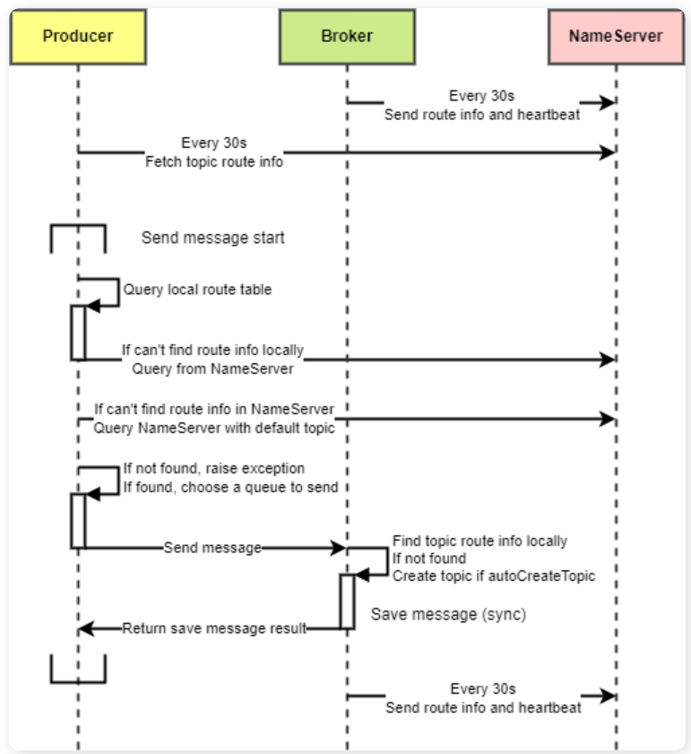
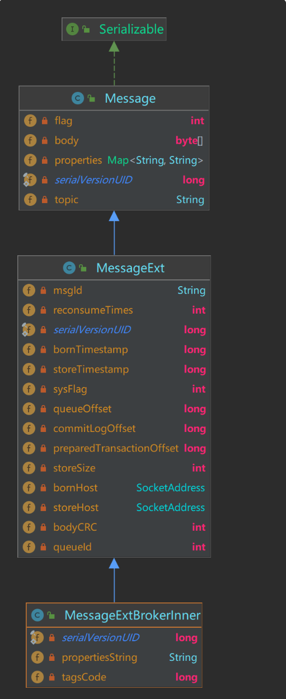
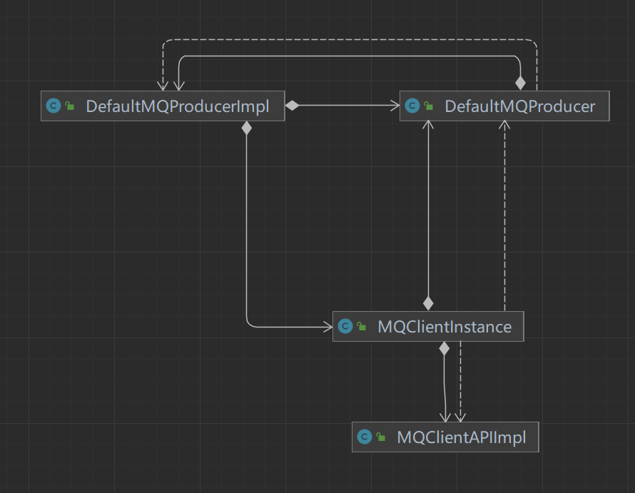
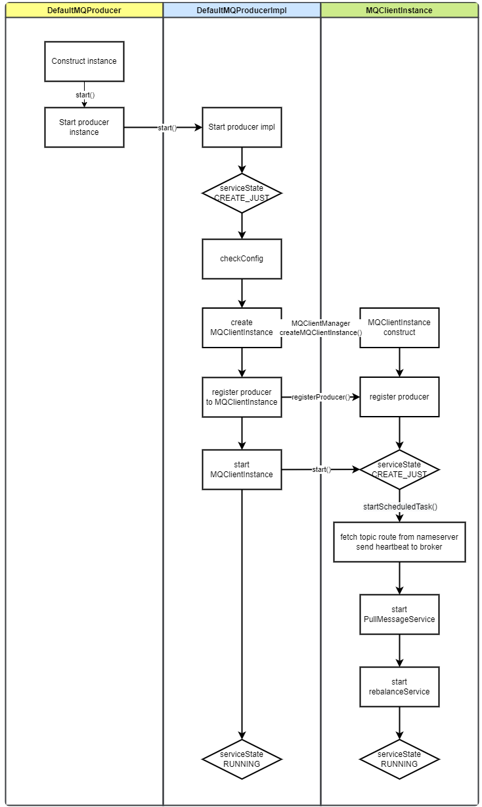
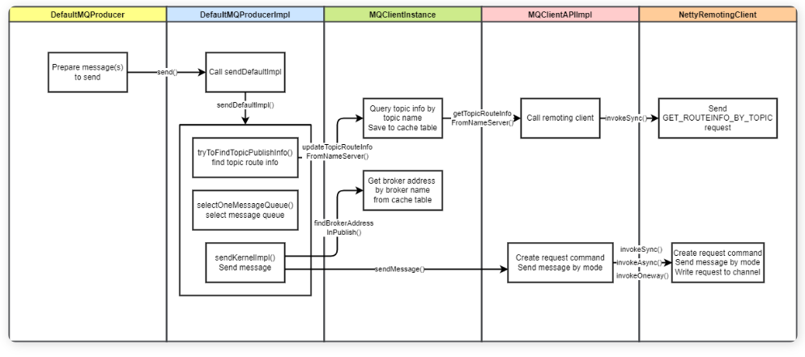

## 概述

​	客户端做的是向 Broker 发送请求，请求中包含了消息的全部信息。而 Broker 需要处理客户端发送来的生产请求，将消息存储起来；

​	RocketMQ 的 Java 客户端提供了丰富的消息发送 API，支持多种消息发送的方式和特殊消息的发送。包括 3 种发送方式（同步、异步、单向）和多种特殊消息（顺序消息、延时消息、批量消息、过滤消息、事务消息）

## 设计思路

### 发送方式

RocketMQ 支持 3 种消息发送方式：同步、异步和单向

#### 同步（Sync）

- 发送消息时，同步等待，直到 Broker 返回发送结果。
- 这种方式最为可靠，但是发送性能最差。
- 在一些可靠性要求非常高的场景下，推荐使用同步方式。比如：重要的消息通知，短信通知。

#### 异步（Async）

- 发送消息时，无需等待 Broker 返回发送结果，发送线程不阻塞。执行发送 API 时指定消息发送成功后的回调函数。
- 这种方式相比于同步发送，性能可以提升多个数量级，但可靠性不如同步发送。
- 在对响应时间敏感、流量较大的场景下，推荐使用异步方式。异步发送是使用最广泛的发送方式。

#### 单向（One-way）

- 发送消息时，直接返回，不等待 Broker 返回发送结果，也不注册回调函数。
- 这种发送方式性能最高，可靠性最差。它不关心发送结果，不在乎消息是否成功存储在 Broker 中。
- 适用于消息丢失也没有太大影响的场景，例如发送日志。

这三种发送方式中，异步发送是最为广泛使用的发送方式。配合一些重试和补偿机制，可以达成较高的可靠性和很高的性

### 消息类型

rocketmq拥有几种特殊消息类型

- 普通消息：发送效率最高、使用场景最广泛的消息类型。普通消息可以由客户端并发发送。不保证普通消息消费的顺序。单 Broker 性能可以达到十万级别。（视 Broker 配置而变）
- 队列级别顺序消息：RocketMQ 将一个 Topic 分为多个队列，以提高消费速度。每隔分区内的消息遵循先生产先消费的顺序。
- Topic 级别顺序消息：如果把一个 Topic 的队列数量设为 1，那么该 Topic 中的消息也遵循先生产先消费。
- 延迟消息：消息发送后，消费者并不马上收到消息，而是等待一段指定的时间之后才能消费到该消息。
- 事务消息：提供分布式事务功能，可以保证发送消息和另外的操作同时成功或者同时失败。
- 批量消息：将多个消息包装成一个批量消息，一起发送。降低网络传输次数，提升传输效率

### 路由机制

​	RocketMQ 的 Topic 可以分为多个队列，每个队列可能分布在不同 Broker 上。

​	消息的路由指的是发送消息时需要先获取 Topic 的路由信息（其中包含每个 Topic 的队列和它们所在的 Broker 地址），然后选择一个队列进行发送。

​	具体选择队列的方式是轮询，但是如果上一次发送失败，下一次选择队列时会避开发送失败队列所在的 Broker。此外有一个**故障延迟机制**，它默认关闭，如果开启则会在一段时间内都规避发送失败的 Broker。

​	消息发送的 API 提供了参数，可以传入要发送的队列信息，或者传入队列选择方法，以供用户选择发往某个 Broker 的具体队列。

### 消息发送流程

消息发送的流程涉及到 RocketMQ 的三个组件：生产者、Broker、NameServer。
其中生产者负责发送消息，Broker 负责处理消息发送请求，NameServer 负责更新和提供路由信息

 

如图所示

- 生产者每 30 秒向 NameServer 拉取路由信息，Broker 每 30 秒向 NameServer 发送路由信息。
- 生产者发送消息时，会先在本地查询 Topic 路由信息。
- 如果查询不到，会请求 NameServer 查询。
- 随后将消息发送给 Broker。
- Broker 也会在本地查询 Topic 路由信息来检查消息的 Topic 是否存在。
- 随后保存消息，如果是异步发送则直接返回，如果同步发送则等待消息保存成功后返回

### 高可用设计

#### 生产者高可用

- 消息发送重试机制：生产者在消息发送时如果出现失败，默认会重试 2 次。
- 故障规避机制：如果重试的消息仍发往同一个 Broker，发送大概率还是会失败，所以在重试时会尽量避开刚刚发送失败的 Broker。
  - 可以通过配置故障延迟机制来指定是在本次消息发送时暂时避开发送失败的 Broker，还是在之后一段时间都避开该 Broker

#### Broker 端高可用

Broker 端的高可用是用数据同步的方式，将消息同步到备 Broker 上，当主 Broker 发生故障时，可以从备 Broker 上恢复数据

## 详细设计

### 消息结构

 

RocketMQ 中的消息类主要有 3 个

- `Message` 为客户端需要使用的消息类。
- `MessageExt` 为消息扩展属性类，它扩展了 `Message`，在 Broker 上产生此对象。
- `MessageExtBrokerInner` 是存储内部使用的 Message 对象，在 rocketmq-store 模块使用。

在发送消息时，用到的是 `Message`，可以指定消息的属性、消息体和 flag。

### 生产者类图

 

- `DefaultMQProducer` 是 RocketMQ 中默认的生产者实现，它实现了 MQAdmin 接口。
- `DefaultMQProducer` 内部包装了一个 `DefaultMQProducerImpl` 字段，它是生产者的具体实现类，`DefaultMQProducer` 调用它内部的 `DefaultMQProducerImpl` 来发送命令。
- `DefaultMQProducerImpl` 内部注册了一个 `MQClientInstance` 字段。`MQClientInstance` 是与 NameServer 和 Broker 通信的中介。 `MQClientInstance` 与 `ClientId` 一一对应，`ClientId` 由 `clientIp`、`instanceName`、`unitName` 组成。如果不手动修改，一般来说一个启动的客户端进程只有一个 `MQClientInstance` 实例，这样可以节省客户端资源。
- `MQClientInstnace` 内部的 `producerTable` 注册了 ClientId 和 `DefaultMQProducerImpl` 的对应关系
- `MQClientAPIImpl` 提供了发送消息的 API，它调用 `RemotingClient` 执行发送

### 生产者启动

 

- 构造 `DefaultMQProducer` 实例，`start()` 启动
- 初始化 `DefaultMQProducerImpl`，设置状态为 `CREATE_JUST`
- 启动 `DefaultMQProducerImpl`
- 检查配置
- 根据 `ClientId` 获取或创建 `MQClientInstance`
- 将 `DefaultMQProducerImpl` 注册到 `MQClientInstance`
- 启动 `MQClientInstance`，`MQClientInstance` 启动定时任务，包括从 NameServer 拉取 Topic 路由信息、向 Broker 发送心跳
- `MQClientInstance` 启动 `PullMessageService` 和 `RebalanceService`
- 设置服务状态为 `RUNNING`

### 消息发送

RocketMQ 的消息发送流程图如下图所示：

 

其中 `MQProducerImpl` 负责执行核心的消息发送方法 `sendDefaultImpl`

这个方法中包含了消息发送的核心逻辑

- 查找 Topic 路由信息
- 选择消息队列
- 发送消息

#### 查找 Topic 路由信息

指定 Topic 发送消息后，生产者需要知道消息要发往哪个 Broker 地址。于是需要获取 Topic 路由信息，查询 Topic 所在的 Broker，随后选择一个 Broker 进行发送。该逻辑在 `DefaultMQProducerImpl#tryToFindTopicPublishInfo()` 中执行。

在第一次发送消息时，本地没有缓存 Topic 路由信息，所以需要主动从 NameServer 拉取，然后更新到本地路由表缓存。随后生产者会启动定时任务，每隔 30s 重新从 NameServer 拉取路由信息。

注意，第一次查询 NameServer 时，如果没有拉取到 Topic 路由信息，则会使用默认 Topic（`AUTO_CREATE_TOPIC_KEY_TOPIC`）再次查询。

> 默认 Topic 在 Broker 启动时创建，是为自动创建主题运用的。
> 它的目的是在主题没有被创建时，让生产者发送消息时也能够查询到 Broker 地址。
> 然后等消息真正发送到 Broker 时，会根据消息的 Topic 创建主题。

如果最终都没有拉取到 Topic 路由信息，则会抛出异常

#### 重试机制

同步发送和异步发送的重试次数分别由 `retryTimesWhenSendFailed` 和 `retryTimesWhenSendAsyncFailed` 指定，默认都为 2 次（发送 1 次，重试 1 次）。

- 同步发送的重试逻辑即在 `sendDefaultImpl()` 方法中循环发送执行发送逻辑。
- 异步发送的重试逻辑在 `MQClientAPIIpml()` 的`sendMessageAsync()` 构造的回调方法中指定。它调用 `onExceptionImpl()` 方法，如果当前发送次数小于异步发送重试次数，则再次执行 `sendMessageAsync()` 重试发送

#### 故障延迟

获取到 Topic 路由信息后，需要从中选择一个队列进行发送。选择队列的逻辑由 `MQFaultStrategy#selectOneMessageQueue()`处理，在正常情况下，会轮询所有队列进行发送；上一次发送异常的情况下它将执行 Broker 规避和**故障延迟机制**。

* 默认机制

  默认机制下，按照**轮询**的方式选择队列。如果上一次发送成功，选择下一个队列。如果上一次发送失败，会规避上一次发送的 `MessageQueue `所在的 Broker。

* 故障延迟机制

  故障延迟机制是为了能够在消息发送的时候尽量避开上次发送失败的 Broker，它由 `sendLatencyFaultEnable` 参数来设置开启，默认为关闭状态。

  - 关闭：发送一次消息失败后，会在本次消息发送过程中避开该 Broker，但**下次发送消息时还会继续尝试**。
  - 开启：发送一次消息失败后，会悲观地认为 Broker 不可用，在**接下来一段时间内都不再向其发送消息**。随着发送失败次数的增多，规避时间将越来越长

#### 发送消息

消息发送逻辑由 `DefaultMQProducerImpl#sendKernelImpl()` 处理。

- 先根据上一步选择的队列，查询 `MQClientInstance` 获取对应的 Broker 地址（先查本地缓存，如果没有则从 NameServer 拉取）。
- 设置消息的全局唯一 ID，然后对于超过 4KB （默认）的消息执行 zip 压缩。
- 执行发送之前的钩子函数 `executeSendMessageHookBefore()`，如消息轨迹的处理逻辑就在这里进行处理。
- 构建消息请求（头）
- 根据消息发送方式调用 `MQClientAPIImpl` 进行网络传输
- 执行消息发送后的钩子函数

`MQClientAPIImpl` 负责调用 `NettyRemotingClient` 将生产消息的请求发往 Broker

### Broker 处理请求

Broker 通过 `SendMessageProcessor` 处理生产者发来的消息生产请求。当前使用 `asyncSendMessage()` 异步处理生产者发送过来的请求。

RocketMQ 的 Netty 请求处理机制会按照业务逻辑进行处理器的拆分。具体地说，RocketMQ 为不同的请求类型（请求码）注册不同的业务处理器和线程池去处理。比如消息生产的请求由 `sendMessageExecutor` 线程池处理，消费请求由 `pullMessageExecutor` 处理……

Broker 处理消息生产请求逻辑如下：

- 检查消息合理性
- 如果消息重试次数超过允许的最大重试次数，将进入死信队列。
- 调用存储模块将消息存储

### 批量消息

为了减少网络请求次数，RocketMQ 支持将统一主题的一批消息打包发送。对于每条消息较小且消息较多的场景，使用批量发送可以提升发送效率。

批量消息 `MessageBatch` 类继承普通消息类 `Message`，内部仅仅多了消息列表 `List<Message> messages`。这样就可以像发送普通消息一样发送批量消息。发送前需要做的就是将多条普通消息体编码，放到 `MessageBatch` 的消息体中。

服务端接收到后，按照相同规则对批量消息进行解码，即可解码出多条消息

## 源码解析