## 概述

### MQ存储通用设计

MQ消息队列采用的存储方式主要有以下三种方式

- **分布式KV存储：**这类MQ一般会采用诸如levelDB、RocksDB和Redis来作为消息持久化的方式，由于分布式缓存的读写能力要优于DB，所以在对消息的读写能力要求都不是比较高的情况下，采用这种方式倒也不失为一种可以替代的设计方案。消息存储于分布式KV需要解决的问题在于如何保证MQ整体的可靠性？
- **文件系统：**目前业界较为常用的几款产品（RocketMQ/Kafka/RabbitMQ）均采用的是消息刷盘至所部署虚拟机/物理机的文件系统来做持久化（刷盘一般可以分为异步刷盘和同步刷盘两种模式）。消息刷盘为消息存储提供了一种高效率、高可靠性和高性能的数据持久化方式。除非部署MQ机器本身或是本地磁盘挂了，否则一般是不会出现无法持久化的故障问题。
- **关系型数据库DB：**Apache下开源的另外一款MQ—ActiveMQ（默认采用的KahaDB做消息存储）可选用JDBC的方式来做消息持久化，通过简单的xml配置信息即可实现JDBC消息存储。由于，普通关系型数据库（如Mysql）在单表数据量达到千万级别的情况下，其IO读写性能往往会出现瓶颈。因此，如果要选型或者自研一款性能强劲、吞吐量大、消息堆积能力突出的MQ消息队列，那么并不推荐采用关系型数据库作为消息持久化的方案。在可靠性方面，该种方案非常依赖DB，如果一旦DB出现故障，则MQ的消息就无法落盘存储会导致线上故障

​	因此，综合上所述从存储效率来说， 文件系统>分布式KV存储>关系型数据库DB，直接操作文件系统肯定是最快和最高效的，而关系型数据库TPS一般相比于分布式KV系统会更低一些（简略地说，关系型数据库本身也是一个需要读写文件server，这时MQ作为client与其建立连接并发送待持久化的消息数据，同时又需要依赖DB的事务等，这一系列操作都比较消耗性能），所以如果追求高效的IO读写，那么选择操作文件系统会更加合适一些。但是如果从易于实现和快速集成来看，关系型数据库DB>分布式KV存储>文件系统，但是性能会下降很多。

​	另外，从消息中间件的本身定义来考虑，应该尽量减少对于外部第三方中间件的依赖。一般来说依赖的外部系统越多，也会使得本身的设计越复杂，所以个人的理解是采用**文件系统**作为消息存储的方式，更贴近消息中间件本身的定义

### RocketMQ存储架构

#### 整体架构

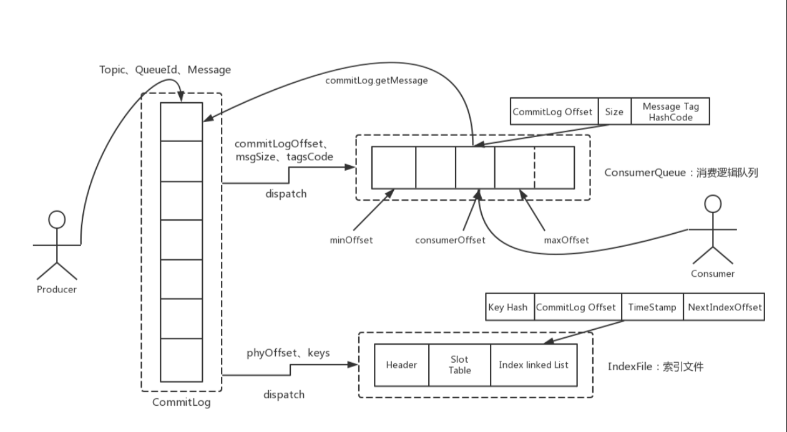 

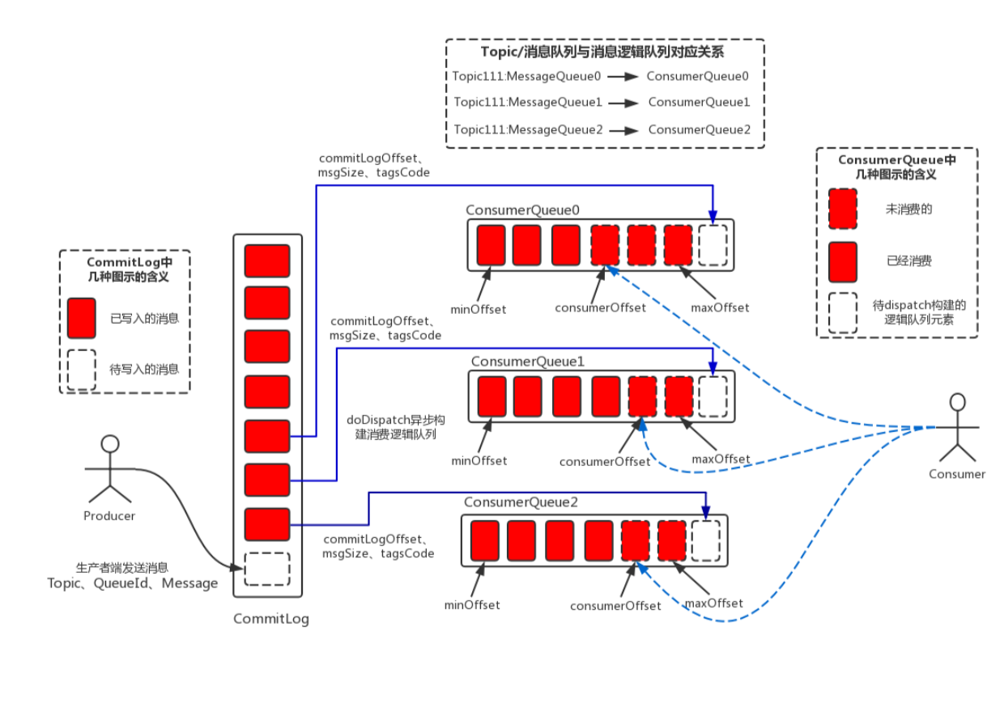 

假设Consumer端默认设置的是同一个ConsumerGroup，因此Consumer端线程采用的是负载订阅的方式进行消费。从架构图中可以总结出如下几个关键点：

- **消息生产与消息消费相互分离**

  Producer端发送消息最终写入的是CommitLog（消息存储的日志数据文件），Consumer端先从ConsumeQueue（消息逻辑队列）读取持久化消息的起始物理位置偏移量offset、大小size和消息Tag的HashCode值，随后再从CommitLog中进行读取待拉取消费消息的真正实体内容部分；

- **RocketMQ的CommitLog文件采用混合型存储**

  （所有的Topic下的消息队列共用同一个CommitLog的日志数据文件），并通过建立类似索引文件—ConsumeQueue的方式来区分不同Topic下面的不同MessageQueue的消息，同时为消费消息起到一定的缓冲作用（只有ReputMessageService异步服务线程通过doDispatch异步生成了ConsumeQueue队列的元素后，Consumer端才能进行消费）。这样，只要消息写入并刷盘至CommitLog文件后，消息就不会丢失，即使ConsumeQueue中的数据丢失，也可以通过CommitLog来恢复。

- **RocketMQ每次读写文件的时候真的是完全顺序读写么？**

  这里，发送消息时，生产者端的消息确实是**顺序写入CommitLog**；订阅消息时，消费者端也是**顺序读取ConsumeQueue**，然而根据其中的起始物理位置偏移量offset读取消息真实内容却是**随机读取CommitLog**。

#### 顺序IO

磁盘的顺序读写性能要远好于随机读写。因为每次从磁盘读数据时需要先寻址，找到数据在磁盘上的物理位置。对于机械硬盘来说，就是移动磁头，会消耗时间。
顺序读写相比于随机读写省去了大部分的寻址时间，它只需要寻址一次就可以连续读写下去，所以性能比随机读写好很多。

RocketMQ 利用了这个特性。它所有的消息数据都存放在一个无限增长的文件队列 CommitLog 中，CommitLog 是由一组 1G 内存映射文件队列组成的。
写入时就从一个固定位置一直写下去，一个文件写满了就开启一个新文件顺序读写下去

**顺序写：**

为了防止消息存储发生混乱，在多线程写 CommitLog 时会上锁，于是写 CommitLog 就变成了一个串行化的操作，对 CommitLog 完全是顺序写

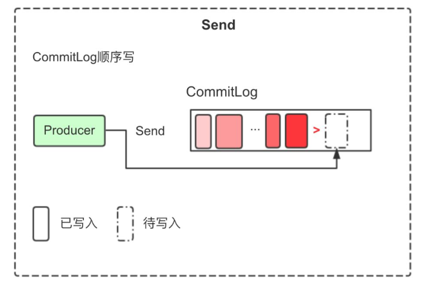 

RocketMQ 的 ConsumeQueue 按 Topic 和 Queue 维度来保存消息在 CommitLog 中的偏移量，由 CommitLog 文件异步生成。每一个 ConsumeQueue 也是顺序写

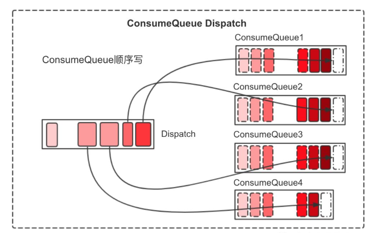 

**顺序读：**

消费消息时，先查询对应 Topic 和 Queue 的 ConsumeQueue，通过 ConsumeQueue 中保存的消息在 CommitLog 中的位置去 CommitLog 中查询消息。

对于每个 ConsumeQueue 来说，消费的过程都是顺序读。

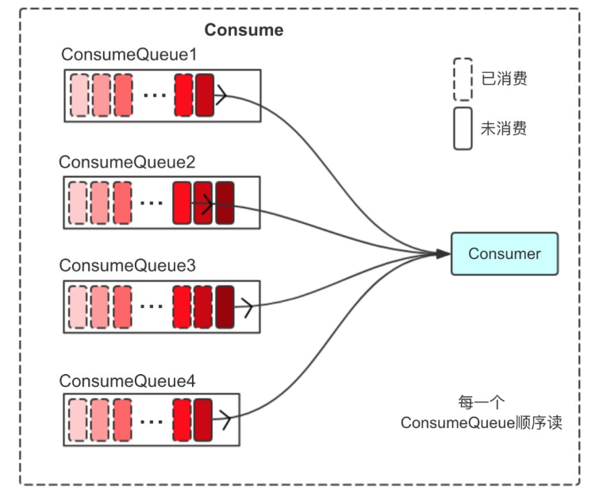 

对于 CommitLog 来说，由于它里面保存的每个 Topic 的消息不是连续的，实际上消费时是一个随机读的过程

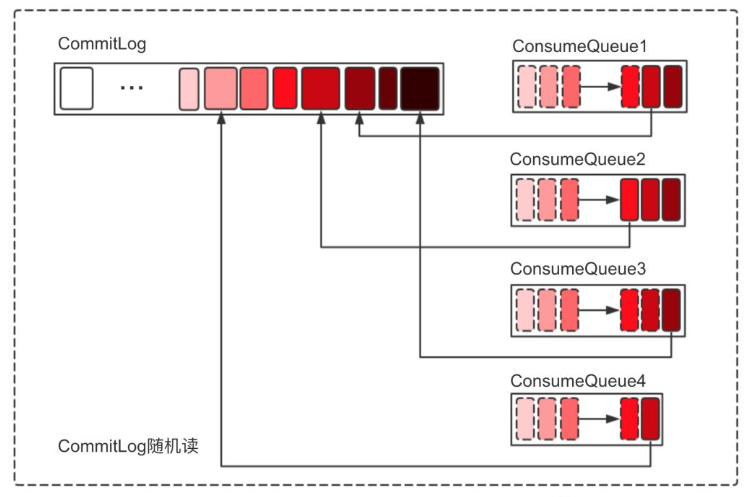 

**虽然是随机读，但整体还是从旧到新有序读，只要随机的那块区域还在Page Cache的热点范围内，还是可以充分利用Page Cache。**

#### 架构优缺点

在RocketMQ集群整体的吞吐量、并发量非常高的情况下，随机读取文件带来的性能开销影响还是比较大的，同样也可以总结下RocketMQ存储架构的优缺点：
**优点：**

- ConsumeQueue消息逻辑队列较为轻量级；
- 对磁盘的访问串行化，避免磁盘竟争，不会因为队列增加导致IOWAIT增高；

**轻量化的多个队列和重量化的多个队列，磁盘io是不一样的**

**缺点：**

- 对于CommitLog来说写入消息虽然是顺序写，但是读却变成了完全的随机读；
- Consumer端订阅消费一条消息，需要先读ConsumeQueue，再读Commit Log，一定程度上增加了开销；

#### 小结

​	RocketMQ的混合型存储结构针对Producer和Consumer分别采用了数据和索引部分相分离的存储结构，Producer发送消息至Broker端，然后Broker端使用同步或者异步的方式对消息刷盘持久化，保存至CommitLog中。只要消息被刷盘持久化至磁盘文件CommitLog中，那么Producer发送的消息就不会丢失。正因为如此，Consumer也就肯定有机会去消费这条消息，至于消费的时间可以稍微滞后一些也没有太大的关系。退一步地讲，即使Consumer端第一次没法拉取到待消费的消息，Broker服务端也能够通过**长轮询**机制等待一定时间延迟后再次发起拉取消息的请求。

​	Broker端的后台服务线程—ReputMessageService不停地分发请求并异步构建ConsumeQueue（逻辑消费队列）和IndexFile（索引文件）数据；Consumer即可根据ConsumerQueue来查找待消费的消息了。其中，ConsumeQueue（逻辑消费队列）作为消费消息的索引，保存了指定Topic下的队列消息在CommitLog中的起始物理偏移量offset，消息大小size和消息Tag的HashCode值。而IndexFile（索引文件）则只是为了消息查询提供了一种通过key或时间区间来查询消息的方法（ps：这种通过IndexFile来查找消息的方法不影响发送与消费消息的主流程）

​	因此总的来说，RocketMQ采用的是混合型的存储结构，即为Broker单个实例下所有的队列共用一个日志数据文件（即为CommitLog）来存储。而Kafka采用的是独立型的存储结构，每个队列一个文件。RocketMQ采用混合型存储结构的缺点在于，会存在较多的随机读操作，因此读的效率偏低。同时消费消息需要依赖ConsumeQueue，构建该逻辑消费队列需要一定开销

## 关键技术分析

### mmap

#### Mmap

实现零拷贝技术，**Mmap内存映射和普通标准IO操作的本质区别在于它并不需要将文件中的数据先拷贝至OS的内核IO缓冲区，而是可以直接将用户进程私有地址空间中的一块区域与文件对象建立映射关系**，这样程序就好像可以直接从内存中完成对文件读/写操作一样。只有当缺页中断发生时，直接将文件从磁盘拷贝至用户态的进程空间内，只进行了一次数据拷贝。对于容量较大的文件来说（文件大小一般需要限制在1.5~2G以下），采用Mmap的方式其读/写的效率和性能都非常高

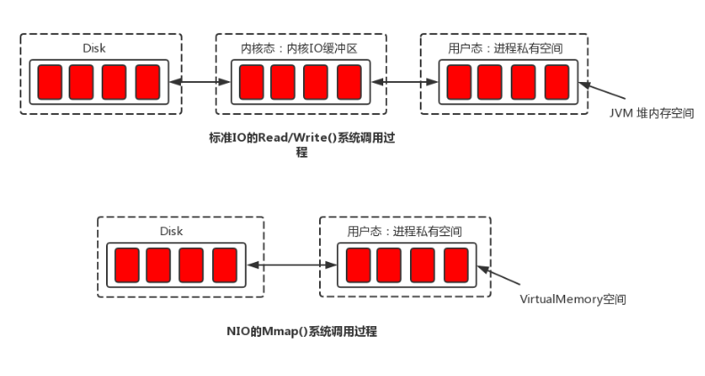  

Page Cache 属于内核空间，在用户空间的应用程序无法直接访问，因此数据还需要从内核空间拷贝到用户空间才可以被应用程序访问

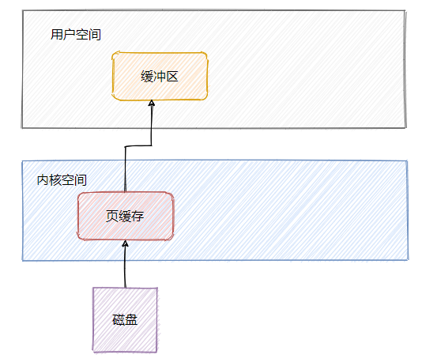 

MMap 指内存映射文件，将磁盘上的物理文件直接映射到用户态的内存地址中。使用 MMap 可以减少传统 IO 将磁盘文件数据在操作系统内核地址空间的缓冲区和用户应用程序地址空间的缓冲区之间来回进行拷贝的性能开销。

程序虚拟页面直接映射到页缓存上，这样就无需有内核态再往用户态的拷贝，而且也避免了重复数据的产生。并且也不必再通过调用`read`或`write`方法对文件进行读写，可以通过映射地址加偏移量的方式直接操作

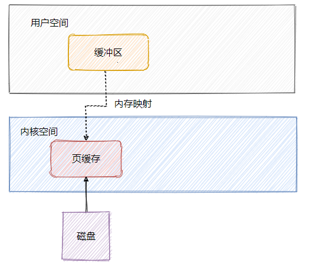 

Java NIO 中的 FileChannel 提供了 map() 方法可以实现 mmap。FileChannel (文件通道)和 mmap (内存映射) 

#### MappedByteBuffer

从JDK的源码来看，MappedByteBuffer继承自ByteBuffer，其内部维护了一个逻辑地址变量—address。在建立映射关系时，MappedByteBuffer利用了JDK NIO的FileChannel类提供的map()方法把文件对象映射到虚拟内存。仔细看源码中map()方法的实现，可以发现最终其通过调用native方法map0()完成文件对象的映射工作，同时使用Util.newMappedByteBuffer()方法初始化MappedByteBuffer实例，但最终返回的是DirectByteBuffer的实例。在Java程序中使用MappedByteBuffer的get()方法来获取内存数据是最终通过DirectByteBuffer.get()方法实现（底层通过unsafe.getByte()方法，以“地址 + 偏移量”的方式获取指定映射至内存中的数据）

RocketMQ 中，CommitLog 和 ConsumeQueue 的底层都是 `MappedFile`，内存映射文件。

```
// MappedFile.java
private void init(final String fileName, final int fileSize) throws IOException {
    // ...

    try {
        // 创建 FileChannel
        this.fileChannel = new RandomAccessFile(this.file, "rw").getChannel();
        // 内存映射
        this.mappedByteBuffer = this.fileChannel.map(MapMode.READ_WRITE, 0, fileSize);
        TOTAL_MAPPED_VIRTUAL_MEMORY.addAndGet(fileSize);
        TOTAL_MAPPED_FILES.incrementAndGet();
        // ...
    }
    // ...
}
```

#### 使用Mmap的限制

- **Mmap映射的内存空间释放的问题**；

  由于映射的内存空间本身就不属于JVM的堆内存区（Java Heap），因此其不受JVM GC的控制，卸载这部分内存空间需要通过系统调用 unmap()方法来实现。然而unmap()方法是FileChannelImpl类里实现的私有方法，无法直接显示调用。

  **RocketMQ中的做法是**，通过Java反射的方式调用“sun.misc”包下的Cleaner类的clean()方法来释放映射占用的内存空间；

- **MappedByteBuffer内存映射大小限制**；

  因为其占用的是虚拟内存（非JVM的堆内存），大小不受JVM的-Xmx参数限制，但其大小也受到**OS虚拟内存大小**的限制。一般来说，一次只能映射**1.5~2G 的文件至用户态的虚拟内存空间，这也是为何RocketMQ默认设置单个CommitLog日志数据文件为1G的原因了；**

- **使用MappedByteBuffe的其他问题**；

  会存在内存占用率较高和文件关闭不确定性的问题

### PageCache

#### 什么是PageCache

​	PageCache是OS对文件的缓存，用于加速对文件的读写。一般来说，程序对文件进行顺序读写的速度几乎接近于内存的读写访问，这里的主要原因就是在于OS使用PageCache机制对读写访问操作进行了性能优化，将一部分的内存用作PageCache。

- **对于数据文件的读取**，如果一次读取文件时出现未命中PageCache的情况，OS从物理磁盘上访问读取文件的同时，会顺序对其他相邻块的数据文件进行预读取（ps：顺序读入紧随其后的少数几个页面）。这样，只要下次访问的文件已经被加载至PageCache时，读取操作的速度基本等于访问内存。

  ​	Page Cache 中没有数据，这时候操作系统会引发一个缺页中断，应用程序的读取线程会被阻塞，操作系统把数据从文件中复制到 Page Cache 中，然后应用程序再从 Page Cache 中继续把数据读出来，这时会真正读一次磁盘上的文件，这个读的过程就会比较慢

- **对于数据文件的写入**，OS会先写入至Cache内，随后通过异步的方式由pdflush内核线程将Cache内的数据刷盘至物理磁盘上。对于文件的顺序读写操作来说，读和写的区域都在OS的PageCache内，此时读写性能接近于内存。

**PS：用户的应用程序在使用完某块 Page Cache 后，操作系统并不会立刻就清除这个 Page Cache，而是尽可能地利用空闲的物理内存保存这些 Page Cache，除非系统内存不够用，操作系统才会清理掉一部分 Page Cache。清理的策略一般是 LRU 或它的变种算法，它保留 Page Cache 的逻辑是：优先保留最近一段时间最常使用的那些 Page Cache**

#### RocketMQ使用PageCache

**RocketMQ的大致做法是**，将数据文件映射到OS的虚拟内存中（通过JDK NIO的MappedByteBuffer），写消息的时候首先写入PageCache，并通过异步刷盘的方式将消息批量的做持久化（同时也支持同步刷盘）；订阅消费消息时（对CommitLog操作是随机读取），由于PageCache的局部性热点原理且整体情况下还是从旧到新的有序读，因此大部分情况下消息还是可以直接从Page Cache中读取，不会产生太多的缺页（Page Fault）中断而从磁盘读取。

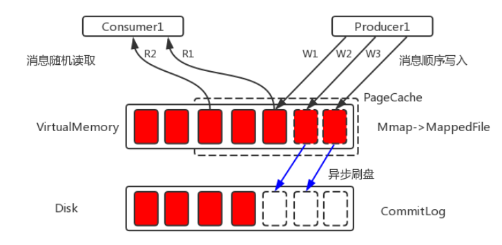 


​	**RocketMQ 充分利用了 Page Cache，它 CommitLog 和 ConsumeQueue 在整体上看都是顺序读写。这样，读和写的区域都是被OS智能Cache过的热点区域，不会产生大量缺页（Page Fault）中断而再次读取磁盘，文件的IO几乎等同于内存的IO**

​	PageCache机制也不是完全无缺点的，当遇到OS进行脏页回写，内存回收，内存swap等情况时，就会引起较大的消息读写延迟

​	对于这些情况，RocketMQ采用了多种优化技术，比如内存预分配，文件预热，mlock系统调用等，来保证在最大可能地发挥PageCache机制优点的同时，尽可能地减少其缺点带来的消息读写延迟

​	RocketMQ存储层采用的几项优化技术方案在一定程度上可以减少PageCache的缺点带来的影响，主要包括内存预分配，文件预热和mlock系统调用

### 预先分配MappedFile

在消息写入过程中（调用CommitLog的putMessage()方法），CommitLog会先从MappedFileQueue队列中获取一个 MappedFile，如果没有就新建一个。

这里，MappedFile的创建过程是将构建好的一个AllocateRequest请求（具体做法是，将下一个文件的路径、下下个文件的路径、文件大小为参数封装为AllocateRequest对象）添加至队列中，后台运行的AllocateMappedFileService服务线程（在Broker启动时，该线程就会创建并运行），会不停地run，只要请求队列里存在请求，就会去执行MappedFile映射文件的创建和预分配工作，分配的时候有两种策略：

* 一种是使用Mmap的方式来构建MappedFile实例
* 另外一种是从TransientStorePool堆外内存池中获取相应的DirectByteBuffer来构建MappedFile

**ps：具体采用哪种策略，也与刷盘的方式有关**

并且，在创建分配完下个MappedFile后，还会将下下个MappedFile预先创建并保存至请求队列中等待下次获取时直接返回。

**RocketMQ中预分配MappedFile的设计非常巧妙，下次获取时候直接返回就可以不用等待MappedFile创建分配所产生的时间延迟这种方式可以减少性能毛刺**

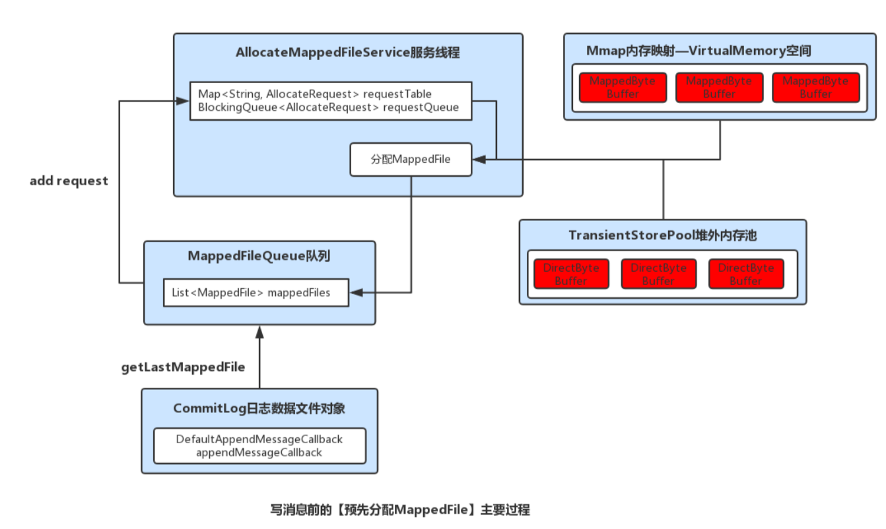

**总的来说就是`AllocateMappedFileService` 会提前准备好下一个文件的分配，包括预热该文件。防止在消息写入的过程中分配文件，产生抖动。其每次最多预分配 2 个文件**

### 文件预热

#### 目的

​	mlock系统调其可以将进程使用的部分或者全部的地址空间锁定在物理内存中，防止其被交换到swap空间。对于RocketMQ这种的高吞吐量的分布式消息队列来说，追求的是消息读写低延迟，那么肯定希望尽可能地多使用物理内存，提高数据读写访问的操作效率 

预热的目的主要有两点：

* 第一点，由于仅分配内存并进行mlock系统调用后并不会为程序完全锁定这些内存，因为其中的分页可能是写时复制的。因此，就有必要对每个内存页面中写入一个假的值。其中，RocketMQ是在创建并分配MappedFile的过程中，预先写入一些随机值至Mmap映射出的内存空间里。
* 第二，调用Mmap进行内存映射后，OS只是建立虚拟内存地址至物理地址的映射表，而实际并没有加载任何文件至内存中。程序要访问数据时OS会检查该部分的分页是否已经在内存中，如果不在，则发出一次缺页中断。这里，可以想象下1G的CommitLog需要发生多少次缺页中断，才能使得对应的数据才能完全加载至物理内存中（ps：X86的Linux中一个标准页面大小是4KB）

**总结下来就是通过 mmap 映射，只是建立了进程虚拟内存地址与物理内存地址之间的映射关系，并没有将 Page Cache 加载至内存。读写数据时如果没有命中写 Page Cache 则发生缺页中断，从磁盘重新加载数据至内存，这样会影响读写性能。为了防止缺页异常，阻止操作系统将相关的内存页调度到交换空间（swap space），RocketMQ 通过对文件预热**

**RocketMQ的做法是**，在做Mmap内存映射的同时进行madvise系统调用，目的是使OS做一次内存映射后对应的文件数据尽可能多的预加载至内存中，从而达到内存预热的效果；

#### 源码

```
// org.apache.rocketmq.store.MappedFile::warmMappedFile
public void warmMappedFile(FlushDiskType type, int pages) {
        ByteBuffer byteBuffer = this.mappedByteBuffer.slice();
        int flush = 0;
        //通过写入 1G 的字节 0 来让操作系统分配物理内存空间，如果没有填充值，操作系统不会实际分配物理内存，防止在写入消息时发生缺页异常
        for (int i = 0, j = 0; i < this.fileSize; i += MappedFile.OS_PAGE_SIZE, j++) {
            byteBuffer.put(i, (byte) 0);
            // force flush when flush disk type is sync
            if (type == FlushDiskType.SYNC_FLUSH) {
                if ((i / OS_PAGE_SIZE) - (flush / OS_PAGE_SIZE) >= pages) {
                    flush = i;
                    mappedByteBuffer.force();
                }
            }
 
            //prevent gc
            if (j % 1000 == 0) {
                Thread.sleep(0);
            }
        }
 
        //force flush when prepare load finished
        if (type == FlushDiskType.SYNC_FLUSH) {
            mappedByteBuffer.force();
        }
        ...
        // 通过jna将内存页锁定在物理内存中，防止被放入swap分区
        this.mlock();
}
 
// org.apache.rocketmq.store.MappedFile::mlock
// LibC继承自com.sun.jna.Library，通过jna方法访问一些native的系统调用
public void mlock() {
    final long beginTime = System.currentTimeMillis();
    final long address = ((DirectBuffer) (this.mappedByteBuffer)).address();
    Pointer pointer = new Pointer(address);
 
    //通过系统调用 mlock 锁定该文件的 Page Cache，防止其被交换到 swap 空间
    int ret = LibC.INSTANCE.mlock(pointer, new NativeLong(this.fileSize));
 
    //通过系统调用 madvise 给操作系统建议，说明该文件在不久的将来要被访问
    int ret = LibC.INSTANCE.madvise(pointer, new NativeLong(this.fileSize), LibC.MADV_WILLNEED);
}

```

#### 小结

`MappedFile.warmMappedFile()` 方法即实现文件预热的功能，每个 OS_PAGE 写入一个任意值(这里为0)，也就是说在初始化状态下，这样操作会给每个页产生恰好一次的缺页中断，这样操作系统会分配物理内存并且将物理地址与逻辑地址简历映射关系。

最后配合 jna 方法，传入 mappedByteBuffer 的地址及文件长度，告诉内核即将要访问这部分文件，希望能将这些页面都锁定在物理内存中，不换进行 swapout，从而在后续实际使用这个文件时提升读写性能

### TransientStorePool

该作用为内存级读写分离 

了降低 Page Cache 的压力，RocketMQ 引入了 TransientStorePool 机制，实现了消息读写在内存级别的读写分离（写消息时写堆外内存，读消息时读 Page Cache）。TransientStorePool 作为一个配置开关，默认关闭，由用户配置开启。

- 默认情况下 TransientStorePool 关闭，消息读写都通过 Page Cache，这样在高并发时 Page Cache 的压力会比较大，容易出现繁忙。
- 开启 TransientStorePool 后，消息写入时将写入 `ByteBuffer.allocateDirect` 方式调用直接申请堆外内存中，由异步刷盘线程写入 fileChannel 中（Page Cache），最后进行进行刷盘。消息读取时，因为堆外内存中的数据未提交，被认为是不可信数据，所以只会从 Page Cache 读取。

这样就实现了内存级别的读写分离，写入消息时主要面对堆外内存，读取消息时主要面对 Page Cache。

- 优点
  - 因为消息是先写入堆外内存，然后异步写入 Page Cache，此时就可以实现批量化写入
  - 写数据是完全写内存，速度相较于写文件对应的 Page Cache 更快
  - 减少锁的占用，提升效率
- 缺点
  - 在 Broker 出问题，异常退出时，已经放入 Page Cache 的数据不会丢失，存储在堆外内存的数据会丢失。所以该特性增大数据丢失的风险

### 小结

​	系统的所有文件I/O请求，操作系统都是通过page cache机制实现的。对于操作系统来说，磁盘文件都是由一系列的数据块顺序组成，数据块的大小由操作系统本身而决定，x86的linux中一个标准页面大小是4KB。

​	操作系统内核在处理文件I/O请求时，首先到page cache中查找（page cache中的每一个数据块都设置了文件以及偏移量地址信息），如果未命中，则启动磁盘I/O，将磁盘文件中的数据块加载到page cache中的一个空闲块，然后再copy到用户缓冲区中。

​	page cache本身也会对数据文件进行预读取，对于每个文件的第一个读请求操作，系统在读入所请求页面的同时会读入紧随其后的少数几个页面。因此，想要提高page cache的命中率（尽量让访问的页在物理内存中），从硬件的角度来说肯定是物理内存越大越好。从操作系统层面来说，访问page cache时，即使只访问1k的消息，系统也会提前预读取更多的数据，在下次读取消息时, 就很可能可以命中内存。

​	在RocketMQ中，ConsumeQueue逻辑消费队列存储的数据较少，并且是顺序读取，在page cache机制的预读取作用下，Consume Queue的读性能会比较高近乎内存，即使在有消息堆积情况下也不会影响性能。而对于CommitLog消息存储的日志数据文件来说，读取消息内容时候会产生较多的随机访问读取，严重影响性能。如果选择合适的系统IO调度算法，比如设置调度算法为“Noop”（此时块存储采用SSD的话），随机读的性能也会有所提升。

​	另外，RocketMQ主要通过MappedByteBuffer对文件进行读写操作。其中，利用了NIO中的FileChannel模型直接将磁盘上的物理文件直接映射到用户态的内存地址中（这种Mmap的方式减少了传统IO将磁盘文件数据在操作系统内核地址空间的缓冲区和用户应用程序地址空间的缓冲区之间来回进行拷贝的性能开销），将对文件的操作转化为直接对内存地址进行操作，从而极大地提高了文件的读写效率（**这里需要注意的是，采用MappedByteBuffer这种内存映射的方式有几个限制，其中之一是一次只能映射1.5~2G 的文件至用户态的虚拟内存，这也是为何RocketMQ默认设置单个CommitLog日志数据文件为1G的原因了**）。

更多的参考内容参考：https://juejin.cn/post/7126195733471952910

**自己的理解：**

* **netty零拷贝是直接分配堆外内存，可以直接操作堆外内存转化java业务数据结构，不使用的化，会将使的堆外数据拷贝到堆内数据对象中，然后进一步转化java业务数据结构；**
* **mmap技术也是nio包装，可以免去内核态数据向用户态堆外内存的拷贝，直接操作内核态物理内存映射的虚拟地址，进一步减少拷贝次数**
* **pagecahe可以直接映射到虚拟内存上，socket内核态可以直接拷贝到这个pagecache内存；**

## RocketMq存储设计

### 存储模型设计

#### 存储实体

- **CommitLog**：消息主体以及元数据的存储主体，存储Producer端写入的消息主体内容。单个文件大小默认1G ，文件名长度为20位，左边补零，剩余为起始偏移量，比如00000000000000000000代表了第一个文件，起始偏移量为0，文件大小为1G=1073741824；当第一个文件写满了，第二个文件为00000000001073741824，起始偏移量为1073741824，以此类推。消息主要是顺序写入日志文件，当文件满了，写入下一个文件；
- **ConsumeQueue**：消息消费的逻辑队列，其中包含了这个MessageQueue在CommitLog中的起始物理位置偏移量offset，消息实体内容的大小和Message Tag的哈希值。从实际物理存储来说，ConsumeQueue对应每个Topic和QueuId下面的文件。单个文件大小约5.72M，每个文件由30W条数据组成，每个文件默认大小为600万个字节，当一个ConsumeQueue类型的文件写满了，则写入下一个文件；
- **IndexFile**：用于为生成的索引文件提供访问服务，通过消息Key值查询消息真正的实体内容。在实际的物理存储上，文件名则是以创建时的时间戳命名的，固定的单个IndexFile文件大小约为400M，一个IndexFile可以保存 2000W个索引；
- **MapedFileQueue**：对连续物理存储的抽象封装类，源码中可以通过消息存储的物理偏移量位置快速定位该offset所在MappedFile(具体物理存储位置的抽象)、创建、删除MappedFile等操作；
- **MappedFile**：文件存储的直接内存映射业务抽象封装类，源码中通过操作该类，可以把消息字节写入PageCache缓存区（commit），或者原子性地将消息持久化的刷盘（flush）；

#### 层次结构

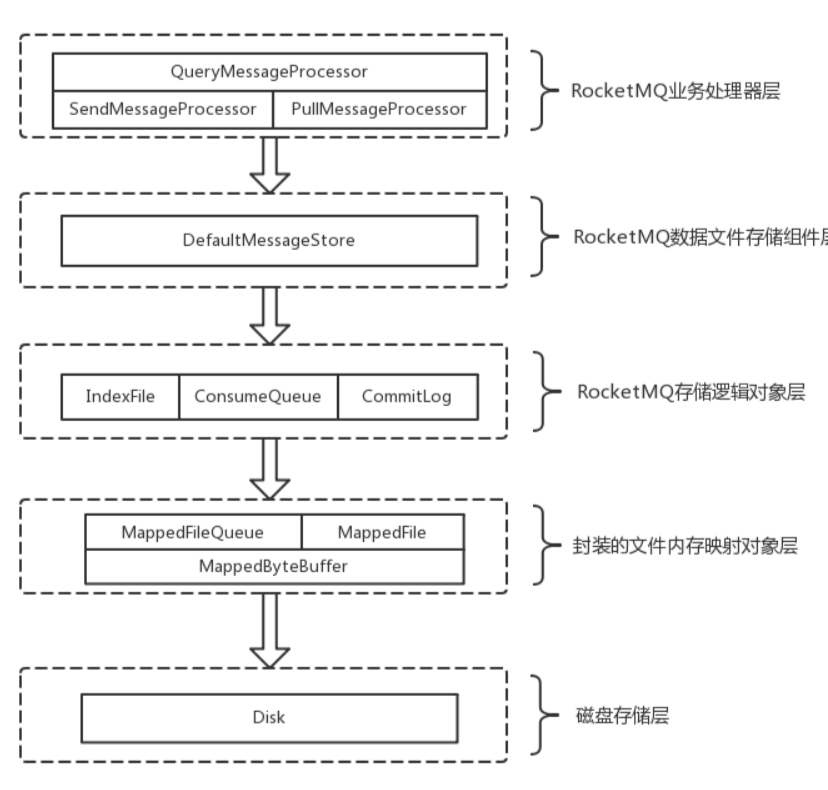 

RocketMQ文件存储模型层次结构如上图所示，根据类别和作用从概念模型上大致可以划分为5层，下面将从各个层次分别进行分析和阐述：

- **RocketMQ业务处理器层**：Broker端对消息进行读取和写入的业务逻辑入口，这一层主要包含了业务逻辑相关处理操作（根据解析RemotingCommand中的RequestCode来区分具体的业务操作类型，进而执行不同的业务处理流程），比如前置的检查和校验步骤、构造MessageExtBrokerInner对象、decode反序列化、构造Response返回对象等；
- **RocketMQ数据存储组件层**；该层主要是RocketMQ的存储核心类—DefaultMessageStore，其为RocketMQ消息数据文件的访问入口，通过该类的“putMessage()”和“getMessage()”方法完成对CommitLog消息存储的日志数据文件进行读写操作（具体的读写访问操作还是依赖下一层中CommitLog对象模型提供的方法）；另外，在该组件初始化时候，还会启动很多存储相关的后台服务线程，包括AllocateMappedFileService（MappedFile预分配服务线程）、ReputMessageService（回放存储消息服务线程）、HAService（Broker主从同步高可用服务线程）、StoreStatsService（消息存储统计服务线程）、IndexService（索引文件服务线程）等；
- **RocketMQ存储逻辑对象层**：该层主要包含了RocketMQ数据文件存储直接相关的三个模型类IndexFile、ConsumerQueue和CommitLog。IndexFile为索引数据文件提供访问服务，ConsumerQueue为逻辑消息队列提供访问服务，CommitLog则为消息存储的日志数据文件提供访问服务。这三个模型类也是构成了RocketMQ存储层的整体结构（对于这三个模型类的深入分析将放在后续篇幅中）；
- **封装的文件内存映射层**：RocketMQ主要采用JDK NIO中的MappedByteBuffer和FileChannel两种方式完成数据文件的读写。其中，采用MappedByteBuffer这种内存映射磁盘文件的方式完成对大文件的读写，在RocketMQ中将该类封装成MappedFile类。这里限制的问题在上面已经讲过；对于每类大文件（IndexFile/ConsumerQueue/CommitLog），在存储时分隔成多个固定大小的文件（**单个IndexFile文件大小约为400M、单个ConsumerQueue文件大小约5.72M、单个CommitLog文件大小为1G**），其中每个分隔文件的文件名为前面所有文件的字节大小数+1，即为文件的起始偏移量，从而实现了整个大文件的串联。这里，每一种类的单个文件均由MappedFile类提供读写操作服务（其中，MappedFile类提供了顺序写/随机读、内存数据刷盘、内存清理等和文件相关的服务）；
- **磁盘存储层**：主要指的是部署RocketMQ服务器所用的磁盘。这里，需要考虑不同磁盘类型（如SSD或者普通的HDD）特性以及磁盘的性能参数（如IOPS、吞吐量和访问时延等指标）对顺序写/随机读操作带来的影响；

### 刷盘设计

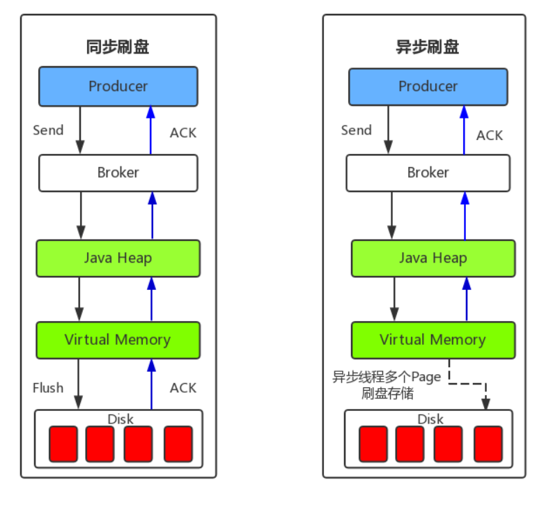 

* **同步刷盘**

  如上图所示，只有在消息真正持久化至磁盘后，RocketMQ的Broker端才会真正地返回给Producer端一个成功的ACK响应。同步刷盘对MQ消息可靠性来说是一种不错的保障，但是性能上会有较大影响，一般适用于金融业务应用领域。RocketMQ同步刷盘的大致做法是，基于生产者消费者模型，主线程创建刷盘请求实例—GroupCommitRequest并在放入刷盘写队列后唤醒同步刷盘线程—GroupCommitService，来执行刷盘动作（其中用了CAS变量和CountDownLatch来保证线程间的同步）。这里，RocketMQ源码中用读写双缓存队列（requestsWrite/requestsRead）来实现读写分离，其带来的好处在于内部消费生成的同步刷盘请求可以不用加锁，提高并发度。

* **异步刷盘**

  能够充分利用OS的PageCache的优势，只要消息写入PageCache即可将成功的ACK返回给Producer端。消息刷盘采用后台异步线程提交的方式进行，降低了读写延迟，提高了MQ的性能和吞吐量。异步和同步刷盘的区别在于，异步刷盘时，主线程并不会阻塞，在将刷盘线程wakeup后，就会继续执行

## CommitLog

## ConsumeQueue

### 概述

#### ConsumeQueue 是什么

​	ConsumeQueue，又称作消费队列，是 RocketMQ 存储系统的一部分，保存在磁盘中。该文件可以看作 CommitLog 关于消息消费的“索引”文件

​	ConsumeQueue 是一个 MappedFileQueue，即每个文件大小相同的内存映射文件队列。每个文件由大小和格式相同的索引项构成。每一个 Topic 的 Queue,都对应一个 ConsumeQueue。

#### ConsumeQueue 的作用

​	**引入 ConsumeQueue 的目的主要是适应消息的检索需求，提高消息消费的性能。**

​	Broker 中所有 Topic 的消息都保存在 CommitLog 中，所以同一 Topic 的消息在 CommitLog 中不是连续存储的。消费某一 Topic 消息时去遍历 CommitLog 是非常低效的，所以引入了 ConsumeQueue。

​	一个 ConsumeQueue 保存了一个 Topic 的某个 Queue 下所有消息在 CommitLog 中的起始物理偏移量offset，消息大小size和消息Tag的HashCode值。当需要消费这个 Topic 时，只需要找到对应的 ConsumeQueue 开始遍历，根据消息在 CommitLog 中的偏移量即可找到消息保存的位置

### 设计思路

#### 文件结构

​	ConsumeQueue 文件保存在 store 目录下的 `consumequeue` 目录中。会为每个 Topic 单独创建一个目录，随后为这个 Topic 中的每个 Queue 单独创建一个目录

```
storepath
├─commitlog
│      00000000000000000000
│      00000000000000102400
│      00000000000000204800
│      00000000000000307200
│
├─consumequeue
│  └─b4b690a3-63b0-42b7-9c52-9e01a24a24d4
│      └─0
│              00000000000000000000
│              00000000000000001040
│              00000000000000002080
│              00000000000000003120
│              00000000000000004160
│              00000000000000005200
│              00000000000000006240
│              00000000000000007280
......
```

ConsumeQueue 是数量可无限扩展的映射文件，每个文件大小固定。

文件中的最小单元是索引项，包含

- 消息在 CommitLog 中的物理偏移量
- 消息大小
- 消息的 Tag Hash 码

可以把 ConsumeQueue 看作是索引项组成的数组

#### 创建ConsumeQueue

​	消息保存到 CommitLog 之后，会进行重投递。重投递消息的过程就是为了建立消息的索引文件（包括 ConsumeQueue 和 IndexFile）。

​	重投递线程会扫描是否有新消息被保存到 CommitLog，如果有则将这条消息查出来，执行重投递逻辑，构建该消息的索引

#### 查询消息

- 由于每个索引项的大小是固定的，所以**只要知道消息在 Queue 中的逻辑偏移量，可以马上算出索引在 ConsumeQueue 中的位置**。
- 根据消费的 Topic 和 QueueId 查询出相应的 ConsumeQueue 消费队列。
- 然后根据位置获取 ConsumeQueue 中的索引项，其中保存有消息在 CommitLog 中的偏移量和消息大小，进而到 CommitLog 中查询出消息。
- 同时 ConsumeQueue 还支持通过消息存储时间来查询具体消息，内部使用二分查找算法

#### 刷盘

由一个单独的线程进行持久化，每隔 1s 进行一次判断。

当写入的索引数超过阈值，或刷盘间隔时间超过 60s，则进行一次刷盘

#### 恢复

- Broker启动时，遍历所有ConsumeQueue目录下的文件，加载这些文件。
- 对每个ConsumeQueue执行恢复操作。
- 从倒数第三个文件开始往后遍历，遍历文件的每个索引项进行校验，更新最大可用偏移量

### 详细设计

#### 文件结构

ConsumeQueue 的文件结构可以看作是一个可以无限扩展的数组，每个数组元素是一个索引项，其格式和大小是固定的

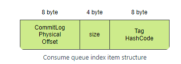 

索引项的结构很简单，如上图所示。其中 Tag HashCode 用作消息过滤 

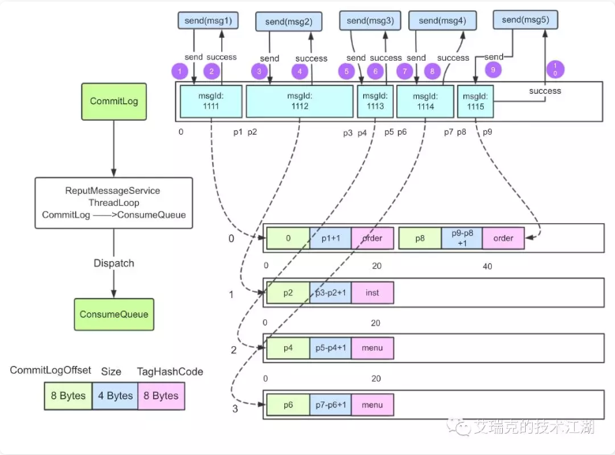 

可以看到，对于同一个 Topic 的消息，首先保存到 CommitLog 中。每个 Topic 的 Queue 都会创建一个 ConsumeQueue，内部保存该 Queue 中所有消息的索引项

#### 创建consumeQueue

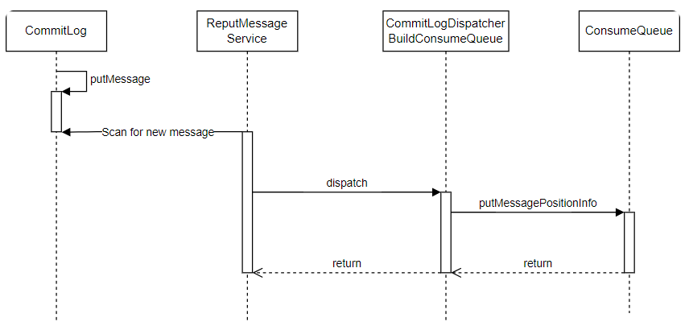 

* 消息会被先保存到 CommitLog 中，随后由一个独立线程`DefaultMessageStore.ReputMessageService#doreput()`对 CommitLog 进行扫描。
* 当扫描到新消息被保存到 CommitLog 时，会执行 dispatch（转发） 操作，运行所有消息 Dispatcher，来构建 ConsumeQueue 和 IndexFile。
* 其中 `DefaultMessageStore.CommitLogDispatcherBuildConsumeQueue` 就是用来创建 ConsumeQueue 的。其 `dispatch()` 方法将刚刚保存的消息存入ConsumeQueue 中。
* 内部调用了 `ConsumeQueue#putMessagePositionInfo()` 方法，写内存映射文件，将消息真正存入 ConsumeQueue

#### 查询消息

客户端发起消息消费请求，请求码为`RequestCode.PULL_MESSAGE`，对应的处理类为`PullMessageProcessor`。Broker 在收到客户端的请求之后，会根据topi

和queueId定位到对应的 ConsumeQueue。然后根据这条请求传入的offset消费队列偏移量，定位到对应消息。

在存储层面查询消息的入口是 `DefaultMessageStore#getMessage()`

```
GetMessageResult getMessage(final String group, final String topic, final int queueId, final long offset,
    final int maxMsgNums,
    final MessageFilter messageFilter)
```

* 这个方法中根据`topic`和`queueId`查询相应的ConsumeQueue
* 然后使用`offset`从ConsumeQueue中获取相应位置的索引信息。
* 随后使用查出来的`phyOffset`和`size`到CommitLog中查询消息并返回

#### 刷盘

由一个单独的线程`FlushConsumeQueueService`周期性检查和刷盘，检查周期`flushIntervalConsumeQueue`可配置，默认为 1s。

执行刷盘有两个阈值

- `flushConsumeQueueThoroughInterval`（默认 60s）内如果没有执行过刷盘操作，则会执行一次刷盘
- 需要刷盘的数据超过`getFlushConsumeQueueLeastPages`（默认2）个操作系统页

#### 恢复

- Broker启动时，调用`DefaultMessageStore#loadConsumeQueue()`遍历所有ConsumeQueue目录下的文件，加载这些文件。
- 随后进行恢复操作`recoverConsumeQueue()`遍历每个ConsumeQueue执行恢复recover()。
- 从倒数第三个文件开始往后遍历，遍历文件的每个索引项进行校验，校验成功则更新当前文件的最大可用偏移量，否则直接退出。最后更新整个队列的可用偏移量，删除多余的文件

### 源码分析

与 ConsumeQueue 相关的类有

- ConsumeQueue
- ConsumeQueueExt
- DefaultMessageStore

下面分析 ConsumeQueue 相关操作的源码实现

#### 创建ConsumeQueue

ConsumeQueue 的构建入口是`ReputMessageService#doReput()`方法，它会从 CommitLog 中扫描新的消息，然后转发和构建 ConsumeQueue

* ReputMessageService#doReput
  * 当 CommitLog 可用，一直从上一条消息末尾位置开始循环扫描新消息
  * 如找到消息，将消息封装成`DispatchRequest`，分发给各个处理器（`CommitLogDispatcher`）

  ```
  private void doReput() {
  		// ...
  
      // CommitLog可用则一直进行循环扫描
      for (boolean doNext = true; this.isCommitLogAvailable() && doNext; ) {
  
          // 从上一条消息的结束位置开始获取下一条消息
          SelectMappedBufferResult result = DefaultMessageStore.this.commitLog.getData(reputFromOffset);
          if (result != null) {
              try {
                  // 更新分发的偏移量为当前分发消息的起始偏移量
                  this.reputFromOffset = result.getStartOffset();
  
                  for (int readSize = 0; readSize < result.getSize() && doNext; ) {
                      // 检查消息，查询并解析消息，构建消息的DispatchRequest
                      DispatchRequest dispatchRequest =
                          DefaultMessageStore.this.commitLog.checkMessageAndReturnSize(result.getByteBuffer(), false, false);
                      int size = dispatchRequest.getBufferSize() == -1 ? dispatchRequest.getMsgSize() : dispatchRequest.getBufferSize();
  
                      if (dispatchRequest.isSuccess()) {
                          if (size > 0) {
                              // 将DispatchRequest分发给所有注册dispatcherList中的CommitLogDispatcher进行处理
                              DefaultMessageStore.this.doDispatch(dispatchRequest);
                              // 通知消息消费长轮询线程，有新的消息落盘，立即唤醒挂起的消息拉取请求
                              if (BrokerRole.SLAVE != DefaultMessageStore.this.getMessageStoreConfig().getBrokerRole()
                                      && DefaultMessageStore.this.brokerConfig.isLongPollingEnable()
                                      && DefaultMessageStore.this.messageArrivingListener != null) {
                                  DefaultMessageStore.this.messageArrivingListener.arriving(dispatchRequest.getTopic(),
                                      dispatchRequest.getQueueId(), dispatchRequest.getConsumeQueueOffset() + 1,
                                      dispatchRequest.getTagsCode(), dispatchRequest.getStoreTimestamp(),
                                      dispatchRequest.getBitMap(), dispatchRequest.getPropertiesMap());
                              }
  		// ...
  }
  ```

* DefaultMessageStore#doDispatch

  * 在`doReput`方法中被调用
  * 内部遍历所有`dispatcherList`中的分发器，执行每个分发器的`dispatch`方法

  ```
  public void doDispatch(DispatchRequest req) {
      for (CommitLogDispatcher dispatcher : this.dispatcherList) {
          dispatcher.dispatch(req);
      }
  }
  ```

* CommitLogDispatcherBuildConsumeQueue#dispatch

  - 判断消息的事务属性
  - 根据 Topic 和 queueId 查找 ConsumeQueue
  - 调用 ConsumeQueue 的保存方法

  ```
  public void dispatch(DispatchRequest request) {
      final int tranType = MessageSysFlag.getTransactionValue(request.getSysFlag());
      switch (tranType) {
          // 非事务消息或Commit类型的事务消息才执行分发
          case MessageSysFlag.TRANSACTION_NOT_TYPE:
          case MessageSysFlag.TRANSACTION_COMMIT_TYPE:
              // 将请求分发到 ConsumeQueue
              DefaultMessageStore.this.putMessagePositionInfo(request);
              break;
          case MessageSysFlag.TRANSACTION_PREPARED_TYPE:
          case MessageSysFlag.TRANSACTION_ROLLBACK_TYPE:
              break;
      }
  }
  ```

  ```
  /**
   * 将请求分发到具体的 ConsumeQueue
   *
   * @param dispatchRequest 消息的分发请求
   */
  public void putMessagePositionInfo(DispatchRequest dispatchRequest) {
      ConsumeQueue cq = this.findConsumeQueue(dispatchRequest.getTopic(), dispatchRequest.getQueueId());
      cq.putMessagePositionInfoWrapper(dispatchRequest);
  }
  ```

* ConsumeQueue#putMessagePosiitonInfo

  该函数的作用为：

  - 被`putMessagePositionInfoWrapper`调用
  - 用于往ConsumeQueue中写入索引项

  该函数的大致逻辑如下：

  - 将索引项的三个参数写入 ByteBuffer
  - 计算应该写入 ConsumeQueue 的物理偏移量
  - 将 ByteBuffer 中的数据写入 ConsumeQueue 文件

  ​	注意该函数的入参中有一个`cqOffset`，表示消息在该 ConsumeQueue 中的逻辑偏移量。那么消息索引都还没有被存入 ConsumeQueue，它在 ConsumeQueue 里的逻辑偏移量怎么已经被计算出来了？

  其实这个值在消息被保存到 CommitLog 时就已经计算出来并保存到 CommitLog 中了，计算的逻辑在 `CommitLog#doAppend` 方法中。

  ​	具体的实现方法是：CommitLog 中的 `topicQueueTable` 变量保存着每个 ConsumeQueue 当前的最新逻辑偏移量。**当应当保存在该 ConsumeQueue 的新消息被保存到 CommitLog，会从 topicQueueTable 获取最新的偏移量，并且将该偏移量加一**。源码不在此处展示

  ```
  /**
   * 往ConsumeQueue中写入索引项，putMessagePositionInfo只有一个线程调用，所以不需要加锁
   *
   * @param offset CommitLog offset
   * @param size 消息在CommitLog存储的大小
   * @param tagsCode 过滤tag的hashcode
   * @param cqOffset 消息在ConsumeQueue中的逻辑偏移量。在 {@link CommitLog#doAppend} 方法中已经生成并保存
   * @return 是否成功
   */
  private boolean putMessagePositionInfo(final long offset, final int size, final long tagsCode,
      final long cqOffset) {
  
      // CommitLog offset + size 小于ConsumeQueue中保存的最大CommitLog物理偏移量，说明这个消息重复生成ConsumeQueue，直接返回
      // 多见于关机恢复的场景。关机恢复从倒数第3个CommitLog文件开始重新转发消息生成ConsumeQueue
      if (offset + size <= this.maxPhysicOffset) {
          log.warn("Maybe try to build consume queue repeatedly maxPhysicOffset={} phyOffset={}", maxPhysicOffset, offset);
          return true;
      }
  
      // NIO ByteBuffer 写入三个参数
      this.byteBufferIndex.flip();
      this.byteBufferIndex.limit(CQ_STORE_UNIT_SIZE);
      this.byteBufferIndex.putLong(offset);
      this.byteBufferIndex.putInt(size);
      this.byteBufferIndex.putLong(tagsCode);
  
      // 计算本次期望写入ConsumeQueue的物理偏移量
      final long expectLogicOffset = cqOffset * CQ_STORE_UNIT_SIZE;
  
      // 根据期望的偏移量找到对应的内存映射文件
      MappedFile mappedFile = this.mappedFileQueue.getLastMappedFile(expectLogicOffset);
      if (mappedFile != null) {
          // 纠正MappedFile逻辑队列索引顺序
          // 如果MappedFileQueue中的MappedFile列表被删除
          // 这时需要保证消息队列的逻辑位置和ConsumeQueue文件的起始文件的偏移量一致，要补充空的消息索引
          if (mappedFile.isFirstCreateInQueue() && cqOffset != 0 && mappedFile.getWrotePosition() == 0) {
              this.minLogicOffset = expectLogicOffset;
              this.mappedFileQueue.setFlushedWhere(expectLogicOffset);
              this.mappedFileQueue.setCommittedWhere(expectLogicOffset);
              // 填充空的消息索引
              this.fillPreBlank(mappedFile, expectLogicOffset);
              log.info("fill pre blank space " + mappedFile.getFileName() + " " + expectLogicOffset + " "
                  + mappedFile.getWrotePosition());
          }
  
          if (cqOffset != 0) {
              // 当前ConsumeQueue被写过的物理offset = 该MappedFile被写过的位置 + 该MappedFile起始物理偏移量
              // 注意：此时消息还没从内存刷到磁盘，如果是异步刷盘，Broker断电就会存在数据丢失的情况
              // 此时消费者消费不到，所以在重要业务中使用同步刷盘确保数据不丢失
              long currentLogicOffset = mappedFile.getWrotePosition() + mappedFile.getFileFromOffset();
              
              // 如果期望写入的位置 < 当前ConsumeQueue被写过的位置，说明是重复写入，直接返回
              if (expectLogicOffset < currentLogicOffset) {
                  log.warn("Build  consume queue repeatedly, expectLogicOffset: {} currentLogicOffset: {} Topic: {} QID: {} Diff: {}",
                      expectLogicOffset, currentLogicOffset, this.topic, this.queueId, expectLogicOffset - currentLogicOffset);
                  return true;
              }
              
              // 期望写入的位置应该等于被写过的位置
              if (expectLogicOffset != currentLogicOffset) {
                  LOG_ERROR.warn(
                      "[BUG]logic queue order maybe wrong, expectLogicOffset: {} currentLogicOffset: {} Topic: {} QID: {} Diff: {}",
                      expectLogicOffset,
                      currentLogicOffset,
                      this.topic,
                      this.queueId,
                      expectLogicOffset - currentLogicOffset
                  );
              }
          }
          this.maxPhysicOffset = offset + size;
          // 将一个ConsumeQueue数据写盘，此时并未刷盘
          return mappedFile.appendMessage(this.byteBufferIndex.array());
      }
      return false;
  }
  
  ```

#### 查询消息

​	客户端发起消息消费请求，请求码为`RequestCode.PULL_MESSAGE`，**对应的处理类为`PullMessageProcessor`**，服务器在收到客户端的请求之后，会根据topic和queueId定位到对应的消费队列。然后根据这条请求传入的offset消费队列偏移量，定位到对应的消费队列文件。存储层查询消息的入口是 `DefaultMessageStore#getMessage`

* DefaultMessageStore#getMessage

  该方法的调用关系如下图所示

  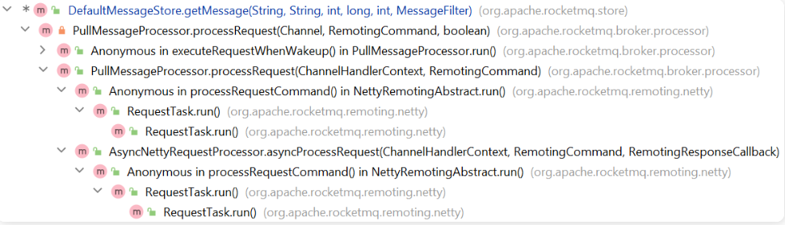 

  - 根据 Topic 和 QueueId 查询 ConsumeQueue
  - 根据逻辑偏移量从 ConsumeQueue 中查出索引项
  - 使用索引项中的 CommitLog 物理 offset 和消息的 size，从 CommitLog 查询消息
  - 使用索引项中的 Tag HashCode 处理消息过滤的逻辑

  源码：

  ```
  /**
   * 获取消息
   *
   * @param group Consumer group that launches this query. 消费者组
   * @param topic Topic to query. 主题
   * @param queueId Queue ID to query. 队列ID
   * @param offset Logical offset to start from. 消息在队列中的逻辑偏移量
   * @param maxMsgNums Maximum count of messages to query. 查询的最大消息数量
   * @param messageFilter Message filter used to screen desired messages. 消息过滤器
   * @return 查询消息结果
   */
  public GetMessageResult getMessage(final String group, final String topic, final int queueId, final long offset,
      final int maxMsgNums,
      final MessageFilter messageFilter) {
  		// ...
      ConsumeQueue consumeQueue = findConsumeQueue(topic, queueId);
      if (consumeQueue != null) {
         if (/*...*/) {
  					// ...
          } else {
  						// 根据逻辑偏移量从 ConsumeQueue 中查出索引项
              SelectMappedBufferResult bufferConsumeQueue = consumeQueue.getIndexBuffer(offset);
              if (bufferConsumeQueue != null) {
                  try {
                      // ...
  										// 从消费队列中读取消息，直到读完或者读到查询消息数的最大值
                      for (; i < bufferConsumeQueue.getSize() && i < maxFilterMessageCount; i += ConsumeQueue.CQ_STORE_UNIT_SIZE) {
                          long offsetPy = bufferConsumeQueue.getByteBuffer().getLong();
                          int sizePy = bufferConsumeQueue.getByteBuffer().getInt();
                          long tagsCode = bufferConsumeQueue.getByteBuffer().getLong();
  
                          maxPhyOffsetPulling = offsetPy;
  
                          // ...
  
                          // 消息过滤
                          if (messageFilter != null
                              && !messageFilter.isMatchedByConsumeQueue(isTagsCodeLegal ? tagsCode : null, extRet ? cqExtUnit : null)) {
                              if (getResult.getBufferTotalSize() == 0) {
                                  status = GetMessageStatus.NO_MATCHED_MESSAGE;
                              }
  
                              continue;
                          }
  
                          // 根据消息的偏移量和消息的大小从 CommitLog 文件中取出一条消息
                          SelectMappedBufferResult selectResult = this.commitLog.getMessage(offsetPy, sizePy);
                          if (null == selectResult) {
                              if (getResult.getBufferTotalSize() == 0) {
                                  status = GetMessageStatus.MESSAGE_WAS_REMOVING;
                              }
  
                              nextPhyFileStartOffset = this.commitLog.rollNextFile(offsetPy);
                              continue;
                          }
  		// ...
  }
  ```

#### 刷盘

putMessagePositionInfo 中调用 MappedFile#appendMessage，但这并不表示消息会被立刻持久化到磁盘中。

持久化的过程是通过后台服务 FlushConsumeQueueService 来定时持久化的，每隔1s检查一次。

* FlushConsumeQueueService#doFlush

  该方法每隔 1s 执行一次。

  - 比较上次刷盘时间与当前时间差距，如果小于等于 60s，则执行刷盘
  - 遍历 ConsumeQueue 执行刷盘，每个 ConsumeQueue 至少刷 2 个操作系统页
  - 更新 StoreCheckpoint 中的最新刷盘时间

  ```
  private void doFlush(int retryTimes) {
      // 变量含义：如果大于0，则标识这次刷盘必须刷多少个page，如果=0，则有多少刷多少。
      // 默认为2，表示每次至少刷2个操作系统page
      int flushConsumeQueueLeastPages = DefaultMessageStore.this.getMessageStoreConfig().getFlushConsumeQueueLeastPages();
  
      // 程序退出时强制刷盘
      if (retryTimes == RETRY_TIMES_OVER) {
          flushConsumeQueueLeastPages = 0;
      }
  
      long logicsMsgTimestamp = 0;
  
      // 一定时间内未执行刷盘，会强制刷盘，默认60s
      int flushConsumeQueueThoroughInterval = DefaultMessageStore.this.getMessageStoreConfig().getFlushConsumeQueueThoroughInterval();
      long currentTimeMillis = System.currentTimeMillis();
      if (currentTimeMillis >= (this.lastFlushTimestamp + flushConsumeQueueThoroughInterval)) {
          // 当时间满足flushConsumeQueueThoroughInterval时，即使写入的数量不足flushConsumeQueueLeastPages，也进行flush
          this.lastFlushTimestamp = currentTimeMillis;
          flushConsumeQueueLeastPages = 0;
          logicsMsgTimestamp = DefaultMessageStore.this.getStoreCheckpoint().getLogicsMsgTimestamp();
      }
  
      ConcurrentMap<String, ConcurrentMap<Integer, ConsumeQueue>> tables = DefaultMessageStore.this.consumeQueueTable;
  
      // 遍历ConsumeQueue刷盘
      for (ConcurrentMap<Integer, ConsumeQueue> maps : tables.values()) {
          for (ConsumeQueue cq : maps.values()) {
              boolean result = false;
              for (int i = 0; i < retryTimes && !result; i++) {
                  result = cq.flush(flushConsumeQueueLeastPages);
              }
          }
      }
  
      // 更新CheckPoint中ConsumeQueue最新刷盘时间
      if (0 == flushConsumeQueueLeastPages) {
          if (logicsMsgTimestamp > 0) {
              DefaultMessageStore.this.getStoreCheckpoint().setLogicsMsgTimestamp(logicsMsgTimestamp);
          }
          DefaultMessageStore.this.getStoreCheckpoint().flush();
      }
  }
  
  ```

#### 恢复

在Broker重新启动时会扫描ConsumeQueue的目录，尝试恢复这些文件

* ConsumeQueue#recover

  从倒数第三个文件开始往后遍历，遍历文件的每个索引项进行校验，校验成功则更新当前文件的最大可用偏移量，否则直接退出循环。

  最后更新整个队列的可用偏移量，删掉不可用的部分

  ```
  public void recover() {
      final List<MappedFile> mappedFiles = this.mappedFileQueue.getMappedFiles();
      if (!mappedFiles.isEmpty()) {
          // 从倒数第三个文件开始恢复
          int index = mappedFiles.size() - 3;
          if (index < 0)
              index = 0;
  
          int mappedFileSizeLogics = this.mappedFileSize;
          MappedFile mappedFile = mappedFiles.get(index);
          ByteBuffer byteBuffer = mappedFile.sliceByteBuffer();
          long processOffset = mappedFile.getFileFromOffset();
          long mappedFileOffset = 0;
          long maxExtAddr = 1;
          while (true) {
              for (int i = 0; i < mappedFileSizeLogics; i += CQ_STORE_UNIT_SIZE) {
                  long offset = byteBuffer.getLong();
                  int size = byteBuffer.getInt();
                  long tagsCode = byteBuffer.getLong();
  
                  // 说明当前存储单元有效
                  if (offset >= 0 && size > 0) {
                      mappedFileOffset = i + CQ_STORE_UNIT_SIZE;
                      this.maxPhysicOffset = offset + size;
                      if (isExtAddr(tagsCode)) {
                          maxExtAddr = tagsCode;
                      }
                  } else {
                      log.info("recover current consume queue file over,  " + mappedFile.getFileName() + " "
                          + offset + " " + size + " " + tagsCode);
                      break;
                  }
              }
  
              // 走到文件末尾，切换至下一个文件
              if (mappedFileOffset == mappedFileSizeLogics) {
                  index++;
                  if (index >= mappedFiles.size()) {
                      // 当前分支不可能发生
                      log.info("recover last consume queue file over, last mapped file "
                          + mappedFile.getFileName());
                      break;
                  } else {
                      mappedFile = mappedFiles.get(index);
                      byteBuffer = mappedFile.sliceByteBuffer();
                      processOffset = mappedFile.getFileFromOffset();
                      mappedFileOffset = 0;
                      log.info("recover next consume queue file, " + mappedFile.getFileName());
                  }
              } else {
                  log.info("recover current consume queue queue over " + mappedFile.getFileName() + " "
                      + (processOffset + mappedFileOffset));
                  break;
              }
          }
  
          processOffset += mappedFileOffset;
          this.mappedFileQueue.setFlushedWhere(processOffset);
          this.mappedFileQueue.setCommittedWhere(processOffset);
          this.mappedFileQueue.truncateDirtyFiles(processOffset);
  
          if (isExtReadEnable()) {
              this.consumeQueueExt.recover();
              log.info("Truncate consume queue extend file by max {}", maxExtAddr);
              this.consumeQueueExt.truncateByMaxAddress(maxExtAddr);
          }
      }
  }
  ```

### RocketMQ 5.x新引入

RocketMQ 5.x 版本中新的 **Batch Consume Queue index**，为了支持 Batch Message，引入了新的 ConsumeQueue 格式

这种 ConsumeQueue 元素更多（每个索引的大小也更大），支持了 Batch Message，且方便扩展（留了8字节的保留字段）

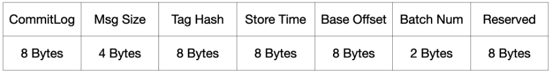 

 RocketMQ 5.0 采用这种 ConsumeQueue 的格式

## IndexFile

### 概述

#### 索引文件

IndexFile，又可以称作索引文件，是 RocketMQ 保存在磁盘上的一种文件，属于 RocketMQ 存储的一部分。它的结构类似于类似 JDK中 HashMap。

可以通过`messageIndexEnable`属性配置打开或关闭 IndexFile 存储功能

#### 索引文件作用

索引文件的应用场景其实比较局限，是为了提供**按照 Message Key 查询消息**的能力。索引文件可以通过 Message Key，查询到消息在 CommitLog 中的物理偏移量，进而从 CommitLog 中查询消息。

### 概要设计

#### 索引文件结构

上面说它的逻辑结构类似 HashMap，HashMap 以 Key-Value 形式存储数据，那么索引文件的存储格式也是 Key-Value

- Key：Message Key。索引文件的 Key 其实是 Message Key 经过 hash 得到的一个 Integer，
- Value：physical offset。索引文件的 Value 主要是消息在 CommitLog 中的绝对物理偏移量。

hash冲突时，Value以链表的方式存储，越新的消息在链表越前面。

它可以包含多个文件，每个文件的大小是固定的。这就意味着每个 IndexFile 包含的最大索引数量是相同的。

#### 如何构建

消息保存到 CommitLog 之后，会进行重投递。重投递消息的过程就是为了建立消息的索引文件（包括 ConsumeQueue 和 IndexFile）。

重投递线程会扫描是否有新消息被保存到 CommitLog，如果有则将这条消息查出来，执行重投递逻辑，构建该消息的索引

#### 如何查询消息

索引文件中存储着 Message Key 对应消息在 CommitLog 中的偏移量，首先查询出这些偏移量信息，然后用偏移量从 CommitLog 中查询出消息

#### 刷盘机制

索引文件的刷盘机制并不是采取定时刷盘机制，而是每写满一个索引文件时就新建一个文件，并且将上一个写满的索引文件刷盘

### 详细设计

#### 索引文件结构

设计 IndexFile 最重要的是设计它的逻辑结构和文件存储结构。首先看一下 IndexFile 详细的逻辑结构

##### 逻辑结构

上面已经提到 IndexFile 是类似 JDK 的 HashMap 的结构。

- Key：由 `IndexService#buildKey(String topic, String key)`构建而成，具体为 `topic + "#" + messageKey` 经过hash（`IndexFile#indexKeyHashMethod(String Key)`）得到。

  > 注意：这里存在 Hash 冲突的可能，两个 Topic 和 Key 不同的消息可能得到相同的 Hash 值，会导致查询结果错误。社区已经提出这个错误 [ISSUE#3613open in new window](https://github.com/apache/rocketmq/issues/3613)，但目前还并未解决。
  >
  >  

- Value：Hash 冲突时变成链表结构，包含：

  - 消息在 CommitLog 中的物理偏移量，用于到 CommitLog 中查询消息
  - `IndexFile#indexKeyHashMethod(String Key)`得到的整数 Hash 值
  - 消息保存时间与索引文件最早消息保存时间的差值，用于搜索时间范围内的消息
  - 指向下一条消息位置的指针（在时间上是前一条，越晚到达的消息在链表越前面）

##### 存储结构

索引文件底层使用 RocketMQ 的 MappedFile 来存储，索引文件可以有多个，可以无限扩展。

每个索引文件以其创建的时间命名，举例：`20211209174133951`

每个索引文件被设计为定长的，最多可以保存 500万个 Hash 槽和 2000万个索引项。当保存的数据超过上限时，会创建一个新的索引文件来保存。这就意味着同样 Hash 值的消息可能会被保存到不同的索引文件当中。

RocketMQ的存储文件都遵循一种通用的数据存储格式定义实践：**Header + Body**，通常 **Header 部分是定长**的，存放一些基本信息，Body 存放数据。

具体存储结构和内容如图所示：

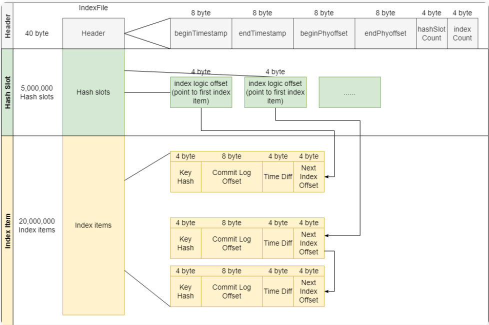 

- Header

   固定大小，包含一些基本信息

  - beginTimestamp：最早的消息存储时间（消息存储到 CommitLog 的时间）
  - endTimestamp：最晚的消息存储时间
  - beginPhyoffset：存储的消息的最小物理偏移量（在 CommitLog 中的偏移量）
  - endPhyoffset：存储的消息的最大物理偏移量
  - hashSlotCount：最大可存储的 hash 槽个数
  - indexCount：当前已经使用的索引条目个数。注意这个值是从 1 开始的

- Hash Slot

   部分存储固定数量的 Message Key hash槽（500万个，该数值可以通过 Broker 配置项maxHashSlotNum来配置）

  - 存储的每个值是在索引文件中 索引的逻辑下标。因为索引文件的 Header 和 Hash Slot 部分长度都是固定的，每个索引的长度也是固定的，所以可以通过逻辑下标计算出索引项在索引文件中的绝对偏移量

- Index Item

  部分存储固定数量的索引项（2000万个，该数值可以通过 Broker 配置项maxIndexNum来配置）。每个索引项包含如下信息

  - Key Hash：消息的 Topic 和 Message Key 经过哈希得到的整数
  - Commit Log Offset：消息在 CommitLog 中的物理偏移量，用于到 CommitLog 中查询消息
  - Time Diff：从该索引文件到消息保存时间的时间差（精确到秒），用于根据时间范围查询消息
  - Next Index Offset：链表下一项的逻辑下标（这里的逻辑下标的含义跟 Hash Slot 中存储的逻辑下标含义相同）
    - 每次插入新的消息，都会从链表的头部插入。链表越往后，消息越老。因为一般来说消息队列会更关心新的消息

#### 涉及到的类

##### IndexService

索引服务，用于管理和控制所有索引文件。包括索引文件的加载、创建、刷盘、删除等。是索引文件操作的入口。

- `private final ArrayList<IndexFile> indexFileList`：索引文件列表。

- `buildIndex(DispatchRequest req)`：根据消息分发请求构建索引。注意这里会创建 msgId 的索引和消息 Key 的索引

  - 创建或获取最新的索引文件
  - 调用该索引文件的 `IndexFile#putKey` 方法创建索引

- `queryOffset(String topic, String key, int maxNum, long begin, long end)`：根据topic和message key，从IndexFile中查找消息。按时间查询：查询保存时间在 begin 到 end 内的消息

  - 从后往前遍历 `indexFileList` 列表中的索引文件，查找索引对应的 message 符合时间的 IndexFile（[beginTimestamp, endTimestamp] 与 [begin, end] 有交集的索引文件）
  - 调用符合条件的索引文件 `IndexFile#selectPhyOffset()` 方法查找所有 offset

- `retryGetAndCreateIndexFile()`：获取最新的索引文件，如果不存在，则创建一个新的索引文件。

  - 调用 `getAndCreateLastIndexFile()` 方法创建或者获取最新的索引文件
  - 创建新索引文件时如果创建失败，会重试创建3次

- `getAndCreateLastIndexFile()`：获取最后一个索引文件。如果没有索引文件或者最后一个索引文件满了，那么创建一个新的文件

  - 检查索引文件列表最后一个文件是否存在以及是否满
  - 如果不存在或者已经满了，创建新的文件，并且把上一个索引文件**异步刷盘**
  - 如果最后一个文件存在并且未满，直接返回该文件

- `flush()`：将一个索引文件强制刷盘，并且刷新 checkpoint 文件中的 indexMsgTimestamp，checkpoint文件刷盘。

  - 如果开启 `MessageStoreConfig#messageIndexSafe` 配置项，那么下次 Broker 异常恢复时，会从 checkpoint 保存的 indexMsgTimestamp 即索引文件记录的强制刷盘时间来恢复。

  - 当一个索引文件写满后创建新索引文件时调用，强制将写满的文件刷盘

    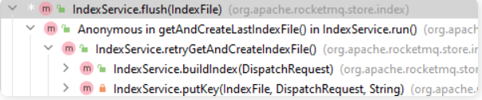 

##### IndexFile

索引文件，包含索引文件的存储结构和一系列操作。

底层使用内存映射文件 MappedFile 存储。

- `MappedFile mappedFile`：底层存储实现
- `putKey(final String key, final long phyOffset, final long storeTimestamp)`：添加一个索引到索引文件
- `selectPhyOffset(final List<Long> phyOffsets, final String key, final int maxNum, final long begin, final long end, boolean lock)`：从该索引文件中根据 Key 查找索引对应的 offset

### 源码解析

#### IndexService

##### 创建索引

- **load：重新加载索引文件**

  ```
  /**
   * 重新加载索引文件
   *
   * @param lastExitOK 上次是否是正常退出
   * @return 加载是否成功
   */
  public boolean load(final boolean lastExitOK) {
      File dir = new File(this.storePath);
      File[] files = dir.listFiles();
      if (files != null) {
          // ascending order, 将索引文件按照创建时间升序排序
          Arrays.sort(files);
          for (File file : files) {
              // 依次加载每个索引文件
              try {
                  IndexFile f = new IndexFile(file.getPath(), this.hashSlotNum, this.indexNum, 0, 0);
                  f.load();
                  // 如果上一次是异常退出，则删除check point之后的所有索引文件
                  if (!lastExitOK) {
                      if (f.getEndTimestamp() > this.defaultMessageStore.getStoreCheckpoint().getIndexMsgTimestamp()) {
                          f.destroy(0);
                          continue;
                      }
                  }
  
                  this.indexFileList.add(f);
              } catch 
                // ...
          }
      }
      return true;
  }
  ```

* getAndCreateLastIndexFile()

  获取最后一个索引文件，如果集合为空或者最后一个文件写满了，则新建一个文件

  - 先判断文件是否存在、是否写满
  - 如果不存在或者最后一个文件写满，则创建一个文件
  - 如果存在，直接返回该文件
  - 如果创建了新文件，启动一个线程将前一个写满的文件异步刷盘。
    - 刷盘线程会将该文件刷盘
    - 然后更新 `StoreCheckpoint#indexMsgTimestamp` 为该写满的索引文件中 indexHeader 的 endTimestamp

  ```
  /**
   * 获取最后一个索引文件，如果集合为空或者最后一个文件写满了，则新建一个文件<br>
   * 只有一个线程调用，所以不存在写竟争问题
   */
  public IndexFile getAndCreateLastIndexFile() {
      IndexFile indexFile = null;
      IndexFile prevIndexFile = null;
      long lastUpdateEndPhyOffset = 0;
      long lastUpdateIndexTimestamp = 0;
      // 先尝试使用读锁
      {
          this.readWriteLock.readLock().lock();
          // 判断文件列表是否为空
          if (!this.indexFileList.isEmpty()) {
              IndexFile tmp = this.indexFileList.get(this.indexFileList.size() - 1);
              // 判断最后一个文件是否写满
              if (!tmp.isWriteFull()) {
                  indexFile = tmp;
              } else {
                  lastUpdateEndPhyOffset = tmp.getEndPhyOffset();
                  lastUpdateIndexTimestamp = tmp.getEndTimestamp();
                  prevIndexFile = tmp;
              }
          }
  
          this.readWriteLock.readLock().unlock();
      }
  
      // 如果文件列表为空或者最后一个文件写满了，使用写锁创建文件
      if (indexFile == null) {
          try {
              String fileName =
                  this.storePath + File.separator
                      + UtilAll.timeMillisToHumanString(System.currentTimeMillis());
              indexFile =
                  new IndexFile(fileName, this.hashSlotNum, this.indexNum, lastUpdateEndPhyOffset,
                      lastUpdateIndexTimestamp);
              this.readWriteLock.writeLock().lock();
              this.indexFileList.add(indexFile);
          } catch (Exception e) {
              log.error("getLastIndexFile exception ", e);
          } finally {
              this.readWriteLock.writeLock().unlock();
          }
  
          // 每创建一个新文件，前一个文件异步刷盘
          if (indexFile != null) {
              final IndexFile flushThisFile = prevIndexFile;
              Thread flushThread = new Thread(new Runnable() {
                  @Override
                  public void run() {
                      IndexService.this.flush(flushThisFile);
                  }
              }, "FlushIndexFileThread");
  
              flushThread.setDaemon(true);
              flushThread.start();
          }
      }
  
      return indexFile;
  }
  
  ```

##### 插入和查询

- buildIndex(DispatchRequest req)

  根据消息分发请求构建索引。注意这里会创建 msgId 的索引和消息 Key 的索引

  - 创建或获取最新的索引文件

  - 调用该索引文件的

    IndexFile#putKey 

    方法创建索引

    - 获取 uniqKey（也就是 msgId），创建索引
    - 获取消息的所有 key，分别创建索引

  ```
  /**
   * 根据 DispatchRequest 构建索引
   *
   * @param req 消息存入CommitLog之后重新分发到Index文件的 DispatchRequest
   */
  public void buildIndex(DispatchRequest req) {
      IndexFile indexFile = retryGetAndCreateIndexFile();
      if (indexFile != null) {
          long endPhyOffset = indexFile.getEndPhyOffset();
          DispatchRequest msg = req;
          String topic = msg.getTopic();
          String keys = msg.getKeys();
          if (msg.getCommitLogOffset() < endPhyOffset) {
              return;
          }
  
          // 如果是事务消息的回滚消息，不需要创建索引，直接返回
          final int tranType = MessageSysFlag.getTransactionValue(msg.getSysFlag());
          switch (tranType) {
              case MessageSysFlag.TRANSACTION_NOT_TYPE:
              case MessageSysFlag.TRANSACTION_PREPARED_TYPE:
              case MessageSysFlag.TRANSACTION_COMMIT_TYPE:
                  break;
              case MessageSysFlag.TRANSACTION_ROLLBACK_TYPE:
                  return;
          }
  
          if (req.getUniqKey() != null) {
              // 创建UniqueKey的索引，也就是msgId的索引
              indexFile = putKey(indexFile, msg, buildKey(topic, req.getUniqKey()));
              if (indexFile == null) {
                  log.error("putKey error commitlog {} uniqkey {}", req.getCommitLogOffset(), req.getUniqKey());
                  return;
              }
          }
  
          // 创建消息key的索引，这里key可以有多个
          if (keys != null && keys.length() > 0) {
              String[] keyset = keys.split(MessageConst.KEY_SEPARATOR);
              for (int i = 0; i < keyset.length; i++) {
                  String key = keyset[i];
                  if (key.length() > 0) {
                      indexFile = putKey(indexFile, msg, buildKey(topic, key));
                      if (indexFile == null) {
                          log.error("putKey error commitlog {} uniqkey {}", req.getCommitLogOffset(), req.getUniqKey());
                          return;
                      }
                  }
              }
          }
      } else {
          log.error("build index error, stop building index");
      }
  }
  
  ```

- `queryOffset(String topic, String key, int maxNum, long begin, long end)`：根据topic和message key，从IndexFile中查找消息

  ```
  /**
       * 根据topic和message key，从IndexFile中查找消息
       *
       * @param topic
       * @param key
       * @param maxNum 最大查找消息数量
       * @param begin 查找消息最小时间
       * @param end 查找消息最大时间
       * @return
       */
      public QueryOffsetResult queryOffset(String topic, String key, int maxNum, long begin, long end) {
          List<Long> phyOffsets = new ArrayList<Long>(maxNum);
  
          long indexLastUpdateTimestamp = 0;
          long indexLastUpdatePhyoffset = 0;
          maxNum = Math.min(maxNum, this.defaultMessageStore.getMessageStoreConfig().getMaxMsgsNumBatch());
          try {
              this.readWriteLock.readLock().lock();
              if (!this.indexFileList.isEmpty()) {
                  // 从后往前遍历IndexFile，查找索引对应的message符合时间的IndexFile
                  for (int i = this.indexFileList.size(); i > 0; i--) {
                      IndexFile f = this.indexFileList.get(i - 1);
                      boolean lastFile = i == this.indexFileList.size();
                      if (lastFile) {
                          indexLastUpdateTimestamp = f.getEndTimestamp();
                          indexLastUpdatePhyoffset = f.getEndPhyOffset();
                      }
  
                      if (f.isTimeMatched(begin, end)) {
                          // 最后一个文件需要加锁
                          f.selectPhyOffset(phyOffsets, buildKey(topic, key), maxNum, begin, end, lastFile);
                      }
  
                      // 再往前遍历时间更不符合
                      if (f.getBeginTimestamp() < begin) {
                          break;
                      }
  
                      if (phyOffsets.size() >= maxNum) {
                          break;
                      }
                  }
              }
          } catch (Exception e) {
              log.error("queryMsg exception", e);
          } finally {
              this.readWriteLock.readLock().unlock();
          }
  
          return new QueryOffsetResult(phyOffsets, indexLastUpdateTimestamp, indexLastUpdatePhyoffset);
      }
  
  ```

##### 过期删除

- `deleteExpiredFile(long offset)`：删除消息CommitLog偏移量offset之前的所有IndexFile文件

##### 刷盘

`flush()`：强制刷盘，会把内存映射文件中的数据强制写到磁盘。在一个索引文件写满后调用

```
/**
 * 索引文件刷盘，在一个文件写满后调用
 * 
 * @param f 需要刷盘的索引文件
 */
public void flush(final IndexFile f) {
    if (null == f)
        return;

    long indexMsgTimestamp = 0;

    if (f.isWriteFull()) {
        indexMsgTimestamp = f.getEndTimestamp();
    }

    // 索引文件刷盘
    f.flush();

    // checkpoint文件刷盘
    if (indexMsgTimestamp > 0) {
        this.defaultMessageStore.getStoreCheckpoint().setIndexMsgTimestamp(indexMsgTimestamp);
        this.defaultMessageStore.getStoreCheckpoint().flush();
    }
}
```

#### IndexFile

##### putKey

`putKey(final String key, final long phyOffset, final long storeTimestamp)`：向索引文件插入新的索引项

- 根据 key 的 Hash 值计算出 hash槽绝对位置 `absSlotPos`
- 获取当前 hash槽的值，为该 hash槽对应的最新的索引的逻辑下标
- 在 hash槽对应的链表头部插入索引
- hash槽指向最新创建的索引的逻辑下标
- 更新文件头

```
/**
 * 向索引文件插入新的索引项
 * 如果返回false，表示需要创建新的索引文件
 */
public boolean putKey(final String key, final long phyOffset, final long storeTimestamp) {
    // 判断当前索引数量是否小于最大索引数量，如果小于则直接退出，说明需要创建新的索引文件
    if (this.indexHeader.getIndexCount() < this.indexNum) {
        // 计算key的hash值
        int keyHash = indexKeyHashMethod(key);
        // 获取hash槽位置（下标）。通过 keyHash % hashSlotNum 的方式再次哈希，这里会加大查询消息错误的概率。
        int slotPos = keyHash % this.hashSlotNum;
        // 通过hash槽下表计算出hash槽的绝对位置
        int absSlotPos = IndexHeader.INDEX_HEADER_SIZE + slotPos * hashSlotSize;

        FileLock fileLock = null;

        try {

            // fileLock = this.fileChannel.lock(absSlotPos, hashSlotSize,
            // false);
            // 通过hash槽绝对位置，获取hash槽的值，如果有值说明这个hash key已经存在，如果不存在则需要填入
            int slotValue = this.mappedByteBuffer.getInt(absSlotPos);
            if (slotValue <= invalidIndex || slotValue > this.indexHeader.getIndexCount()) {
                slotValue = invalidIndex;
            }

            long timeDiff = storeTimestamp - this.indexHeader.getBeginTimestamp();

            timeDiff = timeDiff / 1000;

            if (this.indexHeader.getBeginTimestamp() <= 0) {
                timeDiff = 0;
            } else if (timeDiff > Integer.MAX_VALUE) {
                timeDiff = Integer.MAX_VALUE;
            } else if (timeDiff < 0) {
                timeDiff = 0;
            }

            // 计算放置索引的绝对偏移量
            int absIndexPos =
                IndexHeader.INDEX_HEADER_SIZE + this.hashSlotNum * hashSlotSize
                    + this.indexHeader.getIndexCount() * indexSize;

            // 在链表头部插入最新的索引项
            // 将索引存入文件，最后一个是指针，指向下一个链表元素
            this.mappedByteBuffer.putInt(absIndexPos, keyHash);
            this.mappedByteBuffer.putLong(absIndexPos + 4, phyOffset);
            this.mappedByteBuffer.putInt(absIndexPos + 4 + 8, (int) timeDiff);
            this.mappedByteBuffer.putInt(absIndexPos + 4 + 8 + 4, slotValue);

            // 写入hash槽，每个hash槽的值是最新写入的索引文件的逻辑下标
            this.mappedByteBuffer.putInt(absSlotPos, this.indexHeader.getIndexCount());

            if (this.indexHeader.getIndexCount() <= 1) {
                this.indexHeader.setBeginPhyOffset(phyOffset);
                this.indexHeader.setBeginTimestamp(storeTimestamp);
            }

            if (invalidIndex == slotValue) {
                this.indexHeader.incHashSlotCount();
            }
            // 更新索引文件头，索引项个数+1
            this.indexHeader.incIndexCount();
            this.indexHeader.setEndPhyOffset(phyOffset);
            this.indexHeader.setEndTimestamp(storeTimestamp);

            return true;
        } catch (Exception e) {
            log.error("putKey exception, Key: " + key + " KeyHashCode: " + key.hashCode(), e);
        } finally {
            if (fileLock != null) {
                try {
                    fileLock.release();
                } catch (IOException e) {
                    log.error("Failed to release the lock", e);
                }
            }
        }
    } else {
        log.warn("Over index file capacity: index count = " + this.indexHeader.getIndexCount()
            + "; index max num = " + this.indexNum);
    }

    return false;
}

```

##### selectPhyOffset

selectPhyOffset(final List<Long> phyOffsets, final String key, final int maxNum, final long begin, final long end, boolean lock)：

从该索引文件中根据 Key 查找索引对应的 offset

- 根据 key 的 Hash值计算 hash槽的绝对位置
- 通过 hash槽中存储的索引逻辑下标，找到索引链表绝对位置
- 遍历索引链表中的每个索引，获取索引数据，比较时间信息
- 将时间信息符合搜索条件的索引加入到结果列表中

```
/**
 * 从该索引文件中根据key查找offsets
 *
 * @param phyOffsets offsets结果列表
 * @param key 查找的key
 * @param maxNum 最大返回结果数量
 * @param begin 查找消息的开始时间
 * @param end 查找消息的结束时间
 * @param lock 查找时是否加锁（已废弃）
 */
public void selectPhyOffset(final List<Long> phyOffsets, final String key, final int maxNum,
    final long begin, final long end, boolean lock) {
    if (this.mappedFile.hold()) {
        // 根据key的hash值计算hash槽的绝对位置
        int keyHash = indexKeyHashMethod(key);
        int slotPos = keyHash % this.hashSlotNum;
        int absSlotPos = IndexHeader.INDEX_HEADER_SIZE + slotPos * hashSlotSize;

        FileLock fileLock = null;
        try {
            if (lock) {
                // fileLock = this.fileChannel.lock(absSlotPos,
                // hashSlotSize, true);
            }

            // 获取hash槽的值
            int slotValue = this.mappedByteBuffer.getInt(absSlotPos);
            // if (fileLock != null) {
            // fileLock.release();
            // fileLock = null;
            // }
            // 如果该hash槽的值有效则查找，否则查找失败
            if (slotValue <= invalidIndex || slotValue > this.indexHeader.getIndexCount()
                || this.indexHeader.getIndexCount() <= 1) {
            } else {
                for (int nextIndexToRead = slotValue; ; ) {
                    if (phyOffsets.size() >= maxNum) {
                        break;
                    }

                    int absIndexPos =
                        IndexHeader.INDEX_HEADER_SIZE + this.hashSlotNum * hashSlotSize
                            + nextIndexToRead * indexSize;

                    int keyHashRead = this.mappedByteBuffer.getInt(absIndexPos);
                    long phyOffsetRead = this.mappedByteBuffer.getLong(absIndexPos + 4);

                    long timeDiff = (long) this.mappedByteBuffer.getInt(absIndexPos + 4 + 8);
                    int prevIndexRead = this.mappedByteBuffer.getInt(absIndexPos + 4 + 8 + 4);

                    if (timeDiff < 0) {
                        break;
                    }

                    timeDiff *= 1000L;

                    long timeRead = this.indexHeader.getBeginTimestamp() + timeDiff;
                    boolean timeMatched = (timeRead >= begin) && (timeRead <= end);

                    if (keyHash == keyHashRead && timeMatched) {
                        phyOffsets.add(phyOffsetRead);
                    }

                    if (prevIndexRead <= invalidIndex
                        || prevIndexRead > this.indexHeader.getIndexCount()
                        || prevIndexRead == nextIndexToRead || timeRead < begin) {
                        break;
                    }

                    nextIndexToRead = prevIndexRead;
                }
            }
        } catch (Exception e) {
            log.error("selectPhyOffset exception ", e);
        } finally {
            if (fileLock != null) {
                try {
                    fileLock.release();
                } catch (IOException e) {
                    log.error("Failed to release the lock", e);
                }
            }

            this.mappedFile.release();
        }
    }
```

## 过期文件

​	RocketMQ 的存储文件主要分三种：CommitLog、ConsumeQueue、IndexFile

​	RocketMQ 的过期文件删除机制会定期删除已经过期的存储文件。当磁盘容量告急时，会立刻执行删除，释放磁盘空间。

### 整体思路

CommitLog、ConsumeQueue 和 IndexFile 的过期文件删除逻辑由一个线程统一处理。这个线程每 10s 进行一次检查，如果符合删除条件，那么会删除这些文件：

- ConsumeQueue 和 IndexFile 的检查每 10s 都会进行，会删除 CommitLog 投递的偏移量之前的文件。
- CommitLog 的删除比较复杂，当到达每天的删除时间（4 点）或者磁盘空间告急（超过 75%）才会启动删除过期文件；磁盘空间超过 85% 时会强制删除文件，平时不会启动

### 详细设计

#### CommitLog

​	CommitLog 是一个由多个 1G 大小的内存映射文件组成的文件队列。CommitLog 每个文件有一个过期时间，由 broker.conf 文件中的 `fileReservedTime` 控制，默认是 72 小时，即 CommitLog 最后一次写入后 72 小时就过期。

​	CommitLog 文件删除的条件有以下几种，符合任意一种都会执行删除逻辑：

* 时间到达 Broker 机器时间的 4 点，在 4 点 ~ 5 点这一小时中每 10s 都会进行检查和删除，删除过期的文件。

  这里的 4 点指的是 Broker 机器的时间，一些虚机的时间与现实时间不一致，或者时区不一致，导致删除时间并不是现实时间 4 点开始，需要注意。

* 在磁盘容量达到 75% 时，开启文件删除。此时会删除过期的 CommitLog。一次最多删 10 个，如果删了之后磁盘容量小于 75%，那么等下次到达 75% 时删。

* 磁盘容量达到 85% 时，开启强制删除，会把没有过期文件也删掉。同样一次最多删 10 个。

  ​	这里的强制删除并不会马上删除未过期的文件，而是先把 CommitLog 队列的第一个文件 shutdown，shutdown 之后的文件如果引用计数大于 0（被其他线程占用），则仍需要等待 `intervalForcibly` 时间（默认 2 分钟）后才会被删除。也就是说**每 2 分钟才会强制删除 1 个文件**。

* 当磁盘容量达到 90% 时，将设置磁盘为不可写，此时会拒绝写入新的消息。

* 手动删除。设计上预留了手动删除的接口，但实际没有命令能调用。

#### ConsumeQueue

​	ConsumeQueue 是消费队列文件。每个 Topic 的每个 Queue 都会有一个消费队列（可能包含多个文件），用作保存消息在 CommitLog 中的位置以便消费。

每隔 10s，文件删除线程就会检查所有 ConsumeQueue，删除该 ConsumeQueue 已经投递过的那些文件。

#### IndexFile

​	IndexFile是消息索引文件，仅仅用于消息的查询。索引文件可以通过 Message Key，查询到消息在 CommitLog 中的物理偏移量，进而从 CommitLog 中查询消息。每隔 10s，文件删除线程会检查所有的 IndexFile，比较它的最大 offset 和当前已经投递的 CommitLog offset，把消息全部已经投递的 IndexFile 删除

### 源码解析

​	清理 CommitLog 方法的类是 `DefaultMessageStore#CleanCommitLogService`，清理 ConsumeQueue 和 IndexFile 共用一个类 `DefaultMessageStore#CleanConsumeQueueService`，都是 `DefaultMessageStore` 的内部类。

​	DefaultMessageStore` 启动时调用 `start()` 方法，会启动过期文件清理的定时任务

```
private void addScheduleTask() {

    // 启动定时清理过期文件线程
    this.scheduledExecutorService.scheduleAtFixedRate(new Runnable() {
        @Override
        public void run() {
            DefaultMessageStore.this.cleanFilesPeriodically();
        }
    // 初始延迟 60s，之后默认每 10s 执行一次
    }, 1000 * 60, this.messageStoreConfig.getCleanResourceInterval(), TimeUnit.MILLISECONDS);
    // ...
}

```

其中 `run()` 方法调用 CommitLog 和 ConsumeQueue 的清理方法

```
private void cleanFilesPeriodically() {
    this.cleanCommitLogService.run();
    this.cleanConsumeQueueService.run();
}
```

#### CommitLog

先来看一下删除 CommitLog 的条件检查逻辑，触发 CommitLog 清理的条件比较多，满足 3 个条件之一就会触发删除。

且删除分

- 非强制删除：只删除过期的文件（默认过期时间 72h，该文件最后一次写入过后 72h 过期）
- 强制删除：会删除未过期的文件

一次最多删除 10 个文件，也就是说每 10s 最多删除 10 个文件。4 点 ~ 5 点这个小时都是删除文件的时间窗，并不是仅在 4 点删一次

```
private void deleteExpiredFiles() {
    // 本次删除的文件数量
    int deleteCount = 0;
    // 文件保留时间，默认72h。如果超出该时间，则认为是过期文件，可以被删除
    long fileReservedTime = DefaultMessageStore.this.getMessageStoreConfig().getFileReservedTime();
    // 删除物理文件的时间间隔，默认100ms。在一次删除过程中，删除两个文件的间隔时间
    int deletePhysicFilesInterval = DefaultMessageStore.this.getMessageStoreConfig().getDeleteCommitLogFilesInterval();
    // 第一次拒绝删除之后能保留文件的最大时间，默认120s。
    // 在删除文件时，如果该文件被其他线程占用，会阻止删除，同时在第一次试图删除该文件时记录当前时间戳。
    // 在保留时间内，文件可以拒绝删除，超过该时间后，会将引用次数设置为负数，文件将被强制删除。
    int destroyMapedFileIntervalForcibly = DefaultMessageStore.this.getMessageStoreConfig().getDestroyMapedFileIntervalForcibly();

    // 是满足删除文件的时间（4点）
    boolean timeup = this.isTimeToDelete();
    // 磁盘空间是否不足（75%）
    boolean spacefull = this.isSpaceToDelete();
    // 手动删除是否被触发（触发则会设manualDeleteFileSeveralTimes为20，每执行一次删除方法减少一次）
    boolean manualDelete = this.manualDeleteFileSeveralTimes > 0;

    // 满足下列条件之一将继续删除
    // 1. 到了设置的每天固定删除时间（4点）
    // 2. 磁盘空间不充足，默认为75%
    // 3. executeDeleteFilesManually方法被调用，手工删除文件
    if (timeup || spacefull || manualDelete) {

        if (manualDelete)
            this.manualDeleteFileSeveralTimes--;

        // 是否立即强制删除文件（磁盘空间大于85%为true）
        boolean cleanAtOnce = DefaultMessageStore.this.getMessageStoreConfig().isCleanFileForciblyEnable() && this.cleanImmediately;

        log.info("begin to delete before {} hours file. timeup: {} spacefull: {} manualDeleteFileSeveralTimes: {} cleanAtOnce: {}",
            fileReservedTime,
            timeup,
            spacefull,
            manualDeleteFileSeveralTimes,
            cleanAtOnce);

        // 文件保留时间，默认 72，这里转换成小时
        fileReservedTime *= 60 * 60 * 1000;

        // 删除成功的文件数量
        deleteCount = DefaultMessageStore.this.commitLog.deleteExpiredFile(fileReservedTime, deletePhysicFilesInterval,
            destroyMapedFileIntervalForcibly, cleanAtOnce);
        if (deleteCount > 0) {
        // 危险情况：磁盘满了，但是又无法删除文件
        } else if (spacefull) {
            log.warn("disk space will be full soon, but delete file failed.");
        }
    }
}

```

其中 `commitLog.deleteExpiredFile()` 方法调用了 `MappedFileQueue#deleteExpiredFileByTime()` 方法

```
/**
 * 根据文件过期时间来删除文件
 *
 * @param expiredTime 文件过期时间（过期后保留的时间）
 * @param deleteFilesInterval 删除两个文件的间隔
 * @param intervalForcibly 关闭文件过后多久才能强制删除，默认为2分钟
 * @param cleanImmediately 是否强制删除文件
 * @return 删除文件数量
 */
public int deleteExpiredFileByTime(final long expiredTime,
    final int deleteFilesInterval,
    final long intervalForcibly,
    final boolean cleanImmediately) {
    Object[] mfs = this.copyMappedFiles(0);

    if (null == mfs)
        return 0;

    int mfsLength = mfs.length - 1;
    int deleteCount = 0;
    List<MappedFile> files = new ArrayList<MappedFile>();
    if (null != mfs) {
        for (int i = 0; i < mfsLength; i++) {
            MappedFile mappedFile = (MappedFile) mfs[i];
            // 计算文件应该被删除的时间，等于文件最后修改的时间 + 文件过期时间
            long liveMaxTimestamp = mappedFile.getLastModifiedTimestamp() + expiredTime;
            // 如果文件过期，或开启强制删除，则删除文件
            if (System.currentTimeMillis() >= liveMaxTimestamp || cleanImmediately) {
                if (mappedFile.destroy(intervalForcibly)) {
                    files.add(mappedFile);
                    deleteCount++;

                    // 一次最多删除10个文件
                    if (files.size() >= DELETE_FILES_BATCH_MAX) {
                        break;
                    }

                    // 每个文件删除间隔
                    if (deleteFilesInterval > 0 && (i + 1) < mfsLength) {
                        try {
                            Thread.sleep(deleteFilesInterval);
                        } catch (InterruptedException e) {
                        }
                    }
                } else {
                    break;
                }
            } else {
                //avoid deleting files in the middle
                break;
            }
        }
    }

    // 将删除的文件从mappedFiles中移除
    deleteExpiredFile(files);

    return deleteCount;
}

```

其中，真正删除文件是调用了 `MappedFile#destroy()` 方法

这个方法会先释放 `MappedFile` 上的引用，再关闭内存映射，然后关闭 `fileChannel`，最后才能删除该文件

#### ConsumeQueue

`CleanConsumeQueueService` 处理 ConsumeQueue 文件的过期删除

先查出当前 CommitLog 的投递 Offset，然后遍历每个 ConsumeQueue，删除小于该 Offset 的 文件

```
private void deleteExpiredFiles() {
    int deleteLogicsFilesInterval = DefaultMessageStore.this.getMessageStoreConfig().getDeleteConsumeQueueFilesInterval();

    long minOffset = DefaultMessageStore.this.commitLog.getMinOffset();
    if (minOffset > this.lastPhysicalMinOffset) {
        this.lastPhysicalMinOffset = minOffset;

        // 删除逻辑队列文件
        ConcurrentMap<String, ConcurrentMap<Integer, ConsumeQueue>> tables = DefaultMessageStore.this.consumeQueueTable;

        for (ConcurrentMap<Integer, ConsumeQueue> maps : tables.values()) {
            for (ConsumeQueue logic : maps.values()) {
                int deleteCount = logic.deleteExpiredFile(minOffset);

                if (deleteCount > 0 && deleteLogicsFilesInterval > 0) {
                    try {
                        Thread.sleep(deleteLogicsFilesInterval);
                    } catch (InterruptedException ignored) {
                    }
                }
            }
        }

        // 清理 IndexFile
        // ...
    }
}


```

### IndexFile

IndexFile 的过期文件清理也由 `CleanConsumeQueueService` 处理，删除 CommitLog 偏移量 offset 之前的所有 IndexFile 文件

```
private void deleteExpiredFiles() {
    int deleteLogicsFilesInterval = DefaultMessageStore.this.getMessageStoreConfig().getDeleteConsumeQueueFilesInterval();

    long minOffset = DefaultMessageStore.this.commitLog.getMinOffset();
    if (minOffset > this.lastPhysicalMinOffset) {
        // 清理 ConsumeQueue
        // ...

        // 清理 IndexFile
        DefaultMessageStore.this.indexService.deleteExpiredFile(minOffset);
    }
}

```

```
/**
    * 删除消息CommitLog偏移量offset之前的所有IndexFile文件
    *
    * @param offset CommitLog偏移量
    */
public void deleteExpiredFile(long offset) {
    Object[] files = null;
    try {
        this.readWriteLock.readLock().lock();
        if (this.indexFileList.isEmpty()) {
            return;
        }

        // 比较第一个 IndexFile 的最大 offset， 如果小于 offset，说明不需要删除任何文件
        long endPhyOffset = this.indexFileList.get(0).getEndPhyOffset();
        if (endPhyOffset < offset) {
            files = this.indexFileList.toArray();
        }
    } catch (Exception e) {
        log.error("destroy exception", e);
    } finally {
        this.readWriteLock.readLock().unlock();
    }

    // 有文件需要被删除，遍历所有文件，删除所有最大 offset 小于 CommitLog offset 的文件
    if (files != null) {
        List<IndexFile> fileList = new ArrayList<IndexFile>();
        for (int i = 0; i < (files.length - 1); i++) {
            IndexFile f = (IndexFile) files[i];
            if (f.getEndPhyOffset() < offset) {
                fileList.add(f);
            } else {
                break;
            }
        }

        this.deleteExpiredFile(fileList);
    }
}

```

## 内存存储

rocketmq可以使用内存存储引擎

### 设计思路

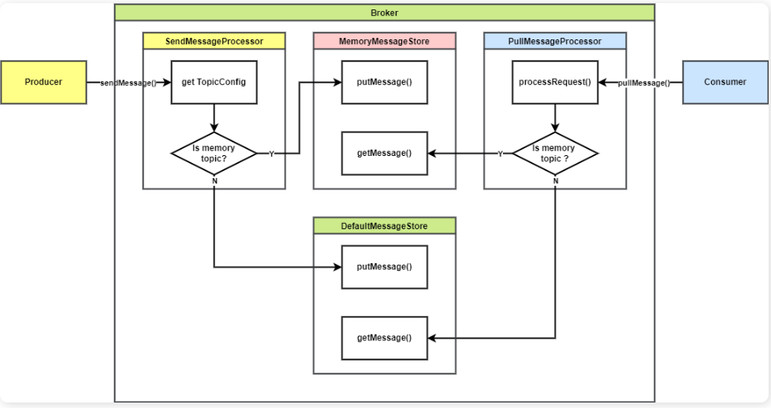 

首先需要在 Broker 中创建 Topic，并指定为内存存储的 Topic

* 生产者发送生产请求

* SendMessageProcessor

  处理生产请求
  * 根据请求的 Topic 获取 `TopicConfig`
  * 判断该 Topic 是否是内存 Topic
  * 如果不是，走原有 `DefaultMessageStore` 存储
  * 如果是，走 `MemoryMessageStore` 存储

* 消费者发送拉取消息请求
  * PullMessageProcessor

* 处理拉取消息请求
  * 根据请求的 Topic 获取 `TopicConfig`
  * 判断该 Topic 是否是内存 Topic
  * 如果不是，走原有 `DefaultMessageStore` 取消息
  * 如果是，走 `MemoryMessageStore` 取消息

### 详细设计

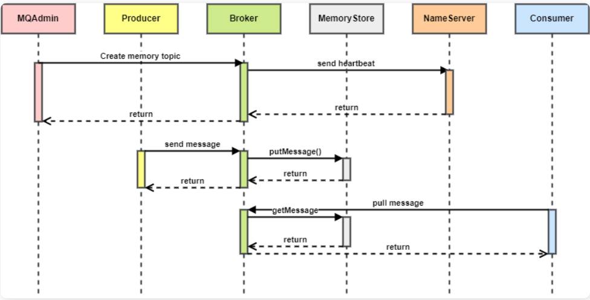 

### 类设计

#### MemoryMessageStore

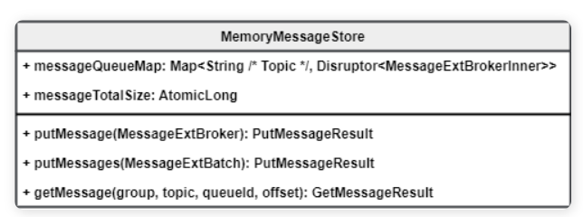 

- 为 `MemoryMessageStore` 设置一个存储阈值，为内存中存储的消息总大小，默认为可用内存的 75%
- `messageQueueMap`：一个 `HashMap`，Key 是 Topic 名称，Value 是 Disruptor 存储的 `MessageExtBrokerInner` 消息队列
- `messageTotalSize`：记录保存的消息总大小
- `putMessage`：将消息根据 Topic 放入指定队列，如果超过消息总大小阈值，则从该 Topic 中删除一条消息。如果该 Topic 为空，则删除一条保存最久的消息

#### TopicConfig

- `boolean memory`：是否是内存 Topic

#### BrokerController

- `memoryTopicEnable`：是否启动内存 Topic 功能，默认 false