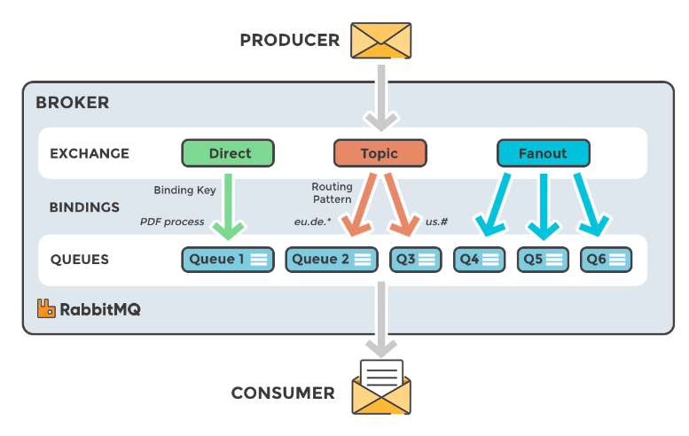
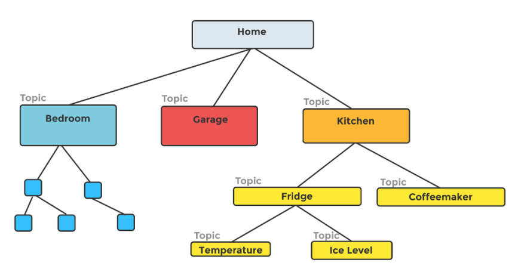
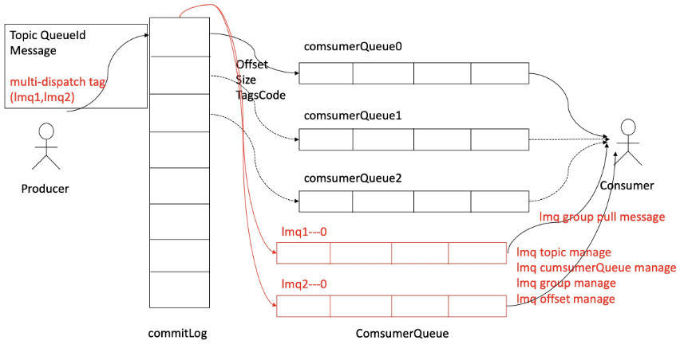
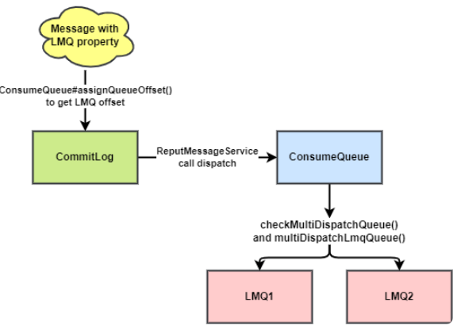

## 概述

### 背景

​	在 RocketMQ 4.9.3 版本中，引入了轻量级队列（以下简称 LMQ）特性。

​	这个特性主要是为了支持在一些消息场景下可能存在的大量队列场景。比如 MQTT 的多级主题和 AMQP 的队列，这些队列的数量可能非常多。而 RocketMQ 的 Topic 资源密集，很难支持百万级别甚至更多数量。Light Message Queue 特性就是为了解决 IOT 设备和 AMQP 协议可能需要的海量队列的场景。项目就应用了 LMQ，实现了 RocketMQ 对 MQTT 协议的兼容

rocketmq-mqtt项目就应用了 LMQ，实现了 RocketMQ 对 MQTT 协议的兼容

### 使用方法

#### Broker 启动配置

broker.conf 文件需要增加以下的配置项，开启 LMQ 开关和多队列转发开关，这样才能识别 LMQ 相关消息属性，分发消息到 LMQ。

```
enableLmq = true
enableMultiDispatch = true
```

#### 生产消息

发送消息的时候通过设置 `INNER_MULTI_DISPATCH` 属性，分发消息到多个 LMQ，多个 LMQ 之间使用逗号分割，名称前缀必须是 %LMQ%，这样 broker 就可以识别 LMQ

```
DefaultMQProducer producer = new DefaultMQProducer("please_rename_unique_group_name");
producer.setNamesrvAddr("name-server1-ip:9876;name-server2-ip:9876");
producer.start();


/*
* Create a message instance, specifying topic, tag and message body.
*/
Message msg = new Message("TopicTest" /* Topic */,
                          "TagA" /* Tag */,
                          ("Hello RocketMQ " + i).getBytes(RemotingHelper.DEFAULT_CHARSET) /* Message body */
                         );
/*
* INNER_MULTI_DISPATCH property and PREFIX must start as "%LMQ%",
* If it is multiple LMQ, need to use “,” split
*/
message.putUserProperty("INNER_MULTI_DISPATCH", "%LMQ%123,%LMQ%456");
/*
* Call send message to deliver message to one of brokers.
*/
SendResult sendResult = producer.send(msg);
```

#### 消费消息

LMQ 在每个 broker 上只有一个 queue，queueId 为 0， 指明要消费的 LMQ 名称，就可以拉取消息进行消费

```
DefaultMQPullConsumer defaultMQPullConsumer = new DefaultMQPullConsumer();
defaultMQPullConsumer.setNamesrvAddr("name-server1-ip:9876;name-server2-ip:9876");
defaultMQPullConsumer.setVipChannelEnabled(false);
defaultMQPullConsumer.setConsumerGroup("CID_RMQ_SYS_LMQ_TEST");
defaultMQPullConsumer.setInstanceName("CID_RMQ_SYS_LMQ_TEST");
defaultMQPullConsumer.setRegisterTopics(new HashSet<>(Arrays.asList("TopicTest")));
defaultMQPullConsumer.setBrokerSuspendMaxTimeMillis(2000);
defaultMQPullConsumer.setConsumerTimeoutMillisWhenSuspend(3000);
defaultMQPullConsumer.start();

String brokerName = "set broker Name";
MessageQueue mq = new MessageQueue("%LMQ%123", brokerName, 0);
defaultMQPullConsumer.getDefaultMQPullConsumerImpl().getRebalanceImpl().getmQClientFactory().updateTopicRouteInfoFromNameServer("TopicTest");

Thread.sleep(30000);
Long offset = defaultMQPullConsumer.maxOffset(mq);

defaultMQPullConsumer.pullBlockIfNotFound(
                mq, "*", offset, 32,
                new PullCallback() {
                    @Override
                    public void onSuccess(PullResult pullResult) {
                        List<MessageExt> list = pullResult.getMsgFoundList();
                        if (list == null || list.isEmpty()) {
                            return;
                        }
                        for (MessageExt messageExt : list) {
                            System.out.println(messageExt);
                        }    
                    }
                    @Override
                    public void onException(Throwable e) {
                       
                    }
});
```

## 整体设计思路

### 当前痛点

#### AMQP 

在 AMQP 协议中，消息发送到 Exchange，由 Exchange 将消息分发到一个或多个 Queue 中。在 RocketMQ 实现 AMQP 协议时，如果将 Topic 与 Queue 对应，就意味着同一条消息会保存到多个 Topic，在磁盘上存储多份

 

#### MQTT 

MQTT 协议的 Topic 则可以看作类似文件路径的字符串，可以有多个层级，如 `home/kitchen/coffeemaker`。订阅 Topic 时可以进行通配，以订阅一组路径的 Topic。在 IOT 场景下，Topic 数量可能会非常多

 

RocketMQ 原本的 Topic 是资源密集型的，并不适合海量 Topic 的场景。这体现在消息数据的存储和 Topic 元数据上。

- Topic 中的每个消息数据都会在磁盘上存储。
- 所有 Topic 的元数据会上报到 NameServer，存储在内存中。

当存在大量 Topic 时就会有严重的数据放大，占用大量磁盘存储空间和内存

### 实现思想

​	对于上面两个痛点，LMQ 的实现思想是减少数据的重复存储，也减少元数据的内存占用。

​	对于队列数据重复保存的问题，可以想到消费者消费时实际是读取消费队列 ConsumeQueue 进行消费，ConsumeQueue 将消费者和消息存储的 CommitLog 分开。那么可以用消费队列来表示一个 Topic，不同的消费队列可以复用 CommitLog 中存储的数据，但是对消费者来说看到的是多个消费队列。

​	**此外，用消费队列表示的好处还在于，它不会作为元数据上报到 NameServer。不过消费者需要在消费时指定拉取这个消费队列才可以消费**。

​	那么轻量级队列的实现也就呼之欲出：用消费队列来表示轻量级队列，消息存到 CommitLog 后分发构建索引时，构建轻量级队列。这样，一个 Topic 构建的队列除了它本身的读写队列以外，还可以包含大量轻量级队列。这样的队列模型也有助于实现 MQTT 与 AMQP 协议的兼容

 

## 详细设计

### 消息生产和消费

LMQ 依赖于一个父 Topic 存在，父 Topic 的消息分发构建消费索引时会构建 LMQ。LMQ 不需要提前创建，只需要在生产消息时带有需要分发的 LMQ 属性，就会在分发时构建。

在消费时，LMQ 不在对应 Topic 上报的元数据中，订阅 Topic 也无法消费到其 LMQ。要消费 LMQ，需要显式指定拉取或订阅的队列信息才可以。因为 LMQ 仅仅是一个队列，所以它的队列 ID 为 0

### CommitLog 分发到 LMQ

LMQ 实现的重点就是 CommitLog 在生成消费索引时一并生成 LMQ。生成 LMQ 消息的主要步骤有两步

- 在消息存入 CommitLog 前，解析消息属性中是否有需要分发的 LMQ 属性，如果有则解析该属性，查询要分发的 LMQ 当前的逻辑偏移量。然后把这些属性封装放入消息属性中，以便构建 LMQ 时使用。
- 消息存入 CommitLog 后，索引构建线程 `ReputMessageService` 为每个消息构建消费队列时，会检查消息属性，判断是否需要分发构建 LMQ。如果属性中有 LMQ 和其逻辑偏移量，则从该偏移量开始构建 LMQ。

处理 LMQ 消息分发的逻辑主要在 `MultiDispatch` 类中（4.9.x 版本），最新的 5.x 版本引入了 `ConsumeQueueInterface` 将这部分代码重构，放到 `ConsumeQueue` 中

分发 LMQ 逻辑如下：

 

- 消息存到 CommitLog 之前，先调用 `MultiDispatch.wrapMultiDispatch()` （5.x 中 `ConsumeQueue#assignQueueOffset()`）方法，获取消息属性中需要分发的 LMQ 信息，然后查询 LMQ 当前的偏移量，把 LMQ 消息需要分发的新偏移量也放入消息属性。
- 消息分发，生成消费索引
- 生成消息的消费索引之后，如果需要分发到 LMQ，则执行 `ConsumeQueue.multiDispatchLmqQueue()` 方法进行分发

## 源码解析

### 查询 LMQ 偏移量

```
// CommitLog.java
public CompletableFuture<PutMessageResult> asyncPutMessages(final MessageExtBatch messageExtBatch) {
    // ...
    try {
        defaultMessageStore.assignOffset(messageExtBatch, (short) putMessageContext.getBatchSize());
        // ...
        result = mappedFile.appendMessages(messageExtBatch, this.appendMessageCallback, putMessageContext);
        // ...
    }
    // ...
}

```

```
/**
 * 查询要分发的队列的逻辑偏移量，放入消息属性
 * 
 * @param queueOffsetAssigner the delegated queue offset assigner
 * @param msg message itself
 * @param messageNum message number
 */
@Override
public void assignQueueOffset(QueueOffsetAssigner queueOffsetAssigner, MessageExtBrokerInner msg,
    short messageNum) {
    String topicQueueKey = getTopic() + "-" + getQueueId();
    long queueOffset = queueOffsetAssigner.assignQueueOffset(topicQueueKey, messageNum);
    msg.setQueueOffset(queueOffset);
    // 轻量级队列分发准备，为消息添加多队列分发属性
    // For LMQ
    if (!messageStore.getMessageStoreConfig().isEnableMultiDispatch()) {
        return;
    }
    String multiDispatchQueue = msg.getProperty(MessageConst.PROPERTY_INNER_MULTI_DISPATCH);
    if (StringUtils.isBlank(multiDispatchQueue)) {
        return;
    }
    // 从原始消息属性中获取分发的队列列表
    String[] queues = multiDispatchQueue.split(MixAll.MULTI_DISPATCH_QUEUE_SPLITTER);
    // 从队列偏移量表中查询当前队列偏移量
    Long[] queueOffsets = new Long[queues.length];
    for (int i = 0; i < queues.length; i++) {
        String key = queueKey(queues[i], msg);
        if (messageStore.getMessageStoreConfig().isEnableLmq() && MixAll.isLmq(key)) {
            queueOffsets[i] = queueOffsetAssigner.assignLmqOffset(key, (short) 1);
        }
    }
    // 将队列偏移量作为属性存入消息
    MessageAccessor.putProperty(msg, MessageConst.PROPERTY_INNER_MULTI_QUEUE_OFFSET,
        StringUtils.join(queueOffsets, MixAll.MULTI_DISPATCH_QUEUE_SPLITTER));
    // 移除消息的 WAIT_STORE 属性，节省存储空间
    removeWaitStorePropertyString(msg);
}

```

### 分发 LMQ

```
@Override
public void putMessagePositionInfoWrapper(DispatchRequest request) {
    final int maxRetries = 30;
    boolean canWrite = this.messageStore.getRunningFlags().isCQWriteable();
    // 写入ConsumeQueue，重试最多30次
    for (int i = 0; i < maxRetries && canWrite; i++) {
        long tagsCode = request.getTagsCode();
        if (isExtWriteEnable()) {
            ConsumeQueueExt.CqExtUnit cqExtUnit = new ConsumeQueueExt.CqExtUnit();
            cqExtUnit.setFilterBitMap(request.getBitMap());
            cqExtUnit.setMsgStoreTime(request.getStoreTimestamp());
            cqExtUnit.setTagsCode(request.getTagsCode());

            long extAddr = this.consumeQueueExt.put(cqExtUnit);
            if (isExtAddr(extAddr)) {
                tagsCode = extAddr;
            } else {
                log.warn("Save consume queue extend fail, So just save tagsCode! {}, topic:{}, queueId:{}, offset:{}", cqExtUnit,
                    topic, queueId, request.getCommitLogOffset());
            }
        }
        // 写入ConsumeQueue，注意这里还未强制刷盘
        boolean result = this.putMessagePositionInfo(request.getCommitLogOffset(),
            request.getMsgSize(), tagsCode, request.getConsumeQueueOffset());
        if (result) {
            // 如果是SLAVE，在写入成功后更新CheckPoint中的最新写入时间。是为了修复在SLAVE中ConsumeQueue异常恢复慢的问题
            // 因为在当前的设计中，没有更新SLAVE的消费队列时间戳到CheckPoint中的逻辑，所以在SLAVE中在doReput()逻辑中更新该时间戳
            // https://github.com/apache/rocketmq/pull/1455
            if (this.messageStore.getMessageStoreConfig().getBrokerRole() == BrokerRole.SLAVE ||
                this.messageStore.getMessageStoreConfig().isEnableDLegerCommitLog()) {
                this.messageStore.getStoreCheckpoint().setPhysicMsgTimestamp(request.getStoreTimestamp());
            }
            this.messageStore.getStoreCheckpoint().setLogicsMsgTimestamp(request.getStoreTimestamp());
            if (checkMultiDispatchQueue(request)) {
                multiDispatchLmqQueue(request, maxRetries);
            }
            return;
        } else {
            // 只有一种情况会失败，创建新的MapedFile时报错或者超时
            // 写入失败，等待1s继续写入，直到30次都失败
            // XXX: warn and notify me
            log.warn("[BUG]put commit log position info to " + topic + ":" + queueId + " " + request.getCommitLogOffset()
                + " failed, retry " + i + " times");

            try {
                Thread.sleep(1000);
            } catch (InterruptedException e) {
                log.warn("", e);
            }
        }
    }

    // XXX: warn and notify me
    log.error("[BUG]consume queue can not write, {} {}", this.topic, this.queueId);
    this.messageStore.getRunningFlags().makeLogicsQueueError();
}

/**
 * 判断消息是否需要执行多队列分发
 *
 * @param dispatchRequest 投递请求
 * @return 是否需要分发
 */
private boolean checkMultiDispatchQueue(DispatchRequest dispatchRequest) {
    if (!this.messageStore.getMessageStoreConfig().isEnableMultiDispatch()) {
        return false;
    }
    Map<String, String> prop = dispatchRequest.getPropertiesMap();
    if (prop == null || prop.isEmpty()) {
        return false;
    }
    String multiDispatchQueue = prop.get(MessageConst.PROPERTY_INNER_MULTI_DISPATCH);
    String multiQueueOffset = prop.get(MessageConst.PROPERTY_INNER_MULTI_QUEUE_OFFSET);
    if (StringUtils.isBlank(multiDispatchQueue) || StringUtils.isBlank(multiQueueOffset)) {
        return false;
    }
    return true;
}

/**
 * Light message queue 分发到多个队列
 *
 * @param request 分发请求
 * @param maxRetries 最大重试次数，默认 30
 */
private void multiDispatchLmqQueue(DispatchRequest request, int maxRetries) {
    Map<String, String> prop = request.getPropertiesMap();
    String multiDispatchQueue = prop.get(MessageConst.PROPERTY_INNER_MULTI_DISPATCH);
    String multiQueueOffset = prop.get(MessageConst.PROPERTY_INNER_MULTI_QUEUE_OFFSET);
    String[] queues = multiDispatchQueue.split(MixAll.MULTI_DISPATCH_QUEUE_SPLITTER);
    String[] queueOffsets = multiQueueOffset.split(MixAll.MULTI_DISPATCH_QUEUE_SPLITTER);
    if (queues.length != queueOffsets.length) {
        log.error("[bug] queues.length!=queueOffsets.length ", request.getTopic());
        return;
    }
    for (int i = 0; i < queues.length; i++) {
        String queueName = queues[i];
        long queueOffset = Long.parseLong(queueOffsets[i]);
        int queueId = request.getQueueId();
        // Light message queue 在每个 broker 上只有一个 queue，queueId 为 0
        if (this.messageStore.getMessageStoreConfig().isEnableLmq() && MixAll.isLmq(queueName)) {
            queueId = 0;
        }
        doDispatchLmqQueue(request, maxRetries, queueName, queueOffset, queueId);

    }
    return;
}

/**
 * 分发消息到消费索引
 *
 * @param request
 * @param maxRetries
 * @param queueName
 * @param queueOffset
 * @param queueId
 */
private void doDispatchLmqQueue(DispatchRequest request, int maxRetries, String queueName, long queueOffset,
                                int queueId) {
    // 查找 ConsumeQueue
    ConsumeQueueInterface cq = this.messageStore.findConsumeQueue(queueName, queueId);
    boolean canWrite = this.messageStore.getRunningFlags().isCQWriteable();
    for (int i = 0; i < maxRetries && canWrite; i++) {
        // 向 ConsumeQueue 写入索引项
        boolean result = ((ConsumeQueue) cq).putMessagePositionInfo(request.getCommitLogOffset(), request.getMsgSize(),
                request.getTagsCode(),
                queueOffset);
        if (result) {
            break;
        } else {
            log.warn("[BUG]put commit log position info to " + queueName + ":" + queueId + " " + request.getCommitLogOffset()
                    + " failed, retry " + i + " times");

            try {
                Thread.sleep(1000);
            } catch (InterruptedException e) {
                log.warn("", e);
            }
        }
    }
}

```

