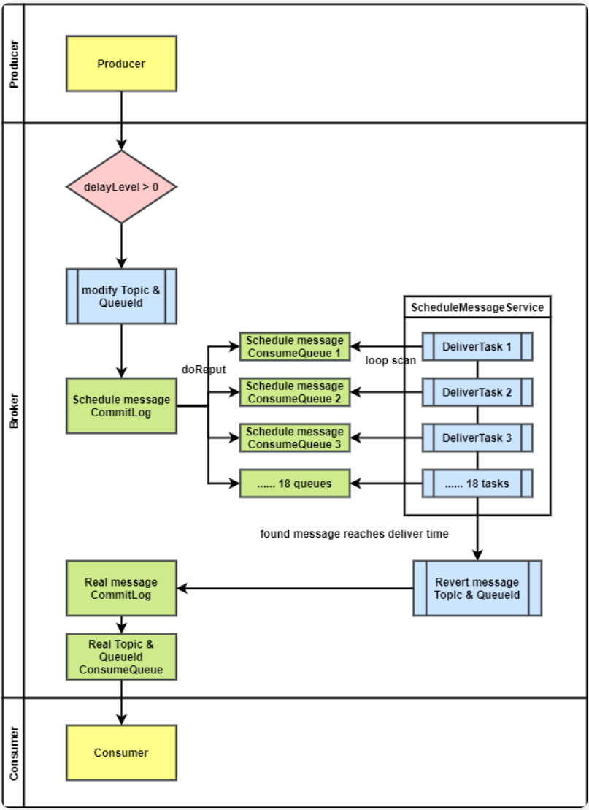
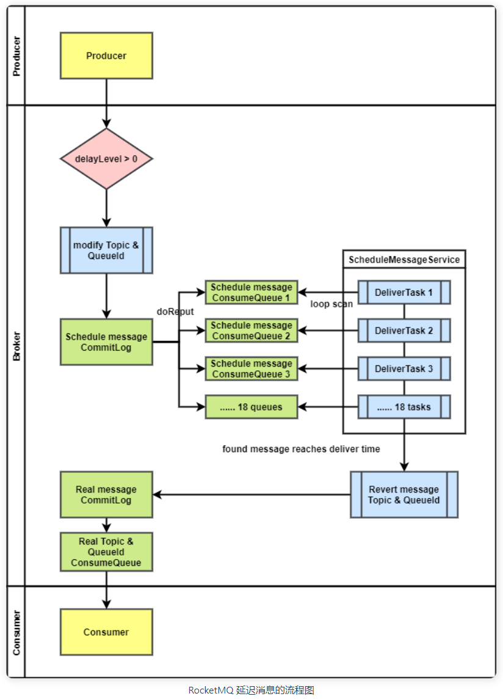
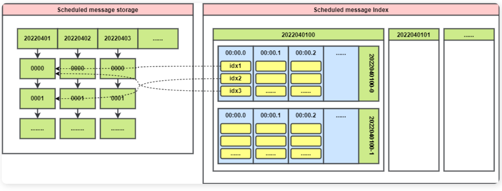
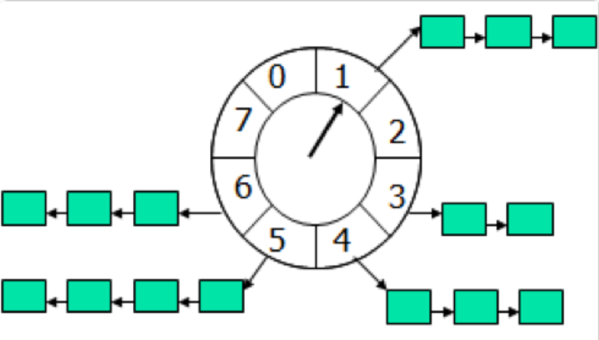
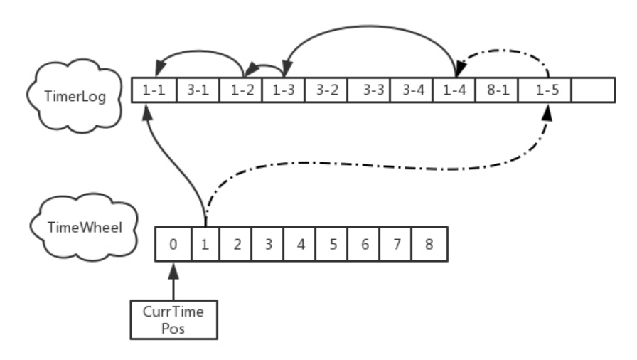

## 标准版定时消息

### 概述

#### 定时消息概念

定时消息指发送一条消息，消费者不立即能够消费，而是需要在指定时间进行消费

- 生产者在发送消息时为消息指定发送时间，或者延迟时间
- 定时消息指消息发送后，不能立即被消费者消费
- 当到达指定的发送时间或者延迟相应时间后，消费者才可消费

#### RocketMQ定时支持

截至目前版本，RocketMQ 不支持任意时间的定时消息，而是提供了18个延迟等级。发送消息时可以从18个延迟等级中选一个，然后这条消息会延迟相应的时间发送。

默认支持的延迟等级为：

```
1s 5s 10s 30s 1m 2m 3m 4m 5m 6m 7m 8m 9m 10m 20m 30m 1h 2h
```

可在 Broker 端通过 `messageDelayLevel` 参数进行配置

需要注意的是 RocketMQ 的定时消息受到 CommitLog 保存时间的限制。也就是说如果 CommitLog 最长保存3天，那么延迟时间最长为3天

### 整体思路

下面讲一下RocketMQ中发送定时消息，Broker处理再到消息被消费的流程

- 生产者
  - 生产者发送消息时，用户需在消息属性中设置延迟等级
- Broker
  - Broker 初始化时会创建一个 Topic，专门存放延迟消息。该 Topic 默认有18（延迟等级个数）个 Queue
  - Broker 启动时，为每个延迟等级都创建一个处理线程。该线程扫描对应的延迟等级 Queue。
  - Broker 收到消息后，查看属性中是否有延迟等级信息。如果有，则将该消息的 Topic 和 QueueId 分别替换成延迟消息对应的 Topic 和延迟等级对应的 QueueId。然后将消息真正的 Topic 和 QueueId 放到消息的 properties 属性中最后将消息保存到磁盘。
  - 延迟消息保存后，会在在其 ConsumeQueue 生成索引（上面说过，每个延迟等级都有一个 Queue）
  - 延迟等级处理线程周期性扫描对应的延迟等级 ConsumeQueue 中是否有到期的消息，如果有则将消息真正的 Topic 和 QueueId 恢复，然后重新投递，如果没有则继续循环扫描

* 消费者

  - 当延迟消息被延迟等级处理线程重新投递之后，消费者可以消费到该消息

     

### 详细流程

延迟消息在 Producer 端只需要在消息上额外设置延迟等级即可，所以这里只讨论 Broker 端的流程

```
// 在Producer端设置消息为定时消息
Message msg = new Message();
msg.setTopic("TopicA");
msg.setTags("Tag");
msg.setBody("this is a delay message".getBytes());
// 设置延迟level为5，对应延迟1分钟
msg.setDelayTimeLevel(5);
producer.send(msg);

```

#### 定时消息涉及到的类

我们先来看一下定时消息涉及到的类分别实现了什么功能

- SCHEDULE_TOPIC_XXXX ：这是一个 RocketMQ 系统 Topic，在 Broker 启动时会自动创建，专门用来保存还没有到投递时间的定时消息。系统级别的 Topic 无法被消费者消费，所以在被重新投递之前，消费者无法消费到未到期的定时消息。
  - 它默认有 18 个 Queue，对应18个延迟等级。每个 Queue 都保存所有对应延迟等级的定时消息。
  - 这么设计的原因：延迟消息每个消息的投递时间不确定，Broker 端需要将消息根据投递时间排序后投递。只支持指定时间延迟，并为每个延迟等级设计单独的 Queue 就是为了解决消息排序的问题。这样一来，每个 Queue 中的消息都是按照消息产生的时间顺序发送的。
- **CommitLog**：RocketMQ 消息存储的实现，在定时消息功能中，它主要负责在保存消息时将原消息的 Topic 和 QueueId 替换成定时消息对应的 Topic 和 QueueId。
- ConsumeQueue：RocketMQ 的消费队列，用于消费者消费消息。每个队列元素是一个消息的索引，该索引主要包含消息在 CommitLog 中的偏移量。
  - 消费者消费时查询 ConsumeQueue，一旦发现新的索引项，就可以用该项中的偏移量从 CommitLog 中找到消息并消费。
- **ScheduleMessageService**：实现定时消息延迟投递的主要逻辑。为每个延迟等级的 Queue 创建一个线程，该线程循环扫描对应的 Queue，如果发现到投递时间的消息，则把消息的 Topic 和 QueueId 恢复，然后重新投递到 CommitLog 中

#### 定时消息时序图

 

- DefaultMessageStore 调用 putMessage 方法保存消息，内部调用 CommitLog 保存消息
- CommitLog 保存消息时检查是否是延迟消息（是否有 DelayLevel 属性）
  - 如果是，则修改消息的

### 具体逻辑

#### CommitLog

- putMessage() / AsyncPutMessage()：同步和异步的消息存储函数，Broker 收到消息后存储消息时调用。
  - 在存盘之前，中检查消息属性中`delayLevel > 0`来判断是否是定时消息
  - 如果是定时消息，将原消息的 Topic 和 QueueId 替换成定时消息对应的 Topic 和 QueueId；然后将消息真正的 Topic 和 QueueId 存放到消息 `properties`属性中
  - 将消息存储。之后会根据存储的消息构建消息的索引文件 ConsumeQueue 和 IndexFile
  - 重投递时，会计算出消息的真正投递时间，保存到 ConsumeQueue 索引的 `tagsCode` 位置。

#### ScheduleMessageService

​	这个类扩展了 `ConfigManager`，`ConfigManager` 提供了管理一个配置文件的功能，包含配置文件持久化的函数和重新加载配置文件到内存的函数。

- `ConcurrentMap<Integer /* level */, Long/* offset */> offsetTable`：每个延迟等级扫描的逻辑 offset，会被作为配置文件保存，在启动时从磁盘中加载。
- start()：Broker 不为SLAVE时，在 Broker 启动时运行。
  - 从磁盘中加载`offsetTable`
  - 为每个延迟等级创建一个`DeliverDelayedMessageTimerTask`，用于周期性扫描延迟等级的消息，将到期的消息重新投递
  - 创建一个周期性定时任务，定时将`offsetTable`持久化
- `Timer timer`：最初 RocketMQ 使用 Java 的 `Timer` 来执行定时任务，但是由于 Timer 内部只有一个线程同步执行，无法同时投递多个延迟等级的消息。在后面中替换成了 `ScheduledExecutorService`，用以提高定时消息重投递的性能。

#### DeliverDelayedMessageTimerTask

`ScheduleMessageService`的内部类，扩展了 `TimerTask`，用以被 `Timer` 定时调用。（后改成 Runnable，用以被`ScheduledExecutorService`定时调用）

每个该类对应一个延迟等级的 Queue，负责周期性扫描该 Queue 中是否有到期消息，如果有则将到期消息都投递到 CommitLog，如果没有则等待 0.1s 继续下次扫描。

- `run()`：执行入口，这里没有用 while 循环或者是周期性定时任务来周期执行，而是每次 `run()` 里面都会执行一个新的定时任务（`DeliverDelayedMessageTimerTask`），以此来达到周期性执行该任务的效果。
- `executeOnTimeup()`：扫描消息并且检查是否到投递时间的主要逻辑都在这个函数里面，由`run()`调用

### 源码解析

#### CommitLog

- asyncPutMessage：消息异步保存

  - 在存盘之前，中检查消息属性中`delayLevel > 0`来判断是否是定时消息
  - 如果是定时消息，将原消息的 Topic 和 QueueId 替换成定时消息对应的 Topic 和 QueueId；然后将消息真正的 Topic 和 QueueId 存放到消息 `properties`属性中

  ```
  public CompletableFuture<PutMessageResult> asyncPutMessage(final MessageExtBrokerInner msg) {
      // ...
  
      String topic = msg.getTopic();
      int queueId = msg.getQueueId();
  
      final int tranType = MessageSysFlag.getTransactionValue(msg.getSysFlag());
      if (tranType == MessageSysFlag.TRANSACTION_NOT_TYPE || tranType == MessageSysFlag.TRANSACTION_COMMIT_TYPE) {
          // Delay Delivery
  				// 判断是否是定时消息
          if (msg.getDelayTimeLevel() > 0) {
              if (msg.getDelayTimeLevel() > this.defaultMessageStore.getScheduleMessageService().getMaxDelayLevel()) {
                  msg.setDelayTimeLevel(this.defaultMessageStore.getScheduleMessageService().getMaxDelayLevel());
              }
  						// 替换消息的Topic和QueueId为定时消息Topic和延迟等级对应的QueueId
              topic = TopicValidator.RMQ_SYS_SCHEDULE_TOPIC;
              queueId = ScheduleMessageService.delayLevel2QueueId(msg.getDelayTimeLevel());
  
              // Backup real topic, queueId
  						// 把真正的 Topic 和 QueueId 放到消息属性中
              MessageAccessor.putProperty(msg, MessageConst.PROPERTY_REAL_TOPIC, msg.getTopic());
              MessageAccessor.putProperty(msg, MessageConst.PROPERTY_REAL_QUEUE_ID, String.valueOf(msg.getQueueId()));
              msg.setPropertiesString(MessageDecoder.messageProperties2String(msg.getProperties()));
  
              msg.setTopic(topic);
              msg.setQueueId(queueId);
          }
      }
  		// ...消息存储逻辑
  }
  
  ```

  同步保存消息的方法即是异步方法调用`get()`，不再赘述

#### ScheduleMessageService

- start：延迟消息服务启动

  - 从磁盘中加载`offsetTable`
  - 为每个延迟等级创建一个`DeliverDelayedMessageTimerTask`，用于周期性扫描延迟等级的消息，将到期的消息重新投递
  - 创建一个周期性定时任务，定时将`offsetTable`持久化

  ```
  public void start() {
      if (started.compareAndSet(false, true)) {
          super.load();
          this.timer = new Timer("ScheduleMessageTimerThread", true);
          for (Map.Entry<Integer, Long> entry : this.delayLevelTable.entrySet()) {
              Integer level = entry.getKey();
              Long timeDelay = entry.getValue();
              Long offset = this.offsetTable.get(level);
              if (null == offset) {
                  offset = 0L;
              }
  
              if (timeDelay != null) {
                  this.timer.schedule(new DeliverDelayedMessageTimerTask(level, offset), FIRST_DELAY_TIME);
              }
          }
  
          this.timer.scheduleAtFixedRate(new TimerTask() {
  
              @Override
              public void run() {
                  try {
                      if (started.get()) {
                          ScheduleMessageService.this.persist();
                      }
                  } catch (Throwable e) {
                      log.error("scheduleAtFixedRate flush exception", e);
                  }
              }
          }, 10000, this.defaultMessageStore.getMessageStoreConfig().getFlushDelayOffsetInterval());
      }
  }
  ```

#### DeliverDelayedMessageTimerTask

- executeOnTimeup：延迟到期执行

  - 先获延迟等级取对应的 ConsumeQueue，然后根据 `offsetTable` 中获取的延迟等级对应的 offset（记录这个队列扫描的偏移量）开始扫描后面的消息
  - 从 ConsumeQueue 获取 tagsCode，这里面存的是真正投递时间，跟现在的时间戳比较，来判断该消息是否要投递
    - 如果现在已经到了投递时间点，投递消息
    - 如果现在还没到投递时间点，继续创建一个定时任务，countdown 秒之后执行，然后 return
  - 等待 0.1s，执行一个新的 `DeliverDelayedMessageTimerTask`

  ```
  public void executeOnTimeup() {
      // 根据delayLevel查找对应的延迟消息ConsumeQueue
      ConsumeQueue cq =
          ScheduleMessageService.this.defaultMessageStore.findConsumeQueue(TopicValidator.RMQ_SYS_SCHEDULE_TOPIC,
              delayLevel2QueueId(delayLevel));
  
      long failScheduleOffset = offset;
  
      if (cq != null) {
          // 根据ConsumeQueue的有效延迟消息逻辑offset，获取所有有效的消息
          SelectMappedBufferResult bufferCQ = cq.getIndexBuffer(this.offset);
          if (bufferCQ != null) {
              try {
                  long nextOffset = offset;
                  int i = 0;
                  ConsumeQueueExt.CqExtUnit cqExtUnit = new ConsumeQueueExt.CqExtUnit();
                  // 遍历ConsumeQueue中的所有有效消息
                  for (; i < bufferCQ.getSize(); i += ConsumeQueue.CQ_STORE_UNIT_SIZE) {
                      // 获取ConsumeQueue索引的三个关键属性
                      long offsetPy = bufferCQ.getByteBuffer().getLong();
                      int sizePy = bufferCQ.getByteBuffer().getInt();
                      long tagsCode = bufferCQ.getByteBuffer().getLong();
  
                      if (cq.isExtAddr(tagsCode)) {
                          if (cq.getExt(tagsCode, cqExtUnit)) {
                              tagsCode = cqExtUnit.getTagsCode();
                          } else {
                              //can't find ext content.So re compute tags code.
                              log.error("[BUG] can't find consume queue extend file content!addr={}, offsetPy={}, sizePy={}",
                                  tagsCode, offsetPy, sizePy);
                              long msgStoreTime = defaultMessageStore.getCommitLog().pickupStoreTimestamp(offsetPy, sizePy);
                              tagsCode = computeDeliverTimestamp(delayLevel, msgStoreTime);
                          }
                      }
  
                      // ConsumeQueue里面的tagsCode实际是一个时间点（投递时间点）
                      long now = System.currentTimeMillis();
                      long deliverTimestamp = this.correctDeliverTimestamp(now, tagsCode);
  
                      nextOffset = offset + (i / ConsumeQueue.CQ_STORE_UNIT_SIZE);
  
                      long countdown = deliverTimestamp - now;
  
                      // 如果现在已经到了投递时间点，投递消息
                      // 如果现在还没到投递时间点，继续创建一个定时任务，countdown秒之后执行
                      if (countdown <= 0) {
                          MessageExt msgExt =
                              ScheduleMessageService.this.defaultMessageStore.lookMessageByOffset(
                                  offsetPy, sizePy);
  
                          if (msgExt != null) {
                              try {
                                  MessageExtBrokerInner msgInner = this.messageTimeup(msgExt);
                                  if (TopicValidator.RMQ_SYS_TRANS_HALF_TOPIC.equals(msgInner.getTopic())) {
                                      log.error("[BUG] the real topic of schedule msg is {}, discard the msg. msg={}",
                                              msgInner.getTopic(), msgInner);
                                      continue;
                                  }
                                  // 重新投递消息到CommitLog
                                  PutMessageResult putMessageResult =
                                      ScheduleMessageService.this.writeMessageStore
                                          .putMessage(msgInner);
                                  // 投递成功
                                  if (putMessageResult != null
                                      && putMessageResult.getPutMessageStatus() == PutMessageStatus.PUT_OK) {
                                      continue;
                                  // 投递失败
                                  } else {
                                      // XXX: warn and notify me
                                      log.error(
                                          "ScheduleMessageService, a message time up, but reput it failed, topic: {} msgId {}",
                                          msgExt.getTopic(), msgExt.getMsgId());
                                      ScheduleMessageService.this.timer.schedule(
                                          new DeliverDelayedMessageTimerTask(this.delayLevel,
                                              nextOffset), DELAY_FOR_A_PERIOD);
                                      ScheduleMessageService.this.updateOffset(this.delayLevel,
                                          nextOffset);
                                      return;
                                  }
                              } catch (Exception e) {
                                  /*
                                   * XXX: warn and notify me
                                   * msgExt里面的内容不完整
                                   * ，如没有REAL_QID,REAL_TOPIC之类的
                                   * ，导致数据无法正常的投递到正确的消费队列，所以暂时先直接跳过该条消息
                                   */
                                  log.error(
                                      "ScheduleMessageService, messageTimeup execute error, drop it. msgExt="
                                          + msgExt + ", nextOffset=" + nextOffset + ",offsetPy="
                                          + offsetPy + ",sizePy=" + sizePy, e);
                              }
                          }
                      } else {
                          // 该条ConsumeQueue索引对应的消息如果未到投递时间，那么创建一个定时任务，到投递时间时执行
                          // 如果有还未投递的消息，创建定时任务后直接返回
                          ScheduleMessageService.this.timer.schedule(
                              new DeliverDelayedMessageTimerTask(this.delayLevel, nextOffset),
                              countdown);
                          ScheduleMessageService.this.updateOffset(this.delayLevel, nextOffset);
                          return;
                      }
                  } // end of for
  
                  // 如果所有消息都已经被投递，那么等待0.1s后重新执行该检查任务
                  nextOffset = offset + (i / ConsumeQueue.CQ_STORE_UNIT_SIZE);
                  ScheduleMessageService.this.timer.schedule(new DeliverDelayedMessageTimerTask(
                      this.delayLevel, nextOffset), DELAY_FOR_A_WHILE);
                  ScheduleMessageService.this.updateOffset(this.delayLevel, nextOffset);
                  return;
              } finally {
  
                  bufferCQ.release();
              }
          } // end of if (bufferCQ != null)
          else {
              /*
               * 索引文件被删除，定时任务中记录的offset已经被删除，会导致从该位置中取不到数据，
               * 这里直接纠正下一次定时任务的offset为当前定时任务队列的最小值
               */
              long cqMinOffset = cq.getMinOffsetInQueue();
              if (offset < cqMinOffset) {
                  failScheduleOffset = cqMinOffset;
                  log.error("schedule CQ offset invalid. offset=" + offset + ", cqMinOffset="
                      + cqMinOffset + ", queueId=" + cq.getQueueId());
              }
          }
      } // end of if (cq != null)
  
      ScheduleMessageService.this.timer.schedule(new DeliverDelayedMessageTimerTask(this.delayLevel,
          failScheduleOffset), DELAY_FOR_A_WHILE);
  }
  ```

## 异步投递优化升级(4.9)

### 概述

​	在 RocketMQ 4.9.3 版本中，对延迟消息做了很大的优化，大幅度提升了延迟消息的性能，其中将原先用来启动周期性任务的 `Timer` 改为使用 `ScheduledExecutorService`，将多延迟等级下同时发送延迟消息的性能提升了 3+ 倍

​	另外，支持延迟消息的异步投递。老版本中，延迟消息到期投递到 CommitLog 的动作是同步的，在 Dledger 模式下性能很差。新的改动将延迟消息的到期投递模式改为可配置，使用 BrokerConfig 的 `enableScheduleAsyncDeliver` 属性进行配置。改成异步投递后，在 Dledger 下的性能提升了 3 倍左右

### 优化升级解析

#### 多线程优化

优化版本，将多延迟等级延迟消息扫描和投递的任务从单线程执行改为多线程；

这个改动将延迟消息的任务调度器从 `Timer` 改为 `ScheduledExecutorService`。

在老版本中，所有 18 个延迟等级的定时消息扫描和投递任务都是由一个 `Timer` 启动定时任务执行的。`Timer` 中所有定时任务都是由**一个工作线程单线程处理**的，如果某个任务处理慢了，后续有新的任务进来，会导致新的任务需要等待前一个任务执行结束。

改为 `ScheduledExecutorService` 线程池之后多线程处理任务，可以大幅度提高延迟消息处理速度，并且避免多延迟等级消息同时发送时造成的阻塞

* 改动前，同时向 4 个延迟等级发送延迟消息，TPS: 657

   

* 改动后，同时向4个延迟等级发送延迟消息，TPS: 2453

   

  改动后，同时向4个延迟等级发送延迟消息 

#### 延迟消息异步投递

支持延迟消息异步投递，提升 Dledger 模式下的投递性能；

原本的定时消息投递为单线程同步投递，在 DLedger 模式下存在性能瓶颈。

因为在 DLedger 模式下，主节点的角色会变为 SYNC_MASTER，同步复制。即需要足够多的从节点存储了该消息后，才会向主节点返回写入成功。

本次改动将延迟消息的写入改成可配置同步或异步写入，异步写入在 DLedger 模式下性能提升了 3 倍左右

#### 异步投递缺陷

异步投递的两个主要缺点是

- 无法保证消息投递的顺序
- 消息可能重复投递

异步投递的注意点

- 需要做流控，当写入 TPS 过高时，页缓存可能会繁忙；甚至节点内存会被打爆。
- 可能存在消息可能丢失的情况，比如投递时页缓存繁忙或者其他原因导致一次投递失败。这时候的处理是对失败消息进行重新投递，重试 3 次失败后，阻塞当前延迟等级对应的线程，直到重新投递成功

#### 异步投递逻辑

**同步投递**的逻辑：每个延迟等级都分配一个线程，不断启动任务去扫描该等级对应的消费队列中是否有到期的消息。如果有则将到期的消息一个个同步投递，投递成功后更新该等级对应的 offset，下个任务从该 offset 开始扫描新的消息

**异步投递**的逻辑相比于同步投递有一些不同（生产-消费模式）：

​	异步投递采用了生产-消费模式，生产和消费的对象是异步投递的任务。生产者线程负责将到期的消息创建投递任务，消费者消费这些任务，根据任务的执行状态来更新 offset 或者重试。这里引入了一个**阻塞队列**作为异步投递任务的容器，阻塞队列的大小可以配置，表示可以同时投递的消息数。当队列中投递任务满时触发流控；

​	 

将对应延迟等级的消息异步投递时，需要将异步投递的任务放入处理队列。此时，可能由于流控等原因，投递任务未能放入队列，那么等待一会后再次执行扫描-投递逻辑。

消息并不会直接投递成功，所以需要消费者线程从队列中消费并判断这些异步投递任务的状态。如果投递任务已完成，则更新 offset；如果投递异常，则等待一会后重新同步投递；投递成功则更新 offset，投递失败则继续重试；

### 异步投递详解

延迟消息的投递逻辑全部在 `ScheduleMessageService` 类中；

下面以一个延迟等级的处理为例，用图展示一下消息投递线程和任务更新线程的工作流程；

 

左边是定时消息到期投递线程，右边是投递过程状态更新线程

#### 定时消息投递线程

延迟消息投递服务中维护了一个 offset 表`offsetTable`，表示每个延迟等级当前投递的消息在 ConsumeQuque 中的逻辑 offset。
它用来在关机恢复时标明扫描开始位置，所以这个表会定期持久化到磁盘中，并且从节点会定期从主节点拉去该表的最新值。

延迟消息处理服务启动时会在 `deliverExecutorService` 线程池为每个延迟等级创建并执行一个 `DeliverDelayedMessageTimerTask` 任务，这个任务并不是周期性任务，而是在一个任务的末尾执行下一个任务。这个任务的 `executeOnTimeup()` 方法即消息投递的逻辑。上图展示的就是该方法中的逻辑。

- 获取该等级的 ConsumeQueue，依次扫描消息是否到期
- 如果消息到期，从 CommitLog 中查出该消息的完整信息，从属性中恢复它的真实 Topic 和 QueueId，然后投递。（根据配置同步或者异步投递，这里按异步讲解）
- 异步消息投递后，投递的过程被放入阻塞队列 `deliverPendingTable`
- 如果放入队列失败，表示此时出现流控或者阻塞，需要等待一会然后重新投递
- 如果全部投递成功，将 offset 更新为当前投递消息的 offset + 1，表示下一次从下一个 offset 开始扫描

#### 投递过程状态更新线程

每个延迟等级在 `handleExecutorService` 线程池中启动了一个状态更新线程，每个线程执行 `HandlePutResultTask` 任务。同样，这个任务不是周期性任务，而是一个任务末尾启动一个新的任务。

`HandlePutResultTask` 任务不断从阻塞队列头部获取异步投递过程对象，判断其状态

- 如果投递成功，更新 offset 和统计数据，并从队列中移除投递任务
- 如果投递中，无动作
- 如果投递错误，根据是否配置自动重试来执行重试或者直接跳过
- 重试投递时采用同步投递，投递成功则更新 offset 和统计数据，然后移除；否则继续重新投递

全部任务扫描完毕后等待一会，执行新的`HandlePutResultTask` 任务。

### 源码分析

#### 定时消息投递任务

```
public void executeOnTimeup() {
    // 根据delayLevel查找对应的延迟消息ConsumeQueue
    ConsumeQueue cq =
        ScheduleMessageService.this.defaultMessageStore.findConsumeQueue(TopicValidator.RMQ_SYS_SCHEDULE_TOPIC,
                                                                         delayLevel2QueueId(delayLevel));

    if (cq == null) {
        this.scheduleNextTimerTask(this.offset, DELAY_FOR_A_WHILE);
        return;
    }

    // 根据ConsumeQueue的有效延迟消息逻辑offset，获取所有有效的消息
    SelectMappedBufferResult bufferCQ = cq.getIndexBuffer(this.offset);
    if (bufferCQ == null) {
        long resetOffset;
        if ((resetOffset = cq.getMinOffsetInQueue()) > this.offset) {
            log.error("schedule CQ offset invalid. offset={}, cqMinOffset={}, queueId={}",
                      this.offset, resetOffset, cq.getQueueId());
        } else if ((resetOffset = cq.getMaxOffsetInQueue()) < this.offset) {
            log.error("schedule CQ offset invalid. offset={}, cqMaxOffset={}, queueId={}",
                      this.offset, resetOffset, cq.getQueueId());
        } else {
            resetOffset = this.offset;
        }

        this.scheduleNextTimerTask(resetOffset, DELAY_FOR_A_WHILE);
        return;
    }

    long nextOffset = this.offset;
    try {
        int i = 0;
        ConsumeQueueExt.CqExtUnit cqExtUnit = new ConsumeQueueExt.CqExtUnit();
        // 遍历ConsumeQueue中的所有有效消息
        for (; i < bufferCQ.getSize() && isStarted(); i += ConsumeQueue.CQ_STORE_UNIT_SIZE) {
            // 获取ConsumeQueue索引的三个关键属性
            long offsetPy = bufferCQ.getByteBuffer().getLong();
            int sizePy = bufferCQ.getByteBuffer().getInt();
            long tagsCode = bufferCQ.getByteBuffer().getLong();

            if (cq.isExtAddr(tagsCode)) {
                if (cq.getExt(tagsCode, cqExtUnit)) {
                    tagsCode = cqExtUnit.getTagsCode();
                } else {
                    //can't find ext content.So re compute tags code.
                    log.error("[BUG] can't find consume queue extend file content!addr={}, offsetPy={}, sizePy={}",
                              tagsCode, offsetPy, sizePy);
                    long msgStoreTime = defaultMessageStore.getCommitLog().pickupStoreTimestamp(offsetPy, sizePy);
                    tagsCode = computeDeliverTimestamp(delayLevel, msgStoreTime);
                }
            }
            // ConsumeQueue里面的tagsCode实际是一个时间点（投递时间点）
            long now = System.currentTimeMillis();
            long deliverTimestamp = this.correctDeliverTimestamp(now, tagsCode);
            nextOffset = offset + (i / ConsumeQueue.CQ_STORE_UNIT_SIZE);

            // 如果现在已经到了投递时间点，投递消息
            // 如果现在还没到投递时间点，继续创建一个定时任务，countdown秒之后执行
            long countdown = deliverTimestamp - now;
            if (countdown > 0) {
                this.scheduleNextTimerTask(nextOffset, DELAY_FOR_A_WHILE);
                return;
            }

            MessageExt msgExt = ScheduleMessageService.this.defaultMessageStore.lookMessageByOffset(offsetPy, sizePy);
            if (msgExt == null) {
                continue;
            }

            MessageExtBrokerInner msgInner = ScheduleMessageService.this.messageTimeup(msgExt);
            if (TopicValidator.RMQ_SYS_TRANS_HALF_TOPIC.equals(msgInner.getTopic())) {
                log.error("[BUG] the real topic of schedule msg is {}, discard the msg. msg={}",
                          msgInner.getTopic(), msgInner);
                continue;
            }
            // 重新投递消息到CommitLog
            boolean deliverSuc;
            if (ScheduleMessageService.this.enableAsyncDeliver) {
                // 异步投递
                deliverSuc = this.asyncDeliver(msgInner, msgExt.getMsgId(), offset, offsetPy, sizePy);
            } else {
                // 同步投递
                deliverSuc = this.syncDeliver(msgInner, msgExt.getMsgId(), offset, offsetPy, sizePy);
            }

            // 投递失败（流控、阻塞、投递异常等原因），等待0.1s再次执行投递任务
            if (!deliverSuc) {
                this.scheduleNextTimerTask(nextOffset, DELAY_FOR_A_WHILE);
                return;
            }
        }

        nextOffset = this.offset + (i / ConsumeQueue.CQ_STORE_UNIT_SIZE);
    } catch (Exception e) {
        log.error("ScheduleMessageService, messageTimeup execute error, offset = {}", nextOffset, e);
    } finally {
        bufferCQ.release();
    }

    // 该条ConsumeQueue索引对应的消息如果未到投递时间，那么创建一个定时任务，到投递时间时执行
    // 如果有还未投递的消息，创建定时任务后直接返回
    this.scheduleNextTimerTask(nextOffset, DELAY_FOR_A_WHILE);
}

```

```
private boolean asyncDeliver(MessageExtBrokerInner msgInner, String msgId, long offset, long offsetPy,
    int sizePy) {
    Queue<PutResultProcess> processesQueue = ScheduleMessageService.this.deliverPendingTable.get(this.delayLevel);

    //Flow Control 流控，如果阻塞队列中元素数量大于阈值则触发流控
    int currentPendingNum = processesQueue.size();
    int maxPendingLimit = ScheduleMessageService.this.defaultMessageStore.getMessageStoreConfig()
        .getScheduleAsyncDeliverMaxPendingLimit();
    if (currentPendingNum > maxPendingLimit) {
        log.warn("Asynchronous deliver triggers flow control, " +
            "currentPendingNum={}, maxPendingLimit={}", currentPendingNum, maxPendingLimit);
        return false;
    }

    //Blocked 阻塞，如果有一个投递任务重试 3 次以上，阻塞该延迟等级的消息投递，直到该任务投递成功
    PutResultProcess firstProcess = processesQueue.peek();
    if (firstProcess != null && firstProcess.need2Blocked()) {
        log.warn("Asynchronous deliver block. info={}", firstProcess.toString());
        return false;
    }

    PutResultProcess resultProcess = deliverMessage(msgInner, msgId, offset, offsetPy, sizePy, true);
    processesQueue.add(resultProcess);
    return true;
}

```

```
private PutResultProcess deliverMessage(MessageExtBrokerInner msgInner, String msgId, long offset,
    long offsetPy, int sizePy, boolean autoResend) {
    CompletableFuture<PutMessageResult> future =
        ScheduleMessageService.this.writeMessageStore.asyncPutMessage(msgInner);
    return new PutResultProcess()
        .setTopic(msgInner.getTopic())
        .setDelayLevel(this.delayLevel)
        .setOffset(offset)
        .setPhysicOffset(offsetPy)
        .setPhysicSize(sizePy)
        .setMsgId(msgId)
        .setAutoResend(autoResend)
        .setFuture(future)
        .thenProcess();
}
```

```
        public PutResultProcess thenProcess() {
            this.future.thenAccept(result -> {
                this.handleResult(result);
            });

            this.future.exceptionally(e -> {
                log.error("ScheduleMessageService put message exceptionally, info: {}",
                    PutResultProcess.this.toString(), e);

                onException();
                return null;
            });
            return this;
        }
```

这个将会更新PutResultProcess的状态

#### 异步更新任务

HandlePutResultTask

```
public void run() {
    LinkedBlockingQueue<PutResultProcess> pendingQueue =
        ScheduleMessageService.this.deliverPendingTable.get(this.delayLevel);

    PutResultProcess putResultProcess;
    // 循环获取队列中第一个投递任务，查看其执行状态并执行对应操作
    while ((putResultProcess = pendingQueue.peek()) != null) {
        try {
            switch (putResultProcess.getStatus()) {
                case SUCCESS:
                    // 消息投递成功，从队列中移除该投递任务
                    ScheduleMessageService.this.updateOffset(this.delayLevel, putResultProcess.getNextOffset());
                    pendingQueue.remove();
                    break;
                case RUNNING:
                    // 正在投递，不做操作
                    break;
                case EXCEPTION:
                    // 投递出错
                    if (!isStarted()) {
                        log.warn("HandlePutResultTask shutdown, info={}", putResultProcess.toString());
                        return;
                    }
                    log.warn("putResultProcess error, info={}", putResultProcess.toString());
                    // onException 方法执行重试
                    putResultProcess.onException();
                    break;
                case SKIP:
                    // 跳过，直接从队列中移除
                    log.warn("putResultProcess skip, info={}", putResultProcess.toString());
                    pendingQueue.remove();
                    break;
            }
        } catch (Exception e) {
            log.error("HandlePutResultTask exception. info={}", putResultProcess.toString(), e);
            putResultProcess.onException();
        }
    }

    // 等待0.01s，继续下一次扫描
    if (isStarted()) {
        ScheduleMessageService.this.handleExecutorService
            .schedule(new HandlePutResultTask(this.delayLevel), DELAY_FOR_A_SLEEP, TimeUnit.MILLISECONDS);
    }
}
```

```
private void resend() {
    log.info("Resend message, info: {}", this.toString());

    // Gradually increase the resend interval.
    try {
        Thread.sleep(Math.min(this.resendCount++ * 100, 60 * 1000));
    } catch (InterruptedException e) {
        e.printStackTrace();
    }

    try {
        // 从 CommitLog 中查询消息完整信息
        MessageExt msgExt = ScheduleMessageService.this.defaultMessageStore.lookMessageByOffset(this.physicOffset, this.physicSize);
        // 如果查询失败，检查重试次数，如果到达 6 次则打印日志并跳过该消息
        if (msgExt == null) {
            log.warn("ScheduleMessageService resend not found message. info: {}", this.toString());
            this.status = need2Skip() ? ProcessStatus.SKIP : ProcessStatus.EXCEPTION;
            return;
        }

        MessageExtBrokerInner msgInner = ScheduleMessageService.this.messageTimeup(msgExt);
        // 同步投递
        PutMessageResult result = ScheduleMessageService.this.writeMessageStore.putMessage(msgInner);
        // 根据结果更新状态
        this.handleResult(result);
        if (result != null && result.getPutMessageStatus() == PutMessageStatus.PUT_OK) {
            log.info("Resend message success, info: {}", this.toString());
        }
    } catch (Exception e) {
        this.status = ProcessStatus.EXCEPTION;
        log.error("Resend message error, info: {}", this.toString(), e);
    }
}


```


## 高性能设计思路

在开源版本中支持延迟消息的功能，但是仅支持几个固定的延迟时间（1s 5s 10s 30s 1m 2m 3m 4m 5m 6m 7m 8m 9m 10m 20m 30m 1h 2h）。这里探讨的是如何在 RocketMQ 基础上实现高性能的、任意时间的定时消息

### 背景

#### 定时消息和延迟消息

定时消息和延迟消息是消息队列中对于消息的基本概念。

- 定时消息：生产者将消息发送到消息队列服务端，但不期望这条消息马上被投递，而是在当前时间之后的某个时间投递，此时消费者才可以消费到这条消息。
- 延迟消息：生产者将消息发送到消息队列服务端，但不期望这条消息马上被投递，而是延迟一定时间后投递。

这两个概念虽然感觉起来不同，但是在实际使用中效果是完全相同的：消息到达消息队列服务端后不会马上投递，而是到达某个时间才投递给消费者。也就是说，实现其中一个，就可以达到另一个的效果。

使用定时消息，将消息定时设置为当前时间往后的 X 时间，可以实现延迟消息的效果。
使用延迟消息，如果想要固定时间投递，可以计算投递时间到当前时间的时间差 X，然后设置这条消息延迟 X 时间

#### 应用场景

定时消息在当前的互联网环境中有非常大的需求。

例如电商/网约车等业务中都会出现的订单场景，客户下单后并不会马上付款，但是这个订单也不可能一直开着，因为订单会占用商品/网约车资源。这时候就需要一个机制，在比如 5 分钟后进行一次回调，回调关闭订单的方法。
这个回调的触发可以用分布式定时任务来处理，，但是更好的方法可以是使用消息队列发送一个延迟消息，因为一条消息会比一个分布式定时任务轻量得多。
开启一个消费者消费订单取消 Topic 的消息，收到消息后关闭订单，简单高效。

当用户支付了订单，那么这个订单不再需要被取消，刚才发的延迟消息也不再需要被投递。当然，你可以在消费消息时判断一下订单的状态以确定是否需要关闭，但是这样做会有一次额外的数据库操作。如果可以取消定时消息，那么只要发送一条定时消息取消的命令就可以取消之前发送的定时消息投递。

除此之外，定时消息还能用于更多其他场景，如定时任务触发、等待重试、事件预订等等

#### 消息中间件对比

当前各大消息队列和云厂商都对定时消息和延迟消息有一定程度上的支持，但是往往在精度、延迟时间、性能等方面无法都达到完美

| 消息队列 / 功能     | 延迟时间                           | 精度            | 性能                                  | 是否支持取消 |
| ------------------- | ---------------------------------- | --------------- | ------------------------------------- | ------------ |
| Kafka               | ×                                  | ×               | ×                                     | ×            |
| RabbitMQ            | 一个队列只支持一个延迟时间         |                 | 低于 RocketMQ                         | ×            |
| Pulser              | 支持跨度很大的延迟消息             | 1s              | 无法支持大规模使用                    | ×            |
| RocketMQ            | 仅支持固定等级的延迟消息，最大 2 h | 1s              | 接近于 RocketMQ 普通消息性能          | ×            |
| Amazon SQS          | 15 分钟内                          | ？              | ？                                    | ×            |
| 阿里云 RocketMQ     | 40 天                              | 1s~2s的延迟误差 | 接近于 RocketMQ 普通消息性能          | ×            |
| 腾讯云 CMQ          | 1 小时内                           | 1s              | 单队列处于飞行状态的消息数限制为2万条 | ×            |
| **华为云 RocketMQ** | **1 年**                           | **0.1s**        | 接近于 RocketMQ 普通消息性能          | **√**        |

4 大主流开源消息队列对定时消息的实现都有局限性，无法达到任意时间定时。

各大云厂商将该功能作为一个竞争力项，支持比较灵活的延迟消息。其中华为云 RocketMQ 支持最长 1 年的延迟消息，且延迟精度能够达到 0.1s 内，同时还具备基本等同于普通消息的性能表现。此外，还支持延迟消息的取消，功能领先所有开源消息队列和云化消息队列

### 设计思路

在设计定时消息的实现方案前，我的设计目标是——构建定时消息底座，不仅能让业务使用，也能在其之上构建其他服务，如定时任务调度服务；甚至作为 RocketMQ 一些特性的基础，基于定时消息实现如消息重投等功能。作为一个底座，其必须有如下的特点：支持任意时间的定时、高精度、高性能、高可靠

#### 设计痛点

各大开源消息队列和云厂商没有实现完美的定时消息，因为在每个指标上要达到完美，都涉及到其他方面的一些取舍。

- 延迟时间：一般来说，保存的消息数据都有一个过期时间，如 3 天过期清除，也就是说定时消息延迟时间最大也不能超过这个清除时间。支持更大的延迟时间意味着延迟消息更长的保存时间，也意味着需要单独对定时消息进行存储。
- 精度：定时消息如何投递？势必会用到类似定时任务地机制。比如每 1s 执行一次定时任务投递这 1s 内的定时消息。定时消息的精度越高就意味着定时任务执行越频繁，计算压力越大，I/O 越频繁。
- 性能和可靠性：这两个指标往往不能兼得。更高的可靠性意味着消息同步投递、主从同步，那么消息的 TPS 就不可避免地变低

#### 开源版回顾

​	开源版本 RocketMQ 的定时消息也是取舍之后的产物。对于单队列支持任意时间定时消息的难点是消息的顺序问题。比如用户先发了一条延迟 1 分钟的消息，随后马上发一条延迟 3 秒的消息，显然延迟 3 秒的消息需要先被投递出去，那么服务端在收到消息后需要对消息进行排序再投递。在 RocketMQ 中，为了保证可靠性，消息是需要落盘的，且对性能和延迟的要求，决定了在服务端对消息进行排序是完全不可接受的。

​	如何解决排序问题？开源版本的做法是：通过固定几个延迟等级的方式，绕过排序。开源 RocketMQ 设定了 18 个固定延迟时间的延迟等级：1s 5s 10s 30s 1m 2m 3m 4m 5m 6m 7m 8m 9m 10m 20m 30m 1h 2h。这样，对于每个延迟等级，他们之中的消息顺序就是固定的：先来先投递，后来后投递，从而绕过了排序这个问题。

下面是开源 RocketMQ 延迟消息的流程图

 

RocketMQ 为延迟消息创建了一个内部 Topic，下有 18 个 Queue，对应 18 个延迟等级。收到延迟消息后，不会立即投递到它本该去的 Topic 中，而是投递到延迟消息 Topic 中的对应 Queue。然后的实现十分简单粗暴：为每个 Queue 创建一个线程，循环扫描这个 Queue 里面的消息是否到达投递时间，如果到达则投递到它本该去的 Topic 中。由于每个 Queue 里面消息的延迟等级相同，那么他们的投递就是按顺序的，避免了对延迟消息重新排序。

开源的延迟消息实现经过 4.9.3，已经支持了异步投递，拥有了不错的性能。

但是它仍存在一个致命的问题：**不支持 18 个等级之外的延迟时间**。日益增长的客户诉求促使我们探究任意时间定时消息的实现。站在开源 RocketMQ 实现的肩膀上，只要能将 18 个等级改为定时任意时间，就可以实现高性能高可靠的定时消息，因为高可靠和高性能都可以依赖 RocketMQ 本身的机制达到

#### 存储设计

想要实现任意时间的定时消息，存储设计是最重要的。存储设计面临的两个最大的问题就是

- 定时消息的顺序：先发送的不一定先投递。
- 消息存储过期：如果定时消息和普通消息存在一起，那么最大延迟时间还是会受到普通消息文件过期时间的限制。

这两个问题可以通过精心的设计存储方案来解决：

* 顺序问题

  回想 RocketMQ 的索引文件 IndexFile，它提供了按照消息 Key 查找消息的能力。具体的做法是：它用类似 HashMap 的形式存储了每个消息 Key 下的消息的位置信息，当查询某个 Key 的消息时，可以马上定位到这个 Key 下存储的消息位置信息链表，然后通过位置信息从消息存储文件 CommitLog 中将消息全部信息查出来。

  对于定时消息，也可以构建这样一个索引文件，用来快速查找某一时刻需要投递的消息。这样一来，投递消息时只需要借助索引文件就可以查找所有该时刻需要投递的消息，免去了排序的步骤，解决了定时消息顺序问题。

  参照 IndexFile，定时消息索引的存储方案设计就变得很简单。索引文件的 Key 即投递的时间段，Value 即该时间段内要投递的所有消息位置信息。

  特别提需要确定的几个关键值：

  - 索引每个 Key 的时间跨度：1s 的精度我认为太差，一些秒杀场景可能慢 1 秒就没货了，于是决定降低一个数量级—— 0.1s
  - 容量和时间跨度：RocketMQ 中文件存储为内存映射文件，最大不超过 2G，所以每个索引文件不应超过 2G。如果按 TPS 1w 来算，1 小时的索引文件大小就会达到 700M 左右。所以时间跨度定为 1 小时，容量为 3600w。如果超过 3600w 怎么办？把这个文件做成可扩展的文件队列即可

* 存储方案取舍

  想要摆脱消息默认过期时间的限制，达到更长的延迟时间，那么只能把定时消息单独存储，投递前永不删除。

  如果要单独存储，也有几个选择：使用第三方 K-V 数据库如 RocksDB，或者自研存储。下面来分析一下这几个方案的优缺点

  | 优点               | 缺点                                   |                              |
  | ------------------ | -------------------------------------- | ---------------------------- |
  | 与普通消息共用存储 | 无需额外开发                           | 延迟时间受限                 |
  | RocksDB            | 延迟时间不限。性能高，开发量较小       | 引入第三方组件，增加维护成本 |
  | 自研存储           | 延迟时间不限。性能高，易于管理，侵入小 | 开发量大                     |

  自研的存储的目的是为了能够长期保存定时消息，但是一直存着不删也不行。很明显，已经投递的定时消息文件可以被删除，但是如何删除已经投递的定时消息成为一个问题：因为定时消息定时的时间不固定，一个消息文件中可能包含延迟 1s 的和延迟 1 年的消息，那这个文件的删除时间需要在延迟最大的消息投递之后，这显然不是一个好办法；

  借鉴之前索引文件的涉及，我们把定时消息存储文件也按投递时间段拆分，例如每一天需要投递的消息保存为一个文件队列，这样就可以在投递完后的第二天把整个文件队列删除；

* 最终存储方案

  最终的存储方案就很明确了：需要新增两种存储，分别是定时消息数据和定时消息索引，如图所示：

   

#### 定时消息投递

定时消息的处理逻辑主要分为两个部分：存储和投递。存储已经搞定了，下面我们看看投递的设计。

投递即在定时消息到期后把消息重新投递到 RocketMQ 的普通消息存储 CommitLog 中，让消费者可以消费。为了追求更高的性能，定时消息的投递默认使用异步刷盘的方式。

容易想到使用一个单独的线程来处理投递逻辑，整个流程如下图所示，其中 Scheduled Replay 即定时消息投递线程

 

*其实在最初还实现了另一种方案：将定时消息直接投递到 ConsumeQueue 中，让其保存消息在定时消息存储中的位点。这样的好处是免去了一次 CommitLog 的存储，减少磁盘占用、性能也更好。但是这种方案在主从同步时会有消息顺序不同的问题：RocketMQ 主从同步只按顺序同步 CommitLog 中的消息，然后依靠 CommitLog 生成的索引顺序就会与 CommitLog 中消息顺序一致。如果直接投递到 ConsumeQueue，从节点上想要同步 ConsumeQueue 就需要在从节点也启动一个 Scheduled Replay 投递线程，在异步投递的情况下顺序可能与主节点不一致，这样就可能造成主从切换后丢失消息。*

投递一条消息的逻辑很简单：拿到一个索引项后从中获取定时消息存储位置，从定时消息存储中查出消息，然后保存到 CommitLog 中。但是要实现高性能的定时消息投递，如何处理索引的加载和投递的触发就成为需要深思熟虑的问题

#### 预加载到时间轮

对于定时消息的投递，网络上的很多资料都指向一个方案——时间轮。

 

箭头按顺时针方向以固定频率移动（我们要达到的定时精度为 0.1s，所以频率就是 0.1s 一次），每一次移动称为一个 tick。每个 tick 保存了一个链表，里面是该 tick 需要触发的所有任务。

时间轮常被用做定时器的实现，它最大的优势就是，任务的新增和取消都是 O(1) 时间复杂度，而且只需要一个线程就可以驱动时间轮进行工作。

有了时间轮，我们就可以把每个定时消息的投递作为一个任务，将该 tick 需要投递的消息都查出来放到时间轮里面，随着时间轮跳动就不断地触发投递任务。

时间轮保存在内存里面，这么多消息要投递存不下怎么办？每小时加载下一个小时要投递的消息索引就好了！

0.1s 一个 tick，需要的格子数太多怎么办？用分层时间轮或者哈希时间轮就好了！

这样看来，时间轮看似一个完美的解决方案。那它真的完美吗？它在高性能和大量定时消息的情况下可能引发灾难。

让我们来设想这两个场景

- 发送了 1000w 某一时刻的定时消息，要同时投递
- 定时消息和普通消息同时大量投递，导致 Page Cache 繁忙，定时消息投递失败。

第一个场景下，如果按照上述方案，会将 1000w 个索引项加载进内存，内存无法承受会导致程序崩溃。

第二个场景就需要对定时消息的投递做流控和失败重试。

流控和重试意味着任务暂时等待，过一 tick 再执行。也就是说，要把这一 tick 中的任务拿出来放到下一 tick，如果此时流控还没有解除，那要继续进行任务的转移，这样就会造成很多额外的出入队操作。

如果继续优化时间轮的方案未尝不可，但是会有很多工作量。有没有其他可取的方案？

#### 周期性启动定时任务

开源 RocketMQ 的定时消息实现为我们提供了很好的参照：在 4.9.3 版本的优化后不仅支持高性能异步投递，且实现了流控和投递失败的重投。

在扫描每个延迟等级的队列时具体的逻辑是：

- 有一个表记录每个队列当前的投递位移
- 每次启动一个定时任务，从投递位移之后开始扫描消息，如果消息到期则直接投递，如果还未到期则该任务结束。在 0.1s 后会启动一个新的定时任务进行下一次扫描

借鉴这个方法，对于任意时间定时消息的投递，也可以每 0.1s 启动一个新的定时任务，投递这 0.1s 内要投递的消息。这样就可以免去将投递任务加入到时间轮这个操作。对于流控也不需要重新投递这么多任务，而是只需要从上一次投递的时间和偏移量开始一个新的投递任务即可。

如何解决某一时刻投递消息量太大导致的内存问题？限制每个投递任务投递的消息量即可。投递不完则到下个任务继续投。

于是投递的逻辑变成这样：

- 用[已投递时间]和[已投递位移]两个参数来记录当前投递状态
- 如果投递速度能跟上，那么下任务会在上个任务 0.1s 后执行
- 如果投递速度跟不上（某一时刻要投递的定时消息太多，0.1s 内投不完），则不等待直接进行第二个任务

至此，还剩下最后的问题是流控和消息的重投

#### 流控

这里需要引入第二个线程：投递任务状态更新线程。对于异步投递，实际上投递方法执行后可以抽象成一个投递任务，在内存中异步投递。那么这里就还需要一个投递任务状态更新线程，扫描投递任务的状态，当投递任务结束时进行一些状态更新。消息投递线程和任务状态更新线程是生产-消费模式的一个实现

 

#### 重投

如果消息投递失败了且不做任何处理，这条定时消息就会丢失。在 RocketMQ 这样高可靠的消息队列中，消息的丢失是不能被接收的，所以异常消息的重投就十分重要。

当前的做法是在投递任务状态更新线程扫描到状态为失败的任务时就开始重新投递该消息，如果多次投递失败会阻塞其他消息的投递，不断重试重投，直到该消息投递成功。

至此，我们完成了任意时间定时消息的设计旅程。在遇见和解决一个一个坑之后实现了高性能高可靠的任意时间定时消息

#### 定时消息取消

支持定时也要支持取消，这样才是一个完整的功能。定时消息由于其延迟投递的特性，是有机会在其投递之前“反悔”的。

对比定时消息的实现，取消功能的难度没有那么大，但也要考虑大消息量和高 TPS 下的影响。

实现定时消息取消的实现要点是保存一个需要取消的定时消息 ID 的信息集，每次投递时查询该集来判断是否要投递该消息。这个集合保存在内存中可能会造成内存泄漏，所以保存在磁盘中为妙。但是为取消消息专门创建一个文件来存储又太多余，能不能在现有的消息存储中存储？

当然可以！在每条消息中有一个字段来存储消息的 Flag，可以把取消消息的状态更新到该字段中存储。

最后是取消的触发方式。

> 在消息队列中，万物皆消息，任何功能都可以用消息来触发。

于是最终决定采用发送一条“取消消息”的方式来触发定时消息的取消

### 小结


## 任意时间（5.x）

### 概述

#### 应用场景

延迟消息（定时消息）即消息到达消息队列服务端后不会马上投递，而是到达某个时间才投递给消费者。它在在当前的互联网环境中有非常大的需求。

例如电商/网约车等业务中都会出现的订单场景，客户下单后并不会马上付款，但是这个订单也不可能一直开着，因为订单会占用商品/网约车资源。这时候就需要一个机制，在比如 5 分钟后进行一次回调，回调关闭订单的方法。 这个回调的触发可以用分布式定时任务来处理，，但是更好的方法可以是使用消息队列发送一个延迟消息，因为一条消息会比一个分布式定时任务轻量得多。 开启一个消费者消费订单取消 Topic 的消息，收到消息后关闭订单，简单高效。

当用户支付了订单，那么这个订单不再需要被取消，刚才发的延迟消息也不再需要被投递。当然，你可以在消费消息时判断一下订单的状态以确定是否需要关闭，但是这样做会有一次额外的数据库操作。如果可以取消定时消息，那么只要发送一条定时消息取消的命令就可以取消之前发送的定时消息投递。

除此之外，定时消息还能用于更多其他场景，如定时任务触发、等待重试、事件预订等等

#### 延迟消息与定时消息

首先需要明确延迟消息与定时消息虽然意思不同，但在体现的效果上确实相同的，都是在消息生产到 Broker 之一段时间之后才会被投递（消费者可以消费到）。只不过在使用的 API 上，延迟消息指定延迟的时间，而定时消息指定确切的投递时间。实际上它们可以实现相同的效果。

在 Rocketmq 4.x 中只支持通过设定延迟等级来支持 18 个固定延迟时间。

4.x 的延迟消息有很大的局限性，它无法支持任意时间的定时，而且最大的定时时间也只有 2 小时，它的性能也达不到普通消息（后来 4.x 的延迟消息性能被优化，详见 RocketMQ 延迟消息（定时消息）4.9.3 版本优化 异步投递支持open in new window。

许多公司不满足于它的能力，自研了任意时间定时消息，扩展了最大定时时长。

在 Rocketmq 5.x 中终于开源了支持任意时间的定时消息（以下简称定时消息）。它与 4.x 的延迟消息是两套实现机制，互相之间几乎不影响

#### 任意时间的使用

```
Message message = new Message(TOPIC, ("Hello scheduled message " + i).getBytes(StandardCharsets.UTF_8));
// 延迟 10s 后投递
message.setDelayTimeSec(10);
// 延迟 10000ms 后投递
message.setDelayTimeMs(10_000L);
// 定时投递，定时时间为当前时间 + 10000ms
message.setDeliverTimeMs(System.currentTimeMillis() + 10_000L);
// 发送消息
SendResult result = producer.send(message);
```

### 设计思路

#### 痛点

任意时间定时消息的实现存在一定的难点，所以 4.x 才会实现 18 个延迟等级的定时消息，作为一个折衷的方案。任意时间定时消息的主要难点有以下几个

* 任意的定时时间

  Rocketmq 4.x 的延迟消息的原理简单来说是：将延迟消息先不存到真正的 Topic，先存到一个延迟 Topic，然后周期性扫描这个 Topic 还未投递的消息是否到期，到期则投递到真正的 Topic 中。

  这个方案的局限性在于扫描的每个队列的消息延迟时间必须是相同的。否则会出现先扫描的消息要后投递的情况，如下图所示：

   

  队列中的第一个消息延迟 100s，从队列头开始扫描，需要等待第一个消息先投递，从队列中弹出，后面的消息才能投递。所以第一条消息会**阻塞**后续消息的投递。

  为了避免这个问题，Rocketmq 4.x 的延迟 Topic 中包含 18 个队列，每个队列代表一个延迟等级，对应一个**固定的延迟时长**，用一个周期性任务去扫描。

  但任意时间定时消息不可能无限制地增加延迟时长对应的队列数量，这是一个难点

* 定时消息的存储和老化

  Rocketmq 的消息是有老化时间的，默认时间为 3 天。这就意味着延迟时间超过 3 天的消息可能会被老化清除，永远无法投递。

  让定时消息不受老化时间的限制，这也是一个难点

* 大量定时消息的极端情况

  在定时消息场景下有一种极端情况，就是在同一时刻定时了超大量的消息，需要在一瞬间投递（比如在 8 点定时了 1 亿条消息）。

  如果不进行流控直接写入，会把 Rocketmq 冲垮

#### 任意时间思路

实现任意时间的定时的要点在于知道在某一时刻需要投递哪些消息，以及破除一个队列只能保存同一个延迟等级的消息的限制。

联想 Rocketmq 的索引文件 `IndexFile`，可以通过索引文件来辅助定时消息的查询。需要建立这样的一个索引结构：Key 是时间戳，Value 表示这个时间要投递的所有定时消息。类似如下的结构：

```
Map<Long /* 投递时间戳 */, List<Message /* 被定时的消息 */>>
```

把这个索引结构以文件的形式实现，其中的 `Message` 可以仅保存消息的存储位置，投递的时候再查出来。

RIP-43 中就引入了这样的两个存储文件：`TimerWheel` 和 `TimerLog`，存储结构如下图所示：

  

* `TimerWheel` 是时间轮的抽象，表示投递时间，它保存了 2 天（默认）内的所有时间窗。每个槽位表示一个对应的投递时间窗，并且可以调整槽位对应的时间窗长度来控制定时的精确度。

  采用时间轮的好处是它可以复用，在 2 天之后无需新建时间轮文件，而是只要将当前的时间轮直接覆盖即可。

* `TimerLog` 是定时消息文件，保存定时消息的索引（在`CommitLog` 中存储的位置）。它的存储结构类似 `CommitLog`，是 Append-only Log。

**`TimerWheel` 中的每个槽位都可以保存一个指向 `TimerLog` 中某个元素的索引，`TimerLog` 中的元素又保存它前一个元素的索引。也就是说，`TimerLog` 呈链表结构，存储着 `TimerWheel` 对应槽位时间窗所要投递的所有定时消息**

#### 定时消息轮转

定时消息轮转：避免定时消息被老化删除

为了防止定时消息在投递之前就被老化删除，能想到的办法主要是两个：

- 用单独的文件存储，不受 Rocketmq 老化时间限制

  需要引入新的存储文件，占用磁盘空间

- 在定时消息被老化之前，重新将他放入 `CommitLog`

  需要在消息被老化前重新将其放入 `CommitLog`，增加了处理逻辑的复杂性

RIP-43 中选择了第二种方案，在定时消息**放入时间轮前**进行判断，如果在 2 天内要投递（在时间轮的时间窗口之内），则放入时间轮，否则重新放入 `CommitLog` 进行轮转

#### 定时任务划分

RIP-43 中，将定时消息的保存和投递分为多个步骤。为每个步骤单独定义了一个服务线程来处理

保存：

- 从定时消息 Topic 中扫描定时消息
- 将定时消息（偏移量）放入 `TimerLog` 和 `TimeWheel` 保存

投递：

- 从时间轮中扫描到期的定时消息（偏移量）
- 根据定时消息偏移量，到 `CommitLog` 中查询完整的消息体
- 将查到的消息投递到 `CommitLog` 的目标 Topic

每两个步骤之间都使用了生产-消费模式，用一个有界的 `BlockingQueue` 作为任务的缓冲区，通过缓冲区实现每个步骤的流量控制。当队列满时，新的任务需要等待，无法直接执行

### 详细设计

#### 消息文件

RIP-43 中引入了两个采用本地文件系统存储的文件：`TimerWheel` 和 `TimerLog`

* `TimerWheel` 时间轮

  时间轮是对时刻表的抽象，内部实际上是一个数组，表示一段时间。每项都是一个槽位，表示时刻表上的每一秒。采用时间轮的好处在于它可以循环使用，在时间轮表示的这段时间过去之后，无需创建新的文件，直接可以表示下一段时间。

  时间轮的每个槽位表示这一时刻需要投递的所有定时消息，槽位中保存了指向 `TimerLog` 的指针，与 `TimerLog` 一同构成一个链表，表示这组消息

  时间轮的槽位设计如下：

  | delayed_time(8B) 延迟时间 | first_pos(8B) 首条位置 | last_pos(8B) 最后位置 | num(4B)消息条数 |
  | ------------------------- | ---------------------- | --------------------- | --------------- |
  |                           |                        |                       |                 |

  - `first_pos`：TimerLog 中该时刻定时消息链表的第一个消息的物理偏移量（链表尾）
  - `last_pos`：TimerLog 中该时刻定时消息链表的最后（最新）一个消息的物理偏移量（链表头）

* `TimerLog` 定时消息索引文件

  `TimerLog` 与 `TimerWheel` 配合，一起表示某一时刻需要投递的定时消息集合。

  它的形式是与 `CommitLog` 相似的 Append-only Log，不过每一项不需要保存消息的全量信息，只保存了消息在 `CommitLog` 上的物理偏移量，节省空间。

  它与 `TimerWheel` 中的槽位组成链表结构，所以它的每一项也有一个指向该项上一项的指针

  它的每一项结构如下：

  | 名称         | 大小 | 备注                                     |
  | ------------ | ---- | ---------------------------------------- |
  | size         | 4B   | 保存记录的大小                           |
  | prev_pos     | 8B   | 前一条记录的位置                         |
  | next_Pos     | 8B   | 后一条记录的位置，暂时为-1，作为保留字段 |
  | magic        | 4B   | magic value                              |
  | delayed_time | 4B   | 该条记录的定时时间                       |
  | offset_real  | 8B   | 该条消息在commitLog中的位置              |
  | size_real    | 4B   | 该条消息在commitLog中的大小              |
  | hash_topic   | 4B   | 该条消息topic的hash code                 |
  | varbody      |      | 存储可变的body，暂时没有为空             |

#### 投递步骤

定时消息主要的逻辑可以分为**保存**和**投递**两个阶段，RIP-43 将每个节点都拆分成不同的任务（服务线程），用生产-消费模式衔接每个任务，实现任务的解耦和流控

 


如上图所示，带有 `enqueue` 的为定时消息保存的线程和队列，带有 `dequeue` 的为定时消息投递的线程和队列

* 定时消息保存

  定时消息在被保存到 `CommitLog` 前，会检查其的属性，如果消息属性中包含定时属性，则会将真正要投递的 Topic 暂存到消息属性中，把投递的 Topic 改成 `rmq_sys_wheel_timer`。

  随后等待服务线程扫描这个定时 Topic 中的消息，放入时间轮，开始定时。

  为了避免瞬时保存的定时消息过多，所以采用了生产-消费模式，将保存的过程分为扫描和入轮两个步骤。

  * TimerEnqueueGetService 扫描定时消息

    这个线程通过遍历消费队列索引的方式不断扫描定时消息 Topic 中新的定时消息。

    扫描到了之后将消息从 `CommitLog` 中查出来，封装成 `TimerRequest`，放入有界阻塞队列 `enqueuePutQueue`。如果队列满，则会无限次重试等待，达到流控效果。

  * TimerEnqueuePutService 将定时消息放入时间轮和 TimerLog

    不断扫描队列 `enqueuePutQueue`，取出 `TimerRequest`，并**批量**放入 `TimerLog`，再放入时间轮槽位。一批结束之后再操作下一批。

    如果定时时间小于当前写 `TimerLog` 的时间，说明消息已经到期，直接加入到 `dequeuePutQueue`，准备投递到 `CommitLog`。

* 定时消息投递

  投递的步骤被分为三个任务：

  - 从时间轮中扫描到期的定时消息（偏移量）
  - 根据定时消息偏移量，到 `CommitLog` 中查询完整的消息体
  - 将查到的消息投递到 `CommitLog` 的目标 Topic

  每个步骤需要响应的线程进行操作：

  * `TimerDequeueGetService` 扫描时间轮中到期的消息

    这个线程的作用是：推进时间轮，将时间轮槽位对应的定时消息请求从时间轮和 `TimerLog` 中取出，加入到 `dequeueGetQueue` 中。

    - 每 0.1s 执行一次，根据当前扫描时间轮的时间戳，从时间轮和 `TimerLog` 中查询出 `TimerRequest`，并分成定时请求和定时消息取消请求两类。
    - 先批量将取消请求入队，等待处理完毕，再将定时消息请求入队，等待处理完毕。
    - 该槽位的定时消息都处理完成后，推进时间轮扫描时间到下一槽位

  * `TimerDequeueGetMessageService`查询原始消息

    这个线程的作用是：处理 `dequeueGetQueue` 中的 `TimerRequest`，根据索引在 `CommitLog` 中查出原始消息，放到 `dequeuePutQueue`

    - 从 `dequeueGetQueue` 中取出 `TimerRequest`
    - 对取出的 `TimerRequst`，从 `CommitLog` 中查询原始消息
    - 处理定时消息取消请求，查询出原始消息中要取消消息的 `UNIQ_KEY`，放入 `deleteUniqKeys` Set
    - 处理普通定时消息请求
      - 如果 `DeleteUniqKeys` 中包含这个消息，则什么都不做（取消投递）
      - 否则将查出的原始消息放入 `TimerRequest`，然后将 `TimerRequest` 放入 `dequeuePutQueue`，准备投递到 `CommitLog`

  * `TimerDequeuePutMessageService` 投递定时消息

    这个线程的作用是：将消息从 `dequeuePutQueue` 中取出，若已经到期，投递到 `CommitLog` 中

    - 无限循环从 `dequeuePutQueue` 中取出 `TimerRequest`
    - 将原始消息的 Topic 和 queueId 从消息属性中取出，用它们构造成一个新的消息
    - 将消息投递到 `CommitLog`
    - 如果投递失败，则需要等待{精确度 / 2}时间然后重新投递，必须保证消息投递成功

### 其他设计

#### 定时消息文件的恢复

Broker 可能存在正常或者异常宕机。`TimerLog` 和 `TimerWheel` 都有做定时持久化，所以对于已经持久化的数据影响不大。

对于在内存中还未持久化的数据，可以通过 `TimerLog` 原封不动地还原出来。在 RIP-43 中设置了 `Checkpoint` 文件，以记录 `TimerLog` 中已经被 `TimerWheel` 记录的消息 offset。在重新启动时，将从该 `checkpoint` 记录的位置重新开始向后遍历 `TimerLog` 文件，并开始订正 `TimerWheel` 每一格中的头尾消息索引

#### PageCache 污染

在 `TimerLog` 和 `CommitLog` 中去查询定时消息，都不可避免发生随机读。若要避免这个情况，势必要对消息的写入作进一步优化：排序，或者按时间轮的定位情况写入多个文件。但是这样可能带来另一个问题：大量的随机写。

正如俗话说的，“读写难两全”。由于**定时消息对于写入更加敏感**，所以可以**牺牲一定的读性能来保障写入的速度**——当然，在性能测试中，该方案的读性能同样令人满意

#### RocksDB方案

RIP-43 中还提出了另一种任意时间定时消息的实现方案，即使用 RocksDB（一种 KV 本地存储）。

使用这种方式存储定时消息，将定时时间作为 Key，消息作为 Value，可以做到根据时间查询该时刻的所有定时消息

 

- Key：定时时间 + Topic + 消息 ID
- Value：定时消息数据

根据 Key 扫描 RocksDB 中的定时消息，如果到期则用生产-消费模式投递到 `CommitLog` 中。

这种方式的优点是：

- 流程较简单。
- 可以避免消息的滚动导致的写放大。
- 一定程度上避免 pagecache 的污染。

缺点是：

- 写入时需要排序，会额外消耗时间。
- 在对 key 进行 compaction 的过程中可能会耗费额外的 CPU 资源。
- 消息的检索需要消耗较多的计算资源

最终没有选用这种方案的考量：

延时消息的写入速度与读取速度难以平衡。

- 若 value 较大，大量消息的存储会导致 compaction 计算量较大。随着消息存储量的增加，**写入速度将逐渐变慢**。
- 若采用 kv 分离以此保障写的速度，则**读消息的速度将受到较严重的影响**。

### 源码分析

#### TimerWheel

```
/**
 * 时间轮，用于定时消息到时
 */
public class TimerWheel {

    /**
     * 槽位总数，默认为 604,800，为 7 天内的秒数
     */
    public final int slotsTotal;
    /**
     * 定时精度，默认 1s
     */
    public final int precisionMs;
    
    /**
     * 根据时间戳获取槽位下标
     * 
     * @param timeMs 时间戳
     * @return 槽位下标
     */
    public int getSlotIndex(long timeMs) {
        // 时间除以精度，然后对槽位总数 * 2取余
        return (int) (timeMs / precisionMs % (slotsTotal * 2));
    }
    
    /**
     * 将 TimerLog 写入的消息放入时间轮槽
     *
     * @param timeMs 定时投递时间
     * @param firstPos 该定时时间的第一条消息在 TimerLog 中的物理偏移量
     * @param lastPos 该定时时间的最后（最新）一条消息在 TimerLog 中的物理偏移量
     * @param num 该定时时间的消息数量
     * @param magic
     */
    public void putSlot(long timeMs, long firstPos, long lastPos, int num, int magic) {
        localBuffer.get().position(getSlotIndex(timeMs) * Slot.SIZE);
        localBuffer.get().putLong(timeMs / precisionMs);
        localBuffer.get().putLong(firstPos);
        localBuffer.get().putLong(lastPos);
        localBuffer.get().putInt(num);
        localBuffer.get().putInt(magic);
    }
    
    /**
     * 根据时间戳获取槽位
     * 
     * @param timeMs 时间戳
     * @return 槽位
     */
    public Slot getSlot(long timeMs) {
        Slot slot = getRawSlot(timeMs);
        if (slot.timeMs != timeMs / precisionMs * precisionMs) {
            return new Slot(-1, -1, -1);
        }
        return slot;
    }

    //testable
    public Slot getRawSlot(long timeMs) {
        localBuffer.get().position(getSlotIndex(timeMs) * Slot.SIZE);
        return new Slot(localBuffer.get().getLong() * precisionMs,
            localBuffer.get().getLong(), localBuffer.get().getLong(), localBuffer.get().getInt(), localBuffer.get().getInt());
    }
}
```

#### TimerLog

```
public class TimerLog {
    /**
     * 将定时消息索引写入 TimerLog
     *
     * @param data
     * @param pos
     * @param len
     * @return TimerLog 写入的物理偏移量，写入失败返回 -1
     */
    public long append(byte[] data, int pos, int len) {
        MappedFile mappedFile = this.mappedFileQueue.getLastMappedFile();
        if (null == mappedFile || mappedFile.isFull()) {
            mappedFile = this.mappedFileQueue.getLastMappedFile(0);
        }
        if (null == mappedFile) {
            log.error("Create mapped file1 error for timer log");
            return -1;
        }
        if (len + MIN_BLANK_LEN > mappedFile.getFileSize() - mappedFile.getWrotePosition()) {
            ByteBuffer byteBuffer = ByteBuffer.allocate(MIN_BLANK_LEN);
            byteBuffer.putInt(mappedFile.getFileSize() - mappedFile.getWrotePosition());
            byteBuffer.putLong(0);
            byteBuffer.putInt(BLANK_MAGIC_CODE);
            if (mappedFile.appendMessage(byteBuffer.array())) {
                //need to set the wrote position
                mappedFile.setWrotePosition(mappedFile.getFileSize());
            } else {
                log.error("Append blank error for timer log");
                return -1;
            }
            mappedFile = this.mappedFileQueue.getLastMappedFile(0);
            if (null == mappedFile) {
                log.error("create mapped file2 error for timer log");
                return -1;
            }
        }
        long currPosition = mappedFile.getFileFromOffset() + mappedFile.getWrotePosition();
        // 将定时消息索引写入 TimerLog
        if (!mappedFile.appendMessage(data, pos, len)) {
            log.error("Append error for timer log");
            return -1;
        }
        return currPosition;
    }

    /**
     * 根据偏移量获取 Buffer
     * 
     * @param offsetPy TimerLog 中的物理偏移量
     * @return
     */
    public SelectMappedBufferResult getWholeBuffer(long offsetPy) {
        MappedFile mappedFile = mappedFileQueue.findMappedFileByOffset(offsetPy);
        if (null == mappedFile)
            return null;
        return mappedFile.selectMappedBuffer(0);
    }
}
```

#### TimerEnqueueGetService

TimerEnqueueGetService保存——扫描定时消息

```
/**
 * 从 commitLog 读取指定主题（TIMER_TOPIC）的定时消息，放入 enqueuePutQueue
 *
 * @param queueId 定时消息主题队列 ID，默认为 0（定时消息主题只有一个队列）
 * @return 是否取到消息
 */
public boolean enqueue(int queueId) {
    if (storeConfig.isTimerStopEnqueue()) {
        return false;
    }
    if (!isRunningEnqueue()) {
        return false;
    }
    // 获取定时消息主题的消费队列
    ConsumeQueue cq = (ConsumeQueue) this.messageStore.getConsumeQueue(TIMER_TOPIC, queueId);
    if (null == cq) {
        return false;
    }
    // 更新当前读取的队列偏移量
    if (currQueueOffset < cq.getMinOffsetInQueue()) {
        LOGGER.warn("Timer currQueueOffset:{} is smaller than minOffsetInQueue:{}", currQueueOffset, cq.getMinOffsetInQueue());
        currQueueOffset = cq.getMinOffsetInQueue();
    }
    long offset = currQueueOffset;
    SelectMappedBufferResult bufferCQ = cq.getIndexBuffer(offset);
    if (null == bufferCQ) {
        return false;
    }
    try {
        int i = 0;
        // 遍历消费队列中的索引，查询消息，封装成 TimerRequest，放入 enqueuePutQueue
        for (; i < bufferCQ.getSize(); i += ConsumeQueue.CQ_STORE_UNIT_SIZE) {
            perfs.startTick("enqueue_get");
            try {
                long offsetPy = bufferCQ.getByteBuffer().getLong();
                int sizePy = bufferCQ.getByteBuffer().getInt();
                bufferCQ.getByteBuffer().getLong(); //tags code
                MessageExt msgExt = getMessageByCommitOffset(offsetPy, sizePy);
                if (null == msgExt) {
                    perfs.getCounter("enqueue_get_miss");
                } else {
                    lastEnqueueButExpiredTime = System.currentTimeMillis();
                    lastEnqueueButExpiredStoreTime = msgExt.getStoreTimestamp();
                    long delayedTime = Long.parseLong(msgExt.getProperty(TIMER_OUT_MS));
                    // use CQ offset, not offset in Message
                    msgExt.setQueueOffset(offset + (i / ConsumeQueue.CQ_STORE_UNIT_SIZE));
                    TimerRequest timerRequest = new TimerRequest(offsetPy, sizePy, delayedTime, System.currentTimeMillis(), MAGIC_DEFAULT, msgExt);
                    // 无限次重试，直到成功放入 enqueuePutQueue，达到流控效果
                    while (true) {
                        if (enqueuePutQueue.offer(timerRequest, 3, TimeUnit.SECONDS)) {
                            break;
                        }
                        if (!isRunningEnqueue()) {
                            return false;
                        }
                    }
                }
            } catch (Exception e) {
                //here may cause the message loss
                if (storeConfig.isTimerSkipUnknownError()) {
                    LOGGER.warn("Unknown error in skipped in enqueuing", e);
                } else {
                    holdMomentForUnknownError();
                    throw e;
                }
            } finally {
                perfs.endTick("enqueue_get");
            }
            //if broker role changes, ignore last enqueue
            if (!isRunningEnqueue()) {
                return false;
            }
            // 移动消费队列下标，到下一个消费队列索引
            currQueueOffset = offset + (i / ConsumeQueue.CQ_STORE_UNIT_SIZE);
        }
        currQueueOffset = offset + (i / ConsumeQueue.CQ_STORE_UNIT_SIZE);
        return i > 0;
    } catch (Exception e) {
        LOGGER.error("Unknown exception in enqueuing", e);
    } finally {
        bufferCQ.release();
    }
    return false;
}
```

#### TimerEnqueuePutService

保存——定时消息放入时间轮

```
// TimerEnqueuePutService
@Override
public void run() {
    TimerMessageStore.LOGGER.info(this.getServiceName() + " service start");
    while (!this.isStopped() || enqueuePutQueue.size() != 0) {
        try {
            long tmpCommitQueueOffset = currQueueOffset;
            List<TimerRequest> trs = null;
            //collect the requests
            TimerRequest firstReq = enqueuePutQueue.poll(10, TimeUnit.MILLISECONDS);
            // 如果队列中有 TimerRequest，循环将队列中的所有 TimerRequest 都取出
            if (null != firstReq) {
                trs = new ArrayList<>(16);
                trs.add(firstReq);
                while (true) {
                    TimerRequest tmpReq = enqueuePutQueue.poll(3, TimeUnit.MILLISECONDS);
                    if (null == tmpReq) {
                        break;
                    }
                    trs.add(tmpReq);
                    if (trs.size() > 10) {
                        break;
                    }
                }
            }
            // 队列中没有 TimerRequest，更新 commitQueueOffset 和 ，直接跳过
            if (CollectionUtils.isEmpty(trs)) {
                commitQueueOffset = tmpCommitQueueOffset;
                maybeMoveWriteTime();
                continue;
            }
            while (!isStopped()) {
                // 并发将 TimerRequest 中的消息写入到 TimerLog 中
                CountDownLatch latch = new CountDownLatch(trs.size());
                for (TimerRequest req : trs) {
                    req.setLatch(latch);
                    try {
                        perfs.startTick("enqueue_put");
                        DefaultStoreMetricsManager.incTimerEnqueueCount(getRealTopic(req.getMsg()));
                        if (shouldRunningDequeue && req.getDelayTime() < currWriteTimeMs) {
                            // 如果定时时间小于当前写 TimerLog 的时间，说明消息已经到期
                            // 直接加入到 dequeuePutQueue，准备投递到 CommitLog
                            dequeuePutQueue.put(req);
                        } else {
                            // 将 TimerRequest 加入 TimerLog 和时间轮
                            boolean doEnqueueRes = doEnqueue(req.getOffsetPy(), req.getSizePy(), req.getDelayTime(), req.getMsg());
                            req.idempotentRelease(doEnqueueRes || storeConfig.isTimerSkipUnknownError());
                        }
                        perfs.endTick("enqueue_put");
                    } catch (Throwable t) {
                        LOGGER.error("Unknown error", t);
                        if (storeConfig.isTimerSkipUnknownError()) {
                            req.idempotentRelease(true);
                        } else {
                            holdMomentForUnknownError();
                        }
                    }
                }
                // 检查和等待 CountDownLatch
                checkDequeueLatch(latch, -1);
                boolean allSucc = true;
                for (TimerRequest tr : trs) {
                    allSucc = allSucc && tr.isSucc();
                }
                if (allSucc) {
                    // 全部写入成功
                    break;
                } else {
                    // 有写入失败，等待 0.05s
                    holdMomentForUnknownError();
                }
            }
            // 更新 commitQueueOffset 和 currWriteTimeMs
            commitQueueOffset = trs.get(trs.size() - 1).getMsg().getQueueOffset();
            maybeMoveWriteTime();
        } catch (Throwable e) {
            TimerMessageStore.LOGGER.error("Unknown error", e);
        }
    }
    TimerMessageStore.LOGGER.info(this.getServiceName() + " service end");
}
```

```
/**
 * 将 CommitLog 中的定时消息放入 TimerLog 和时间轮
 *
 * @param offsetPy 索引项在 TimerLog 中的物理偏移量
 * @param sizePy 索引项在 TimerLog 中的大小
 * @param delayedTime 定时投递时间
 * @param messageExt 索引项对应的消息
 * @return 写入 TimerLog 是否成功
 */
public boolean doEnqueue(long offsetPy, int sizePy, long delayedTime, MessageExt messageExt) {
    LOGGER.debug("Do enqueue [{}] [{}]", new Timestamp(delayedTime), messageExt);
    //copy the value first, avoid concurrent problem
    long tmpWriteTimeMs = currWriteTimeMs;
    // 判断定时消息是否需要轮转。判断依据为：定时消息是不是近 2 天内要投递，不是则需要轮转
    boolean needRoll = delayedTime - tmpWriteTimeMs >= timerRollWindowSlots * precisionMs;
    int magic = MAGIC_DEFAULT;
    if (needRoll) {
        magic = magic | MAGIC_ROLL;
        if (delayedTime - tmpWriteTimeMs - timerRollWindowSlots * precisionMs < timerRollWindowSlots / 3 * precisionMs) {
            //give enough time to next roll
            delayedTime = tmpWriteTimeMs + (timerRollWindowSlots / 2) * precisionMs;
        } else {
            delayedTime = tmpWriteTimeMs + timerRollWindowSlots * precisionMs;
        }
    }
    // 是否是取消定时消息
    boolean isDelete = messageExt.getProperty(TIMER_DELETE_UNIQKEY) != null;
    if (isDelete) {
        magic = magic | MAGIC_DELETE;
    }
    String realTopic = messageExt.getProperty(MessageConst.PROPERTY_REAL_TOPIC);
    // 获取定时消息对应的时间轮槽
    Slot slot = timerWheel.getSlot(delayedTime);
    ByteBuffer tmpBuffer = timerLogBuffer;
    tmpBuffer.clear();
    tmpBuffer.putInt(TimerLog.UNIT_SIZE); //size
    tmpBuffer.putLong(slot.lastPos); //prev pos
    tmpBuffer.putInt(magic); //magic
    tmpBuffer.putLong(tmpWriteTimeMs); //currWriteTime
    tmpBuffer.putInt((int) (delayedTime - tmpWriteTimeMs)); //delayTime
    tmpBuffer.putLong(offsetPy); //offset
    tmpBuffer.putInt(sizePy); //size
    tmpBuffer.putInt(hashTopicForMetrics(realTopic)); //hashcode of real topic
    tmpBuffer.putLong(0); //reserved value, just set to 0 now
    long ret = timerLog.append(tmpBuffer.array(), 0, TimerLog.UNIT_SIZE);
    if (-1 != ret) {
        // 写入 TimerLog 成功，将写入 TimerLog 的消息加入时间轮
        // If it's a delete message, then slot's total num -1
        // TODO: check if the delete msg is in the same slot with "the msg to be deleted".
        timerWheel.putSlot(delayedTime, slot.firstPos == -1 ? ret : slot.firstPos, ret,
            isDelete ? slot.num - 1 : slot.num + 1, slot.magic);
        addMetric(messageExt, isDelete ? -1 : 1);
    }
    return -1 != ret;
}

```

#### TimerDequeueGetService

投递——扫描时间轮中到期的消息

```
/**
 * 获取时间轮一个槽位中对应的 TimerLog 定时消息请求列表，放入 dequeueGetQueue 中处理
 *
 * @return 0：当前读取的时间轮槽为空 no message，1：处理成功，2：处理失败
 * @throws Exception
 */
public int dequeue() throws Exception {
    if (storeConfig.isTimerStopDequeue()) {
        return -1;
    }
    if (!isRunningDequeue()) {
        return -1;
    }
    if (currReadTimeMs >= currWriteTimeMs) {
        return -1;
    }

    // 根据当前时间轮扫描的时间戳，获取时间轮当前槽
    Slot slot = timerWheel.getSlot(currReadTimeMs);
    if (-1 == slot.timeMs) {
        // 如果当前槽为空，推进时间轮并返回
        moveReadTime();
        return 0;
    }
    try {
        //clear the flag
        dequeueStatusChangeFlag = false;

        // 获取 TimerLog 中的物理偏移量
        long currOffsetPy = slot.lastPos;
        Set<String> deleteUniqKeys = new ConcurrentSkipListSet<>();
        // 普通定时消息请求栈
        LinkedList<TimerRequest> normalMsgStack = new LinkedList<>();
        // 定时消息取消请求栈
        LinkedList<TimerRequest> deleteMsgStack = new LinkedList<>();
        // TimerLog Buffer 队列
        LinkedList<SelectMappedBufferResult> sbrs = new LinkedList<>();
        SelectMappedBufferResult timeSbr = null;
        // 从 TimerLog 链表中一个一个读取索引项，放入请求栈
        //read the timer log one by one
        while (currOffsetPy != -1) {
            perfs.startTick("dequeue_read_timerlog");
            if (null == timeSbr || timeSbr.getStartOffset() > currOffsetPy) {
                timeSbr = timerLog.getWholeBuffer(currOffsetPy);
                if (null != timeSbr) {
                    sbrs.add(timeSbr);
                }
            }
            if (null == timeSbr) {
                break;
            }
            // TimerLog 链表前一个索引项的物理偏移量
            long prevPos = -1;
            try {
                int position = (int) (currOffsetPy % timerLogFileSize);
                timeSbr.getByteBuffer().position(position);
                timeSbr.getByteBuffer().getInt(); //size
                prevPos = timeSbr.getByteBuffer().getLong();
                int magic = timeSbr.getByteBuffer().getInt();
                long enqueueTime = timeSbr.getByteBuffer().getLong();
                long delayedTime = timeSbr.getByteBuffer().getInt() + enqueueTime;
                long offsetPy = timeSbr.getByteBuffer().getLong();
                int sizePy = timeSbr.getByteBuffer().getInt();
                // 读取 TimerLog 索引项，构造出 TimerRequest
                TimerRequest timerRequest = new TimerRequest(offsetPy, sizePy, delayedTime, enqueueTime, magic);
                timerRequest.setDeleteList(deleteUniqKeys);
                if (needDelete(magic) && !needRoll(magic)) {
                    // 取消定时请求
                    deleteMsgStack.add(timerRequest);
                } else {
                    // 普通定时消息请求
                    normalMsgStack.addFirst(timerRequest);
                }
            } catch (Exception e) {
                LOGGER.error("Error in dequeue_read_timerlog", e);
            } finally {
                // 读取 TimerLog 链表中前一项
                currOffsetPy = prevPos;
                perfs.endTick("dequeue_read_timerlog");
            }
        }
        if (deleteMsgStack.size() == 0 && normalMsgStack.size() == 0) {
            LOGGER.warn("dequeue time:{} but read nothing from timerlog", currReadTimeMs);
        }
        for (SelectMappedBufferResult sbr : sbrs) {
            if (null != sbr) {
                sbr.release();
            }
        }
        if (!isRunningDequeue()) {
            return -1;
        }
        // 分批将定时消息删除请求放入 dequeueGetQueue 去处理
        CountDownLatch deleteLatch = new CountDownLatch(deleteMsgStack.size());
        //read the delete msg: the msg used to mark another msg is deleted
        for (List<TimerRequest> deleteList : splitIntoLists(deleteMsgStack)) {
            for (TimerRequest tr : deleteList) {
                tr.setLatch(deleteLatch);
            }
            dequeueGetQueue.put(deleteList);
        }
        // 等待定时消息删除请求处理（放入 dequeuePutQueue）
        //do we need to use loop with tryAcquire
        checkDequeueLatch(deleteLatch, currReadTimeMs);

        // 分批将定时消息请求放入 dequeueGetQueue 去处理
        CountDownLatch normalLatch = new CountDownLatch(normalMsgStack.size());
        //read the normal msg
        for (List<TimerRequest> normalList : splitIntoLists(normalMsgStack)) {
            for (TimerRequest tr : normalList) {
                tr.setLatch(normalLatch);
            }
            dequeueGetQueue.put(normalList);
        }
        // 等待定时消息请求处理（放入 dequeuePutQueue）
        checkDequeueLatch(normalLatch, currReadTimeMs);
        // if master -> slave -> master, then the read time move forward, and messages will be lossed
        if (dequeueStatusChangeFlag) {
            return -1;
        }
        if (!isRunningDequeue()) {
            return -1;
        }
        // 推进时间轮
        moveReadTime();
    } catch (Throwable t) {
        LOGGER.error("Unknown error in dequeue process", t);
        if (storeConfig.isTimerSkipUnknownError()) {
            moveReadTime();
        }
    }
    return 1;
}
```

#### TimerDequeueGetMessageService

投递——查询原始消息

```
@Override
public void run() {
    setState(AbstractStateService.START);
    TimerMessageStore.LOGGER.info(this.getServiceName() + " service start");
    while (!this.isStopped()) {
        try {
            setState(AbstractStateService.WAITING);
            // 取出到期的 TimerRequest
            List<TimerRequest> trs = dequeueGetQueue.poll(100 * precisionMs / 1000, TimeUnit.MILLISECONDS);
            if (null == trs || trs.size() == 0) {
                continue;
            }
            setState(AbstractStateService.RUNNING);
            // 遍历 TimerRequest
            for (int i = 0; i < trs.size(); ) {
                TimerRequest tr = trs.get(i);
                boolean doRes = false;
                try {
                    long start = System.currentTimeMillis();
                    // 从 CommitLog 中查询原始消息
                    MessageExt msgExt = getMessageByCommitOffset(tr.getOffsetPy(), tr.getSizePy());
                    if (null != msgExt) {
                        if (needDelete(tr.getMagic()) && !needRoll(tr.getMagic())) {
                            // 删除消息请求
                            if (msgExt.getProperty(MessageConst.PROPERTY_TIMER_DEL_UNIQKEY) != null && tr.getDeleteList() != null) {
                                tr.getDeleteList().add(msgExt.getProperty(MessageConst.PROPERTY_TIMER_DEL_UNIQKEY));
                            }
                            // 处理删除消息请求成功，CountDownLatch -1
                            tr.idempotentRelease();
                            doRes = true;
                        } else {
                            // 普通消息请求
                            String uniqkey = MessageClientIDSetter.getUniqID(msgExt);
                            if (null == uniqkey) {
                                LOGGER.warn("No uniqkey for msg:{}", msgExt);
                            }
                            if (null != uniqkey && tr.getDeleteList() != null && tr.getDeleteList().size() > 0 && tr.getDeleteList().contains(uniqkey)) {
                                // 定时消息取消，什么都不做
                                doRes = true;
                                // 处理定时消息请求成功，CountDownLatch -1
                                tr.idempotentRelease();
                                perfs.getCounter("dequeue_delete").flow(1);
                            } else {
                                // 将查出的原始消息放入 TimerRequest，然后放入 dequeuePutQueue，准备投递到 CommitLog
                                tr.setMsg(msgExt);
                                while (!isStopped() && !doRes) {
                                    doRes = dequeuePutQueue.offer(tr, 3, TimeUnit.SECONDS);
                                }
                            }
                        }
                        perfs.getCounter("dequeue_get_msg").flow(System.currentTimeMillis() - start);
                    } else {
                        //the tr will never be processed afterwards, so idempotentRelease it
                        tr.idempotentRelease();
                        doRes = true;
                        perfs.getCounter("dequeue_get_msg_miss").flow(System.currentTimeMillis() - start);
                    }
                } catch (Throwable e) {
                    LOGGER.error("Unknown exception", e);
                    if (storeConfig.isTimerSkipUnknownError()) {
                        tr.idempotentRelease();
                        doRes = true;
                    } else {
                        holdMomentForUnknownError();
                    }
                } finally {
                    // 本 TimerRequest 求处理成功，处理下一个 TimerRequest，否则重新处理本 TimerRequest
                    if (doRes) {
                        i++;
                    }
                }
            }
            trs.clear();
        } catch (Throwable e) {
            TimerMessageStore.LOGGER.error("Error occurred in " + getServiceName(), e);
        }
    }
    TimerMessageStore.LOGGER.info(this.getServiceName() + " service end");
    setState(AbstractStateService.END);
}
```

#### TimerDequeuePutMessageService

投递——投递定时消息

```
@Override
public void run() {
    setState(AbstractStateService.START);
    TimerMessageStore.LOGGER.info(this.getServiceName() + " service start");
    while (!this.isStopped() || dequeuePutQueue.size() != 0) {
        try {
            setState(AbstractStateService.WAITING);
            TimerRequest tr = dequeuePutQueue.poll(10, TimeUnit.MILLISECONDS);
            if (null == tr) {
                continue;
            }
            setState(AbstractStateService.RUNNING);
            // 投递结果是否成功
            boolean doRes = false;
            boolean tmpDequeueChangeFlag = false;
            try {
                while (!isStopped() && !doRes) {
                    if (!isRunningDequeue()) {
                        dequeueStatusChangeFlag = true;
                        tmpDequeueChangeFlag = true;
                        break;
                    }
                    try {
                        perfs.startTick("dequeue_put");
                        DefaultStoreMetricsManager.incTimerDequeueCount(getRealTopic(tr.getMsg()));
                        addMetric(tr.getMsg(), -1);
                        // 将原始定时消息的 Topic 和 QueueId 等信息复原，构造一个新的消息
                        MessageExtBrokerInner msg = convert(tr.getMsg(), tr.getEnqueueTime(), needRoll(tr.getMagic()));
                        // 投递到 CommitLog
                        doRes = PUT_NEED_RETRY != doPut(msg, needRoll(tr.getMagic()));
                        while (!doRes && !isStopped()) {
                            // 如果投递失败需要重试，等待{精确度 / 2}时间然后重新投递
                            if (!isRunningDequeue()) {
                                dequeueStatusChangeFlag = true;
                                tmpDequeueChangeFlag = true;
                                break;
                            }
                            doRes = PUT_NEED_RETRY != doPut(msg, needRoll(tr.getMagic()));
                            Thread.sleep(500 * precisionMs / 1000);
                        }
                        perfs.endTick("dequeue_put");
                    } catch (Throwable t) {
                        LOGGER.info("Unknown error", t);
                        if (storeConfig.isTimerSkipUnknownError()) {
                            doRes = true;
                        } else {
                            holdMomentForUnknownError();
                        }
                    }
                }
            } finally {
                tr.idempotentRelease(!tmpDequeueChangeFlag);
            }

        } catch (Throwable e) {
            TimerMessageStore.LOGGER.error("Error occurred in " + getServiceName(), e);
        }
    }
    TimerMessageStore.LOGGER.info(this.getServiceName() + " service end");
    setState(AbstractStateService.END);
}
```

