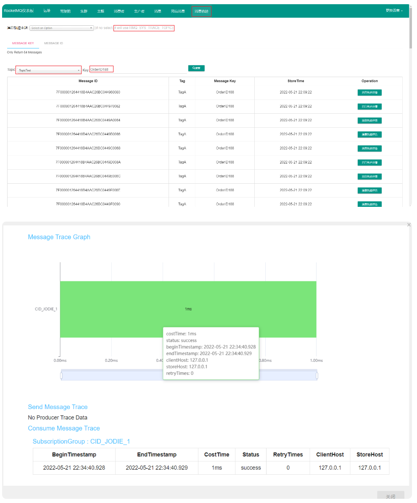
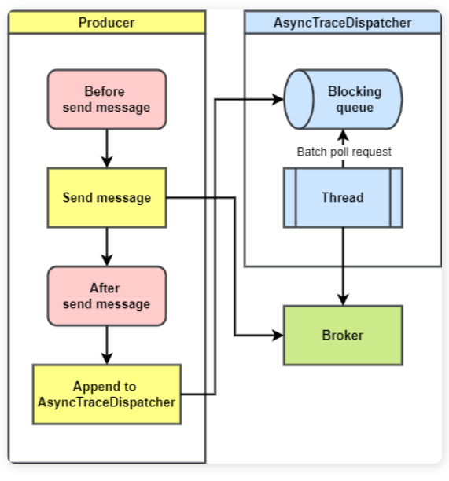

## 消息轨迹

### 背景

发往消息队列中的消息存在一些可观测性上的问题。由于消息队列需要高性能、大量地处理消息，而在 Broker 端记录消息的方式（使用日志等）势必会对性能造成非常大的损耗，所以对于消息是否成功发送到 Broker、Broker 又是否成功将消息投递给消费者这些动作，缺乏观测手段。这样就会造成生产方和消费方互相“扯皮”的现象：一条消息没有被成功消费，到底是生产方没有发送，还是消费方没有消费成功。

RocketMQ 在 4.4.0 版本正式引入了消息轨迹功能，它可以用来记录消息发送、消息消费的信息，详细记录消息各个处理环节的日志

### 示例

要使用消息轨迹，在 Broker 端和客户端都需要进行一些配置

rocketmq-spring 开启消息轨迹的文档

**物理 IO 隔离模式**

对于消息轨迹数据量较大的场景，可以在RocketMQ集群中选择其中一个Broker节点专用于存储消息轨迹，使得用户普通的消息数据与消息轨迹数据的物理IO完全隔离，互不影响。在该模式下，RockeMQ集群中至少有两个Broker节点，其中一个Broker节点定义为存储消息轨迹数据的服务端；

#### Broker 端配置

在 broker.conf 中启用消息轨迹功能，该功能默认关闭。

```
### if msg tracing is open,the flag will be true
traceTopicEnable=true
```

注意需要重启 Broker 才可以应用改动。

####  生产者开启

```
// 构建生产者。第二个参数即启用消息轨迹，第三个参数（可选）可以指定保存消息轨迹的 Topic
DefaultMQProducer producer = new DefaultMQProducer("ProducerGroupName", true);  
producer.setNamesrvAddr("XX.XX.XX.XX1");
producer.start();
try {
    {
        // 建议为消息指定 Key，便于对消息进行高性能查询。这里的 OrderID188 即消息的 Key
        Message msg = new Message("TopicTest",
            "TagA",
            "OrderID188",
            "Hello world".getBytes(RemotingHelper.DEFAULT_CHARSET));
        SendResult sendResult = producer.send(msg);
        System.out.printf("%s%n", sendResult);
    }
} catch (Exception e) {
    e.printStackTrace();
}

```

#### 消费者开启

```
// 构建消费者。第二个参数即启用消息轨迹，第三个参数（可选）可以指定保存消息轨迹的 Topic
DefaultMQPushConsumer consumer = new DefaultMQPushConsumer("CID_JODIE_1", true);
consumer.subscribe("TopicTest", "*");
consumer.setConsumeFromWhere(ConsumeFromWhere.CONSUME_FROM_FIRST_OFFSET);
consumer.setConsumeTimestamp("20181109221800");
consumer.registerMessageListener(new MessageListenerConcurrently() {
    @Override
    public ConsumeConcurrentlyStatus consumeMessage(List<MessageExt> msgs, ConsumeConcurrentlyContext context) {
        System.out.printf("%s Receive New Messages: %s %n", Thread.currentThread().getName(), msgs);
        return ConsumeConcurrentlyStatus.CONSUME_SUCCESS;
    }
});
consumer.start();
System.out.printf("Consumer Started.%n");

```

#### mqadmin查看

* 查询轨迹

  ```
  ./mqadmin QueryMsgTraceById -n 127.0.0.1:9876 -i "message-id"
  ```

* 查询轨迹结果

  ```
  RocketMQLog:WARN No appenders could be found for logger (io.netty.util.internal.PlatformDependent0).
  RocketMQLog:WARN Please initialize the logger system properly.
  #Type      #ProducerGroup       #ClientHost          #SendTime            #CostTimes #Status
  Pub        1623305799667        xxx.xxx.xxx.xxx       2021-06-10 14:16:40  131ms      success
  ```

#### rocketmq-dashboard

RocketMQ 的官方 DashBoard 支持消息轨迹的查询

 

### 整体设计思路

在设计消息轨迹功能时，能想到的要点主要有如下几点

- 如何采集轨迹数据
- 采集的轨迹数据要包含哪些数据
- 如何存储轨迹数据
- 如何将轨迹数据发送至存储，而尽可能不影响正常消息发送的性能

首先是如何采集数据。消息轨迹关注是否被生产和消费，以及消息生产、消费相关的数据，所以需要在消息生产和消费时采集一些数据。

RocketMQ 提供了消息生产和消费的钩子，可以在消息生产、消费前后添加自定义的逻辑，于是轨迹数据的采集可以放在钩子函数中进行。

对于消息的存储，处于不添加额外依赖的考虑，存储在 Broker 是最佳的选择。消息轨迹的数据可以封装成消息，与普通消息公用存储，存在 Broker 中。

那么如何在发送普通消息的同时发送消息轨迹消息？为了保证普通消息发送的性能，势必使用异步发送。此外，由于消息轨迹数据没有普通消息那样强的实时性要求，所以可以通过批量发送的方式减少性能损耗

#### 主要流程

 

这里以生产者为例，生产者在发送消息前后的钩子函数中分别添加消息轨迹采集逻辑，随后将轨迹信息交给一个异步线程池处理。

这个异步线程池批量将轨迹信息打包发送给 Broker，完成消息轨迹的保存

#### 存储设计

默认情况下，消息轨迹保存在一个默认的 Topic 中，`RMQ_SYS_TRACE_TOPIC`，这个 Topic 只有一个队列，所以只会存在一个 Broker。在使用时可以在生产者和消费者上指定消息轨迹发送的自定义 Topic。

官方将消息轨迹存储的模式分为两种：普通模式和物理 IO 隔离模式。

- 普通模式即集群中每个 Broker 都可以存储消息轨迹数据。
- 物理 IO 隔离模式即单独选一个 Broker 只作为消息轨迹接收的节点，这样就不会增加其他 Broker 的负载。

### 详细设计

#### 轨迹数据采集

前面说到，采集消息轨迹数据的最佳方法就是在发送和消费时在钩子函数中进行。

所以如果客户端创建时开启了消息轨迹功能，那么将新建处理轨迹的钩子，注册到生产者或消费者实例中去。

生产者的钩子类是 `SendMessageTraceHookImpl`，消费者的钩子类是 `ConsumeMessageTraceHookImpl`。

在 before 方法中，会构建一个轨迹上下文，将数据采集到该上下文中。

在 after 方法中，采集数据并将该上下文信息交给轨迹数据异步发送线程池 `AsyncTraceDispatcher` 处理，将会保存到一个 BlockingQueue 中由工作线程消费

#### 轨迹数据发送

发送逻辑采用生产-消费模式，由 `AsyncTraceDispatcher`处理。 一个工作线程负责消费客户端实例提交过来的轨迹数据。

工作线程每次消费一批轨迹数据，将轨迹数据打包后提交给发送线程池。发送线程池将这些轨迹消息发送给指定的 Broker

### 源码解析

#### 消息轨迹数据模型

消息轨迹的模型类是 `TraceContext`，其中的 `traceBeans` 列表保存着具体消息的轨迹信息。

该列表在消息生产时永远只有 1 条数据，即生产发送的消息。

在消费时可能由多条数据，因为消费者每次会消费多条消息。

```
/**
 * The context of Trace
 */
public class TraceContext implements Comparable<TraceContext> {

    // 轨迹类型。Pub：消息发送，SubBefore：消费者消费前，SubAfter：消费者消费后
    private TraceType traceType;
    // 时间戳
    private long timeStamp = System.currentTimeMillis();
    // Broker 所在区域 ID，取自 BrokerConfig#regionId
    private String regionId = "";
    private String regionName = "";
    // 生产者或消费者组名称
    private String groupName = "";
    // 耗时
    private int costTime = 0;
    // 发送/消费成功
    private boolean isSuccess = true;
    // 在消费时使用，消费端的请求 ID
    private String requestId = MessageClientIDSetter.createUniqID();
    // 消费状态码
    private int contextCode = 0;
    // 消息的轨迹数据
    private List<TraceBean> traceBeans;
}

```

```
public class TraceBean {
    private static final String LOCAL_ADDRESS = UtilAll.ipToIPv4Str(UtilAll.getIP());
    private String topic = "";
    private String msgId = "";
    // 消息偏移量 ID，包含了 Broker 的 IP 和消息存储在 Broker 上的偏移量
    private String offsetMsgId = "";
    private String tags = "";
    private String keys = "";
    // 生产者采集时为 Broker 的 IP，消费者采集时为消费者 IP
    private String storeHost = LOCAL_ADDRESS;
    // 客户端 IP。生产者采集时为生产者的 IP，消费者采集时为消费者 IP
    private String clientHost = LOCAL_ADDRESS;
    // 存储时间
    private long storeTime;
    private int retryTimes;
    // 消息体长度
    private int bodyLength;
    // 消息类型
    private MessageType msgType;
    private LocalTransactionState transactionState;
    private String transactionId;
    private boolean fromTransactionCheck;
}
```

#### 消息轨迹数据采集

这里以消费者为例

* 注册消息轨迹采集钩子

  ```
  public DefaultMQPushConsumer(final String namespace, final String consumerGroup, RPCHook rpcHook,
                               AllocateMessageQueueStrategy allocateMessageQueueStrategy, boolean enableMsgTrace, final String customizedTraceTopic) {
      this.consumerGroup = consumerGroup;
      this.namespace = namespace;
      this.allocateMessageQueueStrategy = allocateMessageQueueStrategy;
      defaultMQPushConsumerImpl = new DefaultMQPushConsumerImpl(this, rpcHook);
      // 如果开启消息轨迹
      if (enableMsgTrace) {
          try {
              // 创建消息轨迹异步发送者
              AsyncTraceDispatcher dispatcher = new AsyncTraceDispatcher(consumerGroup, TraceDispatcher.Type.CONSUME, customizedTraceTopic, rpcHook);
              dispatcher.setHostConsumer(this.getDefaultMQPushConsumerImpl());
              traceDispatcher = dispatcher;
              // 注册消息轨迹采集钩子
              this.getDefaultMQPushConsumerImpl().registerConsumeMessageHook(
                  new ConsumeMessageTraceHookImpl(traceDispatcher));
          } catch (Throwable e) {
              log.error("system mqtrace hook init failed ,maybe can't send msg trace data");
          }
      }
  }
  
  ```

* 钩子方法中采集消息轨迹数据

  ```
  // ConsumeMessageTraceHookImpl.java
  /**
   * 消息消费前调用
   * 收集将要消费消息的轨迹信息，存入调用上下文
   *
   * @param context
   */
  @Override
  public void consumeMessageBefore(ConsumeMessageContext context) {
      if (context == null || context.getMsgList() == null || context.getMsgList().isEmpty()) {
          return;
      }
      // 创建消息轨迹上下文
      TraceContext traceContext = new TraceContext();
      context.setMqTraceContext(traceContext);
      // 设置消息轨迹类型
      traceContext.setTraceType(TraceType.SubBefore);//
      // 设置消费组名
      traceContext.setGroupName(NamespaceUtil.withoutNamespace(context.getConsumerGroup()));//
      // 将消费到的消息构建 TraceBean 列表，采集每条消息的轨迹数据
      List<TraceBean> beans = new ArrayList<TraceBean>();
      for (MessageExt msg : context.getMsgList()) {
          if (msg == null) {
              continue;
          }
          String regionId = msg.getProperty(MessageConst.PROPERTY_MSG_REGION);
          String traceOn = msg.getProperty(MessageConst.PROPERTY_TRACE_SWITCH);
  
          if (traceOn != null && traceOn.equals("false")) {
              // If trace switch is false ,skip it
              continue;
          }
          TraceBean traceBean = new TraceBean();
          traceBean.setTopic(NamespaceUtil.withoutNamespace(msg.getTopic()));//
          traceBean.setMsgId(msg.getMsgId());//
          traceBean.setTags(msg.getTags());//
          traceBean.setKeys(msg.getKeys());//
          traceBean.setStoreTime(msg.getStoreTimestamp());//
          traceBean.setBodyLength(msg.getStoreSize());//
          traceBean.setRetryTimes(msg.getReconsumeTimes());//
          traceContext.setRegionId(regionId);//
          beans.add(traceBean);
      }
      // 将消息轨迹交给异步发送者处理
      if (beans.size() > 0) {
          traceContext.setTraceBeans(beans);
          traceContext.setTimeStamp(System.currentTimeMillis());
          localDispatcher.append(traceContext);
      }
  }
  
  /**
   * 消息消费后调用
   * 采集消费完成的消息轨迹数据，存入轨迹上下文，然后发送
   *
   * @param context
   */
  @Override
  public void consumeMessageAfter(ConsumeMessageContext context) {
      if (context == null || context.getMsgList() == null || context.getMsgList().isEmpty()) {
          return;
      }
      // 从轨迹上下文获取消费前的轨迹数据
      TraceContext subBeforeContext = (TraceContext) context.getMqTraceContext();
  
      if (subBeforeContext.getTraceBeans() == null || subBeforeContext.getTraceBeans().size() < 1) {
          // If subBefore bean is null ,skip it
          return;
      }
      // 构建消费后的轨迹数据
      TraceContext subAfterContext = new TraceContext();
      subAfterContext.setTraceType(TraceType.SubAfter);//
      subAfterContext.setRegionId(subBeforeContext.getRegionId());//
      subAfterContext.setGroupName(NamespaceUtil.withoutNamespace(subBeforeContext.getGroupName()));//
      subAfterContext.setRequestId(subBeforeContext.getRequestId());//
      subAfterContext.setSuccess(context.isSuccess());//
  
      // Calculate the cost time for processing messages
      int costTime = (int) ((System.currentTimeMillis() - subBeforeContext.getTimeStamp()) / context.getMsgList().size());
      subAfterContext.setCostTime(costTime);//
      subAfterContext.setTraceBeans(subBeforeContext.getTraceBeans());
      Map<String, String> props = context.getProps();
      if (props != null) {
          String contextType = props.get(MixAll.CONSUME_CONTEXT_TYPE);
          if (contextType != null) {
              subAfterContext.setContextCode(ConsumeReturnType.valueOf(contextType).ordinal());
          }
      }
      // 发给异步发送者处理
      localDispatcher.append(subAfterContext);
  }
  
  ```

#### 消息轨迹数据发送

​	`AsyncTraceDispatcher` 是专门用来异步发送轨迹消息的异步转发器，负责消息轨迹消息的转发。前面说到消息轨迹数据也以消息的形式发送到 Broker 中进行存储。

​	`AsyncTraceDispatcher` 中有 1 个线程池 `traceExecutor`，负责异步发送轨迹数据，消息生产者 `traceProducer` 处理生产逻辑，1 个工作线程 `worker` 负责将 客户端采集到的轨迹上下文提交给线程池处理；

```
/**
 * 消息轨迹异步转发器，异步实现消息轨迹数据的发送
 */
public class AsyncTraceDispatcher implements TraceDispatcher {
    // 异步转发队列长度，默认 2048
    private final int queueSize;
    // 一次发送的请求包含数据条数，默认 100
    private final int batchSize;
    // 一次发送最大消息大小，默认 128k
    private final int maxMsgSize;
    // 发送消息轨迹的消息生产者
    private final DefaultMQProducer traceProducer;
    // 异步发送线程池
    private final ThreadPoolExecutor traceExecutor;
    // 丢弃的消息个数
    // The last discard number of log
    private AtomicLong discardCount;
    // 工作线程，从追加队列中获取一批待发送的消息轨迹数据，提交到线程池中执行
    private Thread worker;
    // 消息轨迹待发送数据队列，存储每个消息轨迹的上下文
    private final ArrayBlockingQueue<TraceContext> traceContextQueue;
    // 线程池内部队列，存储线程池发送任务
    private ArrayBlockingQueue<Runnable> appenderQueue;
    private volatile Thread shutDownHook;
    private volatile boolean stopped = false;
    private DefaultMQProducerImpl hostProducer;
    // 消费者信息，记录消费时的轨迹
    private DefaultMQPushConsumerImpl hostConsumer;
    private volatile ThreadLocalIndex sendWhichQueue = new ThreadLocalIndex();
    private String dispatcherId = UUID.randomUUID().toString();
    // 消息轨迹存放的 Topic
    private String traceTopicName;
    private AtomicBoolean isStarted = new AtomicBoolean(false);
    private AccessChannel accessChannel = AccessChannel.LOCAL;
    private String group;
    private Type type;
}

```

worker 工作线程用一个死循环，不停地尝试从消息轨迹队列中获取一批数据，封装成一个发送任务提交给消息发送线程池处理

```
/**
 * 批量从待处理消息轨迹队列中取数据，封装成一个 {@link AsyncAppenderRequest} 异步发送请求，提交给发送线程池执行
 * 批量发送机制是为了提高效率
 */
class AsyncRunnable implements Runnable {
    private boolean stopped;

    @Override
    public void run() {
        while (!stopped) {
            List<TraceContext> contexts = new ArrayList<TraceContext>(batchSize);
            // 批量从等待处理的消息轨迹队列中获取数据，将一批数据封装成一个发送请求，提交给异步发送线程池执行
            synchronized (traceContextQueue) {
                for (int i = 0; i < batchSize; i++) {
                    TraceContext context = null;
                    try {
                        //get trace data element from blocking Queue - traceContextQueue
                        context = traceContextQueue.poll(5, TimeUnit.MILLISECONDS);
                    } catch (InterruptedException e) {
                    }
                    if (context != null) {
                        contexts.add(context);
                    } else {
                        break;
                    }
                }
                if (contexts.size() > 0) {
                    AsyncAppenderRequest request = new AsyncAppenderRequest(contexts);
                    traceExecutor.submit(request);
                } else if (AsyncTraceDispatcher.this.stopped) {
                    // 同步 AsyncTraceDispatcher 的停止状态
                    this.stopped = true;
                }
            }
        }
    }
}

```

而真正的发送逻辑则在 `AsyncAppenderRequest#run()` 中执行的 `sendTraceData` 方法中执行

```
/**
 * 一次发送一批消息轨迹数据
 *
 * @param contextList 消息轨迹数据列表，本次要发送的数据
 */
public void sendTraceData(List<TraceContext> contextList) {
    // 按 Topic 区分的消息轨迹数据表
    Map<String, List<TraceTransferBean>> transBeanMap = new HashMap<String, List<TraceTransferBean>>();
    for (TraceContext context : contextList) {
        if (context.getTraceBeans().isEmpty()) {
            continue;
        }
        // Topic value corresponding to original message entity content
        String topic = context.getTraceBeans().get(0).getTopic();
        String regionId = context.getRegionId();
        // 用原 Topic 和 regionId 组成 key
        // Use  original message entity's topic as key
        String key = topic;
        if (!StringUtils.isBlank(regionId)) {
            key = key + TraceConstants.CONTENT_SPLITOR + regionId;
        }
        // 根据 Key 将消息轨迹数据分类，存入 map
        List<TraceTransferBean> transBeanList = transBeanMap.get(key);
        if (transBeanList == null) {
            transBeanList = new ArrayList<TraceTransferBean>();
            transBeanMap.put(key, transBeanList);
        }
        // 按消息轨迹存储协议进行编码，当前为字符串拼接模式
        TraceTransferBean traceData = TraceDataEncoder.encoderFromContextBean(context);
        transBeanList.add(traceData);
    }
    // 按 Topic 分批将消息发送到 Broker 中
    for (Map.Entry<String, List<TraceTransferBean>> entry : transBeanMap.entrySet()) {
        String[] key = entry.getKey().split(String.valueOf(TraceConstants.CONTENT_SPLITOR));
        String dataTopic = entry.getKey();
        String regionId = null;
        if (key.length > 1) {
            dataTopic = key[0];
            regionId = key[1];
        }
        flushData(entry.getValue(), dataTopic, regionId);
    }
}

```

