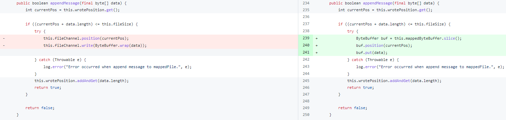

## 4.9.1性能优化

### 事务消息日志优化

默认的配置下每条消息都会打出一条日志，改动主要移除了事务消息中的日志打印。


```java
while (true) {
    if (System.currentTimeMillis() - startTime > MAX_PROCESS_TIME_LIMIT) {
        log.info("Queue={} process time reach max={}", messageQueue, MAX_PROCESS_TIME_LIMIT);
        break;
    }
    if (removeMap.containsKey(i)) {
        log.~~info~~("Half offset {} has been committed/rolled back", i);
        Long removedOpOffset = removeMap.remove(i);
        doneOpOffset.add(removedOpOffset);
}
```

这个优化比较简单，从这当中可以学到的是在打印日志时需要谨慎，尤其是对于 RocketMQ 这种高性能中间件来说，日志的打印可能会占用较多 CPU 资源。

此外，如果日志中涉及字符串拼接等操作，消耗会更大，应当避免

### 主从复制和同步刷锁的优化/移除

#### 前置背景

主从复制和同步刷盘中的生产消费模式

在 RocketMQ 内部，主从复制和同步刷盘都是多线程协作处理的。以主从复制为例（`GroupTransferService`），消息处理线程（多个）不断接收消息，产生待复制的消息，另外有一个 `ServiceThread` 单线程处理复制结果，可以把前者看做数据生产者，后者看做数据消费者，RocketMQ 使用了双 Buffer 来达到批量处理的目的。

如下图，消费者正在处理数据的同时，生产者可以不受影响的继续添加数据，第一阶段生产者 Buffer 有 3 条数据，消费者 Buffer 有 2 条数据，由于消费者是单线程，没有别的线程跟它竞争，所以它可以批量处理这 2 条数据，完成后它会交换这两个 Buffer 的引用，于是接下来的第二阶段它又可以批量处理 3 条数据。

 

#### 优化1

主从复制和同步刷盘中重量级锁synchronized改为自旋锁

之前 RocketMQ 在生产者写入 `putRequest()` 、交换 Buffer 引用 `swapRequests()` 、以及内部处理中都使用了重量级锁`synchronized`保证线程安全。

实际 `putRequest()` 方法中只做了添加数据到列表的操作；`swapRequests()` 中做了交换操作，耗时都较小，故可以换成自旋锁。每次加解锁都**只有 2 次 CAS 操作的开销，而不发生线程切换**

 

```
public class PutMessageSpinLock implements PutMessageLock {
    //true: Can lock, false : in lock.
    private AtomicBoolean putMessageSpinLock = new AtomicBoolean(true);

    @Override
    public void lock() {
        boolean flag;
        do {
            flag = this.putMessageSpinLock.compareAndSet(true, false);
        }
        while (!flag);
    }

    @Override
    public void unlock() {
        this.putMessageSpinLock.compareAndSet(false, true);
    }
}
```

#### 优化2

WaitNotifyObject 类

`WaitNotifyObject` 被用于做线程之间的异步通知。在主从复制逻辑中被用到。用法类似 `synchronized` 的 `wait()` 和 `nofityAll()`，等待-通知机制。

主从复制线程循环传输数据，如果没有数据则调用 `WaitNotifyObject#allWaitForRunning()` 方法等待。

在CommitLog保存消息之后，调用 `WaitNotifyObject#wakeUpAll()` 方法唤醒主从复制线程。

本次优化减少了需要进入同步代码块的次数。

修改点：`waitingThreadTable` 改为 `ConcurrentHashMap`，然后可以将 `waitingThreadTable` 移出同步代码块。volatile boolean hasNotified` 改为 `AtomicBoolean hasNotified

 

### 消除主从复制中不必要的数组拷贝

#### 前置知识-内存映射文件mmap

RocketMQ 的 CommitLog 是内存映射文件（mmap）。下面这张图对比了普通 IO 和内存映射 IO 之间的区别

 

mmap 将文件直接映射到用户内存，使得对文件的操作不用再需要拷贝到PageCache，而是转化为对映射地址映射的PageCache的操作，使随机读写文件和读写内存拥有相似的速度（随机地址被映射到了内存）

#### 前置知识-主从复制

RocketMQ 主从复制机制会在消息写入 CommitLog 之后，Master Broker 将消息发送到 Slave，达到消息不丢失。

本次修改点是在主从复制的 Slave 处理过程当中。HAClient 是 Slave 连接 Master 的实现类。

`HAClient#run()` 方法做了以下这些事：

- salve连接到master，向master上报slave当前的offset
- master收到后确认给slave发送数据的开始位置
- master查询开始位置对应的MappedFIle
- master将查找到的数据发送给slave
- slave收到数据后保存到自己的CommitLog

其中4、5步，Slave 接收到的数据存在一个 ByteBuffer 里面，把它保存到 CommitLog 的时候，原来的代码会新建一个字节数组，然后把读到的 ByteBuffer 里的数据拷贝进去

#### 优化：减少字节数组拷贝

原先在主从复制逻辑中的数组拷贝步骤其实是可以省略的，可以直接把从 Master 读到的 ByteBuffer 传到写 CommitLog 的方法中，并且一并传入数据的开始位置和长度，这样就可以在不重新复制字节数组的情况下传递 ByteBuffer 中的数据

 

### 移除 CommitLog 重复代码的

移除 CommitLog 中包含重复代码的 putMessage/putMessages 方法

该优化主要是减少冗余代码

原本 CommitLog 中有如下这些保存消息的方法

- putMessage：同步保存单条消息
- asyncPutMessage：异步保存单条消息
- putMessages：同步保存批量消息
- asyncPutMessages：异步保存批量消息

其实同步保存和异步保存消息的逻辑差不多，但是原本并没有复用代码，而是每个方法都单独实现。这就导致同步和异步方法存在大量重复代码。

这个 Patch 合并了 putMessage & asyncPutMessage 、putMessages & asyncPutMessages 方法，在同步方法中调用异步方法的等待方法，删除了大量重复代码。

 

 

### 调整参数的默认值

#### 消息保存/发送参数优化

RocketMQ在保存消息时，由于要保证消息保存到 CommitLog 中是顺序的，写 CommitLog 只能单线程操作，写之前要先获取一个锁，这个锁也就是影响 RocketMQ 性能最关键的一个锁。

最早之前 3.2.X 版本这个锁是 synchronized，从 RocketMQ4.X 开始引入了自旋锁并作为默认值，同时将参数 `sendMessageThreadPoolNums`（处理Client端发送消息线程池的线程数）改为了 1，这样处理每条消息写 CommitLog 的时候是一个线程在写，可以省下进出重量锁的开销。

不过这个地方单线程处理，任务有点重，处理消息的逻辑并不是往 CommitLog 里面一写（无法并行）就完事的，还有一些 CPU 开销比较大的工作，多线程处理比较好，经过一些实践测试，4 个线程是比较合理的数值，因此这个参数默认值改为 `MIN(逻辑处理器数, 4)`。

既然有 4 个线程，还用自旋锁可能就不合适了，因为拿不到锁的线程会让 CPU 白白空转。所以改用可重入锁，`useReentrantLockWhenPutMessage` 参数还是改为 true 比较好。

#### 事务消息二阶段处理线程大小

`endTransactionThreadPoolNums` 是事务消息二阶段处理线程大小，`sendMessageThreadPoolNums` 则指定一阶段处理线程池大小。如果二阶段的处理速度跟不上一阶段，就会造成二阶段消息丢失导致大量回查，所以建议 `endTransactionThreadPoolNums` 应该大于 `sendMessageThreadPoolNums`，建议至少 4 倍

#### 开启定时刷盘

`flushCommitLogTimed` 参数表示是否定时刷盘，之前默认为 false，表示实时刷盘。

本次对刷盘相关的参数也进行了调整。默认情况下，RocketMQ 是异步刷盘，但每次处理消息都会触发一个异步的刷盘请求。这次将 `flushCommitLogTimed` 这个参数改成 true，也就是定时刷盘（默认每 500ms），可以大幅降低对 IO 压力，在主从同步复制的场景下，可靠性也不会降低

### **优化 putMessage 锁内操作**

CommitLog 是 RocketMQ 消息存储文件。单个 Broker 上所有消息都顺序保存在 CommitLog 中。

写 CommitLog 只能单线程操作，写之前要先获取一个锁，这个锁也就是影响 RocketMQ 性能最关键的一个锁。

理论上这里只要往 MappedByteBuffer 写一下就好了，但实践往往要比理论复杂得多，因为各种原因，这个锁里面干的事情非常的多。

由于当前代码的复杂性，这个优化是本批次修改里面改动最大的，但它的逻辑其实很简单，就是把锁内干的事情，尽量的放到锁的外面去做，能先准备好的数据就先准备好。它包括了以下改动：

- 将 Buffer 的大部分准备工作（编码工作）放到了锁外，提前做好。
- 将 MessageId 的做成了懒初始化（放到锁外），这个消息 ID 的生成涉及很多编解码和数据复制工作，实际上性能开销相当大。
- 原来锁内用来查位点哈希表的 Key 是个拼接出来的字符串，这次也改到锁外先生成好。
- 顺便补上了之前遗漏的关于 IPv6 的处理。
- 删除了无用的代码

#### 优化 asyncPutMessage 性能，将准备工作放到锁外

先看一下代码上的改动，右边绿色新增的代码是原先在锁中的操作，现在都移动到了锁外面

 

右边新增的的 `putMessageThreadLocal.getEncode().encode(msg)` 完成了大量预操作，将原先 `CommitLog#DefaultAppendMessageCallback#doAppend()` 方法中的操作移动到了锁外。

下面的代码第一份是修改前的，doAppend() 方法是锁内操作；第二份是修改后的，encode() 方法抽到了加锁之前

```
// CommitLog.java 修改前
public AppendMessageResult doAppend(final long fileFromOffset, final ByteBuffer byteBuffer, final int maxBlank,
            final MessageExtBrokerInner msgInner) {
    // ...
    /**
     * Serialize message
     */
    final byte[] propertiesData =
        msgInner.getPropertiesString() == null ? null : msgInner.getPropertiesString().getBytes(MessageDecoder.CHARSET_UTF8);

    final int propertiesLength = propertiesData == null ? 0 : propertiesData.length;

    if (propertiesLength > Short.MAX_VALUE) {
        log.warn("putMessage message properties length too long. length={}", propertiesData.length);
        return new AppendMessageResult(AppendMessageStatus.PROPERTIES_SIZE_EXCEEDED);
    }

    final byte[] topicData = msgInner.getTopic().getBytes(MessageDecoder.CHARSET_UTF8);
    final int topicLength = topicData.length;

    final int bodyLength = msgInner.getBody() == null ? 0 : msgInner.getBody().length;

    final int msgLen = calMsgLength(msgInner.getSysFlag(), bodyLength, topicLength, propertiesLength);

    // Exceeds the maximum message
    if (msgLen > this.maxMessageSize) {
        CommitLog.log.warn("message size exceeded, msg total size: " + msgLen + ", msg body size: " + bodyLength
            + ", maxMessageSize: " + this.maxMessageSize);
        return new AppendMessageResult(AppendMessageStatus.MESSAGE_SIZE_EXCEEDED);
    }

    // ... Determines whether there is sufficient free space

		// Initialization of storage space
            this.resetByteBuffer(msgStoreItemMemory, msgLen);
            // 1 TOTALSIZE
            this.msgStoreItemMemory.putInt(msgLen);
            // 2 MAGICCODE
            this.msgStoreItemMemory.putInt(CommitLog.MESSAGE_MAGIC_CODE);
            // 3 BODYCRC
            this.msgStoreItemMemory.putInt(msgInner.getBodyCRC());
            // 4 QUEUEID
            this.msgStoreItemMemory.putInt(msgInner.getQueueId());
            // 5 FLAG
            this.msgStoreItemMemory.putInt(msgInner.getFlag());
            // 6 QUEUEOFFSET
            this.msgStoreItemMemory.putLong(queueOffset);
            // 7 PHYSICALOFFSET
            this.msgStoreItemMemory.putLong(fileFromOffset + byteBuffer.position());
            // 8 SYSFLAG
            this.msgStoreItemMemory.putInt(msgInner.getSysFlag());
            // 9 BORNTIMESTAMP
            this.msgStoreItemMemory.putLong(msgInner.getBornTimestamp());
            // 10 BORNHOST
            this.resetByteBuffer(bornHostHolder, bornHostLength);
            this.msgStoreItemMemory.put(msgInner.getBornHostBytes(bornHostHolder));
            // 11 STORETIMESTAMP
            this.msgStoreItemMemory.putLong(msgInner.getStoreTimestamp());
            // 12 STOREHOSTADDRESS
            this.resetByteBuffer(storeHostHolder, storeHostLength);
            this.msgStoreItemMemory.put(msgInner.getStoreHostBytes(storeHostHolder));
            // 13 RECONSUMETIMES
            this.msgStoreItemMemory.putInt(msgInner.getReconsumeTimes());
            // 14 Prepared Transaction Offset
            this.msgStoreItemMemory.putLong(msgInner.getPreparedTransactionOffset());
            // 15 BODY
            this.msgStoreItemMemory.putInt(bodyLength);
            if (bodyLength > 0)
                this.msgStoreItemMemory.put(msgInner.getBody());
            // 16 TOPIC
            this.msgStoreItemMemory.put((byte) topicLength);
            this.msgStoreItemMemory.put(topicData);
            // 17 PROPERTIES
            this.msgStoreItemMemory.putShort((short) propertiesLength);
            if (propertiesLength > 0)
                this.msgStoreItemMemory.put(propertiesData);

```

```
// CommitLog.java 修改后
protected PutMessageResult encode(MessageExtBrokerInner msgInner) {
    /**
     * Serialize message
     */
    final byte[] propertiesData =
            msgInner.getPropertiesString() == null ? null : msgInner.getPropertiesString().getBytes(MessageDecoder.CHARSET_UTF8);

    final int propertiesLength = propertiesData == null ? 0 : propertiesData.length;

    if (propertiesLength > Short.MAX_VALUE) {
        log.warn("putMessage message properties length too long. length={}", propertiesData.length);
        return new PutMessageResult(PutMessageStatus.PROPERTIES_SIZE_EXCEEDED, null);
    }

    final byte[] topicData = msgInner.getTopic().getBytes(MessageDecoder.CHARSET_UTF8);
    final int topicLength = topicData.length;

    final int bodyLength = msgInner.getBody() == null ? 0 : msgInner.getBody().length;

    final int msgLen = calMsgLength(msgInner.getSysFlag(), bodyLength, topicLength, propertiesLength);

    // Exceeds the maximum message
    if (msgLen > this.maxMessageSize) {
        CommitLog.log.warn("message size exceeded, msg total size: " + msgLen + ", msg body size: " + bodyLength
                + ", maxMessageSize: " + this.maxMessageSize);
        return new PutMessageResult(PutMessageStatus.MESSAGE_ILLEGAL, null);
    }

    // Initialization of storage space
    this.resetByteBuffer(encoderBuffer, msgLen);
    // 1 TOTALSIZE
    this.encoderBuffer.putInt(msgLen);
    // 2 MAGICCODE
            this.encoderBuffer.putInt(CommitLog.MESSAGE_MAGIC_CODE);
            // 3 BODYCRC
            this.encoderBuffer.putInt(msgInner.getBodyCRC());
            // 4 QUEUEID
            this.encoderBuffer.putInt(msgInner.getQueueId());
            // 5 FLAG
            this.encoderBuffer.putInt(msgInner.getFlag());
            // 6 QUEUEOFFSET, need update later
            this.encoderBuffer.putLong(0);
            // 7 PHYSICALOFFSET, need update later
            this.encoderBuffer.putLong(0);
            // 8 SYSFLAG
            this.encoderBuffer.putInt(msgInner.getSysFlag());
            // 9 BORNTIMESTAMP
            this.encoderBuffer.putLong(msgInner.getBornTimestamp());
            // 10 BORNHOST
            socketAddress2ByteBuffer(msgInner.getBornHost() ,this.encoderBuffer);
            // 11 STORETIMESTAMP
            this.encoderBuffer.putLong(msgInner.getStoreTimestamp());
            // 12 STOREHOSTADDRESS
            socketAddress2ByteBuffer(msgInner.getStoreHost() ,this.encoderBuffer);
            // 13 RECONSUMETIMES
            this.encoderBuffer.putInt(msgInner.getReconsumeTimes());
            // 14 Prepared Transaction Offset
            this.encoderBuffer.putLong(msgInner.getPreparedTransactionOffset());
            // 15 BODY
            this.encoderBuffer.putInt(bodyLength);
            if (bodyLength > 0)
                this.encoderBuffer.put(msgInner.getBody());
            // 16 TOPIC
            this.encoderBuffer.put((byte) topicLength);
            this.encoderBuffer.put(topicData);
            // 17 PROPERTIES
            this.encoderBuffer.putShort((short) propertiesLength);
            if (propertiesLength > 0)
                this.encoderBuffer.put(propertiesData);

            encoderBuffer.flip();
            return null;
        }

```

然后把预编码的数据放到 `MessageExtBrokerInner` 中的 `private ByteBuffer encodedBuff` 字段，传到 `doAppend()` 方法中使用

 

#### **MessageId 懒加载**

使用函数式接口 `Supplier`，将 MessageId 计算的逻辑放到 `Supplier` 中。创建结果对象时将 `Supplier` 传入，而不是直接计算 MessageId。

当结果的 `getMsgId()` 方法被调用，才会执行 `Supplier` 中 MessageId 的计算方法

```
// CommitLog#DefaultAppendMessageCallback
public AppendMessageResult doAppend(final long fileFromOffset, final ByteBuffer byteBuffer, final int maxBlank,
    final MessageExtBrokerInner msgInner, PutMessageContext putMessageContext) {
    // STORETIMESTAMP + STOREHOSTADDRESS + OFFSET <br>

    // PHY OFFSET
    long wroteOffset = fileFromOffset + byteBuffer.position();

    Supplier<String> msgIdSupplier = () -> {
        int sysflag = msgInner.getSysFlag();
        int msgIdLen = (sysflag & MessageSysFlag.STOREHOSTADDRESS_V6_FLAG) == 0 ? 4 + 4 + 8 : 16 + 4 + 8;
        ByteBuffer msgIdBuffer = ByteBuffer.allocate(msgIdLen);
        MessageExt.socketAddress2ByteBuffer(msgInner.getStoreHost(), msgIdBuffer);
        msgIdBuffer.clear();//because socketAddress2ByteBuffer flip the buffer
        msgIdBuffer.putLong(msgIdLen - 8, wroteOffset);
        return UtilAll.bytes2string(msgIdBuffer.array());
    };
    // ...
    AppendMessageResult result = new AppendMessageResult(AppendMessageStatus.PUT_OK, wroteOffset, msgLen, msgIdSupplier,
                msgInner.getStoreTimestamp(), queueOffset, CommitLog.this.defaultMessageStore.now() - beginTimeMills);
    // ...
    return result;
}

```

```
// AppendMessageResult.java
public String getMsgId() {
    // msgId懒加载
    if (msgId == null && msgIdSupplier != null) {
        msgId = msgIdSupplier.get();
    }
    return msgId;
}

```

### 优化**消息 Header 解析的性能**

#### 去除字符串末尾占位符，节省消息传输大小

优化字符串格式的属性存储。RocketMQ 在消息传输时用字符串存储一个 Map，接受消息后再解析成Map。

字符串采用这种格式存储 Map：

```
key1\u0001value1\u0002key2\u0001value2\u0002
```

 

该 Patch 优化掉了字符串末尾的`\u0002`，为每个消息节省了1字节传输大小

#### 优化 string 和 map 互相解析的性能

优化前后效果

```
Benchmark                               Mode  Cnt     Score   Error  Units(10000 loop in each op)
TempTest.messageProperties2String      thrpt    2  2257.276          ops/s
TempTest.messageProperties2String_old  thrpt    2  1464.342          ops/s
TempTest.string2messageProperties      thrpt    2  1590.499          ops/s
TempTest.string2messageProperties_old  thrpt    2   605.118          ops/s

```

 

* string 转 map 优化

   

优化点主要是预先计算了需要解析成字符串的长度，然后为 `StringBuilder` 定义了初始长度。

StringBuilder 是一个可以动态增加自身数据长度的类，其默认长度（capacity属性）为16。它的底层结构实际是 char[]。

在 TPS 很高的场景下， StringBuilder 默认长度是 16，处理一个正常的消息，至少会内部扩展 2 次，白白产生 2 个对象和 2 次数组复制。

所以优化方案就是先算好需要的长度，创建 StringBuffer 的时候直接就指定好

* **map 转 string 优化**

   

  可以看到右边的代码使用了 `indexOf` 和 `substring` 方法替换原来的 `split` 方法

  其实 split 方法内部也是使用 indexOf 和 substring 方法的，但它内部新建了一个 `ArrayList<String>` 用来保存返回结果，在返回时将结果复制到 String[]。

  右边方法将切分后的字符串直接存到 map 中，免去了存到 `ArrayList<String>` 中的过程，减少了复制，也避免了 ArrayList 扩容的损耗

#### 优化 Broker 请求消息头解码性能

RocketMQ 的通信协议定义了各种指令，它们的 Header 各不相同，共用了一个通用的解析方法，基于反射来解析和设置消息 Header。

这个解析 Header 方法的效率很低，本次优化单独定义了解析发送消息请求头的方法，直接get Map 中的属性，提升效率

发送消息的请求header会类似如：

```
{  
    "code":310,
    "extFields":{  
        "f":"0",
        "g":"1482158310125",
        "d":"4",
        "e":"0",
        "b":"TopicTest",
        "c":"TBW102",
        "a":"please_rename_unique_group_name",
        "j":"0",
        "k":"false",
        "h":"0",
        "i":"TAGS\u0001TagA\u0002WAIT\u0001true\u0002"
    },
    "flag":0,
    "language":"JAVA",
    "opaque":206,
    "version":79
}

```

```
public class SendMessageRequestHeaderV2 implements CommandCustomHeader {
    @CFNotNull
    private String a; // producerGroup;
    @CFNotNull
    private String b; // topic;
    @CFNotNull
    private String c; // defaultTopic;
    @CFNotNull
    private Integer d; // defaultTopicQueueNums;
    @CFNotNull
    private Integer e; // queueId;
    @CFNotNull
    private Integer f; // sysFlag;
    @CFNotNull
    private Long g; // bornTimestamp;
    @CFNotNull
    private Integer h; // flag;
    @CFNullable
    private String i; // properties;
    @CFNullable
    private Integer j; // reconsumeTimes;
    @CFNullable
    private boolean k; // unitMode = false;
    private Integer l; // consumeRetryTimes
    @CFNullable
    private boolean m; //batch

```

接收消息时，会将 Header 解码成 `SendMessageRequestHeaderV2` 类

```
public CommandCustomHeader decodeCommandCustomHeader(Class<? extends CommandCustomHeader> classHeader) 
    throws RemotingCommandException {
    CommandCustomHeader objectHeader;
    try {
        objectHeader = classHeader.newInstance();
    } catch (InstantiationException e) {
        return null;
    } catch (IllegalAccessException e) {
        return null;
    }

    if (this.extFields != null) {
        Field[] fields = getClazzFields(classHeader);
        for (Field field : fields) {
            if (!Modifier.isStatic(field.getModifiers())) {
                String fieldName = field.getName();
                if (!fieldName.startsWith("this")) {
                    try {
                        String value = this.extFields.get(fieldName);
                        if (null == value) {
                            Annotation annotation = getNotNullAnnotation(field);
                            if (annotation != null) {
                                throw new RemotingCommandException("the custom field <" + fieldName + "> is null");
                            }

                            continue;
                        }

                        field.setAccessible(true);
                        String type = getCanonicalName(field.getType());
                        Object valueParsed;

                        if (type.equals(StringCanonicalName)) {
                            valueParsed = value;
                        } else if (type.equals(IntegerCanonicalName1) || type.equals(IntegerCanonicalName2)) {
                            valueParsed = Integer.parseInt(value);
                        } else if (type.equals(LongCanonicalName1) || type.equals(LongCanonicalName2)) {
                            valueParsed = Long.parseLong(value);
                        } else if (type.equals(BooleanCanonicalName1) || type.equals(BooleanCanonicalName2)) {
                            valueParsed = Boolean.parseBoolean(value);
                        } else if (type.equals(DoubleCanonicalName1) || type.equals(DoubleCanonicalName2)) {
                            valueParsed = Double.parseDouble(value);
                        } else {
                            throw new RemotingCommandException("the custom field <" + fieldName + "> type is not supported");
                        }

                        field.set(objectHeader, valueParsed);

                    } catch (Throwable e) {
                    }
                }
            }
        }

        objectHeader.checkFields();
    }

    return objectHeader;
}

```

```
static SendMessageRequestHeaderV2 decodeSendMessageHeaderV2(
        RemotingCommand request)
            throws RemotingCommandException {
        SendMessageRequestHeaderV2 r = new SendMessageRequestHeaderV2();
        HashMap<String, String> fields = request.getExtFields();
        if (fields == null) {
            throw new RemotingCommandException("the ext fields is null");
        }

        String s = fields.get("a");
        checkNotNull(s, "the custom field <a> is null");
        r.setA(s);

        s = fields.get("b");
        checkNotNull(s, "the custom field <b> is null");
        r.setB(s);

        s = fields.get("c");
        checkNotNull(s, "the custom field <c> is null");
        r.setC(s);

        s = fields.get("d");
        checkNotNull(s, "the custom field <d> is null");
        r.setD(Integer.parseInt(s));

        s = fields.get("e");
        checkNotNull(s, "the custom field <e> is null");
        r.setE(Integer.parseInt(s));

        s = fields.get("f");
        checkNotNull(s, "the custom field <f> is null");
        r.setF(Integer.parseInt(s));

        s = fields.get("g");
        checkNotNull(s, "the custom field <g> is null");
        r.setG(Long.parseLong(s));

        s = fields.get("h");
        checkNotNull(s, "the custom field <h> is null");
        r.setH(Integer.parseInt(s));

        s = fields.get("i");
        if (s != null) {
            r.setI(s);
        }

        s = fields.get("j");
        if (s != null) {
            r.setJ(Integer.parseInt(s));
        }

        s = fields.get("k");
        if (s != null) {
            r.setK(Boolean.parseBoolean(s));
        }

        s = fields.get("l");
        if (s != null) {
            r.setL(Integer.parseInt(s));
        }

        s = fields.get("m");
        if (s != null) {
            r.setM(Boolean.parseBoolean(s));
        }
        return r;
    }

```

左边其实是一个通用的解码方法，右边是针对消息生产的指令 `SendMessageRequestHeaderV2` 优化的解码方法。这里不再使用共同的这个解析器，而是简单粗暴的直接一个一个去 set 每一个属性，这样这个方法获得了大约 4 倍性能的提升

## 4.9.3性能优化

RocketMQ  4.9.1针对 Broker 做了一系列性能优化，提升了消息发送的 TPS。

在 2022 年的 2 月底，RocketMQ 4.9.3 发布，其对 Broker 做了更进一步的性能优化，本次优化中也包含了生产和消费性能的提升。

想要优化性能，首先需要找到 RocketMQ 的 Broker 在处理消息时性能损耗的点。使用火焰图可以清晰地看出当前耗时比较多的方法，从耗时较多的方法想办法入手优化，可以更大程度上提升性能。

具体的做法是开启 Broker 的火焰图采样，然后对其进行压测（同时生产和消费），然后观察其火焰图中方法的时间占用百分比，优化占用时间高且可以优化的地方

### 移除 MessageExt 中的反向 DNS 查找

  

`inetAddress.getHostName()` 方法中会有反向 DNS 查找，可能耗时较多。于是优化成没有反向 DNS 查找的 `getHostString()` 方法

（`MessageExt#getBornHostNameString()` 方法在一个异常流程中被调用，优化此方法其实对性能没有什么提升）

### 优化通信协议

#### 优化 RocketMQ 通信协议 Header 解码性能

 

RocketMQ 的通信协议定义了各种指令（消息发送、拉取等等）。其中 Header 是协议头，数据是序列化后的json。json 的每个 key 字段都是固定的，不同的通讯请求字段不一样，但是其中有一个 `extField` 是完全自定义的，每个指令都不一样。所有指令当前共用了一个通用的解析方法 `RemotingCommand#decodeCommandCustomHeader`，基于反射来解析和设置消息 Header。

```
// SendMessageRequestHeaderV2
{  
    "code":310,
    "extFields":{  
        "f":"0",
        "g":"1482158310125",
        "d":"4",
        "e":"0",
        "b":"TopicTest",
        "c":"TBW102",
        "a":"please_rename_unique_group_name",
        "j":"0",
        "k":"false",
        "h":"0",
        "i":"TAGS\u0001TagA\u0002WAIT\u0001true\u0002"
    },
    "flag":0,
    "language":"JAVA",
    "opaque":206,
    "version":79
}
```

上面是一个发送消息的请求 Header。由于各种指令对应的 Header 的 `extField` 不同，这个解析 Header 方法内部大量使用反射来设置属性，效率很低。而且这个解码方法应用广泛，在 RocketMQ 网络通信时都会用到（如发送消息、拉取消息），所以很有优化的必要

 优化方案:

优化的方案是尽量减少反射的使用，将常用的指令解码方法抽象出来。

这里引入了 `FastCodesHeader` 接口，只要实现这个接口，解码时就走具体的实现类而不用反射。

 

然后为生产消息和消费消息的协议单独实现解码方法，内部可以不用反射而是直接进行字段赋值，这样虽然繁琐但是执行速度最快。

```
// SendMessageRequestHeaderV2.java
@Override
public void decode(HashMap<String, String> fields) throws RemotingCommandException {

    String str = getAndCheckNotNull(fields, "a");
    if (str != null) {
        a = str;
    }

    str = getAndCheckNotNull(fields, "b");
    if (str != null) {
        b = str;
    }

    str = getAndCheckNotNull(fields, "c");
    if (str != null) {
        c = str;
    }

    str = getAndCheckNotNull(fields, "d");
    if (str != null) {
        d = Integer.parseInt(str);
    }

    // ......
}


```

#### 提高编解码性能

 

RocketMQ 的协议 Header 序列化协议有俩

- RemotingSerializable：内部用 fastjson 进行序列化反序列化，为当前版本使用的序列化协议。
- RocketMQSerializable：RocketMQ 实现的序列化协议，性能对比 fastjson 没有决定性优势，当前默认没有使用

```
// RemotingCommand.java
private static SerializeType serializeTypeConfigInThisServer = SerializeType.JSON;

private byte[] headerEncode() {
    this.makeCustomHeaderToNet();
    if (SerializeType.ROCKETMQ == serializeTypeCurrentRPC) {
        return RocketMQSerializable.rocketMQProtocolEncode(this);
    } else {
        return RemotingSerializable.encode(this);
    }
}

```

优化方法

这个提交优化了 RocketMQSerializable 的性能，具体的方法是消除了 `RocketMQSerializable` 中多余的拷贝和对象创建，使用 Netty 的 `ByteBuf` 替换 Java 的 `ByteBuffer`，性能更高。

- 对于写字符串：Netty 的 `ByteBuf` 有直接 put 字符串的方法 `writeCharSequence(CharSequence sequence, Charset charset)`，少一次内存拷贝，效率更高。
- 对于写 Byte：Netty 的 `writeByte(int value)` 传入一个 `int`，Java 传入一个字节 `put(byte b)`。当前 CPU 都是 32 位、64 位的，对 int 处理更高效。

（该改动要在 Producer 和 Consumer 设置使用 RocketMQ 序列化协议才能生效）

```
System.setProperty(RemotingCommand.SERIALIZE_TYPE_PROPERTY, SerializeType.ROCKETMQ.name());
```

提交说明上的 `zero-copy` 说的不是操作系统层面上的零拷贝，而是对于 `ByteBuf` 的零拷贝。

在 `NettyEncoder` 中用 `fastEncodeHeader` 替换原来的 `encodeHeader` 方法，直接传入 `ByteBuf` 进行操作，不需要用 Java 的 `ByteBuffer` 中转一下，少了一次拷贝。

 

```
public void fastEncodeHeader(ByteBuf out) {
    int bodySize = this.body != null ? this.body.length : 0;
    int beginIndex = out.writerIndex();
    // skip 8 bytes
    out.writeLong(0);
    int headerSize;
    // 如果是 RocketMQ 序列化协议
    if (SerializeType.ROCKETMQ == serializeTypeCurrentRPC) {
        if (customHeader != null && !(customHeader instanceof FastCodesHeader)) {
            this.makeCustomHeaderToNet();
        }
        // 调用 RocketMQ 序列化协议编码
        headerSize = RocketMQSerializable.rocketMQProtocolEncode(this, out);
    } else {
        this.makeCustomHeaderToNet();
        byte[] header = RemotingSerializable.encode(this);
        headerSize = header.length;
        out.writeBytes(header);
    }
    out.setInt(beginIndex, 4 + headerSize + bodySize);
    out.setInt(beginIndex + 4, markProtocolType(headerSize, serializeTypeCurrentRPC));
}

```

`rocketMQProtocolEncode` 中直接操作 `ByteBuf`，没有拷贝和新对象的创建。

```
public static int rocketMQProtocolEncode(RemotingCommand cmd, ByteBuf out) {
    int beginIndex = out.writerIndex();
    // int code(~32767)
    out.writeShort(cmd.getCode());
    // LanguageCode language
    out.writeByte(cmd.getLanguage().getCode());
    // int version(~32767)
    out.writeShort(cmd.getVersion());
    // int opaque
    out.writeInt(cmd.getOpaque());
    // int flag
    out.writeInt(cmd.getFlag());
    // String remark
    String remark = cmd.getRemark();
    if (remark != null && !remark.isEmpty()) {
        writeStr(out, false, remark);
    } else {
        out.writeInt(0);
    }

    int mapLenIndex = out.writerIndex();
    out.writeInt(0);
    if (cmd.readCustomHeader() instanceof FastCodesHeader) {
        ((FastCodesHeader) cmd.readCustomHeader()).encode(out);
    }
    HashMap<String, String> map = cmd.getExtFields();
    if (map != null && !map.isEmpty()) {
        map.forEach((k, v) -> {
            if (k != null && v != null) {
                writeStr(out, true, k);
                writeStr(out, false, v);
            }
        });
    }
    out.setInt(mapLenIndex, out.writerIndex() - mapLenIndex - 4);
    return out.writerIndex() - beginIndex;
}

```

### 缓存 parseChannelRemoteAddr() 方法的结果

 

从火焰图中可以看到，`parseChannelRemoteAddr()` 这个方法占用了 5% 左右的总耗时。

这个方法被客户端在发送消息时调用，每次发送消息都会调用到这个方法，这也是他占用如此高 CPU 耗时百分比的原因。

那么这个方法做了什么？Netty 的 Channel 相当于一个 HTTP 连接，这个方法试图从 Channel 中获取远端的地址。

从火焰图上看出，该方法的 `toString`占用大量时间，其中主要包含了复杂的 String 拼接和处理方法。

那么想要优化这个方法最直接的方式就是——缓存其结果，避免多次调用。

#### 具体优化方法

Netty 提供了 `AttributeKey` 这个类，用于将 HTTP 连接的状态保存在 Channel 上。`AttributeKey` 相当于一个 Key-Value 对，用来存储状态。

要使用 `AttributeKey`，需要先初始化它的 Key，这样它就可以预先计算 Key 的 HashCode，查询该 Key 的时候效率就很高了

```
 private static final AttributeKey<String> REMOTE_ADDR_KEY = AttributeKey.valueOf("RemoteAddr");
```

然后优化该方法，第一次调用该方法时尝试从 Channel 上获取属性`RemoteAddr`，如果获取不到，则调用原来的逻辑去获取并且缓存到该 `AttributeKey` 中

    

修改过后在火焰图上已经几乎看不到该方法的用时。

### 提升 createUniqID() 的性能

 

`createUniqID()` 这个方法用于创建消息的全局唯一 ID，在客户端每次发送消息时会调用，为每个消息创建全局唯一 ID。

RocketMQ 中包含两个消息 ID，分别为全局唯一 ID（UNIQUE_ID，消息发送时由客户端生产）和偏移量 ID（offsetMsgId，Broker 保存消息时由保存的偏移量生成）

原本生成全局 ID 的方法将客户端 IP、进程 ID 等信息组合计算生成一个字符串。方法逻辑里面包含了大量字符串和 ByteBuffer 操作，所以耗时较高

#### 优化方法

原先的方法实现中，每次调用都会创建 `StringBuilder` 、`ByteBuffer`、多个字符串……包含大量字符串操作，字符串操作的 CPU 耗时开销很大。

优化的方法主要通过字符数组运算替代字符串操作，**避免多余的字符串对象产生**；使用缓存，避免每次调用都重新计算和创建字符串对象。

- 将原来的 `FIX_STRING` 字符串换成 `char[]` 字符数组，然后可以使用 `System.arraycopy` 替换原来的 `StringBuilder` 操作，避免多余对象产生

   

- 新增了 `void writeInt(char[] buffer, int pos, int value)` 和 `writeShort(char[] buffer, int pos, int value)` 方法，用于写入字符串数组

   

  原先的 `byte2string` 方法创建了 `char[]` 对象和 `String` 对象，并且 String 对象构造时需要拷贝一遍 char[]。优化之后完全没有新对象产生 

   

### 当没有用到 namespace 时，避免其被多次调用

 

客户端在发送消息时会调用 `getNamespace` 方法。Namespace 功能在 RocketMQ 中用的很少，它在 4.5.1 版本中被引进。它的作用是引入 Namespace 的概念，相同名称的 Topic 如果 Namespace 不同，那么可以表示不同的 Topic

#### 优化方法

由于大部分情况下都用不到 Namespace，所以可以增加一个判断，如果不用 Namespace，就不走 Namespace 的一些验证和匹配逻辑。

具体的方法很简单，在 `ClientConfig` 设一个布尔值，用来表示 Namespace 是否初始化（是否使用），如果不使用，则跳过 `getNamespace()` 方法中后面的逻辑

 

### 去除 Topic/Group 名称的正则匹配检查

每次发消息时，无论是客户端还是服务端都需要检查一次这个消息的 Topic/Group 是否合法。检查通过正则表达式匹配来进行，匹配规则很简单，就是检查这个名称的字符是否在一些字符范围内 `String VALID_PATTERN_STR = "^[%|a-zA-Z0-9_-]+$"`。那么就可以把这个正则表达式匹配给优化掉，使用字符来匹配，将正则匹配简化成位图查表的过程，优化性能。

因为正则表达式匹配的字符编码都在 128 范围内，所以先创建一个位图，大小为 128

```
public static final boolean[] VALID_CHAR_BIT_MAP = new boolean[128];
```

然后用位图匹配的方式替换正则匹配：检查的字符串的每一个字符是否在位图中。

 

```java
// 将位图从堆复制到栈里（本地变量），提高下面循环的变量访问速度
boolean[] bitMap = VALID_CHAR_BIT_MAP;
```

**将静态变量位图复制到局部变量中，这样做的用意是将堆中的变量复制到栈上（因为局部变量都位于栈），提高下面循环中访问该位图的速度。**

> - 栈上存储的数据，很大机会会被虚拟机分配至物理机器的高速寄存器中存储。因而读写效率比从堆内存中读写高很多。
> - 栈上分配的数据，释放时只需要通过移动栈顶指针，就可以随着栈帧出栈而自动销毁。而堆内存的释放由垃圾回收器负责完成，这一过程中整理和回收内存都需要消耗更多的时间。
> - 栈操作可以被 JIT 优化，得到 CPU 指令的加速
> - 栈没有碎片，寻址间距短，可以被 CPU 预测行为
> - 栈无需释放内存和进行随机寻址

### 支持发送 batch 消息时支持不同的 Topic/Queue

### 避免无谓的 StringBuilder 扩容

在 Broker 处理消息消费逻辑时，如果长轮询被启用，`PullRequestHoldService#buildKey` 每条消息会被调用 2 次。长轮询相关逻辑请移步

该方法中初始化一个 StringBuilder，默认长度为 16。StringBuilder 会将 Topic 和 QueueId 进行拼接，如果 Topic 名称过长，会造成 StringBuilder 的扩容，内部包含字符串的拷贝。在比较坏的情况下，扩容可能会发生多次。

那么既然已经直到 Topic 的长度，为什么不在 StringBuilder 初始化的时候就设定长度呢？这就是这个优化的改动。

 

为什么这里是 `toipic.length() + 5`？因为一般 QueueId 不会超过 4 位数（一个 Topic 下面不会超过 9999 个队列），再加上一个分隔符，得到 5

### 避免无谓的 StringBuffer 扩容和 String 格式化

 

#### 优化方法

首先这里面有使用 StringBuffer 拼接的逻辑，也没有预先设定长度，存在扩容可能性。这里也没有多线程的情况，所以改成 StringBuilder，并且先计算好长度，避免扩容

 

### 在写 ConsumeQueue 和 从节点的 CommitLog 时，使用 MMap 而不是 FileChannel，提升消息消费 TPS

当消费的 Queue 数量特别多时（ 600 个），消费的 TPS 跟不上。即在 Queue 比较少时（72 个）消费速度可以跟上生产速度（20W），但是当 Queue 比较多时，消费速度只有 7W。

这个修改可以提升 Queue 特别多时的消费速度。

- 72 个 Queue，消费速度从 7W 提升到 20W
- 600 个 Queue，消费速度从 7W 提升到 11W

#### 寻找优化点

对 Broker 进行采样，发现创建消费索引的 reput 线程中有较大的耗时占比

 

FileChannel 写数据的耗时占比比较大，有没有办法来优化一下

#### 优化方法

我们知道 RocketMQ 写 CommitLog 是利用 MMap 来提升写入速度。但是在写 ConsumeQueue 时原先用的是 FileChannel 来写，于是这里改成也使用 MMap 来写入。

 

 

具体修改如上两图所示，这样修改之后会影响两个地方：ConsumeQueue （消费索引）的写入和 Slave 节点 CommitLog 的写入

  

 

优化过后构建 ConsumeQueue 的时间占比大大减少

 

### 将 notifyMessageArriving() 的调用从 ReputMessageService 线程移到 PullRequestHoldService 线程

600 队列下的消费 TPS 能够达到 10w（生产 20w）。这个修改将消费 TPS 提升到 20w

#### 寻找优化点

 

依然是通过查看火焰图的方法，查看到构造消费索引的方法中包含了 `notifyMessageArriving()` 这样一个方法，占用较大快的 CPU 时间。

这个方法具体用于轮询机制。消息消费的轮询机制指的是在 Push 消费时，如果没有新消息不会马上返回，而是挂起一段时间再重试查询。

`notifyMessageArriving()` 的作用是在收到消息时提醒消费者，有新消息来了可以消费了，这样消费者会马上解除挂起状态开始消费消息。

这里的优化点就是想办法把这个方法逻辑从构建消费索引的逻辑中抽离出去

#### 优化方案 1

首先想到的方法是将 `notifyMessageArriving()` 用一个单独的线程异步调用。于是在 `PullRequestHoldService` 里面采用生产-消费模式，启动了一个新的工作线程，将 notify 任务扔到一个队列中，让工作线程去处理，主线程直接返回。

工作线程每次从队列中 `poll` 一批任务，批量进行处理（1000 个）。经过这个改动，TPS 可以上升到 20w，但这带来了另一个问题——消息消费的延迟变高，达到 40+ms

 

循环等待 0.1s 直到新消息来唤醒线程

 

延迟变高的原因是—— RocketMQ 中 `ServiceThread` 工作线程的 `wakeup()` 和 `waitForRunning()` 是弱一致的，没有加锁而是采用 CAS 的方法，造成多线程情况下可能会等待直到超时

```
public void wakeup() {
    if (hasNotified.compareAndSet(false, true)) {
        waitPoint.countDown(); // notify
    }
}

protected void waitForRunning(long interval) {
    if (hasNotified.compareAndSet(true, false)) {
        this.onWaitEnd();
        return;
    }

    //entry to wait
    waitPoint.reset();

    try {
        waitPoint.await(interval, TimeUnit.MILLISECONDS);
    } catch (InterruptedException e) {
        log.error("Interrupted", e);
    } finally {
        hasNotified.set(false);
        this.onWaitEnd();
    }
}

```

#### 优化方案 2

这个方案是实际提交的优化方案，方案比较复杂。主要的思想就是将原先的每条消息都通知一次转化为批通知，减少通知次数，减少通知开销以提升性能。

同样用生产-消费模式，为了同时保证低延迟和高吞吐引入了 `PullNotifyQueue`。生产者和消费者仍然是操作通知任务

生产者线程将消息 `put` 到队列中，消费者调用 `drain` 方法消费。

`drain` 方法中根据消费 TPS 做了判断

- 如果 TPS 小于阈值，则拉到一个任务马上进行处理
- 如果 TPS 大于阈值（默认 10w），批量拉任务进行通知。一批任务只需要一次 notify（原先每个消息都会通知一次）。此时会略微增加消费时延，换来的是消费性能大幅提升

### 小结

 RocketMQ 4.9.3 版本中的性能优化，主要优化了消息生产的速度和大量队列情况下消息消费的速度。

优化的步骤是根据 CPU 耗时进行采样形成火焰图，观察火焰图中时间占比较高的方法进行针对性优化。

总结一下用到的优化方法主要有

- 代码硬编码属性，用代码复杂度换性能
- 对字符串和字节数组操作时减少创建和拷贝
- 对于要多次计算的操作，缓存其结果
- 锁内的操作尽量移动到锁外进行，提前进行计算或者用函数式接口懒加载
- 使用更高效的容器，如 Netty `ByteBuf`
- 使用容器时在初始化时指定长度，避免动态扩容
- 主流程上的分支操作，使用异步而非同步
- 对于磁盘 I/O，MMap 和 FileChannel 的选择，需要实际压测，大部分情况下 MMap 速度更快且更稳定；每次写入较大数据长度时（4k 左右） FileChannel 速度才更快