## 背景

​	在有限的硬件条件下，避免流量突增导致服务雪崩。最好方案应该就是服务降级，处理不过来就不处理了呗；

​	当服务 B 业务线程池全部用满的状态时，应该拒绝服务 A 的请求（这一点 Dubbo 就做得很好了），保护自己，不被服务 A 拖垮；服务 A 在服务 B 多次拒绝请求的情况下不应该再向服务 B 发送请求，懂得体量它人，不连累它人；服务 A 在请求大量堆积的情况下，也应该拒绝客户端的请求，而不是继续堆积请求，请求处理不过来，堆积再多也没有任何意义

​	服务降级是服务自我保护的一种方式，或者保护下游服务的一种方式，用于确保服务不会受请求突增影响变得不可用，至少确保服务不会奔溃。常见的服务降级实现方式有：开关降级、限流降级、熔断降级

### 服务降级方式

#### 限流降级

​	假设服务 A 需要依赖服务 B 完成客户端的一次请求，那么服务 B 可以通过压测方式预测单节点所能处理的最大并发请求数，只要最大并发数不超过自己的极限服务就能稳定运行。限制服务 B 处理最大并发请求就是限流，例如限制每秒只处理 200 个请求，超出的请求采取流量控制策略处理，或直接拒绝或排队等待，这便是限流降级

​	限流不仅可以限制单个节点的流量，还可限制发往一个服务集群的流量，即对一个服务集群限流。不过集群限流方式实现上需要合计单位时间内该集群的流量。

​	流量控制除了直接拒绝外，还可以采取一些策略尽可能处理更多的请求，例如均速排队，这种方式主要用于处理间隔性突发的流量，例如在某一秒有大量的请求到来，而接下来的几秒都处于空闲状态，我们希望系统能够在接下来的空闲期间逐渐处理这些请求，而不是在第一秒直接拒绝多余的请求。

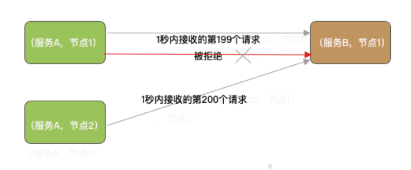 


​	如果限流用在电商的下单场景会有什么影响？一但限流就会有很多的用户下单失败，这意味着收益的流失，老板宁愿多花点钱搞多几台服务器，也不愿看到用户想买东西都买不了的情况。所以限流降级不是解决这种问题的有效手段，这种情况还是需要通过集群自动伸缩去解决。那限流降级适合哪些场景？

​	**秒杀场景最合适不过，抢到商品的都是有效流量，抢不到商品的都是无效流量，对于无效流量我们可以采用直接拒绝或者匀速排队的流量控制策略**

​	即适用于**无效流量**

#### 熔断降级

假设服务 A 需要依赖服务 B 完成客户端的一次请求，服务 A 如果能够感知到服务 B 的状态，在服务 B“不行”的时候不再去请求服务 B，就能确保服务 A 自身不会受服务 B 的影响。

那么如何知道服务 B 到底行不行呢？假设一秒内向服务 b 发送 230 个请求，结果有 30 个请求或超时异常或响应异常，根据这个数字就可以预测后续请求服务 B 大概率也会响应异常。服务 B 已经处理不过来了，那么后续的请求就没有必要再发送了，反正发出去也是异常，不如直接放弃；

当服务 A 的下游服务 B 突然变得不可用或者不稳定时，服务 A 可以自动切断与服务 B 的交互从而保证自己可用，就像保险丝一样，当电流异常升高到一定高度的时候，保险丝切断电流，这就是熔断降级。

但是服务 B 不会一直不行，当服务 B 恢复之后服务 A 也应该能感知到才行，所以熔断需要以一个时长为周期，比如 1 秒，这个周期也称为时间窗口，每个时间窗口都重新计算请求总数、异常总数这些指标数据，这样就能实现自动恢复。

熔断降级不是只能由“别人”来实现，自己也可以实现。别人发现你的缺点可能会疏远你，对你印象不好，实际上我们自己也能够发现自己的缺点，当自己发现自己缺点时可以及时弥补这一缺点，避免给别人不好印象。熔断降级也是如此，服务提供者也能自己统计接口的处理情况，当发现请求处理不过来时，触发熔断拒绝上游的请求，如果可以自己自动伸缩就更好了。所以，熔断降级可以在消费端实现，也可以在提供端实现。如果对接的是第三方的接口，那么就只能是在消费端实现。Sentinel 支持的系统负载保护也算是一种熔断降级方式。

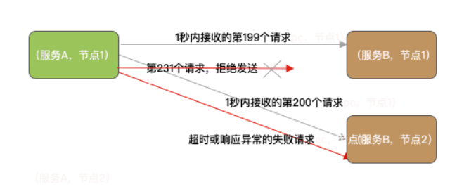 


熔断降级的常见降级策略：

- 在每秒请求异常数超过多少时触发熔断降级
- 在每秒请求异常错误率超过多少时触发熔断降级
- 在每秒请求平均耗时超过多少时触发熔断降级

响应异常数越多或者异常比率越大、平均耗时越高，都说明服务的处理能力在下降

#### 开关降级

开关降级也是服务降级的一种实现方式。开关降级用于在有限的硬件条件下，提升系统核心功能的并发处理能力，以最少的硬件成本应对流量高峰。

做电商项目的朋友可能接触最多的就是开关降级，一般我们在搞大促之前，都会通过开关方式将一些无关紧要的业务接口变成“不可用”。例如，通过配置中心或者通过 Redis 控制服务降级开关，当开关打开时，需要降级的接口直接响应一个表示当前服务降级的状态码给调用者

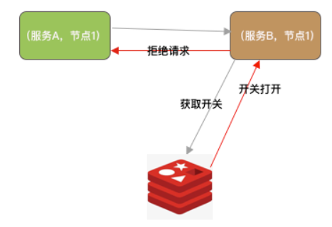 

控制服务降级开关的方式可以是人工，也可以是定时任务在某个时段开启、某个时段关闭。定时任务控制开关方式适合固定时间段请求突增的场景，例如点外卖的高峰期在中午，那么就可以在 11 点左右打开开关，在 13 点半之后关闭开关

#### 小结

**服务降级只是为了保障服务能够稳定运行，应对流量突增用降级牺牲一些流量换取系统的稳定**。

* 限流降级与熔断降级都可以实现在消费端限流或者服务端限流，限流可以采取流量控制策略处理超过阈值的流量。
* 限流降级即便没有达到系统的瓶颈，只要流量达到设定的阈值超出部分就会触发限流降级，而熔断降级可以实现尽最大的可能去完成所有的请求，容忍一些失败，熔断降级也能自动恢复。
* 开关降级适用于促销活动这种可以明确预估到并发会突增的场景

### sentinel功能

#### 功能对比

选择 Sentinel 与 Hystrix 通常第一步都是通过对比两者优缺点，Sentinel 与 Hystrix 的对比结果是作为我们选择 Sentinel 还是 Hystrix 的直观参考，不过使用 Sentinel 能做什么，是否满足实际需求才是我们最终决定是否使用 Sentinel 的最关键因素，否则尽管一个框架再好，不适合也不会选择。

以下 Sentinel 与 Hystrix 的对比，表格来自 Sentinel Github 官方文档。

| Sentinel       | Hystrix                                        |                               |
| :------------- | :--------------------------------------------- | ----------------------------- |
| 隔离策略       | 信号量隔离                                     | 线程池隔离/信号量隔离         |
| 熔断降级策略   | 基于响应时间或失败比率                         | 基于失败比率                  |
| 实时指标实现   | 滑动窗口                                       | 滑动窗口（基于 RxJava）       |
| 规则配置       | 支持多种数据源                                 | 支持多种数据源                |
| 扩展性         | 多个 SPI 扩展点                                | 插件的形式                    |
| 基于注解的支持 | 支持                                           | 支持                          |
| 限流           | 基于 QPS，支持基于调用关系的限流               | 有限的支持                    |
| 流量整形       | 支持慢启动、匀速器模式                         | 不支持                        |
| 系统负载保护   | 支持                                           | 不支持                        |
| 控制台         | 开箱即用，可配置规则、查看秒级监控、机器发现等 | 不完善                        |
| 常见框架的适配 | Servlet、Spring Cloud、Dubbo、gRPC 等          | Servlet、Spring Cloud Netflix |

* Hystrix 最核心的一项功能就是资源隔离，支持线程池隔离和信号量隔离。Sentinel 不支持线程池隔离，但使用 Sentinel 也可通过控制并发线程数方式提供信号量隔离。例如，控制服务 A 同时只能有 5 个线程去调用服务 B 的某个接口，或者控制服务 B 同时只能有 5 个线程去处理服务 A 发起调用的某个接口，避免因为一个接口消耗全部线程资源，导致服务奔溃。Hystrix 的线程池隔离可以为每个资源配置单独的线程池用于发送请求，但资源多的情况下会导致线程池增多，线程池增多会导致线程数增多，上下文切换会有非常大的损耗，对低延时的调用影响较大，因此 Hystrix 的线程池隔离也并未体现出多大的优势。
* Sentinel 与 Hystrix 都支持基于失败比率的熔断降级，在调用超过指定的数量并且失败比率达到设定的阈值时触发熔断，并在下个时间窗口自动恢复。Sentinel 也支持按失败总数熔断降级，但按失败总数的熔断降级固定时间窗口为 1 分钟，当 1 分钟内调用失败总数达到设定的阈值就会触发熔断。除此之外，Sentinel 还支持基于平均响应时间的熔断降级，平均响应时间越长，说明服务的性能在持续下降，在响应时间持续飙高时自动熔断，可以防止调用慢造成级联阻塞。
* Sentinel 和旧版本 Hystrix 的实时指标数据统计实现都是基于滑动窗口，指标数据统计指的是统计每个资源的当前窗口时间内的请求总数、处理成功总数、失败总数、总耗时、平均耗时、最大耗时、最小耗时、被降级总数等。使用滑动窗口可以循环利用一个数组，不需要重新申请内存，也不需要去删除过期的统计数据，降低 GC 的压力。Hystrix 1.5 版本对实时指标统计的实现进行了重构，将指标统计数据结构抽象成响应式流（reactive stream）的形式，方便消费者去利用指标信息，同时底层改造成基于 RxJava 的事件驱动模式，在服务调用成功、失败或超时时发布事件，通过一系列的变换和聚合最终得到实时的指标统计数据流，可以被熔断器或 Dashboard 消费 [1]。Sentinel 官方表示，未来将支持响应式流。
* Sentinel 提供数据源接口可实现动态加载规则配置，结合 loadRules API 可灵活的运行时修改规则配置，并且随时修改随时生效。动态修改不仅支持修改某资源的规则配置，也支持添加新的资源规则配置或者移除资源规则配置。Sentinel 支持给同一个资源同时添加多种规则配置，当对同一个资源配置多种规则时，哪个规则先达到阈值就会触发哪个规则的降级。Hystrix 的资源模型设计上采用了命令模式，在创建 Command 时就需要指定隔离策略是线程池隔离还是信号量隔离，一但指定了隔离策略，运行期间便不能修改隔离策略，而在 Sentinel 中资源定义和规则配置是分离的，因此在配置的灵活性上 Sentinel 更具有优势。
* Sentinel 支持系统自适应限流，Hystrix 所不支持的。当系统负载较高的时候，如果仍持续让请求进入，可能会导致系统崩溃，无法响应。在集群环境下，负载均衡把本应这台机器承载的流量转发到其它的机器上去，如果这个时候其它的机器也处在一个边缘状态的时候，这个增加的流量就会导致这台机器崩溃，最后导致整个集群不可用。针对这个情况，Sentinel 提供了对应的保护机制，让系统的入口流量和系统的负载达到一个平衡，保证系统在能力范围之内处理最多的请求 [2]。
* 在 QPS 过高的情况下，直接拒绝超出限制的请求是最常见的实现方式，但有些场景我们可能并不想直接拒绝请求，而是让请求排队等待处理，例如某一秒突增请求过多，但下一秒可能又没有请求或者请求很少的情况。Sentinel 的流量控制支持多种模式，例如直接拒绝模式、慢启动预热模式、匀速器模式。而慢启动预热模式和匀速器模式也是 Hystrix 所不支持的。
* Sentinel 在框架的设计上使用了责任链模式和 SPI 机制提供扩展功能。使用 SPI 机制为 Sentinel 提供了更好的扩展性，例如，使用 SPI 支持自定义调用链构建器，使用自定义调用链构建器可实现按需选配降级功能（ProcessorSlot），并且还可以自己添加自定义降级功能（ProcessorSlot）。简单说，我们可以实现自定义降级功能，或者根据需要选择 Sentinel 提供的降级功能，移除不需要的，尽量降低 Sentinel 对服务的性能影响。
* Sentinel 还支持集群限流。除了轮询负载均衡算法外，其它的算法都会导致流量到集群的每个节点都不一样，有的多有的少，假设服务 B 部署两个节点，对每个节点配置限流阈值为 200 QPS，我们希望集群的整体限量阈值是 400 QPS，但实际情况可能 400 个请求有 300 个请求分配到节点 1，只有 100 个请求分配到节点 2，导致总量没有到的情况下节点 1 就开始限流，因此单机维度限流会无法精确地限制总体流量。
* 集群流控可以精确地控制整个集群的调用总量，结合单机限流兜底，可以更好地发挥流量控制的效果。但实现集群限量需要一个 Server 专门统计集群的总调用量，其它的实例都要与 Server 通信来判断是否可以调用，也意味着每个请求都要增加一次额外的与 Server 通信的消耗，不过在使用单一长连接且 Server 处理“判断是否能通过”的耗时非常低，这个消耗对性能的影响还是可以接受的。
* 另外，黑白名单限流和热点参数限流也是 Sentinel 的一大特色。
* 黑白名单限流，可根据请求来源判断来源是否在黑名单中，如果在黑名单中则拒绝请求，否则放行，结合 Sentinel 的灵活动态配置，黑白名单可用于高峰期间对某些服务限流。
* 热点参数限流，统计调用 SphU.entry 传入参数中的热点参数，根据配置的限流阈值对包含热点参数的资源调用进行限流。热点参数限流仅对包含热点参数的资源调用生效，Sentinel 利用 LRU 策略统计最近最常访问的热点参数，结合令牌桶算法进行参数级别的流控，并且支持匀速流控效果。例如，想对某个热卖的商品限流，可将商品的 ID 为参数，统计一段时间内访问量最多的商品并进行限制。
* Sentinel 提供的多种限流功能基本满足我们的所有需求，并且提供切入点让使用者可扩展 Sentinel 的功能，加上灵活的规则配置，以及 Sentinel 在性能上所作出的努力，都是 Sentinel 被广泛使用的原因。Sentinel 有阿里巴巴做信用背书，也在不断的优化、不断更新，相信 Sentinel 能做得更好

#### 基本使用

```
ContextUtil.enter("上下文名称，例如：sentinel_spring_web_context");
Entry entry = null;
try {
     entry = SphU.entry("资源名称，例如：/rpc/openfein/demo", EntryType.IN (或者 EntryType.OUT));
     // 执行业务方法
       return doBusiness();
} catch (Exception e) {
     if (!(e instanceof BlockException)) {
          Tracer.trace(e);
     }
     throw e;
} finally {
     if (entry != null) {
         entry.exit(1);
     }
     ContextUtil.exit();
}
```


## 整体核心类设计

- 资源：资源是 Sentinel 的关键概念。资源，可以是一个方法、一段代码、由应用提供的接口，或者由应用调用其它应用的接口。
- 规则：围绕资源的实时状态设定的规则，包括流量控制规则、熔断降级规则以及系统保护规则、自定义规则。
- 降级：在流量剧增的情况下，为保证系统能够正常运行，根据资源的实时状态、访问流量以及系统负载有策略的拒绝掉一部分流量

### ResourceWrapper

```
public abstract class ResourceWrapper {
    protected final String name;
    protected final EntryType entryType;
    protected final int resourceType;
    public ResourceWrapper(String name, EntryType entryType, int resourceType) {
        this.name = name;
        this.entryType = entryType;
        this.resourceType = resourceType;
    }
}
```

ResourceWrapper 有三个字段：

- name 为资源名称，例如：“GET:/v1/demo”。

- entryType 为流量类型，即流入流量还是流出流量，通俗点说就是发起请求还是接收请求。

  ```
  public enum EntryType {
      IN("IN"),
      OUT("OUT");
  }
  ```

  可以把 IN 和 OUT 简单理解为接收处理请求与发送请求。当接收到别的服务或者前端发来的请求，那么 entryType 为 IN；当向其他服务发起请求时，那么 entryType 就为 OUT。例如，在消费端向服务提供者发送请求，当请求失败率达到多少时触发熔断降级，那么服务消费端为实现熔断降级就需要统计资源的 OUT 类型流量

- resourceType 表示资源的类型，例如 Dubbo RPC、Web MVC 或者 API Gateway 网关

  ```
  public final class ResourceTypeConstants {
      public static final int COMMON = 0;
      public static final int COMMON_WEB = 1;
      public static final int COMMON_RPC = 2;
      public static final int COMMON_API_GATEWAY = 3;
      public static final int COMMON_DB_SQL = 4;
  }
  ```

  - COMMON：默认
  - COMMON_WEB：Web 应用的接口
  - COMMON_RPC：Dubbo 框架的 RPC 接口
  - COMMON_API_GATEWAY：用于 API Gateway 网关
  - COMMON_DB_SQL：数据库 SQL 操作

### Node

​	Node 用于持有实时统计的指标数据，Node 接口定义了一个 Node 类所需要提供的各项指标数据统计的相关功能，为外部屏蔽滑动窗口的存在。提供记录请求被拒绝、请求被放行、请求处理异常、请求处理成功的方法，以及获取当前时间窗口统计的请求总数、平均耗时等方法。Node 接口源码如下

```
public interface Node extends OccupySupport, DebugSupport {
    long totalRequest(); // 获取总的请求数
    long totalPass(); // 获取通过的请求总数
    long totalSuccess(); // 获取成功的请求总数
    long blockRequest(); // 获取被 Sentinel 拒绝的请求总数
    long totalException(); // 获取异常总数
    double passQps(); // 通过 QPS
    double blockQps(); // 拒绝 QPS
    double totalQps(); // 总 qps
    double successQps(); // 成功 qps
    double maxSuccessQps(); // 最大成功总数 QPS（例如秒级滑动窗口的数组大小默认配置为 2，则取数组中最大）
    double exceptionQps(); // 异常 QPS
    double avgRt(); // 平均耗时
    double minRt(); // 最小耗时
    int curThreadNum(); // 当前并发占用的线程数
    double previousBlockQps(); // 前一个时间窗口的被拒绝 qps
    double previousPassQps(); // 前一个时间窗口的通过 qps
    Map<Long, MetricNode> metrics(); 
    List<MetricNode> rawMetricsInMin(Predicate<Long> timePredicate);
    void addPassRequest(int count); // 添加通过请求数
    void addRtAndSuccess(long rt, int success); // 添加成功请求数，并且添加处理成功的耗时
    void increaseBlockQps(int count); // 添加被拒绝的请求数
    void increaseExceptionQps(int count); // 添加异常请求数
    void increaseThreadNum(); // 自增占用线程
    void decreaseThreadNum(); // 自减占用线程
    void reset(); // 重置滑动窗口
}
```

它的几个实现类：DefaultNode、ClusterNode、EntranceNode、StatisticNode 的关系如下图所示

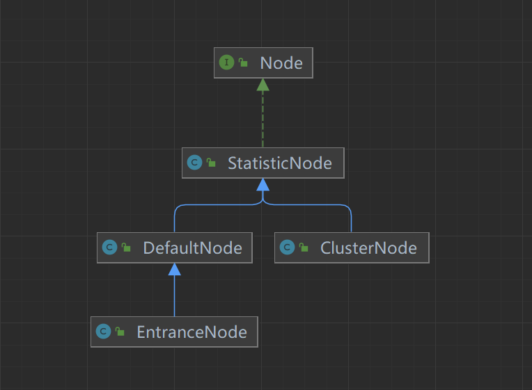 

#### StatisticNode

Statistic 即统计的意思，StatisticNode 是 Node 接口的实现类，是实现实时指标数据统计 Node

```
public class StatisticNode implements Node {
    // 秒级滑动窗口，2 个时间窗口大小为 500 毫秒的 Bucket
    private transient volatile Metric rollingCounterInSecond = new ArrayMetric(2,1000);
    // 分钟级滑动窗口，60 个 Bucket 数组，每个 Bucket 统计的时间窗口大小为 1 秒
    private transient Metric rollingCounterInMinute = new ArrayMetric(60, 60 * 1000, false);
    // 统计并发使用的线程数
    private LongAdder curThreadNum = new LongAdder();
}
```

如代码所示，一个 StatisticNode 包含一个秒级和一个分钟级的滑动窗口，以及并行线程数计数器。秒级滑动窗口用于统计实时的 QPS，分钟级的滑动窗口用于保存最近一分钟内的历史指标数据，并行线程计数器用于统计当前并行占用的线程数。

StatisticNode 的分钟级和秒级滑动窗口统计的指标数据分别有不同的用处。例如，StatisticNode 记录请求成功和请求执行耗时的方法中调用了两个滑动窗口的对应指标项的记录方法，代码如下：

```
  @Override
    public void addRtAndSuccess(long rt, int successCount) {
        // 秒级滑动窗口
        rollingCounterInSecond.addSuccess(successCount);
        rollingCounterInSecond.addRT(rt);
        // 分钟级滑动窗口
        rollingCounterInMinute.addSuccess(successCount);
        rollingCounterInMinute.addRT(rt);
    }
```

获取前一秒被 Sentinel 拒绝的请求总数从分钟级滑动窗口获取，代码如下：

```
@Override
public double previousBlockQps() {
    return this.rollingCounterInMinute.previousWindowBlock();
}
```

而获取当前一秒内已经被 Sentinel 拒绝的请求总数则从秒级滑动窗口获取，代码如下：

```
@Override
public double blockQps() {
    return rollingCounterInSecond.block() / rollingCounterInSecond.getWindowIntervalInSec();
}
```

获取最小耗时也是从秒级的滑动窗口取的，代码如下：

```
    @Override
    public double minRt() {
        // 秒级滑动窗口
        return rollingCounterInSecond.minRt();
    }
```

StatisticNode 还负责统计并行占用的线程数，用于实现信号量隔离，按资源所能并发占用的最大线程数实现限流。当接收到一个请求就将 curThreadNum 自增 1，当处理完请求时就将 curThreadNum 自减一，如果同时处理 10 个请求，那么 curThreadNum 的值就为 10。

假设我们配置 tomcat 处理请求的线程池大小为 200，通过控制并发线程数实现信号量隔离的好处就是不让一个接口同时使用完这 200 个线程，避免因为一个接口响应慢将 200 个线程都阻塞导致应用无法处理其他请求的问题，这也是实现信号量隔离的目的

#### **DefaultNode**

DefaultNode 是实现以资源为维度的指标数据统计的 Node，是将资源 ID 和 StatisticNode 映射到一起的 Node。

```
public class DefaultNode extends StatisticNode {
    private ResourceWrapper id;
    private volatile Set<Node> childList = new HashSet<>();
    private ClusterNode clusterNode;

    public DefaultNode(ResourceWrapper id, ClusterNode clusterNode) {
        this.id = id;
        this.clusterNode = clusterNode;
    }
}
```

如代码所示，DefaultNode 是 StatisticNode 的子类，构造方法要求传入资源 ID，表示该 Node 用于统计哪个资源的实时指标数据，指标数据统计则由父类 StatisticNode 完成。

DefaultNode 字段说明：

- id：资源 ID，ResourceWrapper 对象。
- childList：childList 是一个 Node（DefaultNode）集合，用于存放子节点。
- clusterNode：clusterNode 字段是一个 ClusterNode，ClusterNode 也是 StatisticNode 的子类

回顾下 Sentinel 的基本使用：

```
ContextUtil.enter("上下文名称，例如：sentinel_spring_web_context");
Entry entry = null;
try {
     entry = SphU.entry("资源名称，例如：/rpc/openfein/demo", EntryType.IN (或者 EntryType.OUT));
     // 执行业务方法
       return doBusiness();
} catch (Exception e) {
     if (!(e instanceof BlockException)) {
          Tracer.trace(e);
     }
     throw e;
} finally {
     if (entry != null) {
         entry.exit(1);
     }
     ContextUtil.exit();
}

```

如上代码所示，doBusiness 业务方法被 Sentinel 保护，当 doBusiness 方法被多层保护时，就可能对同一个资源创建多个 DefaultNode。一个资源理论上可能有多个 DefaultNode，是否有多个 DefaultNode 取决于是否存在多个 Context，即当前调用链路上是否多次调用 ContextUtil#enter 方法，是否每次调用 ContextUtil#enter 方法都会创建一个 Context。

特别加上“理论上”，是因为在一个线程中，调用多次 ContextUtil#enter 方法，只有第一次调用会创建 Context，ContextUtil 使用 ThreadLocal 存储 Context，所以后续的调用都会使用之前创建的 Context，而 DefaultNode 是在 NodeSelectorSlot 中创建的，使用 Map 缓存，key 为 Context#name，所以在使用同一个 Context 的情况下，只会为一个资源创建一个 DefaultNode。这部分内容在介绍 NodeSelectorSlot 时再作详细介绍

#### **ClusterNode**

Sentinel 使用 ClusterNode 统计每个资源全局的指标数据，以及统计该资源按调用来源区分的指标数据。全局数据指的是不区分调用链路，一个资源 ID 只对应一个 ClusterNode

```
public class ClusterNode extends StatisticNode {
    // 资源名称 
      private final String name;
    // 资源类型
    private final int resourceType;
    // 来源指标数据统计
      private Map<String, StatisticNode> originCountMap = new HashMap<>();
    // 控制并发修改 originCountMap 用的锁
    private final ReentrantLock lock = new ReentrantLock();

     public ClusterNode(String name, int resourceType) {
        this.name = name;
        this.resourceType = resourceType;
    }
} 
```

ClusterNode 字段说明：

- name：资源名称。很奇怪，这里没有使用 ResourceWrapper，是版本历史问题，还是因为 ClusterNode 不需要判断流量类型。
- resourceType：资源类型。
- originCountMap：维护每个调用来源的指标数据统计数据（StatisticNode），其用途是什么，在使用到时再做分析

#### **EntranceNode**

EntranceNode 是一个特殊的 Node，它继承 DefaultNode，用于维护一颗树，从根节点到每个叶子节点都是不同请求的调用链路，所经过的每个节点都对应着调用链路上被 Sentinel 保护的资源，一个请求调用链路上的节点顺序正是资源被访问的顺序

```
public class EntranceNode extends DefaultNode {

    public EntranceNode(ResourceWrapper id, ClusterNode clusterNode) {
        super(id, clusterNode);
    }
}
```

在一个 Web MVC 应用中，每个接口就是一个资源，Sentinel 通过 Spring MVC 拦截器拦截每个接口的入口，统一创建名为“sentinel_spring_web_context”的 Context，名称相同的 Context 都使用同一个 EntranceNode。一个 Web 应用可能有多个接口，而 childList 就用于存储每个接口对应的 DefaultNode。

如果想统计一个应用的所有接口（不一定是所有，没有被调用过的接口不会创建对应的 DefaultNode）总的 QPS，只需要调用 EntranceNode 的 totalQps 就能获取到。EntranceNode 的 totalQps 方法代码如下：

```
    @Override
    public double totalQps() {
        double r = 0;
        // 遍历 childList
        for (Node node : getChildList()) {
            r += node.totalQps();
        }
        return r;
    }
```

EntranceNode、DefaultNode、ClusterNode 与滑动窗口的关系如下图所示：

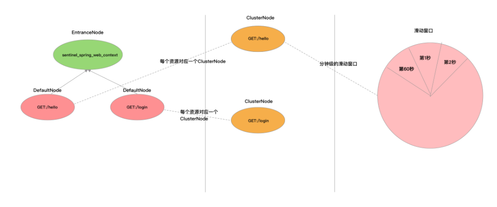 

### Context 与 Entry

理解 Context 与 Entry 也是理解 Sentinel 整个工作流程的关键，其中 Entry 还会涉及到“调用树”这一概念

#### **Context**

Context 代表调用链路上下文，贯穿一次调用链路中的所有 Entry。Context 维持着入口节点（entranceNode）、本次调用链路的 curNode、调用来源（origin）等信息。Context 名称即为调用链路入口名称。

Context 通过 ThreadLocal 传递，只在调用链路的入口处创建。

假设服务B提供一个查询天气预报的接口给服务A调用，服务B实现查询天气预报的接口是调用第三方服务C实现的，服务B是一个 MVC 应用，同时服务B调用服务 C 接口使用 OpenFeign 实现 RPC 调用。那么，服务 B 即使用了 Sentinel 的 MVC 适配模块，也使用了 Sentinel 的 OpenFeign 适配模块。

当服务 B 接收到服务 A 请求时，会创建一个名为“sentinel_spring_web_context”的 Context，服务 B 在向服务 C 发起接口调用时由于当前线程已经存在一个 Context，所以还是用“sentinel_spring_web_context”这个 Context，代表是同一个调用链路入口。

举个不恰当的例子：

- 路径一：A.a()-> 调用 -> B.b()-> 调用 C.c()，A.a() 为该调用链路的入口，入口名称为“a_context”。
- 路径二：D.d()-> 调用 -> B.b()-> 调用 C.c()，D.d() 为该调用链路的入口，入口名称为“d_context”。

那么，每次调用 A.a() 方法都会创建名为“a_context”的 Context，每次调用 B.b() 方法都会创建名为“b_context”的 Context。如果 A.a() 同时有 20 个请求，那么就会创建 20 个名为“a_context”的 Context，Context 代表了这 20 个请求每个请求的调用链路上下文，而路径一就是这 20 个请求相同的调用链路。

Context 的字段定义如下：

```
public class Context {
    private final String name;
    private DefaultNode entranceNode;
    private Entry curEntry;
    private String origin = "";
    // 我们不讨论异步的情况
    // private final boolean async;
}
```

- name：Context 的名称。
- entranceNode：当前调用树的入口节点，类型为 EntranceNode。同一个入口的资源，每个资源对应一个 DefaultNode，entranceNode#childList 用于存储这些资源的 DefaultNode。
- curEntry：当前 Entry（CtEntry）。
- origin：调用来源的名称，即服务消费者的名称或者服务消费者的来源 IP，取决于服务消费者是否使用 Sentinel，由 Sentinel 适配层传递过来。例如：服务提供者是 Spring MVC 应用，且服务提供者使用 Sentinel 的 Web MVC 适配，那么 Sentinel 会尝试从请求头获取”S-user”，如果服务消费者有在请求头传递这个参数，那么就能够获取到

#### **Entry（CtEntry）**

在调用 Context#getCurNode 方法获取调用链路上当前访问到的资源的 DefaultNode 时，实际是从 Context#curEntry 获取的，Entry 维护了当前资源的 DefaultNode，以及调用来源的 StatisticNode。Entry 抽象类字段的定义如下：

```
public abstract class Entry implements AutoCloseable {
    private static final Object[] OBJECTS0 = new Object[0];
    private long createTime;
    // 当前节点（DefaultNode）
    private Node curNode;
    // 来源节点
    private Node originNode;
    private Throwable error;
    // 资源
    protected ResourceWrapper resourceWrapper;
}
```

CtEntry 是 Entry 的直接子类，后面分析源码时，我们所说 Entry 皆指 CtEntry。CtEntry 中声明的字段信息如下代码所示

```
class CtEntry extends Entry {
    // 当前 Entry 指向的父 Entry
    protected Entry parent = null;
    // 父 Entry 指向当前 Entry
    protected Entry child = null;
    // 当前资源的 ProcessorSlotChain
    protected ProcessorSlot<Object> chain;
    // 当前上下文
    protected Context context;
}
```

CtEntry 用于维护父子 Entry，每一次调用 SphU#entry 方法都会创建一个 CtEntry。如果服务 B 在处理一个请求的路径上会多次调用 SphU#entry，那么这些 CtEntry 会构成一个双向链表。在每次创建 CtEntry，都会将 Context.curEntry 设置为这个新的 CtEntry，双向链表的作用就是在调用 CtEntry#exit 方法时，能够将 Context.curEntry 还原为上一个资源的 CtEntry。

例如，在服务 B 接收到服务 A 的请求时，会调用 SphU#entry 方法创建一个 CtEntry，我们取个代号 ctEntry1，此时的 ctEntry1 的父节点（parent）为空。当服务 B 向服务 C 发起调用时，OpenFeign 适配器调用 SphU#entry 的方法会创建一个 CtEntry，我们取个代号 ctEntry2，此时 ctEntry2 的父节点（parent）就是 ctEntry1，ctEntry1 的子节点（child）就是 ctEntry2，如下图所示：

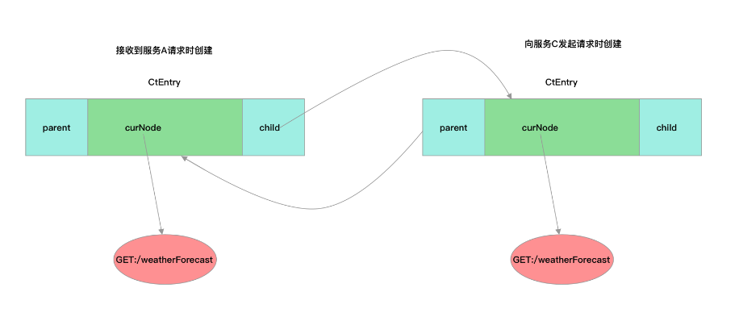 


### **ROOT 与调用树**

Constants 常量类用于声明全局静态常量，Constants 有一个 ROOT 静态字段，类型为 EntranceNode。

在调用 ContextUtil#enter 方法时，如果还没有为当前入口创建 EntranceNode，则会为当前入口创建 EntranceNode，将其赋值给 Context.entranceNode，同时也会将这个 EntranceNode 添加到 Constants.ROOT 的子节点（childList）。资源对应的 DefaultNode 则是在 NodeSelectorSlot 中创建，并赋值给 Context.curEntry.curNode。

Constants.ROOT、Context.entranceNode 与 Entry.curNode 三者关系如下图所示

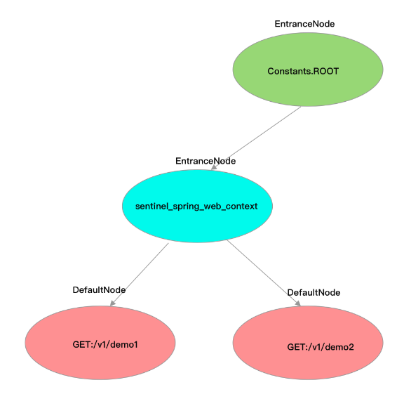 

### ProcessorSlot

ProcessorSlot 直译就是处理器插槽，是 Sentinel 实现限流降级、熔断降级、系统自适应降级等功能的切入点。Sentinel 提供的 ProcessorSlot 可以分为两类，一类是辅助完成资源指标数据统计的切入点，一类是实现降级功能的切入点。

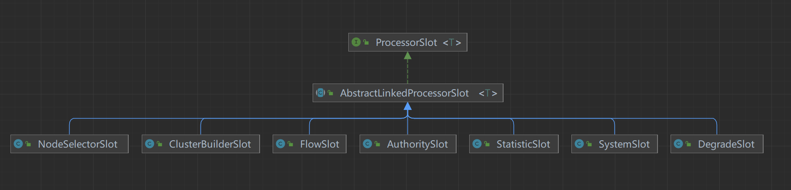 

辅助资源指标数据统计的 ProcessorSlot：

- NodeSelectorSlot

  为当前资源创建 DefaultNode，并且将 DefaultNode 赋值给 Context.curEntry.curNode；如果当前调用链路上只出现过一次 SphU#entry 的情况，将该 DefaultNode 添加到的 Context.entranceNode 的子节点（如倒数第一张图所示，名为 sentinel_spring_web_context 的 EntranceNode），否则添加到 Context.curEntry.parent 的子节点（childList）。有点抽象，我们在分析 NodeSelectorSlot 源码时再详细介绍。

- ClusterBuilderSlot

  如果当前资源未创建 ClusterNode，则为资源创建 ClusterNode；将 ClusterNode 赋值给当前资源的 DefaultNode.clusterNode；如果调用来源（origin）不为空，则为调用来源创建 StatisticNode，用于实现按调用来源统计资源的指标数据，ClusterNode 持有每个调用来源的 StatisticNode。

- StatisticSlot

  这是 Sentinel 最为重要的类之一，用于实现指标数据统计。先是调用后续的 ProcessorSlot#entry 判断是否放行请求，再根据判断结果进行相应的指标数据统计操作。

实现降级功能的 ProcessorSlot：

- AuthoritySlot

  实现黑白名单降级

- SystemSlot

  实现系统自适应降级

- FlowSlot

  实现限流降级

- DegradeSlot

  实现熔断降级

## 整体工作流程

Sentinel 的整体工具流程就是使用责任链模式将所有的 ProcessorSlot 按照一定的顺序串成一个单向链表。辅助完成资源指标数据统计的 ProcessorSlot 必须在实现降级功能的 ProcessorSlot 的前面，原因很简单，降级功能需要依据资源的指标数据做判断，当然，如果某个 ProcessorSlot 不依赖指标数据实现降级功能，那这个 ProcessorSlot 的位置就没有约束。

除了按分类排序外，同一个分类下的每个 ProcessorSlot 可能也需要有严格的排序。比如辅助完成资源指标数据统计的 ProcessorSlot 的排序顺序为：

> NodeSelectorSlot->ClusterBuilderSlot->StatisticSlot

如果顺序乱了就会抛出异常，而实现降级功能的 ProcessorSlot 就没有严格的顺序要求，AuthoritySlot、SystemSlot、FlowSlot、DegradeSlot 这几个的顺序可以按需调整。

### 责任链的定义

实现将 ProcessorSlot 串成一个单向链表的是 ProcessorSlotChain，这个 ProcessorSlotChain 是由 SlotChainBuilder 构造的，默认 SlotChainBuilder 构造的 ProcessorSlotChain 注册的 ProcessorSlot 以及顺序如下代码所示

```
public class DefaultSlotChainBuilder implements SlotChainBuilder {
    @Override
    public ProcessorSlotChain build() {
        ProcessorSlotChain chain = new DefaultProcessorSlotChain();
        chain.addLast(new NodeSelectorSlot());
        chain.addLast(new ClusterBuilderSlot());
        chain.addLast(new LogSlot());
        chain.addLast(new StatisticSlot());
        chain.addLast(new AuthoritySlot());
        chain.addLast(new SystemSlot());
        chain.addLast(new FlowSlot());
        chain.addLast(new DegradeSlot());
        return chain;
    }
}
```

#### ProcessorSlot 接口的定义

```
public interface ProcessorSlot<T> {
    // 入口方法
    void entry(Context context, ResourceWrapper resourceWrapper, T param, int count, boolean prioritized,Object... args) throws Throwable;
    // 调用下一个 ProcessorSlot#entry 方法
    void fireEntry(Context context, ResourceWrapper resourceWrapper, Object obj, int count, boolean prioritized,Object... args) throws Throwable;
    // 出口方法
    void exit(Context context, ResourceWrapper resourceWrapper, int count, Object... args);
    // 调用下一个 ProcessorSlot#exit 方法
    void fireExit(Context context, ResourceWrapper resourceWrapper, int count, Object... args);
}
```

例如实现熔断降级功能的 DegradeSlot，其在 entry 方法中检查资源当前统计的指标数据是否达到配置的熔断降级规则的阈值，如果是则触发熔断，抛出一个 DegradeException（必须是 BlockException 的子类），而 exit 方法什么也不做。

方法参数解析：

- context

  当前调用链路上下文。

- resourceWrapper

  资源 ID。

- param

  泛型参数，一般用于传递 DefaultNode。

- count

  Sentinel 将需要被保护的资源包装起来，这与锁的实现是一样的，需要先获取锁才能继续执行。而 count 则与并发编程 AQS 中 tryAcquire 方法的参数作用一样，count 表示申请占用共享资源的数量，只有申请到足够的共享资源才能继续执行。例如，线程池有 200 个线程，当前方法执行需要申请 3 个线程才能执行，那么 count 就是 3。count 的值一般为 1，当限流规则配置的限流阈值类型为 threads 时，表示需要申请一个线程，当限流规则配置的限流阈值类型为 qps 时，表示需要申请 1 令牌（假设使用令牌桶算法）。

- prioritized

  表示是否对请求进行优先级排序，SphU#entry 传递过来的值是 false。

- args

  调用方法传递的参数，用于实现热点参数限流

#### ProcessorSlotChain结构

之所以能够将所有的 ProcessorSlot 构造成一个 ProcessorSlotChain，还是依赖这些 ProcessorSlot 继承了 AbstractLinkedProcessorSlot 类。每个 AbstractLinkedProcessorSlot 类都有一个指向下一个 AbstractLinkedProcessorSlot 的字段，正是这个字段将 ProcessorSlot 串成一条单向链表。AbstractLinkedProcessorSlot 部分源码如下

```
public abstract class AbstractLinkedProcessorSlot<T> implements ProcessorSlot<T> {
    // 当前节点的下一个节点
    private AbstractLinkedProcessorSlot<?> next = null;

    public void setNext(AbstractLinkedProcessorSlot<?> next) {
        this.next = next;
    }
}
```

实现责任链调用是由前一个 AbstractLinkedProcessorSlot 调用 fireEntry 方法或者 fireExit 方法，在 fireEntry 与 fireExit 方法中调用下一个 AbstractLinkedProcessorSlot（next）的 entry 方法或 exit 方法。AbstractLinkedProcessorSlot 的 fireEntry 与 fireExit 方法的实现源码如下：

```
public abstract class AbstractLinkedProcessorSlot<T> implements ProcessorSlot<T> {
    // 当前节点的下一个节点
    private AbstractLinkedProcessorSlot<?> next = null;

    public void setNext(AbstractLinkedProcessorSlot<?> next) {
        this.next = next;
    }  

    @Override
    public void fireEntry(Context context, ResourceWrapper resourceWrapper, Object obj, int count, boolean prioritized, Object... args)
        throws Throwable {
        if (next != null) {
            T t = (T) obj; 
            // 调用下一个 ProcessorSlot 的 entry 方法
            next.entry(context,resourceWrapper,t,count,prioritized,args);
        }
    }

    @Override
    public void fireExit(Context context, ResourceWrapper resourceWrapper, int count, Object... args) {
        if (next != null) {
            // 调用下一个 ProcessorSlot 的 exit 方法
            next.exit(context, resourceWrapper, count, args);
        }
    }
}

```

ProcessorSlotChain 也继承 AbstractLinkedProcessorSlot，只不过加了两个方法：提供将一个 ProcessorSlot 添加到链表的头节点的 addFirst 方法，以及提供将一个 ProcessorSlot 添加到链表末尾的 addLast 方法。

ProcessorSlotChain 的默认实现类是 DefaultProcessorSlotChain，DefaultProcessorSlotChain 有一个指向链表头节点的 first 字段和一个指向链表尾节点的 end 字段，头节点字段是一个空实现的 AbstractLinkedProcessorSlot。DefaultProcessorSlotChain 源码如下：

```
public class DefaultProcessorSlotChain extends ProcessorSlotChain {
     // first，指向链表头节点
    AbstractLinkedProcessorSlot<?> first = new AbstractLinkedProcessorSlot<Object>() {

        @Override
        public void entry(Context context, ResourceWrapper resourceWrapper, Object t, int count, boolean prioritized, Object... args)
            throws Throwable {
            super.fireEntry(context, resourceWrapper, t, count, prioritized, args);
        }

        @Override
        public void exit(Context context, ResourceWrapper resourceWrapper, int count, Object... args) {
            super.fireExit(context, resourceWrapper, count, args);
        }

    };
    // end，指向链表尾节点
    AbstractLinkedProcessorSlot<?> end = first;

    @Override
    public void addFirst(AbstractLinkedProcessorSlot<?> protocolProcessor) {
        protocolProcessor.setNext(first.getNext());
        first.setNext(protocolProcessor);
        if (end == first) {
            end = protocolProcessor;
        }
    }

    @Override
    public void addLast(AbstractLinkedProcessorSlot<?> protocolProcessor) {
        end.setNext(protocolProcessor);
        end = protocolProcessor;
    }

   // 调用头节点的 entry 方法
    @Override
    public void entry(Context context, ResourceWrapper resourceWrapper, Object obj, int count, boolean prioritized, Object... args)
        throws Throwable {
        T t = (T) obj;
        first.entry(context, resourceWrapper, t, count, prioritized, args);
    }
    // 调用头节点的 exit 方法
    @Override
    public void exit(Context context, ResourceWrapper resourceWrapper, int count, Object... args) {
        first.exit(context, resourceWrapper, count, args);
    }

}

```

### 责任链全局入口

任链模式是非常常用的一种设计模式。在 Shiro 框架中，实现资源访问权限过滤的骨架（过滤器链）使用的是责任链模式；在 Netty 框架中，使用责任链模式将处理请求的 ChannelHandler 包装为链表，实现局部串行处理请求。

Sentinel 的责任链实现上与 Netty 有相似的地方，Sentinel 的 ProcessorSlot#entry 方法与 Netty 的实现一样，都是按节点在链表中的顺序被调用，区别在于 Sentinel 的 ProcessorSlot#exit 方法并不像 Netty 那样是从后往前调用的。且与 Netty 不同的是，Netty 的 ChannelHandler 是线程安全的，也就是局部串行，由于 Sentinel 是与资源为维度的，所以必然实现不了局部串行。

Sentinel 会为每个资源创建且仅创建一个 ProcessorSlotChain，只要名称相同就认为是同一个资源。ProcessorSlotChain 被缓存在 CtSph.chainMap 静态字段，key 为资源 ID，每个资源的 ProcessorSlotChain 在 CtSph#entryWithPriority 方法中创建，代码如下

```
public class CtSph implements Sph {
    // 资源与 ProcessorSlotChain 的映射
    private static volatile Map<ResourceWrapper, ProcessorSlotChain> chainMap
        = new HashMap<ResourceWrapper, ProcessorSlotChain>();

   private Entry entryWithPriority(ResourceWrapper resourceWrapper, int count, boolean prioritized, Object... args)
        throws BlockException {
        Context context = ContextUtil.getContext();
        //......
        // 开始构造 Chain
        ProcessorSlot<Object> chain = lookProcessChain(resourceWrapper);
        //......
        Entry e = new CtEntry(resourceWrapper, chain, context);
        try {
            chain.entry(context, resourceWrapper, null, count, prioritized, args);
        } catch (BlockException e1) {
            e.exit(count, args);
            throw e1;
        }
        return e;
    }
}
```

### 整体执行过程

如果不借助 Sentinel 提供的适配器，我们可以这样使用 Sentinel。

```
ContextUtil.enter("上下文名称，例如：sentinel_spring_web_context");
Entry entry = null;
try {
     entry = SphU.entry("资源名称，例如：/rpc/openfein/demo", EntryType.IN (或者 EntryType.OUT));
     // 执行业务方法
       return doBusiness();
} catch (Exception e) {
     if (!(e instanceof BlockException)) {
          Tracer.trace(e);
     }
     throw e;
} finally {
     if (entry != null) {
         entry.exit(1);
     }
     ContextUtil.exit();
}

```

上面代码我们分为五步分析：

- 调用 ContextUtil#enter 方法；

  ContextUtil#enter 方法负责为当前调用链路创建 Context，以及为 Conetxt 创建 EntranceNode，源码如下

  ```
  public static Context enter(String name, String origin) {
          return trueEnter(name, origin);
      }
  
      protected static Context trueEnter(String name, String origin) {
          Context context = contextHolder.get();
          if (context == null) {
              Map<String, DefaultNode> localCacheNameMap = contextNameNodeMap;
              DefaultNode node = localCacheNameMap.get(name);
              if (node == null) {
                 //....
                      try {
                          LOCK.lock();
                          node = contextNameNodeMap.get(name);
                          if (node == null) {
                              //....
                                  node = new EntranceNode(new StringResourceWrapper(name, EntryType.IN), null);
                                  // Add entrance node.
                                  Constants.ROOT.addChild(node);
                                  Map<String, DefaultNode> newMap = new HashMap<>(contextNameNodeMap.size() + 1);
                                  newMap.putAll(contextNameNodeMap);
                                  newMap.put(name, node);
                                  contextNameNodeMap = newMap;
                          }
                      } finally {
                          LOCK.unlock();
                      }
                  }
              }
              context = new Context(node, name);
              context.setOrigin(origin);
              contextHolder.set(context);
          }
          return context;
      }
  
  ```

  ContextUtil 使用 ThreadLocal 存储当前调用链路的 Context，例如 Web MVC 应用中使用 Sentinel 的 Spring MVC 适配器，在接收到请求时，调用 ContextUtil#enter 方法会创建一个名为“sentinel_spring_web_context”的 Context，并且如果是首次创建还会为所有名为“sentinel_spring_web_context”的 Context 创建一个 EntranceNode。

  Context 是每个线程只创建一个，而 EntranceNode 则是每个 Context.name 对应创建一个。也就是说，应用每接收一个请求都会创建一个新的 Context，但名称都是 sentinel_spring_web_context，而且都是使用同一个 EntranceNode，这个 EntranceNode 将会存储所有接口的 DefaultNode，同时这个 EntranceNode 也是 Constants.ROOT 的子节点。

- 调用 SphU#entry 方法；

  Sentinel 的核心骨架是 ProcessorSlotChain，所以核心的流程是一次 SphU#entry 方法的调用以及一次 CtEntry#exit 方法的调用。

  SphU#entry 方法调用 CtSph#entry 方法，CtSph 负责为资源创建 ResourceWrapper 对象并为资源构造一个全局唯一的 ProcessorSlotChain、为资源创建 CtEntry 并将 CtEntry 赋值给当前调用链路的 Context.curEntry、最后调用 ProcessorSlotChain#entry 方法完成一次单向链表的 entry 方法调用。

  ProcessorSlotChain 的一次 entry 方法的调用过程如下图所示

  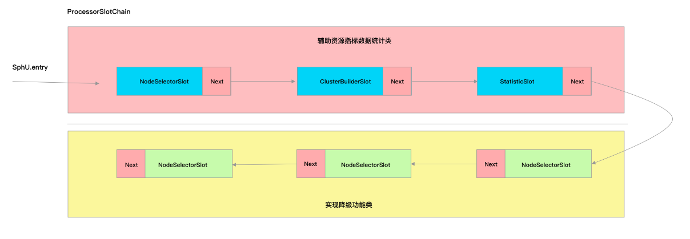 

  

- 如果抛出异常，且异常类型非 BlockException 异常，则调用 Tracer#trace 方法记录异常；

  只在抛出非 BlockException 异常时才会调用 Tracer#trace 方法，用于记录当前资源调用异常，为当前资源的 DefaultNode 自增异常数

  ```
  public class Tracer {
      // 调用 Tracer 的 trace 方法最终会调用到这个方法
      private static void traceExceptionToNode(Throwable t, int count, Entry entry, DefaultNode curNode) {
          if (curNode == null) {
              return;
          }
          // .....
          // clusterNode can be null when Constants.ON is false.
          ClusterNode clusterNode = curNode.getClusterNode();
          if (clusterNode == null) {
              return;
          }
          clusterNode.trace(t, count);
      }
  }
  ```

  如上代码所示，traceExceptionToNode 方法中首先获取当前资源的 ClusterNode，然后调用 ClusterNode#trace 方法记录异常。因为一个资源只创建一个 ProcessorSlotChain，一个 ProcessorSlotChain 只创建 ClusterBuilderSlot，一个 ClusterBuilderSlot 只创建一个 ClusterNode，所以一个资源对应一个 ClusterNode，这个 ClusterNode 就是用来统计一个资源的全局指标数据的，熔断降级与限流降级都有使用到这个 ClusterNode

  ClusterNode#trace 方法的实现如下：

  ```
     public void trace(Throwable throwable, int count) {
          if (count <= 0) {
              return;
          }
          if (!BlockException.isBlockException(throwable)) {
              // 非 BlockException 异常，自增异常总数
              this.increaseExceptionQps(count);
          }
      }
  ```

- 调用 Entry#exit 方法；

  下面是 CtEntry#exit 方法的实现，为了简短且易于理解，下面给出的 exitForContext 方法的源码有删减。

  ```
      @Override
      public void exit(int count, Object... args) throws ErrorEntryFreeException {
          trueExit(count, args);
      }
      @Override
      protected Entry trueExit(int count, Object... args) throws ErrorEntryFreeException {
          exitForContext(context, count, args);
          return parent;
      }
      protected void exitForContext(Context context, int count, Object... args) throws ErrorEntryFreeException {
          if (context != null) {
                  //......
                  // 1、调用 ProcessorSlotChain 的 exit 方法
                  if (chain != null) {
                      chain.exit(context, resourceWrapper, count, args);
                  }
                  // 2、将当前 CtEntry 的父节点设置为 Context 的当前节点
                  context.setCurEntry(parent);
                  if (parent != null) {
                      ((CtEntry)parent).child = null;
                  }
                  // .....
          }
      }
  ```

  CtSph 在创建 CtEntry 时，将资源的 ProcessorSlotChain 赋值给了 CtEntry，所以在调用 CtEntry#exit 方法时，CtEntry 能够拿到当前资源的 ProcessorSlotChain，并调用 ProcessorSlotChain 的 exit 方法完成一次单向链表的 exit 方法调用。其过程与 ProcessorSlotChain 的一次 entry 方法的调用过程一样，因此不做分析。

  CtEntry 在退出时还会还原 Context.curEntry。上一篇介绍 CtEntry 时说到，CtEntry 用于维护父子 Entry，每一次调用 SphU#entry 都会创建一个 CtEntry，如果应用处理一次请求的路径上会多次调用 SphU#entry，那么这些 CtEntry 会构成一个双向链表。在每次创建 CtEntry，都会将 Context.curEntry 设置为这个新的 CtEntry，双向链表的作用就是在调用 CtEntry#exit 方法时，能够将 Context.curEntry 还原为上一个 CtEntry

- 调用 ContextUtil#exit 方法

  ContextUtil#exit 方法就简单了，其代码如下：

  ```
     public static void exit() {
          Context context = contextHolder.get();
          if (context != null && context.getCurEntry() == null) {
              contextHolder.set(null);
          }
      }
  
  ```

  如果 Context.curEntry 为空，则说明所有 SphU#entry 都对应执行了一次 Entry#exit 方法，此时就可以将 Context 从 ThreadLocal 中移除

## 时间窗口介绍

Sentinel 是基于滑动窗口实现的实时指标数据统计，要深入理解 Sentinel 的限流实现原理，首先我们得要了解其指标数据统计的实现，例如如何统计 QPS。

### 核心类

#### **MetricBucket**

统计窗口的最小单位；

Sentinel 使用 Bucket 统计一个窗口时间内的各项指标数据，这些指标数据包括请求总数、成功总数、异常总数、总耗时、最小耗时、最大耗时等，而一个 Bucket 可以是记录一秒内的数据，也可以是 10 毫秒内的数据，这个时间长度称为窗口时间。qps-helper 只统计请求成功总数、请求异常数、总耗时；

```
public class MetricBucket {
    /**
     * 存储各事件的计数，比如异常总数、请求总数等
     */
    private final LongAdder[] counters;
    /**
     * 这段事件内的最小耗时
     */
    private volatile long minRt;
}
```

如上面代码所示，Bucket 记录一段时间内的各项指标数据用的是一个 LongAdder 数组，LongAdder 保证了数据修改的原子性，并且性能比 AtomicInteger 表现更好。数组的每个元素分别记录一个时间窗口内的请求总数、异常数、总耗时，如下图所示;

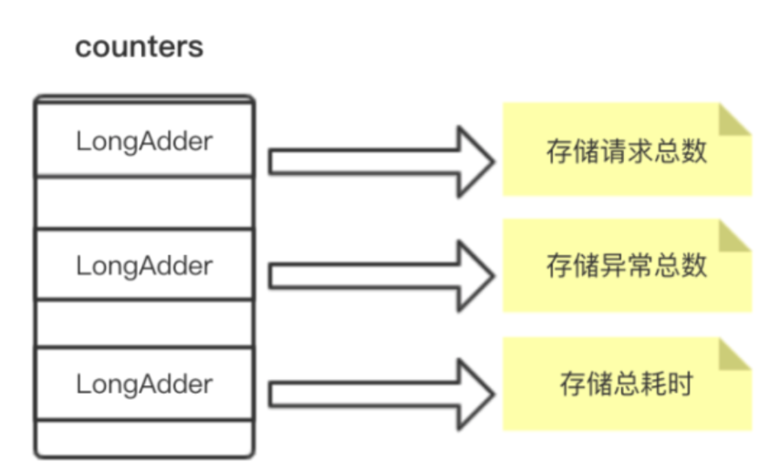 

Sentinel 用枚举类型 MetricEvent 的 ordinal 属性作为下标，ordinal 的值从 0 开始，按枚举元素的顺序递增，正好可以用作数组的下标。在 qps-helper 中，LongAdder 被替换为 j.u.c 包下的 atomic 类了，并且只保留 EXCEPTION、SUCCESS、RT，代码如下。

```
// 事件类型
public enum MetricEvent {
    EXCEPTION,// 异常  对应数组下标为 0
    SUCCESS, // 成功   对应数组下标为 1
    RT // 耗时         对应数组下标为 2
}

```

当需要获取 Bucket 记录总的成功请求数或者异常总数、总的请求处理耗时，可根据事件类型（MetricEvent）从 Bucket 的 LongAdder 数组中获取对应的 LongAdder，并调用 sum 方法获取总数，如下代码所示

```
// 假设事件为 MetricEvent.SUCCESS
public long get(MetricEvent event) {
    // MetricEvent.SUCCESS.ordinal()为 1
    return counters[event.ordinal()].sum();
}
```

当需要 Bucket 记录一个成功请求或者一个异常请求、处理请求的耗时，可根据事件类型（MetricEvent）从 LongAdder 数组中获取对应的 LongAdder，并调用其 add 方法，如下代码所示

```
// 假设事件为 MetricEvent.RT
public void add(MetricEvent event, long n) {
     // MetricEvent.RT.ordinal()为 2
     counters[event.ordinal()].add(n);
}
```

#### 滑动窗口

​	如果我们希望能够知道某个接口的每秒处理成功请求数（成功 QPS）、每秒处理失败请求数（失败 QPS），以及处理每个成功请求的平均耗时（avg RT），我们只需要控制 Bucket 统计一秒钟的指标数据即可。我们只需要控制 Bucket 统计一秒钟内的指标数据即可。但如何才能确保 Bucket 存储的就是精确到 1 秒内的数据呢？

​	最 low 的做法就是启一个定时任务每秒创建一个 Bucket，但统计出来的数据误差绝对很大。Sentinel 是这样实现的，它定义一个 Bucket 数组，根据时间戳来定位到数组的下标。假设我们需要统计每 1 秒处理的请求数等数据，且只需要保存最近一分钟的数据。那么 Bucket 数组的大小就可以设置为 60，每个 Bucket 的 windowLengthInMs（窗口时间）大小就是 1000 毫秒（1 秒），如下图所示

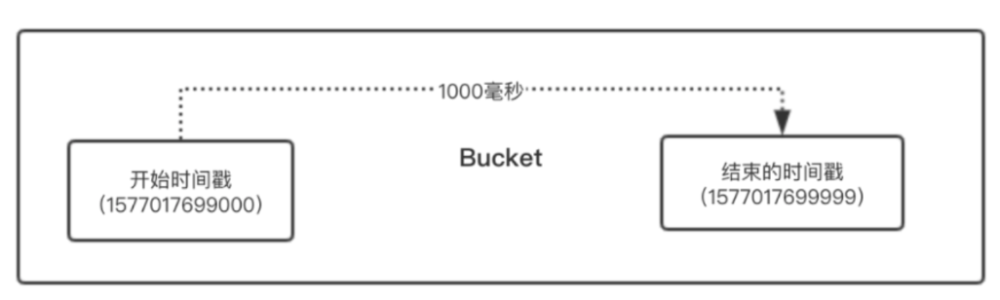 

由于每个 Bucket 存储的是 1 秒的数据，假设 Bucket 数组的大小是无限大的，那么我们只需要将当前时间戳去掉毫秒部分就能得到当前的秒数，将得到的秒数作为索引就能从 Bucket 数组中获取当前时间窗口的 Bucket。

一切资源均有限，所以我们不可能无限的存储 Bucket，我们也不需要存储那么多历史数据在内存中。当我们只需要保留一分钟的数据时，Bucket 数组的大小就可以设置为 60，我们希望这个数组可以循环使用，并且永远只保存最近 1 分钟的数据，这样不仅可以避免频繁的创建 Bucket，也减少内存资源的占用。

这种情况下如何定位 Bucket 呢？我们只需要将当前时间戳去掉毫秒部分得到当前的秒数，再将得到的秒数与数组长度取余数，就能得到当前时间窗口的 Bucket 在数组中的位置（索引），如下图所示：

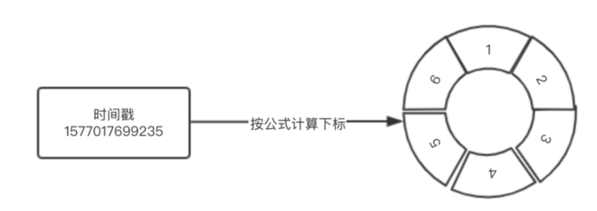 

根据当前时间戳计算出当前时间窗口的 Bucket 在数组中的索引，算法实现如下：

```
    private int calculateTimeIdx(long timeMillis) {
        /**
         * 假设当前时间戳为 1577017699235
         * windowLengthInMs 为 1000 毫秒（1 秒）
         * 则
         * 将毫秒转为秒 => 1577017699
         * 映射到数组的索引为 => 19
         */
        long timeId = timeMillis / windowLengthInMs;
        return (int) (timeId % array.length());
    }
```

calculateTimeIdx 方法中，取余数就是实现循环利用数组。如果想要获取连续的一分钟的 Bucket 数据，就不能简单的从头开始遍历数组，而是指定一个开始时间和结束时间，从开始时间戳开始计算 Bucket 存放在数组中的下标，然后循环每次将开始时间戳加上 1 秒，直到开始时间等于结束时间。

由于循环使用的问题，当前时间戳与一分钟之前的时间戳和一分钟之后的时间戳都会映射到数组中的同一个 Bucket，因此，必须要能够判断取得的 Bucket 是否是统计当前时间窗口内的指标数据，这便要数组每个元素都存储 Bucket 时间窗口的开始时间戳。

比如当前时间戳是 1577017699235，Bucket 统计一秒的数据，将时间戳的毫秒部分全部替换为 0，就能得到 Bucket 时间窗口的开始时间戳为 1577017699000。

计算 Bucket 时间窗口的开始时间戳代码实现如下：

```
    protected long calculateWindowStart(long timeMillis) {
        /**
         * 假设窗口大小为 1000 毫秒，即数组每个元素存储 1 秒钟的统计数据
         * timeMillis % windowLengthInMs 就是取得毫秒部分
         * timeMillis - 毫秒数 = 秒部分
         * 这就得到每秒的开始时间戳
         */
        return timeMillis - timeMillis % windowLengthInMs;
    }
```

#### WindowWrap

因为 Bucket 自身并不保存时间窗口信息，所以 Sentinel 给 Bucket 加了一个包装类 WindowWrap，用于记录 Bucket 的时间窗口信息，WindowWrap 源码如下

```
public class WindowWrap<T> {
    /**
     * 窗口时间长度（毫秒）
     */
    private final long windowLengthInMs;
    /**
     * 开始时间戳（毫秒）
     */
    private long windowStart;
    /**
     * 统计数据
     */
    private T value;
    public WindowWrap(long windowLengthInMs, long windowStart, T value) {
        this.windowLengthInMs = windowLengthInMs;
        this.windowStart = windowStart;
        this.value = value;
    }
}
```

如前面所说，假设 Bucket 以秒为单位统计指标数据，那么 Bucket 统计的就是一秒内的请求总数、异常总数这些指标数据。换算为毫秒为单位，比如时间窗口为 [1577017699000,1577017699999)，那么 1577017699000 就被称为该时间窗口的开始时间（windowStart）。一秒转为毫秒是 1000，所以 1000 就称为窗口时间大小（windowLengthInMs）

```
windowStart + windowLengthInMs = 时间窗口的结束时间
```

只要知道时间窗口的开始时间和窗口时间大小，只需要给定一个时间戳，就能知道该时间戳是否在 Bucket 的窗口时间内，代码实现如下

```
/**
     * 检查给定的时间戳是否在当前 bucket 中。
     *
     * @param timeMillis 时间戳，毫秒
     * @return
     */
    public boolean isTimeInWindow(long timeMillis) {
        return windowStart <= timeMillis && timeMillis < windowStart + windowLengthInMs;
    }
```


### 核心方法

#### 通过时间戳定位 Bucket

Bucket 用于统计各项指标数据，WindowWrap 用于记录 Bucket 的时间窗口信息，记录窗口的开始时间和窗口的大小，WindowWrap 数组就是一个滑动窗口。

当接收到一个请求时，可根据接收到请求的时间戳计算出一个数组索引，从滑动窗口（WindowWrap 数组）中获取一个 WindowWrap，从而获取 WindowWrap 包装的 Bucket，调用 Bucket 的 add 方法记录相应的事件。

根据当前时间戳定位 Bucket 的算法实现如下。

```java
   /**
     * 根据时间戳获取 bucket
     *
     * @param timeMillis 时间戳（毫秒）
     * @return 如果时间有效，则在提供的时间戳处显示当前存储桶项；如果时间无效，则为空
     */
    public WindowWrap<T> currentWindow(long timeMillis) {
        if (timeMillis < 0) {
            return null;
        }
        // 获取时间戳映射到的数组索引
        int idx = calculateTimeIdx(timeMillis);
        // 计算 bucket 时间窗口的开始时间
        long windowStart = calculateWindowStart(timeMillis);

        // 从数组中获取 bucket
        while (true) {
            WindowWrap<T> old = array.get(idx);
            // 一般是项目启动时，时间未到达一个周期，数组还没有存储满，没有到复用阶段，所以数组元素可能为空
            if (old == null) {
                // 创建新的 bucket，并创建一个 bucket 包装器
                WindowWrap<T> window = new WindowWrap<T>(windowLengthInMs, windowStart, newEmptyBucket(timeMillis));
                // cas 写入，确保线程安全，期望数组下标的元素是空的，否则就不写入，而是复用
                if (array.compareAndSet(idx, null, window)) {
                    return window;
                } else {
                    Thread.yield();
                }
            }
            // 如果 WindowWrap 的 windowStart 正好是当前时间戳计算出的时间窗口的开始时间，则就是我们想要的 bucket
            else if (windowStart == old.windowStart()) {
                return old;
            }
            // 复用旧的 bucket
            else if (windowStart > old.windowStart()) {
                if (updateLock.tryLock()) {
                    try {
                        // 重置 bucket，并指定 bucket 的新时间窗口的开始时间
                        return resetWindowTo(old, windowStart);
                    } finally {
                        updateLock.unlock();
                    }
                } else {
                    Thread.yield();
                }
            }
            // 计算出来的当前 bucket 时间窗口的开始时间比数组当前存储的 bucket 的时间窗口开始时间还小，
            // 直接返回一个空的 bucket 就行
            else if (windowStart < old.windowStart()) {
                return new WindowWrap<T>(windowLengthInMs, windowStart, newEmptyBucket(timeMillis));
            }
        }
    }
```

上面代码实现的是，通过当前时间戳计算出当前时间窗口的 Bucket（New Buket）在数组中的索引（cidx），以及 Bucket 时间窗口的开始时间，通过索引从数组中取得 Bucket（Old Bucket）。

- 当索引（cidx）处不存在 Bucket 时，创建一个新的 Bucket，并且确保线程安全写入到数组 cidx 处，将此 Bucket 返回；
- 当 Old Bucket 不为空时，且 Old Bucket 时间窗口的开始时间与当前计算得到的 New Buket 的时间窗口开始时间相等时，该 Bucket 就是当前要找的 Bucket，直接返回；
- 当计算出 New Bucket 时间窗口的开始时间大于当前数组 cidx 位置存储的 Old Bucket 时间窗口的开始时间时，可以复用这个 Old Bucket，确保线程安全重置 Bucket，并返回；
- 当计算出 New Bucket 时间窗口的开始时间小于当前数组 cidx 位置存储的 Old Bucket 时间窗口的开始时间时，直接返回一个空的 Bucket，因为时间不会倒退

#### 获取当前时间戳的前一个 Bucket

根据当前时间戳计算出当前 Bucket 的时间窗口开始时间，用当前 Bucket 的时间窗口开始时间减去一个窗口时间大小就能定位出前一个 Bucket。

由于是使用数组实现滑动窗口，数组的每个元素都会被循环使用，因此当前 Bucket 与前一个 Bucket 会有相差一个完整的滑动窗口周期的可能，如下图所示

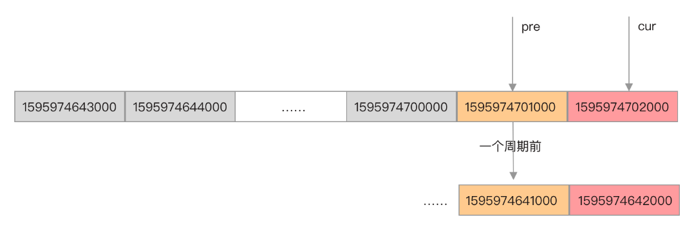 

当前时间戳对应的 Bucket 的时间窗口开始时间戳为 1595974702000，而前一个 Bucket 的时间窗口开始时间戳可能是 1595974701000，也可能是一个滑动窗口周期之前的 1595974641000。所以，在获取到当前 Bucket 的前一个 Bucket 时，需要根据 Bucket 的时间窗口开始时间与当前时间戳比较，如果跨了一个周期就是无效的。

### 小结

- WindowWrap 用于包装 Bucket，随着 Bucket 一起创建。
- WindowWrap 数组实现滑动窗口，Bucket 只负责统计各项指标数据，WindowWrap 用于记录 Bucket 的时间窗口信息。
- 定位 Bucket 实际上是定位 WindowWrap，拿到 WindowWrap 就能拿到 Bucket

## SPI机制

### Java SPI 简介

SPI 全称是 Service Provider Interface，直译就是服务提供者接口，是一种服务发现机制，是 Java 的一个内置标准，允许不同的开发者去实现某个特定的服务。SPI 的本质是将接口实现类的全限定名配置在文件中，由服务加载器读取配置文件，加载实现类，实现在运行时动态替换接口的实现类。

使用 SPI 机制能够实现按配置加载接口的实现类，SPI 机制在阿里开源的项目中被广泛使用，例如 Dubbo、RocketMQ、以及本文介绍的 Sentinel。RocketMQ 与 Sentinel 使用的都是 Java 提供的 SPI 机制，而 Dubbo 则是使用自实现的一套 SPI，与 Java SPI 的配置方式不同，Dubbo SPI 使用 Key-Value 方式配置，目的是实现自适应扩展机制

#### 使用demo

* **定义接口**

  假设我们有多种登录方式，则创建一个 LoginService 接口。

  ```java
  public interface LoginService{
    void login(String username,String password);
  }
  ```

* **编写接口实现类**

  假设一开始我们使用 Shiro 框架实现用户鉴权，提供了一个 ShiroLoginService。

  ```java
  public class ShiroLoginService implements LoginService{
    public void login(String username,String password){
      // 实现登陆
    }
  }
  ```

  现在我们不想搞那么麻烦，比如我们可以直接使用 Spring MVC 的拦截器实现用户鉴权，那么可以提供一个 SpringLoginService。

  ```java
  public class SpringLoginService implements LoginService{
    public void login(String username,String password){
      // 实现登陆
    }
  }
  ```

* **通过配置使用 SpringLoginService 或 ShiroLoginService**

  当我们想通过修改配置文件的方式而不修改代码实现权限验证框架的切换，就可以使用 Java 的 SPI。通过运行时从配置文件中读取实现类，加载使用配置的实现类。

  需要在 resources 目录下新建一个目录 META-INF，并在 META-INF 目录下创建 services 目录，用来存放接口配置文件。

  配置文件名为接口 LoginService 全类名，文件中写入使用的实现类的全类名。只要是在 META-INF/services 目录下，只要文件名是接口的全类名，那么编写配置文件内容的时候，IDEA 就会自动提示有哪些实现类。

  文件：/resources/META-INF/services/接口名称，填写的内容为接口的实现类，多个实现类使用换行分开

  ```
  com.wujiuye.spi.ShiroLoginService
  ```

* **第四步：编写 main 方法测试使用 Java SPI 加载 LoginService**

  ```
  public class JavaSPI{
    public static void main(String[] args){
      ServiceLoader<LoginService> serviceLoader = ServiceLoader.load(ServiceLoader.class);
      for(LoginService serviceImpl:serviceLoader){
        serviceImpl.login("wujiuye","123456");
      }
    }
  }
  ```

  ServiceLoader（服务加载器）是 Java 提供的 SPI 机制的实现，调用 load 方法传入接口名就能获取到一个 ServiceLoader 实例，此时配置文件中注册的实现类是还没有加载到 JVM 的，只有通过 Iterator 遍历获取的时候，才会去加载实现类与实例化实现类。

#### 小结

需要说明的是，例子中配置文件只配置了一个实现类，但其实我们是可以配置 N 多个的，并且 iterator 遍历的顺序就是配置文件中注册实现类的顺序。如果非要想一个注册多实现类的适用场景的话，责任链（拦截器、过滤器）模式这种可插拔的设计模式最适合不过。又或者一个画图程序，定义一个形状接口，实现类可以有矩形、三角形等，如果后期添加了圆形，只需要在形状接口的配置文件中注册圆形就能支持画圆形，完全不用修改任何代码。

ServiceLoader 源码很容易理解，就是根据传入的接口获取接口的全类名，将前缀“/META-INF/services”与接口的全类名拼接定位到配置文件，读取配置文件中的字符串、解析字符串，将解析出来的实现类全类名添加到一个数组，返回一个 ServiceLoader 实例。只有在遍历迭代器的时候 ServiceLoader 才通过调用 Class#forName 方法加载类并且通过反射创建实例，如果不指定类加载器，就使用当前线程的上下文类加载器加载类

### Sentinel使用spi

在 sentinel-core 模块的 resources 资源目录下，有一个 META-INF/services 目录，该目录下有两个以接口全名命名的文件，其中 com.alibaba.csp.sentinel.slotchain.SlotChainBuilder 文件用于配置 SlotChainBuilder 接口的实现类，com.alibaba.csp.sentinel.init.InitFunc 文件用于配置 InitFunc 接口的实现类，并且这两个配置文件中都配置了接口的默认实现类，如果我们不添加新的配置，Sentinel 将使用默认配置的接口实现类。

com.alibaba.csp.sentinel.init.InitFunc 文件的默认配置如下：

```txt
  com.alibaba.csp.sentinel.metric.extension.MetricCallbackInit
```

com.alibaba.csp.sentinel.slotchain.SlotChainBuilder 文件的默认配置如下：

```java
  # Default slot chain builder
  com.alibaba.csp.sentinel.slots.DefaultSlotChainBuilder
```

ServiceLoader 可加载接口配置文件中配置的所有实现类并且使用反射创建对象，但是否全部加载以及实例化还是由使用者自己决定。

Sentinel 的 core 模块使用 Java SPI 机制加载 InitFunc 与 SlotChainBuilder 的实现上稍有不同，如果 InitFunc 接口的配置文件注册了多个实现类，那么这些注册的 InitFunc 实现类都会被 Sentinel 加载、实例化，且都会被使用，但 SlotChainBuilder 不同，如果注册多个实现类，Sentinel 只会加载和使用第一个。

#### SlotChainBuilder 

调用 ServiceLoader#load 方法传入接口可获取到一个 ServiceLoader 实例，ServiceLoader 实现了 Iterable 接口，所以可以使用 forEach 语法遍历，ServiceLoader 使用 layz 方式实现迭代器（Iterator），只有被迭代器的 next 方法遍历到的类才会被加载和实例化。如果只想使用接口配置文件中注册的第一个实现类，那么可在使用迭代器遍历时，使用 break 跳出循环。

Sentinel 在加载 SlotChainBuilder 时，只会获取第一个非默认（非 DefaultSlotChainBuilder）实现类的实例，如果接口配置文件中除了默认实现类没有注册别的实现类，则 Sentinel 会使用这个默认的 SlotChainBuilder。其实现源码在 SpiLoader 的 loadFirstInstanceOrDefault 方法中，代码如下。

```java
public final class SpiLoader {
    public static <T> T loadFirstInstanceOrDefault(Class<T> clazz, Class<? extends T> defaultClass) {
        try {
            // 缓存的实现省略...
            // 返回第一个类型不等于 defaultClass 的实例
            // ServiceLoader 实现了 Iterable 接口
            for (T instance : serviceLoader) {
                // 获取第一个非默认类的实例
                if (instance.getClass() != defaultClass) {
                    return instance;
                }
            }
            // 没有则使用默认类的实例，反射创建对象
            return defaultClass.newInstance();
        } catch (Throwable t) {
            return null;
        }
    }
}
```

#### InitFunc 

Sentinel 加载 InitFunc 则不同，因为 Sentinel 允许存在多个初始化方法。InitFunc 可用于初始化配置限流、熔断规则，但在 Web 项目中我们基本不会使用它，更多的是通过监听 Spring 容器刷新完成事件再去初始化为 Sentinel 配置规则，如果使用动态数据源还可在监听到动态配置改变事件时重新加载规则，所以 InitFunc 我们基本使用不上。

Sentinel 使用 ServiceLoader 加载注册的 InitFunc 实现代码如下：

```java
public final class InitExecutor {

    public static void doInit() {
        try {
            // 加载配置
            ServiceLoader<InitFunc> loader = ServiceLoaderUtil.getServiceLoader(InitFunc.class);
            List<OrderWrapper> initList = new ArrayList<OrderWrapper>();
            for (InitFunc initFunc : loader) {
               // 插入数组并排序，同时将 InitFunc 包装为 OrderWrapper
                insertSorted(initList, initFunc);
            }
            // 遍历调用 InitFunc 的初始化方法
            for (OrderWrapper w : initList) {
                w.func.init();
            }
        } catch (Exception ex) {
            ex.printStackTrace();
        } catch (Error error) {
            error.printStackTrace();
        }
    }
}
```

#### 小结

虽然 InitFunc 接口与 SlotChainBuilder 接口的配置文件在 sentinel-core 模块下，但我们不需要去修改 Sentinel 的源码，不需要修改 sentinel-core 模块下的接口配置文件，而只需要在当前项目的 /resource/META-INF/services 目录下创建一个与接口全名相同名称的配置文件，并在配置文件中添加接口的实现类即可。**项目编译后不会覆盖 sentinel-core 模块下的相同名称的配置文件，而是将两个配置文件合并成一个配置文件**。

### 自定义 ProcessorSlotChain 构造器

Sentinel 使用 SlotChainBuilder 将多个 ProcessorSlot 构造成一个 ProcessorSlotChain，由 ProcessorSlotChain 按照 ProcessorSlot 的注册顺序去调用这些 ProcessorSlot。Sentinel 使用 Java SPI 加载 SlotChainBuilder 支持使用者自定义 SlotChainBuilder，相当于是提供了插件的功能。

Sentinel 默认使用的 SlotChainBuilder 是 DefaultSlotChainBuilder，其源码如下：

```java
public class DefaultSlotChainBuilder implements SlotChainBuilder {

    @Override
    public ProcessorSlotChain build() {
        ProcessorSlotChain chain = new DefaultProcessorSlotChain();
        chain.addLast(new NodeSelectorSlot());
        chain.addLast(new ClusterBuilderSlot());
        chain.addLast(new LogSlot());
        chain.addLast(new StatisticSlot());
        chain.addLast(new AuthoritySlot());
        chain.addLast(new SystemSlot());
        chain.addLast(new FlowSlot());
        chain.addLast(new DegradeSlot());
        return chain;
    }

}
```

DefaultSlotChainBuilder 构造的 ProcessorSlotChain 注册了 NodeSelectorSlot、ClusterBuilderSlot、LogSlot、StatisticSlot、AuthoritySlot、SystemSlot、FlowSlot、DegradeSlot，但这些 ProcessorSlot 并非都是必须的，如果注册的这些 ProcessorSlot 有些我们用不到，那么我们可以自己实现一个 SlotChainBuilder，自己构造 ProcessorSlotChain。例如，我们可以将 LogSlot、AuthoritySlot、SystemSlot 去掉

#### 编写 MySlotChainBuilder

第一步，编写 MySlotChainBuilder，实现 SlotChainBuilder 接口，代码如下：

```java
public class MySlotChainBuilder implements SlotChainBuilder {

    @Override
    public ProcessorSlotChain build() {
        ProcessorSlotChain chain = new DefaultProcessorSlotChain();
        chain.addLast(new NodeSelectorSlot());
        chain.addLast(new ClusterBuilderSlot());
        chain.addLast(new StatisticSlot());
        chain.addLast(new FlowSlot());
        chain.addLast(new DegradeSlot());
        return chain;
    }

}
```

#### 配置文件

第二步，在当前项目的 /resources/META-INF/services 目录下添加名为 com.alibaba.csp.sentinel.slotchain.SlotChainBuilder 的接口配置文件，并在配置文件中注册 MySlotChainBuilder。

```txt
com.wujiuye.sck.provider.config.MySlotChainBuilder
```

在构造 ProcessorSlotChain 时，需注意 ProcessorSlot 的注册顺序，例如，NodeSelectorSlot 需作为 ClusterBuilderSlot 的前驱节点，ClusterBuilderSlot 需作为 StatisticSlot 的前驱节点，否则 Sentinel 运行会出现 bug。但你可以将 DegradeSlot 放在 FlowSlot 的前面，这就是我们前面说的 ProcessorSlot 的排序

### 小结

Sentinel 使用 Java SPI 为我们提供了插件的功能，也类似于 Spring Boot 提供的自动配置类注册功能。我们可以直接替换 Sentinel 提供的默认 SlotChainBuilder，使用自定义的 SlotChainBuilder 自己构造 ProcessorSlotChain，以此实现修改 ProcessorSlot 排序顺序以及增加或移除 ProcessorSlot。在 Sentinel 1.7.2 版本中，Sentinel 支持使用 SPI 注册 ProcessorSlot，并且支持排序