## 指标统计实现

### NodeSelectorSlot

NodeSelectorSlot 负责为资源的首次访问创建 DefaultNode，以及维护 Context.curNode 和调用树。NodeSelectorSlot 被放在 ProcessorSlotChain 链表的第一个位置，这是因为后续的 ProcessorSlot 都需要依赖这个 ProcessorSlot。NodeSelectorSlot 源码如下：

```java
public class NodeSelectorSlot extends AbstractLinkedProcessorSlot<Object> {
    // Context 的 name -> 资源的 DefaultNode
    private volatile Map<String, DefaultNode> map = new HashMap<>(10);
    // 入口方法
    @Override
    public void entry(Context context, ResourceWrapper resourceWrapper, Object obj, int count, boolean prioritized, Object... args) throws Throwable {
        // 使用 Context 的名称作为 key 缓存资源的 DefaultNode
        DefaultNode node = map.get(context.getName());
        if (node == null) {
            synchronized (this) {
                node = map.get(context.getName());
                if (node == null) {
                    // 为资源创建 DefaultNode
                    node = new DefaultNode(resourceWrapper, null);
                    // 替换 map
                    HashMap<String, DefaultNode> cacheMap = new HashMap<>(map.size());
                    cacheMap.putAll(map);
                    cacheMap.put(context.getName(), node);
                    map = cacheMap;
                    // 绑定调用树
                    ((DefaultNode) context.getLastNode()).addChild(node);
                }
            }
        }
        // 替换 Context 的 curNode 为当前 DefaultNode
        context.setCurNode(node);
        fireEntry(context, resourceWrapper, node, count, prioritized, args);
    }

    // 出口方法什么也不做
    @Override
    public void exit(Context context, ResourceWrapper resourceWrapper, int count, Object... args) {
        fireExit(context, resourceWrapper, count, args);
    }
}
```

* 如源码所示，map 字段是一个非静态字段，意味着每个 NodeSelectorSlot 都有一个 map。由于一个资源对应一个 ProcessorSlotChain，而一个 ProcessorSlotChain 只创建一个 NodeSelectorSlot，并且 map 缓存 DefaultNode 使用的 key 并非资源 ID，而是 Context.name，所以 map 的作用是缓存针对同一资源为不同调用链路入口创建的 DefaultNode。
* 在 entry 方法中，首先根据 Context.name 从 map 获取当前调用链路入口的资源 DefaultNode，如果资源第一次被访问，也就是资源的 ProcessorSlotChain 第一次被创建，那么这个 map 是空的，就会加锁为资源创建 DefaultNode，如果资源不是首次被访问，但却首次作为当前调用链路（Context）的入口资源，也需要加锁为资源创建一个 DefaultNode。

**可见，Sentinel 会为同一资源 ID 创建多少个 DefaultNode 取决于有多少个调用链使用其作为入口资源，直白点就是同一资源存在多少个 DefaultNode 取决于 Context.name 有多少种不同取值，这就是为什么说一个资源可能有多个 DefaultNode 的原因**

举个例子，对同一支付接口，我们需要使用 Spring MVC 暴露给前端访问，同时也可能会使用 Dubbo 暴露给其它内部服务调用。Sentinel 的 Web MVC 适配器在调用链路入口创建名为“sentinel_spring_web_context”的 Context，与 Sentinel 的 Dubbo 适配器调用 ContextUtil#enter 方法创建的 Context 名称不同。针对这种情况，我们可以实现只限制 Spring MVC 进来的流量，也就是限制前端发起接口调用的 QPS、并行占用的线程数等。

NodeSelectorSlot#entry 方法最难以理解的就是实现绑定调用树这行代码：

```java
((DefaultNode) context.getLastNode()).addChild(node);
```

这行代码分两种情况分析更容易理解，我们就以 Sentinel 提供的 Demo 为例进行分析

#### 单多次 SphU#entry

Sentinel 的 sentinel-demo 模块下提供了多种使用场景的 Demo，我们选择 sentinel-demo-spring-webmvc 这个 Demo 为例，该 Demo 下有一个 hello 接口，其代码如下

```
@RestController
public class WebMvcTestController {

    @GetMapping("/hello")
    public String apiHello() throws BlockException {
        doBusiness();
        return "Hello!";
    }
}
```

我们不需要添加任何规则，只是为了调试 Sentinel 的源码。将 demo 启动起来后，在浏览器访问“/hello”接口，在 NodeSelectorSlot#entry 方法的绑定调用树这一行代码下断点，观察此时 Context 的字段信息。正常情况下我们可以看到如下图所示的结果

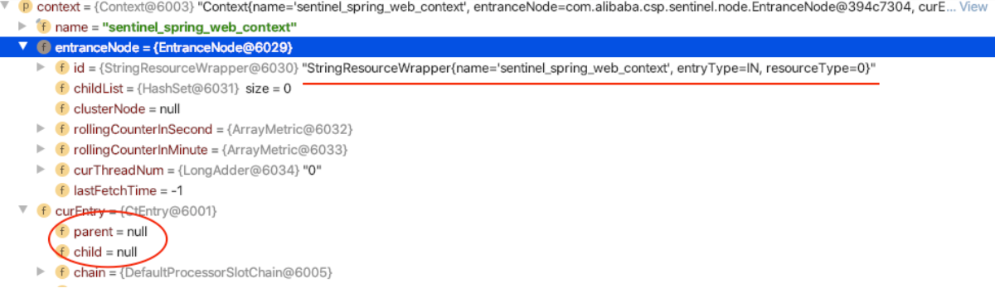 

从上图中可以看出，此时的 Context.entranceNode 的子节点为空（childList 的大小为 0），并且当前 CtEntry 父、子节点都是 Null（curEntry 字段）。当绑定调用树这一行代码执行完成后，Context 的字段信息如下图所示：

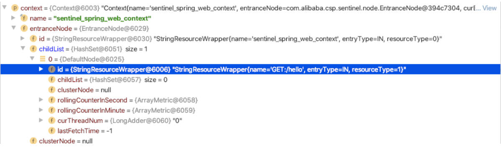 

从上图可以看出，NodeSelectorSlot 为当前资源创建的 DefaultNode 被添加到了 Context.entranceNode 的子节点。entranceNode 类型为 EntranceNode，在调用 ContextUtil#enter 方法时创建，在第一次创建名为“sentinel_spring_web_context”的 Context 时创建，相同名称的 Context 都使用同一个 EntranceNode。并且该 EntranceNode 在创建时会被添加到 Constant.ROOT。

此时，Constant.ROOT、Context.entranceNode、当前访问资源的 DefaultNode 构造成的调用树如下：

```java
           ROOT (machine-root)
                /
      EntranceNode (context name: sentinel_spring_web_context)
             /
DefaultNode （resource name: GET:/hello）
```

如果我们现在再访问 Demo 的其他接口，例如访问“/err”接口，那么生成的调用树就会变成如下：

```java
                        ROOT (machine-root)
                            /
      EntranceNode (context name: sentinel_spring_web_context)
                    /                                \
DefaultNode （resource name: GET:/hello）     DefaultNode （resource name: GET:/err） 
```

Context.entranceNode 将会存储 Web 项目的所有资源（接口）的 DefaultNode

#### **多次 SphU#entry**

比如我们在一个服务中添加了 Sentinel 的 Web MVC 适配模块的依赖，也添加了 Sentinel 的 OpenFeign 适配模块的依赖，并且我们使用 OpenFeign 调用内部其他服务的接口，那么就会存在一次调用链路上出现多次调用 SphU#entry 方法的情况。

首先 webmvc 适配器在接收客户端请求时会调用一次 SphU#entry，在处理客户端请求时可能需要使用 OpenFeign 调用其它服务的接口，那么在发起接口调用时，Sentinel 的 OpenFeign 适配器也会调用一次 SphU#entry。

现在我们将 Demo 的 hello 接口修改一下，将 hello 接口调用的 doBusiness 方法也作为资源使用 Sentinel 保护起来，改造后的 hello 接口代码如下：

```java
@RestController
public class WebMvcTestController {

    @GetMapping("/hello")
    public String apiHello() throws BlockException {
        ContextUtil.enter("my_context");
        Entry entry = null;
        try {
            entry = SphU.entry("POST:http://wujiuye.com/hello2", EntryType.OUT);
            // ==== 这里是被包装的代码 =====
            doBusiness();
            return "Hello!";
            // ==== end ===============
        } catch (Exception e) {
            if (!(e instanceof BlockException)) {
                Tracer.trace(e);
            }
            throw e;
        } finally {
            if (entry != null) {
                entry.exit(1);
            }
            ContextUtil.exit();
        }
    }
}
```

我们可将 doBusiness 方法看成是远程调用，例如调用第三方的接口，接口名称为“http://wujiuye.com/hello2”，使用 POST 方式调用，那么我们可以使用“POST:http://wujiuye.com/hello2”作为资源名称，并将流量类型设置为 OUT 类型。上下文名称取名为”my_context”

现在启动 demo，使用浏览器访问“/hello”接口。当代码执行到 apiHello 方法时，在 NodeSelectorSlot#entry 方法的绑定调用树这一行代码下断点。当绑定调用树这行代码执行完成后，Context 的字段信息如下图所示：

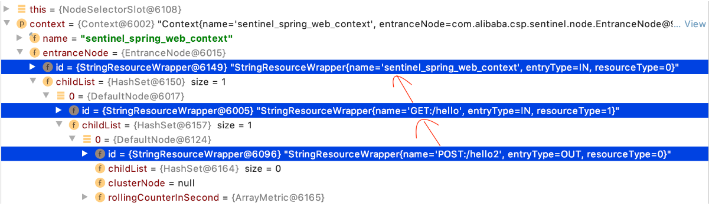 

如图所示，Sentinel 并没有创建名称为 my_context 的 Context，还是使用应用接收到请求时创建名为“sentinel_spring_web_context”的 Context，所以处理浏览器发送过来的请求的“GET:/hello”资源是本次调用链路的入口资源，Sentinel 在调用链路入口处创建 Context 之后不再创建新的 Context。

由于之前并没有为名称为“POST:http://wujiuye.com/hello2”的资源创建 ProcessorSlotChain，所以 SphU#entry 会为该资源创建一个 ProcessorSlotChain，也就会为该 ProcessorSlotChain 创建一个 NodeSelectorSlot。在执行到 NodeSelectorSlot#entry 方法时，就会为该资源创建一个 DefaultNode，而将该资源的 DefaultNode 绑定到节点树后，该资源的 DefaultNode 就会成为“GET:/hello”资源的 DefaultNode 的子节点，调用树如下。

```java
                    ROOT (machine-root)
                    /
    EntranceNode (name: sentinel_spring_web_context)
                 /                       \
          DefaultNode （GET:/hello）   .........
               /
         DefaultNode  (POST:/hello2)
```

此时，当前调用链路上也已经存在两个 CtEntry，这两个 CtEntry 构造一个双向链表，如下图所示：

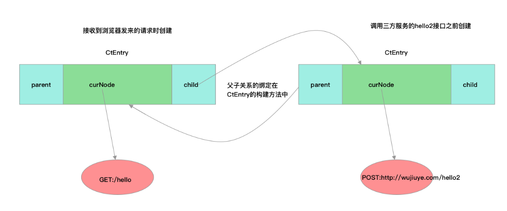 

虽然存在两个 CtEntry，但此时 Context.curEntry 指向第二个 CtEntry，第二个 CtEntry 在 apiHello 方法中调用 SphU#entry 方法时创建，当执行完 doBusiness 方法后，调用当前 CtEntry#exit 方法，由该 CtEntry 将 Context.curEntry 还原为该 CtEntry 的父 CtEntry。这有点像入栈和出栈操作，例如栈帧在 Java 虚拟机栈的入栈和出栈，调用方法时方法的栈帧入栈，方法执行完成栈帧出栈。

NodeSelectorSlot#entry 方法我们还有一行代码没有分析，就是将当前创建的 DefaultNode 设置为 Context 的当前节点，代码如下：

```java
// 替换 Context.curNode 为当前 DefaultNode
context.setCurNode(node);
```

替换 Context.curNode 为当前资源 DefaultNode 这行代码就是将当前创建的 DefaultNode 赋值给当前 CtEntry.curNode。对着上图理解就是，将资源“GET:/hello”的 DefaultNode 赋值给第一个 CtEntry.curNode，将资源“POST:http://wujiuye.com/hello2”的 DefaultNode 赋值给第二个 CtEntry.curNode。

要理解 Sentinel 构造 CtEntry 双向链表的目的，首先我们需要了解调用 Context#getCurNode 方法获取当前资源的 DefaultNode 可以做什么。

Tracer#tracer 方法用于记录异常。以异常指标数据统计为例，在发生非 Block 异常时，Tracer#tracer 需要从 Context 获取当前资源的 DefaultNode，通知 DefaultNode 记录异常，同时 DefaultNode 也会通知 ClusterNode 记录记录，如下代码所示。

```java
public class DefaultNode extends StatisticNode {
  ......
  @Override
    public void increaseExceptionQps(int count) {
        super.increaseExceptionQps(count);
        this.clusterNode.increaseExceptionQps(count);
    }
}
```

这个例子虽然简单，但也足以说明 Sentinel 构造 CtEntry 双向链表的目的

### ClusterBuilderSlot

#### **ClusterNode 出现的背景**

在一个资源的 ProcessorSlotChain 中，NodeSelectorSlot 负责为资源创建 DefaultNode，这个 DefaultNode 仅限同名的 Context 使用。所以一个资源可能会存在多个 DefaultNode，那么想要获取一个资源的总的 QPS 就必须要遍历这些 DefaultNode。为了性能考虑，Sentinel 会为每个资源创建一个全局唯一的 ClusterNode，用于统计资源的全局并行占用线程数、QPS、异常总数等指标数据。

#### **ClusterBuilderSlot**

与 NodeSelectorSlot 的职责相似，ClusterBuilderSlot 的职责是为资源创建全局唯一的 ClusterNode，仅在资源第一次被访问时创建。ClusterBuilderSlot 还会将 ClusterNode 赋值给 DefaultNode.clusterNode，由 DefaultNode 持有 ClusterNode，负责管理 ClusterNode 的指标数据统计。这点也是 ClusterBuilderSlot 在 ProcessorSlotChain 链表中必须排在 NodeSelectorSlot 之后的原因，即必须先有 DefaultNode，才能将 ClusterNode 交给 DefaultNode 管理。

ClusterBuilderSlot 的源码比较多，本篇只分析其实现 ProcessorSlot 接口的 entry 和 exit 方法。ClusterBuilderSlot 删减后的源码如下。

```java
public class ClusterBuilderSlot extends AbstractLinkedProcessorSlot<DefaultNode> {
    // 资源 -> ClusterNode
    private static volatile Map<ResourceWrapper, ClusterNode> clusterNodeMap = new HashMap<>();
    private static final Object lock = new Object();

    // 非静态，一个资源对应一个 ProcessorSlotChain，所以一个资源共用一个 ClusterNode
    private volatile ClusterNode clusterNode = null;

    @Override
    public void entry(Context context, ResourceWrapper resourceWrapper, DefaultNode node, int count,
                      boolean prioritized, Object... args)
            throws Throwable {
        if (clusterNode == null) {
            synchronized (lock) {
                if (clusterNode == null) {
                    // 创建 ClusterNode
                    clusterNode = new ClusterNode(resourceWrapper.getName(), resourceWrapper.getResourceType());
                    // 添加到缓存
                    HashMap<ResourceWrapper, ClusterNode> newMap = new HashMap<>(Math.max(clusterNodeMap.size(), 16));
                    newMap.putAll(clusterNodeMap);
                    newMap.put(node.getId(), clusterNode);
                    clusterNodeMap = newMap;
                }
            }
        }
        // node 为 NodeSelectorSlot 传递过来的 DefaultNode
        node.setClusterNode(clusterNode);
        // 如果 origin 不为空，则为远程创建一个 StatisticNode
        if (!"".equals(context.getOrigin())) {
            Node originNode = node.getClusterNode().getOrCreateOriginNode(context.getOrigin());
            context.getCurEntry().setOriginNode(originNode);
        }
        fireEntry(context, resourceWrapper, node, count, prioritized, args);
    }

    @Override
    public void exit(Context context, ResourceWrapper resourceWrapper, int count, Object... args) {
        fireExit(context, resourceWrapper, count, args);
    }
}
```

ClusterBuilderSlot 使用一个 Map 缓存资源的 ClusterNode，并且用一个非静态的字段维护当前资源的 ClusterNode。因为一个资源只会创建一个 ProcessorSlotChain，意味着 ClusterBuilderSlot 也只会创建一个，那么让 ClusterBuilderSlot 持有该资源的 ClusterNode 就可以省去每次都从 Map 中获取的步骤，这当然也是 Sentinel 为性能做出的努力。

ClusterBuilderSlot#entry 方法的 node 参数由前一个 ProcessorSlot 传递过来，也就是 NodeSelectorSlot 传递过来的 DefaultNode。ClusterBuilderSlot 将 ClusterNode 赋值给 DefaultNode.clusterNode，那么后续的 ProcessorSlot 就能从 node 参数中取得 ClusterNode。DefaultNode 与 ClusterNode 的关系如下图所示。

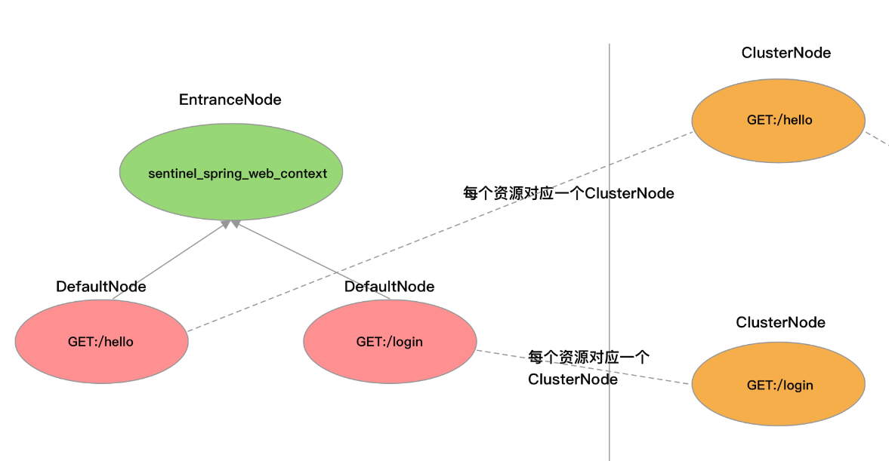 

ClusterNode 有一个 Map 类型的字段用来缓存 origin 与 StatisticNode 的映射，代码如下：

```java
public class ClusterNode extends StatisticNode {
    private final String name;
    private final int resourceType;
    private Map<String, StatisticNode> originCountMap = new HashMap<>();
}
```

如果上游服务在调用当前服务的接口传递 origin 字段过来，例如可在 http 请求头添加“S-user”参数，或者 Dubbo rpc 调用在请求参数列表加上“application”参数，那么 ClusterBuilderSlot 就会为 ClusterNode 创建一个 StatisticNode，用来统计当前资源被远程服务调用的指标数据。

例如，当 origin 表示来源应用的名称时，对应的 StatisticNode 统计的就是针对该调用来源的指标数据，可用来查看哪个服务访问这个接口最频繁，由此可实现按调用来源限流。

ClusterNode#getOrCreateOriginNode 方法源码如下：

```java
   public Node getOrCreateOriginNode(String origin) {
        StatisticNode statisticNode = originCountMap.get(origin);
        if (statisticNode == null) {
            try {
                lock.lock();
                statisticNode = originCountMap.get(origin);
                if (statisticNode == null) {
                    statisticNode = new StatisticNode();
                    // 这几行代码在 Sentinel 中随处可见
                    HashMap<String, StatisticNode> newMap = new HashMap<>(originCountMap.size() + 1);
                    newMap.putAll(originCountMap);
                    newMap.put(origin, statisticNode);
                    originCountMap = newMap;
                }
            } finally {
                lock.unlock();
            }
        }
        return statisticNode;
    }
```

为了便于使用，ClusterBuilderSlot 会将调用来源（origin）的 StatisticNode 赋值给 Context.curEntry.originNode，后续的 ProcessorSlot 可调用 Context#getCurEntry#getOriginNode 方法获取该 StatisticNode。这里我们可以得出一个结论，如果我们自定义的 ProcessorSlot 需要用到调用来源的 StatisticNode，那么在构建 ProcessorSlotChain 时，我们必须要将这个自定义 ProcessorSlot 放在 ClusterBuilderSlot 之后。

### StatisticSlot

StatisticSlot 才是实现资源各项指标数据统计的 ProcessorSlot，它与 NodeSelectorSlot、ClusterBuilderSlot 组成了资源指标数据统计流水线，分工明确。

首先 NodeSelectorSlot 为资源创建 DefaultNode，将 DefaultNode 向下传递，ClusterBuilderSlot 负责给资源的 DefaultNode 加工，添加 ClusterNode 这个零部件，再将 DefaultNode 向下传递给 StatisticSlot，如下图所示：

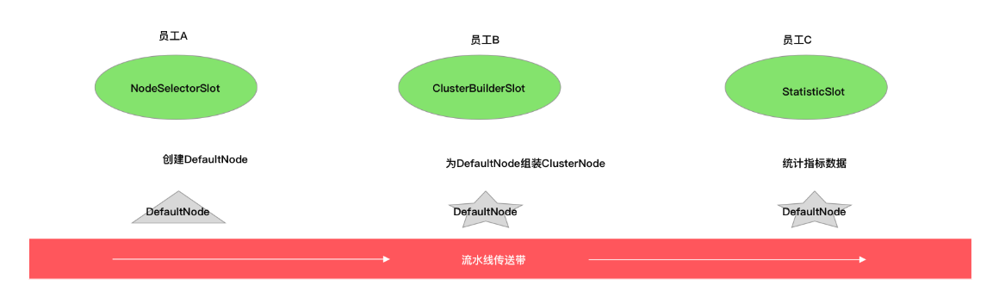 

StatisticSlot 在统计指标数据之前会先调用后续的 ProcessorSlot，根据后续 ProcessorSlot 判断是否需要拒绝该请求的结果决定记录哪些指标数据，这也是为什么 Sentinel 设计的责任链需要由前一个 ProcessorSlot 在 entry 或者 exit 方法中调用 fireEntry 或者 fireExit 完成调用下一个 ProcessorSlot 的 entry 或 exit 方法，而不是使用 for 循环遍历调用 ProcessorSlot 的原因。每个 ProcessorSlot 都有权决定是先等后续的 ProcessorSlot 执行完成再做自己的事情，还是先完成自己的事情再让后续 ProcessorSlot 执行，与流水线有所区别

StatisticSlot 源码框架如下：

```
public class StatisticSlot extends AbstractLinkedProcessorSlot<DefaultNode> {

    @Override
    public void entry(Context context, ResourceWrapper resourceWrapper, DefaultNode node, int count,
                      boolean prioritized, Object... args) throws Throwable {
        try {
            // Do some checking.
            fireEntry(context, resourceWrapper, node, count, prioritized, args);
           // .....
        } catch (PriorityWaitException ex) {
            // .....
        } catch (BlockException e) {
            // ....
            throw e;
        } catch (Throwable e) {
            // .....
            throw e;
        }
    }

    @Override
    public void exit(Context context, ResourceWrapper resourceWrapper, int count, Object... args) {
        DefaultNode node = (DefaultNode)context.getCurNode();
        // ....
        fireExit(context, resourceWrapper, count);
    }
}

```

- entry：先调用 fireEntry 方法完成调用后续的 ProcessorSlot#entry 方法，根据后续的 ProcessorSlot 是否抛出 BlockException 决定记录哪些指标数据，并将资源并行占用的线程数加 1。
- exit：若无任何异常，则记录响应成功、请求执行耗时，将资源并行占用的线程数减 1

#### 放行请求

第一种情况：当后续的 ProcessorSlot 未抛出任何异常时，表示不需要拒绝该请求，放行当前请求

当请求可正常通过时，需要将当前资源并行占用的线程数增加 1、当前时间窗口被放行的请求总数加 1，代码如下：

```java
            // Request passed, add thread count and pass count.
            node.increaseThreadNum();
            node.addPassRequest(count);
```

如果调用来源不为空，也将调用来源的 StatisticNode 的当前并行占用线程数加 1、当前时间窗口被放行的请求数加 1，代码如下：

```java
            if (context.getCurEntry().getOriginNode() != null) {
                // Add count for origin node.
                context.getCurEntry().getOriginNode().increaseThreadNum();
                context.getCurEntry().getOriginNode().addPassRequest(count);
            }
```

如果流量类型为 IN，则将资源全局唯一的 ClusterNode 的并行占用线程数、当前时间窗口被放行的请求数都增加 1，代码如下：

```java
           if (resourceWrapper.getEntryType() == EntryType.IN) {
                // Add count for global inbound entry node for global statistics.
                Constants.ENTRY_NODE.increaseThreadNum();
                Constants.ENTRY_NODE.addPassRequest(count);
            }
```

回调所有 ProcessorSlotEntryCallback#onPass 方法，代码如下：

```java
            // Handle pass event with registered entry callback handlers.
            for (ProcessorSlotEntryCallback<DefaultNode> handler : StatisticSlotCallbackRegistry.getEntryCallbacks()) {
                handler.onPass(context, resourceWrapper, node, count, args);
            }
```

可调用 StatisticSlotCallbackRegistry#addEntryCallback 静态方法注册 ProcessorSlotEntryCallback，ProcessorSlotEntryCallback 接口的定义如下：

```java
public interface ProcessorSlotEntryCallback<T> {
    void onPass(Context context, ResourceWrapper resourceWrapper, T param, int count, Object... args) throws Exception;
    void onBlocked(BlockException ex, Context context, ResourceWrapper resourceWrapper, T param, int count, Object... args);
}
```

- onPass：该方法在请求被放行时被回调执行。
- onBlocked：该方法在请求被拒绝时被回调执行

#### PriorityWaitException异常

这是特殊情况，在需要对请求限流时，只有使用默认流量效果控制器才可能会抛出 PriorityWaitException 异常，这部分内容将在分析 FlowSlot 的实现源码时再作分析。

当捕获到 PriorityWaitException 异常时，说明当前请求已经被休眠了一会了，但请求还是允许通过的，只是不需要为 DefaultNode 记录这个请求的指标数据了，只自增当前资源并行占用的线程数，同时，DefaultNode 也会为 ClusterNode 自增并行占用的线程数。最后也会回调所有 ProcessorSlotEntryCallback#onPass 方法。这部分源码如下

```java
            node.increaseThreadNum();
            if (context.getCurEntry().getOriginNode() != null) {
                // Add count for origin node.
                context.getCurEntry().getOriginNode().increaseThreadNum();
            }
            if (resourceWrapper.getEntryType() == EntryType.IN) {
                // Add count for global inbound entry node for global statistics.
                Constants.ENTRY_NODE.increaseThreadNum();
            }
            // Handle pass event with registered entry callback handlers.
            for (ProcessorSlotEntryCallback<DefaultNode> handler : StatisticSlotCallbackRegistry.getEntryCallbacks()) {
                handler.onPass(context, resourceWrapper, node, count, args);
            }
```

#### BlockException 异常

捕获到 BlockException 异常，BlockException 异常只在需要拒绝请求时抛出

当捕获到 BlockException 异常时，将异常记录到调用链路上下文的当前 Entry（StatisticSlot 的 exit 方法会用到），然后调用 DefaultNode#increaseBlockQps 方法记录当前请求被拒绝，将当前时间窗口的 block qps 这项指标数据的值加 1。如果调用来源不为空，让调用来源的 StatisticsNode 也记录当前请求被拒绝；如果流量类型为 IN，则让用于统计所有资源指标数据的 ClusterNode 也记录当前请求被拒绝。这部分的源码如下：

```java
            // Blocked, set block exception to current entry.
            context.getCurEntry().setError(e);

            // Add block count.
            node.increaseBlockQps(count);
            if (context.getCurEntry().getOriginNode() != null) {
                context.getCurEntry().getOriginNode().increaseBlockQps(count);
            }

            if (resourceWrapper.getEntryType() == EntryType.IN) {
                // Add count for global inbound entry node for global statistics.
                Constants.ENTRY_NODE.increaseBlockQps(count);
            }

            // Handle block event with registered entry callback handlers.
            for (ProcessorSlotEntryCallback<DefaultNode> handler : StatisticSlotCallbackRegistry.getEntryCallbacks()) {
                handler.onBlocked(e, context, resourceWrapper, node, count, args);
            }

            throw e;
```

StatisticSlot 捕获 BlockException 异常只是为了收集被拒绝的请求，BlockException 异常还是会往上抛出。抛出异常的目的是为了拦住请求，让入口处能够执行到 catch 代码块完成请求被拒绝后的服务降级处理

#### 其它异常

其它异常并非指业务异常，因为此时业务代码还未执行，而业务代码抛出的异常是通过调用 Tracer#trace 方法记录的。

当捕获到非 BlockException 异常时，除 PriorityWaitException 异常外，其它类型的异常都同样处理。让 DefaultNode 记录当前请求异常，将当前时间窗口的 exception qps 这项指标数据的值加 1。调用来源的 StatisticsNode、用于统计所有资源指标数据的 ClusterNode 也记录下这个异常。这部分源码如下：

```java
           // Unexpected error, set error to current entry.
            context.getCurEntry().setError(e);

            // This should not happen.
            node.increaseExceptionQps(count);
            if (context.getCurEntry().getOriginNode() != null) {
                context.getCurEntry().getOriginNode().increaseExceptionQps(count);
            }

            if (resourceWrapper.getEntryType() == EntryType.IN) {
                Constants.ENTRY_NODE.increaseExceptionQps(count);
            }
            throw e;
```

#### **exit 方法**

exit 方法被调用时，要么请求被拒绝，要么请求被放行并且已经执行完成，所以 exit 方法需要知道当前请求是否正常执行完成，这正是 StatisticSlot 在捕获异常时将异常记录到当前 Entry 的原因，exit 方法中通过 Context 可获取到当前 CtEntry，从当前 CtEntry 可获取 entry 方法中写入的异常。

exit 方法源码如下（有删减）：

```java
@Override
    public void exit(Context context, ResourceWrapper resourceWrapper, int count, Object... args) {
        DefaultNode node = (DefaultNode)context.getCurNode();
        if (context.getCurEntry().getError() == null) {
            // 计算耗时
            long rt = TimeUtil.currentTimeMillis() - context.getCurEntry().getCreateTime();
            // 记录执行耗时与成功总数
            node.addRtAndSuccess(rt, count);
            if (context.getCurEntry().getOriginNode() != null) {
                context.getCurEntry().getOriginNode().addRtAndSuccess(rt, count);
            }
            // 自减当前资源占用的线程数
            node.decreaseThreadNum();
            // origin 不为空
            if (context.getCurEntry().getOriginNode() != null) {
                context.getCurEntry().getOriginNode().decreaseThreadNum();
            }
            // 流量类型为 in 时
            if (resourceWrapper.getEntryType() == EntryType.IN) {
                Constants.ENTRY_NODE.addRtAndSuccess(rt, count);
                Constants.ENTRY_NODE.decreaseThreadNum();
            }
        }
        // Handle exit event with registered exit callback handlers.
        Collection<ProcessorSlotExitCallback> exitCallbacks = StatisticSlotCallbackRegistry.getExitCallbacks();
        for (ProcessorSlotExitCallback handler : exitCallbacks) {
            handler.onExit(context, resourceWrapper, count, args);
        }
        fireExit(context, resourceWrapper, count);
    }
```

exit 方法中通过 Context 可获取当前资源的 DefaultNode，如果 entry 方法中未出现异常，那么说明请求是正常完成的，在请求正常完成情况下需要记录请求的执行耗时以及响应是否成功，可将当前时间减去调用链路上当前 Entry 的创建时间作为请求的执行耗时

#### 指标数据添加

ClusterNode 才是一个资源全局的指标数据统计节点，但我们并未在 StatisticSlot#entry 方法与 exit 方法中看到其被使用。因为 ClusterNode 被 ClusterBuilderSlot 交给了 DefaultNode 掌管，在 DefaultNode 的相关指标数据收集方法被调用时，ClusterNode 的对应方法也会被调用，如下代码所示：

```java
public class DefaultNode extends StatisticNode {
   ......
    private ClusterNode clusterNode;

    @Override
    public void addPassRequest(int count) {
        super.addPassRequest(count);
        this.clusterNode.addPassRequest(count);
    }
}
```

记录某项指标数据指的是：针对当前请求，记录当前请求的某项指标数据，例如请求被放行、请求被拒绝、请求的执行耗时等。

假设当前请求被成功处理，StatisticSlot 会调用 DefaultNode#addRtAndSuccess 方法记录请求处理成功、并且记录处理请求的耗时，DefaultNode 先调用父类的 addRtAndSuccess 方法，然后 DefaultNode 会调用 ClusterNode#addRtAndSuccess 方法。ClusterNode 与 DefaultNode 都是 StatisticNode 的子类，StatisticNode#addRtAndSuccess 方法源码如下：

```java
    @Override
    public void addRtAndSuccess(long rt, int successCount) {
        // 秒级滑动窗口
        rollingCounterInSecond.addSuccess(successCount);
        rollingCounterInSecond.addRT(rt);
        // 分钟级的滑动窗口
        rollingCounterInMinute.addSuccess(successCount);
        rollingCounterInMinute.addRT(rt);
    }
```

rollingCounterInSecond 是一个秒级的滑动窗口，rollingCounterInMinute 是一个分钟级的滑动窗口，类型为 ArrayMetric。分钟级的滑动窗口一共有 60 个 MetricBucket，每个 MetricBucket 都被 WindowWrap 包装，每个 MetricBucket 统计一秒钟内的各项指标数据，如下图所示：

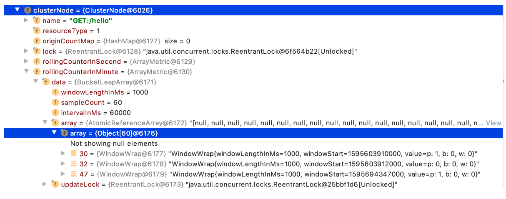 

当调用 rollingCounterInMinute#addSuccess 方法时，由 ArrayMetric 根据当前时间戳获取当前时间窗口的 MetricBucket，再调用 MetricBucket#addSuccess 方法将 success 这项指标的值加上方法参数传递进来的值（一般是 1）。MetricBucket 使用 LongAdder 记录各项指标数据的值。

Sentinel 在 MetricEvent 枚举类中定义了 Sentinel 会收集哪些指标数据，MetricEvent 枚举类的源码如下：

```java
public enum MetricEvent {
    PASS,
    BLOCK,
    EXCEPTION,
    SUCCESS,
    RT,
    OCCUPIED_PASS
}
```

- pass 指标：请求被放行的总数
- block：请求被拒绝的总数
- exception：请求处理异常的总数
- success：请求被处理成功的总数
- rt：被处理成功的请求的总耗时
- occupied_pass：预通过总数（前一个时间窗口使用了当前时间窗口的 passQps）

其它的指标数据都可通过以上这些指标数据计算得出，例如，平均耗时可根据总耗时除以成功总数计算得出

### 总结

- 一个调用链路上只会创建一个 Context，在调用链路的入口创建（一个调用链路上第一个被 Sentinel 保护的资源）。
- 一个 Context 名称只创建一个 EntranceNode，也是在调用链路的入口创建，调用 Context#enter 方法时创建。
- 与方法调用的入栈出栈一样，一个线程上调用多少次 SphU#entry 方法就会创建多少个 CtEntry，前一个 CtEntry 作为当前 CtEntry 的父节点，当前 CtEntry 作为前一个 CtEntry 的子节点，构成一个双向链表。Context.curEntry 保存的是当前的 CtEntry，在调用当前的 CtEntry#exit 方法时，由当前 CtEntry 将 Context.curEntry 还原为当前 CtEntry 的父节点 CtEntry。
- 一个调用链路上，如果多次调用 SphU#entry 方法传入的资源名称都相同，那么只会创建一个 DefaultNode，如果资源名称不同，会为每个资源名称创建一个 DefaultNode，当前 DefaultNode 会作为调用链路上的前一个 DefaultNode 的子节点。
- 一个资源有且只有一个 ProcessorSlotChain，一个资源有且只有一个 ClusterNode。
- 一个 ClusterNode 负责统计一个资源的全局指标数据。
- StatisticSlot 负责记录请求是否被放行、请求是否被拒绝、请求是否处理异常、处理请求的耗时等指标数据，在 StatisticSlot 调用 DefaultNode 用于记录某项指标数据的方法时，DefaultNode 也会调用 ClusterNode 的相对应方法，完成两份指标数据的收集。
- DefaultNode 统计当前资源的各项指标数据的维度是同一个 Context（名称相同），而 ClusterNode 统计当前资源各项指标数据的维度是全局。

## 限流实现

ProcessorSlot 检查实时指标数据是否达到规则所配置的阈值，当达到阈值时，或抛出 Block 异常或采取流量效果控制策略处理超阈值的流量。

Sentinel 实现限流降级、熔断降级、黑白名单限流降级、系统自适应限流降级以及热点参数限流降级都是由 ProcessorSlot、Checker、Rule、RuleManager 组合完成。ProcessorSlot 作为调用链路的切入点，负责调用 Checker 检查当前请求是否可以放行；Checker 则根据资源名称从 RuleManager 中拿到为该资源配置的 Rule（规则），取 ClusterNode 统计的实时指标数据与规则对比，如果达到规则的阈值则抛出 Block 异常，抛出 Block 异常意味着请求被拒绝，也就实现了限流或熔断。

可以总结为以下三个步骤：

- 在 ProcessorSlot#entry 方法中调用 Checker#check 方法，并将 DefaultNode 传递给 Checker。
- Checker 从 DefaultNode 拿到 ClusterNode，并根据资源名称从 RuleManager 获取为该资源配置的规则。
- Checker 从 ClusterNode 中获取当前时间窗口的某项指标数据（QPS、avgRt 等）与规则的阈值对比，如果达到规则的阈值则抛出 Block 异常（也有可能将 check 交给 Rule 去实现）

### 整体设计思路

#### 限流规则

Sentinel 在最初的框架设计上，将是否允许请求通过的判断行为交给 Rule 去实现，所以将 Rule 定义成了接口。Rule 接口只定义了一个 passCheck 方法，即判断当前请求是否允许通过。Rule 接口的定义如下：

```java
public interface Rule {
    boolean passCheck(Context context, DefaultNode node, int count, Object... args);
}
```

- context：当前调用链路上下文。
- node：当前资源的 DefaultNode。
- count：一般为 1，用在令牌桶算法中表示需要申请的令牌数，用在 QPS 统计中表示一个请求。
- args：方法调用参数（被 Sentinel 拦截的目标方法），用于实现热点参数限流降级的。

因为规则是围绕资源配置的，一个规则只对某个资源起作用，因此 Sentinel 提供了一个抽象规则配置类 AbstractRule，AbstractRule 的定义如下：

```java
public abstract class AbstractRule implements Rule {
    private String resource;
    private String limitApp;
    // ....
}
```

- resource：资源名称，规则的作用对象。
- limitApp：只对哪个或者哪些调用来源生效，若为 default 则不区分调用来源。

Rule、AbstractRule 与其它实现类的关系如下图所示：

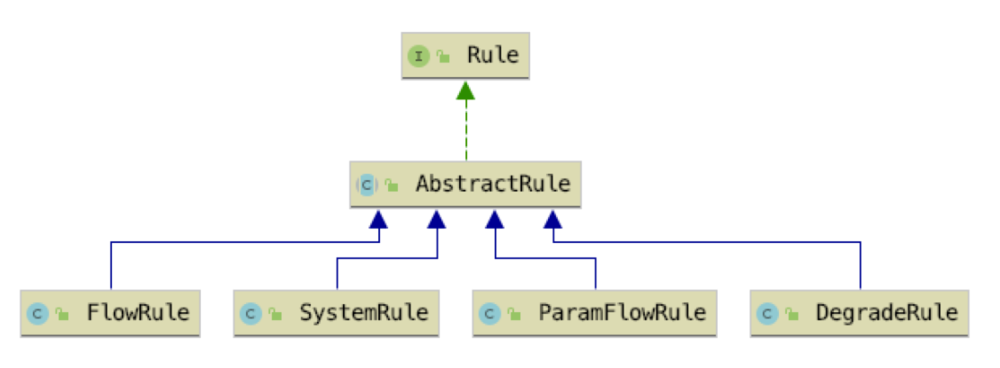 

FlowRule 是限流规则配置类，FlowRule 继承 AbstractRule 并实现 Rule 接口。FlowRule 源码如下，非完整源码，与实现集群限流相关的字段暂时去掉了

```java
public class FlowRule extends AbstractRule {
    // 限流阈值类型 qps|threads
    private int grade = RuleConstant.FLOW_GRADE_QPS;
    // 限流阈值
    private double count;
    // 基于调用关系的限流策略
    private int strategy = RuleConstant.STRATEGY_DIRECT;
    // 配置 strategy 使用，入口资源名称
    private String refResource;
    // 流量控制效果（直接拒绝、Warm Up、匀速排队）
    private int controlBehavior = RuleConstant.CONTROL_BEHAVIOR_DEFAULT;
    // 冷启动时长（预热时长），单位秒
    private int warmUpPeriodSec = 10;
    // 最大排队时间。
    private int maxQueueingTimeMs = 500;
    // 流量控制器
    private TrafficShapingController controller;
    //.....
    @Override
    public boolean passCheck(Context context, DefaultNode node, int acquireCount, Object... args) {
        return true;
    }
}
```

- FlowRule 的字段解析已在源码中给出注释，现在还不需要急于去理解每个字段的作用。
- FlowRule 实现 Rule 接口方法只是返回 true，因为 passCheck 的逻辑并不由 FlowRule 实现。

Rule 定义的行为应该只是 Sentinel 在最初搭建框架时定义的约定，Sentinel 自己也并没有都遵守这个约定，很多规则并没有将 passCheck 交给 Rule 去实现，Checker 可能是后续引入的，用于替代 Rule 的 passCheck 行为。

Sentinel 中用来管理规则配置的类都以规则类的名称+Manger 命名，除此之外，并没有对规则管理器有什么行为上的约束。

用来加载限流规则配置以及缓存限流规则配置的类为 FlowRuleManager，其部分源码如下：

```java
public class FlowRuleManager {
    // 缓存规则
    private static final Map<String, List<FlowRule>> flowRules = new ConcurrentHashMap<String, List<FlowRule>>();
    // 获取所有规则
    static Map<String, List<FlowRule>> getFlowRuleMap() {
        return flowRules;
    }
    // 更新规则
    public static void loadRules(List<FlowRule> rules) {
        // 更新静态字段 flowRules
    }
}
```

- flowRules 静态字段：用于缓存规则配置，使用 ConcurrentMap 缓存，key 为资源的名称，value 是一个 FlowRule 数组。使用数组是因为 Sentinel 支持针对同一个资源配置多种限流规则，只要其中一个先达到限流的阈值就会触发限流。
- loadRules：提供给使用者加载和更新规则的 API，该方法会将参数传递进来的规则数组转为 Map，然后先清空 flowRules 当前缓存的规则配置，再将新的规则配置写入 flowRules。
- getFlowRuleMap：提供给 FlowSlot 获取配置的私有 API

#### 限流处理器插槽

FlowSlot 是实现限流功能的切入点，它作为 ProcessorSlot 插入到 ProcessorSlotChain 链表中，在 entry 方法中调用 Checker 去判断是否需要拒绝当前请求，如果需要拒绝请求则抛出 Block 异常。FlowSlot 的源码如下：

```java
public class FlowSlot extends AbstractLinkedProcessorSlot<DefaultNode> {
    private final FlowRuleChecker checker;
    public FlowSlot() {
        this(new FlowRuleChecker());
    }

   // 规则生产者，一个 Function
    private final Function<String, Collection<FlowRule>> ruleProvider = new Function<String, Collection<FlowRule>>() {
        // 参数为资源名称
        @Override
        public Collection<FlowRule> apply(String resource) {
            Map<String, List<FlowRule>> flowRules = FlowRuleManager.getFlowRuleMap();
            return flowRules.get(resource);
        }
    };

    @Override
    public void entry(Context context, ResourceWrapper resourceWrapper, DefaultNode node, int count,
                      boolean prioritized, Object... args) throws Throwable {
        checkFlow(resourceWrapper, context, node, count, prioritized);
        fireEntry(context, resourceWrapper, node, count, prioritized, args);
    }
  // check 是否限流
    void checkFlow(ResourceWrapper resource, Context context, DefaultNode node, int count, boolean prioritized)
        throws BlockException {
        checker.checkFlow(ruleProvider, resource, context, node, count, prioritized);
    }

    @Override
    public void exit(Context context, ResourceWrapper resourceWrapper, int count, Object... args) {
        fireExit(context, resourceWrapper, count, args);
    }
}
```

FlowSlot 在构造方法中创建 FlowRuleChecker，并在 entry 方法中调用 FlowRuleChecker#checkFlow 方法判断是否需要拦截当前请求。在调用 FlowRuleChecker#checkFlow 方法时传入了一个 Function 接口实例，FlowRuleChecker 可调用该 Function 的 apply 方法从 FlowRuleManager 获取资源的所有规则配置，当然，最终还是调用 FlowRuleManager#getFlowRuleMap 方法从 FlowRuleManager 获取

#### 限流规则检查器

FlowRuleChecker 与 FlowRuleManager 一样，Sentinel 也并没有约定 Checker 必须具有哪些行为，只是在命名上约定 Checker 类需以规则类的名称 + “Checker”命名。FlowRuleChecker 负责判断是否需要拒绝当前请求，由于 FlowRuleChecker 类的源码很多，所以我们按过程分析用到的每个方法。

首先是由 FlowSlot 调用的 checkFlow 方法，该方法源码如下：

```java
public void checkFlow(Function<String, Collection<FlowRule>> ruleProvider, ResourceWrapper resource,
                          Context context, DefaultNode node, int count, boolean prioritized) throws BlockException {
        if (ruleProvider == null || resource == null) {
            return;
        }
        // (1)
        Collection<FlowRule> rules = ruleProvider.apply(resource.getName());
        if (rules != null) {
            // (2)
            for (FlowRule rule : rules) {
                // (3)
                if (!canPassCheck(rule, context, node, count, prioritized)) {
                    throw new FlowException(rule.getLimitApp(), rule);
                }
            }
        }
}
```

checkFlow 方法我们分三步分析：

- 调用 FlowSlot 传递过来的 ruleProvider 的 apply 方法获取当前资源的所有限流规则；
- 遍历限流规则，只要有一个限流规则达到限流阈值即可抛出 FlowException，使用 FlowException 目的是标志当前请求因为达到限流阈值被拒绝，FlowException 是 BlockException 的子类；
- 调用 canPassCheck 方法判断当前请求是否允许通过。

canPassCheck 即“can pass check”，意思是检查是否允许通过，后面我们也统一将“检查是否允许当前请求通过”使用 canPassCheck 代指，canPassCheck 方法返回 true 说明允许请求通过，反之则不允许通过。canPassCheck 方法源码如下：

```java
public boolean canPassCheck(FlowRule rule, Context context, DefaultNode node, int acquireCount,boolean prioritized) {
        // (1)
        String limitApp = rule.getLimitApp();
        if (limitApp == null) {
            return true;
        }
        // (2)
        if (rule.isClusterMode()) {
            return passClusterCheck(rule, context, node, acquireCount, prioritized);
        }
        // (3)
        return passLocalCheck(rule, context, node, acquireCount, prioritized);
}
```

- 当前限流规则只对哪个调用来源生效，如果为 null 则返回 true，一般不为 null，默认为“default”（不限定调用来源）；
- 是否是集群限流模式，如果是集群限流模式则调用 passClusterCheck 方法完成 canPassCheck，我们暂时先不讨论集群限流的情况；
- 非集群限流模式则调用 passLocalCheck 方法完成 canPassCheck。

passLocalCheck 方法源码如下：

```java
private static boolean passLocalCheck(FlowRule rule, Context context, DefaultNode node, int acquireCount,
                                          boolean prioritized) {
        // （1）
        Node selectedNode = selectNodeByRequesterAndStrategy(rule, context, node);
        if (selectedNode == null) {
            return true;
        }
        // （2）
        return rule.getRater()
          // (3)
          .canPass(selectedNode, acquireCount, prioritized);
    }
```

- 根据调用来源和“调用关系限流策略”选择 DefaultNode；
- 获取限流规则配置的流量效果控制器（TrafficShapingController）；
- 调用 TrafficShapingController#canPass 方法完成 canPassCheck。

selectNodeByRequesterAndStrategy 方法的实现逻辑很复杂，实现根据限流规则配置的 limitApp 与 strategy 选择一个 StatisticNode，两个字段的组合情况可以有 6 种。selectNodeByRequesterAndStrategy 方法源码如下：

```java
static Node selectNodeByRequesterAndStrategy(FlowRule rule, Context context, DefaultNode node) {
        // 限流规则针对哪个来源生效
        String limitApp = rule.getLimitApp();
        // 基于调用关系的限流策略
        int strategy = rule.getStrategy();
        // 远程来源
        String origin = context.getOrigin();
        if (limitApp.equals(origin) && filterOrigin(origin)) {
            if (strategy == RuleConstant.STRATEGY_DIRECT) {
                //（1）
                return context.getOriginNode();
            }
            //（2）
            return selectReferenceNode(rule, context, node);
        }
        else if (RuleConstant.LIMIT_APP_DEFAULT.equals(limitApp)) {
            if (strategy == RuleConstant.STRATEGY_DIRECT) {
                //（3）
                return node.getClusterNode();
            }
            //（4）
            return selectReferenceNode(rule, context, node);
        }
        else if (RuleConstant.LIMIT_APP_OTHER.equals(limitApp)
            && FlowRuleManager.isOtherOrigin(origin, rule.getResource())) {
            if (strategy == RuleConstant.STRATEGY_DIRECT) {
                 //（5）
                return context.getOriginNode();
            }
            //（6）
            return selectReferenceNode(rule, context, node);
        }
        return null;
}
```

如果当前限流规则的 limitApp 为 default，则说明该限流规则对任何调用来源都生效，针对所有调用来源限流，否则只针对指定调用来源限流

1. 如果调用来源与当前限流规则的 limitApp 相等，且 strategy 为 STRATEGY_DIRECT，则使用调用来源的 StatisticNode，实现针对调用来源限流。例如，当前服务名称为 demo-srv-b，请求调用来源为 demo-srv-a 服务，资源名称为“/hello”，那么 origin 的 StatisticNode 用于针对访问来源为 demo-srv-a 的“/hello”资源的指标数据统计。

2. 前置条件与（1）相同，依然是针对来源限流。

   strategy 为 STRATEGY_RELATE：根据限流规则配置的 refResource 获取引用资源的 ClusterNode，即使用引用资源的指标数据限流。通俗点说就是使用其它资源的指标数据限流，你的并发量高我就限流，让你多处理一点请求，等你并发量降低了，我就不限流了；

   strategy 为 STRATEGY_CHAIN：使用当前资源的 DefauleNode，实现按调用链路的资源指标数据限流。

3. 当 limitApp 为 default 时，针对所有来源限流。如果 strategy 为 STRATEGY_DIRECT，则使用当前资源的 ClusterNode。

4. 前置条件与（3）相同，依然是针对所有来源限流。
   - strategy 为 STRATEGY_RELATE：使用引用资源的 ClusterNode；
   - strategy 为 STRATEGY_CHAIN：使用当前资源的 DefauleNode。

5. 如果 limitApp 为 other，且该资源的所有限流规则都没有针对当前的调用来源限流。如果 strategy 为 STRATEGY_DIRECT，则使用 origin 的 StatisticNode。

6. 前置条件与（5）一样。
   - strategy 为 STRATEGY_RELATE：使用引用资源的 ClusterNode；
   - strategy 为 STRATEGY_CHAIN：使用当前资源的 DefauleNode。

从 selectNodeByRequesterAndStrategy 方法可以看出，Sentinel 之所以针对每个资源统计访问来源的指标数据，也是为了实现对丰富的限流策略的支持

因为每个调用来源服务对同一个资源的访问频率都是不同的，针对调用来源限流可限制并发量较高的来源服务的请求，而对并发量低的来源服务的请求可不限流，或者是对一些并没有那么重要的来源服务限流。

当两个资源之间具有资源争抢关系的时候，使用 STRATEGY_RELATE 调用关系限流策略可避免多个资源之间过度的对同一资源争抢。例如查询订单信息和用户下单两个分别读和写数据库订单表的资源，如下图所示：

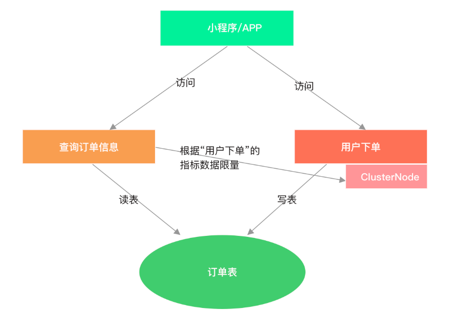  

我们可以给执行读表操作的资源设置限流规则实现写优先的目的，查询订单信息的资源根据用户下单的资源的实时指标数据限流，当写表操作过于频繁时，读表操作的请求就会被限流

### 限流算法

#### 经典限流算法

* **计数器算法**

  Sentinel 中默认实现的 QPS 限流算法和 THREADS 限流算法都属于计数器算法。QPS 限流的默认算法是通过判断当前时间窗口（1 秒）的 pass（被放行的请求数量）指标数据判断，如果 pass 总数已经大于等于限流的 QPS 阈值，则直接拒绝当前请求，每通过一个请求当前时间窗口的 pass 指标计数加 1。THREADS 限流的实现是通过判断当前资源并行占用的线程数是否已经达到阈值，是则直接拒绝当前请求，每通过一个请求 THREADS 计数加 1，每完成一个请求 THREADS 计数减 1。

* **漏桶算法（Leaky Bucket）**

  漏桶就像在一个桶的底部开一个洞，不控制水放入桶的速度，而通过底部漏洞的大小控制水流失的速度，当水放入桶的速率小于或等于水通过底部漏洞流出的速率时，桶中没有剩余的水，而当水放入桶的速率大于漏洞流出的速率时，水就会逐渐在桶中积累，当桶装满水时，若再向桶中放入水，则放入的水就会溢出。我们把水换成请求，往桶里放入请求的速率就是接收请求的速率，而水流失就是请求通过，水溢出就是请求被拒绝。

* **令牌桶算法（Token Bucket）**

  令牌桶不存放请求，而是存放为请求生成的令牌（Token），只有拿到令牌的请求才能通过。原理就是以固定速率往桶里放入令牌，每当有请求过来时，都尝试从桶中获取令牌，如果能拿到令牌请求就能通过。当桶放满令牌时，多余的令牌就会被丢弃，而当桶中的令牌被用完时，请求拿不到令牌就无法通过

#### 流量效果控制器

Sentinel 支持对超出限流阈值的流量采取效果控制器控制这些流量，流量效果控制支持：直接拒绝、Warm Up（冷启动）、匀速排队。对应 FlowRule 中的 controlBehavior 字段。在调用 FlowRuleManager#loadRules 方法时，FlowRuleManager 会将限流规则配置的 controlBehavior 转为对应的 TrafficShapingController。

```java
public interface TrafficShapingController {
    // 判断当前请求是否能通过
    boolean canPass(Node node, int acquireCount, boolean prioritized);
    boolean canPass(Node node, int acquireCount);
}
```

- node：根据 limitApp 与 strategy 选出来的 Node（StatisticNode、DefaultNode、ClusterNode）。
- acquireCount：与并发编程 AQS#tryAcquire 方法的参数作用一样，Sentinel 将需要被保护的资源包装起来，这与锁的实现是一样的，需要先获取锁才能继续执行，acquireCount 表示申请占用共享资源的数量，只有申请到足够的共享资源才能执行。例如，线程池有 200 个线程，当前方法执行需要申请 3 个线程才能执行，那么 acquireCount 就是 3。acquireCount 的值一般为 1，当限流规则配置的限流阈值类型为 threads 时，表示需要申请一个线程，当限流规则配置的限流阈值类型为 qps 时，表示需要申请放行一个请求。
- prioritized：表示是否对请求进行优先级排序，SphU#entry 传递过来的值是 false。

controlBehavior 的取值与使用的 TrafficShapingController 对应关系如下表格所示：

| control_Behavior                      | TRAFFIC_SHAPING_controller  |
| :------------------------------------ | :-------------------------- |
| CONTROL_BEHAVIOR_WARM_UP              | WarmUpController            |
| CONTROL_BEHAVIOR_RATE_LIMITER         | RateLimiterController       |
| CONTROL_BEHAVIOR_WARM_UP_RATE_LIMITER | WarmUpRateLimiterController |
| CONTROL_BEHAVIOR_DEFAULT              | DefaultController           |

* DefaultController

  DefaultController 是默认使用的流量效果控制器，直接拒绝超出阈值的请求。当 QPS 超过限流规则配置的阈值，新的请求就会被立即拒绝，抛出 FlowException。适用于对系统处理能力明确知道的情况下，比如通过压测确定阈值。实际上我们很难测出这个阈值，因为一个服务可能部署在硬件配置不同的服务器上，并且随时都可能调整部署计划

  DefaultController#canPass 方法源码如下：

  ```java
      @Override
      public boolean canPass(Node node, int acquireCount, boolean prioritized) {
          // (1) 
          int curCount = avgUsedTokens(node);
          // (2)
          if (curCount + acquireCount > count) {
              // （3）
              if (prioritized && grade == RuleConstant.FLOW_GRADE_QPS) {
                  long currentTime;
                  long waitInMs;
                  currentTime = TimeUtil.currentTimeMillis();
                  // （4）
                  waitInMs = node.tryOccupyNext(currentTime, acquireCount, count);
                  // （5）
                  if (waitInMs < OccupyTimeoutProperty.getOccupyTimeout()) {
                      // 将休眠之后对应的时间窗口的 pass(通过)这项指标数据的值加上 acquireCount
                      node.addWaitingRequest(currentTime + waitInMs, acquireCount);
                      // 添加占用未来的 pass 指标的数量
                      node.addOccupiedPass(acquireCount);
                      // 休眠等待，当前线程阻塞
                      sleep(waitInMs);
                      // 抛出 PriorityWait 异常，表示当前请求是等待了 waitInMs 之后通过的
                      throw new PriorityWaitException(waitInMs);
                  }
              }
              return false;
          }
          return true;
      }
  ```

  1. avgUsedTokens 方法：如果当前规则的限流阈值类型为 QPS，则 avgUsedTokens 返回 node 当前时间窗口统计的每秒被放行的请求数；如果当前规则的限流阈值类型为 THREADS，则 avgUsedTokens 返回 node 统计的当前并行占用的线程数。
  2. 如果将当前请求放行会超过限流阈值，且不满足（3），则直接拒绝当前请求。
  3. 如果限流阈值类型为 QPS，表示具有优先级的请求可以占用未来时间窗口的统计指标。
  4. 如果可以占用未来时间窗口的统计指标，则 tryOccupyNext 返回当前请求需要等待的时间，单位毫秒。
  5. 如果休眠时间在限制可占用的最大时间范围内，则挂起当前请求，当前线程休眠 waitInMs 毫秒。休眠结束后抛出 PriorityWait 异常，表示当前请求是等待了 waitInMs 之后通过的。

  一般情况下，prioritized 参数的值为 false，如果 prioritized 在 ProcessorSlotChain 传递的过程中，排在 FlowSlot 之前的 ProcessorSlot 都没有修改过，那么条件（3）就不会满足，所以这个 canPass 方法实现的流量效果就是直接拒绝

* RateLimiterController

  Sentinel 匀速流控效果是漏桶算法结合虚拟队列等待机制实现的，可理解为存在一个虚拟的队列，请求在队列中排队通过，每（count/1000）毫秒可通过一个请求。虚拟队列的好处在于队列非真实存在，多核 CPU 多个请求并行通过时也可以通过，也就是说，实际通过的 QPS 会超过限流阈值的 QPS，但不会超很多。

  要配置限流规则使用匀速通过效果控制器 RateLimiterController，则必须配置限流阈值类型为 GRADE_QPS，并且阈值要少于等于 1000。例如：

  ```java
  FlowRule flowRule = new FlowRule();
  flowRule.setCount(30);
  // 流量控制效果配置为使用匀速限流控制器
  flowRule.setControlBehavior(RuleConstant.CONTROL_BEHAVIOR_RATE_LIMITER);
  // 虚拟队列的最大等待时长，排队等待时间超过这个值的请求会被拒绝
  flowRule.setMaxQueueingTimeMs(1000);
  flowRule.setResource("GET:/hello");    
  FlowRuleManager.loadRules(Collections.singletonList(flowRule));
  ```

  RateLimiterController 的字段和构造方法源码如下：

  ```java
  public class RateLimiterController implements TrafficShapingController {
      private final int maxQueueingTimeMs;
      private final double count;
      private final AtomicLong latestPassedTime = new AtomicLong(-1);
  
      public RateLimiterController(int timeOut, double count) {
          this.maxQueueingTimeMs = timeOut;
          this.count = count;
      }
  }
  ```

  - maxQueueingTimeMs：请求在虚拟队列中的最大等待时间，默认 500 毫秒。
  - count：限流 QPS 阈值。
  - latestPassedTime：最近一个请求通过的时间，用于计算下一个请求的预期通过时间。

  RateLimiterController 实现的 canPass 方法源码如下：

  ```java
      @Override
      public boolean canPass(Node node, int acquireCount, boolean prioritized) {
          //....
          // (1) 
          long currentTime = TimeUtil.currentTimeMillis();
          long costTime = Math.round(1.0 * (acquireCount) / count * 1000);
          // (2) 
          long expectedTime = costTime + latestPassedTime.get();
          // （3）
          if (expectedTime <= currentTime) {
              latestPassedTime.set(currentTime);
              return true;
          } else {
              // （4） 
              long waitTime = costTime + latestPassedTime.get() - TimeUtil.currentTimeMillis();
              if (waitTime > maxQueueingTimeMs) {
                  return false;
              } else {
                  try {
                      // （5）
                      long oldTime = latestPassedTime.addAndGet(costTime);
                      waitTime = oldTime - TimeUtil.currentTimeMillis();
                      if (waitTime > maxQueueingTimeMs) {
                          // （6）
                          latestPassedTime.addAndGet(-costTime);
                          return false;
                      }
                      // （7）
                      if (waitTime > 0) {
                          Thread.sleep(waitTime);
                      }
                      return true;
                  } catch (InterruptedException e) {
                  }
              }
          }
          return false;
      }
  ```

  **1. 计算队列中连续的两个请求的通过时间的间隔时长**

  假设阈值 QPS 为 200，那么连续的两个请求的通过时间间隔为 5 毫秒，每 5 毫秒通过一个请求就是匀速的速率，即每 5 毫秒允许通过一个请求。

  **2. 计算当前请求期望的通过时间**

  请求通过的间隔时间加上最近一个请求通过的时间就是当前请求预期通过的时间。

  **3. 期望通过时间少于当前时间则当前请求可通过并且可以立即通过**

  理想的情况是每个请求在队列中排队通过，那么每个请求都在固定的不重叠的时间通过。但在多核 CPU 的硬件条件下可能出现多个请求并行通过，这就是为什么说实际通过的 QPS 会超过限流阈值的 QPS。

  源码中给的注释：这里可能存在争论，但没关系。因并行导致超出的请求数不会超阈值太多，所以影响不大。

  **4. 预期通过时间如果超过当前时间那就休眠等待**，需要等待的时间等于预期通过时间减去当前时间，如果等待时间超过队列允许的最大等待时间，则直接拒绝该请求。

  **5. 如果当前请求更新 latestPassedTime 为自己的预期通过时间后**，需要等待的时间少于限定的最大等待时间，说明排队有效，否则自己退出队列并回退一个间隔时间。

  此时 latestPassedTime 就是当前请求的预期通过时间，后续的请求将排在该请求的后面。这就是虚拟队列的核心实现，按预期通过时间排队。

  **6. 如果等待时间超过队列允许的最大排队时间则回退一个间隔时间，并拒绝当前请求。**

  回退一个间隔时间相当于将数组中一个元素移除后，将此元素后面的所有元素都向前移动一个位置。此处与数组移动不同的是，该操作不会减少已经在等待的请求的等待时间。

  **7. 休眠等待**

  匀速流控适合用于请求突发性增长后剧降的场景。例如用在有定时任务调用的接口，在定时任务执行时请求量一下子飙高，但随后又没有请求的情况，这个时候我们不希望一下子让所有请求都通过，避免把系统压垮，但也不想直接拒绝超出阈值的请求，这种场景下使用匀速流控可以将突增的请求排队到低峰时执行，起到“削峰填谷”的效果。

#### QPS1000问题

在分析完源码后，我们再来看一个 Issue，如下图所示。

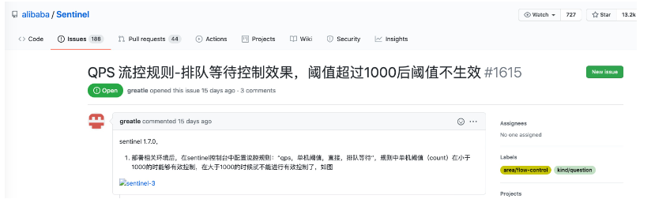 

为什么将 QPS 限流阈值配置超过 1000 后导致限流不生效呢？

计算请求通过的时间间隔算法如下：

```java
long costTime = Math.round(1.0 * (acquireCount) / count * 1000);
```

假设限流 QPS 阈值为 1200，当 acquireCount 等于 1 时，costTime=1⁄1200*1000，这个结果是少于 1 毫秒的，使用 Math.round 取整后值为 1，而当 QPS 阈值越大，计算结果小于 0.5 时，Math.round 取整后值就变为 0。Sentinel 支持的最小等待时间单位是毫秒，这可能是出于性能的考虑。当限流阈值超过 1000 后，如果 costTime 计算结果不少于 0.5，则间隔时间都是 1 毫秒，这相当于还是限流 1000QPS；而当 costTime 计算结果小于 0.5 时，经过 Math.round 取整后值为 0，即请求间隔时间为 0 毫秒，也就是不排队等待，此时限流规则就完全无效了，配置等于没有配置

### 冷启动算法

Warm Up，冷启动。在应用升级重启时，应用自身需要一个预热的过程，预热之后才能到达一个稳定的性能状态，比如说，接口预热阶段完成 JIT 即时编译、完成一些单例对象的创建、线程池的创建、各种连接池的初始化、或者执行首次需要加锁执行的代码块。

冷启动并非只在应用重启时需要，在一段时间没有访问的情况下，连接池存在大量过期连接需要待下次使用才移除掉并创建新的连接、一些热点数据缓存过期需要重新查数据库写入缓存等，这些场景下也需要冷启动。

WarmUpController 支持设置冷启动周期（冷启动时长），默认为 10 秒，WarmUpController 在这 10 秒内会控制流量平缓的增长到限量阈值。例如，对某个接口限制 QPS 为 200，10 秒预热时间，那么这 10 秒内，相当于每秒的限流阈值分别为：5qps、15qps、35qps、70qps、90qps、115qps、145qps、170qps、190qps、200qps，当然，这组数据只是假设。

如果要使用 WarmUpController，则限量规则阈值类型必须配置为 GRADE_QPS，例如：

```java
 FlowRule flowRule = new FlowRule();
 // 限流 QPS 阈值
 flowRule.setCount(200);
 // 流量控制效果配置为使用冷启动控制器
 flowRule.setControlBehavior(RuleConstant.CONTROL_BEHAVIOR_WARM_UP);
 // 冷启动周期，单位秒
 flowRule.setWarmUpPeriodSec(10); 
 flowRule.setResource("GET:/hello");
 FlowRuleManager.loadRules(Collections.singletonList(flowRule));
```

Sentinel 冷启动限流算法参考了 Guava 的 SmoothRateLimiter 实现的冷启动限流算法，但实现上有很大的区别，Sentinel 主要用于控制每秒的 QPS，不会控制每个请求的间隔时间，只要满足每秒通过的 QPS 即可。正因为与 Guava 的不同，官方文档目前也没有很详细的介绍具体实现，单看源码很难揣摩作者的思路，加上笔者水平有限，没能切底理解 Sentinel 冷启动限流算法实现的细节，因此我们也不过深的去分析 WarmUpController 的源码，只是结合 Guava 的实现算法作个简单介绍

#### SmoothRateLimiter

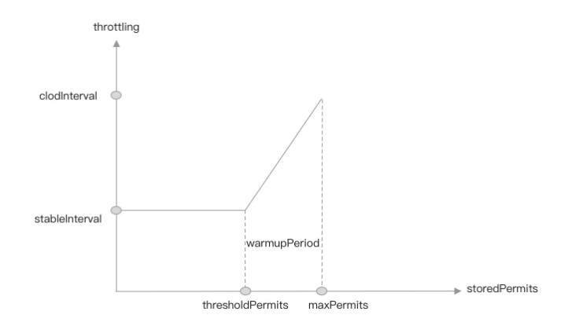 

- 横坐标 storedPermits 代表存储桶中的令牌数量。
- 纵坐标代表获取一个令牌需要的时间，即请求通过的时间间隔。
- stableInterval：稳定产生令牌的时间间隔。
- coldInterval：冷启动产生令牌的最大时间隔间，等于稳定产生令牌的时间间隔乘以冷启动系数（stableInterval*coldFactor）。
- thresholdPermits：从冷启动到正常的令牌桶中令牌数量的阈值，是判断是否需要进入冷启动阶段的依据。
- maxPermits：最大允许令牌桶中存放的令牌数。
- slope：直线的斜率，即令牌生产的速率。
- warmupPeriod：预热时长，即冷启动周期，对应上图中的梯形面积

**PS：简单来说，上图展示了一种机制：当前存储的令牌数(`storedPermits`)越多，生成令牌的间隔时间就越长。当存储的令牌数到达最大值(`maxPermits`)生成令牌的间隔时间也到达最大值(`cold interval`)。`cold interval`同时受`stable interval`和`coldFactor`的影响，是两者的乘积，`coldFactor`默认为3.0，即`cold interval`是`stable interval`的3倍。`thresholdPermits`是一个拐点，当令牌数小于`thresholdPermits`时生成令牌的间隔时间稳定在`stable interval`；当令牌数大于`thresholdPermits`时，生成令牌的间隔时间以一个固定的速率发生变化。`thresholdPermits`等于预热时间内产生令牌数量的一半**

在 SmoothRateLimiter 中，冷启动系数（coldFactor）的值固定为 3，假设我们设置冷启动周期为 10s、限流为每秒钟生成令牌数 200 个。那么 warmupPeriod 为 10s，将 1 秒中内的微秒数除以每秒钟需要生产的令牌数计算出生产令牌的时间间隔（stableInterval）为 5000μs，冷启动阶段最长的生产令牌的时间间隔（coldInterval）等于稳定速率下生产令牌的时间间隔（stableInterval）乘以 3，即 15000μs。

```java
// stableIntervalMicros：stableInterval 转为微秒
// permitsPerSecond: 每秒钟生成的令牌数上限为 200
double stableIntervalMicros = SECONDS.toMicros(1L) / permitsPerSecond;
```

由于 coldFactor 等于 3，且 coldInterval 等于 stableInterval 乘以 coldFactor，所以（coldInterval-stableInterval）是 stableInterval 的两倍，所以从 thresholdPermits 到 0 的时间是从 maxPermits 到 thresholdPermits 时间的一半，也就是 warmupPeriod 的一半。因为梯形的面积等于 warmupPeriod，所以长方形面积是梯形面积的一半，长方形的面积是 warmupPeriod/2。

根据长方形的面积计算公式：

> 面积 = 长 * 宽

可得：

> stableInterval*thresholdPermits = 1⁄2 * warmupPeriod

所以：

> thresholdPermits = 0.5 * warmupPeriod/stableInterval

```java
// warmupPeriodMicros: warmupPeriod 转为微秒
// stableIntervalMicros：stableInterval 转为微秒
thresholdPermits = 0.5 * warmupPeriodMicros / stableIntervalMicros;
```

所以：

> thresholdPermits = 0.5 * 10s/5000μs = 1000

由梯形面积公式：

> (上低 + 下低) * 高 / 2

可得：

> warmupPeriod = ((stableInterval + coldInterval) * (maxPermits-thresholdPermits))/2

推出：

> maxPermits=thresholdPermits+2*warmupPeriod/(stableInterval+coldInterval)

```java
// warmupPeriodMicros: warmupPeriod 转为微秒
// stableIntervalMicros：stableInterval 转为微秒
// coldIntervalMicros: coldInterval 转为微秒
maxPermits = thresholdPermits + 2.0 * warmupPeriodMicros / (stableIntervalMicros + coldIntervalMicros);
```

所以：

> maxPermits = 1000 + 2.0 * 10s/(20000μs) = 2000

由直线的斜率计算公式：

> 斜率 = (y2-y1)/(x2-x1)

可得：

> slope = (coldInterval - stableInterval)/(maxPermits - thresholdPermits)

所以：

> slope = 10000μs/1000 = 10

正常情况下，令牌以稳定时间间隔 stableInterval 生产令牌，一秒钟内能生产的令牌就刚好是限流的阈值。

如果初始化令牌数为 maxPermits 时，系统直接进入冷启动阶段，此时生产令牌的间隔时间最长，等于 coldInterval。如果此时以稳定的速率消费存储桶中的令牌，由于消费速度大于生产速度，那么令牌桶中的令牌将会慢慢减少，当 storedPermits 中的令牌数慢慢下降到 thresholdPermits 时，冷启动周期结束，将会以稳定的时间间隔 stableInterval 生产令牌。当消费速度等于生产速度，则稳定在限量阈值，而当消费速度远小于生产速度时，存储桶中的令牌数就会堆积，如果堆积的令牌数超过 thresholdPermits，又会是一轮新的冷启动。

SmoothRateLimiter 中，在每个请求获取令牌时根据当前时间与上一次获取令牌时间（nextFreeTicketMicros）的间隔时间计算需要生成新的令牌数并加入到令牌桶中。在应用重启时或者接口很久没有被访问后，nextFreeTicketMicros 的值要么为 0，要么远远小于当前时间，当前时间与 nextFreeTicketMicros 的间隔非常大，导致第一次生产令牌数就会达到 maxPermits，所以就会进入冷启动阶段。

SmoothRateLimiter#resync 方法源码如下。

```java
// 该方法是被加锁同步调用的
void resync(long nowMicros) {
    // nextFreeTicket: 上次生产令牌的时间
    if (nowMicros > nextFreeTicketMicros) {
      // coolDownIntervalMicros 的值为 stableInterval
      // nowMicros - nextFreeTicketMicros: 当前时间与上次生产令牌的时间间隔
      double newPermits = (nowMicros - nextFreeTicketMicros) / coolDownIntervalMicros();
      // 存储桶的数量 = 桶中剩余的 + 新生产的， 与 maxPermits 取最小值
      storedPermits = min(maxPermits, storedPermits + newPermits);
      // 更新上次生产令牌的时间
      nextFreeTicketMicros = nowMicros;
    }
}
```

#### WarmUpController

了解了 Guava 的 SmoothRateLimiter 实现后，我们再来看下 Sentinel 的 WarmUpController。

```java
public class WarmUpController implements TrafficShapingController {

    protected double count;
    private int coldFactor;
    protected int warningToken = 0;
    private int maxToken;
    protected double slope;

    protected AtomicLong storedTokens = new AtomicLong(0);
    protected AtomicLong lastFilledTime = new AtomicLong(0);
}
```

- warningToken：等同于 thresholdPermits，稳定的令牌生产速率下令牌桶中存储的令牌数。
- maxToken：等同于 maxPermits，令牌桶的最大容量。
- storedTokens：令牌桶当前存储的令牌数量。
- lastFilledTime：上一次生产令牌的时间戳。
- coldFactor：冷启动系数，默认也是 3。
- slope：斜率，每秒放行请求数的增长速率。
- count：限流阈值 QPS。

warningToken、maxToken、slope 的计算可参考 Guava 的 SmoothRateLimiter。

WarmUpController#canPass 方法源码如下：

```java
@Override
    public boolean canPass(Node node, int acquireCount, boolean prioritized) {
        // 当前时间窗口通过的 qps
        long passQps = (long) node.passQps();
        // 前一个时间窗口通过的 qps
        long previousQps = (long) node.previousPassQps();
        // resync
        syncToken(previousQps);

        long restToken = storedTokens.get();
        // 如果令牌桶中存放的令牌数超过警戒线，则进入冷启动阶段，调整 QPS。
        if (restToken >= warningToken) {
            // 超过 thresholdPermits 的当前令牌数
            long aboveToken = restToken - warningToken;
            double warningQps = Math.nextUp(1.0 / (aboveToken * slope + 1.0 / count));
            // 小于 warningQps 才放行
            if (passQps + acquireCount <= warningQps) {
                return true;
            }
        } else {
            // 未超过警戒线的情况下按正常限流，如果放行当前请求之后会导致通过的 QPS 超过阈值则拦截当前请求，
            // 否则放行。
            if (passQps + acquireCount <= count) {
                return true;
            }
        }
        return false;
    }
```

canPass 方法中，首先获取当前存储桶的令牌数，如果大于 warningToken，则控制 QPS。根据当前令牌桶中存储的令牌数量超出 warningToken 的令牌数计算当前秒需要控制的 QPS 的阈值，这两行代码是关键。

```java
// restToken：当前令牌桶中的令牌数量
long aboveToken = restToken - warningToken;
// 1.0 表示 1 秒
double warningQps = Math.nextUp(1.0 / (aboveToken * slope + 1.0 / count));
```

我们看图理解这个公式。

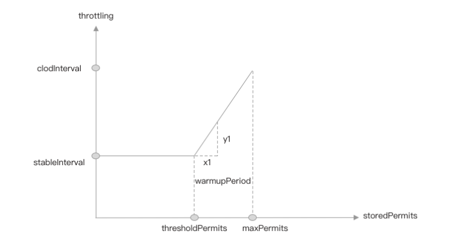 

结合上图我们可以看出：

- 图中的 x1 虚线的长度就等于 aboveToken。
- 此时生产令牌的间隔时间等于 y1 的长度加上 stableInterval，在 Sentinel 中单位为秒。

根据斜率和 x1 可计算出 y1 的值为：

> y1 = slope * aboveToken

而 1.0/count 计算出来的值是正常情况下每隔多少毫秒生产一个令牌，即 stableInterval。

所以计算 warningQps 的公式等同于：

```java
// 当前生产令牌的间隔时间：aboveToken * slope + stableInterval
// 1.0 / 生产令牌间隔时间 = 当前 1 秒所能生产的令牌数量
double warningQps = Math.nextUp(1.0 / (aboveToken * slope + stableInterval));
```

当前生产令牌的间隔时间为：

> aboveToken * slope + stableInterval = stableInterval + y1；

当前每秒所能生产的令牌数为：1.0/(stableInterval+y1)。

所以 warningQps 就等于当前每秒所能生产的令牌数。

Sentinel 中的 resync 与 SmoothRateLimiter 的 resync 方法不同，Sentinel 每秒只生产一次令牌。WarmUpController 的 syncToken 方法源码如下：

```java
   // passQps：上一秒通过的 QPS 总数 
   protected void syncToken(long passQps) {
        long currentTime = TimeUtil.currentTimeMillis();
        // 去掉毫秒，取秒
        currentTime = currentTime - currentTime % 1000;
        long oldLastFillTime = lastFilledTime.get();
        // 控制每秒只更新一次
        if (currentTime <= oldLastFillTime) {
            return;
        }

        long oldValue = storedTokens.get();
        // 计算新的存储桶存储的令牌数
        long newValue = coolDownTokens(currentTime, passQps);
        if (storedTokens.compareAndSet(oldValue, newValue)) {
            // storedTokens 扣减上个时间窗口的 qps
            long currentValue = storedTokens.addAndGet(-passQps);
            if (currentValue < 0) {
                storedTokens.set(0L);
            }
            lastFilledTime.set(currentTime);
        }
    }
```

Sentinel 并不是在每个请求通过时从桶中移除 Token，而是每秒在更新存储桶的令牌数时，再扣除上一秒消耗的令牌数量，上一秒消耗的令牌数量等于上一秒通过的请求数，这就是官方文档所写的每秒会自动掉落令牌。减少每一次请求都使用 CAS 更新令牌桶的令牌数可以降低 Sentinel 对应用性能的影响，这是非常巧妙的做法。

> 更新令牌桶中的令牌总数 = 当前令牌桶中剩余的令牌总数 + 当前需要生成的令牌数（1 秒时间可生产的令牌总数）。

coolDownTokens 方法的源码如下：

```java
   //  currentTime： 当前时间戳，单位为秒，但后面 3 位全为 0
   //  passQps：上一秒通过的 QPS
   private long coolDownTokens(long currentTime, long passQps) {
        long oldValue = storedTokens.get();
        long newValue = oldValue;
        // 添加令牌的判断前提条件: 当令牌的消耗远低于警戒线的时候
        if (oldValue < warningToken) {
            newValue = (long) (oldValue + (currentTime - lastFilledTime.get()) * count / 1000);
        } else if (oldValue > warningToken) {
            // 上一秒通过的请求数少于限流阈值的 1/coldFactor 时
            if (passQps < (int) count / coldFactor) {
                newValue = (long) (oldValue + (currentTime - lastFilledTime.get()) * count / 1000);
            }
        }
        return Math.min(newValue, maxToken);
    }
```

其中 (currentTime - lastFilledTime.get()) 为当前时间与上一次生产令牌时间的间隔时间，虽然单位为毫秒，但是已经去掉了毫秒的部分（毫秒部分全为 0）。如果 currentTime - lastFilledTime.get() 等于 1 秒，根据 1 秒等于 1000 毫秒，那么新生成的令牌数（newValue）等于限流阈值（count）。

```java
newValue = oldValue + 1000 * count / 1000
         = oldValue + count
```

如果是很久没有访问的情况下，lastFilledTime 远小于 currentTime，那么第一次生产的令牌数量将等于 maxToken。

## 熔断与自适应

### 熔断降级

​	限流需要我们根据不同的硬件条件做好压测，压测出一个接口或者一个服务在某种硬件配置下最大能承受的 QPS，根据这个结果配置限流规则，并且在后期需求的不断叠加，也需要对接口重新做压测，或者根据线上的实际表现不断调整限流的阈值。因此，限流可能很少使用，或者限流的阈值都会配置的比压测结果略大，这时就需要结合熔断降级做兜底。

​	Sentinel 支持对同一个资源配置多个相同类型或不同类型的规则，在配置了限流规则的基础上，我们还可以为同一资源配置熔断降级规则。当接口的 QPS 未达限流阈值却已经有很多请求超时的情况下，就可能达到熔断降级规则的阈值从而触发熔断，这就能很好地保护服务自身

#### 熔断规则

DegradeRule 规则类声明的字段如下：

```java
public class DegradeRule extends AbstractRule {
    // 可配置字段
    private double count;
    private int timeWindow;
    private int grade = RuleConstant.DEGRADE_GRADE_RT;
    private int rtSlowRequestAmount = RuleConstant.DEGRADE_DEFAULT_SLOW_REQUEST_AMOUNT;
    private int minRequestAmount = RuleConstant.DEGRADE_DEFAULT_MIN_REQUEST_AMOUNT;
    // 非配置字段
    private AtomicLong passCount = new AtomicLong(0);
    private final AtomicBoolean cut = new AtomicBoolean(false);
}
```

- count：限流阈值。
- timeWindow：重置熔断的窗口时间，默认值 0。
- grade：降级策略，支持 DEGRADE_GRADE_RT（按平均响应耗时）、DEGRADE_GRADE_EXCEPTION_RATIO（按失败比率）和 DEGRADE_GRADE_EXCEPTION_COUNT（失败次数）三种熔断降级策略。
- rtSlowRequestAmount：当 grade 配置为 DEGRADE_GRADE_RT 时，该值表示可触发熔断的超过阈值的慢请求数量。如果该值配置为 5，阈值为 100 毫秒，当连续 5 个请求计算平均耗时都超过 100 毫秒时，后面的请求才会被熔断，下个时间窗口修复。
- minRequestAmount：当 grade 配置为 DEGRADE_GRADE_EXCEPTION_RATIO 时，该值表示可触发熔断的最小请求数，假设阈值配置为 10，第一个请求就失败的情况下，失败率为 100%，minRequestAmount 就是避免出现这种情况的。
- passCount：只在 grade 为 DEGRADE_GRADE_RT 时使用，累加慢请求数，该值由一个定时任务重置，周期为 timeWindow（窗口时间大小）。
- cut：记录当前是否已经触发熔断，当 passCount 的值大于等待 rtSlowRequestAmount 时被设置为 true，由定时任务在 timeWindow 之后重置为 false

#### 熔断降级判断流程

DegradeSlot 是实现熔断降级的切入点，它作为 ProcessorSlot 插入到 ProcessorSlotChain 链表中，在 entry 方法中调用 Checker 去判断是否熔断当前请求，如果熔断则抛出 Block 异常。

Checker 并不是一个接口，而是一种检测行为，限流的 ckeck 由 FlowRuleChecker 实现，而熔断的 check 行为则由 DegradeRuleManager 负责，真正 check 逻辑判断由 DegradeRule 实现，流程如下图所示：

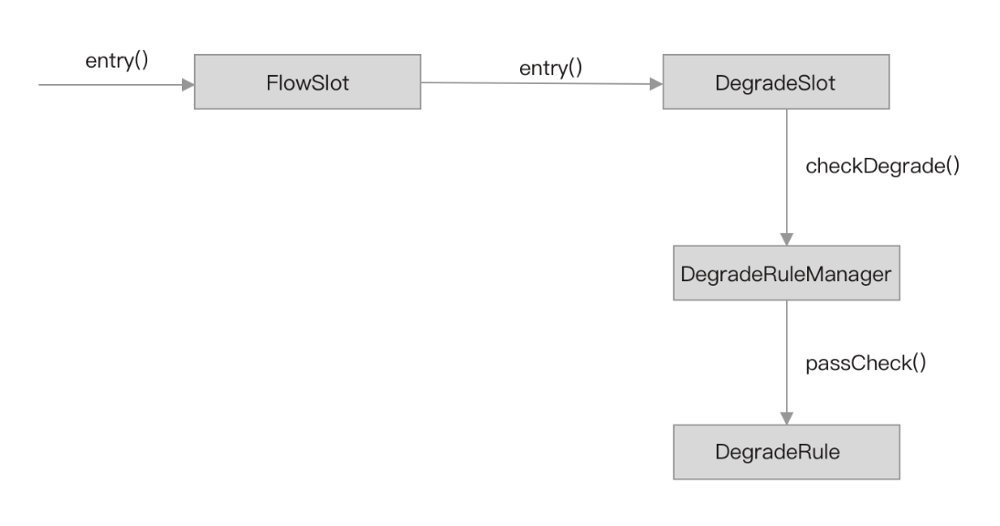

当 DegradeSlot#entry 方法被调用时，由 DegradeSlot 调用 DegradeRuleManager#checkDegrade 方法检查当前请求是否满足某个熔断降级规则。熔断规则配置由 DegradeRuleManager 加载，所以 DegradeSlot 将 check 逻辑交给 DegradeRuleManager 去完成，checkDegrade 方法的源码如下：

```java
public static void checkDegrade(ResourceWrapper resource, Context context, DefaultNode node, int count)
        throws BlockException {
        // 因为我们可以对同一个资源配置多个熔断降级规则，所以返回的将是一个集合。
        Set<DegradeRule> rules = degradeRules.get(resource.getName());
        if (rules == null) {
            return;
        }
        for (DegradeRule rule : rules) {
            if (!rule.passCheck(context, node, count)) {
                throw new DegradeException(rule.getLimitApp(), rule);
            }
        }
}
```

DegradeRuleManager 首先根据资源名称获取配置的熔断降级规则，然后遍历熔断降级规则，调用 DegradeRule#passCheck 方法将检查是否需要触发熔断的逻辑交给 DegradeRule 完成。如果对一个资源配置多个熔断降级规则，那么只要有一个熔断降级规则满足条件，就会触发熔断。

DegradeRule#passCheck 方法源码如下：

```java
   @Override
    public boolean passCheck(Context context, DefaultNode node, int acquireCount, Object... args) {
        if (cut.get()) {
            return false;
        }
        // (1)
        ClusterNode clusterNode = ClusterBuilderSlot.getClusterNode(this.getResource());
        if (clusterNode == null) {
            return true;
        }
        // (2)
        if (grade == RuleConstant.DEGRADE_GRADE_RT) {
            double rt = clusterNode.avgRt();
            if (rt < this.count) {
                passCount.set(0);
                return true;
            }
            if (passCount.incrementAndGet() < rtSlowRequestAmount) {
                return true;
            }
        } 
        // (3)
        else if (grade == RuleConstant.DEGRADE_GRADE_EXCEPTION_RATIO) {
            double exception = clusterNode.exceptionQps();
            double success = clusterNode.successQps();
            double total = clusterNode.totalQps();
            if (total < minRequestAmount) {
                return true;
            }
            double realSuccess = success - exception;
            if (realSuccess <= 0 && exception < minRequestAmount) {
                return true;
            }
            if (exception / success < count) {
                return true;
            }
        } 
        // (4)
        else if (grade == RuleConstant.DEGRADE_GRADE_EXCEPTION_COUNT) {
            double exception = clusterNode.totalException();
            if (exception < count) {
                return true;
            }
        }
        // (5)
        if (cut.compareAndSet(false, true)) {
            ResetTask resetTask = new ResetTask(this);
            pool.schedule(resetTask, timeWindow, TimeUnit.SECONDS);
        }
        // 熔断
        return false;
    }
```

1. 根据资源名称获取该资源全局的指标数据统计 ClusterNode。
2. 如果熔断降级策略为 DEGRADE_GRADE_RT，从 ClusterNode 读取当前平均耗时，如果平均耗时超过限流的阈值，并且超过阈值的慢请求数大于 rtSlowRequestAmount，则跳转到（5）；否则如果平均耗时下降小于阈值，将计数器 passCount 重置为 0。
3. 如果熔断降级策略为 DEGRADE_GRADE_EXCEPTION_RATIO，读取当前时间窗口（1 秒）的异常总数、成功总数、总 QPS，判断异常总数与成功总数的比值是否小于规则设置的阈值，小于才能通过。失败率大于等于阈值且当前总的 QPS 大于 minRequestAmount，则跳转到（5）。
4. 如果熔断降级策略为 DEGRADE_GRADE_EXCEPTION_COUNT，读取当前滑动窗口（1 分钟）的异常总数，如果异常总数大于规则配置的阈值，则跳转到（5），否则请求通过。
5. 记录当前已经触发熔断，后续请求不需要重复判断。并且开启定时任务用于重置熔断标志，休眠 timeWindow 时长后重置熔断标志；当 timeWindow 不配置或者配置为 0 时，cut 被立即重置，也就是不保存熔断判断的结果，每个请求都需要重新判断一次。

官方文档在介绍 DEGRADE_GRADE_EXCEPTION_COUNT 策略的地方加了使用注意说明，内容为：

> 注意由于统计时间窗口是分钟级别的，若 timeWindow 小于 60s，则结束熔断状态后仍可能再进入熔断状态。

这句话并不难理解，因为调用 ClusterNode#totalException 方法获取的是一分钟内的总异常数。StatisticNode 的 totalException 源码如下：

```java
// 数组大小为 60，窗口时间长度为 1000 毫秒
private transient Metric rollingCounterInMinute = new ArrayMetric(60, 60 * 1000, false);

@Override
public long totalException() {
    // 获取 1 分钟的总异常数
    return rollingCounterInMinute.exception();
}
```

也因如此，DEGRADE_GRADE_EXCEPTION_COUNT 这个熔断降级策略似乎使用场景不多，笔者也未曾使用过。

timeWindow、passCount、cut 是作者出于性能考虑而添加的，在配置熔断规则时，建议不要将 timeWindow 配置为 0 或者小于 0，可将 timeWindow 配置为 1000 毫秒，一个窗口时间长度，能减少一点计算就能降低一点 Sentinel 对性能的影响

### 系统自适应限流

系统自适应限流就是在系统负载过高的情况下，自动切断后续请求，以保证服务的稳定运行。系统自适应限流也属于熔断降级的一种实现，而非限流降级，它与熔断降级都有一个共性，在保证服务稳定运行的情况下尽最大可能处理更多请求，一旦系统负载达到阈值就熔断请求。

SystemSlot 是实现系统自适应限流的切入点。DegradeSlot 在 ProcessorSlotChain 链表中被放在 FlowSlot 的后面，作为限流的兜底解决方案，而 SystemSlot 在 ProcessorSlotChain 链表中被放在 FlowSlot 的前面，强制优先考虑系统目前的情况能否处理当前请求，让系统尽可能跑在最大吞吐量的同时保证系统的稳定性

#### **自适应限流规则**

系统自适应限流规则针对所有流量类型为 IN 的资源生效，因此不需要配置规则的资源名称。SystemRule 定义的字段如下：

```java
public class SystemRule extends AbstractRule {
    private double highestSystemLoad = -1;
    private double highestCpuUsage = -1;
    private double qps = -1;
    private long avgRt = -1;
    private long maxThread = -1;
}
```

- qps：按 QPS 限流的阈值，默认 -1，大于 0 才生效。
- avgRt：按平均耗时的限流阈值，默认 -1，大于 0 才生效。
- maxThread：最大并行占用的线程数阈值，默认 -1，大于 0 才生效。
- highestCpuUsage：按 CPU 使用率限流的阈值，取值[0,1]之间，默认 -1，大于等于 0.0 才生效。
- highestSystemLoad：按系统负载限流的阈值，默认 -1，大于 0.0 才生效。

如果配置了多个 SystemRule，则每个配置项只取最小值。例如三个 SystemRule 都配置了 qps，则取这三个规则中最小的 qps 作为限流阈值，这在调用 SystemRuleManager#loadRules 方法加载规则时完成。

```java
   public static void loadSystemConf(SystemRule rule) {
        // 是否开启系统自适应限流判断功能
        boolean checkStatus = false;
        // highestSystemLoad
        if (rule.getHighestSystemLoad() >= 0) {
            // 多个规则都配置则取最小值
            highestSystemLoad = Math.min(highestSystemLoad, rule.getHighestSystemLoad());
            highestSystemLoadIsSet = true;
            // 开启系统自适应限流检查功能
            checkStatus = true;
        }
        // highestCpuUsage
        if (rule.getHighestCpuUsage() >= 0) {
            if (rule.getHighestCpuUsage() > 1) {}
            // [0,1)
            else {
                // 多个规则都配置则取最小值
                highestCpuUsage = Math.min(highestCpuUsage, rule.getHighestCpuUsage());
                highestCpuUsageIsSet = true;
                checkStatus = true;
            }
        }
        // avgRt
        if (rule.getAvgRt() >= 0) {
            // 多个规则都配置则取最小值
            maxRt = Math.min(maxRt, rule.getAvgRt());
            maxRtIsSet = true;
            checkStatus = true;
        }
        // maxThread
        if (rule.getMaxThread() >= 0) {
            // 多个规则都配置则取最小值
            maxThread = Math.min(maxThread, rule.getMaxThread());
            maxThreadIsSet = true;
            checkStatus = true;
        }
        // qps
        if (rule.getQps() >= 0) {
            // 多个规则都配置则取最小值
            qps = Math.min(qps, rule.getQps());
            qpsIsSet = true;
            checkStatus = true;
        }
        checkSystemStatus.set(checkStatus);
    }
```

#### **系统自适应限流判断流程**

当 SystemSlot#entry 方法被调用时，由 SystemSlot 调用 SystemRuleManager#checkSystem 方法判断是否需要限流，流程如下图所示：

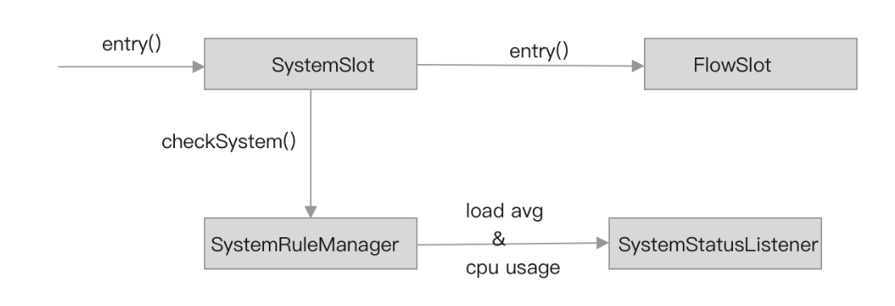 

SystemRuleManager#checkSystem 方法从全局的资源指标数据统计节点 Constans.ENTRY_NODE 读取当前时间窗口的指标数据，判断总的 QPS、平均耗时这些指标数据是否达到阈值，或者总占用的线程数是否达到阈值，如果达到阈值则抛出 Block 异常（SystemBlockException）。除此之外，checkSystem 方法还实现了根据系统当前 Load 和 CPU 使用率限流。

SystemRuleManager#checkSystem 方法源码如下：

```java
public static void checkSystem(ResourceWrapper resourceWrapper) throws BlockException {
        if (resourceWrapper == null) {
            return;
        }
        // 如果有配置 SystemRule，则 checkSystemStatus 为 true
        if (!checkSystemStatus.get()) {
            return;
        }
        // 只限流类型为 IN 的流量
        if (resourceWrapper.getEntryType() != EntryType.IN) {
            return;
        }
        // qps 限流
        double currentQps = Constants.ENTRY_NODE == null ? 0.0 : Constants.ENTRY_NODE.successQps();
        if (currentQps > qps) {
            throw new SystemBlockException(resourceWrapper.getName(), "qps");
        }
        // 占用线程数限流
        int currentThread = Constants.ENTRY_NODE == null ? 0 : Constants.ENTRY_NODE.curThreadNum();
        if (currentThread > maxThread) {
            throw new SystemBlockException(resourceWrapper.getName(), "thread");
        }
        // 平均耗时限流
        double rt = Constants.ENTRY_NODE == null ? 0 : Constants.ENTRY_NODE.avgRt();
        if (rt > maxRt) {
            throw new SystemBlockException(resourceWrapper.getName(), "rt");
        }
        // 系统平均负载限流
        if (highestSystemLoadIsSet && getCurrentSystemAvgLoad() > highestSystemLoad) {
            if (!checkBbr(currentThread)) {
                throw new SystemBlockException(resourceWrapper.getName(), "load");
            }
        }
        // cpu 使用率限流
        if (highestCpuUsageIsSet && getCurrentCpuUsage() > highestCpuUsage) {
            throw new SystemBlockException(resourceWrapper.getName(), "cpu");
        }
}
```

- Constans.ENTRY_NODE：统计所有流量类型为 IN 的指标数据、总的并行占用线程数。

- SystemStatusListener#run 方法被定时调用，负责获取系统的平均负载和 CPU 使用率

  Sentinel 通过定时任务每秒钟使用 OperatingSystemMXBean API 获取这两个指标数据的值，代码如下：

  ```java
  @Override
      public void run() {
          try {
              OperatingSystemMXBean osBean = ManagementFactory
                                         .getPlatformMXBean(OperatingSystemMXBean.class);
              // getSystemLoadAverage
              currentLoad = osBean.getSystemLoadAverage();
              // getSystemCpuLoad
              currentCpuUsage = osBean.getSystemCpuLoad();
              if (currentLoad > SystemRuleManager.getSystemLoadThreshold()) {
                  writeSystemStatusLog();
              }
          } catch (Throwable e) {
              RecordLog.warn("[SystemStatusListener] Failed to get system metrics from JMX", e);
          }
      }
  ```

  - getSystemLoadAverage：获取最近 1 分钟系统的平均负载。
  - getSystemCpuLoad：返回整个系统的最近 CPU 使用率。此值是 [0.0,1.0] 间隔中的双精度值。值为 0.0 表示在最近观察的时间段内，所有 CPU 都处于空闲状态，而值为 1.0 意味着在最近一段时间内，所有 CPU 都处于 100%活动状态。如果系统最近的 CPU 使用率不可用，则该方法返回负值

- 当系统负载大于限流的负载阈值时，使用 BBR 算法判断是否需要限流

  ```java
  private static boolean checkBbr(int currentThread) {
          if (currentThread > 1 &&
              currentThread > 
              Constants.ENTRY_NODE.maxSuccessQps() * Constants.ENTRY_NODE.minRt() / 1000) {
              return false;
          }
          return true;
  }
  ```

  - Constants.ENTRY_NODE.maxSuccessQps：从秒级滑动窗口中获取最大请求成功总数。
  - Constants.ENTRY_NODE.minRt：当前时间窗口的最小请求处理耗时。

  假设某接口的最大 QPS 为 800，处理一次请求的最小耗时为 5ms，那么至少需要并行的线程数与 Min RT 和 Max QPS 的关系为：

  > Max QPS = Threads * (1000/Min Rt)

  推出：

  > Threads = Max QPS/(1000/Min Rt) = Max QPS * Min Rt/1000

  替换 Min Rt 为 5ms、Max QPS 为 800，计算结果：

  > Threads = 800 * 5⁄1000 = 4

  所以，checkBbr 方法中，(minRt/1000) 是将最小耗时的单位由毫秒转为秒，表示系统处理最多请求时的最小耗时，maxSuccessQps * (minRt/1000) 表示至少需要每秒多少个线程并行才能达到 maxSuccessQps。在系统负载比较高的情况下，只要并行占用的线程数超过该值就限流。但如果 Load 高不是由当前进程引起的，checkBbr 的效果就不明显

## 黑白名单与热点参数

### 黑名单限流

黑白名单过滤是使用最为广泛的一种过滤规则，例如，用于实现接口安全的 IP 黑白名单规则过滤，用于防骚扰的短信、来电拦截黑白名单过滤。所以 Sentinel 中的黑白名单限流并不难理解，如果配置了黑名单，且请求来源存在黑名单中，则拦截（拒绝）请求，如果配置了白名单，且请求来源存在白名单中则放行。Sentinel 不支持一个黑白名单规则同时配置黑名单和白名单，因此不存优先级的问题。

黑白名单过滤功能更像是一种授权机制，它简单的将权限分为有权限和无权限两种情况，如果支持冲突，可使用优先级策略解决冲突问题。Sentinel 把黑白名作为授权策略，实现黑白名单限流即实现授权限流。Sentinel 在命名上也是使用 Authority，而非 BlackWhiteList。

一些关键类说明：

- AuthoritySlot：实现黑白名称授权功能的切入点（ProcessorSlot）
- AuthorityRule：授权规则类
- AuthorityRuleChecker：授权检测类
- AuthorityRuleManager：授权规则管理者，提供 loadRuls API
- AuthorityException：授权检测异常，继承 BlockException

#### AuthorityRule

授权规则（AuthorityRule）是 Sentinel 中最易于理解的一种规则，AuthorityRule 的配置项如下：

```java
public class AuthorityRule extends AbstractRule {
    private int strategy = RuleConstant.AUTHORITY_WHITE;
}
```

- resource：资源名称，从父类继承而来。
- limitApp：限制的来源名称，在 AuthorityRule 中可配置多个，使用‘,’号分隔。
- strategy：限流策略，白名单：AUTHORITY_WHITE，黑名单：AUTHORITY_BLACK。

当 strategy 配置为 AUTHORITY_WHITE 时，limitApp 即为白名单；当 strategy 配置为 AUTHORITY_BLACK 时，limitApp 即为黑明单。例如：

```java
AuthorityRule rule = new AuthorityRule();
// 资源名称
rule.setResource("GET:/hello");
// 白名单策略
rule.setStrategy(RuleConstant.AUTHORITY_WHITE);
// 白名单
rule.setLimitApp("serviceA,serviceC");
AuthorityRuleManager.loadRules(Collections.singletonList(rule));
```

上述规则用于限制资源 “GET:/hello” 只允许服务 A 和服务 C 访问

#### AuthoritySlot

在使用默认的 SlotChainBuilder 情况下，AuthoritySlot 被放在 SystemSlot、FlowSlot、DegradeSlot 的前面，其优先级更高。

原因之一是授权限流不需要使用统计的指标数据，另一个原因则是提升性能，在未授权的情况下没必要判断是否需要熔断、系统负载能否接住这个请求、QPS 是否过高等，这与用户授权功能是一样的道理，未登陆无需判断是否有权限访问某个资源。

AuthoritySlot 的实现源码如下：

```java
public class AuthoritySlot extends AbstractLinkedProcessorSlot<DefaultNode> {

    @Override
    public void entry(Context context, ResourceWrapper resourceWrapper, DefaultNode node, int count, boolean prioritized, Object... args)
        throws Throwable {
        checkBlackWhiteAuthority(resourceWrapper, context);
        fireEntry(context, resourceWrapper, node, count, prioritized, args);
    }

    @Override
    public void exit(Context context, ResourceWrapper resourceWrapper, int count, Object... args) {
        fireExit(context, resourceWrapper, count, args);
    }

    void checkBlackWhiteAuthority(ResourceWrapper resource, Context context) throws AuthorityException {
        // (1)
        Map<String, Set<AuthorityRule>> authorityRules = AuthorityRuleManager.getAuthorityRules();
        if (authorityRules == null) {
            return;
        }
        // (2)
        Set<AuthorityRule> rules = authorityRules.get(resource.getName());
        if (rules == null) {
            return;
        }
        // (3)
        for (AuthorityRule rule : rules) {
            if (!AuthorityRuleChecker.passCheck(rule, context)) {
                throw new AuthorityException(context.getOrigin(), rule);
            }
        }
    }
}
```

- 从 AuthorityRuleManager 获取当前配置的所有授权规则；
- 获取为当前资源配置的所有授权规则；
- 遍历授权规则，调用 AuthorityRuleChecker#passCheck 方法判断是否拒绝当前请求，是则抛出 AuthorityException 异常

#### **AuthorityRuleChecker**

AuthorityRuleChecker 负责实现黑白名单的过滤逻辑，其 passCheck 方法源码如下：

```java
    static boolean passCheck(AuthorityRule rule, Context context) {
        // 获取来源
        String requester = context.getOrigin();
        // 来源为空，或者来源等于规则配置的 limitApp 则拦截请求
        if (StringUtil.isEmpty(requester) || StringUtil.isEmpty(rule.getLimitApp())) {
            return true;
        }
        // 字符串查找，这一步起到快速过滤的作用，提升性能
        int pos = rule.getLimitApp().indexOf(requester);
        boolean contain = pos > -1;
        // 存在才精确匹配
        if (contain) {
            boolean exactlyMatch = false;
            // 分隔数组
            String[] appArray = rule.getLimitApp().split(",");
            for (String app : appArray) {
                if (requester.equals(app)) {
                    // 标志设置为 true
                    exactlyMatch = true;
                    break;
                }
            }
            contain = exactlyMatch;
        }
        // 策略
        int strategy = rule.getStrategy();
        // 如果是黑名单，且来源存在规则配置的黑名单中
        if (strategy == RuleConstant.AUTHORITY_BLACK && contain) {
            return false;
        }
        // 如果是白名单，且来源不存在规则配置的白名单中
        if (strategy == RuleConstant.AUTHORITY_WHITE && !contain) {
            return false;
        }
        return true;
    }
```

整个方法都比较简单，首先是从当前 Context 获取调用来源的名称，只有在调用来源不为空且规则配置了黑名单或者白名单的情况下，才会走黑白名单的过滤逻辑，这也说明，要实现黑白名单限流的前提是，每个服务消费端在发起请求时都必须要携带自身服务的名称，这取决于 Sentinel 主流框架适配器；其次，Sentinel 通过使用 indexOf 先简单匹配一次黑名单或白名单，再切割黑名单或白名单数组实现精确匹配，这有助于提升性能；如果当前请求来源存在名单中，则根据策略判断这份名称是黑名单还是白名单，再决定是否需要拒绝请求。

### 热点参数限流

热点参数限流并非在 Sentinel 的 core 模块中实现的，但也是非常实用的一种限流方式。并且，Sentinel 支持 API Gateway 网关限流也是基于参数限流实现的，了解热点参数限流的实现原理，也有助于我们更好地理解网关限流。

参数限流，即根据方法调用传递的参数实现限流，又或者说是根据接口的请求参数限流；热点参数限流，即针对访问频繁的参数限流。

例如，都是调用一个下单接口，但购买的商品不同，比如主播带货的商品下单流量较大，而一般商品购买量很少，同时因为商品数量有限，不太可能每个下单请求都能购买成功，如果能实现根据客户端请求传递的商品 ID 实现限流，将流量控制在商品的库存总量左右，并且使用 QPS 限流等兜底，这种有针对性的限流将接口通过的有效流量最大化。

热点参数限流功能在 Sentinel 源码的扩展功能模块为 sentinel-extension，子模块为 sentinel-parameter-flow-control

#### **滑动窗口**

热点参数限流使用的指标数据不再是 core 模块中统计的指标数据，而是重新实现了一套指标数据统计功能，依旧是基于滑动窗口。

- ParamMapBucket：实现参数指标数据统计的 Bucket，用于统计某个参数对应不同取值的被限流总数、被放行的总数。
- HotParameterLeapArray：实现滑动窗口，持有 WindowWrap 数组，WindowWrap 包装 ParamMapBucket。

与 core 模块的 MetricBucket 实现不同，MetricBucket 只统计每个指标的数值，而 ParamMapBucket 需要统计每个指标、参数的每种取值的数值，MetricBucket 更像是 Redis 中的 String 结构，而 ParamMapBucket 更像 Redis 中的 Hash 结构。

ParamMapBucket 的源码如下：

```java
public class ParamMapBucket {

    // 数组类型为 CacheMap<Object, AtomicInteger>
    private final CacheMap<Object, AtomicInteger>[] data;

    public ParamMapBucket() {
        this(DEFAULT_MAX_CAPACITY);
    }

    public ParamMapBucket(int capacity) {
        RollingParamEvent[] events = RollingParamEvent.values();
        // 根据需要统计的指标数据创建数组
        this.data = new CacheMap[events.length];
        // RollingParamEvent 可取值为 REQUEST_PASSED、REQUEST_BLOCKED
        for (RollingParamEvent event : events) {
            data[event.ordinal()] = new ConcurrentLinkedHashMapWrapper<Object, AtomicInteger>(capacity);
        }
    }

}
```

- data：数组元素类型为 `CacheMap<Object, AtomicInteger>`，下标为 0 存储的是统计请求通过的指标数据，下标为 1 统计的是请求被拒绝的指标数据。
- `CacheMap<Object, AtomicInteger>`：key 为参数的取值，例如商品的 ID，value 才是指标数值

HotParameterLeapArray 继承 LeapArray，即实现滑动窗口。ParamMapBucket 不存储窗口时间信息，窗口时间信息依然由 WindowWrap 存储，HotParameterLeapArray 使用 WindowWrap 包装 ParamMapBucket。

笔者也是看了 HotParameterLeapArray 之后才明白为什么 Sentienl 将滑动窗口抽象为 LeapArray，这为扩展实现收集自定义指标数据的滑动窗口提供了支持。

HotParameterLeapArray 的提供的几个 API 如下：

```java
public class HotParameterLeapArray extends LeapArray<ParamMapBucket> {
   //.....
    public void addValue(RollingParamEvent event, int count, Object value) {
        // ....
    }

    public Map<Object, Double> getTopValues(RollingParamEvent event, int number) {
       // .....
    }

    public long getRollingSum(RollingParamEvent event, Object value) {
        // .....
    }

    public double getRollingAvg(RollingParamEvent event, Object value) {
        // ....
    }
}
```

- addValue：添加参数的指标数值，例如，给 REQUEST_PASSED 指标且参数取值为 4343433 的指标数值加上 count，假设这个滑动窗口是用于统计商品 ID 参数的，4343433 表示商品 ID，count 为 1，调用该方法表示给商品 ID 为 4343433 的请求通过总数加 1。
- getTopValues：获取热点参数的 QPS，即获取某个指标排名前 number 的参数取值与指标数据。例如，获取 REQUEST_PASSED 指标排名前 10 的 QPS，方法返回值类型为 Map，key 为参数的取值，value 为 QPS。
- getRollingSum：计算某个指标、参数的某个取值的总请求数。例如，获取 REQUEST_PASSED 且商品 ID 为 4343433 的请求总数。
- getRollingAvg：获取某个指标、参数的某个取值的平均 QPS。例如，获取 REQUEST_PASSED 且商品 ID 为 4343433 的平均 QPS。

可见，如果是分钟级的滑动窗口，一分内参数的取值越多，其占用的内存就越多

#### Node

两个需要重点关注的类：

- ParameterMetric：用于实现类似 ClusterNode 的统计功能。
- ParameterMetricStorage：用于实现类似 EntranceNode 功能，管理和存储每个资源对应的 ParameterMetric。

ParameterMetric 有三个静态字段，源码如下：

```java
public class ParameterMetric {

    private final Map<ParamFlowRule, CacheMap<Object, AtomicLong>> ruleTimeCounters = new HashMap<>();
    private final Map<ParamFlowRule, CacheMap<Object, AtomicLong>> ruleTokenCounter = new HashMap<>();
    private final Map<Integer, CacheMap<Object, AtomicInteger>> threadCountMap = new HashMap<>();

}
```

- ruleTimeCounters：用于实现匀速流量控制效果，key 为参数限流规则（ParamFlowRule），值为参数不同取值对应的上次生产令牌的时间。
- ruleTokenCounter：用于实现匀速流量控制效果，key 为参数限流规则（ParamFlowRule），值为参数不同取值对应的当前令牌桶中的令牌数。
- threadCountMap：key 为参数索引，值为参数不同取值对应的当前并行占用的线程总数。

ParameterMetricStorage 使用 ConcurrentHashMap 缓存每个资源对应的 ParameterMetric，只会为配置了参数限流规则的资源创建 ParameterMetric。其部份源码如下所示：

```java
public final class ParameterMetricStorage {
    private static final Map<String, ParameterMetric> metricsMap = new ConcurrentHashMap<>();
    private static final Object LOCK = new Object();

    public static void initParamMetricsFor(ResourceWrapper resourceWrapper,ParamFlowRule rule) {
        if (resourceWrapper == null || resourceWrapper.getName() == null) {
            return;
        }
        String resourceName = resourceWrapper.getName();
        ParameterMetric metric;
        // 双重检测，线程安全，为资源创建全局唯一的 ParameterMetric
        if ((metric = metricsMap.get(resourceName)) == null) {
            synchronized (LOCK) {
                if ((metric = metricsMap.get(resourceName)) == null) {
                    metric = new ParameterMetric();
                    metricsMap.put(resourceWrapper.getName(), metric);
                }
            }
        }
        // 初始化 ParameterMetric
        metric.initialize(rule);
    }
}
```

initParamMetricsFor 方法用于为资源创建 ParameterMetric 并初始化，该方法在资源被访问时由 ParamFlowSlot 调用，并且该方法只在为资源配置了参数限流规则的情况下被调用

#### ParamFlowSlot

sentinel-parameter-flow-control 模块通过 Java SPI 注册自定义的 SlotChainBuilder，即注册 HotParamSlotChainBuilder，将 ParamFlowSlot 放置在 StatisticSlot 的后面，这个 ParamFlowSlot 就是实现热点参数限流功能的切入点。

```java
public class ParamFlowSlot extends AbstractLinkedProcessorSlot<DefaultNode> {

    @Override
    public void entry(Context context, ResourceWrapper resourceWrapper, DefaultNode node, int count,
                      boolean prioritized, Object... args) throws Throwable {
        if (!ParamFlowRuleManager.hasRules(resourceWrapper.getName())) {
            fireEntry(context, resourceWrapper, node, count, prioritized, args);
            return;
        }
        checkFlow(resourceWrapper, count, args);
        fireEntry(context, resourceWrapper, node, count, prioritized, args);
    }

    @Override
    public void exit(Context context, ResourceWrapper resourceWrapper, int count, Object... args) {
        fireExit(context, resourceWrapper, count, args);
    }
}
```

既然是参数限流，那么肯定是需要能够拿到参数了，而 ProcessorSlot#entry 方法的最后一个参数就是请求传递过来的参数，通过 SphU#entry 方法一层层往下传递。例如：

```java
    @GetMapping("/hello")
    public String apiHello(String name) throws BlockException {
        ContextUtil.enter("my_context");
        Entry entry = null;
        try {
            entry = SphU.entry("GET:/hello", EntryType.IN,1,name);
            doBusiness();
            return "Hello!";
        } catch (Exception e) {
            if (!(e instanceof BlockException)) {
                Tracer.trace(e);
            }
            throw e;
        } finally {
            if (entry != null) {
                entry.exit(1);
            }
            ContextUtil.exit();
        }
    }
```

当 SphU#entry 调用到 ParamFlowSlot#entry 方法时，ParamFlowSlot 调用 checkFlow 方法判断是否需要限流.checkFlow 方法的实现如下：

```java
   void checkFlow(ResourceWrapper resourceWrapper, int count, Object... args) throws BlockException {
        //（1）
        if (args == null) {
            return;
        }
        if (!ParamFlowRuleManager.hasRules(resourceWrapper.getName())) {
            return;
        }
        List<ParamFlowRule> rules = ParamFlowRuleManager.getRulesOfResource(resourceWrapper.getName());
        //（2）
        for (ParamFlowRule rule : rules) {
            applyRealParamIdx(rule, args.length);

            // Initialize the parameter metrics.
            ParameterMetricStorage.initParamMetricsFor(resourceWrapper, rule);

            if (!ParamFlowChecker.passCheck(resourceWrapper, rule, count, args)) {
                String triggeredParam = "";
                if (args.length > rule.getParamIdx()) {
                    Object value = args[rule.getParamIdx()];
                    triggeredParam = String.valueOf(value);
                }
                throw new ParamFlowException(resourceWrapper.getName(), triggeredParam, rule);
            }
        }
    }
```

- checkFlow 方法的最后一个参数是请求参数，也就是调用 SphU#entry 方法传递进来的参数。
- checkFlow 方法首先调用 ParamFlowRuleManager 的 API 判断当前资源有没有配置参数限流规则，如果有，则获取为当前资源配置的所有参数限流规则。
- 遍历参数限流规则，调用 ParameterMetricStorage#initParamMetricsFor 方法判断是否需要为当前资源初始化创建 ParameterMetric，然后调用 ParamFlowChecker#passCheck 方法判断当前请求是否可以放行，如果需要拒绝请求，则抛出 ParamFlowException 异常

#### 限流规则

在阅读 ParamFlowChecker#passCheck 方法的源码之前，我们需要先了解参数限流规则的配置，了解每个配置项的作用。

参数限流规则 ParamFlowRule 的源码如下（有删减）：

```java
public class ParamFlowRule extends AbstractRule {
    private int grade = RuleConstant.FLOW_GRADE_QPS;
    private double count;
    private Integer paramIdx;
    private int controlBehavior = RuleConstant.CONTROL_BEHAVIOR_DEFAULT;
    private int maxQueueingTimeMs = 0;
    private long durationInSec = 1;
    private int burstCount = 0;
}
```

- grade：限流规则的阈值类型，支持的类型同 FlowRule。
- count：阈值，同 FlowRule。
- paramIdx：参数索引，ParamFlowChecker 根据限流规则的参数索引获取参数的值，下标从 0 开始，例如方法 `public String apiHello(String name)`，该方法只有一个参数，索引为 0 对应 name 参数。
- controlBehavior：流量控制效果，同 FlowRule，但只支持快速失败和匀速排队。
- maxQueueingTimeMs：实现匀速排队流量控制效果的虚拟队列最大等待时间，超过该值的请求被抛弃，同 FlowRule；
- durationInSec：统计指标数据的窗口时间大小，单位为秒。
- burstCount：支持的突发流量总数。

假设需要针对资源“GET:/hello”的 name 参数限流，当 name 取值为“jackson”时限流 QPS 阈值为 5，则配置如下：

```java
ParamFlowRule rule = new ParamFlowRule();
// 资源为/hello
rule.setResource("GET:/hello");
// 索引 0 对应的参数为 name
rule.setParamIdx(0); 
// qps 限流
rule.setGrade(RuleConstant.FLOW_GRADE_QPS);
// 阈值为 5
rule.setCount(5);
ParamFlowRuleManager.loadRules(Collections.singletonList(rule));
```

以此为例，我们分析 ParamFlowChecker#passCheck 方法源码，passCheck 返回 true 表示放行，返回 false 表示拒绝。

ParamFlowChecker#passCheck 方法源码如下：

```java
    public static boolean passCheck(ResourceWrapper resourceWrapper, ParamFlowRule rule, int count,
                             Object... args) {
        if (args == null) {
            return true;
        }
        // 判断参数索引是否合法
        int paramIdx = rule.getParamIdx();
        if (args.length <= paramIdx) {
            return true;
        }
        // 获取参数值，如果值为空则允许通过
        Object value = args[paramIdx];
        if (value == null) {
            return true;
        }
        // 集群限流
        if (rule.isClusterMode() && rule.getGrade() == RuleConstant.FLOW_GRADE_QPS) {
            return passClusterCheck(resourceWrapper, rule, count, value);
        }
        // 单机限流
        return passLocalCheck(resourceWrapper, rule, count, value);
    }
```

- 如果参数为空、或者参数的总数小于等于规则配置的参数索引值、或者参数索引对应的参数的值为空，则放行请求；
- 如果是集群限流模式，则调用 passClusterCheck 方法，否则调用 passLocalCheck 方法

我们先不讨论集群限流情况，仅看单机本地限流情况。passLocalCheck 方法的源码如下：

```java
  private static boolean passLocalCheck(ResourceWrapper resourceWrapper, ParamFlowRule rule, int count,
                                          Object value) {
        try {
            // 基本数据类型
            if (Collection.class.isAssignableFrom(value.getClass())) {
                for (Object param : ((Collection)value)) {
                    if (!passSingleValueCheck(resourceWrapper, rule, count, param)) {
                        return false;
                    }
                }
            }
            // 数组类
            else if (value.getClass().isArray()) {
                int length = Array.getLength(value);
                for (int i = 0; i < length; i++) {
                    Object param = Array.get(value, i);
                    if (!passSingleValueCheck(resourceWrapper, rule, count, param)) {
                        return false;
                    }
                }
            }
            // 引用类型
            else {
                return passSingleValueCheck(resourceWrapper, rule, count, value);
            }
        } catch (Throwable e) {
        }
        return true;
    }
```

由于参数可能是基本数据类型，也可能是数组类型，或者引用类型，所以 passLocalCheck 方法分三种情况处理。我们只讨论其中一种情况，其它情况的实现类似。

以资源“GET:/hello”为例，其方法 apiHello 的 name 参数为 String 类型，因此会调用 passSingleValueCheck 方法，该方法源码如下：

```java
  static boolean passSingleValueCheck(ResourceWrapper resourceWrapper, ParamFlowRule rule, int acquireCount,Object value) {
       //（1） 
       if (rule.getGrade() == RuleConstant.FLOW_GRADE_QPS) {
            if (rule.getControlBehavior() == RuleConstant.CONTROL_BEHAVIOR_RATE_LIMITER) {
                return passThrottleLocalCheck(resourceWrapper, rule, acquireCount, value);
            } else {
                return passDefaultLocalCheck(resourceWrapper, rule, acquireCount, value);
            }
        } 
        // （2）
        else if (rule.getGrade() == RuleConstant.FLOW_GRADE_THREAD) {
            Set<Object> exclusionItems = rule.getParsedHotItems().keySet();
            long threadCount = getParameterMetric(resourceWrapper).getThreadCount(rule.getParamIdx(), value);
            if (exclusionItems.contains(value)) {
                int itemThreshold = rule.getParsedHotItems().get(value);
                return ++threadCount <= itemThreshold;
            }
            long threshold = (long)rule.getCount();
            return ++threadCount <= threshold;
        }

        return true;
    }
```

- 当规则配置的阈值类型为 QPS 时，根据流控效果调用 passThrottleLocalCheck 或 passDefaultLocalCheck 方法；
- 当规则配置的阈值类型为 THREAD 时，获取当前资源的 ParameterMetric，从而取得当前资源、当前参数的值对应的并行占用的线程总数，如果并行占用的线程总数+1 大于限流阈值则限流，否则放行。

由 ParamFlowStatisticEntryCallback 与 ParamFlowStatisticExitCallback 这两个 Callback 实现的，分别在 StatisticSlot 的 entry 方法和 exit 方法中被回调执行，这是我们前面分析 StatisticSlot 源码时故意遗漏的细节。

#### 快速失败

快速失败基于令牌桶算法实现。passDefaultLocalCheck 方法控制每个时间窗口只生产一次令牌，将令牌放入令牌桶，每个请求都从令牌桶中取走令牌，当令牌足够时放行，当令牌不足时直接拒绝。ParameterMetric#tokenCounters 用作令牌桶，timeCounters 存储最近一次生产令牌的时间。

passDefaultLocalCheck 方法源码如下：

```java
static boolean passDefaultLocalCheck(ResourceWrapper resourceWrapper, ParamFlowRule rule, int acquireCount,
                                         Object value) {
        //（1）
        ParameterMetric metric = getParameterMetric(resourceWrapper);
        CacheMap<Object, AtomicLong> tokenCounters = metric == null ? null : metric.getRuleTokenCounter(rule);
        CacheMap<Object, AtomicLong> timeCounters = metric == null ? null : metric.getRuleTimeCounter(rule);
        if (tokenCounters == null || timeCounters == null) {
            return true;
        }
        // （2）
        Set<Object> exclusionItems = rule.getParsedHotItems().keySet();
        long tokenCount = (long)rule.getCount();
        if (exclusionItems.contains(value)) {
            tokenCount = rule.getParsedHotItems().get(value);
        }
        if (tokenCount == 0) {
            return false;
        }
        // （3）
        long maxCount = tokenCount + rule.getBurstCount();
        if (acquireCount > maxCount) {
            return false;
        }
        while (true) {
            // （4）
            long currentTime = TimeUtil.currentTimeMillis();
            AtomicLong lastAddTokenTime = timeCounters.putIfAbsent(value, new AtomicLong(currentTime));
            if (lastAddTokenTime == null) {
                tokenCounters.putIfAbsent(value, new AtomicLong(maxCount - acquireCount));
                return true;
            }

            //（5）
            long passTime = currentTime - lastAddTokenTime.get();
            if (passTime > rule.getDurationInSec() * 1000) {
                // 确保非 NULL
                AtomicLong oldQps = tokenCounters.putIfAbsent(value, new AtomicLong(maxCount - acquireCount));
                if (oldQps == null) {
                    lastAddTokenTime.set(currentTime);
                    return true;
                } else {
                     //（6）
                    long restQps = oldQps.get();
                    // 计算需要新增的令牌数，根据时间间隔、限流阈值、窗口时间计算
                    long toAddCount = (passTime * tokenCount) / (rule.getDurationInSec() * 1000);
                    // 计算新的令牌总数，并立即使用（扣减 acquireCount 个令牌）
                    long newQps = toAddCount + restQps > maxCount ? (maxCount - acquireCount)
                        : (restQps + toAddCount - acquireCount);

                    if (newQps < 0) {
                        return false;
                    }
                    if (oldQps.compareAndSet(restQps, newQps)) {
                        lastAddTokenTime.set(currentTime);
                        return true;
                    }
                    Thread.yield();
                }
            } else {
                // （7）
                AtomicLong oldQps = tokenCounters.get(value);
                if (oldQps != null) {
                    long oldQpsValue = oldQps.get();
                    // 令牌是否足够
                    if (oldQpsValue - acquireCount >= 0) {
                        // 从令牌桶中取走令牌
                        if (oldQps.compareAndSet(oldQpsValue, oldQpsValue - acquireCount)) {
                            return true;
                        }
                    } else {
                        return false;
                    }
                }
                Thread.yield();
            }
        }
    }
```

1. 根据资源获取 ParameterMetric，从 ParameterMetric 获取当前限流规则的令牌桶和最近一次生产令牌的时间，时间精确到毫秒。
2. 计算限流阈值，即令牌桶最大存放的令牌总数（tokenCount）。
3. 重新计算限流阈值，将当前限流阈值加上允许突增流量的数量。
4. 获取当前时间，如果当前参数值未生产过令牌，则初始化生产令牌，并立即使用（maxCount - acquireCount）。
5. 获取当前时间与上次生产令牌的时间间隔，如果间隔时间大于一个窗口时间见（6），否则见（7）。
6. 计算需要生产的令牌总数，并与当前桶中剩余的令牌数相加得到新的令牌总数，如果新的令牌总数大于限流阈值，则使用限流阈值作为新的令牌总数，并且生产完成立即使用（maxCount - acquireCount），最后更新最近一次生产令牌的时间。
7. 从令牌桶中获取令牌，如果获取成功（oldQpsValue - acquireCount >= 0），则放行当前请求，否则拒绝当前请求

#### **匀速排队**

与 RateLimiterController 实现原理一样，passThrottleLocalCheck 方法让请求在虚拟队列中排队，控制请求通过的时间间隔，该时间间隔通过阈值与窗口时间大小计算出来，如果当前请求计算出来的排队等待时间大于限流规则指定的 maxQueueingTimeMs，则拒绝当前请求。

passThrottleLocalCheck 方法源码如下：

```java
  static boolean passThrottleLocalCheck(ResourceWrapper resourceWrapper, ParamFlowRule rule, int acquireCount,Object value) {
        //（1）
        ParameterMetric metric = getParameterMetric(resourceWrapper);
        CacheMap<Object, AtomicLong> timeRecorderMap = metric == null ? null : metric.getRuleTimeCounter(rule);
        if (timeRecorderMap == null) {
            return true;
        }
        // （2）
        Set<Object> exclusionItems = rule.getParsedHotItems().keySet();
        long tokenCount = (long)rule.getCount();
        if (exclusionItems.contains(value)) {
            tokenCount = rule.getParsedHotItems().get(value);
        }
        if (tokenCount == 0) {
            return false;
        }
        //（3）
        long costTime = Math.round(1.0 * 1000 * acquireCount * rule.getDurationInSec() / tokenCount);
        while (true) {
            //（4）
            long currentTime = TimeUtil.currentTimeMillis();
            AtomicLong timeRecorder = timeRecorderMap.putIfAbsent(value, new AtomicLong(currentTime));
            if (timeRecorder == null) {
                return true;
            }
            long lastPassTime = timeRecorder.get();
            // 计算当前请求的期望通过时间，最近一次请求的期望通过时间 + 请求通过的时间间隔
            long expectedTime = lastPassTime + costTime;
            //（5）
            if (expectedTime <= currentTime 
                 || expectedTime - currentTime < rule.getMaxQueueingTimeMs()) {
                AtomicLong lastPastTimeRef = timeRecorderMap.get(value);
                if (lastPastTimeRef.compareAndSet(lastPassTime, currentTime)) {
                    long waitTime = expectedTime - currentTime;
                    if (waitTime > 0) {
                        lastPastTimeRef.set(expectedTime);
                        try {
                            TimeUnit.MILLISECONDS.sleep(waitTime);
                        } catch (InterruptedException e) {
                            RecordLog.warn("passThrottleLocalCheck: wait interrupted", e);
                        }
                    }
                    return true;
                } else {
                    Thread.yield();
                }
            } else {
                return false;
            }
        }
    }
```

1. 当流控效果选择匀速限流时，ParameterMetric 的 ruleTimeCounters 不再是记录上次生产令牌的时间，而是记录最后一个请求的期望通过时间。
2. 计算限流阈值，不支持突增流量。
3. 计算请求通过的时间间隔，例如，当 acquireCount 等于 1、限流阈值配置为 200 且窗口时间大小为 1 秒时，计算出来的 costTime 等于 5ms，即每 5ms 只允许通过一个请求。
4. 计算当前请求的期望通过时间，值为最近一次请求的期望通过时间 + 请求通过的时间间隔，最近一次请求的期望通过时间也就是虚拟队列中队列尾部的那个请求的期望通过时间。
5. 如果期望通过时间与当前时间间隔大于规则配置的允许队列最大等待时间（maxQueueingTimeMs），则拒绝当前请求，否则将当前请求“放入”虚拟队列等待，计算出当前请求需要等待的时间，让当前线程休眠指定时长之后再放行该请求

### 小结

​	黑白名单限流的实现相对简单，热点参数限流的实现相对复杂。热点参数限流自己实现了一个滑动窗口用于收集指标数据，但该滑动窗口并未被使用，而是使用 ParameterMetric 与 ParameterMetricStorage，这应该是出于性能的考虑。热点参数限流对性能的影响和对内存的占用与参数的取值有多少种可能成正比，限流参数的取值可能性越多，占用的内存就越大，对性能的影响也就越大，在使用热点参数限流功能时，一定要考虑参数的取值。

​	例如，根据商品 ID 限流，如果有十万个商品下单，那么 CacheMap 将会存在十万个 key-value，并且不会被移除，随着进程运行的时长而增长。如果限流阈值类型选择为 THREAD 则不会存在这个问题，因为在 ParamFlowStatisticExitCallback 方法会调用 ParameterMetric#decreaseThreadCount 方法扣减参数值占用的线程数，当线程数为零时，会将当前参数值对应的 key-value 从 CacheMap 中移除

## 自定义开关降级

开关降级在我们公司的电商项目中是每个微服务都必须支持的一项功能，主要用于活动期间、每日流量高峰期间、主播带货期间关闭一些无关紧要功能，降低数据库的压力。

开关降级实现起来很简单，例如，我们可以使用 Spring AOP 或者动态代理模式拦截目标方法的执行，在方法执行之前，先根据 key 从 Redis 读取 value，如果 value 是 true，则不执行目标方法，直接响应服务降级。这种方式付出的性能损耗就只有一次 redis 的 get 操作，如果不想每个请求都读 Redis 缓存，也可以通过动态配置方式，使用配置中心去管理开关

### 使用AOP

以 Redis 缓存开关为例，使用切面实现开关降级只需要三步：定义注解、实现开关降级切面、在需要使用开关降级的接口方法上添加开关降级注解。

* 定义开关降级注解 @SwitchDegrade，代码如下：

  ```java
  @Retention(RetentionPolicy.RUNTIME)
  @Target({ElementType.METHOD})
  public @interface SwitchDegrade {
      // 缓存 key
      String key() default "";
  }
  ```

  提示：如果是应用在实际项目中，建议为 @SwitchDegrade 注解添加一个前缀属性，限制同一个应用下的开关 key 都是有同一个前缀，避免多个应用之间的缓存 key 冲突。

* 实现切面 SwitchDegradeAspect，拦截接口方法的执行，代码如下：

  ```java
  @Aspect
  public class SwitchDegradeAspect {
      // 切点定义
      @Pointcut("@annotation(com.wujiuye.demo.common.sentinel.SwitchDegrade)")
      public void degradePointCut() {
      }
  
      /**
       * 拦截请求判断是否开启开关降级
       */
      @Around("degradePointCut()&&@annotation(switchDegrade)")
      public Object around(ProceedingJoinPoint point, SwitchDegrade switchDegrade) throws Throwable {
          String cacheKey = switchDegrade.key();
          RedisTemplate redisTemplate = SpringContextUtils.getBean(RedisTemplate.class);
          String value = redisTemplate.get(cacheKey);
          if ("true".equalsIgnoreCase(value)) {
              throw new SwitchDegradeException(cacheKey, "开关降级打开");
          }
          return point.proceed();
      }
  }
  ```

  如代码所示，SwitchDegradeAspect 拦截目标方法的执行，先从方法上的 @SwitchDegrade 注解获取开关的缓存 key，根据 key 从 redis 读取当前开关的状态，如果 key 存在且 value 为 true，则抛出一个开关降级异常。

  当开关打开时，SwitchDegradeAspect 并不直接响应请求，而是抛出异常由全局异常处理器处理，这是因为并不是每个接口方法都会有返回值，且返回值类型也不固定。所以还需要在全局异常处理器处理开关降级抛出的异常，代码如下：

  ```java
      @ExceptionHandler(SwitchDegradeException.class)
      public BaseResponse handleSwitchDegradeException(SwitchDegradeException ex) {
          log.error("Switch Degrade! switch key is:{}, message:{}", ex.getSwitchKey(), ex.getMessage());
          return new BaseResponse(ResultCode.SERVICE_DEGRADE, ex.getMessage());
      }
  ```

  提示：如果是整合 OpenFeign 使用，且配置了 Fallback，则全局异常可以不配置。

* 在需要被开关控制的接口方法上使用 @SwitchDegrade 注解，例如：

  ```
  @RestController
  @RequestMapping("/v1/test")
  public class DemoController {
      @SwitchDegrade(key = "auth:switch")
      @PostMapping("/demo")
      public GenericResponse<Void> demo(@RequestBody Invocation<DemoFrom> invocation) {
         //.....
      }
  }
  ```

  这种方式虽然能满足需求，但也有一个缺点，就是必须要在方法上添加 @SwitchDegrade 注解，配置不够灵活，但也不失为一个好方法

### 自定义 ProcessorSlot

Sentinel 将降级功能的实现抽象为处理器插槽（ProcessorSlot），由一个个 ProcessorSlot 提供丰富的降级功能的实现，并且使用 SPI 机制提供扩展功能，使用者可通过自定义 SlotChainBuilder 自己构建 ProcessorSlotChain，这相当于给我们提供插件的功能。因此，我们可以通过自定义 ProcessorSlot 为 Sentinel 添加开关降级功能。

与熔断降级、限流降级一样，我们也先定义开关降级规则类，实现 loadRules API；然后提供一个 Checker，由 Checker 判断开关是否打开，是否需要拒绝当前请求；最后自定义 ProcessorSlot 与 SlotChainBuilder。

与使用切面实现开关降级有所不同，使用 Sentinel 实现开关降级我们不需要再在接口方法或者类上添加注解，我们想要实现的是与熔断降级、限流降级一样全部通过配置规则实现，这也是我们为什么选择基于 Sentinel 实现开关降级功能的原因。

通常，一个开关会控制很多的接口，而不仅仅只是一个，所以，一个开关对应一个降级规则，一个降级规则可配置多个资源。开关降级规则类 SwitchRule 实现代码如下：

```java
@Data
@ToString
public class SwitchRule {
    public static final String SWITCH_KEY_OPEN = "open";
    public static final String SWITCH_KEY_CLOSE = "close";
    // 开关状态
    private String status = SWITCH_KEY_OPEN;
    // 开关控制的资源
    private Resources resources;
    @Data
    @ToString
    public static class Resources {
        // 包含
        private Set<String> include;
        // 排除
        private Set<String> exclude;
    }
}
```

灵活，不仅仅只是去掉注解的使用，更需要可以灵活指定开关控制某些资源，因此，配置开关控制的资源应支持这几种情况：指定该开关只控制哪些资源、除了某些资源外其它都受控制、控制全部。所以，SwitchRule 的资源配置与 Sentinel 的熔断降级、限流降级规则配置不一样，SwitchRule 支持三种资源配置方式：

- 如果资源不配置，则开关作用到全部资源；
- 如果配置 inclode，则作用到 include 指定的所有资源；
- 如果不配置 inclode 且配置了 exclude，则除了 exclude 指定的资源外，其它资源都受这个开关的控制。

接着实现 loadRules API。在 Sentinel 中，提供 loadRules API 的类通常命名为 XxxRuleManager，即 Xxx 规则管理器，所以我们定义的开关降级规则管理器命名为 SwitchRuleManager。SwitchRuleManager 的实现代码如下：

```java
public class SwitchRuleManager {
    private static volatile Set<SwitchRule> switchRuleSet = new HashSet<>();
    public static void loadSwitchRules(Set<SwitchRule> rules) {
        SwitchRuleManager.switchRuleSet = rules;
    }
    static Set<SwitchRule> getRules() {
        return switchRuleSet;
    }
}
```

SwitchRuleManager 提供两个接口：

- loadSwitchRules：用于更新或者加载开关降级规则
- getRules：获取当前生效的全部开关降级规则

同样地，在 Sentinel 中，一般会将检查规则是否达到触发降级的阈值由 XxxRuleChecker 完成，即 Xxx 规则检查员，所以我们定义的开关降级规则检查员命名为 SwitchRuleChecker，由 SwitchRuleChecker 检查开关是否打开，如果开关打开则触发开关降级。SwitchRuleChecker 的代码实现如下：

```java
public class SwitchRuleChecker {

    public static void checkSwitch(ResourceWrapper resource, Context context) throws SwitchException {
        Set<SwitchRule> switchRuleSet = SwitchRuleManager.getRules();
        // 遍历规则
        for (SwitchRule rule : switchRuleSet) {
            // 判断开关状态，开关未打开则跳过
            if (!rule.getStatus().equalsIgnoreCase(SwitchRule.SWITCH_KEY_OPEN)) {
                continue;
            }
            if (rule.getResources() == null) {
                continue;
            }
            // 实现 include 语意
            if (!CollectionUtils.isEmpty(rule.getResources().getInclude())) {
                if (rule.getResources().getInclude().contains(resource.getName())) {
                    throw new SwitchException(resource.getName(), "switch");
                }
            }
            // 实现 exclude 语意
            if (!CollectionUtils.isEmpty(rule.getResources().getExclude())) {
                if (!rule.getResources().getExclude().contains(resource.getName())) {
                    throw new SwitchException(resource.getName(), "switch");
                }
            }
        }
    }

}
```

如代码所示，SwitchRuleChecker 从 SwitchRuleManager 获取配置的开关降级规则，遍历开关降级规则，如果开关打开，且匹配到当前资源名称被该开关控制，则抛出 SwitchException。

SwitchException 需继承 BlockException，抛出的 SwitchException 如果不被捕获，则由全局异常处理器处理。一定是要抛出 BlockException 的子类，否则抛出的异常会被资源指标数据统计收集，会影响到熔断降级等功能的准确性。

虽然 SwitchRuleChecker 使用了 for 循环遍历开关降级规则，但一个项目中的开关是很少的，一般就一个或者几个。

与熔断降级、限流降级一样，开关降级也支持一个资源被多个开关规则控制。

最后，还需要自定义实现开关降级功能的切入点 SwitchSlot。SwitchSlot 继承 AbstractLinkedProcessorSlot，在 entry 方法中调用 SwitchRuleChecker#checkSwitch 方法检查当前资源是否已经降级。SwitchSlot 的代码实现如下：

```java
public class SwitchSlot extends AbstractLinkedProcessorSlot<Object> {

    @Override
    public void entry(Context context, ResourceWrapper resourceWrapper, Object param, int count, boolean prioritized, Object... args) throws Throwable {
        SwitchRuleChecker.checkSwitch(resourceWrapper, context);
        fireEntry(context, resourceWrapper, param, count, prioritized, args);
    }

    @Override
    public void exit(Context context, ResourceWrapper resourceWrapper, int count, Object... args) {
        fireExit(context, resourceWrapper, count, args);
    }

}
```

自定义 ProcessorSlotChain 构建器 MySlotChainBuilder，将自定义的 SwitchSlot 添加到 ProcessorSlot 链表的末尾。当然，可以添加到任何位置，因为 SwitchSlot 没有用到指标数据，SwitchSlot 放置何处都不会影响到 Sentinel 的正常工作。

MySlotChainBuilder 代码实现如下：

```java
public class MySlotChainBuilder extends DefaultSlotChainBuilder {
    @Override
    public ProcessorSlotChain build() {
        ProcessorSlotChain chain = super.build();
        chain.addLast(new SwitchSlot());
        return chain;
    }
}
```

MySlotChainBuilder 继承 DefaultSlotChainBuilder 只是为了使用 DefaultSlotChainBuilder#build 方法，简化 ProcessorSlotChain 的构造步骤，只需要在 DefaultSlotChainBuilder 构造的链表尾部添加一个 SwitchSlot 即可。

现在 MySlotChainBuilder 生效了吗？当然还不行，还需要将 MySlotChainBuilder 注册到 SlotChainBuilder 接口的配置文件。

在当前项目的 resources 资源目录的 META-INF/service 目录下创建一个名为“com.alibaba.csp.sentinel.slotchain.SlotChainBuilder”的文件，在该文件中配置 MySlotChainBuilder 类的全名，例如：

```txt
com.wujiuye.demo.common.sentinel.MySlotChainBuilder
```

现在，您可以在 MySlotChainBuilder#build 方法中添加断点，然后启动项目，正常情况下程序会在该断点停下。但由于我们并未配置开关降级规则，所以还看不到效果。

我们可以写一个配置类，在配置类调用 SwitchRuleManager#loadRules API 添加开关降级规则。例如：

```java
@Configuration
public class SentinelRuleConfiguration{

    static {
           Set<SwitchRule> rules = new HashSet<>();
            // 
            SwitchRule rule = new SwitchRule();
            rule.setStatus(SwitchRule.SWITCH_KEY_OPEN);
            SwitchRule.Resources resources = new SwitchRule.Resources();
            Set<String> include = new HashSet<>();
            include.add("/v1/test/demo");
            resources.setInclude(include);
            // 
            rules.add(rule);
            SwitchRuleManager.loadSwitchRules(rules);
    }
}
```

上面代码配置了一个开关降级规则，该降级规则只控制接口（资源）`"/v1/test/demo"`，SwitchRule.status 控制开关是否打开，测试这里就不演示了。当然，这种配置方式只适用于本地测试，实际项目中我们可通过动态配置实现，这将在后面介绍 Sentinel 动态数据源时再介绍如何实现。

提示：实现动态配置规则并不一定需要使用 Sentinel 的动态数据源

## 动态数据源

我们知道，为资源配置各种规则可使用 Sentinel 提供的各种规则对应的 loadRules API，但这种以编码的方式配置规则很难实现动态修改。但基于 Sentinel 提供的各种规则对应的 loadRules API，我们可以自己实现规则的动态更新，而这一功能几乎在每个需要使用 Sentinel 的微服务项目中都需要实现一遍。Sentinel 也考虑到了这点，所以提供了动态数据源接口，并且提供了多种动态数据源的实现，尽管我们可能不会用到。

动态数据源作为扩展功能放在 sentinel-extension 模块下，前面我们学习的热点参数限流模块 sentinel-parameter-flow-control 也是在该模块下。在 1.7.1 版本，sentinel-extension 模块下的子模块除 sentinel-parameter-flow-control、sentinel-annotation-aspectj 之外，其余子模块都是实现动态数据源的模块。

- sentinel-datasource-extension：定义动态数据源接口、提供抽象类
- sentinel-datasource-redis：基于 Redis 实现的动态数据源
- sentinel-datasource-zookeeper： 基于 ZooKeeper 实现的动态数据源
- 其它省略

显然，sentinel-datasource-extension 模块才是我们主要研究的模块，这是 Sentinel 实现动态数据源的核心

### SentinelProperty

SentinelProperty 是 Sentinel 提供的一个接口，可注册到 Sentinel 提供的各种规则的 Manager，例如 FlowRuleManager，并且可以给 SentinelProperty 添加监听器，在配置改变时，你可以调用 SentinelProperty#updateValue 方法，由它负责调用监听器去更新规则，而不需要调用 FlowRuleManager#loadRules 方法。同时，你也可以注册额外的监听器，在配置改变时做些别的事情。

SentinelProperty 并非 sentinel-datasource-extension 模块中定义的接口，而是 sentinel-core 定义的接口，其源码如下：

```java
public interface SentinelProperty<T> {
    void addListener(PropertyListener<T> listener);
    void removeListener(PropertyListener<T> listener);
    boolean updateValue(T newValue);
}
```

- addListener：添加监听器
- removeListener：移除监听器
- updateValue：通知所有监听器配置更新，参数 newValue 为新的配置

默认使用的实现类是 DynamicSentinelProperty，其实现源码如下（有删减）：

```java
public class DynamicSentinelProperty<T> implements SentinelProperty<T> {
    // 存储注册的监听器
    protected Set<PropertyListener<T>> listeners = Collections.synchronizedSet(new HashSet<PropertyListener<T>>());
    @Override
    public void addListener(PropertyListener<T> listener) {
        listeners.add(listener);
        listener.configLoad(value);
    }
    @Override
    public void removeListener(PropertyListener<T> listener) {
        listeners.remove(listener);
    }
    @Override
    public boolean updateValue(T newValue) {
        for (PropertyListener<T> listener : listeners) {
            listener.configUpdate(newValue);
        }
        return true;
    }
}
```

可见，DynamicSentinelProperty 使用 Set 存储已注册的监听器，updateValue 负责通知所有监听器，调用监听器的 configUpdate 方法。

在前面分析 FlowRuleManager 时，我们只关注了其 loadRules 方法，除了使用 loadRules 方法加载规则配置之外，FlowRuleManager 还提供 registerProperty API，用于注册 SentinelProperty。

使用 SentinelProperty 实现加载 FlowRule 的步骤如下：

1. 给 FlowRuleManager 注册一个 SentinelProperty，替换 FlowRuleManager 默认创建的 SentinelProperty（因为默认的 SentinelProperty 外部拿不到）；
2. 这一步由 FlowRuleManager 完成，FlowRuleManager 会给 SentinelProperty 注册 FlowPropertyListener 监听器，该监听器负责更新 FlowRuleManager.flowRules 缓存的限流规则；
3. 在应用启动或者规则配置改变时，只需要调用 SentinelProperty#updateValue 方法，由 updateValue 通知 FlowPropertyListener 监听器去更新规则。

FlowRuleManager 支持使用 SentinelProperty 加载或更新限流规则的实现源码如下：

```java
public class FlowRuleManager {
    // 缓存限流规则
    private static final Map<String, List<FlowRule>> flowRules = new ConcurrentHashMap<String, List<FlowRule>>();
    // PropertyListener 监听器
    private static final FlowPropertyListener LISTENER = new FlowPropertyListener();
    // SentinelProperty
    private static SentinelProperty<List<FlowRule>> currentProperty 
       // 提供默认的 SentinelProperty
       = new DynamicSentinelProperty<List<FlowRule>>();

  static {
       // 给默认的 SentinelProperty 注册监听器（FlowPropertyListener）
        currentProperty.addListener(LISTENER);
  }

  // 注册 SentinelProperty
  public static void register2Property(SentinelProperty<List<FlowRule>> property) {
        synchronized (LISTENER) {
            currentProperty.removeListener(LISTENER);
            // 注册监听器
            property.addListener(LISTENER);
            currentProperty = property;
        }
  }
}
```

实现更新限流规则缓存的 FlowPropertyListener 是 FlowRuleManager 的一个内部类，其源码如下：

```java
private static final class FlowPropertyListener implements PropertyListener<List<FlowRule>> {
        @Override
        public void configUpdate(List<FlowRule> value) {
            Map<String, List<FlowRule>> rules = FlowRuleUtil.buildFlowRuleMap(value);
            if (rules != null) {
                // 先清空缓存再写入
                flowRules.clear();
                flowRules.putAll(rules);
            }
        }
        @Override
        public void configLoad(List<FlowRule> conf) {
            Map<String, List<FlowRule>> rules = FlowRuleUtil.buildFlowRuleMap(conf);
            if (rules != null) {
                flowRules.clear();
                flowRules.putAll(rules);
            }
        }
}
```

PropertyListener 接口定义的两个方法：

- configUpdate：在规则更新时被调用，被调用的时机就是在 SentinelProperty#updateValue 方法被调用时。
- configLoad：在规则首次加载时被调用，是否会被调用由 SentinelProperty 决定。DynamicSentinelProperty 就没有调用这个方法。

所以，现在我们有两种方法更新限流规则：

- 调用 FlowRuleManager#loadRules 方法
- 注册 SentinelProperty，调用 SentinelProperty#updateValue 方法

### ReadableDataSource

Sentinel 将读和写数据源抽离成两个接口，一开始只有读接口，写接口是后面才加的功能，目前来看，写接口只在热点参数限流模块中使用到。事实上，使用读接口就已经满足我们的需求。ReadableDataSource 接口的定义如下：

```java
public interface ReadableDataSource<S, T> {
    T loadConfig() throws Exception;
    S readSource() throws Exception;
    SentinelProperty<T> getProperty();
    void close() throws Exception;
}
```

ReadableDataSource 是一个泛型接口，参数化类型 S 代表用于装载从数据源读取的配置的类型，参数化类型 T 代表对应 Sentinel 中的规则类型。例如，我们可以定义一个 FlowRuleProps 类，用于装载从 yml 配置文件中读取的限流规则配置，然后再将 FlowRuleProps 转为 FlowRule，所以 S 可以替换为 FlowRuleProps，T 可以替换为 `List<FlowRule>`。

ReadableDataSource 接口定义的方法解释说明如下：

- loadConfig：加载配置。
- readSource：从数据源读取配置，数据源可以是 yaml 配置文件，可以是 MySQL、Redis 等，由实现类决定从哪种数据源读取配置。
- getProperty：获取 SentinelProperty。
- close：用于关闭数据源，例如使用文件存储配置时，可在此方法实现关闭文件输入流等。

如果动态数据源提供 SentinelProperty，则可以调用 getProperty 方法获取动态数据源的 SentinelProperty，将 SentinelProperty 注册给规则管理器（XxxManager），动态数据源在读取到配置时就可以调用自身 SentinelProperty 的 updateValue 方法通知规则管理器（XxxManager）更新规则。

AbstractDataSource 是一个抽象类，该类实现 ReadableDataSource 接口，用于简化具体动态数据源的实现，子类只需要继承 AbstractDataSource 并实现 readSource 方法即可。AbstractDataSource 源码如下：

```java
public abstract class AbstractDataSource<S, T> implements ReadableDataSource<S, T> {
    protected final Converter<S, T> parser;
    protected final SentinelProperty<T> property;

    public AbstractDataSource(Converter<S, T> parser) {
        if (parser == null) {
            throw new IllegalArgumentException("parser can't be null");
        }
        this.parser = parser;
        this.property = new DynamicSentinelProperty<T>();
    }

    @Override
    public T loadConfig() throws Exception {
        return loadConfig(readSource());
    }

    public T loadConfig(S conf) throws Exception {
        T value = parser.convert(conf);
        return value;
    }

    @Override
    public SentinelProperty<T> getProperty() {
        return property;
    }
}
```

从源码可以看出：

- AbstractDataSource 要求所有子类都必须提供一个数据转换器（Converter），Converter 用于将 S 类型的对象转为 T 类型对象，例如将 FlowRuleProps 对象转为 FlowRule 集合。
- AbstractDataSource 在构造方法中创建 DynamicSentinelProperty，因此子类无需创建 SentinelProperty。
- AbstractDataSource 实现 loadConfig 方法，首先调用子类实现的 readSource 方法从数据源读取配置，返回的对象类型为 S，再调用 Converter#convert 方法，将对象类型由 S 转为 T。

Converter 接口的定义如下：

```java
public interface Converter<S, T> {
    T convert(S source);
}
```

- convert：将类型为 S 的参数 source 转为类型为 T 的对象

### Spring Cloud 动态配置

我们项目中并未使用 Sentinel 提供的任何一种动态数据源的实现，而是选择自己实现数据源，因为我们项目是部署在 Kubernetes 集群上的，我们可以利用 ConfigMap 资源存储限流、熔断降级等规则。Spring Cloud Kubernetes 提供了 Spring Cloud 动态配置接口的实现，因此，我们不需要关心怎么去读取 ConfigMap 资源。就相当于基于 Spring Cloud 动态配置实现 Sentinel 规则动态数据源。Spring Cloud 动态配置如何使用这里不做介绍。

以实现 FlowRule 动态配置为例，其步骤如下。

第一步：定义一个用于装载动态配置的类，如 FlowRuleProps 所示。

```java
@Component
@RefreshScope
@ConfigurationProperties(prefix = "sentinel.flow-rules")
public class FlowRuleProps{
  //....省略
}
```

第二步：创建数据转换器，实现将 FlowRuleProps 转为 `List<FlowRule>`，如 FlowRuleConverter 所示。

```java
public class FlowRuleConverter implements Converter<FlowRuleProps, List<FlowRule>>{

    @Override
    public List<FlowRule> convert(FlowRuleProps source){
       //....省略
    }
}
```

第三步：创建 FlowRuleDataSource，继承 AbstractDataSource，实现 readSource 方法。readSource 方法只需要获取 FlowRuleProps 返回即可，代码如下。

```java
@Component
public class FlowRuleDataSource extends AbstractDataSource<FlowRuleProps, List<FlowRule>>{
    @Autowired
    private FlowRuleProps flowRuleProps;

    public FlowRuleDataSource() {
        super(new FlowRuleConverter());
    }
    @Override
    public FlowRuleProps readSource() throws Exception {
        return this.flowRuleProps;
    }
    @Override
    public void close() throws Exception {
    }
}
```

第四步：增强 FlowRuleDataSource，让 FlowRuleDataSource 能够监听到 FlowRuleProps 配置改变。

```java
@Component
public class FlowRuleDataSource extends AbstractDataSource<FlowRuleProps, List<FlowRule>>
   implements ApplicationListener<RefreshScopeRefreshedEvent>,
        InitializingBean{
       // .....
    @Override
    public void onApplicationEvent(RefreshScopeRefreshedEvent event) {
        getProperty().updateValue(loadConfig());
    }

    @Override
    public void afterPropertiesSet() throws Exception {
        onApplicationEvent(new RefreshScopeRefreshedEvent());
    }
}
```

- 实现 InitializingBean 方法，在数据源对象创建时，初始化加载一次规则配置。
- 实现 ApplicationListener 接口，监听动态配置改变事件（RefreshScopeRefreshedEvent），在监听到事件时，首先调用 loadConfig 方法加载所有限流规则配置，然后调用 getProperty 方法获取 SentinelProperty，最后调用 SentinelProperty#updateValue 方法通知 FlowRuleManager 的监听器更新限流规则缓存。

第五步：写一个 ApplicationRunner 类，在 Spring 容器刷新完成后， 将数据源（FlowRuleDataSource）的 SentinelProperty 注册给 FlowRuleManager，代码如下。

```java
@Component
public class FlowRuleDataSourceConfiguration implements ApplicationRunner{
    @Autowired
    private FlowRuleDataSource flowRuleDataSource;

    @Override
    public void run(ApplicationArguments args) throws Exception {
        // 将数据源的 SentinelProperty 注册给 FlowRuleManager
        FlowRuleManager.register2Property(flowRuleDataSource.getProperty());
    }
}
```

在调用 FlowRuleManager#register2Property 方法将 FlowRuleDataSource 动态数据源的 SentinelProperty 注册给 FlowRuleManager 时，FlowRuleManager 会自动给该 SentinelProperty 注册一个监听器（FlowPropertyListener）。

到此，一个基于 Spring Cloud 动态配置的限流规则动态数据源就已经完成，整个调用链路如下：

1. 当动态配置改变时，Spring Cloud 会发出 RefreshScopeRefreshedEvent 事件，FlowRuleDataSource 的 onApplicationEvent 方法被调用；
2. FlowRuleDataSource 调用 loadConfig 方法获取最新的配置；
3. FlowRuleDataSource#loadConfig 调用 readSource 方法获取 FlowRuleProps 对象，此时的 FlowRuleProps 对象已经装载了最新的配置；
4. FlowRuleDataSource#loadConfig 调用转换器（FlowRuleConverter）的 convert 方法将 FlowRuleProps 对象转为 `List<FlowRule>` 对象；
5. FlowRuleDataSource 调用自身的 SentinelProperty 的 updateValue 方法通知所有监听器，并携带新的规则配置；
6. FlowPropertyListener 监听器的 configUpdate 方法被调用；
7. FlowPropertyListener 在 configUpdate 方法中更新 FlowRuleManager 缓存的限流规则

### 总结

了解 Sentinel 实现动态数据源的原理后，我们可以灵活地自定义规则动态数据源，例如本篇介绍的，利用 Kubernetes 的 ConfigMap 资源存储规则配置，并通过 Spring Cloud 动态配置实现 Sentinel 的规则动态数据源。不仅如此，Sentinel 实现动态数据源的整体框架的设计也是值得我们学习的，如数据转换器、监听器

## 集群限流

由于请求倾斜的存在，分发到集群中每个节点上的流量不可能均匀，所以单机限流无法实现精确的限制整个集群的整体流量，导致总流量没有到达阈值的情况下一些机器就开始限流。例如服务 A 部署了 3 个节点，规则配置限流阈值为 200qps，理想情况下集群的限流阈值为 600qps，而实际情况可能某个节点先到达 200qps，开始限流，而其它节点还只有 100qps，此时集群的 QPS 为 400qps。

Sentinel 1.4.0 版本开始引入集群限流功能，目的就是实现精确地控制整个集群的 QPS。

sentinel-cluster 包含以下几个重要模块：

- sentinel-cluster-common-default：公共模块，定义通信协议，包括编码器和解码器接口、请求和响应实体（数据包），与底层使用哪种通信框架无关。
- sentinel-cluster-client-default：集群限流客户端模块，实现公共模块定义的接口，使用 Netty 进行通信，实现自动连接与掉线重连、提供连接配置 API。
- sentinel-cluster-server-default：集群限流服务端模块，实现公共模块定义的接口，使用 Netty 进行通信，同时提供扩展接口对接规则判断的具体实现（TokenService）。

我们回顾一下单机限流的整个工作流程：

1. FlowSlot 作为流量切入点，在 entry 方法中调用 FlowRuleChecker#checkFlow 方法判断是否限流；
2. FlowRuleChecker 根据资源名称从规则管理器获取配置的限流规则，遍历限流规则；
3. 根据限流规则的 clusterMode 决定走本地限流逻辑还是走集群限流逻辑；
4. 如果是本地限流，则调用流量效果控制器判断是否拒绝当前请求。

实现集群限流是在第（3）步的基础上，如果限流规则的 clusterMode 配置为集群限流模式，则向集群限流服务端发起远程调用，由集群限流服务端判断是否拒绝当前请求，流量效果控制在集群限流服务端完成。我们结合下图理解：

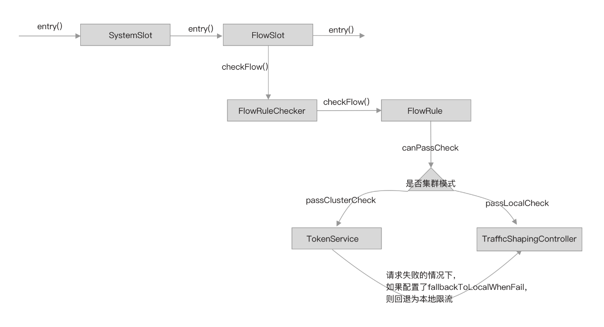 

如图所示，当规则配置为集群限流模式时，通过 TokenService 向集群限流服务端发起请求，根据响应结果决定如何控制当前请求

### 集群限流模式

Sentinel 支持两种模式启动集群限流服务端，分别是嵌入模式、独立模式，两种模式都有各种的优缺点。

#### **嵌入模式（Embedded）**

集群限流服务端作为应用的内置服务同应用一起启动，与应用在同一个进程，可动态的挑选其中一个节点作为集群限流服务端，如下图所示

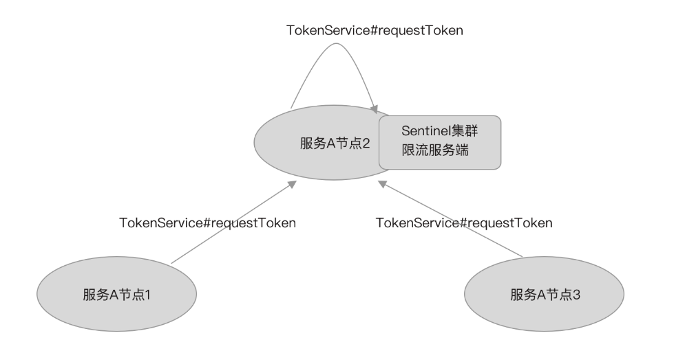 

- 优点：无需单独部署，可动态切换服务端。
- 缺点：将集群限流服务嵌入到应用中，作为限流服务端的节点需要处理集群内的其它限流客户端发来的请求，会影响应用的性能。
- 适用场景：适用于单个微服务实现集群内部限流，例如只对服务 A 内部集群限流提供服务

#### **独立模式（Alone）**

集群限流服务端作为一个独立的应用部署，如下图所示

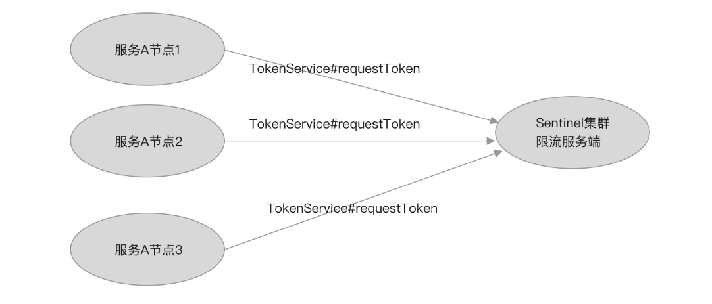 

- 优点：与应用隔离，不影响应用的性能。
- 适用场景：适用于为所有服务实现集群限流提供服务，例如服务 A、服务 B 都需要实现集群限流。

Sentinel 集群限流客户端与集群限流服务端通信只保持一个长连接，底层通信基于 Netty 框架实现，自定义通信协议，并且数据包设计得足够小，网络 I/O 性能方面降到最低影响。而限流服务端处理一次请求都是访问内存，并且计算量少，响应时间短，对限流客户端性能的影响不大，可以参考 Redis 一次 hget 对应用性能的影响。

Sentinel 集群限流对限流服务端的可用性要求不高，当限流服务端挂掉时，可回退为本地限流；嵌入模式并未实现类似于主从自动切换的功能，当服务端挂掉时，客户端并不能自动切换为服务端。所以选择哪种限流服务端启动模式更多的是考虑使用嵌入模式是否会严重影响应用的性能，以及应用是否有必要严重依赖集群限流。

如果服务是部署在 Kubernetes 集群上，使用嵌入模式就可能需要频繁的调整配置，以选择一个节点为集群限流服务端，并且需要调整其它客户端的连接配置，才能让其它客户端连接上服务端。试想一下，当半夜某个节点挂了，而该节点正好是作为集群限流的服务端，Kubernetes 新起的 POD 变成集群限流客户端，此时，所有集群限流客户端都连接不上服务端，也只能退回本地限流。嵌入模式在 Kubernetes 集群上其弊端可谓表现得淋漓尽致

### 限流规则

集群限流规则也是 FlowRule，当 FlowRule 的 clusterMode 配置为 true 时，表示这个规则是一个集群限流规则。

如果将一个限流规则配置为集群限流规则，那么 FlowRule 的 clusterConfig 就必须要配置，该字段的类型为 ClusterFlowConfig。

ClusterFlowConfig 可配置的字段如下源码所示。

```java
public class ClusterFlowConfig {
    private Long flowId;
    private int thresholdType = ClusterRuleConstant.FLOW_THRESHOLD_AVG_LOCAL;
    private boolean fallbackToLocalWhenFail = true;
    // 当前版本未使用
    private int strategy = ClusterRuleConstant.FLOW_CLUSTER_STRATEGY_NORMAL;
    private int sampleCount = ClusterRuleConstant.DEFAULT_CLUSTER_SAMPLE_COUNT;
    private int windowIntervalMs = RuleConstant.DEFAULT_WINDOW_INTERVAL_MS;
}
```

- flowId：集群限流规则的全局唯一 ID。
- thresholdType：集群限流阈值类型。
- fallbackToLocalWhenFail：失败时是否回退为本地限流模式，默认为 true。
- sampleCount：滑动窗口（LeapArray）构造方法的参数之一，指定 WindowWrap 的数组大小。
- windowIntervalMs：滑动窗口（LeapArray）构造方法的参数之一，指定整个滑动窗口的周期；windowIntervalMs 除以 sampleCount 等于每个 WindowWrap 的窗口时间。

当限流规则配置为集群模式时，限流规则的阈值类型（grade）将弃用，而是使用集群限流配置（ClusterFlowConfig）的阈值类型（thresholdType），支持单机均摊和集群总阈值两种集群限流阈值类型：

- 单机均摊阈值类型：根据当前连接到集群限流服务端的客户端节点数乘以规则配置的 count 作为集群的 QPS 限流阈值。
- 集群总阈值类型：将规则配置的 count 作为整个集群的 QPS 限流阈值

#### 动态配置规则数据源

集群限流规则需要在集群限流客户端配置一份，同时集群限流服务端也需要配置一份，缺一不可。客户端需要取得集群限流规则才会走集群限流模式，而服务端需要取得同样的限流规则，才能正确的回应客户端。为了统一规则配置，我们应当选择动态配置，让集群限流客户端和集群限流服务端去同一数据源取同一份数据。

Sentinel 支持使用名称空间（namespace）区分不同应用之间的集群限流规则配置，如服务 A 的集群限流规则配置和服务 B 的集群限流规则配置使用名称空间隔离。

前面我们分析了 Sentinel 动态数据源的实现原理，并且也基于 Spring Cloud 提供的动态配置功能完成一个动态数据源。为了便于理解，也为了便于测试，我们选择自己实现一个简单的动态数据源（SimpleLocalDataSource），实现根据名称空间加载集群限流规则。

SimpleLocalDataSource 继承 AbstractDataSource，同时构造方法要求传入名称空间，用于指定一个动态数据源对象只负载加载指定名称空间的集群限流规则。SimpleLocalDataSource 实现代码如下所示。

```java
public class SimpleLocalDataSource
        extends AbstractDataSource<String, List<FlowRule>> 
        implements Runnable{

    public SimpleLocalDataSource(String namespace) {
        super(new SimpleConverter<String, List<FlowRule>>() {});
        // 模拟 Spring 容器刷新完成初始化加载一次限流规则
        new Thread(this).start();
    }

    @Override
    public String readSource() throws Exception {
        // 获取动态配置，
        return "";
    }

    @Override
    public void close() throws Exception {
    }

    @Override
    public void run() {
        try {
            // 休眠 6 秒
            Thread.sleep(6000);
            getProperty().updateValue(loadConfig());
        } catch (Exception e) {
            e.printStackTrace();
        }
    }
}
```

SimpleLocalDataSource 构造方法中启动一个线程，用于实现等待动态数据源对象注册到 ClusterFlowRuleManager 之后再模拟加载一次规则。由于是测试，所以 readSource 方法并未实现，我们直接在 SimpleConverter 这个转换器中虚构一个集群限流规则，代码如下。

```java
public class SimpleConverter extends Converter<String, List<FlowRule>>() {
    @Override
    public List<FlowRule> convert(String source) {
          List<FlowRule> flowRules = new ArrayList<>();
          FlowRule flowRule = new FlowRule();
          flowRule.setCount(200);
          flowRule.setResource("GET:/hello");
          // 集群限流配置
          flowRule.setClusterMode(true);
          ClusterFlowConfig clusterFlowConfig = new ClusterFlowConfig();
          clusterFlowConfig.setFlowId(10000L); // id 确保全局唯一
          flowRule.setClusterConfig(clusterFlowConfig);
          flowRules.add(flowRule);
          return flowRules;
    }
}
```

接下来，我们将使用这个动态数据源实现集群限流客户端和服务端的配置。

#### 客户端配置

在需要使用集群限流功能的微服务项目中添加 sentinel-cluster-client-default 的依赖。

```xml
<dependency>
    <groupId>com.alibaba.csp</groupId>
    <artifactId>sentinel-cluster-client-default</artifactId>
    <version>${version}</version>
</dependency>
```

将身份设置为集群限流客户端（CLUSTER_CLIENT），并且注册客户端配置（ClusterClientConfig），代码如下。

```java
@SpringBootApplication
public class WebMvcDemoApplication {
    static {
            // 指定当前身份为 Token Client
            ClusterStateManager.applyState(ClusterStateManager.CLUSTER_CLIENT);
      // 集群限流客户端配置，ClusterClientConfig 目前只支持配置请求超时
      ClusterClientConfig clientConfig = new ClusterClientConfig();
      clientConfig.setRequestTimeout(1000);
      ClusterClientConfigManager.applyNewConfig(clientConfig);
    }
}
```

在 Spring 项目中，可通过监听 ContextRefreshedEvent 事件，在 Spring 容器启动完成后再初始化创建动态数据源、为 FlowRuleManager 注册动态数据源的 SentinelProperty，代码如下。

```java
@SpringBootApplication
public class WebMvcDemoApplication implements ApplicationListener<ContextRefreshedEvent> {
    @Override
    public void onApplicationEvent(ContextRefreshedEvent contextRefreshedEvent) {
      // 指定名称空间为 serviceA，只加载这个名称空间下的限流规则
      SimpleLocalDataSource ruleSource = new SimpleLocalDataSource("serviceA");
      FlowRuleManager.register2Property(ruleSource.getProperty());
    }
}
```

最后注册用于连接到集群限流服务端的配置（ClusterClientAssignConfig），指定集群限流服务端的 IP 和端口，代码如下。

```java
@SpringBootApplication
public class WebMvcDemoApplication {
    static {
            ClusterClientAssignConfig assignConfig = new ClusterClientAssignConfig();
      assignConfig.setServerHost("127.0.0.1");
      assignConfig.setServerPort(11111);
      // 先指定名称空间为 serviceA
      ConfigSupplierRegistry.setNamespaceSupplier(()->"serviceA"); 
      ClusterClientConfigManager.applyNewAssignConfig(assignConfig);
    }
}
```

当 ClusterClientConfigManager#applyNewAssignConfig 方法被调用时，会触发 Sentinel 初始化或重新连接到集群限流服务端，所以我们看不到启动集群限流客户端的代码。Sentinel 还支持当客户端与服务端意外断开连接时，让客户端不断的重试重连。

注意看，我们在调用 ClusterClientConfigManager#applyNewAssignConfig 方法之前，先调用了 ConfigSupplierRegistry#setNamespaceSupplier 方法注册名称空间，这是非常重要的一步。当客户端连接上服务端时，会立即发送一个 PING 类型的消息给服务端，Sentinel 将名称空间携带在 PING 数据包上传递给服务端，服务端以此获得每个客户端连接的名称空间。

完成以上步骤，集群限流客户端就已经配置完成，但这些步骤都只是完成集群限流客户端的配置，如果集群限流服务端使用嵌入模式启动，那么还需要在同一个项目中添加集群限流服务端的配置

#### 服务端配置

如果使用嵌入模式，则可直接在微服务项目中添加 sentinel-cluster-server-default 的依赖；如果是独立模式，则单独创建一个项目，在独立项目中添加 sentinel-cluster-server-default 的依赖。

```xml
<dependency>
    <groupId>com.alibaba.csp</groupId>
    <artifactId>sentinel-cluster-server-default</artifactId>
    <version>${version}</version>
</dependency>
```

在独立模式下，需要我们自己手动创建 ClusterTokenServer 并启动，在启动之前需指定服务监听的端口和连接最大空闲等待时间等配置，代码如下。

```java
public class ClusterServerDemo {

    public static void main(String[] args) throws Exception {
        ClusterTokenServer tokenServer = new SentinelDefaultTokenServer();
        // 配置短裤和连接最大空闲时间
        ClusterServerConfigManager.loadGlobalTransportConfig(new ServerTransportConfig()
            .setIdleSeconds(600)
            .setPort(11111));
        // 启动服务
        tokenServer.start();
    }
}
```

接着我们需要为服务端创建用于加载集群限流规则的动态数据源，在创建动态数据源时，需指定数据源只加载哪个名称空间下的限流规则配置，如下代码所示。

```java
ClusterFlowRuleManager.setPropertySupplier(new Function<String, SentinelProperty<List<FlowRule>>>() {
      // ClusterFlowRuleManager 会给 apply 方法返回的 SentinelProperty 注册监听器
      @Override
      public SentinelProperty<List<FlowRule>> apply(String namespace) {
            // 创建动态数据源
            SimpleLocalDataSource source = new SimpleLocalDataSource(namespace);
            // 返回数据源的 SentinelProperty
            return source.getProperty();
      }
});
```

从代码中可以看出，我们注册的是一个 Java8 的 Function，这个 Function 的 apply 方法将在我们注册名称空间时触发调用。

现在，我们为集群限流服务端注册名称空间，以触发动态数据源的创建，从而使 ClusterFlowRuleManager 拿到动态数据源的 SentinelProperty，将规则缓存更新监听器注册到动态数据源的 SentinelProperty 上。注册名称空间代码如下。

```java
// 多个应用应该对应多个名称空间，应用之间通过名称空间互相隔离
ClusterServerConfigManager.loadServerNamespaceSet(Collections.singleton("serviceA"));
```

名称空间可以有多个，如果存在多个名称空间，则会多次调用 ClusterFlowRuleManager#setPropertySupplier 注册的 Function 对象的 apply 方法创建多个动态数据源。多个应用应该对应多个名称空间，应用之间通过名称空间互相隔离。

由于我们在 SimpleLocalDataSource 的构造方法中创建一个线程并延迟执行，当以上步骤完成后，也就是 SimpleLocalDataSource 的延时任务执行时，SimpleLocalDataSource 会加载一次限流规则，并调用 SentinelProperty#updateValue 方法通知 ClusterFlowRuleManager 更新限流规则缓存。

在实现项目中，我们自定义的动态数据源可通过定时拉取方式从配置中心拉取规则，也可以结合 Spring Cloud 动态配置使用，通过监听动态配置改变事件，获取最新的规则配置，而规则的初始化加载，可通过监听 Spring 容器刷新完成事件实现。

#### 动态修改

如果是嵌入模式启动，除非一开始我们就清楚的知道应用会部署多少个节点，这些节点的 IP 是什么，并且不会改变，否则我们无法使用静态配置的方式去指定某个节点的角色。Sentinel 为此提供了支持动态改变某个节点角色的 API，使用方式如下：

```java
http://<节点 ip>:<节点 port>/setClusterMode?mode={state}
```

其中 `{state}` 为 0 代表集群限流客户端，为 1 代表集群限流服务端。当一个新的节点被选为集群限流服务端后，旧的集群限流服务端节点也应该变为集群限流客户端，并且其它的节点都需要作出改变以连接到这个新的集群限流服务端。

Sentinel 提供动态修改 ClusterClientAssignConfig、ClusterClientConfig 的 API，使用方式如下：

```java
http://<节点 ip>:<节点 port>/cluster/client/modifyConfig?data={body}
```

其中 `{body}` 要求是 JSON 格式的字符串，支持的参数配置如下：

- serverHost：集群限流服务端的 IP 地址
- serverPort：集群限流服务端的端口
- requestTimeout：请求的超时时间

除使用 API 可动态修改节点角色、客户端连接到服务端的配置之外，Sentinel 还支持通过动态配置方式修改，但无论使用哪种方式修改都有一个弊端：需要人工手动配置。

虽然未能实现自动切换，但不得不称赞的是，Sentinel 将动态数据源与 SentinelProperty 结合使用，通过 SentinelProperty 实现的观察者模式，提供更为灵活的嵌入模式集群限流角色转换功能，支持以动态修改配置的方式去重置嵌入模式集群中任一节点的集群限流角色。

ClusterClientAssignConfig（客户端连接服务端配置）、ServerTransportConfig（服务端传输层配置：监听端口、连接最大空闲时间）、ClusterClientConfig（客户端配置：请求超时）、ClusterState（节点状态：集群限流客户端、集群限流服务端）都支持使用动态数据源方式配置。

- 当动态改变 ClusterClientAssignConfig 时，Sentinel 重新创建客户端与服务端的连接；
- 当动态改变 ServerTransportConfig 时，Sentinel 重启集群限流服务端；
- 对于嵌入模式，当动态改变 ClusterState 时，如果改变前与改变后的状态不同，例如从集群限流客户端角色变为集群限流服务端角色，则关闭客户端与服务端的连接，并且启动服务监听客户端连接，而其它的节点也会监听到动态配置改变，重新连接到这个新的集群限流服务端。

### 集群限流源码分析

集群限流，我们可以结合令牌桶算法去思考，服务端负责生产令牌，客户端向服务端申请令牌，客户端只有申请到令牌时才能将请求放行，否则拒绝请求。

集群限流也支持热点参数限流，而实现原理大致相同

#### 核心类介绍

sentinel-core 模块的 cluster 包下定义了实现集群限流功能的相关接口：

- TokenService：定义客户端向服务端申请 token 的接口，由 FlowRuleChecker 调用。
- ClusterTokenClient：集群限流客户端需要实现的接口，继承 TokenService。
- ClusterTokenServer：集群限流服务端需要实现的接口。
- EmbeddedClusterTokenServer：支持嵌入模式的集群限流服务端需要实现的接口，继承 TokenService、ClusterTokenServer。

TokenService 接口的定义如下：

```java
public interface TokenService {
    TokenResult requestToken(Long ruleId, int acquireCount, boolean prioritized);
    TokenResult requestParamToken(Long ruleId, int acquireCount, Collection<Object> params);
}
```

- requestToken：向 server 申请令牌，参数 1 为集群限流规则 ID，参数 2 为申请的令牌数，参数 3 为请求优先级。
- requestParamToken：用于支持热点参数集群限流，向 server 申请令牌，参数 1 为集群限流规则 ID，参数 2 为申请的令牌数，参数 3 为限流参数。

TokenResult 实体类的定义如下：

```java
public class TokenResult {
    private Integer status;
    private int remaining;
    private int waitInMs;
    private Map<String, String> attachments;
}
```

- status：请求的响应状态码。
- remaining：当前时间窗口剩余的令牌数。
- waitInMs：休眠等待时间，单位毫秒，用于告诉客户端，当前请求可以放行，但需要先休眠指定时间后才能放行。
- attachments：附带的属性，暂未使用。

ClusterTokenClient 接口定义如下：

```java
public interface ClusterTokenClient extends TokenService {
    void start() throws Exception;
    void stop() throws Exception;
}
```

ClusterTokenClient 接口定义启动和停止集群限流客户端的方法，负责维护客户端与服务端的连接。该接口还继承了 TokenService，要求实现类必须要实现 requestToken、requestParamToken 方法，向远程服务端请求获取令牌。

ClusterTokenServer 接口定义如下：

```java
public interface ClusterTokenServer {
    void start() throws Exception;
    void stop() throws Exception;
}
```

ClusterTokenServer 接口定义启动和停止集群限流客户端的方法，启动能够接收和响应客户端请求的网络通信服务端，根据接收的消费类型处理客户端的请求。

EmbeddedClusterTokenServer 接口的定义如下：

```java
public interface EmbeddedClusterTokenServer 
                 extends ClusterTokenServer, TokenService {
}
```

EmbeddedClusterTokenServer 接口继承 ClusterTokenServer，并继承 TokenService 接口，即整合客户端和服务端的功能，为嵌入式模式提供支持。在嵌入式模式下，如果当前节点是集群限流服务端，那就没有必要发起网络请求。

这些接口以及默认实现类的关系如下图所示

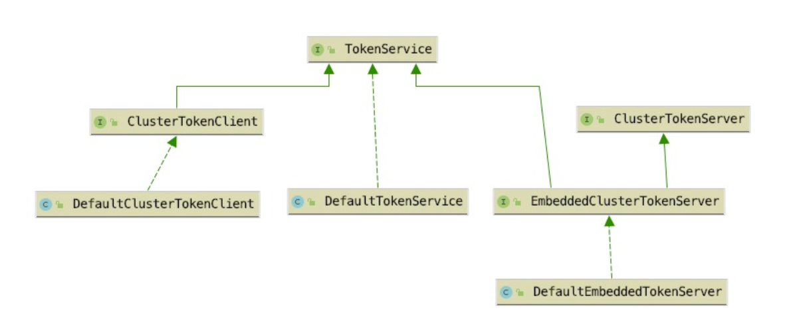 

其中 DefaultClusterTokenClient 是 sentinel-cluster-client-default 模块中的 ClusterTokenClient 接口实现类，DefaultTokenService 与 DefaultEmbeddedTokenServer 分别是 sentinel-cluster-server-default 模块中的 ClusterTokenServer 接口与 EmbeddedClusterTokenServer 接口的实现类。

当使用嵌入模式启用集群限流服务端时，使用的是 EmbeddedClusterTokenServer，否则使用 ClusterTokenServer，通过 Java SPI 实现

#### **集群限流客户端**

我们接着单机限流工作流程分析集群限流功能的实现，从 FlowRuleChecker#passClusterCheck 方法开始，该方法源码如下：

```
private static boolean passClusterCheck(FlowRule rule, Context context, DefaultNode node, int acquireCount,boolean prioritized) {
        try {
            // (1)
            TokenService clusterService = pickClusterService();
            if (clusterService == null) {
                return fallbackToLocalOrPass(rule, context, node, acquireCount, prioritized);
            }
            // (2)
            long flowId = rule.getClusterConfig().getFlowId();
            // (3)
            TokenResult result = clusterService.requestToken(flowId, acquireCount, prioritized);
            return applyTokenResult(result, rule, context, node, acquireCount, prioritized);
        } catch (Throwable ex) {
            RecordLog.warn("[FlowRuleChecker] Request cluster token unexpected failed", ex);
        }
         // (4)
        return fallbackToLocalOrPass(rule, context, node, acquireCount, prioritized);
    }
```

整体流程分为：

1. 获取 TokenService；
2. 获取集群限流规则的全局唯一 ID；
3. 调用 TokenService#requestToken 方法申请令牌；
4. 调用 applyTokenResult 方法，根据请求响应结果判断是否需要拒绝当前请求。

pickClusterService 方法实现根据节点当前角色获取 TokenService 实例。如果当前节点是集群限流客户端角色，则获取 ClusterTokenClient 实例，如果当前节点是集群限流服务端角色（嵌入模式），则获取 EmbeddedClusterTokenServer 实例，代码如下

```java
private static TokenService pickClusterService() {
    // 客户端角色
    if (ClusterStateManager.isClient()) {
        return TokenClientProvider.getClient();
    }
    // 服务端角色（嵌入模式）
    if (ClusterStateManager.isServer()) {
        return EmbeddedClusterTokenServerProvider.getServer();
    }
    return null;
}
```

ClusterTokenClient 和 EmbeddedClusterTokenServer 都继承 TokenService，区别在于，ClusterTokenClient 实现类实现 requestToken 方法是向服务端发起请求，而 EmbeddedClusterTokenServer 实现类实现 requestToken 方法不需要发起远程调用，因为自身就是服务端。

在拿到 TokenService 后，调用 TokenService#requestToken 方法请求获取 token。如果当前节点角色是集群限流客户端，那么这一步骤就是将方法参数构造为请求数据包，向集群限流服务端发起请求，并同步等待获取服务端的响应结果。关于网络通信这块，因为不是专栏的重点，所以我们不展开分析。

applyTokenResult 方法源码如下：

```java
private static boolean applyTokenResult(/*@NonNull*/ TokenResult result, FlowRule rule, Context context,
                                                         DefaultNode node,
                                                         int acquireCount, boolean prioritized) {
        switch (result.getStatus()) {
            case TokenResultStatus.OK:
                return true;
            case TokenResultStatus.SHOULD_WAIT:
                try {
                    Thread.sleep(result.getWaitInMs());
                } catch (InterruptedException e) {
                }
                return true;
            case TokenResultStatus.NO_RULE_EXISTS:
            case TokenResultStatus.BAD_REQUEST:
            case TokenResultStatus.FAIL:
            case TokenResultStatus.TOO_MANY_REQUEST:
                return fallbackToLocalOrPass(rule, context, node, acquireCount, prioritized);
            case TokenResultStatus.BLOCKED:
            default:
                return false;
        }
    }
```

applyTokenResult 方法根据响应状态码决定是否拒绝当前请求：

- 当响应状态码为 OK 时放行请求；
- 当响应状态码为 SHOULD_WAIT 时，休眠指定时间再放行请求；
- 当响应状态码为 BLOCKED，直接拒绝请求；
- 其它状态码均代表调用失败，根据规则配置的 fallbackToLocalWhenFail 是否为 true，决定是否回退为本地限流，如果需要回退为本地限流模式，则调用 passLocalCheck 方法重新判断。

在请求异常或者服务端响应异常的情况下，都会走 fallbackToLocalOrPass 方法，该方法源码如下。

```java
private static boolean fallbackToLocalOrPass(FlowRule rule, Context context, DefaultNode node, int acquireCount, boolean prioritized) {
        if (rule.getClusterConfig().isFallbackToLocalWhenFail()) {
            return passLocalCheck(rule, context, node, acquireCount, prioritized);
        } else {
            // The rule won't be activated, just pass.
            return true;
        }
}
```

fallbackToLocalOrPass 方法根据规则配置的 fallbackToLocalWhenFail 决定是否回退为本地限流，如果 fallbackToLocalWhenFail 配置为 false，将会导致客户端在与服务端失联的情况下拒绝所有流量。fallbackToLocalWhenFail 默认值为 true，建议不要修改为 false，我们应当确保服务的可用性，再确保集群限流的准确性。

由于网络延迟的存在，Sentinel 集群限流并未实现匀速排队流量效果控制，也没有支持冷启动，而只支持直接拒绝请求的流控效果。响应状态码 SHOULD_WAIT 并非用于实现匀速限流，而是用于实现具有优先级的请求在达到限流阈值的情况下，可试着占据下一个时间窗口的 pass 指标，如果抢占成功，则告诉限流客户端，当前请求需要休眠等待下个时间窗口的到来才可以通过。Sentinel 使用提前申请在未来时间通过的方式实现优先级语意。

#### **集群限流服务端**

在集群限流服务端接收到客户端发来的 requestToken 请求时，或者嵌入模式自己向自己发起请求，最终都会交给 DefaultTokenService 处理。DefaultTokenService 实现的 requestToken 方法源码如下。

```java
    @Override
    public TokenResult requestToken(Long ruleId, int acquireCount, boolean prioritized) {
        // 验证规则是否存在
        if (notValidRequest(ruleId, acquireCount)) {
            return badRequest();
        }
        // （1）
        FlowRule rule = ClusterFlowRuleManager.getFlowRuleById(ruleId);
        if (rule == null) {
            return new TokenResult(TokenResultStatus.NO_RULE_EXISTS);
        }
        // （2）
        return ClusterFlowChecker.acquireClusterToken(rule, acquireCount, prioritized);
    }
```

- 根据限流规则 ID 获取到限流规则，这也是要求集群限流规则的 ID 全局唯一的原因，Sentinel 只使用一个 ID 字段向服务端传递限流规则，减小了数据包的大小，从而优化网络通信的性能；
- 调用 ClusterFlowChecker#acquireClusterToken 方法判断是否拒绝请求。

由于 ClusterFlowChecker#acquireClusterToken 方法源码太多，我们将 acquireClusterToken 拆分为四个部分分析。

第一个部分代码如下：

```java
static TokenResult acquireClusterToken(FlowRule rule, int acquireCount, boolean prioritized) {
        Long id = rule.getClusterConfig().getFlowId();
        // （1）
        if (!allowProceed(id)) {
            return new TokenResult(TokenResultStatus.TOO_MANY_REQUEST);
        }
        // （2）
        ClusterMetric metric = ClusterMetricStatistics.getMetric(id);
        if (metric == null) {
            return new TokenResult(TokenResultStatus.FAIL);
        }
        // （3）
        double latestQps = metric.getAvg(ClusterFlowEvent.PASS);
        double globalThreshold = calcGlobalThreshold(rule) * ClusterServerConfigManager.getExceedCount();
        double nextRemaining = globalThreshold - latestQps - acquireCount;
        if (nextRemaining >= 0) {
            // 第二部分代码
        } else {
            if (prioritized) {
                // 第三部分代码
            }
            // 第四部分代码
        }
    }
```

全局 QPS 阈值限流，按名称空间统计 QPS，如果需要使用按名称空间 QPS 限流，则可通过如下方式配置阈值。

```java
  ServerFlowConfig serverFlowConfig = new ServerFlowConfig();
  serverFlowConfig.setMaxAllowedQps(1000);
  ClusterServerConfigManager.loadFlowConfig("serviceA",serverFlowConfig);
```

- 获取规则的指标数据统计滑动窗口，如果不存在则响应 FAIL 状态码；
- 计算每秒平均被放行请求数、集群限流阈值、剩余可用令牌数量。

计算集群限流阈值需根据规则配置的阈值类型计算，calcGlobalThreshold 方法的源码如下。

```java
private static double calcGlobalThreshold(FlowRule rule) {
        double count = rule.getCount();
        switch (rule.getClusterConfig().getThresholdType()) {
            case ClusterRuleConstant.FLOW_THRESHOLD_GLOBAL:
                return count;
            case ClusterRuleConstant.FLOW_THRESHOLD_AVG_LOCAL:
            default:
                int connectedCount = ClusterFlowRuleManager.getConnectedCount(rule.getClusterConfig().getFlowId());
                return count * connectedCount;
        }
}
```

- 当阈值类型为集群总 QPS 时，直接使用限流规则的阈值（count）；
- 当阈值类型为单机均摊时，根据规则 ID 获取当前连接的客户端总数，将当前连接的客户端总数乘以限流规则的阈值（count）作为集群总 QPS 阈值。

这正是客户端在连接上服务端时，发送 PING 类型消费给服务端，并将名称空间携带在 PING 数据包上传递给服务端的原因。在限流规则的阈值为单机均摊阈值类型时，需要知道哪些连接是与限流规则所属名称空间相同，如果客户端不传递名称空间给服务端，那么，在单机均摊阈值类型情况下，计算出来的集群总 QPS 限流阈值将为 0，导致所有请求都会被限流。这是我们在使用集群限流功能时特别需要注意的。

集群限流阈值根据规则配置的阈值、阈值类型计算得到，每秒平均被放行请求数可从滑动窗口取得，而剩余可用令牌数（nextRemaining）等于集群 QPS 阈值减去当前时间窗口已经放行的请求数，再减去当前请求预占用的 acquireCount。

第二部分代码如下 ：

```java
metric.add(ClusterFlowEvent.PASS, acquireCount);
metric.add(ClusterFlowEvent.PASS_REQUEST, 1);
if (prioritized) {
      metric.add(ClusterFlowEvent.OCCUPIED_PASS, acquireCount);
}
return new TokenResult(TokenResultStatus.OK).setRemaining((int) nextRemaining).setWaitInMs(0);
```

当 nextRemaining 计算结果大于等于 0 时，执行这部分代码，先记录当前请求被放行，而后响应状态码 OK 给客户端。

第三部分代码如下：

```java
double occupyAvg = metric.getAvg(ClusterFlowEvent.WAITING);
if (occupyAvg <= ClusterServerConfigManager.getMaxOccupyRatio() * globalThreshold) {
    int waitInMs = metric.tryOccupyNext(ClusterFlowEvent.PASS, acquireCount, globalThreshold);
    if (waitInMs > 0) {
         return new TokenResult(TokenResultStatus.SHOULD_WAIT)
                  .setRemaining(0).setWaitInMs(waitInMs);
    }
}
```

当 nextRemaining 计算结果小于 0 时，如果当前请求具有优先级，则执行这部分逻辑。计算是否可占用下个时间窗口的 pass 指标，如果允许，则告诉客户端，当前请求可放行，但需要等待 waitInMs（一个窗口时间大小）毫秒之后才可放行。

如果请求可占用下一个时间窗口的 pass 指标，那么下一个时间窗口的 pass 指标也需要加上这些提前占用的请求总数，将会影响下一个时间窗口可通过的请求总数。

第四部分代码如下：

```java
metric.add(ClusterFlowEvent.BLOCK, acquireCount);
metric.add(ClusterFlowEvent.BLOCK_REQUEST, 1);
if (prioritized) {
     metric.add(ClusterFlowEvent.OCCUPIED_BLOCK, acquireCount);
}
return blockedResult();
```

当 nextRemaining 大于 0，且无优先级权限时，直接拒绝请求，记录当前请求被 Block

### 集群限流的指标数据统计

集群限流使用的滑动窗口并非 sentinel-core 模块下实现的滑动窗口，而是 sentinel-cluster-server-default 模块自己实现的滑动窗口。

ClusterFlowConfig 的 sampleCount 与 windowIntervalMs 这两个配置项正是用于为集群限流规则创建统计指标数据的滑动窗口，在加载集群限流规则时创建。如下源码所示。

```java
 private static void applyClusterFlowRule(List<FlowRule> list, /*@Valid*/ String namespace) {
         ......
        for (FlowRule rule : list) {
            if (!rule.isClusterMode()) {
                continue;
            }
            ........
            ClusterFlowConfig clusterConfig = rule.getClusterConfig();
            .......
            // 如果不存在，则为规则创建 ClusterMetric，用于统计指标数据
            ClusterMetricStatistics.putMetricIfAbsent(flowId,
                new ClusterMetric(clusterConfig.getSampleCount(), 
                                  clusterConfig.getWindowIntervalMs()));
        }
        // 移除不再使用的 ClusterMetric
        clearAndResetRulesConditional(namespace, new Predicate<Long>() {
            @Override
            public boolean test(Long flowId) {
                return !ruleMap.containsKey(flowId);
            }
        });
        FLOW_RULES.putAll(ruleMap);
        NAMESPACE_FLOW_ID_MAP.put(namespace, flowIdSet);
    }
```

实现集群限流需要收集的指标数据有以下几种：

```java
public enum ClusterFlowEvent {
    PASS,
    BLOCK,
    PASS_REQUEST,
    BLOCK_REQUEST,
    OCCUPIED_PASS,
    OCCUPIED_BLOCK,
    WAITING
}
```

- PASS：已经发放的令牌总数
- BLOCK：令牌申请被驳回的总数
- PASS_REQUEST：被放行的请求总数
- BLOCK_REQUEST：被拒绝的请求总数
- OCCUPIED_PASS：预占用，已经发放的令牌总数
- OCCUPIED_BLOCK：预占用，令牌申请被驳回的总数
- WAITING：当前等待下一个时间窗口到来的请求总数

除统计的指标项与 sentinel-core 包下实现的滑动窗口统计的指标项有些区别外，实现方式都一致。

### 总结

集群限流服务端允许嵌入应用服务启动，也可作为独立应用启动。嵌入模式适用于单个微服务应用的集群内部实现集群限流，独立模式适用于多个微服务应用共享同一个集群限流服务端场景，独立模式不会影响应用性能，而嵌入模式对应用性能会有所影响。

集群限流客户端需指定名称空间，默认会使用 main 方法所在类的全类名作为名称空间。在客户端连接到服务端时，客户端会立即向服务端发送一条 PING 消息，并在 PING 消息携带名称空间给服务端。

集群限流规则的阈值类型支持单机均摊和集群总 QPS 两种类型，如果是单机均摊阈值类型，集群限流服务端需根据限流规则的名称空间，获取该名称空间当前所有的客户端连接，将连接总数乘以规则配置的阈值作为集群的总 QPS 阈值。

集群限流支持按名称空间全局限流，无视规则，只要是同一名称空间的客户端发来的 requestToken 请求，都先按名称空间阈值过滤。但并没有特别实用的场景，因此官方文档也并未介绍此特性。

建议按应用区分名称空间，而不是整个项目的所有微服务项目都使用同一个名称空间，因为在规则阈值类型为单机均摊阈值类型的情况下，获取与规则所属名称空间相同的客户端连接数作为客户端总数，如果不是同一个应用，就会导致获取到的客户端总数是整个项目所有微服务应用集群的客户端总数，限流就会出问题。

集群限流并非解决请求倾斜问题，在请求倾斜严重的情况下，集群限流可能会导致某些节点的流量过高，导致系统的负载过高，这时就需要使用系统自适应限流、熔断降级作为兜底解决方案。

## 主流框架适配sentinel

使用 Sentinel 需要用 try-catch-finally 将需要保护的资源（方法或者代码块）包装起来，在目标方法或者代码块执行之前，调用 ContextUtil#enter 方法以及 SphU#entry 方法，在抛出异常时，如果非 BlockException 异常需要调用 Tracer#trace 记录异常，修改异常指标数据，在 finally 中需要调用 Entry#exit 方法，以及 ContextUtil#exit 方法。

为了节省这些步骤，Sentinel 提供了对主流框架的适配，如适配 Spring MVC、Webflux、Dubbo、Api Gateway 等框架。当然，对于 Sentinel 未适配的框架，我们也可以自己实现适配器。在 Sentinel 源码之外，alibaba 的 spring-cloud-starter-alibaba-sentinel 也为 Sentinel 提供与 OpenFeign 框架整合的支持。

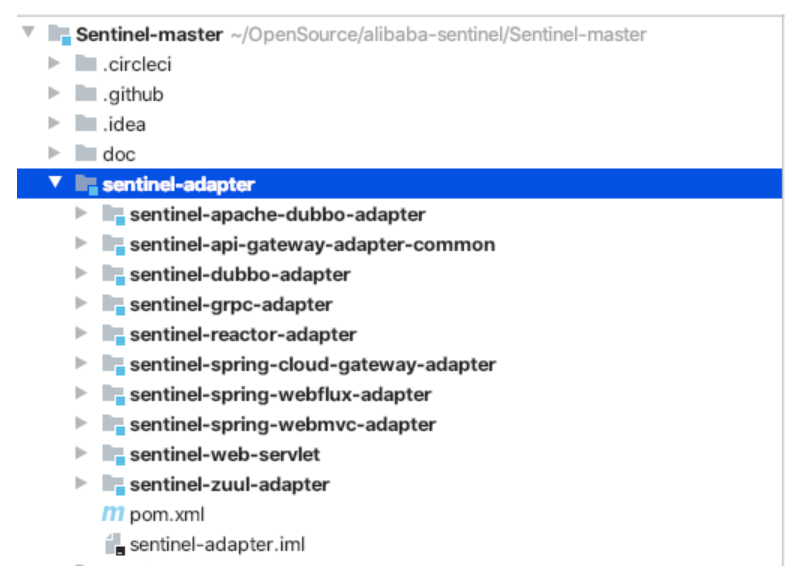 

### Spring MVC 适配器

Sentinel 借助 Spring MVC 框架的 HandlerInterceptor 适配 Spring MVC，但也需要我们借助 WebMvcConfigurer 将 SentinelWebInterceptor 注册到 Spring MVC 框架。

#### **使用步骤**

第一步：在项目中添加 Spring MVC 适配模块的依赖。

```xml
<dependency>
    <groupId>com.alibaba.csp</groupId>
    <artifactId>sentinel-spring-webmvc-adapter</artifactId>
    <version>${version}</version>
</dependency>
```

第二步：编写 WebMvcConfigurer，在 addInterceptors 方法中注入 SentinelWebInterceptor。

```java
@Configuration
public class InterceptorConfig implements WebMvcConfigurer {
    @Override
    public void addInterceptors(InterceptorRegistry registry) {
        SentinelWebMvcConfig config = new SentinelWebMvcConfig();
        config.setBlockExceptionHandler(new DefaultBlockExceptionHandler());
        config.setHttpMethodSpecify(true);
        config.setOriginParser(request -> request.getHeader("S-user"));
        // SentinelWebInterceptor 拦截所有接口（"/**"）
        registry.addInterceptor(new SentinelWebInterceptor(config)).addPathPatterns("/**");
    }
}
```

在创建 SentinelWebInterceptor 时，可为 SentinelWebInterceptor 添加配置，使用 SentinelWebMvcConfig 封装这些配置：

- setBlockExceptionHandler：配置 BlockException 异常处理器，如果不想配置 BlockException 异常处理器，也可在 Spring MVC 的全局异常处理器中处理 BlockException 异常。
- setOriginParser：注册调用来源（origin）解析器，例如从请求头中获取“S-user”参数的值作为调用来源名称，上游服务在发起请求时就可在请求头写入“S-user”参数告知自己的身份。
- setHttpMethodSpecify：是否需要给资源名称加上 HttpMethod 前缀，例如 GET 接口“/hello”，如果 httpMethodSpecify 配置为 false，则资源名称为“/hello”，否则资源名称为“GET:/hell”。

#### **适配原理**

Spring MVC 框架的方法拦截器（HandlerInterceptor）的定义如下：

```java
public interface HandlerInterceptor {
    default boolean preHandle(HttpServletRequest request, HttpServletResponse response, Object handler) throws Exception {
        return true;
    }
    default void postHandle(HttpServletRequest request, HttpServletResponse response, Object handler, @Nullable ModelAndView modelAndView) throws Exception {
    }
    default void afterCompletion(HttpServletRequest request, HttpServletResponse response, Object handler, @Nullable Exception ex) throws Exception {
    }
}
```

HandlerInterceptor 在 DispatcherServlet#doDispatch 方法中被调用，每个方法的调用时机如下：

- preHandle：在调用接口方法之前调用
- postHandle：在接口方法执行完成返回 ModelAndView 时被调用；
- afterCompletion：在接口方法执行完成时被调用，无论成功或异常都会被调用；

因此，Sentinel 可借助 HandlerInterceptor 与 Spring MVC 框架整合，在 HandlerInterceptor#preHandle 方法中调用 ContextUtil#enter 方法以及 SphU#entry 方法，在 afterCompletion 方法中根据方法参数 ex 是否为空处理异常情况，并且完成 Entry#exit 方法、ContextUtil#exit 方法的调用。

SentinelWebInterceptor 是 AbstractSentinelInterceptor 的子类，preHandle 与 afterCompletion 方法在父类中实现，自身只实现父类定义的一个获取资源名称的抽象方法，其源码如下：

```java
    @Override
    protected String getResourceName(HttpServletRequest request) {
        // （1）
        Object resourceNameObject = request.getAttribute(HandlerMapping.BEST_MATCHING_PATTERN_ATTRIBUTE);
        if (resourceNameObject == null || !(resourceNameObject instanceof String)) {
            return null;
        }
        String resourceName = (String) resourceNameObject;
        // （2）
        UrlCleaner urlCleaner = config.getUrlCleaner();
        if (urlCleaner != null) {
            resourceName = urlCleaner.clean(resourceName);
        }
        // （3）
        if (StringUtil.isNotEmpty(resourceName) && config.isHttpMethodSpecify()) {
            resourceName = request.getMethod().toUpperCase() + ":" + resourceName;
        }
        return resourceName;
    }
```

资源名称生成过程如下。

* 从 HttpServletRequest 的属性中获取 HandlerMapping 匹配的 URL。

  因为有些接口是这样的：“/hello/{name}”，如果直接从 HttpServletRequest 获取请求路径，那么每个请求获取到的 URL 就可能会不同。

* 如果 UrlCleaner 不为空，则调用 UrlCleaner 的 clean 方法。

  UrlCleaner 用于实现将多个接口合并为一个，例如接口：“/user/create”、“/user/del”、“/user/update”，借助 UrlCleaner 修改资源名称将这几个接口都改为“/user/**”即可实现三个接口使用同一个限流规则。

* 根据 SentinelWebMvcConfig 配置对象判断是否需要添加 HttpMethod 前缀，如果需要则给资源名称拼接前缀。

  一般来说，不建议使用，因为如果接口使用 @RequestMapping 声明，那么想对该接口限流就需要配置多个限流规则，而一般旧项目多是使用 @RequestMapping 声明接口方法。例如接口“/user/create”，你可能需要针对“GET:/user/create”、“POST:/user/create”等多个资源配置限流规则。

由于 AbstractSentinelInterceptor 的源码较多，我们分几个步骤分析。

AbstractSentinelInterceptor#preHandle 方法源码如下：

```java
    @Override
    public boolean preHandle(HttpServletRequest request, HttpServletResponse response, Object handler)
        throws Exception {
        try {
            //（1）
            String resourceName = getResourceName(request);
            if (StringUtil.isNotEmpty(resourceName)) {
                //（2）
                String origin = parseOrigin(request);
                //（3）
                ContextUtil.enter(SENTINEL_SPRING_WEB_CONTEXT_NAME, origin);
                //（4）
                Entry entry = SphU.entry(resourceName, ResourceTypeConstants.COMMON_WEB, EntryType.IN);
                //（5）
                setEntryInRequest(request, baseWebMvcConfig.getRequestAttributeName(), entry);
            }
            return true;
        } catch (BlockException e) {
            // （6）
            handleBlockException(request, response, e);
            return false;
        }
    }
```

1. 获取资源名称；
2. 调用 OriginParser#parseOrigin 方法解析调用来源，例如从请求头获取”S-user”参数的值；
3. 调用 ContextUtil#enter 方法，Context 名称为“sentinel_spring_web_context”；
4. 调用 SphU#entry 方法，资源类型为 COMMON_WEB，流量类型为 IN；
5. 将 SphU#entry 方法返回的 Entry 放入 HttpServletRequest 的属性表中，方便在 afterCompletion 中取出；
6. 如果抛出 BlockException 异常，说明当前请求被拒绝，需调用 handleBlockException 方法处理 BlockException 异常。

AbstractSentinelInterceptor#handleBlockException 方法源码如下：

```java
protected void handleBlockException(HttpServletRequest request, HttpServletResponse response, BlockException e)
        throws Exception {
        if (baseWebMvcConfig.getBlockExceptionHandler() != null) {
            baseWebMvcConfig.getBlockExceptionHandler().handle(request, response, e);
        } else {
            throw e;
        }
    }
```

如果我们给 SentinelWebMvcConfig 配置了 BlockExceptionHandler，则调用 BlockExceptionHandler#handle 方法处理 BlockException 异常，否则将异常抛出，由全局处理器处理。

AbstractSentinelInterceptor#afterCompletion 方法源码如下：

```java
    @Override
    public void afterCompletion(HttpServletRequest request, HttpServletResponse response,
                                Object handler, Exception ex) throws Exception {
        //（1）
        Entry entry = getEntryInRequest(request, baseWebMvcConfig.getRequestAttributeName());
        if (entry != null) {
            //（2）
            traceExceptionAndExit(entry, ex);
            removeEntryInRequest(request);
        }
        //（3）
        ContextUtil.exit();
    }
```

1. 从 HttpServletRequest 的属性表中获取 preHandle 方法放入的 Entry；
2. 调用 traceExceptionAndExit 方法，记录异常和调用 Entry#exit 方法；
3. 调用 ContextUtil#exit 方法，如果当前 CtEntry 为空，则从 ThreadLocal 中移除 Context。

AbstractSentinelInterceptor#traceExceptionAndExit 方法源码如下：

```java
   protected void traceExceptionAndExit(Entry entry, Exception ex) {
        if (entry != null) {
            if (ex != null) {
                Tracer.traceEntry(ex, entry);
            }
            entry.exit();
        }
    }
```

当方法执行抛出异常时，调用 Tracer#traceEntry 方法记录异常，更新异常指标数据。

### OpenFeign 适配器

Sentinel 整合 OpenFeign 主要用于实现熔断降级，因此，关于 OpenFeign 的 Sentinel 适配器的使用介绍基于服务消费端。

#### **使用步骤**

**1. 引入依赖**

借助 spring-cloud-starter-alibaba-sentinel 实现与 OpenFeign 整合，添加依赖配置如下：

```xml
<dependency>
    <groupId>com.alibaba.cloud</groupId>
    <artifactId>spring-cloud-starter-alibaba-sentinel</artifactId>
    <version>2.2.1.RELEASE</version>
</dependency>
```

**2. 启用 OpenFeign 整合 Sentinel 的自动配置**

在 application.yaml 配置文件中添加如下配置，启用 Sentinel 与 OpenFeign 整合适配器。

```yaml
feign:
  sentinel:
    enabled: true
```

**3. 熔断降级规则配置**

可基于动态数据源实现，也可直接调用 DegradeRuleManager 的 loadRules API 硬编码实现，可参考上一篇。

**4. 给 @FeignClient 注解配置异常回调**

给接口上的 @FeignClient 注解配置 fallback 属性，实现请求被拒绝后的处理。

```java
@FeignClient(
         //.....
        // 这里配置
        fallback = ServiceDegradeFallback.class)
public interface DemoService {

    @PostMapping("/services")
    ListGenericResponse<DemoDto> getServices();

}
```

fallback 属性要求配置一个类，该类必须实现相同的接口，所以 ServiceDegradeFallback 必须实现 DemoService 接口。

```java
public class ServiceDegradeFallback implements DemoService {
    @Override
    public ListGenericResponse<DemoDto> getServices() {
        ListGenericResponse response = new ListGenericResponse<DemoDto>();
        response.setCode(ResultCode.SERVICE_DEGRAD.getCode())
                .setMessage("服务降级");
        return response;
    }
}
```

ServiceDegradeFallback 类中处理接口降级逻辑，例如，响应一个状态码告知消费端由于服务降级本次接口调用失败。

最后还需要将该 ServiceDegradeFallback 注册到 Feign 的 Clinet 环境隔离的容器中。

编写配置类 SentinelFeignConfig，在 SentinelFeignConfig 中注册 ServiceDegradeFallback。

```java
public class SentinelFeignConfig {
    @Bean
    public ServiceDegradeFallback degradeMockYcpayService() {
        return new ServiceDegradeFallback();
    }
}
```

将 SentinelFeignConfig 配置类添加到 @FeignClient 注解的 configuration 属性，如下：

```java
@FeignClient(
        // .....
        configuration = {
                // 这里配置
                SentinelFeignConfig.class
        },
        // 这里配置
        fallback = ServiceDegradeFallback.class)
public interface DemoService {

    @PostMapping("/services")
    ListGenericResponse<DemoDto> getServices();

}
```

当满足熔断条件时，Sentinel 会抛出一个 DegradeException 异常，如果配置了 fallback，那么 Sentinel 会从 Bean 工厂中根据 fallback 属性配置的类型取一个 Bean 并调用接口方法

#### **Sentinel 与 OpenFeign 整合实现原理**

当 Sentinel 与 OpenFeign、Ribbon 整合时，客户端向服务端发起一次请求的过程如下图所示。

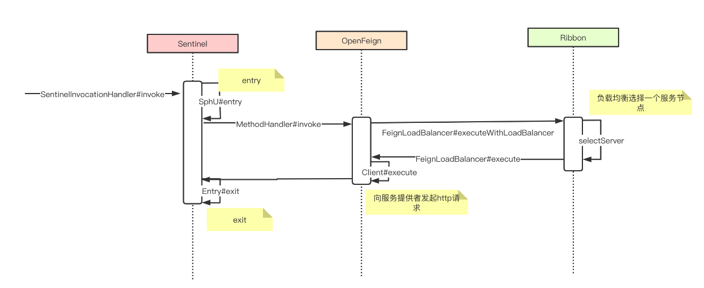 

1. 当调用@FeignClient 接口的方法时，由 Sentinel 提供的方法调用拦截器（SentinelInvocationHandler）拦截方法的执行，根据接口方法上注解的 url 生成资源名称，然后调用 Sentinel 的 SphU#entry 方法（完成所有 ProcessorSlot#entry 方法的调用），判断当前发起的请求是否需要熔断；
2. 非熔断降级情况下，继续将请求交给 OpenFeign 的 MethodHandler 处理；
3. OpenFeign 从 Ribbon 获取一个服务提供者节点；
4. OpenFeign 使用 HttpClient 发起 HTTP 请求；
5. OpenFeign 请求成功或者异常（已经经过重试）时，调用 Sentinel 的 Entry#exit 方法（完成所有 ProcessorSlot#exit 方法的调用）更新当前时间窗口的请求成功总数、异常总数等指标数据。

可见，Sentinel 处在接口调用的最前端，因此 Sentinel 统计的指标数据即不会受 Ribbon 的重试影响也不会受 OpenFeign 的重试影响。

Sentinel 通过自己提供 InvocationHandler 替换 OpenFeign 的 InvocationHandler 实现请求拦截。SentinelInvocationHandler 源码调试如下图所示

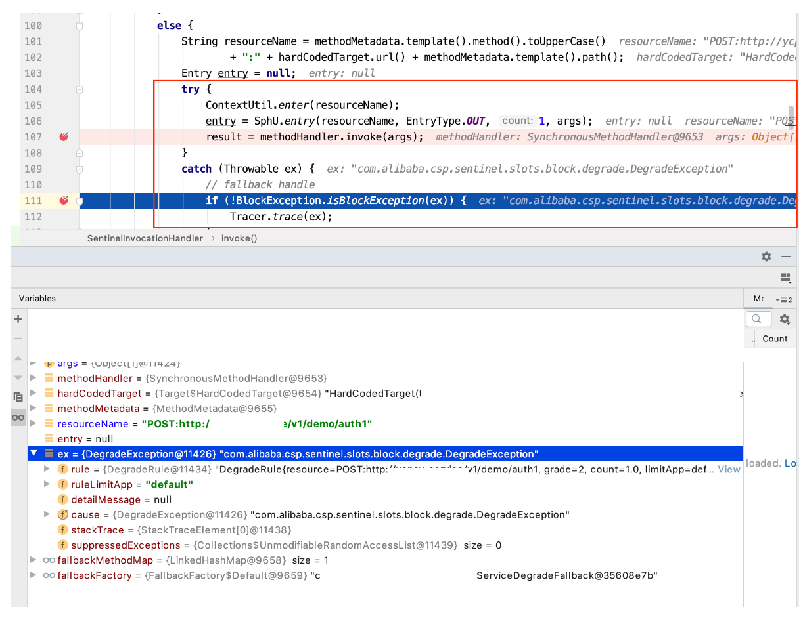 

InvocationHandler 是 OpenFeign 为接口生成 JDK 动态代理类时所需要的，是接口的方法拦截处理器，Sentinel 通过替换 OpenFeign 的 InvocationHandler 拦截方法的执行，在 OpenFeign 处理接口调用之前完成熔断降级的检查。

那么，Sentinel 是如何将原本的 FeignInvocationHandler 替换为 SentinelInvocationHandler 的呢？

OpenFeign 通过 Feign.Builder 类创建接口的代理类，所以 Sentinel 直接将 Feign.Builder 也替换成了 SentinelFeign.Builder，由 SentinelFeignAutoConfiguration 自动配置类向 Spring 的 Bean 容器注入 SentinelFeign.Builder，代码如下：

```java
@Configuration(proxyBeanMethods = false)
@ConditionalOnClass({ SphU.class, Feign.class })
public class SentinelFeignAutoConfiguration {

    @Bean
    @Scope("prototype")
    @ConditionalOnMissingBean
    @ConditionalOnProperty(name = "feign.sentinel.enabled")
    public Feign.Builder feignSentinelBuilder() {
        return SentinelFeign.builder();
    }

}
```

SentinelFeign.Builder 继承 Feign.Builder 并重写 build 方法，SentinelFeign.Builder#build 方法源码如下：

```java
public final class SentinelFeign {

    public static Builder builder() {
        return new Builder();
    }

    public static final class Builder extends Feign.Builder
            implements ApplicationContextAware {

       // .....

        @Override
        public Feign build() {
            super.invocationHandlerFactory(new InvocationHandlerFactory() {
                @Override
                public InvocationHandler create(Target target,
                        Map<Method, MethodHandler> dispatch) {
                    // 创建 SentinelInvocationHandler
                }
            });
            super.contract(new SentinelContractHolder(contract));
            return super.build();
        }
        // .....
    }

}
```

SentinelFeign.Builder#build 偷天换日，替换了 InvocationHandlerFactory，所以 OpenFeign 调用 InvocationHandlerFactory#create 方法创建的 InvocationHandler 就变成了 SentinelInvocationHandler。

看 InvocationHandlerFactory#create 方法的返回值类型我们也能知道，该方法负责创建 SentinelInvocationHandler。create 方法部分源码如下：

```java
Class fallback = (Class) getFieldValue(feignClientFactoryBean,
                            "fallback");
Object fallbackInstance = getFromContext(beanName, "fallback", fallback,
                                target.type());
return new SentinelInvocationHandler(target, dispatch,
                                new FallbackFactory.Default(fallbackInstance));
```

在创建 SentinelInvocationHandler 之前，通过反射从 FeignClientFactoryBean 拿到 @FeignClient 注解的 fallback 属性值，然后根据 fallback 类型从 Bean 工厂取得 fallback 实例，将 fallback 实例传递给 SentinelInvocationHandler。当触发熔断时，SentinelInvocationHandler 就能取得 fallback 实例并调用。

### 总结

本篇我们分析了 Sentinel 适配 Spring MVC 框架的实现原理，以及 Sentinel 适配 Spring Cloud OpenFeign 框架的实现原理。适配各种主流框架，无非就是通过框架提供的方法拦截器注入 Sentinel，或者通过拦截主流框架的入口方法注入 Sentinel。了解原理之后，如果我们项目中使用的框架 Sentinel 并未适配，那么我们也可以自己实现适配器。

## 性能

引入 Sentinel 带来的性能损耗非常小，只有在业务单机量级超过 25W QPS 的时候才会有一些显著的影响（5%~10% 左右），单机 QPS 不太大的时候损耗几乎可以忽略不计。”这是官方文档写的一段话，那么性能到底如何呢？Sentinel 在性能方面做出了哪些努力？

### sentinel性能设计

#### **滑动窗口指标数据统计**

Sentinel 统计指标数据使用的是滑动窗口：时间窗口+Bucket，通过循环复用 Bucket 以减少 Bucket 的创建和销毁。在统计指标数据时，利用当前时间戳定位 Bucket，使用 LongAdder 统计时间窗口内的请求成功数、失败数、总耗时等指标数据优化了并发锁。Sentinel 通过定时任务递增时间戳以获取当前时间戳，避免了每次获取时间戳都使用 System 获取的性能消耗

#### 使用 Map 而不使用 ConcurrentMap

Sentinel 中随处可见的加锁重新创建 Map，例如：

```java
        ProcessorSlotChain chain = chainMap.get(resourceWrapper);
        if (chain == null) {
            synchronized (LOCK) {
                chain = chainMap.get(resourceWrapper);
                if (chain == null) {
                    chain = SlotChainProvider.newSlotChain();
                    // 创建新的 map
                    Map<ResourceWrapper, ProcessorSlotChain> newMap = new HashMap<ResourceWrapper, ProcessorSlotChain>(
                        chainMap.size() + 1);
                    // 插入当前 map 存储的数据
                    newMap.putAll(chainMap);
                    // 插入新创建的 key-value
                    newMap.put(resourceWrapper, chain);
                    // 替换旧的
                    chainMap = newMap;
                }
            }
        }
        return chain;
```

Sentinel 使用 Map 而非 ConcurrentMap 是为了尽量避免加锁，大多数场景都是读多写少，以上面代码为例，ProcessorSlotChain 的新增只在资源第一次被访问时，例如接口第一次被调用，而后续都不会再写。假设有 10 个接口，这 10 个接口在应用启动起来就都被访问过了，那么这个 Map 后续就不会再出现写的情况，既然不会再有写操作，就没有必须加锁了，所以使用 Map 而不是使用 ConcurrentMap。

#### **流量效果控制**

RateLimiterController 匀速限流控制器的实现只支持最大 1000QPS，这是因为 Sentinel 获取的当前时间戳是通过定时任务累加的，每毫秒一次，所以 Sentinel 在实现匀速限流或冷启动限流使用的时间戳最小单位都是毫秒。以毫秒为最小单位，那么 1 秒钟最大能通过的请求数当然也就只有 1000，这是出于性能方面的考虑。

可能很多人在使用 Sentinel 的过程中都发现了，RateLimiterController 实现的匀速并不那么严格，例如想要限制每 5 毫秒通过一个请求，但实际上可能每 5 毫秒通过好几个请求，这与 CPU 核心线程数有关，因为 Sentinel 并不严格控制并发下的排队计时，这也是出于性能的考虑。实现项目中，我们也并不对匀速要求那么严格，所以这些缺点是可以接受的。

WarmUpController 冷启动限流效果的实现并不控制每个请求的通过时间间隔，只是每秒钟生产一次令牌，并且在生产令牌后扣减与上一秒通过的请求数相等数量的令牌，Sentinel 的作者称这个行为叫令牌自动掉落，这些也都是出于性能方面的考虑。

仅从以上这些细节我们也能看到 Sentinel 在性能方面所做出的努力，Sentinel 尽最大可能降低自身对应用的影响，这些是值得称赞的地方

### 性能测试

基准测试 Benchmark 是测量、评估软件性能指标的一种测试，对某个特定目标场景的某项性能指标进行定量的和可对比的测试。JMH 即 Java Microbenchmark Harness，是 Java 用来做基准测试的一个工具，该工具由 OpenJDK 提供并维护，测试结果可信度高。

我们可以将 JMH 直接用在需要进行基准测试的项目中，以单元测试方式使用，需要在项目中引入 JMH 的 jar 包，依赖配置如下。

```xml
<dependencies>
    <dependency>
        <groupId>org.openjdk.jmh</groupId>
        <artifactId>jmh-core</artifactId>
        <version>1.23</version>
    </dependency>
    <dependency>
        <groupId>org.openjdk.jmh</groupId>
        <artifactId>jmh-generator-annprocess</artifactId>
        <version>1.23</version>
    </dependency>
</dependencies>
```

注：1.23 版本是 JMH 目前最新的版本

#### **注解方式使用**

在运行时，注解配置被用于解析生成 BenchmarkListEntry 配置类实例。一个方法对应一个 @Benchmark 注解，一个 @Benchmark 注解对应一个基准测试方法。注释在类上的注解，或者注释在类的字段上的注解，则是类中所有基准测试方法共用的配置。

**@Benchmark**

@Benchmark 注解用于声明一个 public 方法为基准测试方法，如下代码所示。

```java
public class MyTestBenchmark {

    @Benchmark
    @Test
    public void testFunction() {
        // 
    }

}
```

**@BenchmarkMode**

通过 JMH 我们可以轻松的测试出某个接口的吞吐量、平均执行时间等指标的数据。假设我们想测试某个方法的平均耗时，那么可以使用 @BenchmarkMode 注解指定测试维度为 Mode.AverageTime，代码如下。

```java
public class MyTestBenchmark {

    @BenchmarkMode(Mode.AverageTime) 
    @Benchmark
    @Test
    public void testFunction() {
        //
    }

}
```

**@Measurement**

假设我们需要测量五次，那么可以使用 @Measurement 注解，代码如下。

```java
public class MyTestBenchmark {

    @Measurement(iterations = 5, time = 1, timeUnit = TimeUnit.SECONDS)
    @BenchmarkMode(Mode.AverageTime)
    @Benchmark
    @Test
    public void testFunction() {
        //
    }

}
```

@Measurement 注解有三个配置项：

- iterations：测量次数。
- time 与 timeUnit：测量一次的持续时间，timeUnit 指定时间单位，本例中每次测量持续 1 秒，1 秒内执行的 testFunction 方法的次数是不固定的，由方法执行耗时和 time 决定。

**@Warmup**

为了数据准确，我们可能需要让被测试的方法做下热身运动，一定的预热次数可提升测试结果的准备度。可使用 @Warmup 注解声明需要预热的次数、每次预热的持续时间，代码如下。

```java
public class MyTestBenchmark {

    @Warmup(iterations = 5, time = 1, timeUnit = TimeUnit.SECONDS)
    @Measurement(iterations = 5, time = 1, timeUnit = TimeUnit.SECONDS)
    @BenchmarkMode(Mode.AverageTime)
    @Benchmark
    @Test
    public void testFunction() {
       //
    }

}
```

@Warmup 注解有三个配置项：

- iterations：预热次数。
- time 与 timeUnit：预热一次的持续时间，timeUnit 指定时间单位。

假设 @Measurement 指定 iterations 为 100，time 为 10s，则：每个线程实际执行基准测试方法的次数等于 time 除以基准测试方法单次执行的耗时，假设基准测试方法执行耗时为 1s，那么一次测量最多只执行 10（time 为 10s / 方法执行耗时 1s）次基准测试方法，而 iterations 为 100 指的是测试 100 次（不是执行 100 次基准测试方法）。

**@OutputTimeUnit**

@OutputTimeUnit 注解用于指定输出的方法执行耗时的单位。

如果方法执行耗时为毫秒级别，为了便于观察结果，我们可以使用 @OutputTimeUnit 指定输出的耗时时间单位为毫秒，否则使用默认的秒做单位，会输出 10 的负几次方这样的数字，不太直观。

```java
public class MyTestBenchmark {

    @OutputTimeUnit(TimeUnit.NANOSECONDS)
    @Warmup(iterations = 5, time = 1, timeUnit = TimeUnit.SECONDS)
    @Measurement(iterations = 5, time = 1, timeUnit = TimeUnit.SECONDS)
    @BenchmarkMode(Mode.AverageTime)
    @Benchmark
    @Test
    public void testFunction() {
        // 
    }

}
```

**@Fork**

@Fork 注解用于指定 fork 出多少个子进程来执行同一基准测试方法。

假设我们不需要多个进程，那么可以使用 @Fork 指定进程数为 1，如下代码所示。

```java
public class MyTestBenchmark {

    @Fork(1)
    @OutputTimeUnit(TimeUnit.NANOSECONDS)
    @Warmup(iterations = 5, time = 1, timeUnit = TimeUnit.SECONDS)
    @Measurement(iterations = 5, time = 1, timeUnit = TimeUnit.SECONDS)
    @BenchmarkMode(Mode.AverageTime)
    @Benchmark
    @Test
    public void testFunction() {
        //
    }

}
```

**@Threads**

@Threads 注解用于指定使用多少个线程来执行基准测试方法，如果使用 @Threads 指定线程数为 2，那么每次测量都会创建两个线程来执行基准测试方法。

```java
public class MyTestBenchmark {

    @Threads(2)
    @Fork(1)
    @OutputTimeUnit(TimeUnit.NANOSECONDS)
    @Measurement(iterations = 5, time = 1, timeUnit = TimeUnit.SECONDS)
    @BenchmarkMode(Mode.AverageTime)
    @Benchmark
    @Test
    public void testFunction() {
        // 
    }

}
```

如果 @Measurement 注解指定 time 为 1s，基准测试方法的执行耗时为 1s，那么如果只使用单个线程，一次测量只会执行一次基准测试方法，如果使用 10 个线程，一次测量就能执行 10 次基准测试方法。

**公共注解**

假设我们需要在 MyTestBenchmark 类中创建两个基准测试方法，一个是 testFunction1，另一个是 testFunction2，这两个方法分别调用不同的支付接口，用于对比两个接口的性能。那么我们可以将除 @Benchmark 注解外的其它注解都声明到类上，让两个基准测试方法都使用同样的配置，代码如下。

```java
@BenchmarkMode(Mode.AverageTime)
@Fork(1)
@Threads(2)
@OutputTimeUnit(TimeUnit.NANOSECONDS)
@Warmup(iterations = 5, time = 1, timeUnit = TimeUnit.SECONDS)
@Measurement(iterations = 5, time = 1, timeUnit = TimeUnit.SECONDS)
public class MyTestBenchmark {

    @Benchmark
    @Test
    public void testFunction1() {
        // 
    }

    @Benchmark
    @Test
    public void testFunction2() {
        // 
    }
}
```

下面我们以测试 Gson、Jackson 两个 JSON 解析框架的性能对比为例。

```java
@BenchmarkMode(Mode.AverageTime)
@Fork(1)
@Threads(2)
@OutputTimeUnit(TimeUnit.NANOSECONDS)
@Warmup(iterations = 5, time = 1, timeUnit = TimeUnit.SECONDS)
@Measurement(iterations = 5, time = 1, timeUnit = TimeUnit.SECONDS)
@State(Scope.Benchmark)
public class JsonBenchmark {

     private GsonParser gsonParser = new GsonParser();
     private JacksonParser jacksonParser = new JacksonParser();

    @Benchmark
    @Test
    public void testGson() {
        gsonParser.fromJson("{\"startDate\":\"2020-04-01 16:00:00\",\"endDate\":\"2020-05-20 13:00:00\",\"flag\":true,\"threads\":5,\"shardingIndex\":0}", JsonTestModel.class);
    }

    @Benchmark
    @Test
    public void testJackson() {
        jacksonParser.fromJson("{\"startDate\":\"2020-04-01 16:00:00\",\"endDate\":\"2020-05-20 13:00:00\",\"flag\":true,\"threads\":5,\"shardingIndex\":0}", JsonTestModel.class);
    }
}
```

我们可以使用 @State 注解指定 gsonParser、jacksonParser 这两个字段的共享域。

在本例中，我们使用 @Threads 注解声明创建两个线程来执行基准测试方法，假设我们配置 @State(Scope.Thread)，那么在不同线程中，gsonParser、jacksonParser 这两个字段都是不同的实例。

以 testGson 方法为例，我们可以认为 JMH 会为每个线程克隆出一个 gsonParser 对象。如果在 testGson 方法中打印 gsonParser 对象的 hashCode，你会发现，相同线程打印的结果相同，不同线程打印的结果不同。例如：

```java
@BenchmarkMode(Mode.AverageTime)
@Fork(1)
@Threads(2)
@OutputTimeUnit(TimeUnit.NANOSECONDS)
@Warmup(iterations = 5, time = 1, timeUnit = TimeUnit.SECONDS)
@Measurement(iterations = 5, time = 1, timeUnit = TimeUnit.SECONDS)
@State(Scope.Thread)
public class JsonBenchmark {

     private GsonParser gsonParser = new GsonParser();
     private JacksonParser jacksonParser = new JacksonParser();

    @Benchmark
    @Test
    public void testGson() {
        System.out.println("current Thread:" + Thread.currentThread().getName() + "==>" + gsonParser.hashCode());
        gsonParser.fromJson("{\"startDate\":\"2020-04-01 16:00:00\",\"endDate\":\"2020-05-20 13:00:00\",\"flag\":true,\"threads\":5,\"shardingIndex\":0}", JsonTestModel.class);
    }

    @Benchmark
    @Test
    public void testJackson() {
        jacksonParser.fromJson("{\"startDate\":\"2020-04-01 16:00:00\",\"endDate\":\"2020-05-20 13:00:00\",\"flag\":true,\"threads\":5,\"shardingIndex\":0}", JsonTestModel.class);
    }
}
```

执行 testGson 方法输出的结果如下：

```text
current Thread:com.msyc.common.JsonBenchmark.testGson-jmh-worker-1==>2063684770
current Thread:com.msyc.common.JsonBenchmark.testGson-jmh-worker-2==>1629232880
current Thread:com.msyc.common.JsonBenchmark.testGson-jmh-worker-1==>2063684770
current Thread:com.msyc.common.JsonBenchmark.testGson-jmh-worker-2==>1629232880
current Thread:com.msyc.common.JsonBenchmark.testGson-jmh-worker-1==>2063684770
current Thread:com.msyc.common.JsonBenchmark.testGson-jmh-worker-2==>1629232880
current Thread:com.msyc.common.JsonBenchmark.testGson-jmh-worker-1==>2063684770
current Thread:com.msyc.common.JsonBenchmark.testGson-jmh-worker-2==>1629232880
......
```

**@Param**

使用 @Param 注解可指定基准方法执行参数，@Param 注解只能指定 String 类型的值，可以是一个数组，参数值将在运行期间按给定顺序遍历。假设 @Param 注解指定了多个参数值，那么 JMH 会为每个参数值执行一次基准测试。

例如，我们想测试不同复杂度的 JSON 字符串使用 Gson 框架与使用 Jackson 框架解析的性能对比，代码如下。

```java
@BenchmarkMode(Mode.AverageTime)
@Fork(1)
@Threads(2)
@OutputTimeUnit(TimeUnit.NANOSECONDS)
@Warmup(iterations = 5, time = 1, timeUnit = TimeUnit.SECONDS)
@Measurement(iterations = 5, time = 1, timeUnit = TimeUnit.SECONDS)
@State(Scope.Thread)
public class JsonBenchmark {

    private GsonParser gsonParser = new GsonParser();
    private JacksonParser jacksonParser = new JacksonParser();

    // 指定参数有三个值
    @Param(value = 
                {"{\"startDate\":\"2020-04-01 16:00:00\",\"endDate\":\"2020-05-20 13:00:00\",\"flag\":true,\"threads\":5,\"shardingIndex\":0}",
                "{\"startDate\":\"2020-04-01 16:00:00\",\"endDate\":\"2020-05-20 14:00:00\"}",
                "{\"flag\":true,\"threads\":5,\"shardingIndex\":0}"})
    private String jsonStr;

    @Benchmark
    @Test
    public void testGson() {
        gsonParser.fromJson(jsonStr, JsonTestModel.class);
    }

    @Benchmark
    @Test
    public void testJackson() {
        jacksonParser.fromJson(jsonStr, JsonTestModel.class);
    }

}
```

测试结果如下：

```text
Benchmark                                                                                                                      (jsonStr)  Mode  Cnt      Score       Error  Units
JsonBenchmark.testGson     {"startDate":"2020-04-01 16:00:00","endDate":"2020-05-20 13:00:00","flag":true,"threads":5,"shardingIndex":0}  avgt    5  12180.763 ±  2481.973  ns/op

JsonBenchmark.testGson                                               {"startDate":"2020-04-01 16:00:00","endDate":"2020-05-20 14:00:00"}  avgt    5   8154.709 ±  3393.881  ns/op

JsonBenchmark.testGson                                                                       {"flag":true,"threads":5,"shardingIndex":0}  avgt    5   9994.171 ±  5737.958  ns/op

JsonBenchmark.testJackson  {"startDate":"2020-04-01 16:00:00","endDate":"2020-05-20 13:00:00","flag":true,"threads":5,"shardingIndex":0}  avgt    5  15663.060 ±  9042.672  ns/op

JsonBenchmark.testJackson  {"startDate":"2020-04-01 16:00:00","endDate":"2020-05-20 14:00:00"}  avgt    5  13776.828 ± 11006.412  ns/op

JsonBenchmark.testJackson                                                            {"flag":true,"threads":5,"shardingIndex":0}  avgt    5   9824.283 ±   311.555  ns/op
```

#### **非注解方式使用**

通过使用 OptionsBuilder 构造一个 Options，并创建一个 Runner，调用 Runner 的 run 方法就能执行基准测试。

使用非注解方式实现上面的例子，代码如下。

```java
public class BenchmarkTest{

    @Test
    public void test() throws RunnerException {
        Options options = new OptionsBuilder()
                .include(JsonBenchmark.class.getSimpleName())
                .exclude("testJackson")
                .forks(1)
                .threads(2)
                .timeUnit(TimeUnit.NANOSECONDS)
                .warmupIterations(5)
                .warmupTime(TimeValue.seconds(1))
                .measurementIterations(5)
                .measurementTime(TimeValue.seconds(1))
                .mode(Mode.AverageTime)
                .build();
        new Runner(options).run();
    }

}
```

- include：导入一个基准测试类。调用方法传递的是类的简单名称，不含包名。
- exclude：排除哪些方法。默认 JMH 会为 include 导入的类的每个 public 方法都当成是基准测试方法，这时我们就可以使用 exclude 排除不需要参与基准测试的方法。如本例中使用 exclude 排除了 testJackson 方法。

使用注解与不使用注解其实都是一样，只不过使用注解更加方便。在运行时，注解配置被用于解析生成 BenchmarkListEntry 配置类实例，而在代码中使用 Options 配置也是被解析成一个个 BenchmarkListEntry 配置类实例（每个方法对应一个）。

#### **打 jar 包放服务器上执行**

对于 JSON 解析框架性能对比我们可以使用单元测试，而如果想要测试 Web 服务的某个接口性能，需要对接口进行压测，就不能使用简单的单元测试方式去测，我们可以独立创建一个接口测试项目，将基准测试代码写在该项目中，然后将写好的基准测试项目打包成 jar 包丢到 Linux 服务器上执行，测试结果会更准确一些，硬件、系统贴近线上环境、也不受本机开启的应用数、硬件配置等因素影响。

使用 Java 命令即可运行一个基准测试应用：

```shell
java -jar my-benchmarks.jar
```

#### 在 IDEA 中执行

在 IDEA 中，我们可以编写一个单元测试方法，在单元测试方法中创建一个 org.openjdk.jmh.runner.Runner，调用 Runner 的 run 方法执行基准测试。但 JMH 不会去扫描包，不会执行每个基准测试方法，这需要我们通过配置项来告知 JMH 需要执行哪些基准测试方法。

```java
public class BenchmarkTest{

    @Test
    public void test() throws RunnerException {
        Options options = null; // 创建 Options
        new Runner(options).run();
    }

}
```

完整例子如下：

```java
public class BenchmarkTest{
     @Test
     public void test() throws RunnerException {
        Options options = new OptionsBuilder()
                 .include(JsonBenchmark.class.getSimpleName())
                 // .output("/tmp/json_benchmark.log")
                 .build();
        new Runner(options).run();
     }
}
```

Options 在前面已经介绍过了，由于本例中 JsonBenchmark 这个类已经使用了注解，因此 Options 只需要配置需要执行基准测试的类。如果需要执行多个基准测试类，include 方法可以多次调用。如果需要将测试结果输出到文件，可调用 output 方法配置文件路径，不配置则输出到控制台。

#### **在 IDEA 中使用插件 JMH Plugin 执行**

插件源码地址：

> https://github.com/artyushov/idea-jmh-plugin

安装：在 IDEA 中搜索 JMH Plugin，安装后重启即可使用。

**1. 只执行单个 Benchmark 方法**

在方法名称所在行，IDEA 会有一个▶️执行符号，右键点击运行即可。如果写的是单元测试方法，IDEA 会提示你选择执行单元测试还是基准测试。

**2. 执行一个类中的所有 Benchmark 方法**

在类名所在行，IDEA 会有一个`▶️`执行符号，右键点击运行，该类下的所有被 @Benchmark 注解注释的方法都会执行。如果写的是单元测试方法，IDEA 会提示你选择执行单元测试还是基准测试。

### 使用 JMH 对 Sentinel 做压测

要测试 Sentinel 对应用性能的影响，我们需要测试两组数据进行对比，分别是不使用 Sentinel 的情况下方法的吞吐量、使用 Sentinel 保护方法后方法的吞吐量。

下面是 Sentinel 提供的基准测试类部分源码。

```java
@Fork(1)
@Warmup(iterations = 10)
@BenchmarkMode(Mode.Throughput)
@OutputTimeUnit(TimeUnit.SECONDS)
@State(Scope.Thread)
public class SentinelEntryBenchmark {

    @Param({"25", "50", "100", "200", "500", "1000"})
    private int length;
    private List<Integer> numbers;

    @Setup
    public void prepare() {
        numbers = new ArrayList<>();
        for (int i = 0; i < length; i++) {
            numbers.add(ThreadLocalRandom.current().nextInt());
        }
    }

    @Benchmark
    @Threads(8)
    public void doSomething() {
        Collections.shuffle(numbers);
        Collections.sort(numbers);
    }

    @Benchmark
    @Threads(8)
    public void doSomethingWithEntry() {
        Entry e0 = null;
        try {
            e0 = SphU.entry("benchmark");
            doSomething();
        } catch (BlockException e) {
        } finally {
            if (e0 != null) {
                e0.exit();
            }
        }
    }

}
```

该基准测试类使用 @State 指定每个线程使用不同的 numbers 字段的实例，所以 @Setup 注解的方法也会执行 8 次，分别是在每个线程开始执行基准测试方法之前执行，用于完成初始化工作，与 Junit 中的 @Before 注解功能相似。

doSomething 方法用于模拟业务方法，doSomethingWithEntry 方法用于模拟使用 Sentinel 保护业务方法，分别对这两个方法进行基准测试。将基准测试模式配置为吞吐量模式，使用 @Warmup 注解配置预热次数为 10，使用 @OutputTimeUnit 指定输出单位为秒，使用 @Fork 指定进程数为 1，使用 @Threads 指定线程数为 8。

doSomething 方法吞吐量测试结果如下：

```text
Result "com.alibaba.csp.sentinel.benchmark.SentinelEntryBenchmark.doSomething":
  300948.682 ±(99.9%) 33237.428 ops/s [Average]
  (min, avg, max) = (295869.456, 300948.682, 316089.624), stdev = 8631.655
  CI (99.9%): [267711.254, 334186.110] (assumes normal distribution)
```

最小 ops/s 为 295869.456，平均 ops/s 为 300948.682，最大 ops/s 为 316089.624。

doSomethingWithEntry 方法吞吐量测试结果如下：

```text
Result "com.alibaba.csp.sentinel.benchmark.SentinelEntryBenchmark.doSomethingWithEntry":
  309934.827 ±(99.9%) 98910.540 ops/s [Average]
  (min, avg, max) = (280835.799, 309934.827, 337712.803), stdev = 25686.753
  CI (99.9%): [211024.287, 408845.366] (assumes normal distribution)
```

最小 ops/s 为 280835.799，平均 ops/s 为 309934.827，最大 ops/s 为 337712.803。

> OPS：每秒执行的操作次数，或每秒执行的方法次数。

从本次测试结果可以看出，doSomething 方法的平均吞吐量与 doSomethingWithEntry 方法平均吞吐量相差约为 3%，也就是说，在超过 28w OPS（QPS）的情况下，Sentinel 对应用性能的影响只有 3%不到。实际项目场景，一个服务节点所有接口总的 QPS 也很难达到 25W 这个值，而 QPS 越低，Sentinel 对应用性能的影响也越低。

但这毕竟是在没有配置任何限流规则的情况下，只有一个资源且调用链路的深度（调用树的深度）为 1 的情况下，这个结果只能算个理想的参考值，还是以实际项目中的使用测试为准

### 总结

到此，我们基本把 Sentinel 的核心实现源码大致都分析了一遍。我们也能从 Sentinel 源码的一些细节上看出 Sentinel 为性能所作出的努力，并也使用 JMH 对 Sentinel 做了一次简单的基准测试，得出 Sentinel 对应用性能影响非常小结论。

Sentinel 支持丰富的流控功能、扩展性极强，以及性能方面的优势，才是 Sentinel 被广泛使用的原因。

## 1.8熔断

### 熔断降级低版本存在的不足

1.7.x 版本支持三种熔断降级策略为：

- DEGRADE_GRADE_RT：按平均响应耗时
- DEGRADE_GRADE_EXCEPTION_RATIO；按失败比率
- DEGRADE_GRADE_EXCEPTION_COUNT；失败次数

#### **按平均响应耗时**

按平均响应耗时，只支持统计时长为一秒钟，在接口耗时较长场景下导致统计的请求较为稀疏，熔断效果不佳。例如调用第三方支付接口，我们实际项目中统计平均耗时超过 1 秒。

在旧版本中，当选择 DEGRADE_GRADE_RT 策略时，阈值为平均响应耗时，如果一秒内的平均响应耗时超过规则配置的阈值，当连续 rtSlowRequestAmount 个请求之后，平均耗时依然超过阈值，则触发熔断，这导致平均响应耗时策略容易受某个特别慢的请求影响。

如某接口调用平均耗时正常为 100ms，熔断阈值为 500ms，假设一秒内 10 个请求，有一个请求耗时超过 10 秒，就会将平均响应耗时上升到 1100ms，后续需要很多个请求的耗时为 100ms 才能将平均耗时降下来，很容易就超过 rtSlowRequestAmount，导致熔断降级，这样的影响非常致命。

#### **按失败比率**

按失败比率，只支持统计时长为一秒钟，与按平均响应耗时一样，不适用于慢调用场景。

#### **按失败次数**

按失败次数，只支持统计时长为一分钟，即便 timeWindow 配置为 1 秒，在 timeWindow 秒之后关闭开关，开关也会立即被打开，所以大部分场景都使用不上，使其成为一个摆设功能。

### 熔断降级新特性

1.8.0 版本使用的熔断策略（CircuitBreakerStrategy）：

- SLOW_REQUEST_RATIO：按慢请求比率
- ERROR_RATIO：按失败比率
- ERROR_COUNT：按失败次数

DegradeRule 类可配置字段如下：

```java
public class DegradeRule extends AbstractRule {
    private int grade;
    private double count;
    private int timeWindow;
    private int minRequestAmount;
    private double slowRatioThreshold = 1.0d;
    private int statIntervalMs = 1000;
}
```

与旧版本的不同：

- grade：熔断策略，取值为 CircuitBreakerStrategy，并与旧版本取值兼容
- timeWindow：窗口时间，熔断器从打开状态到关闭状态的最小间隔时间
- slowRatioThreshold：慢请求比率，当熔断策略为 SLOW_REQUEST_RATIO 时使用
- statIntervalMs：统计时长，滑动窗口的周期，单位毫秒，这是一个只有一个 bucket 的滑动窗口

#### **新版本支持三种熔断策略可自定义统计时长**

DegradeRule 的 statIntervalMs 字段用于指定指标数据统计时长，单位为毫秒，默认值为 1000。

例如某接口平均耗时为 1 秒，则统计时长可配置为 10 秒，通过延长统计时长，将稀疏请求调整为“密集”请求。

#### **对原有秒级平均响应耗时策略升级，改为慢调用比率策略**

由旧版本的按平均响应耗时策略改为按慢请求比率策略，统计慢请求数，使用慢请求数与总请求数的比值与阈值比较。

当熔断策略为 SLOW_REQUEST_RATIO 时：

- DegradeRule 的 count 表示慢请求阈值，只有响应耗时超出 count 的请求才记为慢请求。是否慢请求取决于当前请求的响应耗时，与平均耗时没有关系。
- DegradeRule 的 slowRatioThreshold 表示慢请求比率阈值，决定是否打开熔断器的阈值。

#### **引入半开启自动恢复支持，并提供熔断器事件监听器**

1.8.0 版本开始，Sentinel 使用熔断器实现熔断降级功能，每个熔断降级规则对应生成一个熔断器，为熔断器引入半开启状态，并可注册自定义事件监听器以感知熔断器的状态变化。

熔断器有三种状态：开启状态、半开启状态和关闭状态。

- 当熔断器状态为半开启状态时，直接拒绝请求；
- 当熔断器为关闭状态时，请求被允许通过；
- 当熔断器状态为开启状态时，根据 timeWindow 尝试将开关状态改为半闭合，如何修改成功，则允许当前请求通过。

熔断器的状态改变有点类似于线程的状态改变，因此笔者将熔断器的改变条件绘制成下图

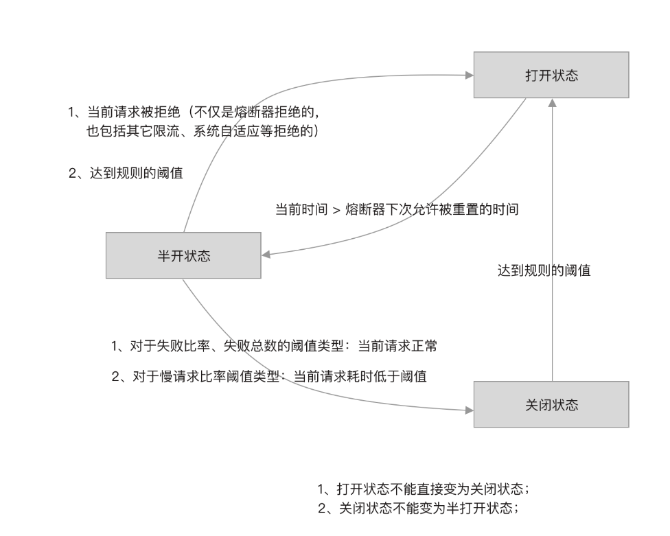 

一开始熔断器的状态为关闭状态，在达到熔断降级规则的阈值时，熔断器的状态从关闭变为开启状态。

熔断器不能直接从开启状态变为关闭状态，只能处在半开启状态的熔断器才能关闭。当熔断器从关闭状态变为开启状态的时间与当前时间的间隔超过 timeWindow 时，尝试将熔断器变为半开启状态。

熔断器可以从半开启状态变为关闭状态，也可以从半开启状态变为开启状态。

触发熔断器从半开启状态变为开启状态的时机有两个：

- 达到规则配置的阈值时开启熔断器，例如慢请求比率达到阈值
- 当前请求被其它地方拒绝时开启熔断器，例如同一资源配置多个熔断器时，有其它规则的熔断器拒绝了请求，又例如被限流器限流

处理半开启状态的熔断器，只要当前请求调用正常，即可关闭：

- 当熔断策略为按失败比率或者失败次数时，只要当前请求正常即可关闭熔断器
- 当熔断策略为按慢请求比率时，只要当前请求不是慢请求即可关闭熔断器

在状态改变的过程中会通知监听器，同时也会修改一些数据，如下图所示

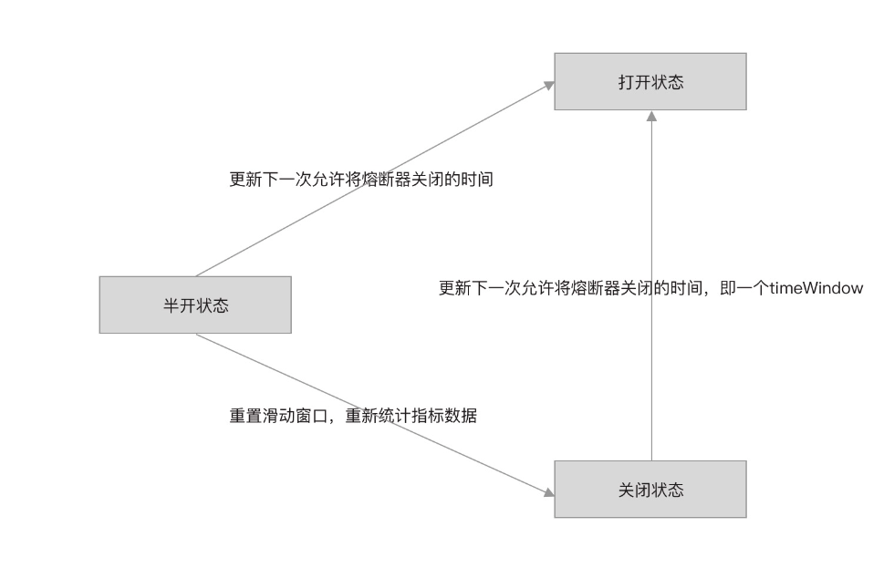 

熔断器状态从关闭到开启：更新下一次允许将熔断器关闭的时间，即间隔 timeWindow 秒之后才可以将熔断器关闭。

熔断器状态从半开启状态到打开状态：更新下一次允许熔断器关闭的时间。如果熔断器刚从开启状态变为半开状态，此时想尝试关闭却发现又达到阈值了，那么就恢复为开启状态，并延长 timeWindow 之后再重试关闭。

熔断器状态从半开启状态到关闭状态：重置当前时间窗口的 bucket，由于只有一个 bucket，所以是重置整个滑动窗口。重置统计的指标数据是避免熔断器刚关闭又立即进入开启状态。

### 总结

从新旧版本对比也能看出，新版本对熔断降级功能的改动很大。特别是加入了半开启自动恢复支持，旧版本需要通过定时器来重置熔断状态，而新版中引入熔断器和三种状态，巧妙的实现了熔断器自动开启和自动关闭的功能