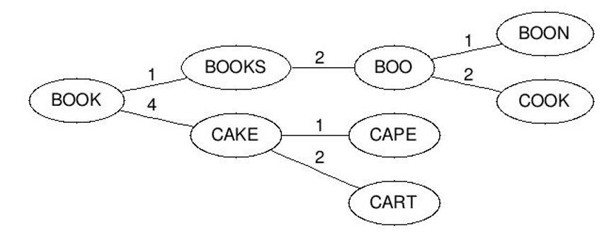

## 原理篇

* **请解释有关 Elasticsearch的 NRT？**

  从文档索引（写入）到可搜索到之间的延迟默认一秒钟，因此Elasticsearch是近实时（NRT）搜索平台。也就是说：文档写入，最快一秒钟被索引到，不能再快了。写入调优的时候，我们通常会动态调整：refresh_interval = 30s 或者更达值，以使得写入数据更晚一点时间被搜索到


* **解释一下 Elasticsearch Node、 Cluster？**

  节点是 Elasticsearch 的实例。实际业务中，我们会说：ES集群包含3个节点、7个节点。

  这里节点实际就是：一个独立的 Elasticsearch 进程，一般将一个节点部署到一台独立的服务器或者虚拟机、容器中。

  不同节点根据角色不同，可以划分为：

  - 主节点

    帮助配置和管理在整个集群中添加和删除节点。

  - 数据节点

    存储数据并执行诸如CRUD（创建/读取/更新/删除）操作，对数据进行搜索和聚合的操作。

  - 协调节点

    将集群请求转发到主节点，将与数据相关的请求转发到数据节点

  - 摄取节点

    用于在索引之前对文档进行预处理

  Elasticsearch 集群是一组连接在一起的一个或多个 Elasticsearch 节点实例。

  Elasticsearch 集群的功能在于在集群中的所有节点之间分配任务，进行搜索和建立索引


* **elasticsearch 是如何实现 master 选举的**

  可以分两个版本来回答

  6.x版本关键点：

  * 只有候选主节点（master：true）的节点才能成为主节点
  * 最小主节点数（min_master_nodes）的目的是防止脑裂
  * 先判定是否具备 master 资格，具备候选主节点资格的优先返回；
  * 若两节点都为候选主节点，则 id 小的值会主节点。注意这里的 id 为 string 类型。

  7.x版本关键点：

  * 采用raft算法


* **Elasticsearch中的节点（比如共20个），其中的10个选了一个master，另外10个选了另一个master，怎么办？**

  针对与6.x：

  当集群 master 候选数量不小于 3 个时，可以通过设置最少投票通过数量（discovery.zen.minimum_master_nodes）超过所有候选节点一半以上来解决脑裂问题；当候选数量为两个时，只能修改为唯一的一个 master 候选，其他作为 data节点，避免脑裂问题

​		针对与7.x采用了基于raft算法的选举


* **elasticsearch 的倒排索引是什么？**

  ​	传统的我们的检索是通过文章，逐个遍历找到对应关键词的位置。而倒排索引，是通过分词策略，形成了词和文章的映射关系表，这种词典+映射表即为倒排索引。有了倒排索引，就能实现o(1)时间复杂度的效率检索文章了，极大的提高了检索效率。通俗来讲，倒排索引，相反于一篇文章包含了哪些词，它从词出发，记载了这个词在哪些文档中出现过，由两部分组成——词典和倒排表。

  加分项：

  ​	说出了倒排索引底层原理，lucene 从 4+版本后开始大量使用的数据结构是 FST，其优点为：

  * 空间占用小。通过对词典中单词前缀和后缀的重复利用，压缩了存储空间；
  * 查询速度快。O(len(str))的查询时间复杂度


* **elasticsearch中 Lucene 的 Segement如何理解？**
  * Lucene 索引是由多个段组成，段本身是一个功能齐全的倒排索引。
  * 段是不可变的，允许 Lucene 将新的文档增量地添加到索引中，而不用从头重建索引。
  * 对于每一个搜索请求而言，索引中的所有段都会被搜索，并且每个段会消耗CPU 的时钟周、文件句柄和内存。这意味着段的数量越多，搜索性能会越低。
  * 了解决这个问题，Elasticsearch 会合并小段到一个较大的段，提交新的合并段到磁盘，并删除那些旧的小段


* **lucence 内部存储结构是什么？**

  使用FST保存词典。FST类似一种TRIE树。不但能共享前缀还能共享后缀。不但能判断查找的key是否存在，还能给出响应的输入output。 它在时间复杂度和空间复杂度上都做了最大程度的优化，使得Lucene能够将Term Dictionary完全加载到内存，快速的定位Term找到响应的output（posting倒排列表）。

  

* **是否了解字典树**？

  Trie 的核心思想是空间换时间，利用字符串的公共前缀来降低查询时间的开销以达到提高效率的目的。它有 3 个基本性质：

  * 根节点不包含字符，除根节点外每一个节点都只包含一个字符。

  * 从根节点到某一节点，路径上经过的字符连接起来，为该节点对应的字符串。

  * 每个节点的所有子节点包含的字符都不相同

     

  * 可以看到，trie 树每一层的节点数是 26^i 级别的。所以为了节省空间，我们还可以用动态链表，或者用数组来模拟动态。而空间的花费，不会超过单词数×单词长度

  * 实现：对每个结点开一个字母集大小的数组，每个结点挂一个链表，使用左儿子右兄弟表示法记录这棵树；

  * 对于中文的字典树，每个节点的子节点用一个哈希表存储，这样就不用浪费太大的空间，而且查询速度上可以保留哈希的复杂度 O(1)


* **解释 Elasticsearch 中的相关性和得分？**

  当你在互联网上搜索有关 Apple 的信息时。它可以显示有关水果或苹果公司名称的搜索结果。

  - 你可能要在线购买水果，检查水果中的食谱或食用水果，苹果对健康的好处。
  - 你也可能要检查Apple.com，以查找该公司提供的最新产品范围，检查评估公司的股价以及最近6个月，1或5年内该公司在纳斯达克的表现。

  同样，当我们从 Elasticsearch 中搜索文档（记录）时，你会对获取所需的相关信息感兴趣。基于相关性，通过Lucene评分算法计算获得相关信息的概率。

  ES 会将相关的内容都返回给你，只是：计算得出的评分高的排在前面，评分低的排在后面。

  计算评分相关的两个核心因素是：词频和逆向文档频率（文档的稀缺性）。

  大体可以解释为：单篇文档词频越高、得分越高；多篇文档某词越稀缺，得分越高。


* **拼写纠错是如何实现的？**

  * 拼写纠错是基于编辑距离来实现；编辑距离是一种标准的方法，它用来表示经 过插入、删除和替换操作从一个字符串转换到另外一个字符串的最小操作步数。这一步可以采用基本的动态规划算法解决

  * 满足与 query 距离在 n 范围内的另一个字符转 B，其与 A 的距离最大为 d+n，最小为 d-n

  * BK 树的构造就过程如下：每个节点有任意个子节点，每条边有个值表示编辑 距离。所有子节点到父节点的边上标注 n 表示编辑距离恰好为 n。比如，我们有棵树父节点是”book”和两个子节点”cake”和”books”，”book”到”books” 的边标号 1，”book”到”cake”的边上标号 4。从字典里构造好树后，无论何 时你想插入新单词时，计算该单词与根节点的编辑距离，并且查找数值为 d(neweord, root)的边。递归得与各子节点进行比较，直到没有子节点，你就可 以创建新的子节点并将新单词保存在那。比如，插入”boo”到刚才上述例子的树 中，我们先检查根节点，查找 d(“book”, “boo”) = 1 的边，然后检查标号为 1 的边的子节点，得到单词”books”。我们再计算距离 d(“books” , “boo”)=2， 则将新单词插在”books”之后，边标号为 2

  * 查询相似词如下：计算单词与根节点的编辑距离 d，然后递归查找每个子节点 标号为 d-n 到 d+n（包含）的边。假如被检查的节点与搜索单词的距离 d 小于 n， 则返回该节点并继续查询。比如输入 cape 且最大容忍距离为 1，则先计算和根的 编辑距离 d(“book”, “cape”)=4，然后接着找和根节点之间编辑距离为 3 到 5 的，这个就找到了 cake 这个节点，计算 d(“cake”, “cape”)=1，满足条件 所以返回 cake，然后再找和 cake 节点编辑距离是 0 到 2 的，分别找到 cape 和 cart 节点，这样就得到 cape 这个满足条件的结果

     


* **详细描述一下 Elasticsearch的索引过程**

  ​	索引文档应该理解为文档写入 ES，创建索引的过程。文档写入包含：单文档写入和批量 bulk 写入，这里只解释一下单文档写入流程，其过程如下：

  * 客户写集群某节点写入数据，发送请求。（如果没有指定路由/协调节点，请求的节点扮演路由节点的角色。）

  * 节点 1 接受到请求后，使用文档_id 来确定文档属于分片 0。请求会被转到另外的节点，假定节点 3。因此分片 0 的主分片分配到节点 3 上。

    这里如何获取写入的文档在哪个分片呢？

    借助路由算法获取，路由算法就是根据路由和文档 id 计算目标的分片 id 的过程

  * 节点 3 在主分片上执行写操作，如果成功，则将请求并行转发到节点 1和节点 2 的副本分片上，等待结果返回。所有的副本分片都报告成功，节点 3 将向协调节点（节点 1）报告成功，节点 1 向请求客户端报告写入成功


* **elasticsearch分片是如何索引数据的？**
  * 当分片所在的节点接收到来自协调节点的请求后，会将请求写入到 Memory Buffer，然后定时（默认是每隔 1 秒）写入到 Filesystem Cache，这个从 Momery Buffer 到 Filesystem Cache 的过程就叫做 refresh；
  * 当然在某些情况下，存在 Momery Buffer 和 Filesystem Cache 的数据可能会丢失，ES 是通过 translog 的机制来保证数据的可靠性的。其实现机制是接收到请求后，同时也会写入到 translog 中，当 Filesystem cache 中的数据写入到磁盘中时，才会清除掉，这个过程叫做 flush；
  * 在 flush 过程中，内存中的缓冲将被清除，内容被写入一个新段，段的 fsync将创建一个新的提交点，并将内容刷新到磁盘，旧的 translog 将被删除并开始一个新的 translog。
  * flush 触发的时机是定时触发（默认 30 分钟）或者 translog 变得太大（默认为 512M）时


* **详细描述一下 Elasticsearch的搜索过程**

  搜索拆解为“query then fetch” 两个阶段。

  query阶段：

  ​	定位到位置，但不取完整数据

  * 假设一个索引数据有 5 主+1 副本 共 10 分片，一次请求会命中（主或者副本分片中）的一个
  * 每个分片在本地进行查询，结果返回到本地有序的优先队列中
  * 第2步骤的结果发送到协调节点，协调节点产生一个全局的排序列表

  fetch阶段：

  * 协调节点辨别出哪些文档需要被取回并向相关的分片提交多个 GET 请求。每个分片加载并 丰富 文档，如果有需要的话，接着返回文档给协调节点。一旦所有的文档都被取回了，协调节点返回结果给客户端
  * Query Then Fetch 的搜索类型在文档相关性打分的时候参考的是本分片的数据，这样在文档数量较少的时候可能不够准确，DFS Query Then Fetch 增加了一个预查询的处理，询问 Term 和 Document frequency，这个评分更准确，但是性能会变差


* **详细描述一下 Elasticsearch 更新和删除文档的过程**

  * 删除和更新也都是写操作，但是 Elasticsearch 中的文档是不可变的，因此不能被删除或者改动以展示其变更；
  * 磁盘上的每个段都有一个相应的.del 文件。当删除请求发送后，文档并没有真的被删除，而是在.del 文件中被标记为删除。该文档依然能匹配查询，但是会在结果中被过滤掉。当段合并时，在.del 文件中被标记为删除的文档将不会被写入新段。

  * 在新的文档被创建时，Elasticsearch 会为该文档指定一个版本号，当执行更新时，旧版本的文档在.del 文件中被标记为删除，新版本的文档被索引到一个新段。旧版本的文档依然能匹配查询，但是会在结果中被过滤掉。


* **在并发情况下，Elasticsearch 如果保证读写一致？**

  * 可以通过版本号使用乐观并发控制，以确保新版本不会被旧版本覆盖，由应用层来处理具体的冲突；

  * 对于写操作，一致性级别支持 quorum/one/all，默认为 quorum，即只有当大多数分片可用时才允许写操作。但即使大多数可用，也可能存在因为网络等原因导致写入副本失败，这样该副本被认为故障，分片将会在一个不同的节点上重建。
  * 对于读操作，可以设置 replication 为 sync(默认)，这使得操作在主分片和副本分片都完成后才会返回；如果设置 replication 为 async 时，也可以通过设置搜索请求参数_preference 为 primary 来查询主分片，确保文档是最新版本

  

* **Elasticsearch 对于大数据量（上亿量级）的聚合如何实现？**

  Elasticsearch 提供的首个近似聚合是 cardinality 度量。它提供一个字段的基数，即该字段的 distinct 或者 unique 值的数目。它是基于 HLL 算法的。HLL 会先对我们的输入作哈希运算，然后根据哈希运算的结果中的 bits 做概率估算从而得到基数。

  其特点是：可配置的精度，用来控制内存的使用（更精确 ＝ 更多内存）；

  小的数据集精度是非常高的；我们可以通过配置参数，来设置去重需要的固定内存使用量。无论数千还是数十亿的唯一值，内存使用量只与你配置的精确度相关


* **定义副本、创建副本的好处是什么？**

  副本是 分片的对应副本，用在极端负载条件下提高查询吞吐量或实现高可用性。

  所谓高可用主要指：如果某主分片1出了问题，对应的副本分片1会提升为主分片，保证集群的高可用。


* **REST API在 Elasticsearch 方面有哪些优势？**

  REST API是使用超文本传输协议的系统之间的通信，该协议以 XML 和 JSON格式传输数据请求。

  REST 协议是无状态的，并且与带有服务器和存储数据的用户界面分开，从而增强了用户界面与任何类型平台的可移植性。它还提高了可伸缩性，允许独立实现组件，因此应用程序变得更加灵活。

  REST API与平台和语言无关，只是用于数据交换的语言是XML或JSON。

  借助：REST API 查看集群信息或者排查问题都非常方便

  

* **解释一下 Elasticsearch 集群中的 Type 的概念 ？**

  5.X 以及之前的 2.X、1.X 版本 ES支持一个索引多个type的，举例 ES 6.X 中的Join 类型在早期版本实际是多 Type 实现的。

  在6.0.0 或 更高版本中创建的索引只能包含一个 Mapping 类型。Type 将在Elasticsearch 7.0.0中的API中弃用，并在8.0.0中完全删除


* **什么是elasticsearch 数据预热**

  elasticsearch的数据实际上是保存导磁盘文件中的，也就是说我们向elasticsearch中写入数据，实际上都是写到磁盘文件里去了的。当我们查询的时候，操作系统会将磁盘文件的数据自动缓存导 filesystem cache 里面去。对于那些经常被访问的数据，最好做一个专门的缓存预热子系统，就是对热数据每隔一段时间，就提前访问一下，让数据进入 filesystem cache 里面去。这样下次别人访问的时候，性能一定会好很多。


* **Elasticsearch中的属性 enabled, index 和 store 的功能是什么？** 

  - enabled：false

    启用的设置仅可应用于顶级映射定义和 Object 对象字段，导致 Elasticsearch 完全跳过对字段内容的解析。

    仍然可以从_source字段中检索JSON，但是无法搜索或以其他任何方式存储JSON。

    如果对非全局或者 Object 类型，设置 enable : false 会报错如下：

    ```
     "type": "mapper_parsing_exception",
     "reason": "Mapping definition for [user_id] has unsupported parameters:  [enabled : false]"
    ```

  - index：false

    索引选项控制是否对字段值建立索引。它接受true或false，默认为true。未索引的字段不可查询。

    如果非要检索，报错如下：

    ```
     "type": "search_phase_execution_exception",
      "reason": "Cannot search on field [user_id] since it is not indexed."
    ```

  - store： 某些特殊场景下，如果你只想检索单个字段或几个字段的值，而不是整个_source的值，则可以使用源过滤来实现； 这个时候， store 就派上用场了。

  

* **你可以列出 Elasticsearch 各种类型的分析器吗？**

  Elasticsearch Analyzer 的类型为内置分析器和自定义分析器。

  - Standard Analyzer

    标准分析器是默认分词器，如果未指定，则使用该分词器。

    它基于Unicode文本分割算法，适用于大多数语言。

  - Whitespace Analyzer

    基于空格字符切词。

  - Stop Analyzer

    在simple Analyzer的基础上，移除停用词。

  - Keyword Analyzer

    不切词，将输入的整个串一起返回。

    自定义分词器的模板

    自定义分词器的在Mapping的Setting部分设置：

    ```
    PUT my_custom_index
    {
     "settings":{
      "analysis":{
      "char_filter":{},
      "tokenizer":{},
      "filter":{},
      "analyzer":{}
      }
     }
    }
    ```

  其中：

  “char_filter”:{},——对应字符过滤部分；

  “tokenizer”:{},——对应文本切分为分词部分；

  “filter”:{},——对应分词后再过滤部分；

  “analyzer”:{}——对应分词器组成部分，其中会包含：1. 2. 3。


* **如何使用 Elasticsearch Tokenizer？** 

  Tokenizer 接收字符流（如果包含了字符过滤，则接收过滤后的字符流；否则，接收原始字符流），将其分词。同时记录分词后的顺序或位置(position)，以及开始值（start_offset）和偏移值(end_offset-start_offset)。

  

* **token filter 过滤器 在 Elasticsearch 中如何工作？** 

  针对 tokenizers 处理后的字符流进行再加工，比如：转小写、删除（删除停用词）、新增（添加同义词）等。


* **请解释一下 Elasticsearch 中聚合有哪些类型？**

  聚合有助于从搜索中使用的查询中收集数据，聚合为各种统计指标，便于统计信息或做其他分析。聚合可帮助回答以下问题：

  - 我的网站平均加载时间是多少？
  - 根据交易量，谁是我最有价值的客户？
  - 什么会被视为我网络上的大文件？
  - 每个产品类别中有多少个产品？

  聚合的分三类：

  主要查看7.10 的官方文档，早期是4个分类，别大意啊！

  - 分桶 Bucket 聚合

  根据字段值，范围或其他条件将文档分组为桶（也称为箱）。

  - 指标 Metric 聚合

  从字段值计算指标（例如总和或平均值）的指标聚合。

  - 管道 Pipeline 聚合

  子聚合，从其他聚合（而不是文档或字段）获取输入。


* **精准匹配检索和全文检索匹配检索的不同？**

  两者的本质区别：

  - 精确匹配用于：是否完全一致？

  举例：邮编、身份证号的匹配往往是精准匹配。

  - 全文检索用于：是否相关？

  举例：类似B站搜索特定关键词如“马保国 视频”往往是模糊匹配，相关的都返回就可以。


## 实践篇

* **为什么要使用Elasticsearch?**

  ​	如果们存储的数据非常多，所以采用以往的模糊查询，模糊查询前置配置，会放弃索引，导致查询是全表扫面，在百万级别的数据库中，效率非常低下，而我们使用ES做一个全文索引，我们将经常查询的某些字段，比如说商品名，描述、价格还有id这些字段我们放入我们索引库里，可以提高查询速度。
  
  

* **ElasticSearch主分片数量可以在后期更改吗？为什么？**

  ElasticSearch中的数据会被分别存储在不同的分片上，索引库的分片数量是在索引库创建的时候通过settings去设置的，如果不设置，分片数默认是5，分片数一旦确定就不能改变。随着数据量的增大，每个分片中的数据量也会不断增加，为了不使每个分片中的数据量过大，就需要增加分片的数量，但是分片数在索引库创建之初就已经确定，并且不能改变。为了解决这个问题，ElasticSearch中设置了重新索引机制来实现


* **elasticsearch 索引数据多了怎么办，如何调优，部署**
  * 设计阶段调优
    * 根据业务增量需求，采取基于日期模板创建索引，通过 roll over API 滚动索引
    * 使用别名进行索引管理
    * 每天凌晨定时对索引做 force_merge 操作，以释放空间
    * 采取冷热分离机制，热数据存储到 SSD，提高检索效率；冷数据定期进行 shrink操作，以缩减存储
    * 对索引进行索引的生命周期管理
    * 对需要分词的字段，合理的设置分词器
    * Mapping 阶段充分结合各个字段的属性，是否需要检索、是否需要存储等
  * 写入调优
    * 如果允许，可以写入前副本数设置为 0
    * 如果允许，可以写入前关闭refresh_interval 设置为-1，禁用刷新机制
    * 写入过程中：采取 bulk 批量写入；
    * 写入后恢复副本数和刷新间隔；
    * 尽量使用自动生成的 id。
  * 查询调优
    * 禁用通配符的模糊检索
    * 禁用批量 terms（成百上千的场景）
    * 充分利用倒排索引机制，能 keyword 类型尽量 keyword
    * 数据量大时候，可以先基于时间敲定索引再检索
    * 设置合理的， 设置合理的路由机制
  * 其它优化
    * 业务调优
    * ES 自身的支持动态扩展的特点，动态新增机器的方式可以缓解集群压力，注意：如果之前主节点等规划合理，不需要重启集群也能完成动态新增的，不过可能会导致分片会重新分布影响线上体验。


* **Elasticsearch 在部署时，对 Linux 的设置有哪些优化方法**

  * 关闭缓存 swap;

    内存交换到磁盘对服务器性能来说是致命的。如果内存交换到磁盘上，一个100 微秒的操作可能变成 10 毫秒。 再想想那么多 10 微秒的操作时延累加起来。 不难看出 swapping 对于性能是多么可怕

  * 堆内存设置为：Min（节点内存/2,  32GB）; 64 GB 内存的机器是非常理想的，把你的内存的（少于）一半给 Lucene（但不要超过 32 GB！）

  * 设置最大文件句柄数；

    Lucene 使用了大量 的文件。同时，Elasticsearch 在节点和 HTTP 客户端之间进行通信也使用了大量的套接字。 所有这一切都需要足够的文件描述符。你应该增加你的文件描述符，设置一个很大的值，如 64,000

  * 线程池+队列大小根据业务需要做调整；

  * 磁盘存储 raid 方式——存储有条件使用 RAID10，增加单节点性能以及避免单节点存储故障

  * 如果你要在更快的 CPUs 和更多的核心之间选择，选择更多的核心更好。多个内核提供的额外并发远胜过稍微快一点点的时钟频率

  * 如果你负担得起 SSD，它将远远超出任何旋转介质。 基于 SSD 的节点，查询和索引性能都有提升。如果你负担得起，SSD 是一个好的选择。

  * 即使数据中心们近在咫尺，也要避免集群跨越多个数据中心。绝对要避免集群跨越大的地理距离。

  * 请确保运行你应用程序的 JVM 和服务器的 JVM 是完全一样的。 在Elasticsearch 的几个地方，使用 Java 的本地序列化。

  * 通过设置 gateway.recover_after_nodes、gateway.expected_nodes、gateway.recover_after_time 可以在集群重启的时候避免过多的分片交换，这可能会让数据恢复从数个小时缩短为几秒钟。

  * Elasticsearch 默认被配置为使用单播发现，以防止节点无意中加入集群。只有在同一台机器上运行的节点才会自动组成集群。最好使用单播代替组播。

  * 不要随意修改垃圾回收器（CMS）和各个线程池的大小

  

* **索引阶段性能提升方法**

  * 使用批量请求并调整其大小：每次批量数据 5–15 MB 大是个不错的起始点

  * 存储：使用 SSD
  * 段和合并：Elasticsearch 默认值是 20 MB/s，对机械磁盘应该是个不错的设置。如果你用的是 SSD，可以考虑提高到 100–200 MB/s。如果你在做批量导入
  * 完全不在意搜索，可以彻底关掉合并限流。另外还可以增加index.translog.flush_threshold_size 设置，从默认的 512 MB 到更大一些的值，比如 1 GB，这可以在一次清空触发的时候在事务日志里积累出更大的段
  * 如果你的搜索结果不需要近实时的准确度，考虑把每个索引的index.refresh_interval 改到 30s
  * 如果你在做大批量导入，考虑通过设置 index.number_of_replicas: 0 关闭副本


* **你们公司的elasticsearch分片副本都设置多大，为什么这么设置呢？**

  分片数取决于你的es集群有多大，以及你想要达到的并发程度。副本数量取决于你想要达到多高的数据可用性和你有多少存储空间可用。一般来讲：

  * 小的分片会造成小的分段，从而会增加开销。我们的目的是将平均分片大小控制在几 GB 到几十 GB 之间。对于基于时间的数据的使用场景来说，通常将分片大小控制在 20GB 到 40GB 之间
  * 由于每个分片的开销取决于分段的数量和大小，因此通过 forcemerge 操作强制将较小的分段合并为较大的分段，这样可以减少开销并提高查询性能。 理想情况下，一旦不再向索引写入数据，就应该这样做。 请注意，这是一项比较耗费性能和开销的操作，因此应该在非高峰时段执行
  * 我们可以在节点上保留的分片数量与可用的堆内存成正比，但 Elasticsearch 没有强制的固定限制。 一个好的经验法则是确保每个节点的分片数量低于每GB堆内存配置20到25个分片。 因此，具有30GB堆内存的节点应该具有最多600-750个分片，但是低于该限制可以使其保持更好。 这通常有助于集群保持健康
  * ElasticSearch推荐的最大JVM堆空间是 30~32G, 把分片最大容量限制为 30GB, 然后再对分片数量做合理估算。例如, 如果的数据能达到 200GB, 则最多分配7到8个分片


* **对于 GC 方面，在使用 Elasticsearch 时要注意什么？**
* SEE：[https://elasticsearch.cn/article/32](https://link.zhihu.com/?target=https%3A//elasticsearch.cn/article/32)
  
* 倒排词典的索引需要常驻内存，无法 GC，需要监控 data node 上 segment memory 增长趋势。
  
* 各类缓存，field cache, filter cache, indexing cache, bulk queue 等等，要设置合理的大小，并且要应该根据最坏的情况来看 heap 是否够用，也就是各类缓存全部占满的时候，还有 heap 空间可以分配给其他任务吗？避免采用 clear cache等“自欺欺人”的方式来释放内存。
  
* 避免返回大量结果集的搜索与聚合。确实需要大量拉取数据的场景，可以采用scan & scroll api 来实现。
  
* cluster stats 驻留内存并无法水平扩展，超大规模集群可以考虑分拆成多个集群通过 tribe node 连接。
  
* 想知道 heap 够不够，必须结合实际应用场景，并对集群的 heap 使用情况做持续的监控。


* **如何使用elasticsearch来创建一个滚动索引？**

  基于模板+时间+rollover api 滚动创建索引，举例：

  * 设计book 索引，其模板格式为：book_index_时间戳的形式，每天递增数据

    这样不至于数据量激增导致单个索引数据量非常大

  * 设计过期策略，绑定到模板之中，使用rollover api来设置滚动索引

  PS：一旦单个索引很大，存储等各种风险也随之而来，比如恢复非常慢，查询性能都可能产生影响，所以要提前考虑+及早避免


* **在 Elasticsearch 中删除索引的语法是什么？**

  可以使用以下语法删除现有索引：

  ```javascript
  DELETE <index_name>
  ```

  支持通配符删除：

  ```javascript
  DELETE my_*
  ```


* **Elasticsearch 中常用的 cat命令有哪些？**

  cat API 命令提供了Elasticsearch 集群的分析、概述和运行状况，其中包括与别名，分配，索引，节点属性等有关的信息。

  一下为一些常见的命令

  ```
  # 获取集群状态
  GET _cat/health
  # 当使用v参数是 会显示列名的详细信息
  GET _cat/health?v
  # 这里对照不加help的命令可以显示每一列的信息说明
  GET _cat/health?help
  # 显示所有的node信息
  GET _cat/nodes?v
  # 只显示ip和load_5m这两列
  GET _cat/nodes?v&h=ip,load_5m
  # 显示左右索引并按照存储大小排序
  GET _cat/indices?v&s=store.size:desc
  # 获取node属性信息
  /_cat/nodeattrs
  /_cat/repositories
  /_cat/snapshots/{repository}
  /_cat/templates
  /_cat/ml/anomaly_detectors
  /_cat/ml/anomaly_detectors/{job_id}
  /_cat/ml/trained_models
  /_cat/ml/trained_models/{model_id}
  /_cat/ml/datafeeds
  /_cat/ml/datafeeds/{datafeed_id}
  /_cat/ml/data_frame/analytics
  /_cat/ml/data_frame/analytics/{id}
  /_cat/transforms
  /_cat/transforms/{transform_id}
  ```

  

* **您能否分步介绍如何启动 Elasticsearch 服务器？** 

  启动方式有很多种，一般 bin 路径下

  ```javascript
  ./elasticsearch -d 
  ```

  就可以后台启动。

  打开浏览器输入 http://IP:9200 就能知道集群是否启动成功。

  如果启动报错，日志里会有详细信息，逐条核对解决就可以。

