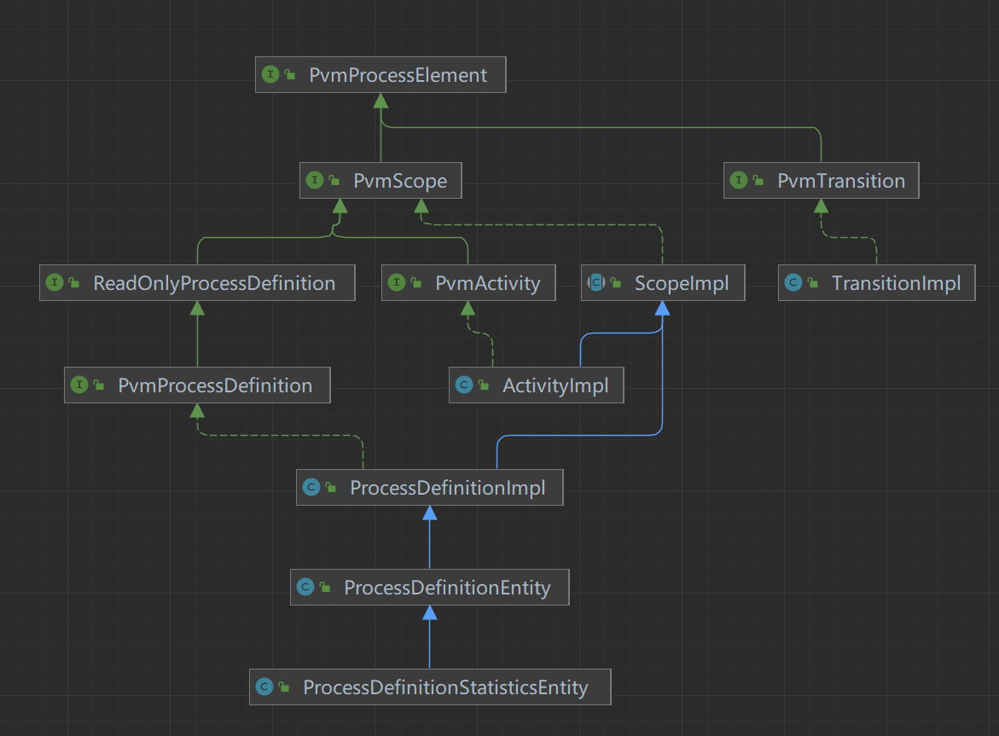

## 模型对象

我们知道流程引擎中的bpmn的流程定义是一个xml文件，如何将xml部署到引擎中成为模型对象呢？

### 部署过程

部署命令deploymentBuilder.deploy()跟踪下去，查看DeploymentBuilderImpl.java

```
@Test
public void deplyTest() {
    repositoryService.createDeployment().name("测试").source("测试2").addString("测试.bpmn",
            IoUtil.readClasspathResourceAsString("bpmn/simple_mutil_extend_test.bpmn")).deploy();
}
```

实际上是调用了repositoryService的deploy方法

```
public DeploymentWithDefinitions deployWithResult() {
  return repositoryService.deployWithResult(this);
}
```

```
public DeploymentWithDefinitions deployWithResult(DeploymentBuilderImpl deploymentBuilder) {
  return commandExecutor.execute(new DeployCmd(deploymentBuilder));
}
```

关注DeployCmd类，实际上最终会调用DeployCmd的execute方法，看看DeployCmd.java

```
public DeploymentWithDefinitions deployWithResult(DeploymentBuilderImpl deploymentBuilder) {
  return commandExecutor.execute(new DeployCmd(deploymentBuilder));
}
```

```
@Override
public DeploymentWithDefinitions execute(final CommandContext commandContext) {
  if (commandContext.getProcessEngineConfiguration().isDeploymentSynchronized()) {
    // ensure serial processing of multiple deployments on the same node.
    // We experienced deadlock situations with highly concurrent deployment of multiple
    // applications on Jboss & Wildfly
    synchronized (ProcessEngine.class) {
      return doExecute(commandContext);
    }
  } else {
    return doExecute(commandContext);
  }
}

protected DeploymentWithDefinitions doExecute(final CommandContext commandContext) {
  DeploymentManager deploymentManager = commandContext.getDeploymentManager();

  // load deployment handler
  ProcessEngine processEngine = commandContext.getProcessEngineConfiguration().getProcessEngine();
  deploymentHandler = commandContext.getProcessEngineConfiguration()
      .getDeploymentHandlerFactory()
      .buildDeploymentHandler(processEngine);

  Set<String> deploymentIds = getAllDeploymentIds(deploymentBuilder);
  if (!deploymentIds.isEmpty()) {
    String[] deploymentIdArray = deploymentIds.toArray(new String[deploymentIds.size()]);
    List<DeploymentEntity> deployments = deploymentManager.findDeploymentsByIds(deploymentIdArray);
    ensureDeploymentsWithIdsExists(deploymentIds, deployments);
  }

  checkCreateAndReadDeployments(commandContext, deploymentIds);

  // set deployment name if it should retrieved from an existing deployment
  String nameFromDeployment = deploymentBuilder.getNameFromDeployment();
  setDeploymentName(nameFromDeployment, deploymentBuilder, commandContext);

  // get resources to re-deploy
  List<ResourceEntity> resources = getResources(deploymentBuilder, commandContext);
  // .. and add them the builder
  addResources(resources, deploymentBuilder);

  Collection<String> resourceNames = deploymentBuilder.getResourceNames();
  if (resourceNames == null || resourceNames.isEmpty()) {
    throw new NotValidException("No deployment resources contained to deploy.");
  }

  // perform deployment
  DeploymentWithDefinitions deployment = commandContext.runWithoutAuthorization(() -> {
    acquireExclusiveLock(commandContext);
    DeploymentEntity deploymentToRegister = initDeployment();
    Map<String, ResourceEntity> resourcesToDeploy =
        resolveResourcesToDeploy(commandContext, deploymentToRegister);
    Map<String, ResourceEntity> resourcesToIgnore = new HashMap<>(deploymentToRegister.getResources());
    resourcesToIgnore.keySet().removeAll(resourcesToDeploy.keySet());

    // save initial deployment resources before they are replaced with only the deployed ones
    CandidateDeployment candidateDeployment =
        CandidateDeploymentImpl.fromDeploymentEntity(deploymentToRegister);
    if (!resourcesToDeploy.isEmpty()) {
      LOG.debugCreatingNewDeployment();
      deploymentToRegister.setResources(resourcesToDeploy);
      deploy(commandContext, deploymentToRegister);
    } else {
      // if there are no resources to be deployed, find an existing deployment
      String duplicateDeploymentId =
          deploymentHandler.determineDuplicateDeployment(candidateDeployment);
      deploymentToRegister =
          commandContext.getDeploymentManager().findDeploymentById(duplicateDeploymentId);
    }

    scheduleProcessDefinitionActivation(commandContext, deploymentToRegister);

    if(deploymentBuilder instanceof ProcessApplicationDeploymentBuilder) {
      // for process application deployments, job executor registration
      // is managed by the ProcessApplicationManager
      ProcessApplicationRegistration registration = registerProcessApplication(
          commandContext,
          deploymentToRegister,
          candidateDeployment,
          resourcesToIgnore.values());

      return new ProcessApplicationDeploymentImpl(deploymentToRegister, registration);
    } else {
      registerWithJobExecutor(commandContext, deploymentToRegister);
    }

    return deploymentToRegister;
  });

  createUserOperationLog(deploymentBuilder, deployment, commandContext);

  return deployment;
}
```

上面代码会进行部署去重、插入缓存、部署设定、实际部署、触发ENTITY_INITIALIZED等操作

但是我们核心关注xml生成BpmnModelInstance的model的过程

```
  public void insertDeployment(DeploymentEntity deployment) {
    getDbEntityManager().insert(deployment);
    createDefaultAuthorizations(deployment);

    for (ResourceEntity resource : deployment.getResources().values()) {
      resource.setDeploymentId(deployment.getId());
      resource.setType(ResourceTypes.REPOSITORY.getValue());
      resource.setCreateTime(ClockUtil.getCurrentTime());
      getResourceManager().insertResource(resource);
    }

    Context
      .getProcessEngineConfiguration()
      .getDeploymentCache()
      .deploy(deployment);
  }
```

最终会调用BpmnDeployer

```
@Override
protected List<ProcessDefinitionEntity> transformDefinitions(DeploymentEntity deployment, ResourceEntity resource, Properties properties) {
  byte[] bytes = resource.getBytes();
  ByteArrayInputStream inputStream = new ByteArrayInputStream(bytes);

  BpmnParse bpmnParse = bpmnParser
      .createParse()
      .sourceInputStream(inputStream)
      .deployment(deployment)
      .name(resource.getName());

  if (!deployment.isValidatingSchema()) {
    bpmnParse.setSchemaResource(null);
  }

  bpmnParse.execute();

  if (!properties.contains(JOB_DECLARATIONS_PROPERTY)) {
    properties.set(JOB_DECLARATIONS_PROPERTY, new HashMap<String, List<JobDeclaration<?, ?>>>());
  }
  properties.get(JOB_DECLARATIONS_PROPERTY).putAll(bpmnParse.getJobDeclarations());

  return bpmnParse.getProcessDefinitions();
}
```

其中bpmnParse.execute()将会执行解析bpmn.xml

### BpmnParse

```
@Override
public BpmnParse execute() {
  super.execute(); // schema validation

  try {
    parseRootElement();
  } catch (BpmnParseException e) {
    addError(e);

  } catch (Exception e) {
    LOG.parsingFailure(e);

    // ALL unexpected exceptions should bubble up since they are not handled
    // accordingly by underlying parse-methods and the process can't be
    // deployed
    throw LOG.parsingProcessException(e);

  } finally {
    if (hasWarnings()) {
      logWarnings();
    }
    if (hasErrors()) {
      throwExceptionForErrors();
    }
  }

  return this;
}
```

```
public Parse execute() {
  try {
    InputStream inputStream = streamSource.getInputStream();

    SAXParser saxParser = parser.getSaxParser();
    try {
      saxParser.setProperty(JAXP_ACCESS_EXTERNAL_SCHEMA, resolveAccessExternalSchemaProperty());
    } catch (Exception e) {
      // ignore unavailable option
      LOG.logAccessExternalSchemaNotSupported(e);
    }
    if (schemaResource != null) {
      saxParser.setProperty(JAXP_SCHEMA_LANGUAGE, W3C_XML_SCHEMA);
      saxParser.setProperty(JAXP_SCHEMA_SOURCE, schemaResource);
    }
    saxParser.parse(inputStream, new ParseHandler(this));
  } catch (Exception e) {
    throw LOG.parsingFailureException(name, e);
  }

  return this;
}
```

```
protected void parseRootElement() {
  collectElementIds();
  parseDefinitionsAttributes();
  parseImports();
  parseMessages();
  parseSignals();
  parseErrors();
  parseEscalations();
  parseProcessDefinitions();
  parseCollaboration();

  // Diagram interchange parsing must be after parseProcessDefinitions,
  // since it depends and sets values on existing process definition objects
  parseDiagramInterchangeElements();

  for (BpmnParseListener parseListener : parseListeners) {
    parseListener.parseRootElement(rootElement, getProcessDefinitions());
  }
}
```

parseProcessDefinitions会对其中对process元素内部各元素例如userTask、squenceFlow、startEvent的解析

```
public void parseProcessDefinitions() {
  for (Element processElement : rootElement.elements("process")) {
    boolean isExecutable = !deployment.isNew();
    String isExecutableStr = processElement.attribute("isExecutable");
    if (isExecutableStr != null) {
      isExecutable = Boolean.parseBoolean(isExecutableStr);
      if (!isExecutable) {
        LOG.ignoringNonExecutableProcess(processElement.attribute("id"));
      }
    } else {
      LOG.missingIsExecutableAttribute(processElement.attribute("id"));
    }

    // Only process executable processes
    if (isExecutable) {
      processDefinitions.add(parseProcess(processElement));
    }
  }
}
```

**PS：BpmnParser 和BpmnParse这两个类不一样，前者专注于生成BpmnModelInstance对象（更多的是element的信息），后者是解析引擎逻辑，包含执行各种监听器，设置活动对象、行为对象；**

### 对象解析器

parseProcessDefinitions会对各类元素进行解析。其中核心的方法为：

```java
  public void parseScope(Element scopeElement, ScopeImpl parentScope) {

    // Not yet supported on process level (PVM additions needed):
    // parseProperties(processElement);

    // filter activities that must be parsed separately
    List<Element> activityElements = new ArrayList<>(scopeElement.elements());
    Map<String, Element> intermediateCatchEvents = filterIntermediateCatchEvents(activityElements);
    activityElements.removeAll(intermediateCatchEvents.values());
    Map<String, Element> compensationHandlers = filterCompensationHandlers(activityElements);
    activityElements.removeAll(compensationHandlers.values());

    parseStartEvents(scopeElement, parentScope);
    parseActivities(activityElements, scopeElement, parentScope);
    parseIntermediateCatchEvents(scopeElement, parentScope, intermediateCatchEvents);
    parseEndEvents(scopeElement, parentScope);
    parseBoundaryEvents(scopeElement, parentScope);
    parseSequenceFlow(scopeElement, parentScope, compensationHandlers);
    parseExecutionListenersOnScope(scopeElement, parentScope);
    parseAssociations(scopeElement, parentScope, compensationHandlers);
    parseCompensationHandlers(parentScope, compensationHandlers);

    for (ScopeImpl.BacklogErrorCallback callback : parentScope.getBacklogErrorCallbacks()) {
      callback.callback();
    }

    if (parentScope instanceof ProcessDefinition) {
      parseProcessDefinitionCustomExtensions(scopeElement, (ProcessDefinition) parentScope);
    }
  }
```


```java
protected ActivityImpl parseActivity(Element activityElement, Element parentElement, ScopeImpl scopeElement) {
  ActivityImpl activity = null;

  boolean isMultiInstance = false;
  ScopeImpl miBody = parseMultiInstanceLoopCharacteristics(activityElement, scopeElement);
  if (miBody != null) {
    scopeElement = miBody;
    isMultiInstance = true;
  }

  if (activityElement.getTagName().equals(ActivityTypes.GATEWAY_EXCLUSIVE)) {
    activity = parseExclusiveGateway(activityElement, scopeElement);
  } else if (activityElement.getTagName().equals(ActivityTypes.GATEWAY_INCLUSIVE)) {
    activity = parseInclusiveGateway(activityElement, scopeElement);
  } else if (activityElement.getTagName().equals(ActivityTypes.GATEWAY_PARALLEL)) {
    activity = parseParallelGateway(activityElement, scopeElement);
  } else if (activityElement.getTagName().equals(ActivityTypes.TASK_SCRIPT)) {
    activity = parseScriptTask(activityElement, scopeElement);
  } else if (activityElement.getTagName().equals(ActivityTypes.TASK_SERVICE)) {
    activity = parseServiceTask(activityElement, scopeElement);
  } else if (activityElement.getTagName().equals(ActivityTypes.TASK_BUSINESS_RULE)) {
    activity = parseBusinessRuleTask(activityElement, scopeElement);
  } else if (activityElement.getTagName().equals(ActivityTypes.TASK)) {
    activity = parseTask(activityElement, scopeElement);
  } else if (activityElement.getTagName().equals(ActivityTypes.TASK_MANUAL_TASK)) {
    activity = parseManualTask(activityElement, scopeElement);
  } else if (activityElement.getTagName().equals(ActivityTypes.TASK_USER_TASK)) {
    activity = parseUserTask(activityElement, scopeElement);
  } else if (activityElement.getTagName().equals(ActivityTypes.TASK_SEND_TASK)) {
    activity = parseSendTask(activityElement, scopeElement);
  } else if (activityElement.getTagName().equals(ActivityTypes.TASK_RECEIVE_TASK)) {
    activity = parseReceiveTask(activityElement, scopeElement);
  } else if (activityElement.getTagName().equals(ActivityTypes.SUB_PROCESS)) {
    activity = parseSubProcess(activityElement, scopeElement);
  } else if (activityElement.getTagName().equals(ActivityTypes.CALL_ACTIVITY)) {
    activity = parseCallActivity(activityElement, scopeElement, isMultiInstance);
  } else if (activityElement.getTagName().equals(ActivityTypes.INTERMEDIATE_EVENT_THROW)) {
    activity = parseIntermediateThrowEvent(activityElement, scopeElement);
  } else if (activityElement.getTagName().equals(ActivityTypes.GATEWAY_EVENT_BASED)) {
    activity = parseEventBasedGateway(activityElement, parentElement, scopeElement);
  } else if (activityElement.getTagName().equals(ActivityTypes.TRANSACTION)) {
    activity = parseTransaction(activityElement, scopeElement);
  } else if (activityElement.getTagName().equals(ActivityTypes.SUB_PROCESS_AD_HOC) || activityElement.getTagName().equals(ActivityTypes.GATEWAY_COMPLEX)) {
    addWarning("Ignoring unsupported activity type", activityElement);
  }

  if (isMultiInstance) {
    activity.setProperty(PROPERTYNAME_IS_MULTI_INSTANCE, true);
  }

  if (activity != null) {
    activity.setName(activityElement.attribute("name"));
    parseActivityInputOutput(activityElement, activity);
  }

  return activity;
}
```

以上会遍历流程图中定义的各种元素，比如最基本的UserTask元素。

#### userTask解析

```java
public ActivityImpl parseUserTask(Element userTaskElement, ScopeImpl scope) {
  ActivityImpl activity = createActivityOnScope(userTaskElement, scope);

  parseAsynchronousContinuationForActivity(userTaskElement, activity);

  TaskDefinition taskDefinition = parseTaskDefinition(userTaskElement, activity.getId(), activity, (ProcessDefinitionEntity) scope.getProcessDefinition());
  TaskDecorator taskDecorator = new TaskDecorator(taskDefinition, expressionManager);

  UserTaskActivityBehavior userTaskActivity = new UserTaskActivityBehavior(taskDecorator);
  activity.setActivityBehavior(userTaskActivity);

  parseProperties(userTaskElement, activity);
  parseExecutionListenersOnScope(userTaskElement, activity);

  for (BpmnParseListener parseListener : parseListeners) {
    parseListener.parseUserTask(userTaskElement, scope, activity);
  }
  return activity;
}
```

以上的代码逻辑。

* 创建activity对象

  ```java
  public ActivityImpl createActivityOnScope(Element activityElement, ScopeImpl scopeElement) {
    String id = activityElement.attribute("id");
  
    LOG.parsingElement("activity", id);
    ActivityImpl activity = scopeElement.createActivity(id);
  
    activity.setProperty("name", activityElement.attribute("name"));
    activity.setProperty("documentation", parseDocumentation(activityElement));
    activity.setProperty("default", activityElement.attribute("default"));
    activity.getProperties().set(BpmnProperties.TYPE, activityElement.getTagName());
    activity.setProperty("line", activityElement.getLine());
    setActivityAsyncDelegates(activity);
    activity.setProperty(PROPERTYNAME_JOB_PRIORITY, parsePriority(activityElement, PROPERTYNAME_JOB_PRIORITY));
  
    if (isCompensationHandler(activityElement)) {
      activity.setProperty(PROPERTYNAME_IS_FOR_COMPENSATION, true);
    }
  
    return activity;
  }
  ```

  这里的scopeElement就是userTask所在的ProcessDefinitionEntity，跟踪scopeElement.createActivity

  ```
  public ActivityImpl createActivity(String activityId) {
    ActivityImpl activity = new ActivityImpl(activityId, processDefinition);
    if (activityId!=null) {
      if (processDefinition.findActivity(activityId) != null) {
        throw new PvmException("duplicate activity id '" + activityId + "'");
      }
      if (BACKLOG.containsKey(activityId)) {
        BACKLOG.remove(activityId);
      }
      namedFlowActivities.put(activityId, activity);
    }
    activity.flowScope = this;
    flowActivities.add(activity);
  
    return  activity;
  }
  ```

  新建ActivityImpl对象，判断是否有重复命名。添加到所属process的activities列表中,并绑定FlowScope

* 创建任务定义

* 创建UserTaskActivityBehavior行为类（重要）

* 解析属性

* 解析自定义解析监听器（BpmnParseListener）

#### SequenceFlow解析

```java
public void parseSequenceFlow(Element processElement, ScopeImpl scope, Map<String, Element> compensationHandlers) {
    	....................
        TransitionImpl transition = sourceActivity.createOutgoingTransition(id);
        sequenceFlows.put(id, transition);
        transition.setProperty("name", sequenceFlowElement.attribute("name"));
        transition.setProperty("documentation", parseDocumentation(sequenceFlowElement));
        transition.setDestination(destinationActivity);
        parseSequenceFlowConditionExpression(sequenceFlowElement, transition);
        parseExecutionListenersOnTransition(sequenceFlowElement, transition);

        for (BpmnParseListener parseListener : parseListeners) {
          parseListener.parseSequenceFlow(sequenceFlowElement, scope, transition);
        }
}
```

设置条件表达式、设置监听器等相关属性

### 自定义对象解析

```
public class AbstractBpmnParseListener implements BpmnParseListener
```

可以继承AbstractBpmnParseListener实现自定义的对象解析器来来完成自定义的扩展属性解析或者添加全局监听器；

```
@Slf4j
@Component
public class CustomBpmnParseListener extends AbstractBpmnParseListener {
	@Override
    public void parseUserTask(Element userTaskElement, ScopeImpl scope, ActivityImpl activity) {
   		//这里可以解析bpmn的自定义扩展元素
        //也可以调用activity的方法为该元素添加自定义的全局监听器。
    }
   
}
```

​	而且这种还可以实现生产中我们常常在流程的上一环节选择下环节的处理人，然后再提交流程。之后流程运转到下一个环节后，会在对应的处理人名下，即userTask的candidate或assignee是上环节选中的处理人。

​	上述的实现方式可以是这样，对userTask添加自定义任务监听器，该监听器主要作用是把流程实例中的变量设置为userTask的candidate或assignee。这样在流程执行的时候，上一环节选择了处理人，写入流程变量中，待下一环节的任务监听器把变量读出来设置到userTask的candidate或assignee。但是在bpmn图上为每个userTask上添加这样的监听器，随着流程和userTask增多，维护起来非常繁琐。生产系统常常有十几个不同的流程，每个流程数个或十数个节点，而且随着业务变化，流程图也要时不时进行修改，手动对每个userTask添加监听器不现实。有没有办法为任务节点统一添加监听器呢？答案是有的！我们可以自定义一个userTask的对象解析器，在解析每个userTask时，为其添加监听器，这样我们就没必要在bpmn图上手动添加了。不仅省时省力，而且方便统一管理。

### 全局事件监听器

我们可以调用对象解析器获取到activity，然后调用activity的addListener方法。

```
@Override
public void parseProcess(Element processElement, ProcessDefinitionEntity processDefinition) {
    processDefinition.addListener(PvmEvent.EVENTNAME_END, globalProcessEndListener);
    processDefinition.addListener(PvmEvent.EVENTNAME_START, globalProcessStartListener);
}
```

### 小结

​	camunda部署时将数据流解析并校验，将资源和实体刷新到数据库，并调用bpmnParse对象的解析方法，该方法会解析bpmn中的xml元素，构建流程定义对象以及各种行为类，同时还会设置监听器，执行解析监听器等。

​	我们可以归纳，首先解析process，得到ProcessDefinitionEntity，然后把userTask等活动解析成ActivityImpl加入到ProcessDefinitionEntity中，再解析sequenceFlow为TransitionImpl，与各ActivityImpl关联起来，形成流程虚拟机运转的基础

## 核心设计模式

​	camunda中很多api的调用，最终会把这个调用封装成一个命令，使用命令模式去调用。另外还会把命令放在调用链上，当调用该命令时会依次调用职责链上的每一个拦截器（Interceptor），例如日志、事务相关拦截器，然后调用指定的命令。

### 设计模式简介

#### 命令模式

命令模式的类图

 

```java
public interface Command {
	void execute();
}
```

```java
public class HelloCommand implements Command {
 
	private Receiver receiver = null;
	
	public HelloCommand(Receiver receiver) {
		super();
		this.receiver = receiver;
	}
 
	public void execute() {
		receiver.helloAction();
	}
```


```java
public class ByeCommand implements Command {
    private Receiver receiver = null;

    public ByeCommand(Receiver receiver) {
        super();
        this.receiver = receiver;
    }

    public void execute() {
        receiver.byeAction();
    }
}
```

Receiver.java：

```java
public class Receiver {
    public void helloAction() {
        System.out.println("hello");
    }

    public void byeAction() {
        System.out.println("good bye");
    }
}
```

 Invoker.java：

```java
public class Invoker {
    private Command command = null;

    public Invoker(Command command) {
        this.command = command;
    }

    public void action() {
        command.execute();
    }

    public Command getCommand() {
        return command;
    }

    public void setCommand(Command command) {
        this.command = command;
    }
}
```

Client.java：

```java
public static void main(String[] args) {
	Receiver receiver = new Receiver();
	HelloCommand helloCommand = new HelloCommand(receiver);
	ByeCommand byeCommand = new ByeCommand(receiver);
	Invoker invoker = new Invoker(helloCommand);
	invoker.action();
	invoker.setCommand(byeCommand);
	invoker.action();
}
```
有时候命令模式可能省略Receiver，直接在Command实例的execute方法中处理具体逻辑，camunda便是如此

#### 责任链模式

责任链模式（Chain of Responsibility Pattern）为请求创建了一个接收者对象的链。避免请求发送者与接收者耦合在一起，让多个对象都有可能接收请求，将这些对象连接成一条链，并且沿着这条链传递请求，直到有对象处理它为止

 

AbstractHandler.java

	public abstract class AbstractHandler {
	    AbstractHandler next = null;
	
	    public void setNext(AbstractHandler next) {
	        this.next = next;
	    }
	
	    public void handle() {
	        action();
	        if(next != null) {
	            next.handle();
	        }
	    }
	
	    public abstract void action();
	}

ConcreteHandlerA.java

```java
public class ConcreteHandlerA extends AbstractHandler{
    public void action() {
        System.out.println("handle A");
    }
}
```

ConcreateHandlerB.java

```java
public class ConcreteHandlerB extends AbstractHandler{
    public void action() {
        System.out.println("handle B");
    }
}
```

Client.java

```java
public class Client {
    public static AbstractHandler initChain() {
        ConcreteHandlerA concreteHandlerA = new ConcreteHandlerA();
        ConcreteHandlerB concreteHandlerB = new ConcreteHandlerB();
        concreteHandlerA.setNext(concreteHandlerB);
        return concreteHandlerA;
    }

    public static void main(String[] args) {
        AbstractHandler handlerChain = initChain();
        handlerChain.handle();
    }
}
```
### camunda使用方式

命令类初始化是在ProcessEngineConfigurationImpl进行的

org.camunda.bpm.engine.impl.cfg.ProcessEngineConfigurationImpl#init

```java
protected void init() {
  ..............
  initCommandExecutors();
```

```java
protected void initCommandExecutors() {
  initActualCommandExecutor();
  initCommandInterceptorsTxRequired();
  initCommandExecutorTxRequired();
  initCommandInterceptorsTxRequiresNew();
  initCommandExecutorTxRequiresNew();
  initCommandExecutorDbSchemaOperations();
}
```

主要有这么几类

#### 初始化拦截器

```java
protected void initCommandInterceptorsTxRequired() {
  if (commandInterceptorsTxRequired == null) {
    if (customPreCommandInterceptorsTxRequired != null) {
      commandInterceptorsTxRequired = new ArrayList<>(customPreCommandInterceptorsTxRequired);
    } else {
      commandInterceptorsTxRequired = new ArrayList<>();
    }
    commandInterceptorsTxRequired.addAll(getDefaultCommandInterceptorsTxRequired());
    if (customPostCommandInterceptorsTxRequired != null) {
      commandInterceptorsTxRequired.addAll(customPostCommandInterceptorsTxRequired);
    }
    commandInterceptorsTxRequired.add(actualCommandExecutor);
  }
}
```

* 流程引擎先创建一个list
* 添加用户自定义前置拦截器、添加默认拦截器
* 添加后置拦截器
* 添加命令调用类

**默认拦截器：**

对于spirng的流程引擎配置类的实现获取默认拦截器

```
protected Collection< ? extends CommandInterceptor> getDefaultCommandInterceptorsTxRequired() {
  if (transactionManager==null) {
    throw new ProcessEngineException("transactionManager is required property for SpringProcessEngineConfiguration, use "+StandaloneProcessEngineConfiguration.class.getName()+" otherwise");
  }

  List<CommandInterceptor> defaultCommandInterceptorsTxRequired = new ArrayList<CommandInterceptor>();
  // CRDB interceptor is added before the SpringTransactionInterceptor,
  // so that a Spring TX may be rolled back before retrying.
  if (DbSqlSessionFactory.CRDB.equals(databaseType)) {
    defaultCommandInterceptorsTxRequired.add(getCrdbRetryInterceptor());
  }
  defaultCommandInterceptorsTxRequired.add(new LogInterceptor());
  defaultCommandInterceptorsTxRequired.add(new CommandCounterInterceptor(this));
  defaultCommandInterceptorsTxRequired.add(new ProcessApplicationContextInterceptor(this));
  defaultCommandInterceptorsTxRequired.add(new SpringTransactionInterceptor(transactionManager, TransactionTemplate.PROPAGATION_REQUIRED, this));
  CommandContextInterceptor commandContextInterceptor = new CommandContextInterceptor(commandContextFactory, this);
  defaultCommandInterceptorsTxRequired.add(commandContextInterceptor);
  return defaultCommandInterceptorsTxRequired;
}
```

* 先添加日志拦截器LogInterceptor
* 添加上下文拦截器
* 添加事务拦截器transactionInterceptor，根据不同的流程引擎配置类，createTransactionInterceptor创建的事务拦截器各有不同。StandaloneProcessEngineConfiguration创建的事务拦截器是null，而SpringProcessEngineConfiguration则是SpringTransactionInterceptor。

**LogInterceptor**

接下来分析日志拦截器LogInterceptor.java。它的代码很简单，就是执行职责链下一个拦截器的execute方法，如果配置了log，就会在调用链的前后输出debug日志：

```
public <T> T execute(Command<T> command) {
  LOG.debugStartingCommand(command);
  try {
    return next.execute(command);
  }
  finally {
    LOG.debugFinishingCommand(command);
  }
}
```

**命令上下文拦截器**

CommandContextInterceptor

```
public <T> T execute(Command<T> command) {
  CommandContext context = null;

  if(!alwaysOpenNew) {
    // check whether we can reuse the command context
    CommandContext existingCommandContext = Context.getCommandContext();
    if(existingCommandContext != null && isFromSameEngine(existingCommandContext)) {
      context = existingCommandContext;
    }
  }

  // only create a new command context on the current command level (CAM-10002)
  boolean isNew = ProcessEngineContextImpl.consume();
  boolean openNew = (context == null || isNew);

  CommandInvocationContext commandInvocationContext = new CommandInvocationContext(command, processEngineConfiguration);
  Context.setCommandInvocationContext(commandInvocationContext);

  try {
    if(openNew) {
      LOG.debugOpeningNewCommandContext();
      context = commandContextFactory.createCommandContext();

    } else {
      LOG.debugReusingExistingCommandContext();

    }

    Context.setCommandContext(context);
    Context.setProcessEngineConfiguration(processEngineConfiguration);

    // delegate to next interceptor in chain
    return next.execute(command);

  } catch (Throwable t) {
    commandInvocationContext.trySetThrowable(t);

  } finally {
    try {
      if (openNew) {
        LOG.closingCommandContext();
        context.close(commandInvocationContext);
      } else {
        commandInvocationContext.rethrow();
      }
    } finally {
      Context.removeCommandInvocationContext();
      Context.removeCommandContext();
      Context.removeProcessEngineConfiguration();

      // restore the new command context flag
      ProcessEngineContextImpl.set(isNew);
    }
  }

  return null;
}
```

创建一个CommandContext，把当前的上下文和流程引擎配置压入栈中，再执行职责链的下一个对象的execute方法。执行完之后，行把压入栈中的context和processEngineConfiguration清除

**相当于执行器预设置processEngineConfiguration配置类了**

#### 初始化命令执行器

当流程引擎开始运行后，程序中调用CommandExecutor的execute方法时，职责链中的拦截器便会一个接一个执行。

```
protected CommandInterceptor initInterceptorChain(List<CommandInterceptor> chain) {
  if (chain == null || chain.isEmpty()) {
    throw new ProcessEngineException("invalid command interceptor chain configuration: " + chain);
  }
  for (int i = 0; i < chain.size() - 1; i++) {
    chain.get(i).setNext(chain.get(i + 1));
  }
  return chain.get(0);
}
```

初始化头部执行器

```
protected void initActualCommandExecutor() {
  actualCommandExecutor = new CommandExecutorImpl();
}
```

## 数据库存储

camunda的db访问框架为mybatis。

mybatis核心的一个设计模式是工厂模式。

### 抽象工厂模式

 

### camunda数据库访问架构

 


上图是SessionFactory的大致架构。 

SessionFactory属于抽象工厂，声明的getSessionType用于返回具体工厂类型的class。

openSession用于创建并返回具体的实体管理类。

XXXManageFactory就是具体的工厂类。

Session接口声明的flush方法用于把增删改操作从缓存刷新到数据

close为关闭连接的清理工作。

AbstractManager定义了insert、delete等方法，调用DbSqlSession，增删改的对象放入缓存中，待命令执行结束后刷新到数据库。

```
public abstract class AbstractManager implements Session {

  public void insert(DbEntity dbEntity) {
    getDbEntityManager().insert(dbEntity);
  }

  public void delete(DbEntity dbEntity) {
    getDbEntityManager().delete(dbEntity);
  }

  protected DbEntityManager getDbEntityManager() {
    return getSession(DbEntityManager.class);
  }
  
  。。。。。。
  
  
  protected TaskManager getTaskManager() {
    return getSession(TaskManager.class);
  }

  protected TaskReportManager getTaskReportManager() {
    return getSession(TaskReportManager.class);
  }

```

上面getXXXManager方法调用getSession，CommandContext的getSession方法。查看CommandContext.java：

```
protected <T> T getSession(Class<T> sessionClass) {
  return Context.getCommandContext().getSession(sessionClass);
}
```

```
public <T> T getSession(Class<T> sessionClass) {
  Session session = sessions.get(sessionClass);
  if (session == null) {
    SessionFactory sessionFactory = sessionFactories.get(sessionClass);
    ensureNotNull("no session factory configured for " + sessionClass.getName(), "sessionFactory", sessionFactory);
    session = sessionFactory.openSession();
    sessions.put(sessionClass, session);
    sessionList.add(0, session);
  }

  return (T) session;
}
```

从初始化sessionFactory时添加到sessionFactories中的工厂类中获取具体工厂类

openSession创建具体的实体管理类，即XXXEntityManager。

XXXEntityManager类是给用户与数据库交互的接口，我们以比较简单的UserOperationLogManager.java为例：

```
public class UserOperationLogManager extends AbstractHistoricManager {

  public UserOperationLogEntry findOperationLogById(String entryId) {
    return getDbEntityManager().selectById(UserOperationLogEntryEventEntity.class, entryId);
  }

  public long findOperationLogEntryCountByQueryCriteria(UserOperationLogQueryImpl query) {
    getAuthorizationManager().configureUserOperationLogQuery(query);
    return (Long) getDbEntityManager().selectOne("selectUserOperationLogEntryCountByQueryCriteria", query);
  }
  ......
```

从上面的方法可以看到，这些提供给用户的接口方法，都是设置变量，然后通过DbSqlSession的方法，最终调用mybaits。

### camunda初始化mybatis

Comunda对持久化层的初始化主要有几个步骤：

* 初始化数据源。这个很好理解，就是配置好要连接的数据库；

* 初始化mybatis的SqlSessionFactory

  因为camunda使用mybatis作为持久化层，所以需要对mybatis进行相应的配置和初始化；

* 封装增删查改操作

  不让用户直接使用mybatis进行操作。主要通过sessionFactory和XXXEntityManagement来进行封装。

#### 初始化数据源

在流程引擎配置的时候，我们通常要指定对应的数据库信息，

```
protected void initDataSource() {
  if (dataSource == null) {
    if (dataSourceJndiName != null) {
      try {
        dataSource = (DataSource) new InitialContext().lookup(dataSourceJndiName);
      } catch (Exception e) {
        throw new ProcessEngineException("couldn't lookup datasource from " + dataSourceJndiName + ": " + e.getMessage(), e);
      }

    } else if (jdbcUrl != null) {
      if ((jdbcDriver == null) || (jdbcUrl == null) || (jdbcUsername == null)) {
        throw new ProcessEngineException("DataSource or JDBC properties have to be specified in a process engine configuration");
      }

      PooledDataSource pooledDataSource =
          new PooledDataSource(ReflectUtil.getClassLoader(), jdbcDriver, jdbcUrl, jdbcUsername, jdbcPassword);

      if (jdbcMaxActiveConnections > 0) {
        pooledDataSource.setPoolMaximumActiveConnections(jdbcMaxActiveConnections);
      }
      if (jdbcMaxIdleConnections > 0) {
        pooledDataSource.setPoolMaximumIdleConnections(jdbcMaxIdleConnections);
      }
      if (jdbcMaxCheckoutTime > 0) {
        pooledDataSource.setPoolMaximumCheckoutTime(jdbcMaxCheckoutTime);
      }
      if (jdbcMaxWaitTime > 0) {
        pooledDataSource.setPoolTimeToWait(jdbcMaxWaitTime);
      }
      if (jdbcPingEnabled == true) {
        pooledDataSource.setPoolPingEnabled(true);
        if (jdbcPingQuery != null) {
          pooledDataSource.setPoolPingQuery(jdbcPingQuery);
        }
        pooledDataSource.setPoolPingConnectionsNotUsedFor(jdbcPingConnectionNotUsedFor);
      }
      dataSource = pooledDataSource;
    }

    if (dataSource instanceof PooledDataSource) {
      // ACT-233: connection pool of Ibatis is not properely initialized if this is not called!
      ((PooledDataSource) dataSource).forceCloseAll();
    }
  }

  if (databaseType == null) {
    initDatabaseType();
  }
}
```

* 判断dataSourceJndiName是否已设置，非空则通过JNDI方式配置数据源
* 判断jdbcUrl是否为空，非空则实例化PooledDataSource作为数据源，并对其属性进行设置
* 初始化数据库的类型。

**PS：如果spring的processImpl，则设置spring的TransactionAwareDataSourceProxy**

```
@Override
public ProcessEngineConfigurationImpl setDataSource(DataSource dataSource) {
  if(dataSource instanceof TransactionAwareDataSourceProxy) {
    return super.setDataSource(dataSource);
  } else {
    // Wrap datasource in Transaction-aware proxy
    DataSource proxiedDataSource = new TransactionAwareDataSourceProxy(dataSource);
    return super.setDataSource(proxiedDataSource);
  }
}
```

```
public void initDatabaseType() {
  Connection connection = null;
  try {
    connection = dataSource.getConnection();
    DatabaseMetaData databaseMetaData = connection.getMetaData();
    String databaseProductName = databaseMetaData.getDatabaseProductName();
    if (MY_SQL_PRODUCT_NAME.equals(databaseProductName)) {
      databaseProductName = checkForMariaDb(databaseMetaData, databaseProductName);
    }
    if (POSTGRES_DB_PRODUCT_NAME.equals(databaseProductName)) {
      databaseProductName = checkForCrdb(connection);
    }
    LOG.debugDatabaseproductName(databaseProductName);
    databaseType = databaseTypeMappings.getProperty(databaseProductName);
    ensureNotNull("couldn't deduct database type from database product name '" + databaseProductName + "'", "databaseType", databaseType);
    LOG.debugDatabaseType(databaseType);

    initDatabaseVendorAndVersion(databaseMetaData);

  } catch (SQLException e) {
    LOG.databaseConnectionAccessException(e);
  } finally {
    try {
      if (connection != null) {
        connection.close();
      }
    } catch (SQLException e) {
      LOG.databaseConnectionCloseException(e);
    }
  }
}
```

#### 初始化SqlSessionFactory

```java
protected void initSqlSessionFactory() {

  // to protect access to cachedSqlSessionFactory see CAM-6682
  synchronized (ProcessEngineConfigurationImpl.class) {

    if (isUseSharedSqlSessionFactory) {
      sqlSessionFactory = cachedSqlSessionFactory;
    }

    if (sqlSessionFactory == null) {
      InputStream inputStream = null;
      try {
        inputStream = getMyBatisXmlConfigurationSteam();

        // update the jdbc parameters to the configured ones...
        Environment environment = new Environment("default", transactionFactory, dataSource);
        Reader reader = new InputStreamReader(inputStream);

        Properties properties = new Properties();

        if (isUseSharedSqlSessionFactory) {
          properties.put("prefix", "${@org.camunda.bpm.engine.impl.context.Context@getProcessEngineConfiguration().databaseTablePrefix}");
        } else {
          properties.put("prefix", databaseTablePrefix);
        }

        initSqlSessionFactoryProperties(properties, databaseTablePrefix, databaseType);

        XMLConfigBuilder parser = new XMLConfigBuilder(reader, "", properties);
        Configuration configuration = parser.getConfiguration();
        configuration.setEnvironment(environment);
        configuration = parser.parse();

        configuration.setDefaultStatementTimeout(jdbcStatementTimeout);

        if (isJdbcBatchProcessing()) {
          configuration.setDefaultExecutorType(ExecutorType.BATCH);
        }

        sqlSessionFactory = new DefaultSqlSessionFactory(configuration);

        if (isUseSharedSqlSessionFactory) {
          cachedSqlSessionFactory = sqlSessionFactory;
        }


      } catch (Exception e) {
        throw new ProcessEngineException("Error while building ibatis SqlSessionFactory: " + e.getMessage(), e);
      } finally {
        IoUtil.closeSilently(inputStream);
      }
    }
  }
}
```

* 获取mybatis的Mapper映射文件的数据流，可知默认在org/camunda/bpm/engine/impl/mapping/mappings.xml处

* 创建mybatis的Environment，用于构造Configuration。

* 利用Configuration创建DefaultSqlSessionFactory

  主要负责注册IbatisVariableTypeHandler类，用于把VariableType类与VARCHAR类型进行转换。调用注册用户自定义Mapper到Configuration中
  

#### 实体类和数据库表

在SqlSessionFactory初始化时，我们读取org/camunda/bpm/engine/impl/mapping/mappings.xml文件，它是mybatis的Mapper映射文件。我们看看其内容：

```
<configuration>
   <settings>
      <setting name="lazyLoadingEnabled" value="false" />
   </settings>
   <mappers>
    <mapper resource="org/camunda/bpm/engine/impl/mapping/entity/Commons.xml" />
    
    <mapper resource="org/camunda/bpm/engine/impl/mapping/entity/Attachment.xml" />
    <mapper resource="org/camunda/bpm/engine/impl/mapping/entity/Comment.xml" />
    <mapper resource="org/camunda/bpm/engine/impl/mapping/entity/Deployment.xml" />
    <mapper resource="org/camunda/bpm/engine/impl/mapping/entity/Execution.xml" />
    <mapper resource="org/camunda/bpm/engine/impl/mapping/entity/Group.xml" />
    <mapper resource="org/camunda/bpm/engine/impl/mapping/entity/HistoricActivityInstance.xml" />
    <mapper resource="org/camunda/bpm/engine/impl/mapping/entity/HistoricCaseActivityInstance.xml" />
    <mapper resource="org/camunda/bpm/engine/impl/mapping/entity/HistoricDetail.xml" />
    <mapper resource="org/camunda/bpm/engine/impl/mapping/entity/HistoricIncident.xml" />
    <mapper resource="org/camunda/bpm/engine/impl/mapping/entity/HistoricIdentityLinkLog.xml" />
    <mapper resource="org/camunda/bpm/engine/impl/mapping/entity/HistoricProcessInstance.xml" />
    <mapper resource="org/camunda/bpm/engine/impl/mapping/entity/HistoricCaseInstance.xml" />
	...........................

   </mappers>
</configuration>
```

mapper里面，我们可以找到实体类与数据库表的对应关系，整理关系如下：

 

#### 初始化SessionFactory

camunda在初始化SqlSessionFactory后，并没有直接提供给外部使用，而是通过DbSqlSessionFactory类进行封装，最后通过Camunda的DbSqlSession类调用mybatis的SqlSession进行增删查改操作。另外Camunda通过抽象工厂的设计模式为上表中XXXEntity构造对应的XXXEntityManagement类封装插入、删除等操作供外部使用。其架构比较复杂。看看ProcessEngineConfigurationImpl.java中对SessionFactory初始化：

```
initSessionFactories();
```

```
protected void initSessionFactories() {
  if (sessionFactories == null) {
    sessionFactories = new HashMap<>();

    initPersistenceProviders();

    addSessionFactory(new DbEntityManagerFactory(idGenerator));

    addSessionFactory(new GenericManagerFactory(AttachmentManager.class));
    addSessionFactory(new GenericManagerFactory(CommentManager.class));
    addSessionFactory(new GenericManagerFactory(DeploymentManager.class));
    addSessionFactory(new GenericManagerFactory(ExecutionManager.class));
    addSessionFactory(new GenericManagerFactory(HistoricActivityInstanceManager.class));
    addSessionFactory(new GenericManagerFactory(HistoricCaseActivityInstanceManager.class));
    addSessionFactory(new GenericManagerFactory(HistoricStatisticsManager.class));
    addSessionFactory(new GenericManagerFactory(HistoricDetailManager.class));
    addSessionFactory(new GenericManagerFactory(HistoricProcessInstanceManager.class));
    addSessionFactory(new GenericManagerFactory(HistoricCaseInstanceManager.class));
    addSessionFactory(new GenericManagerFactory(UserOperationLogManager.class));
    addSessionFactory(new GenericManagerFactory(HistoricTaskInstanceManager.class));
    addSessionFactory(new GenericManagerFactory(HistoricVariableInstanceManager.class));
    addSessionFactory(new GenericManagerFactory(HistoricIncidentManager.class));
    addSessionFactory(new GenericManagerFactory(HistoricIdentityLinkLogManager.class));
    
    ..........................
```

```
protected void addSessionFactory(SessionFactory sessionFactory) {
  sessionFactories.put(sessionFactory.getSessionType(), sessionFactory);
}
```

sessionFactories是一个map，key值是sessionFactory.getSessionType()的值，即XXXEntityManagement.class。在流程引擎对实体类进行增删改查时，可以根据XXXEntityManagement.class的类型，新建并返回对应实体管理类。实体管理类里面封装一些实体的增删查改方法供用户使用。注意由于这些实体管理类操作都需要通过CommandContext获取DbSqlSession，因此使用实体管理类必须通过命令类；

### db执行过程

实体管理类封装了comunda底层增删查改操作。上层命令类程序不需要直接去调用mybatis的sqlSession，通过实体管理类间接调用

这里以DeploymentManager为例

#### 整体入口

```
public class DeploymentManager extends AbstractManager {

  public void insertDeployment(DeploymentEntity deployment) {
    getDbEntityManager().insert(deployment);
    createDefaultAuthorizations(deployment);

    for (ResourceEntity resource : deployment.getResources().values()) {
      resource.setDeploymentId(deployment.getId());
      resource.setType(ResourceTypes.REPOSITORY.getValue());
      resource.setCreateTime(ClockUtil.getCurrentTime());
      getResourceManager().insertResource(resource);
    }

    Context
      .getProcessEngineConfiguration()
      .getDeploymentCache()
      .deploy(deployment);
  }
```

上面是当部署流程文档时，调用deploymentBuilder.deploy()部署，最终调用DeploymentEntityManager的insertDeployment方法插入流程文档到ACT_RE_DEPLOYMENT表。

* getDbSqlSession()获取DbSqlSession的实例，然后调用insert方法把DeploymentEntity插入到ACT_RE_DEPLOYMENT表。

* DeploymentEntity对应的资源插入到ACT_GE_BYTEARRAY中。
* 然后再设置流程定义缓存

#### insert缓存

所有实体类XXXEntity都实现DbEntity接口。

```
public void insert(DbEntity dbEntity) {
  // generate Id if not present
  ensureHasId(dbEntity);

  validateId(dbEntity);

  // put into cache
  dbEntityCache.putTransient(dbEntity);

}
```


* 如果该对象没有设置id的话，则通过id生成器生成其id并设置之。

* dbEntityCache待插入对象添加到缓存中。

  insertedObjects是一个以插入对象class为key，以ArrayList为value的HashMap对象。插入操作根据不同的插入对象的类型，添加到insertedObjects不同的队列中。此时新增对象并未插入到数据库中，还保留在队列里。cachePut方法会把准备插入的内容缓存到cachedObjects中。若在把新增对象刷新到数据库前发生修改、删除、查询等操作时，则操作cachedObjects中的数据即可

  ```
  protected void putInternal(CachedDbEntity entityToAdd) {
    Class<? extends DbEntity> type = entityToAdd.getEntity().getClass();
    Class<?> cacheKey = cacheKeyMapping.getEntityCacheKey(type);
  
    Map<String, CachedDbEntity> map = cachedEntites.get(cacheKey);
    if(map == null) {
      map = new HashMap<String, CachedDbEntity>();
      cachedEntites.put(cacheKey, map);
    }
  
   	。。。。。。。
   	//判断增删改查进行合并
    }
  }
  ```

#### 持久化

 

刷新的操作在命令执行结束后，回调到上下文拦截器的时候触发，我们查看CommandContextInterceptor的execute方法：

org.camunda.bpm.engine.impl.interceptor.CommandContextInterceptor

```
public <T> T execute(Command<T> command) {
....................
  } finally {
    try {
      if (openNew) {
        LOG.closingCommandContext();
        context.close(commandInvocationContext);
      } else {
        commandInvocationContext.rethrow();
      }
    } finally {
      Context.removeCommandInvocationContext();
      Context.removeCommandContext();
      Context.removeProcessEngineConfiguration();

      // restore the new command context flag
      ProcessEngineContextImpl.set(isNew);
    }
  }

  return null;
}
```

待命令类的execute方法调用完毕后，如果设置了上下文不重用，则执行context.close方法，把缓存刷到数据库的调用就在这里面。接着我们看CommandContext的close方法：

org.camunda.bpm.engine.impl.interceptor.CommandContext#flushSessions

```java
.............
finally {
  closeSessions(commandInvocationContext);
}
```

org.camunda.bpm.engine.impl.db.entitymanager.DbEntityManager#flush

```java
  public void flush() {

    // flush the entity cache which inserts operations to the db operation manager
    flushEntityCache();

    // flush the db operation manager
    flushDbOperationManager();
  }
```

最终调用flushSessions刷新会话，调用DbSqlSession的flush方法。下面看DbSqlSession的flush方法是如何刷新数据的：

org.camunda.bpm.engine.impl.db.entitymanager.DbEntityManager#flushCachedEntity

```java
protected void flushCachedEntity(CachedDbEntity cachedDbEntity) {

  if(cachedDbEntity.getEntityState() == TRANSIENT) {
    // latest state of references in cache is relevant when determining insertion order
    cachedDbEntity.determineEntityReferences();
    // perform INSERT
    performEntityOperation(cachedDbEntity, INSERT);
    // mark PERSISTENT
    cachedDbEntity.setEntityState(PERSISTENT);

  } else if(cachedDbEntity.getEntityState() == PERSISTENT && cachedDbEntity.isDirty()) {
    // object is dirty -> perform UPDATE
    performEntityOperation(cachedDbEntity, UPDATE);

  } else if(cachedDbEntity.getEntityState() == MERGED) {
    // perform UPDATE
    performEntityOperation(cachedDbEntity, UPDATE);
    // mark PERSISTENT
    cachedDbEntity.setEntityState(PERSISTENT);

  } else if(cachedDbEntity.getEntityState() == DELETED_TRANSIENT) {
    // remove from cache
    dbEntityCache.remove(cachedDbEntity);

  } else if(cachedDbEntity.getEntityState() == DELETED_PERSISTENT
         || cachedDbEntity.getEntityState() == DELETED_MERGED) {
    // perform DELETE
    performEntityOperation(cachedDbEntity, DELETE);
    // remove from cache
    dbEntityCache.remove(cachedDbEntity);

  }

  // if object is PERSISTENT after flush
  if(cachedDbEntity.getEntityState() == PERSISTENT) {
    // make a new copy
    cachedDbEntity.makeCopy();
    // update cached references
    cachedDbEntity.determineEntityReferences();
  }
}
```

 

```
protected void flushDbOperationManager() {

  // obtain totally ordered operation list from operation manager
  List<DbOperation> operationsToFlush = dbOperationManager.calculateFlush();
  if (operationsToFlush == null || operationsToFlush.size() == 0) {
    return;
  }

  LOG.databaseFlushSummary(operationsToFlush);

  // If we want to delete all table data as bulk operation, on tables which have self references,
  // We need to turn the foreign key check off on MySQL and MariaDB.
  // On other databases we have to do nothing, the mapped statement will be empty.
  if (isIgnoreForeignKeysForNextFlush) {
    persistenceSession.executeNonEmptyUpdateStmt(TOGGLE_FOREIGN_KEY_STMT, false);
    persistenceSession.flushOperations();
  }

  try {
    final List<List<DbOperation>> batches = CollectionUtil.partition(operationsToFlush, BATCH_SIZE);
    for (List<DbOperation> batch : batches) {
      flushDbOperations(batch, operationsToFlush);
    }
  } finally {
    if (isIgnoreForeignKeysForNextFlush) {
      persistenceSession.executeNonEmptyUpdateStmt(TOGGLE_FOREIGN_KEY_STMT, true);
      persistenceSession.flushOperations();
      isIgnoreForeignKeysForNextFlush = false;
    }
  }
}
```

 

```
@Override
public FlushResult executeDbOperations(List<DbOperation> operations) {
  for (DbOperation operation : operations) {

    try {
      // stage operation
      executeDbOperation(operation);

    } catch (Exception ex) {
      // exception is wrapped later
      throw ex;

    }
  }

  List<BatchResult> batchResults;
  try {
    // applies all operations
    batchResults = flushBatchOperations();
  } catch (RuntimeException e) {
    return postProcessBatchFailure(operations, e);
  }

  return postProcessBatchSuccess(operations, batchResults);
}
```

```
public void executeDbOperation(DbOperation operation) {
  switch(operation.getOperationType()) {

    case INSERT:
      insertEntity((DbEntityOperation) operation);
      break;

    case DELETE:
      deleteEntity((DbEntityOperation) operation);
      break;
    case DELETE_BULK:
      deleteBulk((DbBulkOperation) operation);
      break;

    case UPDATE:
      updateEntity((DbEntityOperation) operation);
      break;
    case UPDATE_BULK:
      updateBulk((DbBulkOperation) operation);
      break;

  }
}
```

```
@Override
protected void insertEntity(DbEntityOperation operation) {

  final DbEntity dbEntity = operation.getEntity();

  // get statement
  String insertStatement = dbSqlSessionFactory.getInsertStatement(dbEntity);
  insertStatement = dbSqlSessionFactory.mapStatement(insertStatement);
  ensureNotNull("no insert statement for " + dbEntity.getClass() + " in the ibatis mapping files", "insertStatement", insertStatement);

  // execute the insert
  executeInsertEntity(insertStatement, dbEntity);
}
```

这里会拿到mybatis的映射然后执行mybatis的语句进行插入

## 流程操作

### 网关执行

#### 并行网关

并行网关的特点是会使流程从一个execution变成并行的多个execution。通常需要在后面添加聚合网关把并行的execution聚合。如果不加聚合网关，那么流程就会一直维持多个并行execution的状态。

**当遇到了并行网关，主执行的activityId会指向第一个网关id，同时会生成多个并行的子执行记录，当完成某个子执行后，子执行的active状态变成非活动状态，并且activityId指向第二个并行网关gatewayId，当所有的子执行都完成后，所有的子执行记录被删除；**

#### 排它网关

当流程执行到排他网关时，排他网关会选择第一条符合条件路由走出；

#### 包含网关

并行网关的“出线”属于无条件；如果我们需要一个路由选择，只要满足条件的“出线”，都可以路由走出去，这时候需要选择包含网关

### 多实例执行

* 三条竖线，代表并行多实例
* 三条横线，代表串行多实例

#### 并行多实例

并行多实例和并行网关类似，会生成一个并行管理子执行，然后同时生成若干并行子执行，当并行子执行完成后，这些子执行会删除调IS_ACTIVE置0

#### 串行多实例

串行多实例会生成一个串行子执行，不管有多少个串行多实例都只会生成一个；

### 常见方法

#### 发起流程

```
@Test
public void startProcessInstanceTest() {
    Map<String, Object> params = new HashMap<>();
    params.put("myCode", "jiangzongyan");
    params.put("money", 123);
    params.put("myList", Arrays.asList("user2", "user3"));
    ProcessInstance instance = runtimeService.startProcessInstanceByKey("seri_multi_userTask", "no003", params);
    System.out.println(instance);
    //多实例获取审批人列表，getUserTaskMultiList， 名称 null, 类型null, 自定义属性：{test2=test3, userCeLue=guding},
    //多实例获取审批人列表，getUserTaskMultiList， 名称 null, 类型null, 自定义属性：{test2=test3, userCeLue=guding}
    // 上面的这里为什么执行了两次
    //全局【执行】监听器onTaskEvent: start， 注意变量其中有loopCounter、nrOfInstances、myAssginee等属性（表示已经进入某个用户任务了）
    //多实例获取候选人列表getAssignmentCandidates， 名称 用户集合节点1, 类型null, 自定义属性：{test2=test3, userCeLue=guding}
    //全局任务监听器onTaskEvent: create， name :用户集合节点1， 属性：{test2=test3, userCeLue=guding}：处理人：有值了, 候选人：有上一步设置的候选人值了, myAssginee（前面表达式获取已经设进去了）、nrOfInstances等参数都有值了， 候选人：test125、test123都有值
    // 全局【任务】监听器onTaskEvent: assignment,name :用户集合节点1， 属性：{test2=test3, userCeLue=guding}：处理人：test129, 候选人：test125、test123都有值
    //insert into ACT_HI_VARINST
    //insert into ACT_HI_DETAIL, 所有执行实例绑定的变量，这里有start和第一个多实例任务，各自绑定的变量产生的记录，第一个start产生了启动传入的三个参数，第一个多实例任务产生了myAssginee、nrOfInstances等变量
    //insert into ACT_HI_TASKINST
    //insert into ACT_HI_PROCINST
    //insert into ACT_HI_IDENTITYLINK
    //insert into ACT_HI_ACTINST
    //insert into ACT_RU_EXECUTION， 串行多实例任务会生成两条记录，一条父执行实例，还有一条当前的用户实例， 父亲act_id为空，isActive为0
    //insert into ACT_RU_TASK， 串行多实例，新增一条当前的任务记录
    //insert into ACT_GE_BYTEARRAY，会给多实例任务的每个任务生成 对应的二进制序列化的变量记录，这里有三个实例，所有有3条myList的记录。
    //insert into ACT_RU_VARIABLE，这里表示当前这个任务能够看见的变量列表，包括最开始启动传入的变量。
    //insert into ACT_RU_IDENTITYLINK， 新增任务id和候选人的关系记录
}
```

#### 完成任务

承接上面的发起流程，完成任务：

```java
  @Test
    public void completeTask1() {
        taskService.complete("56aad6a8-b8c8-11ed-a16e-049226e08e36");
        // 全局【任务】监听器onTaskEvent: complete， name :用户集合节点1，
        //全局【执行】监听器onTaskEvent: end， activityName :用户集合节点1，
        //多实例获取审批人列表，getUserTaskMultiList， 名称 null, 类型null, 自定义属性：{test2=test3, userCeLue=guding},
        //全局【执行】监听器onTaskEvent: start， activityName :用户集合节点1， activityId：Activity_140328c： 变量 myAssginee => Value 'test322',  loopCounter => Value '1' of等都有值了
        //getAssignmentCandidates， 名称 用户集合节点1, 类型null, 自定义属性：{test2=test3, userCeLue=guding},
        //全局【任务】监听器onTaskEvent: create， name :用户集合节点1， 属性：{test2=test3, userCeLue=guding}：处理人：test322,候选人：[IdentityLinkEntity[id=55c9ec30
        //全局【任务】监听器onTaskEvent: assignment， name :用户集合节点1， 属性：{test2=test3, userCeLue=guding}：处理人：test322,候选人：[IdentityLinkEntity[id=55c9ec30-a
        //insert into ACT_HI_DETAIL，新产生3条nrOfCompletedInstances、loopCounter、myAssginee变量。意思就是如果同一个变量有变更就会记录进来
        //insert into ACT_HI_TASKINST，新增了一条新的活动实例了
        //insert into ACT_HI_ACTINST  新增一个新的活动id（新的多实例任务），注意activityId和上一个相同（因为多实例任务）。相当于有操作的节点都会记录下来
        //insert into ACT_HI_IDENTITYLINK，新增了新的任务绑定关系
        //insert into ACT_RU_TASK，新增了新的任务
        //insert into ACT_RU_IDENTITYLINK，新增了候选人绑定
        //delete from ACT_RU_IDENTITYLINK,删除了之前的候选人绑定
        //update ACT_RU_VARIABLE，更新当前流程所见到的所有变量，nrOfInstances、nrOfCompletedInstances、nrOfActiveInstances、loopCounter、myAssginee这些都会变更
        //delete from ACT_RU_TASK，删除之前完成的任务
        //update ACT_RU_EXECUTION，更新当前执行（id）对应的信息，主要的更新了活动实例id
        //UPDATE ACT_HI_ACTINST SET EXECUTION_ID_ =，更新完成的任务的历史活动实例的信息，比如时长
        //update ACT_HI_TASKINST set EXECUTION_ID_ = ?，更新更新完成的任务的信息
        //update ACT_HI_VARINST set REV_ = ?, VAR_TYP，更新更新完成的任务的变量数值、nrOfInstances、nrOfCompletedInstances、myAssginee等，相当于是个结果值
    }


    @Test
    public void completeTask2() {
        taskService.complete("55c9c51d-ae70-11ed-91d9-049226e08e36");
        //总体和completeTask1一样。
    }


    /**
     * 最后一个多实例任务
     */
    @Test
    public void completeTask3() {
        taskService.complete("069a8feb-ae76-11ed-8a4c-049226e08e36");
        // 全局【任务】监听器onTaskEvent: complete， name :用户集合节点1，属性：{test2=test3, userCeLue=guding}：处理人：test322,候选人：[IdentityL
        //全局【执行】监听器onTaskEvent: end， activityName :用户集合节点1， activityId：Activity_140328c： 变量：为最后一个用户任务的变量包含：nrOfActiveInstances、myAssginee、loopCounter、nrOfInstances、nrOfCompletedInstances
        //全局【执行】监听器onTaskEvent: take， activityName :null， activityId：Activity_140328c#multiInstanceBody： 变量：这里只剩下启动流程传递的3个变量了
        //全局【执行】监听器onTaskEvent: start， activityName :用户2， activityId：Activity_18bmskb： 变量：启动流程传递的3个变量了

        //下一个用户任务
        //全局【执行】监听器onTaskEvent: start
        // 全局【任务】监听器onTaskEvent: create

        //act_ru_variable当前任务可见的变量，删除一些不可见的
        //act_ru_task删除完成的，新增新的任务
        //act_ru_identitylink删除相关的候选人
        //act_ru_execution，删除多实例的执行，并更新一些字段
        //act_hi_varinst，更新nrOfCompletedInstances
        //act_hi_taskinst新增新的任务实例，老的任务状态设置为完成状态
        //act_hi_detail新增一条act_hi_detail的nrOfCompletedInstances记录
        //act_hi_actinst新增新的活动实例，老的状态更新
    }


    /**
     * 完成所有的任务
     */
    @Test
    public void complteUserTask2() {
        taskService.setAssignee("db273519-ae80-11ed-9138-049226e08e36", "test411");
        //全局【任务】监听器onTaskEvent: update， name :用户2， 属性：null：处理人：test411,候选人：[], 变
        //全局【任务】监听器onTaskEvent: assignment， name :用户2， 属性：null：处理人：test411,候选人：[], 变量：{
        //insert into ACT_HI_IDENTITYLINK (
        ///UPDATE ACT_HI_ACTINST
        //update ACT_HI_TASKINST
        taskService.complete("db273519-ae80-11ed-9138-049226e08e36");
        // 全局【任务】监听器onTaskEvent: complete， name :用户2， 属性：null：处理人：test411,候选人：[], 变量：{
        //全局【执行】监听器onTaskEvent: end， activityName :用户2， activityId：Activity_18bmsk
        //全局【执行】监听器onTaskEvent: take， activityName :用户2， activityId：Activity_18bmskb： 变量
        //全局【执行】监听器onTaskEvent: start， activityName :结束元素， activityId：Event_1wxn62x
        //全局【执行】监听器onTaskEvent: end， activityName :结束元素， activityId：Event_1wxn62x： 变量：{
        // 全局【执行】监听器onTaskEvent: end， activityName :结束元素， activityId：Event_1wxn62x： 变量：{,,,,,,,注意开始节点也执行了两次，这个onTaskEvent结束时也会执行两次。
        //insert into ACT_HI_ACTINST，查询结束元素活动实例
        //delete from ACT_RU_VARIABLE 删除运行的所有的变量
        //delete from ACT_GE_BYTEARRAY，删除二进制资源
        //delete from ACT_RU_TASK，删除活动任务（用户2任务）
        //delete from ACT_RU_EXECUTION， 删除执行
        //UPDATE ACT_HI_ACTINST 更新历史活动实例，主要是更新完成的任务相关
        //update ACT_HI_PROCINST， 更新流程实例
        //update ACT_HI_TASKINST更新任务实例

    }
```

其它完成任务

```
	@Test
    public void completeTask() {
        identityService.setAuthenticatedUserId("test130");
        taskService.complete("047772b3-acf7-11ed-ad68-049226e08e36");
        //全局监听器，本节点，全局任务监听器onTaskEvent: complete
        //全局监听器，下一个节点，全局任务监听器onTaskEvent: create
        // insert into ACT_HI_TASKINST， 插入一条任务实例，上一个删除原因记为completed
        //insert into ACT_HI_ACTINST。插入一条活动实例
        //insert into ACT_RU_TASK,新增一条新任务实例
        //删除ACT_RU_IDENTITYLINK任务相关的候选人，候选人组的绑定关系，delete from ACT_RU_IDENTITYLINK where ID_ = ?
        //deleteTask删除完成的任务实例 delete from ACT_RU_TASK where ID_ = ? and REV_ = ?
        //ACT_RU_EXECUTION更新， update ACT_RU_EXECUTION set REV_ = ?, PROC_DEF_ID_ = ?, BUSINESS_KEY_ = ?, ACT_ID_ = ?, ACT_INST_ID_ = ?, IS_ACTIVE_ = ?, IS_CONCURRENT_ = ?, IS_SCOPE_ = ?, IS_EVENT_SCOPE_ = ?, PARENT_ID_ = ?, SUPER_EXEC_ = ?, SUSPENSION_STATE_ = ?, CACHED_ENT_STATE_ = ?, SEQUENCE_COUNTER_ = ?, TENANT_ID_ = ? where ID_ = ? and REV_ = ?
        //UPDATE ACT_HI_ACTINST更新完成的任务，UPDATE ACT_HI_ACTINST SET EXECUTION_ID_ = ?, PROC_DEF_KEY_ = ?, PROC_DEF_ID_ = ?, ACT_ID_ = ?, ACT_NAME_ = ?, ACT_TYPE_ = ?, PARENT_ACT_INST_ID_ = ? , END_TIME_ = ? , DURATION_ = ? , ACT_INST_STATE_ = ? WHERE ID_ = ?
        //update ACT_HI_TASKINST更新完成的活动实例，
    }

```

```
   	@Test
    public void completeUser2Task(){
        taskService.complete("f0cc0a3d-ad0c-11ed-9a24-049226e08e36");
        //全局任务监听器onTaskEvent: complete
        //insert into ACT_HI_ACTINST, 新增一个结束节点
//        /delete from ACT_RU_IDENTITYLINK，删除相关的候选人组
        // delete from ACT_RU_VARIABLE，删除相关的变量
        //delete from ACT_GE_BYTEARRAY where ID_ = ? and REV_ = ?
        //delete from ACT_RU_TASK where ID_ = ? and REV_ = ?
        //delete from ACT_RU_EXECUTION where ID_ = ? and REV_ = ?
        //UPDATE ACT_HI_ACTINST
        //update ACT_HI_PROCINST
        //update ACT_HI_TASKINST
    }
```

#### 认领任务

```
@Test
public void clainUser2Task(){
    taskService.claim("a807806d-fb76-11ed-b608-005056be26d2", "test129");
    //全局任务监听器onTaskEvent: update， name :用户2， 属性：null
    //全局任务监听器onTaskEvent: assignment， name :用户2， 属性：null
    //insert into ACT_HI_IDENTITYLINK
    //update ACT_RU_TASK
    //UPDATE ACT_HI_ACTINST
    //update ACT_HI_TASKINST
}
```

#### 设置审批人

```
@Test
public void setUser2AssigneeNullTest(){
    taskService.setAssignee("f0cc0a3d-ad0c-11ed-9a24-049226e08e36", null);
    //全局任务监听器onTaskEvent: update， name :用户2， 属性：null
    //全局任务监听器onTaskEvent: assignment， name :用户2， 属性：null
    //insert into ACT_HI_IDENTITYLINK 新增了一条删除assginee记录，注意owner没有变动
    //update ACT_RU_TASK,assignee设置为空了，注意owner没有变动
    //UPDATE ACT_HI_ACTINST,assignee设置为空了，注意owner没有变动
    //Update ACT_HI_TASKINST,assignee设置为空了，注意owner没有变动
}
```

#### 任务委派

```
@Test
public void delegateTaskTest() {
    //委派给131
    taskService.delegateTask("f0cc0a3d-ad0c-11ed-9a24-049226e08e36", "test131");
    //全局任务监听器onTaskEvent: update
    //全局任务监听器onTaskEvent: assignment
    //insert into ACT_HI_IDENTITYLINK， 新增3条记录，owner类型记录为我的名字新增，assignee类型的也是我的但是类型是删除。。 还有一条为assignee为要委派的人，类型为新增
    //更新update ACT_RU_TASK SET，相关字段，owner设置为自己，assinge设置为要委派的人，DELEGATION设置为PENDING
    //UPDATE ACT_HI_ACTINST SET EXECUTION_ID_，owner、assgine更新
    //update ACT_HI_TASKINST set EXECUTION_ID，owner、assgine更新
}
```

#### 委派任务归还

```
@Test
public void resolveTask() {
    //将委派给的任务归还了
    taskService.resolveTask("f0cc0a3d-ad0c-11ed-9a24-049226e08e36");
    //全局任务监听器onTaskEvent: update
    //全局任务监听器onTaskEvent: assignment， name
    //insert into ACT_HI_IDENTITYLINK，新增两条，一条为删除委派人的记录，一条为自己的记录
    //update ACT_RU_TASK，更新owner和assignee为自己了
    //UPDATE ACT_HI_ACTINST， assgin变成为自己了
    //update ACT_HI_TASKINST，更新owner和assignee为自己了
}
```

#### 设置owner

```
@Test
public void setOwnerTask() {
    taskService.setOwner("f0cc0a3d-ad0c-11ed-9a24-049226e08e36", "test135");//将所属设置为新的人
    // 全局任务监听器onTaskEvent: update， name :用户2
    //insert into ACT_HI_IDENTITYLINK, owner类型新增（老），owner删除（老）
    //update ACT_RU_TASK, 更新owner字段
    //update ACT_HI_TASKINST, 更新owner字段
}
```

#### 添加候选人

```
@Test
public void addUser2CandidateGroups(){
    taskService.addCandidateGroup("f0cc0a3d-ad0c-11ed-9a24-049226e08e36", "member556");//添加候选人分组
    //全局任务监听器onTaskEvent: update， name :用户2， 属性：null
    //insert into ACT_HI_IDENTITYLINK添加一条记录，类型为candidate，group_id有值，user_id没有值，因为添加的是分组
    //into ACT_RU_IDENTITYLINK添加一条记录，group_id有值，user_id没有值，因为添加的是分组。表示当前相关分组
}
```

#### 删除用户候选人

```
/**
 * 删除用户候选人
 */
@Test
public void removeUser2CandidateGroup() {
    taskService.deleteCandidateUser("f0cc0a3d-ad0c-11ed-9a24-049226e08e36", "test235");
    //全局任务监听器onTaskEvent: update
    //insert into ACT_HI_IDENTITYLINK,插入一条删除记录，删除test235
    //delete from ACT_RU_IDENTITYLINK where ID_ = ?， 删除一条candidate记录
}
```

### 修改流程实例API

### 演算下一个节点

## 流程虚拟机

​	“高层”的api就是XXXService的api，“底层”的是实体管理类的api。要熟悉这些“中层”api，需要看看源码中，camunda是如何调用这些api，这些api具体又做了什么。这样才能比较安全地处理这些中国式流程。

​	流程虚拟机，简单说就是按照规则，从起始点出发，通过连线解析后的对象TransitionImpl，走到指向的活动解析后的ActivityImpl，然后执行该ActivityImpl对应的行为。然后再离开这个ActivityImpl，通过TransitionImpl走到下一个ActivityImpl，然后执行其行为，如此类推

### 整体架构

 

#### PvmProcessElement接口

```
public interface PvmProcessElement extends Serializable {

  /**
   * The id of the element
   * @return the id
   */
  String getId();

  /**
   * The process definition scope, root of the scope hierarchy.
   * @return
   */
  PvmProcessDefinition getProcessDefinition();

  Object getProperty(String name);

  /**
   * Returns the properties of the element.
   *
   * @return the properties
   */
  Properties getProperties();
}
```

PvmProcessElement接口是最顶层的接口。通过上述声明的方法可以看到，对于每个ActivityImpl和TransitionImpl，我们都可以getId方法获取其id，通过getProcessDefinition方法获取其所在流程的流程定义，通过getProperty获取其属性。

#### ScopeImpl类

 

ScopeImpl是PvmScope的抽象实现类

ScopeImpl是一个比较重要的类，ProcessDefinitionImpl和ActivityImpl都继承了它，即活动和流程定义都会用到它的方法。上面的代码省略了很多。这个类的属性和方法大多涉及到Process这个元素。activities属性表示它包含的所有ActivityImpl，例如表示Process下有多少活动。namedActivities属性是用于通过id找到对应ActivityImpl的Map，与findActivity方法相关，那么就可以通过activityId找到找到流程定义中的任一活动。executionListeners是执行监听器的集合。ioSpecification属性与流程文档的DataInput、DataOutput相关。其中findActivity是我所说的“中层”api常会用到方法；

#### ProcessDefinitionImpl类

```
public class ProcessDefinitionImpl extends ScopeImpl implements PvmProcessDefinition {

  private static final long serialVersionUID = 1L;

  protected String name;
  protected String description;
  protected ActivityImpl initial;
  protected Map<ActivityImpl, List<ActivityImpl>> initialActivityStacks = new HashMap<ActivityImpl, List<ActivityImpl>>();
  protected List<LaneSet> laneSets;
  protected ParticipantProcess participantProcess;

  public ProcessDefinitionImpl(String id) {
    super(id, null);
    processDefinition = this;
    // the process definition is always "a sub process scope"
    isSubProcessScope = true;
  }
```

ProcessDefinitionImpl类中initial属性代表流程起始的活动，通常对应流程的startEvent。createProcessInstanceForInitial是启动流程时调用的方法。

#### **ActivityImpl类**

```
public class ActivityImpl extends ScopeImpl implements PvmActivity, HasDIBounds {

  private static final long serialVersionUID = 1L;

  protected List<TransitionImpl> outgoingTransitions = new ArrayList<TransitionImpl>();
  protected Map<String, TransitionImpl> namedOutgoingTransitions = new HashMap<String, TransitionImpl>();
  protected List<TransitionImpl> incomingTransitions = new ArrayList<TransitionImpl>();

  /** the inner behavior of an activity. For activities which are flow scopes,
   * this must be a CompositeActivityBehavior. */
  protected ActivityBehavior activityBehavior;

  /** The start behavior for this activity. */
  protected ActivityStartBehavior activityStartBehavior = ActivityStartBehavior.DEFAULT;

  protected ScopeImpl eventScope;
  protected ScopeImpl flowScope;

  protected boolean isScope = false;

  protected boolean isAsyncBefore;
  protected boolean isAsyncAfter;

  public ActivityImpl(String id, ProcessDefinitionImpl processDefinition) {
    super(id, processDefinition);
  }

  public TransitionImpl createOutgoingTransition() {
    return createOutgoingTransition(null);
  }
```

outgoingTransitions属性为从这个活动节点出去的线的集合，即“出线”的集合。namedOutgoingTransitions为一个根据“出线”的id为key、“出线”为value的map对象，方便快速找出对应“出线”。incomingTransitions为“进线”的集合。activityBehavior属性代表这个活动对应的“行为”。即流程运行到改节点时，节点会做什么，当用户调用某些方法时，节点又会进行什么处理。“行为”是activiti节点的核心。另外通过上面createOutgoingTransition、findOutgoingTransition方法可以看出，连线的对象是通过ActivityImpl进行创建的；

#### **TransitionImpl**类

```
public class TransitionImpl extends CoreModelElement implements PvmTransition {

  private static final long serialVersionUID = 1L;

  protected ActivityImpl source;
  protected ActivityImpl destination;

  protected ProcessDefinitionImpl processDefinition;

  /** Graphical information: a list of waypoints: x1, y1, x2, y2, x3, y3, .. */
  protected List<Integer> waypoints = new ArrayList<Integer>();


  public TransitionImpl(String id, ProcessDefinitionImpl processDefinition) {
    super(id);
    this.processDefinition = processDefinition;
  }

  public ActivityImpl getSource() {
    return source;
  }

  public void setDestination(ActivityImpl destination) {
    this.destination = destination;
    destination.getIncomingTransitions().add(this);
  }
```

source属性为连线的起始节点，destination为连线的终止节点。executionListeners为执行监听器集合。skipExpression为自动跳过表达式

### 流程启动源码

org.camunda.bpm.engine.impl.RuntimeServiceImpl#startProcessInstanceById(java.lang.String, java.lang.String)

启动入口

```
@Override
public ProcessInstance startProcessInstanceById(String processDefinitionId, String businessKey) {
  return createProcessInstanceById(processDefinitionId)
      .businessKey(businessKey)
      .execute();
}
```

新建StartProcessInstanceCmd命令对象

```
@Override
public ProcessInstanceWithVariables executeWithVariablesInReturn(boolean skipCustomListeners, boolean skipIoMappings) {
 	.........................
  Command<ProcessInstanceWithVariables> command;

  if (modificationBuilder.getModificationOperations().isEmpty()) {

    if(skipCustomListeners || skipIoMappings) {
      throw LOG.exceptionStartProcessInstanceAtStartActivityAndSkipListenersOrMapping();
    }
    // start at the default start activity
    command = new StartProcessInstanceCmd(this);
    ..........................
  return commandExecutor.execute(command);
}
```

#### 启动流程cmd

org.camunda.bpm.engine.impl.cmd.StartProcessInstanceCmd

命令类执行

```
public ProcessInstanceWithVariables execute(CommandContext commandContext) {

  ProcessDefinitionEntity processDefinition = new GetDeployedProcessDefinitionCmd(instantiationBuilder, false).execute(commandContext);

  for(CommandChecker checker : commandContext.getProcessEngineConfiguration().getCommandCheckers()) {
    checker.checkCreateProcessInstance(processDefinition);
  }

  // Start the process instance
  ExecutionEntity processInstance = processDefinition.createProcessInstance(instantiationBuilder.getBusinessKey(),
      instantiationBuilder.getCaseInstanceId());

  if (instantiationBuilder.getTenantId() != null) {
    processInstance.setTenantId(instantiationBuilder.getTenantId());
  }

  final ExecutionVariableSnapshotObserver variablesListener = new ExecutionVariableSnapshotObserver(processInstance);

  processInstance.start(instantiationBuilder.getVariables());

  commandContext.getOperationLogManager().logProcessInstanceOperation(
      UserOperationLogEntry.OPERATION_TYPE_CREATE,
      processInstance.getId(),
      processInstance.getProcessDefinitionId(),
      processInstance.getProcessDefinition().getKey(),
      Collections.singletonList(PropertyChange.EMPTY_CHANGE));

  return new ProcessInstanceWithVariablesImpl(processInstance, variablesListener.getVariables());
}
```

以上代码步骤为：

* 获取流程定义对象
* 创建执行实体类
* 执行实体类设置流程变量
* 开始执行实体类


#### 创建流程实体类

org.camunda.bpm.engine.impl.pvm.process.ProcessDefinitionImpl#createProcessInstanceForInitial

```
public PvmProcessInstance createProcessInstanceForInitial(ActivityImpl initial) {
  ensureNotNull("Cannot start process instance, initial activity where the process instance should start is null", "initial", initial);

  PvmExecutionImpl processInstance = newProcessInstance();

  processInstance.setStarting(true);
  processInstance.setProcessDefinition(this);

  processInstance.setProcessInstance(processInstance);

  // always set the process instance to the initial activity, no matter how deeply it is nested;
  // this is required for firing history events (cf start activity) and persisting the initial activity
  // on async start
  processInstance.setActivity(initial);

  return processInstance;
}
```

* 这里首先newProcessInstance

  ```
  protected PvmExecutionImpl newProcessInstance() {
    return new ExecutionImpl();
  }
  ```

* 这里的initial是生成ProcessDefinitionImpl创建的


上面一系列的操作成功创建了执行实体类，下一步的工作是通过原子操作类使流程虚拟机运转起来

#### 流程实体启动

processInstance.start

```
processInstance.start(instantiationBuilder.getVariables());
```

最终会执行

org.camunda.bpm.engine.impl.pvm.runtime.PvmExecutionImpl#start(java.util.Map<java.lang.String,java.lang.Object>, org.camunda.bpm.engine.variable.VariableMap)

```
protected void start(Map<String, Object> variables, VariableMap formProperties) {

  initialize();

  fireHistoricProcessStartEvent();

  if (variables != null) {
    setVariables(variables);
  }

  if (formProperties != null) {
    FormPropertyHelper.initFormPropertiesOnScope(formProperties, this);
  }

  initializeTimerDeclarations();

  performOperation(PvmAtomicOperation.PROCESS_START);
}
```

其中最重要的是原子类

```
performOperation(PvmAtomicOperation.PROCESS_START);
```

```
PvmAtomicOperation PROCESS_START = new PvmAtomicOperationProcessStart();
```

```
@SuppressWarnings("unchecked")
public <T extends CoreExecution> void performOperation(CoreAtomicOperation<T> operation) {
  LOG.debugPerformingAtomicOperation(operation, this);
  operation.execute((T) this);
}
```

#### AbstractEventAtomicOperation

这里会首先执行

org.camunda.bpm.engine.impl.core.operation.AbstractEventAtomicOperation

```
  public void execute(T execution) {
    CoreModelElement scope = getScope(execution);
    List<DelegateListener<? extends BaseDelegateExecution>> listeners = getListeners(scope, execution);
    int listenerIndex = execution.getListenerIndex();

    if(listenerIndex == 0) {
      execution = eventNotificationsStarted(execution);
    }

    if(!isSkipNotifyListeners(execution)) {

      if (listeners.size()>listenerIndex) {
        execution.setEventName(getEventName());
        execution.setEventSource(scope);
        DelegateListener<? extends BaseDelegateExecution> listener = listeners.get(listenerIndex);
        execution.setListenerIndex(listenerIndex+1);

        try {
          execution.invokeListener(listener);
        } catch (Exception ex) {
          eventNotificationsFailed(execution, ex);
          // do not continue listener invocation once a listener has failed
          return;
        }

        execution.performOperationSync(this);
      } else {
        resetListeners(execution);

        eventNotificationsCompleted(execution);
      }

    } else {
      eventNotificationsCompleted(execution);

    }
  }
```

* 这个函数主要是用于调用执行监听器的。每次调用，会触发一个执行监听器。

* 获取当前process的执行监听器集合

* 获取当前执行的序号，如果当前的序号大于执行监听器集合个数，即所有执行监听器已执行完毕，否则通过序号获取对应的执行监听器

* 触发执行监听器，行执行监听器的序号加1，执行ExecutionEntity的performOperation方法，那又回到了我们流程实例启动时的调用。这样循环逐个调用执行监听器。当执行监听器都处理完毕之后，

  调用eventNotificationsCompleted方法，由于多态的原因，这里会根据流程实例启动时ExecutionEntity的start方法中的performOperation(PvmAtomicOperation.PROCESS_START);

* 即调用AtomicOperationProcessStart的eventNotificationsCompleted方法。我们看下AtomicOperationProcessStart类：
  

#### 启动原子类执行

实际上原子类有很多种，都在这里org.camunda.bpm.engine.impl.pvm.runtime.operation.PvmAtomicOperation

```
public interface PvmAtomicOperation extends CoreAtomicOperation<PvmExecutionImpl>, AtomicOperation {

  PvmAtomicOperation PROCESS_START = new PvmAtomicOperationProcessStart();
  PvmAtomicOperation FIRE_PROCESS_START = new PvmAtomicOperationFireProcessStart();
  PvmAtomicOperation PROCESS_END = new PvmAtomicOperationProcessEnd();

  PvmAtomicOperation ACTIVITY_START = new PvmAtomicOperationActivityStart();
  PvmAtomicOperation ACTIVITY_START_CONCURRENT = new PvmAtomicOperationActivityStartConcurrent();
  PvmAtomicOperation ACTIVITY_START_CANCEL_SCOPE = new PvmAtomicOperationActivityStartCancelScope();
  PvmAtomicOperation ACTIVITY_START_INTERRUPT_SCOPE = new PvmAtomicOperationActivityStartInterruptEventScope();
```

上一步中的PvmAtomicOperation.PROCESS_START的eventNotificationsCompleted的方法如下：

```
protected void eventNotificationsCompleted(PvmExecutionImpl execution) {

  execution.continueIfExecutionDoesNotAffectNextOperation(new Callback<PvmExecutionImpl, Void>() {
    @Override
    public Void callback(PvmExecutionImpl execution) {
      execution.dispatchEvent(null);
      return null;
    }
  }, new Callback<PvmExecutionImpl, Void>() {
    @Override
    public Void callback(PvmExecutionImpl execution) {

      execution.setIgnoreAsync(true);
      execution.performOperation(ACTIVITY_START_CREATE_SCOPE);

      return null;
    }
  }, execution);

}
```

```
@Override
public Void callback(PvmExecutionImpl execution) {

  execution.setIgnoreAsync(true);
  execution.performOperation(ACTIVITY_START_CREATE_SCOPE);

  return null;
}
```

这个将会回调PvmAtomicOperation ACTIVITY_START_CREATE_SCOPE = new PvmAtomicOperationActivityStartCreateScope();

这个会调用原子类PvmAtomicOperationActivityStartCreateScope

```
protected void scopeCreated(PvmExecutionImpl execution) {
  execution.setIgnoreAsync(false);
  execution.performOperation(ACTIVITY_START);
}
```

接着这个会调用PvmAtomicOperation ACTIVITY_START = new PvmAtomicOperationActivityStart();这个原子类

```
@Override
protected void eventNotificationsCompleted(PvmExecutionImpl execution) {
  super.eventNotificationsCompleted(execution);

  execution.dispatchDelayedEventsAndPerformOperation(ACTIVITY_EXECUTE);
}
```

```
PvmAtomicOperation ACTIVITY_EXECUTE = new PvmAtomicOperationActivityExecute();
```

#### activity执行

最终会执行ACTIVITY_EXECUTE

```
public class PvmAtomicOperationActivityExecute implements PvmAtomicOperation {

  private final static PvmLogger LOG = PvmLogger.PVM_LOGGER;

  public boolean isAsync(PvmExecutionImpl execution) {
    return false;
  }

  public void execute(PvmExecutionImpl execution) {
    execution.activityInstanceStarted();

    execution.continueIfExecutionDoesNotAffectNextOperation(new Callback<PvmExecutionImpl, Void>() {
      @Override
      public Void callback(PvmExecutionImpl execution) {
        if (execution.getActivity().isScope()) {
          execution.dispatchEvent(null);
        }
        return null;
      }
    }, new Callback<PvmExecutionImpl, Void>() {

      @Override
      public Void callback(PvmExecutionImpl execution) {

        ActivityBehavior activityBehavior = getActivityBehavior(execution);

        ActivityImpl activity = execution.getActivity();
        LOG.debugExecutesActivity(execution, activity, activityBehavior.getClass().getName());

        try {
          activityBehavior.execute(execution);
        } catch (RuntimeException e) {
          throw e;
        } catch (Exception e) {
          throw new PvmException("couldn't execute activity <" + activity.getProperty("type") + " id=\"" + activity.getId() + "\" ...>: " + e.getMessage(), e);
        }
        return null;
      }
    }, execution);
  }
```

这个对象将获取ActivityBehavior行为对象，然后执行行为对象

#### 启动行为对象

在对象解析环节，startEvent设置的行为类是NoneStartEventActivityBehavior。行为类控制活动的行为。

```
public class NoneStartEventActivityBehavior extends FlowNodeActivityBehavior {

  // Nothing to see here.
  // The default behaviour of the BpmnActivity is exactly what
  // a none start event should be doing.
  
}
```

```
public abstract class FlowNodeActivityBehavior implements SignallableActivityBehavior {

  protected static final BpmnBehaviorLogger LOG = ProcessEngineLogger.BPMN_BEHAVIOR_LOGGER;

  protected BpmnActivityBehavior bpmnActivityBehavior = new BpmnActivityBehavior();

  /**
   * Default behaviour: just leave the activity with no extra functionality.
   */
  public void execute(ActivityExecution execution) throws Exception {
    leave(execution);
  }
```

```
public void leave(ActivityExecution execution) {
  ((ExecutionEntity) execution).dispatchDelayedEventsAndPerformOperation(PvmAtomicOperation.ACTIVITY_LEAVE);
}
```

```
public class PvmAtomicOperationActivityLeave implements PvmAtomicOperation {

  private final static PvmLogger LOG = PvmLogger.PVM_LOGGER;

  public boolean isAsync(PvmExecutionImpl execution) {
    return false;
  }

  public void execute(PvmExecutionImpl execution) {

    execution.activityInstanceDone();

    ActivityBehavior activityBehavior = getActivityBehavior(execution);

    if (activityBehavior instanceof FlowNodeActivityBehavior) {
      FlowNodeActivityBehavior behavior = (FlowNodeActivityBehavior) activityBehavior;

      ActivityImpl activity = execution.getActivity();
      String activityInstanceId = execution.getActivityInstanceId();
      if(activityInstanceId != null) {
        LOG.debugLeavesActivityInstance(execution, activityInstanceId);
      }

      try {
        behavior.doLeave(execution);
      } catch (RuntimeException e) {
        throw e;
      } catch (Exception e) {
        throw new PvmException("couldn't leave activity <"+activity.getProperty("type")+" id=\""+activity.getId()+"\" ...>: "+e.getMessage(), e);
      }
    } else {
      throw new PvmException("Behavior of current activity is not an instance of " + FlowNodeActivityBehavior.class.getSimpleName() + ". Execution " + execution);
    }
  }
```

org.camunda.bpm.engine.impl.bpmn.behavior.FlowNodeActivityBehavior#doLeave

```
public void doLeave(ActivityExecution execution) {
  bpmnActivityBehavior.performDefaultOutgoingBehavior(execution);
}
```

#### bpmnActivityBehavior

FlowNodeActivityBehavior对象依赖bpmnActivityBehavior对象，该对象是转移到下一对象的核心方法

```
protected BpmnActivityBehavior bpmnActivityBehavior = new BpmnActivityBehavior();
```

```
protected void performOutgoingBehavior(ActivityExecution execution,
        boolean checkConditions) {

  LOG.leavingActivity(execution.getActivity().getId());

  String defaultSequenceFlow = (String) execution.getActivity().getProperty("default");
  List<PvmTransition> transitionsToTake = new ArrayList<>();

  List<PvmTransition> outgoingTransitions = execution.getActivity().getOutgoingTransitions();
  for (PvmTransition outgoingTransition : outgoingTransitions) {
    if (defaultSequenceFlow == null || !outgoingTransition.getId().equals(defaultSequenceFlow)) {
      Condition condition = (Condition) outgoingTransition.getProperty(BpmnParse.PROPERTYNAME_CONDITION);
      if (condition == null || !checkConditions || condition.evaluate(execution)) {
        transitionsToTake.add(outgoingTransition);
      }
    }
  }

  if (transitionsToTake.size() == 1) {

    execution.leaveActivityViaTransition(transitionsToTake.get(0));

  } else if (transitionsToTake.size() >= 1) {
    execution.leaveActivityViaTransitions(transitionsToTake, Arrays.asList(execution));
  } else {

    if (defaultSequenceFlow != null) {
      PvmTransition defaultTransition = execution.getActivity().findOutgoingTransition(defaultSequenceFlow);
      if (defaultTransition != null) {
        execution.leaveActivityViaTransition(defaultTransition);
      } else {
        throw LOG.missingDefaultFlowException(execution.getActivity().getId(), defaultSequenceFlow);
      }

    } else if (!outgoingTransitions.isEmpty()) {
      throw LOG.missingConditionalFlowException(execution.getActivity().getId());

    } else {

      if (((ActivityImpl) execution.getActivity()).isCompensationHandler() && isAncestorCompensationThrowing(execution)) {

       execution.endCompensation();

      } else {
        LOG.missingOutgoingSequenceFlow(execution.getActivity().getId());
        execution.end(true);
      }
    }
  }
}
```

这里会寻找输出边

#### 小结

流程虚拟机的调用非常繁琐，总结起来，首先客户端调用启动流程的命令类，接着创建执行实体类ExecutionEntity并调用其start方法开始启动，然后通过原子类调用执行监听器，之后调用流程的起点startEvent的活动类，最后活动类的处理方法是找到startEvent对应的ActivityImpl上的“出现”，并从全部“出现”离开

### userTask的进入和离开

假设execution接下来进入的节点是userTask，本文分析一下进入userTask的准备工作，到执行userTask的行为类，最后客户端调用taskService.complete方法离开userTask的过程。

承接上面的过程，

```
@Override
public void leaveActivityViaTransitions(List<PvmTransition> _transitions, List<? extends ActivityExecution> _recyclableExecutions) {
 	。。。。。。。。
 	
    propagatingExecution.performOperation(PvmAtomicOperation.TRANSITION_NOTIFY_LISTENER_END);
  }
}
```

会执行PvmAtomicOperation.TRANSITION_NOTIFY_LISTENER_END原子方法

```
public class PvmAtomicOperationTransitionNotifyListenerEnd extends PvmAtomicOperationActivityInstanceEnd {
		。。。。。。。。。。。。
        execution.leaveActivityInstance();
        execution.performOperation(TRANSITION_DESTROY_SCOPE);
        return null;
      }
    });
  }
```

执行TRANSITION_DESTROY_SCOPEy原子方法

```
public class PvmAtomicOperationTransitionDestroyScope implements PvmAtomicOperation {
	。。。。。

  public void execute(PvmExecutionImpl execution) {}
		。。。。。。。
       for (OutgoingExecution outgoingExecution : outgoingExecutions) {
        outgoingExecution.take();
      }
    
  }
}
```

执行outgoingExecution.take()方法

```
public void take() {
  if (this.transition == null) {
    throw new PvmException(toString() + ": no transition to take specified");
  }
  TransitionImpl transitionImpl = transition;
  setActivity(transitionImpl.getSource());
  // while executing the transition, the activityInstance is 'null'
  // (we are not executing an activity)
  setActivityInstanceId(null);
  setActive(true);
  performOperation(PvmAtomicOperation.TRANSITION_NOTIFY_LISTENER_TAKE);
}
```

```
public class PvmAtomicOperationTransitionNotifyListenerTake extends AbstractPvmAtomicOperationTransitionNotifyListenerTake {
	
	super.execute()

}
```

```
public abstract class AbstractPvmAtomicOperationTransitionNotifyListenerTake extends AbstractPvmEventAtomicOperation {

  protected void eventNotificationsCompleted(PvmExecutionImpl execution) {
    PvmActivity destination = execution.getTransition().getDestination();

    // check start behavior of next activity
    switch (destination.getActivityStartBehavior()) {
    case DEFAULT:
      execution.setActivity(destination);
      execution.dispatchDelayedEventsAndPerformOperation(TRANSITION_CREATE_SCOPE);
      break;
    case INTERRUPT_FLOW_SCOPE:
      execution.setActivity(null);
      execution.performOperation(TRANSITION_INTERRUPT_FLOW_SCOPE);
      break;
    default:
      throw new ProcessEngineException("Unsupported start behavior for activity '"+destination
          +"' started from a sequence flow: "+destination.getActivityStartBehavior());
    }
  }
```

拿到xecution.getTransition().getDestination()并设置activity，然后执行TRANSITION_CREATE_SCOPE原子执行

```
public class PvmAtomicOperationTransitionCreateScope extends PvmAtomicOperationCreateScope {

 
  protected void scopeCreated(PvmExecutionImpl execution) {
    execution.performOperation(TRANSITION_NOTIFY_LISTENER_START);

  }
```

执行TRANSITION_NOTIFY_LISTENER_START，该方法将执行目标节点的方法，执行activity的执行方法

```
public class PvmAtomicOperationTransitionNotifyListenerStart extends PvmAtomicOperationActivityInstanceStart {


  protected void eventNotificationsCompleted(PvmExecutionImpl execution) {

    super.eventNotificationsCompleted(execution);

    TransitionImpl transition = execution.getTransition();
    PvmActivity destination;
    if (transition == null) { // this is null after async cont. -> transition is not stored in execution
      destination = execution.getActivity();
    } else {
      destination = transition.getDestination();
    }
    execution.setTransition(null);
    execution.setActivity(destination);

    if (execution.isProcessInstanceStarting()) {
      // only call this method if we are currently in the starting phase;
      // if not, this may make an unnecessary request to fetch the process
      // instance from the database
      execution.setProcessInstanceStarting(false);
    }

    execution.dispatchDelayedEventsAndPerformOperation(ACTIVITY_EXECUTE);
  }
```

```
PvmAtomicOperation ACTIVITY_EXECUTE = new PvmAtomicOperationActivityExecute();
```

关键方法，获取activityBehavior类，执行activityBehavior

```
public class PvmAtomicOperationActivityExecute implements PvmAtomicOperation {

  public void execute(PvmExecutionImpl execution) {
    execution.activityInstanceStarted();

    execution.continueIfExecutionDoesNotAffectNextOperation(new Callback<PvmExecutionImpl, Void>() {
      @Override
      public Void callback(PvmExecutionImpl execution) {
        if (execution.getActivity().isScope()) {
          execution.dispatchEvent(null);
        }
        return null;
      }
    }, new Callback<PvmExecutionImpl, Void>() {

      @Override
      public Void callback(PvmExecutionImpl execution) {

        ActivityBehavior activityBehavior = getActivityBehavior(execution);

        ActivityImpl activity = execution.getActivity();
        LOG.debugExecutesActivity(execution, activity, activityBehavior.getClass().getName());

        try {
          activityBehavior.execute(execution);
        } catch (RuntimeException e) {
          throw e;
        } catch (Exception e) {
          throw new PvmException("couldn't execute activity <" + activity.getProperty("type") + " id=\"" + activity.getId() + "\" ...>: " + e.getMessage(), e);
        }
        return null;
      }
    }, execution);
  }
```

总结下来就是

最终会关键的执行该方法，调用execution.performOperation(ACTIVITY_EXECUTE)

activityBehavior.execute(execution);

#### 进入UserTask

如果节点是userTask，则会执行UserTaskActivityBehaior的方法。

```
public class UserTaskActivityBehavior extends TaskActivityBehavior implements MigrationObserverBehavior {

  protected TaskDecorator taskDecorator;

  。。。。。。

  @Override
  public void performExecution(ActivityExecution execution) throws Exception {
    TaskEntity task = new TaskEntity((ExecutionEntity) execution);
    task.insert();

    // initialize task properties
    taskDecorator.decorate(task, execution);

    // fire lifecycle events after task is initialized
    task.transitionTo(TaskState.STATE_CREATED);
  }

  public void signal(ActivityExecution execution, String signalName, Object signalData) throws Exception {
    leave(execution);
  }
  .....
}
```

* 创建task实体

  入库操作

* 装饰task

  这个主要是解析并设置任务相关的属性，包括表达式的解析

  ```
  public void decorate(TaskEntity task, VariableScope variableScope) {
    // set the taskDefinition
    task.setTaskDefinition(taskDefinition);
  
    // name
    initializeTaskName(task, variableScope);
    // description
    initializeTaskDescription(task, variableScope);
    // dueDate
    initializeTaskDueDate(task, variableScope);
    // followUpDate
    initializeTaskFollowUpDate(task, variableScope);
    // priority
    initializeTaskPriority(task, variableScope);
    // assignments
    initializeTaskAssignments(task, variableScope);
  }
  ```

* transitionTo(TaskState state) 

  transitionTo会执行相关的事件监听器，创建事件、审批人分配监听器等

assignee、candidateGroup、candidateUser等属性的设置，并且触发任务监听器的assignment事件，还会触发全局事件转发器的TASK_CREATED事件，判断若满足跳过任务条件，则直接执行task的complete方法完成任务

#### 离开userTask

通常用户是通过调用TaskService.complete方法提交一个userTask，接下来我们跟踪代码是怎么提交并离开userTask。TaskService.complete方法会调用CompleteTaskCmd命令，我们跟踪CompleteTaskCmd类：

```
public class CompleteTaskCmd implements Command<VariableMap>, Serializable {
	
	.....
	
    public VariableMap execute(CommandContext commandContext) {
      ensureNotNull("taskId", taskId);

      TaskManager taskManager = commandContext.getTaskManager();
      TaskEntity task = taskManager.findTaskById(taskId);
      ensureNotNull("Cannot find task with id " + taskId, "task", task);

      checkCompleteTask(task, commandContext);

      if (variables != null) {
        task.setExecutionVariables(variables);
      }

      ExecutionEntity execution = task.getProcessInstance();
      ExecutionVariableSnapshotObserver variablesListener = null;

      if (returnVariables && execution != null) {
        variablesListener = new ExecutionVariableSnapshotObserver(execution, false, deserializeReturnedVariables);
      }

      completeTask(task);

      if (returnVariables)
      {
        if (variablesListener != null) {
          return variablesListener.getVariables();
        } else {
          return task.getCaseDefinitionId() != null ? null : task.getVariablesTyped(false);
        }
      }
      else
      {
        return null;
      }

    }
```

taskEntity的complete方法，我们接着跟踪TaskEntity类

```
protected void completeTask(TaskEntity task) {
  task.logUserOperation(UserOperationLogEntry.OPERATION_TYPE_COMPLETE);
  task.complete();
}
```

```
public void complete() {

  if (TaskState.STATE_COMPLETED.equals(this.lifecycleState)
      || TaskListener.EVENTNAME_COMPLETE.equals(this.eventName)
      || TaskListener.EVENTNAME_DELETE.equals(this.eventName)) {

    throw LOG.invokeTaskListenerException(new IllegalStateException("invalid task state"));
  }
  // if the task is associated with a case
  // execution then call complete on the
  // associated case execution. The case
  // execution handles the completion of
  // the task.
  if (caseExecutionId != null) {
    getCaseExecution().manualComplete();
    return;
  }

  // in the other case:

  // ensure the the Task is not suspended
  ensureTaskActive();

  // trigger TaskListener.complete event
  final boolean shouldDeleteTask = transitionTo(TaskState.STATE_COMPLETED);

  // shouldn't attempt to delete the task if the COMPLETE Task listener failed,
  // or managed to cancel the Process or Task Instance
  if (shouldDeleteTask)
  {
    // delete the task
    // this method call doesn't invoke additional task listeners
    Context
    .getCommandContext()
    .getTaskManager()
    .deleteTask(this, TaskEntity.DELETE_REASON_COMPLETED, false, skipCustomListeners);

    // if the task is associated with a
    // execution (and not a case execution)
    // and it's still in the same activity
    // then call signal an the associated
    // execution.
    if (executionId !=null) {
      ExecutionEntity execution = getExecution();
      execution.removeTask(this);
      execution.signal(null, null);
    }
  }
}
```

* 触发任务监听器complete事件
* 设置IdentityLinkEntity，对应act_ru_identityLink表，注意前面创建task时设置Assignments函数时，也会调用类似的函数，把assignee设置到IdentityLinkEntity中
* 这里会检查如果有相同的userId则返回而不会重复插入。
* 触发全局事件转发器的TASK_COMPLETED事件
* 删除task。
* 调用execution.signal

ExecutionEntity类

```
public void signal(String signalName, Object signalData) {
  if (getActivity() == null) {
    throw new PvmException("cannot signal execution " + this.id + ": it has no current activity");
  }

  SignallableActivityBehavior activityBehavior = (SignallableActivityBehavior) activity.getActivityBehavior();
  try {
    activityBehavior.signal(this, signalName, signalData);
  } catch (RuntimeException e) {
    throw e;
  } catch (Exception e) {
    throw new PvmException("couldn't process signal '" + signalName + "' on activity '" + activity.getId() + "': " + e.getMessage(), e);
  }
}
```

* 确保execution当前的活动不为空。
* 获取当前活动的行为类
* 调用行为类的signal方法。1
* 获取isUserTask是非值，这里显然activityBehavior就是UserTaskActivityBehavior，因此为true，所以不会执行事件转发。

跟踪UserTaskActivityBehavior的signal方法

```
public void signal(ActivityExecution execution, String signalName, Object signalData) throws Exception {
  leave(execution);
}
```

signal方法调用leave离开userTask，这里调用AbstractBpmnActivityBehavior的leave方法，跟踪AbstractBpmnActivityBehavior类：


```
public void leave(ActivityExecution execution) {
  ((ExecutionEntity) execution).dispatchDelayedEventsAndPerformOperation(PvmAtomicOperation.ACTIVITY_LEAVE);
}
```

```
public class PvmAtomicOperationActivityLeave implements PvmAtomicOperation {

  private final static PvmLogger LOG = PvmLogger.PVM_LOGGER;

  public boolean isAsync(PvmExecutionImpl execution) {
    return false;
  }

  public void execute(PvmExecutionImpl execution) {

    execution.activityInstanceDone();

    ActivityBehavior activityBehavior = getActivityBehavior(execution);

    if (activityBehavior instanceof FlowNodeActivityBehavior) {
      FlowNodeActivityBehavior behavior = (FlowNodeActivityBehavior) activityBehavior;

      ActivityImpl activity = execution.getActivity();
      String activityInstanceId = execution.getActivityInstanceId();
      if(activityInstanceId != null) {
        LOG.debugLeavesActivityInstance(execution, activityInstanceId);
      }

      try {
        behavior.doLeave(execution);
      } catch (RuntimeException e) {
        throw e;
      } catch (Exception e) {
        throw new PvmException("couldn't leave activity <"+activity.getProperty("type")+" id=\""+activity.getId()+"\" ...>: "+e.getMessage(), e);
      }
    } else {
      throw new PvmException("Behavior of current activity is not an instance of " + FlowNodeActivityBehavior.class.getSimpleName() + ". Execution " + execution);
    }
  }
```


```
public void doLeave(ActivityExecution execution) {
  bpmnActivityBehavior.performDefaultOutgoingBehavior(execution);
}
```

```
public void performDefaultOutgoingBehavior(ActivityExecution activityExecution) {
  performOutgoingBehavior(activityExecution, true);
}
```

org.camunda.bpm.engine.impl.bpmn.behavior.BpmnActivityBehavior#performOutgoingBehavior进行下一个节点连线的执行

```
protected void performOutgoingBehavior(ActivityExecution execution,
        boolean checkConditions) {

  LOG.leavingActivity(execution.getActivity().getId());

  String defaultSequenceFlow = (String) execution.getActivity().getProperty("default");
  List<PvmTransition> transitionsToTake = new ArrayList<>();

  List<PvmTransition> outgoingTransitions = execution.getActivity().getOutgoingTransitions();
  for (PvmTransition outgoingTransition : outgoingTransitions) {
    if (defaultSequenceFlow == null || !outgoingTransition.getId().equals(defaultSequenceFlow)) {
      Condition condition = (Condition) outgoingTransition.getProperty(BpmnParse.PROPERTYNAME_CONDITION);
      if (condition == null || !checkConditions || condition.evaluate(execution)) {
        transitionsToTake.add(outgoingTransition);
      }
    }
  }

  if (transitionsToTake.size() == 1) {

    execution.leaveActivityViaTransition(transitionsToTake.get(0));

  } else if (transitionsToTake.size() >= 1) {
    execution.leaveActivityViaTransitions(transitionsToTake, Arrays.asList(execution));
  } else {

    if (defaultSequenceFlow != null) {
      PvmTransition defaultTransition = execution.getActivity().findOutgoingTransition(defaultSequenceFlow);
      if (defaultTransition != null) {
        execution.leaveActivityViaTransition(defaultTransition);
      } else {
        throw LOG.missingDefaultFlowException(execution.getActivity().getId(), defaultSequenceFlow);
      }

    } else if (!outgoingTransitions.isEmpty()) {
      throw LOG.missingConditionalFlowException(execution.getActivity().getId());

    } else {

      if (((ActivityImpl) execution.getActivity()).isCompensationHandler() && isAncestorCompensationThrowing(execution)) {

       execution.endCompensation();

      } else {
        LOG.missingOutgoingSequenceFlow(execution.getActivity().getId());
        execution.end(true);
      }
    }
  }
}
```

多实例会走多实例的逻辑，注意多实例任务这里的连线是根据outlines的数量来判断的。


          } else {
            if (((ActivityImpl) execution.getActivity()).isCompensationHandler() && isAncestorCompensationThrowing(execution)) {
    
             execution.endCompensation();
    
            } else {
              LOG.missingOutgoingSequenceFlow(execution.getActivity().getId());
              execution.end(true);
            }
          }
        }
多实例会执行execution.end(true);方法（后面再来分析具体的流程）

```
      } else {
          LOG.missingOutgoingSequenceFlow(execution.getActivity().getId());
          execution.end(true);
        }
```

#### 小结

离开用户任务节点：

* 设置execution的流程变量；
* 触发任务监听器complete事件，触发全局事件转发器TASK_COMPLETED事件；
* 添加act_ru_identitylink表记录；
* 删除当前任务；
* 触发执行监听器end事件
* 离开当前节点，按连线走到下一个节点。


#### 常规任务节点跳转

之前离开用户任务节点：

* 设置execution的流程变量；
* 触发任务监听器complete事件，触发全局事件转发器TASK_COMPLETED事件；
* 添加act_ru_identitylink表记录；
* 删除当前任务；
* 触发执行监听器end事件
* 离开当前节点，按连线走到下一个节点

如果要实现userTask的跳转，可以看出我们不能让其执行第5步，否则流程就运行到下一个节点而不是自由跳转了。所以我们不能执行task.complete，而要自己实现前四步，然后再进入指定节点。

幸运的是，进入指定节点，我们不需要做太多事，根据前面看到，我们直接调用execution.performOperation(TRANSITION_CREATE_SCOPE)就差不多了，需要注意的是此前必须调用execution.setActivity()把指定的activitiImpl设置为当前活动，另外调用execution.setTransition(null)，就可以了。还有另一个更简便的是调用executionEntity.executeActivity()，设置参数为指定的节点即可

代码示例：

	private String taskId;
	private Map<String, Object> variables;
	private String desActivityId;
	 
	public CommonJumpCmd(String taskId, Map<String, Object> variables, String desActivityId) {
		this.taskId = taskId;
		this.variables = variables;
		this.desActivityId = desActivityId;
	}
	 
	public Object execute(CommandContext commandContext) {
		TaskEntityManager taskEntityManager = commandContext.getTaskEntityManager();
		TaskEntity taskEntity = taskEntityManager.findTaskById(taskId);
		ExecutionEntity executionEntity = taskEntity.getExecution();
		// 设置流程变量
		executionEntity.setVariables(variables);
	 
		// 触发执行监听器complete事件
		taskEntity.fireEvent(TaskListener.EVENTNAME_COMPLETE);
	 
		// 触发全局事件转发器TASK_COMPLETED事件
		if (Context.getProcessEngineConfiguration().getEventDispatcher().isEnabled()) {
			Context.getProcessEngineConfiguration().getEventDispatcher().dispatchEvent(ActivitiEventBuilder
					.createEntityWithVariablesEvent(ActivitiEventType.TASK_COMPLETED, this, variables, false));
		}
	 
		// 添加act_ru_identitylink表记录。常规流程实例id与执行id相同
		if (Authentication.getAuthenticatedUserId() != null && executionEntity.getProcessInstanceId() != null) {
			executionEntity.involveUser(Authentication.getAuthenticatedUserId(), IdentityLinkType.PARTICIPANT);
		}
	 
		// 删除任务
		taskEntityManager.deleteTask(taskEntity, TaskEntity.DELETE_REASON_COMPLETED, false);
	 
		//触发执行监听器end事件
		ScopeImpl scope = (ScopeImpl)executionEntity.getActivity();
		List<ExecutionListener> exectionListeners = scope.getExecutionListeners("end");
		for(ExecutionListener listener : exectionListeners) {
			executionEntity.setEventName("end");
			executionEntity.setEventSource(scope);
			try {
				listener.notify(executionEntity);
			} catch (Exception e) {
				e.printStackTrace();
			}
		}
	 
		String processDefinitionId = executionEntity.getProcessDefinitionId();
		ProcessDefinitionEntity processDefinitionEntity = Context.getProcessEngineConfiguration().getDeploymentManager()
				.findDeployedProcessDefinitionById(processDefinitionId);
		ActivityImpl desActivityimpl = processDefinitionEntity.findActivity(desActivityId);
	 
		executionEntity.executeActivity(desActivityimpl);
	 
		return null;
	}
	}
代码不复杂，对应的注释也都写好了。当然为了看起来简洁，这里并没有对一些异常情况进行处理，例如若传入的taskId和desActivityId找不到对应的记录时是否要抛出异常等。

CommonJumpCmd虽然代码不复杂而且逻辑清晰，但是也有几个坑需要重点注意：

* deleteTask方法，一定要使用void deleteTask(TaskEntity task, String deleteReason, boolean cascade)这个方法，而不是void deleteTask(String taskId, String deleteReason, boolean cascade)。如果使用后者，会因为其判断taskId对应的TaskEntity的executionId是否为空，非空则抛出异常，导致无法删除任务。
* 获取当前活动节点对应的执行监听器并触发end事件，进而会调用内置的记录监听器。如果漏了这一步骤，会影响历史表记录。
* 通过DeploymentManager的findDeployedProcessDefinitionById查询ProcessDefinitionEntity。可能有个直观的想法是使ProcessDefinitionEntityManager来查询ProcessDefinitionEntity。不过当你使用后者查出ProcessDefinitionEntity，有可能在40行findActivity时返回null，这是为什么？原因在于ActivityImpl是通过对象解析产生的，而ProcessDefinitionEntityManager的findProcessDefinitionById不会进行对象解析。那么如果执行该函数前流程引擎没有对象解析的话，则返回必然是null。而DeploymentManager的findDeployedProcessDefinitionById是会调用对象解析的，所以不存在这个问题。


### 多实例节点

在对象解析阶段，多实例任务便需要设置区别于普通任务的行为，将会创建对应的任务多实例任务解析类

org.camunda.bpm.engine.impl.bpmn.parser.BpmnParse#parseActivity

```
protected ActivityImpl parseActivity(Element activityElement, Element parentElement, ScopeImpl scopeElement) {
  ActivityImpl activity = null;

  boolean isMultiInstance = false;
  ScopeImpl miBody = parseMultiInstanceLoopCharacteristics(activityElement, scopeElement);
  if (miBody != null) {
    scopeElement = miBody;
    isMultiInstance = true;
  }
```

将创建串行多实例或者并行多实例

```
public ScopeImpl parseMultiInstanceLoopCharacteristics(Element activityElement, ScopeImpl scope) {

 	.......
    if (isSequential) {
      behavior = new SequentialMultiInstanceActivityBehavior();
    } else {
      behavior = new ParallelMultiInstanceActivityBehavior();
    }
    ......
    
    ......
    // completionCondition
    Element completionCondition = miLoopCharacteristics.element("completionCondition");
    if (completionCondition != null) {
    String completionConditionText = completionCondition.getText();
    behavior.setCompletionConditionExpression(expressionManager.createExpression(completionConditionText));
    }
	//设置各种行为参数;
.......
```

#### 多实例的进入

串行多实例行为类SequentialMultiInstanceActivityBehavior和并行多实例行为类ParallelMultiInstanceBehavior的共同父类是ParallelMultiInstanceActivityBehavior，我们先看一下这个类的初始化

在之前的分析中，我们已经知道PvmAtomicOperationCreateScope会进行执行流转节点的方法；

org.camunda.bpm.engine.impl.pvm.runtime.operation.PvmAtomicOperationCreateScope

```
public abstract class PvmAtomicOperationCreateScope implements PvmAtomicOperation {

  private final static PvmLogger LOG = PvmLogger.PVM_LOGGER;

  public void execute(PvmExecutionImpl execution) {

    // reset activity instance id before creating the scope
    execution.setActivityInstanceId(execution.getParentActivityInstanceId());

    PvmExecutionImpl propagatingExecution = null;
    PvmActivity activity = execution.getActivity();
    if (activity.isScope()) {
      propagatingExecution = execution.createExecution();
      propagatingExecution.setActivity(activity);
      propagatingExecution.setTransition(execution.getTransition());
      execution.setTransition(null);
      execution.setActive(false);
      execution.setActivity(null);
      LOG.createScope(execution, propagatingExecution);
      propagatingExecution.initialize();

    } else {
      propagatingExecution = execution;
    }


    scopeCreated(propagatingExecution);
  }
```

最终会执行

```
protected void scopeCreated(PvmExecutionImpl execution) {
  execution.performOperation(TRANSITION_NOTIFY_LISTENER_START);

}
```

```
protected ScopeImpl getScope(PvmExecutionImpl execution) {
  return execution.getActivity();
}

protected String getEventName() {
  return ExecutionListener.EVENTNAME_START;
}

protected void eventNotificationsCompleted(PvmExecutionImpl execution) {

  super.eventNotificationsCompleted(execution);

  TransitionImpl transition = execution.getTransition();
  PvmActivity destination;
  if (transition == null) { // this is null after async cont. -> transition is not stored in execution
    destination = execution.getActivity();
  } else {
    destination = transition.getDestination();
  }
  execution.setTransition(null);
  execution.setActivity(destination);

  if (execution.isProcessInstanceStarting()) {
    // only call this method if we are currently in the starting phase;
    // if not, this may make an unnecessary request to fetch the process
    // instance from the database
    execution.setProcessInstanceStarting(false);
  }

  execution.dispatchDelayedEventsAndPerformOperation(ACTIVITY_EXECUTE);
}
```

```
@Override
public Void callback(PvmExecutionImpl execution) {

  ActivityBehavior activityBehavior = getActivityBehavior(execution);

  ActivityImpl activity = execution.getActivity();
  LOG.debugExecutesActivity(execution, activity, activityBehavior.getClass().getName());

  try {
    activityBehavior.execute(execution);
  } catch (RuntimeException e) {
    throw e;
  } catch (Exception e) {
    throw new PvmException("couldn't execute activity <" + activity.getProperty("type") + " id=\"" + activity.getId() + "\" ...>: " + e.getMessage(), e);
  }
  return null;
}
```

最后执行多实例任务的执行类

```
@Override
public void execute(ActivityExecution execution) throws Exception {
  int nrOfInstances = resolveNrOfInstances(execution);
  if (nrOfInstances == 0) {
    leave(execution);
  }
  else if (nrOfInstances < 0) {
    throw LOG.invalidAmountException("instances", nrOfInstances);
  }
  else {
    createInstances(execution, nrOfInstances);
  }
}
```

```
public class SequentialMultiInstanceActivityBehavior extends MultiInstanceActivityBehavior {

  protected static final BpmnBehaviorLogger LOG = ProcessEngineLogger.BPMN_BEHAVIOR_LOGGER;

  @Override
  protected void createInstances(ActivityExecution execution, int nrOfInstances) throws Exception {

    prepareScope(execution, nrOfInstances);
    setLoopVariable(execution, NUMBER_OF_ACTIVE_INSTANCES, 1);

    ActivityImpl innerActivity = getInnerActivity(execution.getActivity());
    performInstance(execution, innerActivity, 0);
  }
```

* 判断本地流程变量loopCounter是否已设置，刚进入多实例任务的话，这里应该还未设置，为null
* 调用SequentialMultiInstanceBehavior的createInstances

```
protected void prepareScope(ActivityExecution scopeExecution, int totalNumberOfInstances) {
  setLoopVariable(scopeExecution, NUMBER_OF_INSTANCES, totalNumberOfInstances);
  setLoopVariable(scopeExecution, NUMBER_OF_COMPLETED_INSTANCES, 0);
}
```

总而言之，会设置各种多实例运行所需要的流程变量

#### 多实例离开

我们知道任务完成时调用taskService.complete，会调用行为类的signal方法，因此对于多实例任务，然后会最终调用到

```
@Override
public void doLeave(ActivityExecution execution) {
  CompensationUtil.createEventScopeExecution((ExecutionEntity) execution);

  super.doLeave(execution);
}
```

org.camunda.bpm.engine.impl.pvm.runtime.operation.PvmAtomicOperationActivityEnd

行获取多实例任务内置流程变量并对nrOfCompletedInstances、loopCounter加一

如果计数未达到任务总数并且未满足完成任务条件

触发执行监听器end事件

更新loopCounter和nrOfCompletedInstances流程变量值。若满足计数达到任务总数，或者满足完成任务条件，则同非多实例任务那样调用AbstractBpmnActivityBehavior的leave方法离开，

否则调用MultiInstanceActivityBehavior 的executeOriginalBehavior方法继续执行下一循环的多实例任务。

#### 多实例跳转

相比普通任务节点跳转，多实例任务的跳转要考虑更多的因素，主要是因为多实例任务包含了父execution和子execution，子execution又有其对应的task，另外还有控制多实例任务的内置变量。这几个特殊点是处理多实例任务跳转的难点。

与常规节点跳转相比，多实例任务有几个棘手的地方：

* 多实例任务存在父execution和子execution的情况，执行跳转时，必须删除子execution；
* 并行多实例任务存在多个task，进行跳转时，必须把多个task都删除；
* 因为并行多实例任务创建子execution的判断与流程变量有关，因此跳转时必须清除原来的流程变量；

```

public class MultiInstanceJumpCmd implements Command {
 
	private String taskId;
	private Map<String, Object> variables;
	private String desActivityId;
	private String scActivityId;
 
	public MultiInstanceJumpCmd(String taskId, Map<String, Object> variables, String scActivityId, String desActivityId) {
		this.taskId = taskId;
		this.variables = variables;
		this.desActivityId = desActivityId;
		this.scActivityId = scActivityId;
	}
 
	public Object execute(CommandContext commandContext) {
		TaskEntityManager taskEntityManager = commandContext.getTaskEntityManager();
		TaskEntity taskEntity = taskEntityManager.findTaskById(taskId);
		ExecutionEntity parentExecutionEntity = taskEntity.getProcessInstance();
		String processDefinitionId = parentExecutionEntity.getProcessDefinitionId();
		ProcessDefinitionEntity processDefinitionEntity = Context.getProcessEngineConfiguration().getDeploymentManager()
				.findDeployedProcessDefinitionById(processDefinitionId);
		ActivityImpl curActivityImpl = processDefinitionEntity.findActivity(scActivityId);
		
		// 设置流程变量
		parentExecutionEntity.setVariables(variables);
		parentExecutionEntity.setExecutions(null);
		parentExecutionEntity.setActivity(curActivityImpl);
		parentExecutionEntity.setEventSource(curActivityImpl);
		parentExecutionEntity.setActive(true);
		// 触发全局事件转发器TASK_COMPLETED事件
		if (Context.getProcessEngineConfiguration().getEventDispatcher().isEnabled()) {
			Context.getProcessEngineConfiguration().getEventDispatcher().dispatchEvent(ActivitiEventBuilder
					.createEntityWithVariablesEvent(ActivitiEventType.TASK_COMPLETED, this, variables, false));
		}
 
		// 删除任务
		List<TaskEntity> taskList = taskEntityManager.findTasksByProcessInstanceId(parentExecutionEntity.getProcessInstanceId());
		for(TaskEntity taskEntity1 : taskList) {
			taskEntity1.fireEvent(TaskListener.EVENTNAME_COMPLETE);
			taskEntityManager.deleteTask(taskEntity1, TaskEntity.DELETE_REASON_COMPLETED, false);	
		}
 
		ExecutionEntityManager executionEntityManager = Context.getCommandContext().getExecutionEntityManager();
		List<ExecutionEntity> childExecutionList = executionEntityManager.findChildExecutionsByParentExecutionId(parentExecutionEntity.getId());
		for(ExecutionEntity executionEntityChild : childExecutionList) {
			List<ExecutionEntity> childExecutionList1 = executionEntityManager.findChildExecutionsByParentExecutionId(executionEntityChild.getId());
			for(ExecutionEntity executionEntityChild1 : childExecutionList1) {
				executionEntityChild1.remove();
				Context.getCommandContext().getHistoryManager().recordActivityEnd(executionEntityChild1);
			}
			executionEntityChild.remove();
			Context.getCommandContext().getHistoryManager().recordActivityEnd(executionEntityChild);
		}
		
		commandContext.getIdentityLinkEntityManager().deleteIdentityLinksByProcInstance(parentExecutionEntity.getId());
		ActivityImpl desActivityimpl = processDefinitionEntity.findActivity(desActivityId);	
		
		parentExecutionEntity.removeVariable("nrOfInstances");
		parentExecutionEntity.removeVariable("nrOfActiveInstances");
		parentExecutionEntity.removeVariable("nrOfCompletedInstances");
		parentExecutionEntity.removeVariable("loopCounter");
		
		parentExecutionEntity.setActivity(desActivityimpl);
		parentExecutionEntity.performOperation(AtomicOperation.TRANSITION_CREATE_SCOPE);
 
		return null;
	}
}
```

* 这个类需要为其提供taskId，源节点id、目标节点id。
* 获取父execution
* 获取流程定义id
* 通过流程定义id获取所有task，并删除之
* 删除子execution，之所以会有两个for循环，是因为并行多实例任务的子execution还会再创建子execution作为具体的执行实例
* 删除流程变量
* 不能使用普通节点跳转的executionEntity.executeActivity()。这是因为如果目标节点是多实例任务的话，不经过AtomicOperationTransitionCreateScope类，创建的execution会有问题。

稍微跟踪一下AtomicOperation.TRANSITION_CREATE_SCOPE对应的PvmAtomicOperationTransitionCreateScope类：

```
public class PvmAtomicOperationTransitionCreateScope implements PvmAtomicOperationCreateScope {
  
//......
 
  public void execute(PvmExecutionImpl execution) {

    // reset activity instance id before creating the scope
    execution.setActivityInstanceId(execution.getParentActivityInstanceId());

    PvmExecutionImpl propagatingExecution = null;
    PvmActivity activity = execution.getActivity();
    if (activity.isScope()) {
      propagatingExecution = execution.createExecution();
      propagatingExecution.setActivity(activity);
      propagatingExecution.setTransition(execution.getTransition());
      execution.setTransition(null);
      execution.setActive(false);
      execution.setActivity(null);
      LOG.createScope(execution, propagatingExecution);
      propagatingExecution.initialize();

    } else {
      propagatingExecution = execution;
    }


    scopeCreated(propagatingExecution);
  }
```

* 对于普通节点，activity.isScope()判断为false
* 若目标节点是普通任务节点，那不会有问题。但是目标节点是多实例任务时除了创建一个子execution以外，还让子execution去执行接下来的原子操作。

#### 小结

* 并行数3的并行多实例节点，因此会有5个execution
* 串行多实例节点。因此这时execution只有2个

### 并行网关

并行网关本身的控制还是比较简单的，复杂的主要在于出口

```
public class ParallelGatewayActivityBehavior extends GatewayActivityBehavior {

  protected static final BpmnBehaviorLogger LOG = ProcessEngineLogger.BPMN_BEHAVIOR_LOGGER;

  public void execute(ActivityExecution execution) throws Exception {

    // Join
    PvmActivity activity = execution.getActivity();
    List<PvmTransition> outgoingTransitions = execution.getActivity().getOutgoingTransitions();

    execution.inactivate();
    lockConcurrentRoot(execution);

    List<ActivityExecution> joinedExecutions = execution.findInactiveConcurrentExecutions(activity);
    int nbrOfExecutionsToJoin = execution.getActivity().getIncomingTransitions().size();
    int nbrOfExecutionsJoined = joinedExecutions.size();

    if (nbrOfExecutionsJoined==nbrOfExecutionsToJoin) {

      // Fork
      LOG.activityActivation(activity.getId(), nbrOfExecutionsJoined, nbrOfExecutionsToJoin);
      execution.leaveActivityViaTransitions(outgoingTransitions, joinedExecutions);

    } else {
      LOG.noActivityActivation(activity.getId(), nbrOfExecutionsJoined, nbrOfExecutionsToJoin);
    }
  }
```

* 获取并行网关的所有“出线”

* 把当前进入并行网关的那个execution的isActive属性设为false。

* 寻找所有已经进入到并行网关的所有execution，其实现原理是判断当前进入的execution，如果是并行的execution，则通过其父execution寻找已经入并行网关的兄弟execution，如果非并行execution则返回自己。

* 计算并行网关的“进线”

* 计算进入并行网关的execution数量。

* 判断当进入网关的execution与“进线”的数量相等，则网关汇聚完成

* 离开网关

  execution.leaveActivityViaTransitions(outgoingTransitions, joinedExecutions);

#### 离开网关

离开并行网关是比较复杂的

```
@Override
public void leaveActivityViaTransitions(List<PvmTransition> _transitions, List<? extends ActivityExecution> _recyclableExecutions) {
  List<? extends ActivityExecution> recyclableExecutions = Collections.emptyList();
  if (_recyclableExecutions != null) {
    recyclableExecutions = new ArrayList<>(_recyclableExecutions);
  }

  // if recyclable executions size is greater
  // than 1, then the executions are joined and
  // the activity is left with 'this' execution,
  // if it is not not the last concurrent execution.
  // therefore it is necessary to remove the local
  // variables (event if it is the last concurrent
  // execution).
  if (recyclableExecutions.size() > 1) {
    removeVariablesLocalInternal();
  }

  // mark all recyclable executions as ended
  // if the list of recyclable executions also
  // contains 'this' execution, then 'this' execution
  // is also marked as ended. (if 'this' execution is
  // pruned, then the local variables are not copied
  // to the parent execution)
  // this is a workaround to not delete all recyclable
  // executions and create a new execution which leaves
  // the activity.
  for (ActivityExecution execution : recyclableExecutions) {
    execution.setEnded(true);
  }

  // remove 'this' from recyclable executions to
  // leave the activity with 'this' execution
  // (when 'this' execution is the last concurrent
  // execution, then 'this' execution will be pruned,
  // and the activity is left with the scope
  // execution)
  recyclableExecutions.remove(this);
  
  // End all other executions synchronously.
  // This ensures a proper execution tree in case
  // the activity is marked as 'async-after'.
  // Otherwise, ending the other executions as well
  // as the next logical operation are executed
  // asynchronously. The order of those operations can 
  // not be guaranteed anymore. This can lead to executions 
  // getting stuck in case they rely on ending the other 
  // executions first. 
  for (ActivityExecution execution : recyclableExecutions) {
    execution.setIgnoreAsync(true);
    execution.end(_transitions.isEmpty());
  }

  PvmExecutionImpl propagatingExecution = this;
  if (getReplacedBy() != null) {
    propagatingExecution = getReplacedBy();
  }

  propagatingExecution.isActive = true;
  propagatingExecution.isEnded = false;

  if (_transitions.isEmpty()) {
    propagatingExecution.end(!propagatingExecution.isConcurrent());
  } else {
    propagatingExecution.setTransitionsToTake(_transitions);
    propagatingExecution.performOperation(PvmAtomicOperation.TRANSITION_NOTIFY_LISTENER_END);
  }
}
```

注意这里涉及到循环类型的并行网关的处理，比较复杂

 

 

#### 并行网关的跳转

并行网关分支出来的任务，无论从现实业务还是逻辑实现上，都不应该可以随意跳转。分享牛的跳转逻辑，无非是把并行分支的execution及其对应task都结束，然后跳转到目标节点上。然而这里其实涉及一些问题。从业务上来讲，某个分支流程，它自己是否要跳转到别的节点，不应该影响平行的其他任务节点，除非有明确的业务要求。从实现逻辑的角度来说，当存在多个并行网关多次分支的流程图中，跳转到某个节点时，到底需要提前结束哪些任务就会变得极难判断，如下图所示。综上所述，我认为并行网关中的任务不应该随意进行跳转：

 

实际业务可能不存在这样的流程，这里夸张了一点，纯粹举个例子。例如usertask6要跳转到usertask7，那根据图上来看，usertask5、usertask3的任务和execution必须删除。而且例如usertask4要跳转到usertask1，涉及的并行execution如何处理也是个问题。所以真不建议在并行网关中使用跳转。

只有一种情况的是可以进行跳转的，就是同一分支上的节点之间的跳转。例如下图这样：
 

usertask3跳转到usertask1，usertask2跳转到usertask6。类似这些在同一分支上的任务节点跳转，情况和普通的跳转类似，不过我们还是要对前面的例子

这次我们的流程图如下，会有分支、以及多实例任务，我们计划是usertask1和usertask3之间可来回跳转，usertask2和usertask4也是如此：

 

跳转的代码与前面MultiInstanceJumpCmd类似，但是要还要进行一些修改。之前我们是通过getProcessInstance获取其流程实例，进而获得其父execution，另外task也是与流程实例id关联的，通过流程实例id去控制是一种相对简便的处理方式。但在并行网关中，如果我们只处理单个分支的情况，通过流程实例id去处理task和execution，很可能会把另一分支也处理了，这不符合我们的预期，我们仅仅是需要处理当前分支对应的task和execution而已，所以不能通过流程实例id去操作，要老老实实根据活动节点的分类，判断是否获取其父节点进行操作：

```
public class ParallelJumpCmd implements Command {
 
	private String taskId;
	private Map<String, Object> variables;
	private String desActivityId;
	private String scActivityId;
 
	public ParallelJumpCmd(String taskId, Map<String, Object> variables, String scActivityId, String desActivityId) {
		this.taskId = taskId;
		this.variables = variables;
		this.desActivityId = desActivityId;
		this.scActivityId = scActivityId;
	}
 
	public Object execute(CommandContext commandContext) {
		TaskEntityManager taskEntityManager = commandContext.getTaskEntityManager();
		TaskEntity taskEntity = taskEntityManager.findTaskById(taskId);
		ExecutionEntity parentExecutionEntity = taskEntity.getProcessInstance();
		String processDefinitionId = parentExecutionEntity.getProcessDefinitionId();
		ProcessDefinitionEntity processDefinitionEntity = Context.getProcessEngineConfiguration().getDeploymentManager()
				.findDeployedProcessDefinitionById(processDefinitionId);
		ActivityImpl curActivityImpl = processDefinitionEntity.findActivity(scActivityId);
 
		if(curActivityImpl.getActivityBehavior() instanceof SequentialMultiInstanceBehavior) {
			parentExecutionEntity = taskEntity.getExecution().getParent();
		}else if(curActivityImpl.getActivityBehavior() instanceof ParallelMultiInstanceBehavior) {
			parentExecutionEntity = taskEntity.getExecution().getParent().getParent();
		}else {
			parentExecutionEntity = taskEntity.getExecution();
		}
		
		// 设置流程变量
		parentExecutionEntity.setVariables(variables);
		parentExecutionEntity.setExecutions(null);
		parentExecutionEntity.setActivity(curActivityImpl);
		parentExecutionEntity.setEventSource(curActivityImpl);
		parentExecutionEntity.setActive(true);
 
		// 触发全局事件转发器TASK_COMPLETED事件
		if (Context.getProcessEngineConfiguration().getEventDispatcher().isEnabled()) {
			Context.getProcessEngineConfiguration().getEventDispatcher().dispatchEvent(ActivitiEventBuilder
					.createEntityWithVariablesEvent(ActivitiEventType.TASK_COMPLETED, this, variables, false));
		}
 
		// 删除任务
		List<ExecutionEntity> childExecutionEntityList = parentExecutionEntity.getExecutions();
		if(childExecutionEntityList.size() == 0) {
			//普通任务
			taskEntityManager.deleteTask(taskEntity, TaskEntity.DELETE_REASON_COMPLETED, false);	
		}
		for(ExecutionEntity childExecutionEntity : childExecutionEntityList) {
			List<ExecutionEntity> childExecutionEntityList1 = childExecutionEntity.getExecutions();
			if(childExecutionEntityList1.size() == 0) {
				//串行多实例任务处理
				List<TaskEntity> taskList = childExecutionEntity.getTasks();
				for(TaskEntity task : taskList) {
					task.fireEvent(TaskListener.EVENTNAME_COMPLETE);
					taskEntityManager.deleteTask(task, TaskEntity.DELETE_REASON_COMPLETED, false);	
				}
			}else {
				//并行多实例任务处理
				for(ExecutionEntity childExecutionEntity1 : childExecutionEntityList1) {
					List<TaskEntity> taskList1 = childExecutionEntity1.getTasks();
					for(TaskEntity task : taskList1) {
						task.fireEvent(TaskListener.EVENTNAME_COMPLETE);
						taskEntityManager.deleteTask(task, TaskEntity.DELETE_REASON_COMPLETED, false);	
					}
				}
			}
		}
 
		ExecutionEntityManager executionEntityManager = Context.getCommandContext().getExecutionEntityManager();
		List<ExecutionEntity> childExecutionList = executionEntityManager.findChildExecutionsByParentExecutionId(parentExecutionEntity.getId());
		for(ExecutionEntity executionEntityChild : childExecutionList) {
			List<ExecutionEntity> childExecutionList1 = executionEntityManager.findChildExecutionsByParentExecutionId(executionEntityChild.getId());
			for(ExecutionEntity executionEntityChild1 : childExecutionList1) {
				executionEntityChild1.remove();
				Context.getCommandContext().getHistoryManager().recordActivityEnd(executionEntityChild1);
			}
			executionEntityChild.remove();
			Context.getCommandContext().getHistoryManager().recordActivityEnd(executionEntityChild);
		}
		
		commandContext.getIdentityLinkEntityManager().deleteIdentityLinksByProcInstance(parentExecutionEntity.getId());
		ActivityImpl desActivityimpl = processDefinitionEntity.findActivity(desActivityId);	
		
		parentExecutionEntity.removeVariable("nrOfInstances");
		parentExecutionEntity.removeVariable("nrOfActiveInstances");
		parentExecutionEntity.removeVariable("nrOfCompletedInstances");
		parentExecutionEntity.removeVariable("loopCounter");
		
		parentExecutionEntity.setActivity(desActivityimpl);
		parentExecutionEntity.performOperation(AtomicOperation.TRANSITION_CREATE_SCOPE);
 
		return null;
	}
}
```


判断节点是串行多实例、并行多实例还是普通任务节点，分情况获取分支的父execution

也是分情况删除其execution下对应的task。如果还是像之前多实例任务跳转那样处理，就会把另一条分支上的task也删除了。

把状态设置成活动，因为多实例任务的父execution的isActive是false，跳转到普通任务节点，之后会导致普通任务节点的execution的usActive状态也是false，这就不对了。其他操作与前面的跳转是类似的，就不重复叙述了。


### 自定义案例实践

#### 自定义行为类

我们知道每个活动节点，都有对应的行为类。Camunda的扩展性极好，我们当然也可以自定义自己的行为类。

创建行为类

我们尝试自定义userTask的行为类，创建MyUserTaskBehavior

```

public class MyUserTaskBehavior extends UserTaskActivityBehavior{
 
	public MyUserTaskBehavior(String userTaskId, TaskDefinition taskDefinition) {
	    super(userTaskId, taskDefinition);
	  }
 
	@Override
	public void execute(ActivityExecution execution) throws Exception {
		System.out.println("executionId:"+execution.getId());
		super.execute(execution);
	}
}
```

这个自定义行为很简单，只是单纯在进入节点时限打印其executionId，然后就执行默认userTask的行为。如果想做其他事，甚至改变userTask的功能，也是可以通过重写UserTaskActivityBehavior的方法实现。

然后通过自定义对象解析器进行设置

#### 加签

​	加签本质上就是让多实例任务增加一个处理任务和新增处理人。在业务流程中常有一种情况是，如果A审批，那么直接通过，如果是B审批，则还需要C审批才能通过。后一类情况就特别适合使用加签。另外在转他人处理的问题上，普通任务节点可以通过自由跳转到本节点实现，但多实例任务中这样处理会导致该任务节点所有处理人重新开始处理任务，所以多实例任务的转他人处理不适合用自由跳转，更适合通过加签去实现

* 串行多实例的加签

  串行多实例的加签非常简单，只需要调整任务总数变量nrOfInstances加一即可。因为串行多实例任务每个时刻最多只会有一个活动实例，所以当前活动实例数恒定是一，nrOfActiveInstances不用变

  ```
  private String taskId;
  private Map<String, Object> variables;
   
  public SequenceContersignCmd(String taskId, Map<String, Object> variables) {
  	this.taskId = taskId;
  	this.variables = variables;
  }
   
  public Object execute(CommandContext commandContext) {
  	TaskEntityManager taskEntityManager = commandContext.getTaskEntityManager();
  	TaskEntity taskEntity = taskEntityManager.findTaskById(taskId);
  	ExecutionEntity executionEntity = taskEntity.getExecution();
  	
  	//多实例任务总数加一
  	Integer nrOfInstances = (Integer)executionEntity.getVariable("nrOfInstances");
  	executionEntity.setVariable("nrOfInstances", nrOfInstances + 1);
  	
  	// 设置流程变量
  	executionEntity.setVariables(variables);
   
  	return null;
  }
  ```

  串行多实例的加签非常简单，只需要调整任务总数变量nrOfInstances加一即可。因为串行多实例任务每个时刻最多只会有一个活动实例，所以当前活动实例数恒定是一，nrOfActiveInstances不用变。执行这个命令类;

* 并行多实例的加签

  ```
  
   
  	private String taskId;
  	private Map<String, Object> variables;
   
  	public ParallelContersign(String taskId, Map<String, Object> variables) {
  		this.taskId = taskId;
  		this.variables = variables;
  	}
   
  	public Object execute(CommandContext commandContext) {
  		ProcessEngineConfigurationImpl pec = commandContext.getProcessEngineConfiguration();
  		TaskEntityManager taskEntityManager = commandContext.getTaskEntityManager();
  		TaskEntity taskEntity = taskEntityManager.findTaskById(taskId);
  		ExecutionEntity executionEntity = taskEntity.getExecution();
   
  		// 设置流程变量
  		executionEntity.setVariables(variables);
   
  		ExecutionEntity parentExecutionEntity = executionEntity.getParent();
  		ExecutionEntity newExecutionEntity = parentExecutionEntity.createExecution();
  		newExecutionEntity.setActive(true);
  		newExecutionEntity.setConcurrent(true);
  		newExecutionEntity.setScope(false);
  		TaskEntity newTaskEntity = new TaskEntity();
  		newTaskEntity.setCreateTime(new Date());
  		newTaskEntity.setTaskDefinition(taskEntity.getTaskDefinition());
  		newTaskEntity.setProcessDefinitionId(taskEntity.getProcessDefinitionId());
  		newTaskEntity.setTaskDefinitionKey(taskEntity.getTaskDefinitionKey());
  		newTaskEntity.setProcessInstanceId(taskEntity.getProcessInstanceId());
  		newTaskEntity.setExecutionId(newExecutionEntity.getId());
  		newTaskEntity.setName(taskEntity.getName());
  		newTaskEntity.setId(pec.getIdGenerator().getNextId());
  		newTaskEntity.setExecution(newExecutionEntity);
  		pec.getTaskService().saveTask(newTaskEntity);
   
  		Integer nrOfInstances = (Integer)executionEntity.getVariable("nrOfInstances");
  		Integer nrOfActiveInstances = (Integer)executionEntity.getVariable("nrOfActiveInstances");
  		executionEntity.setVariable("nrOfInstances", nrOfInstances + 1);
  		executionEntity.setVariable("nrOfActiveInstances", nrOfActiveInstances + 1);
  		newExecutionEntity.setVariableLocal("loopCounter", nrOfInstances);
  		
  		return null;
  	}
  ```

  * 并行多实例的加签复杂一些，主要是并行多实例任务需要我们手动新建execution和对应的task
  * 获取当前taskId对应的execution，30行再获取其父execution
  * 通过父execution创建子execution并为其设置属性
  * 新建task并设置其属性，最后进行保存
  * 增加任务总数变量nrOfInstances，增加活动实例数
  * 行设置execution的局部变量loopCounter，loopCounter变量其实就是类似一个index，作为多实例任务的序列号。
    

* 转发加签

  转他人处理的问题。这里准备以实例进行说明如何通过加签实现转他人处理

  ```
  	private String taskId;
  	private Map<String, Object> variables;
  	private String assignee;
   
  	public TransferToOtherCmd(String taskId, Map<String, Object> variables, String assignee) {
  		this.taskId = taskId;
  		this.variables = variables;
  		this.assignee = assignee;
  	}
   
  	public Object execute(CommandContext commandContext) {
  		ProcessEngineConfigurationImpl pec = commandContext.getProcessEngineConfiguration();
  		TaskService taskService = pec.getTaskService();
  		TaskEntityManager taskEntityManager = commandContext.getTaskEntityManager();
  		TaskEntity taskEntity = taskEntityManager.findTaskById(taskId);
  		ExecutionEntity executionEntity = taskEntity.getExecution();
  		String processDefinitionId = executionEntity.getProcessDefinitionId();
  		ProcessDefinitionEntity processDefinitionEntity = Context.getProcessEngineConfiguration().getDeploymentManager()
  				.findDeployedProcessDefinitionById(processDefinitionId);
  		ActivityImpl curActivityImpl = processDefinitionEntity.findActivity(taskEntity.getName());
   
  		List<String> assigneeList = (List<String>) executionEntity.getVariable("assigneeList");
  		
  		if (curActivityImpl.getActivityBehavior() instanceof SequentialMultiInstanceBehavior) {
  			Integer nrOfInstances = (Integer) executionEntity.getVariable("nrOfInstances");
  			Integer loopCounter = (Integer) executionEntity.getVariable("loopCounter");
  			executionEntity.setVariableLocal("nrOfInstances", nrOfInstances + 1);
  			List<String> newAssigneeList = new ArrayList<String>();
  			
  			int i=0;
  			for(; i<loopCounter + 1; i++) {
  				newAssigneeList.add(assigneeList.get(i));
  			}
  			newAssigneeList.add(assignee);
  			for(; i<assigneeList.size(); i++) {
  				newAssigneeList.add(assigneeList.get(i));
  			}
  			newAssigneeList.addAll(assigneeList);
  			executionEntity.setVariable("assigneeList", newAssigneeList);
  		} else {
  			ExecutionEntity parentExecutionEntity = executionEntity.getParent();
  			ExecutionEntity newExecutionEntity = parentExecutionEntity.createExecution();
  			newExecutionEntity.setActive(true);
  			newExecutionEntity.setConcurrent(true);
  			newExecutionEntity.setScope(false);
  			TaskEntity newTaskEntity = new TaskEntity();
  			newTaskEntity.setCreateTime(new Date());
  			newTaskEntity.setTaskDefinition(taskEntity.getTaskDefinition());
  			newTaskEntity.setProcessDefinitionId(taskEntity.getProcessDefinitionId());
  			newTaskEntity.setTaskDefinitionKey(taskEntity.getTaskDefinitionKey());
  			newTaskEntity.setProcessInstanceId(taskEntity.getProcessInstanceId());
  			newTaskEntity.setExecutionId(newExecutionEntity.getId());
  			newTaskEntity.setName(taskEntity.getName());
  			newTaskEntity.setId(pec.getIdGenerator().getNextId());
  			newTaskEntity.setExecution(newExecutionEntity);
  			newTaskEntity.setAssignee(assignee);
  			pec.getTaskService().saveTask(newTaskEntity);
   
  			Integer nrOfInstances = (Integer) executionEntity.getVariable("nrOfInstances");
  			Integer nrOfActiveInstances = (Integer) executionEntity.getVariable("nrOfActiveInstances");
  			executionEntity.setVariable("nrOfInstances", nrOfInstances + 1);
  			executionEntity.setVariable("nrOfActiveInstances", nrOfActiveInstances + 1);
  			newExecutionEntity.setVariableLocal("loopCounter", nrOfInstances);
  		}
  		// 设置流程变量
  		executionEntity.setVariables(variables);
  		
  		taskService.complete(taskId);
   
  		return null;
  ```

  类的属性assignee表示转给谁处理。这个转他人处理类基本融合了串行多实例和并行多实例加签的代码。这里假设多实例任务的collection属性为assigneeList，那么流程变量assigneeList的列表里面放置的是多实例任务的处理人

  行为串行多实例任务添加处理人。如果把转发目标处理人加到assigneeList尾部，那么任务提交后，下一个处理人不是目标处理人。例如我们原来指定张三、李四、王五作为三个处理人，张三处理的时候转给赵六去处理，如果把赵六加到assigneeList尾部，那么张三提交转他人处理后，下一个是李四处理，赵六放到最后了！而我们的预期应该是张三转赵六处理，张三提交后下一个处理人应该是赵六。所以要把赵六插到assigneeList中张三后面才对。如果张三是第一个人，那赵六就应该插在第一个元素后面。并行多实例则不需要这样做，只需要在75行对任务设置对应的处理人即可。最后在87行提交当前任务。

## 总结

