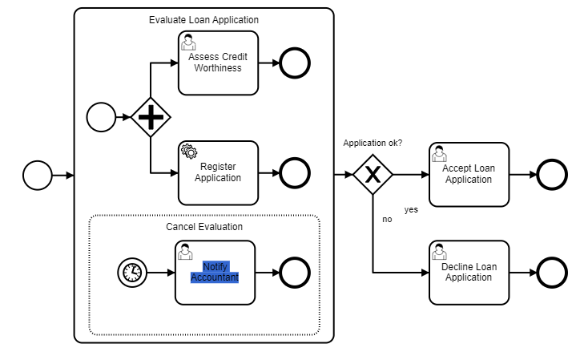

## 开头

## 修改流程实例

流程引擎提供流程实例修改API ，包括 `RuntimeService.createProcessInstanceModification(..)`或 `RuntimeService.createModification(...)`

这些API允许通过使用流式的构造器在一次调用中指定多个 修改指令

而且它还能做到：

- 在一个活动之前就开始执行
- 在离开活动的序列流上开始执行
- 取消一个正在运行的活动实例
- 取消一个给定活动的所有运行实例
- 设置变量

该api功能非常强大；

* **我们可以借助该api实现诸如任意跳转、驳回起始节点、退回上一个等各种中国式流程需求**
* 修复流程实例，其中一些步骤必须重复执行或跳过
* 将流程实例从流程定义的一个版本迁移到另一个版本
* 测试阶段：可以跳过或重复做一些活动，以便对个别流程段进行独立测试。

### 功能特性

#### 接口列表

- `startBeforeActivity(String activityId)`、`startBeforeActivity(String activityId, String ancestorActivityInstanceId)`

  通过`startBeforeActivity`在一个活动之前启动。该指令支持`asyncBefore`标志，意味着如果活动是`asyncBefore`，将创建一个job。一般来说，该指令从指定的活动开始执行流程模型，直到遇到一个等待状态

- `startAfterActivity(String activityId)`、`startAfterActivity(String activityId, String ancestorActivityInstanceId)`

  通过 `startAfterActivity` 在一个活动之后运行，意味着将从活动的下一节点开始执行。该指令不考虑活动设置的 `asyncAfter` 标志。如果有一个以上的下一节点或根本没有下一节点，则该指令将失败

- `startTransition(String transitionId)`、`startTransition(String transition, String ancestorActivityInstanceId)`

  通过 `startTransition` 启动一个过渡，就意味着在一个给定的序列流上开始执行。当有多个流出的序列流时，这可以与 `startAfterActivity` 一起使用

- `cancelActivityInstance(String activityInstanceId)`

  可以通过`cancelActivityInstance`取消一个特定的活动实例。既可以是一个活动实例，如用户任务的实例，也可以是层次结构中更高范围的实例，如子流程的实例

- `cancelTransitionInstance(String transitionInstanceId)`

  过渡实例表示即将以异步延续的形式进入/离开一个活动的执行流。一个已经创建但尚未执行的异步延续Job被表示为一个过渡实例。这些实例可以通过`cancelTransitionInstance`来取消

- `cancelAllForActivity(String activityId)`

  为了方便起见，也可以通过指令 `cancelAllForActivity` 来取消一个特定活动的所有活动和过渡实例

#### 修改变量

每一个实例化活动 (i.e., `startBeforeActivity`, `startAfterActivity`, or `startTransition`), 都可以提交流程变量。 我们提供了下面这些API：

- `setVariable(String name, Object value)`
- `setVariables(Map<String, Object> variables)`
- `setVariableLocal(String name, Object value)`
- `setVariablesLocal(Map<String, Object> variables)`

变量会在 创建了实例化的必要范围 之后，在指定活动执行之前。 这意味着，在流程引擎历史记录中，这些变量不会出现，因为它们是在执行指定活动的 “startBefore” 和 “startAfter” 指令时设置的。局部变量设置在即将执行的活动上被设置，例如，进入活动等

#### 活动实例树

流程实例修改API是基于 *活动实例* 的。一个流程实例的活动实例树可以通过以下方法来查询

```java
ActivityInstance activityInstance = runtimeService.getActivityInstance(instId);
System.out.println(activityInstance);
```

ActivityInstance是一个递归的数据结构，由上述方法调用返回的流程实例代表流程实例。ActivityInstance对象的ID可用于取消特定实例 或者 在实例化中指定父级。

接口 “ActivityInstance” 有 “getChildActivityInstances” 和 “getChildTransitionInstances” 方法，可以在活动实例树中向下查询。例如，假设活动 *Assess Credit Worthiness* 和 *Register Application* 是活动的。那么活动实例树看起来如下。

```
ProcessInstance
  Evaluate Loan Application
    Assess Credit Worthiness
    Register Application Request
```

在代码中， *Assess* 和 *Register* 可以通过对活动实例进行如下查询获取到:

```java
ProcessInstance processInstance = ...;
ActivityInstance activityInstance = runtimeService.getActivityInstance(processInstance.getId());
ActivityInstance subProcessInstance = activityInstance.getChildActivityInstances()[0];
ActivityInstance[] leafActivityInstances = subProcessInstance.getChildActivityInstances();
// leafActivityInstances has two elements; one for each activity
```

也可以直接查询一个特定活动的所有活动实例：

```java
ProcessInstance processInstance = ...;
ActivityInstance activityInstance = runtimeService.getActivityInstance(processInstance.getId());
ActivityInstance assessCreditWorthinessInstances = activityInstance.getActivityInstances("assessCreditWorthiness")[0];
```

与活动实例相比，*过渡实例* 不代表正在执行的活动，而是代表即将进入或即将离开的活动。当异步延续的job存在但尚未被执行时就是这种情况。对于一个活动实例，可以用`getChildTransitionInstances` 方法查询子过渡实例，过渡实例的API与活动实例的API类似

#### 嵌套实例化

实例化子流程中的活动时，会将子流程也实例化。

除了实例化这些父作用域外，引擎还确保在这些作用域中注册事件的订阅和job。例如，考虑如下流程：

 

启动活动 *Assess Credit Worthiness* 也为消息边界事件 *Cancelation Notice Received* 注册一个事件订阅，这样就有可能以这种方式取消子流程。

#### 父级选择

支持传入实例id，那么实例id的孩子节点将会重新实例化。

有了给定的父级活动实例 ID，在父级活动和要启动的活动之间的所有作用域将被实例化，不管它们是否已经被实例化

现在

```
ProcessInstance
  Evaluate Loan Application
    Assess Credit Worthiness
```

使用父级选择

```java
ProcessInstance processInstance = ...;
ActivityInstance activityInstanceTree = runtimeService.getActivityInstance(processInstance.getId());
runtimeService.createProcessInstanceModification(activityInstanceTree.getId())
  .startBeforeActivity("assessCreditWorthiness", processInstance.getId())
  .execute();
```

参数`ancestorActivityInstanceId`取当前活动的活动实例的id，该实例属于要启动的活动的 *父级* 活动。如果一个活动包含要启动的活动（无论是直接的，还是间接的，中间是否有其他活动），它就是一个有效的父级

产生的活动实例树如下所示

```
ProcessInstance
  Evaluate Loan Application
    Assess Credit Worthiness
  Evaluate Loan Application
    Assess Credit Worthiness
```

#### 取消传递

取消一个实例，如果父级下的所有的实例被取消了，那么这个父级也会被取消

注意，如果取消了所有的活动实例（此时不会把流程实例取消），再start一个活动，最终会在这个流程实例下创建start活动实例

#### 执行顺序

衔接上一个顺序，如果子流程内的活动先取消，再启动内部的活动，会重新创建子流程；

如果时先启动内部活动，在取消内部活动，则不会重新创建子流程

修改指令总是按照提交的顺序执行。因此，以不同的顺序执行相同的指令会产生不同的效果。考虑一下下面的活动实例树。

```
ProcessInstance
  Evaluate Loan Application
    Assess Credit Worthiness
```

假设你的任务是取消 *Assess Credit Worthiness* 实例并开始 *Register Application* 的活动。这两条指令有两种顺序。要么先执行取消再实例化，要么先实例化再取消。在前一种情况下，代码看起来如下：

```java
ProcessInstance processInstance = ...;
runtimeService.createProcessInstanceModification(processInstance.getId())
  .cancelAllForActivity("assesCreditWorthiness")
  .startBeforeActivity("registerApplication")
  .execute();
```

由于取消传播，子流程实例在执行取消指令时被取消，只是在执行实例化指令时被重新实例化。这意味着，在修改被执行后，会产生一个不同的 Evaluate Loan Application 子流程的实例。任何与前一个实例相关的实体都已经被移除，例如变量或事件订阅。

与此相反，考虑先执行实例化的情况：

```java
ProcessInstance processInstance = ...;
runtimeService.createProcessInstanceModification(processInstance.getId())
  .startBeforeActivity("registerApplication")
  .cancelAllForActivity("assesCreditWorthiness")
  .execute();
```

由于在实例化过程中的默认父级选择，以及在这种情况下取消不会传播到子流程实例，子流程实例在修改前后是一样的。像变量和事件订阅这样的相关实体会被保留下来。

#### 中断活动

中断活动可以同时创建

如果准备启动的活动存在中断或取消行为，流程实例的修改也会触发这些行为。尤其是，启动一个中断的边界事件或中断的事件子流程将取消／中断其他活动。考虑一下下面的流程；

 

假设活动 *Assess Credit Worthiness* 目前是活动的。事件子流程可以用以下代码启动。

```java
ProcessInstance processInstance = ...;
runtimeService.createProcessInstanceModification(processInstance.getId())
  .startBeforeActivity("cancelEvaluation")
  .execute();
```

由于 *Cancel Evaluation* 子流程的启动事件是中断的，它将取消 *Assess Credit Worthiness* 的运行实例。当事件子流程的启动事件通过以下方式启动时，也会发生同样的情况：

```java
ProcessInstance processInstance = ...;
runtimeService.createProcessInstanceModification(processInstance.getId())
  .startBeforeActivity("eventSubProcessStartEvent")
  .execute();
```

然而，当位于中断事件子流程中的活动被直接启动时，中断不会被执行。思考一下下面的代码：

```java
ProcessInstance processInstance = ...;
runtimeService.createProcessInstanceModification(processInstance.getId())
  .startBeforeActivity("notifyAccountant")
  .execute();
```

由此产生的活动实例树将是：

```
ProcessInstance
  Evaluate Loan Application
    Assess Credit Worthiness
    Cancel Evaluation
      Notify Accountant
```

#### 多实例

多实例的子实例可以新增启动

也可以启动父级多实例活动

对于指定变量名，设置list方式的多实例节点，直接跳转子实例可能会有报错，分析如下：

* 串行多实例

  （直接回到子执行会报错，父执行需要设置审批人变量， 但是可以直接设置myAssigneeVarName、nrOfCompletedInstances、myAssigneeList_1fylv2e等local变量，他们的作用域一样，注意第一次modify的时候不会执行myAssigneeVarName的设置，即behiver的执行，需要手动设置，后面complete的时候会从List中获取）

  报错的原因为，原生代码就不支持：

  ```
  /**
  
   \* Cannot create more than inner instance in a sequential MI construct
  
   */
  
  protected boolean supportsConcurrentChildInstantiation(ScopeImpl flowScope) {
  
    CoreActivityBehavior<?> behavior = flowScope.getActivityBehavior();
  
    return behavior == null || !(behavior instanceof SequentialMultiInstanceActivityBehavior);
  
  }
  ```

  代码记录如下：

  //如果没有活动实例，直接进入子活动会成功，但是这里虽然执行了mutli执行监听器(生成了list审批人集合也没用,myAssigneeVarName没有设置进去)，但是并没有走mutli相关的beahiver，所以不会生成muti正常需要的本地变量，需要手动提交本地变量myAssigneeVarName

  //**如果有子活动，直接进入子活动会报错，因为不符合串行多实例的语义**

  **正常情况串行多实例，会新生成一条串行多实例执行，还有一个整体的父执行。新生成的执行会关联act_hi_actinst中multiInstanceBody和actid的exc_id自动，这两个是一样的**

  **当执行了startBeforeActivity（multi activity）后：**

  * 针对前面执行会给它生成一个父执行，更新parent_id为新生成的执行，新生成的执行的parent_id为最顶级的了
  * 当前操作也会生成一对父子执行
  * 当前操作的act_hi_actinst中multiInstanceBody和actid关联操作的子exc_id，之前的act_hi_actinst关联的exe_id不变，因为之前的执行的parent_id已经修改为新生成的执行了

  **总的来说，就是给之前的执行找了个父亲，本次操作会生成父子执行，和并行多实例类似多了一层，但是act_hi_actinst中关联的都是子执行**

  //注意这里传递的local变量的作用域为父执行，而一些myAssigneeVarName、loopCounter、myAssigneeList_1fylv2e、nrOfActiveInstances、nrOfInstances等变量的作用域为子执行

  /**

   \* └── test_back_up:2:e297b27d-e1a1-11ed-87ee-005056be26d2=>08359c9e-e3f4-11ed-90a3-049226e08e36

   \*     ├── Activity_1fylv2e#multiInstanceBody=>2c43e44d-e3f6-11ed-9f49-049226e08e36

   \*     │   └── Activity_1fylv2e=>Activity_1fylv2e:2c456afd-e3f6-11ed-9f49-049226e08e36

   \*     └── Activity_1fylv2e#multiInstanceBody=>084b95bc-e3f4-11ed-90a3-049226e08e36

   \*         └── Activity_1fylv2e=>Activity_1fylv2e:084be3ec-e3f4-11ed-90a3-049226e08e36

   */

* 并行多实例

  **如果执行为空，和串行多实例一样，不会执行beahiver中的设置**myAssigneeVarName、loopCounter等操作，会直接使用传递的local变量myAssigneeVarName，并且动态生成nrOfInstances的值。

  并行多实例的完成状态由条件或默认代码决定，不由总数nrOfInstances决定，默认情况只要所有执行结束就会完成。

  camunda关于modifyInstacne的bug。新启动子实例会增加nrOfInstances的值，cancels子实例并不不会减少nrOfInstances值，这会造成完成条件依赖此变量会有不可预知的错误。

#### 异步执行

你可以异步地执行单个流程实例的修改 指令与同步修改相同，流式语法如下：

```java
Batch modificationBatch = runtimeService.createProcessInstanceModification(processInstanceId)
        .cancelActivityInstance("exampleActivityId:1")
        .startBeforeActivity("exampleActivityId:2")
        .executeAsync();
```

这将创建一个修改的batch，然后以异步方式执行。 在执行单个流程实例的异步修改时，不支持修改变量。

#### 修改多个流程实例

指定一个流程定义，可以操作多个流程实例的修改。

同步执行的一个例子：

```java
runtimeService.createModification("exampleProcessDefinitionId")
  .cancelAllForActivity("exampleActivityId:1")
  .startBeforeActivity("exampleActivityId:2")
  .processInstanceIds("processInstanceId:1", "processInstanceId:2")
  .execute();
```

异步执行的一个例子：

```java
Batch batch = runtimeService.createModification("exampleProcessDefinitionId")
  .cancelAllForActivity("exampleActivityId:1")
  .startBeforeActivity("exampleActivityId:2")
  .processInstanceIds("processInstanceId:1", "processInstanceId:2", "processInstanceId:100")
  .executeAsync();
```

#### 监听器、输入输出映射

可以再execute指定是否需要跳过监听器或者输入输出。当修改是在一个无法访问所涉及的流程应用部署及其包含的类的系统上时，这可能是有用的。可以通过使用修改构建器的方法 `execute(boolean skipCustomListeners, boolean skipIoMappings)` 跳过监听器和输入输出映射的调用；

### 实际应用

#### 驳回功能

##### 设计思路

* 驳回、撤回

  含义为取消所有的运行任务实例，移动到开始节点，从头再来，此做法不会造成歧义

* 驳回修改

  取消当前任务的运行实例，移动到开始节点，完成任务时，直接跳转回当时取消的节点；

  * 串行多实例

    串行多实例驳回没有必要回到当前的实例（该方案比较复杂，需要记录活动实例id,然后设置之前的多实例的变量loopcounter和list变量来恢复）

    **注意：直接回到子执行会报错，父执行需要设置审批人变量， 但是可以直接设置myAssigneeVarName、nrOfCompletedInstances、myAssigneeList_1fylv2e等local变量，他们的作用域一样，注意第一次modify的时候不会执行myAssigneeVarName的设置，即behiver的执行，需要手动设置，后面complete的时候会从List中获取**

  * 并行多实例驳回回跳需要注意类型：

    * 单人并行

      删除了会取消整个多实例

    * 多人并行

      全部通过才行，恢复过程需要考虑有的人已经通过（需要记录下来，可以查actinstance表查到之前的list，删除已完成的usrtask assginee，然后重新设置这list即可），活动数、总数作用域在父级、loopcounter，比较难实现，还不及全部取消然后全部重新来，可以只添加没完成的，但是这个不适用于自定义条件设置（自定义比例））

    * 多人任意

      删除了会取消整个多实例

**代码示例：**

#### 任意跳转

任意跳转（有限制，只能跳转到同级节点，否则会有不可预测的错误，但是如果都是排他网关的）

​	取消当前活动实例

​	跳转到目标的活动实例

### 注意事项

流程实例修改是一个非常强大的工具，允许随意启动和取消活动。因此，很容易产生正常流程执行所不能达到的情况。假设有以下流程模型 

 

假设活动 *Decline Loan Application* 是活动的。通过修改，活动 *Assess Credit Worthiness* 可以被启动。在该活动完成后，执行被卡在加入的并行网关上，因为没有令牌会从另一个输入流中流入使流程继续下去。这是流程实例不能继续执行的最明显的情况之一，当然还有许多其他情况，取决于具体的流程模型。

流程引擎是 **不能** 检测到修改是否会产生这样的结果。所以这取决于这个 API 的用户，他们要确保所做的修改不会使流程实例处于不希望的状态。然而如果出现这个情况，也可以使用流程实例的修改API也是修复:-)

## 重启&恢复实例

在流程实例终止后，其历史数据仍然存在，并且可以被访问以重启流程实例，前提是历史级别被设置为FULL。 例如，当流程没有以期望的方式终止时，重启流程实例是有用的。这个API的使用的其他可能情况有：

- 恢复被错误地取消的流程实例的到最后状态
- 由于错误路由导致流程实例终止后，重启流程实例

为了执行这样的操作，流程引擎提供了 *流程实例重启API* `RuntimeService.restartProcessInstances(..)` 。该API允许通过使用流式构建器在一次调用中指定多个实例化指令

**从技术上讲，创建的是一个新的流程实例。请注意: 历史流程和重启的流程实例的id是不同的**

该API的功能特性有：

* 流程实例列表

  ```
  ProcessDefinition processDefinition = ...;
  List<String> processInstanceIds = ...;
  
  runtimeService.restartProcessInstances(processDefinition.getId())
    .startBeforeActivity("activity")
    .processInstanceIds(processInstanceIds)
    .execute();
  ```

* 历史流程实例查询

  ```
  runtimeService.restartProcessInstances(processDefinition.getId())
    .startBeforeActivity("activity")
    .historicProcessInstanceQuery(historicProcessInstanceQuery)
    .execute();
  ```

* 可跳过监听器&输入输出映射

* 使用最初的变量

* 忽略businessKey

* 同步&异步执行

## 拓扑排序

bpmn图为一种有向有环图，如何遍历这个有向图呢？

使用该功能常见的业务场景有：

* 获取接下来的审批节点信息
* 预测未来所有的节点信息（拓扑遍历）

## Job执行器

## 流程迁移

## 历史数据处理

## 主子流程

目前多实例子流程，如果多个子流程、所有子流程作废，父流程会随之作废，如果部分子流程作废，其中有子流程完成，父流程会继续流转

## 业务表单

流程节点和业务表单字段打通

## 流程事务

### 等待状态

我们谈到了作为事务边界的等待状态，在这里，流程状态被存储到数据库，线程返回到客户端，事务被提交。以下的BPMN元素始终是等待状态

 

**PS：异步延续也可以为其他任务添加事务边界**

### 事务边界

从一个稳定状态到另一个稳定状态的转换总是单一事务的一部分，这意味着它作为一个整体成功，或者在执行过程中发生任何类型的异常时被回滚。这在下面的例子中得到了说明：

 

我们看到一个BPMN流程的片段，有一个用户任务、一个服务任务和一个定时器事件。计时器事件标志着下一个等待状态。因此，完成用户任务和验证地址是同一个工作单元的一部分，所以它应该原子式地成功或失败。这意味着，如果服务任务抛出一个异常，我们要回滚当前的事务，这样执行就会追踪到用户任务，并且用户任务仍然存在于数据库中。这也是流程引擎的默认行为。在 **1** ，一个应用程序或客户端线程完成了任务。在同一个线程中，引擎运行时现在正在执行服务任务，并一直推进到定时器事件的等待状态（ **2** ）。然后，它将控制权返回给调用者（ **3** ），可能会提交该事务（如果它是由引擎启动的）。

### 异步延续

#### 什么是异步延续


 

任务的完成过程：

* 流程进入到activity时，"TAKE"监听器就会被调用。
* activity自己调用"START"监听器。
* activity的行为将会被执行。
* 当activiy的行为执行完成后。"END"监听器将会被activity调用。
* 流程离开activity时，"TAKE"监听器会被调用

**关于Asynchronous Continuations 理解：**

* 一个activity执行过程中，上述的5个步骤，都是丢给job executor线程池执行的。但是都是连续的，都是上个监听器执行完成后，下一个监听器又开始执行，他们虽然是异步执行的，但是都是连续的，理解起来，就是针对同一个activity的同步操作。
* 还有一种情况就是如下图所示这样。流程定义图上有多个节点。当taskService.complete(id)执行完成后，相关数据其实已经持久化到数据中了。后续的Generate invoice 和 Send invoice to customer都是在taskService.complete(id)执行之后，必须要执行的，而且这个异步操作一定是上一个事务的延续。因为上一个事务已经提交了，数据库持久化了数据，因此能够保证后续的事务一定是没有任何问题的

异步延续与事务边界直接相关：把异步延续放在一个活动之前或之后，在该活动之前或之后创建一个事务边界：

 

#### 为何使用异步延续

 

我们正在完成用户任务，生成发票，然后将发票发送给客户。可以说，发票的生成不属于同一个工作单元：如果生成发票失败，我们不希望回滚用户任务的完成。 理想情况下，流程引擎将完成用户任务【1】，提交事务并将控制权返回给调用的应用程序【2】，在一个后台线程【3】中，它将生成发票。 这正是异步延续提供的行为：它们允许我们在流程中确定事务边界的范围

因此：

- 就是上一个异步中的事务一定是发生在下一个事务之前的。并且，上一个事务是提交了的，数据库持久化了数据。把业务逻辑丢到异步中执行，但是前后保证了异步的延续性。
- **异步延续性，一定是Job executor执行的**

#### 配置

* 使用 `camunda:asyncBefore` 扩展属性可以启用活动前的异步延续
* 使用`camunda:asyncAfter`扩展属性启用一个活动后的异步延续

流程实例的异步实例化是使用流程级启动事件上的camunda:asyncBefore扩展属性启用的。 在实例化时，流程实例将被创建并持久化在数据库中，但执行将被推迟。另外，执行监听器将不会被同步调用。这在很多情况下是有帮助的，例如，在异构集群中执行监听器类在实例化流程的节点上不可用

### 异常回滚

 

如果出现未处理的异常，当前事务会被回滚，流程实例回滚到最后的等待状态（保存点）

**方案优势：**

- 在测试案例中，你知道方法调用后引擎的确切状态，这使得对流程状态或服务调用结果的断言变得容易。
- 在生产代码中也是如此；如果需要的话，允许你使用同步逻辑，例如因为你想在前端呈现一个同步的用户提示。
- 执行是普通的Java计算，在优化性能方面非常有效。
- 如果你需要不同的行为，你可以随时切换到 ‘asyncBefore/asyncAfter=true’

**方案缺陷：**

- 在出现异常的情况下，状态会回滚到流程实例的最后一个持久性等待状态。这甚至可能意味着流程实例将永远不会被创建! 你不能轻易地将异常追溯到流程中导致异常的节点。你必须在客户端处理这个异常。

- 并行的流程路径不是以Java线程的方式并行执行的，不同的路径是按顺序执行的，因为我们只有并使用一个线程。

- 计时器在事务提交到数据库之前不能启动。计时器在后面会有更详细的解释，但它们是由我们唯一使用单独线程的活动部分：Job执行器。它们在一个自己的线程中运行，从数据库中接收到期的计时器。然而，在数据库中，计时器在当前事务可见之前是不可见的。因此，下面的计时器将永远不会启动：

   

### 事务上下文

当一个流程引擎命令被执行时，引擎将创建一个流程引擎上下文。Context缓存了数据库实体，因此对同一实体的多次操作不会导致多次数据库查询。这也意味着对这些实体的改变会被累积起来，并在命令返回后立即被刷新到数据库。然而，应该注意的是，当前的事务可能会在以后的时间提交。

如果一个流程引擎命令被嵌套到另一个命令中，即一个命令在另一个命令中执行，默认行为是重复使用现有的流程引擎上下文。这意味着嵌套的命令将可以访问相同的缓存实体和对它们所做的更改。

当嵌套的命令要在一个新的事务中执行时，需要为其执行创建一个新的流程引擎上下文。在这种情况下，嵌套命令将为数据库实体使用一个新的缓存，独立于先前（外部）命令缓存。这意味着，一个命令的缓存中的变化对另一个命令是不可见的，反之亦然。当嵌套命令返回时，这些变化被刷入数据库，与外部命令的流程引擎上下文无关。

`ProcessEngineContext` 工具类可以用来向流程引擎声明，需要创建一个新的流程引擎上下文，以便在一个新的事务中分离嵌套流程引擎命令中的数据库操作。下面的`Java`代码例子显示了如何使用该类：

```
try {

  // declare new Process Engine Context
  ProcessEngineContext.requiresNew();
  
  // call engine APIs
  execution.getProcessEngineServices()
    .getRuntimeService()
    .startProcessInstanceByKey("EXAMPLE_PROCESS");

} finally {
  // clear declaration for new Process Engine Context
  ProcessEngineContext.clear();
}
```

### 乐观锁

Camunda引擎可以用于多线程的应用中。在这样的环境中，当多个线程与流程引擎并发互动时，可能会发生这些线程试图对相同的数据做改变。例如：两个线程试图在同一时间（并发地）完成同一个用户任务。这种情况是一种冲突：任务只能完成一次。

Camunda引擎使用一种众所周知的技术 “乐观锁”（或乐观并发控制）来检测和解决这种情况。

### 乐观锁概念

乐观锁定（也称为乐观并发控制）是一种并发控制的方法，在基于事务的系统中使用。在数据被读取的频率高于数据被改变的频率的情况下，乐观锁是最有效的。许多线程可以在同一时间读取相同的数据对象而不互相排斥。在多个线程试图同时改变同一数据对象的情况下，通过检测冲突和防止更新来确保一致性。如果检测到这样的冲突，就可以确保只有一个更新成功，其他的都失败

### 案例

假设我们有一个数据库表，其条目如下：

 

上表显示的是持有用户数据的单行。该用户有一个唯一的ID（主键），一个版本，一个名字和一个当前地址。

我们现在设想这样一个情况，有两个事务试图更新这个条目，一个试图改变地址，另一个试图删除用户。预期的行为是，其中一个事务成功，另一个事务被中止，并出现一个错误，表明检测到并发冲突。然后，用户可以根据数据的最新状态决定是否重试该事务

 

正如你在上图中看到的，`Transaction 1` 读取用户数据，对数据做一些处理：删除用户，然后提交。 `Transaction 2` 在同一时间启动，读取相同的用户数据，并对数据进行处理。当 `Transaction 2` 试图更新用户地址时，发现有冲突（因为 `Transaction 1` 已经删除了用户）。

检测到冲突是因为当 `Transaction 2` 执行更新时，用户数据的当前状态被读取。在那个时候，并发的 `Transaction 1` 已经标记了要删除的行。数据库现在等待 `Transaction 1` 的结束。在它结束后，`Transaction 2` 可以继续执行。在这个时候，该行已经不存在了，更新成功，但是报告说已经改变了`0`行。应用程序可以对此做出反应，回滚`Transaction 2`，以防止该交易的其他更改生效。

应用程序（或使用它的用户）可以进一步决定是否应该重试 `Transaction 2`。在我们的例子中，该事务将不会找到用户数据，并报告说用户已被删除。

### 乐观锁应用

## 其它

### 排它网关效果

按顺序依次校验，命中了就直接走，没命中就下一个，如果命中需要变量则必须要要有变量

不要网关符号，则类似于包容网关，每个线条都会校验，命中的都会通过