## 1. Spring发展
&emsp;&emsp;Rod Johnson是一个音乐家，2002的时候，当时觉得java EE太臃肿，想开发一个更加轻量级的框架来帮助开发，为当时开发界带来春天。经过自己的努力，2004年spring1.0发布，并且收到了大家广泛欢迎，2006发布了2.0和2.5，2007这个spring项目获得了1000万美金的融资。2009年被VM收购。2009年发布3.0，2013年VM成立了Pivotal公司来研发spring。后来4.0和5.0陆续发布，直至今日。  
&emsp;&emsp;另外，Springboot、springcloud、tomcat、redis、rabbitmq、Cloud Foundry、Greenplum、GemFire均为Pivotal发布的。

## 2. Spring的作用
&emsp;&emsp;spring有两大主题，第一个是控制反转及依赖注入，这个比较容易理解，第二个就是aop面向切面编程。
控制反转其实是研究的是class之间的横向关系。纵向关系如，从子类到父类其实是继承，从父类到子类就叫做泛化。spring框架也是研究这个class之间的横向关系,但是它的研究不是研究关联的类型，而是研究依赖的关系。  
&emsp;&emsp;Java中的类需要依赖其它class的功能，就需要将其它的对象注入到自己的变量之中，我们可以将对象通过set方法或者构造器直接赋值，但是这种方式是强耦合的。我们如何非常方便的控制注入的对象，来实现不同的功能呢？Spring框架就可以帮我们来控制注入对象，控制反转的意思就是把控制权交给spring，开发者只需要通过配置就可以注入相应的对象了。  
&emsp;&emsp;Spring还会对bean通过动态代理的技术来做功能的增强。比如可以控制事务、打日志等待。具体的原理我们后面再讲。
## 3. Spring模块划分
* Core，bean、context、aop
* Dataaccess，jdbc、orm、tx
* Springmvc，web
* Testing，mock、testcontext
* Integration，remoteing、ws（webservice）、jms
* Languages，groovy、kotlin
## 4. Spring原理
### 4.1. Spring bean  
Spring的ioc容器就是生产bean对象的工厂
* BeanFactory接口，实现类是XmlBeanFactory，需要根据applicationConttex.xml的配置文件来创建bean
* ApplicationContext接口是上面的beanfactory的一个子接口.所以我们一般在Java工程是使用这个ApplicationContext。
* WebApplicationContext，是专用于web工程的,实际上它是继承了ApplicationContext,然后又针对于web工程的一些特殊的特点做了一些功能，它的实现类是XmlWebApplicationContext
* ApplicationContext是根据反射来创建bean对象的。  

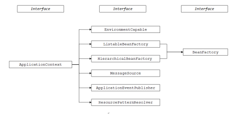
图片来自网络  

#### 4.1.1 Spring bean的生命周期  
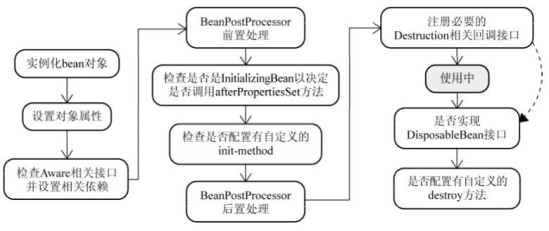  
* 创建bean对象，被包装到BeanWrapper之中，暂时未注入依赖
* 设置属性，依赖注入，根据BeanDefinition通过BeanWrapper提供的接口完成依赖关系设置。
* 注入Aware接口，检测该对象是否实现了xxxAware（上下文、名字等）接口，并将相关的xxxAware实例注入给bean
* BeanPostProcessor，自定义的一些处理
* InitializingBean(afterPropertiesSet)与init-method
* DisposableBean和destroy-method，bean销毁前执行指定的逻辑  

代码逻辑如下：  
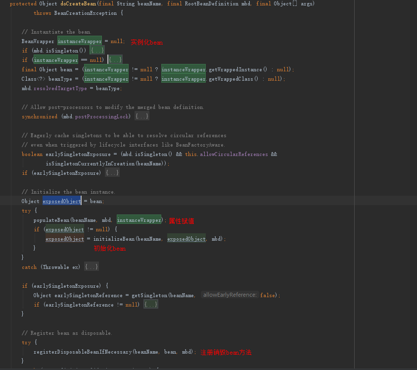  

#### 4.1.2 Spring bean的配置  
* xml的方式，xsd文件中定义了对bean配置格式合法性的解释，xml配置文件中，Spring1.0采用dtd定义XML,Spring2.0以后改用Schema定义XML  
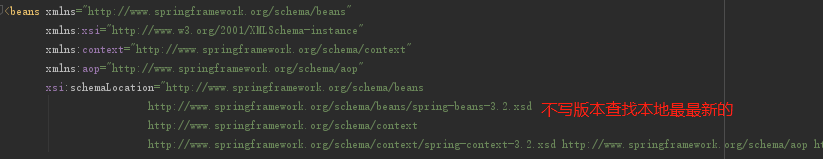  
* 注解
  
还有哪些配置方式？  
还可以基于java方法使用@bean和@configration注解。  

#### 4.1.3 Spring bean循环依赖的问题  
不能解决构造器注入产生的循环依赖问题。  
Spring是通过递归的方式获取目标bean及其所依赖的bean的；  
Spring实例化一个bean的时候，是分两步进行的，首先实例化目标bean，然后为其注入属性。   
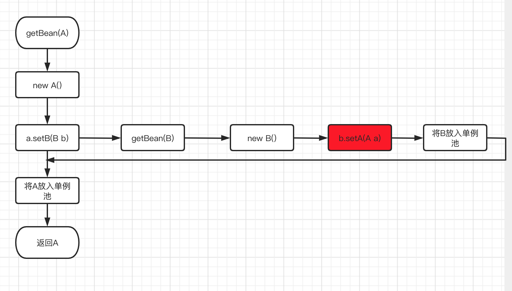
* 一级缓存无法解决循环依赖问题，因为b实例化的时候a还没有将自己放入到单例池中。
* 于是建立一个提前暴露的二级缓存，实例化后先放到二级缓存中
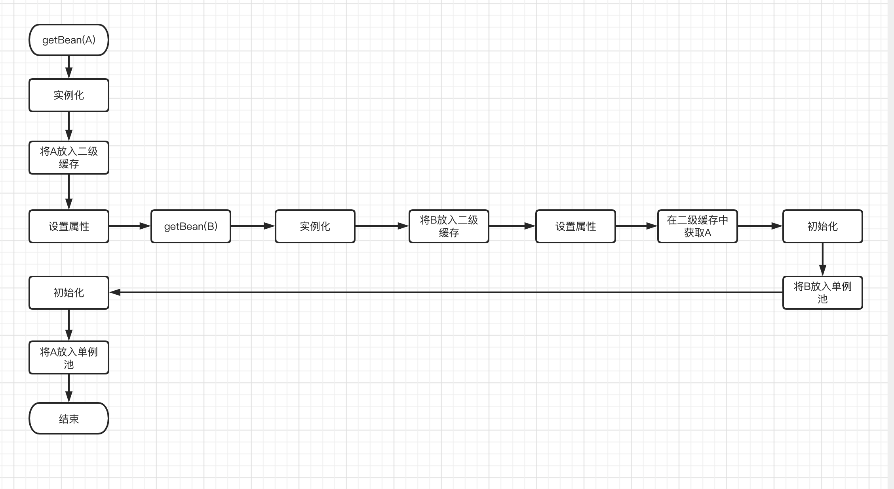
* 以上的方案看起来很美好，但是spring中有些是aop代理对象，从二级缓存中获取的是原始对象，但是需要注入代理对象引用，这怎么办呢，引入singletonFactories 三级缓存。如果发生了循环依赖，则提前进行aop  
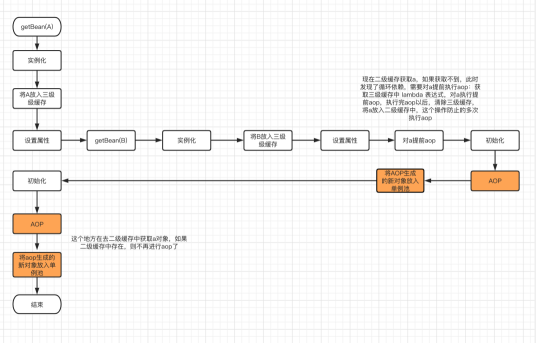  
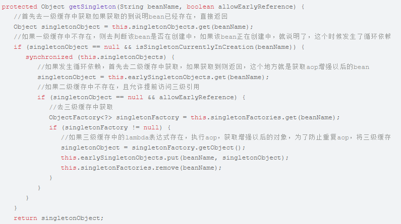  

参考：https://xie.infoq.cn/article/e3b46dc2c0125ab812f9aa977  

### 4.2. Spring aop  
#### 4.2.1. 动态代理模式
* 增强类依赖目标对象，实现Invoktionhanler接口，实现Invoke方法（增强后，可执行目标类指定方法），相当于是一个工具类（增强和反射调用指定方法）
* 代理类实现目标类接口，代理类的每一个业务方法调用增强类的invoke方法（传入方法名称就行）
如：	LogHandler logHandler=new LogHandler();//增强类对象创建
		logHandler.setTarget(target); //目标类对象注入到增强类对象
Object sproxyObj=new StringProcessingProxy(logHandler);//创建代理类对象，注入增强类对象
这样返回代理对象了。和代理对象一样的使用了。
* b中的代理对象创建需要代理类实现目标接口，然后调用invoke方法，java虚拟机提供了动态创建代理对象的方法。如下的方法创建代理对象，传入业务接口和增强实现对象。
newProxyInstance(ClassLoader loader, Class<?>[] interfaces, InvocationHandler h) ，传入invocation的实现类，和目标接口，就可以实现动态代理了。    
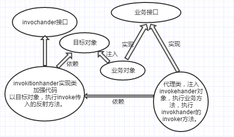  
&emsp;&emsp;spring通过jdkproxy产生接口类的代理对象，通过cglib产生非接口类的代理对象。  
#### 4.2.2. Aop编程
* 字节码增强和反射的区别?  
  字节码增强是通过修改字节码的方式达到增强效果的技术    
  反射是通过class对象创建对象。
* 字节码技术的分类  
  图片来自网络：  
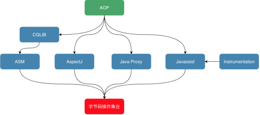  
  * Javassist强调源代码层次操作字节码的框架
  * asm字节码指令操作字节码，cglib基于asm
  * Instrument提供了入口，可以再class加载或者运行时修改字节码
  * javaproxy在运行期间更具接口定义和增强代码生成代理对象的字节码保存值硬盘
  * aspectj时再java编译成class的时候增强，编译增强需要执行ajc命令  

### 4.3. Spring message
待研究  

## 5. springboot  
### 5.1. Springboot背景
Spring的配置越来越复杂，版本越来越多，不符合最初的设计初衷。需要一种技术来简化spring的使用，于是springboot诞生了。
### 5.2. Springboot原理
spring的自动装配的原理主要来自于启动类的@SpringBootApplication这个注解。而这个注解主要有三个子注解起作用。  
* @SpringBootConfiguration
    基于Configuration注解来实现配置
* @EnableAutoConfiguration  
  用来开启自动配置
  其中包含@Import(AutoConfigurationImportSelector.class)和@AutoConfigurationPackage这两个注解
* @ComponentScan,扫描当前类下的包。  
  
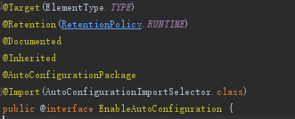    
@AutoConfigurationPackage注解    
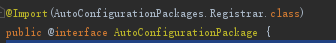    
@Import(AutoConfigurationImportSelector.class)    
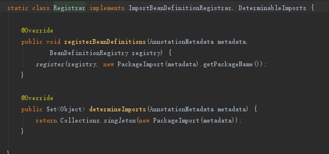  
AutoConfigurationImportSelector的核心方法  
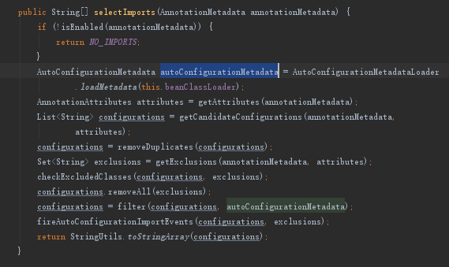  
从spirngfactories中获取所有的配置信息  
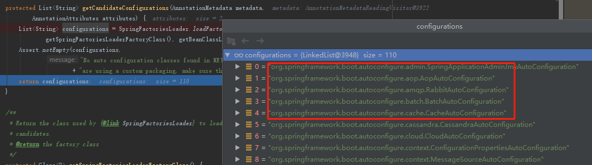  
过滤掉没有引入的配置  
  
AutoConfigurationImportFilter的match()方法，由OnClassCondition实现，即通过查找有没有导入某些jar包，通过新建一个布尔类型数组，来标记没有导入jar的AutoConfiguration过滤掉  
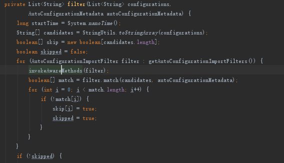  
过滤过程  
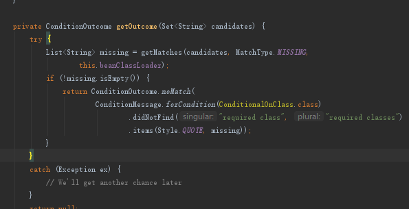  
ClassNameFilter.MISSING.matches(className, classLoader) 里面的逻辑简单，就是使用了 Class.forName(className)，，只要 maven dependency 引入了目标的class就能找到。  
参考（https://www.cnblogs.com/christmad/p/11729954.html）  

### 5.3. Springboot的FatJar技术
 FatJar 技术将所有的依赖 jar 包一起BOOT-INF/lib 目录中，项目的 class BOOT-INF/classes 目录中，然后定义了自己类加载的class，用于加载class  
 Springboot打包后目录结构为：  
 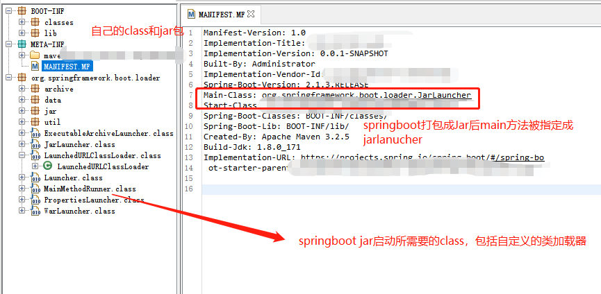  
 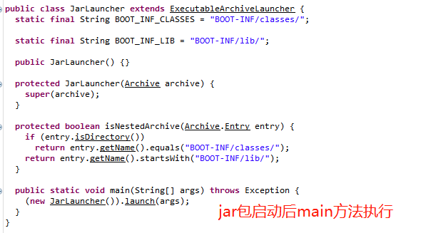  
 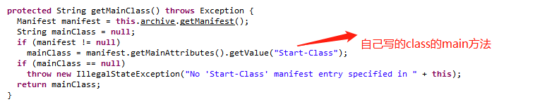  
 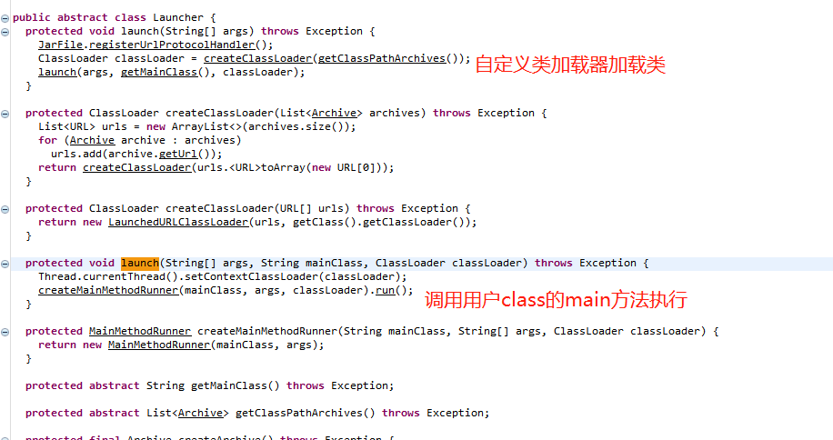    

## 6. Spring与数据库
### 6.1. Jdbc
&emsp;&emsp;JDBC是java与数据库交互的接口定义规范。  
&emsp;&emsp;Jdbc有四大元素：驱动、连接、语句、结果集  
&emsp;&emsp;各自的数据库管理系统提供了具体的jdbc的实现，所以访问数据库的框架只需要面对jdbc的接口就可以了。目前访问数据库的java规范又加上了datasource。一般数据库的厂商提供了jdbc的实现，框架开发者提供datasource的实现。  
### 6.2. 数据库的连接池
* C3P0，可以自动回收空闲连接。
* DBCP，Apache独立的组件，不能自动回收空闲连接
* Druid，增加了监控的功能
* Hikari  

&emsp;&emsp;为什么需要数据库连接池，因为数据库的资源是有限的，并且创建连接需要消耗相对较大的资源。连接池的池化技术，使得连接可以复用，不需要重新创建。并且Connection.close()的是时候不是取关闭连接，而是放到连接池中保存。

### 6.3. ORM框架
对象关系映射框架，提供操作数据库的框架。
#### 6.3.1. Hibernate
它对jdbc进行了封装，建立了数据库表和java对象的关系，以供使用者能够使用对象的思维来操作数据库，hibernate自动生成sql语句然后执行。
####  6.3.2. Mybatis
半自动化生成sql语句执行。使用xml或者注解的方式配置对象映射关系。mybaits需要自行定义sql语句

#### 6.3.3. Jpa
是一个java自带的一系列接口和抽象类组成的组件规范，它的总体思想与hibernate和mybatis一致，但是它不是框架。Java自身没有对其实现，hibernate是按照jpa的思想规范设计的，但是mybatis并没有完全按照jpa
#### 6.3.4. Spring ORM
spring整合orm框架，可以整合mybatis、hibernate等框架

### 6.4.应用的事务
使用spring的aop技术可以帮助开发者代码物无侵入轻松的开启和提交事务。
#### 6.4.1.Spring的事务机制    

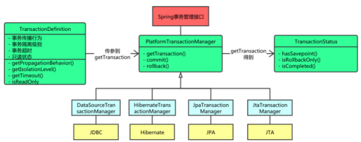  
Spring对事务主要用到了事务管理器、AOP
* 通过事务管理器获取事务的定义，其中包括事务的隔离级别
* 使用aop
#### 6.4.2.Spring事务的传播性
* Propagation.REQUIRED，如果有事务则加入事务，没就创建
* Propagation.NOT_SUPPORTED，方法不开启事务
* Propagation.REQUIREDS_NEW，无论如何都创建一个新的事务，原来的事务挂起，这个事务执行完毕后，再执行原来的事务
* Propagation.MANDATORY，必须在一个已有的事务中执行,否则抛出异常
* Propagation.NEVER，不能在一个事务中执行,就是当前必须没有事务,否则抛出异常
* Propagation.SUPPORTS，若当前存在事务,则在事务中运行.否则以非事务形式运行
* Propagation.NESTED，如果当前存在事务,则运行在一个嵌套的事务中,如果当前没有事务,则按照REQUIRED属性执行.它只对DataSourceTransactionManager事务管理器起效。

#### 6.4.3.事务的隔离级别
* READ_UNCOMMITTED(未提交读取): 允许脏读取，但不允许更新丢失。
* READ_COMMITTED(提交读取) :解决脏读，存在不可重复读与幻读。
* REPEATABLE_READ(可重复读取): 解决脏读、不可重复读，存在幻读。
* SERIALIZABLE(序列化): 不存在并发问题，最严格隔离级别，但并不推荐。  

  
注：Mysql默认是可重复读、oracle默认是提交读取
### 6.5.Springboot如何整合orm框架

### 6.6.应用使用数据库经验总结
* 多数据源
* 数据库连接池，如何配置，重连有什么作用
* ORM编写sql有什么要注意的地方
* Idea反向工程数据库设计插件

## 7. 思考
 