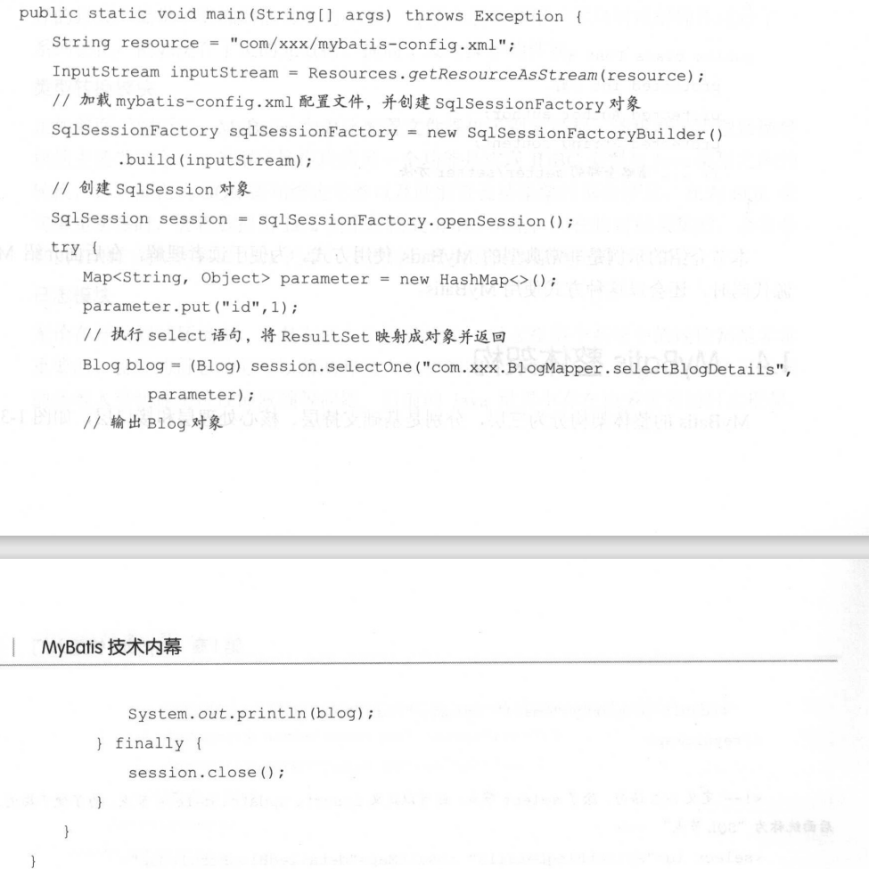
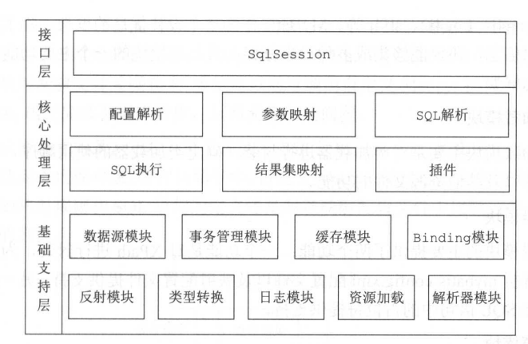
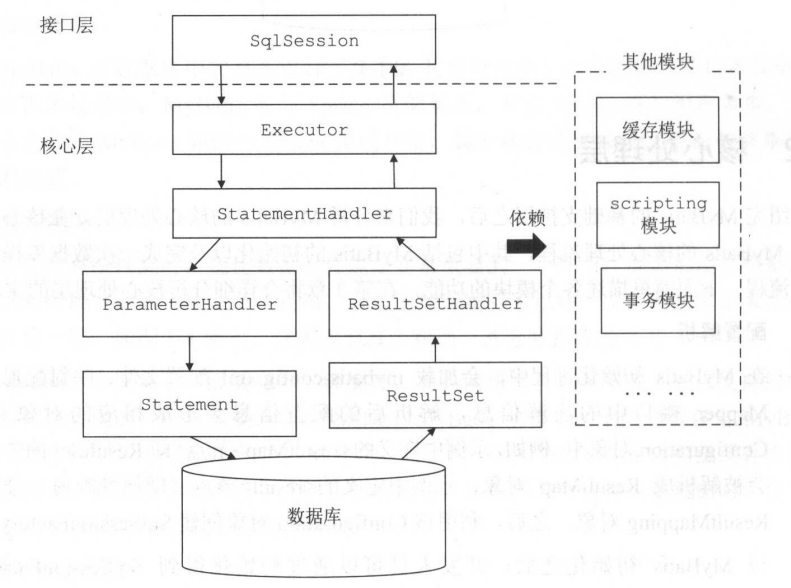

## orm框架

### hibernate

### jpa

### spring jdbc

### mybatis

## mybatis

### 示例

 

### 整体架构

 

### 基础支持层

#### 反射模块

#### 类型转换模块

#### 日志模块

#### 资源加载模块

#### 解析器模块

#### 数据源模块

#### 事务管理模块

#### 缓存模块

#### Binding模块

### 核心处理层

 

#### 配置解析

在 MyBatis初始化过程中，会加载mybatis-config.xml配置文件、映射配置文件以及Mapper接口中的注解信息，解析后的配置信息会形成相应的对象并保存到Configuration对象中。例如,示例中定义的<resultMap>节点(即 ResultSet 的映射规则)会被解析成 ResultMap对象;示例中定义的<result>节点（即属性映射）会被解析成ResultMapping对象。之后，利用该Configuration对象创建SqISessionFactory对象。待MyBatis初始化之后，开发人员可以通过初始化得到SqISessionFactory创建SqlSession对象并完成数据库操作。

#### sql解析及script

SQL语句的执行涉及多个组件，其中比较重要的是 Executor、StatementHandler,ParameterHandler和 ResultSetHandler。Executor主要负责维护一级缓存和二级缓存,并提供事务管理的相关操作，它会将数据库相关操作委托给StatementHandler完成。StatementHandler首先通过ParameterHandler 完成 SQL语句的实参绑定，然后通过java.sql.Statement对象执行SQL语句并得到结果集,最后通过ResultSetHandler完成结果集的映射，得到结果对象并返回。

#### 插件

Mybatis自身的功能虽然强大，但是并不能完美切合所有的应用场景，因此MyBatis提供了插件接口，我们可以通过添加用户自定义插件的方式对 MyBatis进行扩展。用户自定义插件也可以改变 Mybatis 的默认行为，例如，我们可以拦截SQL语句并对其进行重写。由于用户自定义插件会影响MyBatis的核心行为,在使用自定义插件之前,开发人员需要了解 MyBatis内部的原理，这样才能编写出安全、高效的插件。

### 接口层

接口层相对简单，其核心是SqlSession接口，该接口中定义了MyBatis暴露给应用程序调用的API，也就是上层应用与 MyBatis交互的桥梁。接口层在接收到调用请求时，会调用核心处理层的相应模块来完成具体的数据库操作。

## 总结