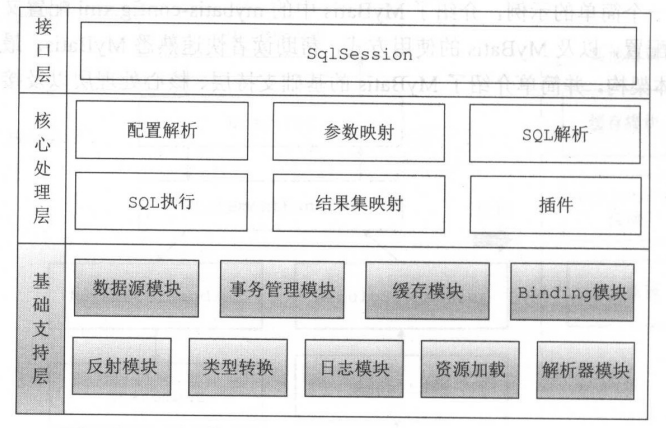
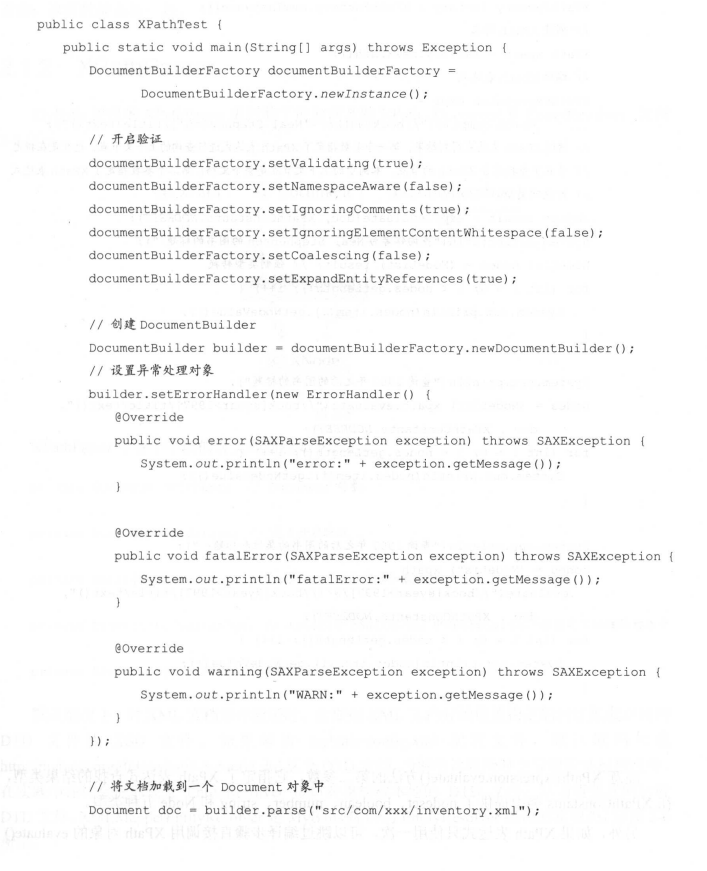
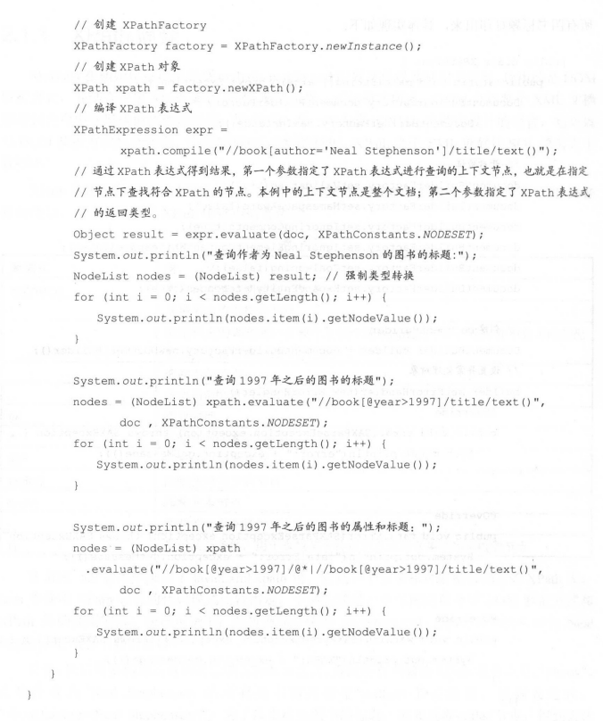
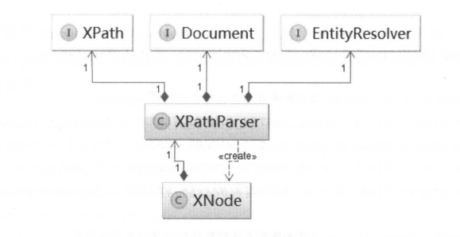
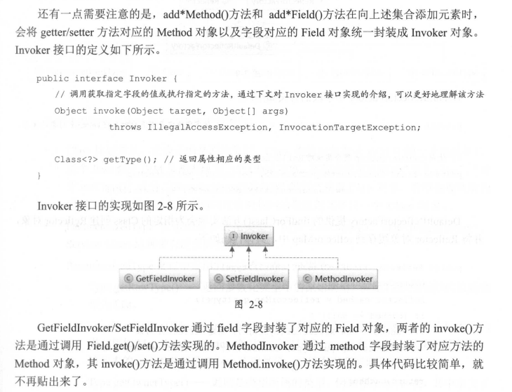
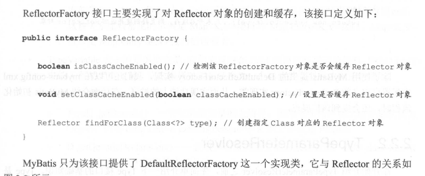
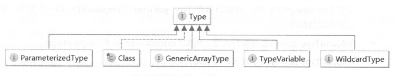
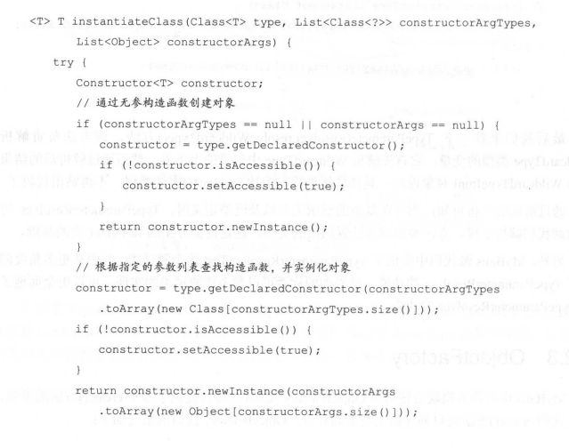

## 整体架构

 

## 解析器

### 常见解析技术

#### dom

#### sax

#### stax

#### xpath

​	MyBatis在初始化过程中处理mybatis-config.xml配置文件以及映射文件时,使用的是DOM解析方式，并结合使用XPath解析XML配置文件。正如前文所述，DOM 会将整个XML文档加载到内存中并形成树状数据结构，而 XPath是一种为查询XML 文档而设计的语言，它可以与DOM解析方式配合使用，实现对XML文档的解析。XPath之于XML就好比SQL语言之于数据库。
​	XPath使用路径表达式来选取XML文档中指定的节点或者节点集合，与常见的URL路径有些类似。

在JDK 5.0版本中推出了javax.xmlxpath 包，它是一个引擎和对象模型独立的XPath库。Java 中使用XPath 编程的代码模式比较固定，下面先通过一个示例简单介绍 DOM解析方式和XPath 库的使用方式。在该示例中，解析前面介绍的 inventoryxml 文档，并查找作者为 NealStephenson所有书籍的标题。
首先,我们需要构造该查询对应的XPath表达式查找所有书籍的XPath 表达式是:"//book"查找作者为Neal Stephenson 的所有图书需要指定<author>节点的值，得到表达式:"//booklauthor=Neal Stephenson7”。为了找出这些图书的标题，需要选取<title>节点，得到表达式:"//book[author=Neal Stephenson/title"。最后，真正需要的信息是<title>节点中的文本节点,得到的完整XPath 表达式是:"//book[author-"NealStephenson"]/title/text0"。 

 

 

注意XPathExpression.evaluate0方法的第二参数，它指定了XPath 表达式查找的结果类型在XPathConstants 类中提供了 nodeset、boolean、number、string 和Node 五种类型。
另外，如果XPath 表达式只使用一次，可以跳过编译步骤直接调用 XPath 对象的evaluate
方法进行查询。但是如果同一个 XPath 表达式要重复执行多次，则建议先进行编译，然后进行查询，这样性能会好一点。

### xpathparser

 

#### 核心结构

#### PropertyParser

解析属性，解析占位符，业务结合默认值的情况进行翻译

其中会利用GenericTokenParser、VariableTokenHandler进行工作

#### xnode

对w3c的node对象进行封装，提供了一些解析方法

## 反射

MyBatis 在进行参数处理、结果映射等操作时，会涉及大量的反射操作。Java 中的反射虽然功能强大，但是代码编写起来比较复杂且容易出错，为了简化反射操作的相关代码，MyBatis提供了专门的反射模块，该模块位于 org.apacheibatis.reflection 包中，它对常见的反射操作做了进一步封装，提供了更加简洁方便的反射 

### Reflector

JavaBean 规范:类中定义的成员变量也称为“字段”，属性则是通过 getter/setter 方法得到的，属性只与类中的方法有关，与是否存在对应成员变量没有关系。例如，存在 getA0方法和 setA(String)方法，无论类中是否定义了字段Stringa，我们都认为该类中存在属性a。在后面的分析中，属性的 getter/setter 方法与同名的字段虽然会一起出现，但还是有必要让读者区分这两个概念。
Reflector是 MyBatis 中反射模块的基础，每个 Reflector 对象都对应一个类，在 Reflector 中缓存了反射操作需要使用的类的元信息。

**初始化的时候还会处理一些主子类同名字段或者方法复写等问题**

### Invoker

 

### ReflectorFactory

 

除了使用 MyBatis 提供的 DefaultReflectorFactory 实现，我们还可以在 mybatis-configxml中配置自定义的 ReflectorFactory 实现类，从而实现功能上的扩展。

### TypeParameterResolver

在对 Reflector 的分析过程中，我们看到了 TypeParameterResolver 的身影，它是一个工具类，提供了一系列静态方法来解析指定类中的字段、方法返回值或方法参数的类型。TypeParameterResolver 中各个静态方法之间的调用关系大致如图，为保持清晰，其中递归调用没有表现出来，在后面的代码分析过程中会进行强调。

#### type基础

所有的类型类都实现type

 

* class

* ParameterizedType

  ParameterizedType 表示的是参数化类型，例如 List<String>、Map<Integer,String>.Service<User>这种带有泛型的类型。ParameterizedType 接口中常用的方法有三个，分别是:

* TypeVariable

  TypeVariable表示的是类型变量,它用来反映在JVM 编译该泛型前的信息例如 List<T>中的T就是类型变量，它在编译时需被转换为一个具体的类型后才能正常使用。该接口中常用的方法有三个，分别是:

* GenericArrayType

  GenericArrayType表示的是数组类型且组成元素是 ParameterizedType 或TypeVariable。例如 List<String>[]或T[。该接口只有 Type getGenericComponentType0一个方法，它返回数组的组成元素。

* WildcardType表示的是通配符泛型，例如?extends Number 和? super Integer。WildcardType 接口有两个方法，分别是:

#### resolveType

#### 小结

通过前面的分析可知，当存在复杂的继承关系以及泛型定义时，TypeParameterResolver 可以帮助我们解析字段、方法参数或方法返回值的类型，这是前面介绍的 Reflector 类的基础。另外，MyBatis 源代码中提供了 TypeParameterResolverTest 这个测试类，其中从更多角度测试了 TypeParameterResolver 的功能，感兴趣的读者可以参考该测试类的实现，可以更全面地了解TypeParameterResolver 的功能。

### ObjectFactory

MyBatis 中有很多模块会使用到 ObjectFactory 接口,该接口提供了多个create0方法的重载通过这些 create0方法可以创建指定类型的对象。

DefaultObjectFactory是MyBatis提供的ObjectFactory接口的唯一实现,它是一个反射工厂其create()方法通过调用instantiateClass0方法实现。DefaultObjectFactory.instantiateClass0)方法会根据传入的参数列表选择合适的构造函数实例化对象

 

### property

### MetaClass