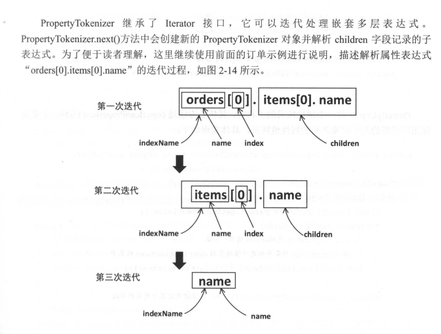
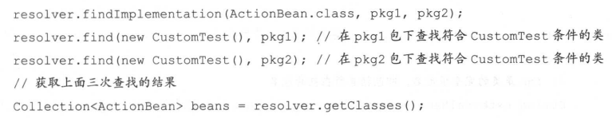
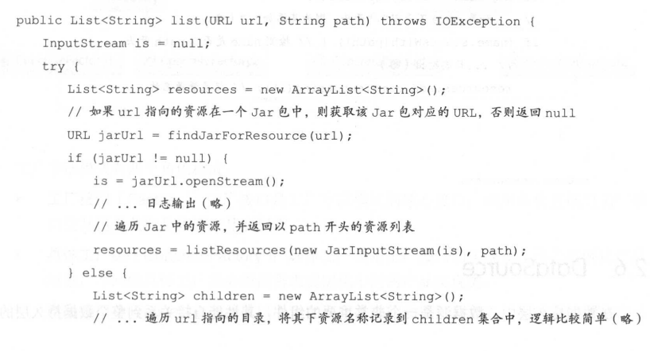
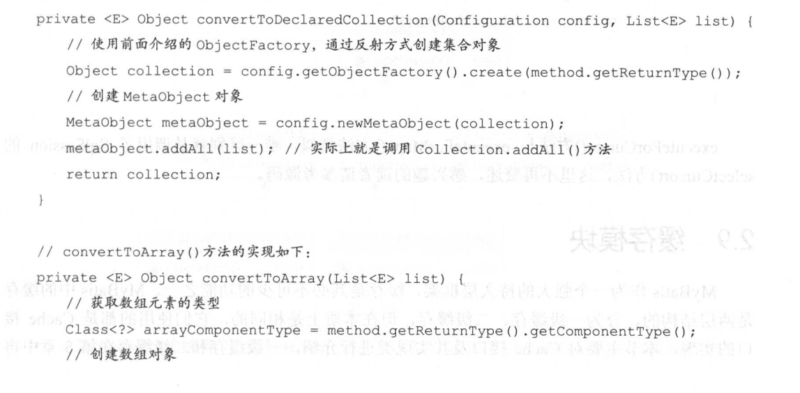
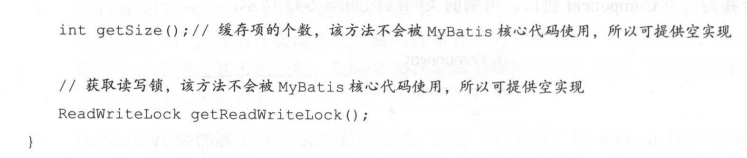
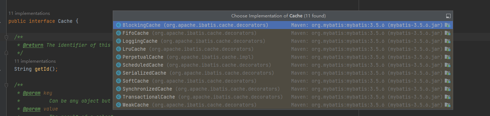
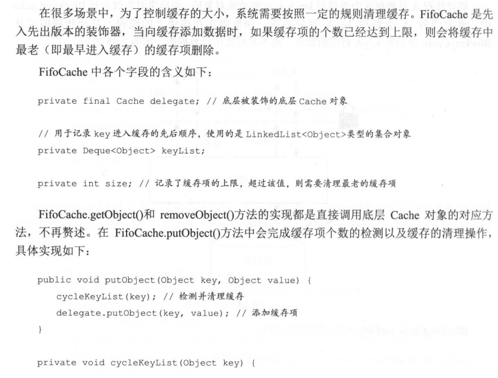
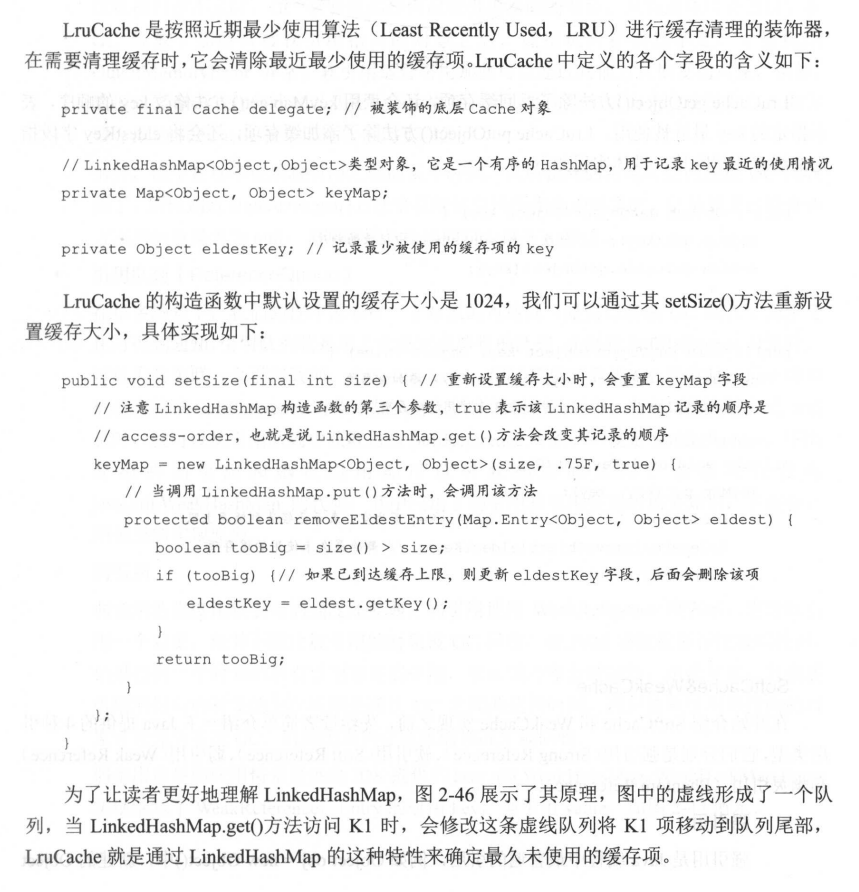

## 整体架构

 

## 解析器

### 常见解析技术

#### dom

#### sax

#### stax

#### xpath

​	MyBatis在初始化过程中处理mybatis-config.xml配置文件以及映射文件时,使用的是DOM解析方式，并结合使用XPath解析XML配置文件。正如前文所述，DOM 会将整个XML文档加载到内存中并形成树状数据结构，而 XPath是一种为查询XML 文档而设计的语言，它可以与DOM解析方式配合使用，实现对XML文档的解析。XPath之于XML就好比SQL语言之于数据库。
​	XPath使用路径表达式来选取XML文档中指定的节点或者节点集合，与常见的URL路径有些类似。

在JDK 5.0版本中推出了javax.xmlxpath 包，它是一个引擎和对象模型独立的XPath库。Java 中使用XPath 编程的代码模式比较固定，下面先通过一个示例简单介绍 DOM解析方式和XPath 库的使用方式。在该示例中，解析前面介绍的 inventoryxml 文档，并查找作者为 NealStephenson所有书籍的标题。
首先,我们需要构造该查询对应的XPath表达式查找所有书籍的XPath 表达式是:"//book"查找作者为Neal Stephenson 的所有图书需要指定<author>节点的值，得到表达式:"//booklauthor=Neal Stephenson7”。为了找出这些图书的标题，需要选取<title>节点，得到表达式:"//book[author=Neal Stephenson/title"。最后，真正需要的信息是<title>节点中的文本节点,得到的完整XPath 表达式是:"//book[author-"NealStephenson"]/title/text0"。 

 

 

注意XPathExpression.evaluate0方法的第二参数，它指定了XPath 表达式查找的结果类型在XPathConstants 类中提供了 nodeset、boolean、number、string 和Node 五种类型。
另外，如果XPath 表达式只使用一次，可以跳过编译步骤直接调用 XPath 对象的evaluate
方法进行查询。但是如果同一个 XPath 表达式要重复执行多次，则建议先进行编译，然后进行查询，这样性能会好一点。

### xpathparser

 

#### 核心结构

#### PropertyParser

解析属性，解析占位符，业务结合默认值的情况进行翻译

其中会利用GenericTokenParser、VariableTokenHandler进行工作

#### xnode

对w3c的node对象进行封装，提供了一些解析方法

## 反射

MyBatis 在进行参数处理、结果映射等操作时，会涉及大量的反射操作。Java 中的反射虽然功能强大，但是代码编写起来比较复杂且容易出错，为了简化反射操作的相关代码，MyBatis提供了专门的反射模块，该模块位于 org.apacheibatis.reflection 包中，它对常见的反射操作做了进一步封装，提供了更加简洁方便的反射 

### Reflector

JavaBean 规范:类中定义的成员变量也称为“字段”，属性则是通过 getter/setter 方法得到的，属性只与类中的方法有关，与是否存在对应成员变量没有关系。例如，存在 getA0方法和 setA(String)方法，无论类中是否定义了字段Stringa，我们都认为该类中存在属性a。在后面的分析中，属性的 getter/setter 方法与同名的字段虽然会一起出现，但还是有必要让读者区分这两个概念。
Reflector是 MyBatis 中反射模块的基础，每个 Reflector 对象都对应一个类，在 Reflector 中缓存了反射操作需要使用的类的元信息。

**初始化的时候还会处理一些主子类同名字段或者方法复写等问题**

### Invoker

 


### ReflectorFactory

 

除了使用 MyBatis 提供的 DefaultReflectorFactory 实现，我们还可以在 mybatis-configxml中配置自定义的 ReflectorFactory 实现类，从而实现功能上的扩展。

### TypeParameterResolver

在对 Reflector 的分析过程中，我们看到了 TypeParameterResolver 的身影，它是一个工具类，提供了一系列静态方法来解析指定类中的字段、方法返回值或方法参数的类型。TypeParameterResolver 中各个静态方法之间的调用关系大致如图，为保持清晰，其中递归调用没有表现出来，在后面的代码分析过程中会进行强调。

#### type基础

所有的类型类都实现type

 

* class

* ParameterizedType

  ParameterizedType 表示的是参数化类型，例如 List<String>、Map<Integer,String>.Service<User>这种带有泛型的类型。ParameterizedType 接口中常用的方法有三个，分别是:

* TypeVariable

  TypeVariable表示的是类型变量,它用来反映在JVM 编译该泛型前的信息例如 List<T>中的T就是类型变量，它在编译时需被转换为一个具体的类型后才能正常使用。该接口中常用的方法有三个，分别是:

* GenericArrayType

  GenericArrayType表示的是数组类型且组成元素是 ParameterizedType 或TypeVariable。例如 List<String>[]或T[。该接口只有 Type getGenericComponentType0一个方法，它返回数组的组成元素。

* WildcardType表示的是通配符泛型，例如?extends Number 和? super Integer。WildcardType 接口有两个方法，分别是:

#### resolveType

#### 小结

通过前面的分析可知，当存在复杂的继承关系以及泛型定义时，TypeParameterResolver 可以帮助我们解析字段、方法参数或方法返回值的类型，这是前面介绍的 Reflector 类的基础。另外，MyBatis 源代码中提供了 TypeParameterResolverTest 这个测试类，其中从更多角度测试了 TypeParameterResolver 的功能，感兴趣的读者可以参考该测试类的实现，可以更全面地了解TypeParameterResolver 的功能。

### ObjectFactory

MyBatis 中有很多模块会使用到 ObjectFactory 接口,该接口提供了多个create0方法的重载通过这些 create0方法可以创建指定类型的对象。

DefaultObjectFactory是MyBatis提供的ObjectFactory接口的唯一实现,它是一个反射工厂其create()方法通过调用instantiateClass0方法实现。DefaultObjectFactory.instantiateClass0)方法会根据传入的参数列表选择合适的构造函数实例化对象

 

### property

#### propertyTokenizer

 

 

 

 

#### propertyNamer

PropertyNamer是另一个工具类，提供了下列静态方法帮助完成方法名到属性名的转换，以及名种检测摄作

#### propertyCopier

PropertyCopier 是一个属性拷贝的工具类，其核心方法是copyBeanProperties0方法，主要实现相同类型的两个对象之间的属性值拷贝.

### MetaClass

**MetaClass是MyBatis 对类级别的元信息的封装和处理；**

MetaClass 通过 Reflector 和 PropertyTokenizer 组合使用，实现了对复杂的属性表达式的解析，并实现了获取指定属性描述信息的功能。

  

#### findProperty

MetaClass 中比较重要的是 fidProperty0方法，它是通过调用 MetaClass.buildProperty0方法实现的,而buildProperty0方法会通过 PropertyTokenizer 解析复杂的属性表达式.

```
public String findProperty(String name) {
  StringBuilder prop = buildProperty(name, new StringBuilder());
  return prop.length() > 0 ? prop.toString() : null;
}
```

```
private StringBuilder buildProperty(String name, StringBuilder builder) {
  PropertyTokenizer prop = new PropertyTokenizer(name);
  if (prop.hasNext()) {
    String propertyName = reflector.findPropertyName(prop.getName());
    if (propertyName != null) {
      builder.append(propertyName);
      builder.append(".");
      MetaClass metaProp = metaClassForProperty(propertyName);
      metaProp.buildProperty(prop.getChildren(), builder);
    }
  } else {
    String propertyName = reflector.findPropertyName(name);
    if (propertyName != null) {
      builder.append(propertyName);
    }
  }
  return builder;
}
```

```
public MetaClass metaClassForProperty(String name) {
  Class<?> propType = reflector.getGetterType(name);
  return MetaClass.forClass(propType, reflectorFactory);
}
```

需要注意一下，MetaClass.findProperty0方法只查找“”导航的属性，并没有检测下标。
这里以解析 User 类中的 tele.num 这个属性表达式为例解释上述过程:首先使用PropertyTokenizer 解析 tele.num 表达式得到其children 字段为num,name 字段为 tele;然后将tele追加到 builder中保存并调用metaClassForProperty0方法为Tele类创建对应的 MetaClass对象，调用其 buildProperty0方法处理子表达式num，逻辑同上，此时已经没有待处理的子表达式，最终得到 builder 中记录的字符串为 telenum。了解了上述递归设计之后，MetaClass 其他的方法就比较好理解了。

#### HasGetter

这里依然通过一个示例分析 MetaClass.hasGetter0方法的执行流程。假设现在通过orders[0].id 这个属性表达式，检测 User 类中orders 字段中的第一个元素(Order 对象)的id字段是否有 getter 方法，大致步骤如下:
(1)我们调用 MetaClass.forClass0方法创建 User 对应的 MetaClass 对象并调用其 hasGetter0方法开始解析，经过 PropertyTokenizer 对属性表达式的解析后，PropertyTokenizer 对象的 name值为 orders，indexName为orders[0]，index为0，children为name。
(2)进入到 MetaClass.getGetterType0方法,此时(1)处条件成立,调用 getGenericGetterType0方法解析 orders 字段的类型，得到returType 为 List<Order>对应的 ParameterizedType 对象，此时条件(2)成立，更新 returnType 为 Order 对应的 Class 对象。
(3)继续检测 Order 中的id 字段是否有 getter 方法，具体逻辑同上。另外，MetaClass 中有一个 public 修饰的 getGetterType(String)重载，其逻辑与 asGetter0类似，也是先对表达式进行解析，然后调用 metaClassForProperty0方法或 getGetterType

MetaClass.hasGetter0和 hasSetter0方法负责判断属性表达式所表示的属性是否有对应的属性，这两个方法逻辑类似，这里以 hasGetter0)方法为例进行分析。需要读者注意的是，这两个方法最终都会查找 Reflector.getMethods 集合或 setMethods 集合。根据前面介绍的Reflector.addFields0方法，当字段没有对应的getter/setter 方法时会添加相应的GetFieldInvoker/SetFieldInvoker 对象，所以 Reflector 有权限访问指定的字段时，这两个方法的行为并不像其方法名所暗示的那样只直接判断属性的 getter/setter 方法；

 

### ObjectWrapper

是一个接口。

ObjectWrapper 接口是对对象的包装，抽象了对象的属性信息，它定义了一系列查询对象属性信息的方法，以及更新属性的方法。

```
public interface ObjectWrapper {

 //如果 ObjectWrapper 中封装的是普通的 Bean 对象，则调用相应属性的相应getter 方法
 //如果封装的是集合类，则获取指定 key 或下标对应的 value 值
  Object get(PropertyTokenizer prop);

 // 如果ObjectWrapper 中封装的是普通的 Bean 对象，则调用相应属性的相应 setter 方法
 //如果封装的是集合类，则设置指定 key 或下标对应的 value 值
  void set(PropertyTokenizer prop, Object value);

// 查找属性表达式指定的属性，第二个参数表示是否忽略属性表达式中的下画线
  String findProperty(String name, boolean useCamelCaseMapping);

  String[] getGetterNames();//查找可读属性的名称集合i

  String[] getSetterNames();//查找可读属性的名称集合

  Class<?> getSetterType(String name);//// 解析属性表达式指定属性的 setter 方法的参数类型

  Class<?> getGetterType(String name);//解析属性表达式指定属性的 getter 方法的返回值类型

  boolean hasSetter(String name);////判断属性表达式指定属性是否有 getter/setter 方法

  boolean hasGetter(String name);

////为属性表达式指定的属性创建相应的 MetaObject 对象
  MetaObject instantiatePropertyValue(String name, PropertyTokenizer prop, ObjectFactory objectFactory);

  boolean isCollection();//封装的对象是否为 Collection 类型;

  void add(Object element);// 调用 Collection 对象的add()方法

  <E> void addAll(List<E> element);// 调用 Collection 对象的 addAll()方法

}
```

#### ObjectWrapperFactory 

ObjectWrapperFactory 负责创建ObjectWrapper 对象

 

​	DefaultObjectWrapperFactory实现了 ObjectWrapperFactory 接口,但它实现的getWrapperFor0方法始终抛出异常，hasWrapperFor0方法始终返回 false，所以该实现实际上是不可用的。但是与ObjectFactory类似，我们可以在 mybatis-config.xml中配置自定义的ObjectWrapperFactory实现类进行扩展，在后面介绍MyBatis 初始化时还会提到该扩展点。

#### BaseWrapper 

​	BaseWrapper 是一个实现了ObjectWrapper 接口的抽象类，其中封装了MetaObject对象，并提供了三个常用的方法供其子类使用

BaseWrapper.resolveCollection0方法会调用 MetaObject,getValue0方法，它会解析属性表达式并获取指定的属性，Metabject.getValue0方法的实现在后面详细介绍。
BaseWrapper.getCollectionValue0方法和 setCollectionValue0方法会解析属性表达式的索引信息，然后获取/设置对应项。这两个方法的实现类似，这里只分析 getCollectionValue0方法,setCollectionValue0

```
protected Object getCollectionValue(PropertyTokenizer prop, Object collection) {
  if (collection instanceof Map) {
    return ((Map) collection).get(prop.getIndex());
  } else {
    int i = Integer.parseInt(prop.getIndex());
    if (collection instanceof List) {
      return ((List) collection).get(i);
    } else if (collection instanceof Object[]) {
      return ((Object[]) collection)[i];
    } else if (collection instanceof char[]) {
      return ((char[]) collection)[i];
    } else if (collection instanceof boolean[]) {
      return ((boolean[]) collection)[i];
    } else if (collection instanceof byte[]) {
      return ((byte[]) collection)[i];
    } else if (collection instanceof double[]) {
      return ((double[]) collection)[i];
    } else if (collection instanceof float[]) {
      return ((float[]) collection)[i];
    } else if (collection instanceof int[]) {
      return ((int[]) collection)[i];
    } else if (collection instanceof long[]) {
      return ((long[]) collection)[i];
    } else if (collection instanceof short[]) {
      return ((short[]) collection)[i];
    } else {
      throw new ReflectionException("The '" + prop.getName() + "' property of " + collection + " is not a List or Array.");
    }
  }
}
```

#### beanWrapper

BeanWrapper继承了 BaseWrapper 抽象类，其中封装了一个JavaBean对象以及该JavaBean类相应的 MetaClass对象，当然，还有从 BaseWrapper 继承下来的、该 JavaBean 对象相应的MetaObject 对象。
BeanWrapperget0方法和 set0方法会根据指定的属性表达式，获取/设置相应的属性值，两者逻辑类似，这里以get0方法为例进行介绍，具体代码如下，set0方法不再做详细介绍。

```
@Override
public Object get(PropertyTokenizer prop) {
  if (prop.getIndex() != null) {
    Object collection = resolveCollection(prop, object);
    return getCollectionValue(prop, collection);
  } else {
    return getBeanProperty(prop, object);
  }
}
```

#### collectionWrapper

CollectionWrapper实现了 ObjectWrapper 接口,其中封装了 Collection<Object类型的对象但它大部分实现方法都会抛出UnsupportedOperationException 异常，代码不贴出来了。

#### MapWrapper

MapWrapper是 BaseWrapper 的另一个实现类,其中封装的是 Map<String,Object>类型对象了解了MetaObject 和 BeanWrapper 实现后，相信读者可以轻松读懂 MapWrapper 的代码，这里不再赘述。

### MetaObject

通过 2.2.6 节对 ObjectWrapper 的介绍我们知道，ObjectWrapper 提供了获取/设置对象中指定的属性值、检测 getter/setter 等常用功能，但是 ObjectWrapper 只是这些功能的最后一站，我们省略了对属性表达式解析过程的介绍，而该解析过程是在MetaObiect 中实现的。

 MetaObject 是如何完成属性表达式的解析的。MetaObject 中字段的含义

```
public class MetaObject {

  //原始的javabean对象
  private final Object originalObject;
  //上文介绍的 ObjectWrapper 对象，其中封装了originalObject 对象
  private final ObjectWrapper objectWrapper;
  ////负责实例化 originalobject 的工厂对象，前面已经介绍过，不再重复描述
  private final ObjectFactory objectFactory;
  //// 负责创建 Objectwrapper 的工厂对象，前面已经介绍过，不再重复描述
  private final ObjectWrapperFactory objectWrapperFactory;
  //// 用于创建并缓存 Reflector 对象的工厂对象，前面已经介绍过，不再重复描述
  private final ReflectorFactory reflectorFactory;
```

#### 构造方法

```
private MetaObject(Object object, ObjectFactory objectFactory, ObjectWrapperFactory objectWrapperFactory, ReflectorFactory reflectorFactory) {
  this.originalObject = object;
  this.objectFactory = objectFactory;
  this.objectWrapperFactory = objectWrapperFactory;
  this.reflectorFactory = reflectorFactory;

  if (object instanceof ObjectWrapper) {
    this.objectWrapper = (ObjectWrapper) object;
  } else if (objectWrapperFactory.hasWrapperFor(object)) {
    this.objectWrapper = objectWrapperFactory.getWrapperFor(this, object);
  } else if (object instanceof Map) {
    this.objectWrapper = new MapWrapper(this, (Map) object);
  } else if (object instanceof Collection) {
    this.objectWrapper = new CollectionWrapper(this, (Collection) object);
  } else {
    this.objectWrapper = new BeanWrapper(this, object);
  }
}
```

```
//MetaObject 的构造方法是private 修改的，只能通过forObject()这个静态方法创建Metaobject 对象
public static MetaObject forObject(Object object, ObjectFactory objectFactory, ObjectWrapperFactory objectWrapperFactory, ReflectorFactory reflectorFactory) {
  if (object == null) {
    return SystemMetaObject.NULL_META_OBJECT;
  } else {
    return new MetaObject(object, objectFactory, objectWrapperFactory, reflectorFactory);
  }
}
```

MetaObject和ObjectWrapper中关于类级别的方法,例如 hasGetter、hasSetter0、findProperty(等方法，都是直接调用 MetaClass 的对应方法实现的，不再赘述。其他方法都是关于对象级别的方法，这些方法都是与ObjectWrapper 配合实现，例如 MetaObjectgetValue0/setValue0方法这里以getValue0方法为例进行介绍，具体代码如下，setValue0的实现类似，不再赘述

#### getValue

```
public Object getValue(String name) {
  PropertyTokenizer prop = new PropertyTokenizer(name); //解析属性表达式
  if (prop.hasNext()) {//处理子表达式
  //根据PropertuTokenizer解析后指定的属性，创建相应的MetaObject对象
    MetaObject metaValue = metaObjectForProperty(prop.getIndexedName());
    if (metaValue == SystemMetaObject.NULL_META_OBJECT) {
      return null;
    } else {
      return metaValue.getValue(prop.getChildren());//递归处理子表达
    }
  } else {
    return objectWrapper.get(prop);//通过objecWrapper 获取指定的属性值
  }
}
```

```
//下面是MetaObject.metaObjectForProperty()方法的实现:
public MetaObject metaObjectForProperty(String name) {
  Object value = getValue(name);//获取指定的属性
  return MetaObject.forObject(value, objectFactory, objectWrapperFactory, reflectorFactory);
}

//// 创建该属性对象相应的 Metaobject 对象
  public static MetaObject forObject(Object object, ObjectFactory objectFactory, ObjectWrapperFactory objectWrapperFactory, ReflectorFactory reflectorFactory) {
    if (object == null) {
      return SystemMetaObject.NULL_META_OBJECT;
    } else {
      return new MetaObject(object, objectFactory, objectWrapperFactory, reflectorFactory);
    }
  }
```

以“orders[0].id”这个属性表达式为例来分析MetaObjectgetValue0方法的执行流程:

* 创建 User 对象相应的 MetaObject 对象，并调用 MetaObject,getValue0方法，经过PropertyTokenizer 解析“orders[0]id”表达式之后，其name 为 orders,indexedName 为 orders[0]index为0，children 为id。
* 调用 MetaObject.metaObjectForProperty0方法处理“orders[0]”表达式，底层会调用BeanWrapperget0方法获取 orders 集合中第一个 Order 对象，其中先通过 BeanWrapper.resolveCollection0方法获取orders 集合对象,然后调用 BeanWrapper,getCollectionValue0方法获取 orders集合中的第一个元素。注意，这个过程中会递归调用MetaObjectgetValue0方法。
* 得到Order 对象后，创建其相应的 MetaObject 对象，并调用 MetaObjectgetValue0方法处理“id”表达式，逻辑同上，最后得到属性表达式指定属性的值，即User 对象的orders集合属性中第一个 Order 元素的 id 属性值。

#### setValue

 

```
@Override
public MetaObject instantiatePropertyValue(String name, PropertyTokenizer prop, ObjectFactory objectFactory) {
  MetaObject metaValue;
  Class<?> type = getSetterType(prop.getName());
  try {
    Object newObject = objectFactory.create(type);
    metaValue = MetaObject.forObject(newObject, metaObject.getObjectFactory(), metaObject.getObjectWrapperFactory(), metaObject.getReflectorFactory());
    set(prop, newObject);
  } catch (Exception e) {
    throw new ReflectionException("Cannot set value of property '" + name + "' because '" + name + "' is null and cannot be instantiated on instance of " + type.getName() + ". Cause:" + e.toString(), e);
  }
  return metaValue;
}
```

```
public void set(PropertyTokenizer prop, Object value) {
  if (prop.getIndex() != null) {
    Object collection = resolveCollection(prop, object);
    setCollectionValue(prop, collection, value);
  } else {
    setBeanProperty(prop, object, value);
  }
}
```

理解了MetaObject和 BeanWrapper 如何通过递归的方式处理属性表达式指定的属性值后其余方法的实现原理就比较容易理解了。

例如 getGeterType0、getSetterType0、hasGetter0、hasSetter0等方法，都是先递归处理属性表达式，然后调用 MetaClass 相应方法实现；

## 类型转换

JDBC数据类型与Java 语言中的数据类型并不是完全对应的，所以在 PreparedStatement为SOL语句绑定参数时，需要从Java类型转换成JDBC类型，而从结果集中获取数据时，则需要从JDBC类型转换成Java类型。MyBatis 使用类型处理器完成上述两种转换

 

首选需要读者了解的是，在MyBatis 中使用JdbcType这个枚举类型代表JDBC中的数据类型，该枚举类型中定义了TYPE_CODE 字段，记录了JDBC 类型在 javasql.Types 中相应的常量编码，并通过一个静态集合 codeLookup (HashMap<Integer,JdbcType>类型)维护了常量编码与jdbcType之间的关系

### typeHandler

MyBatis 中所有的类型转换器都继承了 TypeHandler 接口，在 TypeHandler 接口中定义了如下四个方法，这四个方法分为两类:setParameter0方法负责将数据由JdbcType 类型转换成Java类型;getResult0方法及其重载负责将数据由 Java 类型转换成JdbcType 类型。

```
public interface TypeHandler<T> {

  void setParameter(PreparedStatement ps, int i, T parameter, JdbcType jdbcType) throws SQLException;

  T getResult(ResultSet rs, String columnName) throws SQLException;

  T getResult(ResultSet rs, int columnIndex) throws SQLException;

  T getResult(CallableStatement cs, int columnIndex) throws SQLException;

}
```

### BaseTypeHandler

为方便用户自定义 TypeHandler 实现，MyBatis 提供了 BaseTypeHandler 这个抽象类，它实见了 TypeHandler 接口，并继承了 TypeReference 抽象类；

```
public void setParameter(PreparedStatement ps, int i, T parameter, JdbcType jdbcType) throws SQLException {
  if (parameter == null) {
    if (jdbcType == null) {
      throw new TypeException("JDBC requires that the JdbcType must be specified for all nullable parameters.");
    }
    try {
      ps.setNull(i, jdbcType.TYPE_CODE);
    } catch (SQLException e) {
      throw new TypeException("Error setting null for parameter #" + i + " with JdbcType " + jdbcType + " . "
            + "Try setting a different JdbcType for this parameter or a different jdbcTypeForNull configuration property. "
            + "Cause: " + e, e);
    }
  } else {
    try {
      setNonNullParameter(ps, i, parameter, jdbcType);
    } catch (Exception e) {
      throw new TypeException("Error setting non null for parameter #" + i + " with JdbcType " + jdbcType + " . "
            + "Try setting a different JdbcType for this parameter or a different configuration property. "
            + "Cause: " + e, e);
    }
  }
}

@Override
public T getResult(ResultSet rs, String columnName) throws SQLException {
  try {
    return getNullableResult(rs, columnName);
  } catch (Exception e) {
    throw new ResultMapException("Error attempting to get column '" + columnName + "' from result set.  Cause: " + e, e);
  }
}
```

BaseTypeHandler 的实现类比较多，但大多是直接调用 PreparedStatement和ResultSet 或CallableStatement 的对应方法，实现比较简单。

### IntegerTypeHandler

```
public class IntegerTypeHandler extends BaseTypeHandler<Integer> {

  @Override
  public void setNonNullParameter(PreparedStatement ps, int i, Integer parameter, JdbcType jdbcType)
      throws SQLException {
    ps.setInt(i, parameter);
  }

  @Override
  public Integer getNullableResult(ResultSet rs, String columnName)
      throws SQLException {
    int result = rs.getInt(columnName);
    return result == 0 && rs.wasNull() ? null : result;
  }

  @Override
  public Integer getNullableResult(ResultSet rs, int columnIndex)
      throws SQLException {
    int result = rs.getInt(columnIndex);
    return result == 0 && rs.wasNull() ? null : result;
  }

  @Override
  public Integer getNullableResult(CallableStatement cs, int columnIndex)
      throws SQLException {
    int result = cs.getInt(columnIndex);
    return result == 0 && cs.wasNull() ? null : result;
  }
}
```

一般情况下，TypeHandler 用于完成单个参数以及单个列值的类型转换，如果存在多列值转换成一个Java 对象的需求，应该优先考虑使用在映射文件中定义合适的映射规则(<resultMap>节点)完成映射。

### TypeHandlerRegistry

MyBatis 如何管理众多的 TypeHandler 接口实现，如何知道何时使用哪个TypeHandler 接口实现完成转换呢

```
public final class TypeHandlerRegistry {
// 记录JdbcType与TypeHandler 之间的对应关系，其中JdbcType 是一个枚举类型
//该集合主要用于从结果集读取数据时，将数据从 Jdbc 类型转换成 Java 类型
它定义对应的 JDBC 类型
  private final Map<JdbcType, TypeHandler<?>>  jdbcTypeHandlerMap = new EnumMap<>(JdbcType.class);
  //// 记录了Java 类型向指定JdbcType 转换时，需要使用的 TypeHandler 对象。例如: Java 类型中的 String可能
  // 转换成数据库的 char、varchar 等多种类型，所以存在一对多关系
  private final Map<Type, Map<JdbcType, TypeHandler<?>>> typeHandlerMap = new ConcurrentHashMap<>();
  private final TypeHandler<Object> unknownTypeHandler;
  // 记录了全部 TypeHandler 的类型以及该类型相应的 TypeHandler 对象
  private final Map<Class<?>, TypeHandler<?>> allTypeHandlersMap = new HashMap<>();

//空TypeHandler 集合的标识
  private static final Map<JdbcType, TypeHandler<?>> NULL_TYPE_HANDLER_MAP = Collections.emptyMap();

  private Class<? extends TypeHandler> defaultEnumTypeHandler = EnumTypeHandler.class;
```

#### 注册TypeHandler对象

TypeHandlerRegistry.register0方法实现了注册 TypeHandler 对象的功能，该注册过程会向上述四个集合中添加 TypeHandler 对象。register0方法有多个重载，这些重载之间的调用关系如图

下面来分析D~@这六个 register0方法，其余的 register0方法重载主要完成强制类型转换或初始化 TvpeHandler 的功能，然后调用重载O~实现注册功能，故不再做详细分析。

 

多数 register0方法最终会调用重载完成注册功能，我们先来介绍该方法的实现，其三个参数分别指定了 TypeHandler 能够处理的 Java 类型、Jdbc 类型以及TypeHandler 对象

```
private void register(Type javaType, JdbcType jdbcType, TypeHandler<?> handler) {
  if (javaType != null) {//检查是否明确指定了TypeHandler能够处理的java类型
    Map<JdbcType, TypeHandler<?>> map = typeHandlerMap.get(javaType);
    if (map == null || map == NULL_TYPE_HANDLER_MAP) {//创建新的TypeHandler集合,并添加到Type_handler_map中
      map = new HashMap<>();
    }
    map.put(jdbcType, handler);
    typeHandlerMap.put(javaType, map);//将TypeHandler对象注册到Type_handler_map集合
  }
  ///向ALL TYPEHANDLERS MAP集合注册TypeHandler 类型和对应的 TypeHandler 对象
  allTypeHandlersMap.put(handler.getClass(), handler);
}
```

在1~3这个三个register0方法重载中会尝试读取 TypeHandler 类中定义的@MappedTypes注解和@MappedJdbcTypes注解，@MappedTypes注解用于指明该TypeHandler 实现类能够处理的Java 类型的集合，@MappedJdbcTypes 注解用于指明该 TypeHandler 实现类能够处理的JDBC类型集合。register0方法的重载1~3的具体实现如下:

 

 

* register0

  TypeHandlerRegistry 除了提供注册单个TypeHandler 的register0重载还可以扫描整个包下的TypeHandler 接口实现类，并将完成这些TypeHandler 实现类的注册。下面来看重载的具体
   

* TypeHandlerRegistry 构造方法

  会通过上述register0方法为很多基础类型注册对应的 TypeHandler 对象，简略代码如下:

 

#### 查找TypeHandler

介绍完注册 TypeHandler 对象的功能之后，再来介绍 TypeHandlerRegistry 提供的查找TypeHandler对象的功能。TypeHandlerRegistrygetTypeHandler0方法实现了从上述四个集合中获取对应TypeHandler对象的功能。TypeHandlerRegistrygetTypeHandler0方法有多个重载

 

经过一系列类型转换之后，TypeHandlerRegistrygetTypeHandler0方法的多个重载都会调用TypeHandlerRegistrygetTypeHandle(Type,JdbcType)这个重载方法，它会根据指定的 Java 类型和JdbcType类型查找相应的TypeHandler 对象，具体实现如下:

 

在TypeHandlerRegistrygetJdbcHandlerMap0方法中，会检测TYPE HANDLERMAP集合中指定Java类型对应的TypeHandler 集合是否已经初始化。如果未初始化，则尝试以该Java类型的、已初始化的父类对应的 TypeHandler 集合为初始集合;如不存在已初始化的父类，则将其对应的TypeHandler 集合初始化为NULL TYPE HANDLER MAP标识getJdbcHandlerMap0方法具体实现如下:


  

TypeHandlerRegistrygetMappingTypeHandler0方法会根据指定的TypeHandler类型，直接从ALLTYPE HANDLERSMAP集合中查找TypeHandler 对象。
TypeHandlerRegistry.getTypeHandler(JdbcType)方法会根据指定的 JdbcType 类型，从JDBC_TYPE HANDLERMAP 集合中查找TypeHandler 对象。这两个方法实现相对简单，代码就不贴出来了。
最后，除了 MyBatis 本身提供的TypeHandler 实现，我们也可以添加自定义的TypeHandler接口实现，添加方式是在mybatis-configxml配置文件中的<typeHandlers>节点下，添加相应的<typeHandler>节点配置，并指定自定义的 TypeHandler 接口实现类。在MyBatis 初始化时会解析该节点，并将该 TypeHandler 类型的对象注册到 TypeHandlerRegistry 中，供MyBatis 后续使用。在后面介绍MyBatis初始化时还会提到该配置；

### TypeAliasRegistry

在编写SOL 语句时，使用别名可以方便理解以及维护，例如表名或列名很长时，我们一般会为其设计易懂易维护的别名。MyBatis 将SOL 语中别名的概念进行了延伸和扩展，MyBatis可以为一个类添加一个别名，之后就可以通过别名引用该类。
MyBatis 通过TypeAliasRegistry 类完成别名注册和管理的功能，TypeAliasRegistry 的结构比较简单，它通过TYPE ALIASES 字段(MapString,Class<?>>类型)管理别名与Java类型之间的对应关系，通过 TypeAliasRegistryregisterAlias0方法完成注册别名，该方法的具体实现如下:

 

 

 

 

## 日志模块

### 日志适配器

在MyBatis的日志模块中，就使用了适配器模式。MyBatis 内部调用其日志模块时，使用了其内部接口(也就是后面要介绍org.apache.ibatis.logging.Log 接口)。但是 Log4j、Log4j2等第三方日志组件对外提供的接口各不相同，MyBatis 为了集成和复用这些第三方日志组件,在其日志模块中提供了多种 Adapter，将这些第三方日志组件对外的接口适配成了orgapache.ibatis.logging.Log 接口，这样MyBatis 内部就可以统一通过 org.apacheibatis.loggingLog接口调用第三方日志组件的功能了。
当程序中存在过多的适配器时，会让程序显得非常复杂(后续介绍的所有模式都会有该问题，但是与其带来的好处进行权衡后，这个问题可以忽略不计)，增加了把握住核心业务逻辑的难度，例如，程序调用了接口A，却在又被适配成了接口 B。如果程序中需要大量的适配器则不再优先考虑使用适配器模式，而是考虑将系统进行重构，这就需要设计人员进行权衡。

#### 日志组件

前面描述的多种第三方日志组件都有各自的 Log 级别，且都有所不同，例如 javautil.logging提供了AIl、FINEST、FINER、FINE、CONFIG、INFO、WARNING等9 种级别，而 Log4j2 则只有trace、debug、infowarn、error、fatal 这6种日志级别。MyBatis 统一提供了 trace、debug、warn、error 四个级别，这基本与主流日志框架的日志级别类似，可以满足绝大多数场景的日志需求。
MyBatis 的日志模块位于orgapache.ibatis.logging 包中，该模块中通过Log 接口定义了日志模块的功能，当然日志适配器也会实现此接口。LogFactory 工厂类负责创建对应的日志组件适配器。

 

#### logfactory

在LogFactory 类加载时会执行其静态代码块，其逻辑是按序加载并实例化对应日志组件的适配器，然后使用 LogFactory logConstructor 这个静态字段，记录当前使用的第三方日志组件的适配器，具体代码如下所示

```
 static {
    tryImplementation(LogFactory::useSlf4jLogging);
    tryImplementation(LogFactory::useCommonsLogging);
    tryImplementation(LogFactory::useLog4J2Logging);
    tryImplementation(LogFactory::useLog4JLogging);
    tryImplementation(LogFactory::useJdkLogging);
    tryImplementation(LogFactory::useNoLogging);
  }
  
  public static synchronized void useNoLogging() {
    setImplementation(org.apache.ibatis.logging.nologging.NoLoggingImpl.class);
  }

  private static void tryImplementation(Runnable runnable) {
    if (logConstructor == null) {
      try {
        runnable.run();
      } catch (Throwable t) {
        // ignore
      }
    }
  }

  private static void setImplementation(Class<? extends Log> implClass) {
    try {
      Constructor<? extends Log> candidate = implClass.getConstructor(String.class);
      Log log = candidate.newInstance(LogFactory.class.getName());
      if (log.isDebugEnabled()) {
        log.debug("Logging initialized using '" + implClass + "' adapter.");
      }
      logConstructor = candidate;
    } catch (Throwable t) {
      throw new LogException("Error setting Log implementation.  Cause: " + t, t);
    }
  }
```

 

```
public class Log4j2Impl implements Log {

  private final Log log;

  public Log4j2Impl(String clazz) {
    Logger logger = LogManager.getLogger(clazz);

    if (logger instanceof AbstractLogger) {
      log = new Log4j2AbstractLoggerImpl((AbstractLogger) logger);
    } else {
      log = new Log4j2LoggerImpl(logger);
    }
  }
```

### 代理模式

JDK 动态代理的实现原理是动态创建代理类并通过指定类加载器加载，然后在创建代理对象时将 InvokerHandler 对象作为构造参数传入。当调用代理对象时，会调用InvokerHandlerinvoke0方法，并最终调用真正业务对象的相应方法。JDK动态代理不仅在MyBatis 的多个模块中都有所涉及，在很多开源框架中也能看到其身影。

### jdbc

在MyBatis 的日志模块中有一个Jdbc包它并不是将日志信息通过JDBC保存到数据库中，而是通过JDK 动态代理的方式，将JDBC 操作通过指定的日志框架打印出来。这个功能通常在开发阶段使用，它可以输出 SOL 语句、用户传入的绑定参数、SOL 语句影响行数等等信息，对调试程序来说是非常重要的。
BaseJdbcLogger 是一个抽象类，它是 Jdbc 包下其他 Logger 类的父类

 

ConnectionLogger 继承了 BaseJdbcLogger 抽象类，其中封装了 Connection 对象并同时实现了InvocationHandler 接口。ConnectionLoggernewInstance0方法为会为其封装的 Connection 对象创建相应的代理对象，具体代码如下:

```
public final class ConnectionLogger extends BaseJdbcLogger implements InvocationHandler {

  private final Connection connection;

  private ConnectionLogger(Connection conn, Log statementLog, int queryStack) {
    super(statementLog, queryStack);
    this.connection = conn;
  }

  @Override
  public Object invoke(Object proxy, Method method, Object[] params)
      throws Throwable {
    try {
      if (Object.class.equals(method.getDeclaringClass())) {
        return method.invoke(this, params);
      }
      if ("prepareStatement".equals(method.getName()) || "prepareCall".equals(method.getName())) {
        if (isDebugEnabled()) {
          debug(" Preparing: " + removeExtraWhitespace((String) params[0]), true);
        }
        PreparedStatement stmt = (PreparedStatement) method.invoke(connection, params);
        stmt = PreparedStatementLogger.newInstance(stmt, statementLog, queryStack);
        return stmt;
      } else if ("createStatement".equals(method.getName())) {
        Statement stmt = (Statement) method.invoke(connection, params);
        stmt = StatementLogger.newInstance(stmt, statementLog, queryStack);
        return stmt;
      } else {
        return method.invoke(connection, params);
      }
    } catch (Throwable t) {
      throw ExceptionUtil.unwrapThrowable(t);
    }
  }
```

当日志配置了这个debug模式，将使用代理对象

```
protected Connection getConnection(Log statementLog) throws SQLException {
  Connection connection = transaction.getConnection();
  if (statementLog.isDebugEnabled()) {
    return ConnectionLogger.newInstance(connection, statementLog, queryStack);
  } else {
    return connection;
  }
}
```

## 资源加载

### 双亲委派原理

Bootstrap ClassLoader 负责加载JDK自带的rt,jar 包中的类文件，它是所有类加载器的父加载器，Bootstrap ClassLoader 没有任何父类加载器。Extension ClassLoader 负责加载Java的扩展类库,也就是从jre/lib/ext 目录下或者java.extdirs 系统属性指定的目录下加载类。

System ClassLoader负责从classpath 环境变量中加载类文件,classpath 环境变量通常由“-classpath’或“-cp”命令行选项来定义，或是由 JAR 中 Manifest 文件的 classpath 属性指定。SystemClassLoader 是 Extension ClassLoader 的子加载器。 

 

根据双亲委派模式，在加载类文件时，子加载器首先会将加载请求委托给它的父加载器父加载器会检测自己是否已经加载过该类，如果已加载则加载过程结束;如果未加载则请求继卖向上传递，直到 Bootstrap ClassLoader。如果在请求向上委托的过程中，始终未检测到该类已加载，则从 Bootstrap ClassLoader 开始尝试从其对应路径中加载该类文件，如果加载失败则由
子加载器继续尝试加载，直至发起加载请求的子加载器位为止。双亲委派模式可以保证两点:一是子加载器可以使用父加载器已加载的类，而父加载器无去使用子加载器已加载的类:二是父加载器已加载过的类无法被子加载器再次加载。这样就可以保证JVM的安全性和稳定性。
除了系统提供三种类加载器，开发人员也可以通过继承 javalang.ClassLoader 类的方式实现自己的类加载器以满足一些特殊的需求,如图Custom ClassLoaderA、B、C所示。使用自定义类加载器的场景还是比较多的，例如 Tomcat、JBoss 等都涉及了自定义类加载器的使用。

在很多场景中，系统会同时使用不同的类加载器完成不同的任务，这里以 Tomcat 为例简单介绍一下。在Tomcat中提供了一个Common ClassLoader，它主要负责加载Tomcat 使用的类和Jar包以及应用通用的一些类和Jar 包，例如CATALINA HOME/li 目录下的所有类和Jar 包。Tomcat 本身是一个应用系统，所以 Common ClassLoader 的父加载器是System ClassLoader。Tomcat还提供了CatalinaLoader和SharedLoader 两个类加载器它们的父加载器是 CommonClassLoader。但是默认情况下，CatalinaLoader 和 SharedLoader 两个类加载器的相应配置(CATALINA HOME/conf/catalinaproperties 配置文件中 serverl.loader 和 shared.loader 配置项)是空的，也就是说，这两个类加载器默认情况下与Common ClassLoader为同一个加载器Tomcat 会为每个部署的应用创建一个唯一的类加载器，也就是 WebApp ClassLoader，它负责加载该应用的 WEB-INF/lib 目录下的 Jar 文件以及 WEB-INF/classes 目录下的 Class 文件。由于每个应用都有自己的 WebApp ClassLoader，这样就可以使不同的 Web 应用之间互相隔离，彼此之间看不到对方使用的类文件。当对应用进行热部署时,会抛弃原有的 WebApp ClassLoader,并为应用创建新的 WebApp ClassLoader。 WebApp ClassLoaderd 的父加载器是 CommonClassLoader，所以不同的应用可以使用 Common ClassLoader 加载的共享类库。最终我们得到Tomcat 中的类加载器的结构如图。

 

### classloaderwrapper

```
public class ClassLoaderWrapper {

  ClassLoader defaultClassLoader;
  ClassLoader systemClassLoader;

  ClassLoaderWrapper() {
    try {
      systemClassLoader = ClassLoader.getSystemClassLoader();
    } catch (SecurityException ignored) {
      // AccessControlException on Google App Engine
    }
  }
```

在 IO 包中提供的 ClassLoaderWrapper 是一个 ClassLoader 的包装器，其中包含了多个ClassLoader 对象。通过调整多个类加载器的使用顺序，ClassLoaderWrapper 可以确保返回给系统使用的是正确的类加载器。使用 ClassLoaderWrapper 就如同使用一个 ClassLoader 对象ClassLoaderWrapper 会按照指定的顺序依次检测其中封装的 ClassLoader 对象，并从中选取第个可用的ClassLoader 完成相关功能。
ClassLoaderWrapper 中定义了两个字段分别记录了系统指定的默认ClassLoader 和 SystemClassLoader，定义如下:

ClassLoaderWrapper 的主要功能可以分为三类；

分别是 getResourceAsURLO方法classForName0方法、getResourceAsStream0方法，这三个方法都有多个重载，这三类方法最终都会调用参数为String和ClassLoader[]的重载。

这里以getResourceAsURL()方法为例进行介绍其他两类方法的实现与该实现类似，ClassLoaderWrapper.getResourceAsURL0方法的实现如下:

 

 


```
URL getResourceAsURL(String resource, ClassLoader[] classLoader) {

  URL url;

  for (ClassLoader cl : classLoader) {

    if (null != cl) {

      // look for the resource as passed in...
      url = cl.getResource(resource);

      // ...but some class loaders want this leading "/", so we'll add it
      // and try again if we didn't find the resource
      if (null == url) {
        url = cl.getResource("/" + resource);
      }

      // "It's always in the last place I look for it!"
      // ... because only an idiot would keep looking for it after finding it, so stop looking already.
      if (null != url) {
        return url;
      }

    }

  }

  // didn't find it anywhere.
  return null;

}
```

Resources 是一个提供了多个静态方法的工具类，其中封装了一个 CassLoaderWrapper类型的静态字段，Resources 提供的这些静态工具都是通过调用该 ClassLoaderWrapper 对象的相应方法实现的；

### ResolverUtil

​	ResolverUtil 可以根据指定的条件查找指定包下的类，其中使用的条件由 Test 接口表示。ResolverUtil 中使用 classLoader 字段 (ClassLoader 类型)记录了当前使用的类加载器，默认情况下，使用的是当前线程上下文绑定的 ClassLoader，我们可以通过 setClassLoader0方法修改使用类加载器。
​	MyBatis 提供了两个常用的 Test 接口实现，分别是IsA 和AnnotatedWith，如图示IsA 用于检测类是否继承了指定的类或接口,AnnotatedWith 用于检测类是否添加了指定的注解。开发人员也可以自己实现 Test 接口，实现指定条件的检测。

 

Test 接口中定义了matches0方法，它用于检测指定类是否符合条件，代码如下:

 

默认情况下，使用Thread.currentThread0getContextClassLoade()这个类加载器加载符合条件的类，我们可以在调用 find0方法之前，调用 setClassLoader(ClassLoader)设置需要使用的ClassLoader，这个ClassLoader 可以从 ClassLoaderWrapper 中获取合适的类加载器ResolverUtil的使用方式如下:

  

 

ResolverUtil.findImplementations0 方法和 ResolverUtil.findAnnotated0方法都是依赖ResolverUtil.find0方法实现的，findImplementations0方法会创建 ISA 对象作为检测条件findAnnotated0方法会创建AnnotatedWith对象作为检测条件

 

```
  public ResolverUtil<T> find(Test test, String packageName) {
    String path = getPackagePath(packageName);

    try {
      List<String> children = VFS.getInstance().list(path);
      for (String child : children) {
        if (child.endsWith(".class")) {
          addIfMatching(test, child);
        }
      }
    } catch (IOException ioe) {
      log.error("Could not read package: " + packageName, ioe);
    }

    return this;
  }
protected void addIfMatching(Test test, String fqn) {
  try {
    String externalName = fqn.substring(0, fqn.indexOf('.')).replace('/', '.');
    ClassLoader loader = getClassLoader();
    if (log.isDebugEnabled()) {
      log.debug("Checking to see if class " + externalName + " matches criteria [" + test + "]");
    }

    Class<?> type = loader.loadClass(externalName);
    if (test.matches(type)) {
      matches.add((Class<T>) type);
    }
  } catch (Throwable t) {
    log.warn("Could not examine class '" + fqn + "'" + " due to a "
        + t.getClass().getName() + " with message: " + t.getMessage());
  }
}
```

### 单例模式

- 懒汉式
- 饿汉式
- 双重检查
- 静态内部类

### VFS

VFS表示虚拟文件系统(Virtual File System)，它用来查找指定路径下的资源。VFS 是一个抽象类，MyBatis 中提供了JBoss6VFS 和 DefaultVFS 两个VFS 的实现，如用户也可以提供自定义的VFS 实现类,后面介绍 MyBatis 初始化的流程时，还会提到这两个扩展点。

 

#### VFS初始化

 

```
public abstract class VFS {
  private static final Log log = LogFactory.getLog(VFS.class);

  /** The built-in implementations. */
  public static final Class<?>[] IMPLEMENTATIONS = { JBoss6VFS.class, DefaultVFS.class };

  /**
   * The list to which implementations are added by {@link #addImplClass(Class)}.
   */
  public static final List<Class<? extends VFS>> USER_IMPLEMENTATIONS = new ArrayList<>();
  
  private static class VFSHolder {
      static final VFS INSTANCE = createVFS();

      @SuppressWarnings("unchecked")
      static VFS createVFS() {
        // Try the user implementations first, then the built-ins
        List<Class<? extends VFS>> impls = new ArrayList<>();
        impls.addAll(USER_IMPLEMENTATIONS);
        impls.addAll(Arrays.asList((Class<? extends VFS>[]) IMPLEMENTATIONS));

        // Try each implementation class until a valid one is found
        VFS vfs = null;
        for (int i = 0; vfs == null || !vfs.isValid(); i++) {
          Class<? extends VFS> impl = impls.get(i);
          try {
            vfs = impl.getDeclaredConstructor().newInstance();
            if (!vfs.isValid() && log.isDebugEnabled()) {
              log.debug("VFS implementation " + impl.getName()
                  + " is not valid in this environment.");
            }
          } catch (InstantiationException | IllegalAccessException | NoSuchMethodException | InvocationTargetException e) {
            log.error("Failed to instantiate " + impl, e);
            return null;
          }
        }

        if (log.isDebugEnabled()) {
          log.debug("Using VFS adapter " + vfs.getClass().getName());
        }

        return vfs;
      }
}
```

#### DefaultVFS

VFS中定义了 list(URL，String)和 isValid0两个抽象方法，isValid0负责检测当前 VFS 对象在当前环境下是否有效，list(URL,String)方法负责查找指定的资源名称列表，在ResolverUtilfind0方法查找类文件时会调用 list0方法的重载方法，该重载最终会调用ist(URLString)这个重载。我们以DefaultVFS 为例进行分析感兴趣的读者可以参考JBoss6VFS的源码进行学习。DefaultVFS.list(URL,String)方法的实现如下:



  

## 数据源

### 工厂模式

 

 

### PooledDataSource 

#### UnpooledDataSource.getConnection()

获取真正的链接

```
dataSource.getConnection()
```

#### PooledDataSource.getConnection(）

PooledDataSource.getConnection0方法首先会调用 PooledDataSourcepopConnection)方法获取 PooledConnection 对象，然后通过 PooledConnectiongetProxyConnection0方法获取数据库连接的代理对象。popConnection0方法是 PooledDataSource 的核心逻辑之一其具体逻辑如图；

 

#### PooledConnection.invoke

```
public PooledConnection(Connection connection, PooledDataSource dataSource) {
  this.hashCode = connection.hashCode();
  this.realConnection = connection;
  this.dataSource = dataSource;
  this.createdTimestamp = System.currentTimeMillis();
  this.lastUsedTimestamp = System.currentTimeMillis();
  this.valid = true;
  this.proxyConnection = (Connection) Proxy.newProxyInstance(Connection.class.getClassLoader(), IFACES, this);
}

  @Override
public Object invoke(Object proxy, Method method, Object[] args) throws Throwable {
    String methodName = method.getName();
    if (CLOSE.equals(methodName)) {
      dataSource.pushConnection(this);
      return null;
    }
    try {
      if (!Object.class.equals(method.getDeclaringClass())) {
        // issue #579 toString() should never fail
        // throw an SQLException instead of a Runtime
        checkConnection();
      }
      return method.invoke(realConnection, args);
    } catch (Throwable t) {
      throw ExceptionUtil.unwrapThrowable(t);
    }

  }

  private void checkConnection() throws SQLException {
    if (!valid) {
      throw new SQLException("Error accessing PooledConnection. Connection is invalid.");
    }
  }
```

 

#### PooledConnection.pushConnection

 

通过前面对 PooledConnectioninvoke0方法的分析我们知道，当调用连接的代理对象的close0方法时，并未关闭真正的数据连接，而是调用 PooledDataSource.pushConnection0方法将PooledConnection 对象归还给连接池，供之后重用。PooledDataSourcepushConnection0方法也是PooledDataSource 的核心逻辑之一，其逻辑如图

#### PooledDataSource.pingConnection()

```
public boolean isValid() {
  return valid && realConnection != null && dataSource.pingConnection(this);
}
```

```
protected boolean pingConnection(PooledConnection conn) {
  boolean result = true;

  try {
    result = !conn.getRealConnection().isClosed();
  } catch (SQLException e) {
    if (log.isDebugEnabled()) {
      log.debug("Connection " + conn.getRealHashCode() + " is BAD: " + e.getMessage());
    }
    result = false;
  }

  if (result && poolPingEnabled && poolPingConnectionsNotUsedFor >= 0
      && conn.getTimeElapsedSinceLastUse() > poolPingConnectionsNotUsedFor) {
    try {
      if (log.isDebugEnabled()) {
        log.debug("Testing connection " + conn.getRealHashCode() + " ...");
      }
      Connection realConn = conn.getRealConnection();
      try (Statement statement = realConn.createStatement()) {
        statement.executeQuery(poolPingQuery).close();
      }
      if (!realConn.getAutoCommit()) {
        realConn.rollback();
      }
      result = true;
      if (log.isDebugEnabled()) {
        log.debug("Connection " + conn.getRealHashCode() + " is GOOD!");
      }
    } catch (Exception e) {
      log.warn("Execution of ping query '" + poolPingQuery + "' failed: " + e.getMessage());
      try {
        conn.getRealConnection().close();
      } catch (Exception e2) {
        // ignore
      }
      result = false;
      if (log.isDebugEnabled()) {
        log.debug("Connection " + conn.getRealHashCode() + " is BAD: " + e.getMessage());
      }
    }
  }
  return result;
}
```

用了 PooledConnection.isValid0方法来检测 PooledConnection 的有效性，该方法除了检测PooledConnectionvalid 字段的值，还会调用 PooledDataSource,pingConnection0方法尝试让数据库执行 poolPingQuery 字段中记录的测试SQL语句，从而检测真正的数据库连接对象是否依然可以正常使用。isValid0方法以及pingConnection0方法的代码如下

#### PooledDataSource.forceCloseAll

最后需要注意的是 PooledDataSource.forceCloseAl10方法，当修改 PooledDataSource 的字段时，例如数据库 URL、用户名、密码、autoCommit 配置等，都会调用 forceCloseA110方法将所有数据库连接关闭，同时也会将所有相应的 PooledConnection 对象都设置为无效，清空activeConnections 集合和 idleConnections 集合。应用系统之后通过 PooledDataSource

getConnection0获取连接时，会按照新的配置重新创建新的数据库连接以及相应的PooledConnection 对象。forceCloseAl10方法的具体实现如下:

```
public void forceCloseAll() {
  synchronized (state) {
    expectedConnectionTypeCode = assembleConnectionTypeCode(dataSource.getUrl(), dataSource.getUsername(), dataSource.getPassword());
    for (int i = state.activeConnections.size(); i > 0; i--) {
      try {
        PooledConnection conn = state.activeConnections.remove(i - 1);
        conn.invalidate();

        Connection realConn = conn.getRealConnection();
        if (!realConn.getAutoCommit()) {
          realConn.rollback();
        }
        realConn.close();
      } catch (Exception e) {
        // ignore
      }
    }
    for (int i = state.idleConnections.size(); i > 0; i--) {
      try {
        PooledConnection conn = state.idleConnections.remove(i - 1);
        conn.invalidate();

        Connection realConn = conn.getRealConnection();
        if (!realConn.getAutoCommit()) {
          realConn.rollback();
        }
        realConn.close();
      } catch (Exception e) {
        // ignore
      }
    }
  }
  if (log.isDebugEnabled()) {
    log.debug("PooledDataSource forcefully closed/removed all connections.");
  }
}
```

## 事务

在实践开发中，控制数据库事务是一件非常重要的工作，MyBatis 使用 Transaction 接口对数据库事务进行了抽象，Transaction 接口的定义如下:

```
public interface Transaction {

  /**
   * Retrieve inner database connection.
   * @return DataBase connection
   * @throws SQLException
   *           the SQL exception
   */
  Connection getConnection() throws SQLException;

  /**
   * Commit inner database connection.
   * @throws SQLException
   *           the SQL exception
   */
  void commit() throws SQLException;

  /**
   * Rollback inner database connection.
   * @throws SQLException
   *           the SQL exception
   */
  void rollback() throws SQLException;

  /**
   * Close inner database connection.
   * @throws SQLException
   *           the SQL exception
   */
  void close() throws SQLException;

  /**
   * Get transaction timeout if set.
   *
   * @return the timeout
   * @throws SQLException
   *           the SQL exception
   */
  Integer getTimeout() throws SQLException;

}
```

Transaction 接口有 JdbcTransaction、ManagedTransaction 两个实现，其对象分别由JdbcTransactionFactory和 ManagedTransactionFactory 负责创建。如图所示，这里也使用工厂方法模式。

 


```
public class JdbcTransactionFactory implements TransactionFactory {

  @Override
  public Transaction newTransaction(Connection conn) {
    return new JdbcTransaction(conn);
  }

  @Override
  public Transaction newTransaction(DataSource ds, TransactionIsolationLevel level, boolean autoCommit) {
    return new JdbcTransaction(ds, level, autoCommit);
  }
}
```

​	在 JdbcTransaction 的构造函数中会初始化除 connection 字段之外的其他三个字段，而connection字段会延迟初始化,它会在调用getConnection0方法时通过 dataSource.getConnection(方法初始化，并且同时设置 autoCommit 和事务隔离级别。JdbTransaction 的 commit0方法和rollback0方法都会调用 Connection 对应方法实现的。
​	ManagedTransaction 的实现更加简单，它同样依赖其中的dataSource 字段获取连接，但其commit0、rollback0方法都是空实现，事务的提交和回滚都是依靠容器管理的。ManagedTransaction 中通过 closeConnection 字段的值控制数据库连接的关闭行为。

```
public class JdbcTransaction implements Transaction {

  private static final Log log = LogFactory.getLog(JdbcTransaction.class);

  protected Connection connection;
  protected DataSource dataSource;
  protected TransactionIsolationLevel level;
  protected boolean autoCommit;

  public JdbcTransaction(DataSource ds, TransactionIsolationLevel desiredLevel, boolean desiredAutoCommit) {
    dataSource = ds;
    level = desiredLevel;
    autoCommit = desiredAutoCommit;
  }
  
    @Override
  public void commit() throws SQLException {
    if (connection != null && !connection.getAutoCommit()) {
      if (log.isDebugEnabled()) {
        log.debug("Committing JDBC Connection [" + connection + "]");
      }
      connection.commit();
    }
  }

```

## binding模块

 

### MapperRegistry

```
public class MapperRegistry {

  private final Configuration config;
  private final Map<Class<?>, MapperProxyFactory<?>> knownMappers = new HashMap<>();
```

在MyBatis 初始化过程中会读取映射配置文件以及 Mapper 接口中的注解信息，并调用MapperRegistryaddMapper0方法填充 MapperRegistry.knownMappers 集合，该集合的 key 是Mapper 接口对应的 Class 对象，value 为 MapperProxyFactory 工厂对象，可以为 Mapper 接口创建代理对象，MapperProxyFactory 的实现马上就会分析到。MapperRegistryaddMapper0)方法的部分实现如下:

```
public <T> void addMapper(Class<T> type) {
  if (type.isInterface()) {
    if (hasMapper(type)) {
      throw new BindingException("Type " + type + " is already known to the MapperRegistry.");
    }
    boolean loadCompleted = false;
    try {
      knownMappers.put(type, new MapperProxyFactory<>(type));
      // It's important that the type is added before the parser is run
      // otherwise the binding may automatically be attempted by the
      // mapper parser. If the type is already known, it won't try.
      MapperAnnotationBuilder parser = new MapperAnnotationBuilder(config, type);
      parser.parse();
      loadCompleted = true;
    } finally {
      if (!loadCompleted) {
        knownMappers.remove(type);
      }
    }
  }
}
```

在需要执行某 SQL 语句时，会先调用 MapperRegistrygetMapper0方法获取实现了 Mapper接口的代理对象，session.getMapper(BlogMapperclass)方法得到的实际上是MyBatis通过JDK动态代理为BlogMapper接口生成的代理对象MapperRegistrygetMapper0方法的代码如下所示

```
public <T> T getMapper(Class<T> type, SqlSession sqlSession) {
  final MapperProxyFactory<T> mapperProxyFactory = (MapperProxyFactory<T>) knownMappers.get(type);
  if (mapperProxyFactory == null) {
    throw new BindingException("Type " + type + " is not known to the MapperRegistry.");
  }
  try {
    return mapperProxyFactory.newInstance(sqlSession);
  } catch (Exception e) {
    throw new BindingException("Error getting mapper instance. Cause: " + e, e);
  }
}
```

```
public class MapperProxyFactory<T> {

  private final Class<T> mapperInterface;
  private final Map<Method, MapperMethodInvoker> methodCache = new ConcurrentHashMap<>();

  public MapperProxyFactory(Class<T> mapperInterface) {
    this.mapperInterface = mapperInterface;
  }

  public Class<T> getMapperInterface() {
    return mapperInterface;
  }

  public Map<Method, MapperMethodInvoker> getMethodCache() {
    return methodCache;
  }

  @SuppressWarnings("unchecked")
  protected T newInstance(MapperProxy<T> mapperProxy) {
    return (T) Proxy.newProxyInstance(mapperInterface.getClassLoader(), new Class[] { mapperInterface }, mapperProxy);
  }

  public T newInstance(SqlSession sqlSession) {
    final MapperProxy<T> mapperProxy = new MapperProxy<>(sqlSession, mapperInterface, methodCache);
    return newInstance(mapperProxy);
  }

}
```

### MapperProxy

 

```
private MapperMethodInvoker cachedInvoker(Method method) throws Throwable {
  try {
    // A workaround for https://bugs.openjdk.java.net/browse/JDK-8161372
    // It should be removed once the fix is backported to Java 8 or
    // MyBatis drops Java 8 support. See gh-1929
    MapperMethodInvoker invoker = methodCache.get(method);
    if (invoker != null) {
      return invoker;
    }

    return methodCache.computeIfAbsent(method, m -> {
      if (m.isDefault()) {
        try {
          if (privateLookupInMethod == null) {
            return new DefaultMethodInvoker(getMethodHandleJava8(method));
          } else {
            return new DefaultMethodInvoker(getMethodHandleJava9(method));
          }
        } catch (IllegalAccessException | InstantiationException | InvocationTargetException
            | NoSuchMethodException e) {
          throw new RuntimeException(e);
        }
      } else {
        return new PlainMethodInvoker(new MapperMethod(mapperInterface, method, sqlSession.getConfiguration()));
      }
    });
  } catch (RuntimeException re) {
    Throwable cause = re.getCause();
    throw cause == null ? re : cause;
  }
}
```

### MapperMethod

MapperMethod 中封装了 Mapper 接口中对应方法的信息，以及对应SOL语句的信息。读者可以将 MapperMethod 看作连接 Mapper 接口以及映射配置文件中定义的 SQL 语句的桥梁MapperMethod 中各个字段的信息如下:

 

#### sqlcommand 

 

 

#### ParamNameResolver

在MethodSignature 中，会使用 ParamNameResolver 处理 Mapper 接口中定义的方法的参数列表。ParamNameResolver 使用name 字段(SortedMap<Integer,String>类型)记录了参数在参数列表中的位置索引与参数名称之间的对应关系，其中 key 表示参数在参数列表中的索引位置，value 表示参数名称，参数名称可以通过@Param 注解指定，如果没有指定Param 注解，则使用参数索引作为其名称。如果参数列表中包含 RowBounds 类型或 ResultHandler 类型的参数，则这两种类型的参数并不会被记录到 name 集合中，这就会导致参数的索引与名称不一致，例如，method(int a, RowBounds rb,int b)方法对应的names 集合为{0,"0"3,2,"1"3

 

 

 

 

names集合主要在 ParamNameResolvergetNamedParams0方法中使用，该方法接收的参数是用户传入的实参列表，并将实参与其对应名称进行关联，具体代码如下:

 

#### MethodSignature

介绍完 ParamNameResolver 的功能，回到 MethodSignature 继续介绍。MethodSignature 也是MapperMethod 中定义的内部类，其中封装了 Mapper 接口中定义的方法的相关信息，MethodSignature中核心字段的含义如下: 

 

在MethodSignature 的构造函数中会解析相应的 Method 对象，并初始化上述字段，具体代码如下:

``` 
public static class MethodSignature {

  private final boolean returnsMany;
  private final boolean returnsMap;
  private final boolean returnsVoid;
  private final boolean returnsCursor;
  private final boolean returnsOptional;
  private final Class<?> returnType;
  private final String mapKey;
  private final Integer resultHandlerIndex;
  private final Integer rowBoundsIndex;
  private final ParamNameResolver paramNameResolver;

  public MethodSignature(Configuration configuration, Class<?> mapperInterface, Method method) {
    Type resolvedReturnType = TypeParameterResolver.resolveReturnType(method, mapperInterface);
    if (resolvedReturnType instanceof Class<?>) {
      this.returnType = (Class<?>) resolvedReturnType;
    } else if (resolvedReturnType instanceof ParameterizedType) {
      this.returnType = (Class<?>) ((ParameterizedType) resolvedReturnType).getRawType();
    } else {
      this.returnType = method.getReturnType();
    }
    this.returnsVoid = void.class.equals(this.returnType);
    this.returnsMany = configuration.getObjectFactory().isCollection(this.returnType) || this.returnType.isArray();
    this.returnsCursor = Cursor.class.equals(this.returnType);
    this.returnsOptional = Optional.class.equals(this.returnType);
    this.mapKey = getMapKey(method);
    this.returnsMap = this.mapKey != null;
    this.rowBoundsIndex = getUniqueParamIndex(method, RowBounds.class);
    this.resultHandlerIndex = getUniqueParamIndex(method, ResultHandler.class);
    this.paramNameResolver = new ParamNameResolver(configuration, method);
  }
```

getUniqueParamIndex0方法的主要功能是查找指定类型的参数在参数列表中的位置，如下:

```
private Integer getUniqueParamIndex(Method method, Class<?> paramType) {
  Integer index = null;
  final Class<?>[] argTypes = method.getParameterTypes();
  for (int i = 0; i < argTypes.length; i++) {
    if (paramType.isAssignableFrom(argTypes[i])) {
      if (index == null) {
        index = i;
      } else {
        throw new BindingException(method.getName() + " cannot have multiple " + paramType.getSimpleName() + " parameters");
      }
    }
  }
  return index;
}
```

 

介绍完 MapperMethod 中定义的内部类，回到 MapperMethod 继续分析。MapperMethod 中最核心的方法是execute0方法，它会根据SOL语句的类型调用 SglSession 对应的方法完成数据库操作。SqlSession是MyBatis 的核心组件之一，其具体实现后面会详细介绍，这里读者暂时只需知道它负责完成数据库操作即可。MapperMethod.execute0方法的具体实现如下:

  

 

当执行 INSERT、UPDATE、DELETE类型的 SQL 语句时，其执行结果都需要经过MapperMethod.rowCountResult0方法处理。SglSession 中的 insert0等方法返回的是 int 值rowCountResult0方法会将该int值转换成Mapper 接口中对应方法的返回值，具体实现如下 

 

 

如果 Mapper 接口中定义的方法准备使用 ResultHandler 处理查询结果集，则通过MapperMethodexecuteWithResultHandler0方法处理，具体实现如下: 

 

如果 Mapper 接口中对应方法的返回值为数组或是 Collection 接口实现类，则通过MapperMethod.executeForMany 0方法处理，具体实现如下: 

 

convertToDeclaredCollection0方法和convertToArray0方法的功能类似，主要负责将结果对象转换成Collection集合对象和数组对象，具体实现如下: 

 

 

如果Mapper 接口中对应方法的返回值为Map类型,则通过MapperMethodexecuteForMap0方法处理，具体实现如下: 

 

executeForCursor0方法与 executeForMap 0方法类似，唯一区别就是调用了 SqlSession的selectCursor0方法，这里不再赘述，感兴趣的读者请参考源码

## 缓存

### 接口

 



  

### PerpetualCache

PerpetualCache 在缓存模块中扮演着 ConcreteComponent 的角色，其实现比较简单，底层使用HashMap 记录缓存项，也是通过该 HashMap 对象的方法实现的 Cache 接口中定义的相应方法。PerpetualCache 的具体实现如下。

### BlockedCache

BlockingCache 是阻塞版本的缓存装饰器，它会保证只有一个线程到数据库中查找指定 key对应的数据。BlockingCache 中各个字段的含义如下。

### FifoCache

 

 

### LRUCache



  


### SoftCache&WeakCache

#### 引用机制

在开始介绍 SoftCache 和 WeakCache 实现之前，先给读者简单介绍一下Java 提供的4 种引用类型,它们分别是强引用(Strong Reference)、软引用(Soft Reference)、弱引用(Weak Reference)和幽灵引用(Phantom Reference)

* 强引用

  强引用是 Java 编程中最普遍的引用，例如 Object obj=new Object0中，新建的Object。对象就是被强引用的。如果一个对象被强引用，即使是 Java 虚拟机内存空间不足时，GC(垃圾收集器)也绝不会回收该对象。当 Java 虚拟机内存不足时，就可能会导致内存溢出，我们常见的就是OutOfMemoryError 异常。

* 软引用

  软引用是引用强度仅弱于强引用的一种引用，它使用类 SoftReference 来表示。当Java虚拟机内存不足时，GC 会回收那些只被软引用指向的对象，从而避免内存溢出。在GC 释放了那些只被软引用指向的对象之后，虚拟机内存依然不足，才会抛出OutOfMemoryError 异常。软引用适合引用那些可以通过其他方式恢复的对象，例如,数据库缓存中的对象就可以从数据库中恢复，所以软引用可以用来实现缓存，下面将要介绍的 SoftCache 就是通过软引用实现的。另外，由于在程序使用软引用之前的某个时刻，其所指向的对象可能已经被 GC 回收掉了，所以通过 Reference.get0方法来获取软引用所指向的对象时，总是要通过检查该方法返回值是否为 null，来判断被软引用的对象是否还存活。

* 引用队列

  在很多场景下，我们的程序需要在一个对象的可达性(是否已经被 GC回收)发生变化时得到通知,引用队列就是用于收集这些信息的队列。在创建 SoftReference 对象时，可以为其关联一个引用队列，当SoftReference 所引用的对象被GC 回收时，Java 虚拟机就会将该SoftReference对象添加到与之关联的引用队列中。当需要检测这些通知信息时，就可以从引用队列中获取这些SoftReference 对象。不仅是SoftReference，下面介绍的弱引用和幽灵引用都可以关联相应的队列。读者可以参考javautil.WeakHashMap 的代码，其中应用了弱引用和引用队列的相关知识，下面会介绍该类的实现原理。

* 弱引用

  弱引用的强度比软引用的强度还要弱。弱引用使用 WeakReference 来表示，它可以引用一个对象，但并不阻止被引用的对象被 GC 回收。在JVM 虚拟机进行垃圾回收时如果指向一个对象的所有引用都是弱引用，那么该对象会被回收。由此可见，只被弱引用所指向的对象的生存周期是两次 GC 之间的这段时间，而只被软引用所指向的对象可以经历多次 GC，直到出现内存紧张的情况才被回收。弱引用典型的应用情景是就是JDK提供的javautilWeakHashMap。WeakHashMap.Entry实现继承了WeakReference，Entry 弱引用 key，强引用 value;

   

  当不再由强引用指向 key 时，则 key 可以被垃圾回收，当 key 被垃圾回收之后，对应的 Entry 对象会被 Java 虚拟机加入到其关联的队列中。当应用程序下次操作WeakHashMap 时，例如对 WeakHashMap 的扩容操作，就会遍历关联的引用队列，将其中的Entry对象从WeakHashMap 中删除。

* 幽灵引用

  在介绍幽灵引用之前，要先了解一下 Java 提供的对象终止化机制。在 Object 类里面有个 finalize0方法，设计该方法的初衷是在一个对象被真正回收之前，执行一些清理工作，但由于 GC 的运行时间是不固定的，所以这些清理工作的实际运行时间也是无法预知的，而且JVM虚拟机不能保证finalize0方法一定会被调用。每个对象的finalize0方法至多由GC 执行一次，对于再生对象 GC 不会再次调用其 finalize0方法。另外，使用finalize0方法还会导致严重的内存消耗和性能损失。由于finalize0方法存在的种种问题，该方法现在已经被废弃，而我们可以使用幽灵引用实现其替代方案。幽灵引用，又叫“虚引用”，它是最弱的一种引用类型，由类PhantomReference表示在引用的对象未被GC回收时，调用前面介绍的 SoftReference 以及 WeakReference的get0方法，得到的是其引用的对象;当引用的对象已经被GC 回收时，则得到null。但是PhantomReference.get()方法始终返回null。在创建幽灵引用的时候必须要指定一个引用队列。当 GC 准备回收一个对象时，如果发现它还有幽灵引用，就会在回收对象的内存之前，把该虚引用加入到与之关联的引用队列中。程序可以通过检查该引用队列里面的内容，跟踪对象是否已经被回收并进行一些清理工作。幽灵引用还可以用来实现比较精细的内存使用控制，例如应用程序可以在确定一个对象要被回收之后，再申请内存创建新对象，但这种需求并不多见。

#### softcache

 

 

#### weakcache

WeakCache 的实现与 SoCache 基本类似，唯一的区别在于其中使用 WeakEntry (继承自WeakReference)封装真正的 value 对象，其他实现完全一样，就不再赘述了。

### 其它cache

​	ScheduledCache&LoggingCache&Synchronized&CacheSerializedCacheScheduledCache 是周期性清理缓存的装饰器,它的 clearInterval 字段记录了两次缓存清理之间的时间间隔，默认是一小时，lastClear 字段记录了最近一次清理的时间戳。ScheduledCache的getObject0、putObject0、removeObject0等核心方法在执行时，都会根据这两个字段检测是否需要进行清理操作，清理操作会清空缓存中所有缓存项。
​	LoggingCache 在 Cache 的基础上提供了日志功能，它通过 hit 字段和 request 字段记录了Cache 的命中次数和访问次数。在 LoggingCachegetObject0方法中会统计命中次数和访问次数这两个指标，并按照指定的日志输出方式输出命中率。

​	SynchronizedCache通过在每个方法上添加synchronized关键字,为Cache添加了同步功能有点类似于JDK中Collections 中的 SynchronizedCollection 内部类的实现。
​	SerializedCache 提供了将 value 对象序列化的功能。SerializedCache 在添加缓存项时，会将value 对应的 Java 对象进行序列化，并将序列化后的 byte[]数组作为 value 存入缓存。SerializedCache 在获取缓存项时，会将缓存项中的 byte数组反序列化成 Java 对象。使用前面介绍的 Cache 装饰器实现进行装饰之后，每次从缓存中获取同一 key 对应的对象时，得到的都是同一对象，任意一个线程修改该对象都会影响到其他线程以及缓存中的对象;而SerializedCache 每次从缓存中获取数据时，都会通过反序列化得到一个全新的对象。SerializedCache 使用的序列化方式是Java 原生序列化。

### CacheKey

在Cache 中唯一确定一个缓存项需要使用缓存项的 key，MyBatis 中因为涉及动态SQL等多方面因素，其缓存项的 key 不能仅仅通过一个 String 表示，所以MyBatis 提供了 CacheKey类来表示缓存项的 key，在一个 CacheKey 对象中可以封装多个影响缓存项的因素。CacheKey 中可以添加多个对象，由这些对象共同确定两个 CacheKey 对象是否相同;

```
public class CacheKey implements Cloneable, Serializable {

  private static final long serialVersionUID = 1146682552656046210L;

  public static final CacheKey NULL_CACHE_KEY = new CacheKey() {

    @Override
    public void update(Object object) {
      throw new CacheException("Not allowed to update a null cache key instance.");
    }

    @Override
    public void updateAll(Object[] objects) {
      throw new CacheException("Not allowed to update a null cache key instance.");
    }
  };

  private static final int DEFAULT_MULTIPLIER = 37;
  private static final int DEFAULT_HASHCODE = 17;

  private final int multiplier;
  private int hashcode;
  private long checksum;
  private int count;
  // 8/21/2017 - Sonarlint flags this as needing to be marked transient. While true if content is not serializable, this
  // is not always true and thus should not be marked transient.
  private List<Object> updateList;

  public CacheKey() {
    this.hashcode = DEFAULT_HASHCODE;
    this.multiplier = DEFAULT_MULTIPLIER;
    this.count = 0;
    this.updateList = new ArrayList<>();
  }
```

 

 

 

## 总结

​	本章主要介绍了 MyBatis 基础支持层中各个模块的功能和实现原理。首先介绍了 XML解析的基础知识以及解析器模块的具体实现。又介绍了 MyBatis 对 Java 反射机制的封装，Type接口的基础知识，以及对复杂属性表达式在类层面和对象层面的处理。然后介绍了 MyBatis 如何实现数据在Java类型与DBC类型之间的转换以及 MyBatis 中别名的功能。之后分析了日志模块的相关实现，介绍了其中使用的适配器模式和代理模式，分析了JDK 动态代理的实现原理以及在MyBatis中的应用，又分析了资源加载模块的实现。
​	后面紧接着介绍了MyBatis 提供的 DataSource 模块的实现和原理，以及其中涉及的工厂方法设计模式,深入分析了 MyBatis 通过的数据源实现。之后简单介绍了 Transaction 模块的功能。然后分析了 binding 模块如何将 Mapper 接口与映射配置信息相关联，以及其中的原理。最后介绍了MyBatis 的缓存模块，介绍了其中涉及的装饰器模式，分析了 Cache 接口以及多个实现类的具体实现，它们是第3章介绍的一级缓存和二级缓存的基础。
希望读者通过本章的阅读，了解 MyBatis 基础支持层提供的主要功能;