## 开头

 

## mybatis初始化

### 构建者模式

### BaseBuilder

MyBatis 初始化的主要工作是加载并解析 mybatis-configxml配置文件映射配置文件以及相关的注解信息。MyBatis的初始化入口是SqlSessionFactoryBuilder.build0方法，其具体实现如下:

```
public class SqlSessionFactoryBuilder {

  public SqlSessionFactory build(Reader reader) {
    return build(reader, null, null);
  }

  public SqlSessionFactory build(Reader reader, String environment) {
    return build(reader, environment, null);
  }

  public SqlSessionFactory build(Reader reader, Properties properties) {
    return build(reader, null, properties);
  }

  public SqlSessionFactory build(Reader reader, String environment, Properties properties) {
    try {
      XMLConfigBuilder parser = new XMLConfigBuilder(reader, environment, properties);
      return build(parser.parse());
    } catch (Exception e) {
      throw ExceptionFactory.wrapException("Error building SqlSession.", e);
    } finally {
      ErrorContext.instance().reset();
      try {
        reader.close();
      } catch (IOException e) {
        // Intentionally ignore. Prefer previous error.
      }
    }
  }
```

SqlSessionFactoryBuilder.build0方法会创建XMLCnfigBuilder 对象来解析mybatis-configxml配置文件，而XMLConfigBuilder 继承自 BaseBuilder 抽象类

 

#### 核心字段

 

```
  protected final Configuration configuration;
  protected final TypeAliasRegistry typeAliasRegistry;
  protected final TypeHandlerRegistry typeHandlerRegistry;

  public BaseBuilder(Configuration configuration) {
    this.configuration = configuration;
    this.typeAliasRegistry = this.configuration.getTypeAliasRegistry();
    this.typeHandlerRegistry = this.configuration.getTypeHandlerRegistry();
  }
```

#### configuration

BaseBuilder中记录的 TypeAliasRegistry 对象和 TypeHandlerRegistry 对象，其实是全局唯的，它们都是在Configuration 对象初始化时创建的，代码如下:

在configuration之中的字段

```
protected final TypeHandlerRegistry typeHandlerRegistry = new TypeHandlerRegistry(this);
protected final TypeAliasRegistry typeAliasRegistry = new TypeAliasRegistry();
```

​	在 BaseBuilder 构造函数中，通过相应的 Configuration.get*0方法得到TypeAliasRegistry对 象和TypeHandlerRegistry 对象，并赋值给 BaseBuilder 相应字段
Configuration 中还包含很多配置项,为了便于读者理解,这里不会罗列出每个字段的含义，而是在后面介绍过程中，每当涉及一个配置项时，会结合其在 Configuration 中相应字段进行详细分析。BaseBuilder的resolveAlias方法依赖TypeAliasRegistry解析别名，BaseBuilderresolveTypeHandler0方法依赖 TypeHandlerRegistry 查找指定的 TypeHandler 对象。

​	TypeAliasRegistry 和 TypeHandlerRegistry 相关实现的介绍之后，BaseBuilderresolveAlias0方法和resolveTypeHandler0方法也就不难理解了。
前面提到过，MyBatis 使用 JdbcType 枚举类型表示JDBC 类型。MyBatis 中常用的枚举类型还有 ResultSetType 和 ParameterMode: ResultSetType 枚举类型表示结果集类型，使用ParameterMode 枚举类型表示存储过程中的参数类型。在 BaseBuilder 中提供了相应的resolveJdbcType()、resolveResultSetType0、resolveParameterMode0方法，将 String 转换成对应的枚举对象，实现比较简单；

### XMLConfigBuilder

XMLConfigBuilder 是 BaseBuilder 的众多子类之一，它扮演的是具体建造者的角色。XMLConfigBuilder主要负责解析 mybatis-configxml配置文件，其核心字段如下: 

 

XMLConfigBuilderparse0方法是解析 mybatis-configxml配置文件的入口，它通过调用XMLConfigBuilder.parseConfiguration(方法实现整个解析过程，具体实现如下:

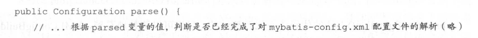 

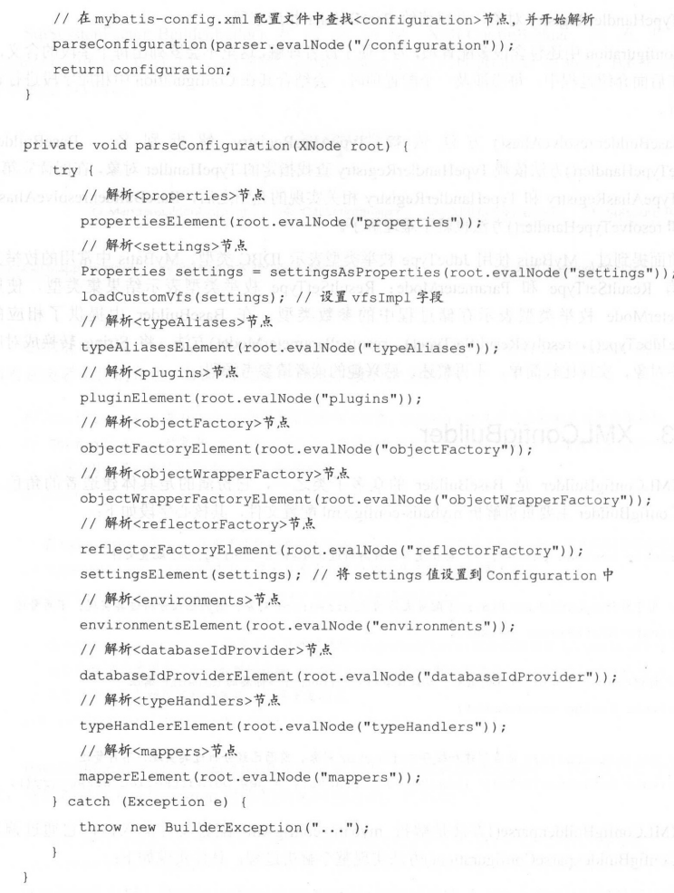 

#### 解析properties节点

XMLConfigBuilder.propertiesElement0方法会解析 ybatis-configxml 配置文件中的<properties>节点并形成javautil.Properties 对象，之后将该 Properties 对象设置到XPathParser 和Configuration的 variables 字段中。在后面的解析过程中，会使用该 Properties 对象中的信息替换占位符。propertiesElement0方法的具体实现如下:

 

#### 解析settings节点

​	XMLConfigBuildersettingsAsProperties0方法负责解析<settings>节点，在<settings>节点下的配置是 MyBatis 全局性的配置，它们会改变 MyBatis 的运行时行为，具体配置项的含义请读者参考MyBatis官方文档。需要注意的是，在 MyBatis 初始化时，这些全局配置信息都会被记录到Configuration 对象的对应属性中；

```
  private void settingsElement(Properties props) {
    configuration.setAutoMappingBehavior(AutoMappingBehavior.valueOf(props.getProperty("autoMappingBehavior", "PARTIAL")));
    configuration.setAutoMappingUnknownColumnBehavior(AutoMappingUnknownColumnBehavior.valueOf(props.getProperty("autoMappingUnknownColumnBehavior", "NONE")));
    configuration.setCacheEnabled(booleanValueOf(props.getProperty("cacheEnabled"), true));
    configuration.setProxyFactory((ProxyFactory) createInstance(props.getProperty("proxyFactory")));
    configuration.setLazyLoadingEnabled(booleanValueOf(props.getProperty("lazyLoadingEnabled"), false));
    configuration.setAggressiveLazyLoading(booleanValueOf(props.getProperty("aggressiveLazyLoading"), false));
    configuration.setMultipleResultSetsEnabled(booleanValueOf(props.getProperty("multipleResultSetsEnabled"), true));
    configuration.setUseColumnLabel(booleanValueOf(props.getProperty("useColumnLabel"), true));
    configuration.setUseGeneratedKeys(booleanValueOf(props.getProperty("useGeneratedKeys"), false));
    configuration.setDefaultExecutorType(ExecutorType.valueOf(props.getProperty("defaultExecutorType", "SIMPLE")));
    configuration.setDefaultStatementTimeout(integerValueOf(props.getProperty("defaultStatementTimeout"), null));
    configuration.setDefaultFetchSize(integerValueOf(props.getProperty("defaultFetchSize"), null));
    configuration.setDefaultResultSetType(resolveResultSetType(props.getProperty("defaultResultSetType")));
    configuration.setMapUnderscoreToCamelCase(booleanValueOf(props.getProperty("mapUnderscoreToCamelCase"), false));
    configuration.setSafeRowBoundsEnabled(booleanValueOf(props.getProperty("safeRowBoundsEnabled"), false));
    configuration.setLocalCacheScope(LocalCacheScope.valueOf(props.getProperty("localCacheScope", "SESSION")));
    configuration.setJdbcTypeForNull(JdbcType.valueOf(props.getProperty("jdbcTypeForNull", "OTHER")));
    configuration.setLazyLoadTriggerMethods(stringSetValueOf(props.getProperty("lazyLoadTriggerMethods"), "equals,clone,hashCode,toString"));
    configuration.setSafeResultHandlerEnabled(booleanValueOf(props.getProperty("safeResultHandlerEnabled"), true));
    configuration.setDefaultScriptingLanguage(resolveClass(props.getProperty("defaultScriptingLanguage")));
    configuration.setDefaultEnumTypeHandler(resolveClass(props.getProperty("defaultEnumTypeHandler")));
    configuration.setCallSettersOnNulls(booleanValueOf(props.getProperty("callSettersOnNulls"), false));
    configuration.setUseActualParamName(booleanValueOf(props.getProperty("useActualParamName"), true));
    configuration.setReturnInstanceForEmptyRow(booleanValueOf(props.getProperty("returnInstanceForEmptyRow"), false));
    configuration.setLogPrefix(props.getProperty("logPrefix"));
    configuration.setConfigurationFactory(resolveClass(props.getProperty("configurationFactory")));
    configuration.setShrinkWhitespacesInSql(booleanValueOf(props.getProperty("shrinkWhitespacesInSql"), false));
    configuration.setDefaultSqlProviderType(resolveClass(props.getProperty("defaultSqlProviderType")));
  }
```


例如，开发人员可以通过配置autoMappingBehavior 修改MyBatis 是否开启自动映射的功

settingsAsPropertie()方法的解析方式与propertiesElement()方法类似，但是多了使用MetaClass 检测 key 指定的属性在 Configuration 类中是否有对应 setter 方法的步骤。MetaClass的实现在前面已经介绍过了，这里不再重复。settingsAsProperties 0方法的代码如下:

```
private Properties settingsAsProperties(XNode context) {
  if (context == null) {
    return new Properties();
  }
  Properties props = context.getChildrenAsProperties();
  // Check that all settings are known to the configuration class
  MetaClass metaConfig = MetaClass.forClass(Configuration.class, localReflectorFactory);
  for (Object key : props.keySet()) {
    if (!metaConfig.hasSetter(String.valueOf(key))) {
      throw new BuilderException("The setting " + key + " is not known.  Make sure you spelled it correctly (case sensitive).");
    }
  }
  return props;
}
```

#### 解析typeAliases

XMLConfigBuilder.typeAliasesElement0方法负责解析< typeAliases>节点及其子节点，并通过TypeAliasRegistry 完成别名的注册，具体实现如下:

 

XMLConfigBuildertypeHandlerElement0方法负责解析<typeHandlers>节点，并通过TypeHandlerRegistry对象完成 TypeHandler 的注册，该方法的实现与上述 typeAliasesElement(方法类似，不再赘述。

#### 解析plugins

插件是 MyBatis 提供的扩展机制之一，用户可以通过添加自定义插件在 SQL语句执行过程中的某一点进行拦截。MyBatis中的自定义插件只需实现 Interceptor 接口，并通过注解指定想要拦截的方法签名即可。这里先来分析 MyBatis 中如何加载和管理插件。XMLConfigBuilder.pluginElement0方法负责解析<plugins>节点中定义的插件，并完成实例化和配置操作，具体实现如下:

 

​	所有配置的 Interceptor 对象都是通过 Configuration.interceptorChain 字段 (InterceptorChain类型)管理的，InterceptorChain 底层使用ArrayList<Interceptor>实现

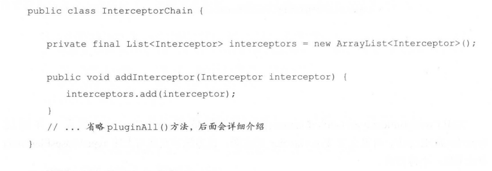 

#### 解析objectFactory

我们可以通过添加自定义 Objectory 实现类ObjectWrapperFactory 实现类以及 ReflectorFactory 实现类对MyBatis 进行扩展。
XMLConfigBuilder.obiectFactoryElement0方法负责解析并实例化<objectFactory>节点指定的ObjectFactory 实现类，之后将自定义的 ObjectFactory 对象记录到 Configuration.objectFactory字段中，具体实现如下:

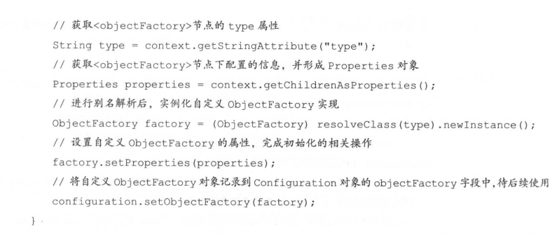 

XMLConfigBuilder 对<objectWrapperFactory>节点、<reflectorFactory>节点的解析与上述过程类似，最终会将解析得到的自定义对象记录到 Configuration 的相应字段中，不再单独介绍

#### 解析environment节点

​	在实际生产中，同一项目可能分为开发、测试和生产多个不同的环境，每个环境的配置可能也不尽相同。MyBatis可以配置多个<environment>节点，每个<environment>节点对应一种环境的配置。但需要注意的是，尽管可以配置多个环境，每个SqlSessionFactory 实例只能选择其
​	XMLConfigBuilder.environmentsElement0方法负责解析<environments>的相关配置，它会根据XMLConfigBuilder.environment 字段值确定要使用的<environment>配置，之后创建对应的TransactionFactory 和 DataSource 对象，并封装进Environment 对象中。environmentsElement()方法的具体实现如下:

 

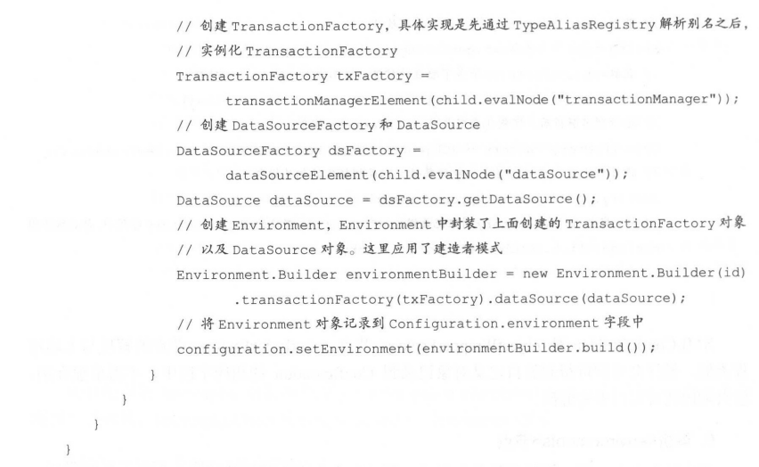 

#### 解析databaseIdProvider节点

​	MyBatis不能像Hibermate那样，直接帮助开发人员屏蔽多种数据库产品在SQL语言支持方面的差异。但是在 mybatis-config.xml配置文件中，通过<databaseldProvider>定义所有支持的数据库产品的 databaseld，然后在映射配置文件中定义 SOL 语节点时，通过databaseld 指定该SOL语句应用的数据库产品，这样也可以实现类似的功能。
​	在MyBatis初始化时，会根据前面确定的 DataSource 确定当前使用的数据库产品，然后在解析映射配置文件时，加载不带 databaseId 属性和带有匹配当前数据库 databaseld 属性的所有SOL 语句。如果同时找到带有 databaseld 和不带 databaseld 的相同语句，则后者会被舍弃，使用前者。
XMLConfigBuilder.databaseldProviderElement0)方法负责解析<databaseldProvider>节点，并创建指定的 DatabaseldProvider 对象。DatabaseIdProvider 会返回databaseId 值，MyBatis 会根据databaseId 选择合适的SOL进行执行。

```
private void databaseIdProviderElement(XNode context) throws Exception {
  DatabaseIdProvider databaseIdProvider = null;
  if (context != null) {
    String type = context.getStringAttribute("type");
    // awful patch to keep backward compatibility
    if ("VENDOR".equals(type)) {
      type = "DB_VENDOR";
    }
    Properties properties = context.getChildrenAsProperties();
    databaseIdProvider = (DatabaseIdProvider) resolveClass(type).getDeclaredConstructor().newInstance();
    databaseIdProvider.setProperties(properties);
  }
  Environment environment = configuration.getEnvironment();
  if (environment != null && databaseIdProvider != null) {
    String databaseId = databaseIdProvider.getDatabaseId(environment.getDataSource());
    configuration.setDatabaseId(databaseId);
  }
}
```

 

 

MyBatis 提供的 DatabaseldProvider 接口及其实现比较简单，在这里一并介绍了。DatabaseIdProvider 接口的核心方法是 getDatabaseld0方法，它主要负责通过给定的 DataSource来查找对应的 databaseld.MyBatis 提供了 VendorDatabaseldProvider 和 DefaultDatabaseldProvider两个实现，其中DefaultDatabaseIdProvider 已过时，故不再分析。
VendorDatabaseldProvider.getDatabaseId0方法在接收到 DataSource 对象时，会先解析DataSource 所连接的数据库产品名称，之后根据<databaseldProvider>节点配置的数据库产品名称与databaseId 的对应关系确定最终的databaseId。

 

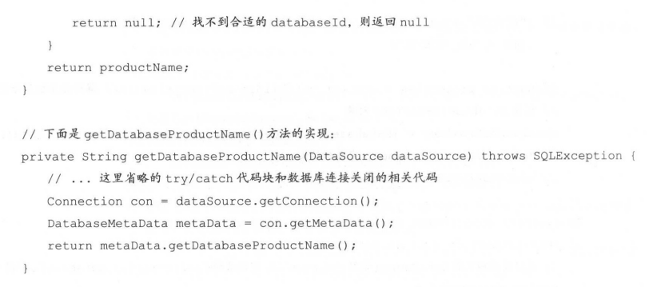 


#### 解析mappers节点

​	在MyBatis 初始化时，除了加载mybatis-configxml配置文件，还会加载全部的映射配置文件,mybatis-config.xml配置文件中的<mappers>节点会告诉 MyBatis 去哪些位置查找映射配置文件以及使用了配置注解标识的接口。
​	XMLConfigBuildermapperElement0方法负责解析<mappers>节点，它会创建XMLMapperBuilder对象加载映射文件，如果映射配置文件存在相应的 Mapper 接口，也会加载相应的Mapper接口，解析其中的注解并完成向MapperRegistry 的注册。

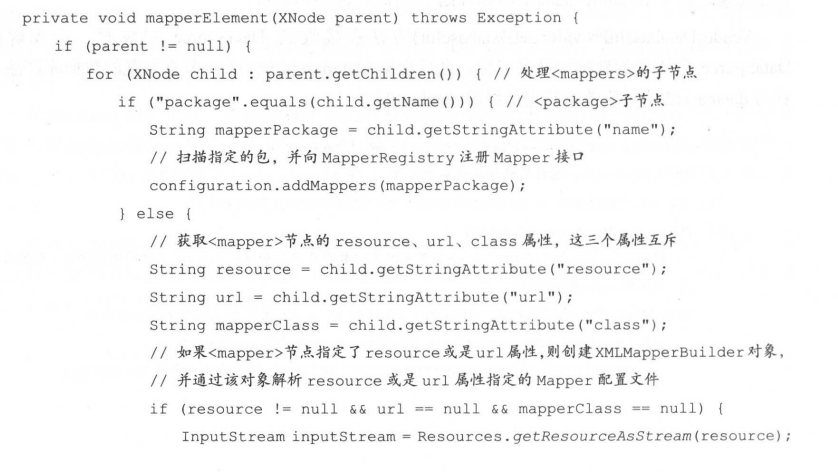 

 

### XMLMaperBuilder

通过对XMLConfigBuildermapperElement0方法的介绍我们知道，XMLMapperBuilder 负责解析映射配置文件，它继承了 BaseBuilder 抽象类，也是具体建造者的角色。XMLMapper-Builder.parse0方法是解析映射文件的入口，具体代码如下:

```
public class XMLMapperBuilder extends BaseBuilder {

  private final XPathParser parser;
  private final MapperBuilderAssistant builderAssistant;
  private final Map<String, XNode> sqlFragments;
  private final String resource;
```

parse方法

```
public void parse() {
  if (!configuration.isResourceLoaded(resource)) {

    configurationElement(parser.evalNode("/mapper"));
      //将resource添加到Configuration,loadedResources 集合中保存,它是HashSet<String
      //类型的集合，其中记录了已经加载过的映射文件。
    configuration.addLoadedResource(resource);
    bindMapperForNamespace();
  }
// 处理 configurationElement()方法中解析失败的<resultMap>节点
  parsePendingResultMaps();
  // 处理 configurationElement()方法中解析失败的<cache-ref>节点
  parsePendingCacheRefs();
  //处理 configurationElement （）方 法中解析失败的 SQL 语句节点
  parsePendingStatements();
}
```

XMLMapperBuilder 也是将每个节点的解析过程封装成了一个方法，而这些方法由XMLMapperBuilderconfigurationElement0方法调用，本小节将逐一分析这些节点的解析过程configurationElemen（）方法的具体实现如下:

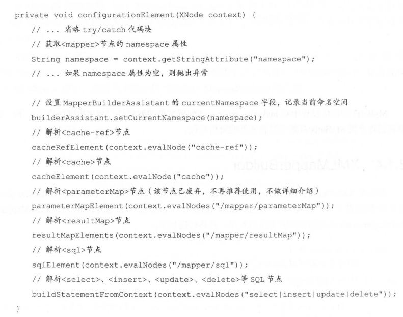 

#### cache节点

​	MyBatis 拥有非常强大的二级缓存功能，该功能可以非常方便地进行配置，MyBatis 默认情况下没有开启二级缓存，如果要为某命名空间开启二级缓存功能，则需要在相应映射配置文件中添加<cache>节点，还可以通过配置<cache>节点的相关属性，为二级缓存配置相应的特性(本质上就是添加相应的装饰器)。
​	XMLMapperBuilder.cacheElement0方法主要负责解析<cache>节点，其具体实现如下

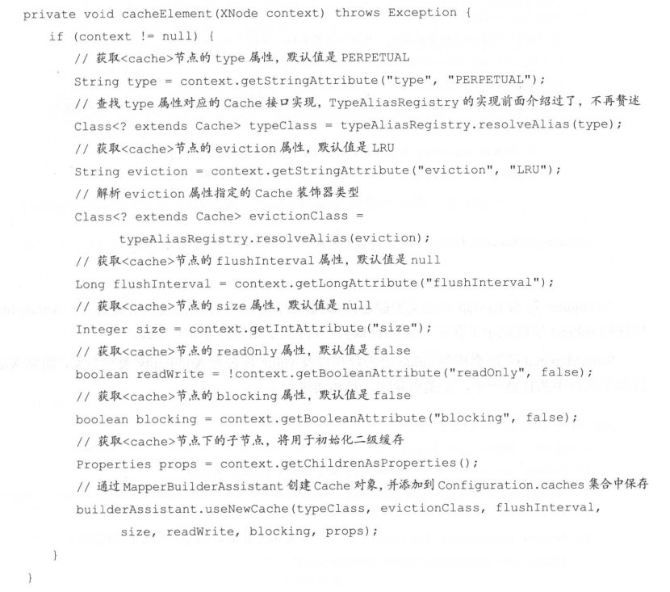 

​	MapperBuilderAssistant 是一个辅助类，其 useNewCache0方法负责创建 Cache 对象，并将其添加到 Configuration.caches 集合中保存。Configuration 中的 caches 字段是 StrictMap<Cache>类型的字段，它记录 Cache 的id(默认是映射文件的 namespace)与 Cache 对象(二级缓存)之间的对应关系。StrictMap 继承了 HashMap，并在其基础上进行了少许修改，这里重点关注StrictMap.put0方法，如果检测到重复的 key 则抛出异常，如果没有重复的 key 则添加 key 以及value，同时会根据key 产生shortKey，具体实现如下:

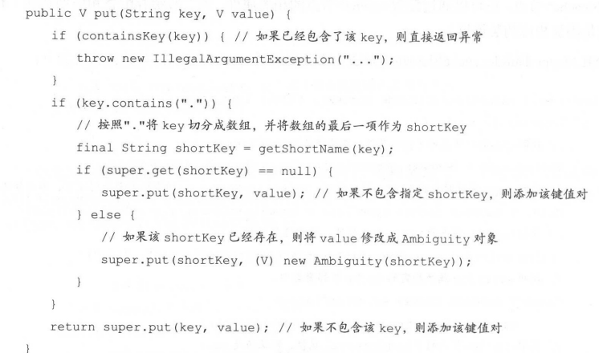 

Ambiguity 是StrictMap 中定义的静态内部类它表示的是存在二义性的键值对。Ambiguity中使用subject字段记录了存在二义性的 key，并提供了相应的getter 方法。

StrictMap.get0方法会测 value 是否存在以及 value 是否为Ambiguity 类型对象，如果满足这两个条件中的任意一个，则抛出异常。具体实现如下:

 

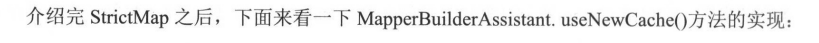 

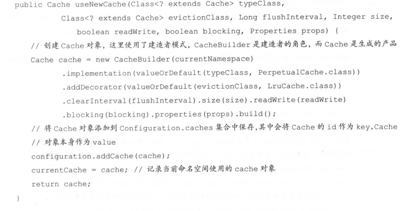 

 

CacheBuilder 中提供了很多设置属性的方法(对应于建造者中的建造方法)，这些方法比较简单，不再赘述。这里重点分析 CacheBuilder.build0方法，该方法根据 CacheBuilder 中上述字段的值创建Cache 对象并添加合适的装饰器，具体实现如下:

 

CacheBuildersetCacheProperties0方法会根据<cache>节点下配置的<property>信息，初始化Cache对象，具体实现如下:

 

 

CacheBuildersetStandardDecorators0方法会根据 CacheBuilder 中各个字段的值，为cache对象添加对应的装饰器，具体实现如下:

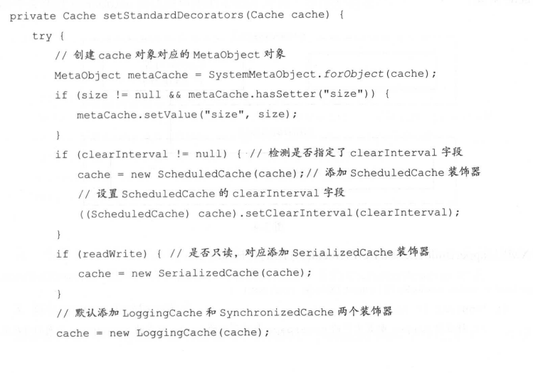 

 

#### cache-ref节点

​	通过前面对<cache>节点解析过程的介绍我们知道，XMLMapperBuilder.cacheElement0方法会为每个 namespace 创建一个对应的 Cache 对象，并在 Configuration.caches 集合中记录namespace 与Cache对象之间的对应关系。如果我们希望多个namespace 共用同一个二级缓存即同一个Cache对象，则可以使用<cache-re 节点进行配置。
​	XMLMapperBuilder.cacheRefElement0方法负责解析<cache-re节点。这里首先需要读者了解的是 Configuration.cacheRefMap 集合，该集合是 HashMap<String,String>类型，其中 key 是<cache-ref节点所在的 namespace，value 是<cache-re节点的 namespace 属性所指定的namespace。也就是说,前者共用后者的 Cache对象,namespace2 共用了namespacel的Cache对象。

 

XMLMapperBuilder.cacheRefElement0)方法的代码如下

// 将当前 Mapper 配置文件的 namespace 与被引用的 Cache 所在的 namespace 之间的对应关系，

 

CacheRefResolver 是一个简单的 Cache 引用解析器，其中封装了被引用的 namespace 以及当前XMLMapperBuilder对应的MapperBuilderAssistant对象。CacheRefResolver.resolveCacheRef0方法会调用 MapperBuilderAssistant.useCacheRef0)方法。在 MapperBuilderAssistant.useCacheRef0方法中会通过namespace查找被引用的Cache对象，具体实现如下:

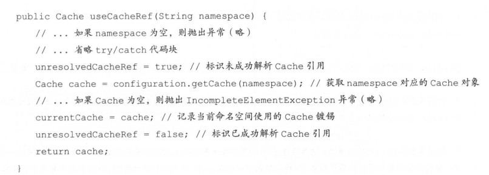 

另一个需要了解的 Configuration 字段是 incompleteCacheRefs 集合，它是 LinkedList<CacheRefResolver>类型，其中记录了当前解析出现异常的 CacheRefResolver 对象。

#### parameter节点

在MyBatis 的官方文档中明确标记<parameterMap>节点已废弃了，在将来的版本中可能会被移除，所以不建议大家使用，这里也不做详细介绍

#### resultMap节点

 


​	select 语句查询得到的结果集是一张二维表，水平方向上看是一个个字段，垂直方向上看是条条记录。而 Java 是面向对象的程序设计语言，对象是根据类定义创建的，类之间的引用关系可以认为是嵌套的结构。在JDBC 编程中，为了将结果集中的数据映射成对象，我们需要自己写代码从结果集中获取数据，然后封装成对应的对象并设置对象之间的关系，而这些都是大量的重复性代码。为了减少这些重复的代码，MyBatis 使用<resultMap>节点定义了结果集与结果对象 (JavaBean 对象)之间的映射规则，<resultMap>节点可以满足绝大部分的映射需求，从而减少开发人员的重复性劳动，提高开发效率。

```
private ResultMap resultMapElement(XNode resultMapNode) {
  return resultMapElement(resultMapNode, Collections.emptyList(), null);
}

private ResultMap resultMapElement(XNode resultMapNode, List<ResultMapping> additionalResultMappings, Class<?> enclosingType) {
  ErrorContext.instance().activity("processing " + resultMapNode.getValueBasedIdentifier());
  String type = resultMapNode.getStringAttribute("type",
      resultMapNode.getStringAttribute("ofType",
          resultMapNode.getStringAttribute("resultType",
              resultMapNode.getStringAttribute("javaType"))));
  Class<?> typeClass = resolveClass(type);
  if (typeClass == null) {
    typeClass = inheritEnclosingType(resultMapNode, enclosingType);
  }
  Discriminator discriminator = null;
  List<ResultMapping> resultMappings = new ArrayList<>(additionalResultMappings);
  List<XNode> resultChildren = resultMapNode.getChildren();
  for (XNode resultChild : resultChildren) {
    if ("constructor".equals(resultChild.getName())) {
      processConstructorElement(resultChild, typeClass, resultMappings);
    } else if ("discriminator".equals(resultChild.getName())) {
      discriminator = processDiscriminatorElement(resultChild, typeClass, resultMappings);
    } else {
      List<ResultFlag> flags = new ArrayList<>();
      if ("id".equals(resultChild.getName())) {
        flags.add(ResultFlag.ID);
      }
      resultMappings.add(buildResultMappingFromContext(resultChild, typeClass, flags));
    }
  }
  String id = resultMapNode.getStringAttribute("id",
          resultMapNode.getValueBasedIdentifier());
  String extend = resultMapNode.getStringAttribute("extends");
  Boolean autoMapping = resultMapNode.getBooleanAttribute("autoMapping");
  ResultMapResolver resultMapResolver = new ResultMapResolver(builderAssistant, id, typeClass, extend, discriminator, resultMappings, autoMapping);
  try {
    return resultMapResolver.resolve();
  } catch (IncompleteElementException e) {
    configuration.addIncompleteResultMap(resultMapResolver);
    throw e;
  }
}
```

​	在开始介绍<resultMap>节点的解析过程之前，先来介绍该过程中使用的数据结构。每个ResultMapping对象记录了结果集中的一列与 JavaBean 中一个属性之间的映射关系。在后面的分析过程中我们可以看到，<resultMap>节点下除了<discriminator>子节点的其他子节点，都会被解析成对应的ResultMapping对象。ResultMapping 中的核心字段含义如下:

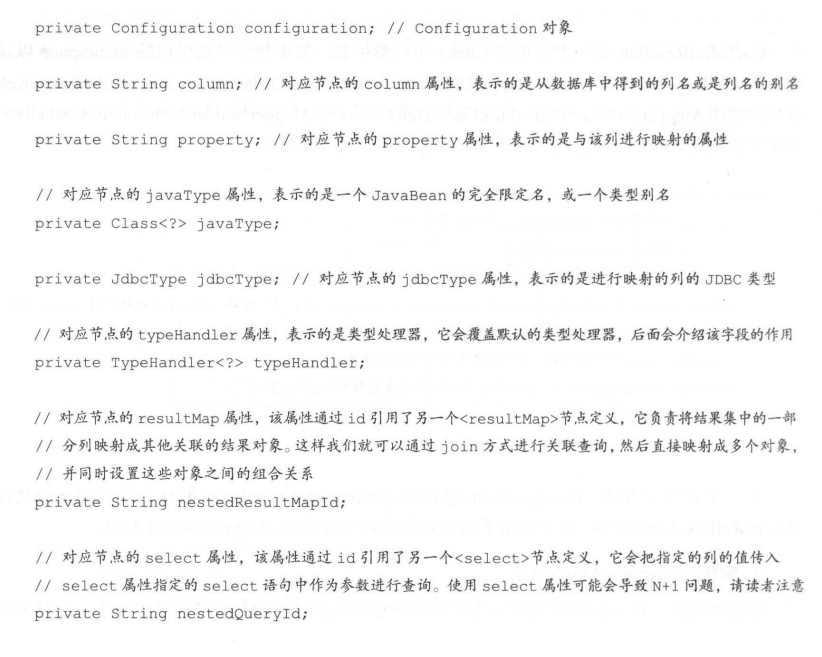 

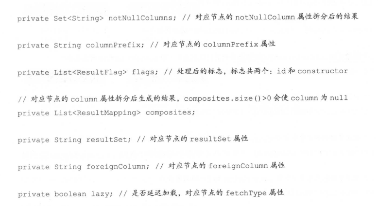 

#### sql节点

在映射配置文件中，可以使用<sql>节点定义可重用的 SQL 语句片段。当需要重用<sqI>节点中定义的 SOL 语句片段时，只需要使用<include>节点引入相应的片段即可，这样，在编写SQL 语句以及维护这些 SQL 语句时，都会比较方便。<include>节点的解析在后面详细介绍。XMLMapperBuilder.sqlElement0方法负责解析映射配置文件中定义的全部<sq>节点，具体实现代码如下:

 

### XMLStatementBuilder

SOL节点。这些SOL节点主要用于定义SQL语,它们不再由XMLMapperBuilder进行解析，而是由XMLStatementBuilder 负责进行解析。
MyBatis使用 SqlSource 接口表示映射文件或注解中定义的SOL语，但它表示的SOL语句是不能直接被数据库执行的，因为其中可能含有动态 SOL 语句相关的节点或是占位符等需要解析的元素。SqlSource 接口的定义如下:

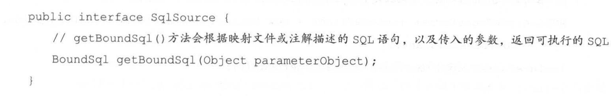 

#### 解析入口

XmlMapperBuilder进行解析sql

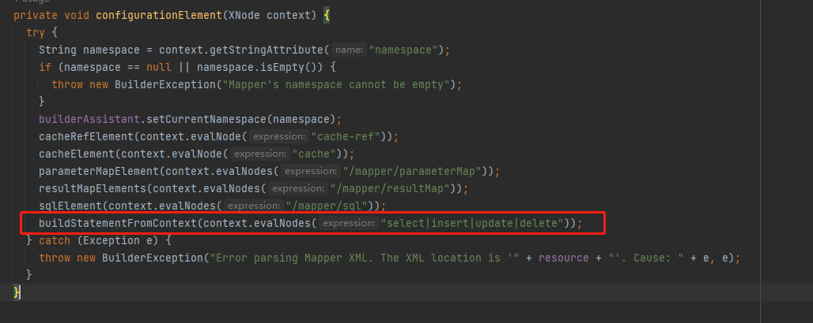 

```
private void buildStatementFromContext(List<XNode> list, String requiredDatabaseId) {
  for (XNode context : list) {
    final XMLStatementBuilder statementParser = new XMLStatementBuilder(configuration, builderAssistant, context, requiredDatabaseId);
    try {
      statementParser.parseStatementNode();
    } catch (IncompleteElementException e) {
      configuration.addIncompleteStatement(statementParser);
    }
  }
}
```

MyBatis 使用 MappedStatement 表示映射配置文件中定义的 SQL 节点，MappedStatement包含了这些节点的很多属性，其中比较重要的字段如下:

 

#### 节点解析

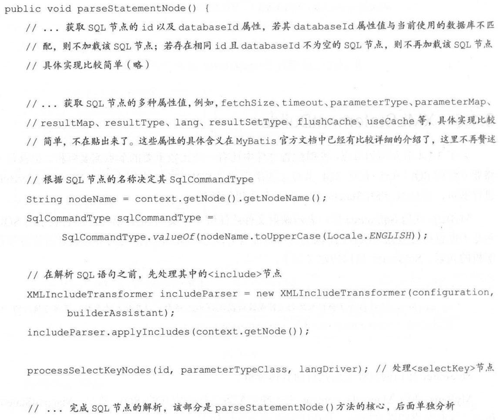 

#### include节点

在解析SOL节点之前,首先通过XMLIncludeTransformer 解析SOL语句中的<include>节点,该过程会将<include>节点替换成<sq节点中定义的 SQL 片段，并将其中的“Sxxx”占位符替换成真实的参数，该解析过程是在XMLIncludeTransformerapplyIncludes0方法中实现的:

 

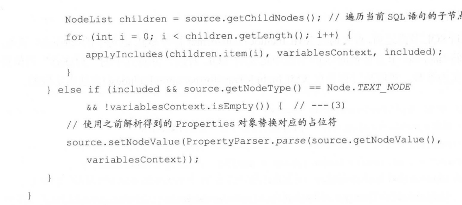 

该解析过程可能会涉及多层递归，为了便于读者理解，这里通过一个示例进行分析，示例

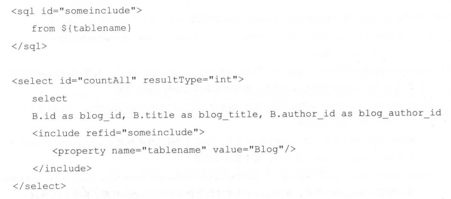 

<include>节点和<sq>节点可以配合使用、多层嵌套，实现更加复杂的 sql 片段的重用，这样的话，解析过程就会递归更多层，流程变得更加复杂，但本质与上述分析过程相同；

#### selectKey节点

​	在<insert>、<update>节点中可以定义<selectKey>节点来解决主键自增问题，<selectKey>节点对应的KeyGenerator 接口在后面会详细介绍，现在重点关注<selectKey>节点的解析，读者大概了解KeyGenerator 接口与主键的自动生成有关即可。

​	XMLStatementBuilder,processSelectKeyNodes0方法负责解析 SQL节点中的<selectKey>子节点，具体代码如下:

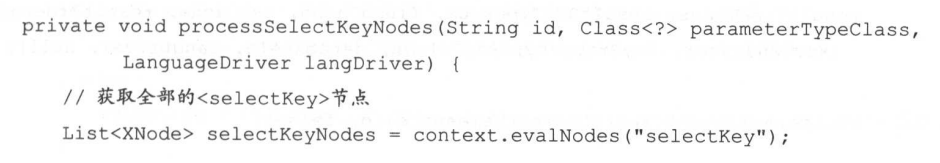 

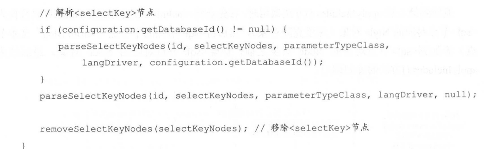 

​	在 parseSelectKeyNodes 0方法中会为<selectKey>节点生成id，检测 databaseId 是否匹配以及是否已经加载过相同id 且databaseId 不为空的selectKey>节点，并调用 parseSelectKeyNode0方法处理每个<selectKey>节点。
​	在 parseSelectKeyNode0方法中，首先读取<selectKey>节点的一系列属性，然后调用LanguageDriver.createSqlSource0方法创建对应的 SqlSource 对象，最后创建 MappedStatement 对象，并添加到 ConfigurationmappedStatements 集合中保存。parseSelectKeyNode0方法的具体实现如下:

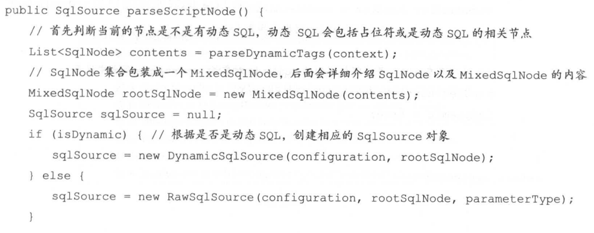 

在XMLScriptBuilderparseDynamicTags0方法中，会遍历<selectKey>下的每个节点，如果包含任何标签节点，则认为是动态 SQL 语句;如果文本节点中含有“S”占位符，也认为其为动态SOL语句。

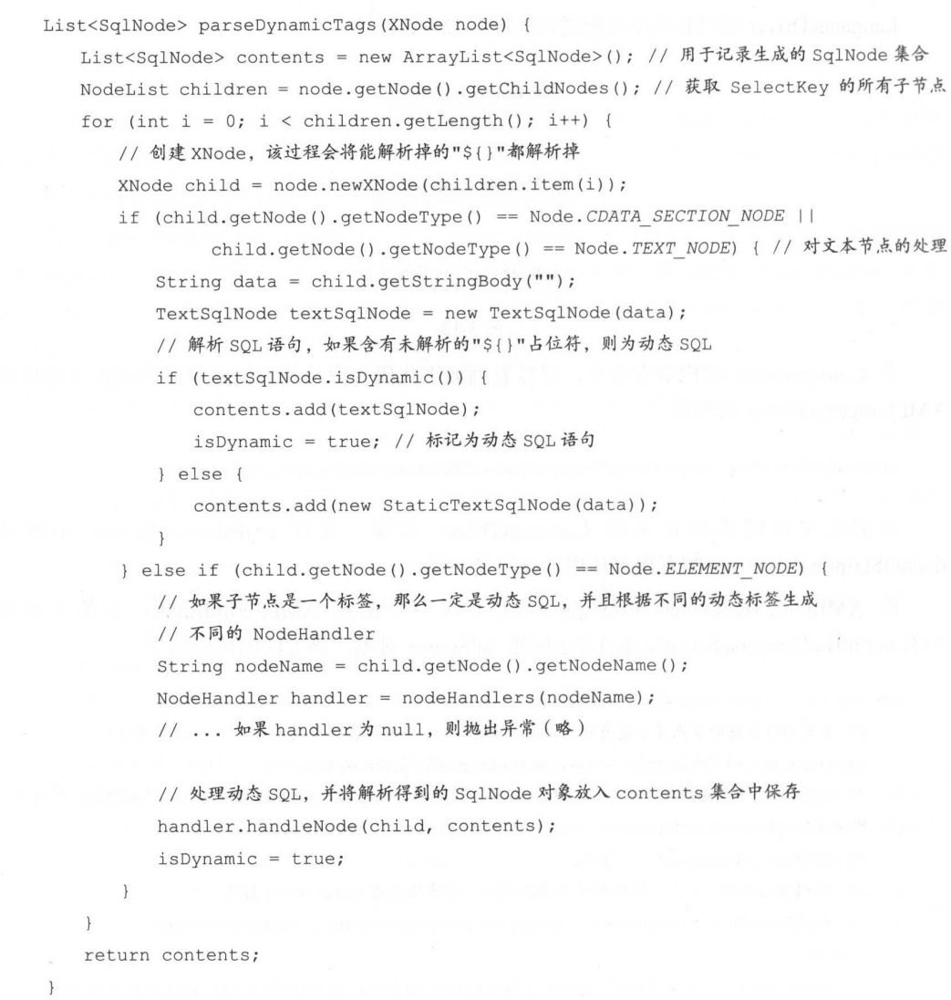 

上面遇到的 TextSgINode、StaticTextSgINode 等都是SgINode 接口的实现，SgINode 接口的每个实现都对应于不同的动态 SOL 节点类型，每个实现的具体代码后面遇到了再详细分析。TextSqINodeisDynamic()方法中会通过 GenericTokenParser 和 DynamicCheckerTokenParser配合解析文本节点，并判断它是否为动态 SOL。该方法具体实现如下: 

 

的 NodeHandler 对象，具体实现如下:
如果<selectKey>节点下存在其他标签,则会调用nodeHandlers0方法根据标签名称创建对应 

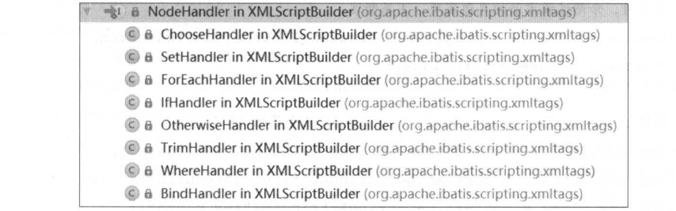 

NodeHandler 接口实现类会对不同的动态 SQL标签进行解析，生成对应的 SINode 对象并将其添加到contents集合中。这里以WhereHandler 实现为例进行分析，其具体实现如下:

 


#### sql节点

经过上述两个解析过程之后，<include>节点和<selectKey>节点已经被解析并删除掉了。XMLStatementBuilder.parseStatementNode0方法剩余的操作就是解析SOL节点,具体代码如下:

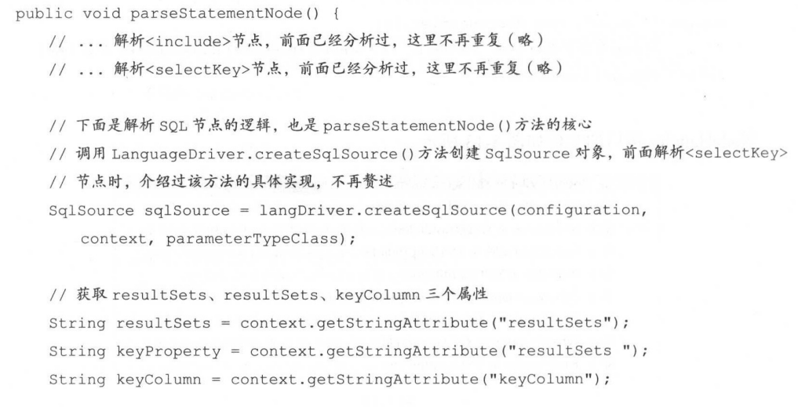 

 

### 绑定mapper

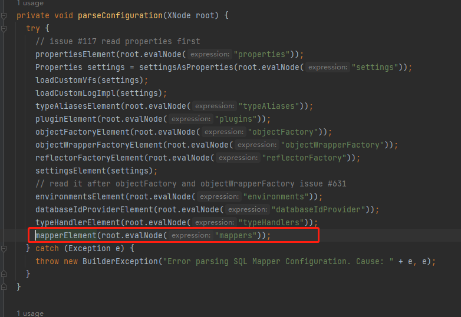

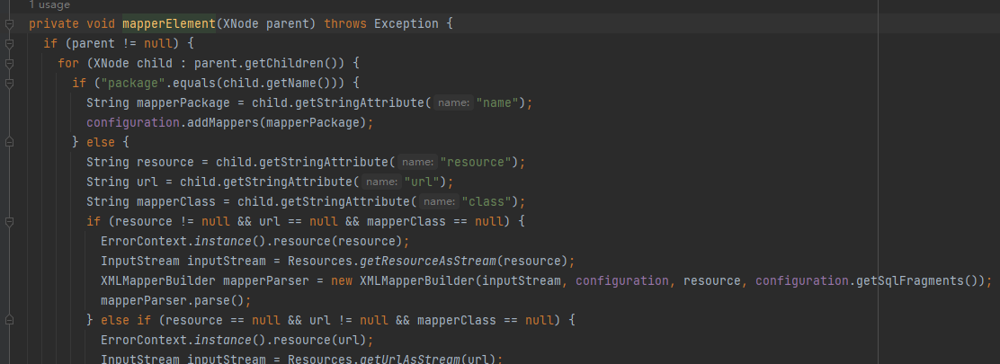 

​	binding模块的介绍可知每个映射配置文件的命名空间可以绑定一个 Mapper 接口，并注册到 MapperRegistry 中MapperRegistry 以及其他相关类的实现在分析 binding 模块时已经介绍过了，这里不再重复。在XMLMapperBuilder.bindMapperForNamespace0方法中，完成了映射配置文件与对应 Mapper 接口的绑定，具体实现如下:

 

 

​	在前面介绍 MapperRegistryaddMapper0方法时，只提到了该方法会向 MapperRegistryknownMappers集合注册指定的 Mapper 接口，其实该方法还会创建MapperAnnotationBuilder,并调用MapperAnnotationBuilderparse0方法解析 Mapper 接口中的注解信息，具体实现如下: 

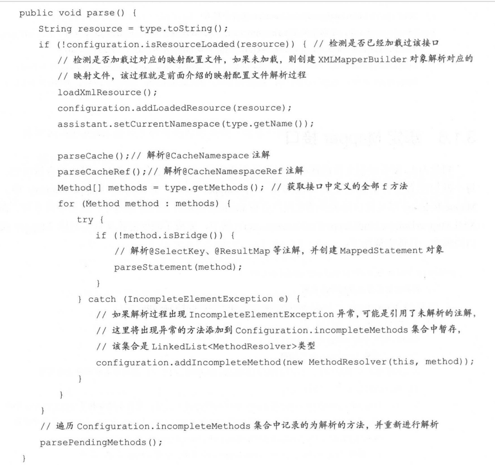 

在MapperAnnotationBuilderparse0方法中解析的注解，都能在映射配置文件中找到与之对应的XML 节点，且两者的解析过程也非常类似，这里就不再详细分析注解的解析过程了。

### incompelte集合

​	XMLMapperBuilder.configurationElement0方法解析映射配置文件时，是按照从文件头到文件尾的顺序解析的，但是有时候在解析一个节点时，会引用定义在该节点之后的、还未解析的节点，这就会导致解析失败并抛出IncompleteElementException。

​	根据抛出异常的节点不同，MyBatis 会创建不同的*Resolver 对象，并添加到 Configuration的不同 incomplete*集合中。例如，上面解析 Mapper 接口中的方法出现异常时，会创建MethodResolver 对象，并将其追加到 ConfigurationincompleteMethods 集合 ( LinkedListMethodResolver>类型)中暂存;解析<resultMap>节点时出现异常，则会将对应的ResultMapResolver 对象追加到incompleteResultMaps (LinkedList<ResultMapResolver>类型)集合中暂存;解析<cache-re节点时出现异常，则会将对应的 CacheRefResolver 对象追加到incompleteCacheRefs (LinkedList<CacheRefResolver>类型)集合中暂存:解析 SOL 语句节点时出现异常，则会将对应的 XMLStatementBuilder 对象追加到 incompleteStatements (LinkedList<XMLStatementBuilder >类型)集合中暂存。

​	在XMLMapperBuilderparse0方法中可以看到，通过configurationElement0方法完了一次映射配置文件的解析后,还会调用 parsePendingResultMaps0方法、parsePendingChacheRefs0方法、parsePendingStatements0方法三个 parsePending*0方法处理Configuration 中对应的三个incomplete*集合。所有 parsePending*0方法的逻辑都是基本类似的，这里以parsePendingStatements0方法为例进行分析，其具体实现如下:

  

 

## sql语句

​	映射配置文件中定义的SOL节点会被解析成MappedStatement对象，其中的SQL语会被解析成SglSource 对象，SOL语句中定义的动态SOL节点、文本节点等，则由 SqINode 接口的相应实现表示。SqlSource 接口的定义如下所示。

 

这里对SqlSource接口的各个实现做简单说明。DynamicSglSource负责处理动态SQL语句，RawSalSource 负责处理静态语句，两者最终都会将处理后的 SOL 语封装成 StaticSalSource返回。DynamicSglSource 与 StaticSglSource 的主要区别是: StaticSglSource 中记录的 SOL语句中可能含有“?”占位符，但是可以直接提交给数据库执行:DynamicSqlSource 中封装的 SQL语句还需要进行一系列解析，才会最终形成数据库可执行的 SOL 语句。DynamicSqlSource与RawSglSource的区别在介绍RawSglSource 时会详细说明。

### 组合模式

* 抽象组件(Component):Component 接口定义了树形结构中所有类的共行为，例如这里的 operation0方法。一般情况下，其中还会定义一些用于管理子组件的方法，例如这里的 add0、remove0、getChild0方法。
* 树叶(Leaf): Leaf在树形结构中表示叶节点对象，叶节点没有子节点。
* 树枝(Composite ): 定义有子组件的那些组件的行为。该角色用于管理子组件，并通过operation0方法调用其管理的子组件的相关操作。
* 调用者(Client):通过Component 接口操纵整个树形结构。

​	组合模式主要有两点好处，首先组合模式可以帮助调用者屏蔽对象的复杂性。对于调用者来说，使用整个树形结构与使用单个 Component 对象没有任何区别，也就是说，调用者并不必关心自己处理的是单个 Component 对象还是整个树形结构，这样就可以将调用者与复杂对象进行解耦。另外，使用了组合模式之后，我们可以通过增加树中节点的方式，添加新的 Component

​	对象，从而实现功能上的扩展，这符合“开放-封闭”原则，也可以简化日后的维护工作。组合模式在带来上述好处的同时，也会引入一些问题。例如，有些场景下程序希望一个组合结构中只能有某些特定的组件,此时就很难直接通过组件类型进行限制(因为都是 Component接口的实现类)，这就必须在运行时进行类型检测。而且，在递归程序中定位问题也是一件比较复杂的事情。
​	MyBatis 在处理动态SOL节点时，应用到了组合设计模式。MyBatis 会将动态SOL节点解析成对应的 SgINode实现，并形成树形结构，具体解析过程在本节中还会详细介绍。

### ognl表达式

#### 用法

​	OGNL(Object Graphic Navigation Language，对象图导航语言)表达式在 Struts、MyBatis等开源项目中有广泛的应用其中Struts 框架更是将OGNL作为默认的表达式语言。在MyBatis中涉及的 OGNL 表达式的功能主要是:存取 Java 对象树中的属性、调用 Java 对象树中的方法
首先需要读者了解OGNL表达式中比较重要的三个概念:

* 表达式

  OGNL 表达式执行的所有操作都是根据表达式解析得到的。例如:“对象名方法名”表示调用指定对象的指定方法;“@[类的完全限定名]@[静态方法或静态字段]”表示调用指定类的静态方法或访问静态字段:OGNL 表达式还可以完成变量赋值、操作集合等操作，这里不再费述，感兴趣的读者请参考相关资料进行学习。

* root 对象

  OGNL表达式指定了具体的操作，而root对象指定了需要操作的对象

* OgnlContext(上下文对象)
  OgnlContext类继承了Map接口,OgnlContext对象说白了也就是一个Map对象。既然如此OgnlContext 对象中就可以存放除 root 对象之外的其他对象。在使用 OGNL 表达式操作非 root对象时，需要使用#前缀，而操作 root 对象则不需要使用#前缀。

下面通过一个示例，需要为项目添加ognl-3.1.jar 和javassist-3.21,jar 两个依赖包，这两个jar 包在 MyBatis-3.4 的源码包中可以找到该示例是一个使用Junit 编写的测试类，下面是该类的成员变量和初始方法:

 

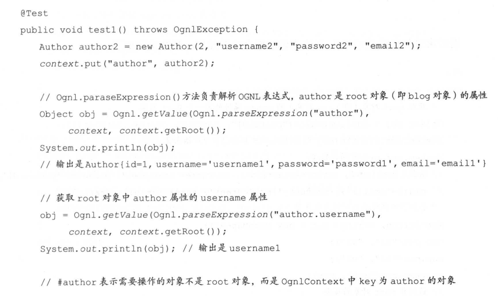 


    


 


 

#### mybatis封装

在MyBatis 中，使用0gnlCache 对原生的 OGNL进行了封装。OGNL表达式的解析过程是比较耗时的，为了提高效率，OgnlCache 中使用 expressionCache 字段(静态成员，ConcurrentHashMap<String,bjec>类型)对解析后的OGNL表达式进行缓存。0gnlCache 的字段和核心方法的实现加下

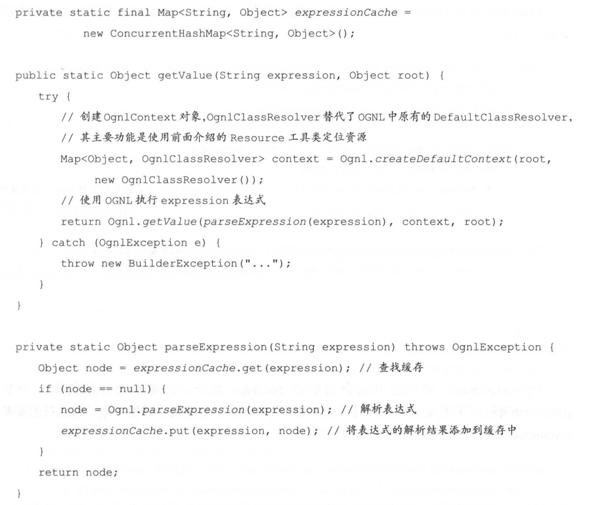 

### DynamicContext

DynamicContext 主要用于记录解析动态 SQL语之后产生的SQL 语片段，可以认为它是一个用于记录动态 SQL 语句解析结果的容器。
unamicConteyt 由核心定段如下：

 

ContextMap 是 DynamicContext 中定义的内部类，它实现了 HashMap 并重写了 get()方法具体实现如下:

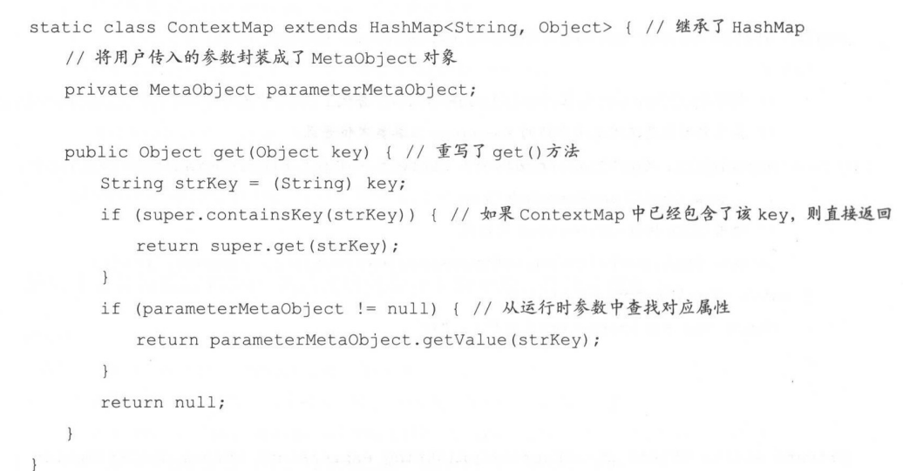 

DynamicContext 的构造方法会初始化 bindings 集合，注意构造方法的第二个参数parameterObiect,它是运行时用户传入的参数其中包含了后续用于替换“# ”占位符的实参DynamicContext构造方法的具体实现如下:

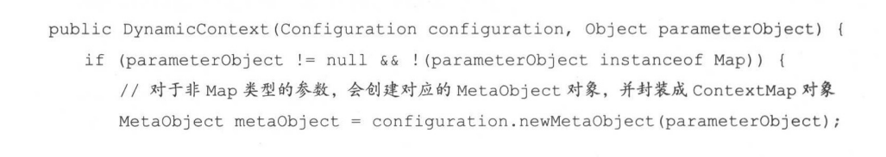 

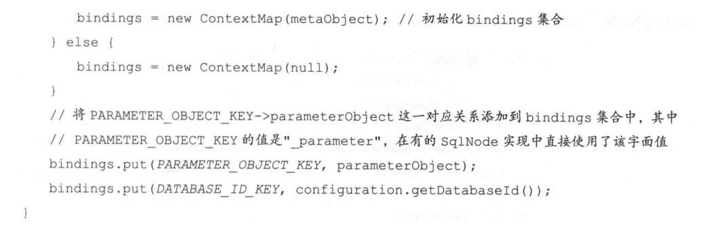 


```
public void appendSql(String sql) {
  sqlBuilder.add(sql);
}

public String getSql() {
  return sqlBuilder.toString().trim();
}
```

### sqlNode

 

SgINode 接口有多个实现类，每个实现类对应一个动态 SOL节点，如图所示。按照组合模式的角色来划分,SqINode 扮演了抽象组件的角色,MixedSgINode 扮演了树枝节点的角色

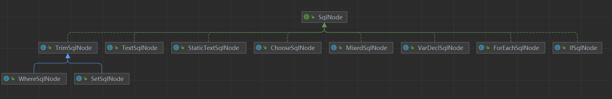 

#### StaticTextSqlNode

​	StaticTextSgINode 中使用 text 字段(String类型)记录了对应的非动态 SOL语节点，其apply()方法直接将 text 字段追加到 DynamicContext.sqlBuilder 字段中，代码比较简单，就不再贴出来了。

#### MixedSqlNode

​	MixedSqINode 中使用 contents 字段(List<SqINode>类型)记录其子节点对应的 SqINode对象集合，其apply0方法会循环调用 contents 集合中所有 SqINode 对象的apply0方法，代码比较简单，就不再贴出来了。

#### TextSqlNode

TextSqINode表示的是包含“${}”占位符的动态 SOL节点。TextSgNodeisDynamic0方法在前面已经分析过了，这里不再重复。TextSqINode.apply0方法会使用 GenericTokenParser 解析“$分”占位符，并直接替换成用户给定的实际参数值，具体实现如下:

 

 

BindingTokenParser是 TextSqINode 中定义的内部类，继承了TokenHandler 接口，它的主要功能是根据 DynamicContext.bindings 集合中的信息解析 SQL 语节点中的“S分”占位符。BindingTokenParser.context 字段指向了对应的DynamicContext 对象BindingTokenParserhandleToken0方法的实现如下;

 

这里通过一个示例简单描述该解析过程，假设用户传入的实参中包含了“id->1”的对应关系，在TextSqINode.apply0方法解析时，会将“id-Sfid;”中的“Sfid;”占位符直接替换成“1”得到“id=1”，并将其追加到DynamicContext中。

#### IfSqlNode

IfSqINode对应的动态SQL 节点是<I节点，其中定义的字段的含义如下:

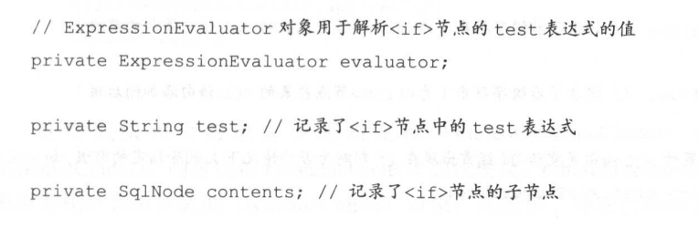 

IfSqINodeapply0方法首先会通过 ExpressionEvaluator.evaluateBoolean0方法检测其test表达式是否为true，然后根据 test表达式的结果，决定是否执行其子节点的apply0方法；

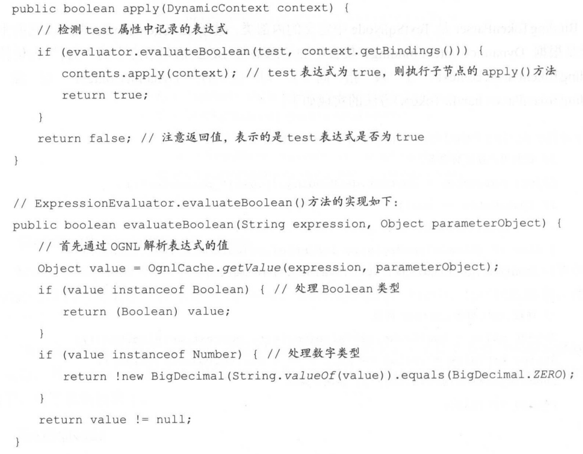 

#### SetSqINode

#### TrimSqINode

 

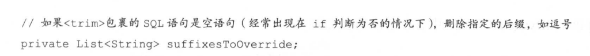 

​	在TrimSqINode 的构造函数中，会调用 parseOverrides0方法对参数 prefixesToOverride(对应<trim>节点的 prefixverrides 属性)和参数 suffixesToOverride (对应<trim>节点的sufixOverrides 属性)进行解析，并初始化 prefixesToOverride 和 suffixesToOverride，具体实现如下:

 

了解了 TrimSqINode 各字段的初始化之后，再来看 TrimSqINodeapply()方法的实现。该方法首先解析子节点，然后根据子节点的解析结果处理前缀和后缀，其具体实现如下:

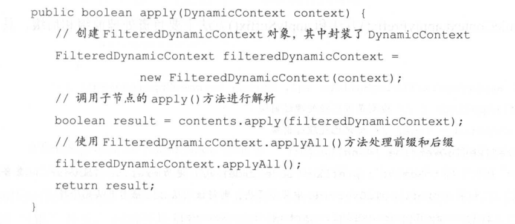 

​	处理前缀和后缀的主要逻辑是在 FilteredDynamicContext 中实现的，它继承了DynamicContext，同时也是 DynamicContext 的代理类。FilteredDynamicContext 除了将对应方法调用委托给其中封装的 DynamicContext 对象，还提供了处理前缀和后缀的 applyAll()方法；

 

 

#### WhereSqlNode

#### SetSqINode 

​	WhereSqINode和 SetSqINode 都继承了 TrimSqINode，其中 WhereSqINode 指定了 prefix 字段为“WHERE”，prefixesToOverride 集合中的项为“AND”和“OR”，suffix 字段和sufixesToOverride 集合为null也就是说<where>节点解析后的SQL语句片段如果以“AND”或“OR”开头，则将开头处的“AND”或“OR”删除，之后再将“WHERE”关键字添加到SQL片段开始位置，从而得到该<where>节点最终生成的SOL片段
​	SetSqlNode 指定了 prefix 字段为“SET”，suffixesToOverride 集合中的项只有“”，， suffix字段和 prefixesToOverride 集合为 null。也就是说,<set节点解析后的 SOL语句片段如果以“”

#### ForeachSqNode

​	在动态SOL语句中构建IN条件语句的时候，通常需要对一个集合进行选代，MyBatis 提供了<foreach>标签实现该功能。在使用<foreach>标签迭代集合时，不仅可以使用集合的元素和索引值，还可以在循环开始之前或结束之后添加指定的字符串，也允许在迭代过程中添加指定的分隔符。
​	<foreach>标签对应的 SqINode 实现是 ForeachSgINode，ForeachSgINode 中各个字段含义和功能如下所示。

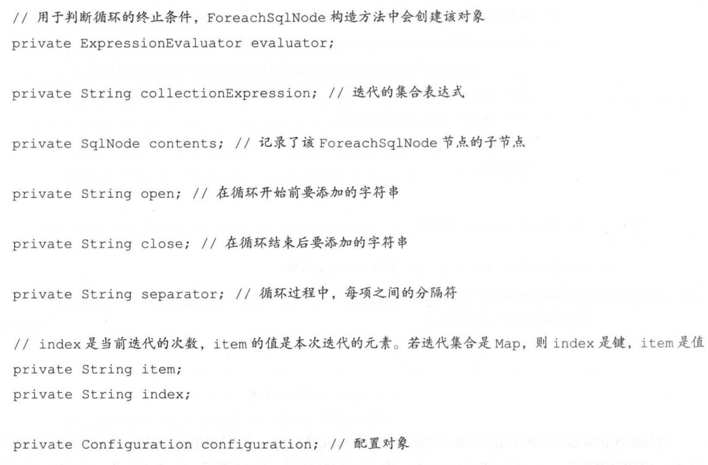 


在开始介绍 ForeachSqINode 的实现之前，先来分析其中定义的两个内部类，分别是PrefixedContext 和 FilteredDynamicContext，它们都继承了DynamicContext，同时也都是DynamicContext的代理类。首先来看 PrefixContext 中各个字段的含义:	

PrefixContext.appendSql0方法会首先追加指定的 prefix 前缀到 delegate 中，然后再将 SQL语句片段追加到 delegate 中，具体实现如下:


FilteredDynamicContext 负责处理“# ”占位符，但它并未完全解析“# ”占位符，其中各个字段的含义如下:

 

​	FilteredDynamicContext.appendSql0方法会将“#{item)”占位符转换成“# frch item 13’的格式，其中“ fich ”是固定的前缀，“item”与处理前的占位符一样，未发生改变，1 则是FilteredDynamicContext 产生的单调递增值;还会将“#itemIndex!”占位符转换成“#frch itemIndex 1)”的格式，其中各个部分的含义同上。该方法的具体实现如下: 

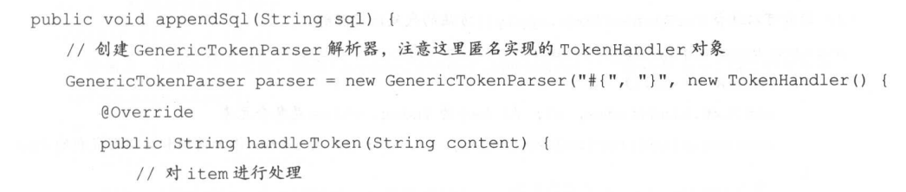 

 

现在回到对 ForEachSqlNode.apply0方法的分析，该方法的主要步骤如下:
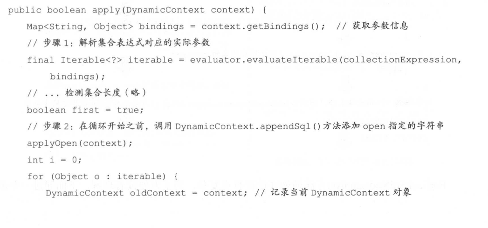

 

示例：

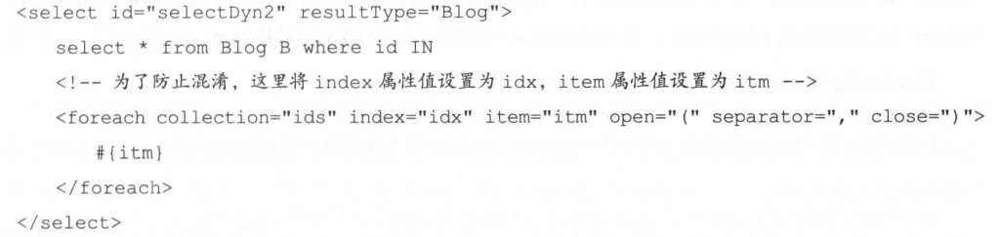 

 

#### ChooseSqlNode

如果在编写动态SOL语句时需要类似Java中的switch语句的功能,可以考虑使用<choose>、<when>和<otherwise>三个标签的组合。MyBatis 会将choose>标签解析成 ChooseSgINode，将<when>标签解析成IfSgINode，将<otherwise>标签解析成MixedSgINode。

ChooseSqINodeapply0方法的逻辑比较简单，首先遍历 ifSgINodes 集合并调用其中 SqINode对象的apply0方法，然后根据前面的处理结果决定是否调用 defaultSgINode 的apply0方法

 


#### VarDeclSqlNode

VarDeclSqINode 表示的是动态SOL语中的<bind>节点,该节点可以从OGNL 表达式中创建一个变量并将其记录到上下文中。在 VarDeclSqINode 中通过 name 字段记录<bind>节点的name 属性值，expression 字段记录bind>节点的value 属性值。VarDeclSgINodeapply0方法的实现也比较简单，具体实现如下:

### SqlSourceBuilder

​	在经过SqINodeapply0方法的解析之后，SQL 语句会被传递到 SqlSourceBuilder 中进行进步的解析。SqlSourceBuilder 主要完成了两方面的操作，一方面是解析 SQL 语句中的“#占位符中定义的属性，格式类似于# frc item 0javaType-int,jdbcType=NUMERICtypeHandler=MyTypeHandler}，另一方面是将SQL语句中的“# 占位符替换成“?”占位符。SglSourceBuilder 也是 BaseBuilder 的子类之一，其核心逻辑位于 parse0方法中，具体代码如下所示。

 

ParameterMappingTokenHandler 也继承了 BaseBuilder，其中各个字段的含义如下

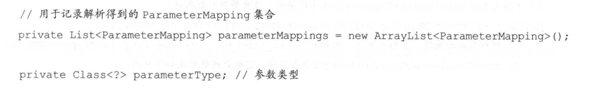 

 

ParameterMappingTokenHandler.handleToken0方法的实现会调用 buildParameterMapping0万法解析参数属性，并将解析得到的 ParameterMapping 对象添加到 parameterMappings 集合中实现如下: 

 

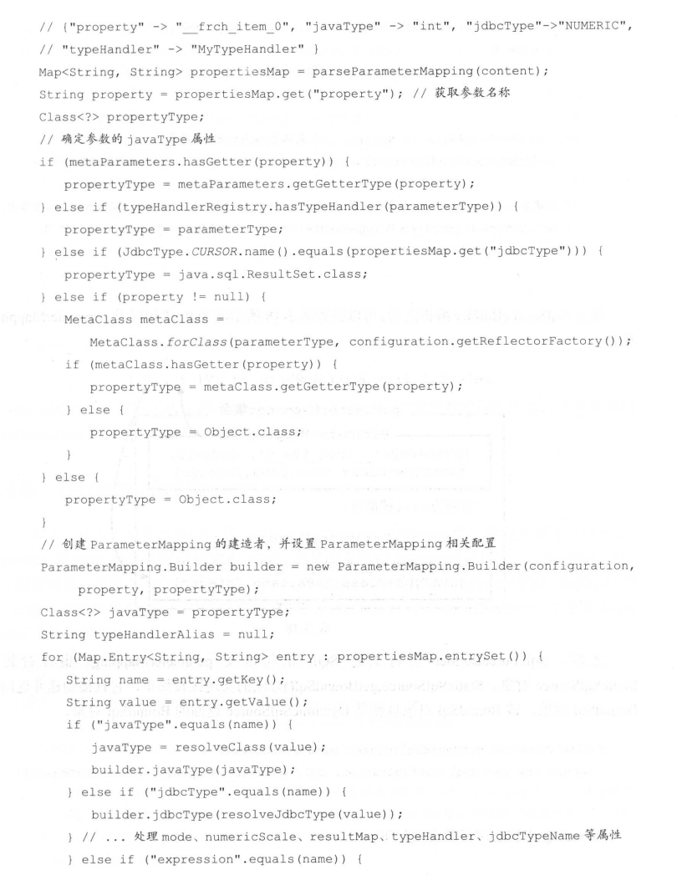  

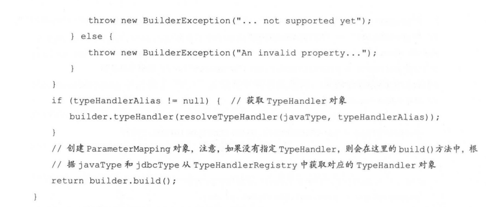 

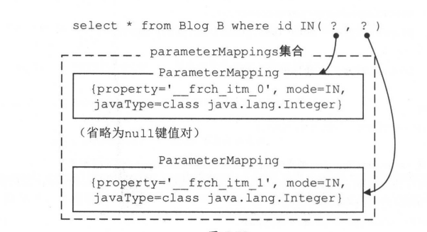 

 

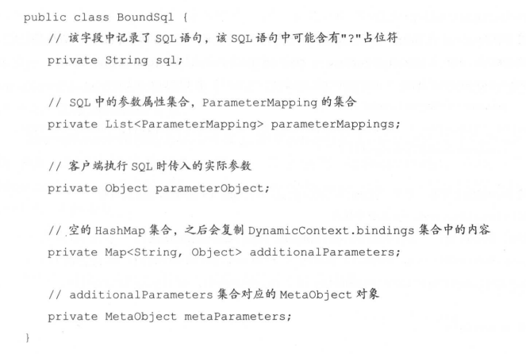 

BoundSql 中还提供了从 additionalParameters 集合中获取/设置指定值的方法，主要是通过metaParameters 相应方法实现的，代码比较简单；

### DynamicSqlSource

​	DynamicSqlSource 负责解析动态 SQL 语句，也是最常用的 SqSource 实现之一。SgINode 中使用了组合模式，形成了一个树状结构，DynamicSglSource 中使用rootSqINode 字段(SqINode类型)记录了待解析的SqlNode 树的根节点。DynamicSglSource 与MappedStatement 以及 SqINode

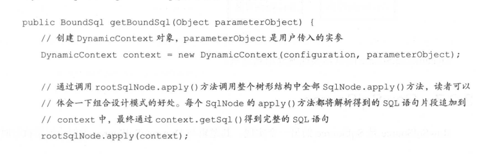 

 

### RawSqlSource

RawSqlSource 是SqlSource 的另一个实现，其逻辑与 DynamicSglSource 类似，但是执行时

机不一样，处理的 SOL 语句类型也不一样。前面介绍XMLScriptBuilder,parseDynamicTags0方法时提到过，如果节点只包含“#分”占位符，而不包含动态 SQL节点或未解析的“S分”占位符的话，则不是动态SOL 语句，会创建相应的 StaticTextSalNode 对象。在 XMLScriptBuilderparseScriptNode0方法中会判断整个 SOL节点是否为动态的，如果不是动态的 SOL节点，则创建相应的 RawSglSource 对象。
RawSglSource 在构造方法中首先会调用 getSql0方法其中通过调用 SINodeapply0方法完成SOL语句的拼装和初步处理;之后会使用 SqlSourceBuilder 完成占位符的替换和ParameterMapping 集合的创建，并返回 StaticSqlSource 对象。这两个过程的具体实现前面已经介绍了，不再重复。
下面简单介绍一下RawSglSource 的具体实现:

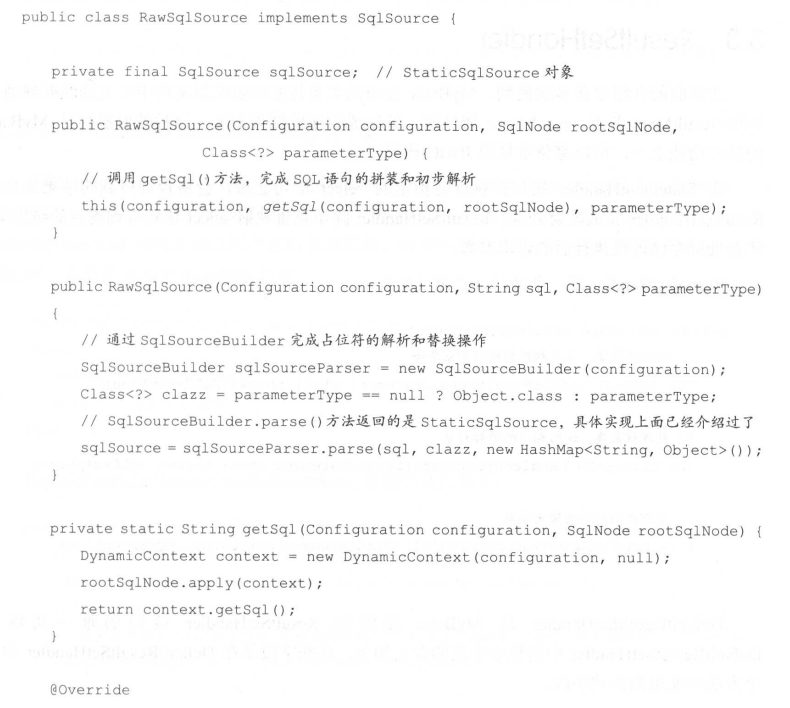 

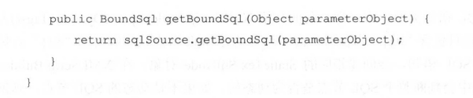 

无论是 StaticSglSource、DynamicSqlSource 还是RawSqlSource，最终都会统一生成 BoundSql对象其中封装了完整的SQL语句(可能包含“?”占位符)、参数映射关系(parameterMappings 集合)以及用户传入的参数(additionalParameters集合)。另外，DynamicSglSource 负责处理动态SOL语句，RawSglSource 负责处理静态SOL语句。除此之外，两者解析 SQL 语句的时机也不一样，前者的解析时机是在实际执行 SOL 语句之前，而后者则是在MyBatis 初始化时完成SQL语句的解析。

## 结果集

MyBatis 会将结果集按照映射配置文件中定义的映射规则，例如<resultMap>节点、resultType 属性等，映射成相应的结果对象。这种映射机制是 MyBatis
的核心功能之一，可以避免重复的JDBC代码。在StatementHandler 接口在执行完指定的 select 语句之后，会将查询得到的结果集交给ResultSetHandler 完成映射处理。ResultSetHandler 除了负责映射 select 语句查询得到的结果集还会处理存储过程执行后的输出参数。
ResultSetHandler 是一个接口，其定义如下:

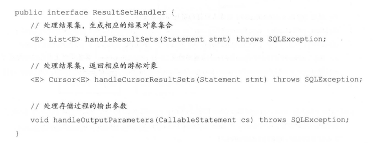 

​	DefaultResultSetHandler 是 MyBatis 提供的 ResultSetHandler 接口的唯一实现DefaultResutSetHandler 中的核心字段的含义如下，这些字段是在 DefaultResultSetHandler 中多个方法中使用的公共字段；

### handleResultSets

### ResultSetWrapper

对DefaultResultSetHandler,getNextResultSet0)方法的分析中，可以看到DefaultResultSetHandler 在获取 ResultSet 对象之后，会将其封装成 ResultSetWrapper 对象再进行处理。在ResultSetWrapper 中记录了 ResultSet 中的一些元数据，并且提供了一系列操作 ResultSet的辅助方法。首先来看 ResultSetWrapper 中核心字段的含义:

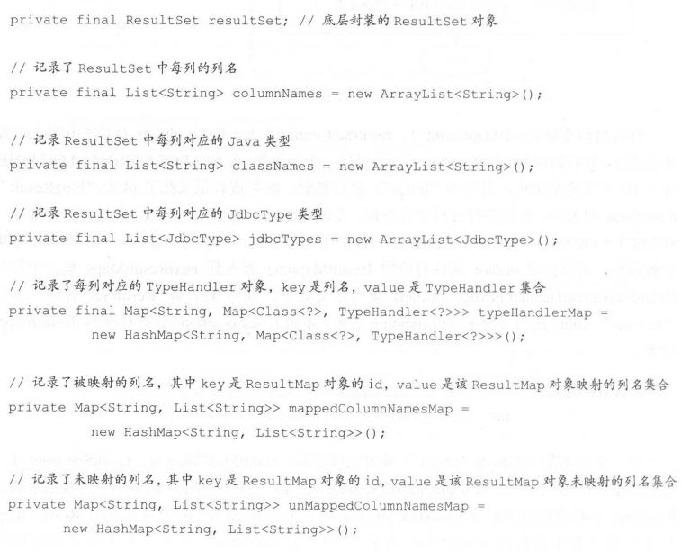 

ResultSetWrapper 中提供了查询上述集合字段的相关方法，代码比较简单，这里就不贴出来了。其中需要介绍的是getMappedColumnNames0方法，该方法返回指定 ResutMap 对象中明确映射的列名集合，同时会将该列名集合以及未映射的列名集合记录到mappedColumnNamesMap和unMappedColumnNamesMap 中缓存。

ResultSetWrapper.getUnmappedColumnNames(方法与 getMappedColumnNames()方法类似,不再赘述；

### 简单映射

#### 整体步骤

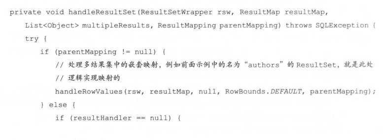 

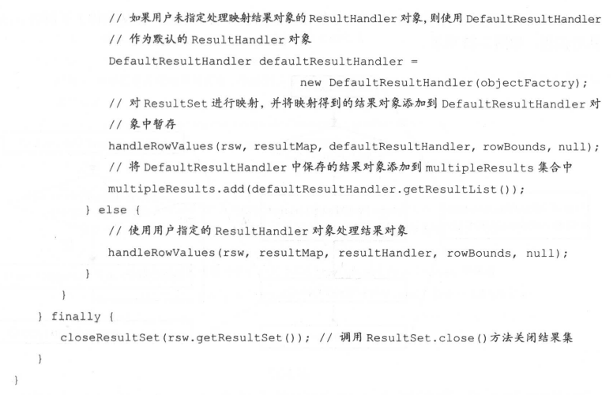 

DefaultResultSetHandlerhandleRowValues0)方法是映射结果集的核心代码，其中有两个分支:一个是针对包含嵌套映射的处理，另一个是针对不含嵌套映射的简单映射的处理。

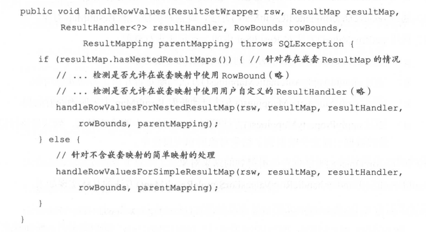 

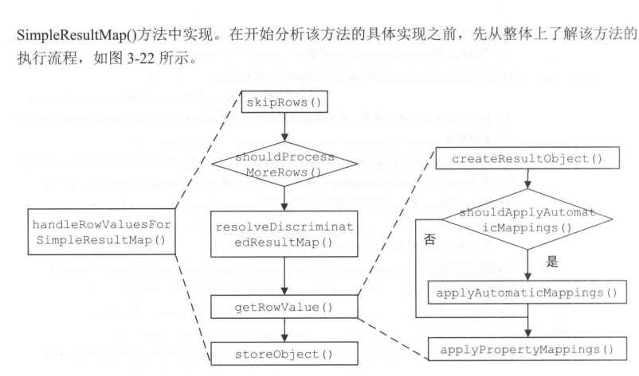 

handleRowValuesForSimpleResultMap0方法的大致步骤如下:

* 调用skipRows(方法，根据 RowBounds 中的 offset 值定位到指定的记录行
* 调用 shouldProcessMoreRows0方法，检测是否还有需要映射的记录。
* 通过resolveDiscriminatedResultMap0方法，确定映射使用的 ResultMap 对象。
* 调用getRowValue0方法对 ResultSet 中的一行记录进行映射:
  * 通过 createResultObject0方法创建映射后的结果对象。
  * 通过 shouldApplyAutomaticMappings0方法判断是否开启了自动映射功能
  * 通过applyAutomaticMappings0方法自动映射 ResultMap 中未明确映射的列。
  * 通过applyPropertyMappings0方法映射 ResultMap 中明确映射列，到这里该行记d录的数据已经完全映射到了结果对象的相应属性中。
* 调用 storeObject0方法保存映射得到的结果对象

#### 源码

DefaultResultSetHandlerhandleRowValuesForSimpleResultMap()方法的具体实现如下:

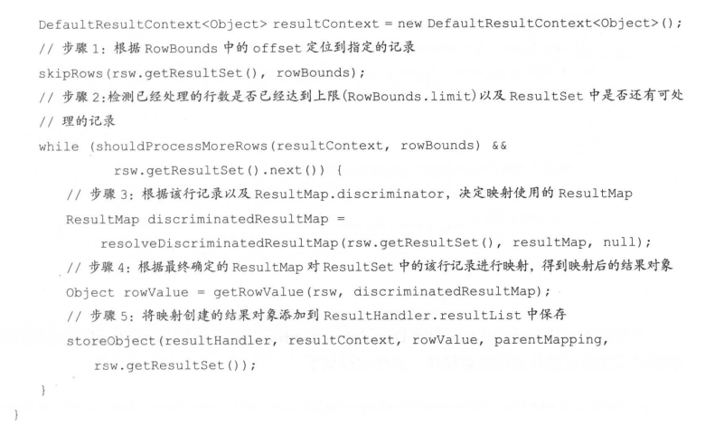 

上面涉及 DefaultResultHandler 和 DefaultResultContext 两个辅助类。DefaultResultHandler继承了 ResultHandler 接口，它底层使用 list 字段(ArrayList<Object>类型)暂存映射得到的结果对象。另外， ResultHandler 接口还有另一个名为 DefaultMapResultHandler 的实现，它底层使用mappedResults 字段(Map<K,V>类型)暂存结果对象。DefaultResultContext继承了 ResultContext 接口，DefaultResultContext 中字段含义如下:

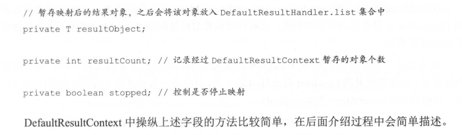 

#### skipRows

定的记录，具体实现如下:DefaultResultSetHandler.skipRows()方法的功能是根据 RowBounds.offset 字段的值定位到指

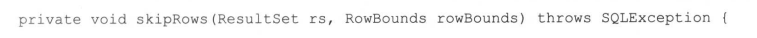 

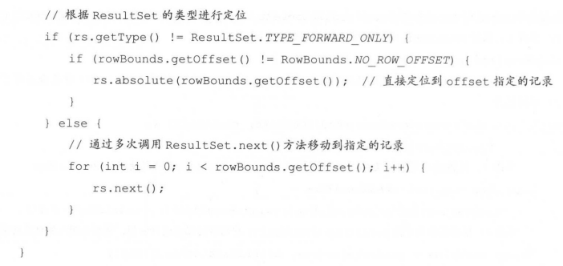 

#### shouldProcessMoreRows

定位到指定的记录行之后，通过 DefaultResultSetHandlershouldProcessMoreRows()检测是否能够对后续的记录行进行映射操作，具体实现如下:

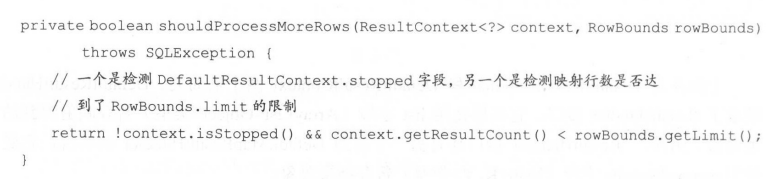 

#### resolveDiscriminatedResultMap

DefaultResultSetHandlerresolveDiscriminatedResultMap0方法会根据 ResultMap 对象中记录的 Discriminator 以及参与映射的列值，选择映射操作最终使用的 ResultMap 对象，这个选择过程可能嵌套多层。
这里通过一个示例简单描述 resolveDiscriminatedResultMap0方法的大致流程，示例如图所示，现在要映射的 ResultSet 有 col1~4 这4 列其中有一行记录的4 列值分别是[1,2,3,4]，映射使用的<resultMap>节点是result1。通过resolveDiscriminatedResultMap0方法选择最终使用的 ResultMap 对象的过程如下:

* 结果集按照 result1 进行映射,该行记录 col2 列值为2根据<discriminator>节点配置会选择使用result2对该记录进行映射。
* 又因为该行记录的 col3 列值为 3，最终选择 result3 对该行记录进行映射，所以该行记录的映射结果是SSubA 对象

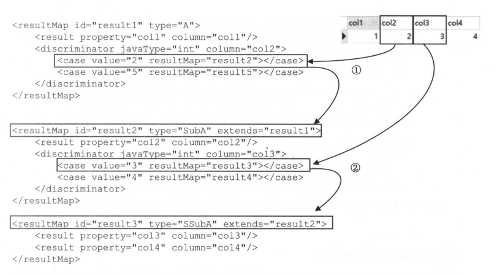 

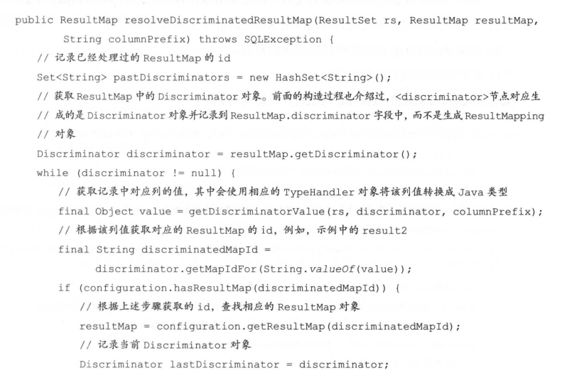 

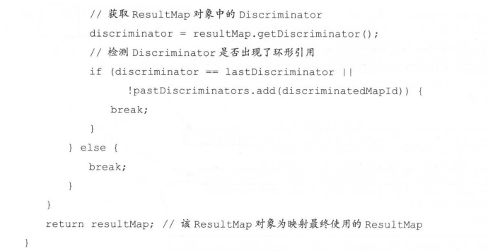 

#### createResultObject

通过resolveDiscriminatedResultMap0方法的处理,最终确定了映射使用的 ResultMap 对象。之后会调用 DefaultResultSetHandler.getRowValue0完成对该记录的映射，该方法的基本步骤如下:

* 根据 ResultMap 指定的类型创建对应的结果对象，以及对应的 MetaObject 对象。
* 根据配置信息，决定是否自动映射 ResultMap 中未明确映射的列。
* 根据ResultMap 映射明确指定的属性和列
* 返回映射得到的结果对象。

DefaultResultSetHandler.getRowValue0方法的代码如下:

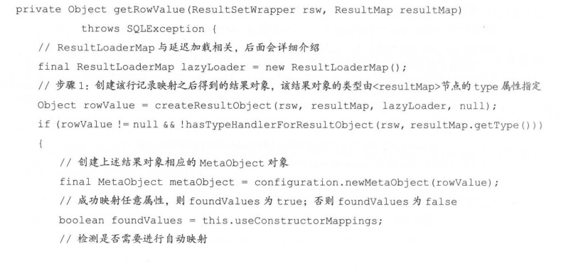 

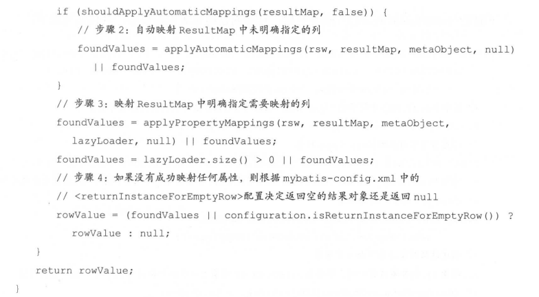 

DefaultResultSetHandler.createResultObject0方法负责创建数据库记录映射得到的结果对象,该方法会根据结果集的列数、ResultMap.constructorResultMappings 集合等信息，选择不同的方式创建结果对象，具体实现如下:

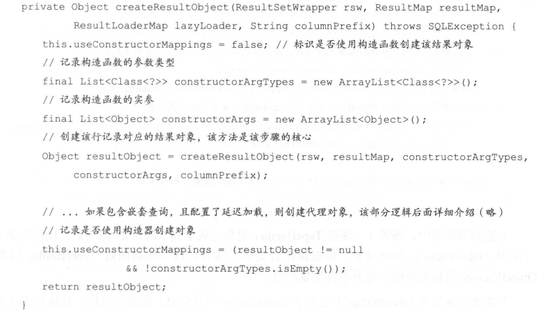 

下面是 createResultObiect0方法的重载，它是创建结果对象的核心，具体实现如下:

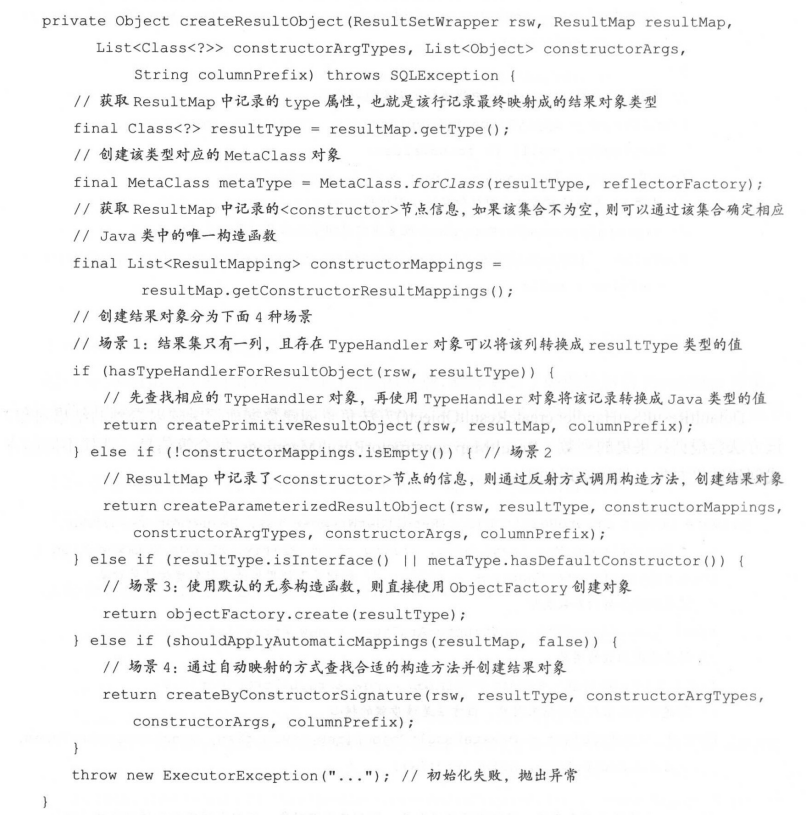

#### createParameterizedResultObject

上述四种场景中，场景1(使用 TypeHandler 对象完成单列 ResutSet 的映射)以及场景3(使用 ObjectFactory 创建对象)的逻辑比较简单，
ResultMap 中记录了<constructor>节点信息)的处理过程，此场景通过调用createParameterizedResultObject0方法完成结果对象的创建，该方法会根据<constructor>节点的配置，选择合适的构造方法创建结果对象，其中也会涉及嵌套查询和嵌套映射的处理。具体实现如下:

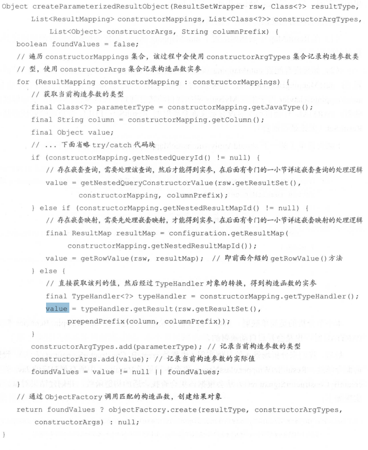 

#### shouldApplyAutomaticMappings

​	如果ResultMap中没有记录<constructor>节点信息且结果对象没有无参构造函数，则进入场景 4 的处理。在场景 4 中，会尝试使用自动映射的方式查找构造函数并由此创建对象。首先会通过 shouldApplyAutomaticMappings0检测是否开启了自动映射的功能，该功能会自动映射结果集中存在的，但未在 ResultMap 中明确映射的列。
​	控制自动映射功能的开关有下面两个:

* 在 ResultMap 中明确地配置了 autoMapping 属性，则优先根据该属性的值决定是否开启自动映射功能。
* 如果没有配置autoMapping 属性，则在根据 mybatis-config.xml中<settings>节点中配置的 autoMappingBehavior 值 (默认为 PARTIAL)定是否开启自动映射功能。autoMappingBehavir 用于指定 MyBatis应如何自动映射列到字段或属性NONE 表示取消自动映射;PARTIAL 只会自动映射没有定义嵌套映射的 ResultSet; FULL 会自动映射任意复杂的ResultSet(无论是否嵌套)

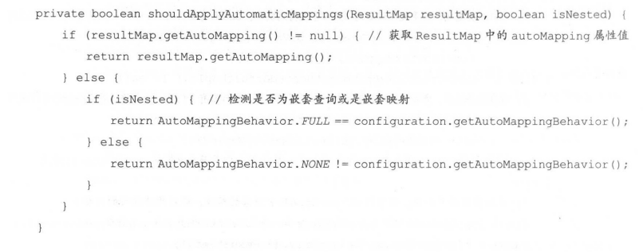 

#### createByConstructorSignature

这里分析的是简单映射，不涉及嵌套映射的问题，在 autoMappingBehavior 默认为PARTIAL时，也是会开启自动映射的。
最后，我们来分析场景4的具体实现(也就是 createByConstructorSignature0方法)。我们在前面介绍过，ResultSetWrapper.classNames 集合中记录了 ResultSet 中所有列对应的 Java 类型createByConstructorSignature0方法会根据该集合查找合适的构造函数，并创建结果对象。具体实现如下:

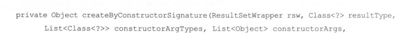 

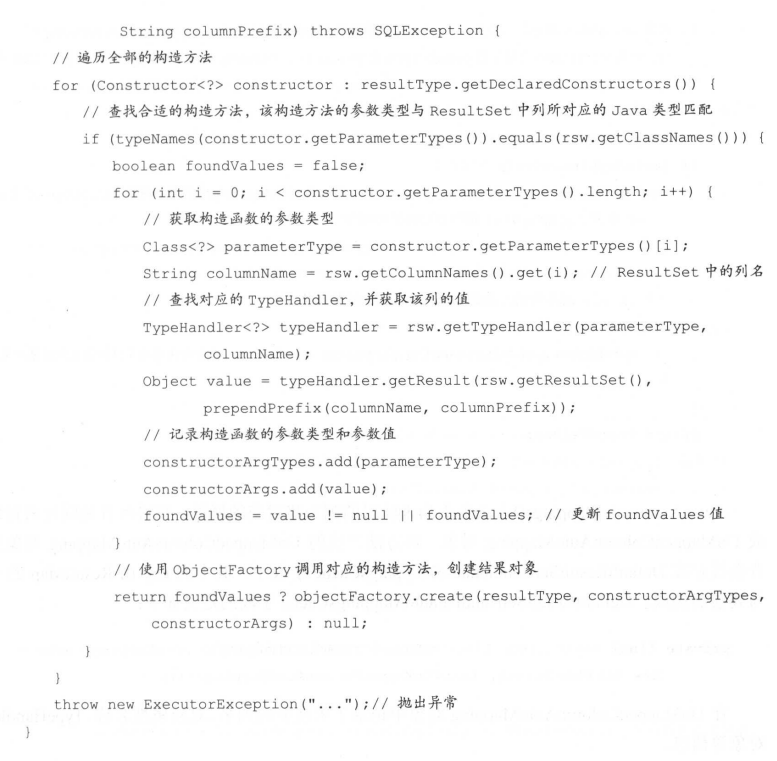 

#### applyAutomaticMappings

在成功创建结果对象以及相应的MetaObject 对象之后,会调用shouldApplyAutomaticMappings0方法检测是否允许进行自动映射。如果允许则调用applyAutomaticMappings0方法，该方法主要负责自动映射 ResultMap 中未明确映射的列，具体实现如下:

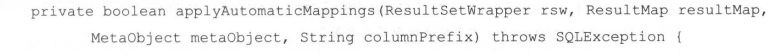 

 

createAutomaticMappings0方法负责为未映射的列查找对应的属性，并将两者关联起来封装成UnMappedColumnAutoMapping 对象。该方法产生的 UnMappedColumnAutoMapping 对象集合会缓存在 DefaultResultSetHandler.autoMappingsCache 字段中，其中的 key 由 ResultMap 的id与列前缀构成，DefaultResultSetHandler.autoMappingsCache 字段的定义如下:

 s

在UnMappedColumnAutoMapping 对象中记录了未映射的列名、对应属性名称、TypeHandler对象等信息。
DefaultResultSetHandler.createAutomaticMappings0)方法的具体实现如下:

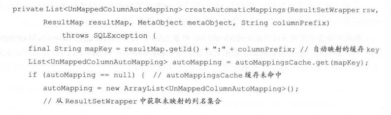 

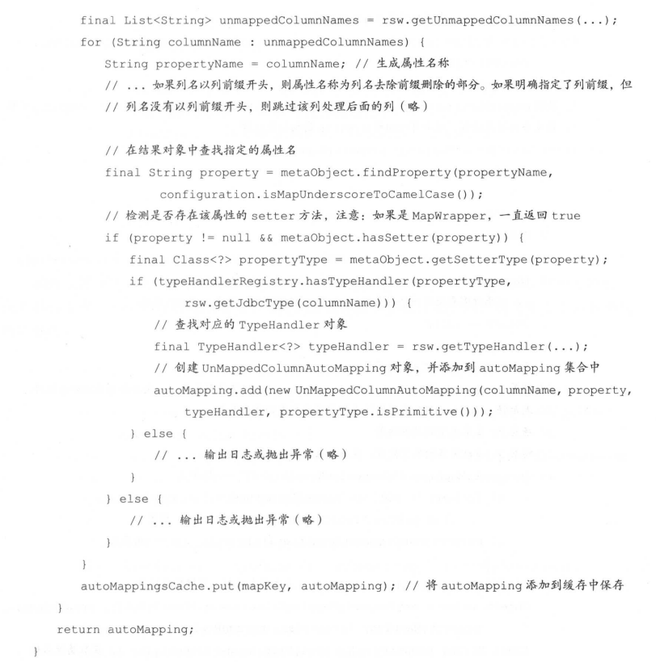 

#### applyPropertyMappings

​	通过applyAutomaticMappings()方法处理完自动映射之后，后续会通过applyPropertyMappings0方法处理 ResultMap 中明确需要进行映射的列，在该方法中涉及延迟加载、嵌套映射等内容，在后面会详细介绍这些内容，这里主要介绍简单映射的处理流程。applyPropertyMappings0方法的具体实现如下:

 

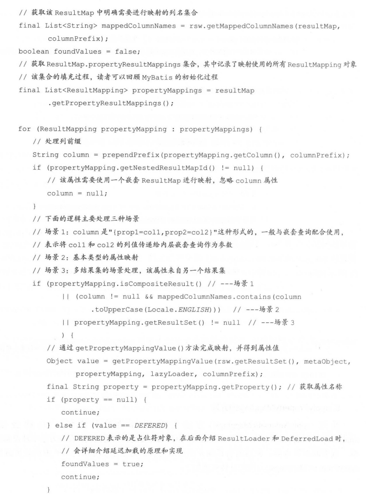 

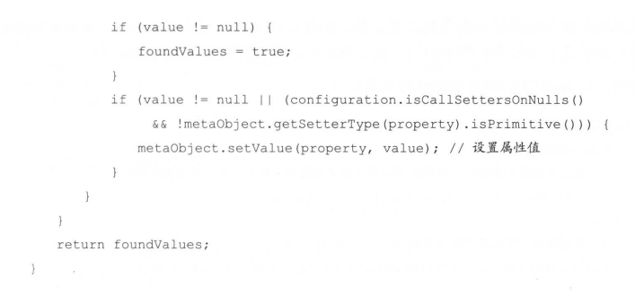 

通过上述分析可知，映射操作是在 getPropertyMappingValue0方法中完成的，下面分析该方法的具体实现，其中嵌套查询以及多结果集的处理逻辑在后面详细介绍，这里重点关注普通列值的映射:

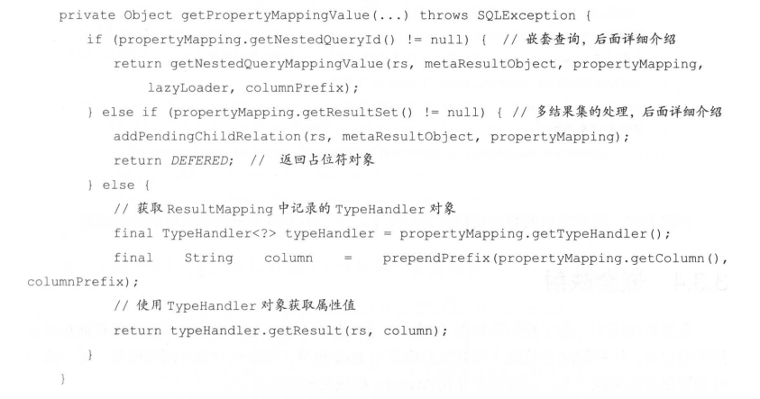 


#### StoreObject

分析到这里，已经得到了一个完整映射的结果对象，之后 DefaultResultSetHandler 会通过storeObject0方法将该结果对象保存到合适的位置，这样该行记录就算映射完成了，可以继续映射结果集中下一行记录了。

如果是嵌套映射或是嵌套查询的结果对象，则保存到父对象对应的属性中:如果是普通映射(最外层映射或是非嵌套的简单映射)的结果对象，则保存到 ResultHandler 中。下面来分析 storeObject0方法的具体实现: 

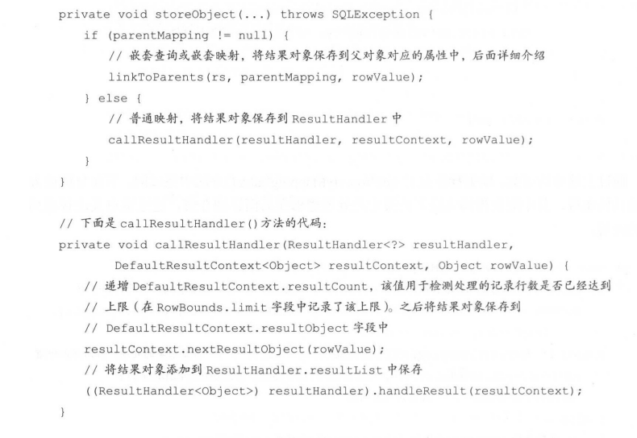 

### 嵌套映射

​	在实际应用中，除了使用简单的 select 语句查询单个表，还可能通过多表连接查询获取多张表的记录，这些记录在逻辑上需要映射成多个 Java 对象，而这些对象之间可能是一对一或-对多等复杂的关联关系，这就需要使用 MyBatis 提供的套映射。
​	已经介绍了简单映射的处理流程它是 handleRowValues0方法的一条逻辑分支其另一条分支就是嵌套映射的处理流程。如果 ResultMap 中存在嵌套映射，则需要通过handleRowValuesForNestedResultMap0方法完成映射，本小节将详细分析该方法的实现原理。

#### 嵌套示例

为了便于读者理解，我们通过一个示例介绍嵌套映射的处理流程，示例的结果集如图所示。

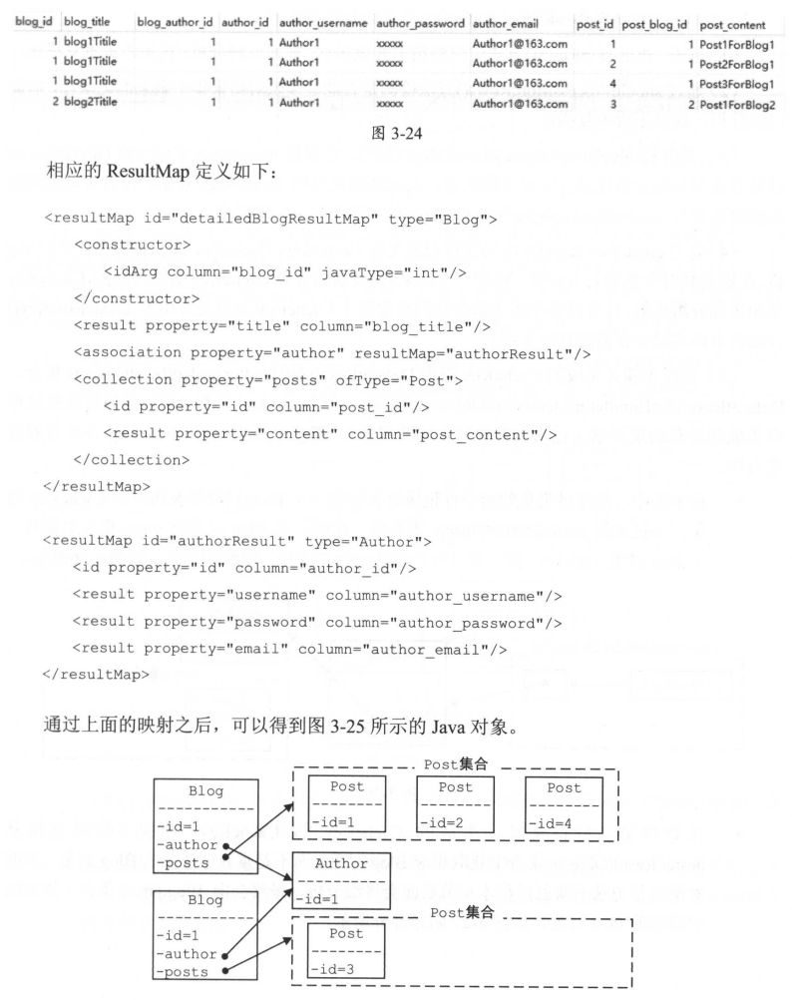 

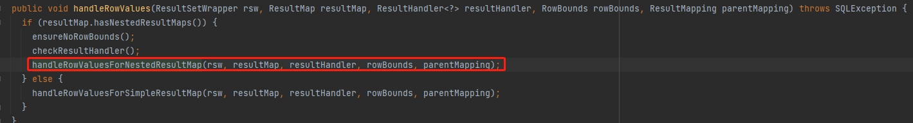 

handleRowValuesForNestedResultMap的步骤为：

* 首先，通过 skipRows0方法定位到指定的记录行，前面已经分析，这里不再重复描述。

* 通过 shouldProcessMoreRows0方法检测是否能继续映射结果集中剩余的记录行，前面
  已经分析，这里不再重复描述。

* 调用resolveDiscriminatedResultMap0方法，它根据 ResultMap 中记录的 Discriminator对象以及参与映射的记录行中相应的列值，决定映射使用的 ResultMap 对象。读者可以回顾简单映射小节对resolveDiscriminatedResultMap0方法的分析，不再赘述。

* 通过 createRowKey0方法为该行记录生成CacheKey,CacheKey 除了作为缓存中的 key值,在套映射中也作为 key唯一标识一个结果对象。前面分析 CacheKey 实现时提到,CacheKey是由多部分组成的,且由这多个组成部分共同确定两个CacheKey对象是否相等。createRowKey()方法的具体实现会在后面详细介绍。

* 根据步骤4生成的 CacheKey 查询 DefaultResultSetHandler.nestedResultObjects 集合。DefaultResultSetHandlernestedResultObiects 字段是一个 HashMap 对象。在处理嵌套映射过程中生成的所有结果对象(包括嵌套映射生成的对象)，都会生成相应的 CacheKey 并保存到该集合中。

  * 在本例中，处理结果集的第一行记录时会创建一个 Blog 对象以及相应的 CacheKey 对象，并记录到 nestedResultObjects 集合中。此时，该 Blog 对象的 posts 集合中只有个Post 对象 (id=1)，我们可以认为它是一个“部分”映射的对象，如图 所示；

    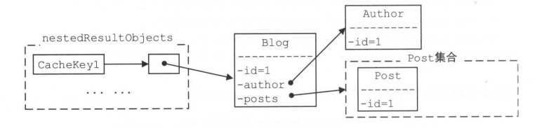 

    

  * 在处理第二行记录时，生成的 CacheKey 与 CacheKey相同，所以直接从nestedResultObjects 集合中获取相应 Blog 对象，而不是重新创建新的 Blog 对象，后面对第二行记录的映射过程本小节后面会详细分析，最终会向 Blogposts 集合中添加映射得到的 Post 对象，如图3-27 阴影部分所示。

    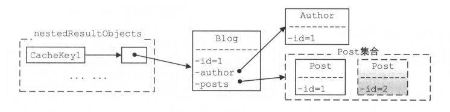 

* 检测<selec>节点中 resultOrdered 属性的配置，该设置仅针对嵌套映射有效。当resultOrdered 属性为 true 时，则认为返回一个主结果行时，不会发生像上面步骤5处理第二行记录时那样引用nestedResultObjects 集合中对象 (id为1的Blog对象)的情况。这样就提前释放了nestedResultObjects 集合中的数据，避免在进行嵌套映射出现内存不足的情况

  * 为了便于读者理解，我们依然通过上述示例进行分析。首先来看 resutOrdered 属性为false 时,映射完示例中四条记录后 nestedResultObjects 集合中的数据,如图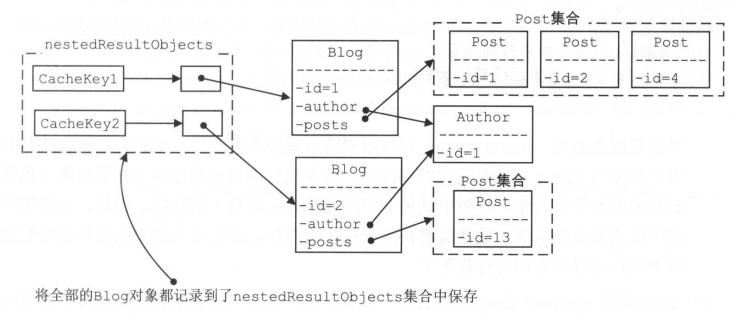 

  * 再来看当 resultOrdered 属性为 true 时，映射示例中四条记录后 nestedResultObjects 集合中的数据，如图所示。
  * nestedResultObjects 集合中的数据在映射完一个结果集时也会进行清理，这是为映射下一个结果集做准备。所以读者需要了解，nestedResultObiects 集合中数据的生命周期受到这两方面的影响。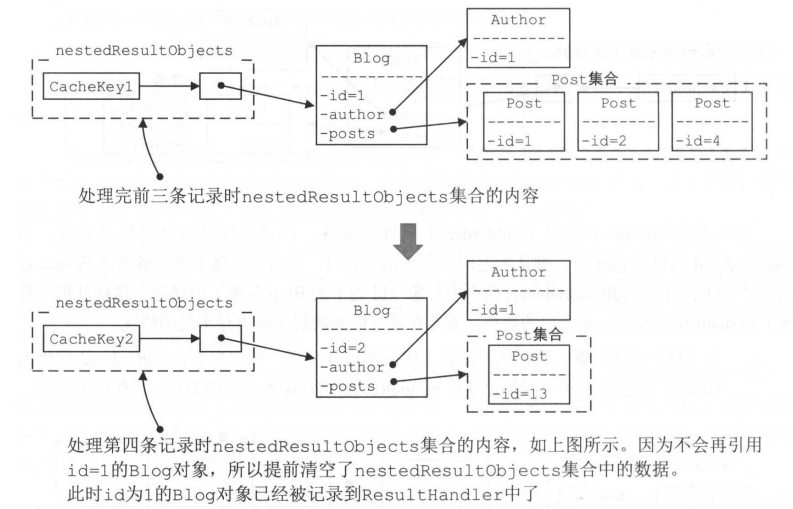 
  * 最后要注意的是，resultOrdered 属性虽然可以减小内存使用，但相应的代价就是要求用户在编写 Select 语句时需要特别注意，避免出现引用已清除的主结果对象(也就是嵌套映射的外层对象，本例中就是 id 为1的 Blog 对象)的情况，例如，分组等方式就可以避免这种情况。这就需要在应用程序的内存、SOL 语句的复杂度以及给数据库带来的压力等多方面进行权衡了。

* 通过调用 getRowValue0方法的另一重载方法，完成当前记录行的映射操作并返回结果对象，其中还会将结果对象添加到 nestedResultObjects 集合中。该方法的具体实现在后面会详细介绍。
* 通过 storeObiect0方法将生成的结果对象保存到 ResultHandler 中。

#### 整体源码

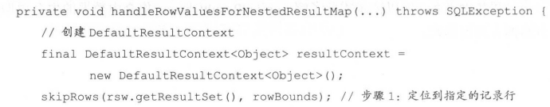 

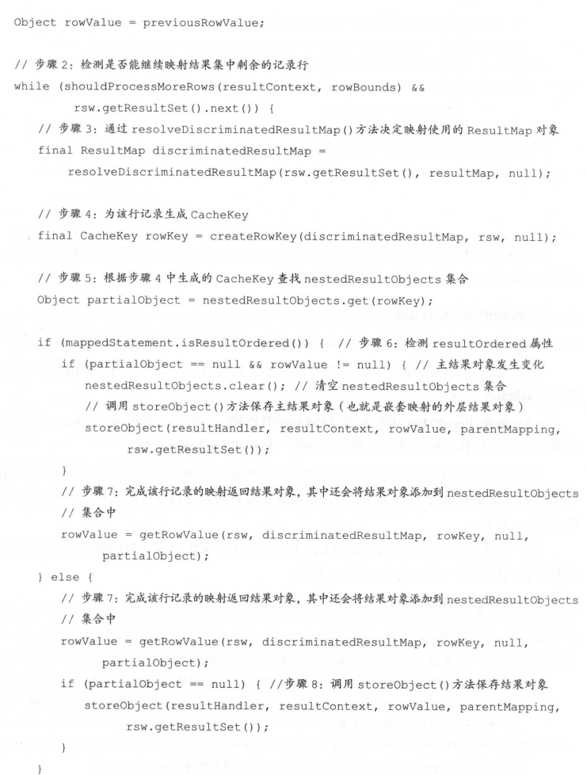 

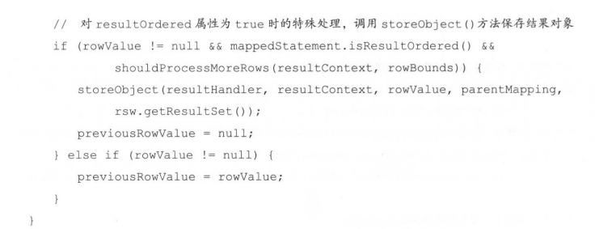 

#### createRowKey

createRowKey0方法主要负责生成 CacheKey，该方法构建 CacheKey 的过程如下:

* 尝试使用<idArg>节点或<id>节点中定义的列名以及该列在当前记录行中对应的列值组成 CacheKey 对象。
* 如果 ResultMap 中没有定义<idArg>节点或<id>节点，则由 ResultMap 中明确要映射的列名以及它们在当前记录行中对应的列值一起构成 CacheKey 对象。
* 如果经过上述两个步骤后，依然查找不到相关的列名和列值，且 ResultMaptype 属性明确指明了结果对象为 Map 类型，则由结果集中所有列名以及该行记录行的所有列值一起构成CacheKey 对象。
* 如果映射的结果对象不是 Map 类型，则由结果集中未映射的列名以及它们在当前记录行中的对应列值一起构成 CacheKey 对象。

下面来看createRowKey()方法的具体实现代码:

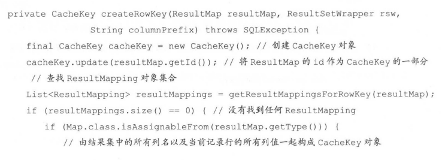 

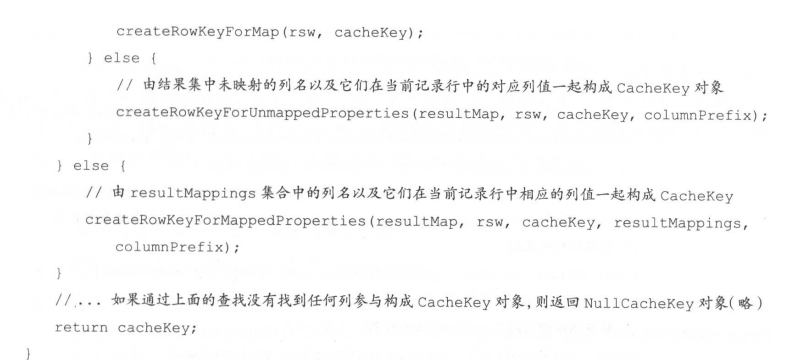 

createRowKeyForMap()、createRowKeyForUnmappedProperties(和 createRowKeyForMapped.Properties0三个方法的核心逻辑都是通过 CacheKeyupdate0方法，将指定的列名以及它们在当前记录行中相应的列值添加到 CacheKey 中，使其成为构成 CacheKey 对象的一部分。这里以createRowKeyForMappedProperties 0方法为例进行分析

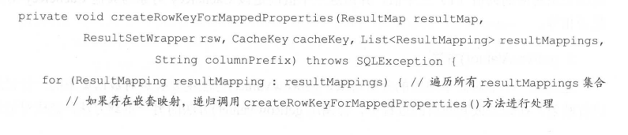 

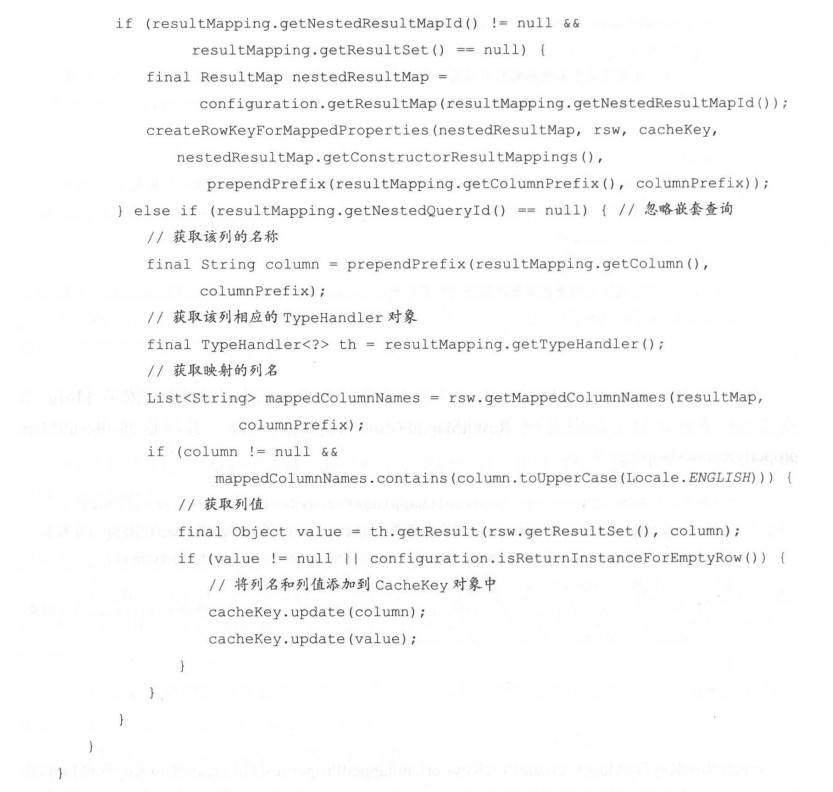 

​	在处理本节示例中结果集的第一行记录时，创建的 CacheKey对象中记录了ResultMap 的id (detailedBlogResultMap)、<idArg>节点指定的列名(blog_id)以及该记录对应的列值 (1)三个值，并由这三个值决定该 CacheKey 对象与其他 CacheKey 对象是否相等。

#### getRowValue

getRowValue0方法主要负责对数据集中的一行记录进行映射。在处理嵌套映射的过程中，会调用 getRowValue0方法的另一重载方法，完成对记录行的映射，其大致步骤如下:

* 检测 rowValue (外层对象)是否已经存在。MyBatis 的映射规则可以嵌套多层，为了描述方便，在进行嵌套映射时，将外层映射的结果对象称为“外层对象”。在示例中，映射第二行和第三行记录(blog id 都为1)时，rowValue 指向的都是映射第一行记录时生成的 Blog 对象(id为1);在映射第四行记录(blog id 都为2)时，rowValue 为 null。
  下面会根据外层对象是否存在，出现两条不同的处理分支。

*  如果外层对象不存在，则进入如下步骤。

  * 调用createResultObject0方法创建外层对象

  * 通过 shouldApplyAutomaticMappings0方法检测是否开启自动映射，如果开启则调用applyAutomaticMappings0方法进行自动映射。注意 shouldApplyAutomaticMappings0方法的第二个参数为 true，表示含有嵌套映射。

  * 通过applyPropertyMappings0方法处理 ResultMap 中明确需要进行映射的列。

    上述三个步骤的具体实现已在“简单映射”小节介绍过了，这里不再重复。到此为止，外层对象已经构建完成，其中对应非嵌套映射的属性已经映射完成，得到的是“部分映射对象”

  * 将外层对象添加到 DefaultResultSetHandler.ancestorObjects 集合 (HashMap<String.Object>类型)中，其中key 是 ResultMap 的id，value 为外层对象。

  * 通过 applyNestedResultMappings0方法处理嵌套映射，其中会将生成的结果对象设置到外层对象的相应的属性中。该方法的具体实现在后面详述。

  * 将外层对象从ancestorObjects 集合中移除

  * 将外层对象保存到nestedResultObjects 集合中，待映射后续记录时使用。

* 如果外层对象存在，则表示该外层对象已经由步骤 2 填充好了，进入如下步骤

  * 将外层对象添加到ancestorObjects 集合中。

  * 通过 applyNestedResultMappings0方法处理嵌套映射，其中会将生成的结果对象设置到外层对象的相应属性中。

  * 将外层对象从ancestorObjects 集合中移除

    

下面来分析 getRowValue0方法的具体实现:

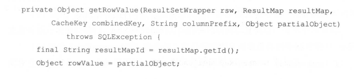 

 

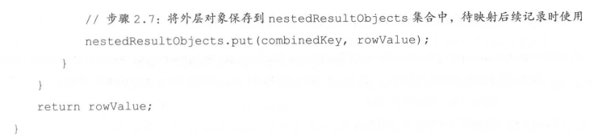 

#### applyNestedResultMappings

**整体步骤**

处理套映射的核心在 applyNestedResultMappings0方法之中，该方法会遍历ResultMap.propertyResultMappings 集合中记录的 ResultMapping 对象，并处理其中的嵌套映射。为了方便描述，这里将嵌套映射的结果对象称为“嵌套对象”。applyNestedResultMappings0方法的具体步骤如下:

* 获取 ResultMapping.nestedResultMapId 字段值，该值不为空则表示存在相应的嵌套映射要处理。在前面的分析过程中提到，像本节示例中<collection property="posts”... 这种匿名套映射，MyBatis在初始化时也会为其生成默认的nestedResultMapId 值。
  同时还会检测 ResultMapping.resultSet 字段，它指定了要映射的结果集名称，该属性的映射会在前面介绍的 handleResultSets0方法中完成，请读者回顾。
* 通过resolveDiscriminatedResultMap0方法确定嵌套映射使用的 ResultMap 对象。
* 处理循环引用的场景，下面会通过示例详细分析。如果不存在循环引用的情况，则继续后面的映射流程:如果存在循环引用，则不再创建新的嵌套对象，而是重用之前的对象。
* 通过 createRowKey0方法为嵌套对象创建 CacheKey。该过程除了根据嵌套对象的信息创建CacheKey，还会与外层对象的 CacheKey 合并，得到全局唯一的 CacheKey 对象。
* 如果外层对象中用于记录当前嵌套对象的属性为 Collection 类型，且未初始化，则会通过instantiateCollectionPropertyIfAppropriate(方法初始化该集合对象。
  例如示例中映射第一行记录时，涉及<collection>节点中定义的嵌套映射，它在 Blog 中相应的属性为 posts(List<Post>类型)，所以在此处会创建 ArrayList<Post对象并赋值到 Blog.posts属性。
* 根据<association>、<collection>等节点的 notNullColumn 属性，检测结果集中相应列是否为空。
* 调用 getRowValue0方法完成嵌套映射，并生成嵌套对象。嵌套映射可以套多层也就可以产生多层递归。getRowValue0方法的实现前面已分析过，这里不再赘述。
* 通过 linkObjects0方法，将步骤7中得到的套对象保存到外层对象中。示例中 Author对象会设置到 Blog.author 属性中，Post 对象会添加到 Blog.posts 集合中。

**源码分析**

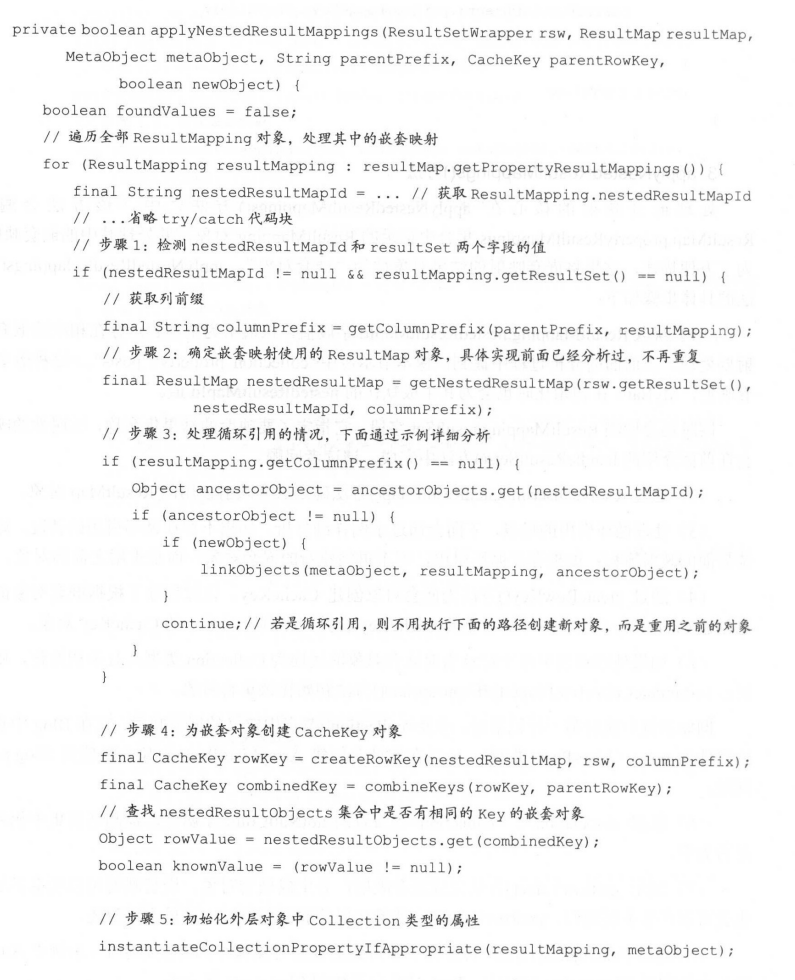 

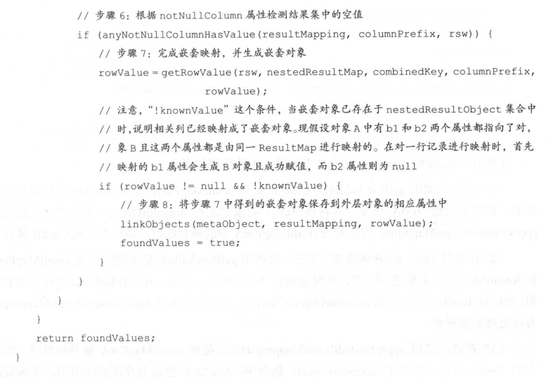 

**循环引用**

​	首先来看 applyNestedResultMappings0方法是如何处理循环引用这种情况的。在进入applyNestedResultMappings0方法之前，会将外层对象保存到 ancestorObjects 集合中，在applyNestedResultMappings0方法处理套映射时，会先查找嵌套对象在ancestorObjects 集合中是否存在，如果存在就表示当前映射的嵌套对象在之前已经进行过映射，可重用之前映射产生的对象。
​	这里通过一个简单示例介绍这种场景，假设有 TestA 和 TestB 两个类，这两个都有一个指向对方对象的字段，具体的映射规则和SOL语句定义如下:

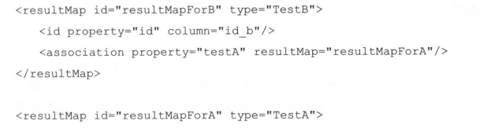 

 

在执行 circularReferencerTest 这个查询时，大致步骤如下:

* 首先会调用 getRowValue0方法按照 id 为 resultMapForA 的 ResultMap 对结果集进行映射，此时会创建 TestA 对象，并将该 TestA 对象记录到ancestorObjects 集合中。之后调用applyNestedResultMappings0方法处理resultMapForA 中的嵌套映射，即映射 TestAtestB 属性
* 在映射 TestA.testB 属性的过程中，会调用 getRowValue0方法按照d 为resultMapForB的ResultMap 对结果集进行映射，此时会创建 TestB 对象。但是，resultMapForB 中存在嵌套映射,所以将 TestB 对象记录到ancestorObjects 集合中。之后再次调用applyNestedResultMappings(
  方法处理嵌套映射
* 在此次调用 applyNestedResultMappings0方法处理 resultMapForA 套映射时，发现它的 TestA 对象已存在于 ancestorObjects 集合中，MyBatis 会认为存在循环引用，不再根据resultMapForA 嵌套映射创建新的 TestA 对象，而是将ancestorObjects 集合中已存在的 TestA对象设置到TestB.testA 属性中并返回。

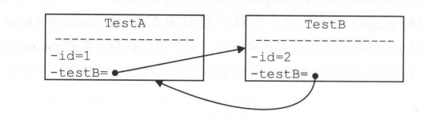 

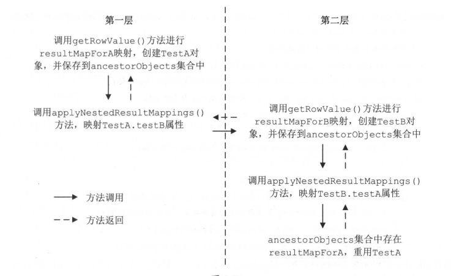 

在处理循环引用的过程中，还会调用 linkObjects0方法，该方法的主要功能是将已存在的嵌套对象设置到外层对象的相应属性中。linkObjects0方法的具体实现如下: 

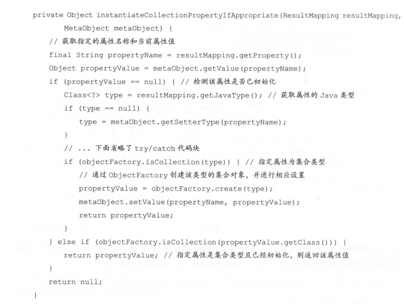 

#### **combinedKey**

在介绍 handleRowValuesForNestedResultMap0方法时，已经阐述了 nestedResultObjects 集合如何与CacheKey配合保存部分映射的结果对象。之前还介绍过,如果 reusltOrdered 属性为 false则在映射完一个结果集之后，nestedResultObjects 集合中的记录才会被清空，这是为了保证后续结果集的映射不会被之前结果集的数据影响。但是，如果没有 CombinedKey，则在映射属于同一结果集的两条不同记录行时，就可能因为nestedResultObjects 集合中的数据而相互影响。现在假设有图所示的结果集

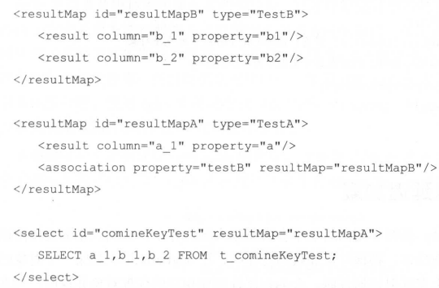 

假设按照前面介绍的方式为嵌套对象创建 CacheKey，在映射第一行和第二行时，两个嵌套的TestB 对象的 CacheKey 是相同的，最终两个 TestA 对象的 testB 属性会指向同一个 TestB 对象，如图 3-33(左)所示。在多数场景下，这并不是我们想要的结果，我们希望不同的 TestA对象的 testB属性指向不同的TestB 对象，如图所示

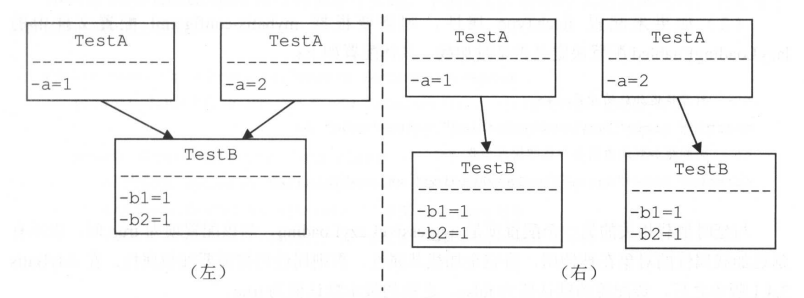 

所以，applyNestedResultMappings0方法中为了实现这种效果，除了使用createRowKey0方法为嵌套对象创建 CacheKey，还会使用combineKeys0方法将其与外层对象的 CacheKey 合并,最终得到嵌套对象的真正CacheKey，此时可以认为该CacheKey全局唯一。combineKeys0方法的具体实现如下:

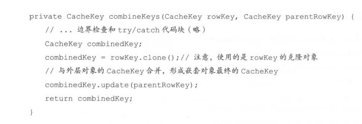 

### 嵌套查询与延迟加载

“延迟加载”的含义是:暂时不用的对象不会真正载入到内存中，直到真正需要使用该对象时，才去执行数据库查询操作，将该对象加载到内存中。在 MyBatis 中，如果一个对象的某个属性需要延迟加载，那么在映射该属性时，会为该属性创建相应的代理对象并返回;当真正要使用延迟加载的属性时，会通过代理对象执行数据库加载操作，得到真正的数据。一个属性是否能够延时加载，主要看两个地方的配置:

* 如果属性在<resultMap>中的相应节点明确地配置了 fetchType 属性，则按照 fetchType属性决定是否延迟加载。

* 如果未配置 fetchType属性，则需要根据mybatis-configxm配置文件中的lazyLoadingEnabled 配置决定是否延时加载，具体配置如下:

  ```
  <!-- 打开延迟加载的开关 -->
  <setting name="lazyLoadingEnabled” value="true"”/>
  <!-- 将积极加载改为消息加载即按需加载 -->
  <setting name="aggressiveLazyLoading"value="false"/>
  ```

​	与延时加载相关的另一个配置项是 aggressiveLazyLoading，当该配置项为 true 时，表示有延迟加载属性的对象在被调用，将完全加载其属性，否则属性将按需要加载属性。在 MyBatis3.4.1版本之后，该配置的默认值为 false，之前的版本默认值为 true。

​	MyBatis中的延迟加载是通过动态代理实现的,可能第一反应就是使用前面介绍的JDK动态代理实现该功能。但是正如前面的介绍所述，要使用JDK动态代理的方式为一个对象生成代理对象，要求该目标类必须实现了 (任意)接口，而 MyBatis 映射的结果对象大多是普通的JavaBean，并没有实现任何接口，所以无法使用JDK动态代理。MyBatis 中提供了另外两种可以为普通JavaBean 动态生成代理对象的方式，分别是CGLIB 方式和JAVASSIST方式。

#### 非jdk原生动态代理

* **cglib**

​	cglib 采用字节码技术实现动态代理功能，其原理是通过字节码技术为目标类生成一个子类并在该子类中采用方法拦截的方式拦截所有父类方法的调用，从而实现代理的功能。因为 cglib使用生成子类的方式实现动态代理，所以无法代理 final 关键字修饰的方法。cglib 与JDK 动态代理之间可以相互补充:在目标类实现接口时，使用JDK 动态代理创建代理对象，但当目标类没有实现接口时，使用cglib 实现动态代理的功能。在 Spring、MyBatis 等多种开源框架中，都可以看到JDK动态代理与 cglib 结合使用的场景
​	下面通过一个示例简单介绍 cglib 的使用。在使用 cglib 创建动态代理类时，首先需要定义一个Callback 接口的实现，cglib 中也提供了多个 Callback 接口的子接口，如图所示。

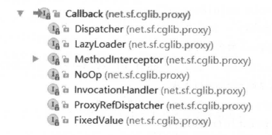 

本例以MethodInterceptor 接口为例进行介绍，下面是 CglibProxy 类的具体代码，它实现了MethodInterceptor 接口:

 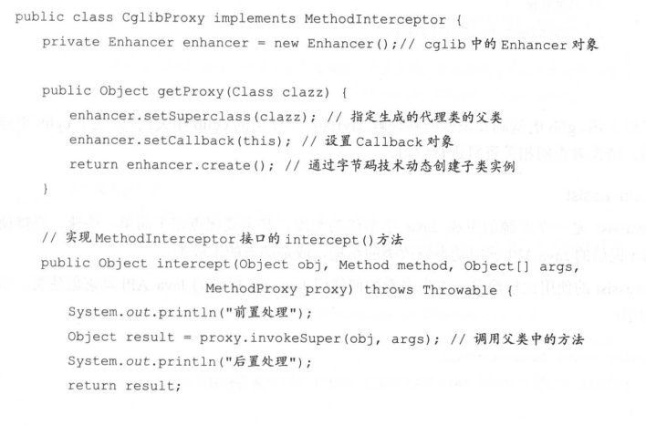

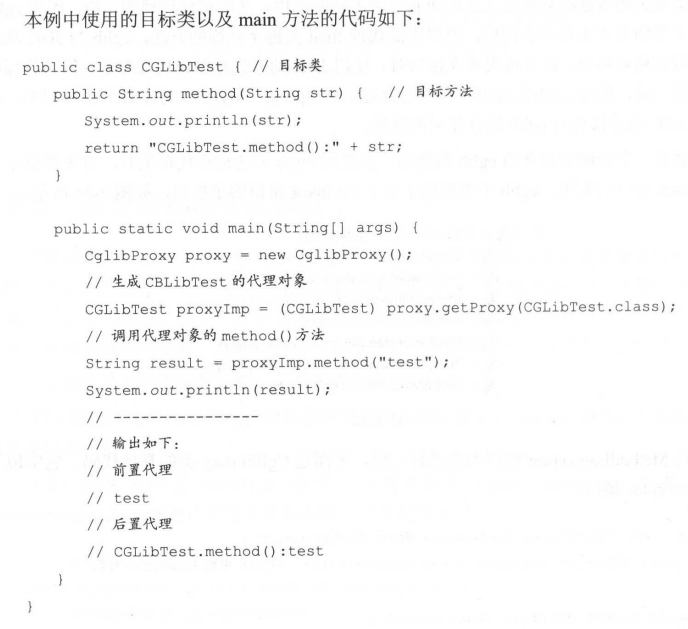  

**javassit**

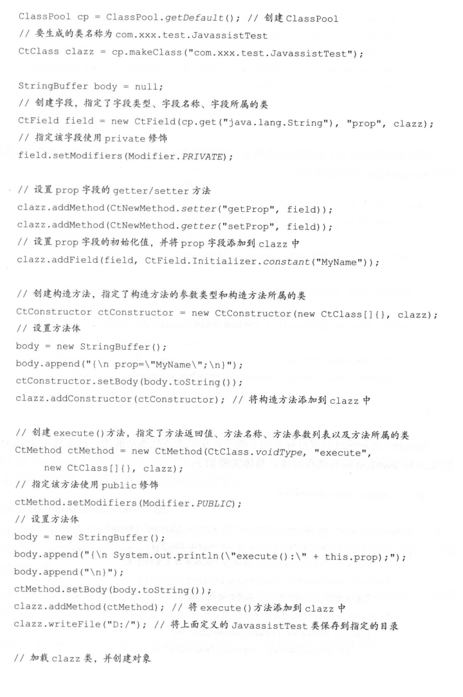 

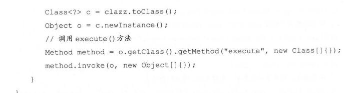 

 

Javassist 也是通过创建目标类的子类方式实现动态代理功能的。这里使用 Javassist 为上面生成的JavassitTest 创建代理对象，具体实现如下: 

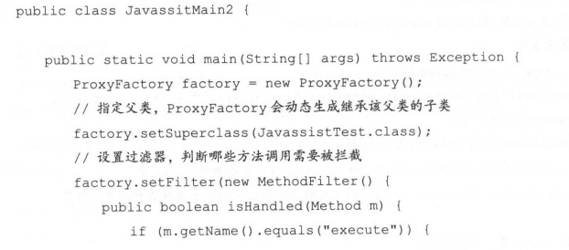  

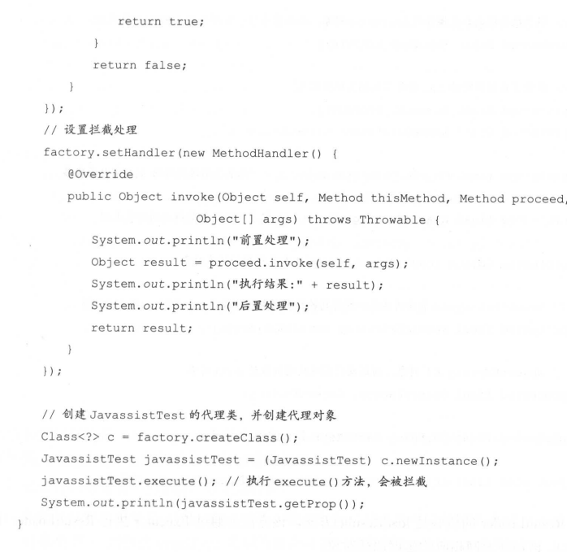 

了解上述 Javassist 的基础知识，就足够理解 MyBatis 中涉及 Javassist 的相关代码。关于Javassist 更详细的介绍，请读者查阅相关资料进行学习。

#### ResultLoader

MyBatis中与延迟加载相关的类有 ResultLoader、ResultLoaderMap、ProxyFactory 接口及实现类。都见到过它们的身影，本小节将详细介绍这些组件的实现原理。ResultLoader 主要负责保存一次延迟加载操作所需的全部信息，ResultLoader 中核心字段的含义如下:

 

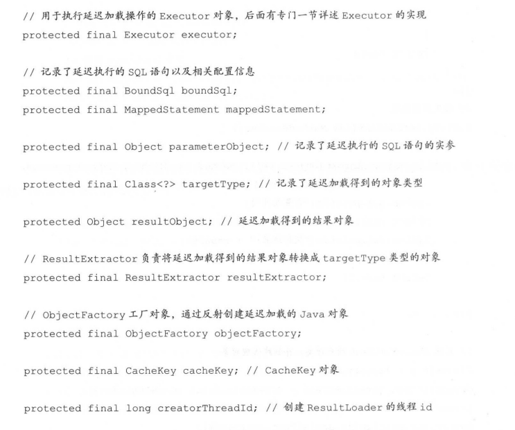 

ResultLoader 的核心是 loadResul()方法，该方法会通过 Executor 执行 ResultLoader 中记录的SOL语句并返回相应的延迟加载对象。

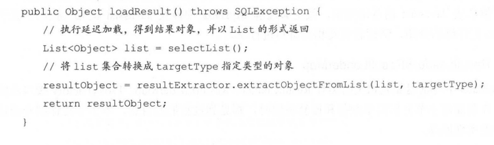 

其中，selectList0方法才是完成延迟加载操作的地方，具体实现如下:

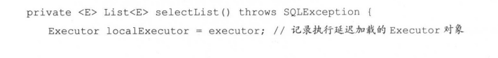 

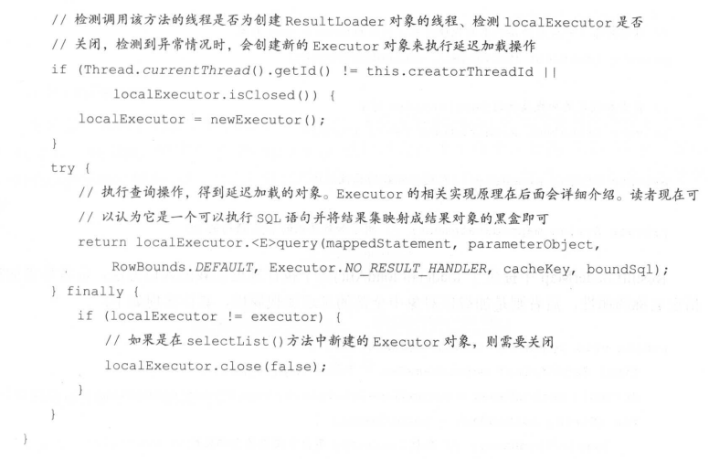 

延迟加载得到的是 List<Object>类型的对象，ResultExtractor.extractObjectFromList0)方法负责将其转换为 targetType类型的对象，大致逻辑如下:

* 如果目标对象类型为 List，则无须转换

* 如果目标对象类型是 Collection 子类、数组类型(其中项可以是基本类型，也可以是对象类型)，则创建 targetType 类型的集合对象，并复制 List<Objec>中的项

* 如果目标对象是普通Java 对象且延迟加载得到的 List 大小为 1，则认为将其中唯一的项作为转换后的对象返回。

  

ResultExtractor的具体代码比较简单，就不再展示了。

#### ResultLoaderMap

ResultLoaderMap与 ResultLoader 之间的关系非常密切,在 ResultLoaderMap 中使用loadMap字段(HashMap<String,LoadPair>类型)保存对象中延迟加载属性及其对应的 ResultLoader 对象之间的关系，该字段的定义如下:

```
private final Map<String, LoadPair> loaderMap = new HashMap<String， LoadPair>();
```

ResultLoaderMap 中提供了增删 loaderMap 集合项的相关方法，代码比较简单，不再赘述

loaderMap 集合中 key 是转换为大写的属性名称，value 是 LoadPair 对象，它是定义在ResultLoaderMap中的内部类，其中定义的核心字段的含义如下:

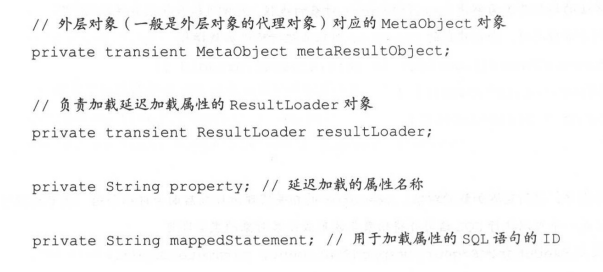 

ResultLoaderMap 中提供了 load0和 loadAll0两个执行延迟加载的入口方法，前者负责加载指定名称的属性，后者则是加载该对象中全部的延迟加载属性，具体实现如下: 

 

ResultLoaderMapload0方法和 ladA110方法最终都是通过调用 LoadPair load0方法实现的LoadPair.load0方法的具体代码如下:

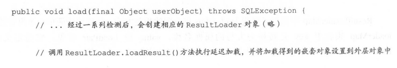 

 

#### ProxyFactory

前面已经介绍了 cglib、Javassit 的基础知识，下面来看 MyBatis 中如何使用这两种方式创建代理对象。MyBatis 中定义了 ProxyFactory 接口以及两个实现类，如图 所示，其中CglibProxyFactory 使用 cglib 方式创建代理对象，JavassitProxyFactory 使用Javassit 方式创建代理。

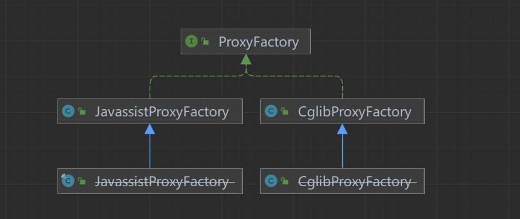 

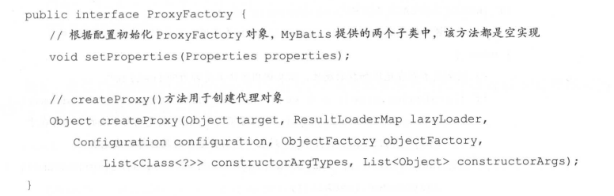 

CglibProxyFactory.createProxy0方法通过调用 EnhancedResultObjectProxylmpl.createProxy()这个静态方法创建代理对象,而EnhancedResultObjectProxylmpl是CglibProxyFactory的内部类EnhancedResultObjectProxyImpl中的字段含义如下：

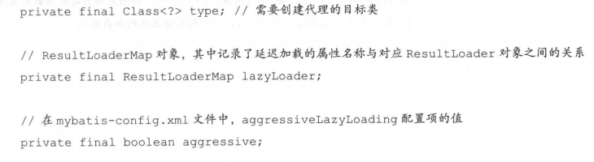  

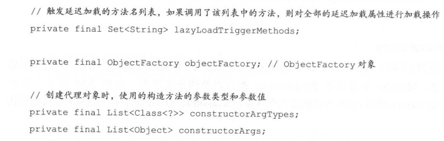 

​	EnhancedResultObjectProxylmpl实现了前面介绍的 MethodInterceptor 接口，其intercept0方法会根据当前调用的方法名称，决定是否触发对延迟加载的属性进行加载，具体实现如下:

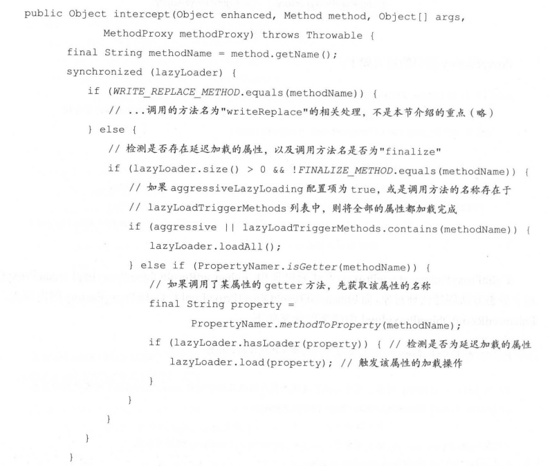 

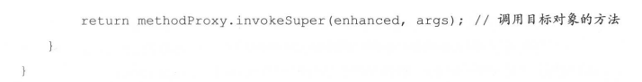 

EnhancedResultObjectProxyImpl中的createProxy0静态方法用于创建代理对象，具体实现如下: 

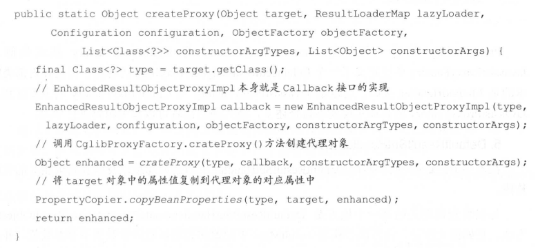 

最后，来看 CglibProxyFactorycrateProxy0方法，其具体实现与前面介绍cglib 时给出的示例代码非常类似，具体实现如下所示。 

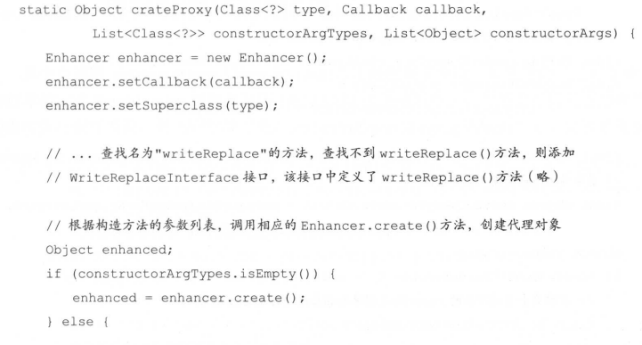 

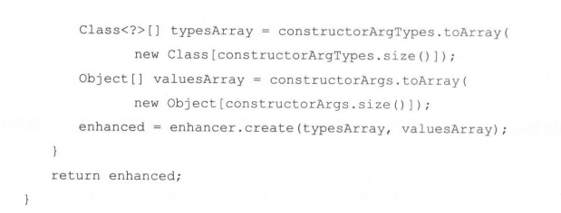 

​	ProxyFactory 的另一个实现 JavassistProxyFactory 与 CglibProxyFactory 基本类似JavassistProxyFactory中也定义了一个 EnhancedResultObjectProxyImpl内部类，但是该内部类继承的是MethodHandler 接口，这也是 JavassistProxyFactory 与 CglibProxyFactory 的主要区别；

#### DefaultResultSetHandler

​	与嵌套查询相关的第一个地方是 DefaultResultSetHandler.createParameterizedResultObject0)方法。正如前文所述，该方法会获取<resultMap>中配置的构造函数的参数类型和参数值，并选择合适的构造函数创建映射的结果对象。如果其中某个构造参数值是通过嵌套查询获取的，则需要通过 getNestedQueryConstructorValue方法创建该参数值，该方法的具体实现如下:

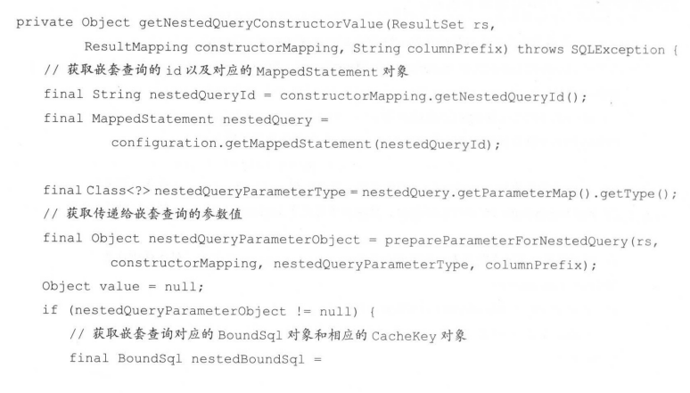 

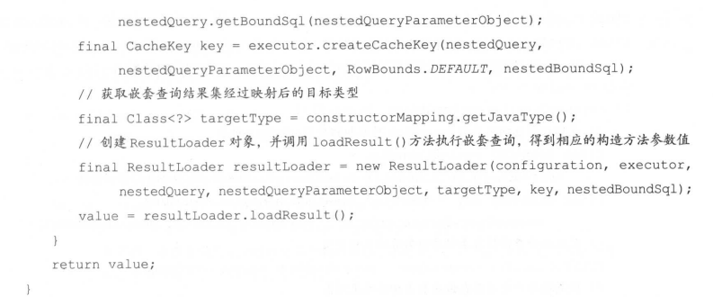 

​	通过上述的分析可知，在创建构造函数的参数时涉及的嵌套查询，无论配置如何，都不会延迟加载，在后面介绍其他属性的嵌套查询中，才会有延迟加载的处理逻辑。

​	前文介绍的 DefaultResultSetHandler.applyPropertyMapping()方法会调用 getPropertyMappingValue0方法映射每个属性，简单回顾一下其实现:

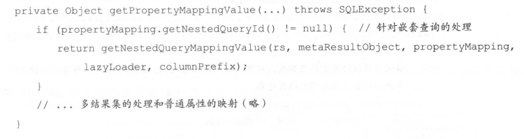 

其中会调用 getNestedQueryMappingValue0方法处理套查询，如果开启了延迟加载功能则创建相应的 ResultLoader 对象并返回 DEFERED这个标识对象;如果未开启延迟加载功能则直接执行嵌套查询，并返回结果对象。getNestedQueryMappingValue0方法的具体实现如下:

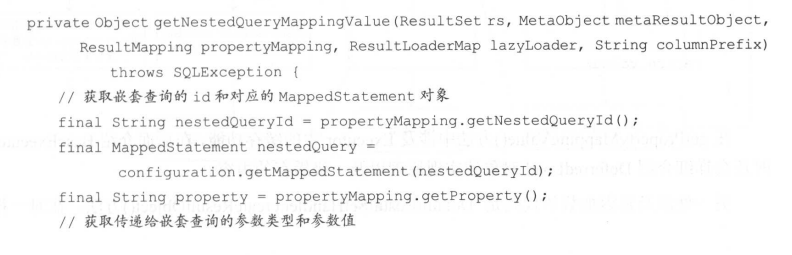 

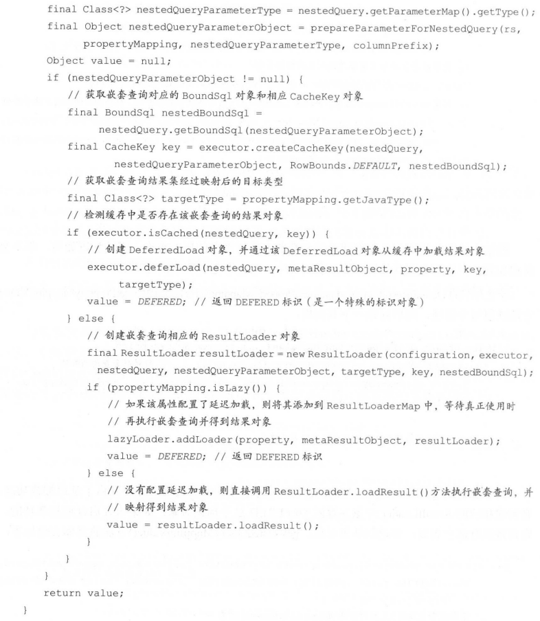  

​	在 getPropertyMappingValue0方法中涉及 Executor 中的缓存功能，在后面介绍 BaseExecutor时还会详细介绍DeferredLoad 对象的实现原理以及一级缓存的内容。
​	另一处涉及延迟加载的代码是 DefaultResultSetHandler.createResultObject0)方法。在对一行

​	记录进行映射时，会使用 createResultObject0方法创建结果对象，其中会遍历ResultMap.propertyResultMappings 集合，如果存在嵌套查询且配置了延迟加载，则为结果对象代理对象并将该代理对象返回。createResultObject0方法中的相关代码片段如下:

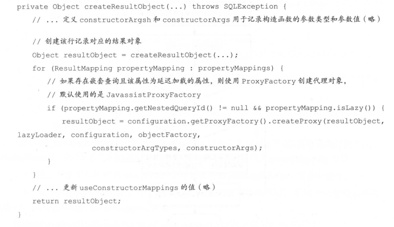 

#### 小结

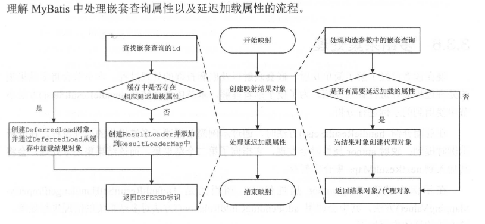 

 总结了上层应用程序使用延迟加载属性时涉及的相关操作

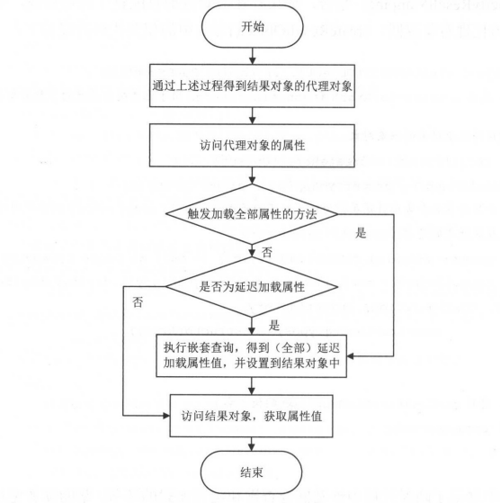 

### 多结果集

​	在前面介绍 handleResultSets0方法时，通过示例简单描述了多结果集的处理流程，在分析示例时提到:映射 author 属性时会发现，它指向了第二个结果集，而该结果集还未处理，会将其加入到nextResultMaps 集合中暂存。
​	在示例中获取 Blog.author 属性值时，调用的是 DefaultResultSetHandler.getPropertyMappingValue0方法，其中会调用 addPendingChildRelation0方法对多结果集的情况进行处理该方法的具体步骤如下:

* 调用 createKeyForMultipleResults(方法，为指定结果集创建 CacheKey 对象，该CacheKey对象由三部分构成。

  * aparentMapping对象，该结果集映射得到的结果对象会设置到该parentMapping 指定的属性上。在示例中，parentMapping 就是下面的<association>节点产生的ResultMapping 对象。

    ```
    <association property="author" javaType="Author" resultSet="authors"column="author id"foreignColumn="id">
    ```

  * parentMapping.column 属性指定的列名(可能有多个列)，示例中为字符串author id”
  * 这些列名在该记录中的值 (可能有多个值)，在示例中为 uthor id 列的值，假设其值为1。

* 创建 PendingRelation 对象,PendingRelation 只有两个public字段,没有提供任何方法PendingRelation中记录了当前结果对象相应的 MetaObject 对象以及 parentMapping 对象。

* 将步骤2中得到的PendingRelation对象添加到pendingRelations 集合中缓存

* 在 nextResultMaps 集合中记录指定属性对应的结果集名称，示例中结果集名称是authors，以及它对应的 ResultMapping 对象。

DefaultResultSetHandleraddPendingChildRelation0方法的具体实现如下:

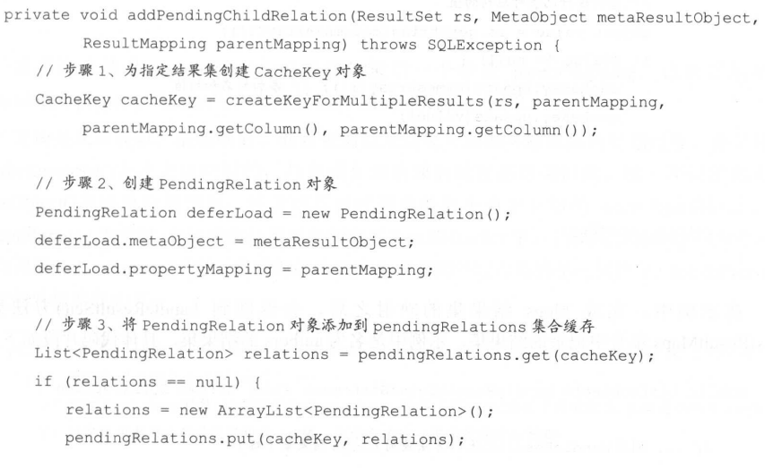 

 

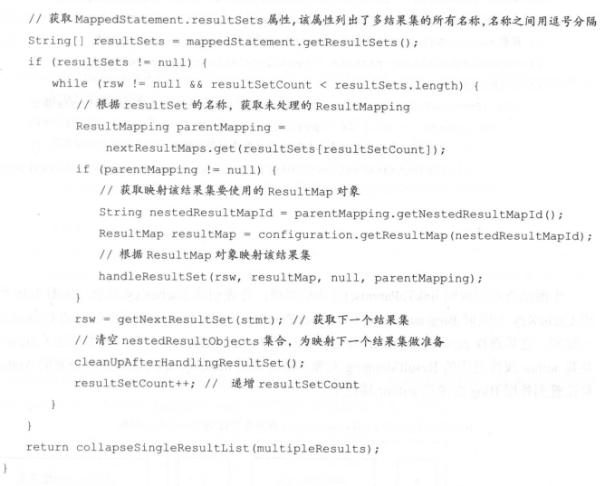 

需要注意的是处理结果集()方法的最后一个参数父映射，也就是示例中<关联属性="作者...">节点产生的结果映射对象。
无论是简单映射、嵌套映射、嵌套查询以及这里介绍的多结果集的处理过程，都是通过handleResultSet0方法完成映射的，与前面介绍的映射过程都是类似的。唯一不同的地方是storeObject0方法执行的逻辑，读者可以回顾简单映射小节中介绍的 storeObject0方法，当parentMapping为空时，会将映射结果对象保存到ResultHandler中,当parentMapping不为空时，则会调用linkToParents0方法，将映射的结果结果设置到外层对象的相应属性中。linkToParents0方法的具体实现如下:

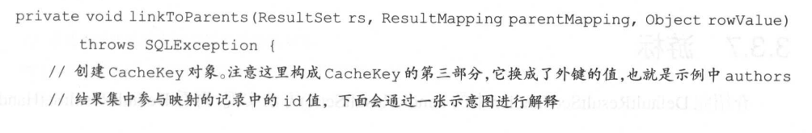 

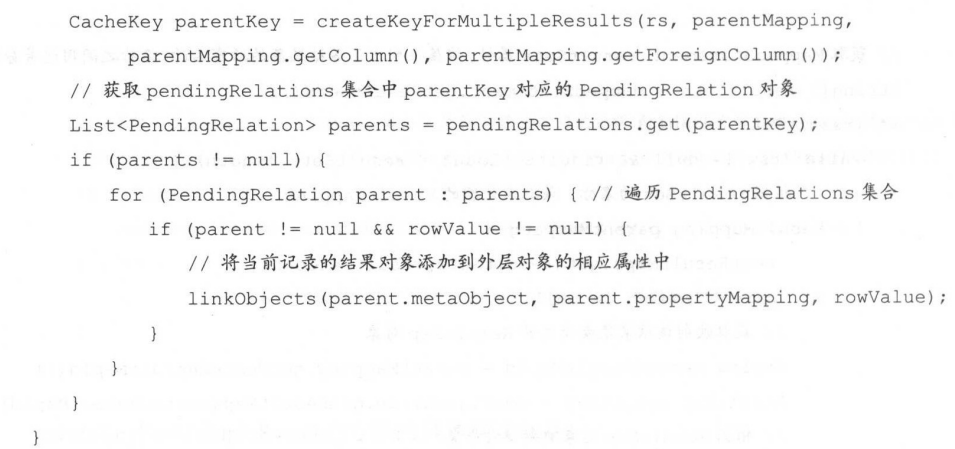 

​	下面结合示例说明 linkToParents0方法的原理:首先创建 CacheKey 对象，所示该CacheKey 与映射 Blog.author 属性时在addPendingChildRelation0方法中创建的 CacheKey是一致的。之后查找 pendingRelations 集合中相应的PendingRelation 对象，其中记录了 Blog 对象及其author 属性对应的 ResultMapping 对象。最后调用 linkObject0方法将映射得到的Author对象设置到外层Blog对象的author 属性中。

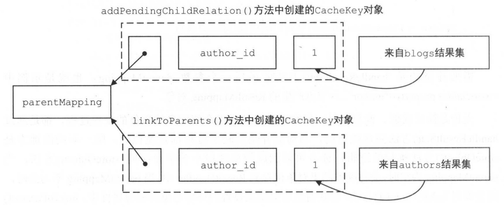 

### 游标

handleCursorResultSets0方法，该方法在数据库查询结束之后，将结果集对应的 ResultSetWrapper 对象以及映射使用的 ResultMap 对象封装成 DefaultCursor 对象并返回。

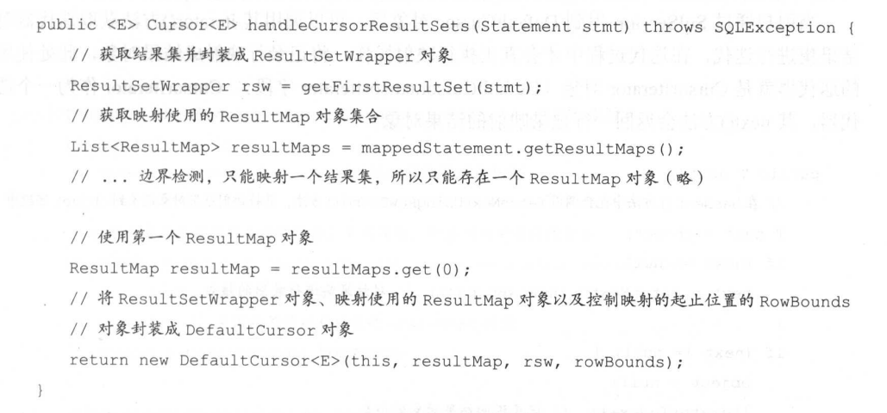 

​	MyBatis 中使用 Cursor 接口表示游标，Cursor 接口继承了Iteratable 接口。MyBatis 提供的唯一的Cursor 接口实现是 DefaultCursor，其中核心字段的含义如下所示。

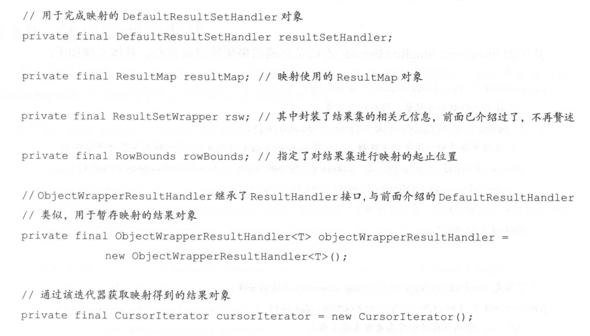 

 

当用户通过SqlSession 得到 DefaultCursor 对象后，可以调用其 iterator0方法获取选代器对结果集进行迭代，在迭代过程中才会真正执行映射操作，将记录行映射成结果对象，此处使用的迭代器就是 CursorIterator 对象 (DefaultCursor.cursorlterator 字段)。CursorIterator 作为一个迭代器，其next0方法会返回一行记录映射的结果对象。

其中的fetchNextUsingRowBound0方法是完成结果集映射的核心，具体实现如下:

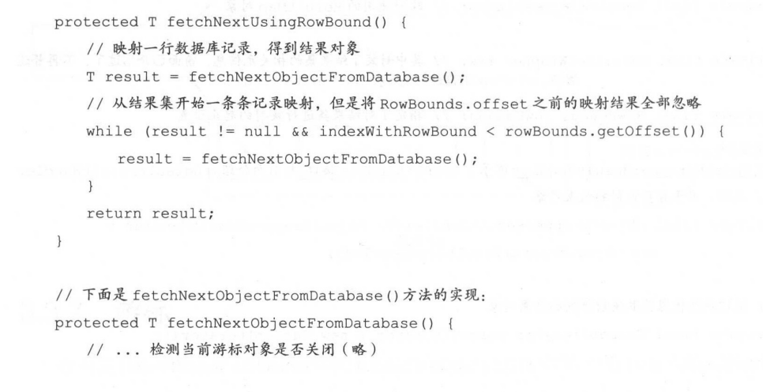 

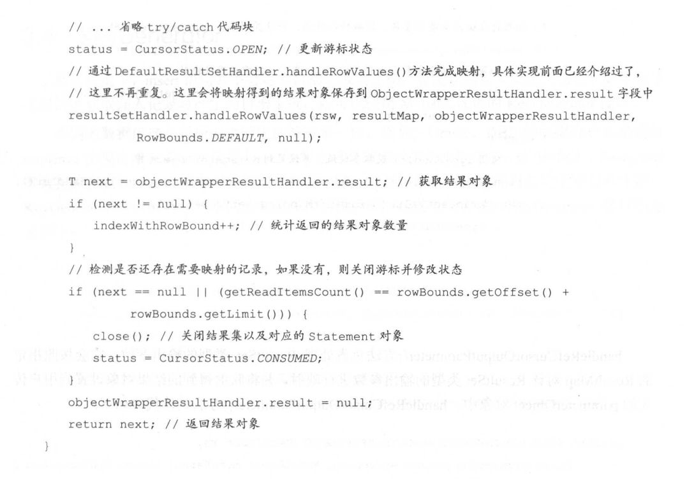 

### 输出参数类型

最后介绍 DefaultResultSetHandler 对存储过程中输出参数的相关处理，该处理过程是在handleOutputParameters0方法中实现的，具体实现如下:

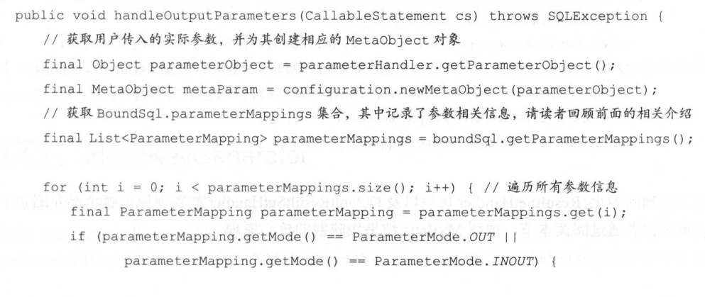 

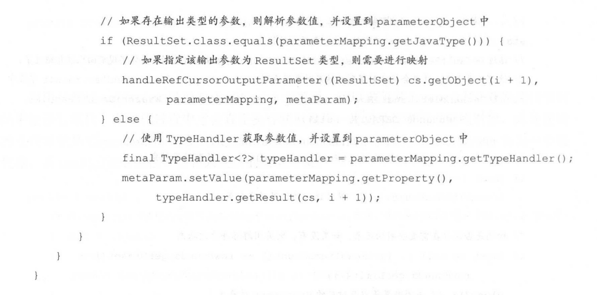 

handleRefCursorOutputParameter0方法负责处理 ResultSet 类型的输出参数，它会按照指定的ResultMap 对该 ResultSet 类型的输出参数进行映射，并将映射得到的结果对象设置到用户传入的 parameterObject 对象中。handleRefCursorOutputParameter()方法具体代码如下:

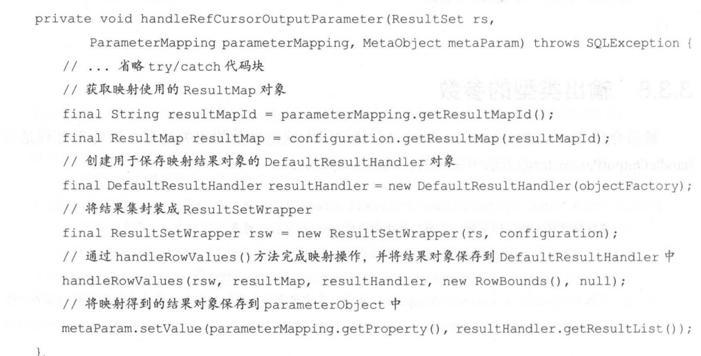 

## KeyGenerator

默认情况下，insert 语句并不会返回自动生成的主键，而是返回插入记录的条数。如果业务逻辑需要获取插入记录时产生的自增主键，则可以使用 Mybatis 提供的 KeyGenerator 接口。不同的数据库产品对应的主键生成策略不一样，例如，Oracle DB2等数据库产品是通过sequence 实现自增id 的，在执行 insert语句之前必须明确指定主键的值;而 MySQL、Postgresql等数据库在执行 insert 语句时，可以不指定主键，在插入过程中由数据库自动生成自增主键。KeyGenerator 接口针对这些不同的数据库产品提供了对应的处理方法，KeyGenerator 接口的定义如下:

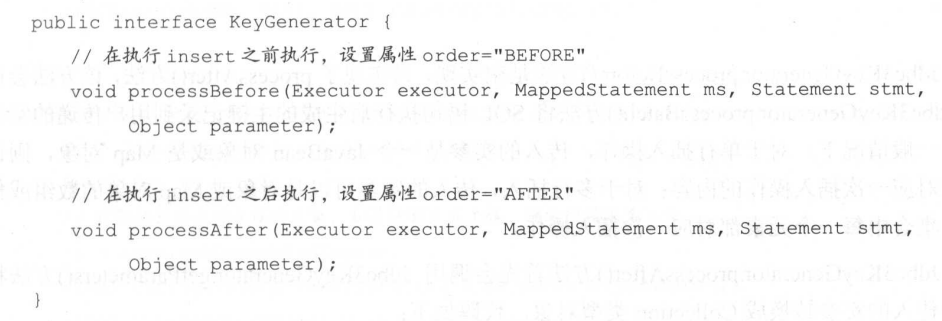 

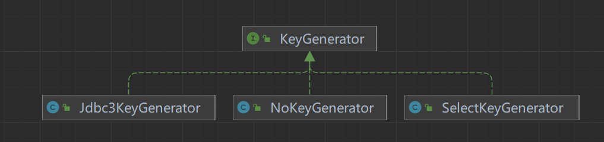 

NoKeyGenerator 虽然实现了 KeyGenerator 接口，但是其中的 processBefore()方法和processAfter0方法都是空实现，所以不再单独介绍。

### Jdbc3KeyGenerator

#### 源码分析

​	Jdbc3KeyGenerator 用于取回数据库生成的自增id，它对应于 mybatis-configxml配置文件中的 useGeneratedKeys 全局配置，以及映射配置文件中 SQL 节点 (<insert>节点)的useGeneratedKeys 属性。在前面对 XMLStatementBuilder,parseStatementNode0方法的介绍中，有如下代码片段：

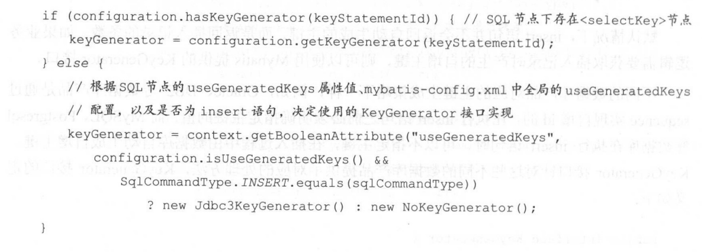 

​	Jdbc3KeyGenerator.processBefore()方法是空实现，只实现了 processAfter0方法，该方法会调用Jdbc3KeyGeneratorprocessBatch0方法将SQL 语句执行后生成的主键记录到用户传递的实参中。一般情况下，对于单行插入操作，传入的实参是一个 JavaBean 对象或是 Map 对象，则该对象对应一次插入操作的内容;对于多行插入，传入的实参可以是对象或 Map 对象的数组或集合，集合中每一个元素都对应一次插入操作。
​	Jdbc3KeyGeneratorprocessAfter方法首先会调用 Jdbc3KeyGenerator.getParameters0方法将用户传入的实参转换成 Collection 类型对象，代码如下:

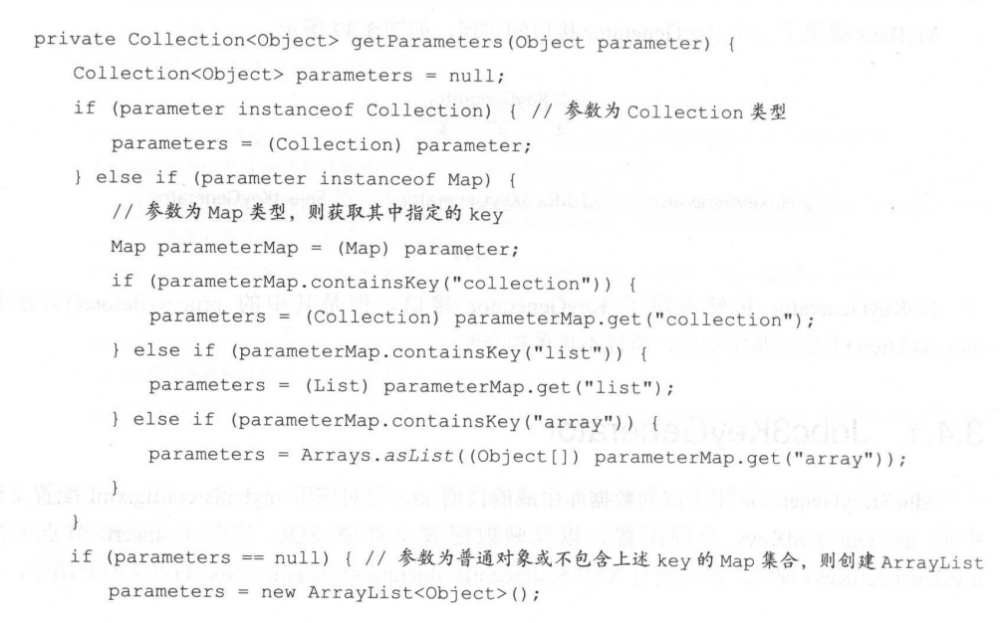 

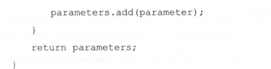 

之后，processBatch0方法会遍历数据库生成的主键结果集，并设置到 parameters 集合对应元素的属性中。

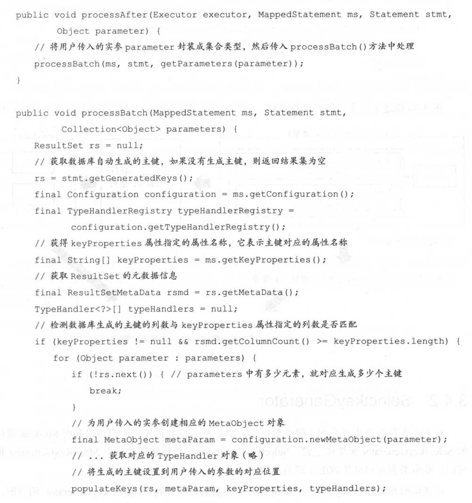 

#### 示例

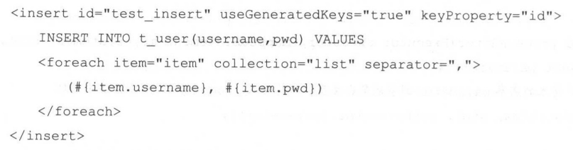 

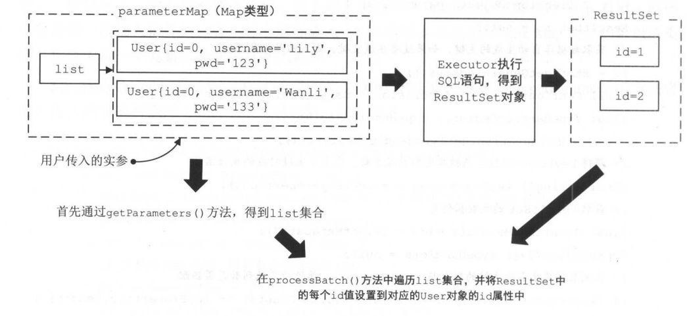 

### SelectkeyGenerator

对于不支持自动生成自增主键的数据库，例如 Oracle 数据库，用户可以利用 MyBatis 提供的 SelectkeyGenerator 来生成主键，SelectkeyGenerator 也可以实现类似于 Jdbc3KeyGenerator 提供的、获取数据库自动生成的主键的功能。

#### 源码分析

在前面分析<selectKey>节点的解析过程中，我们曾经见到过 SelectkeyGenerator 的身影。SelectkeyGenerator主要用于生成主键，它会执行映射配置文件中定义的<selectKey>节点的SQL语句，该语句会获取insert 语句所需要的主键。

SelectKevGenerator 中定义的字段的含义如下:

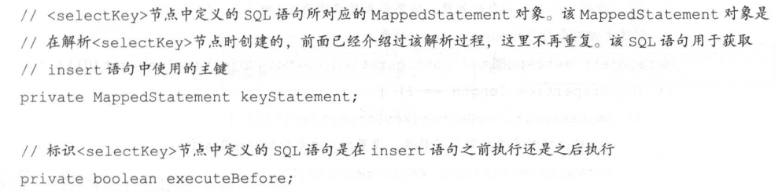 

SelectkeyGenerator 中的 processBefore0方法和 processAfter0方法的实现都是调用processGeneratedKeys0方法，两者的具体实现如下:

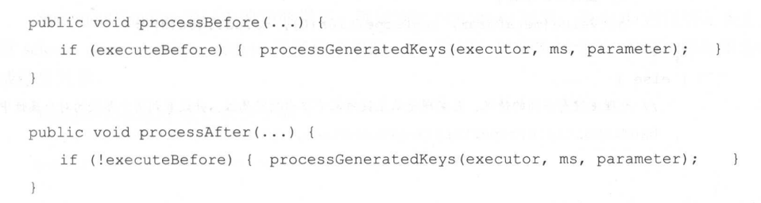 

processGeneratedKeys0方法会执行<selectKey>节点中配置的 SQL 语，获取insert 语句中用到的主键并映射成对象，然后按照配置，将主键对象中对应的属性设置到用户参数中。
processGeneratedKeys0方法的具体实现如下:

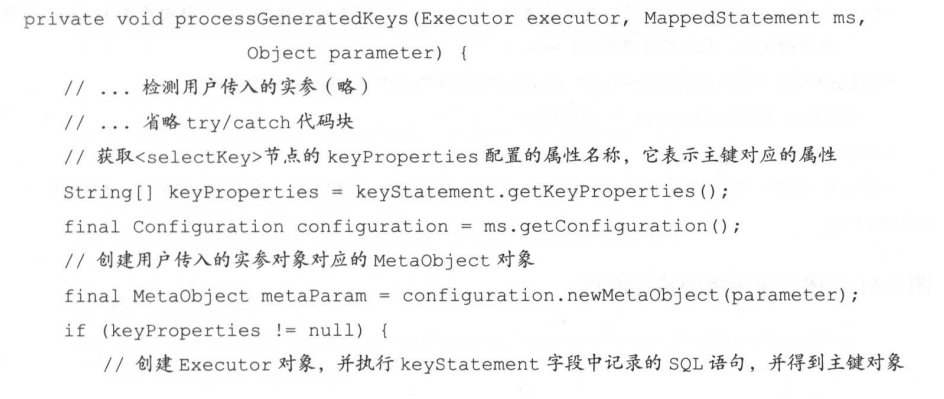 

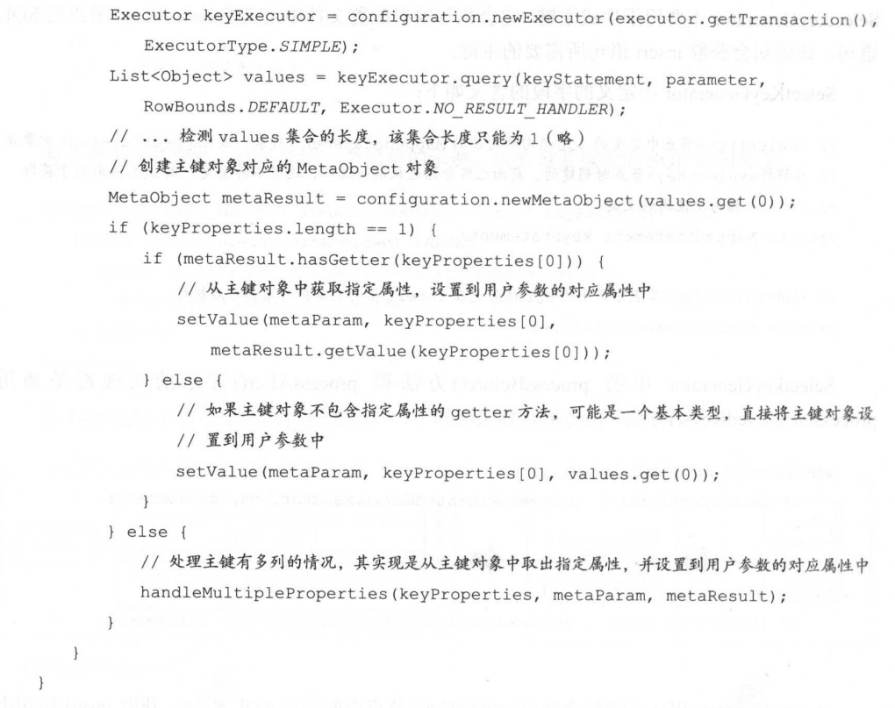 

#### 示例

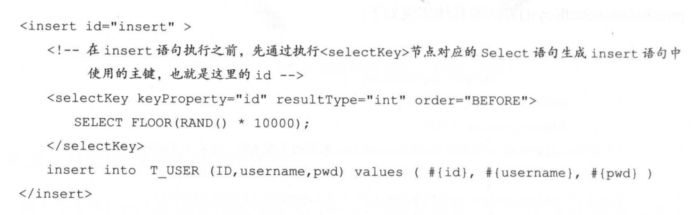 

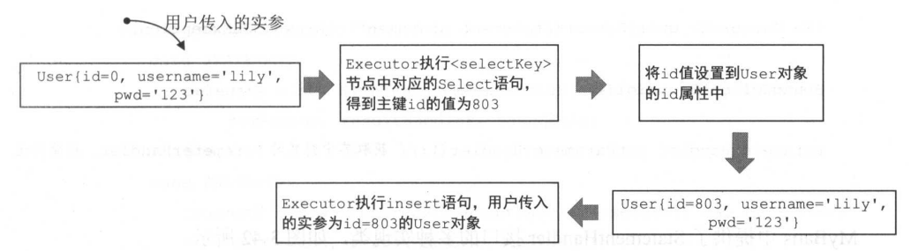 

## StatementHandler

​	StatementHandler 接口是MyBatis 的核心接口之一，它完成了MyBatis 中最核心的工作，也是后面要介绍的Executor 接口实现的基础。
​	StatementHandler 接口中的功能很多，例如创建Statement 对象，为SOL语句绑定实参，执行 select、insert、update、delete 等多种类型的 SOL语句，批量执行 SOL 语句，将结果集映射成结果对象。
​	StatementHandler 接口的定义如下:

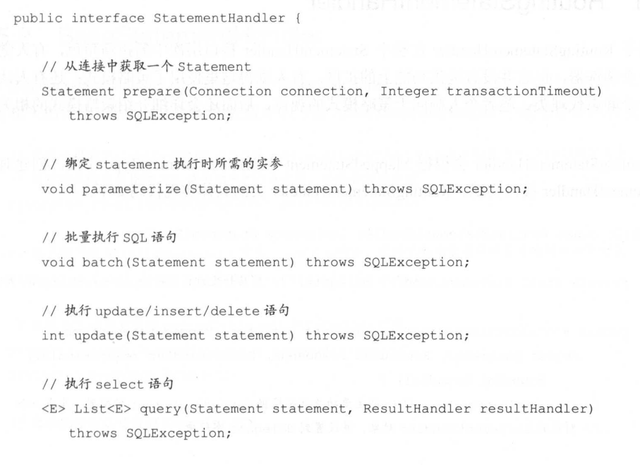 

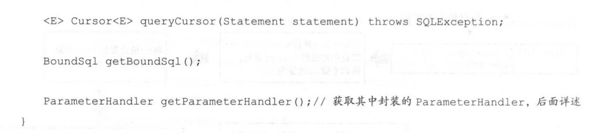 

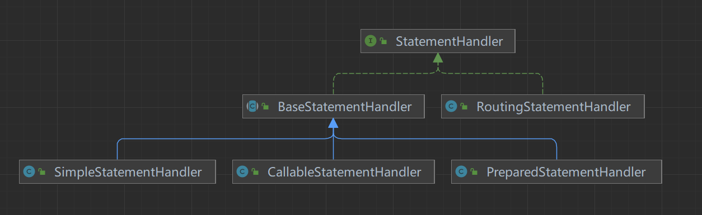  

### RoutingStatementHandler

​	对于 RoutingStatementHandler 在整个 StatementHandler 接口层次中的扮演角色，有人觉得它是一个装饰器，但它并没有提供功能上的扩展;有人觉得这里使用了策略模式;还有人认为它是一个静态代理类。笔者个人倾向于策略模式的观点，后面还会详细介绍策略模式的相关知识。
​	RoutingStatementHandler 会根据 MappedStatement 中指定的 statementType 字段，创建对应的StatementHandler 接口实现。RoutingStatementHandler 类的具体实现代码如下:

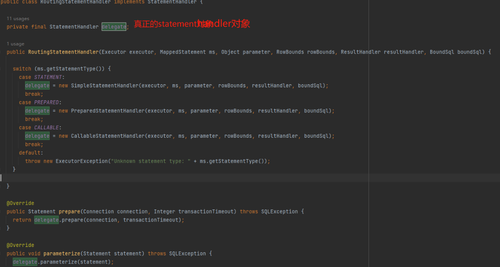 

### BaseStatementHandler

BaseStatementHandler 是一个实现了StatementHandler 接口的抽象类，它只提供了一些参数绑定相关的方法并没有实现操作数据库的方法BaseStatementHandler 中核心字段的含义如下：

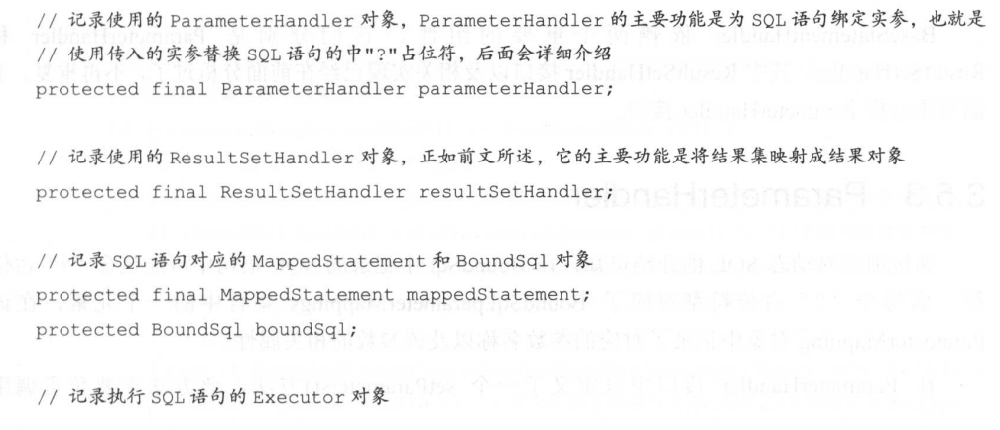 

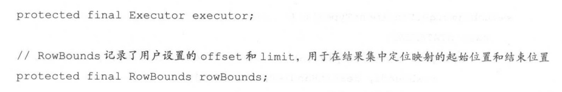 

在 BaseStatementHandler 的构造方法中，除了初始化上述字段之外，还会调用KeyGeneratorprocessBefore0方法初始化SOL语句的主键，具体实现如下:

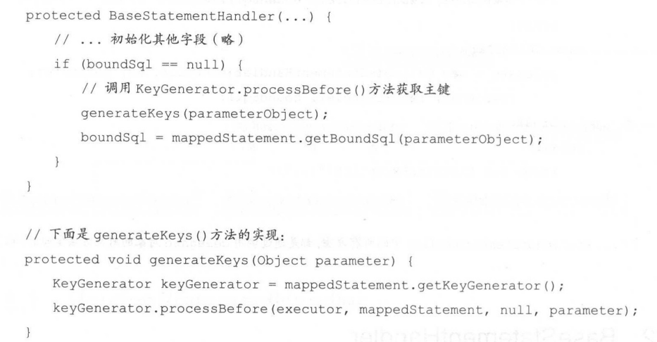 

​	BaseStatementHandler 实现了 StatementHandler 接口中的 prepare()方法，该方法首先调用instantiateStatement0抽象方法初始化 java.sql.Statement 对象，然后为其配置超时时间以及fetchSize 等设置，代码比较简单，不再贴出来了。
​	BaseStatementHandler 依赖两个重要的组件，它们分别是 ParameterHandler 和ResultSetHandler。其中 ResultSetHandler 接口以及相关实现已经在前面分析过了，不再重复。下面着重分析 ParameterHandler 接口。

### ParameterHandler 

​	通过前面对动态SQL的介绍可知，在 BoundSql中记录的SOL语句中可能包含“?”占位符，而每个“?”占位符都对应了 BoundSqlparameterMappings 集合中的一个元素，在该ParameterMapping对象中记录了对应的参数名称以及该参数的相关属性
​	在 ParameterHandler 接口中只定义了一个 setParameters0方法，该方法主要负责调用

​	PreparedStatementset*0方法为SOL语句绑定实参。MyBatis 只为 ParameterHandler 接口提供了唯一一个实现类，也就是本小节主要介绍的 DefaultParameterHandler。DefaultParameterHandler中核心字段的含义如下:

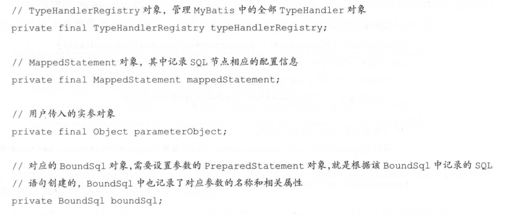 

​	在DefaultParameterHandler.setParameters(方法中会遍历 BoundSqlparameterMappings 集合中记录的 ParameterMapping 对象，并根据其中记录的参数名称查找相应实参，然后与SQL语句绑定。setParameters0方法的具体代码如下:

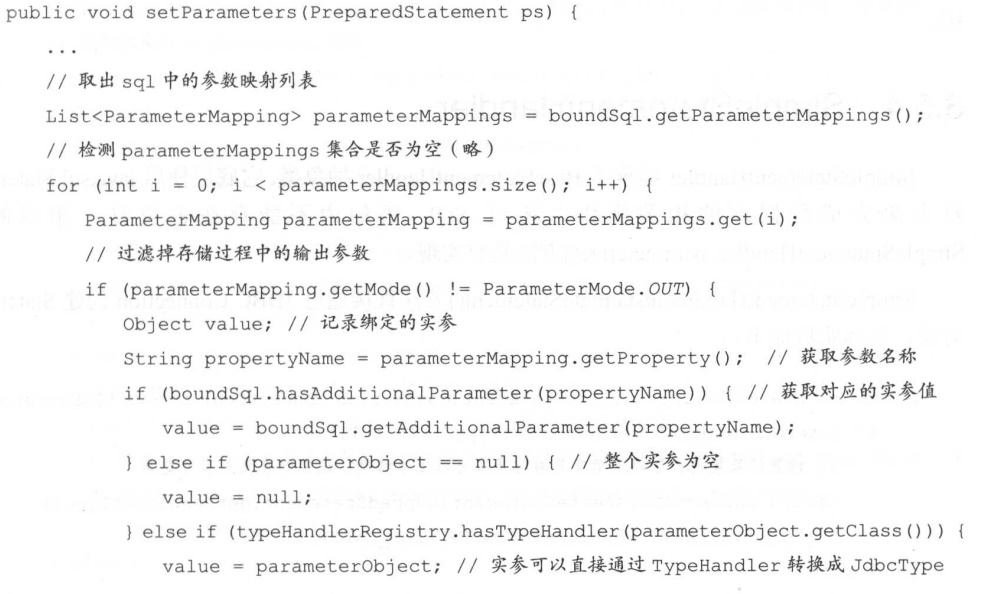 

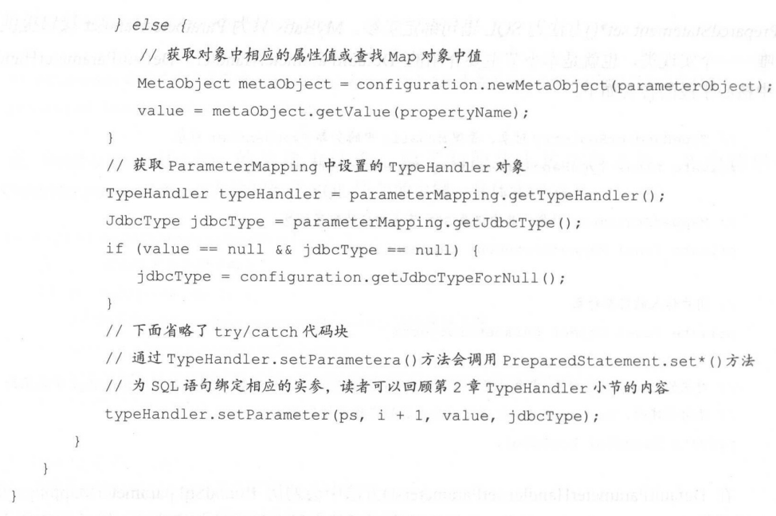 

为SQL语句绑定完实参之后，就可以调用 Statement 对象相应的execute0方法，将SQL语句交给数据库执行了，该步骤在下一节介绍 BaseStatementHandler 子类的具体实现时会详细介绍。

### SimpleStatementHandler

​	SimpleStatementHandler 继承了 BaseStatementHandler 抽象类。它底层使用 javasqlStatement对象来完成数据库的相关操作，所以 SOL 语句中不能存在占位符，相应的，SimpleStatementHandler.parameterize0)方法是空实现。
​	SimpleStatementHandler.instantiateStatement)方法直接通过JDBC Connection 创建 Statement对象，具体实现如下:

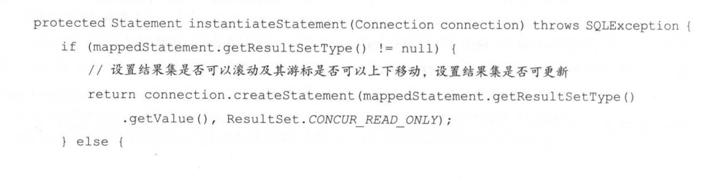 

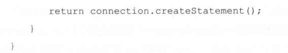 

上面创建的 Statement 对象之后会被用于完成数据库操作，SimpleStatementHandler.query0方法等完成了数据库查询的操作，并通过 ResultSetHandler 将结果集映射成结果对象。 

 

​	SimpleStatementHandler 中的queryCursor0、batch0方法与query0方法实现类似，也是直接调用Statement对象的相应方法，不再赘述。
​	SimpleStatementHandlerupdate0方法负责执行 insert、update 或 delete 等类型的 SOL 语句,并且会根据配置的KeyGenerator 获取数据库生成的主键，具体实现如下:

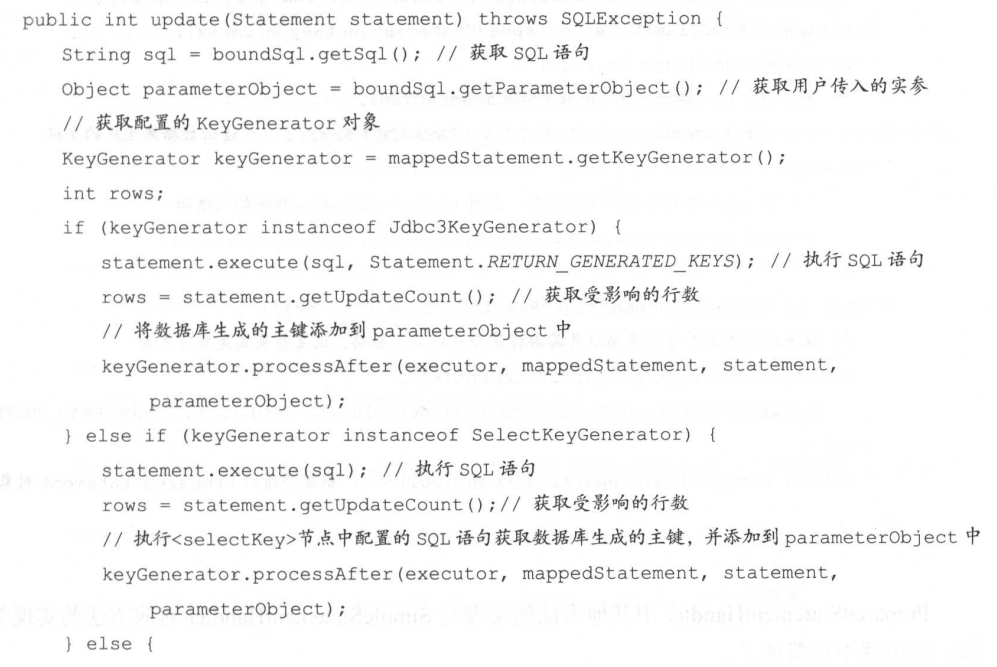 

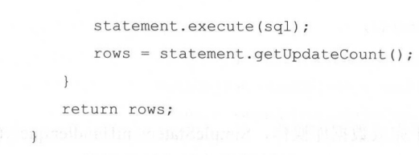 

### PreparedStatementHandler

​	PreparedStatementHandler底层依赖于java.sql.PreparedStatement对象来完成数据库的相关操作。在 SimpleStatementHandler,parameterize0方法中，会调用前面介绍的 ParameterHandler.setParameters0方法完成SOL语句的参数绑定，代码比较简单，不再贴出来了。
​	PreparedStatementHandlerinstantiateStatement))方法直接调用DBC Connection 的prepareStatement0方法创建 PreparedStatement 对象，具体实现如下;

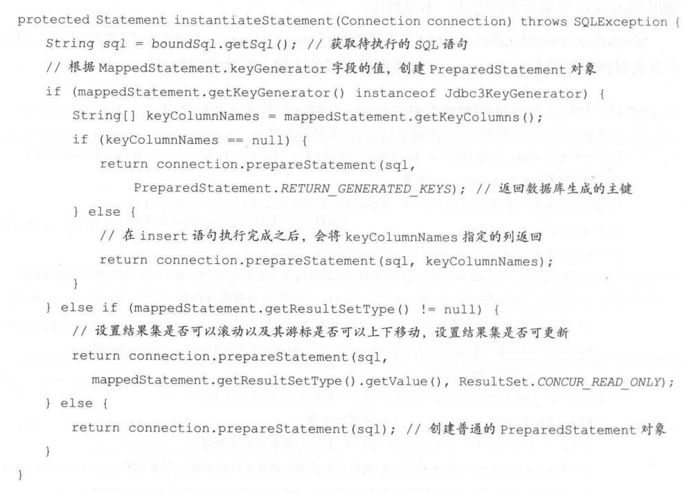 

PreparedStatementHandler 中其他方法的实现与 SimpleStatementHandler 对应方法的实现类似；

​	CallableStatementHandler 底层依赖于 javasql.CallableStatement 调用指定的存储过程，其parameterize0方法也会调用ParameterHandlersetParameters0方法完成SOL语句的参数绑定，并指定输出参数的索引位置和JDBC类型。其余方法与前面介绍的 ResultSetHandler 实现类似，唯一区别是会调用前面介绍的 ResultSetHandler.handleOutputParameters0处理输出参数，这里不再赘述了，感兴趣的读者可以参考源码进行学习。

## Executor

​	Executor 是 MyBatis 的核心接口之一，其中定义了数据库操作的基本方法。在实际应用中经常涉及的SqlSession接口的功能，都是基于 Executor 接口实现的。Executor 接口中定义的方法如下:

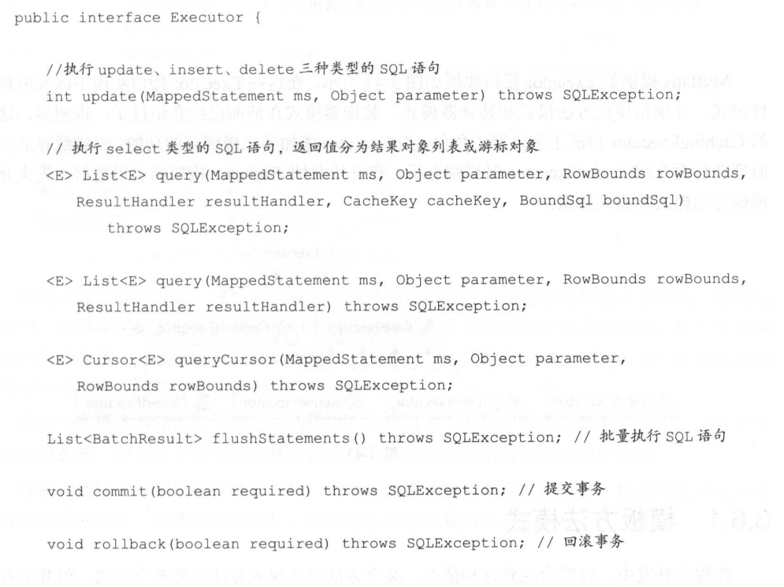 

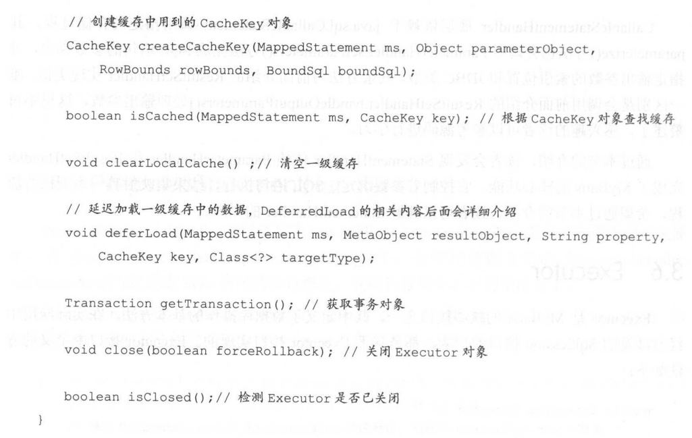 

MyBatis提供的 Executor 接口实现如图所示，在这些Executor 接口实现中涉及两种设计模式，分别是模板方法模式和装饰器模式。装饰器模式在前面已经介绍过了，很明显，这里的CachingExecutor 扮演了装饰器的角色为 Executor 添加了二级缓存的功能，二级缓存的实现原理在后面介绍CacheExecutor 时详细分析。在开始介绍 Executor 接口的实现之前，先来介绍模板方法模式的相关知识。

### 模板方法模式

​	在程序开发中，经常会遇到这种情况:某个方法要实现的算法需要多个步骤，但其中有一些步骤是固定不变的，而另一些步骤则是不固定的。为了提高代码的可扩展性和可维护性，模板方法模式在这种场景下就派上了用场。
​	在模板方法模式中，一个算法可以分为多个步骤，这些步骤的执行次序在一个被称为“模板方法”的方法中定义，而算法的每个步骤都对应着一个方法，这些方法被称为“基本方法”模板方法按照它定义的顺序依次调用多个基本方法，从而实现整个算法流程。在模板方法模式中，会将模板方法的实现以及那些固定不变的基本方法的实现放在父类中，而那些不固定的基本方法在父类中只是抽象方法，其真正的实现代码会被延迟到子类中完成。
​	下面来看模板方法模式的结构，如图所示其中template0方法是模板方法,operation30是固定不变的基本方法，而operationl、operation2、operation4 都是不固定的基本方法，所以在AbstractClass中都定义为抽象方法，而ConcreteClass1和ConcreteClass2这两个子类需要实现这些方法。

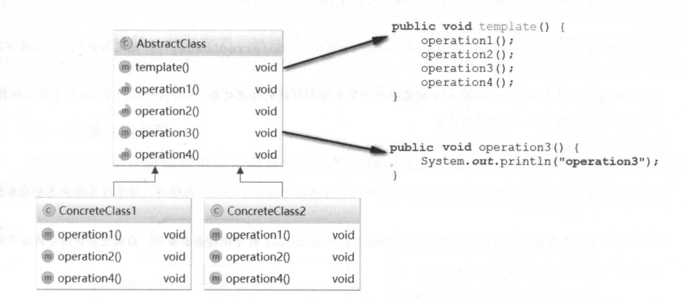 

​	通过上面的描述可知，模板方法模式可以将模板方法以及固定不变的基本方法统一封装到父类中，而将变化的部分封装到子类中实现，这样就由父类控制整个算法的流程，而子类实现算法的某些细节，实现了这两方面的解耦。当需要修改算法的行为时，开发人员可以通过添加子类的方式实现，这符合“开放-封闭”原则。
​	模板方法模式不仅可以复用已有的代码，还可以充分利用了面向对象的多态性，系统可以在运行时选择一种具体子类实现完整的算法，这就提高系统的灵活性和可扩展性。
​	模板方法模式与其他设计模式一样，都会增加系统的抽象程度。另外，模板方法模式在修改算法实现细节时，会增加类的个数，也会增加系统的复杂性。

### BaseExecutor

​	BaseExecutor是一个实现了Executor接口的抽象类,它实现了Executor接口的大部分方法其中就使用了模板方法模式。BaseExecutor 中主要提供了缓存管理和事务管理的基本功能，继承BaseExecutor的子类只要实现四个基本方法来完成数据库的相关操作即可，这四个方法分别是:doUpdate0方法、doQuery0方法、doQueryCursor0方法、doFlushStatement0方法，其余的功能在BaseExecutor 中实现。
​	BaseExecutor 中各个字段的含义如下:

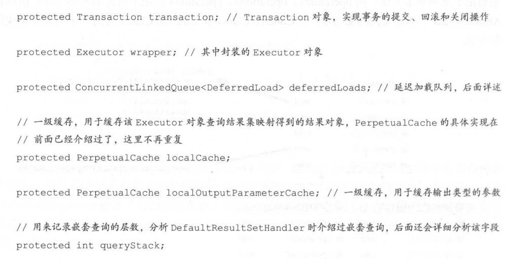 

#### 一级缓存简介

​	在常见的应用系统中，数据库是比较珍贵的资源，很容易成为整个系统的瓶颈。在设计和维护系统时，会进行多方面的权衡，并且利用多种优化手段，减少对数据库的直接访问。使用缓存是一种比较有效的优化手段，使用缓存可以减少应用系统与数据库的网络交互、减少数据库访问次数、降低数据库的负担、降低重复创建和销毁对象等一系列开销，从而提高整个系统的性能。从另一方面来看，当数据库意外宕机时，缓存中保存的数据可以继续支持应用程序中的部分展示的功能，提高系统的可用性。
​	MyBatis 作为一个功能强大的ORM框架，也提供了缓存的功能，其缓存设计为两层结构分别为一级缓存和二级缓存。二级缓存在后面介绍CachingExecutor 时会详细介绍，本小节主要介绍一级缓存的相关内容
级缓存是会话级别的缓存，在MyBatis 中每创建一个 SqlSession 对象，就表示开启一次数据库会话。在一次会话中，应用程序可能会在短时间内，例如一个事务内，反复执行完全相同的查询语句，如果不对数据进行缓存，那么每一次查询都会执行一次数据库查询操作，而多次完全相同的、时间间隔较短的查询语句得到的结果集极有可能完全相同，这也就造成了数据库资源的浪费。

​	MyBatis 中的 SqlSession 是通过本节介绍的 Executor 对象完成数据库操作的，为了避免上述问题，在 Executor 对象中会建立一个简单的缓存，也就是本小节所要介绍的“一级缓存”，它会将每次查询的结果对象缓存起来。在执行查询操作时，会先查询一级缓存，如果其中存在完全一样的查询语句，则直接从一级缓存中取出相应的结果对象并返回给用户，这样不需要再访问数据库了，从而减小了数据库的压力。
​	一级缓存的生命周期与 SqlSession 相同，其实也就与 SqlSession 中封装的 Executor 对象的生命周期相同。当调用 Executor 对象的 close0方法时，该 Executor 对象对应的一级缓存就变得不可用。一级缓存中对象的存活时间受很多方面的影响,例如在调用 Executor.update0方法时也会先清空一级缓存。其他影响一级缓存中数据的行为，我们在分析 BaseExecutor 的具体实现时会详细介绍。一级缓存默认是开启的，一般情况下，不需要用户进行特殊配置。如果存在特殊需求，读者可以考虑使用插件功能来改变其行为。

#### 一级缓存管理

执行 select语句查询数据库是最常用的功能,BaseExecutor.query0方法实现该功能的思路还是比较清晰的，如图所示。

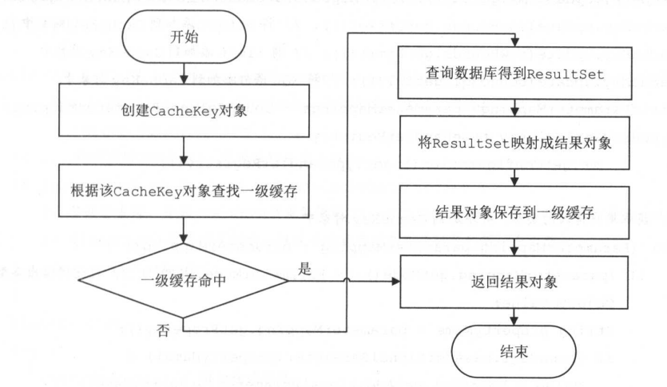 

BaseExecutor.query0方法会首先创建 CacheKey 对象，并根据该 CacheKey 对象查找一级缓存，如果缓存命中则返回缓存中记录的结果对象，如果缓存未命中则查询数据库得到结果集，之后将结果集映射成结果对象并保存到一级缓存中，同时返回结果对象。query0方法的具体实现如下:

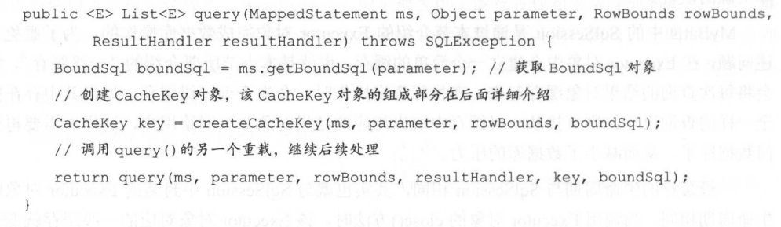 

CacheKey对象在前面介绍缓存模块时已经分析过了，这里主要关注BaseExecutor.createCacheKey0方法创建的 CacheKey 对象由哪几部分构成，createCacheKey0方法具体实现如下:

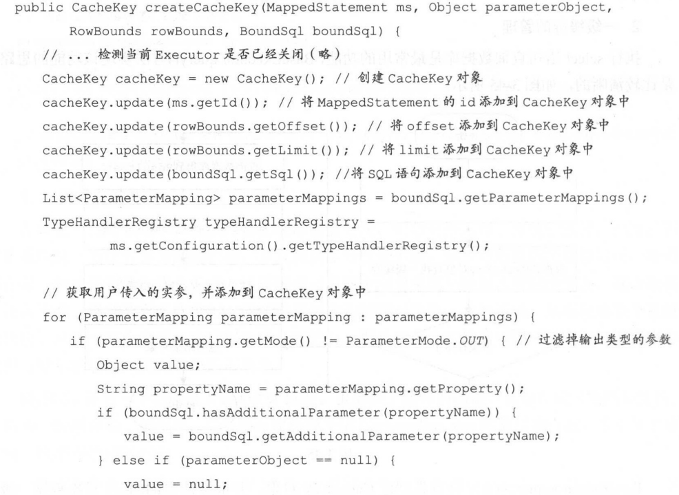 

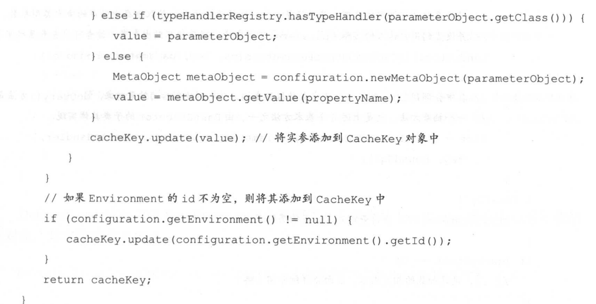 

​	可以清晰地看到，该 CacheKey 对象由 MappedStatement 的 id、对应的 offset 和 limit、SQL语句(包含“?”占位符)用户传递的实参以及Environment的id 这五部分构成。
​	继续来看上述代码中调用的 query0方法的另一重载的具体实现，该重载会根据前面创建的CacheKey 对象查询一级缓存,如果缓存命中则将缓存中记录的结果对象返回，如果缓存未命中则调用 doQuery0方法完成数据库的查询操作并得到结果对象，之后将结果对象记录到一级缓存中。具体实现如下:

 

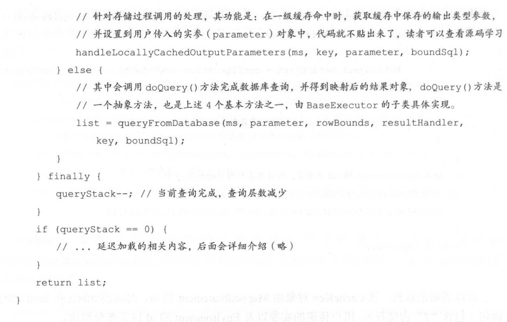 

上面介绍了 BaseExecutor 中缓存的第一种功能，也就是缓存结查询得到的结果对象。除此之外，一级缓存还有第二个功能:前面在分析嵌套查询时，如果一级缓存中缓存了嵌套查询的结果对象，则可以从一级缓存中直接加载该结果对象:如果一级缓存中记录的嵌套查询的结果对象并未完全加载，则可以通过 DeferredLoad 实现类似延迟加载的功能。
Executor 中与上述功能直接相关的方法有两个，一个是sCached0方法负责检测是否缓存了指定查询的结果对象，具体实现如下:

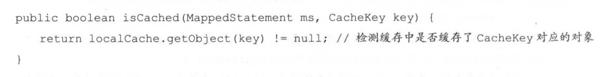

另一个是 deferLoad0方法,它负责创建 DeferredLoad 对象并将其添加到 deferredLoads 集合中，具体实现如下: 

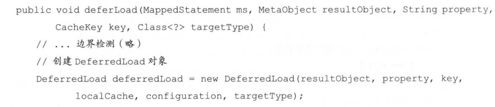 

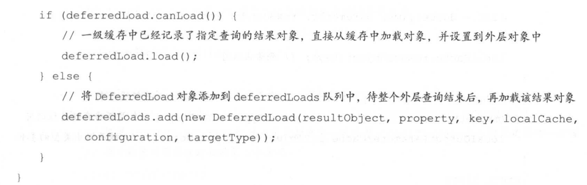 

 DeferredLoad 是定义在 BaseExecutor 中的内部类，它负责从 localCache 缓存中延迟加载结果对象，其字段的含义如下:

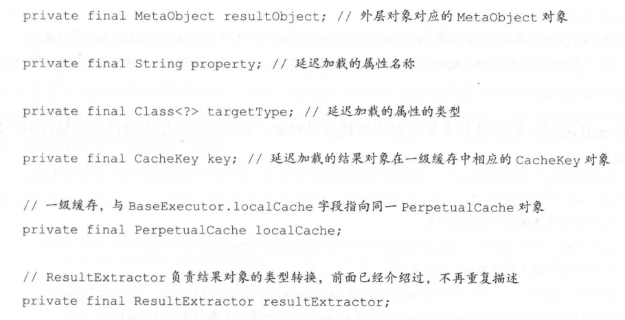 

DeferredLoadcanLoad0方法负责检测缓存项是否已经完全加载到了缓存中。首先要说明“完全加载”的含义: BaseExecutor.queryFromDatabase0方法中，开始查询调用 doQuery0方法查询数据库之前，会先在 localCache 中添加占位符，待查询完成之后，才将真正的结果对象放到localCache 中缓存，此时该缓存项才算“完全加载”。BaseExecutor.queryFromDatabase0方法的实现大致如下: 

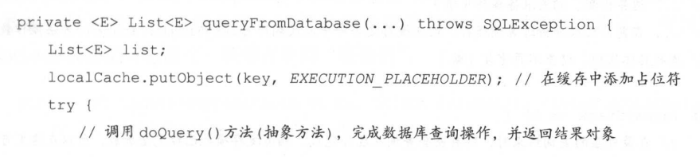 

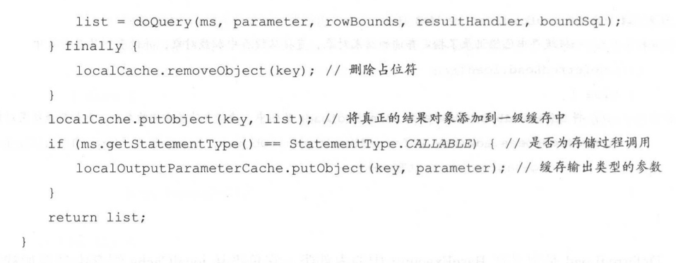 

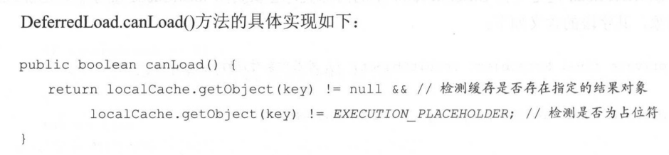 

DeferredLoad.load0方法负责从缓存中加载结果对象，并设置到外层对象的相应属性中，具体实现如下: 

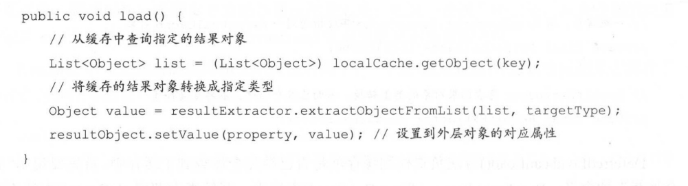 

介绍完 DeferredLoad 对象之后,来看触发 DeferredLoad 从缓存中加载结果对象的相关代码这段代码在 BaseExecutor.query0方法中，如下所示。 

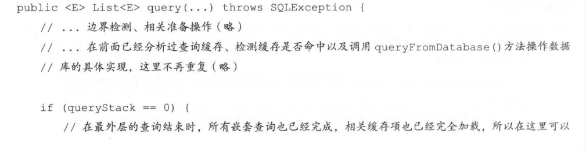 

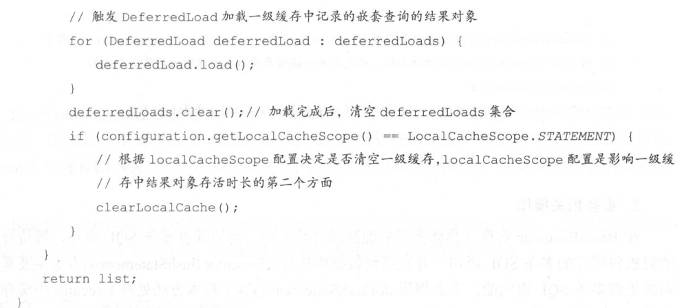 

​	BaseExecutor.queryCursor0方法的主要功能也是查询数据库，这一点与query0方法类似，但它不会直接将结果集映射为结果对象,而是将结果集封装成Cursor 对并返回,待用户遍历 Cursor时才真正完成结果集的映射操作。另外，queryCursor 0方法是直接调用doQueryCursor0这个基本方法实现的，并不会像query0方法那样使用查询一级缓存。queryCursor 0方法的代码比较简单，感兴趣的读者可以参考源码。
​	介绍完缓存的填充过程和使用，再来看缓存的清除功能，该功能是在 clearLocalCache0方法中完成的，在很多地方都可以看到它的身影，其调用栈如图 3-46 所示。

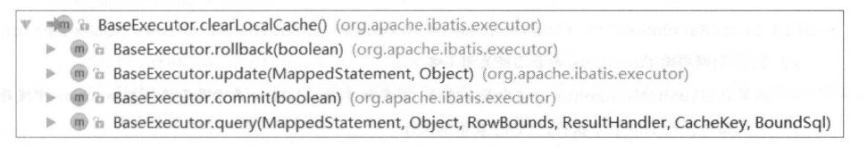 

​	前面已经介绍过，BaseExecutor.query0方法会根据 flushCache 属性和localCacheScope 配置决定是否清空一级缓存，这里不再重复描述。
​	BaseExecutor.update)方法负责执行insert、updatedelete三类SOL语句,它是调用doUpdate()模板方法实现的。在调用 doUpdate(方法之前会清空缓存，因为执行 SQL语句之后，数据库中的数据已经更新，一级缓存的内容与数据库中的数据可能已经不一致了，所以需要调用clearLocalCache0方法清空一级缓存中的“脏数据”。

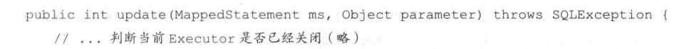 

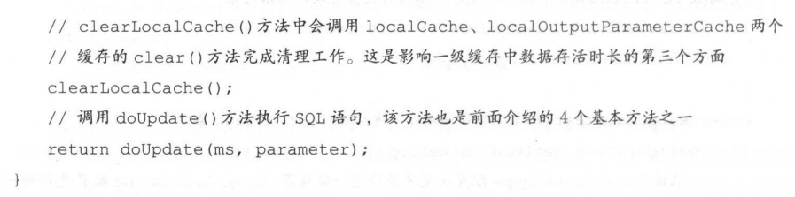 

#### 事务处理

​	在BatchExecutor 实现(具体实现后面详细介绍)中，可以缓存多条 SOL语，等待合适的时机将缓存的多条SOL语句一并发送到数据库执行。Executor.flushStatements0方法主要是针对批处理多条SOL语句的，它会调用 doFlushStatements0)这个基本方法处理 Executor 中缓存的多条SOL 语句。在 BaseExecutor.commit0、rollback0等方法中都会首先调用 flushStatements(方法，然后再执行相关事务操作，其调用栈如图所示。

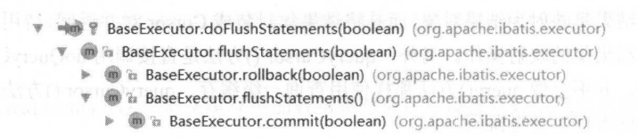 

BaseExecutor. flushStatements（）方法的具体实现如下：

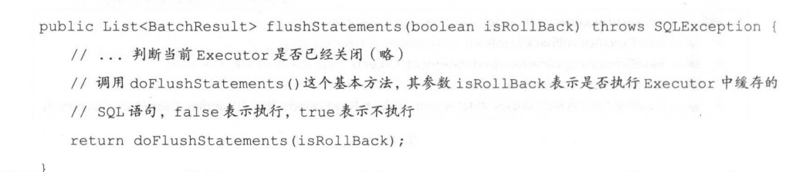 


BaseExecutorcommit0方法首先会清空一级缓存、调用 flushStatements0方法，最后才根据参数决定是否真正提交事务。commit0方法的实现如下:

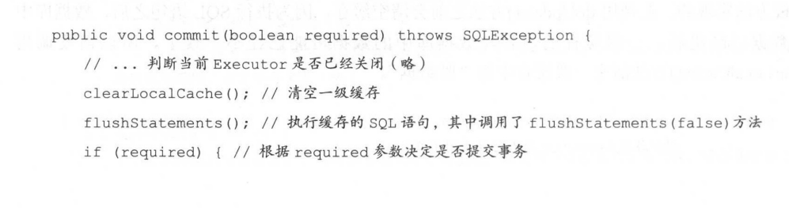 

 

​	BaseExecutorrollback0方法的实现与 commit0实现类似，同样会根据参数决定是否真正回滚事务，区别是其中调用的是 flushStatements0方法的 isRollBack 参数为 true，这就会导致Executor 中缓存的SOL语句全部被忽略(不会被发送到数据库执行)，感兴趣的读者请参考源码。
​	BaseExecutor.close0方法首先会调用 rollback0方法忽略缓存的SOL语，之后根据参数决定是否关闭底层的数据库连接。代码比较简单，感兴趣的读者请参考源码。

### SimpleExecutor

​	SimpleExecutor 继承了 BaseExecutor 抽象类，它是最简单的 Executor 接口实现。正如前面所说,Executor使用了模板方法模式,一级缓存等固定不变的操作都封装到了 BaseExecutor中在SimpleExecutor中就不必再关心一级缓存等操作,只需要专注实现4个基本方法的实现即可

​	首先来看SimpleExecutordoQuery0方法的具体实现:

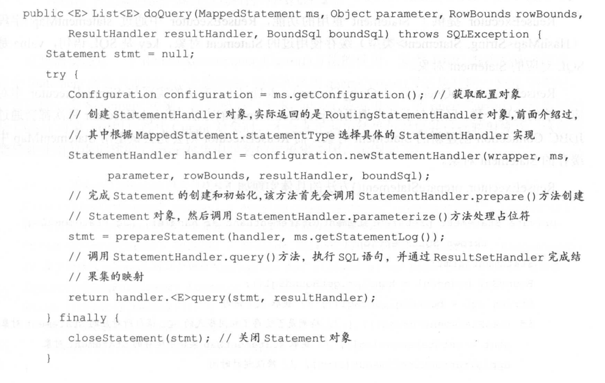 

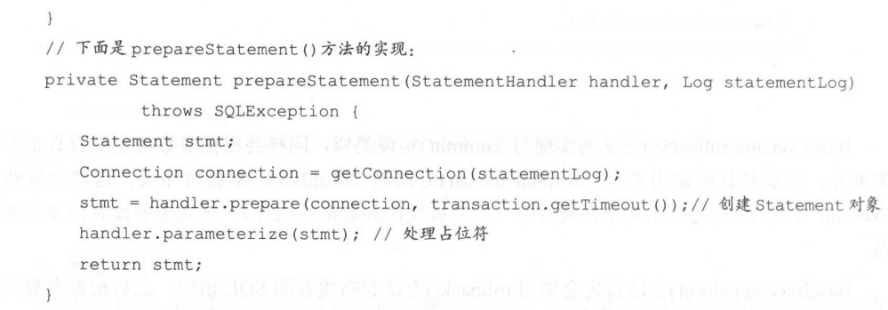 

### ReuseExecutor

​	在传统的JDBC编程中，重用 Statement 对象是常用的一种优化手段，该优化手段可以减少SQL预编译的开销以及创建和销毁 Statement 对象的开销，从而提高性能。
​	ReuseExecutor 提供了 Statement 重用的功能，ReuseExecutor 中通过 statementMap 字段(HashMap<String,Statement类型)缓存使用过的 Statement 对象，key 是 SQL语句，value 是SOL对应的Statement 对象。
​	ReuseExecutor.doQuery0、doQueryCursor0、doUpdate0方法的实现与 SimpleExecutor 中对应方法的实现一样，区别在于其中调用的 prepareStatement0方法，SimpleExecutor 每次都会通过JDBC Connection创建新的Statement 对象，而ReuseExecutor 则会先尝试重用 StatementMap 中缓存的Statement 对象。
ReuseExecutor.prepareStatement0方法的具体实现如下:

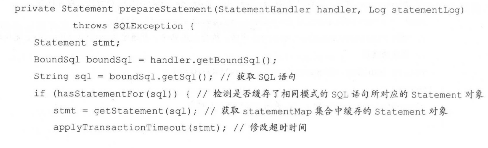 

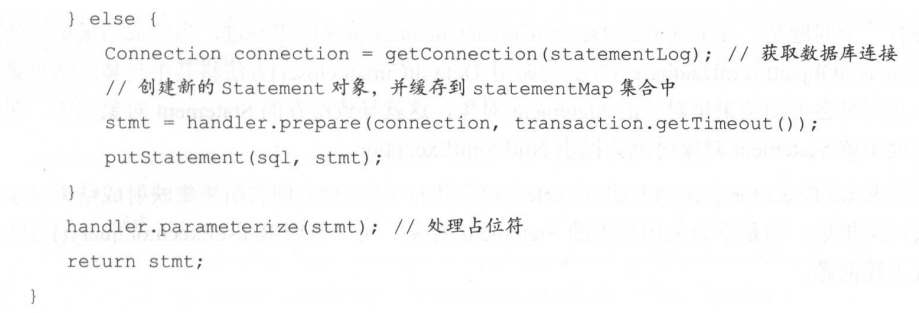 

当事务提交或回滚、连接关闭时，都需要关闭这些缓存的Statement 对象。前面介绍BaseExecutor.commit0、rollback0和 close0方法时提到,其中都会调用 doFlushStatements0方法,所以在该方法中实现关闭Statement对象的逻辑非常合适，具体实现如下:

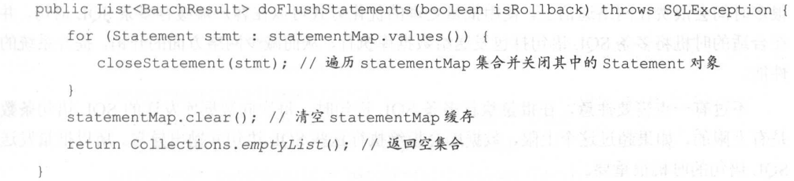 

这里需要注意一下 ReuseExecutor.queryCursor0方法的使用，熟悉JDBC编程的读者知道每个Statement对象只能对应一个结果集当多次调用queryCursor0方法执行同一SQL语句时会复用同一个Statement 对象，只有最后一个ResultSet 是可用的。而queryCursor0方法返回的是Cursor 对象，在用户迭代 Cursor 对象时，才会真正遍历结果集对象并进行映射操作，这就可能导致使用前面创建的Cursor 对象中封装的结果集关闭。示例如下:

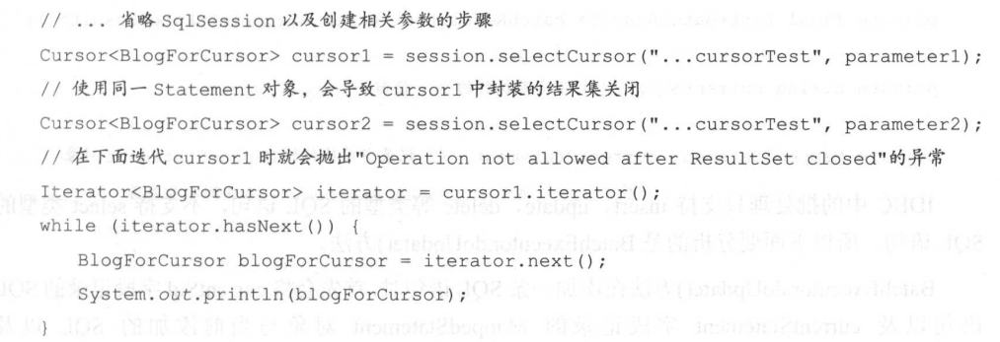 

​	还有一个问题是，在前面介绍 DefaultCursor.CursorIterator 时提到过，当完成结果集的处理时，fetchNextObjectFromDatabase0方法会调用 DefaultCursor.close0)方法将其中封装的结果集关闭，并且同时会关闭结果集对应的 Statement 对象，这就导致缓存的 Statement 对象关闭，在后续继续使用该Statement对象时就会抛出NullPointException。
​	反观ReuseExecutor.query0方法,在 select 语句执行之后,会立即将结果集映射成结果对象,然后关闭结果集，但是不会关闭相关的 Statement 对象，所以使用 ReuseExecutor.query0方法并不涉及上述问题；

### BatchExecutor 

​	应用系统在执行一条SQL 语句时，会将 SQL 语以及相关参数通过网络发送到数据库系统。对于频繁操作数据库的应用系统来说，如果执行一条 SQL 语句就向数据库发送一次请求,很多时间会浪费在网络通信上。使用批量处理的优化方式可以在客户端缓存多条SOL 语句，并在合适的时机将多条SOL 语句打包发送给数据库执行，从而减少网络方面的开销，提升系统的性能。
​	不过有一点需要注意，在批量执行多条 SOL 语句时，每次向数据库发送的 SOL 语句条数是有上限的，如果超过这个上限，数据库会拒绝执行这些 SOL 语句并抛出异常。所以批量发送SOL语句的时机很重要
​	BatchExecutor 实现了批处理多条SOL语的功能，其中核心字段的含义如下:

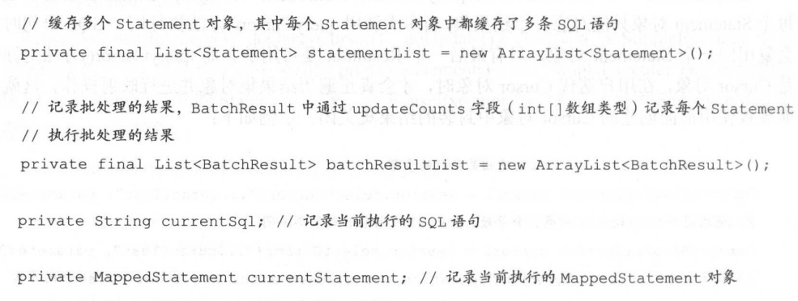 

​	JDBC中的批处理只支持 insert、update、delete 等类型的 SOL 语，不支持 select 类型的SQL语句，所以下面要分析的是 BatchExecutor.doUpdate0方法。
BatchExecutor.doUpdate0方法在添加一条SQL语句时,首先会将currentSql字段记录的SQL语句以及 currentStatement 字段记录的 MappedStatement 对象与当前添加的 SQL以及MappedStatement对象进行比较，如果相同则添加到同一个 Statement 对象中等待执行，如果不同则创建新的 Statement 对象并将其缓存到statementList 集合中等待执行。doUpdate0方法的具体实现如下:

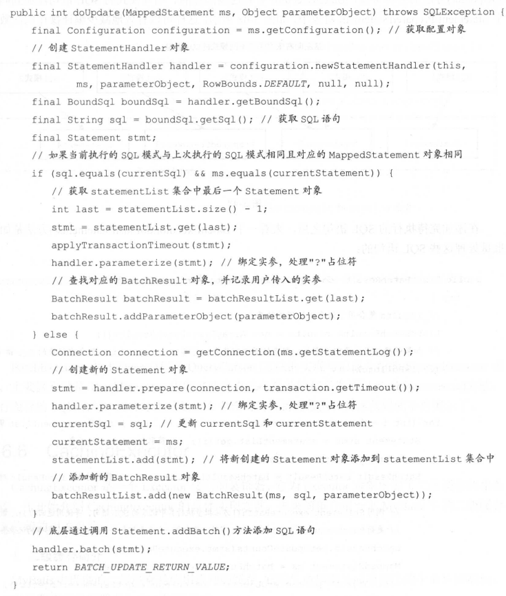 

​	熟悉JDBC批处理功能的读者知道，Statement 中可以添加不同模式的SQL，但是每添加个新模式的 SOL语句都会触发一次编译操作。PreparedStatement 中只能添加同一模式的SQL语句，只会触发一次编译操作，但是可以通过绑定多组不同的实参实现批处理。通过上面对doUpdate0方法的分析可知，BatchExecutor 会将连续添加的、相同模式的 SOL语句添加到同个Statement/PreparedStatement 对象中，如图所示，这样可以有效地减少编译操作的次数

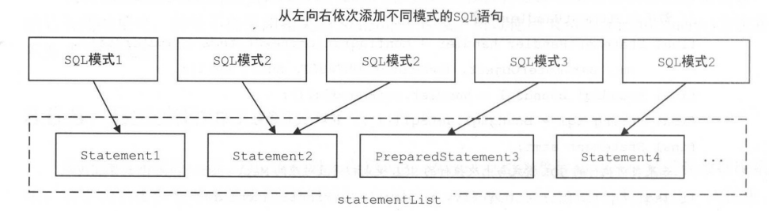 

在添加完待执行的SOL语句之后，来看一下 BatchExecutor.doFlushStatements0方法是如何批量处理这些 SOL语句的: 

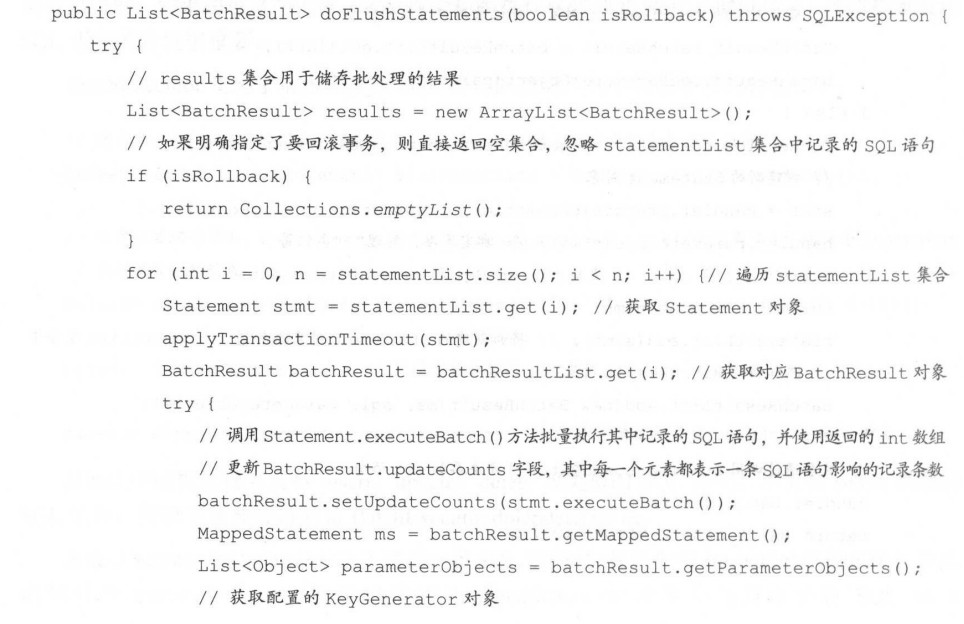 

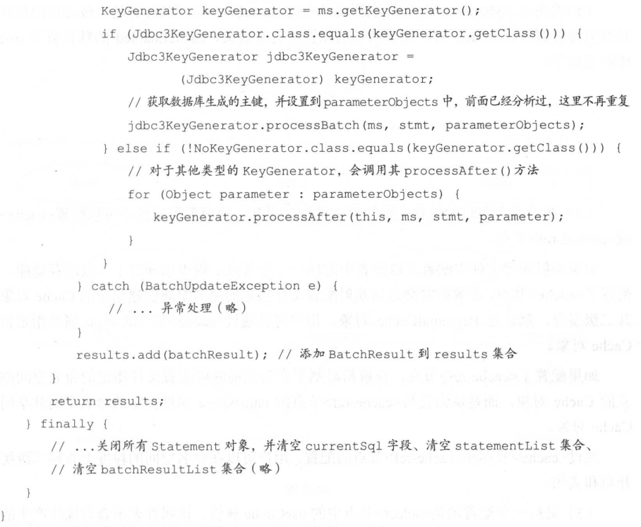 

​	BatchExecutor 中doQuery0和 doQueryCursor方法的实现与前面介绍的 SimpleExecutor 类似，主要区别就是 BatchExecutor 中的这两个方法在最开始都会先调用 flushStatements0方法，执行缓存的 SOL 语句，这样才能从数据库中查询到最新的数据，具体代码就不再展示了。

### CachingExecutor

CachingExecutor是一个 Executor 接口的装饰器，它为 Executor对象增加了二级缓存的相关功能。在开始介绍CachingExecutor 的具体实现之前，先来简单介绍一下MyBatis 中的二级缓存及其依赖的相关组件。

#### 二级缓存简介

MyBatis 中提供的二级缓存是应用级别的缓存,它的生命周期与应用程序的生命周期相同。与二级缓存相关的配置有三个，如下所示。

* 首先是 mybatis-configxml配置文件中的caheEnabled 配置它是二级缓存的总开关只有当该配置设置为 true 时，后面两项的配置才会有效果，cacheEnabled 的默认值为 true。具体配置如下:

  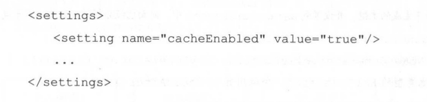 

* 在前面介绍映射配置文件的解析流程时提到，映射配置文件中可以配置<cache>节点或<cached-ref节点。

  如果映射配置文件中配置了这两者中的任一一个节点，则表示开启了二级缓存功能。如果配置了<cache>节点，在解析时会为该映射配置文件指定的命名空间创建相应的 Cache 对象作为其二级缓存，默认是 PerpetualCache 对象，用户可以通过<cache>节点的 type 属性指定自定义Cache 对象。
  如果配置了<cache-ref节点，在解析时则不会为当前映射配置文件指定的命名空间创建独立的Cache 对象，而是认为它与<cache-re节点的 namespace 属性指定的命名空间共享同一个Cache 对象。
  通过<cache>节点和<cache-ref节点的配置，用户可以在命名空间的粒度上管理二级缓存的开启和关闭。

* 最后一个配置项是<select节点中的 useCache 属性，该属性表示查询操作产生的结果对象是否要保存到二级缓存中。useCache属性的默认值是true。
  为了读者更好地理解MyBatis的两层缓存结构，下面给出这张示意图。这里以图中的SqlSession2为例，简单说明二级缓存的使用过程
  当应用程序通过SqlSession2 执行定义在命名空间namespace2中的查询操作时,SqSession2首先到 namespace2 对应的二级缓存中查找是否缓存了相应的结果对象。如果没有，则继续到SqlSession2 对应的一级缓存中查找是否缓存了相应的结果对象，如果依然没有，则访问数据库获取结果集并映射成结果对象返回。最后，该结果对象会记录到 SglSession 对应的一级缓存以及namespace2 对应的二级缓存中，等待后续使用。另外需要注意的是，图3-49 中的命名空间namespace2和 namespace3共享了同一个二级缓存对象，所以通过 SqlSession3 执行命名空间namespace3中的完全相同的查询操作 (只要该查询生成的CacheKey 对象与上述SglSession2中的查询生成 CacheKey 对象相同即可)时，可以直接从二级缓存中得到相应的结果对象

  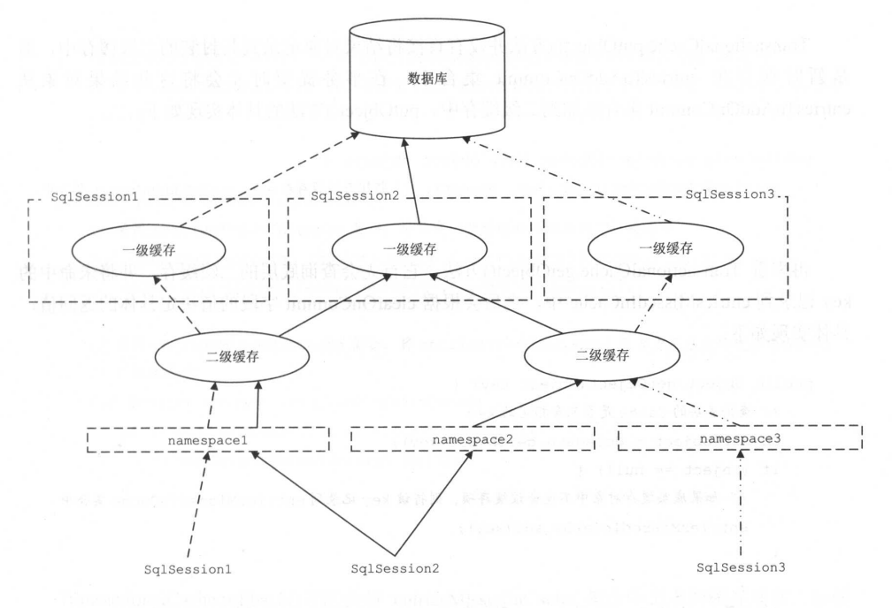 

#### TransactionalCache

#### TransactionalCacheManager

TransactionalCache和TransactionalCacheManager是 CachingExecutor 依赖的两个组件。其中TransactionalCache 继承了 Cache 接口，主要用于保存在某个 SqlSession 的某个事务中需要向某个二级缓存中添加的缓存数据。TransactionalCache中核心字段的含义如下:

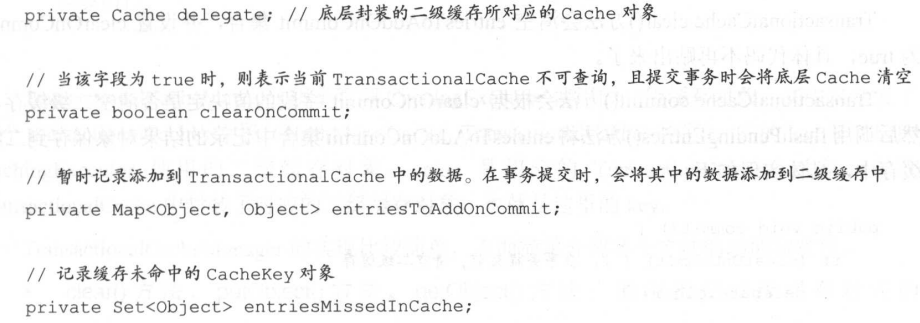 

TransactionalCache.putObject0方法并没有直接将结果对象记录到其封装的二级缓存中，而是暂时保存在 entriesToAddOnCommit 集合中，在事务提交时才会将这些结果对象从entriesToAddOnCommit 集合添加到二级缓存中。putObject0方法的具体实现如下:

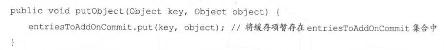 

再来看 TransactionalCache.getObject0方法，它首先会查询底层的二级缓存，并将未命中的key 记录到entriesMissedInCache 中，之后会根据 learOnCommit字段的值决定具体的返回值具体实现如下: 

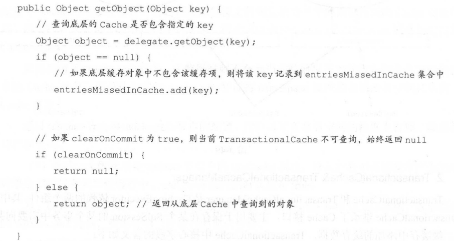 

​	TransactionalCache.clear)方法会清空 entriesToAddOnCommit 集合，并设置 clearOnCommit为true，具体代码不再贴出来了

​	TransactionalCachecommit0)方法会根据 clearOnCommit 字段的值决定是否清空二级缓存然后调用flushPendingEntries0方法	将entriesToAddOnCommit集合中记录的结果对象保存到二级缓存中，具体实现如下:

 

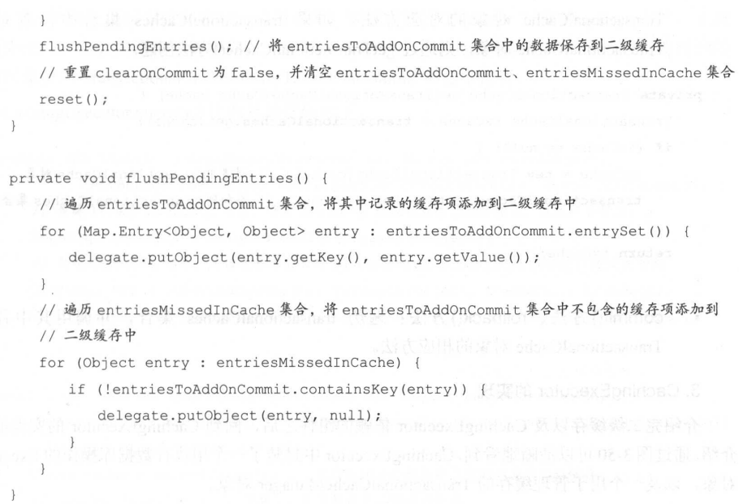 

TransactionalCache.rollback0方法会将 entriesMissedInCache 集合中记录的缓存项从二级缓存中删除，并清空entriesToAddOnCommit 集合和entriesMissedInCache 集合

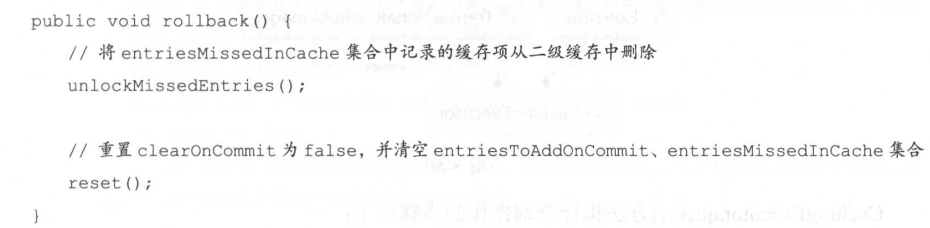 

TransactionalCacheManager 用于管理 CachingExecutor 使用的二级缓存对象，其中只定义了一个transactionalCaches 字段(HashMap<Cache,TransactionalCache>类型)，它的 key 是对应的CachingExecutor 使用的二级缓存对象，value 是相应的 TransactionalCache 对象，在该TransactionalCache中封装了对应的二级缓存对象，也就是这里的key。

TransactionalCacheManager的实现比较简单，下面简单介绍各个方法的功能和实现：

* clear0)方法、putObject0方法、getObject0方法:调用指定二级缓存对应的TransactionalCache 对象的对应方法，如果 transactionalCaches 集合中没有对应TransactionalCache对象，则通过 getTransactionalCache0方法创建

  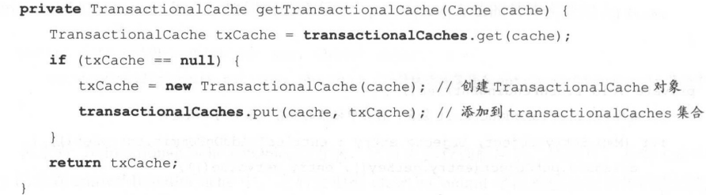 

* commit()方法、rollback()方法:遍历 transactionalCaches 集合，并调用其中各个TransactionalCache对象的相应方法。

#### CachingExecutor实现

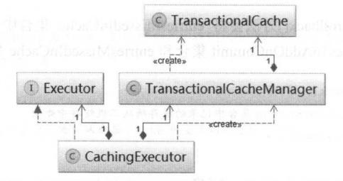 

​	通过可以清晰地看到,CachingExecutor中封装了一个用执行数据库操作的 Executor对象，以及一个用于管理缓存的TransactionalCacheManager 对象。

CachingExecutorquery0方法执行查询操作的步骤如下:

* 获取 BoundSql对象，创建查询语句对应的 CacheKey 对象。
* 检测是否开启了二级缓存，如果没有开启二级缓存，则直接调用底层 Executor 对象的query0方法查询数据库。如果开启了二级缓存，则继续后面的步骤。
* 检测查询操作是否包含输出类型的参数，如果是这种情况，则报错。
* 调用TransactionalCacheManager.getObjec()方法查询二级缓存，如果二级缓存中查找到相应的结果对象，则直接将该结果对象返回。
* 如果二级缓存没有相应的结果对象，则调用底层 Executor 对象的 query0方法，正如前面介绍的，它会先查询一级缓存，一级缓存未命中时，才会查询数据库。最后还会将得到的结果对象放入TransactionalCache.entriesToAddOnCommit 集合中保存。

CachingExecutor.quer()方法的具体代码如下：

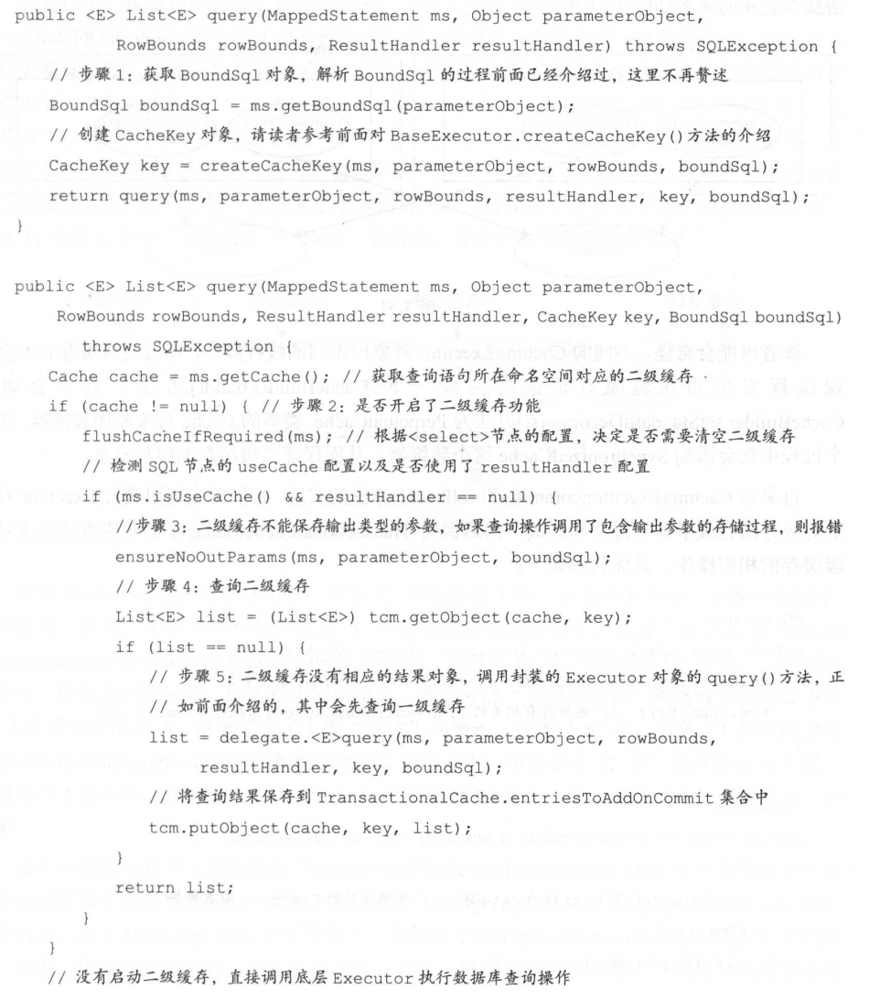 

 

通过上面的分析，CachingExecutor、TransactionalCacheManager、TransactionalCache 以及二级缓存之间的关系如图所示；

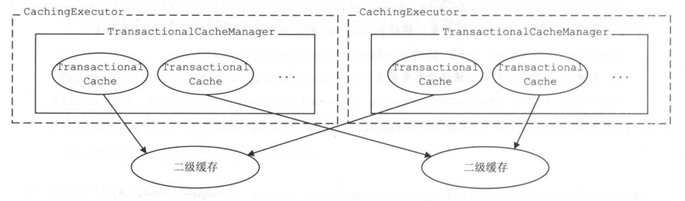 

​	不同的CachingExecutor 对象由不同的线程操作，那么二级缓存会不会出现线程安全的问题呢?请读者回顾一下 CacheBuilder.build0方法，其中会调用CacheBuilder.setStandardDecorators0方法为 PerpetualCache 类型的 Cache 对象添加装饰器,在这个过程中就会添加SynchronizedCache这个装饰器，从而保证二级缓存的线程安全。
​	再来看CachingExecutorcommit0和 rollback0方法的实现，它们首先调用底层 Executor 对象的对应方法完成事务的提交和回滚，然后调用 TransactionalCacheManager 的对应方法完成对二级缓存的相应操作。具体代码如下:

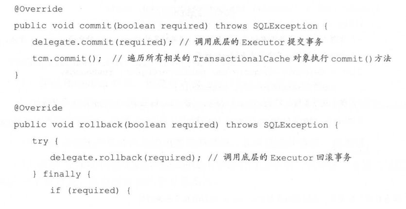 

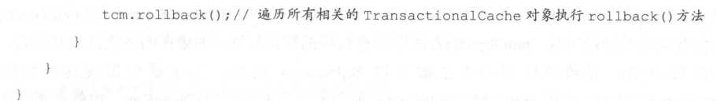 

​	看到这里，读者可能会提出这样的疑问:为什么要在事务提交时才将 TransactionalCacheentriesToAddOnCommit 集合中缓存的数据写入到二级缓存，而不是像一级缓存那样，将每次查询结果都直接写入二级缓存?笔者认为，这是为了防止出现“脏读”的情况，最终实现的效果有点类似于“不可重复读”的事务隔离级别。假设当前数据库的隔离级别是“不可重复读”，先后开启 T1、T2两个事务，如图3-52 所示，在事务T1中添加了记录A，之后查询A 记录，最后提交事务，事务 T2会查询记录 A。如果事务 T查询记录 A 时，就将A 对应的结果对象放入二级缓存,则在事务T2第一次查询记录A时即可从二级缓存中直接获取其对应的结果对象。此时 T1 仍然未提交，这就出现了“脏读”的情况，显然不是用户期望的结果。

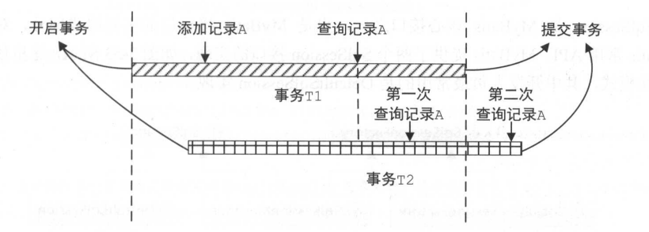 

​	按照CacheExecutor 的本身实现，事务 TI查询记录A 时二级缓存未命中，会查询数据库,因为是同一事务，所以可以查询到记录 A 并得到相应的结果对象，并且会将记录 A 保存到TransactionalCacheentriesToAddOnCommit 集合中。而事务T2第一次查询记录A时，二级缓存未命中，则会访问数据库，因为是不同的事务，数据库的“不可重复读”隔离级别会保证事务T2 无法查询到记录 A，这就避免了上面“脏读”的场景。在图 3-52 中，事务 T1 提交时会将entriesToAddOnCommit 集合中的数据添加到二级缓存中，所以事务T2第二次查询记录A时二级缓存才会命中，这就导致了同一事务中多次读取的结果不一致，也就是“不可重复读”的场景。

​	读者可能提出的另一个疑问是 TransactionalCache.entriesMissedInCache 集合的功能是什么?为什么要在事务提交和回滚时，调用二级缓存的 putObject0方法处理该集合中记录的 key 呢?笔者认为，这与 BlockingCache 的支持相关。通过对 CachingExecutor.query0方法的分析我们知道，查询二级缓存时会使用 getObject0方法，如果二级缓存没有对应数据，则查询数据库并使

​	用putObiect0方法将查询结果放入二级缓存。如果底层使用了 BlockingCache，则 getObiect0)方法会有对应的加锁过程，putObject0方法则会有对应的解锁过程，如果在两者之间出现异常，则无法释放锁，导致该缓存项无法被其他 SglSession 使用。为了避免出现这种情况，TransactionalCache 使用entriesMissedInCache 集合记录了未命中的 CacheKey，也就是那些加了锁的缓存项，而 entriesToAddOnCommit 集合可以看作 entriesMissedInCache 集合子集，也就是那些正常解锁的缓存项。对于其他未正常解锁的缓存项，则会在事务提交或回滚时进行解锁操作。
​	最后，需要读者注意的是，CachingExecutor.update()方法并不会像 BaseExecutor.update0方法处理一级存那样，直接清除缓存中的所有数据，而是与CachingExecutor.query0方法一样调用flushCacheIfRequired0方法检测SQL节点的配置后，决定是否清除二级缓存。

## 接口层

​	SqlSession是MyBatis 核心接口之一，也是 MyBatis 接口层的主要组成部分，对外提供MyBatis 常用API。MyBatis 提供了两个SqlSession 接口的实现，如图所示，这里使用了工厂方法模式，其中开发人员最常用的是DefaultSqlSession 实现

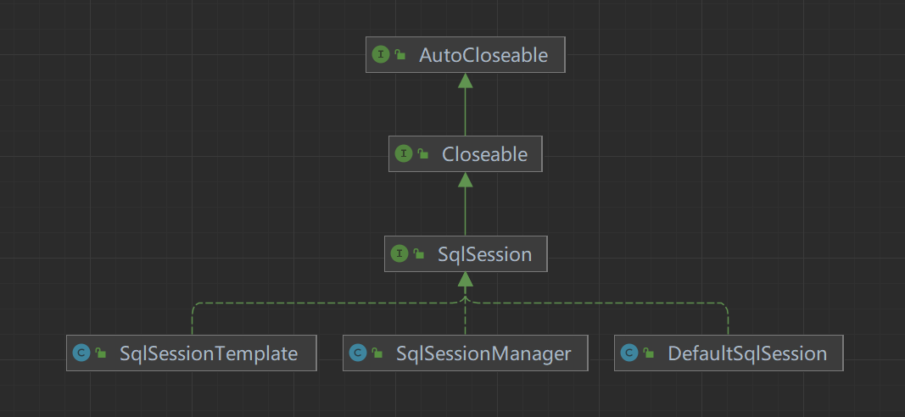 

 

​	SqlSessionFactory 负责创建 SqlSession 对象，其中只包含了多个openSession0方法的重载可以通过其参数指定事务的隔离级别、底层使用 Executor 的类型以及是否自动提交事务等方面的配置。SqlSessionFactory 接口的定义比较简单，代码就不再展示了。
​	在 SqlSession 中定义了常用的数据库操作以及事务的相关操作，为了方便用户使用，每种类型的操作都提供了多种重载。SglSession 接口的定义如下:

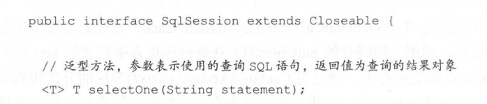 

​           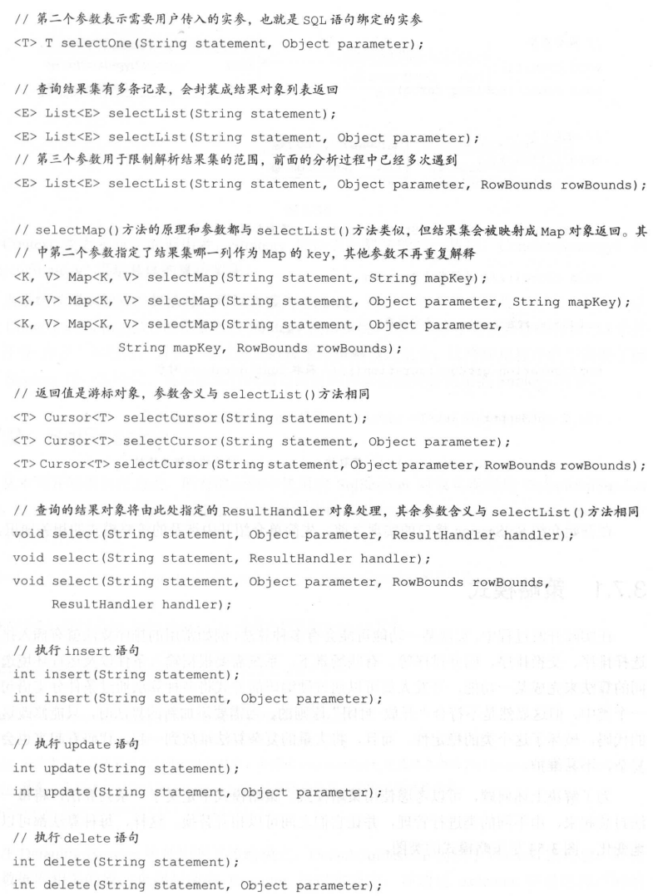 

​        

### 策略模式

​	在实际开发过程中,实现某一功能可能会有多种算法,例如常用的排序算法就有插入排序选择排序、交换排序、归并排序等。有些场景下，系统需要根据输入条件以及运行环境选择不同的算法来完成某一功能，开发人员可以通过硬编码的方式将多种算法通过条件分支语句写到一个类中，但这显然是不符合“开放-封闭”原则的，当需要添加新的算法时，只能修改这个类的代码，破坏了这个类的稳定性。而且，将大量的复杂算法堆放到一起，代码看起来也会比较复杂，不易维护。
​	为了解决上述问题，可以考虑使用策略模式。策略模式中定义了一系列算法，将每一个算法封装起来，由不同的类进行管理，并让它们之间可以相互替换。这样，每种算法都可以独立地变化。策略模式的类图

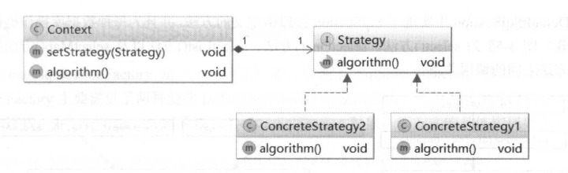 

​	Context 类表示算法的调用者，Strategy 接口表示算法的统一接口，ConcreteStrategy1 和ConcreteStrategy2表示具体的算法实现。
​	当系统需要添加新的算法时，可以直接为 Strategy 接口添加新的实现类。开发人员也可以通过Context.setStrategy0方法设置新的 Strategy 接口实现，为应用程序更换具体的算法，这是符合“开放-封闭”原则的。另外，可以将反射技术与策略模式结合，这样应用程序就不需要了解所有 Strategy 接口实现类，而是在运行时通过反射的方式创建实际使用的 Strategy对象

### SqlSession

​	从本书开始到现在为止，所有的示例中使用的 SlSession 对象实现都是 DefaultSalSession类型，它也是单独使用 MyBatis 进行开发时最常用的 SglSession 接口实现。DefaultSglSession中核心字段的含义如下:

 

在 DefaultSqlSession 中使用到了策略模式，DefaultSqlSession 扮演了 Context 的角色，而将所有数据库相关的操作全部封装到 Executor 接口实现中，并通过executor 字段选择不同的Executor 实现。

DefaultSqlSession中实现了 SqlSession 接口中定义的方法,并且为每种数据库操作提供了多个重载。图为 select0方法、selectOne0方法、selectList0方法以及 selectMap0方法的各个重载方法之间的调用关系。

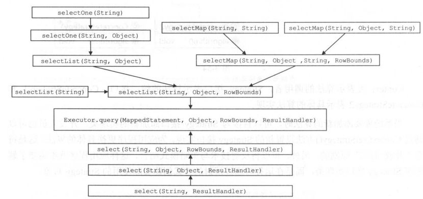 

​	上述重载方法最终都是通过调用 Executor.query(MappedStatement, bject,RowBounds,ResultHandler)方法实现数据库查询操作的，但各自对结果对象进行了相应的调整，例如selectOne0方法是从结果对象集合中获取了第一个元素返回;selectMap0方法会将 List类型的结果对象集合转换成 Map 类型集合返回;select0方法是将结果对象集合交由用户指定的ResultHandler 对象处理，且没有返回值:selectList0方法则是直接返回结果对象集合。

​	DefaultSqlSessioninsert0方法、update0方法、delete0方法也有多个重载，它们最后都是通过调用的DefaultSqlSessionupdate(String,Object)方法实现的,该重载首先会将dirty字段置为true,然后再通过 Executorupdate0方法完成数据库修改操作。代码比较简单，就不再展示了。

​	DefaultSqlSession.commit0方法、rollback0方法以及 close0方法都会调用 Executor 中相应的方法，其中就会涉及清空缓存的操作 (具体实现请读者参考 Executor 小节)，之后就会将 dirty字段设置为 false

​	上述的dirty字段主要在isCommitOrRollbackRequired0方法中，与autoCommit字段以及用户传入的 force 参数共同决定是否提交/回滚事务，具体实现如下所示。该方法的返回值将作为Executor.commit0方法和 rollback0方法的参数。

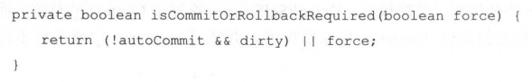 

### DefaultSqlSessionFactory

​	DefaultSqlSessionFactory 是一个具体工厂类，实现了 SqlSessionFactory 接口。DefaultSqlSessionFactory 主要提供了两种创建 DefaultSqlSession 对象的方式，一种方式是通过数据源获取数据库连接，并创建 Executor 对象以及 DefaultSqlSession 对象，该方式的具体实现如下:

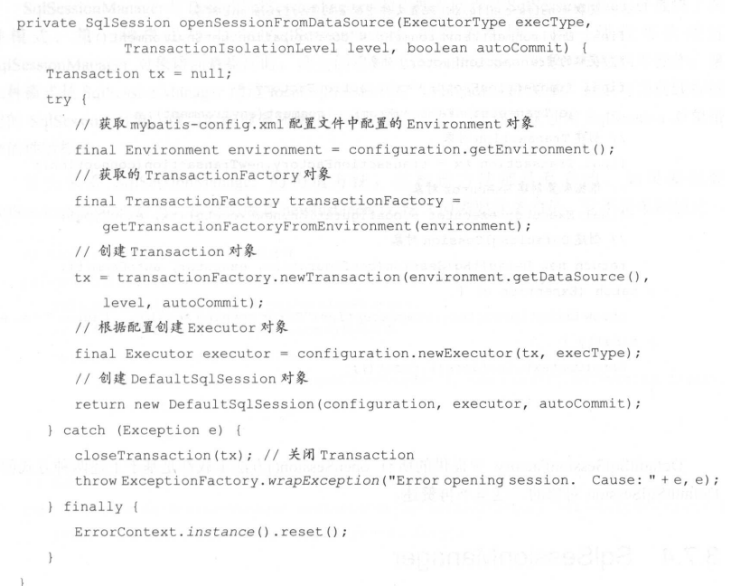 

另一种方式是用户提供数据库连接对象，DefaultSglSessionFactory 会使用该数据库连接对象创建Executor 对象以及 DefaultSglSession 对象，具体实现如下:

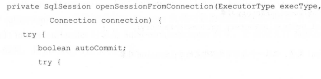 

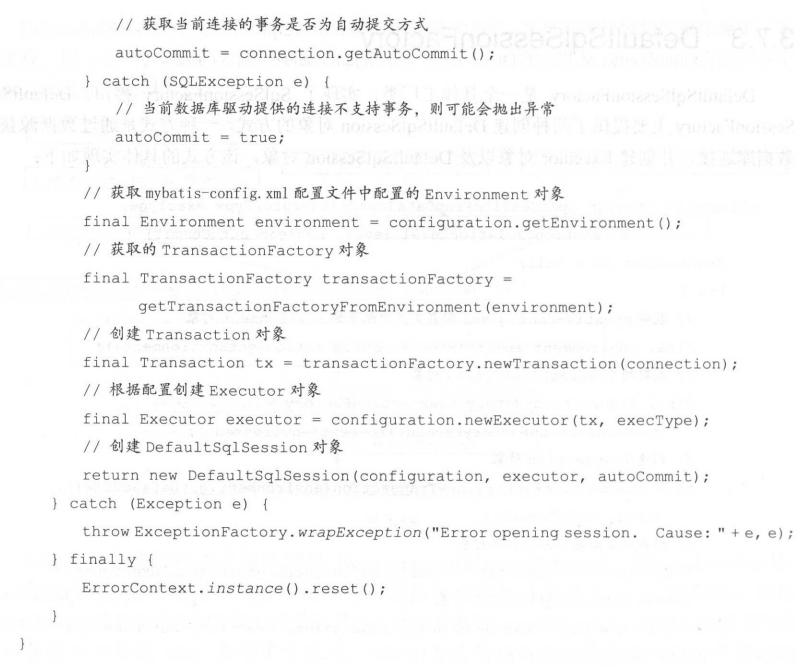 

DefaultSqlSessionFactory 中提供的所有 openSession0方法重载都是基于上述两种方式创建DefaultSqlSession 对象的，这里不再赘述。

### SqlSessionManager

​	SqlSessionManager 同时实现了 SqlSession 接口和 SqlSessionFactory 接口，也就同时提供了SqlSessionFactory 创建SqlSession 对象以及SqlSession 操纵数据库的功能。SqlSessionManager 中各个字段的含义如下。

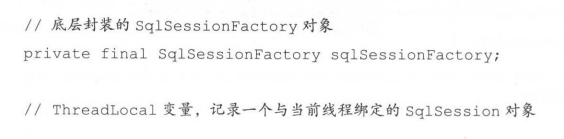 

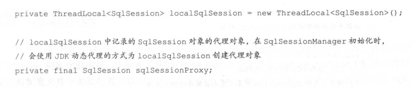 

​	SqlSessionManager与 DefaultSqlSessionFactory 的主要不同点是 SqlSessionManager提供了两种模式:第一种模式与DefaultSglSessionFactory 的行为相同，同一线程每次通过SqlSessionManager 对象访问数据库时，都会创建新的 DefaultSession 对象完成数据库操作;第二种模式是 SqlSessionManager 通过localSqlSession 这个 ThreadLocal变量，记录与当前线程绑定的 SqlSession对象，供当前线程循环使用，从而避免在同一线程多次创建 SalSession 对象带来的性能损失。
​	首先来看SqlSessionManager 的构造方法，其构造方法都是私有的，如果要创建SqlSessionManager 对象，需要调用其 newInstance0)方法(但需要注意的是，这不是单例模式)。

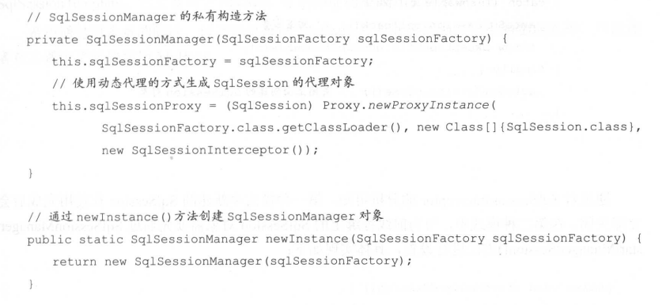 

​	SqlSessionManager.openSession0方法以及其重载是直接通过调用其中底层封装的SqlSessionFactory 对象的 openSession0方法来创建 SqlSession 对象的，代码比较简单，就不再展示了。

​	SqlSessionManager 中实现的 SqlSession 接口方法，例如 select*0、update0等，都是直接调用sqlSessionProxy字段记录的 SqlSession代理对象的相应方法实现的。在创建该代理对象时使用的InvocationHandler 对象是 SqlSessionInterceptor 对象，它是定义在SqlSessionManager 中的内部类，其invoke0方法实现如下:

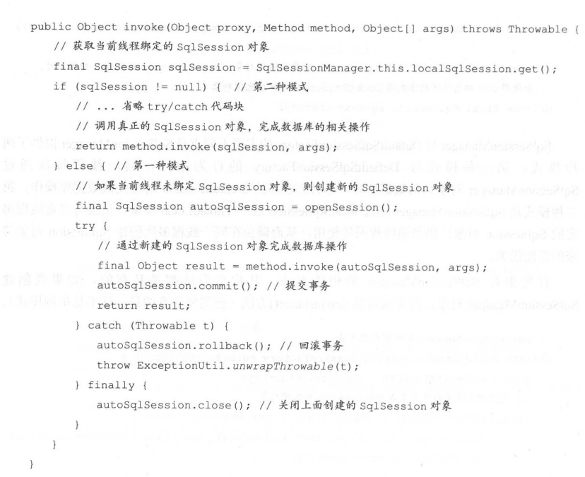 

通过对SqlSessionInterceptor 的分析可知，第一种模式中新建的 SqlSession 在使用完成后会立即关闭。在第二种模式中，与当前线程绑定的SglSession 对象需要先通过 SqlSessionManagerstartManagedSession0方法进行设置，具体实现如下:

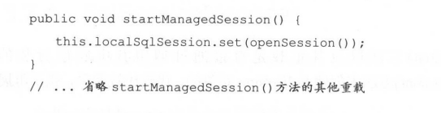 

当需要提交/回滚事务或是关闭 localSqlSession 中记录的SqlSession 对象时，需要通过SqlSessionManager.commit0、rollback0以及 close0方法完成，其中会先检测当前线程是否绑定了SglSession 对象,如果未绑定则抛出异常如果绑定了则调用该 SlSession 对象的相应方法。

## 总结

​	本章主要介绍了 MyBatis 核心处理层以及接口层中各个模块的功能和实现原理。首先介绍了MyBatis 初始化的流程，让读者了解 MyBatis是如何一步步从mybatis-config.xml配置文件以及映射配置文件中加载配置信息的。之后，介绍了 MyBatis 对 OGNL 表达式、静态/动态 SQI语句、用户传入的实参等信息的处理，从而得到可以交由数据库执行的 SOL 语句。然后分析了MyBatis 的核心功能之一--结果集映射，其中涉及了MyBatis 结果集映射的方方面面，例如简单映射、嵌套映射、嵌套查询、延迟加载、多结果集处理、游标实现原理以及对存储过程中输出类型参数的处理。之后还对 MyBatis 中提供的主键生成器(KeyGenerator)做了详细分析。最后介绍了 Executor 接口及其实现，其中对多个 Executor 接口实现类的特性做了分析，同时也分析了MyBatis中一级缓存和二级缓存的原理。
在本章最后，介绍了 MyBatis 的接口层的相关实现。MyBatis 接口层比较简单，所以不再单独开一章进行介绍。在第 4 章中，还会分析另一个 SqlSession 接口的实现一SqlSessionTemplate，它主要用于 MyBatis 与 Spring 的集成开发场景中。
理解 MyBatis 核心处理层和接口层的实现原理，帮助读者在实践中更好地使用MyBatis。