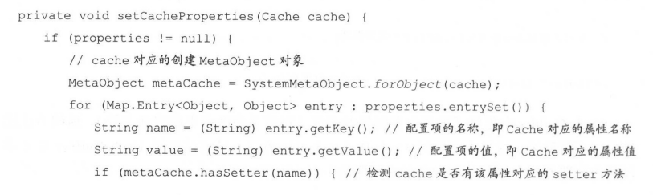
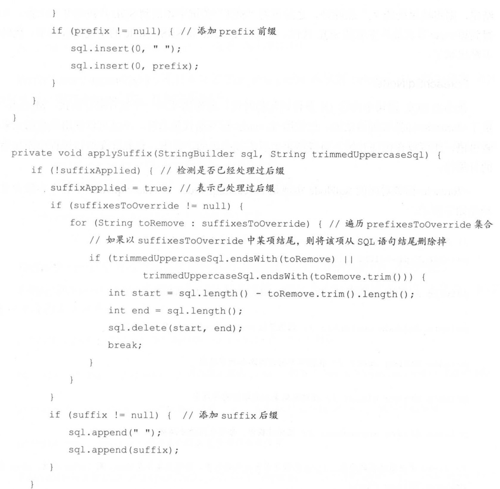

## 开头

 

## mybatis初始化

### 构建者模式

### BaseBuilder

MyBatis 初始化的主要工作是加载并解析 mybatis-configxml配置文件映射配置文件以及相关的注解信息。MyBatis的初始化入口是SqlSessionFactoryBuilder.build0方法，其具体实现如下:

```
public class SqlSessionFactoryBuilder {

  public SqlSessionFactory build(Reader reader) {
    return build(reader, null, null);
  }

  public SqlSessionFactory build(Reader reader, String environment) {
    return build(reader, environment, null);
  }

  public SqlSessionFactory build(Reader reader, Properties properties) {
    return build(reader, null, properties);
  }

  public SqlSessionFactory build(Reader reader, String environment, Properties properties) {
    try {
      XMLConfigBuilder parser = new XMLConfigBuilder(reader, environment, properties);
      return build(parser.parse());
    } catch (Exception e) {
      throw ExceptionFactory.wrapException("Error building SqlSession.", e);
    } finally {
      ErrorContext.instance().reset();
      try {
        reader.close();
      } catch (IOException e) {
        // Intentionally ignore. Prefer previous error.
      }
    }
  }
```

SqlSessionFactoryBuilder.build0方法会创建XMLCnfigBuilder 对象来解析mybatis-configxml配置文件，而XMLConfigBuilder 继承自 BaseBuilder 抽象类

 

#### 核心字段

 

```
  protected final Configuration configuration;
  protected final TypeAliasRegistry typeAliasRegistry;
  protected final TypeHandlerRegistry typeHandlerRegistry;

  public BaseBuilder(Configuration configuration) {
    this.configuration = configuration;
    this.typeAliasRegistry = this.configuration.getTypeAliasRegistry();
    this.typeHandlerRegistry = this.configuration.getTypeHandlerRegistry();
  }
```

#### configuration

BaseBuilder中记录的 TypeAliasRegistry 对象和 TypeHandlerRegistry 对象，其实是全局唯的，它们都是在Configuration 对象初始化时创建的，代码如下:

在configuration之中的字段

```
protected final TypeHandlerRegistry typeHandlerRegistry = new TypeHandlerRegistry(this);
protected final TypeAliasRegistry typeAliasRegistry = new TypeAliasRegistry();
```

​	在 BaseBuilder 构造函数中，通过相应的 Configuration.get*0方法得到TypeAliasRegistry对 象和TypeHandlerRegistry 对象，并赋值给 BaseBuilder 相应字段
Configuration 中还包含很多配置项,为了便于读者理解,这里不会罗列出每个字段的含义，而是在后面介绍过程中，每当涉及一个配置项时，会结合其在 Configuration 中相应字段进行详细分析。BaseBuilder的resolveAlias方法依赖TypeAliasRegistry解析别名，BaseBuilderresolveTypeHandler0方法依赖 TypeHandlerRegistry 查找指定的 TypeHandler 对象。

​	TypeAliasRegistry 和 TypeHandlerRegistry 相关实现的介绍之后，BaseBuilderresolveAlias0方法和resolveTypeHandler0方法也就不难理解了。
前面提到过，MyBatis 使用 JdbcType 枚举类型表示JDBC 类型。MyBatis 中常用的枚举类型还有 ResultSetType 和 ParameterMode: ResultSetType 枚举类型表示结果集类型，使用ParameterMode 枚举类型表示存储过程中的参数类型。在 BaseBuilder 中提供了相应的resolveJdbcType()、resolveResultSetType0、resolveParameterMode0方法，将 String 转换成对应的枚举对象，实现比较简单；

### XMLConfigBuilder

XMLConfigBuilder 是 BaseBuilder 的众多子类之一，它扮演的是具体建造者的角色。XMLConfigBuilder主要负责解析 mybatis-configxml配置文件，其核心字段如下: 

 

XMLConfigBuilderparse0方法是解析 mybatis-configxml配置文件的入口，它通过调用XMLConfigBuilder.parseConfiguration(方法实现整个解析过程，具体实现如下:

 

 

#### 解析properties节点

XMLConfigBuilder.propertiesElement0方法会解析 ybatis-configxml 配置文件中的<properties>节点并形成javautil.Properties 对象，之后将该 Properties 对象设置到XPathParser 和Configuration的 variables 字段中。在后面的解析过程中，会使用该 Properties 对象中的信息替换占位符。propertiesElement0方法的具体实现如下:

 

#### 解析settings节点

​	XMLConfigBuildersettingsAsProperties0方法负责解析<settings>节点，在<settings>节点下的配置是 MyBatis 全局性的配置，它们会改变 MyBatis 的运行时行为，具体配置项的含义请读者参考MyBatis官方文档。需要注意的是，在 MyBatis 初始化时，这些全局配置信息都会被记录到Configuration 对象的对应属性中；

```
  private void settingsElement(Properties props) {
    configuration.setAutoMappingBehavior(AutoMappingBehavior.valueOf(props.getProperty("autoMappingBehavior", "PARTIAL")));
    configuration.setAutoMappingUnknownColumnBehavior(AutoMappingUnknownColumnBehavior.valueOf(props.getProperty("autoMappingUnknownColumnBehavior", "NONE")));
    configuration.setCacheEnabled(booleanValueOf(props.getProperty("cacheEnabled"), true));
    configuration.setProxyFactory((ProxyFactory) createInstance(props.getProperty("proxyFactory")));
    configuration.setLazyLoadingEnabled(booleanValueOf(props.getProperty("lazyLoadingEnabled"), false));
    configuration.setAggressiveLazyLoading(booleanValueOf(props.getProperty("aggressiveLazyLoading"), false));
    configuration.setMultipleResultSetsEnabled(booleanValueOf(props.getProperty("multipleResultSetsEnabled"), true));
    configuration.setUseColumnLabel(booleanValueOf(props.getProperty("useColumnLabel"), true));
    configuration.setUseGeneratedKeys(booleanValueOf(props.getProperty("useGeneratedKeys"), false));
    configuration.setDefaultExecutorType(ExecutorType.valueOf(props.getProperty("defaultExecutorType", "SIMPLE")));
    configuration.setDefaultStatementTimeout(integerValueOf(props.getProperty("defaultStatementTimeout"), null));
    configuration.setDefaultFetchSize(integerValueOf(props.getProperty("defaultFetchSize"), null));
    configuration.setDefaultResultSetType(resolveResultSetType(props.getProperty("defaultResultSetType")));
    configuration.setMapUnderscoreToCamelCase(booleanValueOf(props.getProperty("mapUnderscoreToCamelCase"), false));
    configuration.setSafeRowBoundsEnabled(booleanValueOf(props.getProperty("safeRowBoundsEnabled"), false));
    configuration.setLocalCacheScope(LocalCacheScope.valueOf(props.getProperty("localCacheScope", "SESSION")));
    configuration.setJdbcTypeForNull(JdbcType.valueOf(props.getProperty("jdbcTypeForNull", "OTHER")));
    configuration.setLazyLoadTriggerMethods(stringSetValueOf(props.getProperty("lazyLoadTriggerMethods"), "equals,clone,hashCode,toString"));
    configuration.setSafeResultHandlerEnabled(booleanValueOf(props.getProperty("safeResultHandlerEnabled"), true));
    configuration.setDefaultScriptingLanguage(resolveClass(props.getProperty("defaultScriptingLanguage")));
    configuration.setDefaultEnumTypeHandler(resolveClass(props.getProperty("defaultEnumTypeHandler")));
    configuration.setCallSettersOnNulls(booleanValueOf(props.getProperty("callSettersOnNulls"), false));
    configuration.setUseActualParamName(booleanValueOf(props.getProperty("useActualParamName"), true));
    configuration.setReturnInstanceForEmptyRow(booleanValueOf(props.getProperty("returnInstanceForEmptyRow"), false));
    configuration.setLogPrefix(props.getProperty("logPrefix"));
    configuration.setConfigurationFactory(resolveClass(props.getProperty("configurationFactory")));
    configuration.setShrinkWhitespacesInSql(booleanValueOf(props.getProperty("shrinkWhitespacesInSql"), false));
    configuration.setDefaultSqlProviderType(resolveClass(props.getProperty("defaultSqlProviderType")));
  }
```


例如，开发人员可以通过配置autoMappingBehavior 修改MyBatis 是否开启自动映射的功

settingsAsPropertie()方法的解析方式与propertiesElement()方法类似，但是多了使用MetaClass 检测 key 指定的属性在 Configuration 类中是否有对应 setter 方法的步骤。MetaClass的实现在前面已经介绍过了，这里不再重复。settingsAsProperties 0方法的代码如下:

```
private Properties settingsAsProperties(XNode context) {
  if (context == null) {
    return new Properties();
  }
  Properties props = context.getChildrenAsProperties();
  // Check that all settings are known to the configuration class
  MetaClass metaConfig = MetaClass.forClass(Configuration.class, localReflectorFactory);
  for (Object key : props.keySet()) {
    if (!metaConfig.hasSetter(String.valueOf(key))) {
      throw new BuilderException("The setting " + key + " is not known.  Make sure you spelled it correctly (case sensitive).");
    }
  }
  return props;
}
```

#### 解析typeAliases

XMLConfigBuilder.typeAliasesElement0方法负责解析< typeAliases>节点及其子节点，并通过TypeAliasRegistry 完成别名的注册，具体实现如下:

 

XMLConfigBuildertypeHandlerElement0方法负责解析<typeHandlers>节点，并通过TypeHandlerRegistry对象完成 TypeHandler 的注册，该方法的实现与上述 typeAliasesElement(方法类似，不再赘述。

#### 解析plugins

插件是 MyBatis 提供的扩展机制之一，用户可以通过添加自定义插件在 SQL语句执行过程中的某一点进行拦截。MyBatis中的自定义插件只需实现 Interceptor 接口，并通过注解指定想要拦截的方法签名即可。这里先来分析 MyBatis 中如何加载和管理插件。XMLConfigBuilder.pluginElement0方法负责解析<plugins>节点中定义的插件，并完成实例化和配置操作，具体实现如下:

 

​	所有配置的 Interceptor 对象都是通过 Configuration.interceptorChain 字段 (InterceptorChain类型)管理的，InterceptorChain 底层使用ArrayList<Interceptor>实现

 

#### 解析objectFactory

我们可以通过添加自定义 Objectory 实现类ObjectWrapperFactory 实现类以及 ReflectorFactory 实现类对MyBatis 进行扩展。
XMLConfigBuilder.obiectFactoryElement0方法负责解析并实例化<objectFactory>节点指定的ObjectFactory 实现类，之后将自定义的 ObjectFactory 对象记录到 Configuration.objectFactory字段中，具体实现如下:

 

XMLConfigBuilder 对<objectWrapperFactory>节点、<reflectorFactory>节点的解析与上述过程类似，最终会将解析得到的自定义对象记录到 Configuration 的相应字段中，不再单独介绍

#### 解析environment节点

​	在实际生产中，同一项目可能分为开发、测试和生产多个不同的环境，每个环境的配置可能也不尽相同。MyBatis可以配置多个<environment>节点，每个<environment>节点对应一种环境的配置。但需要注意的是，尽管可以配置多个环境，每个SqlSessionFactory 实例只能选择其
​	XMLConfigBuilder.environmentsElement0方法负责解析<environments>的相关配置，它会根据XMLConfigBuilder.environment 字段值确定要使用的<environment>配置，之后创建对应的TransactionFactory 和 DataSource 对象，并封装进Environment 对象中。environmentsElement()方法的具体实现如下:

 

 

#### 解析databaseIdProvider节点

​	MyBatis不能像Hibermate那样，直接帮助开发人员屏蔽多种数据库产品在SQL语言支持方面的差异。但是在 mybatis-config.xml配置文件中，通过<databaseldProvider>定义所有支持的数据库产品的 databaseld，然后在映射配置文件中定义 SOL 语节点时，通过databaseld 指定该SOL语句应用的数据库产品，这样也可以实现类似的功能。
​	在MyBatis初始化时，会根据前面确定的 DataSource 确定当前使用的数据库产品，然后在解析映射配置文件时，加载不带 databaseId 属性和带有匹配当前数据库 databaseld 属性的所有SOL 语句。如果同时找到带有 databaseld 和不带 databaseld 的相同语句，则后者会被舍弃，使用前者。
XMLConfigBuilder.databaseldProviderElement0)方法负责解析<databaseldProvider>节点，并创建指定的 DatabaseldProvider 对象。DatabaseIdProvider 会返回databaseId 值，MyBatis 会根据databaseId 选择合适的SOL进行执行。

```
private void databaseIdProviderElement(XNode context) throws Exception {
  DatabaseIdProvider databaseIdProvider = null;
  if (context != null) {
    String type = context.getStringAttribute("type");
    // awful patch to keep backward compatibility
    if ("VENDOR".equals(type)) {
      type = "DB_VENDOR";
    }
    Properties properties = context.getChildrenAsProperties();
    databaseIdProvider = (DatabaseIdProvider) resolveClass(type).getDeclaredConstructor().newInstance();
    databaseIdProvider.setProperties(properties);
  }
  Environment environment = configuration.getEnvironment();
  if (environment != null && databaseIdProvider != null) {
    String databaseId = databaseIdProvider.getDatabaseId(environment.getDataSource());
    configuration.setDatabaseId(databaseId);
  }
}
```

 

 

MyBatis 提供的 DatabaseldProvider 接口及其实现比较简单，在这里一并介绍了。DatabaseIdProvider 接口的核心方法是 getDatabaseld0方法，它主要负责通过给定的 DataSource来查找对应的 databaseld.MyBatis 提供了 VendorDatabaseldProvider 和 DefaultDatabaseldProvider两个实现，其中DefaultDatabaseIdProvider 已过时，故不再分析。
VendorDatabaseldProvider.getDatabaseId0方法在接收到 DataSource 对象时，会先解析DataSource 所连接的数据库产品名称，之后根据<databaseldProvider>节点配置的数据库产品名称与databaseId 的对应关系确定最终的databaseId。

 

 


#### 解析mappers节点

​	在MyBatis 初始化时，除了加载mybatis-configxml配置文件，还会加载全部的映射配置文件,mybatis-config.xml配置文件中的<mappers>节点会告诉 MyBatis 去哪些位置查找映射配置文件以及使用了配置注解标识的接口。
​	XMLConfigBuildermapperElement0方法负责解析<mappers>节点，它会创建XMLMapperBuilder对象加载映射文件，如果映射配置文件存在相应的 Mapper 接口，也会加载相应的Mapper接口，解析其中的注解并完成向MapperRegistry 的注册。

 

 

### XMLMaperBuilder

通过对XMLConfigBuildermapperElement0方法的介绍我们知道，XMLMapperBuilder 负责解析映射配置文件，它继承了 BaseBuilder 抽象类，也是具体建造者的角色。XMLMapper-Builder.parse0方法是解析映射文件的入口，具体代码如下:

```
public class XMLMapperBuilder extends BaseBuilder {

  private final XPathParser parser;
  private final MapperBuilderAssistant builderAssistant;
  private final Map<String, XNode> sqlFragments;
  private final String resource;
```

parse方法

```
public void parse() {
  if (!configuration.isResourceLoaded(resource)) {

    configurationElement(parser.evalNode("/mapper"));
      //将resource添加到Configuration,loadedResources 集合中保存,它是HashSet<String
      //类型的集合，其中记录了已经加载过的映射文件。
    configuration.addLoadedResource(resource);
    bindMapperForNamespace();
  }
// 处理 configurationElement()方法中解析失败的<resultMap>节点
  parsePendingResultMaps();
  // 处理 configurationElement()方法中解析失败的<cache-ref>节点
  parsePendingCacheRefs();
  //处理 configurationElement （）方 法中解析失败的 SQL 语句节点
  parsePendingStatements();
}
```

XMLMapperBuilder 也是将每个节点的解析过程封装成了一个方法，而这些方法由XMLMapperBuilderconfigurationElement0方法调用，本小节将逐一分析这些节点的解析过程configurationElemen（）方法的具体实现如下:

 

#### cache节点

​	MyBatis 拥有非常强大的二级缓存功能，该功能可以非常方便地进行配置，MyBatis 默认情况下没有开启二级缓存，如果要为某命名空间开启二级缓存功能，则需要在相应映射配置文件中添加<cache>节点，还可以通过配置<cache>节点的相关属性，为二级缓存配置相应的特性(本质上就是添加相应的装饰器)。
​	XMLMapperBuilder.cacheElement0方法主要负责解析<cache>节点，其具体实现如下

 

​	MapperBuilderAssistant 是一个辅助类，其 useNewCache0方法负责创建 Cache 对象，并将其添加到 Configuration.caches 集合中保存。Configuration 中的 caches 字段是 StrictMap<Cache>类型的字段，它记录 Cache 的id(默认是映射文件的 namespace)与 Cache 对象(二级缓存)之间的对应关系。StrictMap 继承了 HashMap，并在其基础上进行了少许修改，这里重点关注StrictMap.put0方法，如果检测到重复的 key 则抛出异常，如果没有重复的 key 则添加 key 以及value，同时会根据key 产生shortKey，具体实现如下:

 

Ambiguity 是StrictMap 中定义的静态内部类它表示的是存在二义性的键值对。Ambiguity中使用subject字段记录了存在二义性的 key，并提供了相应的getter 方法。

StrictMap.get0方法会测 value 是否存在以及 value 是否为Ambiguity 类型对象，如果满足这两个条件中的任意一个，则抛出异常。具体实现如下:

 

 

 

 

CacheBuilder 中提供了很多设置属性的方法(对应于建造者中的建造方法)，这些方法比较简单，不再赘述。这里重点分析 CacheBuilder.build0方法，该方法根据 CacheBuilder 中上述字段的值创建Cache 对象并添加合适的装饰器，具体实现如下:

 

CacheBuildersetCacheProperties0方法会根据<cache>节点下配置的<property>信息，初始化Cache对象，具体实现如下:

 

 

CacheBuildersetStandardDecorators0方法会根据 CacheBuilder 中各个字段的值，为cache对象添加对应的装饰器，具体实现如下:

 

 

#### cache-ref节点

​	通过前面对<cache>节点解析过程的介绍我们知道，XMLMapperBuilder.cacheElement0方法会为每个 namespace 创建一个对应的 Cache 对象，并在 Configuration.caches 集合中记录namespace 与Cache对象之间的对应关系。如果我们希望多个namespace 共用同一个二级缓存即同一个Cache对象，则可以使用<cache-re 节点进行配置。
​	XMLMapperBuilder.cacheRefElement0方法负责解析<cache-re节点。这里首先需要读者了解的是 Configuration.cacheRefMap 集合，该集合是 HashMap<String,String>类型，其中 key 是<cache-ref节点所在的 namespace，value 是<cache-re节点的 namespace 属性所指定的namespace。也就是说,前者共用后者的 Cache对象,namespace2 共用了namespacel的Cache对象。

 

XMLMapperBuilder.cacheRefElement0)方法的代码如下

// 将当前 Mapper 配置文件的 namespace 与被引用的 Cache 所在的 namespace 之间的对应关系，

 

CacheRefResolver 是一个简单的 Cache 引用解析器，其中封装了被引用的 namespace 以及当前XMLMapperBuilder对应的MapperBuilderAssistant对象。CacheRefResolver.resolveCacheRef0方法会调用 MapperBuilderAssistant.useCacheRef0)方法。在 MapperBuilderAssistant.useCacheRef0方法中会通过namespace查找被引用的Cache对象，具体实现如下:

 

另一个需要了解的 Configuration 字段是 incompleteCacheRefs 集合，它是 LinkedList<CacheRefResolver>类型，其中记录了当前解析出现异常的 CacheRefResolver 对象。

#### parameter节点

在MyBatis 的官方文档中明确标记<parameterMap>节点已废弃了，在将来的版本中可能会被移除，所以不建议大家使用，这里也不做详细介绍

#### resultMap节点

 


​	select 语句查询得到的结果集是一张二维表，水平方向上看是一个个字段，垂直方向上看是条条记录。而 Java 是面向对象的程序设计语言，对象是根据类定义创建的，类之间的引用关系可以认为是嵌套的结构。在JDBC 编程中，为了将结果集中的数据映射成对象，我们需要自己写代码从结果集中获取数据，然后封装成对应的对象并设置对象之间的关系，而这些都是大量的重复性代码。为了减少这些重复的代码，MyBatis 使用<resultMap>节点定义了结果集与结果对象 (JavaBean 对象)之间的映射规则，<resultMap>节点可以满足绝大部分的映射需求，从而减少开发人员的重复性劳动，提高开发效率。

```
private ResultMap resultMapElement(XNode resultMapNode) {
  return resultMapElement(resultMapNode, Collections.emptyList(), null);
}

private ResultMap resultMapElement(XNode resultMapNode, List<ResultMapping> additionalResultMappings, Class<?> enclosingType) {
  ErrorContext.instance().activity("processing " + resultMapNode.getValueBasedIdentifier());
  String type = resultMapNode.getStringAttribute("type",
      resultMapNode.getStringAttribute("ofType",
          resultMapNode.getStringAttribute("resultType",
              resultMapNode.getStringAttribute("javaType"))));
  Class<?> typeClass = resolveClass(type);
  if (typeClass == null) {
    typeClass = inheritEnclosingType(resultMapNode, enclosingType);
  }
  Discriminator discriminator = null;
  List<ResultMapping> resultMappings = new ArrayList<>(additionalResultMappings);
  List<XNode> resultChildren = resultMapNode.getChildren();
  for (XNode resultChild : resultChildren) {
    if ("constructor".equals(resultChild.getName())) {
      processConstructorElement(resultChild, typeClass, resultMappings);
    } else if ("discriminator".equals(resultChild.getName())) {
      discriminator = processDiscriminatorElement(resultChild, typeClass, resultMappings);
    } else {
      List<ResultFlag> flags = new ArrayList<>();
      if ("id".equals(resultChild.getName())) {
        flags.add(ResultFlag.ID);
      }
      resultMappings.add(buildResultMappingFromContext(resultChild, typeClass, flags));
    }
  }
  String id = resultMapNode.getStringAttribute("id",
          resultMapNode.getValueBasedIdentifier());
  String extend = resultMapNode.getStringAttribute("extends");
  Boolean autoMapping = resultMapNode.getBooleanAttribute("autoMapping");
  ResultMapResolver resultMapResolver = new ResultMapResolver(builderAssistant, id, typeClass, extend, discriminator, resultMappings, autoMapping);
  try {
    return resultMapResolver.resolve();
  } catch (IncompleteElementException e) {
    configuration.addIncompleteResultMap(resultMapResolver);
    throw e;
  }
}
```

​	在开始介绍<resultMap>节点的解析过程之前，先来介绍该过程中使用的数据结构。每个ResultMapping对象记录了结果集中的一列与 JavaBean 中一个属性之间的映射关系。在后面的分析过程中我们可以看到，<resultMap>节点下除了<discriminator>子节点的其他子节点，都会被解析成对应的ResultMapping对象。ResultMapping 中的核心字段含义如下:

 

 

#### sql节点

在映射配置文件中，可以使用<sql>节点定义可重用的 SQL 语句片段。当需要重用<sqI>节点中定义的 SOL 语句片段时，只需要使用<include>节点引入相应的片段即可，这样，在编写SQL 语句以及维护这些 SQL 语句时，都会比较方便。<include>节点的解析在后面详细介绍。XMLMapperBuilder.sqlElement0方法负责解析映射配置文件中定义的全部<sq>节点，具体实现代码如下:

 

### XMLStatementBuilder

SOL节点。这些SOL节点主要用于定义SQL语,它们不再由XMLMapperBuilder进行解析，而是由XMLStatementBuilder 负责进行解析。
MyBatis使用 SqlSource 接口表示映射文件或注解中定义的SOL语，但它表示的SOL语句是不能直接被数据库执行的，因为其中可能含有动态 SOL 语句相关的节点或是占位符等需要解析的元素。SqlSource 接口的定义如下:

 

#### 解析入口

XmlMapperBuilder进行解析sql

 

```
private void buildStatementFromContext(List<XNode> list, String requiredDatabaseId) {
  for (XNode context : list) {
    final XMLStatementBuilder statementParser = new XMLStatementBuilder(configuration, builderAssistant, context, requiredDatabaseId);
    try {
      statementParser.parseStatementNode();
    } catch (IncompleteElementException e) {
      configuration.addIncompleteStatement(statementParser);
    }
  }
}
```

MyBatis 使用 MappedStatement 表示映射配置文件中定义的 SQL 节点，MappedStatement包含了这些节点的很多属性，其中比较重要的字段如下:

 

#### 节点解析

 

#### include节点

在解析SOL节点之前,首先通过XMLIncludeTransformer 解析SOL语句中的<include>节点,该过程会将<include>节点替换成<sq节点中定义的 SQL 片段，并将其中的“Sxxx”占位符替换成真实的参数，该解析过程是在XMLIncludeTransformerapplyIncludes0方法中实现的:

 

 

该解析过程可能会涉及多层递归，为了便于读者理解，这里通过一个示例进行分析，示例

 

<include>节点和<sq>节点可以配合使用、多层嵌套，实现更加复杂的 sql 片段的重用，这样的话，解析过程就会递归更多层，流程变得更加复杂，但本质与上述分析过程相同；

#### selectKey节点

​	在<insert>、<update>节点中可以定义<selectKey>节点来解决主键自增问题，<selectKey>节点对应的KeyGenerator 接口在后面会详细介绍，现在重点关注<selectKey>节点的解析，读者大概了解KeyGenerator 接口与主键的自动生成有关即可。

​	XMLStatementBuilder,processSelectKeyNodes0方法负责解析 SQL节点中的<selectKey>子节点，具体代码如下:

 

 

​	在 parseSelectKeyNodes 0方法中会为<selectKey>节点生成id，检测 databaseId 是否匹配以及是否已经加载过相同id 且databaseId 不为空的selectKey>节点，并调用 parseSelectKeyNode0方法处理每个<selectKey>节点。
​	在 parseSelectKeyNode0方法中，首先读取<selectKey>节点的一系列属性，然后调用LanguageDriver.createSqlSource0方法创建对应的 SqlSource 对象，最后创建 MappedStatement 对象，并添加到 ConfigurationmappedStatements 集合中保存。parseSelectKeyNode0方法的具体实现如下:

 

在XMLScriptBuilderparseDynamicTags0方法中，会遍历<selectKey>下的每个节点，如果包含任何标签节点，则认为是动态 SQL 语句;如果文本节点中含有“S”占位符，也认为其为动态SOL语句。

 

上面遇到的 TextSgINode、StaticTextSgINode 等都是SgINode 接口的实现，SgINode 接口的每个实现都对应于不同的动态 SOL 节点类型，每个实现的具体代码后面遇到了再详细分析。TextSqINodeisDynamic()方法中会通过 GenericTokenParser 和 DynamicCheckerTokenParser配合解析文本节点，并判断它是否为动态 SOL。该方法具体实现如下: 

 

的 NodeHandler 对象，具体实现如下:
如果<selectKey>节点下存在其他标签,则会调用nodeHandlers0方法根据标签名称创建对应 

 

NodeHandler 接口实现类会对不同的动态 SQL标签进行解析，生成对应的 SINode 对象并将其添加到contents集合中。这里以WhereHandler 实现为例进行分析，其具体实现如下:

 


#### sql节点

经过上述两个解析过程之后，<include>节点和<selectKey>节点已经被解析并删除掉了。XMLStatementBuilder.parseStatementNode0方法剩余的操作就是解析SOL节点,具体代码如下:

 

 

### 绑定mapper


 

​	binding模块的介绍可知每个映射配置文件的命名空间可以绑定一个 Mapper 接口，并注册到 MapperRegistry 中MapperRegistry 以及其他相关类的实现在分析 binding 模块时已经介绍过了，这里不再重复。在XMLMapperBuilder.bindMapperForNamespace0方法中，完成了映射配置文件与对应 Mapper 接口的绑定，具体实现如下:

 

 

​	在前面介绍 MapperRegistryaddMapper0方法时，只提到了该方法会向 MapperRegistryknownMappers集合注册指定的 Mapper 接口，其实该方法还会创建MapperAnnotationBuilder,并调用MapperAnnotationBuilderparse0方法解析 Mapper 接口中的注解信息，具体实现如下: 

 

在MapperAnnotationBuilderparse0方法中解析的注解，都能在映射配置文件中找到与之对应的XML 节点，且两者的解析过程也非常类似，这里就不再详细分析注解的解析过程了。

### incompelte集合

​	XMLMapperBuilder.configurationElement0方法解析映射配置文件时，是按照从文件头到文件尾的顺序解析的，但是有时候在解析一个节点时，会引用定义在该节点之后的、还未解析的节点，这就会导致解析失败并抛出IncompleteElementException。

​	根据抛出异常的节点不同，MyBatis 会创建不同的*Resolver 对象，并添加到 Configuration的不同 incomplete*集合中。例如，上面解析 Mapper 接口中的方法出现异常时，会创建MethodResolver 对象，并将其追加到 ConfigurationincompleteMethods 集合 ( LinkedListMethodResolver>类型)中暂存;解析<resultMap>节点时出现异常，则会将对应的ResultMapResolver 对象追加到incompleteResultMaps (LinkedList<ResultMapResolver>类型)集合中暂存;解析<cache-re节点时出现异常，则会将对应的 CacheRefResolver 对象追加到incompleteCacheRefs (LinkedList<CacheRefResolver>类型)集合中暂存:解析 SOL 语句节点时出现异常，则会将对应的 XMLStatementBuilder 对象追加到 incompleteStatements (LinkedList<XMLStatementBuilder >类型)集合中暂存。

​	在XMLMapperBuilderparse0方法中可以看到，通过configurationElement0方法完了一次映射配置文件的解析后,还会调用 parsePendingResultMaps0方法、parsePendingChacheRefs0方法、parsePendingStatements0方法三个 parsePending*0方法处理Configuration 中对应的三个incomplete*集合。所有 parsePending*0方法的逻辑都是基本类似的，这里以parsePendingStatements0方法为例进行分析，其具体实现如下:

  

 

## sql语句

​	映射配置文件中定义的SOL节点会被解析成MappedStatement对象，其中的SQL语会被解析成SglSource 对象，SOL语句中定义的动态SOL节点、文本节点等，则由 SqINode 接口的相应实现表示。SqlSource 接口的定义如下所示。

 

这里对SqlSource接口的各个实现做简单说明。DynamicSglSource负责处理动态SQL语句，RawSalSource 负责处理静态语句，两者最终都会将处理后的 SOL 语封装成 StaticSalSource返回。DynamicSglSource 与 StaticSglSource 的主要区别是: StaticSglSource 中记录的 SOL语句中可能含有“?”占位符，但是可以直接提交给数据库执行:DynamicSqlSource 中封装的 SQL语句还需要进行一系列解析，才会最终形成数据库可执行的 SOL 语句。DynamicSqlSource与RawSglSource的区别在介绍RawSglSource 时会详细说明。

### 组合模式

* 抽象组件(Component):Component 接口定义了树形结构中所有类的共行为，例如这里的 operation0方法。一般情况下，其中还会定义一些用于管理子组件的方法，例如这里的 add0、remove0、getChild0方法。
* 树叶(Leaf): Leaf在树形结构中表示叶节点对象，叶节点没有子节点。
* 树枝(Composite ): 定义有子组件的那些组件的行为。该角色用于管理子组件，并通过operation0方法调用其管理的子组件的相关操作。
* 调用者(Client):通过Component 接口操纵整个树形结构。

​	组合模式主要有两点好处，首先组合模式可以帮助调用者屏蔽对象的复杂性。对于调用者来说，使用整个树形结构与使用单个 Component 对象没有任何区别，也就是说，调用者并不必关心自己处理的是单个 Component 对象还是整个树形结构，这样就可以将调用者与复杂对象进行解耦。另外，使用了组合模式之后，我们可以通过增加树中节点的方式，添加新的 Component

​	对象，从而实现功能上的扩展，这符合“开放-封闭”原则，也可以简化日后的维护工作。组合模式在带来上述好处的同时，也会引入一些问题。例如，有些场景下程序希望一个组合结构中只能有某些特定的组件,此时就很难直接通过组件类型进行限制(因为都是 Component接口的实现类)，这就必须在运行时进行类型检测。而且，在递归程序中定位问题也是一件比较复杂的事情。
​	MyBatis 在处理动态SOL节点时，应用到了组合设计模式。MyBatis 会将动态SOL节点解析成对应的 SgINode实现，并形成树形结构，具体解析过程在本节中还会详细介绍。

### ognl表达式

#### 用法

​	OGNL(Object Graphic Navigation Language，对象图导航语言)表达式在 Struts、MyBatis等开源项目中有广泛的应用其中Struts 框架更是将OGNL作为默认的表达式语言。在MyBatis中涉及的 OGNL 表达式的功能主要是:存取 Java 对象树中的属性、调用 Java 对象树中的方法
首先需要读者了解OGNL表达式中比较重要的三个概念:

* 表达式

  OGNL 表达式执行的所有操作都是根据表达式解析得到的。例如:“对象名方法名”表示调用指定对象的指定方法;“@[类的完全限定名]@[静态方法或静态字段]”表示调用指定类的静态方法或访问静态字段:OGNL 表达式还可以完成变量赋值、操作集合等操作，这里不再费述，感兴趣的读者请参考相关资料进行学习。

* root 对象

  OGNL表达式指定了具体的操作，而root对象指定了需要操作的对象

* OgnlContext(上下文对象)
  OgnlContext类继承了Map接口,OgnlContext对象说白了也就是一个Map对象。既然如此OgnlContext 对象中就可以存放除 root 对象之外的其他对象。在使用 OGNL 表达式操作非 root对象时，需要使用#前缀，而操作 root 对象则不需要使用#前缀。

下面通过一个示例，需要为项目添加ognl-3.1.jar 和javassist-3.21,jar 两个依赖包，这两个jar 包在 MyBatis-3.4 的源码包中可以找到该示例是一个使用Junit 编写的测试类，下面是该类的成员变量和初始方法:

 

 


    


 


 

#### mybatis封装

在MyBatis 中，使用0gnlCache 对原生的 OGNL进行了封装。OGNL表达式的解析过程是比较耗时的，为了提高效率，OgnlCache 中使用 expressionCache 字段(静态成员，ConcurrentHashMap<String,bjec>类型)对解析后的OGNL表达式进行缓存。0gnlCache 的字段和核心方法的实现加下

 

### DynamicContext

DynamicContext 主要用于记录解析动态 SQL语之后产生的SQL 语片段，可以认为它是一个用于记录动态 SQL 语句解析结果的容器。
unamicConteyt 由核心定段如下：

 

ContextMap 是 DynamicContext 中定义的内部类，它实现了 HashMap 并重写了 get()方法具体实现如下:

 

DynamicContext 的构造方法会初始化 bindings 集合，注意构造方法的第二个参数parameterObiect,它是运行时用户传入的参数其中包含了后续用于替换“# ”占位符的实参DynamicContext构造方法的具体实现如下:

 

 


```
public void appendSql(String sql) {
  sqlBuilder.add(sql);
}

public String getSql() {
  return sqlBuilder.toString().trim();
}
```

### sqlNode

 

SgINode 接口有多个实现类，每个实现类对应一个动态 SOL节点，如图所示。按照组合模式的角色来划分,SqINode 扮演了抽象组件的角色,MixedSgINode 扮演了树枝节点的角色

 

#### StaticTextSqlNode

​	StaticTextSgINode 中使用 text 字段(String类型)记录了对应的非动态 SOL语节点，其apply()方法直接将 text 字段追加到 DynamicContext.sqlBuilder 字段中，代码比较简单，就不再贴出来了。

#### MixedSqlNode

​	MixedSqINode 中使用 contents 字段(List<SqINode>类型)记录其子节点对应的 SqINode对象集合，其apply0方法会循环调用 contents 集合中所有 SqINode 对象的apply0方法，代码比较简单，就不再贴出来了。

#### TextSqlNode

TextSqINode表示的是包含“${}”占位符的动态 SOL节点。TextSgNodeisDynamic0方法在前面已经分析过了，这里不再重复。TextSqINode.apply0方法会使用 GenericTokenParser 解析“$分”占位符，并直接替换成用户给定的实际参数值，具体实现如下:

 

 

BindingTokenParser是 TextSqINode 中定义的内部类，继承了TokenHandler 接口，它的主要功能是根据 DynamicContext.bindings 集合中的信息解析 SQL 语节点中的“S分”占位符。BindingTokenParser.context 字段指向了对应的DynamicContext 对象BindingTokenParserhandleToken0方法的实现如下;

 

这里通过一个示例简单描述该解析过程，假设用户传入的实参中包含了“id->1”的对应关系，在TextSqINode.apply0方法解析时，会将“id-Sfid;”中的“Sfid;”占位符直接替换成“1”得到“id=1”，并将其追加到DynamicContext中。

#### IfSqlNode

IfSqINode对应的动态SQL 节点是<I节点，其中定义的字段的含义如下:

 

IfSqINodeapply0方法首先会通过 ExpressionEvaluator.evaluateBoolean0方法检测其test表达式是否为true，然后根据 test表达式的结果，决定是否执行其子节点的apply0方法；

 

#### SetSqINode

#### TrimSqINode

 

 

​	在TrimSqINode 的构造函数中，会调用 parseOverrides0方法对参数 prefixesToOverride(对应<trim>节点的 prefixverrides 属性)和参数 suffixesToOverride (对应<trim>节点的sufixOverrides 属性)进行解析，并初始化 prefixesToOverride 和 suffixesToOverride，具体实现如下:

 

了解了 TrimSqINode 各字段的初始化之后，再来看 TrimSqINodeapply()方法的实现。该方法首先解析子节点，然后根据子节点的解析结果处理前缀和后缀，其具体实现如下:

 

​	处理前缀和后缀的主要逻辑是在 FilteredDynamicContext 中实现的，它继承了DynamicContext，同时也是 DynamicContext 的代理类。FilteredDynamicContext 除了将对应方法调用委托给其中封装的 DynamicContext 对象，还提供了处理前缀和后缀的 applyAll()方法；

 

 

#### WhereSqlNode

#### SetSqINode 

​	WhereSqINode和 SetSqINode 都继承了 TrimSqINode，其中 WhereSqINode 指定了 prefix 字段为“WHERE”，prefixesToOverride 集合中的项为“AND”和“OR”，suffix 字段和sufixesToOverride 集合为null也就是说<where>节点解析后的SQL语句片段如果以“AND”或“OR”开头，则将开头处的“AND”或“OR”删除，之后再将“WHERE”关键字添加到SQL片段开始位置，从而得到该<where>节点最终生成的SOL片段
​	SetSqlNode 指定了 prefix 字段为“SET”，suffixesToOverride 集合中的项只有“”，， suffix字段和 prefixesToOverride 集合为 null。也就是说,<set节点解析后的 SOL语句片段如果以“”

#### ForeachSqNode

​	在动态SOL语句中构建IN条件语句的时候，通常需要对一个集合进行选代，MyBatis 提供了<foreach>标签实现该功能。在使用<foreach>标签迭代集合时，不仅可以使用集合的元素和索引值，还可以在循环开始之前或结束之后添加指定的字符串，也允许在迭代过程中添加指定的分隔符。
​	<foreach>标签对应的 SqINode 实现是 ForeachSgINode，ForeachSgINode 中各个字段含义和功能如下所示。

 


在开始介绍 ForeachSqINode 的实现之前，先来分析其中定义的两个内部类，分别是PrefixedContext 和 FilteredDynamicContext，它们都继承了DynamicContext，同时也都是DynamicContext的代理类。首先来看 PrefixContext 中各个字段的含义:	

PrefixContext.appendSql0方法会首先追加指定的 prefix 前缀到 delegate 中，然后再将 SQL语句片段追加到 delegate 中，具体实现如下:


FilteredDynamicContext 负责处理“# ”占位符，但它并未完全解析“# ”占位符，其中各个字段的含义如下:

 

​	FilteredDynamicContext.appendSql0方法会将“#{item)”占位符转换成“# frch item 13’的格式，其中“ fich ”是固定的前缀，“item”与处理前的占位符一样，未发生改变，1 则是FilteredDynamicContext 产生的单调递增值;还会将“#itemIndex!”占位符转换成“#frch itemIndex 1)”的格式，其中各个部分的含义同上。该方法的具体实现如下: 

 

 

现在回到对 ForEachSqlNode.apply0方法的分析，该方法的主要步骤如下:


 

示例：

 

 

#### ChooseSqlNode

如果在编写动态SOL语句时需要类似Java中的switch语句的功能,可以考虑使用<choose>、<when>和<otherwise>三个标签的组合。MyBatis 会将choose>标签解析成 ChooseSgINode，将<when>标签解析成IfSgINode，将<otherwise>标签解析成MixedSgINode。

ChooseSqINodeapply0方法的逻辑比较简单，首先遍历 ifSgINodes 集合并调用其中 SqINode对象的apply0方法，然后根据前面的处理结果决定是否调用 defaultSgINode 的apply0方法

 


#### VarDeclSqlNode

VarDeclSqINode 表示的是动态SOL语中的<bind>节点,该节点可以从OGNL 表达式中创建一个变量并将其记录到上下文中。在 VarDeclSqINode 中通过 name 字段记录<bind>节点的name 属性值，expression 字段记录bind>节点的value 属性值。VarDeclSgINodeapply0方法的实现也比较简单，具体实现如下:

### SqlSourceBuilder

​	在经过SqINodeapply0方法的解析之后，SQL 语句会被传递到 SqlSourceBuilder 中进行进步的解析。SqlSourceBuilder 主要完成了两方面的操作，一方面是解析 SQL 语句中的“#占位符中定义的属性，格式类似于# frc item 0javaType-int,jdbcType=NUMERICtypeHandler=MyTypeHandler}，另一方面是将SQL语句中的“# 占位符替换成“?”占位符。SglSourceBuilder 也是 BaseBuilder 的子类之一，其核心逻辑位于 parse0方法中，具体代码如下所示。

 

ParameterMappingTokenHandler 也继承了 BaseBuilder，其中各个字段的含义如下

 

 

ParameterMappingTokenHandler.handleToken0方法的实现会调用 buildParameterMapping0万法解析参数属性，并将解析得到的 ParameterMapping 对象添加到 parameterMappings 集合中实现如下: 

 