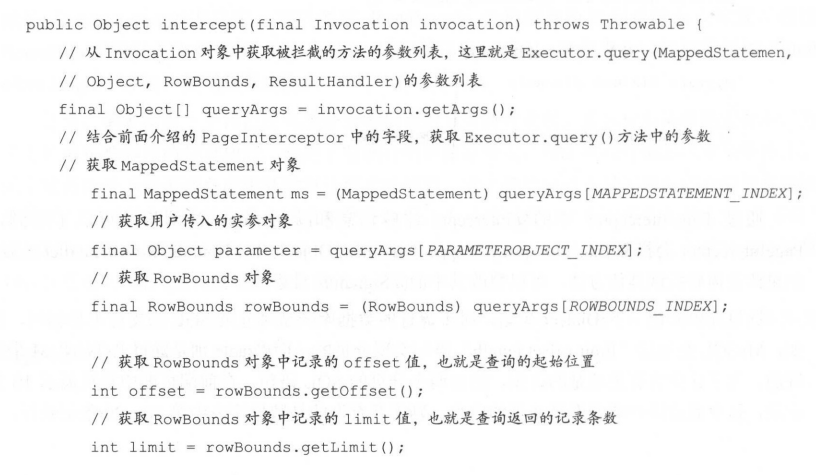
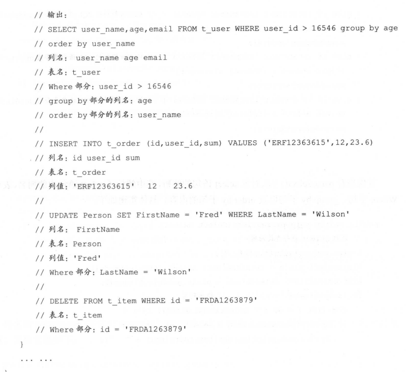
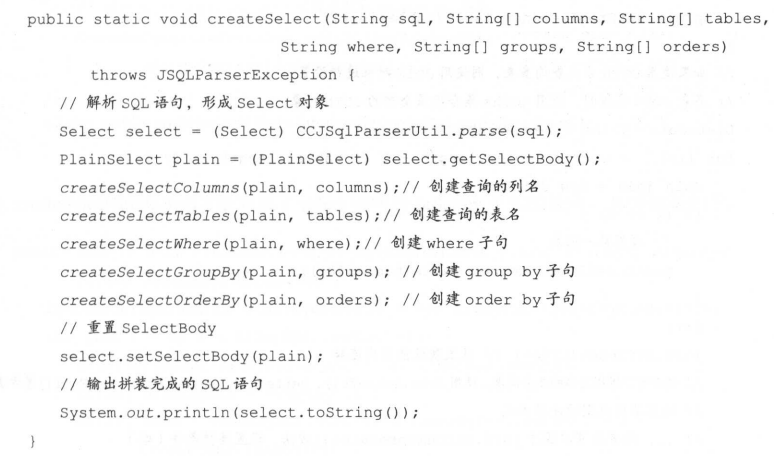
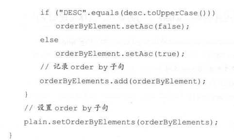
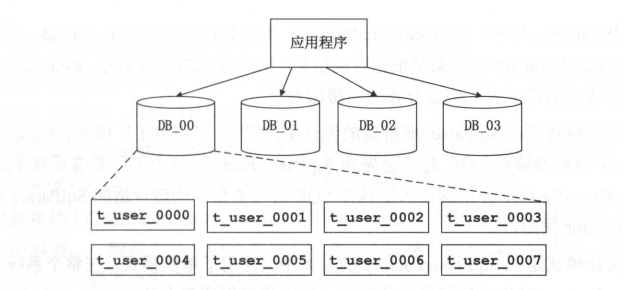
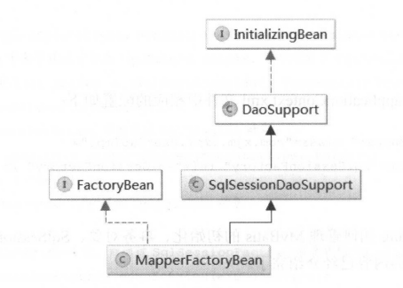
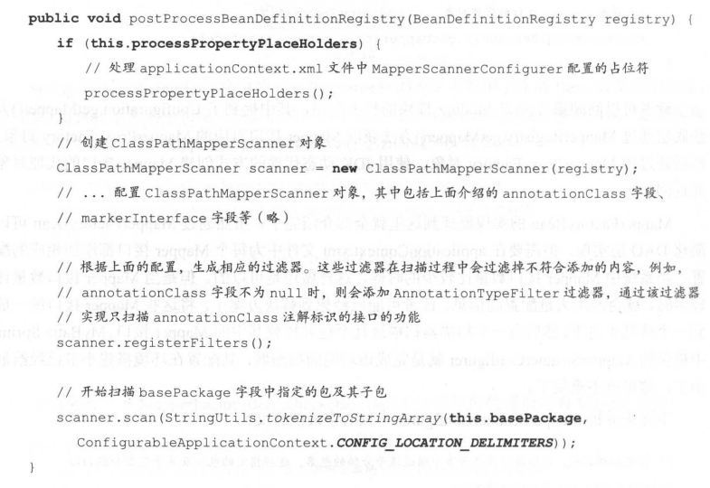

## 插件模块

插件是一种常见的扩展方式，大多数开源框架也都支持用户通过添加自定义插件的方式来扩展或改变框架原有的功能。Mybatis 中也提供了插件的功能，虽然叫插件，但是实际上是通过拦截器(Interceptor)实现的。在 MyBatis 的插件模块中涉及责任链模式和JDK动态代理，JDK动态代理的相关知识在前面已经介绍过了，不再重复描述，下面简单介绍责任链模式的基础知识。

### 责任链模式

​	在系统之间或是同一系统中的不同组件之间，经常会使用请求消息的方式进行数据的交互。当接收者接收到一个来自发送者的请求消息时，接收者可能要对请求消息的多个部分进行解析处理，例如，Tomcat 处理 HTTP 请求时就会处理请求头和请求体两部分，当然，Tomcat 的真正实现会将 HTTP 请求切分成更细的部分进行处理。如果处理请求各部分的逻辑都在一个类中实现，这个类会非常臃肿。如果请求通过增加新字段完成升级，则接收者需要添加处理新字段的处理逻辑，这就需要修改该类的代码，不符合“开放-封闭”原则。本小节介绍的责任链模式可以很好地解决上述问题。
​	在责任链模式中，将上述完整的、臃肿的接收者的实现逻辑拆分到多个只包含部分逻辑的、功能单一的 Handler 处理类中,开发人员可以根据业务需求将多个 Handler 对象组合成一条责任链,实现请求的处理。在一条责任链中,每个 Handler 对象都包含对下一个 Handler 对象的引用，一个Handler 对象处理完请求消息(或不能处理该请求)时，会把请求传给下一个 Handler 对象继续处理，依此类推，直至整条责任链结束。简单看一下责任链模式的类图，如图所示。

 

​	下面通过一个示例简单说明责任链模式的使用方式,假设请求消息中有 A,BC三个字段,接收者 HandlerA、HandlerB、HandlerC 分别实现了处理三个字段的业务逻辑，当业务需要处理A、C两个字段时，开发人员可以动态组合得到 HandlerA-HandlerC 这条责任链;为了在请求消息中承载更多信息，则通过添加 D 字段的方式对请求消息进行升级，接收者一端可以添加HandlerD类负责处理字段 D，并动态组合得到 HandlerA-HandlerC-HandlerD 这条责任链

​	通过上述示例可以清楚地了解到，责任链模式可以通过重用 Handler 类实现代码复用，发送者根本不知道接收者内部的责任链构成，也降低了发送者和接收者的耦合度。另外，还可以通过动态改变责任链内Handler 对象的组合顺序或动态新增、删除Handler 对象,满足新的需求这大大提高了系统的灵活性，也符合“开放-封闭”原则。

​	使用责任链模式也会带来一些小问题,例如,在开发过程中构造的责任链变成了环形结构，在进行代码调试以及定位问题时也会比较麻烦。

### Interceptor

#### 切入点

MyBatis 允许用户使用自定义拦截器对 SQL 语句执行过程中的某一点进行拦截。默认情况下，MyBatis 允许拦截器拦截 Executor 的方法、ParameterHandler 的方法、ResultSetHandler 的方法以及StatementHandler 的方法。具体可拦截的方法如下:

* Executor 中的 update()方法、query0方法、flushStatements0方法、commit0)方法、rollback0方法、getTransaction0方法、close0方法、isClosed0方法。
* ParameterHandler 中的 getParameterObject0方法、setParameters()方法ResultSetHandler中的handleResultSets0)方法、handleOutputParameters()方法。
* StatementHandler 中的 prepare()方法、parameterize0方法、batch0方法、update0方法query0方法。
* MyBatis 中使用的拦截器都需要实现Interceptor 接口。Interceptor 接口是MyBatis 插件模块

MyBatis 中使用的拦截器都需要实现 Interceptor 接口。Interceptor 接口是 MyBatis 插件模块

 

​	MyBatis通过拦截器可以改变Mybatis 的默认行为，例如实现SOL重写之类的能，由于拦截器会深入到 Mybatis 的核心，因此在编写自定义插件之前，最好了解它的原理，以便写出安全高效的插件。本小节将从插件配置和编写、插件运行原理、插件注册、执行拦截的时机等多个方面对插件进行介绍。

#### 注解定义

​	用户自定义的拦截器除了继承Interceptor 接口，还需要使用@Intercepts和@Signature 两个注解进行标识。@Intercepts注解中指定了一个@Signature注解列表，每个@Signature注解中都标识了该插件需要拦截的方法信息，其中@Signature 注解的 type 属性指定需要拦截的类型method属性指定需要拦截的方法,args属性指定了被拦截方法的参数列表通过这三个属性值@Signature 注解就可以表示一个方法签名，唯一确定一个方法。

#### 示例

如下示例所示，该拦截器需要拦截 Executor 接口的两个方法，分别是 query(MappedStatement, Object,RowBounds,ResultHandler)方法和 close(boolean)方法。

定义完成一个自定义拦截器之后，需要在 mybatis-configxml配置文件中对该拦截器进行配如下所示。

 

到此为止，一个用户自定义的拦截器就配置好了。在 MyBatis 初始化时，会通过XMLConfigBuilder,pluginElement0方法解析mybatis-config.xml配置文件中定义的<plugin>节点,得到相应的Interceptor对象以及配置的相应属性,之后会调用Interceptor.setProperties(properties)方法完成对 Interceptor 对象的初始化配置，最后将 Interceptor 对象添加到ConfigurationinterceptorChain 字段中保存。读者可以对 MyBatis 初始化流程的介绍；

#### 加载插件

​	完成 Interceptor 的加载操作之后，继续介绍 MyBatis 的拦截器如何对 Executor、ParameterHandler、ResultSetHandler、StatementHandler 进行拦截。在 MyBatis 中使用的这四类的对象，都是通过 Configurationnew*0系列方法创建的。如果配置了用户自定义拦截器，则会在该系列方法中，通过 InterceptorChainpluginA110方法为目标对象创建代理对象，所以通过Configuration.new*0系列方法得到的对象实际是一个代理对象。

​	下面以Configuration.newExecutor)方法为例进行分， Configuration 中的newParameterHandler0方法、newResultSetHandler0方法、newStatementHandler0方法原理类似,不再赘述。

- 加载入口

  Configuration.newExecutor0方法的具体实现如下:

 

 

- pluginAll

  InterceptorChain 中使用 interceptors 字段 (ArrayList<Interceptor> 类型)记录了mybatis-configxml文件中配置的拦截器。在InterceptorChain,pluginAll0方法中会遍历该interceptors集合，并调用其中每个元素的 plugin0方法创建代理对象，具体实现如下所示。 

 

- Plugin.wrap

  用户自定义拦截器的plugin0方法可以考虑使用MyBatis提供的Plugin 工具类实现，它实现了InvocationHandler 接口，并提供了一个 wrap0静态方法用于创建代理对象。Plugin.wrap0方法的具体实现如下: 

   

 

* plugin定义

   

  在Plugin.invoke0方法中，会将当前调用的方法与signatureMap 集合中记录的方法信息进行比较，如果当前调用的方法是需要被拦截的方法，则调用其 intercept0方法进行处理，如果不能被拦截则直接调用target 的相应方法。Plugininvoke0方法的具体实现如下:

   

Interceptor.intercept0方法的参数是Invocation 对象，其中封装了目标对象、目标方法以及调用目标方法的参数,并提供了proceed0方法调用目标方法,如下所示。所以在Interceptor.intercept0方法中执行完拦截处理之后，如果需要调用目标方法，则通过Invocation.proceed0方法实现。 

 

### 分页插件

#### 分页场景

​	使用 MyBatis 插件可以实现很多有用的功能。例如，常见的分页功能。MyBatis 本身可以通过 RowRounds 方式进行分页，但是在前面分析 DefaultResultSetHandler 时已经发现，它并没有转换成分页相关的 SOL 语句，例如 MySOL 数据库中的 limit 语句，而是通过调用ResultSet.absolute0方法或循环调用 ResultSet.next0方法定位到指定的记录行。当一个表中的数据量比较大时，这种分页方式依然会查询全表数据，导致性能问题。
​	当然，开发人员可以在映射配置文件编写带有 limit 关键字以及分页参数的select 语句来实现物理分页，避免上述性能问题。但是，对于已有系统来说，用这种方式添加分页功能会造成大量代码修改。

​	为解决这个问题，可以考虑使用插件的方式实现分页功能。用户可以添加自定义拦截器并在其中拦截 Executor.query(MappedStatemen，Object，RowBounds，ResultHandler，CacheKeyBoundSql)方法或 Executor.query(MappedStatemen,Object,RowBounds,ResultHandler)方法。在拦截的 Executor.query0方法中，可以通过 RowBounds 参数获取所需记录的起止位置，通过BoundSql 参数获取待执行的 SQL 语句，这样就可以在 SOL 语中合适的位置添加“limit offset,length”片段，实现分页功能。

​	这里，笔者提供一个自己在实战经历中积累的分页插件实现。在该分页插件的实现中，为了支持多种数据库的分页功能，使用了前面介绍的策略模式，读者可以仔细品味这里的设计。关于哪种场景下是否适合应用某种设计模式的问题，除了软件设计人员了解前面介绍的多种设计模式，还需要设计经验与具体需求相结合，设计人员可以通过“多听多看”的方式 (“多听”其他设计人员分享设计经验，“多看”优秀框架、类库的代码，并从中分析设计模式的应用场景和设计思维)，提高自已敏锐的设计嗅觉

#### 分页插件

​	废话不多说，先来看该分页插件的整体设计思路，如图所示，其中展示了插件类PageInterceptor 以及它依赖的 Dialect 策略。

 

 	

通过 PageInterceptor 中的@Intercepts 注解信息和@Signature 注解信息可以了解到，PageInterceptor 会拦截 Executor.qurey(MappedStatemen, Object,RowBounds, ResultHandler)方法如果读者需要拦截其他方法，可以修改其中的@Signature 注解

#### Dialect

​	这里简单介绍一下 Dialect 策略，时下流行的数据库产品对分页 SOL 的支持不尽相同，例如，MySQL 是通过“limit offset,length”语句实现分页的，而Oracle 则是通过 ROWNUM 来实现的。为了让读者有更清楚的认识，给出两个分页的 SQL 语句，在前端页面中每页展示 10条记录，这里假设用户要查看第 2 页的内容，则需要查询的是数据库表中第 10~20 条记录行。

 

#### PageInterceptor执行过程

​	正因为如此，才会为 PageInterceptor 添加 Dialect策略，对不同数据库的分页提供支持。了解完 PageInterceptor 拦截的方法以及设计 Dialect 策略的目的之后，再来看PageInterceptorplugin0方法,正如上一小节所述,PageInterceptor,plugin0方法是通过 Plugin.wrap()方法实现的。

 

其中会解析 PageInterceptor 中@Intercepts 注解和@Signature 注解的信息，从而确定需要拦截的方法，然后使用JDK 动态代理的方式为 Executor 创建代理对象。在该代理对象中，会拦截Executor.query(MappedStatemen,Object,RowBounds,ResultHandler)方法，拦截的具体逻辑是在Pagelnterceptorintercept0方法中实现的。PageInterceptor.intercept0方法的具体实现代码如下:

 

 

在 PageInterceptor 处理完拦截到的 SQL 语之后，会根据当前的 SQL 语句创建新的MappedStatement 对象，并更新到 Invocation 对象记录的参数列表中，下面来看一下新建MappedStatement 对象的实现:

 

 

#### PageInterceptor设置

最后来看 PageInterceptor.setProperties0方法，该方法会根据 PageInterceptor 在配置文件中的配置完成PageInterceptor的初始化，具体实现如下: 

 

为了读者便于理解 PageInterceptor.setProperties0方法，这里给出 PageInterceptor 在mybatis-configxml配置文件中的相关配置:

 

PageInterceptor 的实现就介绍到这里了，下面来看 Dialect 接口,它是所有策略的统一接口，定义了所有策略的行为，其具体代码如下:

#### 拼接sql示例

​	在这里主要介绍 Dialect 接口的两个实现，分别是 OracleDialect 和 MySQLDialect，其他数据库产品对应的 Dialect 实现留给读者自行实现。其中，OracleDialect 是针对 Oracle 数据库的Dialect 接口实现，MySQLDialect 是针对 MySOL 数据库的 Dialect 接口实现。OracleDialect 和MySQLDialect 的supportPage0方法都直接返回 true，表示支持分页功能，具体实现代码就不再展示了。
​	下面首先介绍OracleDialect.getPagingSql0方法的具体实现:

 

 

再来介绍MySQLDialect 的具体实现，MySQLDialectgetPagingSql0方法也是首先处理“forupdate”子句，然后根据 offset 的值拼装支持分页的SQL 语句，最后恢复“for update”子句并返回拼装好的SOL语句。

 

 

#### 分页性能问题

另外需要注意的是，在MySQL 数据库中通过“limit offset.length”方式实现分页时，如果offset 的值很大，则查询性能会很差。下面是一个简单实例:

 

之所以会出现性能问题是因为“limit 1000000,100”的意思是扫描满足条件的 1000100行扔掉前面的 1000000 行，再返回最后的 100 行。在很多场景中，可以通过索引的方式对分页进行优化，示例如下，其中user id 是t user 的主键，自带聚簇索引。 

 

​	上述 select 语句在 MySQL中的大概执行计划是先执行子查询，它会使用 user id 上的聚簇索引(也是一个覆盖索引)查找 1000001，并返回最后一个user id 的值。然后，再次根据 user id上的聚簇索引执行主查询，获取 100 条记录。因为两次查询都使用了索引，所以速度较快。当使用“limit offset.length”方式实现分页遇到性能问题时，可以根据实际的业务需求，考虑在MyBatis 的用户自定义插件中，将相关 limit语句实现的分页功能修改成上述使用子查询和索引的方式实现。当然，“为查找一条记录翻阅多页”这个功能的用户体验本身就很差，也可以通过设计良好的关键字查询功能，避免翻阅多页带来的问题。
​	PageHelper 是国人开发的一款 MyBatis 分页插件，它的核心原理也是基于 Interceptor 实现的，感兴趣的读者可以参考其官方网站。

### JsqlParser

​	笔者将会介绍一个简易的分表插件的实现，读者可以在此基础之上，根据自己实际的业务逻辑进行扩展。
​	首先来介绍其中使用的JsqlParser 工具。JsqlParser 是一个SQL语句的解析器，主要用于完成对 SQL语句进行解析和组装的工作。JsqlParser 会解析 SQL语关键词之间的内容，并形成树状结构，树状结构中的节点是由相应的 Java 对象表示的。JSqlParser 可以解析多种数据库产品支持的 SQL 语句，例如 Oracle、SQLServer、MySQL、PostgreSQL等。
​	下面通过示例介绍JsqlParser 的方式,示例类名称为ParseTest,其中针对select、updateinsert.delete四种类型的SOL语句的各个部分进行了解析，其main函数如下:

 

 

ParseTest.parseSQL0静态方法是解析SQL语句的入口函数，它会根据SQL语的类型调用不同的方法完成解析，具体实现如下: 

 

 

首先来看 parseSelect0方法对象 select语句的解析,其中解析了select 语句中的列名、表名Where 子句、group by 子句以及order by 子句的内容。具体实现如下: 

 

 

再来看 parseInsert0方法对 insert 语句的解析，其中解析了 insert 语句中的列名、表名以及列值。具体实现如下:

 

 

在该示例中，parseUpdate0方法和 parseDelete0方法中的实现逻辑与 parselnsert0方法类似其中 parseUpdate0方法解析了列名、表名以及列值这三部分，parseDelete0方法解析了表名和Where子句两部分，具体代码就不再展示了。
下面通过一个示例方法介绍JsqlParser 解析 select 语句中JOIN部分的API,具体实现如下:

 

JsqlParser 除了可以解析 SOL语句，还提供了修改SOL语句的功能。这里依然通过一个示例代码介绍使用JsqlParser 修改SOL语句的方法，首先来看main函数:

 

在createSelect0)方法中会调用不同的部分组装SQL语句不同的部分，具体实现

 

 

 

 

 

JsqlParser 的基础知识就介绍到这里了，关于JsqiParser 其他的使用方式，读者可以参考JsqlParser 官方文档进行学习。

### 分表插件

​	分库分表是笔者在实践中应用 MyBatis 插件实现的另一功能。一个系统随着业务量的不断发展，数据库中的数据量会不断增加，这时就可能会出现超大型的表(可能有千万级别的数据甚至更多)，对这些表的查询操作就会频繁出现在慢查询日志中。即使通过添加合适的索引、优化SQL 语句等手段对相关查询进行了优化，也可能依然无法满足性能方面的需求。此时，可以认为单表已经无法支持该业务量，应当考虑对这些超大型的表进行分表。之后，随着数据库中表的数量越来越多，数据库I/O、磁盘、网络等方面都可能成为新的系统瓶颈，可以考虑通过分库的方式减小单个数据库的压力。

#### 实现思路

​	常见的分库分表的方式有分区方式、取模方式以及数据路由表方式。在实践开发中，笔者采用了用户ID 取模的方式实现分库分表，其中一个主要原因是:实际业务中，所有维度的数据都与用户相关，查询所有非用户表时都是按照用户 ID 来进行查询的。这样，按照用户ID 取模之后，可以让同一个用户的所有相关数据都落到同一张表中，从而避免了跨表查询的操作。具体的计算如下所示。

 

在测试环境中，笔者使用了 4 个数据库，每个数据库中分了 8 张表，图4-3 展示了分库分表之后整个系统的架构。

 

​	为了简化上层系统的开发，实现上层程序与数据库之间解耦，需要屏蔽上层应用程序对分库分表的感知。在上层应用系统的开发过程中，只关心使用的业务表名，并不需要关心具体的分库名后缀和分表名后缀。
​	在上述分库分表场景中，将MyBatis 与 Spring 集成使用，选择具体分库的功能并不是直接在MyBatis 中完成的，而是在 Spring 中配置了多个数据源，并通过 Spring 的拦截器实现的，这不是本节介绍的重点，感兴趣的读者可以参考 Spring 的相关资料。

​	选择具体的分表功能是通过在MyBatis中添加一个分表插件实现的，在该插件中拦截 Executor.update0方法和query0方法并根据用户传入的用户ID计算分表的编号后缀。之后，该插件会将表名与编号后缀组合形成分表名称，解析并修改SOL 语句，最终得到可以在当前分库中直接执行的 SOL语句。到此为止通过MyBatis实现分库分表功能的整体思路就介绍完了。

#### 整体设计

​	介绍完 JsqlParser 工具的基本使用之后，我们回到对分表插件的介绍。首先来看分表插件的整个结构，如图 所示，其中展示了插件类 ShardInterceptor 以及它依赖的 ShardStrategy 策略和SqlParser解析器。

 

​	在图设计中涉及四种设计模式。

​	第一种是在ShardStrategy 策略的设计中，使用了策略设计模式。这里将每一种具体的分表策略封装成了 ShardStrategy 接口的实现，在图展示了三个 ShardStrategy 接口的实现分别是 UniqueldShardStrategy、TimeShardStrategy、RoutingShardStrategy。其中，UniqueldShardStrategy 实现类是根据全局唯一的id，决定分表的后缀编号;TimeShardStrategy 实现类是根据时间信息，决定分表的后缀编号; RoutingShardStrategy实现类是根据特定的路由表，决定分表的后缀编号

​	第二种设计模式是在SqlParser解析器的设计中,使用到了简单工厂模式。在ShardInterceptor使用SqlParser 解析器解析 SQL 时，会先 SqlParserFactory 这个工厂类请求具体的 SqIParser对象，而 SqlParserFactory 会根据传入的具体SOL语类型，构造合适的 SqlParser 对象并返回给 ShardInterceptor 使用

​	第三种设计模式是在SqlParserFactory 的设计中，使用了单例模式。在整个系统中，只需要一个SqlParserFactory 对象对外提供服务即可，所以将其做成单例的

​	第四种设计模式是在 SglParser 接口的实现类中，涉及了访问者模式，笔者个人认为，访问者模式是所有设计模式中最复杂,也是最难掌握的设计模式。这里仅对访问者模式做简单介绍。访问者模式的主要目的是抽象处理某种数据结构中各元素的操作，可以在不改变数据结构的前提下，添加处理数据结构中指定元素的新操作。

#### 访问者模式

访问者模式的结构如图所示。

 

展示的访问者模式中的角色以及它们之间的关系如下所述

* 访问者接口(Vistor)

  该接口为数据结构中的每个具体元素(ConcreteElement)声明个对应的visit*0方法。

* 具体访问者(ConcreteVisitor):

  实现 Visitor 接口声明的方法。我们可以将整个ConcreteVisitor 看作一个完整的算法，因为它会处理整个数据结构。而其中的每个方法实现了该算法的一部分

* 元素接口(Element )

  该接口中定义了一个 accept0方法，它以一个访问者为参数,指定了接受哪一类访问者访问。

* 具体元素(ConcreteElement )

  实现抽象元素类所声明的 accept0方法，通常都会包含 visitor.visit(this)这个调用，这就会调用访问者来处理该元素。

* 对象结构(ObjectStructure )

  该类的对象就是前面不断提到的数据结构，它是一个元素的容器，一般包含一个记录多个不同类、不同接口的容器，如 List、Set、Map 等在实践中一般不会专门再去抽象出这个角色。

​	介绍完访问者模式的结构和角色，下面介绍一下使用访问者模式会为我们带来哪些好处针对一个数据结构,如果要增加新的处理算法,则只要增加新的 Visitor接口实现即可无须修改任何其他的代码，这符合“开放-封闭”原则。
​	将整个数据结构中所有元素对象的处理操作集中到一个 ConcreteVisitor 对象中，这样便于维护。在处理处理一个复杂数据结构时，并不是每个元素都是 ConcreteVisitor 对象需要处理的，ConcreteVisitor可以跨越等级结构，处理属于不同层级的元素。

​	访问者模式当然也有缺点,其中最明显的缺点就是限制了数据结构的扩展,如果新增元素则会导致 Visitor 接口以及所有实现的修改，代价比较大，也违背了“开放-封闭”原则。另一点就是访问者模式难于理解，也不利于错误定位。

#### 拦截器分析

 

 

​	通过 ShardInterceptor 中的@Intercepts 注解信息和@Signature 注解信息可以了解到ShardInterceptor 会拦截 StatementHandler. prepare(Connection,Integer)方法，如果读者需要拦截其他方法，可以修改其中的@Signature 注解。
​	介绍完 ShardInterceptor 拦截的方法及其字段的含义之后，再来看 ShardInterceptor.plugin0方法，该方法是通过 Pluginwrap0方法实现的，与 PageInterceptor,plugin0方法类似，具体实现如下:

 

​	其中会解析 ShardInterceptor 中@Intercepts 注解和@Signature 注解的信息，从而确定需要拦截的方法，然后使用JDK动态代理的方式，为StatementHandler 创建代理对象。在该代理对象中，会拦截 StatementHandler. prepare(Connection,Integer)方法，拦截的具体逻辑是在ShardInterceptor.intercept0方法中实现的，具体实现代码如下:

 

 

 

 

下面来分析 SqlParserFactory 是如何根据传入的 SQL 语创建相应的 SqlParser 对象的SqlParserFactory 中字段的含义及构造方法如下:

 

SqlParserFactory.createParser0方法是SqlParserFactory 对外提供的唯一方法,具体实现如下:

 

 

​	SelectSqlParser 是 SqlParser 接口的实现之一，主要负责解析 select 语句。在这里由于篇幅限制，主要介绍 SelectSqlParser 的具体实现，SqlParser 接口的其他实现 (UpdateSglParser、InsertSqlParser、DeleteSqlParser)与其类似，不再展示具体的代码。
​	SelectSqlParser 不仅实现了 SqlParser 接口,还实现了JsqlParser 中提供的多个 Visitor 接口。从名字上也能看得出，这些 JsqlParser 提供的 Visitor 接口扮演了访问者接口的角色，SelectSglParser 是具体访问者，而 SOL语句对应的 Select 对象则是数据结构，Select 对象中的每部分片段则是具体元素。SelectSqlParser 中字段的含义以及构造方法的具体实现如下:

 

 

SelectSqIParserinit0方法是 SelectSglParser 的初始化方法，其中就触发了对原始 SOL 语句的解析，具体实现如下:

 

 

 

最后要介绍的是该插件中涉及的分表策略，其对应的是 ShardStrategy 接口，该接口中只定义了一个 parse(方法，该方法负责根据用户传入的实参计算分表的后缀名，具体如下: 

 

​	由 ShardStrategyparse0计算得到的分表结果将记录到 ShardResult tableSufix 字段中。这里还提供了一种覆盖系统配置的 ShardStrategy 策略的方式，就是使用ShardResultLocal为当前线程绑定ShardResult对象。如果当前线程存在绑定的 ShardResut对象，则使用该ShardResult对象确定分表后缀，否则使用系统配置的 ShardStrategy 策略与用户传入的实参进行计算。ShardResultLocal的具体实现如下:

 

这里简单介绍一下 UniqueldShardStrategy，供读者参考，读者可以根据自己的业务需求提供相应的 ShardStrategy 实现。UniqueIdShardStrategy 中字段的含义如下: 

 

 

 

#### 其它分表技术

​	到这里，分表插件的核心实现就介绍完了。在本小节最后，为读者提供另外几个分库分表为中间件，以及它们的比较信息，了解更多的信息之后，也能帮助读者选择更适合自己业务的分库分表技术。

* Amoeba是一个真正的独立中间件服务，上层应用可以直接连接Amoeba 操作 MySOL集群，上层应用操作Amoeba就像操作单个MySOL实例一样。从Amoeba的架构中可以看出，Amoeba底层使用JDBC Driver 与数据库进行交互。Amoeba不再更新代码已经被Cobar取代了。

* Cobar 是在Amoeba基础上发展出来的另一个数据库中间件，接入成本较低。Cobar 与Amoeba的一个显著区别就是将底层的JDBC Driver改成了原生的MySOL通信协议层也就是说，Cobar 不再支持JDBC规范，也不能支持 Oracle、PostgreSQL等数据库。但是，原生的MySOL通信协议为Cobar 在MySOL集群中的表现，提供了更大的发展空间，例如 Cobar 支持主备切换、读写分离、异步操作、在线扩容、多机房支持等等。

  目前，Cobar 已经停止更新，笔者也不建议读者在新项目中使用。

* TDDL(Taobao Distributed Data Layer)并不是一个独立的中间件，它在整个系统中只能算是中间层。TDDL以jar 包的形式为上层提供支持，其具体位于JDBC 层与业务逻辑层之间，由此可以看出，TDDL底层还是使用JDBC Driver 与数据库进行交互的TDDL 支持了一些 Cobar 不支持的操作，例如读写分离、单库分多表等。例外，TDDI比Cobar 易于维护，运维成本也就低了很多。
* MyCAT 是在 Cobar 基础上发展起来的中间件产品。MyCAT 底层同时支持原生的MySQL通信协议以及JDBC Driver 两种方式，与数据库进行交互。MyCAT将底层的BIO改为NIO，相较于 Cobar，支持的并发量上也有大幅提高。
  另外，MyCAT还新增了对order by、group by、limit 等聚合操作的支持。虽然 Cobar也可以支持上述聚合操作，但是聚合功能需要业务系统自己完成。在笔者写作时，MyCAT 的社区还是比较活跃的，并且社区提供的文档等资料还是比较齐全的，感兴趣的读者可以参考 MyCAT 官网。

### 其它用途

-  MyBatis 插件还有很多其他的场景，例如白名单和黑名单功能。

  ​	在白名单中记录了当前系统允许执行的SOL语句或SOL模式,在黑名单中记录了当前系统不允许执行的SQL语句或SQL模式

  ​	有些 SOL 语句在生产环境中是不允许执行的，例如，在两表数据量比较大时，执行两表的JOIN 连接查询会非常耗时，甚至会造成数据库卡死的情况:或者，通过“like %%”方式进行模糊查询，这种查询方式无法使用索引，只能进行全表扫描，会导致比较严重的性能问题:再或者，在垂直分库的场景中，禁止不同分库的两个表进行连接查询。运维人员可以通过修改白名单和黑名单，控制可执行的SOL 语句，从而避免上述场景。
  ​	我们可以通过在 MyBatis 中添加自定义插件的方式实现白名单和黑名单的功能。在自定义插件中，拦截 Executor的 update0方法和query0方法，将拦截到的SQL语句及参数与白名单及黑名单中的条目进行比较，从而决定该 SOL语句是否可以执行。

- MyBatis 插件的另一个应用场景是生成全局唯一ID。

  ​	如果系统需要主键自动生成的功能可以使用数据库提供的自增主键功能，也可以使用 SelectKeyGenerator 执行指定的SOL语句来获取主键。但是，在某些场景中，这两种方法并不是很合适，例如电商系统中的订单号是需要长度相等且全局唯一的，在分库分表的场景中，数据库自增主键显然不是全局唯一的，所以不符合要求。而在高并发的场景中，通过 SelectKeyGenerator 执行指定的 SOL 语句获取主键的方式，在性能上会有缺陷，也不建议使用。

  ​	我们可以考虑在 MyBatis 中添加用于生成主键的自定义插件，该插件会拦截Executor.update0方法，在拦截过程中会调用指定的主键生成算法生成唯一主键，并保存到用户传入的实参列表中，同样也会对 insert 语句进行解析和修改。至于具体的主键生成算法，读者可以根据具体的业务逻辑进行选择，例如，Java 自带的生成UUID 的算法，该算法性能非常高，不会成为系统的瓶颈，但是并不是趋势递增的。

  ​	如果要求主键趋势递增，则可以考虑 snowflake算法，它是 Twitter 开源的分布式主键生成算法，其生成结果是一个 ong 类型的主键，结构如所示。其中，有41bit 高位表示毫秒时间戳，这就意味着生成的主键是趋势递增的，最低位 12bit 表示毫秒级内的序列号，这就意味着每台机器在每毫秒可以产生 4096 个主键，足够使用，不会成为性能瓶颈。

   

  ​	到此为止，MyBatis 插件模块涉及的设计理念、编写和配置方式、运行原理、使用场景等方面都已经介绍完了，希望读者能结合前面对 MyBatis 各个模块的分析，编写出性能良好、设计优秀的插件。 

## spring集成

​	Spring 是于2003 年兴起的一个轻量级的 Java 开发框架，其主要目的是解决企业级应用程序开发中的复杂性。由于 Spring 设计优良、接口简单易用，一经发布就得到了开发人员的追捧，最终力压EJB成为Java EE开发的主流框架。在介绍MyBatis 与Spring 集成开发之前，Spring有几个比较重要的概念需要在这里简单介绍一下

### spring基础

​	首先是IoC (Inversion ofControl，控制反转)，其思想是将开发人员设计好的对象交给 IoC容器控制，而不是直接在程序中通过 new 来创建需要的对象。当需要使用某个对象时，由 IoC容器创建该对象并注入依赖对象中。这样，客户端在使用某个组件时，可以直接从IOC 容器中获取该组件。
​	如图所示，客户端需要同时了解类A和类B的具体实现以及它们的依赖关系，客户端在创建对象A和对象B之后,还需要根据依赖关系将对象B 设置到对象A的相关属性中。使用IoC容器之后，则如图所示类A和类B的依赖关系是通过配置文件告诉IOC容器的，由IoC容器创建对象A 和对象 B 并维护两者之间的关系，客户端在使用对象A 时，可以直接从IoC 容器中获取。

 

​	另一个概念是 DI(Dependency Injection，依赖注入)，其含义是:对象之间的依赖关系是由容器在运行期决定的，也就是说，由容器动态地确定并维持两个对象之间的某个依赖关系。通过依赖注入机制，开发人员只需要通过简单的配置 (XML 或注解)，就可以确定依赖关系，实现组件的重用。
​	最后来看AOP(Aspect Oriented Programming，面向切面编程)，它是对面向对象编程的补充和完善。在面向对象编程中，开发人员可以通过封装、继承、多态等概念建立对象的层次结构。在系统中，除了核心的业务逻辑，还会有权限检测、日志输出、事务管理等相关的代码，它们会散落在多个对象中，横跨整个对象层次结构，但是这些功能与核心业务逻辑并无直接关系。如果单纯使用面向对象程序设计，会导致这种代码大量重复出现，不利于模块的重用。AOP 利用“横切”技术将那些影响了多个类的公共代码抽取出来，封装到一个可重用的模块中，并将其称为 Aspect(切面)。这样就可以减少重复的代码，降低模块之间的合度，提高了系统的可维护性。下面简单介绍一下 AOP 中常见的名词。

* 横切关注点

  对哪些方法进行拦截，拦截后怎么处理，这些关注点称之为横切关注点。

* 切面(aspect )

  类是对物体特征的抽象，切面则是对横切关注点的抽象。

* 连接点(joinpoint)

  程序执行中明确的某个点，该点将会被拦截。Spring 只支持方法类型的连接点，所以在 Spring 中连接点指的就是被拦截到的方法。

* 切入点(pointcut )

  对连接点进行拦截的定义。

* 通知(advice )

  拦截到连接点之后要执行的代码，通知可以分为 5 类，分别是前置通知、后置通知、异常通知、最终通知、环绕通知。

* 织入(weave)

  将切面应用到目标对象，并创建相应代理对象的过程

SpringAOP 最常见的应用场景就是事务管理，会介绍 SpringAOP 的配置

### springMVC

​	Spring MVC是Spring 提供的一个强大而灵活的Web架，它是一款实现了MVC设计模式的、请求驱动的轻量级Web 框架。Spring MVC使用MVC架构模式将 Web 层的各组件进行了解。借助 Spring 提供的注解功能，Spring MVC提供了POO(Plain Ordinary Java Object)的开发模式，使得开发和测试更加简单，开发效率更高。
​	首先来简单介绍一下MVC(Model-View-Controller，模型-视图-控制器)架构模式。从名字上就可以看出，MVC 中核心的三部分是 Model(模型)、View(视图)、Controller (控制器)。其中，Model 主要负责封装需要在视图上展示的数据；视图只用于展示数据，不包含任何业务逻辑;控制器主要负责接收用户的请求，调用底层的 Service 层执行具体的业务逻辑，之后，业务逻辑会返回一些数据在视图上进行展示，控制器会收集这些数据并准备模型对象在视图上展示。图展示了MVC模式的核心组件和功能。

 

​	MVC 模式主要是通过分离模型、视图以及控制器三部分,实现业务逻辑与界面之间的解耦MVC 模式的核心思想是将业务逻辑从界面中分离出来，允许它们单独变化且不会相互影响。

​	在Spring MVC 应用程序中，Model通常由 POJO对象组成，它会在业务逻辑层中被处理在持久层中被持久化。视图常用方案是使用JSP 标准标签库 (JSTL)编写的JSP 模板。控制器则是通过Spring MVC 注解配置的Controller 类。

​	DispatcherServlet 是一个前端控制器，是整个Spring MVC框架的核心组件。它主要负责整体流程的调度，在接收HTTP请求之后，会根据请求调用 Spring MVC 中的各个组件。拦截指定格式的URL请求，初始化 WebApplicationContext，初始化 Spring MVC 的各个组成组件，根据 Controller 返回的逻辑视图名选择具体的视图进行染等一系列工作，都是由DispatcherServlet 负责的。

下面来看看 Spring MVC 中常用的接口及其含义。

* Controller 接口

  用户可以通过实现 Controller 接口实现控制器，但是多数情况下，使用的是@Controller 注解，被@Controller 修饰的类自动成为控制器

* HandlerMapping 接口

  主要负责用户请求到Controller 之间映射。

* HandlerInterceptor 接口

  拦截器，用户可以自定义实现，完成拦截请求的操作。

* ModelAndView

  Controller 处理完请求之后，会将视图的名称以及模型数据封装成ModelAndView 对象返回到 DispatcherServlet 中。

* ViewResolver 接口

  主要负责将视图的逻辑名称映射成具体的视图

* View 接口

  具体视图

介绍完SpringMVC的核心组件之后，下面介绍SpringMVC处理一个HTTP请求的整体流如图所示

 

* 用户通过浏览器发送HTTP 请求后，首先会提交到 Spring MV 中的 DispatcherServlet中进行处理。
* DispatcherServlet 会根据请求查找一个或多个HandlerMapping,并根据 HandlerMapping查找处理请求的Controller
* DispatcherServlet 将请求提交到 Controller 进行处理。
* Controller 一般会调用 Service 层处理请求
* Controller 调用 Service 层处理请求之后，会返回ModelAndView。
* DispatcherServlet 会查询一个或多个 ViewResoler 视图解析器，进行视图解析(7)查找 ModelAndView 指定的视图。
* HTTP 响应，View 负责将结果显示到客户端。

### 环境搭建

 

 

#### 配置web.xml

#### 配置DataSource

#### 配置application Context

#### 配置springmvc-servlet.xml

#### 配置mybatis-config.xml

 

 

### Mybatis-Spring 剖析

在上一小节的示例中，我们将MyBatis 与 Spring 进行了集成，其中使用了 mybatis-springX.XXjar 这个Jar 包。该JAR 的主要功能就是负责将 MyBatis 与 Spring 进行无缝集成，该jar包可以将 MyBatis 的事务交给 Spring 来管理，还可以将SqlSession 等对象交给 Spring 管理并由Spring IoC容器将SqlSession 对象注入到其他 Spring Bean 中。这一小节将详细介绍该jar 包的实现原理。

#### SqlSessionFactoryBean

​	在前面介绍MyBatis初始化过程时提到,SalSessionFactorvBuilder会通过XMLConfigBuildel等对象读取 mybatis-configxml 配置文件以及映射配置信息，得到 Configuration 对象，然后创建SqlSessionFactory 对象。而在与 spring 集成时，MyBatis 中的 SqlSessionFactory 对象则是由SqlSessionFactoryBean 创建的。在上一小节的集成示例中，applicationContext.xml 文件中配置了SqlSessionFactoryBean，其中指定了数据源对象、mybatis-configxml 配置文件的位置等信息SqlSessionFactoryBean 中定义了很多与MyBatis 配置相关的字段，如图所示。

 

​	图 展示的所有字段对应了开发人员可以在 applicationContext.xml 配置文件中为SqlSessionFactoryBean 配置的配置项，同时，也都可以在 Configuration 对象中找到相应的字段,其含义就不再重复描述了。
​	这里重点关注 SqlSessionFactoryBean 是如何创建 SqlSessionFactory 对象的，该功能是在SqlSessionFactoryBean.buildSqlSessionFactory0方法中实现的，其中涉及使用XMLConfigBuilder创建Configuration 对象、对Configuration 对象进行配置、使用XMLMapperBuilder 解析映射配置文件以及 Mapper 接口等一些列操作，这些操作的原理都在前面介绍过了。SqlSessionFactory-Bean.buildSqlSessionFactor方法的具体实现如下:

 

 

#### SpringManagedTransaction

​	通过上述分析可以了解到，如果在 applicationContext.xml 配置文件中没有明确为SqlSessionFactoryBean 指定transactionFactory 属性，则在 buildSqlSessionFactory0方法中默认使用SpringManagedTransactionFactory，该类实现了 TransactionFactory 接口，并实现了newTransaction0方法，其中返回的 Transaction 接口实现为 SpringManagedTransaction。

​	SpringManagedTransaction 中核心字段的含义如下:

 

​	SpringManagedTransaction.connection字段维护的JDBC 连接来自 Spring 事务管理器，当应用不再使用该连接时，会将其返还给 Spring 事务管理器。下面是 SpringManagedTransaction.get-Connection0方法和close0方法的具体实现:

 

​	在SpringManagedTransaction.commit0方法和 rollback()方法中，会根据连接是否由 Spring管理以及事务是否要自动提交(即 isConnectionTransactional和autoCommit 两个字段的值)，决定是否真正提交/回滚事务。

 

 

#### SqlSessionTemplate

​	SqlSessionTemplate 是 MyBatis-Spring 的核心，它实现了 SqlSession 接口，在MyBatis 与Spring 集成开发时，用来代替 MyBatis 中的 DefaultSqlSession 的能，所以可以通过SqlSessionTemplate 对象完成指定的数据库操作。SqlSessionTemplate 是线程安全的，可以在 DAO(Data Access Object，数据访问对象)之间共享使用，其底层封装了 Spring 管理的 SqlSession对象。
​	SqlSessionTemplate 中核心字段的含义如下:

 

在SqlSessionTemplate 的构造方法中会初始化上述字段，具体实现如下: 

 

SqlSessionTemplate 通过调用sqlSessionProxy 的相应方法实现了SqlSession 接口的所有方法这里重点来分析创建代理对象时使用的 InvocationHandler 接口实现--SqlSessionInterceptor,其invoke0方法实现如下:

 

在 SqlSessionUtilsgetSession0方法中，会首先尝试从 Spring 事务管理器中获取 SqlSession对象，如果获取成功则直接返回，否则通过 SqlSessionFactory 新建SqlSession 对象并将其交由Spring事务管理器管理后返回，具体实现如下: 

 

 

#### SqlSessionDaoSupport

​	介绍完SqlSessionTemplate 的实现原理之后，简单介绍SqlSessionDaoSupport 的功能。SqlSessionDaoSupport 是一个实现了 DaoSupport 接口的抽象类，其主要功能是辅助开发人员编写DAO层实现。
​	SqlSessionDaoSupport 的实现比较简单，它通过 sqlSession 字段维护了一个SqlSessionTemplate对象，并提供了 getSqlSession0方法供子类获取该 SqlSessionTemplate 对象使用。该SqlSessionTemplate 则是由其初始化时传入的 SqlSessionFactory 创建的。SqlSessionDaoSupport的构造方法如下:

  

 

 

 

到此为止，Spring 如何管理MyBatis 的初始化、事务对象、SqlSession 对象以及开发人员如何编写DAO实现的内容已经介绍完了。 

#### MapperFactoryBean

​	在有些场景中，系统的 DAO 层实现比较简单，除了完成简单的数据库操作，没有任何其他的业务操作，这时使用SqlSessionDaoSupport 或SqlSessionTemplate编写DAO层实现的话重复的代码就显得比较多。
​	为了代替手工使用 SqlSessionDaoSupport 或 SqlSessionTemplate 编写 DAO实现MyBatis-Spring 提供了一个动态代理的实现--MapperFactoryBean。它可以直接将 Mapper 接口注入到 Service 层的 Bean 中，这样开发人员就不需要编写任何 DAO实现的代码，在使用注入的Mapper 接口对象时，就如同使用DA一样，这是通过MapperFactoryBean为其自动创建代理对象实现的。
MapperFactoryBean的具体配置示例如下:

 

 

Spring 中InitializingBean 接口的afterPropertiesSet0方法主要用于完成 Bean 对象的初始化,在DaoSupport 抽象类中实现了该方法并在其中调用checkDaoConfig0这个抽象方法，这是模板方法模式的应用。DaoSupportafterPropertiesSet0)方法的具体实现如下:

 

下面来看一下MapperFactoryBean.checkDaoConfig0方法如何处理指定的 Mapper 接口: 

 

​	ConfigurationaddMapper0方法底层通过调用 MapperRegistryaddMapper0方法实现，在注册Mapper 接口的同时，会创建对应的 MapperProxyFactory 对象，还会解析对应的映射配置文件。该注册过程以及涉及的组件的功能,在 binding 模块的分析以及MyBatis 初始
化流程的分析中都已介绍过了。MapperFactoryBean 除了实现了 SqSessionDaoSupport 抽象类，还实现了 Spring 提供的FactoryBean 接口，它是一个用于创建 Bean 对象的工厂接口，其中最核心的方法就是 getObject0方法。MapperFactoryBeangetObject0方法的实现如下:

 

​	 binding 模块的相关介绍，其中提到了 Configuration.getMapper0方法底层通过MapperRegistrygetMapper0方法获取 Mapper 接口对应的 MapperProxyFactory对象然后通过该MapperProxyFactory对象，使用JDK动态代理的方式创建 Mapper 接口的代理对象并返回。

#### MapperScannerConfigurer

​	MapperFactoryBean的实现原理到这里就全部介绍完了。虽然通过MapperFactoryBean 可以简化DAO层实现，但需要在 applicationContext.xml文件中为每个Mapper 接口都添加相应的配置。当系统中 Mapper 接口数量比较少的时候，这样做还是可以的。但是当 Mapper 接口数量比较多时，就会产生大量配置的信息。读者可能已经想到解决方案了，将这些 Mapper 接口统一放到一个或几个包下,然后由一个扫描器扫描这几个包并加载其中的Mapper 接口。MyBatis-Spring中提供的 MapperScannerConfigurer 就是完成该功能的扫描器，其配置在环境搭建小节已经给展示了，这里就不重复了。

​	下面来分析MapperScannerConfigurer 中核心字段的含义:

 

​	MapperScannerConfigurer 实现了BeanDefinitionRegistryPostProcessor 接口，该接口中的postProcessBeanDefinitionRegistry0方法会在系统初始化的过程中被调用，该方法是MapperScannerConfigurer 实现扫描的关键，具体实现如下:

 

ClassPathMapperScanner.scan0方法的核心逻辑在其doScan0方法中实现，具体实现如下

 

 

ClassPathMapperScanner.processBeanDefinitions0方法会对 dScan(方法中扫描到的BeanDefinition 集合进行修改，主要是将其中记录的接口类型改造为 MapperFactoryBean 类型并填充MapperFactoryBean 所需的相关信息，这样，后续即可通过MapperFactoryBean完成相应功能了。ClassPathMapperScannerprocessBeanDefinitions0方法的具体实现如下: 

 

## 其它

### 动态 SQL

​	之前有过Mybatis 使用经历的读者，应该了解MyBatis 中动态SOL的强大功能，我们可以根据自己的需要，编写出十分灵活的动态 SQL 语句。下面先来看一个比较常见的动态 SQL的写法，如下所示。该动态SOL语句会根据用户传入的实参，拼凑出查找t customer 表的where子句部分，并将查询的结果集映射成Customer 对象。

 

除了此 SOL 节点，该映射配置文件中还有另一条动态 SOL 语句，如下所示。该动态 SQL语句会根据用户传入的实参，拼凑出连接查询  customer 表和 t order 表的 where 子句部分，并将查询的结果集映射成Order 对象，其中还关联了一个 Customer 对象。

 

 

​	假设现在有一个需求,需要去除对t customer 表中sex字段和name字段查询以及条件判断这就需要修改 findCustomerList 节点中 select 语句查询的列名以及其 where 子句部分，以及findOrderList 节点中 select语句查询的列名及其 where 子句部分，总共四个地方。如果存在更多涉及tcustomer 表的查询，要修改的位置会更多，这样显然不易于维护。
​	读者在设计动态 SOL 语句时，可以考虑使用<sql>节点，将SQL 语句中的公共部分独立出来，然后使用<include>节点引入这些公共部分。在该示例中，可以将表t customer 和表 t order中需要查询的字段分别封装到<sql>节点中，可得到如下<sql节点定义:

 

另外，还可以将表t customer 和表t order 涉及的where 子分别封装到<sqI>节点中，可得到如下<sq>节点定义:

 

 

示例中的两条动态 SQL 语句可以直接通过<include>节点引用上述<sq>节点，这样能够复用<sql>节点。动态 SQL语句的定义如下，这样维护起来就非常简单了，只需要修改<sq>节点中的内容即可。 

 

 

### OgnlUtils工具类

​	通过前面几章对 MyBatis 原理和代码的分析可知，OGNL表达式主要应用在两个地方，一个是在动态SOL语句中，例如在<if节点的 test 属性以及<bind节点的 value 属性，MyBatis会通过OGNL计算这些表达式的值之后，再开始进行动态 SQL的解析。另一个是在“SB”参数中，例如S{name表达式，MyBatis 会通过OGNL解析该表达式并进行替换。
​	在上一小节的示例中，存在大量的<if节点，其中的 test 属性主要的工作是对用户传入的实参进行检测，这些检测大都是判断是否为 null。现在假设需要修改 test 属性的判断条件，例如增加判断实参是否为空字符串，这就需要开发人员查找整个映射配置文件进行修改，这显然不是一个可行的方案。
​	笔者建议提供一个OgnlUtils 类，其中提供多个用于条件检测的静态方法。下面是OgnlUtils工具类的简单示例,仅供参考,读者可以根据自己的实际业务,添加新的静态方法,扩充OgnlUtils工具类。

 

上述OgnlUtils中提供的方法多数依赖 BeanUtils 工具类，BeanUtils 中封装了对常见对象的判断方法，读者可以根据自己的实际业务进行扩充，本例中涉及的 BeanUtils 实现如下:

 

 

 

​	读者可以考虑使用 Apache BeanUtils 结合实际需求，丰富自己的 BeanUtils 工具。ApacheBeanUtils 是 Apache 提供的操作 JavaBean 的工具包，它的底层是通过 Java 反射技术实现的。Apache BeanUtils提供了提取/设置JavaBean 属性值的功能,其中自带了很多Converter 转换器用户也可以自定义Converter进行扩展。Apache BeanUtils还提供了对多个JavaBean 对象动态排序的功能，动态创建JavaBean的功能等，很多开源框架，例如 Spring、Struts 等都使用了ApacheBeanUtils 工具包。
​	最后，我们回到对 OgnlUtis 工具类的介绍。介绍OGNL 表达式时提到了，它可以通过“@类名@静态方法名0”的方式调用指定类的指定静态方法，OgnlUtils 工具类的使用方式也是如此，下面通过一个动态 SQL 节点进行展示。

 

### SQL语句生成器

​	相信很多 Java 开发人员都经历过一件非常痛苦的事情，就是在 Java代码中套编写 SOI语句。之所以会这么做，是为了根据某些外部条件，例如用户传入的参数、系统运行的环境变量或者其他影响系统运行的因素，动态生成需要的 SOL 语句
​	正如前文介绍的那样，MBatis 提供的映射配置文件中有一套强大的动态SOL生成方案可以满足大多数动态 SQL 语句的需求。但是，有的场景下，在 Java 代码中嵌套构造 SQL语句也是必要的。此时，MyBatis 提供的SOL 语句生成器就可以派上用场了。
​	在MyBatis官方文档中给出下面的SOL语示例:

 

​	如果要在 Java 程序中动态生成上述 SOL 语句，就需要考虑引号、WHERE、AND、OR、括号等符号和关键字出现次数和位置，最终写出来的程序也非常复杂且不易于维护,用 MyBatis官方文档上的话来说，这简直就是一场噩梦。
​	我们可以使用MyBatis 中提供的SOL类重新组织上述SOL语句，具体实现如下:

 

 

​	很明显，使用 SQL类重新组织该 SOL 语之后，SQL 语句的结构就比较清晰了，开发人员也不必特别小心地拼凑 SQL 语句的关键字和特殊字符了。
​	SOL类还可以根据外部条件，动态拼凑SOL语句，示例如下:

 

SQL类除了可以生产 select 语句，还可以动态生成insert、update、delete 等类型的 SQL语句，示例如下: 

 

### 动态SQL脚本插件

​	SqINode&SqlSource 小节中，介绍了动态 SQL语的解析和处理，其中所有的SQL 节点都是基于XML 的标签，这些都是由MyBatis 提供的语言驱动器orgapache.ibatisscriptingxmltagsXmlLanguageDriver 支持的。默认情况下，MyBatis 使用的就是XmlLanguageDriver这个驱动器，其别名为“XML”，Configuration构造函数中的如下代码可以印证这两条信息:

 

 

​	MyBatis 除了为用户提供了默认的XML版本动态SOL语言驱动器，还提供了扩展接口。用户只要提供 org.apacheibatisscripting.LanguageDriver 接口的实现，并进行相应的配置，就可以让MyBatis支持用户自定义的动态 SOL语言驱动器，这样，用户就可以使用自己熟悉的脚本编写动态SQL语句了。
​	现在假设有一个实现了 LanguageDriver 接口的驱动器MyLanguageDriver，相应配置如下:

 

除了将用户自定义配置为默认语言驱动器，还可以针对特殊的语句指定特定语言驱动器相关配置如下:

 

​	目前，MyBatis 支持的动态 SOL 脚本语除了最常用的 XML 版本，还支持 Velocity 和Freemarker 两种。配置不同的脚本语言来编写动态SOL语句的主要目的，就是使用用户自身熟悉的脚本语言，降低学习门槛。

​	这里通过一个示例介绍MyBatis-Velocity 的使用。首先下载mybatis-velocity-1.3,jar 以及相关依赖jar，并添加到项目的 CLASSPATH中。然后配置 mybatis-config.xml配置文件，velocity版本的驱动类注册别名，并将其设置为默认的动态 SOL 语言驱动类，具体配置如下:

 

Velocity 版本的驱动类到此就注册完成了，读者可以在映射配置文件中添加如下动态 SQL节点进行测试，该动态SOL 语句是由 Velocity 编写的。

 

### MyBatis-Generator

​	在使用 Mybati 框架时，耗时最长的工作应该就是书写映射配置文件，开发人员由于手动编写，会比较枯燥(虽然比在Java 中套编写 SQL 语句好，但也挺枯燥的)，也很容易出错。为了更大程度地解放程序员的双手，MyBatis 提供了一个 Mybatis-Generator 工具，帮助开发人员自动生成映射配置文件。本小节通过一个示例,为读者介绍MyBatis-Generator工具的基本使用。

​	首先需要从MyBatis 官方 GitHub 上下载MyBatis-Generator-1.3.5这个zip包，其中包含的mybatis-generator-core-1.3.5.jar 就是 MyBatis-Generator 的核心jar 包本例使用 MySOL数据库,所以还需要准备 mysql-connector-javajar

​	之后需要提供一个generatorConfig.xml配置文件它是 MyBatis-Generator 的核心配置文件在generatorConfigxml配置文件中指定了数据库驱动类、数据库连接地址、数据库的用户名和密码、生成的配置文件和Java 类的位置。本例中的 generatorConfig.xml配置文件如下:

 

 

然后启动一个命令行窗口，导航到 mybatis-generator-core-1.3.5jar 所在的目录下，并将上述generatorConfigxml配置文件放到该目录下，如图4-13所示

 

在命令行窗口中执行如下命令，其中通过“-configfle”参数指定generatorConfigxml配置文件的位置，指定“-overwrite”参数表示生产的文件覆盖已有文件:

 

命令执行成功后，可以看到如下字样: 

 

将生成的代码导入到集成开发环境中，可以得到如图所示的结果

 

这里只介绍t user 表以及其生成结果，t user 表的结果如下:

 

 

t user 表对应生成的 UserMapper.xml映射配置文件如下，MyBatis-Generator 生成的映射配置文件中已经有了基本的CRUD操作对应的SOL语，其中还自动生成了相应的动态SOL语句，读者可以按照需求，在其基础上做进一步修改。

 

 

 

### 总结

​	本章首先介绍了 MyBatis 中提供的插件扩展方式，分析了其中使用的责任链模式，分析了插件的编写和配置方式、运行原理，最后简单介绍了笔者在实践中应用 MyBatis 插件的几个场景以及常见插件的具体实现。之后，介绍了 MyBatis 与 Spring 的集成开发的相关内容，搭建了Spring 4.3、MyBatis 3.4、Spring MVC 的集成开发环境，并完成了简单的测试，同时还介绍了集成开发中相关配置文件中各项配置的含义。然后剖析了MyBatis-Spring 中核心组件的实现原理。最后介绍了一些在使用MyBatis 编程时用到的小技巧以及前面章节未涉及的内容其中包括<sl节点的应用、对OGNL表达式的封装以及对 SOL语句生成器、动态SOL 脚本驱动器的介绍还通过一个示例介绍了如何使用MyBatis-Generator 工具由数据表逆向生成项目中 Model类Mapper 接口以及映射配置文件。
​	在希望读者通过本章的阅读，能更好地理解 MyBatis 插件的原理，更深入地理解 MyBatis与Spring 集成开发的原理，了解一些 MyBatis 官方提供的工具，有助于提高开发效率