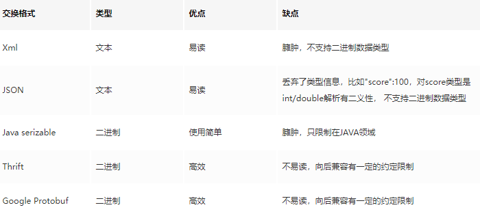

## 基本介绍

`Thrift`是一个**轻量级**、**跨语言**的**远程服务调用**框架，最初由`Facebook`开发，后面进入`Apache`开源项目。它通过自身的`IDL`**中间语言**, 并借助**代码生成引擎**生成各种主流语言的`RPC`**服务端**/**客户端**模板代码

## 使用案例

### 生成代码

### 服务端

```
public class SimpleServer {
    public static void main(String[] args) throws Exception {
        ServerSocket serverSocket = new ServerSocket(ServerConfig.SERVER_PORT);
        TServerSocket serverTransport = new TServerSocket(serverSocket);//设置传输协议
        HelloWorldService.Processor processor =
                new HelloWorldService.Processor<HelloWorldService.Iface>(new HelloWorldServiceImpl());//设置服务
        TBinaryProtocol.Factory protocolFactory = new TBinaryProtocol.Factory();//设置2进制序列化协议
        TSimpleServer.Args tArgs = new TSimpleServer.Args(serverTransport);
        tArgs.processor(processor);
        tArgs.protocolFactory(protocolFactory);

        // 简单的单线程服务模型 一般用于测试
        TServer tServer = new TSimpleServer(tArgs);//和网络模型绑定
        System.out.println("Running Simple Server");
        tServer.serve();//开启服务
    }
}
```

### 客户端

```
public class SimpleClient {
    public static void main(String[] args) {
        TTransport transport = null;
        try {
            transport = new TSocket(ServerConfig.SERVER_IP, ServerConfig.SERVER_PORT, ServerConfig.TIMEOUT);
            TProtocol protocol = new TBinaryProtocol(transport);
            HelloWorldService.Client client = new HelloWorldService.Client(protocol);
            transport.open();

            String result = client.say("Leo");
            System.out.println("Result =: " + result);
        } catch (TException e) {
            e.printStackTrace();
        } finally {
            if (null != transport) {
                transport.close();
            }
        }
    }
}
```

## 线程模型

**线程服务模型**分为阻塞式和非阻塞式线程模型。

* 阻塞式服务模型

  有两种：

  * TSimpleServer
  * TThreadPoolServer

* 非阻塞服务模型

  3种**非阻塞式服务模型**：

  * TNonblockingServer
  * THsHaServer
  * TThreadedSelectorServer

### TServer

参考：https://juejin.cn/post/6844903622384287751#heading-35

`TServer`定义了静态内部类`Args`，`Args`继承自抽象类`AbstractServerArgs`。`AbstractServerArgs`采用了建造者模式，向`TServer`提供各种工厂：

| 工厂属性               | 工厂类型          | 作用                                             |
| ---------------------- | ----------------- | ------------------------------------------------ |
| ProcessorFactory       | TProcessorFactory | 处理层工厂类，用于具体的TProcessor对象的创建     |
| InputTransportFactory  | TTransportFactory | 传输层输入工厂类，用于具体的TTransport对象的创建 |
| OutputTransportFactory | TTransportFactory | 传输层输出工厂类，用于具体的TTransport对象的创建 |
| InputProtocolFactory   | TProtocolFactory  | 协议层输入工厂类，用于具体的TProtocol对象的创建  |
| OutputProtocolFactory  | TProtocolFactory  | 协议层输出工厂类，用于具体的TProtocol对象的创建  |

`TServer`的**不同实现类**就代表不通过的线程模型。其中抽象方法service()表示启动服务。

### TSimpleServer

一次只能接收和处理一个`socket`连接

```
    public void serve() {
        try {
            this.serverTransport_.listen();
        } catch (TTransportException var9) {
            LOGGER.error("Error occurred during listening.", var9);
            return;
        }

        if (this.eventHandler_ != null) {
            this.eventHandler_.preServe();
        }

        this.setServing(true);

        while(!this.stopped_) {
            TTransport client = null;
            TProcessor processor = null;
            TTransport inputTransport = null;
            TTransport outputTransport = null;
            TProtocol inputProtocol = null;
            TProtocol outputProtocol = null;
            ServerContext connectionContext = null;

            try {
                client = this.serverTransport_.accept();
                if (client != null) {
                    processor = this.processorFactory_.getProcessor(client);
                    inputTransport = this.inputTransportFactory_.getTransport(client);
                    outputTransport = this.outputTransportFactory_.getTransport(client);
                    inputProtocol = this.inputProtocolFactory_.getProtocol(inputTransport);
                    outputProtocol = this.outputProtocolFactory_.getProtocol(outputTransport);
                    if (this.eventHandler_ != null) {
                        connectionContext = this.eventHandler_.createContext(inputProtocol, outputProtocol);
                    }

                    do {
                        if (this.eventHandler_ != null) {
                            this.eventHandler_.processContext(connectionContext, inputTransport, outputTransport);
                        }
                    } while(processor.process(inputProtocol, outputProtocol));
                }
            } catch (TTransportException var10) {
            } catch (TException var11) {
                if (!this.stopped_) {
                    LOGGER.error("Thrift error occurred during processing of message.", var11);
                }
            } catch (Exception var12) {
                if (!this.stopped_) {
                    LOGGER.error("Error occurred during processing of message.", var12);
                }
            }

            if (this.eventHandler_ != null) {
                this.eventHandler_.deleteContext(connectionContext, inputProtocol, outputProtocol);
            }

            if (inputTransport != null) {
                inputTransport.close();
            }

            if (outputTransport != null) {
                outputTransport.close();
            }
        }

        this.setServing(false);
    }
```


`serve()`方法的操作：

* 设置`TServerSocket`的`listen()`方法启动连接**监听**。
* 以**阻塞**的方式接受客户端地连接请求，每进入一个**连接**即为其创建一个通道`TTransport`对象。
* 为客户端创建**处理器对象**、**输入传输通道对象**、**输出传输通道对象**、**输入协议对象**和**输出协议对象**。
* 通过`TServerEventHandler`对象处理具体的业务请求。

### ThreadPoolServer

线程池处理请求，主线程负责**阻塞式**监听是否有新`socket`到来，具体的业务处理交由一个**线程池**来处理。

`ThreadPoolServer`解决了`TSimpleServer`不支持**并发**和**多连接**的问题，引入了**线程池**

```
  public void serve() {
    try {
      serverTransport_.listen();
    } catch (TTransportException ttx) {
      LOGGER.error("Error occurred during listening.", ttx);
      return;
    }

    // Run the preServe event
    if (eventHandler_ != null) {
      eventHandler_.preServe();
    }

    stopped_ = false;
    setServing(true);
    int failureCount = 0;
    while (!stopped_) {
      try {
        TTransport client = serverTransport_.accept();//阻塞
        WorkerProcess wp = new WorkerProcess(client);

        int retryCount = 0;
        long remainTimeInMillis = requestTimeoutUnit.toMillis(requestTimeout);
        while(true) {
          try {
            executorService_.execute(wp);//线程池处理业务
```

线程池处理业务，不需要等到前一个业务线程完成后再来处理下一个线程。

`serve()`方法的操作：

* 设置`TServerSocket`的`listen()`方法启动连接**监听**。
* 以**阻塞**的方式接受**客户端**的**连接请求**，每进入一个**连接**，将**通道对象**封装成一个`WorkerProcess`对象(`WorkerProcess`实现了`Runnabel`接口)，并提交到**线程池**。
* `WorkerProcess`的`run()`方法负责**业务处理**，为客户端创建了**处理器对象**、**输入传输通道对象**、**输出传输通道对象**、**输入协议对象**和**输出协议对象**。
* 通过`TServerEventHandler`对象处理具体的业务请求

**线程池模式**比较适合**服务器端**能预知最多有多少个**客户端并发**的情况，这时每个请求都能被业务线程池及时处理，性能也非常高。线程池模式的处理能力受限于**线程池**的工作能力，当**并发请求数**大于线程池中的**线程数**时，新请求也只能**排队等待**

### TNonblockingServer

多路复用模型。`TNonblockingServer`模式也是**单线程工作**，但是采用`NIO`的模式，借助`Channel/Selector`机制, 采用`IO`**事件模型**来处理。

所有的`socket`都被注册到`selector`中，在一个**线程**中通过`seletor`**循环监控**所有的`socket`。

每次`selector`循环结束时，处理所有的处于**就绪状态**的`socket`，对于有数据到来的`socket`进行**数据读取**操作，对于有数据发送的socket则进行**数据发送**操作，对于监听`socket`则产生一个新业务`socket`并将其**注册**到`selector`上。

**ps：TNonblockingServer要求底层的传输通道必须使用TFramedTransport**

```
    public void run() {
      try {
        if (eventHandler_ != null) {
          eventHandler_.preServe();
        }

        while (!stopped_) {//死循环
          select();
          processInterestChanges();
        }
        for (SelectionKey selectionKey : selector.keys()) {
          cleanupSelectionKey(selectionKey);
        }
      } catch (Throwable t) {
        LOGGER.error("run() exiting due to uncaught error", t);
      } finally {
        try {
          selector.close();
        } catch (IOException e) {
          LOGGER.error("Got an IOException while closing selector!", e);
        }
        stopped_ = true;
      }
    }
 
 private void select() {
      try {
        // wait for io events.
        selector.select();//select阻塞，有事件会继续执行

        // process the io events we received
        Iterator<SelectionKey> selectedKeys = selector.selectedKeys().iterator();
        while (!stopped_ && selectedKeys.hasNext()) {
          SelectionKey key = selectedKeys.next();
          selectedKeys.remove();

          // skip if not valid
          if (!key.isValid()) {
            cleanupSelectionKey(key);
            continue;
          }

          // if the key is marked Accept, then it has to be the server
          // transport.
          if (key.isAcceptable()) {
            handleAccept();//处理accept事件
          } else if (key.isReadable()) {
            // deal with reads
            handleRead(key);//处理读事件
          } else if (key.isWritable()) {
            // deal with writes
            handleWrite(key);//处理写事件
          } else {
            LOGGER.warn("Unexpected state in select! " + key.interestOps());
          }
        }
      } catch (IOException e) {
        LOGGER.warn("Got an IOException while selecting!", e);
      }
    }
```

```
  private void handleAccept() throws IOException {//新连接的事件会将这个socketchannel注册到selector上，以便接收读写
      SelectionKey clientKey = null;
      TNonblockingTransport client = null;
      try {
        // accept the connection
        client = (TNonblockingTransport)serverTransport.accept();
        clientKey = client.registerSelector(selector, SelectionKey.OP_READ);

        // add this key to the map
          FrameBuffer frameBuffer = createFrameBuffer(client, clientKey, SelectAcceptThread.this);

          clientKey.attach(frameBuffer);
      } catch (TTransportException tte) {
        // something went wrong accepting.
        LOGGER.warn("Exception trying to accept!", tte);
        tte.printStackTrace();
        if (clientKey != null) cleanupSelectionKey(clientKey);
        if (client != null) client.close();
      }
    }
  } // SelectAccep
```

读事件同理。

相比于`TSimpleServer`效率提升主要体现在`IO`**多路复用上**，`TNonblockingServer`采用**非阻塞**`IO`，对`accept/read/write`等`IO`事件进行**监控**和**处理**，同时监控多个`socket`的状态变化。

`TNonblockingServer`模式在**业务处理**上还是采用**单线程顺序**来完成。在业务处理比较**复杂**、**耗时**的时候，例如某些接口函数需要读取数据库执行时间较长，会导致**整个服务**被**阻塞**住，此时该模式**效率也不高**，因为**多个调用请求任务**依然是**顺序**一个接一个执行

### THsHaServer

`THsHaServer`继承于`TNonblockingServer`，引入了**线程池**提高了任务处理的**并发能力**。`THsHaServer`是**半同步半异步**(`Half-Sync/Half-Async`)的处理模式，`Half-Aysnc`用于`IO`**事件处理**(`Accept/Read/Write`)，`Half-Sync`用于业务`handler`对`rpc`的**同步处理**上。

同样的THsHaServer和TNonblockingServer一样，要求底层的传输通道必须使用TFramedTransport。

```
  public THsHaServer(Args args) {
    super(args);

    invoker = args.executorService == null ? createInvokerPool(args) : args.executorService;
    this.args = args;
  }
```

```
  protected static ExecutorService createInvokerPool(Args options) {
    int minWorkerThreads = options.minWorkerThreads;
    int maxWorkerThreads = options.maxWorkerThreads;
    int stopTimeoutVal = options.stopTimeoutVal;
    TimeUnit stopTimeoutUnit = options.stopTimeoutUnit;

    LinkedBlockingQueue<Runnable> queue = new LinkedBlockingQueue<Runnable>();
    ExecutorService invoker = new ThreadPoolExecutor(minWorkerThreads,
      maxWorkerThreads, stopTimeoutVal, stopTimeoutUnit, queue);

    return invoker;
  }
```

`THsHaServer`与`TNonblockingServer`模式相比，`THsHaServer`在完成**数据读取**之后，将**业务处理**过程交由一个**线程池**来完成，**主线程**直接返回进行**下一次循环**操作，效率大大提升。

**主线程**仍然需要完成所有`socket`的**监听接收**、**数据读取**和**数据写入**操作。当**并发请求数**较大时，且发送**数据量**较多时，监听`socket`上**新连接请求**不能被及时接受。

### TThreadedSelectorServer

`TThreadedSelectorServer`是对`THsHaServer`的一种扩充，它将`selector`中的**读写**`IO`**事件**(`read/write`)从**主线程**中分离出来。同时引入`worker`**工作线程池**，它也是种`Half-Sync/Half-Async`的服务模型。

`TThreadedSelectorServer`模式是目前`Thrift`提供的最高级的**线程服务模型**，它内部有如果几个部分构成：

* **一个**`AcceptThread`线程对象，专门用于处理监听`socket`上的新连接
* **若干个**`SelectorThread`对象专门用于处理业务`socket`的**网络**`I/O`**读写**操作，所有网络数据的**读写**均是有这些线程来完成
* 一个**负载均衡器**`SelectorThreadLoadBalancer`对象，主要用于`AcceptThread`**线程**接收到一个新`socket`连接请求时，决定将这个**新连接**请求分配给哪个`SelectorThread`**线程**
* 一个`ExecutorService`类型的**工作线程池**，在`SelectorThread`线程中，监听到有业务`socket`中有调用请求过来，则将**请求数据读取**之后，交给`ExecutorService`**线程池**中的线程完成此次调用的具体执行。主要用于处理每个`rpc`请求的`handler`**回调处理**(这部分是**同步的**)。

```
  // The thread handling all accepts
  private AcceptThread acceptThread;

  // Threads handling events on client transports
  private final Set<SelectorThread> selectorThreads = new HashSet<SelectorThread>();

  // This wraps all the functionality of queueing and thread pool management
  // for the passing of Invocations from the selector thread(s) to the workers
  // (if any).
  private final ExecutorService invoker;
```

* 一个专门的线程`AcceptThread`用于处理**新连接请求**，因此能够及时响应**大量并发连接请求**；
* 另外它将**网络I/O操作**分散到多个`SelectorThread`**线程**中来完成，因此能够快速对**网络**`I/O`进行**读写操作**，能够很好地应对**网络**`I/O`较多的情况。处。

```
public static class Args extends AbstractNonblockingServerArgs<Args> {

    /** The number of threads for selecting on already-accepted connections */
    public int selectorThreads = 2;
    /**
     * The size of the executor service (if none is specified) that will handle
     * invocations. This may be set to 0, in which case invocations will be
     * handled directly on the selector threads (as is in TNonblockingServer)
     */
    private int workerThreads = 5;
    /** Time to wait for server to stop gracefully */
    private int stopTimeoutVal = 60;
    private TimeUnit stopTimeoutUnit = TimeUnit.SECONDS;
    /** The ExecutorService for handling dispatched requests */
    private ExecutorService executorService = null;
    /**
     * The size of the blocking queue per selector thread for passing accepted
     * connections to the selector thread
     */
    private int acceptQueueSizePerThread = 4;

    /**
     * Determines the strategy for handling new accepted connections.
     */
    public static enum AcceptPolicy {
```

- 负责网络IO读写的selector默认线程数(selectorThreads)：2
- 负责业务处理的默认工作线程数(workerThreads)：5
- 工作线程池单个线程的任务队列大小(acceptQueueSizePerThread)：4

创建、初始化并启动`AcceptThread`和`SelectorThreads`，同时启动`selector`线程的**负载均衡器**(`selectorThreads`)。

```
  protected boolean startThreads() {
    try {
      for (int i = 0; i < args.selectorThreads; ++i) {
        selectorThreads.add(new SelectorThread(args.acceptQueueSizePerThread));
      }
      acceptThread = new AcceptThread((TNonblockingServerTransport) serverTransport_,
        createSelectorThreadLoadBalancer(selectorThreads));
      for (SelectorThread thread : selectorThreads) {
        thread.start();
      }
      acceptThread.start();
      return true;
    } catch (IOException e) {
      LOGGER.error("Failed to start threads!", e);
      return false;
    }
  }
```

#### AcceptThread

`AcceptThread`继承于`Thread`，可以看出包含三个重要的属性：**非阻塞式传输通道**(`TNonblockingServerTransport`)、`NIO`**选择器**(`acceptSelector`)和**选择器线程负载均衡器**(`threadChooser`)。

```
    public AcceptThread(TNonblockingServerTransport serverTransport,
        SelectorThreadLoadBalancer threadChooser) throws IOException {
      this.serverTransport = serverTransport;
      this.threadChooser = threadChooser;
      this.acceptSelector = SelectorProvider.provider().openSelector();
      this.serverTransport.registerSelector(acceptSelector);
    }
```

查看`AcceptThread`的`run()`方法，可以看出`accept`线程一旦启动，就会不停地调用`select()`方法：

```
 public void run() {
      try {
        if (eventHandler_ != null) {
          eventHandler_.preServe();
        }

        while (!stopped_) {
          select();
        }
      } catch (Throwable t) {
        LOGGER.error("run() on AcceptThread exiting due to uncaught error", t);
      } finally {
        try {
          acceptSelector.close();
        } catch (IOException e) {
          LOGGER.error("Got an IOException while closing accept selector!", e);
        }
        // This will wake up the selector threads
        TThreadedSelectorServer.this.stop();
      }
    }
```

查看`select()`方法，`acceptSelector`**选择器**等待`IO`事件的到来，拿到`SelectionKey`即检查是不是`accept`事件。如果是，通过`handleAccept()`方法接收一个**新来的连接**；否则，如果是`IO`**读写事件**，`AcceptThread`不作任何处理，交由`SelectorThread`完成。

```
  private void select() {
      try {
        // wait for connect events.
        acceptSelector.select();

        // process the io events we received
        Iterator<SelectionKey> selectedKeys = acceptSelector.selectedKeys().iterator();
        while (!stopped_ && selectedKeys.hasNext()) {
          SelectionKey key = selectedKeys.next();
          selectedKeys.remove();

          // skip if not valid
          if (!key.isValid()) {
            continue;
          }

          if (key.isAcceptable()) {
            handleAccept();
          } else {
            LOGGER.warn("Unexpected state in select! " + key.interestOps());
          }
        }
      } catch (IOException e) {
        LOGGER.warn("Got an IOException while selecting!", e);
      }
    }
```

在`handleAccept()`方法中，先通过`doAccept()`去拿**连接通道**，然后`Selector`**线程负载均衡器**选择一个`Selector`线程，完成接下来的`IO`**读写事件**。

```
    private void handleAccept() {
      final TNonblockingTransport client = doAccept();
      if (client != null) {
        // Pass this connection to a selector thread
        final SelectorThread targetThread = threadChooser.nextThread();

        if (args.acceptPolicy == Args.AcceptPolicy.FAST_ACCEPT || invoker == null) {
          doAddAccept(targetThread, client);
        } else {
          // FAIR_ACCEPT
          try {
            invoker.submit(new Runnable() {
              public void run() {
                doAddAccept(targetThread, client);
              }
            });
          } catch (RejectedExecutionException rx) {
            LOGGER.warn("ExecutorService rejected accept registration!", rx);
            // close immediately
            client.close();
          }
        }
      }
    }
```

`doAddAccept()`方法的实现，毫无悬念，它进一步调用了`SelectorThread`的`addAcceptedConnection()`方法，把**非阻塞传输通道对象**传递给**选择器线程**做进一步的`IO`**读写操作**，放到selectorthread持有的队列之中。

```
    private void doAddAccept(SelectorThread thread, TNonblockingTransport client) {
      if (!thread.addAcceptedConnection(client)) {
        client.close();
      }
    }
```

#### SelectorThreadLoadBalancer

```
  protected SelectorThreadLoadBalancer createSelectorThreadLoadBalancer(Collection<? extends SelectorThread> threads) {
    return new SelectorThreadLoadBalancer(threads);
  }
```

`SelectorThreadLoadBalancer`是一个基于**轮询算法**的`Selector`**线程选择器**，通过**线程迭代器**为新进来的**连接**顺序分配`SelectorThread`。

```
   public SelectorThread nextThread() {
      // Choose a selector thread (round robin)
      if (!nextThreadIterator.hasNext()) {
        nextThreadIterator = threads.iterator();
      }
      return nextThreadIterator.next();
    }
```

#### SelectorThread

`SelectorThread`和`AcceptThread`一样，是`TThreadedSelectorServer`的一个**成员内部类**，每个`SelectorThread`**线程对象**内部都有一个**阻塞式的队列**，用于存放该线程**被接收**的**连接通道**。

```
  protected class SelectorThread extends AbstractSelectThread {

    // Accepted connections added by the accept thread.
    private final BlockingQueue<TNonblockingTransport> acceptedQueue;
```

**阻塞队列**的大小可由构造函数指定：

```
public SelectorThread(int maxPendingAccepts) throws IOException {
  this(createDefaultAcceptQueue(maxPendingAccepts));
}
```

在`AcceptThread`的`doAddAccept()`方法中调用了`SelectorThread`的`addAcceptedConnection()`方法。

这个方法做了两件事：

* 将被此`SelectorThread`线程接收的**连接通道**放入**阻塞队列**中。

* 通过`wakeup()`方法唤醒`SelectorThread`中的`NIO`**选择器**`selector`。

```
public boolean addAcceptedConnection(TNonblockingTransport accepted) {
  try {
    acceptedQueue.put(accepted);
  } catch (InterruptedException e) {
    LOGGER.warn("Interrupted while adding accepted connection!", e);
    return false;
  }
  selector.wakeup();
  return true;
}
```

`SelectorThread`也是继承于`Thread`，查看其`run()`方法的实现

```
public void run() {
  try {
    while (!stopped_) {
      select();
      processAcceptedConnections();
      processInterestChanges();
    }
    for (SelectionKey selectionKey : selector.keys()) {
      cleanupSelectionKey(selectionKey);
    }
  } catch (Throwable t) {
    LOGGER.error("run() on SelectorThread exiting due to uncaught error", t);
  } finally {
    try {
      selector.close();
    } catch (IOException e) {
      LOGGER.error("Got an IOException while closing selector!", e);
    }
    // This will wake up the accept thread and the other selector threads
    TThreadedSelectorServer.this.stop();
  }
}
```

`SelectorThread`方法的`select()`监听`IO`事件，仅仅用于处理**数据读取**和**数据写入**。如果连接有**数据可读**，读取并以`frame`的方式缓存；如果需要向连接中**写入数据**，缓存并发送客户端的数据。且在**数据读写**处理完成后，需要向`NIO`的`selector`**清空**和**注销**自身的`SelectionKey`。

```
    private void select() {
      try {
        // wait for io events.
        selector.select();

        // process the io events we received
        Iterator<SelectionKey> selectedKeys = selector.selectedKeys().iterator();
        while (!stopped_ && selectedKeys.hasNext()) {
          SelectionKey key = selectedKeys.next();
          selectedKeys.remove();

          // skip if not valid
          if (!key.isValid()) {
            cleanupSelectionKey(key);
            continue;
          }

          if (key.isReadable()) {
            // deal with reads
            handleRead(key);
          } else if (key.isWritable()) {
            // deal with writes
            handleWrite(key);
          } else {
            LOGGER.warn("Unexpected state in select! " + key.interestOps());
          }
        }
      } catch (IOException e) {
        LOGGER.warn("Got an IOException while selecting!", e);
      }
    }
```


**数据写操作**完成以后，整个`rpc`调用过程也就结束了，`handleWrite()`方法如下

```
  protected void handleWrite(SelectionKey key) {
    FrameBuffer buffer = (FrameBuffer) key.attachment();
    if (!buffer.write()) {
      cleanupSelectionKey(key);
    }
  }

  /**
   * Do connection-close cleanup on a given SelectionKey.
   */
  protected void cleanupSelectionKey(SelectionKey key) {
    // remove the records from the two maps
    FrameBuffer buffer = (FrameBuffer) key.attachment();
    if (buffer != null) {
      // close the buffer
      buffer.close();
    }
    // cancel the selection key
    key.cancel();
  }
} // SelectThread
```

**数据读操作**完成以后，`Thrift`会利用**已读数据**执行**目标方法**，`handleRead()`方法如下

```
protected void handleRead(SelectionKey key) {
  FrameBuffer buffer = (FrameBuffer) key.attachment();
  if (!buffer.read()) {
    cleanupSelectionKey(key);
    return;
  }

  // if the buffer's frame read is complete, invoke the method.
  if (buffer.isFrameFullyRead()) {
    if (!requestInvoke(buffer)) {
      cleanupSelectionKey(key);
    }
  }
}
```

`handleRead`方法在执行`read()`方法，将**数据读取**完成后，会调用`requestInvoke()`方法调用**目标方法**完成具体业务处理。`requestInvoke()`方法将**请求数据**封装为一个`Runnable`对象，提交到**工作任务线程池**(`ExecutorService`)进行处理

```
protected boolean requestInvoke(FrameBuffer frameBuffer) {
  Runnable invocation = getRunnable(frameBuffer);
  if (invoker != null) {
    try {
      invoker.execute(invocation);
      return true;
    } catch (RejectedExecutionException rx) {
      LOGGER.warn("ExecutorService rejected execution!", rx);
      return false;
    }
  } else {
    // Invoke on the caller's thread
    invocation.run();
    return true;
  }
}
```

`select()`方法完成后，线程继续运行`processAcceptedConnections()`方法处理**下一个连接**的`IO`事件

```
private void processAcceptedConnections() {
  // Register accepted connections
  while (!stopped_) {
    TNonblockingTransport accepted = acceptedQueue.poll();
    if (accepted == null) {
      break;
    }
    registerAccepted(accepted);
  }
}
```

### 小结

* 尝试从`SelectorThread`的**阻塞队列**`acceptedQueue`中获取一个**连接的传输通道**。如果获取成功，调用`registerAccepted()`方法；否则，进入下一次循环。
* `registerAccepted()`方法将**传输通道**底层的**连接**注册到`NIO`的**选择器**`selector`上面，获取到一个`SelectionKey`。
* 创建一个`FrameBuffer`对象，并绑定到获取的`SelectionKey`上面，用于数据传输时的中间**读写缓存**

## 序列化

`Thrift`支持**二进制**，**压缩格式**，以及`json`格式数据的**序列化**和**反序列化**

### 序列化分类

**数据交换格式**可以分为如下几类：

* 自解析型

  序列化的数据包含**完整**的结构， 包含了`field`**名称**和`value`**值**。比如`xml/json/java serizable`，大百度的`mcpack/compack`，都属于此类。即调整不同属性的**顺序**对**序列化/反序列化**不造成影响。

* 半解析型

  序列化的数据，丢弃了部分信息， 比如`field`名称， 但引入了`index`(常常是`id`+`type`的方式)来对应具体**属性**和**值**。这方面的代表有`google protobuf/thrift`也属于此类。

* 无解析型

  传说中大百度的`infpack`实现，就是借助该种方式来实现，丢弃了很多**有效信息**，**性能/压缩**比最好，不过向后兼容需要开发做一定的工作

 

### 数据类型

* 基本类型

* 结构体类型

  **struct**: 定义的结构体对象

*  容器类型

  **list**: 有序元素列表  

  **set**: 无序无重复元素集合  

  **map**: 有序的key/value集合

* 异常类型 

  exception: 异常类型

* 服务类型

  **service**: 具体对应服务的类。

### 序列化协议

`Thrift`可以让用户选择**客户端**与**服务端**之间**传输通信协议**的类别，在**传输协议**上总体划分为**文本**(`text`)和**二进制**(`binary`)传输协议。为**节约带宽**，**提高传输效率**，一般情况下使用**二进制**类型的传输协议为多数，有时还会使用基于**文本类型**的协议，这需要根据项目/产品中的实际需求。常用协议有以下几种：

- TBinaryProtocol：**二进制**编码格式进行数据传输
- TCompactProtocol：**高效率**的、**密集**的**二进制**编码格式进行数据传输
- TJSONProtocol： 使用`JSON`**文本**的数据编码协议进行数据传输
- TSimpleJSONProtocol：只提供`JSON`**只写**的协议，适用于通过**脚本语言解析**

### 序列化示例

 首先编写一个简单的`thrift`文件`pair.thrift`：

```c
struct Pair {
    1: required string key
    2: required string value
}
```

编译并生成`java`源代码：

```arduino
thrift -gen java pair.thrift
```

编写序列化和反序列化的测试代码：

序列化测试，将`Pair`对象写入文件中

```arduino
private static void writeData() throws IOException， TException {
    Pair pair = new Pair();
    pair.setKey("key1").setValue("value1");
    FileOutputStream fos = new FileOutputStream(new File("pair.txt"));
    pair.write(new TBinaryProtocol(new TIOStreamTransport(fos)));
    fos.close();
}
```

反序列化测试，从文件中解析生成`Pair`对象

```
private static void readData() throws TException， IOException {
    Pair pair = new Pair();
    FileInputStream fis = new FileInputStream(new File("pair.txt"));
    pair.read(new TBinaryProtocol(new TIOStreamTransport(fis)));
    System.out.println("key => " + pair.getKey());
    System.out.println("value => " + pair.getValue());
    fis.close();
}
```

### Thrift协议源码

#### writeData()分析

首先查看`thrift`的**序列化机制**，即数据写入实现，这里采用**二进制协议**`TBinaryProtocol`，切入点为`pair.write(TProtocol)`：


查看`scheme()`方法，决定采用**元组计划**(`TupleScheme`)还是**标准计划**(`StandardScheme`)来实现序列化，默认采用的是**标准计划**`StandardScheme`。


**标准计划**(`StandardScheme`)下的`write()`方法：


这里完成了几步操作：

(a). 根据`Thrift IDL`文件中定义了`required`的字段验证字段是否正确赋值。

```csharp
public void validate() throws org.apache.thrift.TException {
  // check for required fields
  if (key == null) {
    throw new org.apache.thrift.protocol.TProtocolException("Required field 'key' was not present! Struct: " + toString());
  }
  if (value == null) {
    throw new org.apache.thrift.protocol.TProtocolException("Required field 'value' was not present! Struct: " + toString());
  }
}
复制代码
```

(b). 通过`writeStructBegin()`记录**写入结构**的**开始标记**。

```arduino
public void writeStructBegin(TStruct struct) {}
复制代码
```

(c). 逐一写入`Pair`对象的各个字段，包括字段**字段开始标记**、**字段的值**和**字段结束标记**。

```scss
if (struct.key != null) {
  oprot.writeFieldBegin(KEY_FIELD_DESC);
  oprot.writeString(struct.key);
  oprot.writeFieldEnd();
}
// 省略...
复制代码
```

(1). 首先是**字段开始标记**，包括`type`和`field-id`。`type`是字段的**数据类型的标识号**，`field-id`是`Thrift IDL`定义的**字段次序**，比如说`key`为1，`value`为2。

```scss
public void writeFieldBegin(TField field) throws TException {
  writeByte(field.type);
  writeI16(field.id);
}
复制代码
```

`Thrift`提供了`TType`，对不同的**数据类型**(`type`)提供了唯一标识的`typeID`。

```java
public final class TType {
    public static final byte STOP   = 0;   // 数据读写完成
    public static final byte VOID   = 1;   // 空值
    public static final byte BOOL   = 2;   // 布尔值
    public static final byte BYTE   = 3;   // 字节
    public static final byte DOUBLE = 4;   // 双精度浮点型
    public static final byte I16    = 6;   // 短整型
    public static final byte I32    = 8;   // 整型
    public static final byte I64    = 10;  // 长整型
    public static final byte STRING = 11;  // 字符串类型
    public static final byte STRUCT = 12;  // 引用类型
    public static final byte MAP    = 13;  // Map
    public static final byte SET    = 14;  // 集合
    public static final byte LIST   = 15;  // 列表
    public static final byte ENUM   = 16;  // 枚举
}
复制代码
```

(2). 然后是写入**字段的值**，根据字段的数据类型又归纳为以下实现：`writeByte()`、`writeBool()`、`writeI32()`、`writeI64()`、`writeDouble()`、`writeString()`和`writeBinary()`方法。

`TBinaryProtocol`通过一个长度为`8`的`byte`字节数组缓存**写入**或**读取**的临时字节数据。

```arduino
private final byte[] inoutTemp = new byte[8];
复制代码
```

> **常识1：**16进制的介绍。以0x开始的数据表示16进制，0xff换成十进制为255。在16进制中，A、B、C、D、E、F这五个字母来分别表示10、11、12、13、14、15。

`16`**进制**变**十进制**：f表示15。第n位的权值为16的n次方，由右到左从0位起：0xff = 15*16^1 + 15*16^0 = 255 `16`**进制**变**二进制**再变**十进制**：0xff = 1111 1111 = 2^8 - 1 = 255

> **常识2：**位运算符的使用。>>表示代表右移符号，如：int i=15; i>>2的结果是3，移出的部分将被抛弃。而<<表示左移符号，与>>刚好相反。

转为**二进制**的形式可能更好理解，0000 1111(15)右移2位的结果是0000 0011(3)，0001 1010(18)右移3位的结果是0000 0011(3)。

- **writeByte()**：写入**单个字节**数据。

```java
public void writeByte(byte b) throws TException {
  inoutTemp[0] = b;
  trans_.write(inoutTemp， 0， 1);
}
复制代码
```

- **writeBool()**：写入**布尔值**数据。

```java
public void writeBool(boolean b) throws TException {
  writeByte(b ? (byte)1 : (byte)0);
}
复制代码
```

- **writeI16()**：写入**短整型**`short`类型数据。

```scss
public void writeI16(short i16) throws TException {
  inoutTemp[0] = (byte)(0xff & (i16 >> 8));
  inoutTemp[1] = (byte)(0xff & (i16));
  trans_.write(inoutTemp， 0， 2);
}
复制代码
```

- **writeI32()**：写入**整型**`int`类型数据。

```scss
public void writeI32(int i32) throws TException {
  inoutTemp[0] = (byte)(0xff & (i32 >> 24));
  inoutTemp[1] = (byte)(0xff & (i32 >> 16));
  inoutTemp[2] = (byte)(0xff & (i32 >> 8));
  inoutTemp[3] = (byte)(0xff & (i32));
  trans_.write(inoutTemp， 0， 4);
}
复制代码
```

- **writeI64()**：写入**长整型**`long`类型数据。

```scss
public void writeI64(long i64) throws TException {
  inoutTemp[0] = (byte)(0xff & (i64 >> 56));
  inoutTemp[1] = (byte)(0xff & (i64 >> 48));
  inoutTemp[2] = (byte)(0xff & (i64 >> 40));
  inoutTemp[3] = (byte)(0xff & (i64 >> 32));
  inoutTemp[4] = (byte)(0xff & (i64 >> 24));
  inoutTemp[5] = (byte)(0xff & (i64 >> 16));
  inoutTemp[6] = (byte)(0xff & (i64 >> 8));
  inoutTemp[7] = (byte)(0xff & (i64));
  trans_.write(inoutTemp， 0， 8);
}
复制代码
```

- **writeDouble()**：写入**双浮点型**`double`类型数据。

```java
public void writeDouble(double dub) throws TException {
  writeI64(Double.doubleToLongBits(dub));
}
复制代码
```

- **writeString()**：写入**字符串类型**，这里先写入**字符串长度**，再写入**字符串内容**。

```java
public void writeString(String str) throws TException {
  try {
    byte[] dat = str.getBytes("UTF-8");
    writeI32(dat.length);
    trans_.write(dat， 0， dat.length);
  } catch (UnsupportedEncodingException uex) {
    throw new TException("JVM DOES NOT SUPPORT UTF-8");
  }
}
复制代码
```

- **writeBinary**：写入**二进制数组**类型数据，这里数据输入是`NIO`中的`ByteBuffer`类型。

```scss
public void writeBinary(ByteBuffer bin) throws TException {
  int length = bin.limit() - bin.position();
  writeI32(length);
  trans_.write(bin.array()， bin.position() + bin.arrayOffset()， length);
}
复制代码
```

(3). 每个字段写入完成后，都需要记录**字段结束标记**。

```csharp
public void writeFieldEnd() {}
复制代码
```

(d). 当所有的字段都写入以后，需要记录**字段停止标记**。

```csharp
public void writeFieldStop() throws TException {
  writeByte(TType.STOP);
}
复制代码
```

(e). 当所有数据写入完成后，通过`writeStructEnd()`记录**写入结构**的**完成标记**。

```csharp
public void writeStructEnd() {}
复制代码
```

#### readData()分析

查看`thrift`的**反序列化机制**，即**数据读取**实现，同样采用**二进制协议**`TBinaryProtocol`，切入点为`pair.read(TProtocol)`：


**数据读取**和**数据写入**一样，也是采用的**标准计划**`StandardScheme`。**标准计划**(`StandardScheme`)下的`read()`方法：


这里完成的几步操作：

(a). 通过`readStructBegin`读取**结构**的**开始标记**。

```ini
iprot.readStructBegin();
复制代码
```

(b). 循环读取**结构**中的**所有字段数据**到`Pair`对象中，直到读取到`org.apache.thrift.protocol.TType.STOP`为止。`iprot.readFieldBegin()`指明开始读取**下一个字段**的前需要读取**字段开始标记**。

```ini
while (true) {
  schemeField = iprot.readFieldBegin();
  if (schemeField.type == org.apache.thrift.protocol.TType.STOP) {
    break;
  }
  // 字段的读取，省略...
}
复制代码
```

(c). 根据`Thrift IDL`定义的`field-id`读取对应的字段，并赋值到`Pair`对象中，并设置`Pair`对象相应的字段为**已读状态**(前提：字段在`IDL`中被定义为`required`)。

```go
switch (schemeField.id) {
  case 1: // KEY
    if (schemeField.type == org.apache.thrift.protocol.TType.STRING) {
      struct.key = iprot.readString();
      struct.setKeyIsSet(true);
    } else {
      org.apache.thrift.protocol.TProtocolUtil.skip(iprot， schemeField.type);
    }
    break;
  case 2: // VALUE
    if (schemeField.type == org.apache.thrift.protocol.TType.STRING) {
      struct.value = iprot.readString();
      struct.setValueIsSet(true);
    } else {
      org.apache.thrift.protocol.TProtocolUtil.skip(iprot， schemeField.type);
    }
    break;
  default:
    org.apache.thrift.protocol.TProtocolUtil.skip(iprot， schemeField.type);
}
复制代码
```

关于**读取字段**的值，根据字段的**数据类型**也分为以下实现：`readByte()`、`readBool()`、`readI32()`、`readI64()`、`readDouble()`、`readString()`和`readBinary()`方法。

- **readByte()**：读取**单个字节**数据。

```scss
public byte readByte() throws TException {
  if (trans_.getBytesRemainingInBuffer() >= 1) {
    byte b = trans_.getBuffer()[trans_.getBufferPosition()];
    trans_.consumeBuffer(1);
    return b;
  }
  readAll(inoutTemp， 0， 1);
  return inoutTemp[0];
}
复制代码
```

- **readBool()**：读取**布尔值**数据。

```java
public boolean readBool() throws TException {
  return (readByte() == 1);
}
复制代码
```

- **readI16()**：读取**短整型**`short`类型数据。

```ini
public short readI16() throws TException {
  byte[] buf = inoutTemp;
  int off = 0;

  if (trans_.getBytesRemainingInBuffer() >= 2) {
    buf = trans_.getBuffer();
    off = trans_.getBufferPosition();
    trans_.consumeBuffer(2);
  } else {
    readAll(inoutTemp， 0， 2);
  }

  return (short) (((buf[off] & 0xff) << 8) |
                 ((buf[off+1] & 0xff)));
}
复制代码
```

- **readI32()**：读取**整型**`int`类型数据。

```ini
public int readI32() throws TException {
  byte[] buf = inoutTemp;
  int off = 0;

  if (trans_.getBytesRemainingInBuffer() >= 4) {
    buf = trans_.getBuffer();
    off = trans_.getBufferPosition();
    trans_.consumeBuffer(4);
  } else {
    readAll(inoutTemp， 0， 4);
  }
  return ((buf[off] & 0xff) << 24) |
         ((buf[off+1] & 0xff) << 16) |
         ((buf[off+2] & 0xff) <<  8) |
         ((buf[off+3] & 0xff));
}
复制代码
```

- **readI64()**：读取**长整型**`long`类型数据。

```scss
public long readI64() throws TException {
  byte[] buf = inoutTemp;
  int off = 0;

  if (trans_.getBytesRemainingInBuffer() >= 8) {
    buf = trans_.getBuffer();
    off = trans_.getBufferPosition();
    trans_.consumeBuffer(8);
  } else {
    readAll(inoutTemp， 0， 8);
  }

  return ((long)(buf[off]   & 0xff) << 56) |
         ((long)(buf[off+1] & 0xff) << 48) |
         ((long)(buf[off+2] & 0xff) << 40) |
         ((long)(buf[off+3] & 0xff) << 32) |
         ((long)(buf[off+4] & 0xff) << 24) |
         ((long)(buf[off+5] & 0xff) << 16) |
         ((long)(buf[off+6] & 0xff) <<  8) |
         ((long)(buf[off+7] & 0xff));
}
复制代码
```

- **readDouble()**：读取**双精度浮点**`double`类型数据。

```csharp
public double readDouble() throws TException {
  return Double.longBitsToDouble(readI64());
}
复制代码
```

- **readString()**：读取**字符串类型**的数据，首先读取并校验`4`字节的**字符串长度**，然后检查`NIO`**缓冲区**中是否有对应长度的字节**未消费**。如果有，直接从**缓冲区**中读取；否则，从**传输通道**中读取数据。

```arduino
public String readString() throws TException {
  int size = readI32();
  checkStringReadLength(size);

  if (trans_.getBytesRemainingInBuffer() >= size) {
    try {
      String s = new String(trans_.getBuffer()， trans_.getBufferPosition()， size， "UTF-8");
      trans_.consumeBuffer(size);
      return s;
    } catch (UnsupportedEncodingException e) {
      throw new TException("JVM DOES NOT SUPPORT UTF-8");
    }
  }

  return readStringBody(size);
}
复制代码
```

如果是从**传输通道**中读取数据，查看`readStringBody()`方法：

```arduino
public String readStringBody(int size) throws TException {
  try {
    byte[] buf = new byte[size];
    trans_.readAll(buf， 0， size);
    return new String(buf， "UTF-8");
  } catch (UnsupportedEncodingException uex) {
    throw new TException("JVM DOES NOT SUPPORT UTF-8");
  }
}
复制代码
```

- **readBinary()**：读取**二进制数组**类型数据，和**字符串读取**类似，返回一个`ByteBuffer`字节缓存对象。

```arduino
public ByteBuffer readBinary() throws TException {
  int size = readI32();
  checkStringReadLength(size);

  if (trans_.getBytesRemainingInBuffer() >= size) {
    ByteBuffer bb = ByteBuffer.wrap(trans_.getBuffer()， trans_.getBufferPosition()， size);
    trans_.consumeBuffer(size);
    return bb;
  }

  byte[] buf = new byte[size];
  trans_.readAll(buf， 0， size);
  return ByteBuffer.wrap(buf);
}
复制代码
```

(d). 每个字段数据读取完成后，都需要再读取一个**字段结束标记**。

```csharp
public void readFieldEnd() {}
复制代码
```

(e). 当所有字段读取完成后，需要通过`readStructEnd()`再读入一个**结构完成标记**。

```csharp
public void readStructEnd() {}
复制代码
```

(f). 读取结束后，同样需要校验在`Thrift IDL`中定义为`required`的字段是否为空，是否合法。

```csharp
public void validate() throws org.apache.thrift.TException {
  // check for required fields
  if (key == null) {
    throw new org.apache.thrift.protocol.TProtocolException("Required field 'key' was not present! Struct: " + toString());
  }
  if (value == null) {
    throw new org.apache.thrift.protocol.TProtocolException("Required field 'value' was not present! Struct: " + toString());
  }
}
```


作者：零壹技术栈
链接：https://juejin.cn/post/6844903622384287757
来源：稀土掘金
著作权归作者所有。商业转载请联系作者获得授权，非商业转载请注明出处。