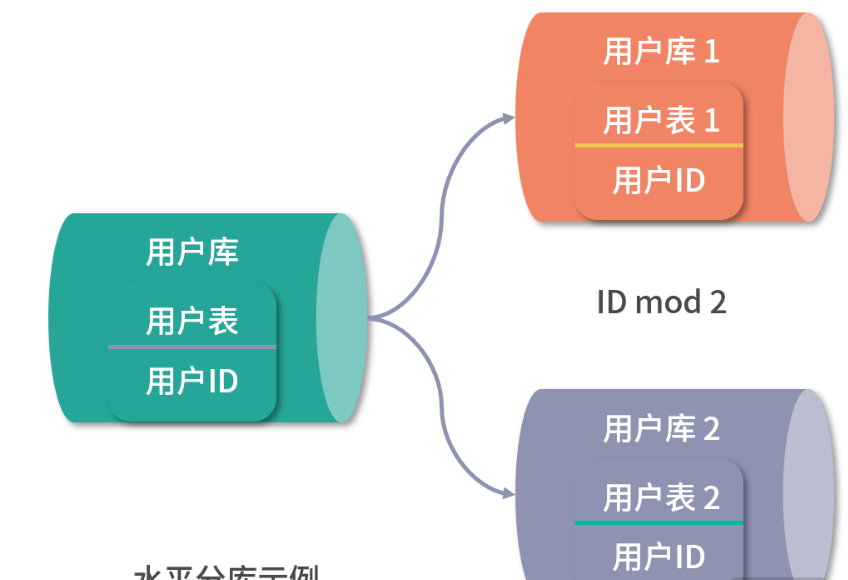
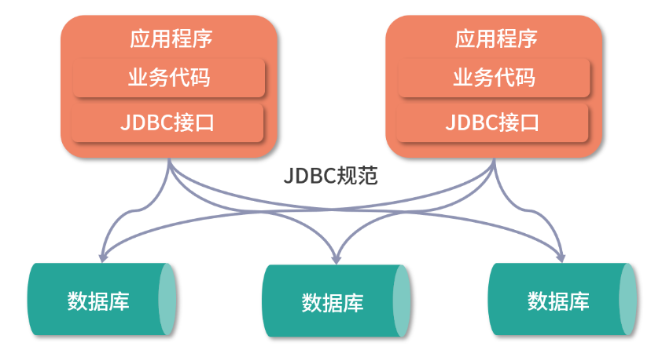
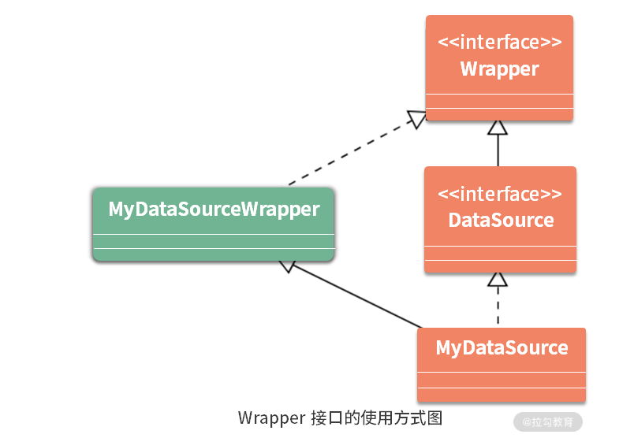
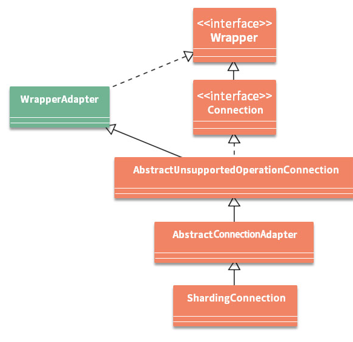

## 背景


### 数据存储演进

要想回答“如何让分库分表真正落地？”这个问题，我先从一个典型案例说起：试想在一个电商系统中存在订单表，系统在初始运行期间，一般使用单库和单表的方式来存储和访问数据。因为数据量不大，所以数据库访问的瓶颈并不明显。

随着业务的演进，当需要支撑大规模电商业务时，系统每天可能会生成数十万甚至上百万级别的订单数据，订单表的访问就会开始出现瓶颈。

以互联网系统中常用的 MySQL 数据库为例，虽然单表存储的数据原则上可以达到亿条级别，但此时访问性能会变得很差，即使采用各种调优策略，效果也通常微乎其微。业界普遍认为，MySQL 单表容量在 1 千万以下是一种最佳状态，一旦超过这个量级，就需要考虑采用其他方案了。

既然以 MySQL 为代表的关系型数据库中的单表无法支持大数据量的存储和访问方案，自然而然的，你可能会想到是否可以采用诸如 MongoDB 等 NoSQL 的方式来管理数据？

但这并不是一个很好的选项，原因有很多：一方面，**关系型生态系统非常完善**，关系型数据库经过几十年的持续发展，具有 NoSQL 无法比拟的稳定性和可靠性；另一方面，**关系型数据库的事务特性**，也是其他数据存储工具所不具备的一项核心功能。目前绝大部分公司的核心数据都存储在关系型数据库中，就互联网公司而言，MySQL 是主流的数据存储方案。

现在，我们选择了关系型数据库，就可以考虑采用分库分表的方案来解决单库表的瓶颈问题，这是目前互联网行业处理海量数据的通用方法。**分库分表方案更多的是对关系型数据库数据存储和访问机制的一种补充，而不是颠覆**。那么究竟什么是分库分表呢？


### 什么是数据分库分表

分库和分表是两个概念，但通常会把它们合在一起简称为分库分表。所谓分库分表，业界并没有一个统一的定义，你可以简单理解为：

> 为了解决由于数据量过大而导致的数据库性能降低的问题，将原来独立的数据库拆分成若干数据库，把原来数据量大的表拆分成若干数据表，使得单一数据库、单一数据表的数据量变得足够小，从而达到提升数据库性能的效果。

分库分表的表现形式也有很多种，一起来看一下

#### 分库分表的表现形式

分库分表包括分库和分表两个维度，在开发过程中，对于每个维度都可以采用两种拆分思路，即**垂直拆分**和**水平拆分**：

 

先来讨论垂直拆分的应用方式，相比水平拆分，垂直拆分相对比较容易理解和实现。在电商系统中，用户在打开首页时，往往会加载一些用户性别、地理位置等基础数据。对于用户表而言，这些位于首页的基础数据访问频率显然要比用户头像等数据更高。基于这两种数据的不同访问特性，可以把用户单表进行拆分，将访问频次低的用户头像等信息单独存放在一张表中，把访问频次较高的用户信息单独放在另一张表中：

 

从这里可以看到，**垂直分表的处理方式就是将一个表按照字段分成多张表，每个表存储其中一部分字段。** 在实现上，我们通常会把头像等 blob 类型的大字段数据或热度较低的数据放在一张独立的表中，将经常需要组合查询的列放在一张表中，这也可以认为是分表操作的一种表现形式。

通过垂直分表能得到一定程度的性能提升，但数据毕竟仍然位于同一个数据库中，也就是把操作范围限制在一台服务器上，每个表还是会竞争同一台服务器中的 CPU、内存、网络 IO 等资源。基于这个考虑，在有了垂直分表之后，就可以进一步引入垂直分库。

对于前面介绍的场景，分表之后的用户信息同样还是跟其他的商品、订单信息存放在同一台服务器中。基于垂直分库思想，这时候就可以把用户相关的数据表单独拆分出来，放在一个独立的数据库中。 

 


这样的效果就是垂直分库。从定义上讲，垂直分库是指按照业务将表进行分类，然后分布到不同的数据库上。然后，每个库可以位于不同的服务器上，其核心理念是**专库专用**。而从实现上讲，垂直分库很大程度上取决于业务的规划和系统边界的划分。比如说，用户数据的独立拆分就需要考虑到系统用户体系与其他业务模块之间的关联关系，而不是简单地创建一个用户库就可以了。在高并发场景下，垂直分库能够在一定程度上提升 IO 访问效率和数据库连接数，并降低单机硬件资源的瓶颈。

从前面的分析中我们不难明白，垂直拆分尽管实现起来比较简单，但并不能解决单表数据量过大这一核心问题。所以，现实中我们往往需要在垂直拆分的基础上添加水平拆分机制。例如，可以对用户库中的用户信息按照用户 ID 进行取模，然后分别存储在不同的数据库中，这就是水平分库的常见做法：

 

可以看到，水平分库是把同一个表的数据按一定规则拆分到不同的数据库中，每个库同样可以位于不同的服务器上。这种方案往往能解决单库存储量及性能瓶颈问题，但由于同一个表被分配在不同的数据库中，数据的访问需要额外的路由工作，因此大大提升了系统复杂度。这里所谓的规则实际上就是一系列的算法，常见的包括：

- **取模算法**，取模的方式有很多，比如前面介绍的按照用户 ID 进行取模，当然也可以通过表的一列或多列字段进行 hash 求值来取模；
- **范围限定算法**，范围限定也很常见，比如可以采用按年份、按时间等策略路由到目标数据库或表；
- **预定义算法**，是指事先规划好具体库或表的数量，然后直接路由到指定库或表中。

按照水平分库的思路，也可以对用户库中的用户表进行水平拆分，效果如下图所示。也就是说，**水平分表是在同一个数据库内，把同一个表的数据按一定规则拆到多个表中**。 

 

显然，系统的数据存储架构演变到现在已经非常复杂了。与拆分前的单库单表相比，现在面临着一系列具有挑战性的问题，比如：

- 如何对多数据库进行高效治理？
- 如何进行跨节点关联查询？
- 如何实现跨节点的分页和排序操作？
- 如何生成全局唯一的主键？
- 如何确保事务一致性？
- 如何对数据进行迁移？
- …

如果没有很好的工具来支持数据的存储和访问，数据一致性将很难得到保障，这就是以 ShardingSphere 为代表的分库分表中间件的价值所在。

#### 分库分表与读写分离

说到分库分表，我们不得不介绍另一个解决数据访问瓶颈的技术体系：**读写分离**，这个技术与数据库主从架构有关。我们知道像 MySQL 这样的数据库提供了完善的主从架构，能够确保主数据库与从数据库之间的数据同步。基于主从架构，就可以按照操作要求对读操作和写操作进行分离，从而提升访问效率。读写分离的基本原理是这样的：


 

可以看到图中的数据库集群中存在一个主库，也存在一个从库，主库和从库之间通过同步机制实现两者数据的一致性。在互联网系统中，普遍认为对数据库读操作的频率要远远高于写操作，所以瓶颈往往出现在读操作上。通过读写分离，就可以把读操作分离出来，在独立的从库上进行。现实中的主从架构，主库和从库的数量，尤其从库的数量都是可以根据数据量的大小进行扩充的。

**读写分离，主要解决的就是高并发下的数据库访问，也是一种常用的解决方案**。但是跟提升服务器配置一样，并不是终极解决方案。终极的解决方案还是前面介绍的分库分表，按照用户 ID 等规则来拆分库或拆分表。但是，请注意，分库分表与读写分离之间的关系并不是互斥的，而是可以相辅相成的，完全可以在分库分表的基础上引入读写分离机制： 

 


事实上，本课程所要介绍的 ShardingSphere 就实现了图中的架构方案，在分库分表的同时支持读写分离，在后续的课程中将会介绍如何实现这一过程。

### 分库分表解决方案和代表框架

基于前面关于分库分表的讨论，我们可以抽象其背后的一个核心概念，即**分片（Sharding）**。无论是分库还是分表，都是把数据划分成不同的数据片，并存储在不同的目标对象中。而具体的分片方式涉及实现分库分表的不同解决方案。

业界实际上也有不少关于分库分表的框架，这些框架显然并不是采用同一种解决方案。但通过分析这些框架在实现数据分片方案上的区别，也可以把它们分成三大类型，即客户端分片、代理服务器分片及分布式数据库。

#### 客户端分片

所谓客户端分片，相当于在数据库的客户端就实现了分片规则。显然，这种方式将分片处理的工作进行前置，客户端管理和维护着所有的分片逻辑，并决定每次 SQL 执行所对应的目标数据库和数据表。

客户端分片这一解决方案也有不同的表现形式，其中最为简单的方式就是**应用层分片**，也就是说在应用程序中直接维护着分片规则和分片逻辑：

 

在具体实现上，我们通常会将分片规则的处理逻辑打包成一个公共 JAR 包，其他业务开发人员只需要在代码工程中引入这个 JAR 包即可。针对这种方案，因为没有独立的服务器组件，所以也不需要专门维护某一个具体的中间件。然而，这种直接在业务代码中嵌入分片组件的方法也有明显的缺点：

- 一方面，由于分片逻辑侵入到了业务代码中，业务开发人员在理解业务的基础上还需要掌握分片规则的处理方式，增加了开发和维护成本；
- 另一方面，一旦出现问题，也只能依赖业务开发人员通过分析代码来找到原因，而无法把这部分工作抽离出来让专门的中间件团队进行完成。

基于以上分析，客户端分片在实现上通常会进一步抽象，把分片规则的管理工作从业务代码中剥离出来，形成单独演进的一套体系。这方面典型的设计思路是重写 JDBC 协议，也就是说在 JDBC 协议层面嵌入分片规则。这样，业务开发人员还是使用与 JDBC 规范完全兼容的一套 API 来操作数据库，但这套 API 的背后却自动完成了分片操作，从而实现了对业务代码的零侵入：

 

客户端分片结构：重写JDBC协议

这种解决方案的优势在于，分片操作对于业务而言是完全透明的，从而一定程度上实现业务开发人员与数据库中间件团队在职责上的分离。这样，业务开发人员只需要理解 JDBC 规范就可以完成分库分表，开发难度以及代码维护成本得到降低。

对于客户端分片，典型的中间件包括阿里巴巴的 TDDL 以及本课程将要介绍的 ShardingSphere。因为 TDDL 并没有开源，所以无法判断客户端分片的具体实现方案。而对于 ShardingSphere 而言，它是重写 JDBC 规范以实现客户端分片的典型实现框架。

#### 代理服务器分片

代理服务器分片的解决方案也比较明确，也就是采用了代理机制，在应用层和数据库层之间添加一个代理层。有了代理层之后，就可以把分片规则集中维护在这个代理层中，并对外提供与 JDBC 兼容的 API 给到应用层。这样，应用层的业务开发人员就不用关心具体的分片规则，而只需要完成业务逻辑的实现： 

 

显然，代理服务器分片的优点在于解放了业务开发人员对分片规则的管理工作，而缺点就是添加了一层代理层，所以天生具有代理机制所带来的一些问题，比方说因为新增了一层网络传输对性能所产生的影响。

对于代理服务器分片，常见的开源框架有阿里的 Cobar 以及民间开源社区的 MyCat。而在 ShardingSphere 3.X 版本中，也添加了 Sharding-Proxy 模块来实现代理服务器分片。

#### 分布式数据库

在技术发展和演进的过程中，关系型数据库的一大问题在于缺乏分布式特性，也就是说缺乏分布式环境下面对大数据量、高并发访问的有效数据处理机制。举例来说，我们知道事务是关系型数据库的本质特征之一，但在分布式环境下，如果想要基于 MySQL 等传统关系型数据库来实现事务将面临巨大的挑战。

幸好，以 TiDB 为代表的分布式数据库的兴起赋予了关系型数据库一定程度的分布式特性。在这些分布式数据库中，数据分片及分布式事务将是其内置的基础功能，对业务开发人员是透明的。业务开发人员只需要使用框架对外提供的 JDBC 接口，就像在使用 MySQL 等传统关系型数据库一样。

从这个角度讲，我们也可以认为 ShardingSphere 是一种分布式数据库中间件，它在提供标准化的数据分片解决方案之外，也实现了分布式事务和数据库治理功能。 

### 分库分表困境

想要实现支持海量数据存储和访问的分库分表架构，抛开业务层面的规划和设计，开发人员在技术实现层面也面临着一系列的问题，比如：

- **数据分片**：如何用最小的成本来实现关系型数据库的分库分表操作？
- **代理机制**：如何基于普通的客户端工具对分库分表架构下的数据进行访问？
- **分布式事务**：如何确保分布在不同数据库和表中同一份业务数据的一致性？
- **数据库治理**：如何确保分散在各个环境下的数据源和配置信息等数据库资源的一致性？

分布式数据库中间件 ShardingSphere 作为一个分库分表的“利器”，可以很好地解决这些痛点问题，并且相比其他分库分表框架（如 Cobar、MyCat 等）具有以下几点优势：

- **技术权威性**，是 Apache 基金会历史上第一个分布式数据库中间件项目，代表着这一领域的最新技术方向；
- **解决方案完备性**，它集客户端分片、代理服务器，以及分布式数据库的核心功能于一身，提供了一套适用于互联网应用架构、云服务架构的，完整的开源分布式数据库中间件解决方案和生态圈。
- **开发友好性**，提供了友好的集成方式，业务开发人员只需要引入一个 JAR 包就能在业务代码中嵌入数据分片、读写分离、分布式事务、数据库治理等一系列功能。
- **可插拔的系统扩展性**：它的很多核心功能均通过插件的形式提供，供开发者排列组合来定制属于自己的独特系统。

### 小结

从概念上讲，分库分表的基本原理和表现形式并不难理解，但在实现上却没有那么简单。因此，业界存在一批具有代表性的解决方案，包括客户端分片、代理服务器分片和分布式数据库。这些解决方案从不同的角度切入来满足分库分表的目标。在日常开发过程中，我们可以选择其中一种或多种方案。 而 ShardingSphere 同时具备客户端分片、代理机制以及分布式事务等功能特性，开发人员可以根据需要引入这些功能特性。

## ShardingSphere概述

### 整体模块

**基于 ShardingSphere 开源框架，介绍主流的分库分表解决方案和工程实践，是业界第一个全面介绍 ShardingSphere 核心功能和实现原理的体系化课程，填补了这块空白。**

- **第一部分：引入 ShardingSphere。** 这一部分将从如何正确理解分库分表架构讲起，引出 JDBC 规范与 ShardingSphere 的关系，并介绍如何基于 ShardingSphere 所提供的配置体系，给出在业务系统中使用 ShardingSphere 的多种具体方式。
- **第二部分：ShardingSphere 核心功能。** ShardingSphere 包含很多功能特性，这部分会给出数据分片、读写分离、分布式事务、数据脱敏、编排治理等核心功能的具体使用方法和开发技巧。

第三~六部分是课程的重点，从不同维度深入剖析 ShardingSphere 的内核架构，从源码级别给出分库分表的设计和实现机制，并且有助于你提升源码理解能力。

- **第三部分：ShardingSphere 源码解析之基础设施。** 这部分将围绕 ShardingSphere 的基础架构展开讨论，首先给你高效阅读 ShardingSphere 源码的方法，并介绍微内核架构和分布式主键的设计理念，以及在 ShardingSphere 的具体实现方法。
- **第四部分：ShardingSphere 源码解析之分片引擎。** 这部分内容将关注 ShardingSphere 最核心的分片引擎实现原理，从 SQL 的解析引擎开始，一路进行路由引擎、改写引擎、执行引擎、归并引擎等分片引擎中各个核心技术点的源码解析。
- **第五部分：ShardingSphere 源码解析之分布式事务。** 分布式事务是分布式数据库中间件的必备功能，ShardingSphere 内部也提供了对分布式事务的一种抽象。我将详细分析这种抽象过程，以及如何实现强一致性事务和柔性事务。
- **第六部分：ShardingSphere 源码解析之治理与集成。** 最后这部分内容将讨论如何基于改写引擎实现低侵入性数据脱敏方案、如何基于配置中心实现配置信息的动态化管理、如何基于注册中心实现数据库访问熔断机制、如何基于 Hook 机制以及 OpenTracing 协议实现数据访问链路跟踪等数据库治理方面的问题，我将给出这些问题背后的详细答案。

**PS:**

在 ShardingSphere 中，我们可以基于 ZooKeeper 提供的动态监听机制来判断某个数据库实例是否可用、是否需要对某个数据库实例进行数据访问熔断等操作，也可以使用 ZooKeeper 的这一功能特性来实现分布式环境下的配置信息动态管理。

随着对 ShardingSphere 的深入学习，你会发现类似的例子还有很多，包括基于 SPI 机制的微内核架构、基于雪花算法的分布式主键、基于 Apollo 的配置中心、基于 Nacos 的注册中心、基于 Seata 的柔性事务、基于 OpenTracing 规范的链路跟踪等。

而这些技术体系在 Dubbo、Spring Cloud 等主流开发框架中也多有体现。因此这个课程除了可以强化你对这些技术体系的系统化理解，还可以让你掌握这些技术体系的具体应用场景和实现方式，从而实现触类旁通。

### 发展史

说到 ShardingSphere 的起源，我们不得不提 Sharding-JDBC 框架，该框架是一款起源于当当网内部的应用框架，并于 2017 年初正式开源。从 Sharding-JDBC 到 Apache 顶级项目，ShardingSphere 的发展经历了不同的演进阶段。纵观整个 ShardingSphere 的发展历史，我们可以得到时间线与阶段性里程碑的演进过程图：

 

从版本发布角度，我们也可以进一步梳理 ShardingSphere 发展历程中主线版本与核心功能之间的演进关系图：

 

### 设计理念

对于一款开源中间件来说，要得到长足的发展，一方面依赖于社区的贡献，另外在很大程度上还取决于自身的设计和发展理念。

ShardingSphere 的定位非常明确，就是一种关系型数据库中间件，而并非一个全新的关系型数据库。ShardingSphere 认为，在当下，关系型数据库依然占有巨大市场，但凡涉及数据的持久化，关系型数据库仍然是系统的标准配置，也是各个公司核心业务的基石，在可预见的未来中，这点很难撼动。所以，**ShardingSphere 在当前阶段更加关注在原有基础上进行兼容和扩展，而非颠覆**。那么 ShardingSphere 是如何做到这一点呢？

ShardingSphere 构建了一个生态圈，这个生态圈由一套开源的分布式数据库中间件解决方案所构成。按照目前的规划，ShardingSphere 由 Sharding-JDBC、Sharding-Proxy 和 Sharding-Sidecar 这三款相互独立的产品组成，其中前两款已经正式发布，而 Sharding-Sidecar 正在规划中。我们可以从这三款产品出发，分析 ShardingSphere 的设计理念。

#### Sharding-JDBC

ShardingSphere 的前身是 Sharding-JDBC，所以这是整个框架中最为成熟的组件。Sharding-JDBC 的定位是一个轻量级 Java 框架，在 JDBC 层提供了扩展性服务。我们知道 JDBC 是一种开发规范，指定了 DataSource、Connection、Statement、PreparedStatement、ResultSet 等一系列接口。而各大数据库供应商通过实现这些接口提供了自身对 JDBC 规范的支持，使得 JDBC 规范成为 Java 领域中被广泛采用的数据库访问标准。

基于这一点，Sharding-JDBC 一开始的设计就完全兼容 JDBC 规范，Sharding-JDBC 对外暴露的一套分片操作接口与 JDBC 规范中所提供的接口完全一致。开发人员只需要了解 JDBC，就可以使用 Sharding-JDBC 来实现分库分表，Sharding-JDBC 内部屏蔽了所有的分片规则和处理逻辑的复杂性。显然，**这种方案天生就是一种具有高度兼容性的方案，能够为开发人员提供最简单、最直接的开发支持**。关于 Sharding-JDBC 与 JDBC 规范的兼容性话题，我们将会在下一课时中详细讨论。

 

Sharding-JDBC 与 JDBC 规范的兼容性示意图

在实际开发过程中，Sharding-JDBC 以 JAR 包的形式提供服务。**开发人员可以使用这个 JAR 包直连数据库，无需额外的部署和依赖管理**。在应用 Sharding-JDBC 时，需要注意到 Sharding-JDBC 背后依赖的是一套完整而强大的分片引擎：

 

由于 Sharding-JDBC 提供了一套与 JDBC 规范完全一致的 API，所以它可以很方便地与遵循 JDBC 规范的各种组件和框架进行无缝集成。例如，用于提供数据库连接的 DBCP、C3P0 等数据库连接池组件，以及用于提供对象-关系映射的 Hibernate、MyBatis 等 ORM 框架。当然，作为一款支持多数据库的开源框架，Sharding-JDBC 支持 MySQL、Oracle、SQLServer 等主流关系型数据库。

#### Sharding-Proxy

ShardingSphere 中的 Sharding-Proxy 组件定位为一个透明化的数据库代理端，所以它是代理服务器分片方案的一种具体实现方式。在代理方案的设计和实现上，Sharding-Proxy 同样充分考虑了兼容性。

Sharding-Proxy 所提供的兼容性首先体现在对异构语言的支持上，为了完成对异构语言的支持，Sharding-Proxy 专门对数据库二进制协议进行了封装，并提供了一个代理服务端组件。其次，从客户端组件上讲，针对目前市面上流行的 Navicat、MySQL Command Client 等客户端工具，Sharding-Proxy 也能够兼容遵循 MySQL 和 PostgreSQL 协议的各类访问客户端。当然，和 Sharding-JDBC 一样，Sharding-Proxy 也支持 MySQL 和 PostgreSQL 等多种数据库。

接下来，我们看一下 Sharding-Proxy 的整体架构。对于应用程序而言，这种代理机制是完全透明的，可以直接把它当作 MySQL 或 PostgreSQL 进行使用：

 

总结一下，我们可以直接把 Sharding-Proxy 视为一个数据库，用来代理后面分库分表的多个数据库，它屏蔽了后端多个数据库的复杂性。同时，也看到 Sharding-Proxy 的运行同样需要依赖于完成分片操作的分片引擎以及用于管理数据库的治理组件。

虽然 Sharding-JDBC 和 Sharding-Proxy 具有不同的关注点，但事实上，我们完全可以将它们整合在一起进行使用，也就是说这两个组件之间也存在兼容性。

前面已经介绍过，我们使用 Sharding-JDBC 的方式是在应用程序中直接嵌入 JAR 包，这种方式适合于业务开发人员。而 Sharding-Proxy 提供静态入口以及异构语言的支持，适用于需要对分片数据库进行管理的中间件开发和运维人员。基于底层共通的分片引擎，以及数据库治理功能，可以混合使用 Sharding-JDBC 和 Sharding-Proxy，以便应对不同的应用场景和不同的开发人员：

 

#### Sharding-Sidecar

Sidecar 设计模式受到了越来越多的关注和采用，这个模式的目标是把系统中各种异构的服务组件串联起来，并进行高效的服务治理。ShardingSphere 也基于该模式设计了 Sharding-Sidecar 组件。截止到目前，ShardingSphere 给出了 Sharding-Sidecar 的规划，但还没有提供具体的实现方案，这里不做具体展开。作为 Sidecar 模式的具体实现，我们可以想象 **Sharding-Sidecar**** 的作用就是以 Sidecar 的形式代理所有对数据库的访问**。这也是一种兼容性的设计思路，通过无中心、零侵入的方案将分布式的数据访问应用与数据库有机串联起来。

### 核心功能

绍完 ShardingSphere 的设计理念之后，我们再来关注它的核心功能和实现机制。这里把 ShardingSphere 的整体功能拆分成四大部分，即**基础设施**、**分片引擎**、**分布式事务**和**治理与集成**

#### 基础设施

作为一款开源框架，ShardingSphere 在架构上也提供了很多基础设施类的组件，这些组件更多与它的内部实现机制有关，我们将会在后续的源码解析部分详细展开讲解。但对开发人员而言，可以认为微内核架构和分布式主键是框架提供的基础设施类的核心功能。

- 微内核架构

ShardingSphere 在设计上采用了**微内核（MicroKernel）架构模式**，来确保系统具有高度可扩展性。微内核架构包含两部分组件，即内核系统和插件。使用微内核架构对系统进行升级，要做的只是用新插件替换旧插件，而不需要改变整个系统架构：

 

在 ShardingSphere 中，抽象了一大批插件接口，包含用实现 SQL 解析的 SQLParserEntry、用于实现配置中心的 ConfigCenter、用于数据脱敏的 ShardingEncryptor，以及用于数据库治理的注册中心接口 RegistryCenter 等。开发人员完全可以根据自己的需要，基于这些插件定义来提供定制化实现，并动态加载到 ShardingSphere 运行时环境中。

- 分布式主键

在本地数据库场景下，我们可以使用数据库自带的自增序列来完成主键的生成。但在分片场景下，我们将面对从本地数据库转换到分布式数据库的应用场景，这就需要考虑主键在各个数据库中的全局唯一性。为此，我们需要引入分布式主键机制。ShardingSphere 同样提供了分布式主键的实现机制，默认采用的是 SnowFlake（雪花）算法。

#### 分片引擎

对于分片引擎，ShardingSphere 同时支持数据分片和读写分离机制。

- 数据分片

数据分片是 ShardingSphere 的核心功能，常规的，基于垂直拆分和水平拆分的分库分表操作它都支持。同时，ShardingSphere 也预留了分片扩展点，开发人员也可以基于需要实现分片策略的定制化开发。

- 读写分离

在分库分表的基础上，ShardingSphere 也实现了基于数据库主从架构的读写分离机制。而且，这种读写分离机制可以和数据分片完美地进行整合。

#### 分布式事务

分布式事务是分布式环境下确保数据一致性的基本功能，作为分布式数据库的一种生态圈，ShardingSphere 也提供了对分布式事务的全面支持。

- 标准化事务处理接口

ShardingSphere 支持本地事务、基于 XA 两阶段提交的强一致性事务以及基于 BASE 的柔性最终一致性事务。同时，ShardingSphere 抽象了一组标准化的事务处理接口，并通过分片事务管理器 ShardingTransactionManager 进行统一管理。我们也可以根据需要实现自己的 ShardingTransactionManager 从而对分布式事务进行扩展。

- 强一致性事务与柔性事务

ShardingSphere 内置了一组分布式事务的实现方案，其中强一致性事务内置集成了 Atomikos、Narayana 和 Bitronix 等技术来实现 XA 事务管理器；另一方面，ShardingSphere 内部也整合了 Seata 来提供柔性事务功能。

#### 治理与集成

对于分布式数据库而言，治理的范畴可以很广，ShardingSphere 也提供了注册中心、配置中心等一系列功能来支持数据库治理。另一方面，ShardingSphere 作为一款支持快速开发的开源框架，也完成了与其他主流框架的无缝集成。

- 数据脱敏

数据脱敏是确保数据访问安全的常见需求，通常做法是对原始的 SQL 进行改写，从而实现对原文数据进行加密。当我们想要获取原始数据时，在实现上就需要通过对数据库中所存储的密文数据进行解密才能完成。我们可以根据需要实现一套类似的加解密机制，但 ShardingSphere 的强大之处在于，**它将这套机制内嵌到了 SQL 的执行过程中，业务开发人员不需要关注具体的加解密实现细节，而只要通过简单的配置就能实现数据的自动脱敏。**

- 配置中心

关于配置信息的管理，我们可以基于 YAML 格式或 XML 格式的配置文件完成配置信息的维护，这在 ShardingSphere 中都得到了支持。更进一步，在 ShardingSphere 中，它还提供了配置信息动态化的管理机制，可以支持数据源、表与分片及读写分离策略的动态切换。

- 注册中心

相较配置中心，注册中心在 ShardingSphere 中的应用更为广泛。ShardingSphere 中的注册中心提供了基于 Nacos 和 ZooKeeper 的两种实现方式。而在应用场景上，我们可以基于注册中心完成数据库实例管理、数据库熔断禁用等治理功能。

- 链路跟踪

SQL 解析与 SQL 执行是数据分片的最核心步骤，ShardingSphere 在完成这两个步骤的同时，也会将运行时的数据通过标准协议提交到链路跟踪系统。ShardingSphere 使用 OpenTracing API 发送性能追踪数据。像 SkyWalking、Zipkin 和 Jaeger 等面向 OpenTracing 协议的具体产品都可以和 ShardingSphere 自动完成对接。

- 系统集成

这里所谓的系统集成，指的是 ShardingSphere 和 Spring 系列框架的集成。到目前为止，ShardingSphere 实现了两种系统的集成机制，一种是命名空间机制，即通过扩展 Spring Schema 来实现与 Spring 框架的集成；而另一种则是通过编写自定义的 starter 组件来完成与 Spring Boot 的集成。这样，无论开发人员采用哪一种 Spring 框架，对于使用 ShardingSphere 而言都是零学习成本。

## ShardingSphere与JDBC 规范

我们知道 ShardingSphere 是一种典型的客户端分片解决方案，而客户端分片的实现方式之一就是重写 JDBC 规范。在上一课时中，我们也介绍了，ShardingSphere 在设计上从一开始就完全兼容 JDBC 规范，ShardingSphere 对外暴露的一套分片操作接口与 JDBC 规范中所提供的接口完全一致。

讲到这里，你可能会觉得有点神奇，**ShardingSphere 究竟是通过什么方式，实现了与 JDBC 规范完全兼容的 API 来提供分片功能呢？**

这个问题非常重要，值得我们专门花一个课时的内容来进行分析和讲解。可以说，**理解 JDBC 规范以及 ShardingSphere 对 JDBC 规范的重写方式，是正确使用 ShardingSphere 实现数据分片的前提**。今天，我们就深入讨论 JDBC 规范与 ShardingSphere 的这层关系，帮你从底层设计上解开其中的神奇之处。

### JDBC 规范简介

ShardingSphere 提供了与 JDBC 规范完全兼容的实现过程，在对这一过程进行详细展开之前，先来回顾一下 JDBC 规范。**JDBC（Java Database Connectivity）的设计初衷是提供一套用于各种数据库的统一标准**，而不同的数据库厂家共同遵守这套标准，并提供各自的实现方案供应用程序调用。作为统一标准，JDBC 规范具有完整的架构体系，如下图所示：

 

JDBC 架构中的 Driver Manager 负责加载各种不同的驱动程序（Driver），并根据不同的请求，向调用者返回相应的数据库连接（Connection）。而应用程序通过调用 JDBC API 来实现对数据库的操作。**对于开发人员而言，JDBC API 是我们访问数据库的主要途径，也是 ShardingSphere 重写 JDBC 规范并添加分片功能的入口**。如果我们使用 JDBC 开发一个访问数据库的处理流程，常见的代码风格如下所示：

```
// 创建池化的数据源
PooledDataSource dataSource = new PooledDataSource ();
// 设置MySQL Driver
dataSource.setDriver ("com.mysql.jdbc.Driver");
// 设置数据库URL、用户名和密码
dataSource.setUrl ("jdbc:mysql://localhost:3306/test");
dataSource.setUsername ("root");
dataSource.setPassword ("root");
// 获取连接
Connection connection = dataSource.getConnection();
// 执行查询
PreparedStatement statement = connection.prepareStatement ("select * from user");
// 获取查询结果应该处理
ResultSet resultSet = statement.executeQuery();
while (resultSet.next()) {
	…
}
// 关闭资源
statement.close();
resultSet.close();
connection.close();
```

这段代码中包含了 JDBC API 中的核心接口，使用这些核心接口是我们基于 JDBC 进行数据访问的基本方式，这里有必要对这些接口的作用和使用方法做一些展开。事实上，随着课程内容的不断演进，你会发现在 ShardingSphere 中，完成日常开发所使用的也就是这些接口。

#### DataSource

DataSource 在 JDBC 规范中代表的是一种数据源，核心作用是获取数据库连接对象 Connection。在 JDBC 规范中，实际可以直接通过 DriverManager 获取 Connection。我们知道获取 Connection 的过程需要建立与数据库之间的连接，而这个过程会产生较大的系统开销。

为了提高性能，通常会建立一个中间层，该中间层将 DriverManager 生成的 Connection 存放到连接池中，然后从池中获取 Connection，可以认为，DataSource 就是这样一个中间层。在日常开发过程中，我们通常都会基于 DataSource 来获取 Connection。而在 ShardingSphere 中，暴露给业务开发人员的同样是一个经过增强的 DataSource 对象。DataSource 接口的定义是这样的：

```java
public interface DataSource  extends CommonDataSource, Wrapper {
  Connection getConnection() throws SQLException; 
  Connection getConnection(String username, String password)
    throws SQLException;
}
```

可以看到，DataSource 接口提供了两个获取 Connection 的重载方法，并继承了 CommonDataSource 接口，该接口是 JDBC 中关于数据源定义的根接口。除了 DataSource 接口之外，它还有两个子接口：

 

其中，DataSource 是官方定义的获取 Connection 的基础接口，ConnectionPoolDataSource 是从连接池 ConnectionPool 中获取的 Connection 接口。而 XADataSource 则用来实现在分布式事务环境下获取 Connection，我们在讨论 ShardingSphere 的分布式事务时会接触到这个接口。

**请注意，DataSource 接口同时还继承了一个 Wrapper 接口**。从接口的命名上看，可以判断该接口应该起到一种包装器的作用，事实上，由于很多数据库供应商提供了超越标准 JDBC API 的扩展功能，所以，Wrapper 接口可以把一个由第三方供应商提供的、非 JDBC 标准的接口包装成标准接口。以 DataSource 接口为例，如果我们想要实现自己的数据源 MyDataSource，就可以提供一个实现了 Wrapper 接口的 MyDataSourceWrapper 类来完成包装和适配： 

 

在 JDBC 规范中，除了 DataSource 之外，Connection、Statement、ResultSet 等核心对象也都继承了这个接口。显然，ShardingSphere 提供的就是非 JDBC 标准的接口，所以也应该会用到这个 Wrapper 接口，并提供了类似的实现方案。

#### Connection

DataSource 的目的是获取 Connection 对象，我们可以把 Connection 理解为一种**会话（Session）机制**。Connection 代表一个数据库连接，负责完成与数据库之间的通信。所有 SQL 的执行都是在某个特定 Connection 环境中进行的，同时它还提供了一组重载方法，分别用于创建 Statement 和 PreparedStatement。另一方面，Connection 也涉及事务相关的操作，为了实现分片操作，ShardingSphere 同样也实现了定制化的 Connection 类 ShardingConnection。

#### Statement

JDBC 规范中的 Statement 存在两种类型，一种是**普通的 Statement**，一种是**支持预编译的 PreparedStatement**。所谓预编译，是指数据库的编译器会对 SQL 语句提前编译，然后将预编译的结果缓存到数据库中，这样下次执行时就可以替换参数并直接使用编译过的语句，从而提高 SQL 的执行效率。当然，这种预编译也需要成本，所以在日常开发中，对数据库只执行一次性读写操作时，用 Statement 对象进行处理比较合适；而当涉及 SQL 语句的多次执行时，可以使用 PreparedStatement。

如果需要查询数据库中的数据，只需要调用 Statement 或 PreparedStatement 对象的 executeQuery 方法即可，该方法以 SQL 语句作为参数，执行完后返回一个 JDBC 的 ResultSet 对象。当然，Statement 或 PreparedStatement 中提供了一大批执行 SQL 更新和查询的重载方法。在 ShardingSphere 中，同样也提供了 ShardingStatement 和 ShardingPreparedStatement 这两个支持分片操作的 Statement 对象。

#### ResultSet

一旦通过 Statement 或 PreparedStatement 执行了 SQL 语句并获得了 ResultSet 对象后，那么就可以通过调用 Resulset 对象中的 next() 方法遍历整个结果集。如果 next() 方法返回为 true，就意味结果集中存在数据，则可以调用 ResultSet 对象的一系列 getXXX() 方法来取得对应的结果值。对于分库分表操作而言，因为涉及从多个数据库或数据表中获取目标数据，势必需要对获取的结果进行归并。因此，ShardingSphere 中也提供了分片环境下的 ShardingResultSet 对象。

作为总结，我们梳理了基于 JDBC 规范进行数据库访问的开发流程图，如下图所示：

 

ShardingSphere 提供了与 JDBC 规范完全兼容的 API。也就是说，开发人员可以基于这个开发流程和 JDBC 中的核心接口完成分片引擎、数据脱敏等操作，我们来看一下。

### JDBC重写

#### 适配器模式

在 ShardingSphere 中，实现与 JDBC 规范兼容性的基本策略就是采用了设计模式中的适配器模式（Adapter Pattern）。**适配器模式通常被用作连接两个不兼容接口之间的桥梁，涉及为某一个接口加入独立的或不兼容的功能。**

作为一套适配 JDBC 规范的实现方案，ShardingSphere 需要对上面介绍的 JDBC API 中的 DataSource、Connection、Statement 及 ResultSet 等核心对象都完成重写。虽然这些对象承载着不同功能，但重写机制应该是共通的，否则就需要对不同对象都实现定制化开发，显然，这不符合我们的设计原则。为此，ShardingSphere 抽象并开发了一套基于适配器模式的实现方案，整体结构是这样的，如下图所示：

 

首先，我们看到这里有一个 JdbcObject 接口，这个接口泛指 JDBC API 中的 DataSource、Connection、Statement 等核心接口。前面提到，这些接口都继承自包装器 Wrapper 接口。ShardingSphere 为这个 Wrapper 接口提供了一个实现类 WrapperAdapter，这点在图中得到了展示。在 ShardingSphere 代码工程 sharding-jdbc-core 的 org.apache.shardingsphere.shardingjdbc.jdbc.adapter 包中包含了所有与 Adapter 相关的实现类：

 

在 ShardingSphere 基于适配器模式的实现方案图的底部，有一个 ShardingJdbcObject 类的定义。这个类也是一种泛指，代表 ShardingSphere 中用于分片的 ShardingDataSource、ShardingConnection、ShardingStatement 等对象。

最后发现 ShardingJdbcObject 继承自一个 AbstractJdbcObjectAdapter，而 AbstractJdbcObjectAdapter 又继承自 AbstractUnsupportedOperationJdbcObject，这两个类都是抽象类，而且也都泛指一组类。两者的区别在于，AbstractJdbcObjectAdapter 只提供了针对 JdbcObject 接口的一部分实现方法，这些方法是我们完成分片操作所需要的。而对于那些我们不需要的方法实现，则全部交由 AbstractUnsupportedOperationJdbcObject 进行实现，这两个类的所有方法的合集，就是原有 JdbcObject 接口的所有方法定义。

这样，我们大致了解了 ShardingSphere 对 JDBC 规范中核心接口的重写机制。这个重写机制非常重要，在 ShardingSphere 中应用也很广泛，我们可以通过示例对这一机制做进一步理解。

#### ShardingConnection

通过前面的介绍，我们知道 ShardingSphere 的分片引擎中提供了一系列 ShardingJdbcObject 来支持分片操作，包括 ShardingDataSource、ShardingConnection、ShardingStatement、ShardingPreparedStament 等。这里以最具代表性的 ShardingConnection 为例，来讲解它的实现过程。请注意，今天我们关注的还是重写机制，不会对 ShardingConnection 中的具体功能以及与其他类之间的交互过程做过多展开讲解。

* ShardingConnection 类层结构

  ShardingConnection 是对 JDBC 中 Connection 的适配和包装，所以它需要提供 Connection 接口中定义的方法，包括 createConnection、getMetaData、各种重载的 prepareStatement 和 createStatement 以及针对事务的 setAutoCommit、commit 和 rollback 方法等。ShardingConnection 对这些方法都进行了重写，如下图所示：

     

  ShardingConnection 中的方法列表图

  ShardingConnection 类的一条类层结构支线就是适配器模式的具体应用，这部分内容的类层结构与前面介绍的重写机制的类层结构是完全一致的，如下图所示： 

   

  

* #### AbstractConnectionAdapter

  我们首先来看看 AbstractConnectionAdapter 抽象类，ShardingConnection 直接继承了它。在 AbstractConnectionAdapter 中发现了一个 cachedConnections 属性，它是一个 Map 对象，该对象其实缓存了这个经过封装的 ShardingConnection 背后真实的 Connection 对象。如果我们对一个 AbstractConnectionAdapter 重复使用，那么这些 cachedConnections 也会一直被缓存，直到调用 close 方法。可以从 AbstractConnectionAdapter 的 getConnections 方法中理解具体的操作过程：

  ```java
  public final List<Connection> getConnections(final ConnectionMode connectionMode, final String dataSourceName, final int connectionSize) throws SQLException {
          //获取DataSource
          DataSource dataSource = getDataSourceMap().get(dataSourceName);
          Preconditions.checkState(null != dataSource, "Missing the data source name: '%s'", dataSourceName);
          Collection<Connection> connections;
  
          //根据数据源从cachedConnections中获取connections
          synchronized (cachedConnections) {
              connections = cachedConnections.get(dataSourceName);
          }
  
          //如果connections多于想要的connectionSize，则只获取所需部分
          List<Connection> result;
          if (connections.size() >= connectionSize) {
              result = new ArrayList<>(connections).subList(0, connectionSize);
          } else if (!connections.isEmpty()) {//如果connections不够
              result = new ArrayList<>(connectionSize);
              result.addAll(connections);
              //创建新的connections
              List<Connection> newConnections = createConnections(dataSourceName, connectionMode, dataSource, connectionSize - connections.size());
              result.addAll(newConnections);
              synchronized (cachedConnections) {
                  //将新创建的connections也放入缓存中进行管理
                  cachedConnections.putAll(dataSourceName, newConnections);
              }
          } else {//如果缓存中没有对应dataSource的Connections，同样进行创建并放入缓存中
              result = new ArrayList<>(createConnections(dataSourceName, connectionMode, dataSource, connectionSize));
              synchronized (cachedConnections) {
                  cachedConnections.putAll(dataSourceName, result);
              }
          }
          return result;
  }
  ```

  这段代码有三个判断，流程上比较简单，参考注释即可，需要关注的是其中的 createConnections 方法：

  ```java
  private List<Connection> createConnections(final String dataSourceName, final ConnectionMode connectionMode, final DataSource dataSource, final int connectionSize) throws SQLException {
          if (1 == connectionSize) {
              Connection connection = createConnection(dataSourceName, dataSource);
              replayMethodsInvocation(connection);
              return Collections.singletonList(connection);
          }
          if (ConnectionMode.CONNECTION_STRICTLY == connectionMode) {
              return createConnections(dataSourceName, dataSource, connectionSize);
          }
          synchronized (dataSource) {
              return createConnections(dataSourceName, dataSource, connectionSize);
          }
  }
  ```

  这段代码涉及了 ConnectionMode（连接模式），这是 ShardingSphere 执行引擎中的重要概念，今天我们先不展开，将在第 21 课时“执行引擎：分片环境下SQL执行的整体流程应该如何进行抽象？”中详细讲解。这里，可以看到 createConnections 方法批量调用了一个 createConnection 抽象方法，该方法需要 AbstractConnectionAdapter 的子类进行实现：

  ```java
  protected abstract Connection createConnection(String dataSourceName, DataSource dataSource) throws SQLException;
  ```

  同时，我们看到对于创建的 Connection 对象，都需要执行这样一个语句：

  ```scss
  replayMethodsInvocation(connection);
  ```

  这行代码比较难以理解，让我们来到定义它的地方，即 WrapperAdapter 类。

* #### WrapperAdapter

  从命名上看，WrapperAdapter 是一个包装器的适配类，实现了 JDBC 中的 Wrapper 接口。我们在该类中找到了这样一对方法定义：

  ```cpp
      //记录方法调用
      public final void recordMethodInvocation(final Class<?> targetClass, final String methodName, final Class<?>[] argumentTypes, final Object[] arguments) {
          jdbcMethodInvocations.add(new JdbcMethodInvocation(targetClass.getMethod(methodName, argumentTypes), arguments));
  	}
  	 
  	//重放方法调用
      public final void replayMethodsInvocation(final Object target) {
          for (JdbcMethodInvocation each : jdbcMethodInvocations) {
              each.invoke(target);
          }
  	}
  ```

  这两个方法都用到了 JdbcMethodInvocation 类：

  ```typescript
  public class JdbcMethodInvocation {
  
      @Getter
      private final Method method;
  
      @Getter
      private final Object[] arguments;
  
      public void invoke(final Object target) {
          method.invoke(target, arguments);
      }
  }
  ```

  显然，JdbcMethodInvocation 类中用到了反射技术根据传入的 method 和 arguments 对象执行对应方法。

  了解了 JdbcMethodInvocation 类的原理后，我们就不难理解 recordMethodInvocation 和 replayMethodsInvocation 方法的作用。其中，recordMethodInvocation 用于记录需要执行的方法和参数，而 replayMethodsInvocation 则根据这些方法和参数通过反射技术进行执行。

  对于执行 replayMethodsInvocation，我们必须先找到 recordMethodInvocation 的调用入口。通过代码的调用关系，可以看到在 AbstractConnectionAdapter 中对其进行了调用，具体来说就是 setAutoCommit、setReadOnly 和 setTransactionIsolation 这三处方法。这里以 setReadOnly 方法为例给出它的实现：

  ```java
      @Override
      public final void setReadOnly(final boolean readOnly) throws SQLException {
          this.readOnly = readOnly; 
          //调用recordMethodInvocation方法记录方法调用的元数据
          recordMethodInvocation(Connection.class, "setReadOnly", new Class[]{boolean.class}, new Object[]{readOnly});
  
          //执行回调
          forceExecuteTemplate.execute(cachedConnections.values(), new ForceExecuteCallback<Connection>() {
  
              @Override
              public void execute(final Connection connection) throws SQLException {
                  connection.setReadOnly(readOnly);
              }
          });
      }
  ```

* #### AbstractUnsupportedOperationConnection

  另一方面，从类层关系上，可以看到 AbstractConnectionAdapter 直接继承的是 AbstractUnsupportedOperationConnection 而不是 WrapperAdapter，而在 AbstractUnsupportedOperationConnection 中都是一组直接抛出异常的方法。这里截取部分代码：

  ```java
  public abstract class AbstractUnsupportedOperationConnection extends WrapperAdapter implements Connection {
  
      @Override
      public final CallableStatement prepareCall(final String sql) throws SQLException {
          throw new SQLFeatureNotSupportedException("prepareCall");
      }
  
      @Override
      public final CallableStatement prepareCall(final String sql, final int resultSetType, final int resultSetConcurrency) throws SQLException {
          throw new SQLFeatureNotSupportedException("prepareCall");
  }
  …
  }
  ```

  AbstractUnsupportedOperationConnection 这种处理方式的目的就是明确哪些操作是 AbstractConnectionAdapter 及其子类 ShardingConnection 所不能支持的，属于职责分离的一种具体实现方法。

### 小结

JDBC 规范是理解和应用 ShardingSphere 的基础，ShardingSphere 对 JDBC 规范进行了重写，并提供了完全兼容的一套接口。在这一课时中，我们首先给出了 JDBC 规范中各个核心接口的介绍；正是在这些接口的基础上，ShardingSphere 基于适配器模式对 JDBC 规范进行了重写；我们对这一重写方案进行了抽象，并基于 ShardingConnectin 类的实现过程详细阐述了 ShardingSphere 重写 Connection 接口的源码分析。

这里给你留一道思考题：ShardingSphere如何基于适配器模式实现对JDBC中核心类的重写？

JDBC 规范与 ShardingSphere 的兼容性概念至关重要。在掌握了这个概念之后，下一课时将介绍应用集成方面的话题，即在业务系统中使用 ShardingSphere 的具体方式。