## 网络模型

### BIO模型

​	在 JDK 1.4 推出 Java NIO 之前，基于 Java 的所有 Socket 通信都采用了同步阻塞模式（BIO），这种一请求一应答的通信模型简化了上层的应用开发，但是在性能和可靠性方面却存在着巨大的瓶颈。因此，在很长一段时间里，大型的应用服务器都采用 C 或者 C++ 语言开发，因为它们可以直接使用操作系统提供的异步 I/O 或者 AIO 能力。当并发访问量增大、响应时间延迟增大之后，采用 Java BIO 开发的服务端软件只有通过硬件的不断扩容来满足高并发和低时延。

​	它极大地增加了企业的成本，并且随着集群规模的不断膨胀，系统的可维护性也面临巨大的挑战，只能通过采购性能更高的硬件服务器来解决问题，这会导致恶性循环。传统采用 BIO 的 Java Web 服务器如下所示（典型的如 Tomcat 的 BIO 模式）

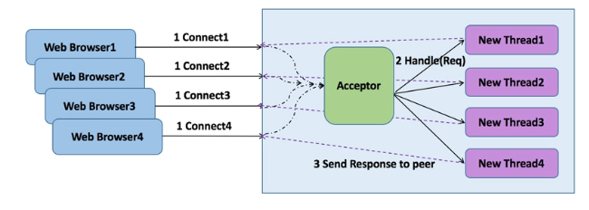 

采用该线程模型的服务器调度特点如下：

- 服务端监听线程 Acceptor 负责客户端连接的接入，每当有新的客户端接入，就会创建一个新的 I/O 线程负责处理 Socket；
- 客户端请求消息的读取和应答的发送，都有 I/O 线程负责；
- 除了 I/O 读写操作，默认情况下业务的逻辑处理，例如 DB 操作等，也都在 I/O 线程处理；
- I/O 操作采用同步阻塞操作，读写没有完成，I/O 线程会同步阻塞

BIO 线程模型主要存在如下三个问题：

- **性能问题：**一连接一线程模型导致服务端的并发接入数和系统吞吐量受到极大限制；
- **可靠性问题：**由于 I/O 操作采用同步阻塞模式，当网络拥塞或者通信对端处理缓慢会导致 I/O 线程被挂住，阻塞时间无法预测；
- **可维护性问题：**I/O 线程数无法有效控制、资源无法有效共享（多线程并发问题），系统可维护性差。

为了解决同步阻塞 I/O 面临的一个链路需要一个线程处理的问题，通常会对它的线程模型进行优化，后端通过一个线程池来处理多个客户端的请求接入，形成客户端个数 "M" 与线程池最大线程数 "N" 的比例关系，其中 M 可以远远大于 N，通过线程池可以灵活的调配线程资源，设置线程的最大值，防止由于海量并发接入导致线程耗尽，它的工作原理如下所示：

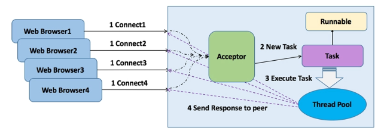 

### 异步非阻塞线程模型

从 JDK1.0 到 JDK1.3，Java 的 I/O 类库都非常原始，很多 UNIX 网络编程中的概念或者接口在 I/O 类库中都没有体现，例如 Pipe、Channel、Buffer 和 Selector 等。2002 年发布 JDK1.4 时，NIO 以 JSR-51 的身份正式随 JDK 发布。它新增了个 java.nio 包，提供了很多进行异步 I/O 开发的 API 和类库，主要的类和接口如下：

- 进行异步 I/O 操作的缓冲区 ByteBuffer 等；
- 进行异步 I/O 操作的管道 Pipe；
- 进行各种 I/O 操作（异步或者同步）的 Channel，包括 ServerSocketChannel 和 SocketChannel；
- 多种字符集的编码能力和解码能力；
- 实现非阻塞 I/O 操作的多路复用器 selector；
- 基于流行的 Perl 实现的正则表达式类库；
- 文件通道 FileChannel

新的 NIO 类库的提供，极大地促进了基于 Java 的异步非阻塞编程的发展和应用, 也诞生了很多优秀的 Java NIO 框架，例如 Apache 的 Mina、以及当前非常流行的 Netty

Java NIO 类库的工作原理如下所示：

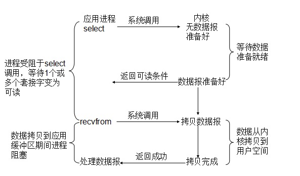 

在 Java NIO 类库中，最重要的就是多路复用器 Selector，它是 Java NIO 编程的基础，熟练地掌握 Selector 对于掌握 NIO 编程至关重要。多路复用器提供选择已经就绪的任务的能力。

简单来讲，Selector 会不断地轮询注册在其上的 Channel，如果某个 Channel 上面有新的 TCP 连接接入、读和写事件，这个 Channel 就处于就绪状态，会被 Selector 轮询出来，然后通过 SelectionKey 可以获取就绪 Channel 的集合，进行后续的 I/O 操作。

通常一个 I/O 线程会聚合一个 Selector，一个 Selector 可以同时注册 N 个 Channel, 这样单个 I/O 线程就可以同时并发处理多个客户端连接。另外，由于 I/O 操作是非阻塞的，因此也不会受限于网络速度和对方端点的处理时延，可靠性和效率都得到了很大提升。

典型的 NIO 线程模型（Reactor 模式）如下所示：

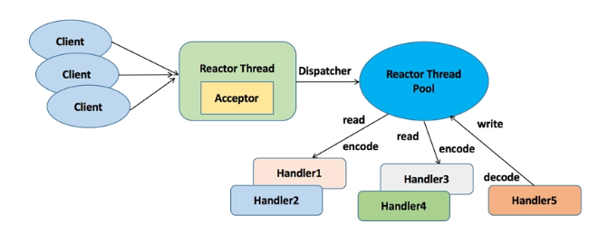 

### RPC 性能三原则

影响 RPC 框架性能的三个核心要素如下：

- **I/O 模型：**用什么样的通道将数据发送给对方，BIO、NIO 或者 AIO，IO 模型在很大程度上决定了框架的性能；
- **协议：**采用什么样的通信协议，Rest+ JSON 或者基于 TCP 的私有二进制协议，协议的选择不同，性能模型也不同，相比于公有协议，内部私有二进制协议的性能通常可以被设计的更优；
- **线程：**数据报如何读取？读取之后的编解码在哪个线程进行，编解码后的消息如何派发，通信线程模型的不同，对性能的影响也非常大

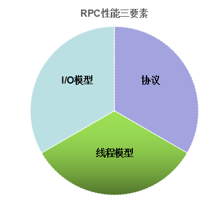 

在以上三个要素中，线程模型对性能的影响非常大。随着硬件性能的提升，CPU 的核数越来越越多，很多服务器标配已经达到 32 或 64 核。

通过多线程并发编程，可以充分利用多核 CPU 的处理能力，提升系统的处理效率和并发性能。但是如果线程创建或者管理不当，频繁发生线程上下文切换或者锁竞争，反而会影响系统的性能。

线程模型的优劣直接影响了 RPC 框架的性能和并发能力，它也是大家选型时比较关心的技术细节之一。下面我们一起来分析和学习下 gRPC 的线程模型

## gRPC 线程模型分析

gRPC 的线程模型主要包括服务端线程模型和客户端线程模型，其中服务端线程模型主要包括：

- 服务端监听和客户端接入线程（HTTP /2 Acceptor）
- 网络 I/O 读写线程
- 服务接口调用线程

客户端线程模型主要包括：

- 客户端连接线程（HTTP/2 Connector）
- 网络 I/O 读写线程
- 接口调用线程
- 响应回调通知线程

### 服务端线程模型

gRPC 服务端线程模型整体上可以分为两大类：

- 网络通信相关的线程模型，基于 Netty4.1 的线程模型实现
- 服务接口调用线程模型，基于 JDK 线程池实现

#### 服务端线程模型概述

gRPC 服务端线程模型和交互图如下所示：

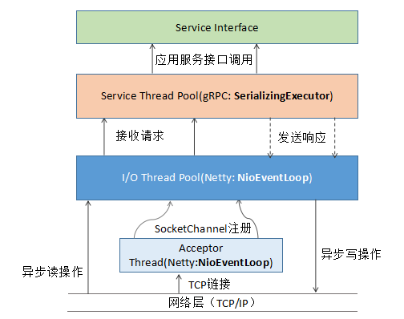 

其中，HTTP/2 服务端创建、HTTP/2 请求消息的接入和响应发送都由 Netty 负责，gRPC 消息的序列化和反序列化、以及应用服务接口的调用由 gRPC 的 SerializingExecutor 线程池负责

#### I/O 通信线程模型

RPC 的做法是服务端监听线程和 I/O 线程分离的 Reactor 多线程模型，它的代码如下所示（NettyServer 类）：

```
public void start(ServerListener serverListener) throws IOException {
    listener = checkNotNull(serverListener, "serverListener");
    allocateSharedGroups();
    ServerBootstrap b = new ServerBootstrap();
    b.group(bossGroup, workerGroup);
    b.channel(channelType);
    if (NioServerSocketChannel.class.isAssignableFrom(channelType)) {
      b.option(SO_BACKLOG, 128);
      b.childOption(SO_KEEPALIVE, true);
```

它的工作原理如下：

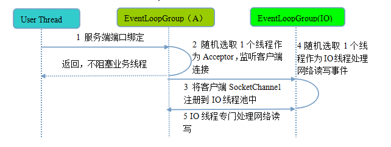 

整体的流程如下：

**步骤 1：**业务线程发起创建服务端操作，在创建服务端的时候实例化了 2 个 EventLoopGroup，1 个 EventLoopGroup 实际就是一个 EventLoop 线程组，负责管理 EventLoop 的申请和释放。

EventLoopGroup 管理的线程数可以通过构造函数设置，如果没有设置，默认取 -Dio.netty.eventLoopThreads，如果该系统参数也没有指定，则为“可用的 CPU 内核 * 2”。

bossGroup 线程组实际就是 Acceptor 线程池，负责处理客户端的 TCP 连接请求，如果系统只有一个服务端端口需要监听，则建议 bossGroup 线程组线程数设置为 1。workerGroup 是真正负责 I/O 读写操作的线程组，通过 ServerBootstrap 的 group 方法进行设置，用于后续的 Channel 绑定。

**步骤 2：**服务端 Selector 轮询，监听客户端连接，代码示例如下（NioEventLoop 类）：

```
int selectedKeys = selector.select(timeoutMillis);
 selectCnt ++;
```

**步骤 3：**如果监听到客户端连接，则创建客户端 SocketChannel 连接，从 workerGroup 中随机选择一个 NioEventLoop 线程，将 SocketChannel 注册到该线程持有的 Selector，代码示例如下（NioServerSocketChannel 类）：

```
protected int doReadMessages(List<Object> buf) throws Exception {
        SocketChannel ch = SocketUtils.accept(javaChannel());
        try {
            if (ch != null) {
                buf.add(new NioSocketChannel(this, ch));
                return 1;
            }
```

**步骤 4：**通过调用 EventLoopGroup 的 next() 获取一个 EventLoop（NioEventLoop），用于处理网络 I/O 事件。

Netty 线程模型的核心是 NioEventLoop，它的职责如下：

- 作为服务端 Acceptor 线程，负责处理客户端的请求接入
- 作为 I/O 线程，监听网络读操作位，负责从 SocketChannel 中读取报文
- 作为 I/O 线程，负责向 SocketChannel 写入报文发送给对方，如果发生写半包，会自动注册监听写事件，用于后续继续发送半包数据，直到数据全部发送完成
- 作为定时任务线程，可以执行定时任务，例如链路空闲检测和发送心跳消息等
- 作为线程执行器可以执行普通的任务线程（Runnable）NioEventLoop 处理网络 I/O 操作的相关代码如下：

```
try {
            int readyOps = k.readyOps();
            if ((readyOps & SelectionKey.OP_CONNECT) != 0) {
                int ops = k.interestOps();
                ops &= ~SelectionKey.OP_CONNECT;
                k.interestOps(ops);
 
                unsafe.finishConnect();
            }
            if ((readyOps & SelectionKey.OP_WRITE) != 0) {
                              ch.unsafe().forceFlush();
            }
            if ((readyOps & (SelectionKey.OP_READ | SelectionKey.OP_ACCEPT)) != 0 || readyOps == 0) {
                unsafe.read();
            }
```

除了处理 I/O 操作，NioEventLoop 也可以执行 Runnable 和定时任务。NioEventLoop 继承 SingleThreadEventExecutor，这就意味着它实际上是一个线程个数为 1 的线程池，类继承关系如下所示：

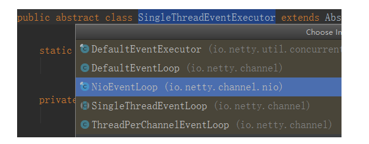 

SingleThreadEventExecutor 聚合了 JDK 的 java.util.concurrent.Executor 和消息队列 Queue，自定义提供线程池功能，相关代码如下（SingleThreadEventExecutor 类）：

```
private final Queue<Runnable> taskQueue;
    private volatile Thread thread;
    @SuppressWarnings("unused")
    private volatile ThreadProperties threadProperties;
    private final Executor executor;
    private volatile boolean interrupted;
 
```

直接调用 NioEventLoop 的 execute(Runnable task) 方法即可执行自定义的 Task，代码示例如下（SingleThreadEventExecutor 类）：

```
public void execute(Runnable task) {
        if (task == null) {
            throw new NullPointerException("task");
        }
        boolean inEventLoop = inEventLoop();
        if (inEventLoop) {
            addTask(task);
        } else {
            startThread();
            addTask(task);
            if (isShutdown() && removeTask(task)) {
                reject();
            }
```

除了 SingleThreadEventExecutor，NioEventLoop 同时实现了 ScheduledExecutorService 接口，这意味着它也可以执行定时任务，相关接口定义如下：

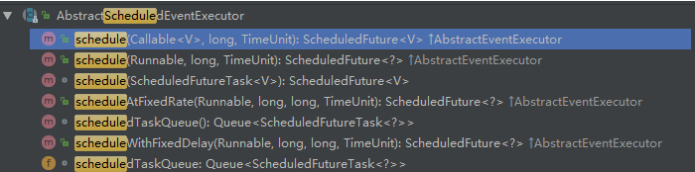 

为了防止大量 Runnable 和定时任务执行影响网络 I/O 的处理效率，Netty 提供了一个配置项：ioRatio，用于设置 I/O 操作和其它任务执行的时间比例，默认为 50%，相关代码示例如下（NioEventLoop 类）：

```
final long ioTime = System.nanoTime() - ioStartTime;
runAllTasks(ioTime * (100 - ioRatio) / ioRatio);
```

NioEventLoop 同时支持 I/O 操作和 Runnable 执行的原因如下：避免锁竞争，例如心跳检测，往往需要周期性的执行，如果 NioEventLoop 不支持定时任务执行，则用户需要自己创建一个类似 ScheduledExecutorService 的定时任务线程池或者定时任务线程，周期性的发送心跳，发送心跳需要网络操作，就要跟 I/O 线程所持有的资源进行交互，例如 Handler、ByteBuf、NioSocketChannel 等，这样就会产生锁竞争，需要考虑并发安全问题。原理如下：

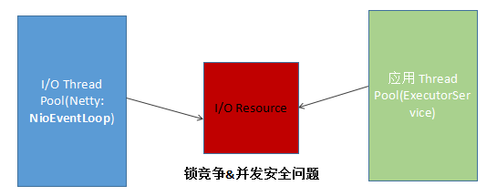 

#### 服务调度线程模型

gRPC 服务调度线程主要职责如下：

- 请求消息的反序列化，主要包括：HTTP/2 Header 的反序列化，以及将 PB(Body) 反序列化为请求对象；
- 服务接口的调用，method.invoke(非反射机制)；
- 将响应消息封装成 WriteQueue.QueuedCommand，写入到 Netty Channel 中，同时，对响应 Header 和 Body 对象做序列化
  服务端调度的核心是 SerializingExecutor，它同时实现了 JDK 的 Executor 和 Runnable 接口，既是一个线程池，同时也是一个 Task

SerializingExecutor 聚合了 JDK 的 Executor，由 Executor 负责 Runnable 的执行，代码示例如下（SerializingExecutor 类）：

```
public final class SerializingExecutor implements Executor, Runnable {
  private static final Logger log =
      Logger.getLogger(SerializingExecutor.class.getName());
private final Executor executor;
  private final Queue<Runnable> runQueue = new ConcurrentLinkedQueue<Runnable>();
```

其中，Executor 默认使用的是 JDK 的 CachedThreadPool，在构建 ServerImpl 的时候进行初始化，代码如下：

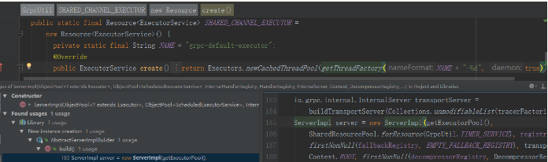 

当服务端接收到客户端 HTTP/2 请求消息时，由 Netty 的 NioEventLoop 线程切换到 gRPC 的 SerializingExecutor，进行消息的反序列化、以及服务接口的调用，代码示例如下（ServerTransportListenerImpl 类）：

```
final Context.CancellableContext context = createContext(stream, headers, statsTraceCtx);
      final Executor wrappedExecutor;
      if (executor == directExecutor()) {
        wrappedExecutor = new SerializeReentrantCallsDirectExecutor();
      } else {
        wrappedExecutor = new SerializingExecutor(executor);
      }
      final JumpToApplicationThreadServerStreamListener jumpListener
          = new JumpToApplicationThreadServerStreamListener(wrappedExecutor, stream, context);
      stream.setListener(jumpListener);
      wrappedExecutor.execute(new ContextRunnable(context) {
          @Override
          public void runInContext() {
            ServerStreamListener listener = NOOP_LISTENER;
            try {
              ServerMethodDefinition<?, ?> method = registry.lookupMethod(methodName);
```

相关的调用堆栈，示例如下：

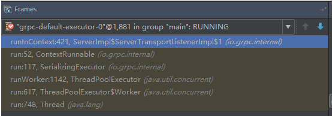 

响应消息的发送，由 SerializingExecutor 发起，将响应消息头和消息体序列化，然后分别封装成 SendResponseHeadersCommand 和 SendGrpcFrameCommand，调用 Netty NioSocketChannle 的 write 方法，发送到 Netty 的 ChannelPipeline 中，由 gRPC 的 NettyServerHandler 拦截之后，真正写入到 SocketChannel 中，代码如下所示（NettyServerHandler 类）：

```
public void write(ChannelHandlerContext ctx, Object msg, ChannelPromise promise)
      throws Exception {
    if (msg instanceof SendGrpcFrameCommand) {
      sendGrpcFrame(ctx, (SendGrpcFrameCommand) msg, promise);
    } else if (msg instanceof SendResponseHeadersCommand) {
      sendResponseHeaders(ctx, (SendResponseHeadersCommand) msg, promise);
    } else if (msg instanceof CancelServerStreamCommand) {
      cancelStream(ctx, (CancelServerStreamCommand) msg, promise);
    } else if (msg instanceof ForcefulCloseCommand) {
      forcefulClose(ctx, (ForcefulCloseCommand) msg, promise);
    } else {
      AssertionError e =
          new AssertionError("Write called for unexpected type: " + msg.getClass().getName());
      ReferenceCountUtil.release(msg);
```

响应消息体的发送堆栈如下所示：

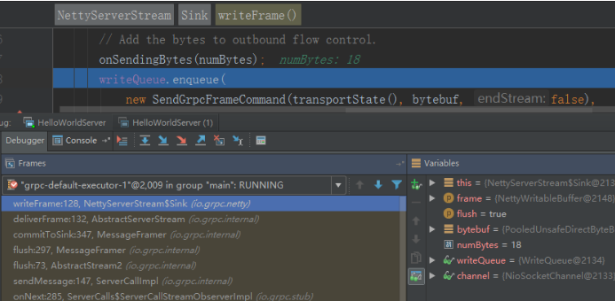 

Netty I/O 线程和服务调度线程的运行分工界面以及切换点如下所示：

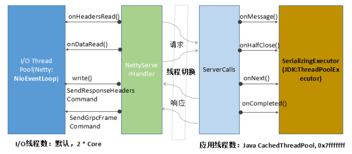 

事实上，在实际服务接口调用过程中，NIO 线程和服务调用线程切换次数远远超过 4 次，频繁的线程切换对 gRPC 的性能带来了一定的损耗。

### 客户端线程模型

gRPC 客户端的线程主要分为三类：

- 业务调用线程
- 客户端连接和 I/O 读写线程
- 请求消息业务处理和响应回调线程

#### 客户端线程模型概述

gRPC 客户端线程模型工作原理如下图所示（同步阻塞调用为例）：

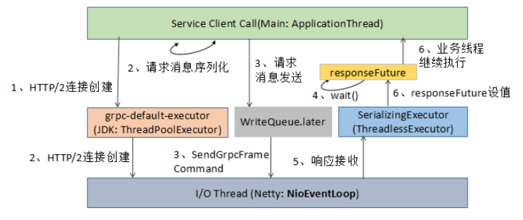 

客户端调用主要涉及的线程包括：

- 应用线程，负责调用 gRPC 服务端并获取响应，其中请求消息的序列化由该线程负责；
- 客户端负载均衡以及 Netty Client 创建，由 grpc-default-executor 线程池负责；
- HTTP/2 客户端链路创建、网络 I/O 数据的读写，由 Netty NioEventLoop 线程负责；
- 响应消息的反序列化由 SerializingExecutor 负责，与服务端不同的是，客户端使用的是 ThreadlessExecutor，并非 JDK 线程池；
- SerializingExecutor 通过调用 responseFuture 的 set(value)，唤醒阻塞的应用线程，完成一次 RPC 调用。

#### I/O 通信线程模型

相比于服务端，客户端的线程模型简单一些，它的工作原理如下：

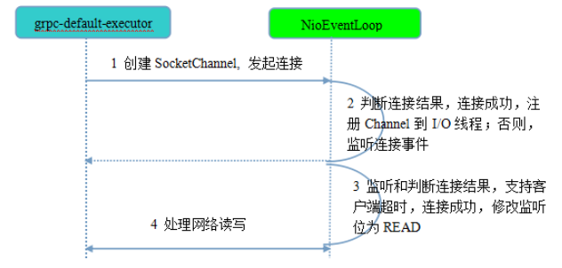 

第 1 步，由 grpc-default-executor 发起客户端连接，示例代码如下（NettyClientTransport 类）：

```
Bootstrap b = new Bootstrap();
    b.group(eventLoop);
    b.channel(channelType);
    if (NioSocketChannel.class.isAssignableFrom(channelType)) {
      b.option(SO_KEEPALIVE, true);
    }
    for (Map.Entry<ChannelOption<?>, ?> entry : channelOptions.entrySet()) {
      b.option((ChannelOption<Object>) entry.getKey(), entry.getValue());
    }
 
```

相比于服务端，客户端只需要创建一个 NioEventLoop，因为它不需要独立的线程去监听客户端连接，也没必要通过一个单独的客户端线程去连接服务端。

Netty 是异步事件驱动的 NIO 框架，它的连接和所有 I/O 操作都是非阻塞的，因此不需要创建单独的连接线程。

另外，客户端使用的 work 线程组并非通常意义的 EventLoopGroup，而是一个 EventLoop：即 HTTP/2 客户端使用的 work 线程并非一组线程（默认线程数为 CPU 内核 * 2），而是一个 EventLoop 线程。

这个其实也很容易理解，一个 NioEventLoop 线程可以同时处理多个 HTTP/2 客户端连接，它是多路复用的，对于单个 HTTP/2 客户端，如果默认独占一个 work 线程组，将造成极大的资源浪费，同时也可能会导致句柄溢出（并发启动大量 HTTP/2 客户端）。

第 2 步，发起连接操作，判断连接结果，判断连接结果，如果没有连接成功，则监听连接网络操作位 SelectionKey.OP_CONNECT。如果连接成功，则调用 pipeline().fireChannelActive() 将监听位修改为 READ。代码如下（NioSocketChannel 类）：

```
protected boolean doConnect(SocketAddress remoteAddress, SocketAddress localAddress) throws Exception {
        if (localAddress != null) {
            doBind0(localAddress);
        }
        boolean success = false;
        try {
            boolean connected = SocketUtils.connect(javaChannel(), remoteAddress);
            if (!connected) {
                selectionKey().interestOps(SelectionKey.OP_CONNECT);
            }
            success = true;
            return connected;
```

第 3 步，由 NioEventLoop 的多路复用器轮询连接操作结果，判断连接结果，如果或连接成功，重新设置监听位为 READ（AbstractNioChannel 类）：

```
protected void doBeginRead() throws Exception {
        final SelectionKey selectionKey = this.selectionKey;
        if (!selectionKey.isValid()) {
            return;
        }
        readPending = true;
        final int interestOps = selectionKey.interestOps();
        if ((interestOps & readInterestOp) == 0) {
            selectionKey.interestOps(interestOps | readInterestOp);
        }
```

第 4 步，由 NioEventLoop 线程负责 I/O 读写，同服务端。

#### 客户端调用线程模型

客户端调用线程交互流程如下所示：

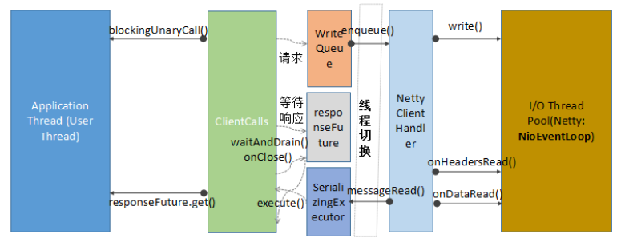 

请求消息的发送由用户线程发起，相关代码示例如下（GreeterBlockingStub 类）：

```
public io.grpc.examples.helloworld.HelloReply sayHello(io.grpc.examples.helloworld.HelloRequest request) {
      return blockingUnaryCall(
          getChannel(), METHOD_SAY_HELLO, getCallOptions(), request);
    }
```

HTTP/2 Header 的创建、以及请求参数反序列化为 Protobuf，均由用户线程负责完成，相关代码示例如下（ClientCallImpl 类）：

```
public void sendMessage(ReqT message) {
    Preconditions.checkState(stream != null, "Not started");
    Preconditions.checkState(!cancelCalled, "call was cancelled");
    Preconditions.checkState(!halfCloseCalled, "call was half-closed");
    try {
      InputStream messageIs = method.streamRequest(message);
      stream.writeMessage(messageIs);
...
```

用户线程将请求消息封装成 CreateStreamCommand 和 SendGrpcFrameCommand，发送到 Netty 的 ChannelPipeline 中，然后返回，完成线程切换。后续操作由 Netty NIO 线程负责，相关代码示例如下（NettyClientHandler 类）：

```
public void write(ChannelHandlerContext ctx, Object msg, ChannelPromise promise)
          throws Exception {
    if (msg instanceof CreateStreamCommand) {
      createStream((CreateStreamCommand) msg, promise);
    } else if (msg instanceof SendGrpcFrameCommand) {
      sendGrpcFrame(ctx, (SendGrpcFrameCommand) msg, promise);
    } else if (msg instanceof CancelClientStreamCommand) {
      cancelStream(ctx, (CancelClientStreamCommand) msg, promise);
    } else if (msg instanceof SendPingCommand) {
      sendPingFrame(ctx, (SendPingCommand) msg, promise);
    } else if (msg instanceof GracefulCloseCommand) {
      gracefulClose(ctx, (GracefulCloseCommand) msg, promise);
    } else if (msg instanceof ForcefulCloseCommand) {
      forcefulClose(ctx, (ForcefulCloseCommand) msg, promise);
    } else if (msg == NOOP_MESSAGE) {
      ctx.write(Unpooled.EMPTY_BUFFER, promise);
...
```

客户端响应消息的接收，由 gRPC 的 NettyClientHandler 负责，相关代码如下所示：

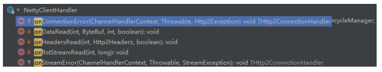 

接收到 HTTP/2 响应之后，Netty 将消息投递到 SerializingExecutor，由 SerializingExecutor 的 ThreadlessExecutor 负责响应的反序列化，以及 responseFuture 的设值，相关代码示例如下（UnaryStreamToFuture 类）：

```
public void onClose(Status status, Metadata trailers) {
      if (status.isOk()) {
        if (value == null) {
          // No value received so mark the future as an error
          responseFuture.setException(
              Status.INTERNAL.withDescription("No value received for unary call")
                  .asRuntimeException(trailers));
        }
        responseFuture.set(value);
      } else {
        responseFuture.setException(status.asRuntimeException(trailers));
      }
```

## 总结

### 优点

#### Netty 线程模型

Netty4 之后，对线程模型进行了优化，通过串行化的设计避免线程竞争：当系统在运行过程中，如果频繁的进行线程上下文切换，会带来额外的性能损耗。

多线程并发执行某个业务流程，业务开发者还需要时刻对线程安全保持警惕，哪些数据可能会被并发修改，如何保护？这不仅降低了开发效率，也会带来额外的性能损耗。

为了解决上述问题，Netty 采用了串行化设计理念，从消息的读取、编码以及后续 Handler 的执行，始终都由 I/O 线程 NioEventLoop 负责，这就意外着整个流程不会进行线程上下文的切换，数据也不会面临被并发修改的风险，对于用户而言，甚至不需要了解 Netty 的线程细节，这确实是个非常好的设计理念，它的工作原理图如下：

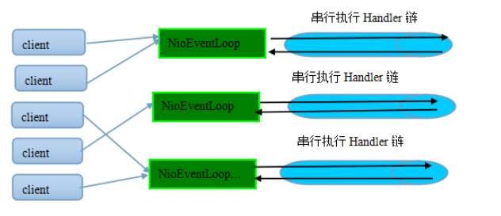 

一个 NioEventLoop 聚合了一个多路复用器 Selector，因此可以处理成百上千的客户端连接，Netty 的处理策略是每当有一个新的客户端接入，则从 NioEventLoop 线程组中顺序获取一个可用的 NioEventLoop，当到达数组上限之后，重新返回到 0，通过这种方式，可以基本保证各个 NioEventLoop 的负载均衡。一个客户端连接只注册到一个 NioEventLoop 上，这样就避免了多个 I/O 线程去并发操作它。

Netty 通过串行化设计理念降低了用户的开发难度，提升了处理性能。利用线程组实现了多个串行化线程水平并行执行，线程之间并没有交集，这样既可以充分利用多核提升并行处理能力，同时避免了线程上下文的切换和并发保护带来的额外性能损耗。

Netty 3 的 I/O 事件处理流程如下：

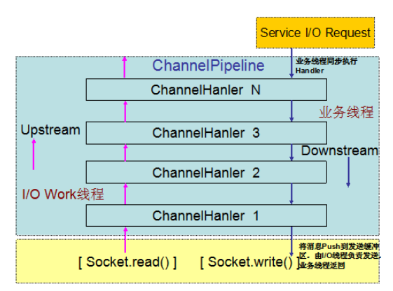 

Netty 4 的 I/O 消息处理流程如下所示：

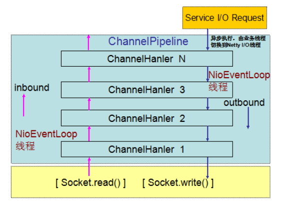 

Netty 4 修改了 Netty 3 的线程模型：在 Netty 3 的时候，upstream 是在 I/O 线程里执行的，而 downstream 是在业务线程里执行。

当 Netty 从网络读取一个数据报投递给业务 handler 的时候，handler 是在 I/O 线程里执行，而当我们在业务线程中调用 write 和 writeAndFlush 向网络发送消息的时候，handler 是在业务线程里执行，直到最后一个 Header handler 将消息写入到发送队列中，业务线程才返回。

Netty4 修改了这一模型，在 Netty 4 里 inbound(对应 Netty 3 的 upstream) 和 outbound(对应 Netty 3 的 downstream) 都是在 NioEventLoop(I/O 线程) 中执行。

当我们在业务线程里通过 ChannelHandlerContext.write 发送消息的时候，**Netty 4 在将消息发送事件调度到 ChannelPipeline 的时候，首先将待发送的消息封装成一个 Task，然后放到 NioEventLoop 的任务队列中，由 NioEventLoop 线程异步执行**。

**后续所有 handler 的调度和执行，包括消息的发送、I/O 事件的通知，都由 NioEventLoop 线程负责处理。**

#### gRPC 线程模型

消息的序列化和反序列化均由 gRPC 线程负责，而没有在 Netty 的 Handler 中做 CodeC，原因如下：Netty4 优化了线程模型，所有业务 Handler 都由 Netty 的 I/O 线程负责，通过串行化的方式消除锁竞争，原理如下所示：

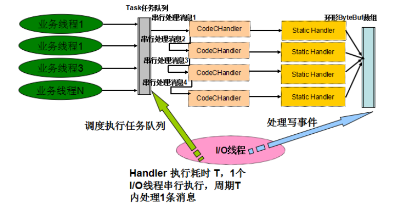 

如果大量的 Handler 都在 Netty I/O 线程中执行，一旦某些 Handler 执行比较耗时，则可能会反向影响 I/O 操作的执行，像序列化和反序列化操作，都是 CPU 密集型操作，更适合在业务应用线程池中执行，提升并发处理能力。因此，gRPC 并没有在 I/O 线程中做消息的序列化和反序列化。

### 改进点思考

#### 时间可控的接口调用直接在 I/O 线程上处理

gRPC 采用的是网络 I/O 线程和业务调用线程分离的策略，大部分场景下该策略是最优的。但是，对于那些接口逻辑非常简单，执行时间很短，不需要与外部网元交互、访问数据库和磁盘，也不需要等待其它资源的，则建议接口调用直接在 Netty /O 线程中执行，不需要再投递到后端的服务线程池。避免线程上下文切换，同时也消除了线程并发问题。

例如提供配置项或者接口，系统默认将消息投递到后端服务调度线程，但是也支持短路策略，直接在 Netty 的 NioEventLoop 中执行消息的序列化和反序列化、以及服务接口调用。

#### 减少锁竞争

当前 gRPC 的线程切换策略如下：

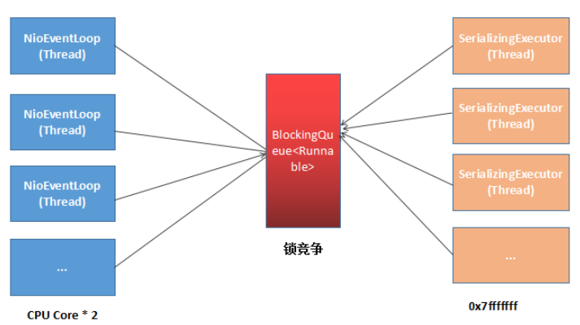 

优化之后的 gRPC 线程切换策略：

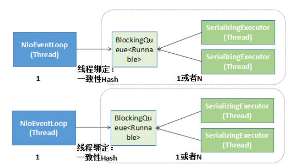 

通过线程绑定技术（例如采用一致性 hash 做映射）, 将 Netty 的 I/O 线程与后端的服务调度线程做绑定，1 个 I/O 线程绑定一个或者多个服务调用线程，降低锁竞争，提升性能。

### 关键点总结

RPC 调用涉及的主要队列如下：

- Netty 的消息发送队列（客户端和服务端都涉及）；
- gRPC SerializingExecutor 的消息队列（JDK 的 BlockingQueue）；
- gRPC 消息发送任务队列 WriteQueue。