## 安全基础回顾

### 安全形势

近年来，个人信息泄漏和各种信息安全事件层出不穷，个人信息安全以及隐私数据保护面临严峻的挑战。

很多国家已经通过立法的方式保护个人信息和数据安全，例如我国 2016 年 11 月 7 日出台、2017 年 6 月 1 日正式实施的《网络安全法》，以及 2016 年 4 月 14 日欧盟通过的《一般数据保护法案》（GDP R），该法案将于 2018 年 5 月 25 日正式生效。

GDPR 的通过意味着欧盟对个人信息保护及其监管达到了前所未有的高度，堪称史上最严格的数据保护法案。

作为企业内部各系统、模块之间调用的通信框架，即便是内网通信，RPC 调用也需要考虑安全性，RPC 调用安全主要涉及如下三点：

- **个人 / 企业敏感数据加密：**例如针对个人的账号、密码、手机号等敏感信息进行加密传输，打印接口日志时需要做数据模糊化处理等，不能明文打印；
- **对调用方的身份认证：**调用来源是否合法，是否有访问某个资源的权限，防止越权访问；
- **数据防篡改和完整性：**通过对请求参数、消息头和消息体做签名，防止请求消息在传输过程中被非法篡改。

### 敏感数据加密传输

#### 基于 SSL/TLS 的通道加密

当存在跨网络边界的 RPC 调用时，往往需要通过 TLS/SSL 对传输通道进行加密，以防止请求和响应消息中的敏感数据泄漏。跨网络边界调用场景主要有三种：

- 后端微服务直接开放给端侧，例如手机 App、TV、多屏等，没有统一的 API Gateway/SLB 做安全接入和认证；
- 后端微服务直接开放给 DMZ 部署的管理或者运维类 Portal；
- 后端微服务直接开放给第三方合作伙伴 / 渠道。

除了跨网络之外，对于一些安全等级要求比较高的业务场景，即便是内网通信，只要跨主机 /VM/ 容器通信，都强制要求对传输通道进行加密。在该场景下，即便只存在内网各模块的 RPC 调用，仍然需要做 SSL/TLS。

使用 SSL/TLS 的典型场景如下所示：

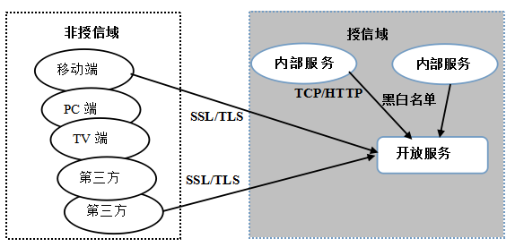 

目前使用最广的 SSL/TLS 工具 / 类库就是 OpenSSL，它是为网络通信提供安全及数据完整性的一种安全协议，囊括了主要的密码算法、常用的密钥和证书封装管理功能以及 SSL 协议。

多数 SSL 加密网站是用名为 OpenSSL 的开源软件包，由于这也是互联网应用最广泛的安全传输方法，被网银、在线支付、电商网站、门户网站、电子邮件等重要网站广泛使用

#### 针对敏感数据的单独加密

有些 RPC 调用并不涉及敏感数据的传输，或者敏感字段占比较低，为了最大程度的提升吞吐量，降低调用时延，通常会采用 HTTP/TCP + 敏感字段单独加密的方式，既保障了敏感信息的传输安全，同时也降低了采用 SSL/TLS 加密通道带来的性能损耗，对于 JDK 原生的 SSL 类库，这种性能提升尤其明显。

它的工作原理如下所示：

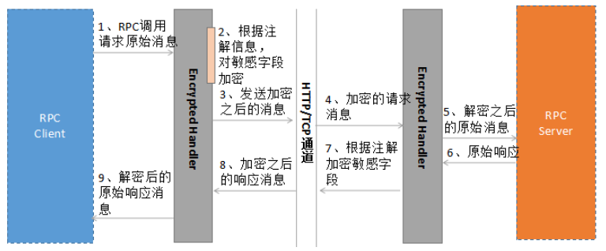 

通常使用 Handler 拦截机制，对请求和响应消息进行统一拦截，根据注解或者加解密标识对敏感字段进行加解密，这样可以避免侵入业务。

采用该方案的缺点主要有两个：

- 对敏感信息的识别可能存在偏差，容易遗漏或者过度保护，需要解读数据和隐私保护方面的法律法规，而且不同国家对敏感数据的定义也不同，这会为识别带来很多困难；
- 接口升级时容易遗漏，例如开发新增字段，忘记识别是否为敏感数据

### 认证和鉴权

RPC 的认证和鉴权机制主要包含两点：

- **认证：**对调用方身份进行识别，防止非法调用；
- **鉴权：**对调用方的权限进行校验，防止越权调用。

事实上，并非所有的 RPC 调用都必须要做认证和鉴权，例如通过 API Gateway 网关接入的流量，已经在网关侧做了鉴权和身份认证，对来自网关的流量 RPC 服务端就不需要重复鉴权。

另外，一些对安全性要求不太高的场景，可以只做认证而不做细粒度的鉴权。

#### 身份认证

内部 RPC 调用的身份认证场景，主要有如下两大类：

- 防止对方知道服务提供者的地址之后，绕过注册中心 / 服务路由策略直接访问 RPC 服务提供端；
- RPC 服务只想供内部模块调用，不想开放给其它业务系统使用（双方网络是互通的）。

身份认证的方式比较多，例如 HTTP Basic Authentication、OAuth2 等，比较简单使用的是令牌认证（Token）机制，它的工作原理如下所示：

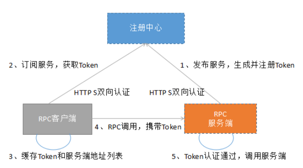 

工作原理如下：

- RPC 客户端和服务端通过 HTTPS 与注册中心连接，做双向认证，以保证客户端和服务端与注册中心之间的安全；
- 服务端生成 Token 并注册到注册中心，由注册中心下发给订阅者。通过订阅 / 发布机制，向 RPC 客户端做 Token 授权；
- 服务端开启身份认证，对 RPC 调用进行 Token 校验，认证通过之后才允许调用后端服务接口。

#### 权限管控

身份认证可以防止非法调用，如果需要对调用方进行更细粒度的权限管控，则需要做对 RPC 调用做鉴权。例如管理员可以查看、修改和删除某个后台资源，而普通用户只能查看资源，不能对资源做管理操作。

在 RPC 调用领域比较流行的是基于 OAuth2.0 的权限认证机制，它的工作原理如下：

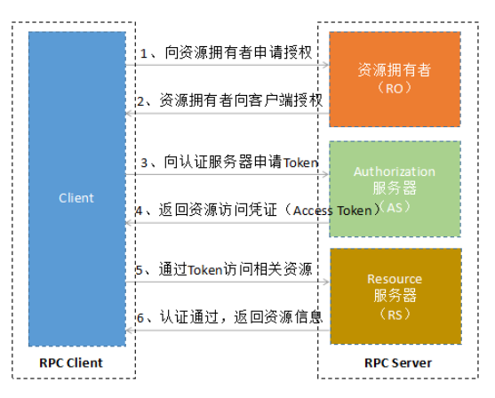 

OAuth2.0 的认证流程如下：

- 客户端向资源拥有者申请授权（例如携带用户名 + 密码等证明身份信息的凭证）；

- 资源拥有者对客户端身份进行校验，通过之后同意授权；

  用户授权，有四种方式：

  - 授权码模式（authorization code）
  - 简化模式（implicit）
  - 密码模式（resource owner password credentials）
  - 客户端模式（client credentials）

- 客户端使用步骤 2 的授权凭证，向认证服务器申请资源访问令牌（access token）；

- 认证服务器对授权凭证进行合法性校验，通过之后，颁发 access token；

- 客户端携带 access token（通常在 HTTP Header 中）访问后端资源，例如发起 RPC 调用；

- 服务端对 access token 合法性进行校验（是否合法、是否过期等），同时对 token 进行解析，获取客户端的身份信息以及对应的资源访问权限列表，实现对资源访问权限的细粒度管控；

- access token 校验通过，返回资源信息给客户端

需要指出的是，OAuth 2.0 是一个规范，不同厂商即便遵循该规范，实现也可能会存在细微的差异。大部分厂商在采用 OAuth 2.0 的基础之上，往往会衍生出自己特有的 OAuth 2.0 实现。

对于 access token，为了提升性能，RPC 服务端往往会缓存，不需要每次调用都与 AS 服务器做交互。同时，access token 是有过期时间的，根据业务的差异，过期时间也会不同。客户端在 token 过期之前，需要刷新 Token，或者申请一个新的 Token。

考虑到 access token 的安全，通常选择 SSL/TLS 加密传输，或者对 access token 单独做加密，防止 access token 泄漏

### 数据完整性和一致性

RPC 调用，除了数据的机密性和有效性之外，还有数据的完整性和一致性需要保证，即如何保证接收方收到的数据与发送方发出的数据是完全相同的。

利用消息摘要可以保障数据的完整性和一致性，它的特点如下：

- 单向 Hash 算法，从明文到密文的不可逆过程，即只能加密而不能解密；
- 无论消息大小，经过消息摘要算法加密之后得到的密文长度都是固定的；
- 输入相同，则输出一定相同。

目前常用的消息摘要算法是 SHA-1、MD5 和 MAC，MD5 可产生一个 128 位的散列值。 SHA-1 则是以 MD5 为原型设计的安全散列算法，可产生一个 160 位的散列值，安全性更高一些。MAC 除了能够保证消息的完整性，还能够保证来源的真实性。

由于 MD5 已被发现有许多漏洞，在实际应用中更多使用 SHA 和 MAC，而且往往会把数字签名和消息摘要混合起来使用

## gRPC 安全机制

谷歌提供了可扩展的安全认证机制，以满足不同业务场景需求，它提供的授权机制主要有四类：

- **通道凭证：**

  默认提供了基于 HTTP/2 的 TLS，对客户端和服务端交换的所有数据进行加密传输；

- **调用凭证：**

  被附加在每次 RPC 调用上，通过 Credentials 将认证信息附加到消息头中，由服务端做授权认证；

- **组合凭证：**

  将一个频道凭证和一个调用凭证关联起来创建一个新的频道凭证，在这个频道上的每次调用会发送组合的调用凭证来作为授权数据，最典型的场景就是使用 HTTP S 来传输 Access Token；

- **Google 的 OAuth 2.0：**

  gRPC 内置的谷歌的 OAuth 2.0 认证机制，通过 gRPC 访问 Google API 时，使用 Service Accounts 密钥作为凭证获取授权令牌。

### SSL/TLS 认证

gRPC 基于 HTTP/2 协议，默认会开启 SSL/TLS，考虑到兼容性和适用范围，gRPC 提供了三种协商机制：

- **PlaintextNegotiator：**非 SSL/TLS 加密传输的 HTTP/2 通道，不支持客户端通过 HTTP/1.1 的 Upgrade 升级到 HTTP/2, 代码示例如下（PlaintextNegotiator 类）：

  ```
  static final class PlaintextNegotiator implements ProtocolNegotiator {
     @Override
     public Handler newHandler(GrpcHttp2ConnectionHandler handler) {
       return new BufferUntilChannelActiveHandler(handler);
     }
   }
  ```

- **PlaintextUpgradeNegotiator：**非 SSL/TLS 加密传输的 HTTP/2 通道，支持客户端通过 HTTP/1.1 的 Upgrade 升级到 HTTP/2，代码示例如下（PlaintextUpgradeNegotiator 类）：

  ```
  static final class PlaintextUpgradeNegotiator implements ProtocolNegotiator {
     @Override
     public Handler newHandler(GrpcHttp2ConnectionHandler handler) {
            Http2ClientUpgradeCodec upgradeCodec = new Http2ClientUpgradeCodec(handler);
       HttpClientCodec httpClientCodec = new HttpClientCodec();
       final HttpClientUpgradeHandler upgrader =
           new HttpClientUpgradeHandler(httpClientCodec, upgradeCodec, 1000);
       return new BufferingHttp2UpgradeHandler(upgrader);
     }
   }
  ```

- **TlsNegotiator：**基于 SSL/TLS 加密传输的 HTTP/2 通道，代码示例如下（TlsNegotiator 类）：

  ```
  static final class TlsNegotiator implements ProtocolNegotiator {
     private final SslContext sslContext;
     private final String host;
     private final int port;
     TlsNegotiator(SslContext sslContext, String host, int port) {
       this.sslContext = checkNotNull(sslContext, "sslContext");
       this.host = checkNotNull(host, "host");
       this.port = port;
     }
  ```

下面对 gRPC 的 SSL/TLS 工作原理进行详解。

#### SSL/TLS 工作原理

SSL/TLS 分为单向认证和双向认证，在实际业务中，单向认证使用较多，即客户端认证服务端，服务端不认证客户端。

SSL 单向认证的过程原理如下：

- SL 客户端向服务端传送客户端 SSL 协议的版本号、支持的加密算法种类、产生的随机数，以及其它可选信息；
- 服务端返回握手应答，向客户端传送确认 SSL 协议的版本号、加密算法的种类、随机数以及其它相关信息；
- 服务端向客户端发送自己的公钥；
- 客户端对服务端的证书进行认证，服务端的合法性校验包括：证书是否过期、发行服务器证书的 CA 是否可靠、发行者证书的公钥能否正确解开服务器证书的“发行者的数字签名”、服务器证书上的域名是否和服务器的实际域名相匹配等；
- 客户端随机产生一个用于后面通讯的“对称密码”，然后用服务端的公钥对其加密，将加密后的“预主密码”传给服务端；
- 服务端将用自己的私钥解开加密的“预主密码”，然后执行一系列步骤来产生主密码；
- 客户端向服务端发出信息，指明后面的数据通讯将使用主密码为对称密钥，同时通知服务器客户端的握手过程结束；
- 服务端向客户端发出信息，指明后面的数据通讯将使用主密码为对称密钥，同时通知客户端服务器端的握手过程结束；
- SSL 的握手部分结束，SSL 安全通道建立，客户端和服务端开始使用相同的对称密钥对数据进行加密，然后通过 Socket 进行传输

SSL 单向认证的流程图如下所示：

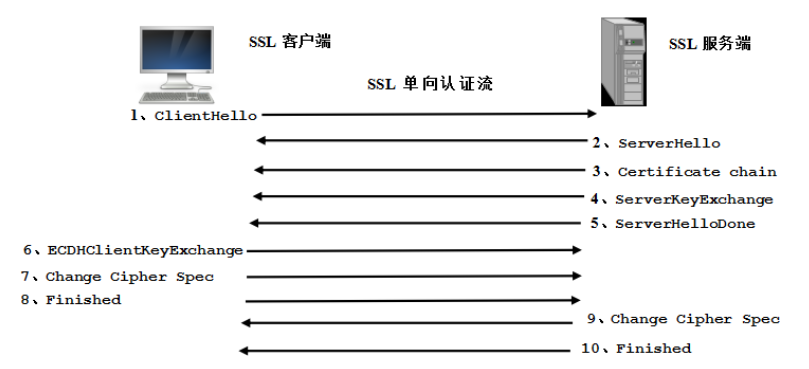 

SSL 双向认证相比单向认证，多了一步服务端发送认证请求消息给客户端，客户端发送自签名证书给服务端进行安全认证的过程。

客户端接收到服务端要求客户端认证的请求消息之后，发送自己的证书信息给服务端，信息如下：

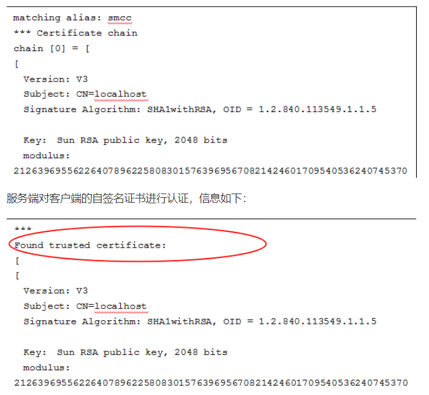 

#### HTTP/2 的 ALPN

对于一些新的 web 协议，例如 HTTP/2，客户端和浏览器需要知道服务端是否支持 HTTP/2, 对于 HTTP/2 Over HTTP 可以使用 HTTP/1.1 的 Upgrade 机制进行协商，对于 HTTP/2 Over TLS，则需要使用到 NPN 或 ALPN 扩展来完成协商。

ALPN 作为 HTTP/2 Over TLS 的协商机制，已经被定义到 RFC7301 中，从 2016 年开始它已经取代 NPN 成为 HTTP/2Over TLS 的标准协商机制。目前所有支持 HTTP/2 的浏览器都已经支持 ALPN。

Jetty 为 OpenJDK 7 和 OpenJDK 8 提供了扩展的 ALPN 实现（JDK 默认不支持），ALPN 类库与 Jetty 容器本身并不强绑定，无论是否使用 Jetty 作为 Web 容器，都可以集成 Jetty 提供的 ALPN 类库，以实现基于 TLS 的 HTTP/2 协议。

如果要开启 ALPN，需要增加如下 JVM 启动参数：

```
java -Xbootclasspath/p:<path_to_alpn_boot_jar> ...
```

客户端代码示例如下：

```
SSLContext sslContext = ...;
final SSLSocket sslSocket = (SSLSocket)context.getSocketFactory().createSocket("localhost", server.getLocalPort());
ALPN.put(sslSocket, new ALPN.ClientProvider()
{
    public boolean supports()
    {
        return true;
    }
    public List<String> protocols()
    {
        return Arrays.asList("h2", "http/1.1");
    }
    public void unsupported()
    {
        ALPN.remove(sslSocket);
    }
    public void selected(String protocol)
    {
        ALPN.remove(sslSocket);
          }
});
```

服务端代码示例如下：

```
final SSLSocket sslSocket = ...;
ALPN.put(sslSocket, new ALPN.ServerProvider()
{
    public void unsupported()
    {
        ALPN.remove(sslSocket);
    }
    public String select(List<String> protocols);
    {
        ALPN.remove(sslSocket);
        return protocols.get(0);
    }
});
```

以上代码示例来源：http://www.eclipse.org/jetty/documentation/9.3.x/alpn-chapter.html

需要指出的是，Jetty ALPN 类库版本与 JDK 版本是配套使用的，配套关系如下所示：

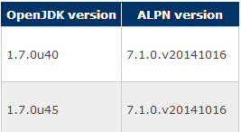 

可以通过如下网站查询双方的配套关系：http://www.eclipse.org/jetty/documentation/9.3.x/alpn-chapter.html

如果大家需要了解更多的 Jetty ALPN 相关信息，可以下载 jetty 的 ALPN 源码和文档学习。

#### gRPC 的 TLS 策略

gRPC 的 TLS 实现有两种策略：

- 基于 OpenSSL 的 TLS
- 基于 Jetty ALPN/NPN 的 TLS

对于非安卓的后端 Java 应用，gRPC 强烈推荐使用 OpenSSL，原因如下：

- 性能更高：基于 OpenSSL 的 gRPC 调用比使用 JDK GCM 的性能高 10 倍以上；
- 密码算法更丰富：OpenSSL 支持的密码算法比 JDK SSL 提供的更丰富，特别是 HTTP/2 协议使用的加密算法；
- OpenSSL 支持 ALPN 回退到 NPN；
- 不需要根据 JDK 的版本升级配套升级 ALPN 类库（Jetty 的 ALPN 版本与 JDK 特定版本配套使用）。

gRPC 的 HTTP/2 和 TLS 基于 Netty 框架实现，如果使用 OpenSSL，则需要依赖 Netty 的 netty-tcnative。

Netty 的 OpenSSL 有两种实现机制：Dynamic linked 和 Statically Linked。在开发和测试环境中，建议使用 Statically Linked 的方式（netty-tcnative-boringssl-static），它提供了对 ALPN 的支持以及 HTTP/2 需要的密码算法，不需要额外再集成 Jetty 的 ALPN 类库。从 1.1.33.Fork16 版本开始支持所有的操作系统，可以实现跨平台运行。

对于生产环境，则建议使用 Dynamic linked 的方式，原因如下：

- 很多场景下需要升级 OpenSSL 的版本或者打安全补丁，如果使用动态链接方式（例如 apt-ge），则应用软件不需要级联升级；
- 对于一些紧急的 OpenSSL 安全补丁，如果采用 Statically Linked 的方式，需要等待 Netty 社区提供新的静态编译补丁版本，可能会存在一定的滞后性。

netty-tcnative-boringssl-static 的 Maven 配置如下：

```
<project>
  <dependencies>
    <dependency>
      <groupId>io.netty</groupId>
      <artifactId>netty-tcnative-boringssl-static</artifactId>
      <version>2.0.6.Final</version>
    </dependency>
  </dependencies>
</project>
```

使用 Dynamically Linked (netty-tcnative) 的相关约束如下：

```
OpenSSL version >= 1.0.2 for ALPN
```

或者

```
version >= 1.0.1 for NPN
```

类路径中包含

```
netty-tcnative version >= 1.1.33.Fork7
```

尽管 gRPC 强烈不建议使用基于 JDK 的 TLS，但是它还是提供了对 Jetty ALPN/NPN 的支持。

通过 Xbootclasspath 参数开启 ALPN，示例如下：

```
java -Xbootclasspath/p:/path/to/jetty/alpn/extension.jar
```

由于 ALPN 类库与 JDK 版本号有强对应关系，如果匹配错误，则会导致 SSL 握手失败，因此可以通过 Jetty-ALPN-Agent 来自动为 JDK 版本选择合适的 ALPN 版本，启动参数如下所示：

```
java -javaagent:/path/to/jetty-alpn-agent.jar
```

#### 基于 TLS 的 gRPC 代码示例

以基于 JDK（Jetty-ALPN）的 TLS 为例，给出 gRPC SSL 安全认证的代码示例。

TLS 服务端创建：

```
int port = 18443;
    SelfSignedCertificate ssc = new SelfSignedCertificate();
    server = ServerBuilder.forPort(port).useTransportSecurity(ssc.certificate(),
            ssc.privateKey())
        .addService(new GreeterImpl())
        .build()
        .start();
```

其中 SelfSignedCertificate 是 Netty 提供的用于测试的临时自签名证书类，在实际项目中，需要加载生成环境的 CA 和密钥。
在启动参数中增加 SSL 握手日志打印以及 Jetty 的 ALPN Agent 类库，示例如下：

 

启动服务端，显示 SSL 证书已经成功加载：

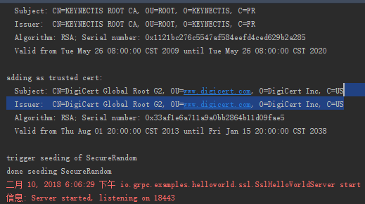 

TLS 客户端代码创建：

```
this(NettyChannelBuilder.forAddress(host, port).sslContext(
            GrpcSslContexts.forClient().
            ciphers(Http2SecurityUtil.CIPHERS,
                    SupportedCipherSuiteFilter.INSTANCE).
            trustManager(InsecureTrustManagerFactory.INSTANCE).build()));
```

NettyChannel 创建时，使用 gRPC 的 GrpcSslContexts 指定客户端模式，设置 HTTP/2 的密钥，同时加载 CA 证书工厂，完成 TLS 客户端的初始化。

与服务端类似，需要通过 -javaagent 指定 ALPN Agent 类库路径，同时开启 SSL 握手调试日志打印，启动客户端，运行结果如下所示：

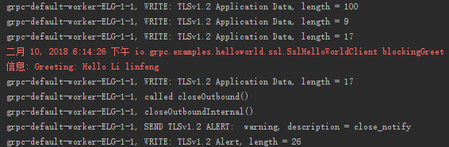 

#### gRPC TLS 源码分析

##### SSL接收

gRPC 在 Netty SSL 类库基础上做了二次封装，以简化业务的使用，以服务端代码为例进行说明，服务端开启 TLS，代码如下（NettyServerBuilder 类）：

```
public NettyServerBuilder useTransportSecurity(File certChain, File privateKey) {
    try {
      sslContext = GrpcSslContexts.forServer(certChain, privateKey).build();
```

实际调用 GrpcSslContexts 创建了 Netty SslContext，下面一起分析下 GrpcSslContexts 的实现，它调用了 Netty SslContextBuilder，加载 X.509 certificate chain file 和 PKCS#8 private key file（PEM 格式），代码如下（SslContextBuilder 类）：

```
public static SslContextBuilder forServer(File keyCertChainFile, File keyFile) {
        return new SslContextBuilder(true).keyManager(keyCertChainFile, keyFile);
    }
```

Netty 的 SslContext 加载 keyCertChainFile 和 private key file（SslContextBuilder 类）：

```
X509Certificate[] keyCertChain;
        PrivateKey key;
        try {
            keyCertChain = SslContext.toX509Certificates(keyCertChainFile);
        } catch (Exception e) {
            throw new IllegalArgumentException("File does not contain valid certificates: " + keyCertChainFile, e);
        }
        try {
            key = SslContext.toPrivateKey(keyFile, keyPassword);
```

加载完成之后，通过 SslContextBuilder 创建 SslContext，完成 SSL 上下文的创建。

服务端开启 SSL 之后，gRPC 会根据初始化完成的 SslContext 创建 SSLEngine，然后实例化 Netty 的 SslHandler，将其加入到 ChannelPipeline 中，代码示例如下（ServerTlsHandler 类）：

```
public void handlerAdded(ChannelHandlerContext ctx) throws Exception {
      super.handlerAdded(ctx);
      SSLEngine sslEngine = sslContext.newEngine(ctx.alloc());
      ctx.pipeline().addFirst(new SslHandler(sslEngine, false));
    }
```

下面一起分析下 Netty SSL 服务端的源码，SSL 服务端接收客户端握手请求消息的入口方法是 decode 方法，首先获取接收缓冲区的读写索引，并对读取的偏移量指针进行备份（SslHandler 类）：

```
protected void decode(ChannelHandlerContext ctx, ByteBuf in, List<Object> out) throws SSLException {
        final int startOffset = in.readerIndex();
        final int endOffset = in.writerIndex();
        int offset = startOffset;
        int totalLength = 0;
...
```

对半包标识进行判断，如果上一个消息是半包消息，则判断当前可读的字节数是否小于整包消息的长度，如果小于整包长度，则说明本次读取操作仍然没有把 SSL 整包消息读取完整，需要返回 I/O 线程继续读取，代码如下：

```
if (packetLength > 0) {
            if (endOffset - startOffset < packetLength) {
                return;
...
```

如果消息读取完整，则修改偏移量：同时置位半包长度标识：

```
} else {
                offset += packetLength;
                totalLength = packetLength;
                packetLength = 0;
            }
```

下面在 for 循环中读取 SSL 消息，一个 ByteBuf 可能包含多条完整的 SSL 消息。首先判断可读的字节数是否小于协议消息头长度，如果是则退出循环继续由 I/O 线程接收后续的报文：

```
if (readableBytes < SslUtils.SSL_RECORD_HEADER_LENGTH) {
                break;
            }
```

获取 SSL 消息包的报文长度，具体算法不再介绍，可以参考 SSL 的规范文档进行解读，代码如下（SslUtils 类）：

```
 if (tls) {
            // SSLv3 or TLS - Check ProtocolVersion
            int majorVersion = buffer.getUnsignedByte(offset + 1);
            if (majorVersion == 3) {
                // SSLv3 or TLS
                packetLength = buffer.getUnsignedShort(offset + 3) + SSL_RECORD_HEADER_LENGTH;
...
```

对长度进行判断，如果 SSL 报文长度大于可读的字节数，说明是个半包消息，将半包标识长度置位，返回 I/O 线程继续读取后续的数据报，代码如下（SslHandler 类）：

```
 if (packetLength > readableBytes) {
                // wait until the whole packet can be read
                this.packetLength = packetLength;
                break;
            }
```

对消息进行解码，将 SSL 加密的消息解码为加密前的原始数据，unwrap 方法如下：

```
private boolean unwrap(
            ChannelHandlerContext ctx, ByteBuf packet, int offset, int length) throws SSLException {
 
        boolean decoded = false;
        boolean wrapLater = false;
        boolean notifyClosure = false;
        ByteBuf decodeOut = allocate(ctx, length);
        try {
            while (!ctx.isRemoved()) {
                final SSLEngineResult result = engineType.unwrap(this, packet, offset, length, decodeOut);
                final Status status = result.getStatus();
...
```

调用 SSLEngine 的 unwrap 方法对 SSL 原始消息进行解码，对解码结果进行判断，如果越界，说明 out 缓冲区不够，需要进行动态扩展。如果是首次越界，为了尽量节约内存，使用 SSL 最大缓冲区长度和 SSL 原始缓冲区可读的字节数中较小的。如果再次发生缓冲区越界，说明扩张后的缓冲区仍然不够用，直接使用 SSL 缓冲区的最大长度，保证下次解码成功。

解码成功之后，对 SSL 引擎的操作结果进行判断：如果需要继续接收数据，则继续执行解码操作；如果需要发送握手消息，则调用 wrapNonAppData 发送握手消息；如果需要异步执行 SSL 代理任务，则调用立即执行线程池执行代理任务；如果是握手成功，则设置 SSL 操作结果，发送 SSL 握手成功事件；如果是应用层的业务数据，则继续执行解码操作，其它操作结果，抛出操作类型异常（SslHandler 类）：

```
switch (handshakeStatus) {
                    case NEED_UNWRAP:
                        break;
                    case NEED_WRAP:
                        wrapNonAppData(ctx, true);
                        break;
                    case NEED_TASK:
                        runDelegatedTasks();
                        break;
                    case FINISHED:
                        setHandshakeSuccess();
                        wrapLater = true;
...
```

需要指出的是，SSL 客户端和服务端接收对方 SSL 握手消息的代码是相同的，那为什么 SSL 服务端和客户端发送的握手消息不同呢？这些是 SSL 引擎负责区分和处理的，我们在创建 SSL 引擎的时候设置了客户端模式，SSL 引擎就是根据这个来进行区分的。

SSL 的消息读取实际就是 ByteToMessageDecoder 将接收到的 SSL 加密后的报文解码为原始报文，然后将整包消息投递给后续的消息解码器，对消息做二次解码。基于 SSL 的消息解码模型如下：


SSL 消息读取的入口都是 decode，因为是非握手消息，它的处理非常简单，就是循环调用引擎的 unwrap 方法，将 SSL 报文解码为原始的报文，代码如下（SslHandler 类）：

```
switch (status) {
                case BUFFER_OVERFLOW:
                    int readableBytes = decodeOut.readableBytes();
                    int bufferSize = engine.getSession().getApplicationBufferSize() - readableBytes;
                    if (readableBytes > 0) {
                        decoded = true;
                        ctx.fireChannelRead(decodeOut);
...
```

握手成功之后的所有消息都是应用数据，因此它的操作结果为 NOT_HANDSHAKING，遇到此标识之后继续读取消息，直到没有可读的字节，退出循环。

如果读取到了可用的字节，则将读取到的缓冲区加到输出结果列表中，有后续的 Handler 进行处理，例如对 HTTPS 的请求报文做反序列化。

##### SSL发送

SSL 消息发送时，由 SslHandler 对消息进行编码，编码后的消息实际就是 SSL 加密后的消息。从待加密的消息队列中弹出消息，调用 SSL 引擎的 wrap 方法进行编码，代码如下（SslHandler 类）：

```
 while (!ctx.isRemoved()) {
                Object msg = pendingUnencryptedWrites.current();
                if (msg == null) {
                    break;
                }
                ByteBuf buf = (ByteBuf) msg;
                if (out == null) {
                    out = allocateOutNetBuf(ctx, buf.readableBytes());
                }
                SSLEngineResult result = wrap(alloc, engine, buf, out);
```

wrap 方法很简单，就是调用 SSL 引擎的编码方法，然后对写索引进行修改，如果缓冲区越界，则动态扩展缓冲区：

```
for (;;) {
                ByteBuffer out0 = out.nioBuffer(out.writerIndex(), out.writableBytes());
                SSLEngineResult result = engine.wrap(in0, out0);
                in.skipBytes(result.bytesConsumed());
                out.writerIndex(out.writerIndex() + result.bytesProduced());
...
```

对 SSL 操作结果进行判断，因为已经握手成功，因此返回的结果是 NOT_HANDSHAKING，执行 finishWrap 方法，调用 ChannelHandlerContext 的 write 方法，将消息写入发送缓冲区中，如果待发送的消息为空，则构造空的 ByteBuf 写入（SslHandler 类）：

```
private void finishWrap(ChannelHandlerContext ctx, ByteBuf out, ChannelPromise promise, boolean inUnwrap,
            boolean needUnwrap) {
        if (out == null) {
            out = Unpooled.EMPTY_BUFFER;
        } else if (!out.isReadable()) {
            out.release();
            out = Unpooled.EMPTY_BUFFER;
        }
        if (promise != null) {
            ctx.write(out, promise);
        } else {
            ctx.write(out);
        }
```

编码后，调用 ChannelHandlerContext 的 flush 方法消息发送给对方，完成消息的加密发送。

### Google OAuth 2.0

#### 工作原理

gRPC 默认提供了多种 OAuth 2.0 认证机制，假如 gRPC 应用运行在 GCE 里，可以通过服务账号的密钥生成 Token 用于 RPC 调用的鉴权，密钥可以从环境变量 GOOGLE_APPLICATION_CREDENTIALS 对应的文件里加载。如果使用 GCE，可以在虚拟机设置的时候为其配置一个默认的服务账号，运行是可以与认证系统交互并为 Channel 生成 RPC 调用时的 access Token

#### 代码示例

以 OAuth2 认证为例，客户端代码如下所示，创建 OAuth2Credentials，并实现 Token 刷新接口：

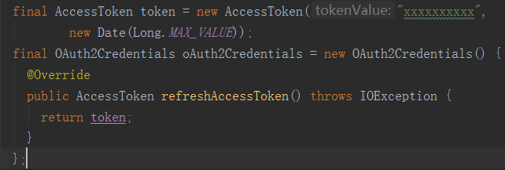 

创建 Stub 时，指定 CallCredentials，代码示例如下（基于 gRPC1.3 版本，不同版本接口可能发生变化）：

```
GoogleAuthLibraryCallCredentials callCredentials =
            new GoogleAuthLibraryCallCredentials(credentials);
blockingStub = GreeterGrpc.newBlockingStub(channel)
.withCallCredentials(callCredentials);
```

下面的代码示例，用于在 GCE 环境中使用 Google 的 OAuth2：

```
ManagedChannel channel = ManagedChannelBuilder.forTarget("pubsub.googleapis.com")
.build();
GoogleCredentials creds = GoogleCredentials.getApplicationDefault();
creds = creds.createScoped(Arrays.asList("https://www.googleapis.com/auth/pubsub"));
CallCredentials callCreds = MoreCallCredentials.from(creds);
PublisherGrpc.PublisherBlockingStub publisherStub =
    PublisherGrpc.newBlockingStub(channel).withCallCredentials(callCreds);
publisherStub.publish(someMessage);
```

#### 自定义安全认证策略

参考 Google 内置的 Credentials 实现类，实现自定义的 Credentials，可以扩展 gRPC 的鉴权策略，Credentials 的实现类如下所示：

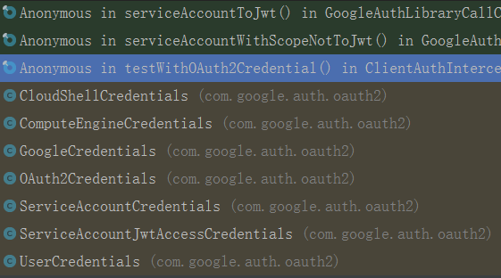 

以 OAuth2Credentials 为例，实现 getRequestMetadata(URI uri) 方法，获取 access token，将其放入 Metadata 中，通过 CallCredentials 将其添加到请求 Header 中发送到服务端，代码示例如下（GoogleAuthLibraryCallCredentials 类）：

```
Map<String, List<String>> metadata = creds.getRequestMetadata(uri);
            Metadata headers;
            synchronized (GoogleAuthLibraryCallCredentials.this) {
              if (lastMetadata == null || lastMetadata != metadata) {
                lastMetadata = metadata;
                lastHeaders = toHeaders(metadata);
              }
              headers = lastHeaders;
            }
            applier.apply(headers);
```

对于扩展方需要自定义 Credentials，实现 getRequestMetadata(URI uri) 方法，由 gRPC 的 CallCredentials 将鉴权信息加入到 HTTP Header 中发送到服务端

## 总结

