## 常用的序列化框架

当进行远程跨进程服务调用时，需要把被传输的数据结构 / 对象序列化为字节数组或者 ByteBuffer。而当远程服务读取到 ByteBuffer 对象或者字节数组时，需要将其反序列化为原始的数据结构 / 对象。利用序列化框架可以实现上述转换工作

### Java 默认的序列化机制

Java 序列化从 JDK 1.1 版本就已经提供，它不需要添加额外的类库，只需实现 java.io.Serializable 并生成序列 ID 即可，因此，它从诞生之初就得到了广泛的应用。但是在远程服务调用（RPC）时，很少直接使用 Java 序列化进行消息的编解码和传输，这又是什么原因呢？下面通过分析 Java 序列化的缺点来找出答案：

* **缺点 1：**无法跨语言，是 Java 序列化最致命的问题。对于跨进程的服务调用，服务提供者可能会使用 C++ 或者其他语言开发，当我们需要和异构语言进程交互时，Java 序列化就难以胜任。

  由于 Java 序列化技术是 Java 语言内部的私有协议，其它语言并不支持，对于用户来说它完全是黑盒。对于 Java 序列化后的字节数组，别的语言无法进行反序列化，这就严重阻碍了它的应用。

  事实上，目前几乎所有流行的 Java RPC 通信框架，都没有使用 Java 序列化作为编解码框架，原因就在于它无法跨语言，而这些 RPC 框架往往需要支持跨语言调用。

* **缺点 2：**相比于业界的一些序列化框架，Java 默认的序列化效能较低，主要体现在：序列化之后的字节数组体积较大，性能较低。

  在同等情况下，编码后的字节数组越大，存储的时候就越占空间，存储的硬件成本就越高，并且在网络传输时更占带宽，导致系统的吞吐量降低。Java 序列化后的码流偏大也一直被业界所诟病，导致它的应用范围受到了很大限制

### Thrift 序列化框架

Thrift 源于 Facebook，在 2007 年 Facebook 将 Thrift 作为一个开源项目提交给 Apache 基金会。

对于当时的 Facebook 来说，创造 Thrift 是为了解决 Facebook 各系统间大数据量的传输通信以及系统之间语言环境不同需要跨平台的特性，因此 Thrift 可以支持多种程序语言，如 C++、Cocoa、Erlang、Haskell、Java、Ocami、Perl、PHP、Python、Ruby 和 Smalltalk。

在多种不同的语言之间通信，Thrift 可以作为高性能的通信中间件使用，它支持数据（对象）序列化和多种类型的 RPC 服务。

Thrift 适用于静态的数据交换，需要先确定好它的数据结构，当数据结构发生变化时，必须重新编辑 IDL 文件，生成代码和编译，这一点跟其他 IDL 工具相比可以视为是 Thrift 的弱项。

Thrift 适用于搭建大型数据交换及存储的通用工具，对于大型系统中的内部数据传输，相对于 JSON 和 XML 在性能和传输大小上都有明显的优势。

Thrift 主要由 5 部分组成:

- **语言系统以及 IDL 编译器：负责由用户给定的 IDL 文件生成相应语言的接口代码；**
- **TProtocol：RPC 的协议层，可以选择多种不同的对象序列化方式，如 JSON 和 Binary；**
- **TTransport：RPC 的传输层，同样可以选择不同的传输层实现，如 socket、NIO、MemoryBuffer 等；**
- **TProcessor：作为协议层和用户提供的服务实现之间的纽带，负责调用服务实现的接口；**
- **TServer：聚合 TProtocol、TTransport 和 TProcessor 等对象。**

我们重点关注的是编解码框架，与之对应的就是 TProtocol。由于 Thrift 的 RPC 服务调用和编解码框架绑定在一起，所以，通常我们使用 Thrift 的时候会采取 RPC 框架的方式。

但是，它的 TProtocol 编解码框架还是可以以类库的方式独立使用的。

与 Protocol Buffers 比较类似的是，Thrift 通过 IDL 描述接口和数据结构定义，它支持 8 种 Java 基本类型、Map、Set 和 List，支持可选和必选定义，功能非常强大。因为可以定义数据结构中字段的顺序，所以它也可以支持协议的前向兼容。

Thrift 支持三种比较典型的编解码方式。

- 通用的二进制编解码；
- 压缩二进制编解码；
- 优化的可选字段压缩编解码。

由于支持二进制压缩编解码，Thrift 的编解码性能表现也相当优异，远远超过 Java 序列化和 RMI 等；

### MessagePack 序列化框架

MessagePack 是一个高效的二进制序列化框架，它像 JSON 一样支持不同语言间的数据交换，但是它的性能更快，序列化之后的码流也更小。

MessagePack 提供了对多语言的支持，官方支持的语言如下：Java、Python、Ruby、Haskell、C#、OCaml、Lua、Go、C、C++ 等。

MessagePack 的 Java API 非常简单，如果使用 MessagePack 进行开发，只需要导入 MessagePack maven 依赖：

```
<dependency>
   <groupId>org.msgpack</groupId>
   <artifactId>msgpack</artifactId>
   <version>${msgpack.version}</version>
</dependency>
```

它的 API 使用示例如下：

```
List<String> src = new ArrayList<String>();
src.add("msgpack");
src.add("kumofs");
src.add("viver");
MessagePack msgpack = new MessagePack();
byte[] raw = msgpack.write(src);
List<String> dst1 =
msgpack.read(raw, Templates.tList(Templates.TString));
```

### Protocol Buffers 序列化框架

Google 的 Protocol Buffers 在业界非常流行，很多商业项目选择 Protocol Buffers 作为编解码框架，当前最新的为 Protocol Buffers v3 版本，它具有如下特点：

- 在谷歌内部长期使用，产品成熟度高；
- 跨语言、支持多种语言，包括 C++、Java 和 Python；
- 编码后的消息更小，更加有利于存储和传输；
- 编解码的性能非常高；
- 支持不同协议版本的前向兼容；
- 支持定义可选和必选字段。

Protocol Buffers 是一个灵活、高效、结构化的数据序列化框架，相比于 XML 等传统的序列化工具，它更小、更快、更简单。

Protocol Buffers 支持数据结构化一次可以到处使用，甚至跨语言使用，通过代码生成工具可以自动生成不同语言版本的源代码，甚至可以在使用不同版本的数据结构进程间进行数据传递，实现数据结构的前向兼容

## Protocol Buffers 介绍

区别于 Thrift，Protocol Buffers 是一个可独立使用的序列化框架，它并不与 gRPC 框架绑定，任何需要支持多语言的 RPC 框架都可以选择使用 Protocol Buffers 作为序列化框架。

Protocol Buffers 的使用主要包括：

- IDL 文件定义（*.proto）, 包含数据结构定义，以及可选的服务接口定义（gRPC）；
- 各种语言的代码生成（含数据结构定义、以及序列化和反序列化接口）；
- 使用 Protocol Buffers 的 API 进行序列化和反序列化。

### 支持的数据结构

Protocol Buffers 提供了对主流语言的常用数据结构的支持，考虑到跨语言特性，因此对于特定语言的特定数据结构并不提供支持，比较典型的如 Java 的 Exception 对象。

#### 标量值类型（基本数据类型）

Protocol Buffers 支持的标量值类型如下：

|  .proto  |  C++   |    Java    |   Go    |
| :------: | :----: | :--------: | :-----: |
|  double  | double |   double   | float64 |
|  float   | float  |   float    | float32 |
|  int32   | int32  |    int     |  int32  |
|  int64   | int64  |    long    |  int64  |
|  uint32  | uint32 |    int     | uint32  |
|  uint64  | uint64 |    long    | uint64  |
|  sint32  | int32  |    int     |  int32  |
|  sint64  | int64  |    long    |  int64  |
| fixed32  | uint32 |    int     | uint32  |
| fixed64  | uint64 |    long    | uint64  |
| sfixed32 | int32  |    int     |  int32  |
| sfixed64 | int64  |    long    |  int64  |
|   bool   |  bool  |  boolean   |  bool   |
|  string  | string |   String   | string  |
|  bytes   | string | ByteString | [] byte |

#### 复杂数据类型

通过 repeated 关键字，标识该字段可以重复任意次数，等价于数组。Protocol Buffers 支持枚举类型，定义示例如下：

```
message QueryInfo{
string queryID = 1;
enum Types{
USER = 0;
GROUP=1;
OTHERS=2;
}
Types type = 2;
}
```

proto3 支持 map 类型的数据结构，它的定义示例如下：

```
map<key_type, value_type> map_field = N;
message ValueType{...}
map<string, ValueType> typeMap = 0;
```

对于 map 数据类型的约束如下：

- 键、值类型可以是内置的基本类型，也可以是自定义 message 类型；
- 不要依赖键值的迭代顺序；
- 不支持 repeated 关键字；
- 如果在解析序列化文件的时候出现多个 Key 的情况，那么将会使用最后一个；如果在解析文本文件的时候出现多个 key，那么将会报错

如果类型不确定，类似 Java 中的泛型，可以使用 proto3 中的 Any 来表示任何类型的数据，它的定义如下：

```
message PramMap{
map<String, google.protobuf.Any> extentionTypes = 1;
}
```

通过 pack() 可以将任何 message 打包成 Any 类型，代码如下（Any 类）：

```
public static <T extends com.google.protobuf.Message> Any pack(
      T message) {
    return Any.newBuilder()
        .setTypeUrl(getTypeUrl("type.googleapis.com",
                               message.getDescriptorForType()))
        .setValue(message.toByteString())
        .build();
  }
```

通过 unpack() 方法，可以将 message 从 Any 类型中取出，代码如下：

```
public <T extends com.google.protobuf.Message> T unpack(
      java.lang.Class<T> clazz)
      throws com.google.protobuf.InvalidProtocolBufferException {
    if (!is(clazz)) {
      throw new com.google.protobuf.InvalidProtocolBufferException(
          "Type of the Any message does not match the given class.");
    }
    if (cachedUnpackValue != null) {
      return (T) cachedUnpackValue;
    }
    T defaultInstance =
        com.google.protobuf.Internal.getDefaultInstance(clazz);
    T result = (T) defaultInstance.getParserForType()
        .parseFrom(getValue());
    cachedUnpackValue = result;
    return result;
  }
```

### IDL 文件定义

按照 Protocol Buffers 的语法在 proto 文件中定义 RPC 请求和响应的数据结构，示例如下：

```
syntax = "proto3";
option java_package = "io.grpc.examples.helloworld";
package helloworld;
message HelloRequest {
  string name = 1;
}
message HelloReply {
  string message = 1;
}
```

其中，syntax proto3 表示使用 v3 版本的 Protocol Buffers，v3 和 v2 版本语法上有较多的变更, 使用的时候需要特别注意。java_package 表示生成代码的存放路径（包路径）。通过 message 关键字来定义数据结构，数据结构的语法为：

数据类型 字段名称 = Tag(field 的唯一标识符，在一个 message 层次中是 unique 的。嵌套 message 可以重新开始。用来标识这些 fields 的二进制编码方式，序列化以及解析的时候会用到)。

message 是支持嵌套的，即 A message 引用 B message 作为自己的 field，它表示的就是对象聚合关系，即 A 对象聚合（引用）了 B 对象。

对于一些公共的数据结构，例如公共 Header，可以通过单独定义公共数据结构 proto 文件，然后导入的方式使用，示例如下：

```
import “/other_protofile.proto”
```

导入也支持级联引用，即 a.proto 导入了 b.proto,b.proto 导入了 c.proto，则 a.proto 可以直接使用 c.proto 中定义的 message。
在实际项目开发时，可以使用 Protocol Buffers 的 IDEA/Eclipse 插件，对.proto 文件的合法性进行校验：

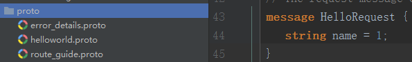 

### 代码生成

基于.proto 文件生成代码有两种方式：

- 单独下载 protoc 工具，通过命令行生成代码；
- 通过 Maven 等构建工具，配置 protoc 命令，在打包 / 构建时生成代码。

通过 protoc 工具生成代码流程如下：

第一步，下载 Protocol Buffers 的 Windows 版本，网址如下：
http://code.google.com/p/protobuf/downloads/detail?name=protoc-2.5.0-win32.zip&can=2&q=

对下载的 protoc-2.5.0-win32.zip 进行解压，如下所示：


第二步，编写 proto 文件，通过执行 protoc 命令，生成代码：

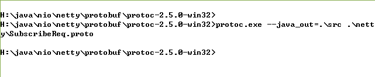

如果使用 maven 构建生成代码，则需要在 pom.xml 中做如下配置：

```
 <plugin>
        <groupId>org.xolstice.maven.plugins</groupId>
        <artifactId>protobuf-maven-plugin</artifactId>
        <version>0.5.0</version>
        <configuration>
     <protocArtifact>com.google.protobuf:protoc:3.2.0:exe:${os.detected.classifier}</protocArtifact>
          <pluginId>grpc-java</pluginId>        <pluginArtifact>io.grpc:protoc-gen-grpc-java:${grpc.version}:exe:${os.detected.classifier}</pluginArtifact>
        </configuration>
        <executions>
          <execution>
            <goals>
              <goal>compile</goal>
              <goal>compile-custom</goal>
            </goals>
          </execution>
        </executions>
      </plugin>
```

### 序列化和反序列化接口调用

#### 原生用法

Protocol Buffers 使用经典的 Build 模式来构建对象，代码示例如下：

```
HelloRequest request
= HelloRequest.newBuilder().setName(name).build();
```

完成对象设值之后，可以通过多种方式将对象转换成字节数组或者输出流，代码如下：

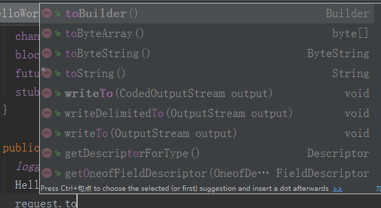

例如，可以通过 toByteArray 将对象直接序列化为字节数组。
反序列化时，Protocol Buffers 提供了多种接口用于将字节数组 / 输入流转换成原始对象，相关接口如下所示：

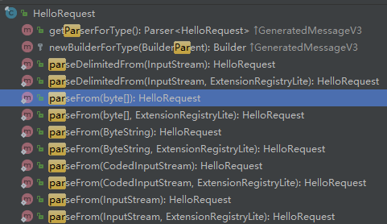

#### Netty 中使用

Netty 提供了对 Protocol Buffers 的支持，在服务端和客户端创建时，只需要将 Protocol Buffers 相关的 CodeC Handler 加入到 ChannelPipeline 中即可。

支持 Protocol Buffers 的 Netty 服务端创建示例如下：

```
public void initChannel(SocketChannel ch) {
			     ch.pipeline().addLast(
			     new ProtobufVarint32FrameDecoder());
			    ch.pipeline().addLast(
				    new ProtobufDecoder(
					    SubscribeReqProto.SubscribeReq
						    .getDefaultInstance()));
			    ch.pipeline().addLast(
				    new ProtobufVarint32LengthFieldPrepender());
			    ch.pipeline().addLast(new ProtobufEncoder());
			    ch.pipeline().addLast(new SubReqServerHandler());
			}
```

支持 Protocol Buffers 的 Netty 客户端创建示例如下：

```
public void initChannel(SocketChannel ch)
				throws Exception {
			    ch.pipeline().addLast(
				    new ProtobufVarint32FrameDecoder());
			    ch.pipeline().addLast(
				    new ProtobufDecoder(
					    SubscribeRespProto.SubscribeResp
						    .getDefaultInstance()));
			    ch.pipeline().addLast(
				    new ProtobufVarint32LengthFieldPrepender());
			    ch.pipeline().addLast(new ProtobufEncoder());
			    ch.pipeline().addLast(new SubReqClientHandler());
			}
```

## gRPC 序列化原理分析

gRPC 默认使用 Protocol Buffers 作为 RPC 序列化框架，通过 Protocol Buffers 对消息进行序列化和反序列化，然后通过 Netty 的 HTTP/2，以 Stream 的方式进行数据传输。

由于存在一些特殊的处理，gRPC 并没有直接使用 Netty 提供的 Protocol Buffers Handler, 而是自己集成 Protocol Buffers 工具类进行序列化和反序列化，下面一起分析它的设计和实现原理

### 客户端请求消息序列化

客户端通过 Build 模式构造请求消息，然后通过同步 / 异步方式发起 RPC 调用，gRPC 框架负责客户端请求消息的序列化，以及 HTTP/2 Header 和 Body 的构造，然后通过 Netty 提供的 HTTP/2 协议栈，将 HTTP/2 请求消息发送给服务端

#### 数据流图

客户端请求消息的发送流程如下所示：

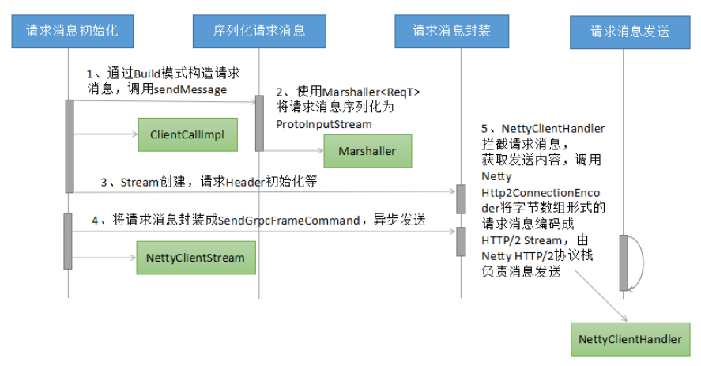 

请求消息的序列化主要包含 5 个步骤：

- **请求消息的构建：**使用 Protocol Buffers 生成的代码，通过 build 模式对请求消息设值，完成请求消息的初始化；
- **请求消息的序列化：**使用 Protocol Buffers 的 Marshaller 工具类，对于生成的请求对象（继承自 com.google.protobuf.GeneratedMessageV3）进行序列化，生成 ProtoInputStream；
- **请求消息的首次封装：**主要用于创建 NettyClientStream、构造 gRPC 的 HTTP/2 消息头等；
- **请求消息的二次封装：**将序列化之后的请求消息封装成 SendGrpcFrameCommand，通过异步的方式由 Netty 的 NIO 线程执行消息的发送；
- gRPC 的 NettyClientHandler 拦截到 write 的请求消息之后，根据 Command 类型判断是业务消息发送，调用 Netty 的 Http2ConnectionEncoder，由 Netty 的 HTTP/2 协议栈创建 HTTP/2 Stream 并最终发送给服务端

#### 工作原理与源码分析

调用 ClientCallImpl 的 sendMessage，发送请求消息（ClientCallImpl 类）：

```
public void sendMessage(ReqT message) {
    Preconditions.checkState(stream != null, "Not started");
    Preconditions.checkState(!cancelCalled, "call was cancelled");
    Preconditions.checkState(!halfCloseCalled, "call was half-closed");
    try {
      InputStream messageIs = method.streamRequest(message);
      stream.writeMessage(messageIs);
...
```

实际上并未真正发送消息，而是使用 Protocol Buffers 对消息做序列化（ProtoLiteUtils 类）：

```
return new PrototypeMarshaller<T>() {
      @Override
      public Class<T> getMessageClass() {
        return (Class<T>) defaultInstance.getClass();
      }
      @Override
      public T getMessagePrototype() {
        return defaultInstance;
      }
      @Override
      public InputStream stream(T value) {
        return new ProtoInputStream(value, parser);
      }
```

序列化完成之后，调用 ClientStream 的 writeMessage，对请求消息进行封装（DelayedStream 类）：

```
public void writeMessage(final InputStream message) {
    checkNotNull(message, "message");
    if (passThrough) {
      realStream.writeMessage(message);
    } else {
      delayOrExecute(new Runnable() {
        @Override
        public void run() {
          realStream.writeMessage(message);
        }
      });
    }
  }
```

根据序列化之后的消息长度，更新 HTTP/2 Header 的 content-length（MessageFramer 类）：

```
ByteBuffer header = ByteBuffer.wrap(headerScratch);
    header.put(UNCOMPRESSED);
    header.putInt(messageLength);
```

完成发送前的准备工作之后，调用 halfClose 方法，开始向 HTTP/2 协议栈发送消息（DelayedStream 类）：

```
public void halfClose() {
    delayOrExecute(new Runnable() {
      @Override
      public void run() {
        realStream.halfClose();
      }
    });
  }
```

序列化之后的请求消息通过 NettyClientStream 的 Sink，被包装成 SendGrpcFrameCommand，加入到 WriteQueue 中，异步发送（NettyClientStream 类）：

```
public void writeFrame(WritableBuffer frame, boolean endOfStream, boolean flush) {
      ByteBuf bytebuf = frame == null ? EMPTY_BUFFER : ((NettyWritableBuffer) frame).bytebuf();
      final int numBytes = bytebuf.readableBytes();
      if (numBytes > 0) {
        onSendingBytes(numBytes);
        writeQueue.enqueue(
            new SendGrpcFrameCommand(transportState(), bytebuf, endOfStream),
            channel.newPromise().addListener(new ChannelFutureListener() {
...
```

通过 flush() 将发送队列排队的 SendGrpcFrameCommand 写入到 channel 中 (WriteQueue 类)：

```
private void flush() {
    try {
      QueuedCommand cmd;
      int i = 0;
      boolean flushedOnce = false;
      while ((cmd = queue.poll()) != null) {
        channel.write(cmd, cmd.promise());
 if (++i == DEQUE_CHUNK_SIZE) {
          i = 0;
          channel.flush();
...
```

gRPC 的 NettyClientHandler 拦截到发送消息，对消息类型做判断（NettyClientHandler 类）：

```
public void write(ChannelHandlerContext ctx, Object msg, ChannelPromise promise)
          throws Exception {
    if (msg instanceof CreateStreamCommand) {
      createStream((CreateStreamCommand) msg, promise);
    } else if (msg instanceof SendGrpcFrameCommand) {
      sendGrpcFrame(ctx, (SendGrpcFrameCommand) msg, promise);
...
```

调用 sendGrpcFrame，通过 Netty 提供的 Http2ConnectionEncoder，完成 HTTP/2 消息的发送：

```
private void sendGrpcFrame(ChannelHandlerContext ctx, SendGrpcFrameCommand cmd,
      ChannelPromise promise) {
    encoder().writeData(ctx, cmd.streamId(), cmd.content(), 0, cmd.endStream(), promise);
  }
```

#### 线程模型

请求消息构建、请求消息序列化、请求消息封装都由客户端用户线程执行，示例如下：

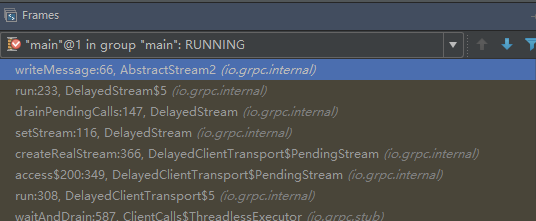 

请求消息的发送，由 Netty 的 NIO 线程执行，示例如下（Netty 的 EventLoopGroup）：

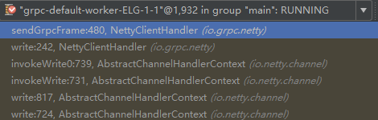 

### 服务端读取请求消息反序列化

服务端接收到客户端的 HTTP/2 请求消息之后，由 Netty HTTP/2 协议栈的 FrameListener.onDataRead 方法调用 gRPC 的 NettyServerHandler，对请求消息进行解析和处理

#### 数据流图

服务端读取客户端请求消息并进行序列化的流程如下所示（HTTP/2 Header 的处理步骤省略）：

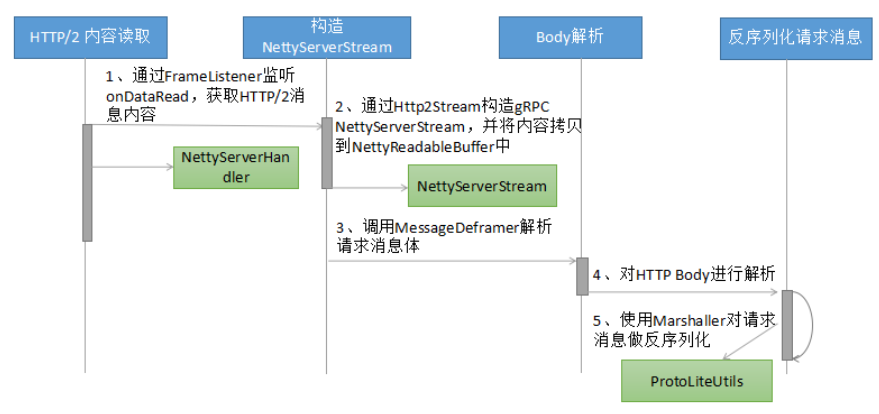 

#### 工作原理与源码分析

Netty 的 HTTP/2 监听器回调 gRPC 的 NettyServerHandler，通知 gRPC 处理 HTTP/2 消息（NettyServerHandler 类）：

```
private void onDataRead(int streamId, ByteBuf data, int padding, boolean endOfStream)
      throws Http2Exception {
    flowControlPing().onDataRead(data.readableBytes(), padding);
    try {
      NettyServerStream.TransportState stream = serverStream(requireHttp2Stream(streamId));
      stream.inboundDataReceived(data, endOfStream);
...
```

如果流控校验通过，则调用 MessageDeframer 处理请求消息（AbstractStream2 类）：

```
protected final void deframe(ReadableBuffer frame, boolean endOfStream) {
      if (deframer.isClosed()) {
        frame.close();
        return;
      }
      try {
        deframer.deframe(frame, endOfStream);
...
```

异步处理，由 gRPC 的 SerializingExecutor 负责 body 的解析（JumpToApplicationThreadServerStreamListener 类）：

```
public void messageRead(final InputStream message) {
      callExecutor.execute(new ContextRunnable(context) {
        @Override
        public void runInContext() {
          try {
            getListener().messageRead(message);
...
```

调用 ProtoLiteUtils 的 Marshaller，通过 parse(InputStream stream) 方法将 NettyReadableBuffer 反序列化为原始的请求消息，代码如下（ProtoLiteUtils 类）：

```
public T parse(InputStream stream) {
        if (stream instanceof ProtoInputStream) {
          ProtoInputStream protoStream = (ProtoInputStream) stream;
          if (protoStream.parser() == parser) {
            try {
              @SuppressWarnings("unchecked")
              T message = (T) ((ProtoInputStream) stream).message();
              return message;
...
```

#### 线程模型

Netty HTTP/2 消息的读取和校验等，由 Netty NIO 线程负责，示例如下：

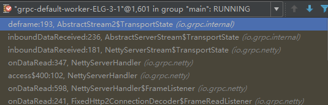 

后续 HTTP Body 的反序列化，则由 gRPC 的 SerializingExecutor 线程池完成：

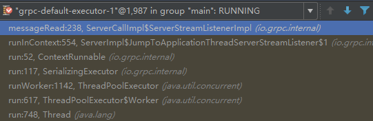 

### 服务端响应消息序列化

服务端接口调用完成之后，需要将响应消息序列化，然后通过 HTTP/2 Stream（与请求相同的 Stream ID）发送给客户端

#### 数据流图

服务端响应的发送流程如下所示：

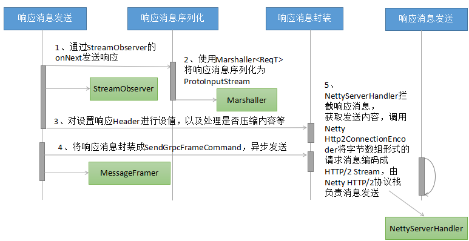 

响应消息发送的主要步骤说明如下：

- 服务端的接口实现类中调用 responseObserver.onNext(reply)，触发响应消息的发送流程；
- 响应消息的序列化：使用 Protocol Buffers 的 Marshaller 工具类，对于生成的响应对象（继承自 com.google.protobuf.GeneratedMessageV3）进行序列化，生成 ProtoInputStream；
- 对 HTTP 响应 Header 进行处理，包括设置响应消息的 content-length 字段，根据是否压缩标识对响应消息进行 gzip 压缩等；
- 对响应消息进行二次封装，将序列化之后的响应消息封装成 SendGrpcFrameCommand，通过异步的方式由 Netty 的 NIO 线程执行消息的发送；
- gRPC 的 NettyServerHandler 拦截到 write 的请求消息之后，根据 Command 类型判断是业务消息发送，调用 Netty 的 Http2ConnectionEncoder，由 Netty 的 HTTP/2 协议栈创建 HTTP/2 Stream 并最终发送给客户端

#### 工作原理与源码分析

调用 onNext 方法，发送 HTTP Header 和响应（ServerCallStreamObserverImpl 类）：

```
public void onNext(RespT response) {
      if (cancelled) {
        throw Status.CANCELLED.asRuntimeException();
      }
      if (!sentHeaders) {
        call.sendHeaders(new Metadata());
        sentHeaders = true;
      }
      call.sendMessage(response);
    }
```

在 sendMessage 中，调用 Marshaller的 streamResponse，将响应消息通过 Protocol Buffers 进行序列化（ServerCallImpl 类）：

```
public void sendMessage(RespT message) {
    checkState(sendHeadersCalled, "sendHeaders has not been called");
    checkState(!closeCalled, "call is closed");
    try {
      InputStream resp = method.streamResponse(message);
      stream.writeMessage(resp);
      stream.flush();
...
```

完成序列化之后，调用 flush 发送响应消息（AbstractServerStream 类）：

```
public final void deliverFrame(WritableBuffer frame, boolean endOfStream, boolean flush) {
    abstractServerStreamSink().writeFrame(frame, endOfStream ? false : flush);
  }
```

将封装之后的 SendGrpcFrameCommand 加入到 writeQueue 中，异步发送（NettyServerStream 类）：

```
public void writeFrame(WritableBuffer frame, boolean flush) {
      if (frame == null) {
        writeQueue.scheduleFlush();
        return;
      }
      ByteBuf bytebuf = ((NettyWritableBuffer) frame).bytebuf();
      final int numBytes = bytebuf.readableBytes();
      onSendingBytes(numBytes);
      writeQueue.enqueue(
          new SendGrpcFrameCommand(transportState(), bytebuf, false),...
```

NettyServerHandler 拦截到响应消息之后，根据 Command 进行判断，调用 sendGrpcFrame，由 Netty 的 Http2ConnectionEncoder 负责将 HTTP/2 消息发送给客户端（NettyServerHandler）：

```
private void sendGrpcFrame(ChannelHandlerContext ctx, SendGrpcFrameCommand cmd,
      ChannelPromise promise) throws Http2Exception {
    if (cmd.endStream()) {
      closeStreamWhenDone(promise, cmd.streamId());
    }
    encoder().writeData(ctx, cmd.streamId(), cmd.content(), 0, cmd.endStream(), promise);
  }
```

#### 线程模型

响应消息的序列化、以及 HTTP Header 的初始化等操作由 gRPC 的 SerializingExecutor 线程池负责，示例如下：

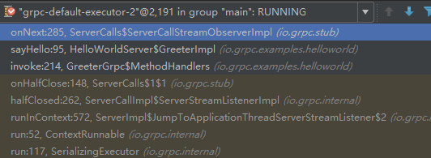 

HTTP/2 消息的编码以及后续发送，由 Netty 的 NIO 线程池负责：

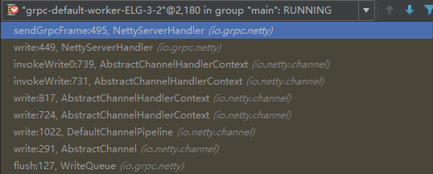 

### 客户端响应消息反序列化

客户端接收到服务端响应之后，将 HTTP/2 Body 反序列化为原始的响应消息，然后回调到客户端监听器，驱动业务获取响应并继续执行。

#### 数据流图

客户端接收响应的流程图如下所示：

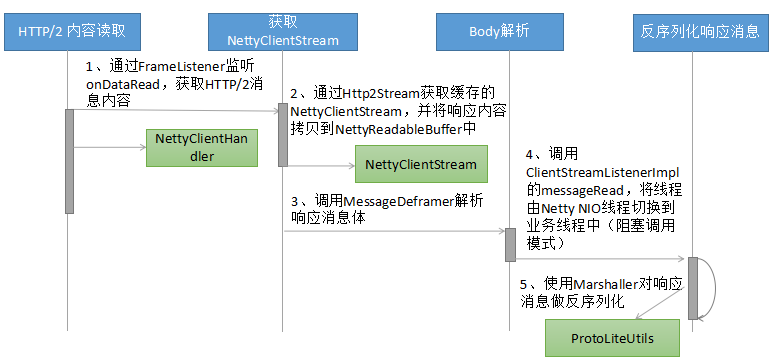 

主要的处理流程分析如下：

- 与服务端接收请求类似，都是通过 Netty HTTP/2 协议栈的 FrameListener 监听并回调 gRPC Handler（此处是 NettyClientHandler），读取消息；
- 根据 streamId，可以获取 Http2Stream，通过 Http2Stream 的 getProperty 方法获取 NettyClientStream；
- 调用 MessageDeframer 的 deframe 方法，对响应消息体进行解析。客户端和服务端实现机制不同（通过不同的 Listener 重载 messageRead 方法）；
- 调用 ClientStreamListenerImpl 的 messageRead 进行线程切换，将反序列化操作切换到 gRPC 工作线程或者客户端业务线程中（同步阻塞调用）；
- 调用 Protocol Buffers 的 Marshaller对响应消息进行反序列化，还原成原始的 message 对象。

#### 工作原理与源码分析

客户端接收到响应消息之后，根据 streamId 关联获取到 NettyClientStream（NettyClientHandler 类）：、

```
private void onDataRead(int streamId, ByteBuf data, int padding, boolean endOfStream) {
    flowControlPing().onDataRead(data.readableBytes(), padding);
    NettyClientStream.TransportState stream = clientStream(requireHttp2Stream(streamId));
    stream.transportDataReceived(data, endOfStream);
...
```

调用 NettyClientStream 的 transportDataReceived，将响应消息拷贝到 NettyReadableBuffer，进行后续处理（NettyClientStream 类）：

```
void transportDataReceived(ByteBuf frame, boolean endOfStream) {
      transportDataReceived(new NettyReadableBuffer(frame.retain()), endOfStream);
    }
```

通过 MessageDeframer 的 processBody 处理响应消息体（MessageDeframer 类）：

```
private void processBody() {
    InputStream stream = compressedFlag ? getCompressedBody() : getUncompressedBody();
    nextFrame = null;
    listener.messageRead(stream);
    state = State.HEADER;
    requiredLength = HEADER_LENGTH;
  }
```

对于客户端，调用的是 ClientStreamListenerImpl 的 messageRead 方法，代码如下（ClientStreamListenerImpl 类）：

```
public void messageRead(final InputStream message) {
      class MessageRead extends ContextRunnable {
        MessageRead() {
          super(context);
        }
        @Override
        public final void runInContext() {
          try {
            if (closed) {
              return;
            }
            try {
              observer.onMessage(method.parseResponse(message));
```

在此处，完成了 Netty NIO 线程到 gRPC 工作线程（被阻塞的业务线程）的切换，由切换之后的业务线程负责响应的反序列化，代码如下（ClientStreamListenerImpl 类）：

```
try {
              observer.onMessage(method.parseResponse(message));
            } finally {
              message.close();
            }
```

调用 MethodDescriptor 的 parseResponse：

```
public RespT parseResponse(InputStream input) {
    return responseMarshaller.parse(input);
  }
```

## 总结