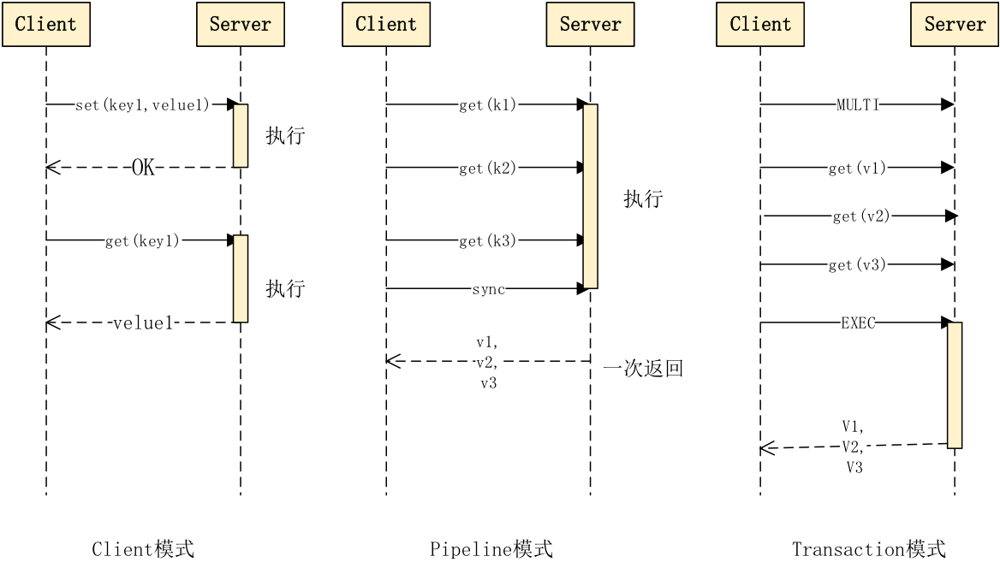

## jedis概述

### redis工作模式

 

jedis的四大模块对应了redis的四大工作模式

* Redis Standalone（单节点模式）
* Redis Cluster（集群模式）
* Redis Sentinel（哨兵模式）
* Redis Sharding（分片模式）

### jedis请求模式

​	每个Jedis实例对应一个Redis节点，我们对Jedis实例的每个操作，都相当于使用`redis-cli`启动客户端的直接操作。无论是集群模式，哨兵模式，还是分片模式，内部均为对Jedis实例的操作。所以了解Jedis类的内部结构及Jedis实例的请求模式是掌握Jedis框架的基础。

​	Jedis实例有3种请求模式，Pipeline，Transaction和Client

 

Jedis的三种请求模式 

#### Client模式

 Client模式就是常用的“所见即所得”，客户端发一个命令，阻塞等待服务端执行，然后读取返回结果。优点是确保每次处理都有结果，一旦发现返回结果中有Error,就可以立即处理。

#### Pipeline模式

 Pipeline模式则是一次性发送多个命令，最后一次取回所有的返回结果，这种模式通过减少网络的往返时间和IO的读写次数，大幅度提高通信性能，但Pipeline不支持原子性，如果想保证原子性，可同时开启事务模式。

#### Transaction模式

Transaction模式即开启Redis的事务管理，Pipeline可以在事务中，也可以不在事务中。事务模式开启后，所有的命令（除了 **EXEC** 、 **DISCARD** 、 **MULTI** 和 **WATCH** ）到达服务端以后，不会立即执行，会进入一个等待队列，等到收到下述四个命令时执行不同操作：

- **EXEC**命令执行时， 服务器以先进先出（FIFO）的方式执行事务队列中的命令,当事务队列里的所有命令被执行完之后， 将回复队列作为自己的执行结果返回给客户端， 客户端从事务状态返回到非事务状态， 至此， 事务执行完毕。
- **DISCARD**命令用于取消一个事务， 它清空客户端的整个事务队列， 然后将客户端从事务状态调整回非事务状态， 最后返回字符串 OK 给客户端， 说明事务已被取消。
- **Redis** 的事务是不可嵌套的， 当客户端已经处于事务状态， 而客户端又再向服务器发送MULTI时， 服务器只是简单地向客户端发送一个错误， 然后继续等待其他命令的入队。 MULTI命令的发送不会造成整个事务失败， 也不会修改事务队列中已有的数据。
- **WATCH**只能在客户端进入事务状态之前执行， 在事务状态下发送 WATCH命令会引发一个错误， 但它不会造成整个事务失败， 也不会修改事务队列中已有的数据（和前面处理 MULTI的情况一样）

## 源码分析

### 核心类

 

