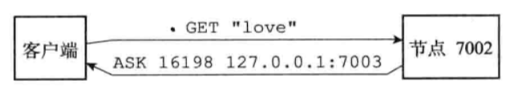

## jedis概述

### redis工作模式

 

jedis的四大模块对应了redis的四大工作模式

* Redis Standalone（单节点模式）
* Redis Cluster（集群模式）
* Redis Sentinel（哨兵模式）
* Redis Sharding（分片模式）

### jedis请求模式

​	每个Jedis实例对应一个Redis节点，我们对Jedis实例的每个操作，都相当于使用`redis-cli`启动客户端的直接操作。无论是集群模式，哨兵模式，还是分片模式，内部均为对Jedis实例的操作。所以了解Jedis类的内部结构及Jedis实例的请求模式是掌握Jedis框架的基础。

​	Jedis实例有3种请求模式，Pipeline，Transaction和Client

 

​	Jedis的三种请求模式 

#### Client模式

 Client模式就是常用的“所见即所得”，客户端发一个命令，阻塞等待服务端执行，然后读取返回结果。优点是确保每次处理都有结果，一旦发现返回结果中有Error,就可以立即处理。

#### Pipeline模式

 Pipeline模式则是一次性发送多个命令，最后一次取回所有的返回结果，这种模式通过减少网络的往返时间和IO的读写次数，大幅度提高通信性能，但Pipeline不支持原子性，如果想保证原子性，可同时开启事务模式。

#### Transaction模式

Transaction模式即开启Redis的事务管理，Pipeline可以在事务中，也可以不在事务中。事务模式开启后，所有的命令（除了 **EXEC** 、 **DISCARD** 、 **MULTI** 和 **WATCH** ）到达服务端以后，不会立即执行，会进入一个等待队列，等到收到下述四个命令时执行不同操作：

- **EXEC**命令执行时， 服务器以先进先出（FIFO）的方式执行事务队列中的命令,当事务队列里的所有命令被执行完之后， 将回复队列作为自己的执行结果返回给客户端， 客户端从事务状态返回到非事务状态， 至此， 事务执行完毕。
- **DISCARD**命令用于取消一个事务， 它清空客户端的整个事务队列， 然后将客户端从事务状态调整回非事务状态， 最后返回字符串 OK 给客户端， 说明事务已被取消。
- **Redis** 的事务是不可嵌套的， 当客户端已经处于事务状态， 而客户端又再向服务器发送MULTI时， 服务器只是简单地向客户端发送一个错误， 然后继续等待其他命令的入队。 MULTI命令的发送不会造成整个事务失败， 也不会修改事务队列中已有的数据。
- **WATCH**只能在客户端进入事务状态之前执行， 在事务状态下发送 WATCH命令会引发一个错误， 但它不会造成整个事务失败， 也不会修改事务队列中已有的数据（和前面处理 MULTI的情况一样）

## jedis模块分析

### 核心类

 

- Jedis以输入的命令参数是否为二进制，将处理请求的具体实现分为两个类中，例如Jedis和BinaryJedis、Client和BinaryClient
- 与Redis服务器的连接信息封装在Client的基类Connection中
- BinaryJedis类中包含了Client、Pipeline和Transaction变量，对应3种请求模式

### 初始化

```
        Jedis jedis = new Jedis("localhost", 6379, 10000);

        Transaction transaction = jedis.multi();

        Pipeline pipeline = jedis.pipelined();
```

​	Jedis通过传入Redis服务器地址（host、port）开始初始化，然后在BinaryJedis里实例化Client。Client通过Socket维持客户端与Redis服务器的连接
Transaction和Pipeline继承同一个基类MultiKeyPipelineBase。

​	Transaction在实例化的时候，就自动发送MULTI命令，开启事务模式；Pipeline按情况手动开启。它们均依靠Client发送命令

### Jedis调用

#### Client模式

以`get(key)`为例，Jedis代码如下：

```
public class Jedis extends BinaryJedis implements JedisCommands, MultiKeyCommands,
    AdvancedJedisCommands, ScriptingCommands, BasicCommands, ClusterCommands, SentinelCommands,
    ModuleCommands {

	@Override
  public String get(final String key) {
    // 校验是否是transaction模式或者pipeline模式
    checkIsInMultiOrPipeline();
    // 1)调用client发送命令
    client.get(key);
    // 2)从inputStream里读取回复
    return client.getBulkReply();
  }
```

代码1)处会调用Connection的`sendCommand()`方法，再调用Protocol的`sendCommand()`方法按照Redis的同一请求协议组织Redis命令，写入outputStream

```
public class Connection implements Closeable {
  
  public void sendCommand(final ProtocolCommand cmd, final byte[]... args) {
    try {
      // 连接socket,如果已连接,跳过
      connect();
      // 按照redis的同一请求协议组织redis命令,写入outputStream
      Protocol.sendCommand(outputStream, cmd, args);
    } catch (JedisConnectionException ex) {
      /*
       * When client send request which formed by invalid protocol, Redis send back error message
       * before close connection. We try to read it to provide reason of failure.
       */
      try {
        String errorMessage = Protocol.readErrorLineIfPossible(inputStream);
        if (errorMessage != null && errorMessage.length() > 0) {
          ex = new JedisConnectionException(errorMessage, ex.getCause());
        }
      } catch (Exception e) {
        /*
         * Catch any IOException or JedisConnectionException occurred from InputStream#read and just
         * ignore. This approach is safe because reading error message is optional and connection
         * will eventually be closed.
         */
      }
      // Any other exceptions related to connection?
      broken = true;
      throw ex;
    }
  }

```

代码2)处调用Connection的`getBulkReply()`方法，再调用Protocol的`read()`方法从inputStream中读取服务器的回复，此处会阻塞等待

```
public class Connection implements Closeable {
  
  public String getBulkReply() {
    final byte[] result = getBinaryBulkReply();
    if (null != result) {
      return SafeEncoder.encode(result);
    } else {
      return null;
    }
  }

  public byte[] getBinaryBulkReply() {
    flush();
    return (byte[]) readProtocolWithCheckingBroken();
  }

  protected Object readProtocolWithCheckingBroken() {
    if (broken) {
      throw new JedisConnectionException("Attempting to read from a broken connection");
    }

    try {
      // 从inputStream中读取服务器的回复,此处阻塞等待
      return Protocol.read(inputStream);
    } catch (JedisConnectionException exc) {
      broken = true;
      throw exc;
    }
  }
```

 

​	Protocol是一个通讯工具类，将Redis的各类执行关键字存储为静态变量，可以直观调用命令，例如Protocol.Command.GET。同时，将命令包装成符合Redis的统一请求协议，回复消息的处理也是在这个类进行，先通过通讯协提取出当次请求的回复消息，将Object类型的消息，格式化为String、List等具体类型，如果回复消息有Error则以异常的形式抛出

**Protocol核心方法如下**：

```
public final class Protocol {
  
  // 按照redis的同一请求协议组织redis命令,写入outputStream
  public static void sendCommand(final RedisOutputStream os, final ProtocolCommand command,
      final byte[]... args)  
    
  // 从inputStream中读取服务器的回复,此处阻塞等待,调用process()方法处理消息
  public static Object read(final RedisInputStream is)
    
  // 通过检查服务器发回数据的第一个字节,确定这个回复是什么类型,分别交给下面5个函数处理  
  private static Object process(final RedisInputStream is) 
    
  // 处理状态回复  
  private static byte[] processStatusCodeReply(final RedisInputStream is)
   
  // 处理批量回复  
  private static byte[] processBulkReply(final RedisInputStream is)
    
  // 处理多条批量回复  
  private static List<Object> processMultiBulkReply(final RedisInputStream is)
  
  // 处理整数回复
  private static Long processInteger(final RedisInputStream is)  
    
  // 处理错误回复  
  private static void processError(final RedisInputStream is)    
```

#### Pipeline模式

 

- Pipeline和Transaction都继承自MultiKeyPipelineBase
- MultiKeyPipelineBase和PipelineBase的区别在于处理的命令不同，内部均调用Client发送命令
- Pipeline有一个内部类对象MultiResponseBuilder，当调用Pipeline的sync()之前，存储所有返回结果

Pipeline的使用方法：

```
Pipeline pipeline = jedis.pipelined();
Response<String> key1 = pipeline.get("key1");
Response<String> key2 = pipeline.get("key2");
Response<String> key3 = pipeline.get("key3");
pipeline.sync();
System.out.println("value1:" + key1.get() + ",value2:" + key2.get() + ",value3:" + key3.get());
```

以`get(key)`为例，Pipeline代码如下：

```
public abstract class PipelineBase extends Queable implements BinaryRedisPipeline, RedisPipeline {
  
  @Override
  public Response<String> get(final String key) {
    // 调用client发送命令
    getClient(key).get(key);
    // 新建response,放入消息队列queue,此时response没有数据
    return getResponse(BuilderFactory.STRING);
  }
```

```
public class Queable {
  private Queue<Response<?>> pipelinedResponses = new LinkedList<>();
  
  protected <T> Response<T> getResponse(Builder<T> builder) {
    Response<T> lr = new Response<>(builder);
    pipelinedResponses.add(lr);
    return lr;
  }
```

Pipeline的`sync()`方法代码如下：

```
public class Pipeline extends MultiKeyPipelineBase implements Closeable {
  
  public void sync() {
    // 判断消息队列是否为空,是否发出请求
    if (getPipelinedResponseLength() > 0) {
      // 1)从inputStream中获取回复消息,消息塞入消息队列的response中
      List<Object> unformatted = client.getMany(getPipelinedResponseLength());
      for (Object o : unformatted) {
        generateResponse(o);
      }
    }
  }

```

代码1)会调用Connection的`getMany()`方法，代码如下：

```
public class Connection implements Closeable {
  
	public List<Object> getMany(final int count) {
    flush();
    final List<Object> responses = new ArrayList<>(count);
    for (int i = 0; i < count; i++) {
      try {
        responses.add(readProtocolWithCheckingBroken());
      } catch (JedisDataException e) {
        responses.add(e);
      }
    }
    return responses;
  }

  protected Object readProtocolWithCheckingBroken() {
    if (broken) {
      throw new JedisConnectionException("Attempting to read from a broken connection");
    }

    try {
      // 从inputStream中读取服务器的回复,此处阻塞等待
      return Protocol.read(inputStream);
    } catch (JedisConnectionException exc) {
      broken = true;
      throw exc;
    }
  }

```

Pipeline的`sync()`方法中调用Queable的方法如下：

```
public class Queable {
  private Queue<Response<?>> pipelinedResponses = new LinkedList<>();
  
  protected Response<?> generateResponse(Object data) {
    Response<?> response = pipelinedResponses.poll();
    if (response != null) {
      response.set(data);
    }
    return response;
  }
  
  protected int getPipelinedResponseLength() {
    return pipelinedResponses.size();
  }  
```


#### Transaction模式

```
Transaction transaction = jedis.multi();
Response<String> key1 = transaction.get("key1");
Response<String> key2 = transaction.get("key2");
Response<String> key3 = transaction.get("key3");
transaction.exec();
System.out.println("value1:" + key1.get() + ",value2:" + key2.get() + ",value3:" + key3.get());
```

Transaction的`exec()`方法和Pipeline的`sync()`很相似，代码如下

```
public class Transaction extends MultiKeyPipelineBase implements Closeable {
  
  public List<Object> exec() {
    // 清空inputstream里面的所有数据,忽略QUEUED or ERROR回复
    client.getMany(getPipelinedResponseLength());
    // 发送EXEC指令,让服务端执行所有命令
    client.exec();
    // 事务结束
    inTransaction = false;

    // 从inputStream中读取所有回复
    List<Object> unformatted = client.getObjectMultiBulkReply();
    if (unformatted == null) {
      return null;
    }
    // 处理响应结果
    List<Object> formatted = new ArrayList<>();
    for (Object o : unformatted) {
      try {
        formatted.add(generateResponse(o).get());
      } catch (JedisDataException e) {
        formatted.add(e);
      }
    }
    return formatted;
  }
```

## JedisCluster模块分析

 

- 由于Jedis本身不是线程安全的，所以选择使用对象池JedisPool来保证线程安全
- 在JedisClusterInfoCache中，保存了节点和槽位的一一对应关系，为每个节点建立一个对象JedisPool，并保存在map中。这个类主要用于保存集群的配置信息

### 使用方式

```
  public static void main(String[] args) throws IOException {

        JedisPoolConfig config = new JedisPoolConfig();
        config.setMaxTotal(20);
        config.setMaxIdle(10);
        config.setMinIdle(5);

        Set<HostAndPort> jedisClusterNode = new HashSet<HostAndPort>();
        jedisClusterNode.add(new HostAndPort("192.168.18.131", 8001));
        jedisClusterNode.add(new HostAndPort("192.168.18.131", 8004));
        jedisClusterNode.add(new HostAndPort("192.168.18.132", 8002));
        jedisClusterNode.add(new HostAndPort("192.168.18.132", 8005));
        jedisClusterNode.add(new HostAndPort("192.168.18.133", 8003));
        jedisClusterNode.add(new HostAndPort("192.168.18.133", 8006));

        JedisCluster jedisCluster = null;
        try {
            //connectionTimeout：指的是连接一个url的连接等待时间
            //soTimeout：指的是连接上一个url，获取response的返回等待时间
            jedisCluster = new JedisCluster(jedisClusterNode, 6000, 5000, 10, "artisan", config);
            System.out.println(jedisCluster.set("clusterArtisan", "artisanValue"));
            System.out.println(jedisCluster.get("clusterArtisan"));
        } catch (Exception e) {
            e.printStackTrace();
        } finally {
            if (jedisCluster != null)
                jedisCluster.close();
        }
    }
```

这里是个简单的demo， 生产中用的话，需要确保jedisCluster是单例的，并且无需手工调用close，不然的话 这个连接池就关闭了，你就无法获取到连接了。

参考：https://cloud.tencent.com/developer/article/1862807

### JedisCluster的初始化

```
public class JedisCluster extends BinaryJedisCluster implements JedisClusterCommands,
    MultiKeyJedisClusterCommands, JedisClusterScriptingCommands {
      
  public JedisCluster(Set<HostAndPort> nodes) {
    this(nodes, DEFAULT_TIMEOUT);
  }
      
  public JedisCluster(Set<HostAndPort> nodes, int timeout) {
    this(nodes, timeout, DEFAULT_MAX_ATTEMPTS);
  }

  public JedisCluster(Set<HostAndPort> nodes, int timeout, int maxAttempts) {
    this(nodes, timeout, maxAttempts, new GenericObjectPoolConfig<Jedis>());
  }
      
  public JedisCluster(Set<HostAndPort> jedisClusterNode, int timeout, int maxAttempts,
      final GenericObjectPoolConfig<Jedis> poolConfig) {
    super(jedisClusterNode, timeout, maxAttempts, poolConfig);
  }      
```

* JedisCluster的构造函数会调用父类BinaryJedisCluster的构造函数

  ```
  public class BinaryJedisCluster implements BinaryJedisClusterCommands,
      MultiKeyBinaryJedisClusterCommands, JedisClusterBinaryScriptingCommands, Closeable {
    
    // 连接超时或读取超时,默认2秒
    public static final int DEFAULT_TIMEOUT = 2000;
    // 当JedisCluster连接失败时的重试次数,默认5次
    public static final int DEFAULT_MAX_ATTEMPTS = 5;
        
    protected JedisClusterConnectionHandler connectionHandler;    
        
    public BinaryJedisCluster(Set<HostAndPort> jedisClusterNode, int timeout, int maxAttempts,
        final GenericObjectPoolConfig<Jedis> poolConfig) {
      this(jedisClusterNode, timeout, timeout, maxAttempts, poolConfig);
    }
        
    public BinaryJedisCluster(Set<HostAndPort> jedisClusterNode, int connectionTimeout,
        int soTimeout, int maxAttempts, String user, String password, String clientName,
        GenericObjectPoolConfig<Jedis> poolConfig) {
      this.connectionHandler = new JedisSlotBasedConnectionHandler(jedisClusterNode, poolConfig,
          connectionTimeout, soTimeout, user, password, clientName);
      this.maxAttempts = maxAttempts;
      this.maxTotalRetriesDuration = Duration.ofMillis((long) soTimeout * maxAttempts);
    }      
  ```

* BinaryJedisCluster会调用JedisSlotBasedConnectionHandler的构造函数初始化JedisClusterConnectionHandler

  ```
  public class JedisSlotBasedConnectionHandler extends JedisClusterConnectionHandler {
    
    public JedisSlotBasedConnectionHandler(Set<HostAndPort> nodes,
        GenericObjectPoolConfig<Jedis> poolConfig, int connectionTimeout, int soTimeout, String user,
        String password, String clientName) {
      super(nodes, poolConfig, connectionTimeout, soTimeout, user, password, clientName);
    }
  ```

* JedisSlotBasedConnectionHandler的构造函数会调用父类JedisClusterConnectionHandler的构造函数

  ```
  public abstract class JedisClusterConnectionHandler implements Closeable {
  
    protected final JedisClusterInfoCache cache;
  
    public JedisClusterConnectionHandler(Set<HostAndPort> nodes,
        final GenericObjectPoolConfig<Jedis> poolConfig, int connectionTimeout, int soTimeout,
        String user, String password, String clientName) {
      this(nodes, poolConfig, connectionTimeout, soTimeout, 0, user, password, clientName);
    }
  
    public JedisClusterConnectionHandler(Set<HostAndPort> nodes,
        final GenericObjectPoolConfig<Jedis> poolConfig, final JedisClientConfig clientConfig) {
      this.cache = new JedisClusterInfoCache(poolConfig, clientConfig);
      // 保存集群的节点信息和对应的槽位信息
      initializeSlotsCache(nodes, clientConfig);
    }
  
    private void initializeSlotsCache(Set<HostAndPort> startNodes, JedisClientConfig clientConfig) {
      ArrayList<HostAndPort> startNodeList = new ArrayList<>(startNodes);
      Collections.shuffle(startNodeList);
  
      for (HostAndPort hostAndPort : startNodeList) {
        try (Jedis jedis = new Jedis(hostAndPort, clientConfig)) {
          // 将集群信息保存到JedisClusterInfoCache
          cache.discoverClusterNodesAndSlots(jedis);
          return;
        } catch (JedisConnectionException e) {
          // try next nodes
        }
      }
    }
  
  ```

* JedisClusterConnectionHandler的构造函数中会调用initializeSlotsCache()方法来保存集群的节点信息和对应的槽位信息，最终调用JedisClusterInfoCache的discoverClusterNodesAndSlots()方法将集群信息保存到JedisClusterInfoCache

  ```
  public class JedisClusterInfoCache {
    
    // 集群每个节点的IP地址和对应的Pool
    private final Map<String, JedisPool> nodes = new HashMap<>();
    // 每个槽位和对应节点
    private final Map<Integer, JedisPool> slots = new HashMap<>();
    
    public void discoverClusterNodesAndSlots(Jedis jedis) {
      w.lock();
  
      try {
        // 清空两个map
        reset();
        // 1)通过cluster slots命令获取集群所有节点信息
        List<Object> slots = jedis.clusterSlots();
        // 逐个记录每个节点信息
        for (Object slotInfoObj : slots) {
          List<Object> slotInfo = (List<Object>) slotInfoObj;
  
          if (slotInfo.size() <= MASTER_NODE_INDEX) {
            continue;
          }
          // 记录当前节点的槽位信息,返回记录槽位的List
          List<Integer> slotNums = getAssignedSlotArray(slotInfo);
  
          // hostInfos
          int size = slotInfo.size();
          for (int i = MASTER_NODE_INDEX; i < size; i++) {
            // 检查当前节点master/slave的信息是否完整
            List<Object> hostInfos = (List<Object>) slotInfo.get(i);
            if (hostInfos.isEmpty()) {
              continue;
            }
            // 获取当前节点的HostAndPort
            HostAndPort targetNode = generateHostAndPort(hostInfos);
            // 为该节点创建Pool,塞入nodes Map
            setupNodeIfNotExist(targetNode);
            if (i == MASTER_NODE_INDEX) {
              // 将master节点和槽位信息塞入slots Map
              assignSlotsToNode(slotNums, targetNode);
            }
          }
        }
      } finally {
        w.unlock();
      }
    }
  ```

  代码1)处通过cluster slots命令获取集群所有节点信息，cluster slots命令示例如下：

  ```
  redis 127.0.0.1:6379> cluster slots
  1) 1) (integer) 0 // 槽位开始位
     2) (integer) 4095 // 槽位结束位
     3) 1) "127.0.0.1" // 主节点IP
        2) (integer) 7000 // 主节点端口号
     4) 1) "127.0.0.1" // 从节点IP
        2) (integer) 7004 // 从节点端口号
  2) 1) (integer) 12288
     2) (integer) 16383
     3) 1) "127.0.0.1"
        2) (integer) 7003
     4) 1) "127.0.0.1"
        2) (integer) 7007
  3) 1) (integer) 4096
     2) (integer) 8191
     3) 1) "127.0.0.1"
        2) (integer) 7001
     4) 1) "127.0.0.1"
        2) (integer) 7005
  4) 1) (integer) 8192
     2) (integer) 12287
     3) 1) "127.0.0.1"
        2) (integer) 7002
     4) 1) "127.0.0.1"
        2) (integer) 7006
  ```

  

JedisCluster初始化时，通过其中一个节点从Redis服务器拿到整个集群的信息信息，包括槽位对应关系、主从节点的信息，保存在JedisClusterInfoCache中

 

### MOVED错误和ASK错误

先来看下Redis集群模式的MOVED错误和ASK错误，JedisCluster会针对这两个错误进行对应处理

#### MOVED错误

当节点发现键所在的槽并非由自己负责处理的时候，节点就会向客户端返回一个MOVED错误，指引客户端转向正在负责槽的节点

```
MOVED <slot> <ip>:<port>
```

其中slot为键所在的槽，而ip和port则是负责处理槽slot的节点的IP地址和端口号。例如错误：

```
MOVED 10086 127.0.0.1:7002
```

表示槽10086正由IP地址为127.0.0.1，端口7002的节点负责

#### ASK错误

在进行重新分片期间，源节点向目标节点迁移一个槽的过程中，可能会出现这样一种情况：属于被迁移槽的一部分键值对保存在源节点里面，而另一部分键值对则保存在目标节点里面;

当客户端向源节点发送一个与数据库键有关的命令，并且命令要处理的数据库键恰好就属于正在被迁移的槽时：

- 源节点会先在自己的数据库里面查找指定的键，如果找到的话，就直接执行客户端发送的命令
- 如果源节点没能在自己的数据库里面找到指定的键，那么这个键有可能会已经被迁移到了目标节点，源节点将向客户端返回一个ASK错误，指引客户端转向正在导入槽的目标节点，并再次发送之前想要执行的命令

 

举个例子，假设在节点7002向节点7003迁移槽16198期间，有一个客户端向节点7002发送命令：GET "love"

因为键"love"正好属于槽16198，所以节点7002会首先在自己的数据库中查找键"love"，但并没有找到，节点7002发现自己正在将槽16198迁移至节点7003，于是它向客户端返回错误：ASK 16198 127.0.0.1:7003

这个错误表示客户端可以尝试到IP为127.0.0.1，端口号为7003的节点去执行和槽16198有关的操作

 

接到ASK错误地客户端会根据错误提示的IP地址和端口号，转向至正在导入槽的目标节点，然后首先向目标节点发送一个ASKING命令，之后重新发送原来想要执行的命令

 

#### ASKING命令

ASKING命令唯一要做的就是打开发送该命令的客户端的REDIS_ASKING标识

如果客户端向节点发送一个关于槽i的命令，而槽i有没有指派给这个节点的话，那么节点将向客户端发回一个MOVED错误；但是，如果节点正在导入槽i，并且发送命令的客户端带有REDIS_ASKING标识，那么节点将破例执行这个关于槽i的命令一次

#### MOVED错误和ASK错误的区别

MOVED错误和ASK错误都会导致客户端转向，它们的区别在于：

* MOVED错误代表槽的负责权已经从一个节点转向到了另一个节点：在客户端收到关于槽i的MOVED错误之后，客户端每次遇到关于槽i的命令请求时，都可以直接将命令请求发送至MOVED错误所指向的节点，因为该节点就是目前负责槽i的节点
* ASK错误只是两个节点在迁移槽的过程中使用的一种临时措施：在客户端收到关于槽i的ASK错误之后，客户端只会在接下来的一次命令请求中将关于槽i的命令请求发送至ASK错误所指示的节点，但这种转向不会对客户端今后发送关于槽i的命令请求产生任何影响，客户端仍然会将关于槽i的命令请求发送至目前负责处理槽i的节点，除非ASK错误再次出现

### JedisCluster的调用流程

 

```
public class JedisCluster extends BinaryJedisCluster implements JedisClusterCommands,
    MultiKeyJedisClusterCommands, JedisClusterScriptingCommands {
      
  @Override
  public String get(final String key) {
    return new JedisClusterCommand<String>(connectionHandler, maxAttempts, maxTotalRetriesDuration) {
      @Override
      // 模板模式,针对不同命令,有不同实现
      public String execute(Jedis connection) {
        return connection.get(key);
      }
    }.run(key);
  }

```

JedisClusterCommand使用了模板模式，子类重写`execute()`方法，然后调用`run()`方法

```
public abstract class JedisClusterCommand<T> {
  
  private final JedisClusterConnectionHandler connectionHandler;
  
  public abstract T execute(Jedis connection);

  public T run(String key) {
    // 计算该key对应的槽位
    return runWithRetries(JedisClusterCRC16.getSlot(key));
  }
  
  private T runWithRetries(final int slot) {
    Instant deadline = Instant.now().plus(maxTotalRetriesDuration);

    JedisRedirectionException redirect = null;
    int consecutiveConnectionFailures = 0;
    Exception lastException = null;
    // 最多重试maxAttempts次,重试次数用完了,抛出异常
    for (int attemptsLeft = this.maxAttempts; attemptsLeft > 0; attemptsLeft--) {
      Jedis connection = null;
      try {
        if (redirect != null) {
          // 根据回复信息重建连接
          connection = connectionHandler.getConnectionFromNode(redirect.getTargetNode());
          if (redirect instanceof JedisAskDataException) {
            // 如果是ASK错误,发送ASKING命令
            connection.asking();
          }
        } else {
          // 计算出这个key对应的槽位,根据槽位获得对应的连接
          connection = connectionHandler.getConnectionFromSlot(slot);
        }
        // 调用jedis节点执行具体命令
        return execute(connection);

      } catch (JedisConnectionException jce) {
        lastException = jce;
        ++consecutiveConnectionFailures;
        LOG.debug("Failed connecting to Redis: {}", connection, jce);
        // 重置集群信息
        boolean reset = handleConnectionProblem(attemptsLeft - 1, consecutiveConnectionFailures, deadline);
        if (reset) {
          consecutiveConnectionFailures = 0;
          redirect = null;
        }
      } catch (JedisRedirectionException jre) {
        if (lastException == null || lastException instanceof JedisRedirectionException) {
          lastException = jre;
        }
        LOG.debug("Redirected by server to {}", jre.getTargetNode());
        consecutiveConnectionFailures = 0;
        // 对JedisRedirectionException进行赋值,下次重试访问jre.getTargetNode()
        redirect = jre;
        // 如果发现MOVED ERR,说明cache保存的集群信息有错,需要重置集群信息
        if (jre instanceof JedisMovedDataException) {
          this.connectionHandler.renewSlotCache(connection);
        }
      } finally {
        // 无论此次请求发送成功或失败,都要释放该连接
        releaseConnection(connection);
      }
      if (Instant.now().isAfter(deadline)) {
        throw new JedisClusterOperationException("Cluster retry deadline exceeded.");
      }
    }

    JedisClusterMaxAttemptsException maxAttemptsException
        = new JedisClusterMaxAttemptsException("No more cluster attempts left.");
    maxAttemptsException.addSuppressed(lastException);
    throw maxAttemptsException;
  }
```

JedisClusterCommand的run()执行流程如下：

* 计算该key对应的槽位，然后调用runWithRetries()方法
* runWithRetries()中有个循环，最多重试maxAttempts次，重试次数用完了，抛出异常
* 循环里判断JedisRedirectionException是否为空，第一次执行时JedisRedirectionException为空，所以根据槽位获得对应的连接，调用对应节点执行具体命令
* 如果抛出JedisConnectionException，会重置集群信息
* 如果抛出JedisRedirectionException，JedisRedirectionException有两个子类JedisAskDataException和JedisMovedDataException，分别对应上面讲解的ASK错误和MOVED错误，这两个错误都会导致客户端的请求转向另一个节点，所以这里会对JedisRedirectionException进行赋值，下次重试访问不再访问槽位对应的节点，而直接访问jre.getTargetNode()中的节点
* 针对JedisMovedDataException，说明cache保存的集群信息有错，需要重置集群信息
* 针对JedisAskDataException，重试时会先发送ASKING命令
* 最后无论此次请求发送成功或失败，都要释放该连接

 

## JedisSentinel模块分析

### 使用方式

JedisSentinel常用方式有两种

* 使用哨兵单节点拿到主节点，从节点的信息

  ```
  //通过哨兵节点的信息新建Jedis实例，然后拿到Master节点的信息
  Jedis j = new Jedis(sentinel);
  List<Map<String, String>> masters = j.sentinelMasters();
  //拿到master的address，**MASTER_NAME**
  List<String> masterHostAndPort = j.sentinelGetMasterAddrByName(**MASTER_NAME**);
  HostAndPort masterFromSentinel = new HostAndPort(masterHostAndPort.get(0),Integer.parseInt(masterHostAndPort.get(1)));
  assertEquals(master, masterFromSentinel);
  //通过哨兵节点，拿到从节点的信息
  List<Map<String, String>> slaves = j.sentinelSlaves(**MASTER_NAME**);
  ```

* 使用哨兵节点对象池

  ```
  Set<String> sentinels = new HashSet<String>();
  sentinels.add(new HostAndPort("localhost", 65432).toString());
  sentinels.add(new HostAndPort("localhost", 65431).toString());
  JedisSentinelPool pool = new JedisSentinelPool(MASTER_NAME, sentinels);
  pool.destroy();
  ```

### JedisSentinelPool

`JedisSentinelPool`的结构清晰，内部使用对象池存放一个个`sentinel`实例。图为`JedisSentinelPool`的类结构和初始化流程。在使用时，我们先根据，host,port等信息，初始化一个Jedis实例，然后可以通过`sentinelMasters()`，`sentinelGetMasterAddrByName(MASTER_NAME)`，`sentinelSlaves(MASTER_NAME)`等方法拿到这个哨兵节点监听的MASTER节点信息或对应的SLAVE节点信息

 


 


### 初始化

#### init

```
private HostAndPort initSentinels(Set<String> sentinels, final String masterName) {
    HostAndPort master = null;
    boolean sentinelAvailable = false;
    log.info("Trying to find master from available Sentinels...");
    // 有多个sentinels,遍历这些个sentinels
    for (String sentinel : sentinels) {
    // host:port表示的sentinel地址转化为一个HostAndPort对象。
    final HostAndPort hap = HostAndPort.parseString(sentinel);
    log.fine("Connecting to Sentinel " + hap);
    Jedis jedis = null;
    try {
            // 连接到sentinel
            jedis = new Jedis(hap.getHost(), hap.getPort());
            // 根据masterName得到master的地址，返回一个list，host= list[0], port =// list[1]
            List<String> masterAddr = jedis.sentinelGetMasterAddrByName(masterName);
            // connected to sentinel...
            sentinelAvailable = true;
            if (masterAddr == null || masterAddr.size() != 2) {
                log.warning("Can not get master addr, master name: " + masterName + ".Sentinel: " + hap+ ".");
                continue;
            }
            // 如果在任何一个sentinel中找到了master，不再遍历sentinels
            master = toHostAndPort(masterAddr);
            log.fine("Found Redis master at " + master);
            break;
        } catch (JedisException e) {
            // resolves #1036, it should handle JedisException there's another chance
            // of raising JedisDataException
            log.warning("Cannot get master address from sentinel running @ " + hap + ".
            Reason: " + e+ ". Trying next one.");
        } finally {
            if (jedis != null) {
            jedis.close();
        }
     
        // 到这里，如果master为null，则说明有两种情况，一种是所有的sentinels节点都down掉了，一种是master节点没有被存活的sentinels监控到
        if (master == null) {
            if (sentinelAvailable) {
            // can connect to sentinel, but master name seems to not
            // monitored
            throw new JedisException("Can connect to sentinel, but " + masterName+ " seems to be not monitored...");

        } else {
            throw new JedisConnectionException("All sentinels down, cannot determine where is
            "
            + masterName + " master is running...");
        }
        }
        //如果走到这里，说明找到了master的地址
            log.info("Redis master running at " + master + ", startingSentinellisteners...");
        //启动对每个sentinels的监听为每个sentinel都启动了一个监听者MasterListener。MasterListener本身是一个线程，它会去订阅sentinel
        上关于master节点地址改变的消息。

        for (String sentinel : sentinels) {
            final HostAndPort hap = HostAndPort.parseString(sentinel);
            MasterListener masterListener = new MasterListener(masterName, hap.getHost(),
            hap.getPort());
            // whether MasterListener threads are alive or not, process can be stopped
            masterListener.setDaemon(true);
            masterListeners.add(masterListener);
            masterListener.start();
        }
            return master;
        }
 }
```

从哨兵节点获取master信息的方法

```
public List<String> sentinelGetMasterAddrByName(String masterName) {
    client.sentinel(Protocol.SENTINEL_GET_MASTER_ADDR_BY_NAME, masterName);
    final List<Object> reply = client.getObjectMultiBulkReply();
    return BuilderFactory.STRING_LIST.build(reply);
}
```

* 遍历 Sentinel 字符串

* 根据字符串生成 HostAndPort 对象，然后创建一个 Jedis 对象。
* 使用 Jedis 对象发送 `get-master-addr-by-name masterName` 命令，得到 master 信息。
* 得到 master 信息后，再次遍历哨兵集合，为每个哨兵创建一个线程，监听哨兵的发布订阅消息，消息主题是  `+switch-master`. 

#### 订阅主题

当主节点发生变化时，将通过 pub/sub 通知该线程，该线程将更新 Redis 连接池

```
@Override
public void run() {
  // flag
  running.set(true);
  // 死循环
  while (running.get()) {
    //创建一个 Jedis对象
    j = new Jedis(host, port);
    try {
      // 继续检查
      if (!running.get()) {
        break;
      }
      // jedis 对象，通过 Redis pub/sub 订阅 switch-master 主题
      j.subscribe(new JedisPubSub() {
        @Override
        public void onMessage(String channel, String message) {
          // 分割字符串  
          String[] switchMasterMsg = message.split(" ");
          // 如果长度大于三
          if (switchMasterMsg.length > 3) {
            // 且 第一个 字符串的名称和当前 masterName 发生了 switch
            if (masterName.equals(switchMasterMsg[0])) {
              // 重新初始化连接池（第 4 个和 第 5 个）
              initPool(toHostAndPort(Arrays.asList(switchMasterMsg[3], switchMasterMsg[4])));
            } else {
            }
          } else {
          }
        }
      }, "+switch-master");

    } catch (JedisConnectionException e) {
      // 如果连接异常
      if (running.get()) {
        try {
          // 默认休息 5 秒
          Thread.sleep(subscribeRetryWaitTimeMillis);
        } catch (InterruptedException e1) {
        }
      } else {
      }
    } finally {
      j.close();
    }
  }
}
```

该方法已经写了很多注释，稍微说下逻辑：根据哨兵的 host 和 port 创建一个 jedis 对象，然后，这个 jedis 对象订阅了 pub/sub 消息，，消息的主题是 "+switch-master" ，如果收到消息了，就执行 onMessage 方法，该方法会根据新的  master 信息重新初始化 Redis 连接池；

```
private void initPool(HostAndPort master) {
  // 比较 host  + port，如果不相等，就重新初始化
  if (!master.equals(currentHostMaster)) {
    // 修改当前 master
    currentHostMaster = master;
    if (factory == null) {
      factory = new JedisFactory(master.getHost(), master.getPort(), connectionTimeout,
          soTimeout, password, database, clientName, false, null, null, null);
      initPool(poolConfig, factory);
    } else {
      // 修改连接参数, 下次获取连接的时候，就可以生成新的连接
      factory.setHostAndPort(currentHostMaster);
      // 清空旧的连接池
      internalPool.clear();
    }
  }
}
```

### 小结

​	Sentinel 的通知客户端机制，是需要客户端进行配合的，客户端需要通过 Sentinel 的 pub/sub 机制订阅哨兵节点的 `+switch-master` 主题，当 master 改变的时候，会通过 pub 通知客户端，客户端此时就可以优雅的更新连接池

## ShardedJedis模块分析

### 使用方式

#### 单节点模式

```java
List<JedisShardInfo> shards = new ArrayList<JedisShardInfo>(2);
//其中一个分片
JedisShardInfo shard1 = new JedisShardInfo(redis1);
shards.add(shard1);
//另一个分片
JedisShardInfo shard2 = new JedisShardInfo(redis2);
shards.add(shard2);
@SuppressWarnings("resource")
//新建ShardedJedis实例
ShardedJedis shardedJedis = new ShardedJedis(shards);
shardedJedis.set("a", "bar");
//通过key可以查看存储在哪个jedis
JedisShardInfo ak = shardedJedis.getShardInfo("a");
assertEquals(shard2, ak);
```

每一个JedisShardInfo都是一个jedis客户端，ShardedJedis会将其放到map里，按照hash值分类，shardedJedis进行get的时候可以获取到map中的jedis

#### 对象池模式

```
ShardedJedisPool pool = new ShardedJedisPool(new GenericObjectPoolConfig(), shards);
ShardedJedis jedis = pool.getResource();
jedis.set("foo", "bar");
assertEquals("bar", jedis.get("foo"));
```

只是用池化技术进行封装List<JedisShardInfo，其实单节点类似

### shardedJedis

 

 

（其内部保存一个对象池，与常规的JedisPool的不同之处在于，内部的`PooledObjectFactory`实现不同）,分片信息保存在基类`Sharded`中，`Sharded`保存了3个重要变量

- nodes是一个TreeMap,保存了每个分片节点和对应的hash值。
- algo是计算hash值的函数，默认是MurmurHash,可替换。
- resources是一个LinkedHashMap，存放着JedisShardinfo和一个Jedis实例的对应关系

`ShardedJedis`的初始化流程，通过传入待分片的节点信息，初始化好上述3个变量。在使用时，先根据key计算出hash值，在`nodes`中找到对应的分片信息，再在`resources`中找到对应的Jedis实例，然后通过这个Jedis实例才操作redis节点

## jedis的池化技术