## 概述

Redisson是一个在Redis的基础上实现的Java驻内存数据网格（In-Memory Data Grid）。

它不仅提供了一系列的分布式的Java常用对象，还提供了许多分布式服务。

Redisson的宗旨是促进使用者对Redis的关注分离（Separation of Concern），从而让使用者能够将精力更集中地放在处理业务逻辑上

Redisson和Jedis、Lettuce有什么区别？

### 组件对比

Redisson和它俩的区别就像一个用鼠标操作图形化界面，一个用命令行操作文件。Redisson是更高层的抽象，Jedis和Lettuce是Redis命令的封装。

- Jedis是Redis官方推出的用于通过Java连接Redis客户端的一个工具包，提供了Redis的各种命令支持
- Lettuce是一种可扩展的线程安全的 Redis 客户端，通讯框架基于Netty，支持高级的 Redis 特性，比如哨兵，集群，管道，自动重新连接和Redis数据模型。 Spring Boot 2.x 开始 Lettuce 已取代 Jedis 成为首选 Redis 的客户端。
- Redisson是架设在Redis基础上，通讯基于Netty的综合的、新型的中间件，企业级开发中使用Redis的最佳范本

Jedis把Redis命令封装好，Lettuce则进一步有了更丰富的Api，也支持集群等模式。但是两者也都点到为止，只给了你操作Redis数据库的脚手架，而Redisson则是基于Redis、Lua和Netty建立起了成熟的分布式解决方案，甚至redis官方都推荐的一种工具集；

### redis分布式锁

分布式锁是指分布式系统或者不同系统之间共同访问共享资源的一种锁实现，其是互斥的，多个线程均可见；

分布式锁的核心是大家都用同一个锁，不同服务之间锁是一样的，那么就能锁得住进程，不让进程进入锁住的代码块中；

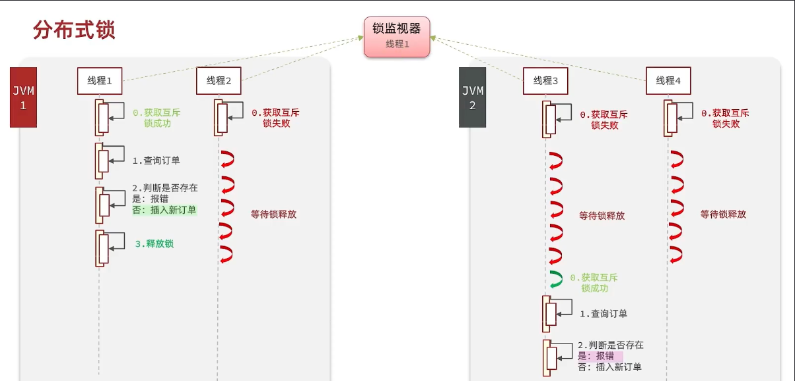 

ReentrantLock和synchronized在分布式情况下，每个服务的锁对象都不一样，因为每个服务的锁对象都是不一样的，所以无法锁住不同服务的线程

#### 常见分布式锁

- Mysql

  Mysql本身就有锁机制，但是由于mysql性能一般，因此很少使用mysql作为分布式锁

- Redis

  Redis作为分布式锁是企业里面很常用的方式。主要是使用sentnx方法，如果插入key成功，也就代表获得了锁，如果有人插入成功，其他人插入失败则表示无法获得到锁，利用这套逻辑来实现分布式锁

- Zookeeper

  Zookeeper也是企业级开发中较好的一个实现分布式锁的方案

|        | MYSQL                     | redis                      | Zookeeper                        |
| ------ | ------------------------- | -------------------------- | -------------------------------- |
| 互斥   | 利用mysql本身的互斥锁机制 | 利用sentnx这样的互斥命令   | 利用节点的唯一性和有序性实现互斥 |
| 高可用 | 好                        | 好                         | 好                               |
| 高性能 | 一般                      | 好                         | 一般                             |
| 安全性 | 断开连接，自动释放锁      | 利用锁的超时时间，到期释放 | 临时节点，断开连接自动释放       |

#### redis实现代码

利用redis的setNx方法，当很多线程进入抢夺锁的时候，线程1进入redis插入key，返回1，如果结果是1，证明获取锁成功，它就可以执行锁内的业务。当其他线程尝试获取锁的时候，无法获取成功，便会一定时间后重试。只有当线程1执行完业务，删掉该key之后，其他线程才能获取锁

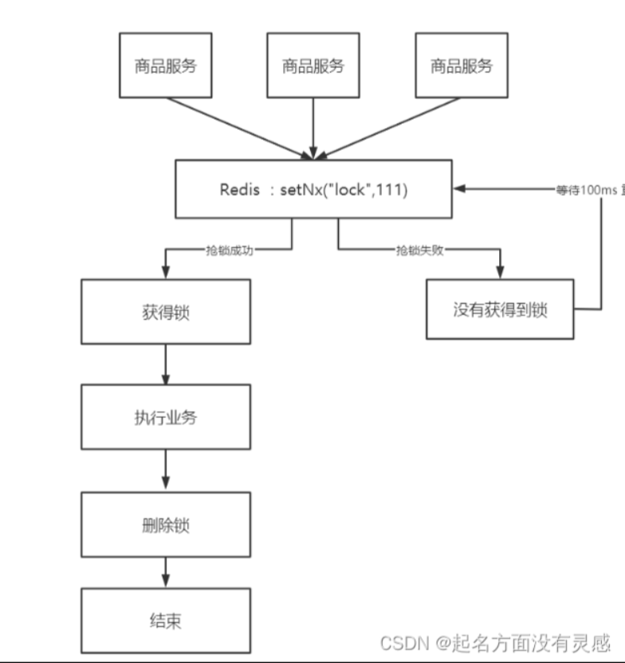 

* 定义一个锁接口，接口里面有两个重要的方法
  * tryLock( long timeoutSec )

    尝试获取锁，参数为锁持有的过期时间，过期后自动释放

  * unlock( )

    释放锁

  ```
  public interface ILock {
  
      /**
       * 尝试获取锁
       * @param timeoutSec 锁持有的超时时间，过期后自动释放
       * @return true代表获取锁成功; false代表获取锁失败
       */
      boolean tryLock(long timeoutSec);
  
      /**
       * 释放锁
       */
      void unlock();
  }
  
  ```

* 定义一个类，实现该接口

  ```
  public class SimpleRedisLock implements ILock {
  
      private String name;
      private StringRedisTemplate stringRedisTemplate;
  
      public SimpleRedisLock(String name, StringRedisTemplate stringRedisTemplate) {
          this.name = name;
          this.stringRedisTemplate = stringRedisTemplate;
      }
  
      private static final String KEY_PREFIX = "lock:";
      //ture可以去掉uuid的横线
      private static final String ID_PREFIX = UUID.randomUUID().toString(true) + "-";
  
      @Override
      public boolean tryLock(long timeoutSec) {
          // 获取线程标示
          String threadId = ID_PREFIX + Thread.currentThread().getId();
          // 获取锁
          Boolean success = stringRedisTemplate.opsForValue()
                  .setIfAbsent(KEY_PREFIX + name, threadId, timeoutSec, TimeUnit.SECONDS);
          //这里这样返回是因为防止拆箱的时候success为null，导致空指针异常
          return Boolean.TRUE.equals(success);
      }
  
  
      @Override
      public void unlock() {
          // 获取线程标示
          String threadId = ID_PREFIX + Thread.currentThread().getId();
          // 获取锁中的标示
          String id = stringRedisTemplate.opsForValue().get(KEY_PREFIX + name);
          // 判断标示是否一致
          if(threadId.equals(id)) {
              // 释放锁
              stringRedisTemplate.delete(KEY_PREFIX + name);
          }
      }
  }
  
  ```

* **锁误删预防**

  这里的分布式锁，是为了解决一人一单问题，也就是一个人只能下一单，因此key就是key前置+用户id。

  而value，则是uuid+线程id。为什么这样做呢？

  是因为如果单单用线程id作为value的话，在分布式情况下，用户发送多个请求过来，会出现分布式锁误删情况；

  即当有一个线程1获取到锁（这把锁后面称为锁A），由于某种情况，线程1获取锁A之后出现了阻塞，导致锁A超时被释放。这时候线程2进来获取锁（这把锁后面称为锁B），这时候线程1反应过来，进行释放锁的操作，因为锁A已经超时释放了，这时候线程1释放的锁将会是线程2获取的锁B，因此出现了误删的情况。

    

  因此，需要在每个线程释放锁之前，判断这把锁是否属于自己，如果属于自己则释放，如果不属于自己那么就不释放，防止误删。因为程序可能位于分布式的系统中，那么多个服务之间线程ID可能会出现一样，因此value不能单单使用线程ID，应该用uuid拼上线程ID，这样保证了分布式情况下value的唯一性。

  总而言之，解决分布式锁误删问题的解决方案如下：

  - value使用UUID＋线程ID。
  - 在释放锁的时候，先判断该锁是否是自己的，也就是判断value。
  - 如果该key对应的value是自己存进去的那个value，则释放锁。否则不释放锁，防止锁误删

  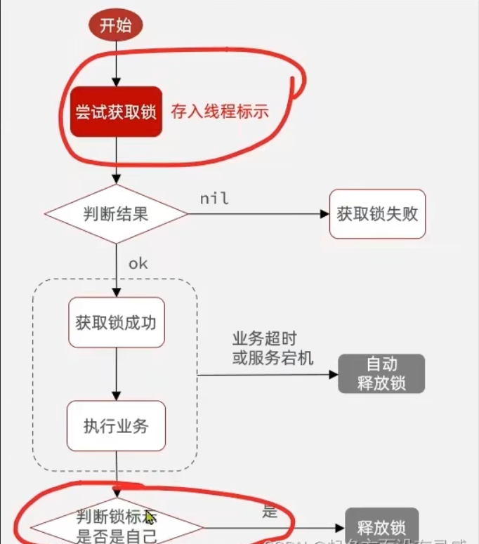 

#### 秒杀使用案例

* 首先判断秒杀是否开始

  ```
  @Override
  public Result seckillVoucher(Long voucherId) {
      // 1.查询优惠券
      SeckillVoucher voucher = seckillVoucherService.getById(voucherId);
      // 2.判断秒杀是否开始
      if (voucher.getBeginTime().isAfter(LocalDateTime.now())) {
          // 尚未开始
          return Result.fail("秒杀尚未开始！");
      }
      // 3.判断秒杀是否已经结束
      if (voucher.getEndTime().isBefore(LocalDateTime.now())) {
          // 尚未开始
          return Result.fail("秒杀已经结束！");
      }
      // 4.判断库存是否充足
      if (voucher.getStock() < 1) {
          // 库存不足
          return Result.fail("库存不足！");
      }
  
      return createVoucherOrder(voucherId);
  }
  ```

* 秒杀开始之后创建订单

  ```
  @Transactional
  public Result createVoucherOrder(Long voucherId) {
      // 5.一人一单
      Long userId = UserHolder.getUser().getId();
  
      // 创建锁对象
      SimpleRedisLock redisLock = new SimpleRedisLock("order:" + userId, stringRedisTemplate);
      // 尝试获取锁
      boolean isLock = redisLock.tryLock(1200);
      // 判断
      if (!isLock) {
          // 获取锁失败，直接返回失败或者重试
          return Result.fail("不允许重复下单！");
      }
  
      try {
          // 5.1.查询订单
          int count = query().eq("user_id", userId).eq("voucher_id", voucherId).count();
          // 5.2.判断是否存在
          if (count > 0) {
              // 用户已经购买过了
              return Result.fail("用户已经购买过一次！");
          }
  
          // 6.扣减库存
          boolean success = seckillVoucherService.update()
                  .setSql("stock = stock - 1") // set stock = stock - 1
                  .eq("voucher_id", voucherId).gt("stock", 0) // where id = ? and stock > 0
                  .update();
          if (!success) {
              // 扣减失败
              return Result.fail("库存不足！");
          }
  
          // 7.创建订单
          VoucherOrder voucherOrder = new VoucherOrder();
          // 7.1.订单id
          long orderId = redisIdWorker.nextId("order");
          voucherOrder.setId(orderId);
          // 7.2.用户id
          voucherOrder.setUserId(userId);
          // 7.3.代金券id
          voucherOrder.setVoucherId(voucherId);
          save(voucherOrder);
  
          // 7.返回订单id
          return Result.ok(orderId);
      } finally {
          // 释放锁
          redisLock.unlock();
      }
  
  }
  ```

  这里分布式锁的作用，主要是保证程序在创建订单，将订单数据插入数据库这一过程中，只有一个线程在代码块中执行，防止超买超卖的情况，有效解决一人一单

#### 原子性问题

虽然上面解决的分布式锁误删的情况，但是会出现分布式锁的原子性问题；**核心原因就是A线程快要释放锁时，但是锁超时自动释放了，别的线程拿到锁了，A线程继续释放了（比对线程UUID已经过了）**

线程1尝试获取锁，获取锁成功（这把锁下面称为锁A），线程1执行完业务逻辑，准备释放锁。这时候其他线程进不来，所以这把锁肯定是线程1自己的，当线程1判断完标识为一致后，准备执行释放锁操作，这时候由于某种情况，线程1阻塞了，由于阻塞时间太长，锁A超时释放了。这时候线程2获取锁成功（这把锁后面称为锁B），这时候线程1不再阻塞，执行释放锁操作，因为锁A超时释放，因此线程1执行的释放锁操作释放的是线程2获取的锁B，因此依然出现了锁误删情况**，出现这一情况的原因是因为判断锁是否是自己的和释放锁这是两个操作**，不存在原子性；

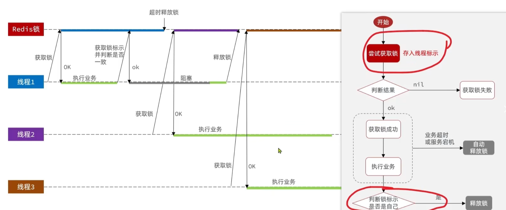 

解决方法也很简单，只需要保证判断锁和释放锁这两个操作是原子的就可以了。

#### lua脚本使用

Redis提供了Lua脚本功能，在一个脚本中编写多条Redis命令，确保多条命令执行时的原子性，我们可以使用lua去操作redis，又能保证他的原子性，这样就可以实现拿锁比锁删锁是一个原子性动作了

Redis提供的调用函数，语法如下：

```
redis.call('命令名称', 'key', '其它参数', ...)
# 比如执行set name jack，则脚本如下：
# 执行 set name jack
redis.call('set', 'name', 'jack')
```

使用redis命令执行脚本

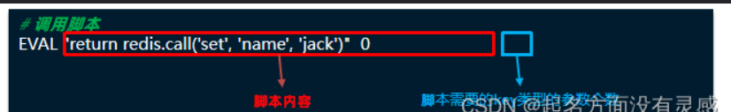 

上面是写死的情况，如果不想写死，可以使用参数传递。key类型参数会放入KEYS数组，其它参数会放入ARGV数组，在脚本中可以从KEYS和ARGV数组获取这些参数（注意数组是从1开始）：

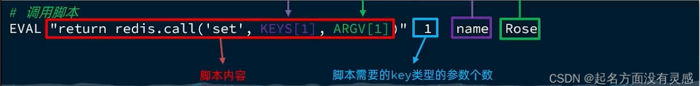 

因此，上面释放锁的操作写成Lua脚本就可以这样写

```
-- 这里的 KEYS[1] 就是锁的key，这里的ARGV[1] 就是当前线程标示
-- 获取锁中的标示，判断是否与当前线程标示一致
if (redis.call('GET', KEYS[1]) == ARGV[1]) then
  -- 一致，则删除锁
  return redis.call('DEL', KEYS[1])
end
-- 不一致，则直接返回
return 0
```

使用Java代码调用Lua脚本实现原子性

```
public <T> T execute(RedisScript<T> script, List<K> keys, Object... args) {
    return this.scriptExecutor.execute(script, keys, args);
}
```

- script：Lua脚本
- keys：KEYS数组
- args：ARGV数组

```
private static final DefaultRedisScript<Long> UNLOCK_SCRIPT;

static {
    UNLOCK_SCRIPT = new DefaultRedisScript<>();
    UNLOCK_SCRIPT.setLocation(new ClassPathResource("unlock.lua"));
    UNLOCK_SCRIPT.setResultType(Long.class);
}

public void unlock() {
    // 调用lua脚本
    stringRedisTemplate.execute(
        UNLOCK_SCRIPT,
        Collections.singletonList(KEY_PREFIX + name),
        ID_PREFIX + Thread.currentThread().getId());
}
```

这里可以将Lua脚本写在一个Lua文件中，从而实现解耦，可以使用Spring的ClassPathResource读取Class类下的文件

### 普通redis锁问题

在基于setnx实现的分布式锁中，虽然解决了误删锁和原子性问题，但是还存在以下问题：

* 重入问题

  重入指获取锁的线程再次进入相同锁的代码块中，可以自动获取锁，从而防止了死锁的出现。常见的synchronized和Lock锁都是可重入的。

* 不可重试

  获取锁只尝试一次就返回false，没有重试机制。而我们希望的是，获取锁失败后可以尝试再次获取锁。

* 超时释放

  在加锁的时候添加了过期时间，这样有可能锁是因为超时释放，虽然使用Lua表达式解决了误删，但是代码块因为锁超时释放而没有锁住代码块，难免出现安全隐患。

* 主从一致性

  Redis在集群情况下，向集群写数据时，主机需要异步的将数据同步给从机，而万一在同步过去之前，主机宕机了，就会出现死锁问题

Redisson提供的分布式锁和多种多样的问题就可以解决上诉问题

## Redission详解

### 简单使用

引入依赖，这里不用redisson-spring-boot-starter是因为防止与redis的配置冲突

```
<dependency>
	<groupId>org.redisson</groupId>
	<artifactId>redisson</artifactId>
	<version>3.13.6</version>
</dependency>
```

配置Redission客户端

```
@Configuration
public class RedissonConfig {

    @Bean
    public RedissonClient redissonClient(){
        // 配置
        Config config = new Config();
        //设置单个节点
        config.useSingleServer().setAddress("redis://192.168.150.101:6379")
            .setPassword("123321");
        // 创建RedissonClient对象
        return Redisson.create(config);
    }
}
```

Redission的分布式锁的简单使用

```
@Resource
private RedissionClient redissonClient;

@Test
void testRedisson() throws Exception{
    //获取锁(可重入)，指定锁的名称
    RLock lock = redissonClient.getLock("anyLock");
    //尝试获取锁，参数分别是：获取锁的最大等待时间(期间会重试)，锁自动释放时间，时间单位
    boolean isLock = lock.tryLock(1,10,TimeUnit.SECONDS);
    //判断获取锁成功
    if(isLock){
        try{
            System.out.println("执行业务");          
        }finally{
            //释放锁
            lock.unlock();
        }
    }   
}

```

Redisson结合实际业务

```
@Resource
private RedissonClient redissonClient;

@Override
public Result seckillVoucher(Long voucherId) {
        // 1.查询优惠券
        SeckillVoucher voucher = seckillVoucherService.getById(voucherId);
        // 2.判断秒杀是否开始
        if (voucher.getBeginTime().isAfter(LocalDateTime.now())) {
            // 尚未开始
            return Result.fail("秒杀尚未开始！");
        }
        // 3.判断秒杀是否已经结束
        if (voucher.getEndTime().isBefore(LocalDateTime.now())) {
            // 尚未开始
            return Result.fail("秒杀已经结束！");
        }
        // 4.判断库存是否充足
        if (voucher.getStock() < 1) {
            // 库存不足
            return Result.fail("库存不足！");
        }
        Long userId = UserHolder.getUser().getId();

        RLock lock = redissonClient.getLock("lock:order:" + userId);
        //获取锁对象
        boolean isLock = lock.tryLock();
       
		//加锁失败
        if (!isLock) {
            return Result.fail("不允许重复下单");
        }
        try {
            //获取代理对象(事务)
            IVoucherOrderService proxy = (IVoucherOrderService) AopContext.currentProxy();
            return proxy.createVoucherOrder(voucherId);
        } finally {
            //释放锁
            lock.unlock();
        }
 }

```

### 可重入锁原理

#### 使用场景

可重入锁的实际应用例子如下

线程1在method1方法获取到锁A，在执行业务代码的时候调用method2方法，在method2方法中也要尝试获取锁A，也就是持有这把锁的人要再次获得这把锁，这就是可重入锁

```
@Test
void method1() throws InterruptedException {
    // 尝试获取锁
    boolean isLock = lock.tryLock(1L, TimeUnit.SECONDS);
    if (!isLock) {
        log.error("获取锁失败 .... 1");
        return;
    }
    try {
        log.info("获取锁成功 .... 1");
        method2();
        log.info("开始执行业务 ... 1");
    } finally {
        log.warn("准备释放锁 .... 1");
        lock.unlock();
    }
}
void method2() {
    // 尝试获取锁
    boolean isLock = lock.tryLock();
    if (!isLock) {
        log.error("获取锁失败 .... 2");
        return;
    }
    try {
        log.info("获取锁成功 .... 2");
        log.info("开始执行业务 ... 2");
    } finally {
        log.warn("准备释放锁 .... 2");
        lock.unlock();
    }
}

```

Redisson的可重入锁设计与jdk中的Lock锁设计思路差不多。

jdk的Lock底层使用一个voaltile的一个state变量记录重入的状态。当没有人持有这把锁，state变量为0，当有人持有这把锁，state的变量为1，当持有这把锁的人再次持有这把锁，那么state的值就会+1。如果是对于synchronized而言，他在c语言代码中会有一个count，原理和state类似，也是重入一次就加一，释放一次就-1 ，直到减少成0 时，表示当前这把锁没有被人持有；

#### 整体机制

在Redisson中，不再用简单的key-value来实现分布式锁。而是使用key-hashMap来实现分布式锁，hashMap中也是key-value组合，key为表示哪个线程持有这把锁，value为锁的重入次数

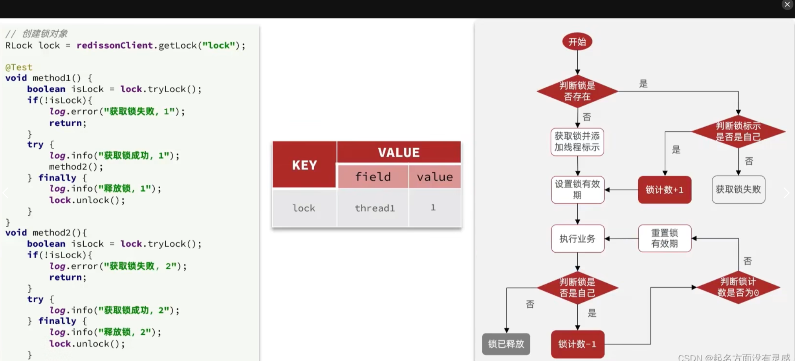 

因此，获取锁的流程也会有所改变。

线程A进来获取锁，首先判断锁是否存在，如果不存在，那么获取锁，并添加自己的线程标识，并设置锁的有效期，随后执行业务。

在执行业务的时候再次获取该锁，首先也是判断锁是否存在，很明显，锁已经存在了，那么判断锁的标识是否是当前线程的（也就是判断这把锁是不是自己持有了），如果否，证明锁是被其他线程占有，获取锁失败。如果是，需要可重入，则重入次数+1，并重置锁的有效期，执行相应业务。

这里的业务执行完毕之后，首先判断锁是否是自己的（防止线程阻塞导致锁过期，因而释放掉其他线程的锁，也就是防止锁误删情况），如果是，那么锁的重入次数-1，接着判断锁的重入次数是否为0，如果为0，证明是已经到了最外层，就可以把锁释放掉了

**PS：tip：这是重置锁的有效期，是因为留下充足时间给剩下的业务执行，防止业务时间过长导致锁提前释放，造成安全问题**

同时，这一整个流程需要保证原子性，因此需要用Lua脚本。

#### 获取锁的Lua脚本

```
local key = KEYS[1]; -- 锁的key
local threadId = ARGV[1]; -- 线程唯一标识
local releaseTime = ARGV[2]; -- 锁的自动释放时间
-- 判断是否存在
if(redis.call('exists', key) == 0) then
    -- 不存在, 获取锁
    redis.call('hset', key, threadId, '1'); 
    -- 设置有效期
    redis.call('expire', key, releaseTime); 
    return 1; -- 返回结果
end;
-- 锁已经存在，判断threadId是否是自己
if(redis.call('hexists', key, threadId) == 1) then
    -- 不存在, 获取锁，重入次数+1
    redis.call('hincrby', key, threadId, '1'); 
    -- 设置有效期
    redis.call('expire', key, releaseTime); 
    return 1; -- 返回结果
end;
return 0; -- 代码走到这里,说明获取锁的不是自己，获取锁失败
```

#### 释放锁的Lua脚本

```
local key = KEYS[1]; -- 锁的key
local threadId = ARGV[1]; -- 线程唯一标识
local releaseTime = ARGV[2]; -- 锁的自动释放时间-- 判断当前锁是否还是被自己持有
if (redis.call('HEXISTS', key, threadId) == 0) then
    return nil; -- 如果已经不是自己，则直接返回
end;
-- 是自己的锁，则重入次数-1
local count = redis.call('HINCRBY', key, threadId, -1);
-- 判断是否重入次数是否已经为0 
if (count > 0) then
    -- 大于0说明不能释放锁，重置有效期然后返回
    redis.call('EXPIRE', key, releaseTime);
    return nil;
else  -- 等于0说明可以释放锁，直接删除
    redis.call('DEL', key);
    return nil;
end;


```

#### 源码分析

**tryLock( )方法**

```java
boolean isLock = redisLock.tryLock();
```

**底层是一个接口，查看RessionLock的实现**

```java
boolean tryLock();
```

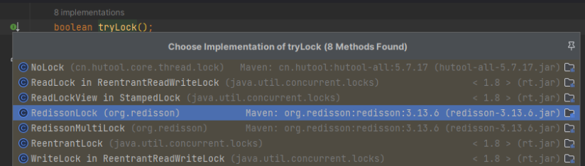 

* 这里调用了一个tryLockAsync()的方法

  ```
  public boolean tryLock() {
      return (Boolean)this.get(this.tryLockAsync());
  }
  ```

* **tryLockAsync方法中调用了tryLockAsync(long threadId)，参数为当前线程ID**

  ```
  public RFuture<Boolean> tryLockAsync() {
      return this.tryLockAsync(Thread.currentThread().getId());
  }
  ```

* **而tryLockAsync(long threadId)则是调用了tryAcquireOnceAsync方法**

  ```
  public RFuture<Boolean> tryLockAsync(long threadId) {
      return this.tryAcquireOnceAsync(-1L, -1L, (TimeUnit)null, threadId);
  }
  
  ```

* **tryAcquireOnceAsync有四个参数：**

  - waitTime：获取锁的最大等待时间（没有传默认为-1）
  - leaseTime：锁自动释放的时间（没有传的话默认-1）
  - unit：时间的单位（等待时间和锁自动释放的时间单位）
  - threadId：当前线程ID

  ```
  private RFuture<Boolean> tryAcquireOnceAsync(long waitTime, long leaseTime, TimeUnit unit, long threadId) {
      //判断是否有锁自动释放时间
      if (leaseTime != -1L) {
          return this.tryLockInnerAsync(waitTime, leaseTime, unit, threadId, RedisCommands.EVAL_NULL_BOOLEAN);
      } else {
          RFuture<Boolean> ttlRemainingFuture = this.tryLockInnerAsync(
              //获取锁等待时间
              waitTime, 
              //锁自动释放时间（系统指定）
              this.commandExecutor.getConnectionManager().getCfg().getLockWatchdogTimeout(), 
              //时间单位
              TimeUnit.MILLISECONDS, 
              //线程ID
              threadId, 
              .EVAL_NULL_BOOLEAN);
          ttlRemainingFuture.onComplete((ttlRemaining, e) -> {
              if (e == null) {
                  if (ttlRemaining) {
                      this.scheduleExpirationRenewal(threadId);
                  }
  
              }
          });
          return ttlRemainingFuture;
      }
  }
  ```

* tryLockInnerAsync

  在tryAcquireOnceAsync方法中，首先要先判断有没有锁自动释放时间（leaseTime），如果有，则会使用有的那个纸，否则会给一个默认值。

  接着会调用tryLockInnerAsync方法

  ```
  <T> RFuture<T> tryLockInnerAsync(long waitTime, long leaseTime, TimeUnit unit, long threadId, RedisStrictCommand<T> command) {
      //将锁自动释放时间记录在一个本地的成员变量中
      this.internalLockLeaseTime = unit.toMillis(leaseTime);
      return this.evalWriteAsync(
          this.getName(), 
          LongCodec.INSTANCE, 
          command, 
          //Lua脚本，获取锁失败的话返回pttl（和ttl差不多，只是单位不一样，ttl是秒，pttl是毫秒），也就是这个key的剩余有效期
          "if (redis.call('exists', KEYS[1]) == 0) then redis.call('hincrby', KEYS[1], ARGV[2], 1); redis.call('pexpire', KEYS[1], ARGV[1]); return nil; end; if (redis.call('hexists', KEYS[1], ARGV[2]) == 1) then redis.call('hincrby', KEYS[1], ARGV[2], 1); redis.call('pexpire', KEYS[1], ARGV[1]); return nil; end; return redis.call('pttl', KEYS[1]);",
          Collections.singletonList(this.getName()), 
          this.internalLockLeaseTime, 
          this.getLockName(threadId)
      );
  }
  
  ```

  在tryLockInnerAsync方法，可以发现这里面有一段Lua脚本，其作用和上面第5点的Lua脚本一样。

**释放锁的代码unlock方法如下：**

```
void unlock();
```

*  unlock()

  ```
  public void unlock() {
      try {
          this.get(this.unlockAsync(Thread.currentThread().getId()));
      } catch (RedisException var2) {
          if (var2.getCause() instanceof IllegalMonitorStateException) {
              throw (IllegalMonitorStateException)var2.getCause();
          } else {
              throw var2;
          }
      }
  }
  ```

* unlock方法，主要是看unlockAsync方法，参数为当前线程ID

  ```
  public RFuture<Void> unlockAsync(long threadId) {
      RPromise<Void> result = new RedissonPromise();
      RFuture<Boolean> future = this.unlockInnerAsync(threadId);
      future.onComplete((opStatus, e) -> {
          this.cancelExpirationRenewal(threadId);
          if (e != null) {
              result.tryFailure(e);
          } else if (opStatus == null) {
              IllegalMonitorStateException cause = new IllegalMonitorStateException("attempt to unlock lock, not locked by current thread by node id: " + this.id + " thread-id: " + threadId);
              result.tryFailure(cause);
          } else {
              result.trySuccess((Object)null);
          }
      });
      return result;
  }
  
  ```

* 这里继续跟进unlockInnerAsync方法，参数还是线程ID

  ```
  protected RFuture<Boolean> unlockInnerAsync(long threadId) {
      return this.evalWriteAsync(
          this.getName(), 
          LongCodec.INSTANCE, 
          RedisCommands.EVAL_BOOLEAN, 
          "if (redis.call('hexists', KEYS[1], ARGV[3]) == 0) then return nil;end; local counter = redis.call('hincrby', KEYS[1], ARGV[3], -1); if (counter > 0) then redis.call('pexpire', KEYS[1], ARGV[2]); return 0; else redis.call('del', KEYS[1]); redis.call('publish', KEYS[2], ARGV[1]); return 1; end; return nil;", 
          Arrays.asList(this.getName(), this.getChannelName()), 
          LockPubSub.UNLOCK_MESSAGE,
          this.internalLockLeaseTime, 
          this.getLockName(threadId)
      );
  }
  ```

  unlockInnerAsync方法下同样有一段Lua脚本，这段Lua脚本和上面第5点释放锁的Lua脚本一样。

### 锁重试和WatchDog

尝试获取锁的tryLock方法有以下几种重载方法

```
boolean tryLock();
boolean tryLock(long time, TimeUnit unit) throws InterruptedException;
boolean tryLock(long waitTime, long leaseTime, TimeUnit unit) throws InterruptedException 
```

一共涉及到3个参数：

- waitTime：获取锁的最大等待时间（没有传默认为-1）
- leaseTime：锁自动释放的时间（没有传的话默认-1）
- unit：时间的单位（等待时间和锁自动释放的时间单位）

#### 整体机制

跟进第二种tryLock方法

```
public boolean tryLock(long waitTime, TimeUnit unit) throws InterruptedException {
    return this.tryLock(waitTime, -1L, unit);
}
```

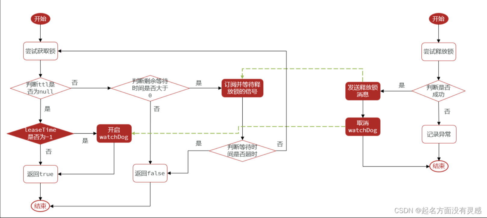 

#### 获取锁源码分析

* tryLock

这里是调用了一个tryLock方法，由于没有传leaseTime，所以默认设置为-1

```
public boolean tryLock(long waitTime, long leaseTime, TimeUnit unit) throws InterruptedException {
    //将等待时间转化为毫秒
    long time = unit.toMillis(waitTime);
    //获取当前时间
    long current = System.currentTimeMillis();
    //获取线程ID
    long threadId = Thread.currentThread().getId();
    //尝试获取锁
    //这里会有两种情况，一种是nil代表获取锁成功，一种是该key的剩余有效期代表回去锁失败
    Long ttl = this.tryAcquire(waitTime, leaseTime, unit, threadId);
    if (ttl == null) {
        //代表获取锁成功
        return true;
    } else {
        //获取锁失败，要尝试再次获取
        //使用当前时间减去之前记录当前时间，也就是获取锁消耗掉的时间
        //再用最长等待时间，减去获取锁消耗的时间，得到的结果就是剩余等待时间
        time -= System.currentTimeMillis() - current;
        if (time <= 0L) {
            //剩余等待时间小于0，获取锁失败
            this.acquireFailed(waitTime, unit, threadId);
            return false;
        } else {
            //剩余等待时间大于0，就可以继续尝试
            //获取当前的时间，准备进行尝试
            //但是不是立即尝试，因此刚才获取失败，如果立刻尝试，那个获取锁的线程大概率是没有完成业务释放锁的
            current = System.currentTimeMillis();
            //于是可以订阅别人是释放锁的信号——this.subscribe(threadId);
            //可以这样，是因为在释放锁的时候会发布一条释放锁的通知
            RFuture<RedissonLockEntry> subscribeFuture = this.subscribe(threadId);
            //等待 这剩余最长等待时间 还没有释放锁的话，那么获取锁失败
            if (!subscribeFuture.await(time, TimeUnit.MILLISECONDS)) {
                //剩余最长等待时间内 其他线程还未释放锁 获取锁失败
                if (!subscribeFuture.cancel(false)) {
                    subscribeFuture.onComplete((res, e) -> {
                        if (e == null) {
                            //会先取消订阅
                            this.unsubscribe(subscribeFuture, threadId);
                        }

                    });
                }
                this.acquireFailed(waitTime, unit, threadId);
                //获取锁失败
                return false;
            } else {
                boolean var16;
                try {
                    //获取当前时间，当前时间减去之前记录的当前时间，得到的是获取锁成功花费的时间
                    //之前剩余的最长等待时间-获取锁成功花费的时间
                    time -= System.currentTimeMillis() - current;
                    if (time <= 0L) {
                        //剩余最长等待时间小于0，获取锁失败
                        this.acquireFailed(waitTime, unit, threadId);
                        boolean var20 = false;
                        return var20;
                    }
					//这一次等待结束，最长等待时间依然有剩余
                    do {
                        //当前时间
                        long currentTime = System.currentTimeMillis();
                        //进行重试，尝试获取锁
                        //获取锁失败的返回值是该key的剩余过期时间
                        ttl = this.tryAcquire(waitTime, leaseTime, unit, threadId);
                        if (ttl == null) {
                            //获取锁成功
                            var16 = true;
                            return var16;
                        }
						//计算获取锁花费的时间
                        //用剩余等待时间减去获取锁的时间
                        time -= System.currentTimeMillis() - currentTime;
                        if (time <= 0L) {
                            //剩余最长等待时间小于0，获取锁失败
                            this.acquireFailed(waitTime, unit, threadId);
                            var16 = false;
                            return var16;
                        }
                        
                        
                        /**
                        
                        （重试机制）
                        下面这段代码设计得非常巧妙
                        它并不是无休止得循环等
                        而是先等待另外一个线程释放锁，再进程重试
                        这样设计减少了CPU的浪费
                        
                        **/
                        
                        
						//还剩下最长等待时间的大于0
                        currentTime = System.currentTimeMillis();
                       	//ttl < time：也就是该key的剩余过期时间小于剩余的最长等待时间
                        if (ttl >= 0L && ttl < time) {
                           	//使用信号量，因为释放锁的人会释放一个信号，这边就尝试获取信号
                            //如果是指定等待时间内，拿到了这个信号量返回true
                            //否则返回false
                            //那么只需要等待该key剩余等待时间即可
                            //消息ding
                            ((RedissonLockEntry)subscribeFuture.getNow()).getLatch().tryAcquire(ttl, TimeUnit.MILLISECONDS);
                        } else {
                            //如果ttl >= time
                            //那么只需要等待time，也就是剩余的最长等待时间
                            //如果这段时间都还没等到信号量，那么就证明失败了
                            //订阅
                            ((RedissonLockEntry)subscribeFuture.getNow()).getLatch().tryAcquire(time, TimeUnit.MILLISECONDS);
                        }
                        
                        
                        
                       
						//重置剩余的最长的等待时间
                        time -= System.currentTimeMillis() - currentTime;
                    } while(time > 0L);
					//既然能从循环出来，证明time肯定小于等于0
                    //也就是最长等待时间都用完了，获取锁失败
                    this.acquireFailed(waitTime, unit, threadId);
                    var16 = false;
                } finally {
                    //取消订阅
                    this.unsubscribe(subscribeFuture, threadId);
                }

                return var16;
            }
        }
    }
}
```

* tryAcquireAsync

  该方法获取锁并设置看门狗及其续约

  ```
  private Long tryAcquire(long waitTime, long leaseTime, TimeUnit unit, long threadId) {
      return (Long)this.get(this.tryAcquireAsync(waitTime, leaseTime, unit, threadId));
  }
  
  ```

  tryAcquireAsync方法就是上面解读Redission的可重入锁的源码调用到的一个方法

  上面有说到，没传leaseTime（自动释放锁时间）的话，就会给一个默认值，这个默认值就是getLockWatchdogTimeout()，也就是看门狗超时时间

  **这个看门狗超时时间是30*1000毫秒，也就是30秒**

  ```
  private <T> RFuture<Long> tryAcquireAsync(long waitTime, long leaseTime, TimeUnit unit, long threadId) {
      if (leaseTime != -1L) {
          return this.tryLockInnerAsync(waitTime, leaseTime, unit, threadId, RedisCommands.EVAL_LONG);
      } else {
          //如果获取锁失败，返回的结果是这个key的剩余有效期
          RFuture<Long> ttlRemainingFuture = this.tryLockInnerAsync(waitTime, this.commandExecutor.getConnectionManager().getCfg().getLockWatchdogTimeout(), TimeUnit.MILLISECONDS, threadId, RedisCommands.EVAL_LONG);
          //上面获取锁回调成功之后，执行这代码块的内容
          ttlRemainingFuture.onComplete((ttlRemaining, e) -> {
              if (e == null) {
                  //剩余有效期为null
                  if (ttlRemaining == null) {
                      //这个函数是解决最长等待有效期的问题
                      this.scheduleExpirationRenewal(threadId);
                  }
  
              }
          });
          return ttlRemainingFuture;
      }
  }
  
  ```

* scheduleExpirationRenewal

  续约操作

  如果获取锁返回的锁key的剩余有效期的时间为null的时候（也就是获取锁成功），就会解决最长等待剩余有效期的问题

  ```
  private void scheduleExpirationRenewal(long threadId) {
      ExpirationEntry entry = new ExpirationEntry();
      //这里EntryName是指锁的名称
      ExpirationEntry oldEntry = (ExpirationEntry)EXPIRATION_RENEWAL_MAP.putIfAbsent(this.getEntryName(), entry);
      if (oldEntry != null) {
          //重入
          //将线程ID加入
          oldEntry.addThreadId(threadId);
      } else {
          //将线程ID加入
          entry.addThreadId(threadId);
          //续约
          this.renewExpiration();
      }
  
  }
  
  ```

  这里的entryName是指锁的名称，因为创建RedissonLock类的时候的参数name就是锁的名称

  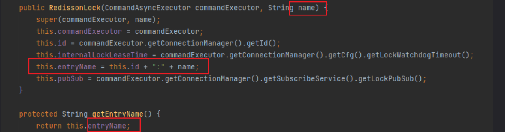 

  因此，一个锁就对应自己的一个ExpirationEntry类

  这样，如果是第一次进入的时候，这里放进去的就是一个全新的ExpirationEntry类，也就是当前锁，返回值就是null

  如果是重入，那么putIfAbsent函数就不会执行，返回值就是之前旧的ExpirationEntry类，也就是第一次进来创建的ExpirationEntry类。这一步保证了无论重入几次，拿到的都是同一把锁。

  如果是第一次，那么需要进行续约操作，也就是给最长等待有效期续约

  ```
  private void renewExpiration() {
      //先从map里得到这个ExpirationEntry
      ExpirationEntry ee = (ExpirationEntry)EXPIRATION_RENEWAL_MAP.get(this.getEntryName());
      if (ee != null) {
          //这个是一个延迟任务
          Timeout task = this.commandExecutor.getConnectionManager().newTimeout(new TimerTask() {
              //延迟任务内容
              public void run(Timeout timeout) throws Exception {
                  //拿出ExpirationEntry
                  ExpirationEntry ent = (ExpirationEntry)RedissonLock.EXPIRATION_RENEWAL_MAP.get(RedissonLock.this.getEntryName());
                  if (ent != null) {
                      //从ExpirationEntry拿出线程ID
                      Long threadId = ent.getFirstThreadId();
                      if (threadId != null) {
                          //调用renewExpirationAsync方法刷新最长等待时间
                          RFuture<Boolean> future = RedissonLock.this.renewExpirationAsync(threadId);
                          future.onComplete((res, e) -> {
                              if (e != null) {
                                  RedissonLock.log.error("Can't update lock " + RedissonLock.this.getName() + " expiration", e);
                              } else {
                                  if (res) {
                                      //renewExpirationAsync方法执行成功之后，进行递归调用，调用自己本身函数
                                      //那么就可以实现这样的效果
                                      //首先第一次进行这个函数，设置了一个延迟任务，在10s后执行
                                      //10s后，执行延迟任务的内容，刷新有效期成功，那么就会再新建一个延迟任务，刷新最长等待有效期
                                      //这样这个最长等待时间就会一直续费
                                      RedissonLock.this.renewExpiration();
                                  }
  
                              }
                          });
                      }
                  }
              }
          }, 
                                                                                //这是锁自动释放时间，因为没传，所以是看门狗时间=30*1000
                                                                                //也就是10s
                                                                                this.internalLockLeaseTime / 3L, 
                                                                                //时间单位
                                                                                TimeUnit.MILLISECONDS);
          //给当前ExpirationEntry设置延迟任务
          ee.setTimeout(task);
      }
  }
  
  ```

  重置锁的有效期的关键方法是renewExpirationAsync

  使用了一段Lua脚本来重置

  ```
  protected RFuture<Boolean> renewExpirationAsync(long threadId) {
      return this.evalWriteAsync(this.getName(), LongCodec.INSTANCE, RedisCommands.EVAL_BOOLEAN, "if (redis.call('hexists', KEYS[1], ARGV[2]) == 1) then redis.call('pexpire', KEYS[1], ARGV[1]); return 1; end; return 0;", Collections.singletonList(this.getName()), this.internalLockLeaseTime, this.getLockName(threadId));
  }
  ```

#### 释放锁源码

```
public void unlock() {
    try {
        this.get(this.unlockAsync(Thread.currentThread().getId()));
    } catch (RedisException var2) {
        if (var2.getCause() instanceof IllegalMonitorStateException) {
            throw (IllegalMonitorStateException)var2.getCause();
        } else {
            throw var2;
        }
    }
}

```

释放主要看unlockAsync方法。

unlockAsync方法这里有一个unlockInnerAsync。

当这个unlockInnerAsync执行完之后，首先会取消更新任务

```
public RFuture<Void> unlockAsync(long threadId) {
    RPromise<Void> result = new RedissonPromise();
    RFuture<Boolean> future = this.unlockInnerAsync(threadId);
    future.onComplete((opStatus, e) -> {
        //取消锁更新任务
        this.cancelExpirationRenewal(threadId);
        if (e != null) {
            result.tryFailure(e);
        } else if (opStatus == null) {
            IllegalMonitorStateException cause = new IllegalMonitorStateException("attempt to unlock lock, not locked by current thread by node id: " + this.id + " thread-id: " + threadId);
            result.tryFailure(cause);
        } else {
            result.trySuccess((Object)null);
        }
    });
    return result;
}

```

```
void cancelExpirationRenewal(Long threadId) {
    //获得当前这把锁的任务
    ExpirationEntry task = (ExpirationEntry)EXPIRATION_RENEWAL_MAP.get(this.getEntryName());
    if (task != null) {
        //当前锁的延迟任务不为空，且线程id不为空
        if (threadId != null) {
            //先把线程ID去掉
            task.removeThreadId(threadId);
        }

        if (threadId == null || task.hasNoThreads()) {
            //然后取出延迟任务
            Timeout timeout = task.getTimeout();
            if (timeout != null) {
                //把延迟任务取消掉
                timeout.cancel();
            }
			//再把ExpirationEntry移除出map
            EXPIRATION_RENEWAL_MAP.remove(this.getEntryName());
        }

    }
}

```

这里就把定时任务删除得干干净净

这里整个锁的释放就完成了

### MutiLock

为了提高redis的可用性，我们会搭建集群或者主从，现在以主从为例。

当我们去写命令的时候，会写在主机上，主机会将数据同步给从机。但是如果这时候主机还没来得及将数据写到从机的时候，主机宕机了，这时候哨兵会发现主机宕机，并且选举一个slave变成master，而此时新的master中实际上并没有锁信息，此时锁信息就已经丢掉了

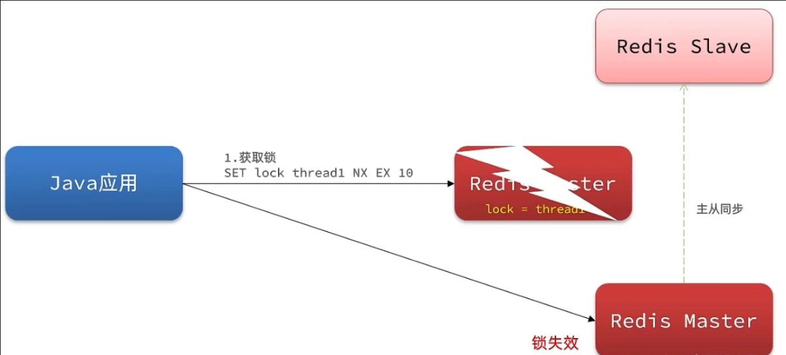 

为了解决这个问题，redission提出来了MutiLock锁，使用这把锁咱们就不使用主从了，每个节点的地位都是一样的， 这把锁加锁的逻辑需要写入到每一个主丛节点上，只有所有的服务器都写入成功，此时才是加锁成功。假设现在某个节点挂了，有一个线程乘虚而入，想要获取锁，那么这个线程虽然再第一个节点能获取锁，但是只有再所有主节点中获取到锁，才算成功获取锁，因为其他主节点的都是被原来的线程占有，乘虚而入的线程无法获取另外两个节点的锁，因此获取锁失败

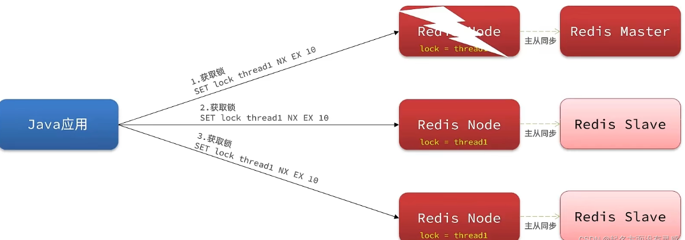 

#### MutiLock的使用

* 配置Redission的客户端

  ```
  @Configuration
  public class RedissonConfig {
  
      @Bean
      public RedissonClient redissonClient(){
          // 配置
          Config config = new Config();
          config.useSingleServer().setAddress("redis://106.52.97.99:6379").setPassword("lrk123");
          // 创建RedissonClient对象
          return Redisson.create(config);
      }
  
      @Bean
      public RedissonClient redissonClient2(){
          // 配置
          Config config = new Config();
          config.useSingleServer().setAddress("redis://106.52.97.99:6380").setPassword("lrk123");
          // 创建RedissonClient对象
          return Redisson.create(config);
      }
  
      @Bean
      public RedissonClient redissonClient3(){
          // 配置
          Config config = new Config();
          config.useSingleServer().setAddress("redis://106.52.97.99:6381").setPassword("lrk123");
          // 创建RedissonClient对象
          return Redisson.create(config);
      }
  }
  
  ```

* 创建联锁

  ```
  @Resource
  private RedissonClient redissonClient;
  
  @Resource
  private RedissonClient redissonClient2;
  
  @Resource
  private RedissonClient redissonClient3;
  
  private RLock lock;
  
  @BeforeEach
  void setUp() {
      
      RLock lock1 = redissonClient.getLock("order");
      RLock lock2 = redissonClient2.getLock("order");
      RLock lock3 = redissonClient3.getLock("order");
      
      lock = redissonClient.getMultiLock(lock1, lock2, lock3);
  }
  
  ```

  ```
  //进入getMultiLock方法
  public RLock getMultiLock(RLock... locks) {
      return new RedissonMultiLock(locks);
  }
  //new一个RedissonMultiLock
  final List<RLock> locks = new ArrayList();
  
  public RedissonMultiLock(RLock... locks) {
      if (locks.length == 0) {
          throw new IllegalArgumentException("Lock objects are not defined");
      } else {
          this.locks.addAll(Arrays.asList(locks));
      }
  }
  ```

**可以看到这里锁添加到一个集合中，将来获取锁的时候，会将集合里面的锁都获取一边，只有都获取成功，才算获取到锁。**

拿到锁之后，锁的使用和之前一样，加锁、释放锁

#### 源码解析

tryLock方法的两个参数：

- waitTime：最长等待时间
- unit：时间单位

```
public boolean tryLock(long waitTime, TimeUnit unit) throws InterruptedException {
    return this.tryLock(waitTime, -1L, unit);
}
```

**接下来进入this.tryLock(waitTime, -1L, unit)分析**

```
public boolean tryLock(long waitTime, long leaseTime, TimeUnit unit) throws InterruptedException {
    long newLeaseTime = -1L;
    //判断传入参数有没有自动释放锁时间
    if (leaseTime != -1L) {
        //判断传入参数是否有最长等待时间
        if (waitTime == -1L) {
            //没有传的话，说明只想获取一次，不需要进行重试
            //因此自动释放锁时间多久，就用多久
            newLeaseTime = unit.toMillis(leaseTime);
        } else {
            //想要进行重试
            //用最长等待时间✖2
            //因为重试时间比较久，避免自动释放时间小于最长等待时间导致还没重试完，锁就释放了
            newLeaseTime = unit.toMillis(waitTime) * 2L;
        }
    }

    long time = System.currentTimeMillis();
    //剩余等待时间
    long remainTime = -1L;
    if (waitTime != -1L) {
        //最长等待时间有传进来，就会使用waitTime代替remainTime
        remainTime = unit.toMillis(waitTime);
    }
	//获得锁等待时间
    //锁等待时间和剩余等待时间是一样的
    long lockWaitTime = this.calcLockWaitTime(remainTime);
    //失败锁的限制。默认为0
    int failedLocksLimit = this.failedLocksLimit();
    //这里保存的是获取成功的锁
    List<RLock> acquiredLocks = new ArrayList(this.locks.size());
    //这里是遍历需要获取的锁
    ListIterator<RLock> iterator = this.locks.listIterator();

    while(iterator.hasNext()) {
        RLock lock = (RLock)iterator.next();

        boolean lockAcquired;
        try {
            if (waitTime == -1L && leaseTime == -1L) {
                //这里就是没参数，所以调用的是空参的tryLock
                lockAcquired = lock.tryLock();
            } else {
                //传了参数
                long awaitTime = Math.min(lockWaitTime, remainTime);
                //进行获取锁操作
                lockAcquired = lock.tryLock(awaitTime, newLeaseTime, TimeUnit.MILLISECONDS);
            }
        } catch (RedisResponseTimeoutException var21) {
            this.unlockInner(Arrays.asList(lock));
            lockAcquired = false;
        } catch (Exception var22) {
            lockAcquired = false;
        }

        if (lockAcquired) {
            //获取锁成功，将锁放进集合中
            acquiredLocks.add(lock);
        } else {
            //获取锁失败
            //判断锁的总数量-已经获取的锁的数量是否等于锁失败的上限
            if (this.locks.size() - acquiredLocks.size() == this.failedLocksLimit()) {
                break;
            }
			
            if (failedLocksLimit == 0) {
                //将已经拿到的锁释放掉
                this.unlockInner(acquiredLocks);
                if (waitTime == -1L) {
                    //最长等待时间为0，说明不想重试
                    return false;
                }
				//需要重试
                failedLocksLimit = this.failedLocksLimit();
                //将之前获取到的锁释放掉
                acquiredLocks.clear();
				//把迭代器往前迭代，也就是从第一个开始
                while(iterator.hasPrevious()) {
                    iterator.previous();
                }
            } else {
                --failedLocksLimit;
            }
        }
		//判断剩余等待时间是不是-1
        if (remainTime != -1L) {
            //如果剩余等待时间不为-1
            //那么用剩余等待时间减去获取锁时间
            //得到现在剩余的时间
            remainTime -= System.currentTimeMillis() - time;
            time = System.currentTimeMillis();
            if (remainTime <= 0L) {
                //如果现在剩余等待时间小于0，说明已经耗尽了等待时间
               	//获取锁失败，那么将之前获取的锁释放掉
                this.unlockInner(acquiredLocks);
                //获取锁超时，获取锁失败
                return false;
            }
        }
    }
	//上面这个循环结束，证明获取锁成功
    //在返回true之前还需要进行以下操作
    if (leaseTime != -1L) {
        //锁的自动释放时间不是-1，说明有指定锁的自动释放时间
        List<RFuture<Boolean>> futures = new ArrayList(acquiredLocks.size());
        Iterator var24 = acquiredLocks.iterator();
		//遍历每一把锁
        while(var24.hasNext()) {
            RLock rLock = (RLock)var24.next();
            //给每一个把锁设置有效期，也就是重置有效期
            /**
            
            为什么要这样做呢？
            因为当获取到第一把锁的时候，有效期就开始倒计时了
            因此第一把锁的剩余有效期一定会比最后一把锁的剩余有效期要短
            这样就会出现有些锁释放，有些还没释放的情况
            
            为什么要指定锁释放时间的时候才进行这操作？
            因为不指定的时候会触发看门狗机制，有效期会自动去续费，不需要我们操作
            
            
            **/
            RFuture<Boolean> future = ((RedissonLock)rLock).expireAsync(unit.toMillis(leaseTime), TimeUnit.MILLISECONDS);
            futures.add(future);
        }

        var24 = futures.iterator();

        while(var24.hasNext()) {
            RFuture<Boolean> rFuture = (RFuture)var24.next();
            rFuture.syncUninterruptibly();
        }
    }

    return true;
}
```

## 总结