## lettuce网络模型

### Netty NIO框架概述

首先，其构建于Java NIO之上的异步及事件驱动的实现，保证了应用程序在高负载下的性能最大化和可伸缩性；其次，Netty运用一系列设计模式，将程序逻辑与网络层进行解耦，从而简化了用户的开发过程，并在最大程度上保证代码的可测性、模块化水平及可重用性。」

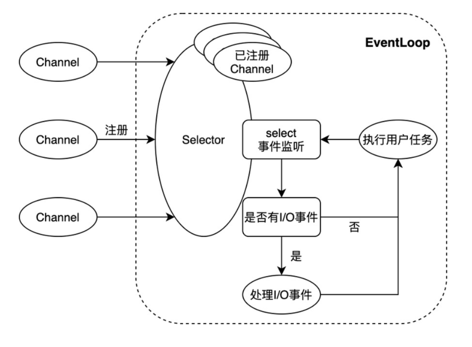 

上图展示了Netty NIO的核心逻辑。NIO通常被理解为non-blocking I/O的缩写，表示**非阻塞I/O**操作。图中**Channel**表示一个连接通道，用于承载连接管理及读写操作；**EventLoop**则是事件处理的核心抽象。一个EventLoop可以服务于多个Channel，但它只会与**单一线程**绑定。EventLoop中所有I/O事件和用户任务的处理都在该线程上进行；其中除了选择器Selector的事件监听动作外，对连接通道的读写操作均以非阻塞的方式进行 —— 这是NIO与BIO（blocking I/O，即阻塞式I/O）的重要区别，也是NIO模式性能优异的原因。下文会结合Lettuce源码及性能分析，对Netty的设计模式及性能水平作进一步讨论

### Lettuce管道模式

虽然一个Netty的EventLoop可以服务于多个套接字连接，但是Lettuce仅凭**单一的Redis连接**即可支持业务端的大部分并发请求 —— 即Lettuce是线程安全的。这有赖于以下几个因素的共同作用：

- Netty的单个EventLoop仅与**单一线程**绑定，业务端的并发请求均会被放入EventLoop的任务队列中，最终被该线程顺序处理。同时，Lettuce自身也会维护一个队列，当其通过EventLoop向Redis发送指令时，成功发送的指令会被放入该队列；当收到服务端的响应时，Lettuce又会以**FIFO**的方式从队列的头部取出对应的指令，进行后续处理。
- Redis服务端本身也是基于NIO模型，使用**单一线程**处理客户端请求。虽然Redis能同时维持成百上千个客户端连接，但是在某一时刻，某个客户端连接的请求均是被顺序处理及响应的（注3）。
- Redis客户端与服务端通过TCP协议连接，而TCP协议本身会保证数据传输的顺序性

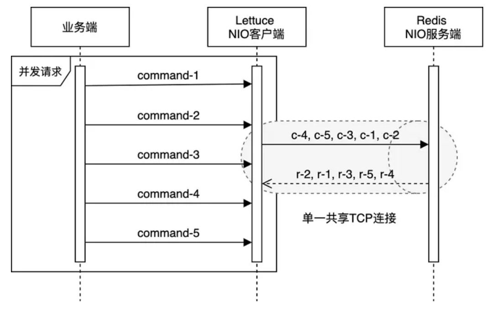 

Lettuce在保证请求处理顺序的基础上，天然地使用了**管道模式**（pipelining）与Redis交互 —— 在多个业务线程并发请求的情况下，客户端不必等待服务端对当前请求的响应，即可在同一个连接上发出下一个请求。这在加速了Redis请求处理的同时，也高效地利用了TCP连接的全双工特性（full-duplex）。而与之相对的，在没有显式指定使用管道模式的情况下，Jedis只能在处理完某个Redis连接上当前请求的响应后，才能继续使用该连接发起下一个请求 —— Lettuce和Jedis之间的这种差异，在某种程度上与HTTP/2和HTTP/1之间的差异类似（注4）。HTTP/2的实现原理读者可参阅《Introduction to HTTP/2》，本文不作赘述。

#### 普通模式对比

Redis官网文档中对管道模式作了详细的论述，大意是（注5）：客户端与服务端通过网络连接，无论两者间的网络延迟是高还是低，数据包从客户端到服务端（请求），再从服务端返回客户端（响应）的过程总是会消耗一定的时间。我们将这段时间称为**RTT**（Round Trip Time）。假设在延迟非常高的网络条件下，RTT达到250ms，此时就算服务端拥有每秒处理100k请求的能力，（基于单一连接）整体的QPS也仅仅只有4。而如果借助管道模式，客户端则可以一次性发出大量（如1k）请求，并随后一次性接收大量服务端的响应，从而**显著提高**请求处理速度。如下图所示：

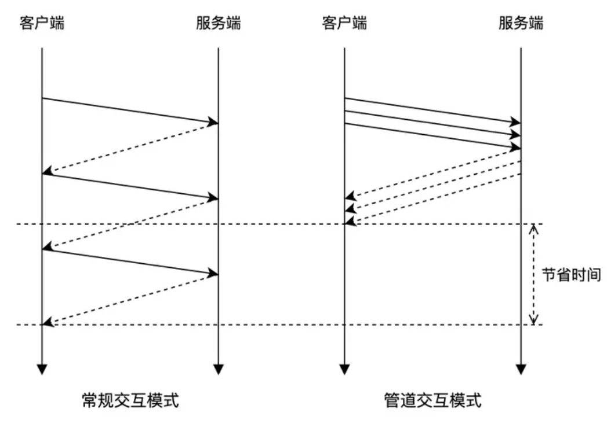 

笔者使用JMH框架模拟客户端高并发请求（200线程）的场景，基于单一Redis连接，对上述特性进行测试。Redis服务端运行在阿里云的ECS上，与客户端所在机器的RTT约为12ms。在非管道模式下，如基于Jedis客户端的单个连接，整体的QPS理论上只能达到80+，实测更低；而同样是基于单个连接，借助Lettuce客户端，笔者实测录得7000+QPS。当然，此处的比较主要是为了说明Lettuce的管道特性，因为生产环境中Jedis总是配合连接池一起使用的。后文会对两个客户端按照正常方式使用时的性能做进一步的比较分析。

#### 管道模式总结

注意这里我们使用**多线程**基于单一Redis连接进行并发请求，来测试Lettuce客户端的管道特性（其中每个线程自身发出一个请求并收到响应后，才算请求结束），虽然这与我们一般所理解的，**单个线程**基于单一Redis连接一次性发出多个请求的pipelining方式有一定区别，不过两者本质上是相同的：即客户端可以不等待上一个请求的响应，便在同一个Redis连接上发出后续的请求。对此的详细论述可见《Lettuce Wiki - Pipelining and command flushing》一文，这里部分摘录如下，供读者参考。下面我们将结合Lettuce源码，对该特性进行具体分析

## Lettuce核心源码

### 功能架构

由于Lettuce基于Netty框架实现，当其初始化Redis连接通道（Channel）时，会将一系列需要用到的通道处理器（ChannelHandler）添加至通道流水线（ChannelPipeline），以实现对Redis的连接管理和读写操作的处理。大致如下图所示：

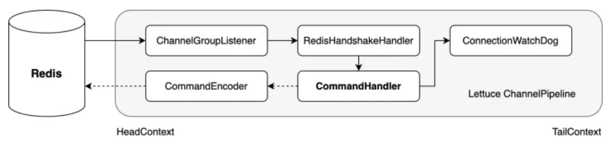 

上图中实线箭头的流转表示各个入站ChannelHandler对Redis的连接管理和读操作的处理链路，而虚线箭头的流转则表示各个出站ChannelHandler对Redis的写操作的处理链路。比如，在初始化Redis连接时，RedisHandshakeHandler会默认优先尝试使用RESP3协议与Redis进行交互；在发送Redis指令时，CommandEncoder作为出站链路上最后一个处理器，会将Lettuce的指令模型实例（RedisCommand）转换为可被最终写入Channel的字节容器（ByteBuf）。

而我们在上节第1点中所描述的Lettuce对指令的操作行为，则是通过**CommandHandler**处理器实现的。CommandHandler继承了Netty预定义的ChannelDuplexHandler，对Redis的读操作和写操作均会进行相应的处理，可以说是一个核心的通道处理器。下面我们对其进行具体的源码分析。

### CommandHandler写操作

```
// CommandHandler写操作相关核心代码，其中部分代码省略
public class CommandHandler extends ChannelDuplexHandler implements HasQueuedCommands {
    
    private final ArrayDeque<RedisCommand<?, ?, ?>> stack = new ArrayDeque<>();
    
    // 覆写ChannelDuplexHandler的write方法
    @Override
    public void write(ChannelHandlerContext ctx, Object msg, ChannelPromise promise) throws Exception {        
        
        // 若msg为单个Redis指令
        if (msg instanceof RedisCommand) {
            writeSingleCommand(ctx, (RedisCommand<?, ?, ?>) msg, promise);
            return;
        }
        
    }
    
    private void writeSingleCommand(ChannelHandlerContext ctx, RedisCommand<?, ?, ?> command, ChannelPromise promise) {        
        
        // 向promise注册事件监听器
        addToStack(command, promise);
        
        // 将command传递给下个ChannelHandler（此处即CommandEncoder）处理
        ctx.write(command, promise);
        
    }
    
    private void addToStack(RedisCommand<?, ?, ?> command, ChannelPromise promise) {        
        
        try {
            RedisCommand<?, ?, ?> redisCommand = potentiallyWrapLatencyCommand(command);
            if (promise.isVoid()) {
                stack.add(redisCommand);
            } else {
                // 正常情况下，分支流程会走到这里，向promise注册监听器
                promise.addListener(AddToStack.newInstance(stack, redisCommand));
            }            
        } catch (Exception e) {
            command.completeExceptionally(e);
            throw e;
        }
       
    }
    // 事件监听器
    static class AddToStack implements GenericFutureListener<Future<Void>> {
        
        private ArrayDeque<Object> stack;
        private RedisCommand<?, ?, ?> command;        
        
        static AddToStack newInstance(ArrayDeque<?> stack, RedisCommand<?, ?, ?> command) {
            AddToStack entry = RECYCLER.get();
            entry.stack = (ArrayDeque<Object>) stack;
            entry.command = command;
            return entry;
        }
        
        // 当Redis指令被成功写入套接字缓冲后，该方法会被回调
        @Override
        public void operationComplete(Future<Void> future) {
            try {
                if (future.isSuccess()) {
                    // 将Redis指令加入队列末端
                    stack.add(command);
                }
            } finally {
                recycle();
            }
        }
        
    }
    
}
```

上述是CommandHandler写操作相关核心代码（略有简化）。可以看到，CommandHandler覆写了ChannelDuplexHandler的`write`方法。当Lettuce将Redis请求投递至Netty EventLoop并被执行时，该方法会被调用。在发送的是单个Redis指令（RedisCommand）的场景下，`CommandHandler#writeSingleCommand`方法会被接着调用。该方法主要负责完成两件事：一是向通道操作结果`promise`注册一个事件监听器（AddToStack），二是将指令传递给下个ChannelHandler（此处即CommandEncoder）进行处理。当Redis指令最终经由JDK的SocketChannel，被成功写入套接字缓冲后，监听器AddToStack实例的`operationComplete`方法会被**回调执行**，将该指令放入CommandHandler实例维护的`stack`队列中。业务线程的并发请求便是如此被EventLoop顺序处理，并按序放入指令队列中。我们再通过一张序列图来更直观地展示这其中各组件之间的交互：

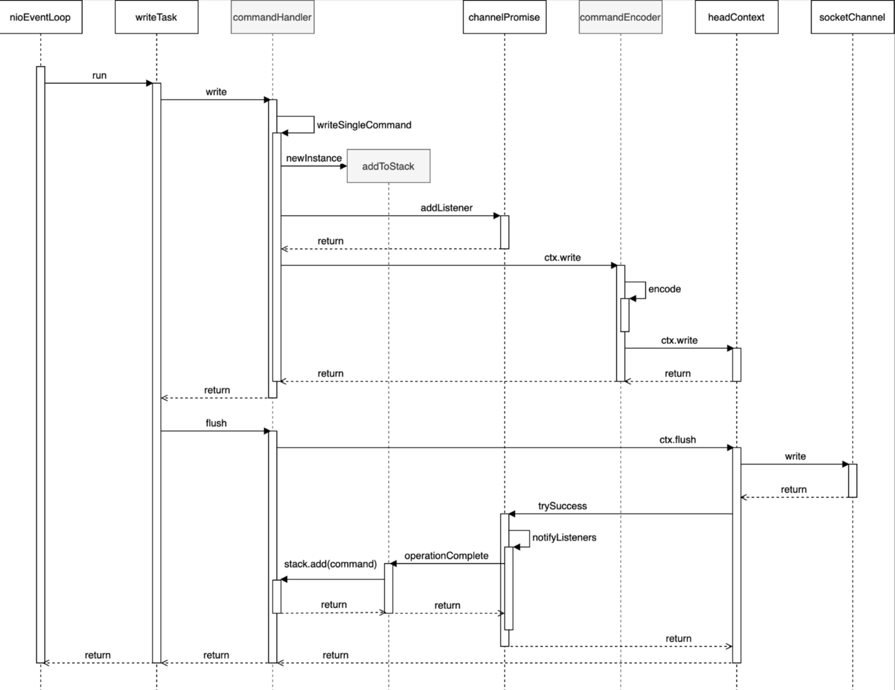 

上图中除了灰色部分的commandHandler、addToStack和commandEncoder这三个参与者是Lettuce的组件实例外，其余均是Netty或JDK的组件实例（图中略有简化），由此我们也可以看出Netty框架良好的可扩展性，及其完善的预定义功能。从**设计模式**的角度看，串联起各个请求读写操作处理器的通道流水线（ChannelPipeline），属于职责链模式；而对AddToStack监听器的注册和回调，则是对观察者模式的运用 —— 两者均使Netty框架更符合**开闭原则**（Open Closed Principle），易于被扩展与使用。

### CommandHandler读操作

在同步调用的场景下，业务线程通过Lettuce发送Redis指令后，会拿到一个RedisFuture对象，并在该对象上等待并获取请求的处理结果。而将Redis响应放入RedisFuture实例的操作，也是由CommandHandler完成的。前面我们介绍了CommandHandler对请求写操作的处理，这里我们对该处理器对响应读操作的处理进行分析。除了上文提到的ChannelDuplexHandler的`write`方法外，CommandHandler还对其父类的`channelRead`方法进行了覆写。当EventLoop读取到Redis的响应后，该方法会被调用，具体代码如下（略有简化）：

```text
// CommandHandler读操作相关核心代码，其中部分代码省略
public class CommandHandler extends ChannelDuplexHandler implements HasQueuedCommands {
 private final ArrayDeque<RedisCommand<?, ?, ?>> stack = new ArrayDeque<>();
    
 private ByteBuf buffer;
    
    // 覆写ChannelDuplexHandler父类ChannelInboundHandlerAdapter的channelRead方法
    @Override
    public void channelRead(ChannelHandlerContext ctx, Object msg) throws Exception {
        ByteBuf input = (ByteBuf) msg;    
        try {
            // 将input数据写入buffer
            buffer.writeBytes(input);
            // 数据解析
            decode(ctx, buffer);
        } finally {
            input.release();
        }
    }
    // 响应解析
    protected void decode(ChannelHandlerContext ctx, ByteBuf buffer) throws InterruptedException {
        while (canDecode(buffer)) {
            
            if (isPushDecode(buffer)) {
                // Pub/Sub模式下的Redis消息处理，代码省略
            } else {
                // 常规Redis响应处理
             // 以FIFO的方式从队列头部读取（但不取出）Redis指令
                RedisCommand<?, ?, ?> command = stack.peek();            
                
                try {
                    // 响应解析
                    if (!decode(ctx, buffer, command)) {                    
                        decodeBufferPolicy.afterPartialDecode(buffer);
                        return;
                    }
                } catch (Exception e) {
                    // 异常处理代码省略
                }
        
                if (isProtectedMode(command)) {
                    // 省略
                } else {
                    if (canComplete(command)) {
                        // 取出Redis指令
                        stack.poll();
                        try {
                            // 完成指令
                            complete(command);
                        } catch (Exception e) {
                            // 异常处理代码省略
                        }
                    }
                }
                // buffer数据清理
                afterDecode(ctx, command);
            }
        }
    }
    
}
```

可以看到，在`channelRead`方法中，EventLoop读取到的`input`数据，首先会被写入CommandHandler实例自身维护的`buffer`中，继而由`decode`方法进行具体的解析工作。这是因为，一次socket读操作，未必总是能读取到完整的Redis响应，因此我们需要将数据先暂时保存。在响应解析过程中，CommandHandler处理器会以**FIFO**的方式，读取其在写操作过程中放入`stack`队列的Redis指令（RedisCommand）。由于前文指出的Lettuce、Redis及TCP连接在指令处理及传输上的**顺序保证**，我们可以确保当前的响应数据属于被读取的那条指令。如果解析成功，Redis响应数据会被写入指令实例中，且该条指令会最终从队列中被取出，并被标记为完成；否则，方法会直接返回，需要由后续的`channelRead`调用基于完整的响应数据完成解析。

值得注意的是，`decode`方法中的解析动作是在`while`循环中进行的。这是因为，除了可能无法一次性读取到完整的Redis响应外，在**管道模式**下，一次socket读操作，也有可能会读取到多条Redis响应。在同步调用模式下，当Redis指令被标记为完成后，正在等待响应的业务线程便可以拿到结果数据了。而如果调用模式为异步，则对响应结果的后续处理默认由EventLoop线程执行。这里RedisCommand指令对象和前述的RedisFuture结果对象似乎并不相同，但实际上它们都指向同一个实例（AsyncCommand）。至此，我们大致解释了Lettuce的**核心读写逻辑**。正是基于这样的设计，使得Lettuce仅凭单一连接，便可服务于业务线程的并发请求，并能以高效的管道模式与Redis交互。

## 性能分析

### 理论分析

#### jedis连接池

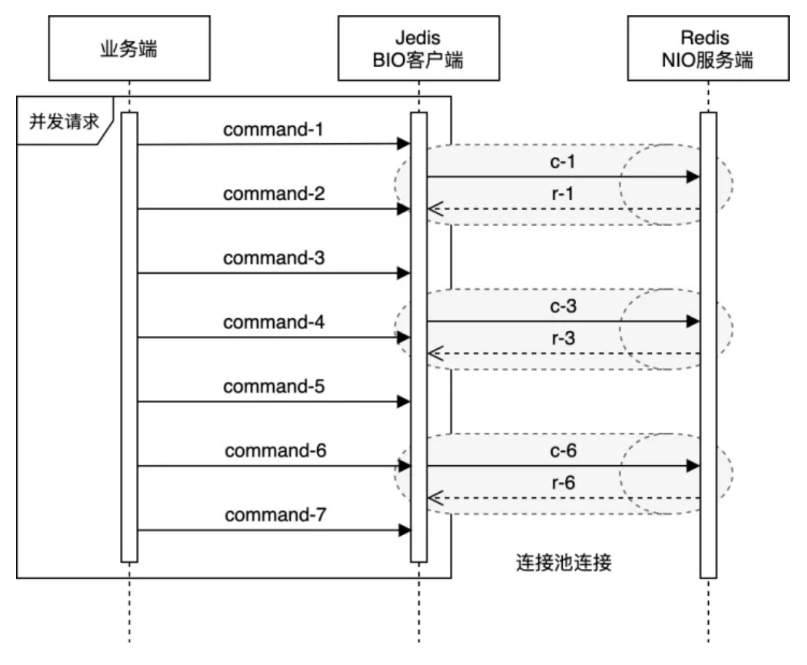 

上图展示了Jedis与Redis的交互方式。乍看上去，我们似乎不容易区分在业务线程高并发请求的场景下，Lettuce与Jedis的运作模式在性能表现上孰优孰劣 —— 前者通过在单一共享连接上，以**管道模式**的方式与Redis交互；后者则通过其维护的**连接池**，对Redis进行并发操作。我们首先从**Redis服务端**的角度进行分析。从Redis服务端的角度看，在客户端请求发送速率相同的情况下，管道的交互方式是具备一定优势的

#### 上下文切换

管道模式的作用不仅仅在于其减少了网络RTT带来的延迟影响，同时，它也**显著提升**了Redis服务器每秒可执行的指令操作量。这是因为，虽然从访问内存数据并生成响应的角度看，Redis处理某条指令操作的成本是很低的，但是从执行套接字I/O操作的角度看，如果我们不使用管道模式，（当需要逐个处理大量客户端请求时）对Redis来说（相对于内存操作）成本是很高的。套接字I/O操作涉及`read`和`write`这两个**系统调用**，这意味着Redis需要（频繁地）从用户态切换到内核态，而由此导致的**上下文切换**会非常耗时

**上下文切换**（context switch）发生在内核对系统中不同进程或线程的调度（scheduling）过程中。就进程而言，内核会为每个进程维护一个上下文（context），用于在需要的时候将被中断的进程恢复执行。进程上下文包括多种不同的对象，如各类寄存器、程序计数器、用户栈、内核栈，以及各类内核数据结构（如地址空间页表、文件表）等。当程序在用户态执行**系统调用**（如前面提到的套接字I/O操作）时，为了避免阻塞，内核会通过上下文切换机制，中断当前进程，并调度执行一个其他的（先前被中断的）进程。这个过程包括：1、保存当前进程的上下文，2、恢复那个先前被中断的进程的被保存的上下文，3、执行这个被恢复的进程。此外，即使系统调用没有阻塞，内核也可以选择执行上下文切换，而不是（在系统调用完成后）将控制返回给调用进程。

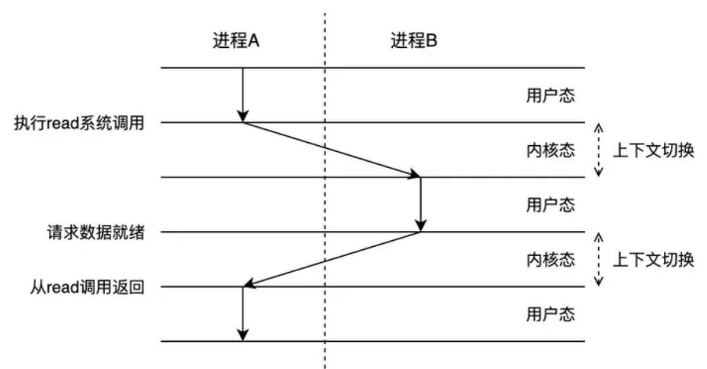 

可以看到，进程的上下文切换操作是较为复杂的。而对于运行在同一个进程中的线程来说，由于它们共享该进程的上下文，且线程自身的上下文比进程的上下文小不少，因此（同一个进程中的）线程的上下文切换相比进程的上下文切换要快。然而即便如此，由于同样涉及到程序在用户态和内核态之间的来回转换，以及CPU数据的刷写，高强度的线程上下文切换带来的性能损耗也是**不可忽视**的（注6）。这也是为什么很多框架和编程语言会尽可能避免这一点。比如Netty的EventLoop遵循Java NIO的模式，仅与单个线程绑定（注7）；JDK 6中默认开启自旋锁，以尽可能减少线程切换的开销（注8）；Go语言更是使用goroutine替代线程，以提高程序并发性能（注9）。

#### 小结

言归正传，虽然Redis服务端本身使用单线程、NIO模式处理客户端请求，相比传统的一个线程服务一个客户端连接的BIO方式，已经在系统上下文切换和内存管理上达成了不小的优化，但是在高并发请求场景下，服务端的性能仍存在提升空间。根据官网文档中的论述（注10），在Redis的**管道模式**下，单次`read`系统调用便可读取到许多指令，且单次`write`系统调用也能回写许多响应 —— 相比一次`read`或`write`系统调用仅处理一个客户端请求而言，这进一步降低了服务端处理请求时的**上下文切换开销**。Redis的每秒请求处理数，随着管道的加长（即管道中指令数量的增加）会有接近线性的提升，并最终可达到非管道模式下处理性能的约10倍水平

值得一提的是，业界也在不断探索更底层的技术方案，以更进一步减少socket相关的系统调用（注11）。如Linux的**io_uring**，就是借助mmap技术，在应用程序和内核之间共享环形缓冲（ring buffer），使两者可以基于该共享内存进行交互，从而达到**最小化系统调用频次**（以及由此导致的系统上下文切换）的目的（注12）。**Netty**框架的io_uring实现目前已正在孵化阶段，而根据其作者在0.0.1.Final版本基于一个简单的echo-server的benchmarking数据来看，io_uring实现的QPS是epoll实现的3倍左右（注13）。与此同时，根据《13 Years Later – Does Redis Need a New Architecture?》一文，**Redis**团队也正在考虑未来将io_uring技术整合至Redis（注14）。而一旦Redis本身使用了io_uring，从更根本的层面减少了socket相关操作系统调用的发生，那么这里我们基于Redis服务端的角度，对Lettuce和Jedis所做的比较分析，可能也就不再完全适用了。对io_uring的详细解析超出了本文的范畴，感兴趣的读者可以进一步查阅相关资料

### Benchmarking实测

上文中我们强调了在处理业务线程并发请求的场景下，Lettuce能够**天然地**以管道的方式与Redis交互，但这并不意味着Jedis不支持管道特性。事实上，我们可以通过调用Jedis实例的`pipelined`方法显式地开启某个Jedis实例的管道特性。然而，由于Jedis客户端是通过连接池承载业务并发请求，而Jedis实例本身**不是线程安全**的（注15），因此，单个Jedis实例的管道特性并不能服务这种常见的web应用场景。当然，Jedis实例的管道特性在其他场景下还是有用武之地的：如笔者曾使用GitHub上的开源项目Orestes-Bloomfilter进行基于Redis的分布式布隆过滤，其底层实现便是使用了Jedis实例的管道特性（注16）。

上节我们从Redis服务端系统上下文切换的角度，对Lettuce和Jedis进行了对照分析。虽然这是一个很重要的角度，但是并不能完全反映事物的全貌。我们还需要结合其他影响客户端性能的因素，乃至结合实际的benchmarking数据，才能给出一个相对客观中肯的评估。比如，从客户端的角度看，在Redis服务端指令处理速率相同的情况下，Jedis在**多核处理器**上的性能应该是高于仅使用单一Redis连接情况下的Lettuce的。这是由于Jedis借助其连接池特性，可以最大化利用多核处理器的能力，**并行**地向Redis发送请求。

下面笔者使用JMH（Java Microbenchmark Harness）框架，模拟业务高并发请求场景，基于localhost本地Redis服务，在多核处理器上对Jedis和Lettuce进行性能测试（由于条件所限，客户端与服务端在同一台机器上运行，不过这对测试数据的参考价值影响较小）。我们使用200个并发线程，分别对Jedis连接池模式、Lettuce单连接模式、Lettuce连接池模式，以及Lettuce多连接模式（后文会对该模式作进一步阐释）进行测试。相关benchmarking代码详见附录，测试结果取多次均值，如下图所示：

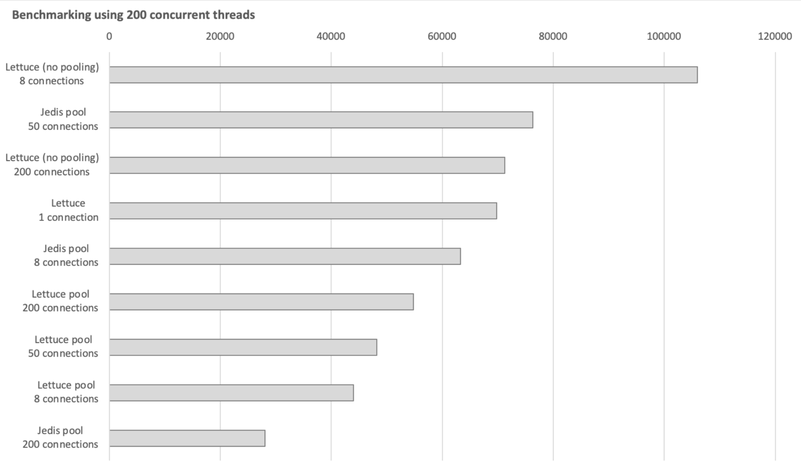 

上图纵轴表示我们所测试的各类客户端使用模式，横轴表示其对应的QPS性能数据。乍看之下，这些数据可能有些让人疑惑，并且似乎自相矛盾。比如，Jedis在连接池连接数达到200时，性能损耗严重；而Lettuce连接池模式的表现虽然有些差强人意，但是与Jedis相反，其性能在连接数达到200时，反而上了一个台阶。又如，在200连接数这个量级上，Lettuce多连接模式（no pooling）的表现最好；同时，该模式在连接数为8时，性能表现出众，位居第一。然而仔细分析后我们会发现，这些现象背后的原因并没有太过超出我们上文的分析所涉及的范畴。

#### Lettuce单连接模式

首先我们可以看到，上文详细讨论的Lettuce单连接模式，虽然在与Redis交互时没有使用多核处理器的并行能力，但是借助其管道特性，仅凭单一共享连接，也展现出了不错的性能水平。Jedis在连接池连接数为50时，表现出了其最优性能水平，QPS达到约90k，超越Lettuce单连接模式；而当其连接数增至200，数量等同于测试所用并发业务线程数时，性能出现**急剧下降**，跌至排行末尾。我们在命令行通过`top`和`ps`命令观察Jedis在不同连接数下测试时的CPU使用情况，可以发现，当连接数为50时，CPU各项指标处于一个比较均衡的水平；而当连接数为200时，Jedis对CPU的使用急剧上升，同时，其中约90%以上的CPU时间消耗在了**内核态**。仔细分析可以发现，由于我们测试所用的并发线程数是200，当Jedis连接池连接数也为200时，相当于在同一时刻，每个线程都可以持有一个连接，与Redis进行交互。这在某种程度上类似于服务端为每个客户端请求分配一个单独的线程进行处理的BIO模式。在这种模式下，随着并发线程量上升到一定程度，应用的性能便会因为需要频繁地转入内核态进行**线程上下文切换**而大幅下降（参考注6）。如下图所示，我们使用VisualVM观察比较在不同Jedis连接数下，业务线程在benchmarking中的状态变化（其中橙色表示挂起等待，绿色表示运行；运行态的线程可能正在执行，或是等待操作系统为其分配执行时间），其结果也在一定程度上佐证了上述分析。

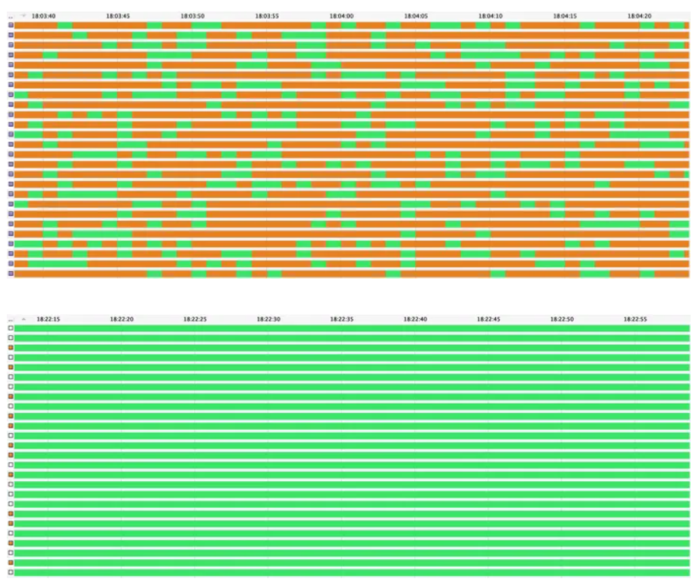 

#### Lettuce连接池模式

而与此同时，同样是在连接池模式下，Lettuce的性能随着连接数的增加**不降反升**，在连接数达到200时反而达到了该模式下的最高性能水平。这似乎与我们上文中对Jedis性能表现的分析相矛盾，这背后的原因是什么呢？原来，由于Lettuce是基于Netty框架开发的，测试并发线程在拿到Lettuce连接后，并不会直接与Redis发生交互，而是将请求投递至Netty EventLoop的任务队列，最终由**EventLoop**完成Redis请求的发送和响应的接收。我们知道，EventLoop仅与单一线程绑定，并且可以服务于多个连接。外部线程虽然可以通过其持有的连接，并发地向某个EventLoop提交写请求，但是这些请求都会被放入任务队列中，最终被EventLoop线程**顺序处理**。阅读源码可知，Lettuce默认会生成与处理器核数相同数量的EventLoop，来处理所有Redis读写请求。因此，在其连接池模式下，我们的测试业务线程的并发度，可以说既受到连接池连接数的制约，又受到了EventLoop的制约。在我们的测试中，处理器核数为8，即对应8个EventLoop。当Lettuce连接数不断增加时，来自连接池的制约不断减弱，而来自EventLoop的制约不变，将业务线程的活跃度（liveness）维持在一个可控的稳中有升的水平（如下图所示；其中底部绿色区域为EventLoop线程，上方为业务线程）。至此，我们也就不难理解为何此时Lettuce的性能表现会与Jedis相反了。

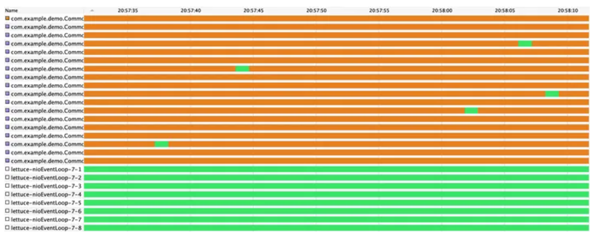 

上述的分析比较本质上是对线程并发度的讨论，对此，我们可以参考《Java并发编程实战》中对线程池大小的设置的论述作为总结：「如果**线程池过大**，那么大量的线程将在相对很少的CPU和内存资源上发生竞争，这不仅会导致更高的内存使用量，而且还可能耗尽资源。如果**线程池过小**，那么将导致许多空闲的处理器无法执行工作，从而降低吞吐率。……对于计算密集型的任务，在拥有Ncpu个处理器的系统上，当线程池的大小为Ncpu+1时，通常能实现最优利用率。对于**包含I/O操作**或者其他阻塞操作的任务，由于线程并不会一直执行，因此线程池的规模应该更大。……当任务需要某种通过资源池来管理的资源时，例如数据库连接，那么线程池和资源池的大小将会**相互影响**。如果每个任务都需要一个数据库连接，那么连接池的大小就限制了线程池的大小。」就我们的benchmarking而言，测试所用的并发线程数可以理解为线程池的大小；而Jedis或Lettuce的连接池，以及Lettuce底层使用的EventLoop，则可以对应理解为对并发线程的限制因素。


不过，从测试数据来看，Lettuce在连接池模式下的整体性能表现处于偏低的水平。究其原因，首先我们可以看到的是，在连接池模式下，Lettuce连接是**线程封闭**（thread confinement，见注17）的 —— 即业务线程从连接池中获得Lettuce连接后，通过该连接进行对Redis的读写操作，并在操作完成后再将连接返回给连接池；而在此期间，其他线程是无法获取到该连接的。这一点其实与Jedis连接池的原理相同。但两者不同之处在于，Jedis连接不是线程安全的，而Lettuce连接本身就是**线程安全**的（对此我们在上文中已经做了详细的分析）。因此，对Lettuce来说，在大多数情况下，连接池的线程封闭机制是不必要的（注18）。连接池的使用，反而会导致连接无法被多个线程共享，使其无法以更高效的**管道模式**与Redis交互。


另一方面，我们推测Lettuce自身某些代码片段的执行，带来了额外的性能损耗。否则，在连接数为200的情况下，Lettuce连接池模式似乎应该与配备8个连接的Jedis在性能上更加接近（注19）。为了进一步验证，我们选择使用火焰图进行具体的定量分析。**火焰图**（flame graph）由《性能之巅》的作者发明，以可视化的方式直观地展示了应用程序的调用栈信息。纵向来看，其顶部的框表示在CPU上执行的函数，下面的则是它的调用者；横向来看，框的宽度表示函数在或者不在CPU上运行的时间。同时，火焰图是交互式的，用户可以点击查看其中的各个方法信息。凭借这些特性，我们可以通过火焰图来协助快速定位程序中潜在的**性能瓶颈** —— 即哪些方法消耗了相对较多的时间，它们是否可以被进一步优化等。

 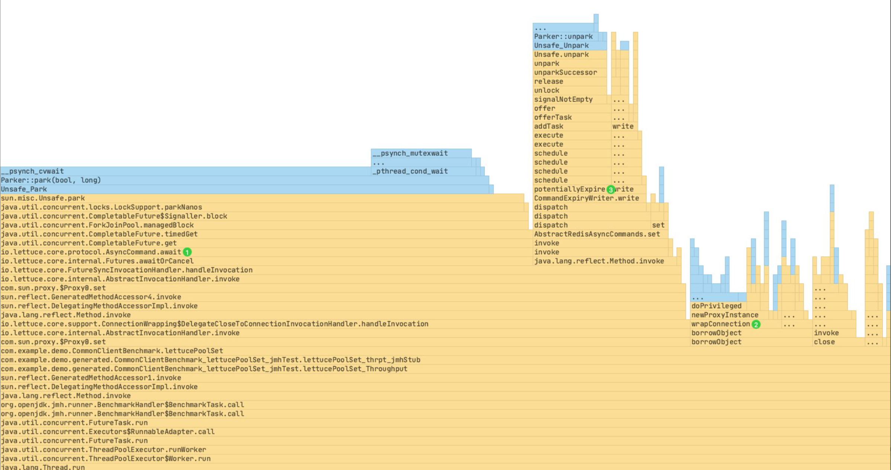 

上图即为Lettuce在连接池模式（200连接）下的业务线程benchmarking火焰图。其中黄色部分表示Java方法调用，蓝色部分表示native调用。从图中可以看到，消耗时间**占比最多**的顶部Lettuce方法依次为①`AsyncCommand#await`方法（约58%）、②`ConnectionWrapping#wrapConnection`方法（约10%），以及③`CommandExpiryWriter#potentiallyExpire`方法（约8%）。进一步阅读源码可知，方法1为业务线程将Redis请求投递至Netty EventLoop后调用，用于等待请求处理的响应；方法2用于简化对**连接池**的使用，使我们在`try`语句块中获取并使用完连接后，不用编写代码将其显式归还；而方法3则是基于用户指定的超时时间，对请求进行**超时控制**。对方法1来说，其火焰图上层顶部停留在`Unsafe#park`方法调用，表示线程处于挂起等待状态。虽然占据了一半多的时间，但是在此状态下线程并不消耗CPU资源，而是在等待Redis请求的处理响应。因此，我们没有直接对方法1进行优化的必要。对于方法2和方法3，笔者通过显式归还连接池连接、设置超时时间为0（即持续等待）的方式绕过后，benchmarking **QPS性能提升**约20%，最终与8连接Jedis性能基本持平。


深究上述方法2和方法3耗时的原因，可以看到，方法2使用**动态代理**对从连接池获取的Lettuce连接进行封装，以实现连接在被自动关闭（`AutoCloseable#close`）时，可自动返还连接池的能力。从火焰图中可以看到，由于每次从连接池取出连接时都需要进行代理封装，该特性导致`Proxy#newProxyInstance`方法被高频调用，成为方法2耗时的主要原因。而方法3中所涉及的Redis请求超时控制，则是通过**任务调度**的方式实现的。具体来说，在将请求投递至Netty EventLoop之前，Lettuce会为该请求调度一个超时任务。超时任务会被放入**阻塞队列**LinkedBlockingQueue中，最终由Netty的EventExecutor消费执行。观察EventExecutor线程的火焰图（图略）可以发现，其绝大部分时间都处于等待任务的挂起状态；而当Lettuce业务线程将超时任务放入阻塞队列时，如果队列先前为空，则程序会通过调用`signalNotEmpty`方法将消费线程唤醒。相关代码如下所示，结合火焰图我们可以发现，方法3上层顶部停留在`Unsafe#unpark`调用，即唤起EventExecutor这一步。与方法1所涉及的`Unsafe#park`调用类似，`Unsafe#unpark`调用本身并不耗时（注20）；因此我们可以判断此处发生了**线程上下文切换** —— 即内核中断了业务线程的执行，转而执行被唤醒的EventExecutor线程。这可以说是上下文切换对程序性能造成负面影响的又一个实例。

```
public class LinkedBlockingQueue<E> extends AbstractQueue<E>
        implements BlockingQueue<E>, java.io.Serializable {
            
    /** Lock held by take, poll, etc */
    private final ReentrantLock takeLock = new ReentrantLock();            
    /** Wait queue for waiting takes */
    private final Condition notEmpty = takeLock.newCondition();
            
 /**
     * Signals a waiting take.
     */
    private void signalNotEmpty() {
        final ReentrantLock takeLock = this.takeLock;
        takeLock.lock();
        try {
            // 唤醒在notEmpty条件上等待的EventExecutor线程
            notEmpty.signal();
        } finally {
            takeLock.unlock();
        }
    }
            
}
```

上文我们提到，对于方法2来说，我们可以通过显式归还连接的方式绕过；但是对于方法3来说，通过设置超时时间为0，即不作请求超时控制来绕过的做法，在生产环境显然是不合适的。从上文的分析可以看到，阻塞队列LinkedBlockingQueue的锁同步和条件等待机制所带来的线程调度成本，是方法3耗时较长的主要原因。那么，有什么办法对此进行优化吗？笔者想到了Netty提供的**时间轮算法** —— HashedWheelTimer。该算法专门为I/O请求超时管理而设计。简单来说，HashedWheelTimer实例维护了一个工作线程，每隔一小段时间（默认100ms），该线程会收取新的超时任务，并执行已经到期的任务。而此处业务线程与工作线程间对超时任务的传递，是通过JCTools提供的MpscArrayQueue实现的。与LinkedBlockingQueue最大的不同是，MpscArrayQueue队列是基于**非阻塞算法**实现的（注21）。该算法使用底层的比较并交换（compare and swap）原子机器指令，配合更轻量的volatile变量同步机制，代替锁来确保数据在并发访问中的一致性。队列命名中的Mpsc意指Multi-Producer, Single-Consumer，符合时间轮的多生产者（业务线程），单消费者（工作线程）运作模式。


《Java并发编程实战》中提到：「与基于锁的方案相比，非阻塞算法在设计和实现上都要复杂得多，但它们在可伸缩性和活跃性上却拥有巨大优势。由于非阻塞算法可以使多个线程在竞争相同的数据时不会发生阻塞，因此它能在粒度更细的层次上进行协调，并且**极大地减少**（线程）调度开销。」无独有偶，Netty的EventLoop也使用了MpscArrayQueue，替代其父类默认的LinkedBlockingQueue，作为任务队列的具体实现。回到方法3，由于请求超时控制有其存在的必要性，且并非仅在Lettuce连接池模式下独有，因此还是值得我们考虑如何进一步做性能优化的。为此，笔者在GitHub上与Lettuce的作者讨论了上述想法（注22），对方也欢迎笔者提供一个pull request。当然，此处对时间轮的使用及其性能提升效果，还需要进行进一步论证和定量分析。


行文至此，我们可以看到，对于减少进程或线程的上下文切换，以提高程序性能，我们在**不同维度**上都存在一些相应的手段。比如，在JDK的使用层面，我们可以合理控制并发线程数，或是使用非阻塞算法结构；在编程语言自身层面，有Java的自旋锁、Go语言的goroutine；在网络编程层面，有NIO、pipelining、io_uring等等。这里为读者略作回顾总结。

#### Lettuce**多连接模式**

本节最后，让我们看看位居benchmarking性能榜首的Lettuce**多连接模式**。多连接模式与连接池模式虽然都使用了多个连接，但两者的区别在于，在多连接模式下，Lettuce连接不是线程封闭的，而是可以同时被多个业务线程使用（Lettuce连接是线程安全的）。如下图所示，与Jedis或Lettuce的连接池模式相比，多连接模式发挥了能够以**管道模式**与Redis交互的优势；与Lettuce单连接模式相比，多连接模式又充分利用了多核处理器的**并行操作**能力。在我们的测试中，当将连接数设置为处理器核数（8个）时，Lettuce多连接模式可以相对均衡地同时发挥管道模式与并行操作这两个特性，因此展现出了最佳的性能水平。不过，该模式尚未被Lettuce集成，希望其后续版本能进行支持

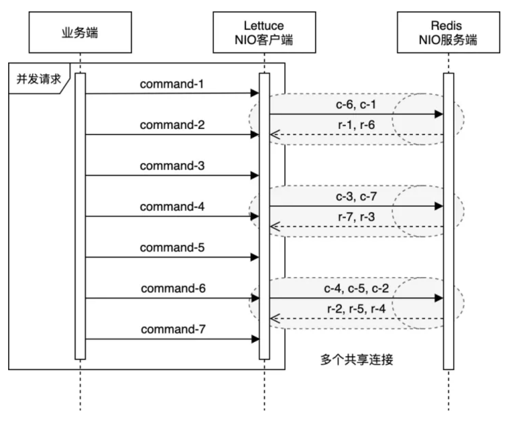 

#### JMH Benchmark核心代码

```text
// * 因篇幅所限，部分代码省略，且Lettuce和Jedis在各模式下的测试代码在此合并展示。
@State(Scope.Benchmark)
public class RedisClientBenchmark {
 // 属性字段代码省略
    
    @Setup // benchmark启动前执行
    public void setup() {
        
        RedisURI redisURI = RedisURI.create(host, port);
        // Lettuce单连接模式
        lettuceClient4SingleConnection = RedisClient.create(redisURI);
        lettuceClient4SingleConnection.setOptions(ClientOptions.builder()
                .timeoutOptions(TimeoutOptions.builder().fixedTimeout(Duration.ofSeconds(3)).build()).build());
        lettuceSingleConnection = lettuceClient4SingleConnection.connect(ByteArrayCodec.INSTANCE);
        // Lettuce连接池模式
        lettuceClient4ConnectionPool = RedisClient.create(redisURI);
        lettuceClient4ConnectionPool.setOptions(ClientOptions.builder()
                .timeoutOptions(TimeoutOptions.builder().fixedTimeout(Duration.ofSeconds(3)).build()).build());
        GenericObjectPoolConfig lettucePoolConfig = new GenericObjectPoolConfig();
        lettucePoolConfig.setMaxTotal(200);
        lettucePoolConfig.setMaxIdle(200);
        lettuceConnectionPool = ConnectionPoolSupport.createGenericObjectPool(
                () -> lettuceClient4ConnectionPool.connect(ByteArrayCodec.INSTANCE), lettucePoolConfig);
        // Lettuce多连接模式
        lettuceClient4MultipleConnection = RedisClient.create(redisURI);
        lettuceClient4MultipleConnection.setOptions(ClientOptions.builder()
                .timeoutOptions(TimeoutOptions.builder().fixedTimeout(Duration.ofSeconds(3)).build()).build());
        processors = Runtime.getRuntime().availableProcessors(); // 笔者机器上为8个    
        lettuceMultipleConnection = new ArrayList<>(processors);
        for (int i = 0; i < processors; ++i) {
            lettuceMultipleConnection.add(lettuceClient4MultipleConnection.connect(ByteArrayCodec.INSTANCE));
        }
        // Jedis连接池模式
        JedisPoolConfig jedisPoolConfig = new JedisPoolConfig();
        jedisPoolConfig.setMaxTotal(50);
        jedisPoolConfig.setMaxIdle(50);        
        jedisConnectionPool = new JedisPool(jedisPoolConfig, host, port, 3000);
    }
    @TearDown // benchmark结束后执行
    public void tearDown() {
        // 主要执行关闭连接或连接池等操作，具体代码省略
    }
    
    // Lettuce单连接模式执行set方法性能测试
    @Threads(200) // 200并发线程
    @Fork(1)
    @Benchmark
    @BenchmarkMode(Mode.Throughput)
    @Warmup(iterations = 1, time = 30, timeUnit = TimeUnit.SECONDS)
    @Measurement(iterations = 2, time = 30, timeUnit = TimeUnit.SECONDS)
    public void lettuceSet4SingleConnection() {
        lettuceSingleConnection.sync().set("lettu".getBytes(), "lettu".getBytes());
    }
    // Lettuce连接池模式执行set方法性能测试
    @Threads(200)
    @Fork(1)
    @Benchmark
    @BenchmarkMode(Mode.Throughput)
    @Warmup(iterations = 1, time = 30, timeUnit = TimeUnit.SECONDS)
    @Measurement(iterations = 2, time = 30, timeUnit = TimeUnit.SECONDS)
    public void lettuceSet4ConnectionPool() throws Exception {
        try (StatefulRedisConnection<byte[], byte[]> lettuceConnection = lettuceConnectionPool.borrowObject()) {
            lettuceConnection.sync().set("lettu".getBytes(), "lettu".getBytes());
        }
    }
    // Lettuce多连接模式执行set方法性能测试
    @Threads(200)
    @Fork(1)
    @Benchmark
    @BenchmarkMode(Mode.Throughput)
    @Warmup(iterations = 1, time = 30, timeUnit = TimeUnit.SECONDS)
    @Measurement(iterations = 2, time = 30, timeUnit = TimeUnit.SECONDS)
    public void lettuceSet4MultipleConnection() {
        ThreadLocalRandom random = ThreadLocalRandom.current();
        lettuceMultipleConnection.get(random.nextInt(0, processors))
                .sync().set("lettu".getBytes(), "lettu".getBytes());
    }
    // Jedis连接池模式执行set方法性能测试
    @Threads(200)
    @Fork(1)
    @Benchmark
    @BenchmarkMode(Mode.Throughput)
    @Warmup(iterations = 1, time = 30, timeUnit = TimeUnit.SECONDS)
    @Measurement(iterations = 2, time = 30, timeUnit = TimeUnit.SECONDS)
    public void jedisSet4ConnectionPool() {
        try (Jedis jedisConnection = jedisConnectionPool.getResource()) {
            jedisConnection.set("jedis", "jedis");
        }
    }
    // 通过执行main方法启动benchmark
    public static void main(String[] args) throws Exception {        
        org.openjdk.jmh.Main.main(args);
    }
    
}
```

## 