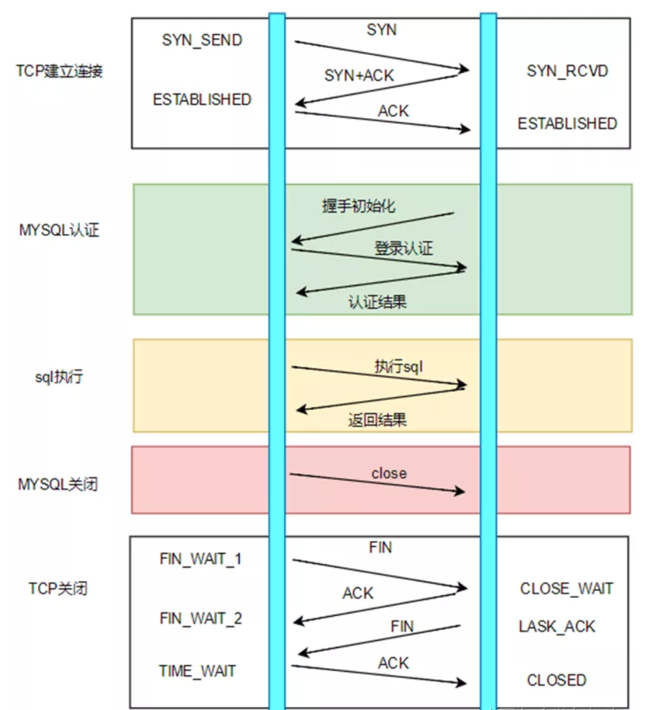
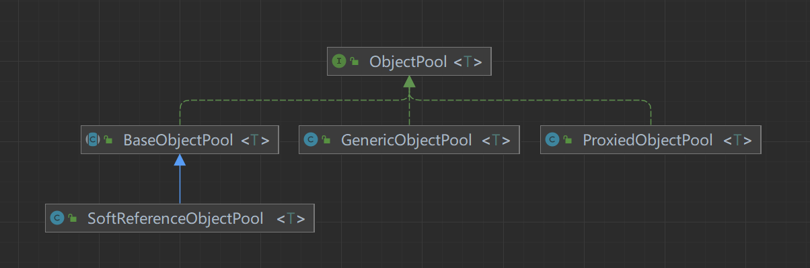
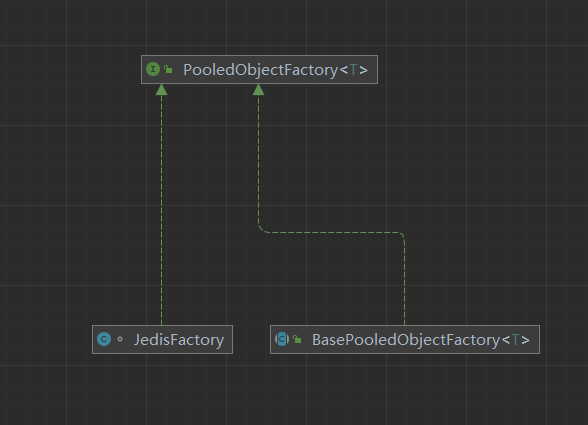
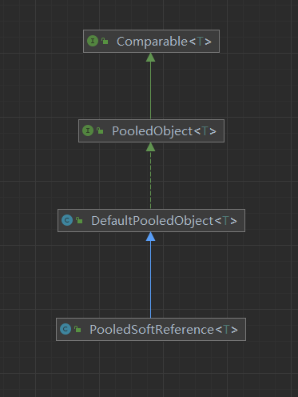
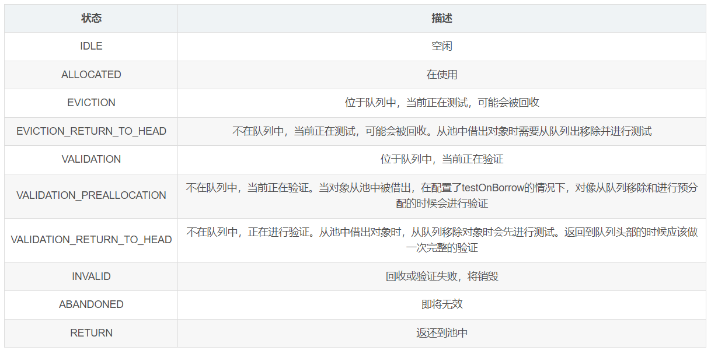

## 背景

在实际的应用工程当中，存在一些被频繁使用的、创建或者销毁比较耗时、持有的资源也比较昂贵的一些对象。比如：数据库连接对象、线程对象。所以如果能够通过一种方式，把这类对象统一管理，让这类对象可以被循环利用的话，就可以减少很多系统开销（内存、CPU、IO等），极大的提升应用性能

### mysql连接示例

```
String url = "jdbc:mysql://localhost:3306/test" ;     
String username = "root" ;    
String password = "root" ;    
try{    
	Connection con = DriverManager.getConnection(url , username , password ) ;    
}catch(SQLException se){    
	System.out.println("数据库连接失败！");    
	se.printStackTrace() ;    
}
```

 

TCP建立连接的三次握手（客户端与MySQL服务器的连接基于TCP协议）:

- MySQL认证的三次握手
- 真正的SQL执行
- MySQL的关闭
- TCP的四次握手关闭

#### ApacheCommonsPool

​	Apache Commons Pool就是一个对象池的框架，他提供了一整套用于实现对象池化的API，以及若干种各具特色的对象池实现。Apache Commons Pool是很多连接池实现的基础，比如DBCP连接池、Jedis连接池等。
​	Apache Commons Pool有个两个大版本，commons-pool和commons-pool2。commons-pool2是对commons-pool的重构，里面大部分核心逻辑实现都是完全重写的。我们所有的源码分析都是基于commons-pool2。

### 使用对象池

#### 继承工厂

自定义对象工厂实现`BasePooledObjectFactory`，重写 create() 和wrap()

```
public class SimplePooledObjectFactory extends BasePooledObjectFactory<ComplexObject> {
    @Override
    public SftpClient create() throws Exception {
      return new SftpClient(sftpPoolProperties);
    }
    @Override
    public ComplexObject create() {
        // 随机指定一个名称，用于区分ComplexObject
        String name = "test" + ThreadLocalRandom.current().nextInt(100);
        return new ComplexObject(name);
    }
    @Override
    public PooledObject<ComplexObject> wrap(ComplexObject obj) {
        // 使用默认池化对象包装ComplexObject
        return new DefaultPooledObject(obj);
    }
}
```

#### 创建对象池

```
public class SimplePool {
  private final GenericObjectPool<ComplexObject> internalPool;
  public SftpPool(Proproties p) {
    this.internalPool = new GenericObjectPool<>(new SimplePooledObjectFactory (),SimplePooledObjectFactory.getConfig(p));
  }

  public ComplexObject borrowObject() {
      try {
          return this.internalPool.borrowObject();
      } catch (Exception e) {
          throw new PoolException("获取连接对象失败!",e);
      }
  }

  @PreDestroy
  public void close() {
      try {
          this.internalPool.close();
      } catch (Exception e) {
          throw new PoolException("销毁对象池失败!",e);
      }
  }


  public void invalidateObject(ComplexObject obj) {
      try {
          this.internalPool.invalidateObject(obj);
      } catch (Exception e) {
          throw new PoolException("销毁连接对象失败!",e);
      }
  }

  public void returnObject(ComplexObject obj) {
      try {
          this.internalPool.returnObject(obj);
      } catch (Exception e) {
          throw new PoolException("回收连接对象失败!",e);
      }
  }

```

#### 对象池配置

```
  private GenericObjectPoolConfig<SftpClient> getPoolConfig(Properties p) {
    GenericObjectPoolConfig<SftpClient> config = new GenericObjectPoolConfig<>();
    config.setMinIdle(p.getMinIdle());
    config.setMaxIdle(p.getMaxIdle());
    config.setMaxTotal(p.getMaxActive());
    config.setMaxWaitMillis(p.getMaxWait());
    config.setTestOnBorrow(p.isTestOnBorrow());
    config.setTestOnReturn(p.isTestOnReturn());
    config.setTestWhileIdle(p.isTestWhileIdle());
    config.setTimeBetweenEvictionRunsMillis(p.getTimeBetweenEvictionRuns());
    return config;
  }
```

#### 调用对象池

```
public static void main(String[] args) throws Exception {
    // 创建配置对象
   SimplePool pool = new  SimplePool(new Properties);
   //借用对象
   pool.borrowObject();
   //归还对象
   pool.returnObject();
}
```


## 源码分析

### 核心类

#### ObjectPool

 

用于管理池中的所有对象，对于每个对象的操作会代理给 ObjectFactory。

ObjectPool 有多个实现，GenericObjectPool 提供了多种配置选项，包括限制空闲或活动实例的数量、在实例处于池中空闲时将其逐出等。

从版本 2 开始，GenericObjectPool 还提供了废弃实例跟踪和删除功能。SoftReferenceObjectPool 可以根据需要增长，但允许垃圾收集器根据需要从池中逐出空闲实例。

我们对象池关系图可以看到，objectPool是一个抽象接口，具体的实现方式

* ErodingObjectPool 对象池工具类， 返回一个当不再需要空闲对象时，自适应减小其大小的对象池
* GenericObjectPool **通用对象池 目前常用的实现接口，重点介绍**
* ProxiedObjectPool 代理对象池
* SynchronizedObjectPool 对象池工具类，提高操作时+锁
* SoftReferenceObjectPool 软引用对象池，包裹软引用对象

在commons-pool2中，对象池的核心接口叫做ObjectPool，他定义了对象池的应该实现的行为。

- addObject方法：往池中添加一个对象。池子里的所有对象都是通过这个方法进来的。
- borrowObject方法：从池中借走到一个对象。借走不等于删除。对象一直都属于池子，只是状态的变化。
- returnObject方法：把对象归还给对象池。归还不等于添加。对象一直都属于池子，只是状态的变化。
- invalidateObject：销毁一个对象。这个方法才会将对象从池子中删除，当然这其中最重要的就是释放对象本身持有的各种资源。
- getNumIdle：返回对象池中有多少对象是空闲的，也就是能够被借走的对象的数量。
- getNumActive：返回对象池中有对象对象是活跃的，也就是已经被借走的，在使用中的对象的数量。
- clear：清理对象池。注意是清理不是清空，改方法要求的是，清理所有空闲对象，释放相关资源。
- close：关闭对象池。这个方法可以达到清空的效果，清理所有对象以及相关资源

在commons-pool2中，ObjectPool的核心实现类是GenericObjectPool

apache-common-pool2是一个对象池管理框架，任何需要对象池这种概念的都可以利用这个框架来实现，例如redis的客户端jedis和dbcp都是基于common-pool2实现的

#### PooledObjectFactory

负责对象的创建，验证，销毁，ObjectPool 对于每个对象的核心操作会代理给 PooledObjectFactory

 

对象工厂相关api

- makeObject 制造对象
- destroyObject 销毁对象
- validateObject 验证对象
- activateObject 激活对象
- passivateObject 钝化对象 

#### PooledObject

​	池化的对象，用于包装实际的对象，提供一些附件的功能。如 Commons-Pool 自带的 DefaultPooledObject 会记录对象的创建时间，借用时间，归还时间，对象状态等，PooledSoftReference 使用 Java 的软引用来持有对象，便于 JVM 内存不够时回收对象。当然我们也可以实现

 

PooledObject 接口来定义我们自己的对象包装器；`PooledObject`有多种状态，在不同的环节或经过处理后状态会发生变化：

 

### GenericObjectPool

#### 创建GenericObjectPool对象

* 构造方法1

  ```
      public GenericObjectPool(PooledObjectFactory<T> factory, GenericObjectPoolConfig<T> config) {
          super(config, "org.apache.commons.pool2:type=GenericObjectPool,name=", config.getJmxNamePrefix());
          this.factoryType = null;
          this.maxIdle = 8;
          this.minIdle = 0;
          this.allObjects = new ConcurrentHashMap();
          this.createCount = new AtomicLong(0L);
          this.makeObjectCount = 0L;
          this.makeObjectCountLock = new Object();
          this.abandonedConfig = null;
          if (factory == null) {
              this.jmxUnregister();
              throw new IllegalArgumentException("factory may not be null");
          } else {
              this.factory = factory;
              //对象列表的存储容器使用的是双向并发阻塞队列，该阻塞队列同时支持FIFO和FILO两种操作方式，即可以从队列的头和尾同时操作(插入/删除)；并且，该阻塞队列是支持线程安全。还有，LinkedBlockingDeque还是可选容量的(防止过度膨胀)，即可以指定队列的容量。如果不指定，默认容量大小等于Integer.MAX_VALUE
              // config.getFairness()是否公平，内部使用retrantLock实现阻塞
              this.idleObjects = new LinkedBlockingDeque(config.getFairness());
              this.setConfig(config);
          }
      }
  ```

* 构造方法2

  ```
      public GenericObjectPool(PooledObjectFactory<T> factory, GenericObjectPoolConfig<T> config, AbandonedConfig abandonedConfig) {
          this(factory, config);
          this.setAbandonedConfig(abandonedConfig);
      }
  ```

#### borrowObject

```
public T borrowObject(long borrowMaxWaitMillis) throws Exception {
      .......省略
        while(p == null) {
            boolean create = false;
            //从空闲队列获取
            p = (PooledObject)this.idleObjects.pollFirst();
            if (p == null) {
            //没有获取到就创建
                p = this.create();
                if (p != null) {
                //创建成功
                    create = true;
                }
            }
//当对象池没有空闲对象时，新的获取对象的请求是否阻塞（true 阻塞，配置了maxWaitMillis 才生效；
// false 连接池没有资源立马抛异常）
//默认值 DEFAULT_BLOCK_WHEN_EXHAUSTED = true
            if (blockWhenExhausted) {
                if (p == null) {
                //borrowMaxWaitMillis  默认=-1
                    if (borrowMaxWaitMillis < 0L) {
                    //一直等待直到有空闲对象
                        p = (PooledObject)this.idleObjects.takeFirst();
                    } else {
                    //在指定的等待时间等待可用元素，超时返回Null
                        p = (PooledObject)this.idleObjects.pollFirst(borrowMaxWaitMillis, TimeUnit.MILLISECONDS);
                    }
                }
                //返回null
                if (p == null) {
                    throw new NoSuchElementException("Timeout waiting for idle object");
                }
                //没有对象可用，也没有设置没有对象可用时等待，抛出异常
            } else if (p == null) {
                throw new NoSuchElementException("Pool exhausted");
            }
			//获取到的对象属于不可用状态
            if (!p.allocate()) {
                p = null;
            }
			//获取到对象
            if (p != null) {
                try {
                //激活对象
                    this.factory.activateObject(p);
                } catch (Exception var15) {
                    try {
                    //异常销毁
                        this.destroy(p);
                    } catch (Exception var14) {
                    }
					//置为null
                    p = null;
                    if (create) {
                    //如果此元素时本次创建获取的，抛出激活不了对象异常
                        NoSuchElementException nsee = new NoSuchElementException("Unable to activate object");
                        nsee.initCause(var15);
                        throw nsee;
                    }
                }
				//判断连接对象是否可用
                if (p != null && this.getTestOnBorrow()) {
                    boolean validate = false;
                    Throwable validationThrowable = null;

                    try {
                    //验证连接是否可用
                        validate = this.factory.validateObject(p);
                    } catch (Throwable var13) {
                        PoolUtils.checkRethrow(var13);
                        validationThrowable = var13;
                    }
					//如果连接不可用
                    if (!validate) {
                        try {
                        //销毁
                            this.destroy(p);
                            //销毁连接次数+1
                            this.destroyedByBorrowValidationCount.incrementAndGet();
                        } catch (Exception var12) {
                        }

                        p = null;
                        if (create) {
                            NoSuchElementException nsee = new NoSuchElementException("Unable to validate object");
                            nsee.initCause(validationThrowable);
                            throw nsee;
                        }
                    }
                }
            }
        }
		更新获取对象的耗时
        this.updateStatsBorrow(p, System.currentTimeMillis() - waitTime);
        return p.getObject();
    }

```

#### create()

**创建对象**

```
private PooledObject<T> create() throws Exception {
        int localMaxTotal = this.getMaxTotal();
        //获取最大创建对象数，如果没有设置，默认Integer.maxvalue()
        if (localMaxTotal < 0) {
            localMaxTotal = 2147483647;
        }
        long localStartTimeMillis = System.currentTimeMillis();
        //最大等待时间
        long localMaxWaitTimeMillis = Math.max(this.getMaxWaitMillis(), 0L);
        Boolean create = null;

        while(create == null) {
        //创建对象lock
            synchronized(this.makeObjectCountLock) {
            //创建次数+1
                long newCreateCount = this.createCount.incrementAndGet();
                //如果创建次数>最大允许创建次数
                if (newCreateCount > (long)localMaxTotal) {
                //不再创建，创建次数-1
                    this.createCount.decrementAndGet();
                    //创建对象次数=0
                    if (this.makeObjectCount == 0L) {
                    //不再创建
                    create = Boolean.FALSE;
                    } else {
                     //可能在创建过程中，等待
                     this.makeObjectCountLock.wait(localMaxWaitTimeMillis);
                    }
                } else {
					//创建次数+1
                    ++this.makeObjectCount;
                    //允许创建
                    create = Boolean.TRUE;
                }
            }
			//如果在等待创建，设置了最大等待时间，并且当前耗时>=等待时间，返回null，不再创建
            if (create == null && localMaxWaitTimeMillis > 0L && System.currentTimeMillis() - localStartTimeMillis >= localMaxWaitTimeMillis) {
                create = Boolean.FALSE;
            }
        }

        if (!create) {
            return null;
        } else {
            boolean var22 = false;

            AbandonedConfig ac;
            label190: {
                PooledObject p;
                try {
                    var22 = true;
                    //创建对象
                    p = this.factory.makeObject();
                    //创建完成校验，如果失败
                    if (this.getTestOnCreate()) {
                        if (!this.factory.validateObject(p)) {
                            this.createCount.decrementAndGet();
                            ac = null;
                            var22 = false;
                            break label190;
                        }

                        var22 = false;
                    } else {
                        var22 = false;
                    }
                } catch (Throwable var27) {
                    this.createCount.decrementAndGet();
                    throw var27;
                } finally {
                //没有创建成功对象解锁
                    if (var22) {
                        synchronized(this.makeObjectCountLock) {
                            --this.makeObjectCount;
                            this.makeObjectCountLock.notifyAll();
                        }
                    }
                }
				//解锁
                synchronized(this.makeObjectCountLock) {
                    --this.makeObjectCount;
                    this.makeObjectCountLock.notifyAll();
                }
				//给对象+回收配置
                ac = this.abandonedConfig;
                if (ac != null && ac.getLogAbandoned()) {
                    p.setLogAbandoned(true);
                    p.setRequireFullStackTrace(ac.getRequireFullStackTrace());
                }
				//创建次数+1
                this.createdCount.incrementAndGet();
                //添加到对象池
                this.allObjects.put(new IdentityWrapper(p.getObject()), p);
                return p;
            }
			//对象校验失败，释放锁
            synchronized(this.makeObjectCountLock) {
                --this.makeObjectCount;
                this.makeObjectCountLock.notifyAll();
                return ac;
            }
        }
    }

```

#### 还对象

```
 public void returnObject(T obj) {
        PooledObject<T> p = (PooledObject)this.allObjects.get(new IdentityWrapper(obj));
        //没有获取到对象
        if (p == null) {
        //如果对象没有回收配置
            if (!this.isAbandonedConfig()) {
                throw new IllegalStateException("Returned object not currently part of this pool");
            }
        } else {
	        //标记归还状态
            this.markReturningState(p);
            long activeTime = p.getActiveTimeMillis();
            //配置了，返回时校验，同时校验不通过
            if (this.getTestOnReturn() && !this.factory.validateObject(p)) {
                try {
                //销毁对象
                    this.destroy(p);
                } catch (Exception var10) {
                    this.swallowException(var10);
                }

                try {
					//如果没有空闲对象，确保有一个空闲对象
                    this.ensureIdle(1, false);
                } catch (Exception var9) {
                    this.swallowException(var9);
                }
				 //更新活动时间
                this.updateStatsReturn(activeTime);
            } else {
                try {
                //钝化对象，自我实现
                    this.factory.passivateObject(p);
                } catch (Exception var12) {
                    this.swallowException(var12);

                    try {
                    //钝化出错，销毁对象
                        this.destroy(p);
                    } catch (Exception var8) {
                        this.swallowException(var8);
                    }

                    try {
					//如果没有空闲对象，确保有一个空闲对象
                        this.ensureIdle(1, false);
                    } catch (Exception var7) {
                        this.swallowException(var7);
                    }
					//更新累计活动时间
                    this.updateStatsReturn(activeTime);
                    return;
                }
				//将对象变为空闲状态
                if (!p.deallocate()) {
                    throw new IllegalStateException("Object has already been returned to this pool or is invalid");
                } else {
                //获取最大空闲数
                    int maxIdleSave = this.getMaxIdle();
                    //如果对象池已经关闭，或者最大空闲数>-1 同时最大空闲数<=空闲数
                    if (this.isClosed() || maxIdleSave > -1 && maxIdleSave <= this.idleObjects.size()) {
                        try {
                        //销毁对象
                            this.destroy(p);
                        } catch (Exception var11) {
                            this.swallowException(var11);
                        }
                    } else {
                    //否则就将此对象添加到空闲队列
                        if (this.getLifo()) {
                            this.idleObjects.addFirst(p);
                        } else {
                            this.idleObjects.addLast(p);
                        }
						//如果池子关闭了，清空
                        if (this.isClosed()) {
                            this.clear();
                        }
                    }
					//更新累计活动时间
                    this.updateStatsReturn(activeTime);
                }
            }
        }
    }

```

## 实现sftp连接池

项目使用sftp作为存储介质，需要大量的上传下载，单例的sftp不能满足场景，使用ThreadLocal存储sftp连接，会频繁创建销毁连接，性能太差，于是想到将连接对象池化

### 依赖包

```
   <dependency>
        <groupId>com.jcraft</groupId>
        <artifactId>jsch</artifactId>
        <version>0.1.55</version>
    </dependency>
    <dependency>
        <groupId>org.apache.commons</groupId>
        <artifactId>commons-pool2</artifactId>
        <version>2.8.0</version>
    </dependency>
```

### **sftpClient**

#### 实例

```
package com.zhanghao.base.util;

import com.jcraft.jsch.*;
import lombok.Data;

import java.time.LocalDateTime;
import java.time.format.DateTimeFormatter;
import java.util.Properties;
import java.util.concurrent.atomic.AtomicLong;

/**
 * @author zh
 */
@Data
public class SftpClient {
  private static final DateTimeFormatter DATE_TIME_FORMATTER = DateTimeFormatter.ofPattern("yyyy-MM-dd HH:mm:ss");
  private static final AtomicLong CLIENT_NUMBER = new AtomicLong(1L);
  private ChannelSftp channelSftp;
  private Session session;
  /**
   *
   */
  private String clientInfo = "sftpclient";
  /**
   * ssh 根目录。
   * 用于判断是否成功返回连接到连接池的条件之一
   */
  private String originalDir;
  //创建连接
  public SftpClient(SftpProperties sftpProperties) throws SftpException, JSchException {
    try {
      JSch jsch = new JSch();
      session = jsch.getSession(sftpProperties.getUsername(), sftpProperties.getHost(), sftpProperties.getPort());
      session.setPassword(sftpProperties.getPassword());
      Properties config = new Properties();
      if (sftpProperties.getSession() != null) {
        sftpProperties.getSession().forEach(config::put);
      }
      session.setConfig(config);
      session.connect();
      channelSftp = (ChannelSftp) session.openChannel("sftp");
      channelSftp.connect();
      clientInfo += CLIENT_NUMBER.getAndIncrement() + ",createTime:" + DATE_TIME_FORMATTER.format(LocalDateTime.now());
      originalDir = channelSftp.pwd();
    } catch (Exception e) {
      disconnect();
      throw e;
    }
  }
 //断开连接
  public void disconnect() {
    if (channelSftp != null) {
      try {
        channelSftp.disconnect();
      } catch (Exception ignored) {
      }
    }
    if (session != null) {
      try {
        session.disconnect();
      } catch (Exception ignored) {
      }
    }
  }
 //验证连接
  public boolean validateConnect() {
    try {
      return session.isConnected() && channelSftp.isConnected() && originalDir.equals(channelSftp.pwd());
    } catch (Exception e) {
      return false;
    }
  }
}
```

#### 配置

```
package com.zhanghao.base.util;

import lombok.Data;
import lombok.Getter;
import lombok.Setter;
import org.springframework.boot.context.properties.ConfigurationProperties;
import org.springframework.context.annotation.Bean;
import org.springframework.stereotype.Component;

import java.util.Map;

/**
 * @author zh
 */
@Component
@ConfigurationProperties("sftp")
@Getter
@Setter
public class SftpProperties {
  /**
   * 地址
   */
  private String host;
  /**
   * 端口号
   */
  private int port = 22;
  /**
   * 用户名
   */
  private String usernamel;
  /**
   * 密码
   */
  private String password;
  /**
   * Session 参数配置
   */
  private Map<String, String> session;
  /**
   * 连接池配置
   */
  private Pool pool;


  /**
   * 连接池配置类
   */
  @Data
  public static class Pool {
    /**
     * 池中最小的连接数，只有当 timeBetweenEvictionRuns 为正时才有效
     */
    private int minIdle = 0;

    /**
     * 池中最大的空闲连接数，为负值时表示无限
     */
    private int maxIdle = 8;

    /**
     * 池可以产生的最大对象数，为负值时表示无限
     */
    private int maxActive = 16;

    /**
     * 当池耗尽时，阻塞的最长时间，为负值时无限等待
     */
    private long maxWait = -1;

    /**
     * 从池中取出对象是是否检测可用
     */
    private boolean testOnBorrow = true;

    /**
     * 将对象返还给池时检测是否可用
     */
    private boolean testOnReturn = false;

    /**
     * 检查连接池对象是否可用
     */
    private boolean testWhileIdle = true;

    /**
     * 距离上次空闲线程检测完成多久后再次执行
     */
    private long timeBetweenEvictionRuns = 300000L;
  }
}
```

### **连接池（核心）**

```
package com.zhanghao.base.util;

import org.apache.commons.pool2.BasePooledObjectFactory;
import org.apache.commons.pool2.ObjectPool;
import org.apache.commons.pool2.PooledObject;
import org.apache.commons.pool2.impl.DefaultPooledObject;
import org.apache.commons.pool2.impl.GenericObjectPool;
import org.apache.commons.pool2.impl.GenericObjectPoolConfig;


/**
 * @author zh
 */
public class SftpPool implements ObjectPool<SftpClient> {
  private final GenericObjectPool<SftpClient> internalPool;

  public SftpPool(SftpProperties sftpProperties) {
    this.internalPool = new GenericObjectPool<SftpClient>(new SftpFactory(sftpProperties), getPoolConfig(sftpProperties.getPool())){
      @Override
      public void returnObject(SftpClient sftpClient) {
        try {
          sftpClient.getChannelSftp().cd(sftpClient.getOriginalDir());
        } catch (Exception ignored) {
        }
        super.returnObject(sftpClient);
      }
    };
  }

  @Override
  public void addObject() throws Exception {
    internalPool.addObject();
  }

  @Override
  public SftpClient borrowObject() throws Exception {
    return internalPool.borrowObject();
  }

  @Override
  public void clear() {
    internalPool.clear();
  }

  @Override
  public void close() {
    internalPool.close();
  }

  @Override
  public int getNumActive() {
    return internalPool.getNumActive();
  }

  @Override
  public int getNumIdle() {
    return internalPool.getNumIdle();
  }

  @Override
  public void invalidateObject(SftpClient obj) throws Exception {
    internalPool.invalidateObject(obj);
  }

  @Override
  public void returnObject(SftpClient obj) {
    internalPool.returnObject(obj);
  }

  private static class SftpFactory extends BasePooledObjectFactory<SftpClient> {

    private final SftpProperties sftpProperties;

    public SftpFactory(SftpProperties sftpProperties) {
      this.sftpProperties = sftpProperties;
    }

    @Override
    public SftpClient create() throws Exception {
      return new SftpClient(sftpProperties);
    }

    @Override
    public PooledObject<SftpClient> wrap(SftpClient sftpClient) {
      return new DefaultPooledObject<>(sftpClient);
    }

    @Override
    public boolean validateObject(PooledObject<SftpClient> p) {
      return p.getObject().validateConnect();
    }

    @Override
    public void destroyObject(PooledObject<SftpClient> p) {
      p.getObject().disconnect();
    }

  }

  private GenericObjectPoolConfig<SftpClient> getPoolConfig(SftpProperties.Pool properties) {
    if (properties == null) {
      properties = new SftpProperties.Pool();
    }
    GenericObjectPoolConfig<SftpClient> config = new GenericObjectPoolConfig<>();
    config.setMinIdle(properties.getMinIdle());
    config.setMaxIdle(properties.getMaxIdle());
    config.setMaxTotal(properties.getMaxActive());
    config.setMaxWaitMillis(properties.getMaxWait());
    config.setTestOnBorrow(properties.isTestOnBorrow());
    config.setTestOnReturn(properties.isTestOnReturn());
    config.setTestWhileIdle(properties.isTestWhileIdle());
    config.setTimeBetweenEvictionRunsMillis(properties.getTimeBetweenEvictionRuns());
    return config;
  }
}
```

### 使用

```
package com.zhanghao.base.util;

import org.springframework.context.annotation.Bean;
import org.springframework.context.annotation.Configuration;

/**
 *
 * @author zh
 */
@Configuration
public class SftpPoolConfig {

    @Bean
    public SftpPool getSftpPool(SftpProperties sftpProperties){
        return new SftpPool(sftpProperties);
    }
}
```

```
@Resource
    private SftpPool sftpPool;
    /**
     * demo
     *
     * @return void
     * @author zh
     */
    @GetMapping("/file/download")
    public Integer fileDownload() {
            SftpClient sftpClient = null;
                try {
                    log.info("sftp连接池大小{}",sftpPool.getNumIdle());
                    sftpClient = sftpPool.borrowObject();
                    InputStream inputStream = sftpClient.getChannelSftp().get("/upload/233.jpg");
                    ByteArrayOutputStream byteArrayOutputStream = new ByteArrayOutputStream();
                    IOUtils.copy(inputStream,byteArrayOutputStream);
                    return byteArrayOutputStream.size();
                } catch (Exception e1) {
                    log.info("下载异常！",e1);
                    try {
                        sftpPool.invalidateObject(sftpClient);
                    } catch (Exception e2) {
                        log.info("销毁sftp连接异常！",e2);
                    }
                    sftpClient = null;
                } finally {
                    if (null != sftpClient) {
                        sftpPool.returnObject(sftpClient);
                    }
                }
            return null;
        }


```

