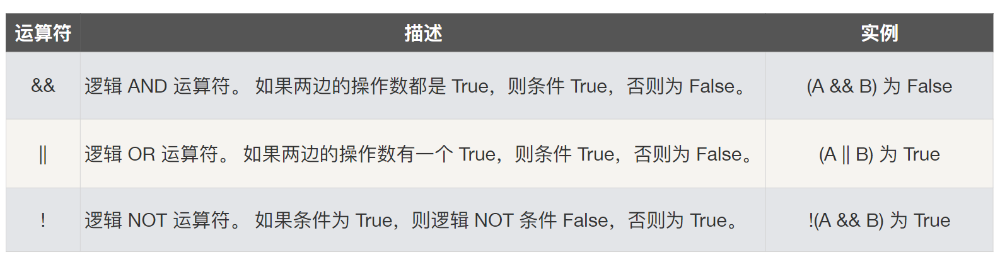

## go语言技能图谱

go语言相关技能图谱

## 变量与常量

### 变量

* 赋值可以进⾏行行⾃自动类型推断  
* 在一个赋值语句句中可以对多个变量量进行行同时赋值

### 常量

 

## 数据类型

* bool
* string
* int  int8  int16  int32  int64
* uint uint8 uint16 uint32 uint64 uintptr
* byte // alias for uint8
* rune // alias for int32，represents a Unicode code point
* float32 float64
* complex64 complex128

### 类型转化

* Go 语⾔言不不允许隐式类型转换 
* 别名和原有类型也不不能进⾏隐式类型转换

### 预定义值

* math.MaxInt64
* math.MaxFloat64
* math.MaxUint32

### 其它差异

* 不支持指针运算
* string 是值类型，其默认的初始化值为空字符串，⽽不是 nil

## 运算符

### 算术运算符

 

### 比较运算符

 

### 

### 逻辑运算符

### 位运算符

 

### 差异

####  

 

## 结构化编程

### for

### if

### switch

## 指针

指针地址、指针类型和指针取值

每个变量在运行时都拥有一个地址，这个地址代表变量在内存中的位置。Go语言中使用在变量名前面添加`&`操作符（前缀）来获取变量的内存地址（取地址操作），格式如下：

ptr := &v   // v 的类型为 T

其中 v 代表被取地址的变量，变量 v 的地址使用变量 ptr 进行接收，ptr 的类型为`*T`，称做 T 的指针类型，`*`代表指针。

## 数组与切片

## map

## 字符串

###  字符集与编码

* UTF-8的编码方式

  UTF-8是UNICODE的一种变长度的编码表达方式（一般UNICODE为双字节[指UCS2]），UTF-8就是以8位为单元对UCS进行编码，而UTF-8不使用大尾序和小尾序的形式，每个使用UTF-8储存的字符，除了第一个字节外，其余字节的头两个位元都是以"10"开始，使文字处理器能够较快地找出每个字符的开始位置。

  为了与以前的ASCII码相容（ASCII为一个字节），因此 UTF-8 选择了使用可变长度字节来储存 Unicode,具体转换关系如下表：

  UCS-4（UNICODE）编码	UTF-8字节流
  U-00000000 – U-0000007F	0xxxxxxx
  U-00000080 – U-000007FF	110xxxxx 10xxxxxx
  U-00000800 – U-0000FFFF	1110xxxx 10xxxxxx 10xxxxxx
  U-00010000 – U-001FFFFF	11110xxx 10xxxxxx 10xxxxxx 10xxxxxx
  U-00200000 – U-03FFFFFF	111110xx 10xxxxxx 10xxxxxx 10xxxxxx 10xxxxxx
  U-04000000 – U-7FFFFFFF	1111110x 10xxxxxx 10xxxxxx 10xxxxxx 10xxxxxx 10xxxxxx

* UNICODE转换为UTF-8

  UTF-8的特点是对不同范围的字符使用不同长度的编码。对于0x00-0x7F之间的字符，UTF-8编码与ASCII编码完全相同。UTF-8编码的最大长度是4个字节。从表3-2可以看出，4字节模板有21个x，即可以容纳21位二进制数字。Unicode的最大码位0x10FFFF也只有21位。

  如：“汉”字的Unicode编码是0x6C49。0x6C49在0x0800-0xFFFF之间，使用用3字节模板：1110xxxx 10xxxxxx 10xxxxxx。将0x6C49写成二进制是：0110 1100 0100 1001， 用这个比特流依次代替模板中的x，得到：11100110 10110001 10001001，即E6 B1 89。

  Unicode编码0x20C30在0x010000-0x10FFFF之间，使用4字节模板：11110xxx 10xxxxxx 10xxxxxx 10xxxxxx。将0x20C30写成21位二进制数字（不足21位就在前面补0）：0 0010 0000 1100 0011 0000，用这个比特流依次代替模板中的x，得到：11110000 10100000 10110000 10110000，即F0 A0 B0 B0。

* UTF-8转换为UNICODE

## 函数

## 封装数据与行为

