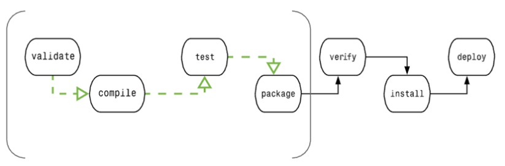

参考：https://www.runoob.com/maven/maven-tutorial.html

## 功能

- 构建
- 文档生成
- 报告
- 依赖
- SCMs
- 发布
- 分发
- 邮件列表

## 配置约定

Maven 提倡使用一个共同的标准目录结构，Maven 使用约定优于配置的原则，大家尽可能的遵守这样的目录结构。如下所示：

| 目录                               | 目的                                                         |
| :--------------------------------- | :----------------------------------------------------------- |
| ${basedir}                         | 存放pom.xml和所有的子目录                                    |
| ${basedir}/src/main/java           | 项目的java源代码                                             |
| ${basedir}/src/main/resources      | 项目的资源，比如说property文件，springmvc.xml                |
| ${basedir}/src/test/java           | 项目的测试类，比如说Junit代码                                |
| ${basedir}/src/test/resources      | 测试用的资源                                                 |
| ${basedir}/src/main/webapp/WEB-INF | web应用文件目录，web项目的信息，比如存放web.xml、本地图片、jsp视图页面 |
| ${basedir}/target                  | 打包输出目录                                                 |
| ${basedir}/target/classes          | 编译输出目录                                                 |
| ${basedir}/target/test-classes     | 测试编译输出目录                                             |
| Test.java                          | Maven只会自动运行符合该命名规则的测试类                      |
| ~/.m2/repository                   | Maven默认的本地仓库目录位置                                  |

## 基础命令

- mvn compile：编译主程序

  并将pom.xml配置的依赖的包导入到仓库（仓库地址为：setting文件中配置的）

  项目里里多了一个target文件夹

  target里主要存放的就是编译后的字节码文件

- mvn test-compile：编译测试程序

  target文件夹下面除了classes之外多了test-classes文件夹

- mvn test：执行测试

- mvn package：打包

  target文件夹下面又多了一个打好的jar包

- mvn install：安装

* mvn clean：清理target

## 构建的生命周期

 

| 阶段          | 处理     | 描述                                                     |
| :------------ | :------- | :------------------------------------------------------- |
| 验证 validate | 验证项目 | 验证项目是否正确且所有必须信息是可用的                   |
| 编译 compile  | 执行编译 | 源代码编译在此阶段完成                                   |
| 测试 Test     | 测试     | 使用适当的单元测试框架（例如JUnit）运行测试。            |
| 包装 package  | 打包     | 创建JAR/WAR包如在 pom.xml 中定义提及的包                 |
| 检查 verify   | 检查     | 对集成测试的结果进行检查，以保证质量达标                 |
| 安装 install  | 安装     | 安装打包的项目到本地仓库，以供其他项目使用               |
| 部署 deploy   | 部署     | 拷贝最终的工程包到远程仓库中，以共享给其他开发人员和工程 |

为了完成 default 生命周期，这些阶段（包括其他未在上面罗列的生命周期阶段）将被按顺序地执行。

Maven 有以下三个标准的生命周期：

- **clean**：项目清理的处理
- **default(或 build)**：项目部署的处理
- **site**：项目站点文档创建的处理

## 插件

Maven 有以下三个标准的生命周期：

- **clean**：项目清理的处理
- **default(或 build)**：项目部署的处理
- **site**：项目站点文档创建的处理

每个生命周期中都包含着一系列的阶段(phase)。这些 phase 就相当于 Maven 提供的统一的接口，然后这些 phase 的实现由 Maven 的插件来完成。

我们在输入 mvn 命令的时候 比如 **mvn clean**，clean 对应的就是 Clean 生命周期中的 clean 阶段。但是 clean 的具体操作是由 **maven-clean-plugin** 来实现的。

所以说 Maven 生命周期的每一个阶段的具体实现都是由 Maven 插件实现的。

Maven 实际上是一个依赖插件执行的框架，每个任务实际上是由插件完成。Maven 插件通常被用来：

- 创建 jar 文件
- 创建 war 文件
- 编译代码文件
- 代码单元测试
- 创建工程文档
- 创建工程报告

插件通常提供了一个目标的集合，并且可以使用下面的语法执行：

```
<code>mvn [plugin-name]:[goal-name]</code>
```

例如，一个 Java 工程可以使用 maven-compiler-plugin 的 compile-goal 编译，使用以下命令：

```
<code>mvn compiler:compile</code>
```

### antrun插件

maven-antrun-plugin:run

 maven-antrun-plugin:run 目标添加到 pre-clean、clean 和 post-clean 阶段中。这样我们可以在 clean 生命周期的各个阶段显示文本信息。还可以做一些其它的操作。

 Maven 项目中构建完后还需要做一些较复杂的文件操作，这时我们可以考虑使用 maven-antrun-plugin 插件在 Maven 的 pom 中配置调用 Ant 任务。

参考：https://www.cnblogs.com/caoweixiong/p/15633074.html

* 拷贝脚本
* 根据mvn命令、setting、环境变量等，拷贝不同环境配置文件

### 生成项目

Maven 使用原型 **archetype** 插件创建项目。要创建一个简单的 Java 应用，我们将使用 **maven-archetype-quickstart** 插件。

archetype 也就是原型，是一个 Maven 插件，准确说是一个项目模板，它的任务是根据模板创建一个项目结构。我们将使用 quickstart 原型插件创建一个简单的 java 应用程序。

在下面的例子中，我们将在 C:\MVN 文件夹下创建一个基于 maven 的 java 应用项目。

非交互式命令格式如下：

```
mvn archetype:generate "-DgroupId=com.companyname.bank" "-DartifactId=consumerBanking" "-DarchetypeArtifactId=maven-archetype-quickstart" "-DinteractiveMode=false"
```

也可以使用交互式

```
mvn archetype:generate 
```

Maven 将开始处理，并要求选择所需的原型:

按下 **Enter** 选择默认选项 (203:maven-archetype-quickstart)。

Maven 将询问原型的版本

```
Choose org.apache.maven.archetypes:maven-archetype-quickstart version:
1: 1.0-alpha-1
2: 1.0-alpha-2
3: 1.0-alpha-3
4: 1.0-alpha-4
5: 1.0
6: 1.1
Choose a number: 6:
```

按下 **Enter** 选择默认选项 (6:maven-archetype-quickstart:1.1)

Maven 将询问项目细节。按要求输入项目细节。如果要使用默认值则直接按 Enter 键。你也可以输入自己的值。

```
Define value for property 'groupId': : com.companyname.insurance
Define value for property 'artifactId': : health
Define value for property 'version': 1.0-SNAPSHOT
Define value for property 'package': com.companyname.insurance
```

Maven 将要求确认项目细节，按 **Enter** 或按 Y

```
Confirm properties configuration:
groupId: com.companyname.insurance
artifactId: health
version: 1.0-SNAPSHOT
package: com.companyname.insurance
Y:
```

## 构建和测试

### 打包

```
mvn clean package
```

，我们已经构建了自己的项目并创建了最终的 jar 文件，下面是要学习的关键概念：

- 我们给了 maven 两个目标，首先清理目标目录（clean），然后打包项目构建的输出为 jar（package）文件。
- 打包好的 jar 文件可以在 consumerBanking\target 中获得，名称为 consumerBanking-1.0-SNAPSHOT.jar。
- 测试报告存放在 consumerBanking\target\surefire-reports 文件夹中。
- Maven 编译源码文件，以及测试源码文件。
- 接着 Maven 运行测试用例。
- 最后 Maven 创建项目包

### 外部依赖

要添加依赖项，我们一般是先在 src 文件夹下添加 lib 文件夹，然后将你工程需要的 jar 文件复制到 lib 文件夹下

```
<dependencies>
    <!-- 在这里添加你的依赖 -->
    <dependency>
        <groupId>ldapjdk</groupId>  <!-- 库名称，也可以自定义 -->
        <artifactId>ldapjdk</artifactId>    <!--库名称，也可以自定义-->
        <version>1.0</version> <!--版本号-->
        <scope>system</scope> <!--作用域-->
        <systemPath>${basedir}\src\lib\ldapjdk.jar</systemPath> <!--项目根目录下的lib文件夹下-->
    </dependency> 
</dependencies>
```


## 文档

创建 Maven 项目文档。修改 pom.xml，添加以下配置（如果没有的话）

```
<build>
<pluginManagement>
    <plugins>
        <plugin>
          <groupId>org.apache.maven.plugins</groupId>
          <artifactId>maven-site-plugin</artifactId>
          <version>3.3</version>
        </plugin>
        <plugin>
          <groupId>org.apache.maven.plugins</groupId>
          <artifactId>maven-project-info-reports-plugin</artifactId>
          <version>2.7</version>
        </plugin>
    </plugins>
    </pluginManagement>
</build>
```

*不然运行* **mvn site** *命令时出现* **java.lang.NoClassDefFoundError: org/apache/maven/doxia/siterenderer/DocumentContent** *的问题， 这是由于 maven-site-plugin 版本过低，升级到 3.3+ 即可。*

打开 consumerBanking 文件夹并执行以下 mvn 命令

**consumerBanking\target\site** 文件夹。点击 **index.html** 就可以看到文档了。

Maven 使用一个名为 [Doxia](http://maven.apache.org/doxia/index.html)的文档处理引擎来创建文档，它能将多种格式的源码读取成一种通用的文档模型。要为你的项目撰写文档，你可以将内容写成下面几种常用的，可被 Doxia 转化的格式。

| 格式名 | 描述                     | 参考                                                     |
| :----- | :----------------------- | :------------------------------------------------------- |
| Apt    | 纯文本文档格式           | http://maven.apache.org/doxia/references/apt-format.html |
| Xdoc   | Maven 1.x 的一种文档格式 | http://jakarta.apache.org/site/jakarta-site2.html        |
| FML    | FAQ 文档适用             | http://maven.apache.org/doxia/references/fml-format.html |
| XHTML  | 可扩展的 HTML 文档       | http://en.wikipedia.org/wiki/XHTML                       |

## 快照

快照是一种特殊的版本，指定了某个当前的开发进度的副本。不同于常规的版本，Maven 每次构建都会在远程仓库中检查新的快照。 现在 data-service 团队会每次发布更新代码的快照到仓库中，比如说 data-service:1.0-SNAPSHOT 来替代旧的快照 jar 包。

对于版本，如果 Maven 以前下载过指定的版本文件，比如说 data-service:1.0，Maven 将不会再从仓库下载新的可用的 1.0 文件。若要下载更新的代码，data-service 的版本需要升到1.1。

快照的情况下，每次 app-ui 团队构建他们的项目时，Maven 将自动获取最新的快照(data-service:1.0-SNAPSHOT)。

app-ui 项目使用的是 data-service 项目的 1.0 快照。

```
<project xmlns="http://maven.apache.org/POM/4.0.0" 
   xmlns:xsi="http://www.w3.org/2001/XMLSchema-instance"
   xsi:schemaLocation="http://maven.apache.org/POM/4.0.0 
   http://maven.apache.org/xsd/maven-4.0.0.xsd">
   <modelVersion>4.0.0</modelVersion>
   <groupId>app-ui</groupId>
   <artifactId>app-ui</artifactId>
   <version>1.0</version>
   <packaging>jar</packaging>
   <name>health</name>
   <url>http://maven.apache.org</url>
   <properties>
      <project.build.sourceEncoding>UTF-8</project.build.sourceEncoding>
   </properties>
   <dependencies>
      <dependency>
      <groupId>data-service</groupId>
         <artifactId>data-service</artifactId>
         <version>1.0-SNAPSHOT</version>
         <scope>test</scope>
      </dependency>
   </dependencies>
</project>
```

data-service 项目的 pom.xml 文件

data-service 项目为每次小的改动发布 1.0 快照。

```
<project xmlns="http://maven.apache.org/POM/4.0.0" 
   xmlns:xsi="http://www.w3.org/2001/XMLSchema-instance"
   xsi:schemaLocation="http://maven.apache.org/POM/4.0.0 
   http://maven.apache.org/xsd/maven-4.0.0.xsd">
   <modelVersion>4.0.0</modelVersion>
   <groupId>data-service</groupId>
   <artifactId>data-service</artifactId>
   <version>1.0-SNAPSHOT</version>
   <packaging>jar</packaging>
   <name>health</name>
   <url>http://maven.apache.org</url>
   <properties>
      <project.build.sourceEncoding>UTF-8</project.build.sourceEncoding>
   </properties>
</project>
```

虽然，快照的情况下，Maven 在日常工作中会自动获取最新的快照， 你也可以在任何 maven 命令中使用 -U 参数强制 maven 下载最新的快照构建

```
mvn clean package -U
```

## 自动化构建

自动化构建定义了这样一种场景: 在一个项目成功构建完成后，其相关的依赖工程（依赖这个项目）即开始构建，这样可以保证其依赖项目的稳定。

比如一个团队正在开发一个项目 bus-core-api， 并且有其他两个项目 app-web-ui 和 app-desktop-ui 依赖于这个项目，其它项目也要进行构建

```
<project xmlns="http://maven.apache.org/POM/4.0.0" 
   xmlns:xsi="http://www.w3.org/2001/XMLSchema-instance"
   xsi:schemaLocation="http://maven.apache.org/POM/4.0.0 
   http://maven.apache.org/xsd/maven-4.0.0.xsd">
   <modelVersion>4.0.0</modelVersion>
   <groupId>bus-core-api</groupId>
   <artifactId>bus-core-api</artifactId>
   <version>1.0-SNAPSHOT</version>
   <packaging>jar</packaging>
   <build>
   <plugins>
   <plugin>
      <artifactId>maven-invoker-plugin</artifactId>
      <version>1.6</version>
      <configuration>
         <debug>true</debug>
         <pomIncludes>
            <pomInclude>app-web-ui/pom.xml</pomInclude>
            <pomInclude>app-desktop-ui/pom.xml</pomInclude> 
         </pomIncludes>
      </configuration>
      <executions>
         <execution>
            <id>build</id>
            <goals>
               <goal>run</goal>
            </goals>
         </execution>
      </executions>
   </plugin>
   </plugins>
   </build>
</project>
```

持续集成

如果使用 CI 服务器更，我们每次的一个新项目，比如说实例中的 app-mobile-ui，添加为依赖 bus-core-api 项目时，开发者就不需要更新 bus-core-api 项目的 pom。Hudson 将会借助 Maven 的依赖管理功能实现工程的自动化创建。

Hudson 把每个项目构建当成一次任务。在一个项目的代码提交到 SVN （或者任何映射到 Hudson 的代码管理工具）后，Hudson 将开始项目的构建任务，并且一旦此构建任务完成，Hudson 将自动启动其他依赖的构建任务（其他依赖项目的构建）。

在上面的例子中，当 bus-core-ui 源代码在 SVN 更新后，Hudson 开始项目构建。一旦构建成功，Hudson 自动地查找依赖的项目，然后开始构建 app-web-ui 和 app-desktop-ui 项目。

## 仓库

本地仓库在本地，中央仓库在setting(可配置镜像或者其它代理仓库)，远程仓库在pom。搜寻顺序依次搜寻

### 本地

### 远程

### 中央

## 依赖

### 顺序

*  maven解析依赖信息时会到本地仓库中取查找被依赖的jar包
   * 对于本地仓库中没有的会去中央仓库去查找maven坐标来获取jar包，获取到jar之后会下载到本地仓库
   * 对于中央仓库也找不到依赖的jar包的时候，就会编译失败了

*  如果依赖的是自己或者团队开发的maven工程，需要先使用install命令把被依赖的maven工程的jar包导入到本地仓库中

具体的步骤顺序为：

- **步骤 1** － 在本地仓库中搜索，如果找不到，执行步骤 2，如果找到了则执行其他操作。
- **步骤 2** － 在中央仓库中搜索，如果找不到，并且有一个或多个远程仓库已经设置，则执行步骤 4，如果找到了则下载到本地仓库中以备将来引用。
- **步骤 3** － 如果远程仓库没有被设置，Maven 将简单的停滞处理并抛出错误（无法找到依赖的文件）。
- **步骤 4** － 在一个或多个远程仓库中搜索依赖的文件，如果找到则下载到本地仓库以备将来引用，否则 Maven 将停止处理并抛出错误（无法找到依赖的文件）。

### 范围

scope就是依赖的范围

```
      <dependency>
          <groupId>cn.hutool</groupId>
          <artifactId>hutool-all</artifactId>
          <version>5.3.10</version>
          <scope>compile</scope>
      </dependency>
```

* **compile**

  默认值，适用于所有阶段（开发、测试、部署、运行），本jar会一直存在所有阶段。

* **provided，**

  只在开发、测试阶段使用，目的是不让Servlet容器和你本地仓库的jar包冲突 。如servlet.jar。

* **runtime，**

  只在运行时使用，如JDBC驱动，适用运行和测试阶段。

* **test**

  只在测试时使用，用于编译和运行测试代码。不会随项目发布。

* **system**

  类似provided，需要显式提供包含依赖的jar，Maven不会在Repository中查找它。

* **import**

  该范围只在依赖是一个 pom 里定义的依赖时使用。同时，当前项目的POM 文件的 部分定义的依赖关系可以取代某特定的 POM

  即我们可以在子项目中很好的申明需要使用父项目的dependencyMangement中定义的依赖项。但是每一个项目只能申明唯一的一个父项目，那么在某些时候就会限制我们项目的建立。

  Maven为我们提供了一种方法，那就是通过设置依赖项的socpe为import。注意，这种方式只在Maven2.0.9以上的版本才生效

## 自动化部署

```
<project xmlns="http://maven.apache.org/POM/4.0.0" 
   xmlns:xsi="http://www.w3.org/2001/XMLSchema-instance"
   xsi:schemaLocation="http://maven.apache.org/POM/4.0.0 
   http://maven.apache.org/xsd/maven-4.0.0.xsd">
   <modelVersion>4.0.0</modelVersion>
   <groupId>bus-core-api</groupId>
   <artifactId>bus-core-api</artifactId>
   <version>1.0-SNAPSHOT</version>
   <packaging>jar</packaging> 
   <scm>
      <url>http://www.svn.com</url>
      <connection>scm:svn:http://localhost:8080/svn/jrepo/trunk/
      Framework</connection>
      <developerConnection>scm:svn:${username}/${password}@localhost:8080:
      common_core_api:1101:code</developerConnection>
   </scm>
   <distributionManagement>
      <repository>
         <id>Core-API-Java-Release</id>
         <name>Release repository</name>
         <url>http://localhost:8081/nexus/content/repositories/
         Core-Api-Release</url>
      </repository>
   </distributionManagement>
   <build>
      <plugins>
         <plugin>
            <groupId>org.apache.maven.plugins</groupId>
            <artifactId>maven-release-plugin</artifactId>
            <version>2.0-beta-9</version>
            <configuration>
               <useReleaseProfile>false</useReleaseProfile>
               <goals>deploy</goals>
               <scmCommentPrefix>[bus-core-api-release-checkin]-<
               /scmCommentPrefix>
            </configuration>
         </plugin>
      </plugins>
   </build>
</project>
```

- 使用 Maven 构建和发布项目
- 使用 SubVersion， 源码仓库来管理源代码
- 使用远程仓库管理软件（Jfrog或者Nexus） 来管理项目二进制文件

在 pom.xml 文件中，我们常用到的一些重要元素节点如下表所示：

| 元素节点   | 描述                                                         |
| :--------- | :----------------------------------------------------------- |
| SCM        | 配置 SVN 的路径，Maven 将从该路径下将代码取下来。            |
| repository | 构建的 WAR 或 EAR 或JAR 文件的位置，或者其他源码构建成功后生成的构件的存储位置。 |
| Plugin     | 配置 maven-release-plugin 插件来实现自动部署过程。           |

Maven 使用 maven-release-plugin 插件来完成以下任务。

```
mvn release:clean
```

清理工作空间，保证最新的发布进程成功进行。

```
mvn release:rollback
```

在上次发布过程不成功的情况下，回滚修改的工作空间代码和配置保证发布过程成功进行。

```
mvn release:prepare
```

执行多种操作：

- 检查本地是否存在还未提交的修改
- 确保没有快照的依赖
- 改变应用程序的版本信息用以发布
- 更新 POM 文件到 SVN
- 运行测试用例
- 提交修改后的 POM 文件
- 为代码在 SVN 上做标记
- 增加版本号和附加快照以备将来发布
- 提交修改后的 POM 文件到 SVN

```
mvn release:perform
```

将代码切换到之前做标记的地方，运行 Maven 部署目标来部署 WAR 文件或者构建相应的结构到仓库里。

打开命令终端，进入到 C:\ > MVN >bus-core-api 目录下，然后执行如下的 mvn 命令。

```
C:\MVN\bus-core-api>mvn release:prepare
```

Maven 开始构建整个工程。构建成功后即可运行如下 mvn 命令。

```
C:\MVN\bus-core-api>mvn release:perform
```

构建成功后，你就可以可以验证在你仓库下上传的 JAR 文件是否生效。

可以参考https://www.bigtspace.com/archives/10130.html

## 案例

### web项目

*  maven-archetype-webapp 插件来创建一个简单的 Java web

  ```
  mvn archetype:generate -DgroupId=com.companyname.automobile -DartifactId=trucks -DarchetypeArtifactId=maven-archetype-webapp  -DinteractiveMode=false
  ```

*  trucks 项目，查看项目的目录结构

  Maven 目录结构是标准的，各个目录作用如下表所示:

  | 文件夹结构              | 描述                                  |
  | :---------------------- | :------------------------------------ |
  | trucks                  | 包含 src 文件夹和 pom.xml 文件。      |
  | src/main/webapp         | 包含 index.jsp 文件和 WEB-INF 文件夹. |
  | src/main/webapp/WEB-INF | 包含 web.xml 文件                     |
  | src/main/resources      | 包含图片、properties资源文件。        |

  pom.xml 文件代码如下：

  ```
  <project xmlns="http://maven.apache.org/POM/4.0.0" 
     xmlns:xsi="http://www.w3.org/2001/XMLSchema-instance"
     xsi:schemaLocation="http://maven.apache.org/POM/4.0.0 
     http://maven.apache.org/maven-v4_0_0.xsd">
     <modelVersion>4.0.0</modelVersion>
     <groupId>com.companyname.automobile</groupId>
     <artifactId>trucks</artifactId>
     <packaging>war</packaging>
     <version>1.0-SNAPSHOT</version>
     <name>trucks Maven Webapp</name>
     <url>http://maven.apache.org</url>
     <dependencies>
        <dependency>
           <groupId>junit</groupId>
           <artifactId>junit</artifactId>
           <version>3.8.1</version>
           <scope>test</scope>
        </dependency>
     </dependencies>
     <build>
        <finalName>trucks</finalName>
     </build>
  </project>
  ```

* 查看jsp文件

  index.jsp 文件

  ```
  <html>
     <body>
        <h2>Hello World!</h2>
     </body>
  </html>
  ```

* 构建web应用

  ```
  mvn clean package
  ```

* 部署 Web 应用

  找到 trucks.war 文件，并复制到你的 web 服务器的 web 应用目录，然后重启 web 服务器。

* 测试web

  访问以下 URL 运行 web 应用