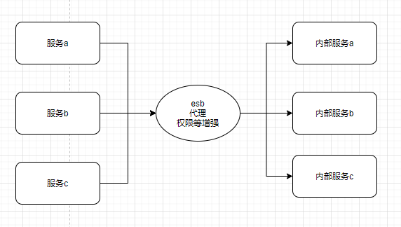
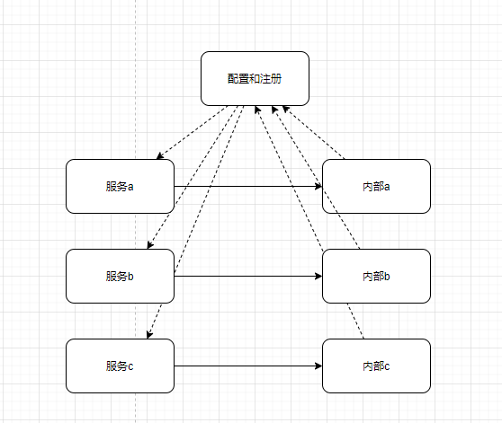

## 1. 概述
分布式环境下调用需要考虑哪些东西？
* rpc技术实现
* 多个相同的服务如何管理
可以打标签、分组、版本来管理
* 是否支持注册发现机制
利用注册中心实现新服务的注册和发现
* 如何实现负载均衡、路由
## 2. RPC和分布式服务化的区别
* rpc使技术概览、而分布式服务是业务概念，相对于rpc还需要考虑非功能性需求
* 服务不等于接口，可用接口来表达或者用接口文档来表达

## 3. SOA/ESB和分布式服务化的区别
* esb、soa直接代理了其它系统请求，统计和监控等功能都在中间节点做
* 分布式服务是侧边增强，直接调用  
有状态的放在注册和配置中心，无状态的放在应用侧，rpc、服务治理功能在框架内，业务无感知  
  
  

## 4. 三个中心
### 4.1.概念
* 配置中心  
  管理配置、批量更新
测试、生成分离
开关
* 注册中心  
  分布式治理、集群管控
* 元数据中心  
  定义了业务模型
### 4.2. 如何实现某中心
* 存取数据的能力
* 实时通知
### 4.3. 服务注册中心实现要点
* 服务启动注册，存储信息到临时节点
* 服务停止，临时节点消失
* 支持服务加版本方式注册
* 为每一个提供者能够提供描述信息
* 消费服务启动时，拿取临时节点并缓存
* 选取一个执行（路由、负载）
* 当注册中心服务发生变化时，通知到消费者更新缓存
## 5. 服务的集群和路由、负载均衡  
对于同样的服务，消费者需要它们协同服务，均分流量
* 路由  
  首先需要对它们进行过滤，这就是路由，可以根据ip段过滤，可以根据服务的tag来过滤
* 负载均衡  
  使得服务的被调用方尽量均匀
  * 带权重
  * 轮询
  * 快的多给点
  * 一致性hash

## 6. 服务的过滤和流控
### 6.1.服务的过滤
类似于aop，可以做一些额外的功能，如dubbo fileter
### 6.2.服务流控  
系统的容量和吞吐量有限，需要对其进行保护，保证其核心服务能力还在，系统出现问题的一个原因就是输入大于处理，通过流控后还可以恢复正常状态。关键词：响应式编程
  * 限流
  * 降级
  * 过载保护

## 7. 什么是RPC