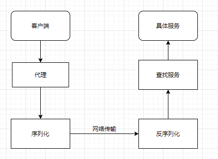
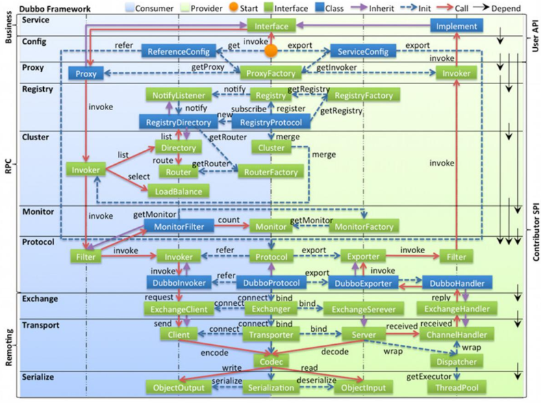

## 1. 什么是RPC
一句话概括：像调用本地方法一样去调用远程方法。
### 1.1. 基本原理
它的基本原理就是，客户端调用代理对象的方法，代理对象序列化请求方法参数，通过网络传输到服务端，服务端段反序列化调用的方法，找到对应的服务方法执行，再将结果放回给客户端的代理对象，代理对象将结果返回给客户端实际的调用者。    

需要注意的是如何去处理远程调用的异常
* 代理可以使用aop代理或者使用动态代理
* 序列化有多种选择：
  * Rmi、.net.remoting
  * 二进制类型Hessian、avro、kyro、fst
  * 文本，json或者xml
* 网络传输可以使用：
  * Tcp、ssl、netty等
  * http、https
* 查找服务  
  我们可以使用spring相关功能，比如根据class名称查找对应的bean
### 1.2. 有哪些rpc框架
* java rmi
* .net remoting
* Corba
* Jsonrpc xml rpc
* Webservice
* Thrift,最初是由 Facebook 开发的内部系统跨语言的 RPC 框架，2007 年贡献给了 Apache 基金，成为 Apache 开源项目之一，支持多种语言
* Grpc,通过 IDL(Interface Definition Language)文件定义服务接口的参数和返回值类型，然后通过代码生成程序生成服务端和客户端的具体实现代码，这样在 gRPC 里，客户端应用可以像调用本地对象一样调用另一台服务器上对应的方法

## 2. 如何设计一个rpc框架
### 2.1. 需要考虑的问题
* 如何定义调用格式，是通过共享接口还是idl
* 是采用aop还是动态代理
* 采用什么样的序列化方式，二进制还是文本
* 传输协议使用http还是tcp
* 如何查找服务，是自己写一套服务查找还是使用spring的注册方法
* 如何处理异常
### 2.2. 简单实现一个rpc框架
## 3. rpc框架和分布式服务
使用rpc框架来对现有服务实现分布式服务化需要考虑什么呢？  
在上面rpc技术的基础上，需要增加一些关于服务治理的考虑
* 多个相同的服务怎么管理
* 服务注册怎么实现
* 负载均衡和路由怎么实现
* 熔断、限流、重试怎么实现
* 如何做监控
* 如果实现高可用
* 是否需要跨语言支持
      

## 4. dubbo介绍  
### 4.1. dubbo历史
2011开源，2013之后维护程度很低，但是国内缺乏合适的rpc框架，使用率很高，2017重启维护，2018加入apache。  
阿里内部使用hsf框架。当当、京东在dubbo的基础上改造的rpc服务

### 4.2. dubbo特点
* 高性能rpc调用
* 负载均衡
* 服务注册和发现
* 扩展性强
* 流控
* 服务治理路由和运维，版本控制
* 使用非常简单
### 4.3. dubbo的应用
* 建设业务中台
* 单体服务化改造
* 直接为前端提供服务
### 4.4. dubbo整体架构

#### 4.4.1. 服务的暴露和引用
#### 4.4.2. dubbo的spi
#### 4.4.3. dubbo路由和负载
#### 4.4.4. 泛化调用
#### 4.4.5. 隐式传参
#### 4.4.6. Mock


### 4.5. dubbo实践
#### 4.5.1. 分组与环境隔离
#### 4.5.2. 分包
#### 4.5.3. 泛化调用
#### 4.5.4. dubbo的重试和幂等
#### 4.5.5. 容器化部署
#### 4.5.6. 运维和监控


## grpc

gRPC是一个高性能、通用的开源RPC框架，其由Google 2015年主要面向移动应用开发并基于HTTP/2协议标准而设计，基于ProtoBuf序列化协议开发，且支持众多开发语言。

由于是开源框架，通信的双方可以进行二次开发，所以客户端和服务器端之间的通信会更加专注于业务层面的内容，减少了对由gRPC框架实现的底层通信的关注。

如下图，DATA部分即业务层面内容，下面所有的信息都由gRPC进行封装

### 特点

- 语言中立，支持多种语言；
- 基于 IDL 文件定义服务，通过 proto3 工具生成指定语言的数据结构、服务端接口以及客户端 Stub；
- 通信协议基于标准的 HTTP/2 设计，支持双向流、消息头压缩、单 TCP 的多路复用、服务端推送等特性，这些特性使得 gRPC 在移动端设备上更加省电和节省网络流量；
- 序列化支持 PB（Protocol Buffer）和 JSON，PB 是一种语言无关的高性能序列化框架，基于 HTTP/2 + PB, 保障了 RPC 调用的高性能。

### 机制

- 交换机在开启gRPC功能后充当gRPC客户端的角色，采集服务器充当gRPC服务器角色；
- 交换机会根据订阅的事件构建对应数据的格式（GPB/JSON），通过Protocol Buffers进行编写proto文件，交换机与服务器建立gRPC通道，通过gRPC协议向服务器发送请求消息；
- 服务器收到请求消息后，服务器会通过Protocol Buffers解译proto文件，还原出最先定义好格式的数据结构，进行业务处理；
- 数据处理完后，服务器需要使用Protocol Buffers重编译应答数据，通过gRPC协议向交换机发送应答消息；
- 交换机收到应答消息后，结束本次的gRPC交互

```
简单地说，gRPC就是在客户端和服务器端开启gRPC功能后建立连接，将设备上配置的订阅数据推送给服务器端。我们可以看到整个过程是需要用到Protocol Buffers将所需要处理数据的结构化数据在proto文件中进行定义。
```

### HTTP 2.0

 gRPC还有另外一个优势——它是基于HTTP 2.0协议的。

由于gRPC基于HTTP 2.0标准设计，带来了更多强大功能，如多路复用、二进制帧、头部压缩、推送机制。这些功能给设备带来重大益处，如节省带宽、降低TCP连接次数、节省CPU使用等。gRPC既能够在客户端应用，也能够在服务器端应用，从而以透明的方式实现两端的通信和简化通信系统的构建。

HTTP 版本分为HTTP 1.X、 HTTP 2.0，其中HTTP 1.X是当前使用最广泛的HTTP协议，HTTP 2.0称为超文本传输协议第二代。HTTP 1.X定义了四种与服务器交互的方式，分别为：GET、POST、PUT、DELETE，这些在HTTP 2.0中均保留。HTTP 2.0的新特性：

- 双向流、多路复用
- 二进制帧
- 头部压缩

## Thrift

### 介绍

thrift是一种可伸缩的跨语言服务的RPC软件框架。它结合了功能强大的软件堆栈的代码生成引擎，以建设服务，高效、无缝地在多种语言间结合使用。2007年由facebook贡献到apache基金，是apache下的顶级项目，具备如下特点：

- 支持多语言：C、C++ 、C# 、D 、Delphi 、Erlang 、Go 、Haxe 、Haskell 、Java 、JavaScript、node.js 、OCaml 、Perl 、PHP 、Python 、Ruby 、SmallTalk
- 消息定义文件支持注释，数据结构与传输表现的分离，支持多种消息格式
- 包含完整的客户端/服务端堆栈，可快速实现RPC，支持同步和异步通信

### 架构

Thrift是一套包含序列化功能和支持服务通信的RPC（远程服务调用）框架，也是一种微服务框架。其主要特点是可以跨语言使用，这也是这个框架最吸引人的地方

## Spring Cloud

Spring Cloud 基于 Spring Boot，为微服务体系开发中的架构问题，提供了一整套的解决方案——服务注册与发现，服务消费，服务保护与熔断，网关，分布式调用追踪，分布式配置管理等。是一套生态。