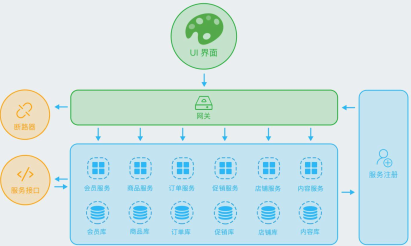
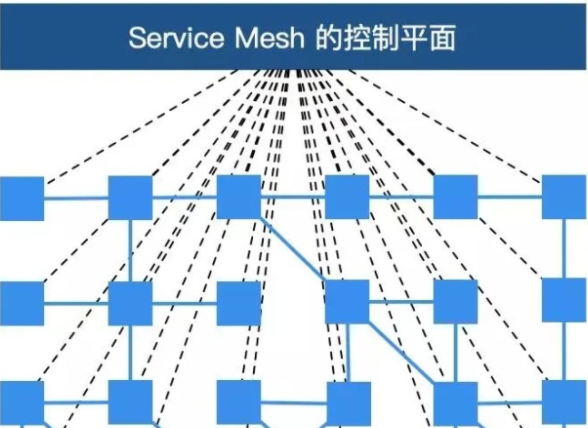
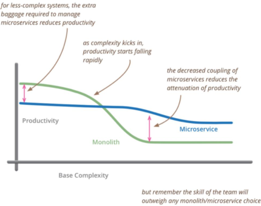
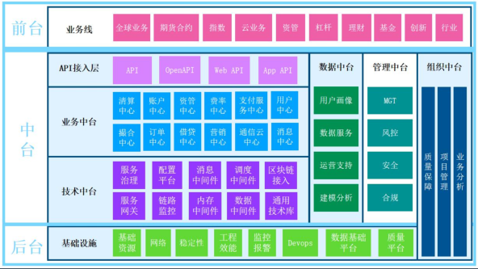

## 1. 微服务架构
### 1.1. 微服务的发展
* 2011年提出
* 2012.3微服务原则提出
* 2012.11微服务架构提出
* 2014微服务架构全面提出
* 2016响应式微服务架构提出
* 服务网格提出

### 1.2. 通用的微服务架构  
  

### 1.3.响应式微服务
响应式宣言中提倡的弹性、可伸缩系统，从失败中恢复的能力。需要坚持隔离、单一职责、自主、独占状态、异步消息传输和移动等特质。
### 1.4.服务网格
**用了代理模式，通过将服务的通信抽象出来组成单独的一层，称为Sidecar（Envoy就是一种Sidecar），由这些Sidecar组成的网络成为service mesh。通过将数据提交给Sidecar，避免了去考虑负载均衡、流量控制等问题。当前的Service Mesh方法有一个集中决策层，通过该层进行网络拓扑决策更新（lstio就属于这一类）**  
  

### 1.5.数据库网格
### 1.6.云原生
### 1.7.单元化架构
每个单元，是一个五脏俱全的缩小版整站，它是全能的，因为部署了所有应用；但它不是全量的，因为只能操作一部分数据。能够单元化的系统，很容易在多机房中部署，因为可以轻易地把几个单元部署在一个机房，而把另外几个部署在其他机房。通过在业务入口处设置一个流量调配器，可以调整业务流量在单元之间的比例.
## 2. 微服务的应用场景
### 2.1.何时使用微服务架构
* 系统的复杂度升高，单体架构的生产力快速下降，微服务架构生产力相对平稳
* 在复杂度低的情况下，单体的生产力反而比微服务架构的高    

  

### 2.2. 改造遗留微服务方案
* 功能剥离，数据解耦
* 拆分，最理想情况高内聚低耦合，但是实际情况是不同阶段不一样，一步一步来
* 容量扩展（水平、垂直、数据如何切分）
* 谨慎使用分布式事务，补偿(幂等、去重)
* 监控和运维(容量规划、故障处理、告警、流程、业务监控、系统监控等等)
* 自动化（运维、测试、部署）

## 3. Springcloud技术体系
### 3.1. Springcloud生态
* spring cloud config，spring
* Spirng cloud bus，spring
* Eureka，netflix
* Hystrix，netflix
* Zuul，netflix
* Archaius，netflix
* Spring cloud starters，spring
* Consul，hashicorp
* Spring cloud sleuth，spring
* Zk，spring
* Spring cloud stream，spring
* Ribbon，netflix
* Feign，openfeign
* Spring cloud cluster,spring  

### 3.2. Springcloud组件
* Config
  * Config，spring
  * Eureka，netflix
  * Consul,hashicorp
* 网关
  * Zuul
  * Zuul2
  * Spring gateway
* 调用
  * Feign
  * ribbon
* 流控
  * Hytrix
  * Sentinel

## 4. 微服务相关的技术
apm可观测性  

### 4.1. 监控
OpenTelemetry可观测性领域的标准化方案,可观测性（trace、metric、log）
OpenTracing,OpenCensus,OpenTelemetry
* Pinpont
* skywalking
* Zipkin
* Jaeger
* Cat
* Elk
* promethus+Grafana
### 4.2. 日志
Elk
### 4.3.权限
* Jwt
* 加密
* Oauth2
* Springsecuity
* shiro
### 4.4. 数据库相关
* 读写分离
* 高可用
* 分库分表
* 分布式事务
* 数据迁移
* 集群扩容
* 高可用
* 审计日志
## 4.5. 网关与通信
* 网关
  * 流量网关，waf，nginx，kong，or
  * 业务网关，zuul，zuul2，scg
* Rest、websocket、actor、rsocket、mq等等