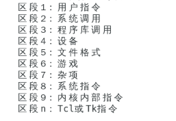

### 1、linux的背景
### 2、linux版本
* 内核版本
* 发行版本（Readhat、fedora）
* Centos版本，（deben、ubuntu版本）

### 3、linux虚拟机的安装
### 4、用户登录
### 5、终端
### 6、常用目录结构
### 7、帮助命令
* man  
man man //查看man命令的帮助
man（7）表示篇章
  
因为命令有可能会有重复的名称
比如passwd，在etc下也有个文件passewd的命令，
即可以指定查看的命令的类型，如果不知道类型可以使用man -a passwd
一页页的查看

* help  
1. 内部命令
help cd
2. 外部命令 
--help
可以使用type命令查看是否为内部命令

info命令比help更加详细，但是是英文的

### 8、查看命令
* pwd  
* cd
* ls
查看某个目录下的文件列表
可以查看多个目录 如 ls / /root
gun代表返回的格式 比如 ls -l 显示更详细的内容
ls -a显示隐藏文件
ls -r 默认文件名的逆向显示
ls -r -t 按照时间的逆向显示
可以简化书写 ls -lrt
ls -R递归显示
### 8、进入目录
* cd 
cd /某目录  
进入某目录
* cd -  
进入之前的目录,两个目录之间切换
* cd .. cd ../
    不解释了
### 9、文件夹
* mkdir ./a  
相对路径创建目录
* mkdir /a  
绝对路径创建文件夹
* 创建多级目录 
mkdir -p /opt/a/b/c
* 删除空目录  
rmdit /opt/a  
只能删除空目录
* 删除非空目录（需要确认）  
rm -r /opt/a
* 删除非空目录（不需要确认） 
这个会逐级确认删除
rm -r -f /opt/a  
无需确认，直接删除，比较危险。

### 10、文件、文件夹复制移动
* cp -r source target  
复制文件夹到另一个目录  
* cp source target  
复制文件到另一个目录  
-v 是否显示进度条  
-p 保留原有的时间  
-a 保留权限用户组等所有的信息
* touch /f1  
创建一个空白的文件
* mv  source target
改名或者移动文件或者文件夹  
* mv *  /opt  
移动所有的文件（通配符），或者用文件名*

* mv 文件名？  /opt  
？代表通配符匹配单个字符  

### 11、文件查看
* cat 
文本内容显示到终端
* head  
从文件的头部开始查看
* tail  
查看文件结尾  
-f 可以实时的显示更新
* wc -l  
统计文件内容信息
* more   
分行显示
* less

### 12、打包压缩  
打包和压缩是两个软件
* tar cf /xx/xx/xxxx.tar /某目录  
为某目录进行打包
* tar czf /xx/xx/xxxx.tar.gz /某目录  
在打包的同时进行压缩，一般为了让别人知道是经过压缩的，会加上另一个后缀.gz， 如果是通过bz2压缩的一般后缀为bz2，bz2有更高的压缩比率但是慢
* tar xf 解压文件位置 -C /文件的目录  
讲打包解压缩包文件到某目录下，解压的命令加上z

### 13、 文本编辑器  
vim
* 正常模式：  
hjkl  
上下左右移动  
yy p   
复制 粘贴  
3yy  
复制三行  
y$  
复制到光标结尾的内容  
dd p  
剪切复制  
3dd  
剪切三行  
d$ p  
剪切到光标结尾的命令  
u  
撤销  
ctrl u  
撤销重做  
x  
光标移动到某字符，然后删除   
:set nu  
显示行数，然后输入数字，G可以迅速移动到某行，输入g可以直接移动到第一行，G可以直接最后一行
^一行的结尾，$一行的开头
* 插入模式  
i  
进入插入模式  
esc  
退出插入模式
* 命令模式(末行模式 )
：  
使用esc推出插入模式后，使用：进入该模式  
w 保存 空格可以添加保存的文件名，比如：w a.txt  
q  
退出  
wq  
保存退出  
!  
可以临时执行linux的其它命令，比如!ipconfig可以临时查看ip地址  

* 命令模式(查找模式)  
/  
可以进入查找模式  
x  
查找x字符，如果有多个相同的字符，可以按n查找下一个，上一个shift n  
:s/旧的字符/新的字符  
可以针对查找的某个字符进行替换，这个只针对光标所在的行中的字符替换  
%s/旧字符/新字符  
整个文档每一行的字符替换，多个不替换  
%s/旧字符/新字符/g  
整个文档的所有字符都替换  
3，5s/旧字符/新字符/g  
3到5行之间替换  
set nonu  
去掉行号
* 可视模式  
v  
可视模式  
V  
可视行模式  
ctrl+v  
配合d（删除）和i、I（每一行可以同步新增某字符）可以块模式操作

* vim配置  
vim /etc/vimrc  set nu  
修改所有的编辑器都是有行号的，进入这个文件，set nu然后保存就可以使其他的打开文件都是num模式

### 14、 用户和权限管理  
* 新建用户  
useradd 用户名  
新建用户，如果没有指定组，则会创建一个同名的组  
id 用户名  
查看某用户的信息 
* 修改用户密码  
 passwd 用户名  
修改指定密码，不输入用户名就是修改自己的密码
* 删除用户  
userdel 用户名  
删除某用户，增加-r选项，同时删除用户目录
* 修改一个用户账户  
usermod -d 路径 用户名  
修改一个用户的家目录
* 修改用户属性  
chage  
修改用户的生命周期  
* 新建用户组  
groupadd 组名   
新建用户组  
usermod -g 组名 用户名  
将某用户添加到某一组  
useradd -g 组名 用户名  
新建用户时，直接将用户添加到某一组
* 关机  
shutdown -h 30  
30分钟后，关闭
* 切换用户  
su - 用户名  
加-直接到家目录 ，不加回到环境目录
* 查找命令所在目录  
whitch 命令名称  
查找命令所在目录 
* sudo命令  
 visudo  
 进入sudo的修改文件   
 添加： 用户名 ALL=命令路径
 保存成功后，即可使得普通用户sudo一个命令授权给他 
