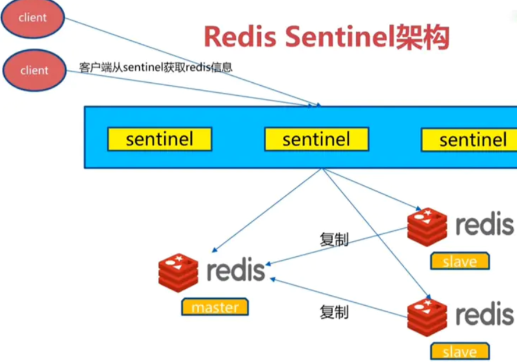

## 1. Redis介绍
### 1.1. Redis简介
### 1.2. Redis安装
Windows、mac、linux Docker
### 1.3. Redis性能
Redis有自带的性能测试工具，redis-benchmark -n 100000 -c 32 -t SET,GET,INCR,HSET,LPUSH,MSET -q
### 1.4. Redis数据结构
* String
* Hash
* List
* Set
* Sorted set
* Bitmap 位图，可以使用统计用户状态，用户id为offset,value 1为在线，0为不在线。
* Hyperloglog  
  计算基数（类似sql里的distinct）
* Geo  
  地理信息（可计算两个坐标的距离）
### 1.5.Redis线程模型
Redis单线程，都是内存操作，所以很快，单线程不用频繁切换cpu，利用了多路复用  
Redis6以前，主线程是单线程，但是其实除了主线程，还有清理数据，清理连接、过期等待其它的线程，redis其实是适用了多路复用技术，性能非常高，主线程没必要采用多线程。  
Redis6之后，为了更加充分利用多核，实现了主线程也可以多线程。但是默认是禁用的。  
关于redis的线程模型可以再详细分析  

## 2. Redis应用场景
### 2.1. 业务缓存
缓存业务数据、热数据（最新50条）、token、会话

## 2.2. 业务数据处理（校验、排名、排行榜、点击数、评论数）
## 2.3. 全局计数
流控计数、分布式库存、抢红包、全局id
## 2.4. 统计计数
访问量统计
Id去重、访问ip计数等待
## 2.5. 发布订阅
模拟消息队列
## 2.6. 分布式锁  
Lua脚本实现

## 3. Redis和java整合
### 3.1. Jedis
对redis命令封装，bio的，线程不安全、需要额外的线程池
### 3.2. Lettuce
基于netty, 线程安全，主流推荐
### 3.3. Redission
基于netty，线程安全  
丰富了分布式特性，集成了分布式线程安全的类和工具以及分布式的数据类型和锁。
## 4. Redis和spring整合
### 4.1. Redis和spring整合
RedisTemplate封装了jedis、lettcue、redisson操作redis的方法，使用类似jdbc   
Spring-boot-redis-starter为redis使用提供了配置方式。
### 4.2. Spring cache和redis集成，Rediscache，cacheManager自动集成
注意序列化方式，默认使用java对象序列化，可以自定义其它序列化方式。
### 4.3. 使用缓存的性能差异比较
* 直接查询数据库
* 使用myabtis缓存
* 使用spring cache本地缓存（java序列化）
* 使用spring cache本地缓存（json序列化）
* 使用spring cache redis缓存（java序列化）
* 使用spring cache redis缓存（json序列化）
* 使用spring cache redis调整参数
## 5. redission使用
基于netty nio，是api线程安全，它拥有丰富的分布式功能特性，分布式锁、分布式的基础数据类型。
### 5.1. 锁
Rlock
### 5.2. 全局map
RMap

## 6. Redis高级功能  
### 6.1. 事务
### 6.2. Lua
### 6.3. 管道
## 7. Redis的存储
### 7.1. Rdb
数据文件
### 7.2. Aof   
类似binlog，有三种刷盘的方式  
* Aways  
* Everysec  
* No

### 7.3. 分区
容量规划  

## 8. Redis优化与注意事项
* 可以对一些底层的数据结构优化  
  比如压缩链表的一些常数
* redis使用不要让阻塞，因为是单线程的，阻塞会是灾难性的，谨慎使用范围等命令
* Showlog查看慢的命令

## 9. 使用经验
### 9.1. 性能角度
* 调账合适的连接数、线程数
* 设置比较大的缓存命中率

### 9.2. 容量规划
提前做好容量规划  

### 9.3. Redis资源使用规范
* 每个业务集群有自己的redis
* Redis的key不重名，加强key的管理
* 做好redis的cpu监控，禁用一些危险的命令

## 10. redis集群和高可用  
### 10.1. 主从复制技术    
异步复制，从节点只读

### 10.2. Sentinel主从切换      

基于raft协议，为什么不能保证强的一致性。
 
### 10.3.Redis cluster  
采用一致性hash的方式，16384哈希槽分配到多个机器上，根据key计算处于哪个槽位上，节点之间gossip通信分片，类似分库分表

## 11. Hazelcast
### 11.1. Hazelcast特性  
内存网格技术  
https://docs.hazelcast.org/docs/4.1.1/manual/html-single/index.html
* 数据按照策略均匀的分布在各个节点上
* 高可用，即使部分节点不可用，集群依然可以提供业务服务
* 弹性扩展，根据业务需求，可以扩展节点。
* 基于内存的，内存网格也使用了对外内存，性能很好。

### 11.2. Hazelcast部署
* client-server模式
* 嵌入模式

### 11.3. Hazelcast分区
默认271个分区，均匀的分布在集群的节点上，它的副本不会和主分区分到同一个节点上。

### 11.4. Hazelcast高可用
* ap的，集群自动高可用
* 可以弹性扩容，分区自己rebalance
* 支持事务：
    * 一阶段，只有一个提交阶段。
    * 二阶段，prepare，commit  

### 11.5. Hazelcast亲密性  
尽量保证业务相关的数据在同一个节点上，避免网络产生，降低延迟。可以设置分区规则。

### 11.6. Hazelcast控制台

