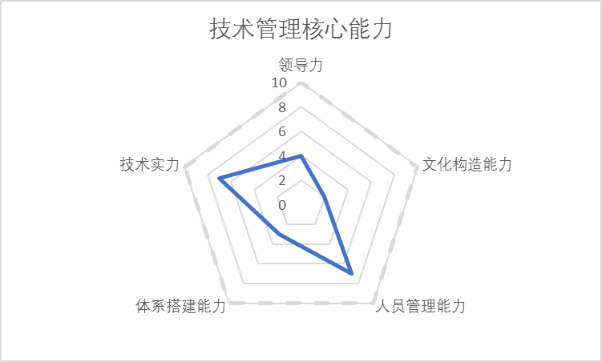
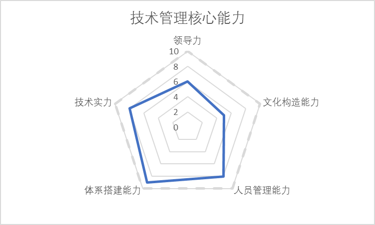
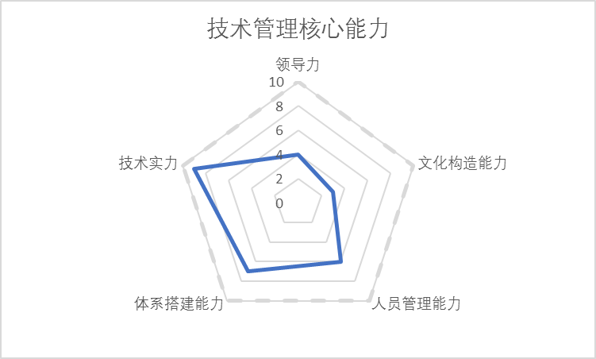
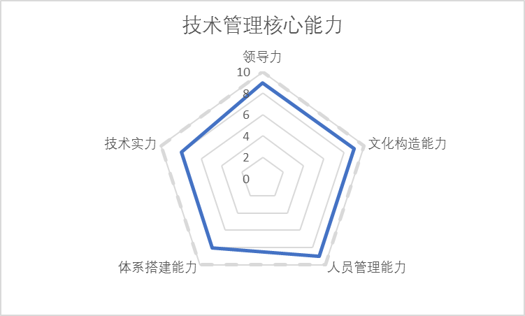

## 职业规划

技术人一般有4个职业发展路径

* 工程师到研究员到高级研究员，最后成长为科学家；
* 工程师到高级工程师到架构师再到主任架构师；
* 工程师到项目经理到经理再到部门总监；
* 工程师到产品经理到高级产品经理再到产品架构师

## 岗位能力模型

### 能力维度

#### 领导力

领导力最终是用各种各样的方法、人员、影响力、号召力、决策力将一个事情从0到1的能力，如果把事情做成0.99，都不是领导力的体现。是否对最终结果负责，这也是所有带”O”的职位和不带”O”的职位最大的差别

#### 文化构造

文化是人类群体创造并共同享有的物质实体、价值观念、意义体系和行为方式，是人类群体的整个生活状态。对应到技术管理上，就是管理者对于大家意识的影响力，小到对于整个技术团队价值观，公司技术氛围、行为方式和状态的构造和影响能力，大到对于国内技术生态甚至国际技术生态的影响力

#### 管人

人员是一个科技企业和技术团队核心最重要的资产，如何让技术人才这样特别聪明的一群人可以高效的工作，对这些聪明人如何招、识、管、留、开，是一个技术管理者的核心技能。人员管理其中不仅仅是沟通的能力，更要是对人员素质的准确判断、员工心理、团队士气、杀伐决断、上下级管理沟通的综合能力。

从发挥人员能力的角度来看，一个好的技术人才可以做到乘以1，一个优秀的总监可以做到乘以10，一个卓越的O级别人物就要做到乘以100。所以，人员管理的能力，简化来讲，就是管理者如何让人乘以100的能力。这里的人员管理，不仅仅指的是管理下级，还有管理同级和管理上级的能力，能否和其他合伙人以及CEO/COO级别紧密沟通和配合，也是一个高级管理人员是否可以成功的关键

#### 管事

体系搭建能力比较复杂，做成一个事情，不仅仅包括项目管理的能力，而且要包括从0开始建立选择项目管理方法、选择人员管理体系，然后再根据体系进行管理的能力。不同的公司，不同的阶段管理方法和体系都会发生一些变化，从项目管理、架构管理、到人员管理、体系管理，什么时间用什么样的管理方法，控制好质量、进度、节奏、人员是一个管理人员能力的体现。从具体管代码、项目，到最高层的建立一套体系取代管理人员日常的工作，体现这个管理人员的职位和公司对他的需要

#### 技术

**技术总监能力模型**

 

对于技术总监来讲，要有比较强的技术基础实力和人员管理能力，主要是要能把事情完成和落地，对于小公司来讲，如果最高职位是技术总监，那么就需要技术肌肉矩阵全面的，对于大公司，技术总监意味着单项技术肌肉比较强。无论公司大小，总监级别一般都会汇报给某个业务线VP或者技术线VP/CTO，因为他不是对最终结果负责的人。同样，领导力和体系搭建能力就没有那么强，对于文化构造能力更要弱一些，因为这个层级并不需要这些能力。

**技术VP能力模型**

 

技术VP和总监最大的差异在于体系搭建能力的增强，每一个VP会有一个或者多个总监来支撑，建立一套体系让技术研发高效的运转起来，体系搭建的能力甚至要高于CTO，因为他是CTO的大内总管。而技术实力略强于总监，领导力，文化构造能力也有所提高。VP和CTO的最大差异是是否可以对技术的最终结果负责，不仅仅是技术本身、而是在财务、战略方向上是否具有决策力，这是副手和正手之间的差距。在很多时候拍板很难，因为CTO很多时候不管是不是由你直接造成的，你都要承担所有的后果。所以技术VP一般不会直接汇报给CEO，因为CEO眼里只有0和1，不会接受任何理由。同时，公司外部文化和内部文化的构造能力也是VP和CTO的差异之一。

**首席架构师能力模型**

 

首席架构师应该是在公司里技术最全面最强的一个人，技术肌肉和公司整个技术最匹配的人员。经常有人会把首席架构师能力模型和CTO能力模型搞混，首席架构师可以是Geek一样的人物，因为他不对商业的最终结果负责，但是对技术整体架构、前瞻性，技术本身体系负责。因此，首席架构经常会把方案汇报给技术VP/CTO供选择，不会最终拍板。首席架构师的技术非常厉害，领导力和文化构造能力就会相对较弱一些。

**CTO能力模型**

 

CTO是能力矩阵里最均衡的一个，突出的能力是领导力和文化构造能力，而不是技术实力。公司小的时候，CTO可能是公司中技术最强的那个人，但是CTO必须要有能力构建一个文化和体系，迅速能让比自己技术牛的人、体系搭建能力比自己强的人融入到公司，才可以让自己到更高层次上来做决策。CTO要把控和技术相关的布局节奏、商业结果、公司战略、人才策略，并翻译成其他合伙人可以听懂的语言，来做“成”事。

CTO的技术肌肉通常要全身匀称的，因为他是公司里的技术肌肉教练，他可以肌肉不强大，但是要知道找什么样的技术肌肉团队来满足公司的需要，在赛场上赢球。同样，如果CTO只对技术着迷而对于CEO的融资策略、战略决策、业务布局，COO/CFO的公司运营、财务运作没有有效建议并对结果负责的话，CTO也很难成为公司CEO、COO、CTO三个重要O级别人物之一。所以，最终的管理的道理是相通的，如果你选择了CTO作为你的职业路径的话，其实你已经放弃了你是公司技术最强的那个人的成长路径。