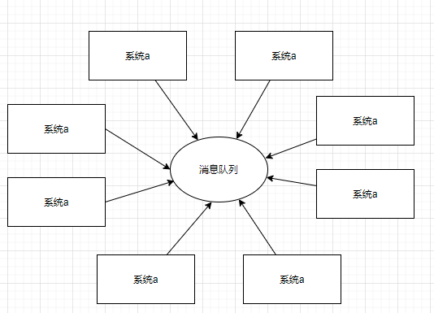
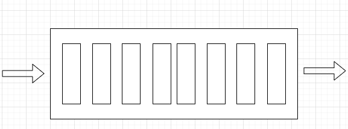
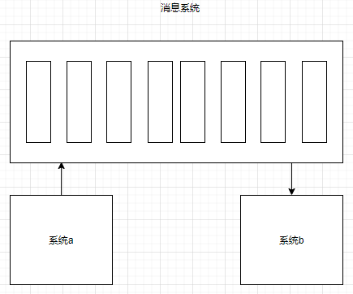
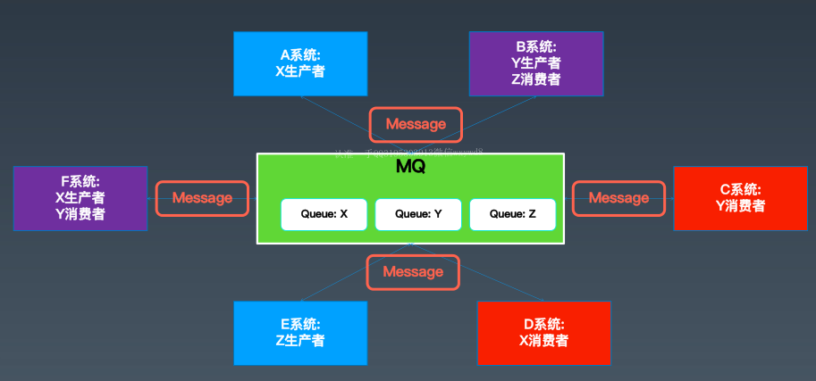
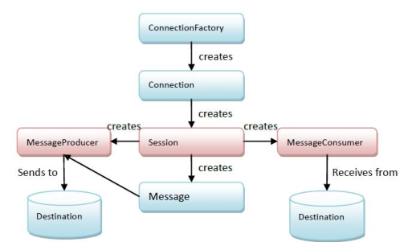
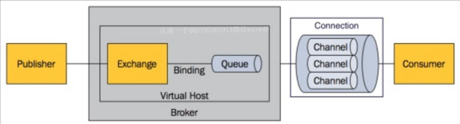
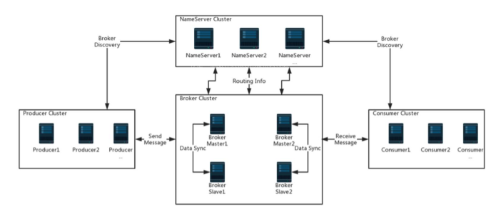
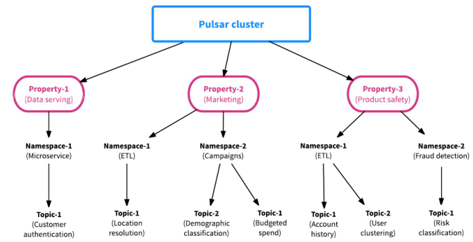
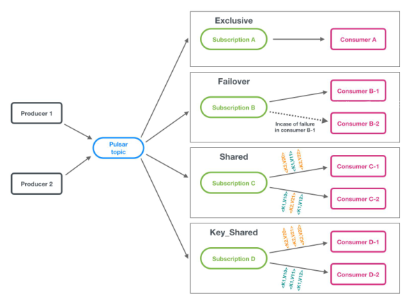
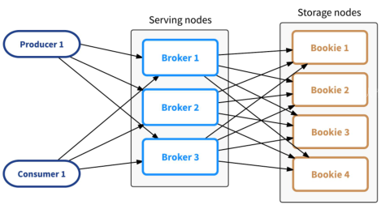

## 1. 进程通讯
### 1.1. 系统间有哪些通讯手段
* 文件  
  文件控制不方便，失效不高
* 共享内存  
  跨服务失效，不方便管理
* Rpc  
  同步的，会导致调用比较复杂
* 数据库  
  使用数据库不实时，也不是专业做通讯的
* Socket  
  实现复杂，同步的
* linux提供了ipc通讯函数  

### 1.2. 优秀的系统通讯方式？
* 可以实现异步
* 调用简单
* 可以缓冲大量的调用
* 可靠不丢失
* 保证调用的顺序
  
### 1.3. 消息队列

## 2. 消息队列
### 2.1. 内存队列  

### 2.2. 消息系统  
  
### 2.3. 消息服务  
  

### 2.4. 消息队列的优势
* 异步通讯，减少等待
* 系统间解耦，降低依赖，即使目标系统挂了，也可以保证目标启动后，可以处理之前的业务
* 消峰，缓冲业务
* 消息可靠不丢失，顺序保证。

## 3. 消息通用概念
### 3.1. 消息模式
* 就像quene一样，接收者拿到了消息就没有了，消费一次
* 基于topic，多个订阅者都可以拿到同样的消息
### 3.2. 消息可靠性
* 至多一次，可能会丢失
* 至少一次，有可能会重复发送，需要下游处理幂等    
以上可以实现方案：
  * 消息可靠发送
  * 消息可靠存储
  * 消息可靠消费  
* 精准一次，有且仅会传递一次   
  实现起来很复杂
### 3.3. 消息事务  
半消息
### 3.4. 消息顺序
多个分区，就没有顺序了。
### 3.5. 消息协议  
当我们发送消息和接收消息时，需要一个协议来接收。
* Stomp，简单文本，处理速度可能不高
* Mqtt，二进制协议，主要用于服务器和那些低功耗的物联网设备（IoT）之间的通信。  
  二进制和文本的区别：二进制是直接从二进制信息解析出消息信息，而文本是先把二进制转化为文本，然后文本解析转化为消息信息，所以文本多了一步，更耗性能。
* Jms，java定义的应用层api协议  
  
* Amqp，通用的高级消息队列协议
* Xmpp
* Open message

### 3.6. 开源的消息中间件
* Activemq，第一代
* Rabbitmq，第一代
* Kafka，第二代
* Rocketmq，第二代
* Pulsar，第三代  

推荐资料：《企业集成模式》，soa、mq、esb的理论基础

## 4. ActiveMq
### 4.1. 特点
* 可靠的，事务的
* 第一代，应用范围广
* 功能全，支持的协议多
### 4.2. 功能介绍
* 客户端语言丰富
* 协议多
* 与spring结合完善
* 支持事务、xa消息
* 支持多种传送协议
* 提供jdbc等方式持久化
* 高性能集群
### 4.3. 使用场景
* 消息队列
* 消息通知
* Java应用，可以嵌入mq server  

## 5. Rabbitmq  

### 5.1. 核心概念
* Exchange
* key
### 5.2. Java中的使用

## 6. Rocketmq  

### 6.1.与kafka的区别
* 一个是纯java开发，一个是scala
* 一个用nameserver,一个使用zk
* rocketmq使用一个日志文件，不存在kafka过多的topic问题或partion的性能问题。当然kafka其实也可以配置成一个topic，然后用tag来减少文件数量，来减少性能问题。  
  
问题：为什么Kafka的分区太多或者topic太多，性能会急剧下降。
### 6.2.核心原理
* Commitlog
* consumequene
### 6.3.使用介绍

## 7. Pulsar
第三代消息中间件,计算与存储分离
### 7.1. 特性
* 支持namespace和多租户  
  
* 多种消费模式，也支持partition  
  
* 计算存储分离  
  

## 8. Epi其它手段
### 8.1. Spring integration
Spring Integration在基于Spring的应用程序中实现轻量级消息传递，并支持通过声明适配器与外部系统集成。 Spring Integration的主要目标是提供一个简单的模型来构建企业集成解决方案
### 8.2. Camel
可以实现一个消息中间件数据转移至另一个消息中间件之中。

## 9. 开发一个消息中间件
### 9.1. 内存版基础版
* 使用java的BlockingQueue作为队列的容器
* 定义topic，支持多个topic
* 定义消费者，向topic发送消息
* 定义消费者，从topic中poll消息    

缺陷：上一版本不支持消费进度跟踪
### 9.2. 内存版消费进度版
* 使用数组，实现消息确认和消费offset
* 使用指针记录消息的写入位置
* 每一个消费者都用指针记录消费位置  

缺陷：无回收机制，容易内存溢出
### 9.3. 跨服务基础版
* 将上一步的数组放在一个server
* 提供http接口
* 提供确认接口、offset等接口
* 生产者通过http访问server的数组，提交消息
* Consumer从offset拉去数据
### 9.4. 跨服务持久化版
* 消息过期、重试策略
* 批量读写、压缩
* 持久化，入口、日志、其它的存储介质
* 采用高性能网络通信如netty,rsocket
### 9.5. 健壮消息中间件版
* 兼容主流的传输协议，如jms、stomp等
* 实现消息事务机制
* 与spring结合
* 磁盘或者内存使用的优化
* 兼容其他主流技术框架
