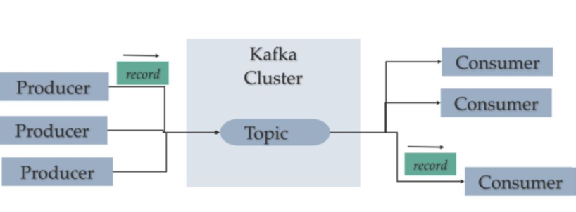
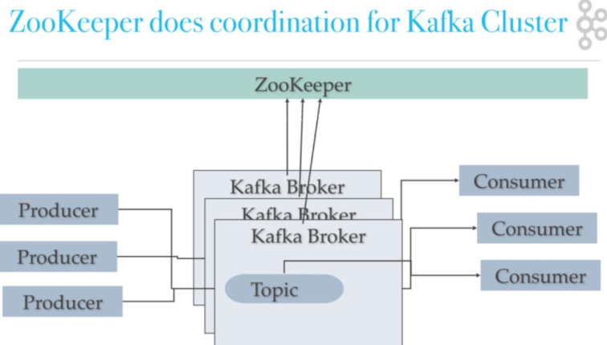
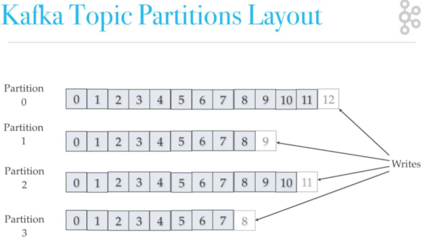
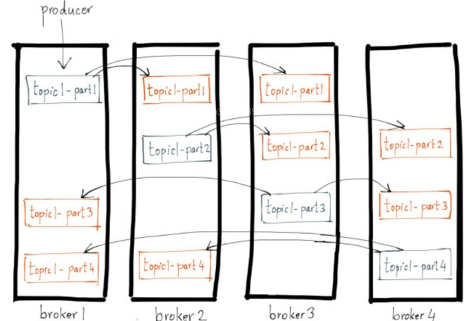
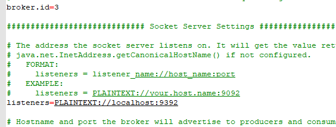
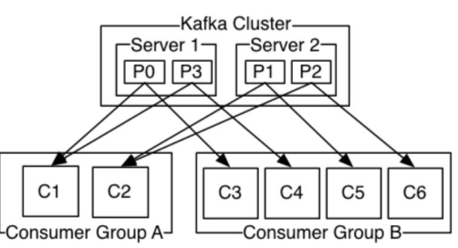

## 1.简单介绍
### 1.1. 什么是kafka
Kafka 是一种分布式的，基于发布 / 订阅的消息系统
### 1.2. 基本概念
* Broker
* Topic
* Partition
* Producer
* Consumer
* Coonsumergroup
### 1.3. 部署架构  
  
    
    

### 1.4. kafka的特性
* 以时间复杂度为 O(1) 的方式提供消息持久化能力
* 高吞吐率。即使在非常廉价的商用机器上也能做到单机支持每秒 100K 条以上消息的传输
* 支持 Kafka Server 间的消息分区，及分布式消费，同时保证每个 Partition 内的消息顺序传输
* 在线水平扩展
* 离线数据处理和实时数据处理
### 1.5. kafka应用场景

## 2. Kafka的使用
### 2.1. 单机Kafka安装
#### 1）下载kafka的安装包
https://www.apache.org/dyn/closer.cgi?path=/kafka/2.7.1/kafka_2.12-2.7.1.tgz

#### 2）修改配置，server.properties， 打开PLAINTEXT端口
#### 3）配置zk配置（依赖zookeeper）

### 2.2.数据测试
* 创建topic  
  .\kafka-topics.bat --zookeeper 10.130.36.232:2181 --create --topic mytest1 --partitions 5 --replication-factor 1

* 查看topic  
  .\kafka-topics.bat --zookeeper 10.130.36.232:2181 --list    
  或加上查看topic的具体信息--describe --topic mytest1 
* 命令行消费topic  
  .\kafka-console-consumer.bat --bootstrap-server localhost:9092 --from-beginning --topic mytest1
* 命令行生产topic  
  .\kafka-console-producer.bat --bootstrap-server localhost:9092 --topic mytest1
### 2.3. Java如何使用
### 2.4. 集群kafka的安装  

### 2.5.kafka调优
### 2.6.java中使用kafka

## 3. Kafka原理
### 3.1. 消息发送
#### 3.1.1. 流程
* 客户端序列化
* 客户端获取元数据
* 客户端做数据分区
* 服务端数据落盘
#### 3.1.2. 发送方式
* 同步发售
* 异步发送
#### 3.1.3. 可靠性
* ack=0,只发送不管有没有写入到broker
* ack=1,写入leader就成功
* ack=-1/all，写入到最小的复本数则认为成功
#### 3.1.4. 保证发送顺序
* 设置成一个连接
* 同步发送
#### 3.1.5. 发送事务
* 设置成事务模式
* 只有全部发送完成后才算完成

### 3.2. 消费端
#### 3.2.1. 消费分组

#### 3.2.2. 消费提交
* 同步提交
* 异步提交
* 自动提交

#### 3.2.3.消费offset的seek
消费端自行保存消费进度

## 4. Kafka的总结
