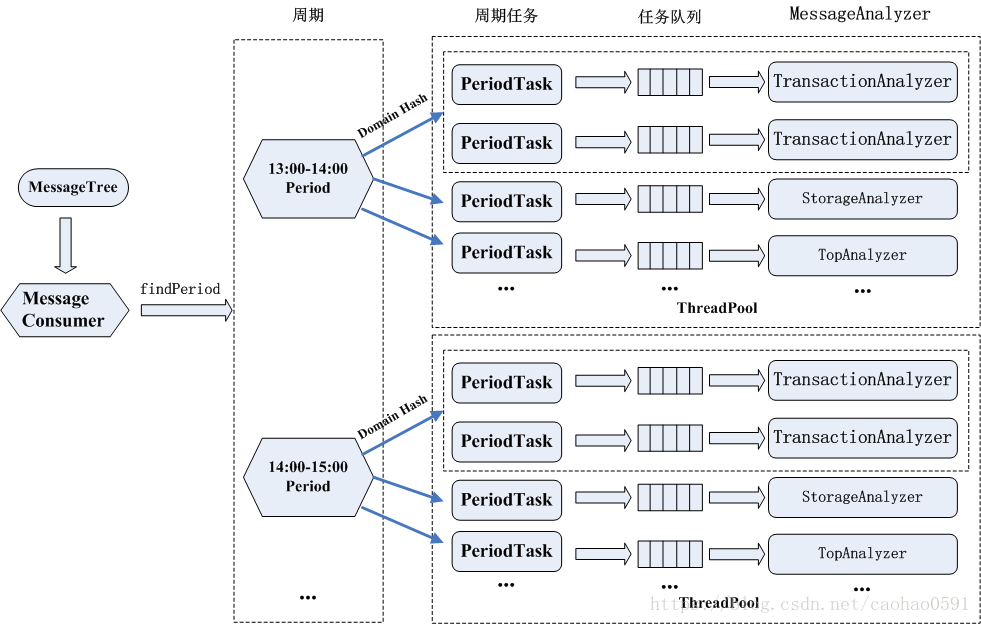

## 1. cat简介和特点
CAT系统原型和理念来源于eBay的CAL的系统， CAT系统第一代设计者吴其敏在eBay工作长达十几年，对CAL系统有深刻的理解。 CAT不仅增强了CAL系统核心模型，还添加了更丰富的报表。自2014年开源以来，CAT在携程、陆金所等多家互联网公司生产环境应用。    
* 实时性
* 可扩展/高可用
* 故障容忍
* 高吞吐
* 告警机制

## 2. 功能介绍  
参考（报表后台）  
* Transaction
* Event
* Heartbeat

## 3. 客户端机制  
### 3.1. 客户端埋点示例

### 3.2. 消息树

### 3.3. 客户端整体架构

### 3.4. 客户端组件初始化流程
  
  

### 3.5. 消息发送
context的add方法，会首先判断m_stack栈是否为空，如果是空的说明这个消息是一个单独的非事务类型消息， 直接将消息放入MessageTree然后发送到服务器。
如果m_stack 不为空，说明这个event消息处在一个事务下面，我们从m_stack 栈顶获取事务，将event消息嵌套到事务里，等待事务结束的时候一同推送到服务器。上边的案例就是这种情况。  
  
  
  
  
  
  

* 默认的队列长度为5000
* channel manager 会10 * 1000L 检查连接是否正常
* 采样会在客户端进行判断，被命中的数据汇总计算在另一个线程发送到服务端

### 3.6. 消息编码
在Java中，只要一个类实现了java.io.Serializable接口，那么它就可以被序列化。但是通过公共接口编码的字节会有很多冗余信息来保证不同对象与字节之间的正确编解码，在CAT中，需要传输的只有MessageTree这么一个对象。通过自定义的序列化方案可以节省许多不必要的字节信息，保证网络传输的高效性  
  
* 前4个字节包含整组字节串的长度，首先通过buf.writeInt(0)占位，编码完通过buf.setInt(index, count)将字节码长度写入buf头4个字节
* 编码消息树的头部，依次将tree的version, domain, hostName, ipAdress, treadGroupName, treadId, threadName, MessageId写入头部，字段之间以"\t"分隔，并以"\n"结尾。空用null表示。
* 编码消息体，每个消息都是以一个表示消息类型的字符开头：  
    * "A"表示没有嵌套其他类型消息的事务
    * 有嵌套其他消息的事务，以一个 "t" 开头，然后递归去遍历并编码子消息，最后以一个"T"结束
    * "E""H"分别表示Event/Heartbeat类型消息；然后依次记录时间、type、name。然后根据条件依次写入status、duration+us、data。字段之间依然以"\t"分割，以"\n"结尾，空用null表示

## 4. 服务端机制

### 4.1. 服务端整体机制

### 4.2. 服务端初始化

  
  
  
  

4.3.消息的分发    
    
    
    
    
&emsp;&emsp;PeriodManager的构造函数中，最核心的工作就是创建一个周期为1个小时，而且周期时间是整点时段，例如：1:00-2:00, 2:00-3:00，周期时间是报表的最小统计单元，即分析器产生的每个报表对象，都是当前周期时间内的统计信息。  
&emsp;&emsp;接下来RealtimeConsumer将会调用 m_periodManager.init() 启动第一个周期，还是上面代码，我们会计算当前时间所处的周期的开始时间，是当前时间的整点时间，比如现在是 13:50， 那么startTime=13:00，然后entTime=startTime + duration 算得结束时间为 14:00， 然后根据起始结束时间来创建 Period 对象，传入分析器的指针。并将周期对象加入到m_periods列表交给PeriodManager管理。最后调用period.start 启动第一个周期。 
* 每隔1秒钟会计算是否需要开启一个新的周期
* periodtask的队列大小为30000
### 4.4.队列消息处理（消息分析器解析）  
    
### 4.5. 报表分析器
#### 4.5.1. transactiona报表分析器
     
     
     

#### 4.5.2.problem报表分析器
   

超时调用处理器(LongExecutionProblemHandler)会计算事务执行时间，首先查看是否超过了默认阈值设置，每种调用的阈值设置都不同，分4-6个级别，如下：    
   
#### 4.5.3. 报表持久化  
周期结束之后，发起的持久化，而不是由于虚拟机关闭引起的，数据除了被持久化到文件之外，还会被持久化到数据库    
     
     
     
#### 4.5.4.原始消息分析器
DumpAnalyzer 与其它分析器有点不同，它不是为了报表而设计，而是用于原始消息LogView的存储，与报表统计不一样，他的数据量非常大，几年前美团点评每天处理消息就达到1000亿左右，大小大约100TB，单物理机高峰期每秒要处理100MB左右的流量，因为数据量比较大所以存储整体要求就是批量压缩以及随机读，采用队列化、异步化、线程池等技术来保证并发。
#### 4.5.4.1.将消息放入MessageDumper队列  
    
    

MessageDumper的初始化
    
#### 4.5.4.2.队列线程进行处理消息，放入消息块中
    
#### 4.5.4.3.消息块如果满了，将消息块放入消息块队列中
   

消息块队列初始化，并启动消息快写入线程  
   
#### 4.5.4.4.消息块如果满了，将消息块放入消息块队列中

&emsp;&emsp;函数会根据domain和客户端ip将消息均匀分配到那19个阻塞队列(LinkedBlockingQueue)中，然后会轮询从队列获取消息数据，调用函数处理。  
&emsp;&emsp;记录压缩消息块(MessageBlock)在数据文件中的起始位置，下面是具体的写逻辑，先写索引文件，CAT先获取消息块中消息总条数，为每个Message-ID都写一个索引记录，每条消息的索引记录长度都是48bits，索引根据Message-ID的第四段（序列号）来确定索引的位置，比如消息Message-ID为ShopWeb-0a010680-375030-2，这条消息ID对应的索引位置为2*48bits的位置，48bits索引包含32bits的块地址 和 16bits 的块内偏移地址，前者记录压缩消息块(MessageBlock)在数据文件中的偏移位置，由于消息块包含多条消息，我们需要16bits来记录消息在消息块中的位置，注意这里指解压后的消息块。写完索引文件再写入数据文件，每一段压缩数据，前4位都是压缩块的大小，后面才是消息块的实际数据  
  

MessageId：应用名-ip-小时数-2
  

5.待改进之处
5.1.报表分析器的线程模型
  

5.2.报表分析器前置
客户端相比服务端来说，有足够多的上下文信息，因而客户端的分析计算可能会比服务端计算简单得多。从这个例子里可以看到客户端计算的时候，它只要在你两个基本模型 Transaction、Event 埋点结束的时候多做两个统计的累加就好了。但在服务端就很麻烦，服务端需要把那棵树重新反序列化出来再去遍历它。  
  

