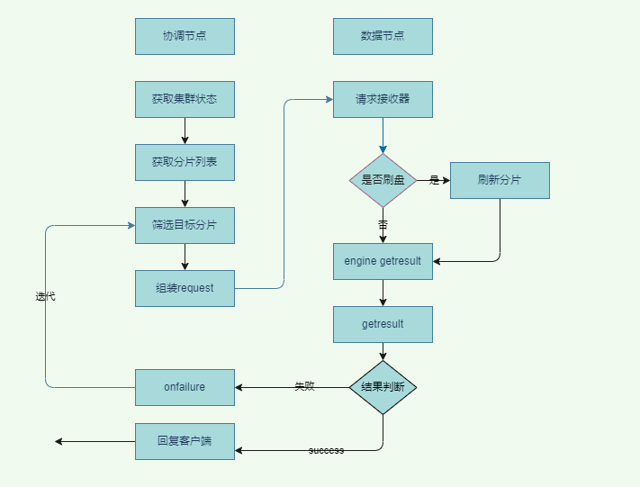
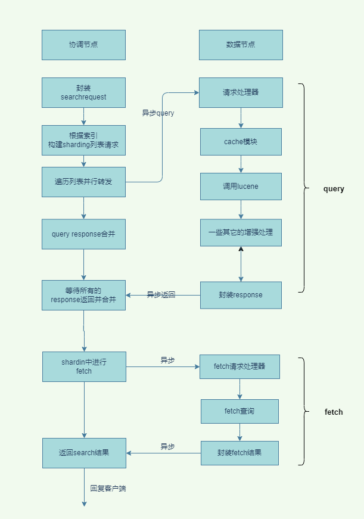

## 1. 开头
​	前面已经介绍了elasticsearch的写入流程，了解了elasticsearch写入时的分布式特性的相关原理。elasticsearch作为一款具有强大搜索功能的存储引擎，它的读取是什么样的呢？读取相比写入简单的多，但是在使用过程中有哪些需要我们注意的呢？本篇文章会进行详细的分析。
​	在前面的文章我们已经知道elasticsearch的读取分为两种GET和SEARCH。这两种操作是有一定的差异的，下面我们先对这两种核心的数据读取方式进行一一分析。

## 2. GET的流程
### 2.1 整体流程
  
图片来自官网  
以下是从主分片或者副本分片检索文档的步骤顺序：

* 客户端向 Node 1 发送获取请求

* 节点使用文档的 _id 来确定文档属于分片 0 。分片 0 的副本分片存在于所有的三个节点上。 在这种情况下，它将请求转发到 Node 2 
* Node 2 将文档返回给 Node 1 ，然后将文档返回给客户端。  

注意：

- 在处理读取请求时，协调节点在每次请求的时候都会通过轮询所有的副本分片来达到负载均衡。
- 在文档被检索时，已经被索引的文档可能已经存在于主分片上但是还没有复制到副本分片。在这种情况下，副本分片可能会报告文档不存在，但是主分片可能成功返回文档。 一旦索引请求成功返回给用户，文档在主分片和副本分片都是可用的

### 2.2. GET详细流程

 

#### 2.2.1.  协调节点处理过程

在协调节点有个http_server_worker线程池。收到读请求后它的具体过程为：  
* 收到请求，先获取集群的状态信息
* 根据路由信息计算id是在哪一个分片上
* 因为一个分片可能有多个副本分片，所以上述的计算结果是一个列表
* 调用transportServer的sendRequest方法向目标发送请求
* 上一步的方法内部会检查是否为本地node，如果是的话就不会发送到网络，否则会异步发送
* 等待数据节点回复，如果成功则返回数据给客户端，否则会重试
* 重试会发送上述列表的下一个。  

#### 2.2.2.  数据节点处理过程

数据节点上有一个get线程池。收到了请求后，处理过程为：

* 在数据节点有个shardTransporthander的messageReceived的入口专门接收协调节点发送的请求

  ```
  private class ShardTransportHandler implements TransportRequestHandler<Request> {
      @Override
      public void messageReceived(final Request request, final TransportChannel channel, Task task) {
          asyncShardOperation(request, request.internalShardId, new ChannelActionListener<>(channel, transportShardAction, request));
      }
  }
  ```

* shardOperation方法会先检查是否需要refresh，然后调用indexShard.getService().get()读取数据并存储到GetResult中。

  ```
  if (request.refresh() && !request.realtime()) {
  	indexShard.refresh("refresh_flag_get");
  }
  GetResult result = indexShard.getService().get(request.type(), request.id(), request.storedFields(), request.realtime(), request.version(), request.versionType(), request.fetchSourceContext());
  ```

* indexShard.getService().get()最终会调用GetResult getResult = innerGet(……)用来获取结果。即ShardGetService#innerGet  

  ```java
  private GetResult innerGet(String type, String id, String[] gFields, boolean realtime, long version, VersionType versionType, long ifSeqNo, long ifPrimaryTerm, FetchSourceContext fetchSourceContext) {
      	................
          Engine.GetResult get = null;
              ............
          get = indexShard.get(new Engine.Get(realtime, realtime, type, id, uidTerm).version(version).versionType(versionType).setIfSeqNo(ifSeqNo).setIfPrimaryTerm(ifPrimaryTerm));
              ..........
          if (get == null || get.exists() == false) {
              return new GetResult(shardId.getIndexName(), type, id, UNASSIGNED_SEQ_NO, UNASSIGNED_PRIMARY_TERM, -1, false, null, null, null);
          }
  
          try {
              return innerGetLoadFromStoredFields(type, id, gFields, fetchSourceContext, get, mapperService);
          } finally {
              get.close();
          }
  ```

* 上面代码的indexShard.get会最终调用org.elasticsearch.index.engine.InternalEngine#gett读取真正的数据

  ```
      public GetResult get(Get get, BiFunction<String, SearcherScope, Engine.Searcher> searcherFactory) throws EngineException {
          try (ReleasableLock ignored = readLock.acquire()) {
              ensureOpen();
              SearcherScope scope;
              if (get.realtime()) {
                  VersionValue versionValue = null;
                  try (Releasable ignore = versionMap.acquireLock(get.uid().bytes())) {
                      // we need to lock here to access the version map to do this truly in RT
                      versionValue = getVersionFromMap(get.uid().bytes());
                  }
                  if (versionValue != null) {
                      if (versionValue.isDelete()) {
                          return GetResult.NOT_EXISTS;
                      }
          。。。。。。
          //刷盘操作
           refreshIfNeeded("realtime_get", versionValue.seqNo);
  ```

  注意：get过程会加读锁。处理realtime选项，如果为true，则先判断是否有数据可以刷盘，然后调用Searcher进行读取。Searcher是对IndexSearcher的封装在早期realtime为true则会从tranlog中读取，后面只会从index的lucene读取了。即实时的数据只在lucene之中。	

* innerGetLoadFromStoredFields根据type，id，filed，source等信息过滤，并将结果放到getresult之中返回

### 2.3. 小结

* GET是根据doc id 哈希找到对应的shard的

- get请求默认是实时的，但是不同版本有差异，在5.x以前，读不到写的doc会从translog中去读取，之后改为读取不到会进行refresh到lucene中，因此现在的实时读取需要复制一定的性能损耗的代价。如果对实时性要求不高，可以请求是手动带上realtime为false


## 3. search流程  

### 3.1.  search整体流程

​	对于Search类请求，elasticsearch请求是查询lucene的Segment，前面的写入详情流程也分析了，新增的文档会定时的refresh到磁盘中，所以搜索是属于近实时的。 而且因为没有文档id，你不知道你要检索的文档在哪个分配上，需要将索引的所有的分片都去搜索下，然后汇总。   
​	elasticsearch的search一般有两个搜索类型  

* dfs_query_and_fetch，流程复杂一些，但是算分的时候使用了全局的一些指标，这样获取的结果可能更加精确一些。
* query_then_fetch，默认的搜索类型

​	所有的搜索系统一般都是两阶段查询，第一阶段查询到匹配的docID，第二阶段再查询DocID对应的完整文档，这种在Elasticsearch中称为query_then_fetch，另一种就是一阶段查询的时候就返回完整Doc，在Elasticsearch中叫query_and_fetch，一般第二种适用于只需要查询一个Shard的请求。因为这种一次请求就能将数据请求到，减少交互次数，二阶段的原因是需要多个分片聚合汇总，如果数据量太大那么会影响网络传输效率，所以第一阶段会先返回id。

​	除了上述的这两种查询外，还有一种三阶段查询的情况。搜索里面有一种算分逻辑是根据TF和DF来计算score的，而在普通的查询中，第一阶段去每个Shard中独立查询时携带条件算分都是独立的，即Shard中的TF和DF也是独立的，虽然从统计学的基础上数据量多的情况下，每一个分片的TF和DF在整体上会趋向于准确。但是总会有情况导致局部的TF和DF不准的情况出现。

​	Elasticsearch为了解决这个问题引入了DFS查询，比如DFS_query_then_fetch，它在每次查询时会先收集所有Shard中的TF和DF值，然后将这些值带入请求中，再次执行query_then_fetch，这样算分的时候TF和DF就是准确的，类似的有DFS_query_and_fetch。这种查询的优势是算分更加精准，但是效率会变差。

​	另一种选择是用BM25代替TF/DF模型。在Elasticsearch 7.x，用户没法指定DFS_query_and_fetch和query_and_fetch。

注：这两种算分的算法模型在《elasticsearch实战篇》有介绍：

​	这里query_then_fetch具体的搜索的流程图如下：    
  图片来自官网 

查询阶段包含以下三个步骤:

* 客户端发送一个 search 请求到 Node 3 ， Node 3 会创建一个大小为 from + size 的空优先队列。
* Node 3 将查询请求转发到索引的每个主分片或副本分片中。每个分片在本地执行查询并添加结果到大小为 from + size 的本地有序优先队列中。
* 每个分片返回各自优先队列中所有文档的 ID 和排序值给协调节点，也就是 Node 3 ，它合并这些值到自己的优先队列中来产生一个全局排序后的结果列表。
* 当一个搜索请求被发送到某个节点时，这个节点就变成了协调节点。 这个节点的任务是广播查询请求到所有相关分片并将它们的响应整合成全局排序后的结果集合，这个结果集合会返回给客户端。

### 3.2.  search详细流程

 

以上就是elasticsearch的search的详细流程，下面会对每一步进行进一步的说明。

#### 3.2.1. 协调节点

##### 3.2.1.1.  query阶段

协调节点处理query请求的线程池为：http_server_work

* 负责解析请求

  负责该解析功能的类为org.elasticsearch.rest.action.search.RestSearchAction

  ```
     @Override
      public RestChannelConsumer prepareRequest(final RestRequest request, final NodeClient client) throws IOException {
          SearchRequest searchRequest = new SearchRequest();
          IntConsumer setSize = size -> searchRequest.source().size(size);
          request.withContentOrSourceParamParserOrNull(parser ->
              parseSearchRequest(searchRequest, request, parser, client.getNamedWriteableRegistry(), setSize));
  			。。。。。。。。。。。。
          };
      }
  ```

  主要将restquest的参数封装成SearchRequest，这样SearchRequest请求发送给TransportSearchAction处理

* 生成目的分片列表

  将索引涉及到的shard列表或者有跨集群访问相关的shard列表合并

  ```
  private void executeSearch(...........) {
     ........
     	//本集群的列表分片列表
       localShardIterators = StreamSupport.stream(localShardRoutings.spliterator(), false)
                  .map(it -> new SearchShardIterator(
                      searchRequest.getLocalClusterAlias(), it.shardId(), it.getShardRoutings(), localIndices))
                  .collect(Collectors.toList());
      .......
      //远程集群的分片列表
     final GroupShardsIterator<SearchShardIterator> shardIterators = mergeShardsIterators(localShardIterators, remoteShardIterators);
      .......
  }
  ```

* 遍历分片发送请求

  如果有多个分片位于同一个节点，仍然会发送多次请求

  ```
  public final void run() {
          ......
          for (final SearchShardIterator iterator : toSkipShardsIts) {
              assert iterator.skip();
              skipShard(iterator);
          }
          ......
          ......
          if (shardsIts.size() > 0) {
          	//遍历分片发送请求
  			for (int i = 0; i < shardsIts.size(); i++) {
                  final SearchShardIterator shardRoutings = shardsIts.get(i);
                  assert shardRoutings.skip() == false;
                  assert shardItIndexMap.containsKey(shardRoutings);
                  int shardIndex = shardItIndexMap.get(shardRoutings);
                  //执行shard请求
                  performPhaseOnShard(shardIndex, shardRoutings, shardRoutings.nextOrNull());
              }
          ......
  ```

  shardsIts为搜索涉及的所有分片，而shardRoutings.nextOrNull()会从分片的所有副本分片选出一个分片来请求。

  

* 收集和合并请求

  ​	onShardSuccess对收集到的结果进行合并，这里需要检查所有的请求是否都已经有了回复。然后才会判断要不要进行executeNextPhase

  ```
      private void onShardResultConsumed(Result result, SearchShardIterator shardIt) {
          successfulOps.incrementAndGet();
          AtomicArray<ShardSearchFailure> shardFailures = this.shardFailures.get();
          if (shardFailures != null) {
              shardFailures.set(result.getShardIndex(), null);
          }
          successfulShardExecution(shardIt);
      }
  ```

  ```
      private void successfulShardExecution(SearchShardIterator shardsIt) {
  		......
  		//计数器累加
          final int xTotalOps = totalOps.addAndGet(remainingOpsOnIterator);
          //是不是所有分都已经回复，然后调用onPhaseDone();
          if (xTotalOps == expectedTotalOps) {
              onPhaseDone();
          } else if (xTotalOps > expectedTotalOps) {
              throw new AssertionError("unexpected higher total ops [" + xTotalOps + "] compared to expected [" + expectedTotalOps + "]",
                  new SearchPhaseExecutionException(getName(), "Shard failures", null, buildShardFailures()));
          }
      }
  ```

  当返回结果的分片数等于预期的总分片数时，协调节点会进入当前Phase的结束处理，启动下一个阶段Fetch Phase的执行。

  onPhaseDone()会executeNextPhase来执行下一个阶段

##### 3.2.1.2. fetch阶段

当触发了executeNextPhase方法将触发fetch阶段

* 发送fetch请求

  上一步的executeNextPhase方法触发Fetch阶段，Fetch阶段的起点为FetchSearchPhase#innerRun函数，从查询阶段的shard列表中遍历，跳过查询结果为空的 shard。其中也会封装一些分页信息的数据。

  ```
  private void executeFetch(....){
  		//发送请求
  	   context.getSearchTransport().sendExecuteFetch(connection, fetchSearchRequest, context.getTask(),
              new SearchActionListener<FetchSearchResult>(shardTarget, shardIndex) {
              	//处理成功的消息
                  @Override
                  public void innerOnResponse(FetchSearchResult result) {
                      try {
                          progressListener.notifyFetchResult(shardIndex);
                          counter.onResult(result);
                      } catch (Exception e) {
                          context.onPhaseFailure(FetchSearchPhase.this, "", e);
                      }
                  }
  				//处理失败的消息
                  @Override
                  public void onFailure(Exception e) {
  					........
                  }
              });
  }
  ```

* 收集结果

  使用了countDown多线程工具，fetchResults存储某个分片的结果，每收到一个shard的数据就countDoun一下，当都完毕后，触发finishPhase。接着会进行下一步

  CountedCollector:

  ```
    final CountedCollector<FetchSearchResult> counter = new CountedCollector<>(fetchResults, docIdsToLoad.length, finishPhase, context);
  ```

  finishPhase:

  ```
  final Runnable finishPhase = ()
      -> moveToNextPhase(searchPhaseController, queryResults, reducedQueryPhase, queryAndFetchOptimization ?
      queryResults : fetchResults.getAtomicArray());
  ```

* 执行字段聚合

  执行字段折叠功能，有兴趣可以研究下。即ExpandSearchPhase模块。

  ES 5.3版本以后支持的Field Collapsing查询。通过该类查询可以轻松实现按Field值进行分类，每个分类获取排名前N的文档。如在菜单行为日志中按菜单名称（用户管理、角色管理等）分类，获取每个菜单排名点击数前十的员工。用户也可以按Field进行Aggregation实现类似功能，但Field Collapsing会更易用、高效。

* 回复客户端

  ExpandSearchPhase执行完了，就返回给客户端结果了

  ```
   context.sendSearchResponse(searchResponse, queryResults);
  ```

#### 3.2.2. 数据节点

处理数据节点请求的线程池为：search，根据前面的两个阶段，数据节点主要处理协调节点的两类请求：query和fetch

* 响应query请求

  这里响应的请求就是第一阶段的query请求

  ```
  transportService.registerRequestHandler(QUERY_ACTION_NAME, ThreadPool.Names.SAME, ShardSearchRequest::new,
              (request, channel, task) -> {
              	//执行查询
                  searchService.executeQueryPhase(request, keepStatesInContext(channel.getVersion()), (SearchShardTask) task,
                  //注册结果监听器
                      new ChannelActionListener<>(channel, QUERY_ACTION_NAME, request));
              });
  ```

  executeQueryPhase:

  ```
    public void executeQueryPhase(ShardSearchRequest request, boolean keepStatesInContext,
                                    SearchShardTask task, ActionListener<SearchPhaseResult> listener) {
       ...........
          final IndexShard shard = getShard(request);
          rewriteAndFetchShardRequest(shard, request, new ActionListener<ShardSearchRequest>() {
              @Override
              public void onResponse(ShardSearchRequest orig) {
                	.......
                  //执行真正的请求
                  runAsync(getExecutor(shard), () -> executeQueryPhase(orig, task, keepStatesInContext), listener);
              }
  
              @Override
              public void onFailure(Exception exc) {
                  listener.onFailure(exc);
              }
          });
      }
      
  ```
  
  executeQueryPhase会执行loadOrExecuteQueryPhase方法
  
  ```
  private void loadOrExecuteQueryPhase(final ShardSearchRequest request, final SearchContext context) throws Exception {
          final boolean canCache = indicesService.canCache(request, context);
          context.getQueryShardContext().freezeContext();
          if (canCache) {
              indicesService.loadIntoContext(request, context, queryPhase);
          } else {
              queryPhase.execute(context);
          }
      }
  ```
  
  这里判断是否从缓存查询，默认启用缓存，缓存的算法默认为LRU，即删除最近最少使用的数据，
  
  如果不启用缓存则会执行queryPhase.execute(context);

  底层调用lucene进行检索，并且进行聚合

  ```
    public void execute(SearchContext searchContext) throws QueryPhaseExecutionException {
          .......
          //聚合预处理
          aggregationPhase.preProcess(searchContext);
          .......
         	//全文检索并打分
          rescorePhase.execute(searchContext);
          .......
           //自动补全和纠错
          suggestPhase.execute(searchContext);
          //实现聚合
          aggregationPhase.execute(searchContext);
  		.......
  		
      }
  ```
  
  关键点：

  * 慢查询日志中的query日志统计时间就是该步骤的时间
  * 聚合lucene的操作也是在本阶段完成，
  * 查询的时候会使用lRU缓存，缓存为节点级别的
  
* 响应fetch请求

  ```
  transportService.registerRequestHandler(FETCH_ID_ACTION_NAME, ThreadPool.Names.SAME, true, true, ShardFetchSearchRequest::new,
              (request, channel, task) -> {
                  searchService.executeFetchPhase(request, (SearchShardTask) task,
                      new ChannelActionListener<>(channel, FETCH_ID_ACTION_NAME, request));
              });
  ```

  * 执行fetch
    * 调用fetchPhase的execute方法获取doc
  * 将结果封装到FetchSearchResult，调用网络组件发送到response

### 3.3. 小结

* search是比较耗费资源的，它需要遍历相关的所有分片，每个分片可能有多个lucene段，那么每个段都会遍历一下，因此elasticsearch的常见优化策略就是将段进行合并
* 分页查询的时候，即使是查后面几页，也会将前几页的数据聚合进行分页，因此非常耗费内存，对于这种有深度分页的需求可能要寻找其它的解决方式。

## 4. 总结

elasticsearch查询分为两类，一类为GET，另一类为SEARCH。它们使用场景不同。

* 如果对是实时性要求不高，可以GET查询时不要刷新来提升性能。
* GET读取一个分片失败后，会尝试从其它分片读取
* 慢query日志是统计数据节点接收到了query请求后的耗时日志

* 每次分页的请求都是一次重新搜索的过程，而不是从第一次搜索的结果中获取，这样深度分页会比较耗费内存。这样也符合常见使用场景，因为基本只看前几页，很少深度分页；如果确实有需要，可以采用scoll的方式。
* 搜索需要遍历分片所有的Lucene分段，段的合并会对查询性能有好处。
* 聚会操作在lucene检索完毕后elasticsearch实现的

本文主要分析了elasticsearch分布式查询主体流程，并未对lucene部分进行分析，有兴趣的可以自行查找相关资料。
