##  1. 开头

​	lucene的核心在于如何快速的依据**查询词**快速的查找到所有的相关文档。那么如何设计一个快速的定位到词典的数据结构呢？

​	前面已经文章中已经出初步说了，当词的量很大时，检索这些词也是非常费劲，首先可以想到将词排序，然后二分法查找，但是词是海量的话，随机io依然很多，为了提升效率，可以使用term index来查找词。elasticsearch使用trie（单词查找）树。这个单词前缀的树结构在内存之中，不像mysql的b+树需要和磁盘多次io操作。所以在磁盘中就可以根据索引树查找到最终数据存在哪一个磁盘块中，然后直接到那块磁盘中查找对应的倒排列表。

​	实际上lucene采用了FST变种的trie树，既能前缀匹配也能后缀匹配，而且大大节省了空间。如果多字段联合检索，获取到了多个倒排列表，需要对它们的文档id取交集，lucene使用Skip List或者bitset的方式计算交集，有兴趣的朋友可以去查阅相关资料了解具体的过程。

### 1.1. trie树

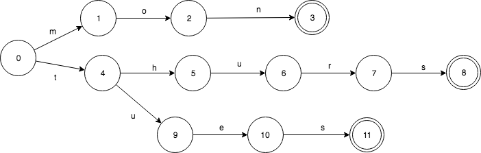 

trie树只共享了前缀。TRIE有重复的3个final状态3，8，11. 而8，11都是s转移，是可以合并的。

构建一个TRIE树是相当简单的。插入1个key，只需要做简单的查找就可以了。如果输入先结束，那么当前状态设置为final；如果无法转移了，那么就直接创建新的转移和状态。不要忘了最后一个创建的状态设置为final就可以了。es的词典有很多，显然全部加入内存将会占用大量空间。性能不能保证。

## 2. FST

### 2.1. FSM

为了了解fst，我们需要先分析下FSM(Finite State Machines)有限状态机。FSM的定义：

​	**表示有限个状态（State）集合以及这些状态之间转移和动作的数学模型。其中一个状态被标记为开始状态，0个或更多的状态被标记为final状态。**一个FSM同一时间只处于1个状态。FSM很通用，可以用来表示多种处理过程.

### 2.2. FSA

​	Ordered Sets是一个有序集合。通常一个有序集合可以用二叉树、B树实现。无序的集合使用hash table来实现. 这里，我们用一个**确定无环有限状态接收机（Deterministric acyclic finite state acceptor, FSA）**来实现

FSA是一个FSM(有限状态机)的一种，特性如下:

- 确定：意味着指定任何一个状态，只可能最多有一个转移可以访问到。
- 无环： 不可能重复遍历同一个状态
- 接收机：有限状态机只“接受”特定的输入序列，并终止于final状态

#### 2.2.1. 查询

 

查询这个FSA是否包含“jul”的时候，按字符依序输入。

- 输入j，FSA从0->1
- 输入u, FSA从1->2
- 输入l，FSA从2->3

#### 2.2.2. 添加不同元素

往FSA里再加一个key. FSA此时包含keys:”jul”和“mar

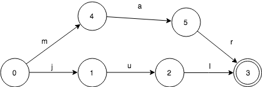 

 **final状态是“jul”和“mar”共享的。这使得我们能用更少的空间来表示更多的信息**

#### 2.2.3. 添加前缀元素

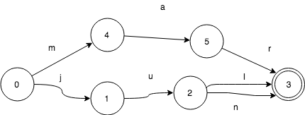 

* 当我们在这个FSA里加入“jun”，那么它和“jul”有共同的前缀“ju"
* 变化很小，没有增加新的状态，只是多了一个转移而已

#### 2.2.3. 添加更复杂元素

 

#### 2.2.4. 复杂度分析

对于2.2.3. 中的遍历所有元素的顺序为

- 初始状态0， key=””
- ->1, key=”j”
- ->2, key=”ju”
- ->3, key=”jul”, 找到jul
- 2<-, key=”ju”
- ->3, key=”jun”, 找到jun
- 2<-, key=”ju”
- 1<-, key=”j”
- 0<-, key=””
- ->4, key=”m”
- ->5, key=”ma”,
- ->3, key=”mar”,找到mar

这个算法时间复杂度O(n),n是集合里所有的key的大小, 空间复杂度O(k),k是结合内最长的key字段length。

### 2.3. FST介绍

上面的是fsa，只能说节省了空间，但是没有单词对应的值，而这个Ordered maps就像一个普通的map，只不过它的key是有序的，它有对应的值。我们来看一下如何使用**确定无环状态转换器（Deterministic acyclic finite state transducer， FST）**来实现它。

FST是也一个有限状态机（FSM）,具有这样的特性：

- 确定：意味着指定任何一个状态，只可能最多有一个转移可以遍历到。
- 无环： 不可能重复遍历同一个状态
- transducer：接收特定的序列，终止于final状态，同时会**输出一个值**

FST和FSA很像，给定一个key除了能回答是否存在，还能输出一个**关联的值**。下面来看这样的一个输入：“jul:7”, 7是jul关联的值，就像是一个map的entry。

#### 2.3.1. 简单查询

 

除了第一个0->1的转换j关联了一个值7. 其他的转换u和l,**默认关联**的值是**0**,这里不予展现。

那么当我们查找key:”jul”的时候，大概流程如下：

- 初始状态0
- 输入j, FST从0->1， value=7
- 输入u, FST从1->2， value=7+0
- 输入l，FST从2->3, value=7+0+0

此时，FST处于final状态3，所以存在jul，并且给出output是7

#### 2.3.2. 独立添加

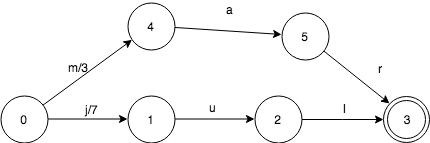 

加入mar:3之后的样子。

**需要注意**的是mar自带的值3放在了第1个转移上。这只是为了算法更简单而已，事实上，可以放在其他转移上

#### 2.3.3. 前缀添加

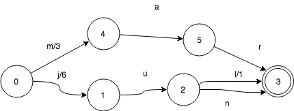 

继续加入jun:6，这个是共享前缀添加的：

**jun和jul共享状态3， 但是有一些变化。**

- 0->1转移，输出从7变成了6
- 2->3转移，输入l，输出值变成了1

这个输出变化是很重要的，因为他改变了查找jul输出值的过程：

- 初始状态0
- 输入j, FST从0->1， value=6
- 输入u， FST从1->2， value=6+0
- 输入l，FST从2->3, value=6+0+1

最终的值仍旧是7，但是走的路径却是不一样的。
那查找jun是不是也是正确的呢？

- 初始状态0
- 输入j, FST从0 -> 1， value=6
- 输入u，FST从1 -> 2， value=6+0
- 输入n，FST从2 -> 3, value=6+0+0

从上可知，jun的查询也是正确的。FST保证了不同的转移有**唯一**的值，但同时也复用了大部分的数据结构。

实现共享状态的**关键点**是：每一个key,都在FST中对应一个唯一的路径。因此，对于任何一个特定的key，总会有一些value的转移组合使得路径是唯一的。我们需要做的就是如何来在转移中**分配**这些组合

key输出的共享机制同样适用于共同前缀和共同后缀。比如我们有tuesday:3和thursday:5这样的FST:

 

2个key有共同的前缀**t**，共同后缀**sday**。关联的2个value同样有共同的前缀。3可以写做**3+0**，而5可以写作：**3+2**。 这样很好的让实现了关联value的共享。

上面的这个例子，其实有点简单化，并且局限。假如这些关联的value并不是int呢？ 实际上，FST对于关联value(outputs)的类型是要求必须有以下操作（method）的。

- 加（Addition）
- 减 (Subtraction)
- 取前缀 (对于整数来说，就是min)

#### 2.3.4. FST树构建过程

​	一直没有提到如何构建FST。构建相对于遍历来说，还是有些复杂的。
​	为了简单化，我们假设set或者map里的数据是按字典序加入的。这个假设是很沉重的限制，不过我们会讲如何来缓解它。为了构建FSM，我们先来看看TRIE树是如何构建的。

​	构建FST在很大程度上和构建FSA是一样的，主要的不同点是，怎么样在转移上**放置和共享outputs**

​	这里举例mon,tues和thurs，并给他们关联相应的星期数值2，3和5.如下：

* 第1个key, mon:2开始

  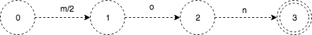 

  虚线代表，在后续的insert过程中，FST可能有变化。这里只是把2放在了第1个转移上。技术上说，放到其它的位置分配也是正确的。只不过，把output放在靠近start状态的算法更容易写而已

* 下面继续把thurs:5插入

  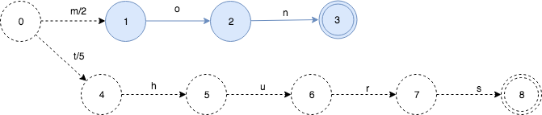 

  就像FSA的insert一样，插入thurs之后，我们可以知道FST的mon部分（蓝色）就不会再变了。

  由于mon和thurs没有共同的前缀，只是简单的2个map中的key. 所以他们的output value可以直接放置在start状态的第1个转移上

* 继续插入tues:3

   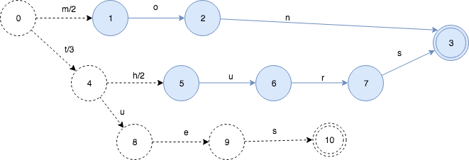 

  这引起了新的变化。有一部分被**冻住**了，并且知道以后不会再修改了。output value也出现了重新的分配。因为tues的output是3，并且tues和thurs有共同的前缀t, 所以5和3的prefix操作得出的结果就是3. 状态0->状态4的value被分配为3，状态4->状态5设置为2

* 再插入更多的key, 这次插入tye:99

  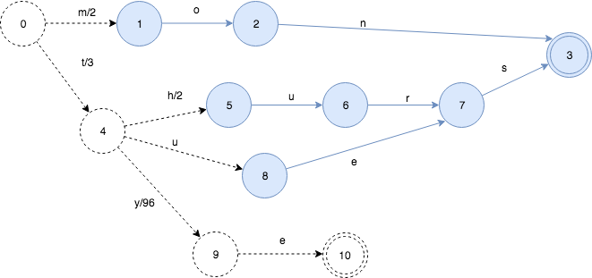 

**最终的FST的样子：**

 

### 2.4. lucene的fst树

#### 2.4.1. 源码分析

Lucene关于FST相关的代码在package:`org.apache.lucene.util.fst`。

从`org.apache.lucene.util.fst.Builder`看起，这个是构建FST的Builder：

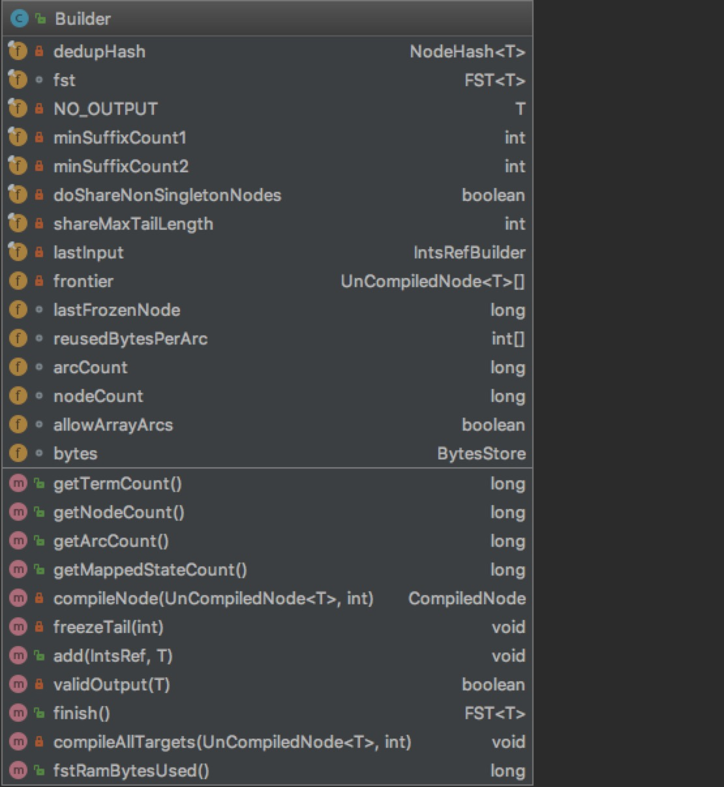 

Builder通过泛型T，从而可以构建包含不同类型的FST。我们重点关注属性。

从其中插入数据`add()`方法看起：

```
/** Add the next input/output pair.  The provided input
   *  must be sorted after the previous one according to
   *  {@link IntsRef#compareTo}.  It's also OK to add the same
   *  input twice in a row with different outputs, as long
   *  as {@link Outputs} implements the {@link Outputs#merge}
   *  method. Note that input is fully consumed after this
   *  method is returned (so caller is free to reuse), but
   *  output is not.  So if your outputs are changeable (eg
   *  {@link ByteSequenceOutputs} or {@link
   *  IntSequenceOutputs}) then you cannot reuse across
   *  calls. */
  public void add(IntsRef input, T output) throws IOException {

    ...
    // prefixLenPlus1是计算出input和lastInput具有公共前缀的位置
    final int prefixLenPlus1 = pos1+1;

     // 1.新插入的节点放到frontier数组，UnCompileNode表明是新插入的，以后还可能会变化，还未放入FST内。
    if (frontier.length < input.length+1) {
      final UnCompiledNode<T>[] next = ArrayUtil.grow(frontier, input.length+1);
      for(int idx=frontier.length;idx<next.length;idx++) {
        next[idx] = new UnCompiledNode<>(this, idx);
      }
      frontier = next;
    }

    // minimize/compile states from previous input's
    // orphan'd suffix

    // 2.从prefixLenPlus1, 进行freeze冰冻操作, 添加并构建最小FST
    freezeTail(prefixLenPlus1);

    // init tail states for current input
    // 3.将当前input剩下的部分插入，构建arc转移（前缀是共用的，不用添加新的状态）。
    for(int idx=prefixLenPlus1;idx<=input.length;idx++) {
      frontier[idx-1].addArc(input.ints[input.offset + idx - 1],
                             frontier[idx]);
      frontier[idx].inputCount++;
    }

    final UnCompiledNode<T> lastNode = frontier[input.length];
    if (lastInput.length() != input.length || prefixLenPlus1 != input.length + 1) {
      lastNode.isFinal = true;
      lastNode.output = NO_OUTPUT;
    }

    // push conflicting outputs forward, only as far as
    // needed
    // 4.如果有冲突的话，重新分配output值
    for(int idx=1;idx<prefixLenPlus1;idx++) {
      final UnCompiledNode<T> node = frontier[idx];
      final UnCompiledNode<T> parentNode = frontier[idx-1];

      final T lastOutput = parentNode.getLastOutput(input.ints[input.offset + idx - 1]);
      assert validOutput(lastOutput);

      final T commonOutputPrefix;
      final T wordSuffix;

      if (lastOutput != NO_OUTPUT) {
        // 使用common方法，计算output的共同前缀
        commonOutputPrefix = fst.outputs.common(output, lastOutput);
        assert validOutput(commonOutputPrefix);
        // 使用subtract方法，计算重新分配的output
        wordSuffix = fst.outputs.subtract(lastOutput, commonOutputPrefix);
        assert validOutput(wordSuffix);
        parentNode.setLastOutput(input.ints[input.offset + idx - 1], commonOutputPrefix);
        node.prependOutput(wordSuffix);
      } else {
        commonOutputPrefix = wordSuffix = NO_OUTPUT;
      }
      output = fst.outputs.subtract(output, commonOutputPrefix);
      assert validOutput(output);
    }

    ...
  }
```

通过注释，我们看到input是经过排序的，也就是ordered。否则生成的就不是最小的FST。另外如果NO_OUTPUT就退化为FSA了，不用执行第4步重新分配output了。

其中`freezeTail` 方法就是将不再变化的部分进行冰冻，又叫compile，把UnCompileNode，给构建进FST里。进入到FST是先进行compileNode, 然后addNode进去的。

总结以下，加入节点过程：

- 1)新插入input放入frontier，这里还没有加入FST
- 2)依据当前input, 对上次插入数据进行freezeTail操作, 放入FST内
- 3)构建input的转移（Arc）关系
- 4)解决Output冲突，重新分配output，保证路径统一(NO_OUTPUT,不执行)

最后在`finish`方法里，执行`freezeTail(0)`, 把所有的input构建进FST内。

 

其中3个method是Outputs接口定义的，有11个不同类型的实现:

- `T add(T prefix, T output);` 加
- `T subtract(T output, T inc);` 减
- `T common(T output1, T output2)` 前缀

完全满足我们上个部分的限制，可见就是基于之前算法的一个完整的实现。

除了在Term词典这块有应用，FST在整个lucene内部使用的也是很广泛的，基本把hashmap进行了替换。
场景大概有以下：

- 自动联想：suggester
- charFilter: mappingcharFilter
- 同义词过滤器
- hunspell拼写检查词典

如下为lucene构建过程图

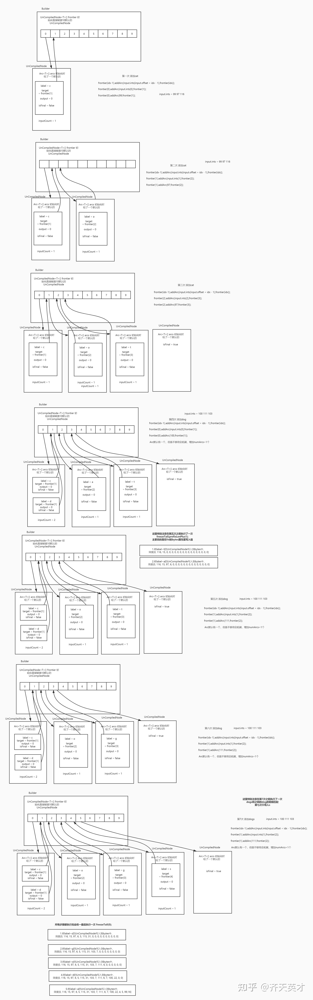 

#### 2.4.2. fst构建demo代码

```
public class FSTTest {
    public static void main(String[] args) throws Exception{
        String[] inputValues = {"mo", "moth", "pop", "star", "stop", "top"};
        long[] outputValues = {100, 91, 72, 83, 54, 55};
        PositiveIntOutputs outputs = PositiveIntOutputs.getSingleton();
        Builder<Long> builder = new Builder<>(FST.INPUT_TYPE.BYTE1, outputs);
        IntsRefBuilder scratchInts = new IntsRefBuilder();
        for (int i = 0; i < inputValues.length; i++) {
            builder.add(Util.toIntsRef(new BytesRef(inputValues[i]), scratchInts), outputValues[i]);
        }
        FST<Long> fst = builder.finish();
        byte[] current = new byte[39];
        FST.BytesReader reader = fst.getBytesReader();
        reader.setPosition(38);
        reader.readBytes(current, 0, current.length -1 );
        System.out.print("current数组中的值为：");
        for (int i = current.length - 1; i >= 0; i--) {
            byte b = current[i];
            System.out.print(b + " ");
        }
        System.out.println("");
        IntsRefFSTEnum<Long> intsRefFSTEnum = new IntsRefFSTEnum<>(fst);
        BytesRefBuilder builder1 = new BytesRefBuilder();
        while (intsRefFSTEnum.next() != null){
            IntsRefFSTEnum.InputOutput<Long> inputOutput = intsRefFSTEnum.current();
            BytesRef bytesRef = Util.toBytesRef(inputOutput.input, builder1);
            System.out.println(bytesRef.utf8ToString() + ":" + inputOutput.output);

        }
    }
}
```


## 3. 数字类型

在lucene搜索引擎里，一切都是**面向字符**的，因此数字、日期等类型是如何快速查找、区间匹配、排序的呢？

### 3.1. 排序

#### 3.1.1. 存在的问题

​	以[123，123456，222]这3个数字为例，它们是按字母序排列的，但是先后顺序显然不是我们想要的。我们期待的排序结果是[123，222，123456]

​	如果将其变成定长的字符。即转化为6位的定长字符:[000123，123456，000222]。这样我们就可以按字母序排序成[000123,000222,123456]了，符合预期

​	但是也有一些问题，比如定长的长度，取决于最大数值的长度，为了通用，这个定长可能是相当长的，比如64。这会带来一定程度空间和效率浪费

#### 3.1.2. lucene解决

Lucene针对数值类型，专门提出了一种TRIE树结构。TrieInt，TrieLong，TrieDouble

lucene对数字字符转化的代码如下：

```
public static void intToPrefixCoded(final int val, final int shift, final BytesRefBuilder bytes) {
  // ensure shift is 0..31
  if ((shift & ~0x1f) != 0) {
    throw new IllegalArgumentException("Illegal shift value, must be 0..31; got shift=" + shift);
  }
  int nChars = (((31-shift)*37)>>8) + 1;    // i/7 is the same as (i*37)>>8 for i in 0..63
  bytes.setLength(nChars+1);   // one extra for the byte that contains the shift info
  bytes.grow(LegacyNumericUtils.BUF_SIZE_LONG);  // use the max
  bytes.setByteAt(0, (byte)(SHIFT_START_INT + shift)); //SHIFT_START_INT=60
  int sortableBits = val ^ 0x80000000;
  sortableBits >>>= shift;
  while (nChars > 0) {
    // Store 7 bits per byte for compatibility
    // with UTF-8 encoding of terms
    bytes.setByteAt(nChars--, (byte)(sortableBits & 0x7f));
    sortableBits >>>= 7;
  }
}
```

 

解释：

- 符号位取反，保证了顺序性
- 7bit切分，保证一个字节char可以表示
- 定长6个字节，任何整数都可以表示

整型数字转换为`0x6008000F234A`的16进制表示，**有序**和**定长**都得到了很好的解决

### 3.2. 区间查询

​	如果想查询符合某个取值范围的所有记录，比如查询价格在25到1000之间的所有商品。

​	由于索引面向的是字符，如果要查询在符合条件的商品，那需要枚举出所有的可能。类似于这样的查询(price=25) OR (price=26) OR (…) OR (price=999) OR (price=1000)。这个查询是相当低效的，这个例子的区间还是比较小的，加入是查询1到10000000呢，这在实现上是不可能的。另外如果查询条件太多，lucene本身会报TooManyClauseError。

​	lucene构建了一下的TRIE树结构，这也是为什么叫TrieInt的原因.

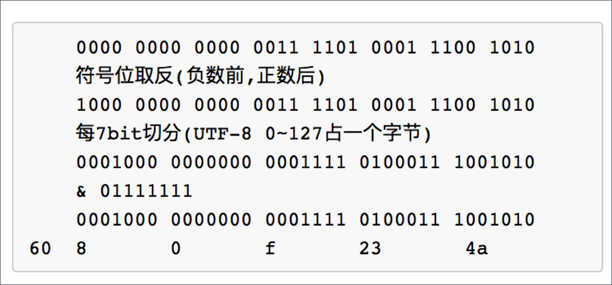 

正如方法名`intToPrefixCoded`所暗示。比如423，在索引的时候变成了4、42、423; 同理521变成了5、52、521。

当我们要查询符合[423,642]区间的数据时，我们只需要遍历TRIE树，只匹配存在图中黑色加粗标识的几个数字即可。图中即为423，44，5，63，641，642。这样查询的数量级大大的降低，也算是典型的空间换时间

## 4. lucene文件

Lucene索引在硬盘上的**表现**就是一系列的文件，后缀名不同

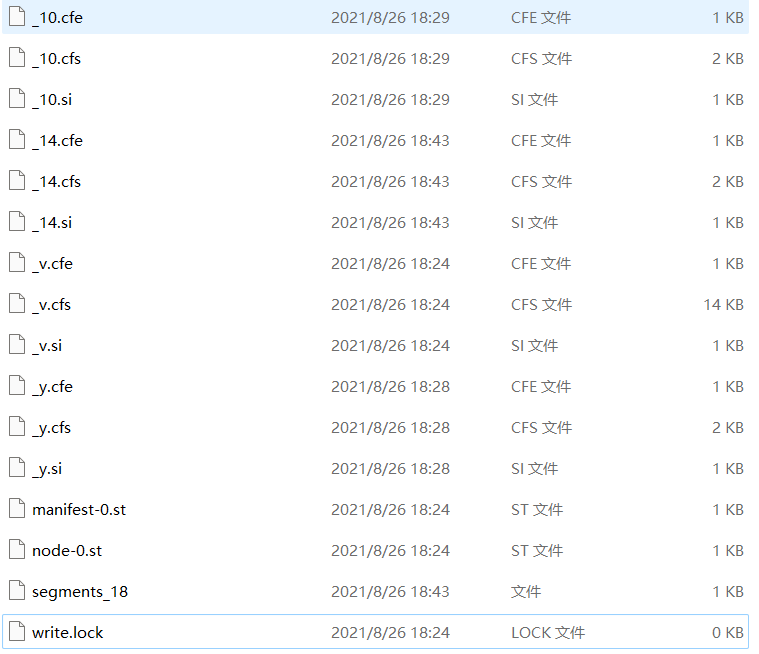  

官方地址为：https://lucene.apache.org/core/7_5_0/core/org/apache/lucene/codecs/lucene70/package-summary.html

| 名称                | 扩展名     | 简要描述                                               | 相关源码                   |
| :------------------ | :--------- | :----------------------------------------------------- | :------------------------- |
| Segment File        | segments_N | commit点信息，其中N是一个36进制表示的值                | SegmentInfos               |
| Lock File           | write.lock | 文件锁，避免多个writer同时写；默认和索引文件一个目录。 |                            |
| Segment Info        | .si        | segment的元数据信息，指明这个segment都包含哪些文件     | Lucene70SegmentInfoFormat  |
| Compound File       | .cfs, .cfe | 如果启用compound功能，会压缩索引到2个文件内            | Lucene50CompoundFormat     |
| Fields              | .fnm       | 存储有哪些Field,以及相关信息                           | Lucene60FieldInfosFormat   |
| Field Index         | .fdx       | Field数据文件的索引                                    | Lucene50StoredFieldsFormat |
| Field Data          | .fdt       | Field数据文件                                          | Lucene50StoredFieldsFormat |
| Term Dictionary     | .tim       | Term词典                                               | BlockTreeTermsWriter       |
| Term Index          | .tip       | 指向Term词典的索引                                     | BlockTreeTermsWriter       |
| Frequencies         | .doc       | 保留包含每个Term的文档列表                             | Lucene50PostingsWriter     |
| Positions           | .pos       | Term在文章中出现的位置信息                             | Lucene50PostingsWriter     |
| Payloads            | .pay       | offset偏移/payload附加信息                             | Lucene50PostingsWriter     |
| Norms               | .nvd, .nvm | .nvm保存加权因子元数据；.nvd存储加权数据               | Lucene70NormsFormat        |
| Per-Document Values | .dvd, .dvm | .dvm存文档正排元数据；.dvd存文档正排数据               | Lucene70DocValuesFormat    |
| Term Vector Index   | .tvx       | 指向tvd的offset                                        | Lucene50TermVectorsFormat  |
| Term Vector Data    | .tvd       | 存储term vector信息                                    | Lucene50TermVectorsFormat  |
| Live Documents      | .liv       | 活着的文档列表。位图形式                               | Lucene50LiveDocsFormat     |
| Point Values        | .dii, .dim | 多维数据，地理位置等信息，用于处理数值型的查询         | Lucene60PointsFormat       |

下面我们分别针对重要的文件进行较为详细的解释：

### 4.1. segments_N

表示commit点信息，其中N是一个36进制表示的值

其中N作为后缀，是36进制的数字, 实现方式为：`Long.toString(gen, Character.MAX_RADIX)`。

segments_N里通过SegName记录了这索引里**所有.si文件名**

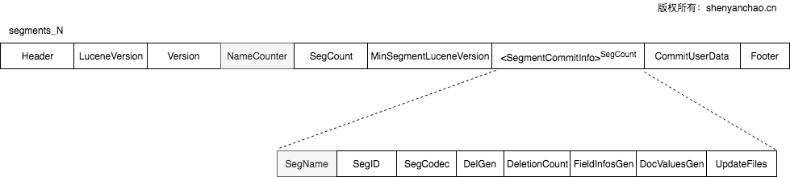 

### 4.2. segment格式（.si）

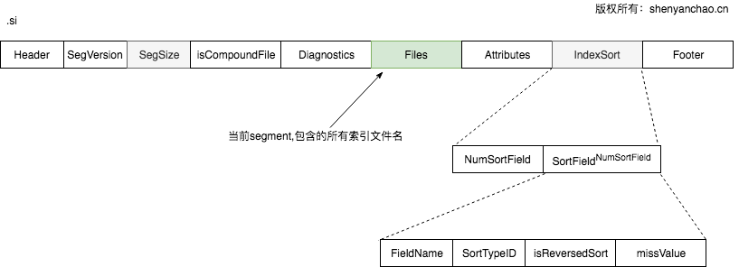 


一个segment文件，就是一个独立的子索引，其中Files是一个列表，里面存储了本segment所有相关的索引文件。即这些索引文件包含这些：

```
_8qh.dii
_8qh.dim
_8qh.fdt
_8qh.fdx
_8qh.fnm
_8qh_Lucene50_0.doc
_8qh_Lucene50_0.pos
_8qh_Lucene50_0.tim
_8qh_Lucene50_0.tip
_8qh_Lucene70_0.dvd
_8qh_Lucene70_0.dvm
_8qh.si
```

IndexSort作为新加入的一个特性，也直接体现在了.si文件里。IndexSort可以加速排序，极大提升性能

### 4.3. Field info格式（.fnm）

​	存储了Document所包含的FieldName以及Field的内部表示FieldNumber（可以理解为ID）。 同时，每个Field相关索引配置，都通过byte来存储保存下来。其中DocValueBits里，不同类型的Field, 处理DocValue数据是不一样的。

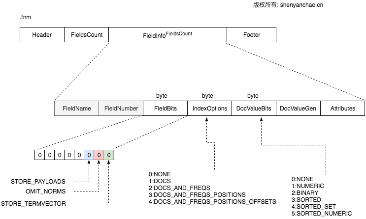 

### 4.4. Field Data格式（.fdx, .fdt）

由于fdt正排信息很多，在存到磁盘的时候，使用**LZ4算法**进行了压缩。每个Chunk大小16KB(`1<<14`), Doc个数不能超过128个。在fdx中每个Block有1024个Chunk。

CompressDocs是压缩后进行存储的，为了方便理解，可以认为就是一系列的Doc构成的。每个Doc又包含FieldNumAndType和实际的Field Value。

其中FieldNumAndType是一个VLong:  **低3位**表示Field Type, 其余**高位**用来表示FieldNumber. 可见Lucene为了最大程度的节省空间，做了很多的Trick

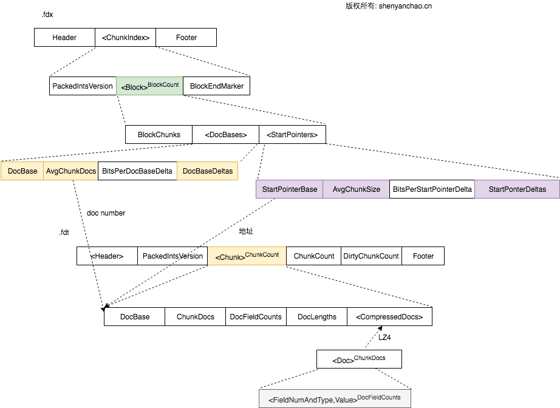 

### 4.5. Term Index格式（.tip,.tim）

格式如下：

.tip:

 Header, FSTIndex< IndexStartFP>…, DirOffset, Footer

.tim

 Header, *PostingsHeader*, NodeBlock(…), FieldSummary, DirOffset, Footer

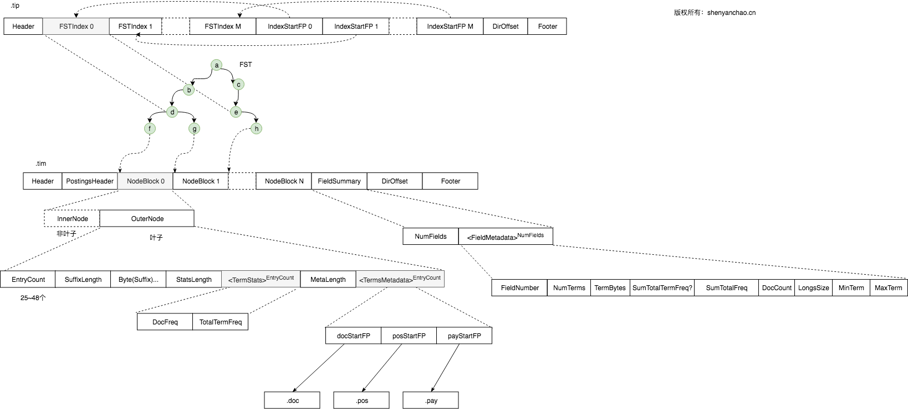 

其中FST部分，是直接加载到内存的,这里为方便理解，直接写画为类TRIE

### 4.6. Pos列表（.doc, .pos, .pay）

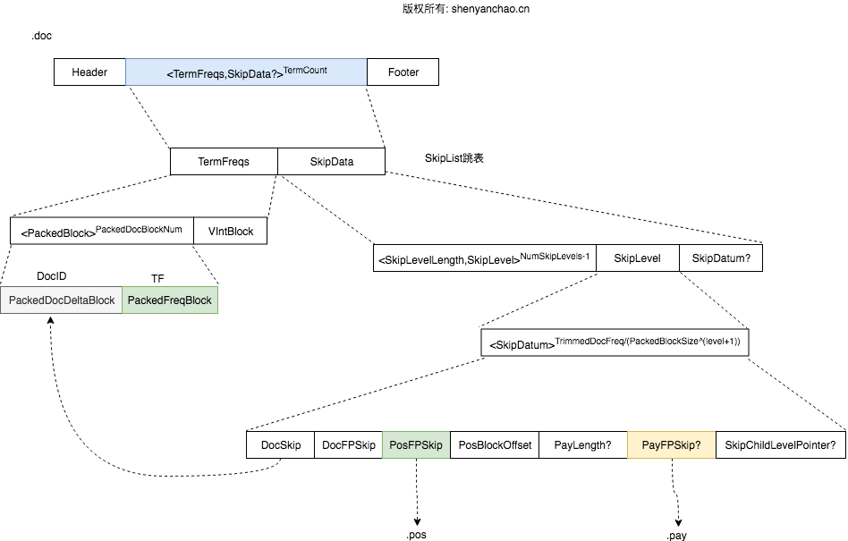 

需要注意的是，PackedBlock是对倒排列表的压缩，每128个作为一个Block，不能凑整的情况下，再按VIntBlock进行存储。无论如何存储，Block内部是存储了DocID（`PackedDocDeltaBlock`）和Term Freq(`PackedFreqBlock`)的对应关系的。

而Postings则是以SKIPLIST（跳表）进行存储的，这种存储格式保证了快速的查找和归并操作。最底层的SkipDatum通过DocSkip保有对实际doc的指针。PosFPSkip则指向.pos文件，PayFPSkip指向了.pay文件。

#### 4.6.1. pos文件格式：

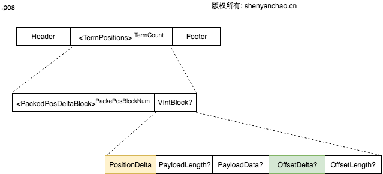 

这里的PackedPosDeltaBlock与doc文件的很像，也是进行了压缩成block进行存储。最终通过PostionDelta和OffsetDelta来获取相关的位置和偏移信息

#### 4.6.2. pay格式：

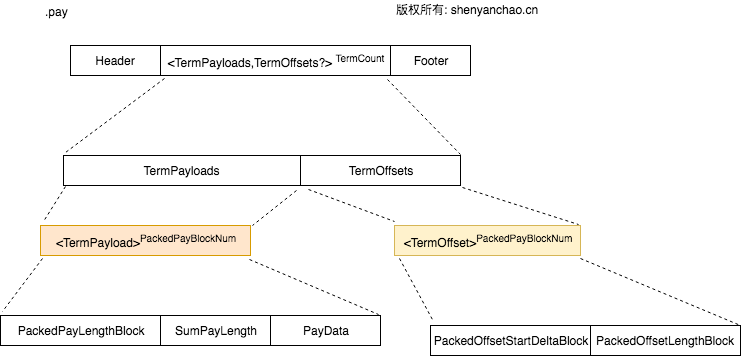 

同样做了Block处理，这个文件通过TermPayloads保留了Term和Payload的对应关系；通过TermOffsets保存了Term和Offset的对应关系

### 4.7. LIV文件格式(.liv)

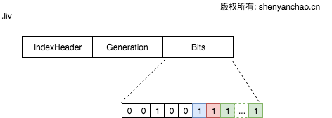 

通过FixBitSet位图，来表示哪些是存活的，哪些是被删除的。FixBitSet的底层是通过`long[]`来模拟实现这样一个大的位图的。

Lucene的4.0版本之前是通过.del文件来标记哪些DocID是被删除的，而现在则改为.liv标记哪些是存活的。功能实现其实是一样的

### 4.8. TermVector(.tvx, .tvd)

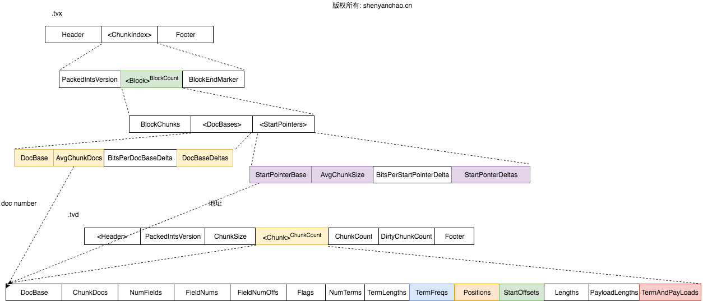 

这个格式和Field Data的很相似。区别在于最底层的Chunk直接保留了相关的信息TermFreqs、Positions、StartOffsets、TermAndPayLoads等信息。

从这里也可以看出Term Vector保存的信息很多都是和之前重复的，如果没有必要，完全可以关闭Term Vector功能，避免额外的性能损耗

### 4.9. Norms (.nvm, .nvd)

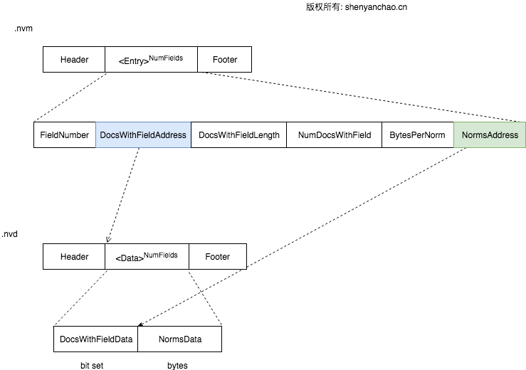 

Norms信息通常是用来存储Field\Document的Boost加权信息，然后Lucene7之后，去除了Index时的boost加权操作。因此，目前Norms里存储的东西极少，有逐步被取消的的可能性

### 4.10. Doc Values(.dvx, .dvd)

DocValues部分，比较复杂

### 4.11. Point Values(.dii，.dim)

Lucene7之后，彻底去除了之前关于数字类型索引和查找的逻辑。之前的TrieInt, TrieLong等完全被删除。取而代之的是IntPoint,LongPoint等类型。

这些类型都是由BKD-Tree来实现的，Point Value被用来实现N-Dimension多维数据的索引和快速的查询，有统一数字型查询、2D位置、3D乃至8D数据查询的趋势

### 4.12. 小结

Lucene索引及其格式，是Solr以及ElasticSearch等分布式搜索引擎的根基。Lucene每一次核心功能的迭代与性能提升都是至关重要的
